# 技术分享-硬编码导致的前台上传漏洞-先知社区

> **来源**: https://xz.aliyun.com/news/17589  
> **文章ID**: 17589

---

### 一、前言

对于用户身份校验不全面，导致的前台文件上传漏洞。分享一下挖掘过程。

​

### 二、代码分析

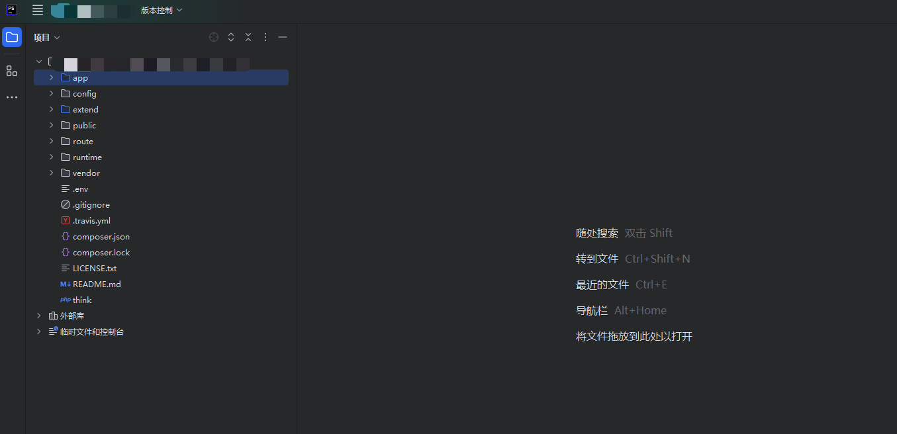

很明显的ThinkPhp架构，针对TP的路由，一般就是/index.php/cpntroller/method，这里我们可以抓一下登录的数据包，来确定一下路由。

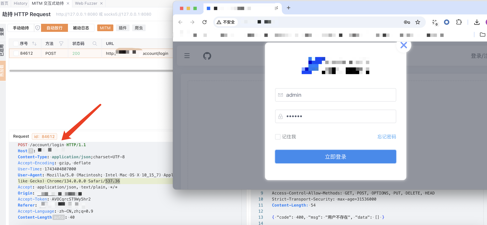

大概也就猜出来了，account控制器，login方法

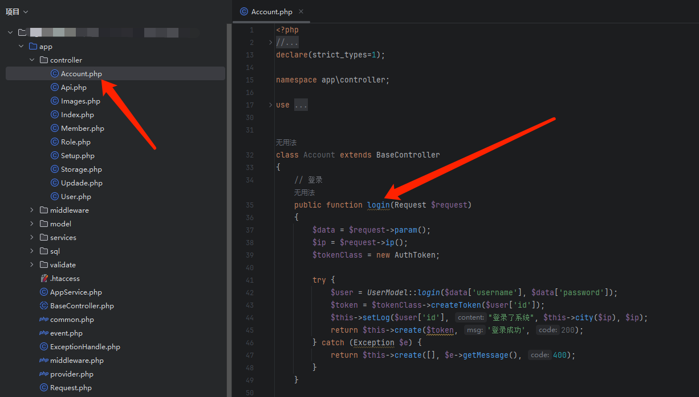

### 三、漏洞分析

漏洞文件在app/controller/Api.php文件的upload方法中

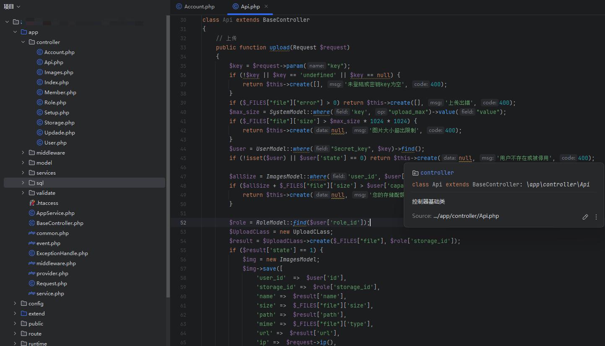

```
$key = $request->param("key");
        if (!$key || $key == 'undefined' || $key == null) {
            return $this->create([], '未登陆或密钥key为空', 400);
        }
        if ($_FILES["file"]["error"] > 0) return $this->create([], '上传出错', 400);
        $max_size = SystemModel::where('key', "upload_max")->value("value");
        if ($_FILES["file"]['size'] > $max_size * 1024 * 1024) {
            return $this->create(null, '图片大小超出限制', 400);
        }
        $user = UserModel::where("Secret_key", $key)->find();
        if (!isset($user) || $user['state'] == 0) return $this->create(null, '用户不存在或被停用', 400);


        $allSize = ImagesModel::where('user_id', $user['id'])->sum('size');
        if ($allSize + $_FILES["file"]['size'] > $user['capacity']) {
            return $this->create(null, '您的存储配额不足', 400);
        }
```

第一个if语句判断传参数key是不是为空，第二第三个if语句正常上传不会引起报错

```
$user = UserModel::where("Secret_key", $key)->find();
        if (!isset($user) || $user['state'] == 0) return $this->create(null, '用户不存在或被停用', 400);
```

第四个if语句来判断$user是否存在并且state为不为0，要是不存在并且等于0，直接退出。$user又是把key带入到sql语句查询之后的结果。

之后发现这个key是写在admin管理员下的，也就是说他这个key就是默认的值，相当于硬编码（写在数据库里的硬编码）。

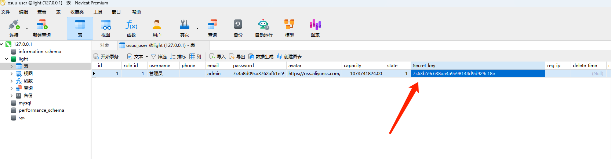

有了key我们往下走

```
$role = RoleModel::find($user['role_id']);
$UploadCLass = new UploadCLass;
$result = $UploadCLass->create($_FILES["file"], $role['storage_id']);
```

从数据库里头我们可以看到$user['role\_id']的值是1，然后实例化UploadCLass，之后调用UploadCLass类里的create方法，传入$\_FILES["file"], $role['storage\_id']，此时$role['storage\_id']的值为1000。跟进create方法。

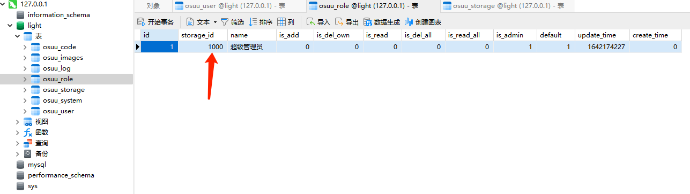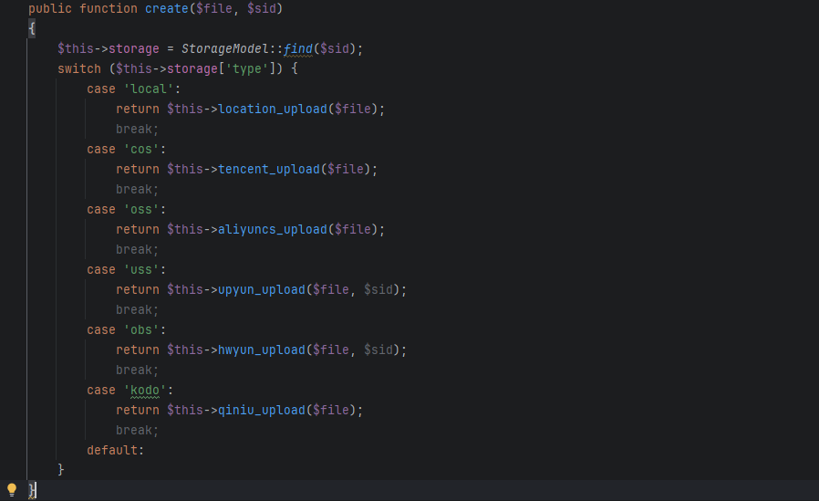

当sid的值为1000的时，查询SQL语句，$this->storage['type']的值为local

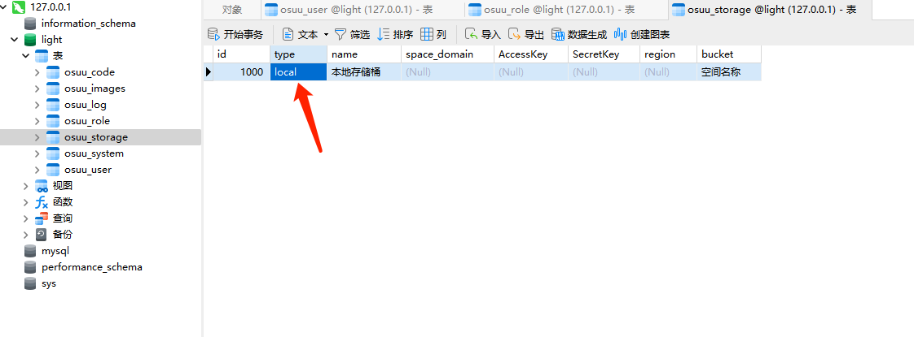

```
switch ($this->storage['type']) {
            case 'local':
                return $this->location_upload($file);
                break;
```

跟进location\_upload方法。

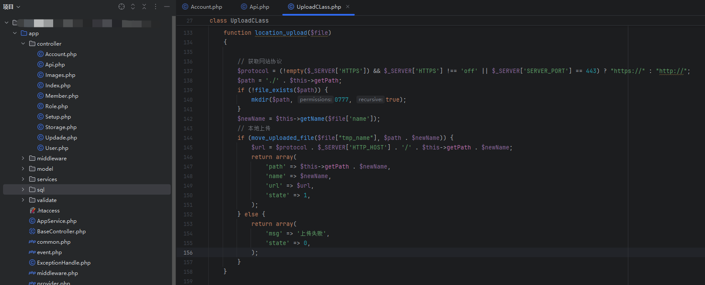

直接上传文件。

### 四、漏洞复现

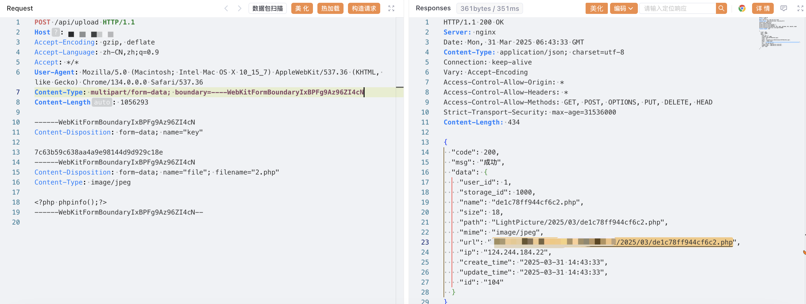

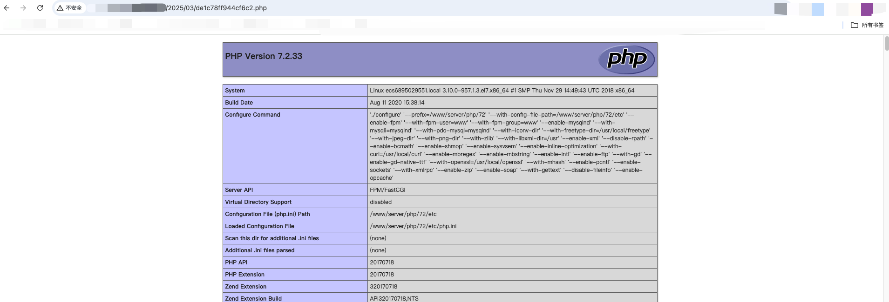
