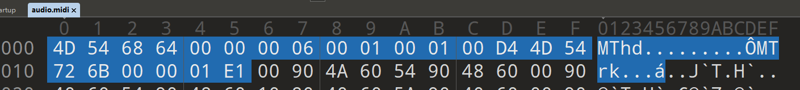
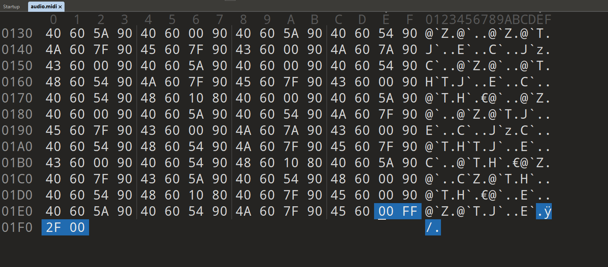
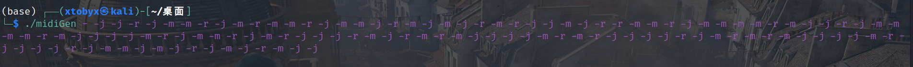
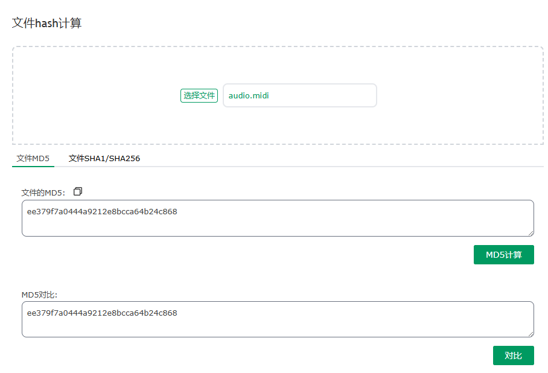
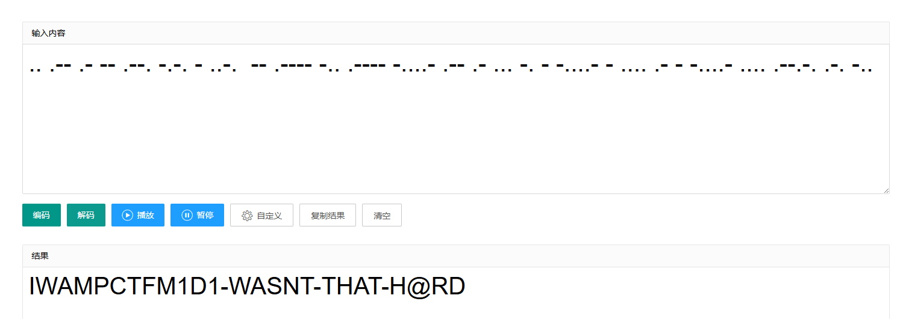
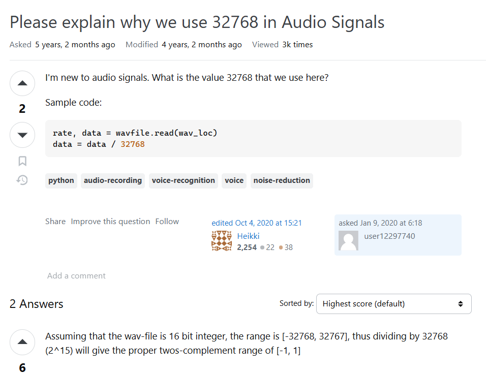
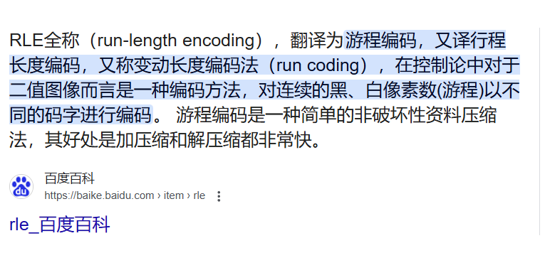
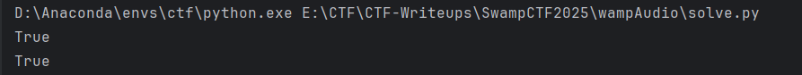
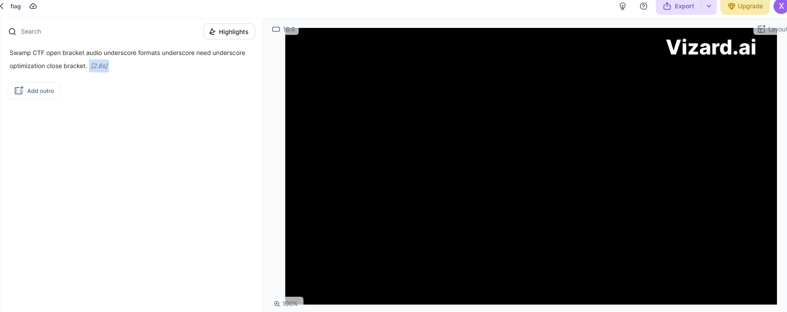
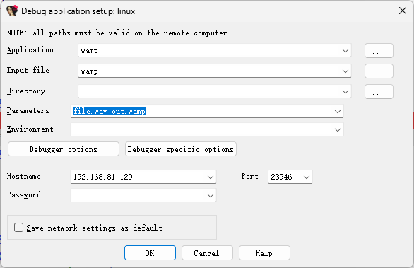

# SwampCTF Re WP-先知社区

> **来源**: https://xz.aliyun.com/news/17593  
> **文章ID**: 17593

---

# SwampCTF Re WP

本周末的一个国际赛，ctftime rating挺高，质量还可以

SwampCTF第一题简单，剩下两道题都有一定难度，需要一定技巧

## Midi Melody

> Midi is where the magic happens

给了个midi音乐文件，一个可执行文件midiGen，很明显midiGen生成了midi

主函数逻辑如下，可以知道midiGen根据输入参数来生成不同音符结果，输入只有-m、-j、-r

```
int __fastcall main(int argc, const char **argv, const char **envp)
{
  int v4; // [rsp+14h] [rbp-ECh]
  int v5; // [rsp+18h] [rbp-E8h]
  int i; // [rsp+1Ch] [rbp-E4h]
  int j; // [rsp+20h] [rbp-E0h]
  int v8; // [rsp+24h] [rbp-DCh]
  int k; // [rsp+28h] [rbp-D8h]
  int m; // [rsp+2Ch] [rbp-D4h]
  FILE *s; // [rsp+30h] [rbp-D0h]
  _QWORD *v12; // [rsp+38h] [rbp-C8h]
  _DWORD v13[12]; // [rsp+40h] [rbp-C0h]
  _DWORD v14[23]; // [rsp+70h] [rbp-90h]
  int v15; // [rsp+CCh] [rbp-34h] BYREF
  __int64 ptr; // [rsp+D0h] [rbp-30h] BYREF
  _BYTE v17[14]; // [rsp+D8h] [rbp-28h]
  unsigned __int64 v18; // [rsp+E8h] [rbp-18h]

  v18 = __readfsqword(0x28u);
  if ( argc == 2 && *argv[1] == 45 )
  {
    puts("Welcome to the MIDI Generator!");
    putchar(10);
    puts("    /-\  /-\    |---|  |--\   |---|");
    puts("   /- -\/- -\    |-|   |  -\   |-|");
    puts("  /-   -\/  -\   |-|   |  -|   |-|");
    puts(" /-\   /-\   -\  |-|   |  -/   |-|");
    puts("/-\           -\|---|  |--/   |---|");
    putchar(10);
    puts("This is an Entirely _flag_ based console");
    puts("currently accepted _flags_ '-m' && '-j' && '-r'");
    puts(
      " '-m' -: Mario Mode, read a note from Mario!
"
      " '-j' .: Park Mode, read a note from Jurassic Park!
"
      " '-r'  : reset, read the score starting from mario's first!
"
      " 
"
      " Ex. Midi.exe -m -m -m -m -m -m -r -m -m
"
      " read the first six notes of mario, and read the first 3 lines of mario");
    return 0;
  }
  else
  {
    ptr = 0x60000006468544DLL;
    *(_QWORD *)v17 = 0x544DD40001000100LL;
    *(_QWORD *)&v17[6] = 0x40000006B72544DLL;
    v15 = 0x2FFF00;
    v14[0] = 0x60409000;
    v14[1] = 0x6040905A;
    v14[2] = 0x60408010;
    v14[3] = 0x6040905A;
    v14[4] = 0x603C907A;
    v14[5] = 0x6040905A;
    v14[6] = 0x6043907A;
    v14[7] = 0x6043807A;
    v14[8] = 0x6037907A;
    v14[9] = 0x6043807A;
    v14[10] = 0x6048907A;
    v14[11] = 0x6043805A;
    v14[12] = 0x6037907A;
    v14[13] = 0x6043805A;
    v14[14] = 0x6034907A;
    v14[15] = 0x6043805A;
    v14[16] = 0x6039907A;
    v14[17] = 0x603B907A;
    v14[18] = 0x603A907A;
    v14[19] = 0x6039904A;
    v14[20] = 0x6043805A;
    v14[21] = 0x7BB07A;
    v13[0] = 0x604A9000;
    v13[1] = 0x60489054;
    v13[2] = 0x604A9054;
    v13[3] = 0x6045907F;
    v13[4] = 0x6043907F;
    v13[5] = 0x604A9000;
    v13[6] = 0x60489054;
    v13[7] = 0x604A9054;
    v13[8] = 0x6045907F;
    v13[9] = 0x6043907F;
    v4 = 0;
    v5 = 0;
    s = fopen("audio.midi", "wb");
    v12 = malloc(8LL * (argc - 2));
    for ( i = 0; i < argc - 2; ++i )
      v12[i] = malloc(4uLL);
    for ( j = 2; j < argc; ++j )
    {
      switch ( argv[j][1] )
      {
        case 'm':
          v8 = 0;
          break;
        case 'j':
          v8 = 1;
          break;
        case 'd':
          v8 = 2;
          break;
        default:
          v8 = 3;
          break;
      }
      if ( v8 == 3 )
      {
        *(_DWORD *)v12[v5] = v14[0];
        v4 = 1;
      }
      else if ( v8 )
      {
        if ( v8 == 1 )
        {
          *(_BYTE *)v12[v5] = v13[v4 % 10];
          *(_BYTE *)(v12[v5] + 1LL) = BYTE1(v13[v4 % 10]);
          *(_BYTE *)(v12[v5] + 2LL) = BYTE2(v13[v4 % 10]);
          *(_BYTE *)(v12[v5] + 3LL) = HIBYTE(v13[v4 % 10]);
        }
        else
        {
          *(_BYTE *)v12[v5] = v14[v4 % 22];
          *(_BYTE *)(v12[v5] + 1LL) = BYTE1(v14[v4 % 22]);
          *(_BYTE *)(v12[v5] + 2LL) = BYTE2(v14[v4 % 22]);
          *(_BYTE *)(v12[v5] + 3LL) = HIBYTE(v14[v4 % 22]);
        }
        ++v4;
      }
      else
      {
        *(_BYTE *)v12[v5] = v14[v4 % 22];
        *(_BYTE *)(v12[v5] + 1LL) = BYTE1(v14[v4 % 22]);
        *(_BYTE *)(v12[v5] + 2LL) = BYTE2(v14[v4 % 22]);
        *(_BYTE *)(v12[v5] + 3LL) = HIBYTE(v14[v4 % 22]);
        ++v4;
      }
      ++v5;
    }
    if ( 4 * (argc - 1) > 255 )
      v17[12] -= 4 * (argc - 1);
    v17[13] += 4 * (argc - 1) % 255;
    fwrite(&ptr, 0x16uLL, 1uLL, s);
    for ( k = 0; k < argc - 2; ++k )
    {
      for ( m = 0; m <= 3; ++m )
        fwrite((const void *)(v12[k] + m), 1uLL, 1uLL, s);
    }
    fwrite(&v15, 4uLL, 1uLL, s);
    fclose(s);
    return 0;
  }
}
```

fwrite(&ptr, 0x16uLL, 1uLL, s);写入了ptr值0x60000006468544DLL、0x544DD40001000100LL、0x40000006B72544DLL，正好是midi的文件头



v15写入了文件尾



中间的数据经检查每四字节均属于v13、v14里的值，所以题目的目的要求你还原出题人输入的参数

需要分析for循环，可知

* 输入m，v8=0，取v14[v4]值，v4++
* 输入j，v8=1，取v13[v4]值，v4++
* 输入r，v8=3，取v14[0]值，v4=1

因此可以dfs实现爆破，每次从三个选项中选一个，并检查选取的4字节是否和题目给的audio.midi对应位置的4字节相同

爆破脚本如下

```
import struct

v13 = [0x604A9000, 0x60489054, 0x604A9054, 0x6045907F, 0x6043907F, 0x604A9000, 0x60489054, 0x604A9054, 0x6045907F, 0x6043907F]
v14 = [0x60409000, 0x6040905A, 0x60408010, 0x6040905A, 0x603C907A, 0x6040905A, 0x6043907A, 0x6043807A, 0x6037907A, 0x6043807A, 0x6048907A, 0x6043805A, 0x6037907A, 0x6043805A, 0x6034907A, 0x6043805A, 0x6039907A, 0x603B907A, 0x603A907A, 0x6039904A, 0x6043805A, 0x7BB07A]
with open("audio.midi", "rb") as f:
    data = f.read()
data = data[22:-4]
data = [struct.unpack("<I", data[i:i+4])[0] for i in range(0, len(data), 4)]
print(len(data))
v4 = 0


def dfs(input_para, v12, v4):
    if v12 == data:
        print(" ".join(input_para))
        exit(0)
    if v12 != data[:len(v12)]:
        return
    for i in ["-m", "-j", "-r"]:
        if i == "-m":
            v8 = 0
        elif i == "-j":
            v8 = 1
        elif i == "-r":
            v8 = 3
        if v8 == 1:
            dfs(input_para+[i], v12+[v13[v4%22]], v4+1)
        elif v8 == 0:
            dfs(input_para+[i], v12+[v14[v4%22]], v4+1)
        elif v8 == 3:
            dfs(input_para+[i], v12+[v14[0]], 1)

dfs([], [], 0)
# -j -j -r -j -m -m -r -j -m -r -m -m -r -j -m -m -j -r -m -j -m -j -r -m -r -j -j -m -j -r -r -m -m -r -j -m -m -m -m -r -m -j -j -r -j -m -m -m -m -r -m -j -j -j -j -m -r -j -m -m -r -j -m -r -j -j -j -r -m -j -r -m -r -m -j -j -j -j -m -r -m -r -j -j -j -j -r -j -m -r -m -r -m -j -j -j -j -m -r -j -j -j -j -r -j -m -m -j -m -j -r -j -m -j -r -m -j -j
```

同时需要注意for ( j = 2; j < argc; ++j )，等于从第三个参数才开始-j、-m、-r，第二个随便填



生成了新的audio.midi，对比哈希发现一模一样



到这里就开始了misc，观察到jmr三种字符，类似摩斯密码，经过尝试发现-j对应短、-m对应长、-r对应空格

```
print("-j -j -r -j -m -m -r -j -m -r -m -m -r -j -m -m -j -r -m -j -m -j -r -m -r -j -j -m -j -r -r -m -m -r -j -m -m -m -m -r -m -j -j -r -j -m -m -m -m -r -m -j -j -j -j -m -r -j -m -m -r -j -m -r -j -j -j -r -m -j -r -m -r -m -j -j -j -j -m -r -m -r -j -j -j -j -r -j -m -r -m -r -m -j -j -j -j -m -r -j -j -j -j -r -j -m -m -j -m -j -r -j -m -j -r -m -j -j".replace("-j", ".").replace("-m", "-").replace(" ", "").replace("-r", " "))
# .. .-- .- -- .--. -.-. - ..-.  -- .---- -.. .---- -....- .-- .- ... -. - -....- - .... .- - -....- .... .--.-. .-. -..
```



第一个I改成S即为flag `swampCTF{M1D1-WASNT-THAT-H@RD}`

## Wamp Audio

> I started recording my flags using a new codec I made called Wamp. However, I lost the decoder! Can you help?

题目描述说加密得到了wamp文件，附件也给了flag.wamp和wamp可执行文件，可知该题目将wav通过一定加密手段得到了wamp

主函数如下，可以看到规定了输入参数

```
__int64 __fastcall main(int a1, char **a2, char **a3)
{
  int v4; // r14d
  int *v5; // r13
  char *v6; // [rsp+8h] [rbp-2030h] BYREF
  _BYTE write_fp[80]; // [rsp+10h] [rbp-2028h] BYREF
  FILE *read_fp[7]; // [rsp+60h] [rbp-1FD8h] BYREF
  int v9; // [rsp+98h] [rbp-1FA0h]
  char v10[3928]; // [rsp+B0h] [rbp-1F88h] BYREF
  unsigned __int64 v11; // [rsp+1FF8h] [rbp-40h]

  v11 = __readfsqword(0x28u);
  if ( a1 == 1 )
  {
    puts("Wamp Audio Format
./wamp input.wav output.wamp");
    return 1LL;
  }
  else
  {
    sub_5555555554F0((__int64)write_fp, 1, 44100, 4, 1, a2[2]);
    tinywav_open_read((__int64)read_fp, a2[1], 2);
    if ( v9 > 999 )
    {
      v4 = 0;
      do
      {
        v6 = v10;
        sub_555555555AA0((__int64)read_fp, (float *)&v6, 1000);
        ++v4;
        v5 = (int *)sub_555555555410(v10, 4000uLL);
        sub_555555555EB0((__int64)write_fp, v5, 2000);
        free(v5);
      }
      while ( v9 / 1000 > v4 );
    }
    sub_555555555E90(read_fp);
    sub_5555555562C0((__int64)write_fp);
    puts("Audio done encoding!");
    return 0LL;
  }
}
```

sub\_5555555554F0如下，里面出现tinywav，很明显调用了库，实现了写入文件初始化

```
__int64 __fastcall sub_5555555554F0(__int64 a1, __int16 a2, int a3, int a4, int a5, const char *a6)
{
  FILE *v9; // rax
  size_t v10; // rbp
  size_t v11; // rbp
  size_t v12; // rbp
  size_t v13; // rbp
  size_t v14; // rbp
  size_t v15; // rbp
  size_t v16; // rbp
  size_t v17; // rbp
  size_t v18; // rbp
  size_t v19; // rbp
  size_t v20; // rbp
  size_t v21; // rbp

  if ( !a1 || !a6 || a2 <= 0 || a3 <= 0 )
    return 0xFFFFFFFFLL;
  v9 = fopen(a6, "wb");
  *(_QWORD *)a1 = v9;
  if ( v9 )
  {
    *(_DWORD *)(a1 + 32) = a3;
    *(_WORD *)(a1 + 52) = a2;
    *(_WORD *)(a1 + 30) = a2;
    *(_QWORD *)(a1 + 56) = 0xFFFFFFFFLL;
    *(_DWORD *)(a1 + 68) = a4;
    *(_QWORD *)(a1 + 16) = 0x20746D664F494441LL;
    *(_WORD *)(a1 + 40) = a4 * a2;
    *(_DWORD *)(a1 + 64) = a5;
    *(_QWORD *)(a1 + 8) = 0x504D4157LL;
    *(_DWORD *)(a1 + 24) = 16;
    *(_WORD *)(a1 + 28) = a4 - 1;
    *(_DWORD *)(a1 + 36) = a4 * a2 * a3;
    *(_WORD *)(a1 + 42) = 8 * a4;
    *(_QWORD *)(a1 + 44) = 0x61746164LL;
    v10 = fwrite((const void *)(a1 + 8), 1uLL, 4uLL, v9);
    v11 = fwrite((const void *)(a1 + 12), 4uLL, 1uLL, *(FILE **)a1) + v10;
    v12 = fwrite((const void *)(a1 + 16), 1uLL, 4uLL, *(FILE **)a1) + v11;
    v13 = fwrite((const void *)(a1 + 20), 1uLL, 4uLL, *(FILE **)a1) + v12;
    v14 = fwrite((const void *)(a1 + 24), 4uLL, 1uLL, *(FILE **)a1) + v13;
    v15 = fwrite((const void *)(a1 + 28), 2uLL, 1uLL, *(FILE **)a1) + v14;
    v16 = fwrite((const void *)(a1 + 30), 2uLL, 1uLL, *(FILE **)a1) + v15;
    v17 = fwrite((const void *)(a1 + 32), 4uLL, 1uLL, *(FILE **)a1) + v16;
    v18 = fwrite((const void *)(a1 + 36), 4uLL, 1uLL, *(FILE **)a1) + v17;
    v19 = fwrite((const void *)(a1 + 40), 2uLL, 1uLL, *(FILE **)a1) + v18;
    v20 = fwrite((const void *)(a1 + 42), 2uLL, 1uLL, *(FILE **)a1) + v19;
    v21 = fwrite((const void *)(a1 + 44), 1uLL, 4uLL, *(FILE **)a1) + v20;
    return (unsigned int)-(fwrite((const void *)(a1 + 48), 4uLL, 1uLL, *(FILE **)a1) + v21 != 25);
  }
  else
  {
    perror("[tinywav] Failed to open file for writing");
    return 0xFFFFFFFFLL;
  }
}
```

tinywav\_open\_read更明显，是读取文件

```
__int64 __fastcall tinywav_open_read(__int64 a1, const char *a2, int a3)
{
  FILE *v4; // rax
  size_t v5; // rbp
  size_t v6; // rbp
  __int64 v7; // rax
  __int64 v8; // rax
  size_t v9; // rbp
  size_t v10; // rbp
  size_t v11; // rbp
  size_t v12; // rbp
  size_t v13; // rbp
  __int64 v14; // rax
  __int16 v15; // ax
  int v16; // edx
  int v17; // edx
  int v18; // ecx
  unsigned int v19; // eax
  __int64 v21; // rax

  if ( !a1 || !a2 )
    return 0xFFFFFFFFLL;
  v4 = fopen(a2, "rb");
  *(_QWORD *)a1 = v4;
  if ( v4 )
  {
    v5 = fread((void *)(a1 + 8), 1uLL, 4uLL, v4);
    v6 = fread((void *)(a1 + 12), 4uLL, 1uLL, *(FILE **)a1) + v5;
    if ( fread((void *)(a1 + 16), 1uLL, 4uLL, *(FILE **)a1) + v6 <= 8 )
      goto LABEL_8;
    v7 = 0LL;
    if ( *(_BYTE *)(a1 + 8) != 'R' )
      goto LABEL_8;
    while ( ++v7 != 4 )
    {
      if ( *(_BYTE *)(a1 + v7 + 8) != aRiff[v7] )
        goto LABEL_8;
    }
    v21 = 0LL;
    if ( *(_BYTE *)(a1 + 16) != 'W' )
    {
LABEL_8:
      puts("wamp");
      goto LABEL_9;
    }
    while ( ++v21 != 4 )
    {
      if ( aWave[v21] != *(_BYTE *)(a1 + v21 + 16) )
        goto LABEL_8;
    }
LABEL_9:
    while ( fread((void *)(a1 + 20), 1uLL, 4uLL, *(FILE **)a1) == 4 )
    {
      fread((void *)(a1 + 24), 4uLL, 1uLL, *(FILE **)a1);
      v8 = 0LL;
      if ( *(_BYTE *)(a1 + 20) == 'f' )
      {
        while ( ++v8 != 4 )
        {
          if ( *(_BYTE *)(a1 + v8 + 20) != aFmt[v8] )
            goto LABEL_13;
        }
        break;
      }
LABEL_13:
      fseek(*(FILE **)a1, *(unsigned int *)(a1 + 24), 1);
    }
    v9 = fread((void *)(a1 + 28), 2uLL, 1uLL, *(FILE **)a1);
    v10 = fread((void *)(a1 + 30), 2uLL, 1uLL, *(FILE **)a1) + v9;
    v11 = fread((void *)(a1 + 32), 4uLL, 1uLL, *(FILE **)a1) + v10;
    v12 = fread((void *)(a1 + 36), 4uLL, 1uLL, *(FILE **)a1) + v11;
    v13 = fread((void *)(a1 + 40), 2uLL, 1uLL, *(FILE **)a1) + v12;
    if ( fread((void *)(a1 + 42), 2uLL, 1uLL, *(FILE **)a1) + v13 == 6 )
    {
      while ( fread((void *)(a1 + 44), 1uLL, 4uLL, *(FILE **)a1) == 4 )
      {
        fread((void *)(a1 + 48), 4uLL, 1uLL, *(FILE **)a1);
        v14 = 0LL;
        if ( *(_BYTE *)(a1 + 44) == 100 )
        {
          while ( ++v14 != 4 )
          {
            if ( aData[v14] != *(_BYTE *)(a1 + v14 + 44) )
              goto LABEL_19;
          }
          break;
        }
LABEL_19:
        fseek(*(FILE **)a1, *(unsigned int *)(a1 + 48), 1);
      }
      v15 = *(_WORD *)(a1 + 30);
      v16 = *(unsigned __int16 *)(a1 + 42);
      *(_DWORD *)(a1 + 64) = a3;
      *(_WORD *)(a1 + 52) = v15;
      if ( (_WORD)v16 == 32 )
      {
        if ( *(_WORD *)(a1 + 28) == 3 )
        {
          *(_DWORD *)(a1 + 68) = 4;
          v17 = 4;
          goto LABEL_24;
        }
      }
      else if ( (_WORD)v16 == 16 && *(_WORD *)(a1 + 28) == 1 )
      {
        *(_DWORD *)(a1 + 68) = 2;
        v17 = 2;
        goto LABEL_24;
      }
      *(_DWORD *)(a1 + 68) = 4;
      __printf_chk(
        1LL,
        "[tinywav] Warning: wav file has %d bits per sample (int), which is not natively supported yet. Treating them as "
        "float; you may want to convert them manually after reading.
",
        v16);
      v15 = *(_WORD *)(a1 + 52);
      v17 = *(_DWORD *)(a1 + 68);
LABEL_24:
      v18 = v15;
      v19 = *(_DWORD *)(a1 + 48);
      *(_DWORD *)(a1 + 60) = 0;
      *(_DWORD *)(a1 + 56) = v19 / (v17 * v18);
      return 0LL;
    }
    if ( *(_QWORD *)a1 )
    {
      fclose(*(FILE **)a1);
      *(_QWORD *)a1 = 0LL;
    }
    return 0xFFFFFFFFLL;
  }
  perror("[tinywav] Failed to open file for reading");
  return 0xFFFFFFFFLL;
}
```

接着是一个大循环，循环后的函数如下，是做一些文件读写的收尾工作

```
int __fastcall sub_555555555E90(FILE **a1)
{
  FILE *v2; // rdi
  int result; // eax

  v2 = *a1;
  if ( v2 )
  {
    result = fclose(v2);
    *a1 = 0LL;
  }
  return result;
}
unsigned __int64 __fastcall sub_5555555562C0(__int64 a1)
{
  FILE *v2; // rdi
  int v3; // eax
  int v5; // [rsp+0h] [rbp-18h] BYREF
  int ptr; // [rsp+4h] [rbp-14h] BYREF
  unsigned __int64 v7; // [rsp+8h] [rbp-10h]

  v7 = __readfsqword(0x28u);
  if ( a1 )
  {
    v2 = *(FILE **)a1;
    if ( v2 )
    {
      v3 = *(__int16 *)(a1 + 52) * *(_DWORD *)(a1 + 68) * *(_DWORD *)(a1 + 60);
      *(_DWORD *)(a1 + 48) = v3;
      *(_DWORD *)(a1 + 12) = v3 + 36;
      ptr = v3 + 36;
      v5 = v3;
      fseek(v2, 4LL, 0);
      fwrite(&ptr, 4uLL, 1uLL, *(FILE **)a1);
      fseek(*(FILE **)a1, 40LL, 0);
      fwrite(&v5, 4uLL, 1uLL, *(FILE **)a1);
      fclose(*(FILE **)a1);
      *(_QWORD *)a1 = 0LL;
    }
  }
  return __readfsqword(0x28u) ^ v7;
}
```

重点关注循环中的操作，可以发现1000、2000、4000这样的字眼

```
if ( v9 > 999 )
{
  v4 = 0;
  do
  {
    v6 = v10;
    sub_555555555AA0((__int64)read_fp, (float *)&v6, 1000);
    ++v4;
    v5 = (int *)sub_555555555410(v10, 4000uLL);
    sub_555555555EB0((__int64)write_fp, v5, 2000);
    free(v5);
  }
  while ( v9 / 1000 > v4 );
}
```

sub\_555555555AA0很长，动态调试可知其读取了wav的2000字节data，同时每两字节做了除以32767.0的操作，搜索可知该操作相当于归一化，具体部分代码如下

```
if ( (int)v27 > 0 )
{
  v47 = 2 * v27;
  v48 = 0LL;
  do
  {
    if ( v29 > 0 )
    {
      v49 = *(_QWORD *)&a2[2 * v48];
      v50 = &v60[v48];
      v51 = 4LL * (unsigned int)(v29 - 1) + 4 + v49;
      do
      {
        v52 = *v50;
        v49 += 4LL;
        v50 = (__int16 *)((char *)v50 + v47);
        *(float *)(v49 - 4) = (float)v52 / 32767.0;
      }
      while ( v51 != v49 );
    }
    ++v48;
  }
  while ( v28 > (int)v48 );
}
```



可知sub\_555555555AA0将波形图归一化为-1到1间，并用浮点数（4字节）来表示，相当于从2000字节扩充到了4000字节

出来后分析sub\_555555555410如下，在while循环里我们观察到了指针（v5、v8）的使用

```
char *__fastcall sub_555555555410(char *a1, unsigned __int64 a2)
{
  char *result; // rax
  char v4; // r11
  char *v5; // rdi
  char *v6; // rbp
  __int64 v7; // rcx
  char v8; // si
  char *v9; // r10
  char *v10; // r9
  char v11; // bl

  result = (char *)malloc(2 * a2);
  if ( result )
  {
    v4 = *a1;
    if ( a2 <= 1 )
    {
      v10 = result + 1;
      v9 = result;
      v8 = 1;
    }
    else
    {
      v5 = a1 + 1;
      v6 = &a1[a2];
      v7 = 0LL;
      v8 = 1;
      do
      {
        while ( 1 )
        {
          v11 = *v5;
          v9 = &result[v7];
          v10 = &result[v7 + 1];
          if ( v8 != -1 && v11 == v4 )
            break;
          ++v5;
          *v9 = v8;
          v9 = &result[v7 + 2];
          *v10 = v4;
          v8 = 1;
          v10 = &result[v7 + 3];
          v4 = v11;
          v7 += 2LL;
          if ( v5 == v6 )
            goto LABEL_8;
        }
        ++v5;
        ++v8;
      }
      while ( v5 != v6 );
    }
LABEL_8:
    *v9 = v8;
    *v10 = v4;
  }
  return result;
}
```

查询可知该函数实现了RLE操作，存储的数据是两字节一组，第一个是长度l，第二个是值v，表示有连续l个v值



sub\_555555555EB0函数也是非常长，因此直接动态调试看输入输出，发现输入上面RLE完的结果，输出RLE结果+0字节（补充到8000字节）

下面是我用自己的wav进行了测试，并实现自己的算法来和加密完的结果（动态调试过程中提取的以及最终加密完的结果）比较

```
import struct
# 测试
with open("file.wav", "rb") as f:
    data1 = f.read()
data = data1[0x2c:0x2c+4000]
b = b""
for i in range(0, len(data), 2):
    b += struct.pack("<f", struct.unpack("<h", data[i:i+2])[0]/32767.0)
out = ""
tmp = b[0]
k = 0
cnt = 0
# 测试第一段
while k < 4000:
    if cnt == 255:
        out += "FF"+hex(tmp)[2:].zfill(2).upper()
        cnt = 0
    if b[k] != tmp:
        out += hex(cnt)[2:].zfill(2).upper()+hex(tmp)[2:].zfill(2).upper()
        tmp = b[k]
        cnt = 0
    cnt += 1
    k += 1
out += hex(cnt)[2:].zfill(2).upper()+hex(tmp)[2:].zfill(2).upper()
print(bytes([0xFF, 0x00, 0xFF, 0x00, 0xFF, 0x00, 0xFF, 0x00, 0xFF, 0x00, 0xFF, 0x00, 0xFF, 0x00, 0xFF, 0x00, 0xFF, 0x00, 0xFF, 0x00, 0xFF, 0x00, 0xFF, 0x00, 0xFF, 0x00, 0x4E, 0x00, 0x01, 0x01, 0x01, 0x00, 0x01, 0x38, 0xDD, 0x00, 0x01, 0x01, 0x01, 0x00, 0x01, 0xB8, 0x1D, 0x00, 0x01, 0x01, 0x01, 0x00, 0x01, 0x38, 0x05, 0x00, 0x01, 0x01, 0x01, 0x00, 0x01, 0x38, 0x01, 0x00, 0x01, 0x01, 0x01, 0x00, 0x01, 0x38, 0x0D, 0x00, 0x01, 0x01, 0x01, 0x00, 0x01, 0x38, 0x3D, 0x00, 0x01, 0x01, 0x01, 0x00, 0x01, 0xB8, 0x1D, 0x00, 0x01, 0x01, 0x01, 0x00, 0x01, 0x38, 0x01, 0x00, 0x01, 0x01, 0x01, 0x00, 0x01, 0x38, 0x29, 0x00, 0x01, 0x01, 0x01, 0x00, 0x01, 0xB8, 0x09, 0x00, 0x01, 0x01, 0x01, 0x00, 0x01, 0xB8, 0x05, 0x00, 0x01, 0x01, 0x01, 0x00, 0x01, 0xB8, 0x15, 0x00, 0x01, 0x01, 0x01, 0x00, 0x01, 0x38, 0x05, 0x00, 0x01, 0x01, 0x01, 0x00, 0x01, 0xB8, 0x05, 0x00, 0x01, 0x01, 0x01, 0x00, 0x01, 0xB8, 0x05, 0x00, 0x01, 0x01, 0x01, 0x00, 0x01, 0x38, 0x0D, 0x00, 0x01, 0x01, 0x01, 0x00, 0x01, 0x38, 0x01, 0x00, 0x01, 0x01, 0x01, 0x00, 0x01, 0x38, 0x01, 0x00, 0x01, 0x01, 0x01, 0x00, 0x01, 0xB8, 0x05, 0x00, 0x01, 0x01, 0x01, 0x00, 0x01, 0x38, 0x0D, 0x00, 0x01, 0x01, 0x01, 0x00, 0x01, 0xB8, 0x05, 0x00, 0x01, 0x01, 0x01, 0x00, 0x01, 0x38, 0x09, 0x00, 0x01, 0x01, 0x01, 0x00, 0x01, 0x38, 0x01, 0x00, 0x01, 0x01, 0x01, 0x00, 0x01, 0xB8, 0x01, 0x00, 0x01, 0x01, 0x01, 0x00, 0x01, 0x38, 0x05, 0x00, 0x01, 0x01, 0x01, 0x00, 0x01, 0xB8, 0x01, 0x00, 0x01, 0x01, 0x01, 0x00, 0x01, 0xB8, 0x01, 0x00, 0x01, 0x01, 0x01, 0x00, 0x01, 0xB8, 0x05, 0x00, 0x01, 0x01, 0x01, 0x00, 0x01, 0xB8, 0x08, 0]).hex()==out.lower())
# 测试第二段
out = ""
tmp = b[4000]
cnt = 0
while k < 8000:
    if cnt == 255:
        out += "FF"+hex(tmp)[2:].zfill(2).upper()
        cnt = 0
    if b[k] != tmp:
        out += hex(cnt)[2:].zfill(2).upper()+hex(tmp)[2:].zfill(2).upper()
        tmp = b[k]
        cnt = 0
    cnt += 1
    k += 1
out += hex(cnt)[2:].zfill(2).upper()+hex(tmp)[2:].zfill(2).upper()
with open("out.wamp", "rb") as f:
    data2 = f.read()
print(data2[0x1f6c:0x1f6c+len(out)//2].hex()==out.lower())
```



第一段比较是动态提取了sub\_555555555410输出的v5，即RLE结果，然后和我自己实现的算法比较，结果为True

第二段直接从加密后的out.swamp提取来和我自己实现的算法比较，结果仍为True

到这里可以知道解题思路，首先从文件头后每8000字节一组，然后解压RLE恢复原来的4000字节（这里我出现了点问题，有些部分恢复的超过了4000字节，所以我直接取4000字节，多的去除），接着4000字节浮点数转为word数（2000字节），最后重新拼接文件头

```
# solve
with open("flag.wamp", "rb") as f:
    data = f.read()
wav_bytes = b""
for i in range(0x2c, len(data), 8000):
    new_data = []
    for k in range(i, i+8000, 2):
        new_data.extend(data[k]*[data[k+1]])
    new_bytes = b""
    for j in range(0, 4000, 4):
        new_bytes += struct.pack("<h", round(struct.unpack("<f", bytes(new_data[j:j+4]))[0]*32767))
    wav_bytes += new_bytes
print(len(wav_bytes))
wav_bytes = data1[:4]+struct.pack("<I", len(wav_bytes)+0x24)+data1[8:0x28]+struct.pack("<I", len(wav_bytes))+wav_bytes
with open("flag.wav", "wb") as f:
    f.write(wav_bytes)
```

提取出的wav识别下音频，flag为`swampCTF{audio_formats_need_optimization}`



## 总结

这个CTF re的出题人挺喜欢音乐，两道题都和音频相关

这两道题解题的一个重要手段就是**动态调试**，因为两个可执行文件均需额外的参数，所以ida动态调试时需要在Debugger选项中填写parameters，如下



然后有些比较复杂的函数完全可以交给gpt大概分析下，然后自己动态调试看函数的输入输出有什么不同，以此来确定函数的功能

最后比较重要的点是**逆向和测试思维**，比如第一题可以自己输入较少mlr参数来看生成的文件，以此确定程序到底做了什么；第二题可以找一个小的wav来测试，结合010editor里的hex值对照着看哪里是输入，哪里是输出，然后自己实现和出题人代码类似的脚本，测试一段输入
