# 某数字藏品app逆向-先知社区

> **来源**: https://xz.aliyun.com/news/17620  
> **文章ID**: 17620

---

本文仅用于技术交流学习

​

### 前言

环境： pixel2 android10

app： 5pWw5a2X5Y6{beihai\_delete}f55SfYXBrIDEuMS43I{beihai\_delete}GNvbS5pemVuLmFiYw==

​

### 正文

#### 抓包

打开app，随手抓一个包，发现握手失效了。说明证书出了问题，第一时间想到了证书校验。要么这个app是在java或者native层加入了证书校验机制，要么是这个app通信使用的是flutter开发的通信部分。flutter框架使用的网络请求库具有证书校验机制

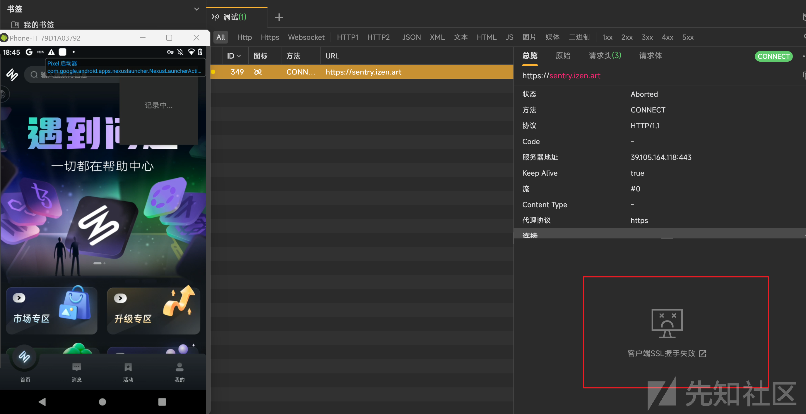

打开apk包看一下，发现了flutter的特征libapp.so和libflutter.so

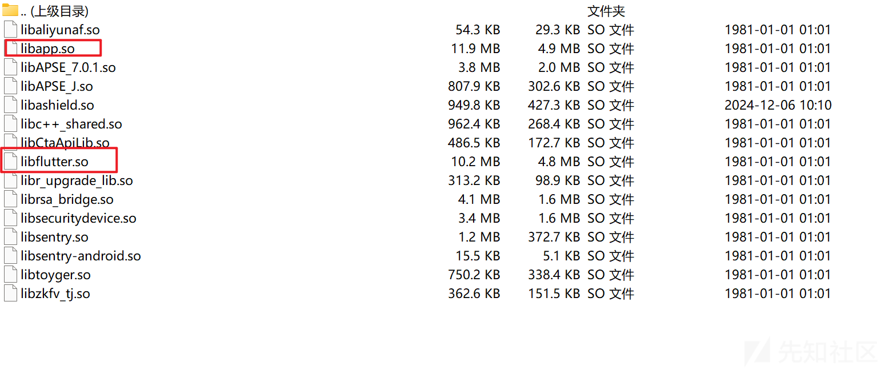

使用脚本来绕过flutter的证书校验

先找到session\_verify\_cert\_chain函数偏移

反编译libflutter.so，进入字串视图

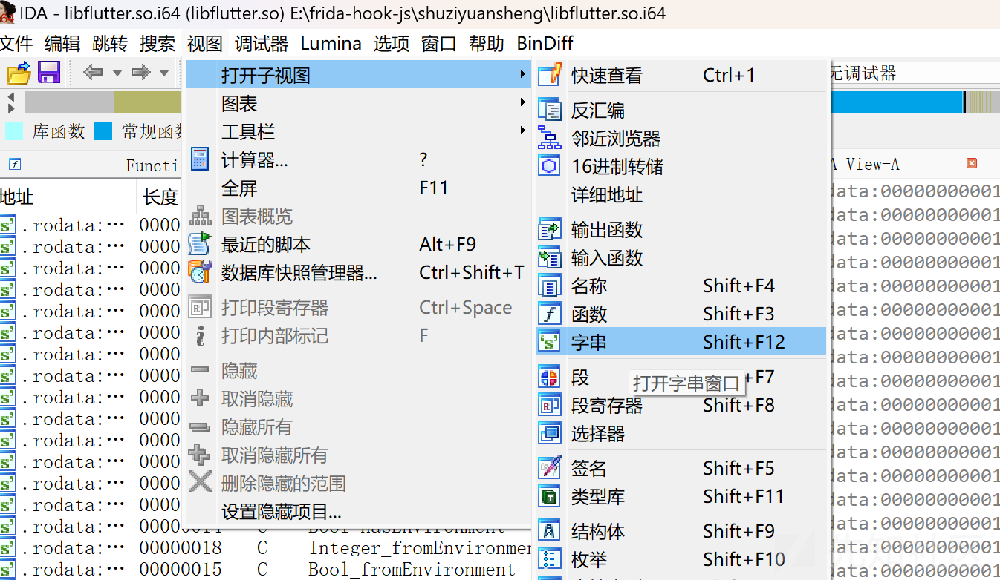

通过字符串ssl\_client定位session\_verify\_cert\_chain

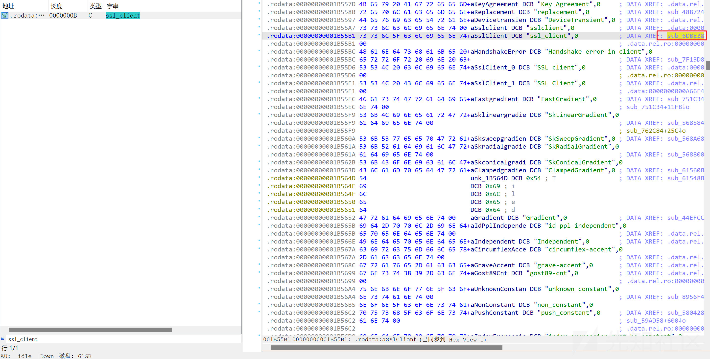

​

编写脚本hook住session\_verify\_cert\_chain修改其返回值为true即可，脚本如下：

```
function hook_dlopen() {
  var android_dlopen_ext = Module.findExportByName(null, "android_dlopen_ext");
  Interceptor.attach(android_dlopen_ext, {
    onEnter: function (args) {
      var so_name = args[0].readCString();
      if (so_name.indexOf("libflutter.so") >= 0) this.call_hook = true;
    }, onLeave: function (retval) {
      if (this.call_hook) hook_flutter();
    }
  })
}
function hook_ssl_verify_result(address){
  Interceptor.attach(address, {
    onEnter: function (args) {
      console.log("Disable SSL validation");
    }, onLeave: function (retval) {
      console.log("Retval: ", retval);
      retval.replace(0x1);
    }
  })
}
function hook_flutter() {
  // 查找 libflutter.so 模块基础地址
  var addr = Module.findBaseAddress("libflutter.so");
  //计算目标函数的地址
  var funcAddr = addr.add(0x6DBE38);
  console.log("Target function address: ", funcAddr.toString());
  // 调用 hook_ssl_verify_result 函数对目标函数进行 Hook
  hook_ssl_verify_result(funcAddr);
}
```

spawn模式运行

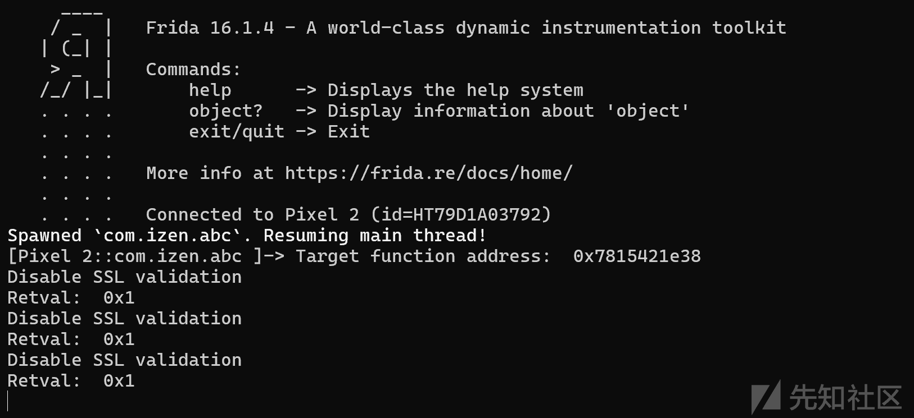

成功抓到包了，可以看见返回包里面有data和encryptKey两个字段。data大概是加密后的返回数据，encryptKey则应该是加密后的key

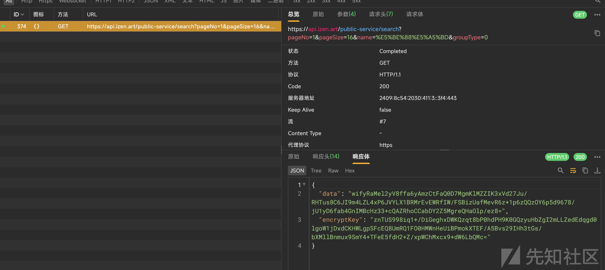

#### 算法分析

市面上有部分app的返回包就是这种data和encryptKey的形式

app接收返回包后的工作是，app会用内置的算法1解密encryptKey字段的值得到key，然后使用算法2和key解密data得到明文

这里面的算法1和算法2很常见的就是rsa和aes，并且aes应该是ecb模式的，因为返回包中并没有加密的iv字段

对于使用rsa结合aes的情况，服务端给客户端传输数据的大概流程如下：

* 客户端和服务端均生成一对RSA秘钥，私钥各自保管，公钥给对方；
* 服务端使用随机函数生成AES加密要用的秘钥key1；
* 服务端使用key1对要传输的数据进行AES加密，生成data1；
* 服务端使用客户端给的公钥对key1进行RSA加密，生成key2；
* 服务端将data1和key2一起发给客户端；
* 客户端拿到数据后，先使用自己的私钥对key2进行RSA解密，得到服务端生成的随机秘钥key1，再使用key1对data1进行AES解密就得到真实的数据了。

​

带着上面的猜测来看看反编译代码

​

对于flutter app，先要掏出blutter来导出信息表

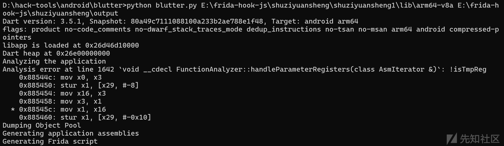

ida导入output/ida\_script/addNames.py

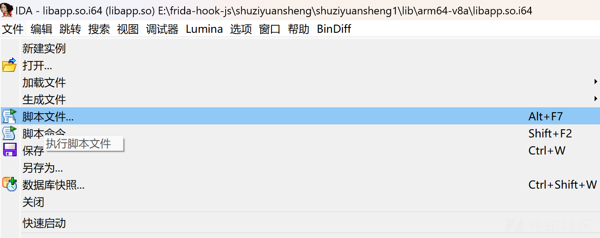

导入后就可以看到不少函数有函数名了

搜索一些rsa，找到了疑似rsa解密的函数

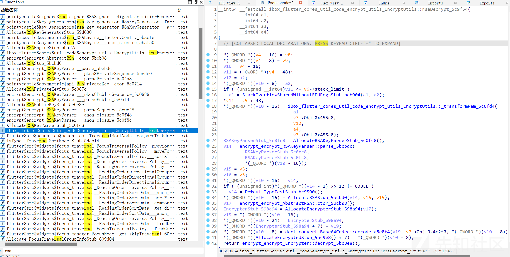

在函数ibox\_flutter\_cores\_util\_code\_encrypt\_utils\_EncryptUtils::rsaDecrypt\_5c9f54中有不少dart官方库的影子

下面将图中部分反编译代码和flutter正向开发的代码对应

```
  *(_QWORD *)(v10 - 16) = ibox_flutter_cores_util_code_encrypt_utils_EncryptUtils::_transformPem_5c0fd4(
                            a1,
                            v7->Obj_0x455c8,
                            v12,
                            a4,
                            v7->Obj_0x455c0);

==>String publicKeyString = _transformPem(..........);


  RSAKeyParserStub_5c0fc8 = AllocateRSAKeyParserStub_5c0fc8();
  v14 = encrypt_encrypt_RSAKeyParser::parse_5bcbdc(
          RSAKeyParserStub_5c0fc8,
          RSAKeyParserStub_5c0fc8,
          *(_QWORD *)(v10 - 16));

==>RSAPrivateKey privateKey = parser.parse(publicKeyString) as RSAPrivateKey;
(借助RSAKeyParser把PEM格式的私钥字符串解析成RSAPrivateKey对象)

  v15 = v5;
  v16 = v5;
  *(_QWORD *)(v10 - 16) = v14;
  if ( (unsigned int)*(_QWORD *)(v14 - 1) >> 12 != 838LL )
    v14 = DefaultTypeTestStub_bc9590();
  *(_QWORD *)(v10 - 16) = AllocateRSAStub_5bcbd0(v14, v16, v15);
  v17 = encrypt_encrypt_AbstractRSA::ctor_5bcb08();
  EncrypterStub_598a94 = AllocateEncrypterStub_598a94(v17);
  v19 = *(_QWORD *)(v10 - 16);
  *(_QWORD *)(v10 - 24) = EncrypterStub_598a94;
  *(_DWORD *)(EncrypterStub_598a94 + 7) = v19;

==>final encryptor = Encrypter(RSA(privateKey: privateKey));
(利用解析得到的私钥创建Encrypter实例)

  *(_QWORD *)(v10 - 8) = dart_convert_Base64Codec::decode_a8e8f4(v19, v7->Obj_0x4c2f0, *(_QWORD *)(v10 - 8));
  
==>final encrypted = Encrypted.fromBase64(encryptedStr);
(将Base64编码的密文解码)
  
*(_DWORD *)(AllocateEncryptedStub_5bc9e8() + 7) = *(_QWORD *)(v10 - 8);
  return encrypt_encrypt_Encrypter::decrypt_5bc8e8();

==>return encryptor.decrypt(encrypted);
}
```

在dart的encrypt库的api中没有找到\_transformPem，说明\_transformPem应该是自定义的函数

根据上下文和函数名，可以猜测\_transformPem是用于将PEM格式的密钥字符串转换为适合解析的格式

那么里面的返回值就是rsa的解密密钥，hook这个函数，dump它的返回值

\_transformPem的偏移为0x5c0fd4，hook代码如下：

```
function hook_transformPem(){
  var baseAddr =  Module.findBaseAddress("libapp.so");
  var addr = baseAddr.add(0x5c0fd4);
  Interceptor.attach(addr, {
    onEnter: function (args) {
      console.log("hook_transformPem");
    },
    onLeave: function (retval) {
      console.log("retval: ", hexdump(retval,{length:1000}));
    }
  })
}
```

attach模式运行，成功打印出private key

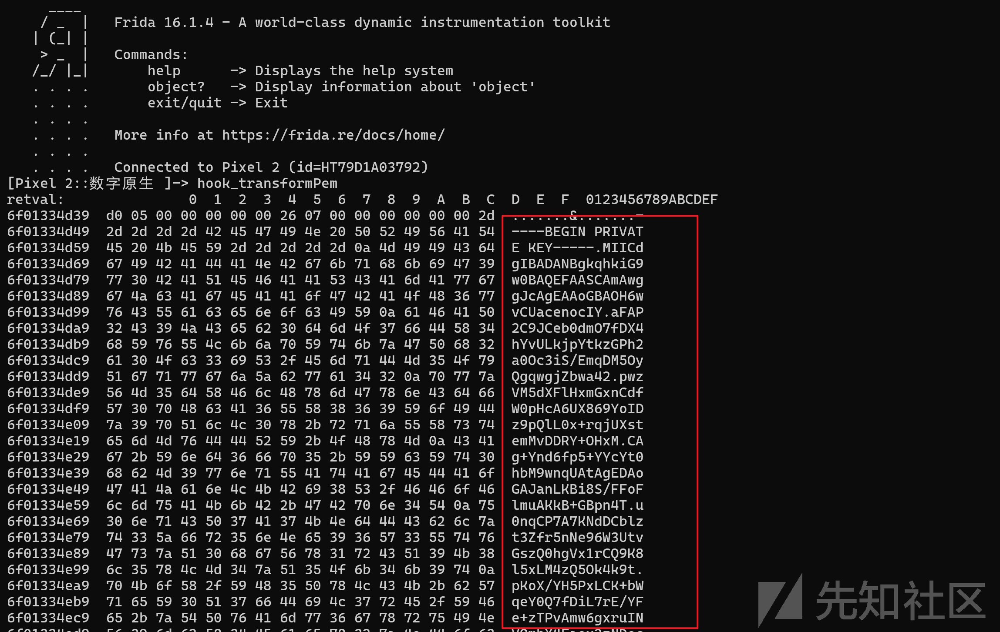

先用hexdump把私钥提取出来

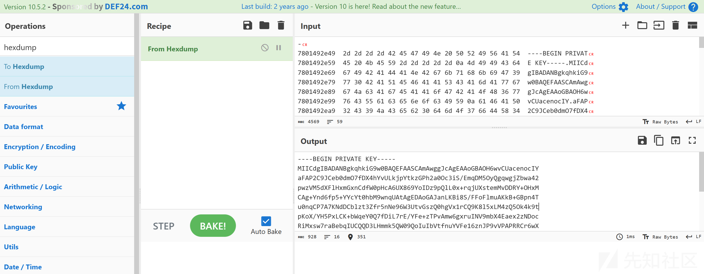

使用wt-js\_debug解密得到aes的密钥

工具地址：<https://52king.lanzouu.com/iYFe5076yfmf>

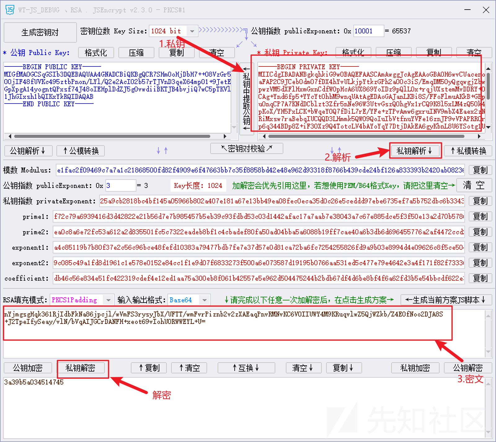

再用aes密钥解密data密文

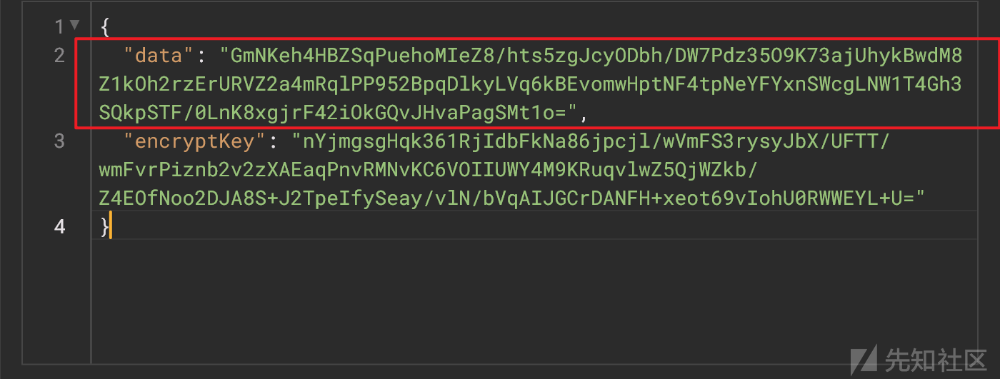

尝试使用ecb模式解密，成功得到data明文

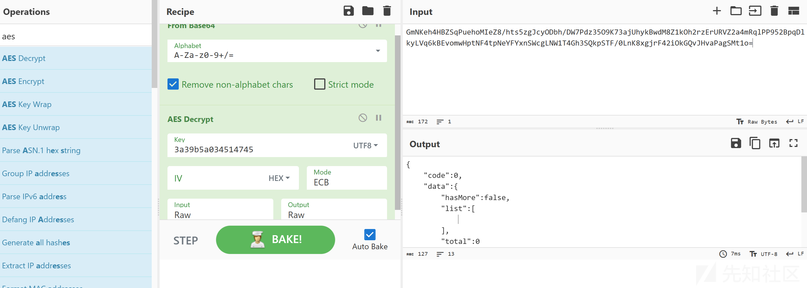

###
