# 西湖论剑决赛MISC-先知社区

> **来源**: https://xz.aliyun.com/news/17623  
> **文章ID**: 17623

---

首先说明这次比赛我是大锅 我检讨 对不起学长们

# 只留清白在人间

题目很简单当场没想到时间戳 注意力都在那个视频上

rs打开 提取文件

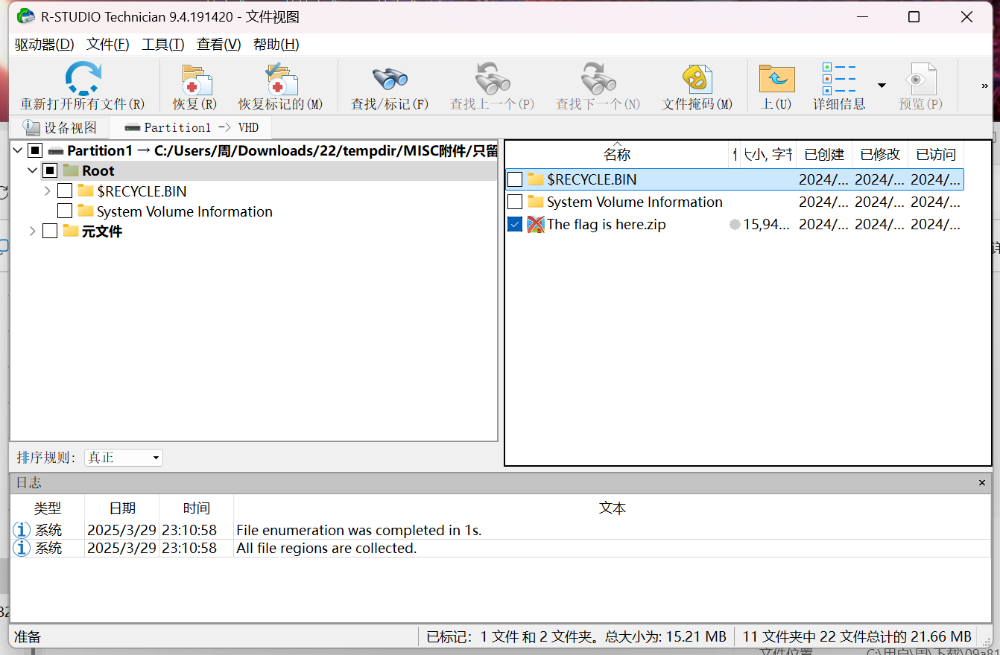

169目录下有个flag？ 但是没啥用

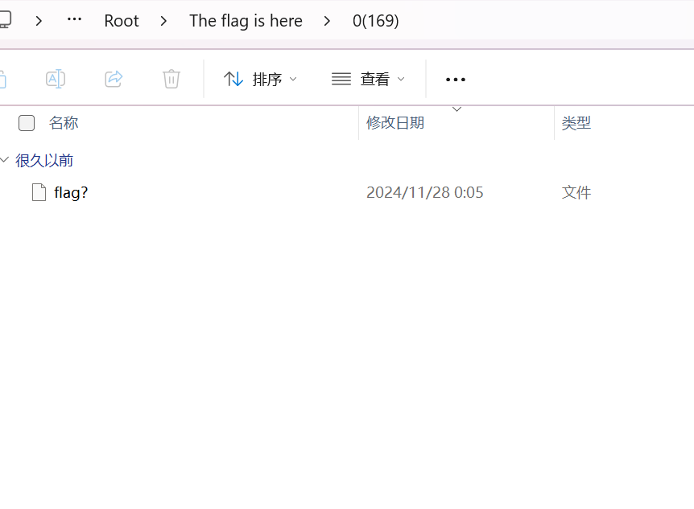

正确解法

通过时间戳读取得到zip 然后得到flag (读取文件夹名字 不是txt)

```
import os
import re
from datetime import datetime


def get_file_modification_time(file_path):
    """获取文件的修改时间"""
    return os.path.getmtime(file_path)


def extract_prefix(folder_name):
    """提取括号前的内容"""
    match = re.match(r"^([^(]+)", folder_name)  # 匹配到第一个左括号前的内容
    return match.group(1).strip() if match else ""


def scan_folder_and_sort_by_mtime(folder_path):
    """扫描文件夹，按修改时间排序，并提取括号前的内容"""
    file_list = []

    for root, dirs, files in os.walk(folder_path):
        for file in files:
            file_path = os.path.join(root, file)
            try:
                mtime = get_file_modification_time(file_path)
                relative_path = os.path.relpath(root, folder_path)
                prefix = extract_prefix(relative_path)
                if prefix:  # 只保留有效内容
                    file_list.append((mtime, prefix))
            except Exception as e:
                print(f"处理文件 {file_path} 时出错: {e}")

    # 按修改时间排序（从旧到新）
    file_list.sort(key=lambda x: x[0])
    return [prefix for (mtime, prefix) in file_list]  # 仅返回前缀部分


def write_to_output_file(prefixes, output_path):
    """将前缀组合并加上B后缀写入文件"""
    combined = "".join(prefixes) + "B"  # 组合所有前缀并添加B
    with open(output_path, 'w', encoding='utf-8') as f:
        f.write(combined)


if __name__ == "__main__":
    # 直接指定文件夹路径
    folder_path = r"E:\dabao\做题方法\抽象misc\读取文件修改时间\123"

    # 如果路径不存在，提示用户手动输入
    if not os.path.isdir(folder_path):
        print(f"路径不存在: {folder_path}")
        folder_path = input("请手动输入正确的文件夹路径: ").strip()

    # 输出文件路径
    output_file = "1.txt"

    if os.path.isdir(folder_path):
        print(f"开始扫描文件夹: {folder_path}")
        sorted_prefixes = scan_folder_and_sort_by_mtime(folder_path)
        write_to_output_file(sorted_prefixes, output_file)

        # 读取并打印结果
        with open(output_file, 'r', encoding='utf-8') as f:
            content = f.read()
        print(f"扫描完成！结果已保存到 {output_file}")
        print("文件内容:", content)
    else:
        print("提供的路径不是一个有效的文件夹！")
```

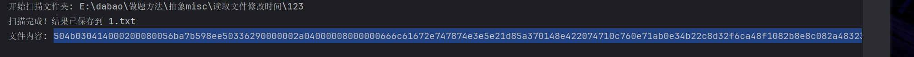

flag在最后行 出题人也是闲得慌

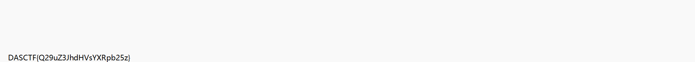

# IceWater

冰蝎流量有俩key 一个返回 一个输入

e45e329feb5d925b

5b4582c9d56b5b33

全解完之后查看 明显的base64转图片 的头

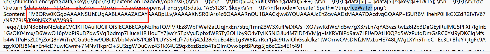

写脚本提一下 数据是一段一段的

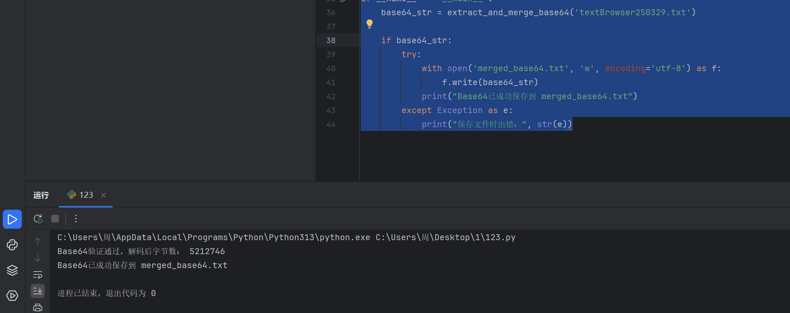

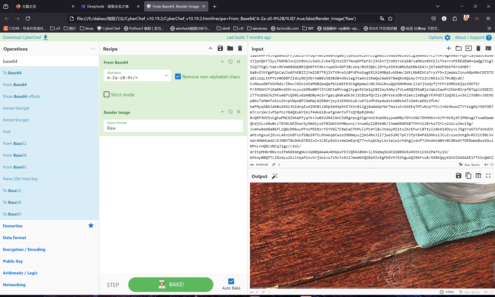

得到png

我一直以为还有加密 就一直看流量 什么都试了一遍 没想到是盲水隐

我背锅无话可说

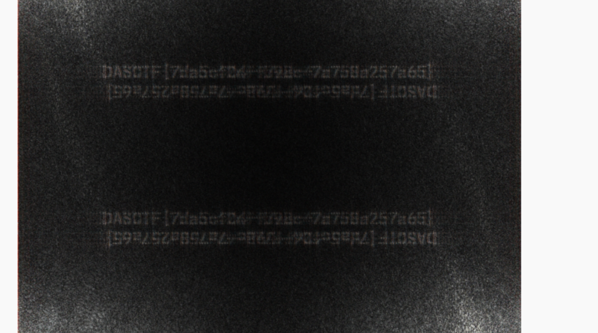

```
DASCTF{7da5cfC4-f7ae-42cf-b98c-7c758a257a65}
```

# Steganography

题目

```
from PIL import Image
from Crypto.Cipher import ARC4

def rc4_encrypt(data, key):
    cipher = ARC4.new(key.encode())
    return cipher.encrypt(data)

image = Image.open('flag1.png').convert('RGB')
width, height = image.size

new_image = Image.new('RGB', (width, height))

key = ''#ps:Passwords are common passwords (weak passwords) that may be required...

for y in range(height):
    for x in range(width):
        r, g, b = image.getpixel((x, y))
        rgb_bytes = bytes([r, g, b])
        encrypted_rgb = rc4_encrypt(rgb_bytes, key)
        new_image.putpixel((x, y), (encrypted_rgb[0], encrypted_rgb[1], encrypted_rgb[2]))

new_image.save('Steganography_challenges0.3.png')

```

ai逆一下 爆破熵值最低的就是正确的

```
from PIL import Image
from Crypto.Cipher import ARC4
import math
from tqdm import tqdm  # 进度条库（可选）

def rc4_decrypt(data, key):
    cipher = ARC4.new(key.encode())
    return cipher.decrypt(data)

def calculate_entropy(data):
    """计算字节数据的熵值（越低越可能是明文）"""
    if not data:
        return 0
    entropy = 0
    for x in range(256):
        p_x = data.count(x) / len(data)
        if p_x > 0:
            entropy += -p_x * math.log2(p_x)
    return entropy

def load_keys_from_file(filename):
    """从文件加载密钥列表（每行一个密钥）"""
    with open(filename, 'r', encoding='utf-8', errors='ignore') as f:
        return [line.strip() for line in f if line.strip()]

def brute_force_rc4(encrypted_image, key_list):
    width, height = encrypted_image.size
    best_entropy = float('inf')
    best_image = None
    best_key = None

    for key in tqdm(key_list, desc="爆破中"):
        try:
            decrypted_image = Image.new('RGB', (width, height))
            total_data = bytearray()

            for y in range(height):
                for x in range(width):
                    r, g, b = encrypted_image.getpixel((x, y))
                    encrypted_rgb = bytes([r, g, b])
                    decrypted_rgb = rc4_decrypt(encrypted_rgb, key)
                    decrypted_image.putpixel((x, y), (decrypted_rgb[0], decrypted_rgb[1], decrypted_rgb[2]))
                    total_data.extend(decrypted_rgb)

            current_entropy = calculate_entropy(total_data)
            if current_entropy < best_entropy:
                best_entropy = current_entropy
                best_image = decrypted_image
                best_key = key
                print(f"新最佳密钥: '{best_key}', 熵值: {current_entropy:.4f}")

        except Exception as e:
            continue

    return best_image, best_key, best_entropy

# 打开加密图像
encrypted_image = Image.open('Steganography_challenges0.3.png').convert('RGB')

# 从 key.txt 加载密钥列表（每行一个密钥）
key_list = load_keys_from_file('123.txt')

if not key_list:
    print("错误：key.txt 中没有有效的密钥！")
    exit()

# 开始爆破
best_image, best_key, best_entropy = brute_force_rc4(encrypted_image, key_list)

if best_image:
    best_image.save('decrypted_best.png')
    print(f"爆破完成！最佳密钥: '{best_key}', 熵值: {best_entropy:.4f}")
    print("解密后的图像已保存为 'decrypted_best.png'")
else:
    print("未找到合适的密钥！")
```

```
from PIL import Image
from Crypto.Cipher import ARC4


def rc4_decrypt(data, key):
    cipher = ARC4.new(key.encode())
    return cipher.decrypt(data)


# Open the encrypted image
encrypted_image = Image.open('Steganography_challenges0.3.png').convert('RGB')
width, height = encrypted_image.size

# Create a new image for the decrypted result
decrypted_image = Image.new('RGB', (width, height))

# Use the same key that was used for encryption
key = 'password'

for y in range(height):
    for x in range(width):
        # Get the encrypted pixel values
        r, g, b = encrypted_image.getpixel((x, y))
        encrypted_rgb = bytes([r, g, b])

        # Decrypt the pixel values
        decrypted_rgb = rc4_decrypt(encrypted_rgb, key)

        # Set the decrypted pixel values
        decrypted_image.putpixel((x, y), (decrypted_rgb[0], decrypted_rgb[1], decrypted_rgb[2]))

# Save the decrypted image
decrypted_image.save('decrypted_flag.png')
print("Image decrypted and saved as 'decrypted_flag.png'")
```

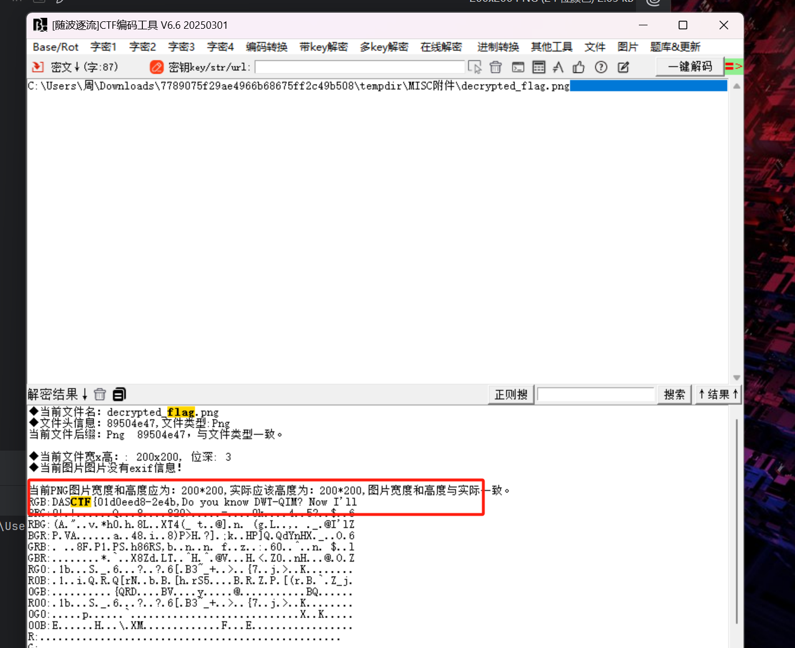

DASCTF{01d0eed8-2e4b

然后zsteg 得到 rgb头部放了个base转图片

解到这不会了

wm原题

```
https://blog.wm-team.cn/index.php/archives/80/#steg_allInOne
```

但是没看懂

使用原脚本

```
from PIL import Image
import numpy as np
from Crypto.Util.number import *
import matplotlib.pyplot as plt
import pywt
import cv2

p = Image.open('download.png').convert('RGB')
p_data = np.array(p)
R = p_data[:,:,0]
G = p_data[:,:,1].astype(np.float32)
B = p_data[:,:,2].astype(np.float32)

def string_to_bits(s):
    return bin(bytes_to_long(s.encode('utf-8')))[2:].zfill(8 * ((len(s) * 8 + 7) // 8))

def bits_to_string(b):
    n = int(b, 2)
    return long_to_bytes(n).decode('utf-8', 'ignore')

data = R.reshape(-1)%2
print(long_to_bytes(int(''.join([str(i) for i in data]),2)).replace(b'\x00',b''))

def extract_qim(block, delta):
    block_flat = block.flatten()
    avg = np.mean(block_flat)
    mod_value = avg % delta
    if mod_value < delta / 4 or mod_value > 3 * delta / 4:
        return '0'
    else:
        return '1'

def extract_watermark1(G_watermarked, watermark_length, delta=64):
    watermark_bits = []
    block_size = 8
    k = 0
    for i in range(0, G_watermarked.shape[0], block_size):
        for j in range(0, G_watermarked.shape[1], block_size):
            if k < watermark_length * 8:
                block = G_watermarked[i:i+block_size, j:j+block_size]
                if block.shape != (block_size, block_size):
                    continue
                coeffs = pywt.dwt2(block, 'haar')
                LL, (LH, HL, HH) = coeffs
                bit = extract_qim(LL, delta)
                watermark_bits.append(bit)
                k += 1

    # 将比特序列转换为字符串
    watermark_str = bits_to_string(''.join(watermark_bits))
    return watermark_str

print(extract_watermark1(G,253,8))

def dct2(block):
    return cv2.dct(block.astype(np.float32))

def idct2(block):
    return cv2.idct(block.astype(np.float32))

def svd2(matrix):
    U, S, V = np.linalg.svd(matrix, full_matrices=True)
    return U, S, V

def inverse_svd2(U, S, V):
    return np.dot(U, np.dot(np.diag(S), V))

def extract_watermark2(B_watermarked, B, watermark_length):
    h, w = B_watermarked.shape
    watermark_bits_extracted = []

    bit_index = 0

    for i in range(0, h, 8):
        for j in range(0, w, 8):
            if bit_index >= watermark_length * 8:
                break

            block_wm = B_watermarked[i:i+8, j:j+8]
            block_orig = B[i:i+8, j:j+8]

            dct_block_wm = dct2(block_wm)
            dct_block_orig = dct2(block_orig)

            U_wm, S_wm, V_wm = svd2(dct_block_wm)
            U_orig, S_orig, V_orig = svd2(dct_block_orig)

            delta_S = S_wm[0] - S_orig[0]

            if delta_S == 0:
                watermark_bits_extracted.append('1')
            else:
                watermark_bits_extracted.append('0')

            bit_index += 1

    watermark_bits_extracted = ''.join(watermark_bits_extracted)
    return bits_to_string(watermark_bits_extracted)

B_ori = np.array(Image.open('decrypted_flag.png').convert('L'))
print(extract_watermark2(B, B_ori, 83))
```

得到

```
Hey boy, I'm here to help you, now you'ze one step away from successl let me |ell you key:79557c2d8f94
```

接下来不会做了

# challenge

题目给的加密

```
import wave

def hide_message(input_wav, output_wav, message):
    with wave.open(input_wav, 'rb') as wav:
        params = wav.getparams()
        frames = wav.readframes(wav.getnframes())

    message_binary = ''.join(format(ord(char), '08b') for char in message)

    message_binary += '00000000'

    frames_array = bytearray(frames)

    if len(message_binary) > len(frames_array):
        raise ValueError("Message is too long to hide in the given audio file.")

    for i in range(len(message_binary)):
        frames_array[i] = (frames_array[i] & 253) | (int(message_binary[i]) << 1)

    with wave.open(output_wav, 'wb') as output_wav_file:
        output_wav_file.setparams(params)
        output_wav_file.writeframes(frames_array)

    print("successfully!")
```

ai解一下

```
import wave


def extract_message(input_wav):
    with wave.open(input_wav, 'rb') as wav:
        frames = wav.readframes(wav.getnframes())

    frames_array = bytearray(frames)
    message_binary = []

    for byte in frames_array:
        # 提取最低有效位的第二位（LSB隐写通常用最低位）
        bit = (byte >> 1) & 1
        message_binary.append(str(bit))

    # 将二进制字符串分割成8位一组
    binary_string = ''.join(message_binary)
    message = []

    # 查找终止符 '00000000'
    for i in range(0, len(binary_string), 8):
        byte = binary_string[i:i + 8]
        if byte == '00000000':  # 遇到终止符停止
            break
        message.append(chr(int(byte, 2)))

    return ''.join(message)


# 使用示例
hidden_message = extract_message('333.wav')  # 替换为你的输出文件名
print("提取的隐藏消息:", hidden_message)
```

拿到之后发现是反转的流量包

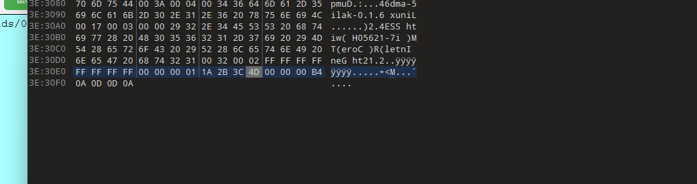

反转一下

icmp流量得到ttl加密

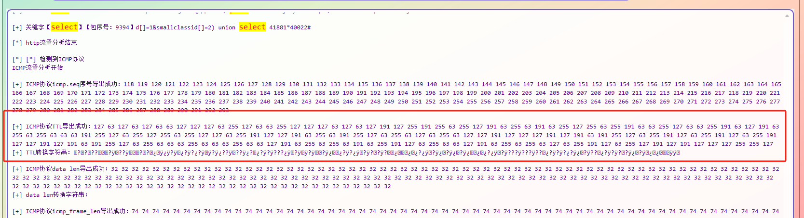

```
with open('2.txt') as f:
    # 读取所有数字（兼容每行单个或多个数字）
    n_num = []
    for line in f:
        nums = line.strip().split()
        for num in nums:
            if num.isdigit():
                n_num.append(int(num))
            else:
                print(f"跳过非数字: {num}")

# 提取每个数字二进制的前2位
binary_bits = ''.join([bin(num)[2:].zfill(8)[:2] for num in n_num])

# 每8位转ASCII
result = ''
for i in range(0, len(binary_bits), 8):
    byte = binary_bits[i:i+8]
    if len(byte) == 8:
        result += chr(int(byte, 2))

# 写入文件（强制UTF-8编码）
with open('output2.txt', 'w', encoding='utf-8') as f:
    f.write(result)
```

```
DASCTF{627848c0-759c-11ef-999f-000c290c196e}
```
