# Burp Suite 高并发重放测试的三种实战方法详解-先知社区

> **来源**: https://xz.aliyun.com/news/17643  
> **文章ID**: 17643

---

## 声明

本文所述内容仅用技术研究与学习目的。请勿将文中技术用于任何未授权的渗透测试或违法活动，因不当使用所引发的一切后果由使用者自行承担。

## 前言

在渗透测试过程中，我们有时需要以高并发的方式向目标系统发送大量请求，以绕过一些行为限制。例如，在短信验证码接口中，可能存在“一分钟内每个手机号只能请求一次”的限制，此时可以尝试通过高并发手段突破此类防护机制。

本文将介绍三种常用的**高并发重放**方法，并对其原理与实现方式进行深入解析：

* 方法一：Turbo Intruder 插件
* 方法二：Last-byte Synchronization technique
* 方法三：Single-packet Attack technique

## 原理介绍

### Turbo Intruder

Turbo Intruder 是由 PortSwigger 官方开发的 Burp 插件，基于 Jython 实现，底层利用 Java 的 NIO（非阻塞 I/O）机制，可在极短时间内完成大量请求的发送。该插件支持复杂逻辑编排和响应处理，能够在数秒内发出上万请求，是进行高并发测试的利器。

### Last-byte synchronization technique

Last-byte synchronization 是一种经典的并发利用技术，其核心思想是将每个 HTTP 请求分为两个部分发送：大部分内容作为“**请求头部**”，最后一个字节作为“**触发器**”。攻击者先将所有请求的“请求头部”发送到服务器，使服务器处于阻塞等待状态（未接收完整请求）。待所有请求就绪后，再同时发送最后一个字节，使服务器在几乎同一时刻处理所有请求，从而可能绕过某些并发判断逻辑或竞争条件。

适用协议分析：

|  |  |  |
| --- | --- | --- |
| 协议 | 是否支持 | 说明 |
| HTTP/1.1 | 支持 | 允许精确控制字节流 |
| HTTP/2 | 不支持 | 由于帧封装和多路复用，无法实现字节级控制 |

### Single-packet Attack Technique

Single-packet attack 是指将多个 HTTP 请求拼接在一个 TCP 包中发送，从而实现“一包多请求”的效果。该方法依赖于 HTTP/1.1 的 pipelining 特性，或 HTTP/2 的多路复用机制，能够有效提升并发速率并规避部分请求级别的检测。

适用协议分析：

|  |  |  |
| --- | --- | --- |
| 协议 | 是否支持 | 说明 |
| HTTP/1.1 | 支持 | 需开启 pipelining（串行无等待发送多个请求） |
| HTTP/2 | 支持 | 多路复用天然支持并行请求发送 |

## 使用方法

使用Burp Suite 官方靶场中《Lab: Limit overrun race conditions》实验进行演示。该实验是要让用户购买一个价值$1337的商品，购买商品时可以使用一张20%折扣优惠券，用户账户只有$50，按照常规思路是无法购买，需要通过高并发操作完成购买。

### Turbo Intruder

1、账户余额无法购买商品

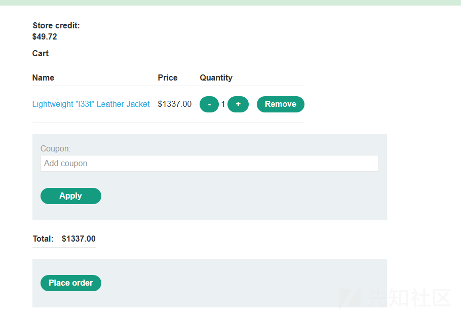

2、核销优惠券时拦截数据包，发至Turbo Intruder 插件，调整脚本进行高并发重放。

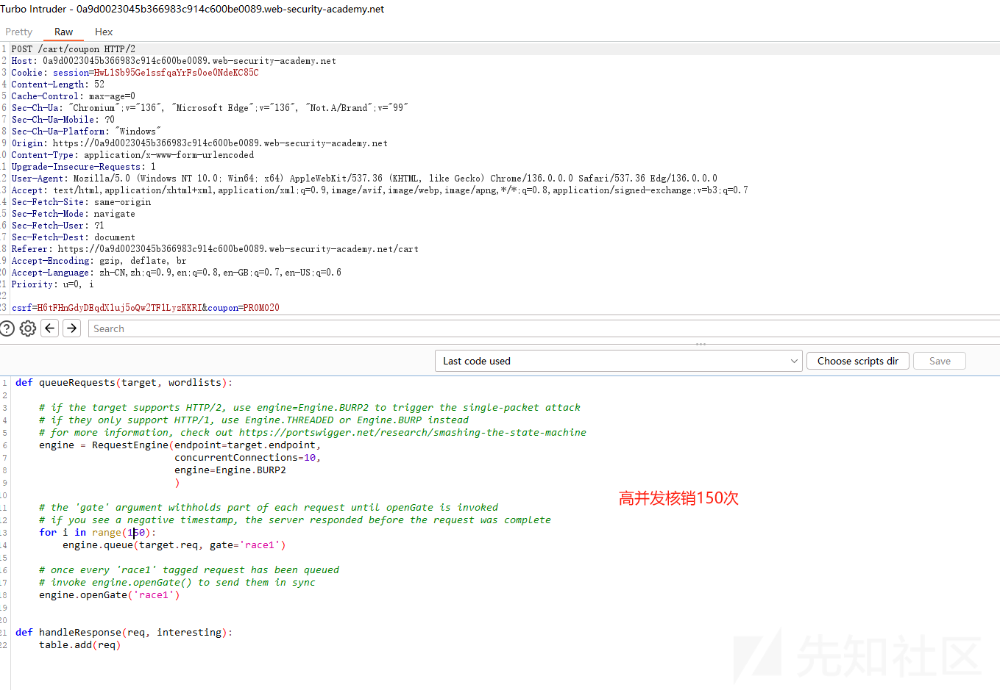

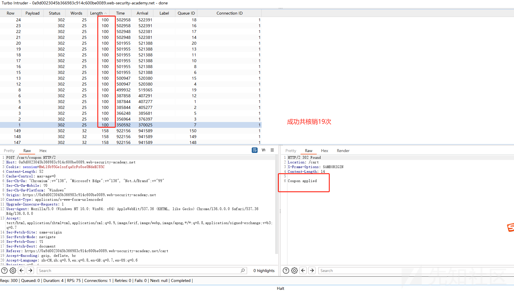

3、最总以低价成功购买。


脚本解释如下：

```
def queueRequests(target, wordlists):

    engine = RequestEngine(endpoint=target.endpoint,
                           concurrentConnections=10,
                           engine=Engine.BURP2
                          )

    for i in range(20):
        engine.queue(target.req, gate='race1')

    engine.openGate('race1')


def handleResponse(req, interesting):
    table.add(req) 

```

关键参数说明：

|  |  |  |  |
| --- | --- | --- | --- |
| 参数 | 必选 | 类型 | 说明 |
| endpoint | 是 | string | 请求目标的主机和端口 |
| concurrentConnections | 是 | int | 并发连接数 |
| requestsPerConnection | 是 | int | 每个连接上发送的请求数量 |
| engine | 否 | string | 请求发送引擎（如 BURP、BURP2、THREADED） |
| pipeline | 否 | bool | 是否启用 HTTP pipelining（仅适用于 HTTP/1.1） |

注意：使用 gate 标签（如 gate='race1'）可以将多个请求暂存，等 openGate('race1') 被调用时一并发出，实现高并发的效果。

### Last-byte synchronization technique

Burp Suite 2023.9 为 Burp Repeater添加了这些高并发功能。可以使用Burp Suite自带功能完成高并发操作，不用安装插件。Burp Suite 官方靶场是HTTP2协议，HTTP2不支持该种技术。特开发本 HTTP/1.1 协议的短信发送模拟服务。

```
# 每个手机号一分钟内只能发送一条
from flask import Flask, request, jsonify
import time
import threading

app = Flask(__name__)
app.config['JSON_AS_ASCII'] = False

# 模拟短信发送记录：{手机号: 上次发送时间}
send_records = {}
# 模拟短信发送函数
def send_sms(phone_number, content):
    print(f"向 {phone_number} 发送短信: {content}")
    # 实际场景中这里会调用短信服务商API
    return True

@app.route('/send_sms', methods=['POST'])
def flawed_send_sms():
    phone = request.json.get('phone')
    if not phone:
        return jsonify({'code': 400, 'msg': 'Phone No is Null'}), 400
    
    now = time.time()
    
    # 检查是否1分钟内发送过
    if phone in send_records:
        last_time = send_records[phone]
        # 缺陷点：非原子性检查和更新操作
        if now - last_time < 60:
            return jsonify({'code': 429, 'msg': 'Frequent sending, please try again later.'}), 429
    
    # 模拟短信发送耗时
    time.sleep(0.1)
    
    # 记录发送时间
    send_records[phone] = now
    
    # 发送短信
    if send_sms(phone, "Your Code ：123456"):
        return jsonify({'code': 200, 'msg': 'Send SMS Success'})
    else:
        return jsonify({'code': 500, 'msg': 'Send SMS Failed'}), 500

if __name__ == '__main__':
    app.run(debug=True)
```

1、先创建一个组，用于存放高并发的请求。

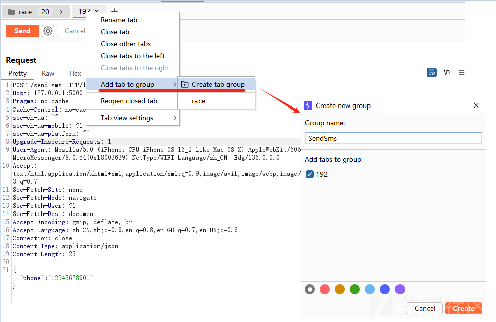

2、在组内添加高并发的请求，例如创建10个高并发请求。

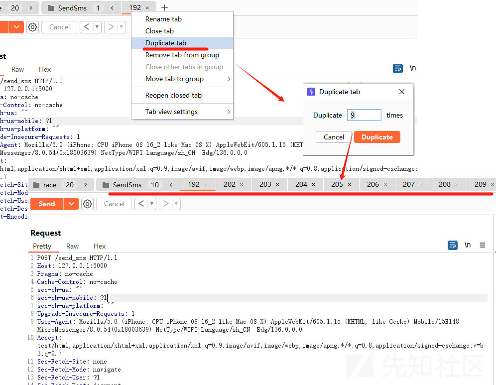

3、选择高并发技术，该网站是HTTP1.1协议，因此可以选择Last-byte synchronization。

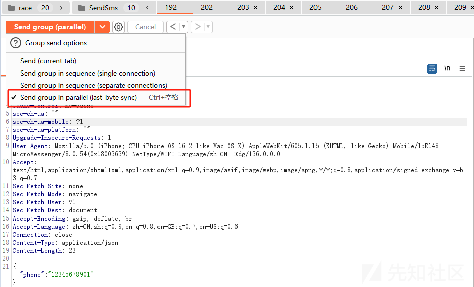

4、点击“send group （parallel）”即可高并发访问10次。

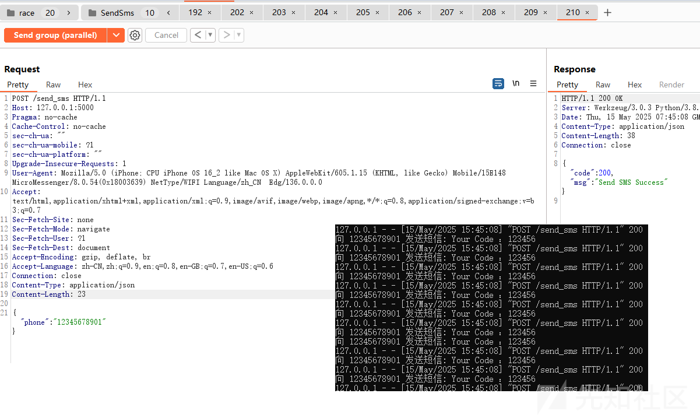

### Single-packet Attack Technique

Burp Suite 2023.9 为 Burp Repeater添加了这些高并发功能。可以使用Burp Suite自带功能完成高并发操作，避免插件安装。Burp Suite 官方靶场是HTTP2协议，以下使用Burp Suite 官方靶场中《Lab: Limit overrun race conditions》实验进行演示。

1、先创建一个组，用于存放高并发的请求。

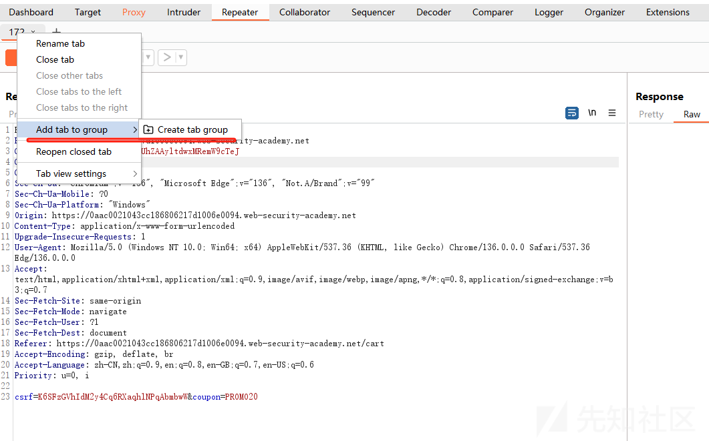

2、在组内添加高并发的请求，例如创建20个高并发请求。

### 

3、选择高并发技术，该网站是HTTP2协议，因此可以选择Single-packet Attack Technique。

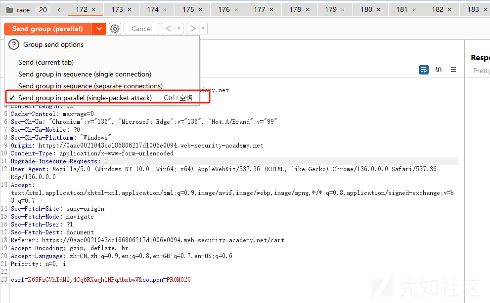

4、点击“send group （parallel）”即可高并发访问20次。

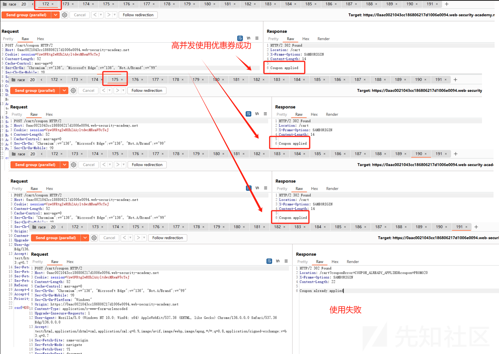

5、高并发共成功使用19次折扣券，1次未使用成功。

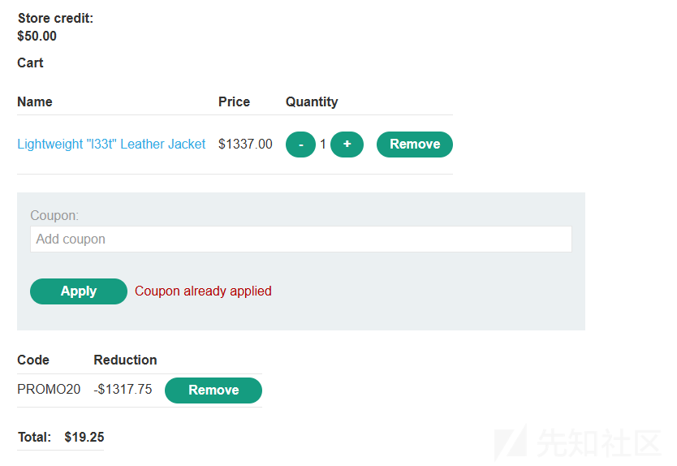

## 总结

高并发重放测试在渗透实践中具有重要意义，能够有效检验系统对并发场景的抗压能力与边界条件。本文介绍的三种方法各具特点，适用于不同的协议与测试需求：

|  |  |  |  |
| --- | --- | --- | --- |
| 技术 | 并发方式 | 适用协议 | 特点 |
| Turbo Intruder | 使用线程/引擎高并发 | HTTP/1.1 & HTTP/2 | 简单高效、可脚本化，需要安装插件 |
| Last-byte Sync | 拆分字节延迟发送 | HTTP/1.1 | Burp Suite 2023.9 以后得版本支持，无需借助第三方插件。 |
| Single-packet Attack | 拼接请求包同时发出 | HTTP/1.1 & HTTP/2 | Burp Suite 2023.9 以后得版本支持，无需借助第三方插件。 |

根据具体测试目标和协议环境选择合适方案，可以极大提升测试效率与成功率。

## 参考链接

* [官方靶场](https://portswigger.net/web-security/race-conditions/lab-race-conditions-limit-overrun)
* [Turbo Intruder 官方文档](https://portswigger.net/research/turbo-intruder-embracing-the-billion-request-attack)
* [官方参考文章](https://portswigger.net/web-security/race-conditions)
