# 新大网安协会专项赛(REVERSE)wp-先知社区

> **来源**: https://xz.aliyun.com/news/17646  
> **文章ID**: 17646

---

题目比较简单，也是ak了。还是有所收获的，学到了elf文件手动脱upx壳的方法。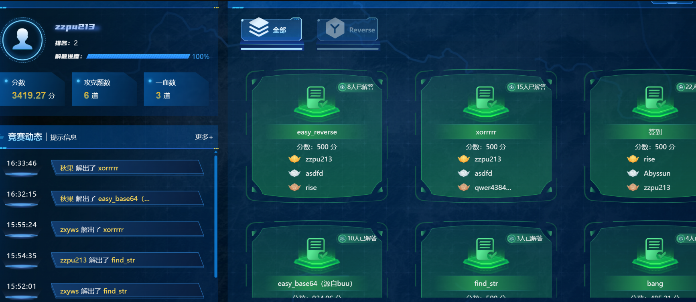

## easy\_reverse

查壳，64位无壳。

看看主函数，好像是buuctf的原题，逻辑很简单就是对flag也就是密文进行字符替换操作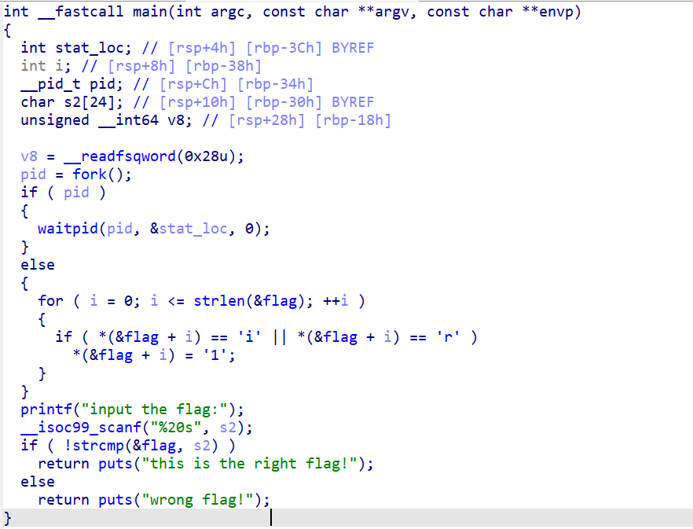

跟进看看flag的内容，发现就是明文字符串，手动给他替换了，包上flag头尾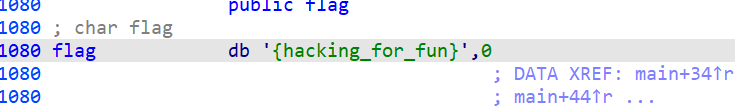

**flag{hack1ng\_fo1\_fun}**

## xorrrrr

下载过来是一个py文件，很简单的逻辑

```
def main():
    secret_key = 0x52
    encrypted_flag = b'4>35)%=\r!:;\r*;3=\r07<\r63</'
    user_input = input("Please enter the flag: ").encode()
    processed_input = bytes([b ^ secret_key for b in user_input])
    if processed_input == encrypted_flag:
        print("Congratulations!")
    else:
        print("Wrong! Try again.")
if __name__ == "__main__":
    main()
```

也就是输入的内容和key异或的结果最终和encrypted\_flag比较，异或回去就能知道输入的内容了。

```
secret_key = 0x52
encrypted_flag = b'4>35)%=\r!:;\r*;3=\r07<\r63</'
def xor(data, key):
    return bytes([x ^ key for x in data])
print(xor(encrypted_flag, secret_key))
#flag{wo_shi_xiao_ben_dan}
```

## 签到

打开就看到flag

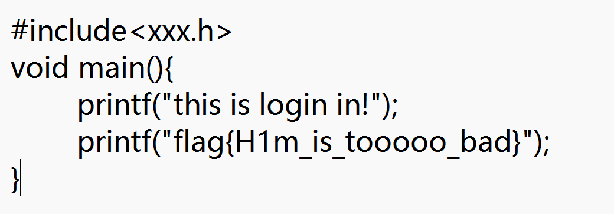

## easy\_base64（源自buu）

查壳，64位无壳

用c++写的，函数开头的一串base64字符比较显眼。这个字符就是密文，输入一串字符进行base64加密后和这个密文比较。跟进base64Encode函数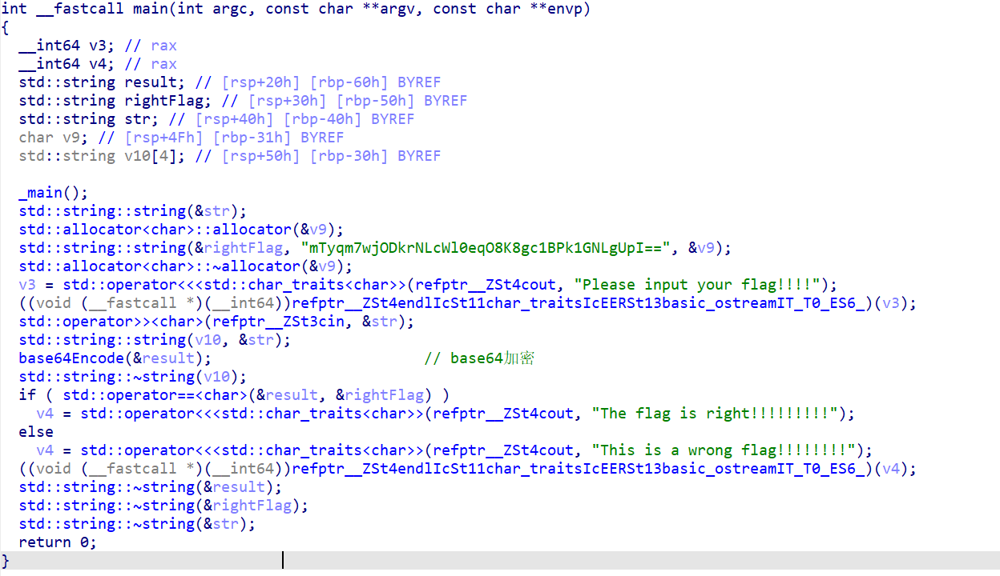

这个basekey看看交叉引用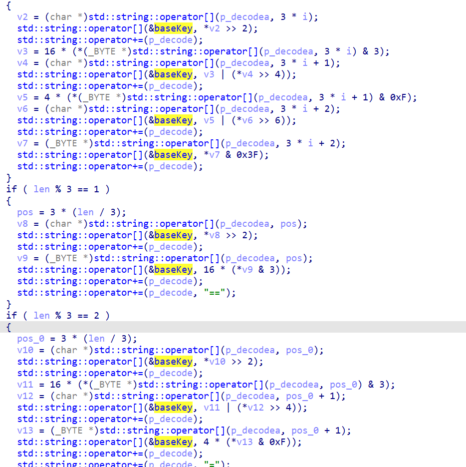

发现是一个换表base64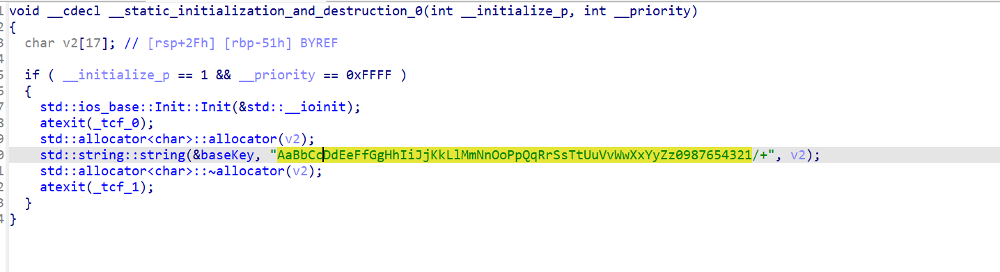

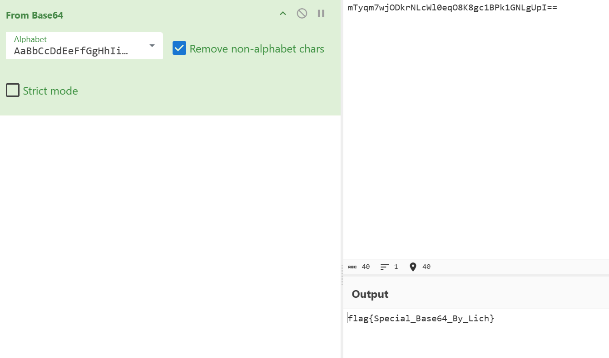

## find\_str

查壳，64位elf文件，加了upx壳。卡了我好久，估计是改了标志位，用工具脱不掉。不是很熟悉elf加壳后的标志位，于是使用手工脱壳。用ida连linux远程调试这个文件，找到函数入口点。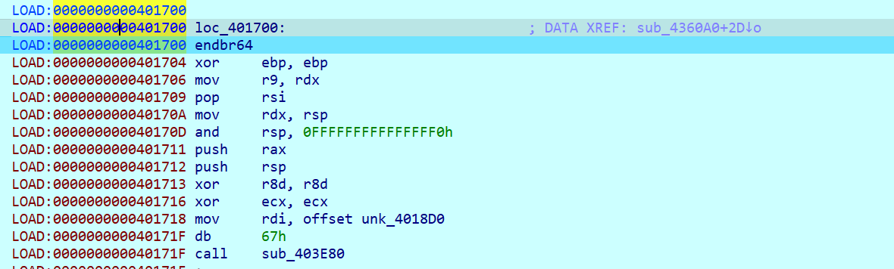

参考这篇文章[Linux逆向之加壳&脱壳-先知社区](https://xz.aliyun.com/news/6477?time__1311=YqIxgQG%3D0%3DqiqGNDQiiQd5xWqD5obdk2bD&u_atoken=7a38eb0ded3457d2ce5b45c285361cf7&u_asig=1a0c399717435809263345075e0037)的脱壳脚本，这道题卡了半天，一直在问ai怎么写脱壳脚本，ai还是不太智能。。。搞半天一直报错。。。

```
#include <idc.idc>
#define PT_LOAD              1
#define PT_DYNAMIC           2
static main(void)
{
         auto ImageBase,StartImg,EndImg;
         auto e_phoff;
         auto e_phnum,p_offset;
         auto i,dumpfile;
         ImageBase=0x400000;
         StartImg=0x400000;
         EndImg=0x0;
         if (Dword(ImageBase)==0x7f454c46 || Dword(ImageBase)==0x464c457f )
  {
    if(dumpfile=fopen("E:\dumpfile","wb"))
    {
      e_phoff=ImageBase+Qword(ImageBase+0x20);
      Message("e_phoff = 0x%x
", e_phoff);
      e_phnum=Word(ImageBase+0x38);
      Message("e_phnum = 0x%x
", e_phnum);
      for(i=0;i<e_phnum;i++)
      {
         if (Dword(e_phoff)==PT_LOAD || Dword(e_phoff)==PT_DYNAMIC)
                         {
                                 p_offset=Qword(e_phoff+0x8);
                                 StartImg=Qword(e_phoff+0x10);
                                 EndImg=StartImg+Qword(e_phoff+0x28);
                                 Message("start = 0x%x, end = 0x%x, offset = 0x%x
", StartImg, EndImg, p_offset);
                                 dump(dumpfile,StartImg,EndImg,p_offset);
                                 Message("dump segment %d ok.
",i);
                         }   
         e_phoff=e_phoff+0x38;
      }
 
      fseek(dumpfile,0x3c,0);
      fputc(0x00,dumpfile);
      fputc(0x00,dumpfile);
      fputc(0x00,dumpfile);
      fputc(0x00,dumpfile);
 
      fseek(dumpfile,0x28,0);
      fputc(0x00,dumpfile);
      fputc(0x00,dumpfile);
      fputc(0x00,dumpfile);
      fputc(0x00,dumpfile);
      fputc(0x00,dumpfile);
      fputc(0x00,dumpfile);
      fputc(0x00,dumpfile);
      fputc(0x00,dumpfile);
 
      fclose(dumpfile);
        }else Message("dump err.");
 }
}
static dump(dumpfile,startimg,endimg,offset)
{
        auto i;
        auto size;
        size=endimg-startimg;
        fseek(dumpfile,offset,0);
        for ( i=0; i < size; i=i+1 )
        {
        fputc(Byte(startimg+i),dumpfile);
        }
}
```

成功dump下来脱壳后的文件，贴一下主函数的代码

```
__int64 __fastcall sub_4018D0(int a1, __int64 a2)
{
  int v2; // edx
  int v3; // ecx
  int v4; // r8d
  int v5; // r9d
  int v6; // edx
  int v7; // ecx
  int v8; // r8d
  int v9; // r9d
  __int64 v10; // rax
  int i; // [rsp+Ch] [rbp-64h]
  char v13[36]; // [rsp+10h] [rbp-60h] BYREF
  unsigned int v14; // [rsp+34h] [rbp-3Ch]
  int v15; // [rsp+38h] [rbp-38h]
  char v16; // [rsp+3Fh] [rbp-31h]
  char v17[32]; // [rsp+40h] [rbp-30h] BYREF
  __int64 v18; // [rsp+60h] [rbp-10h]
  int v19; // [rsp+68h] [rbp-8h]
  int v20; // [rsp+6Ch] [rbp-4h]

  v20 = 0;
  v19 = a1;
  v18 = a2;
  strcpy(v17, "02CD290D5ACE1A83");
  sub_404C00(506LL);
  v16 = 1;
  v15 = sub_4010C8(v17);
  v14 = (int)sub_404BF0() % v15;
  sub_401090(v13, 0LL, 32LL);
  printf((unsigned int)"Input: ", 0, v2, v3, v4, v5);
  scanf((unsigned int)"%s", (unsigned int)v13, v6, v7, v8, v9);
  v10 = sub_4010C8(v13);
  if ( v10 == v15 )
  {
    sub_401830(v13, v14);
    for ( i = 0; i < v15; ++i )
    {
      if ( v17[i] != v13[i] )
      {
        v16 = 0;
        break;
      }
    }
  }
  else
  {
    v16 = 0;
  }
  if ( (v16 & 1) != 0 )
    puts("OK!");
  else
    puts("NO!");
  return 0LL;
}
```

主要逻辑就是v17是密文，然后读取v13，进入sub\_401830函数进行加密了，然后和密文比对。

动调一下程序，获取v14的值是0xB

```
__int64 __fastcall sub_401830(_BYTE *a1, int a2)
{
  __int64 result; // rax
  int j; // [rsp+4h] [rbp-1Ch]
  unsigned int i; // [rsp+8h] [rbp-18h]
  char v5; // [rsp+Fh] [rbp-11h]
  int v6; // [rsp+10h] [rbp-10h]

  v6 = sub_4010C8();
  for ( i = 0; ; ++i )
  {
    result = i;
    if ( (int)i >= a2 )
      break;
    v5 = a1[v6 - 1];
    for ( j = v6 - 1; j > 0; --j )
      a1[j] = a1[j - 1];
    *a1 = v5;
  }
  return result;
}
```

将数组右移一个字节，移了0xB次，写脚本直接还原

```
def rotate_left(s, shift):
    """字符串循环左移函数"""
    shift = shift % len(s)
    return s[shift:] + s[:shift]
 
# 硬编码的正确字符串
HARDCODED_STR = "02CD290D5ACE1A83"
 
# 指定的左移次数
shift_amount = 0xB  # 11次
 
# 计算左移后的字符串
shifted_str = rotate_left(HARDCODED_STR, shift_amount)
 
# 输出结果
print(f"Original String: {HARDCODED_STR}")
print(f"Shifted String (Left by {shift_amount} positions): {shifted_str}")
#E1A8302CD290D5AC
```

## bang

一个apk，jadx打开发现找不到程序入口点。用雷电分析，发现加壳了，直接脱壳就行了，这里用了自动脱壳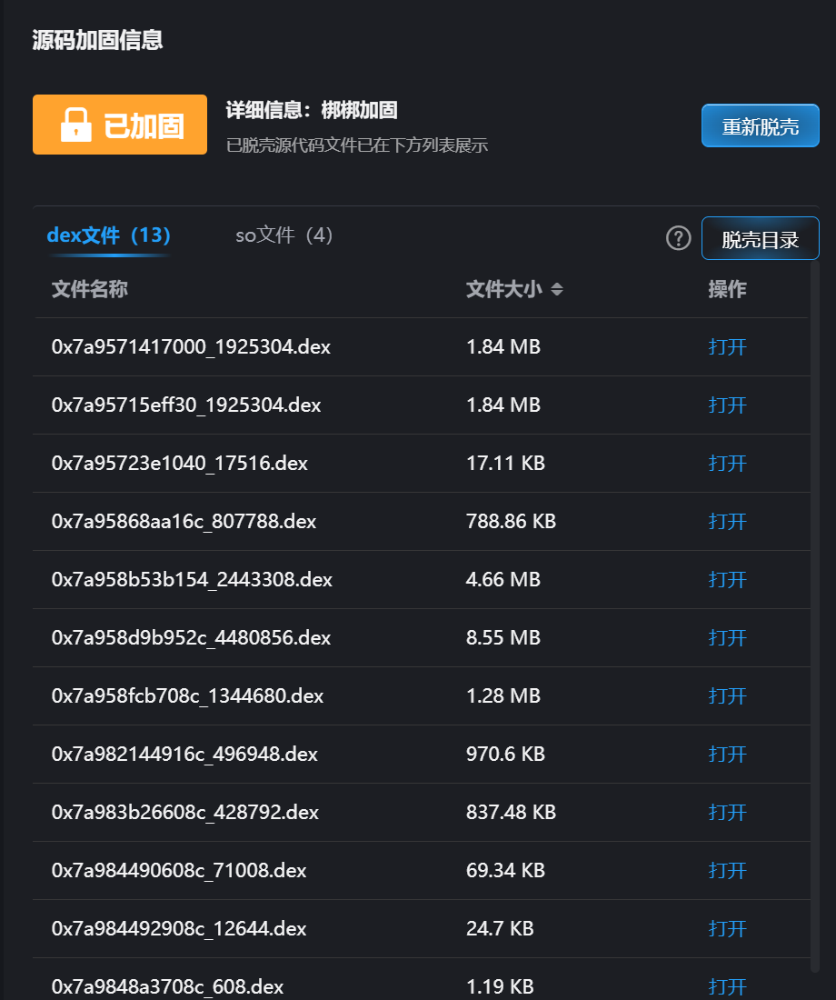

分析dex文件，找到了入口点，以及主逻辑，就是equals判断账户密码是不是对的，对的话就返回flag，其实这里返回的flag已经明文写出来了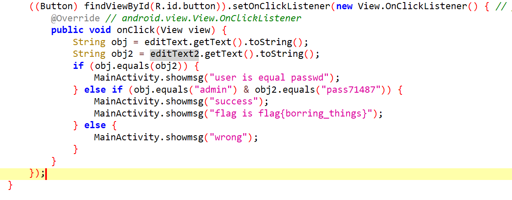

可以启动程序验证一下

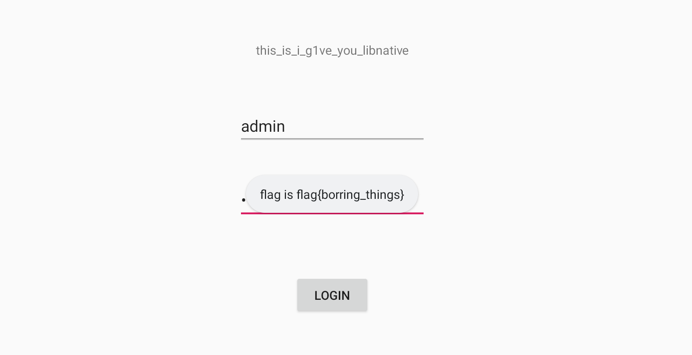
