# JAVA代审-admintwo-先知社区

> **来源**: https://xz.aliyun.com/news/17651  
> **文章ID**: 17651

---

# 项目介绍

代码分享网是用java语言开发的，采用的框架是：struts2+spring+spring jdbc，其中struts2仅仅作为转发功能使用，你可以很方便的修改成spring mvc版本

# 环境搭建

项目地址：<https://gitee.com/xujiangfei/admintwo>

下载到本地后采用传统JAVAweb项目方式部署

环境准备

```
JDK-1.8.0_202
apache-maven-3.8.8
Tomcat-8.5.0
Mysql-5.7.26
```

源码下载到本地后IDEA打开

根据数据库配置文件创建对应数据库并修改连接账号密码

配置文件：src/jdbc.properties

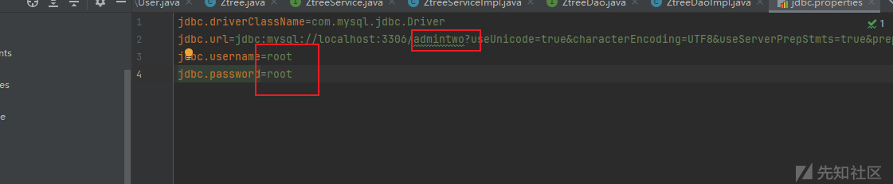

导入SQL文件，文件路径：

src/admintwo.sql

src/练习.sql

编码格式采用utf8 utf8-bin

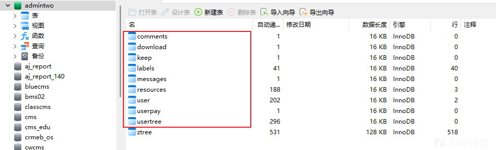

然后配置项目启动

项目结构中模块配置

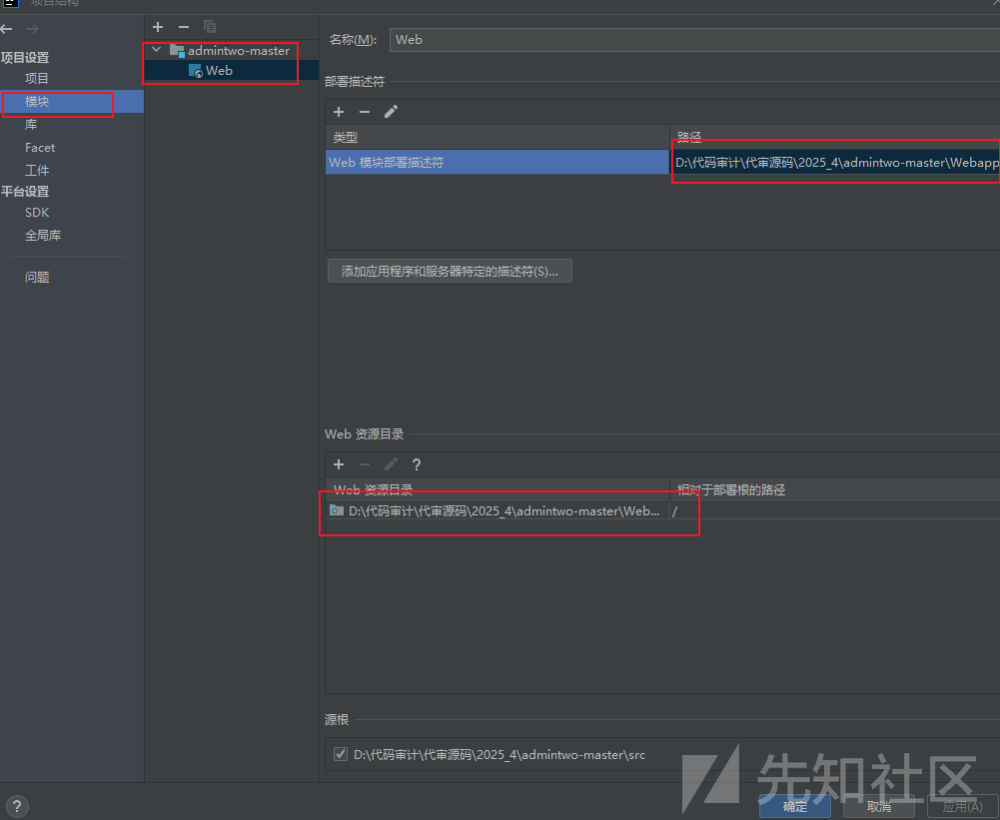

库中加上tomcat依赖包

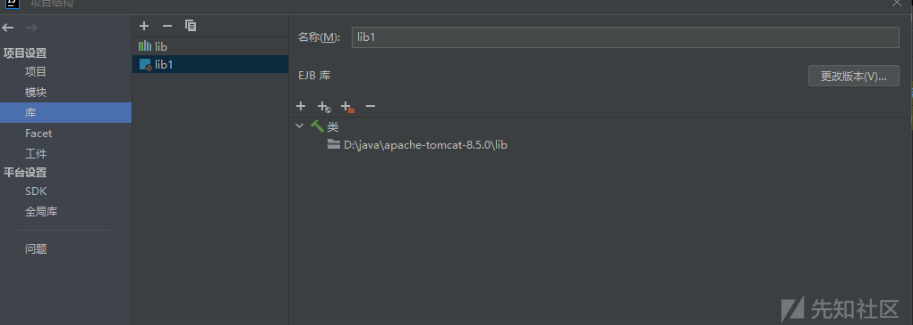

最后配置工件

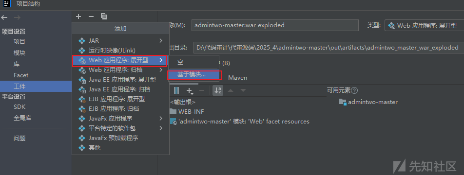

接着配置本地tomcat，启动项目即可

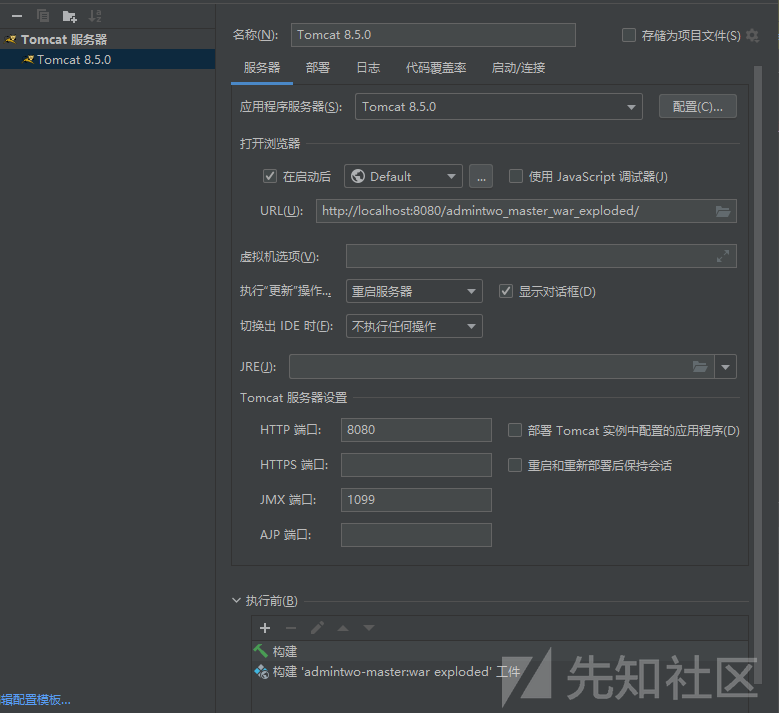

# 代码审计

## 登入逻辑

抓个登入的数据包看下处理登入逻辑的代码

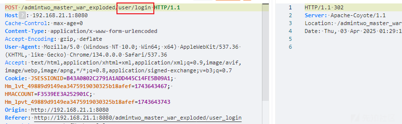

```
	public String login() {
		// 由于js+ajax判断用户登录情况，可以肯定用户登录成功。
		// 登录成功后，根据email获取该账户的所有信息，放到session中
		com.admintwo.model.User user = userService.getUserByEmail(email);
		System.out.println("====user/login加密密码：" + ToolsUtils.MD5(pass));
		// 获取用户之前浏览记录
		if (user.getPassword().equals(ToolsUtils.MD5(pass))) {
			HttpServletRequest request = ServletActionContext.getRequest();
			request.getSession().setAttribute("user", user);
			path = (String) request.getSession().getAttribute("userURL");
			if (path != null && path != "") {
				System.out.println("====user/login登录之前的路径：" + path);
				return "userPath";
			} else {
				return SUCCESS;
			}
		}
		return ERROR;
	}
```

通过用户传入的email带入数据库查询获取用户个人信息，然后检查用户密码的md5是否对应，然后把用户个人信息更新到Session中，那么这里测试接口的时候我们就要关注对应方法是否有对Session进行检查

## 未授权用户信息遍历

/user/home 接口存在未授权访问，这个点是从黑盒测的因为网站的主要身份标识的email无论是越权测试还是其它都需要email，所以就去寻找可以返回email的接口，然后就找到这个

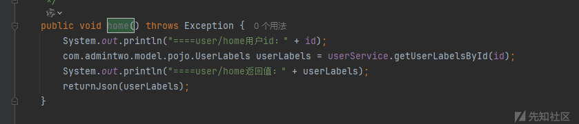

这个接口从功能点触发没有校验我们查询的用户id和session中的用户email是否匹配，并且这个接口没有检测session，所以可以通过增加id未授权遍历网站用户信息

数据包

```
POST /admintwo_master_war_exploded/user/home HTTP/1.1
Host: 192.168.21.1:8080
Referer: http://192.168.21.1:8080/admintwo_master_war_exploded/user_home?id=201
Accept-Language: zh-CN,zh;q=0.9
Origin: http://192.168.21.1:8080
Accept-Encoding: gzip, deflate
X-Requested-With: XMLHttpRequest
Accept: application/json, text/javascript, */*; q=0.01
Content-Type: application/x-www-form-urlencoded; charset=UTF-8
User-Agent: Mozilla/5.0 (Windows NT 10.0; Win64; x64) AppleWebKit/537.36 (KHTML, like Gecko) Chrome/134.0.0.0 Safari/537.36
Content-Length: 6

id=201
```

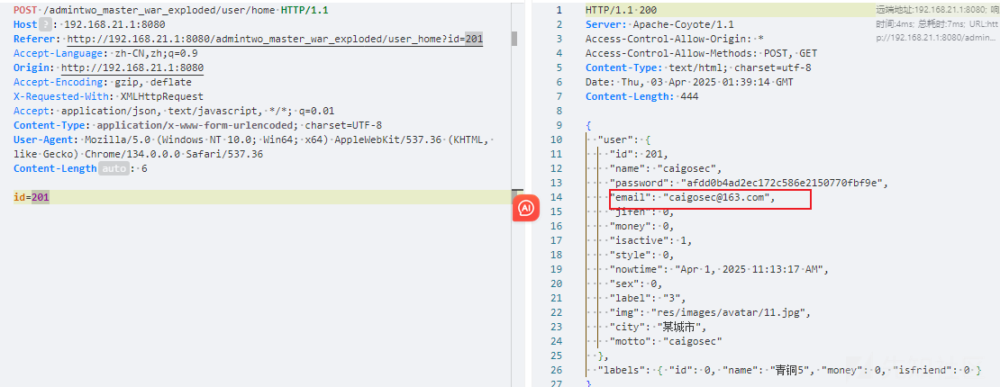

## 水平越权

在前面我也说了大部分功能点的身份标识都是email，那么我们就关注哪些功能点的email我们可控即可，配合前面的未授权用户信息遍历可以打组合拳

找到一个/user/updateSet

修改用户信息的功能点

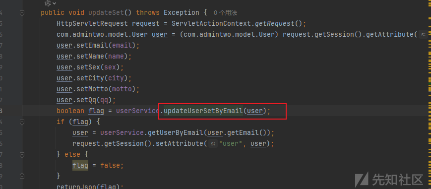

跟进updateUserSetByEmail方法

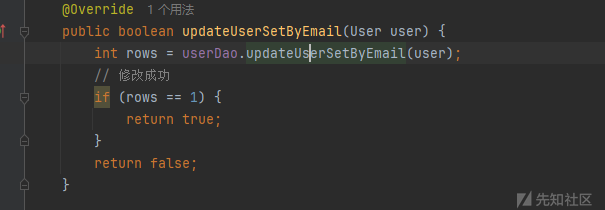

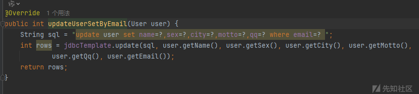

可以看到这里是以email为条件更新数据，并且没有校验session中的email和传入的是否一致

测试

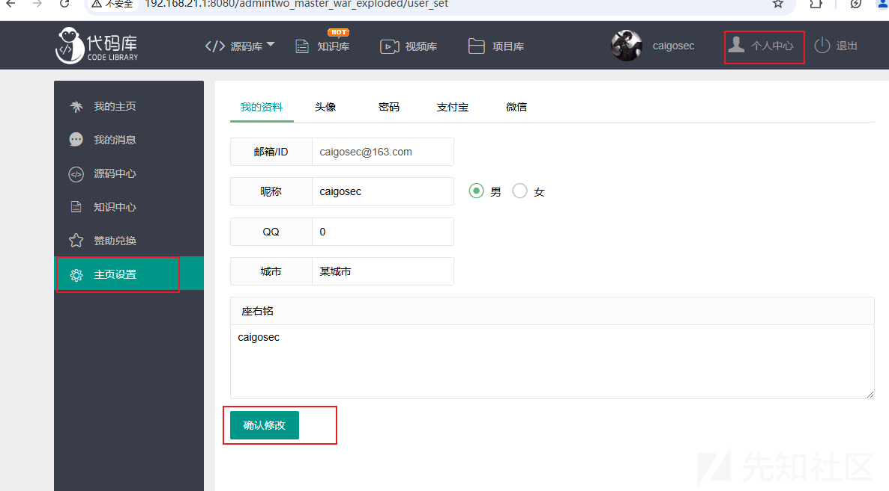

发送请求

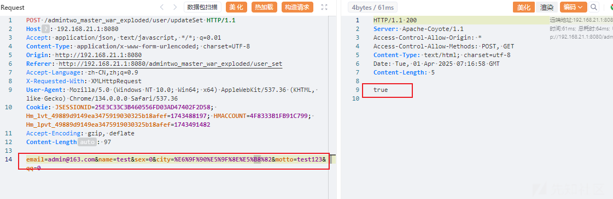

返回true，看下数据库中数据

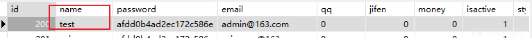  
 修改成功

## 任意用户登入

这个是无意中出的，还是/user/updateSet接口，我们关注下更新往数据后的代码逻辑

```
		boolean flag = userService.updateUserSetByEmail(user);
		if (flag) {
			user = userService.getUserByEmail(user.getEmail());
			request.getSession().setAttribute("user", user);
		} else {
			flag = false;
		}
		returnJson(flag);
	}
```

当我们修改完用户信息后，会再执行一次登入的逻辑，通过修改用户的Email获取用户信息，更新到Session，这样我们的身份信息就是我们越权修改数据对应的Email用户的了，照成了任意用户登入

## XSS

这个比较多，随便拿一个演示下

漏洞点在源码库——>分享源码——>标题

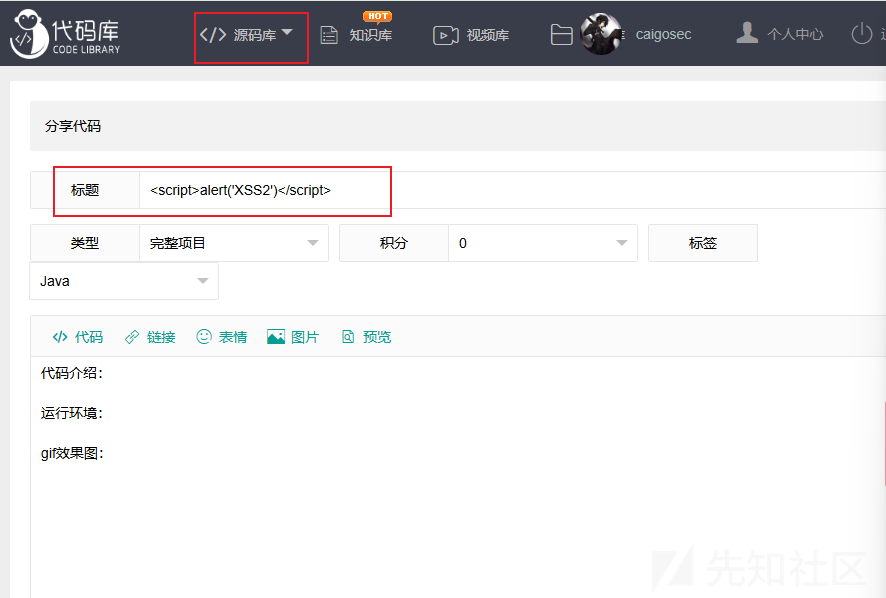

这里没有对我们传入的标题进行限制，也没有实体编码

发布内容后访问首页源码库即可触发

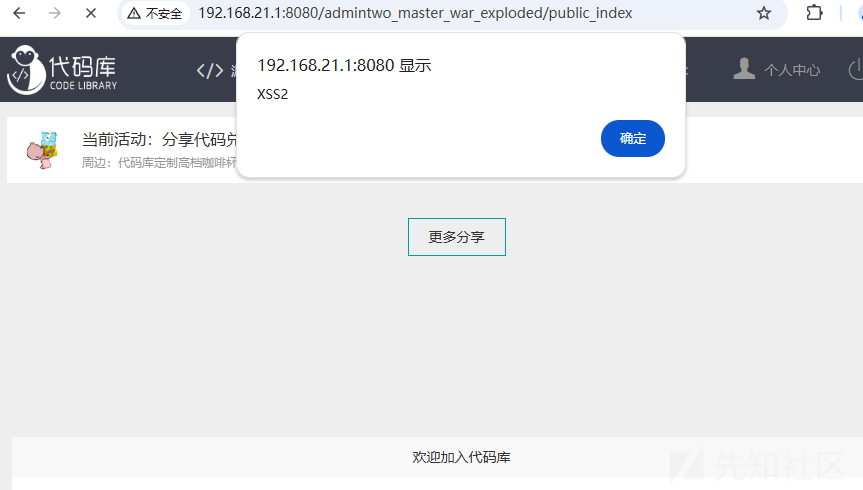​

## CSRF

项目代码中为发现预防csrf漏洞的组件以及代码，在src/com/qq/connect/demo/AfterLoginRedirectServlet.java中有疑似预防代码

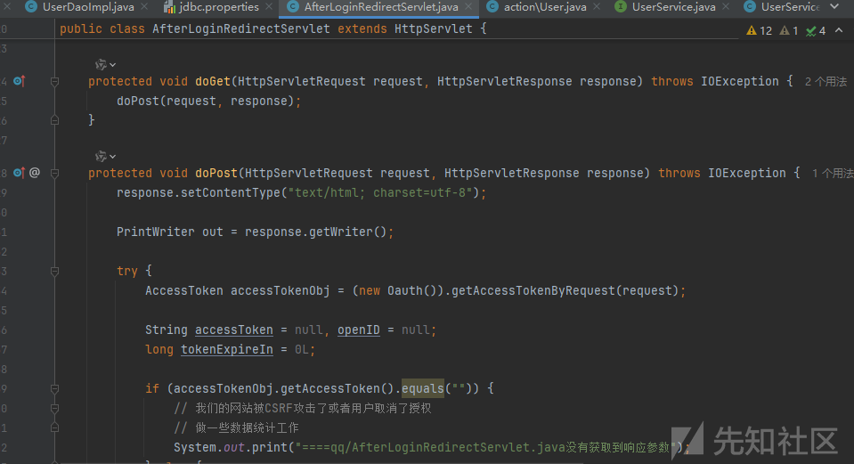​

但是代码中只检测到`accessTokenObj.getAccessToken().equals("")`时仅记录日志，没有正确处理CSRF或取消授权的情况，那么基本判断存在

随便找一处功能点测试

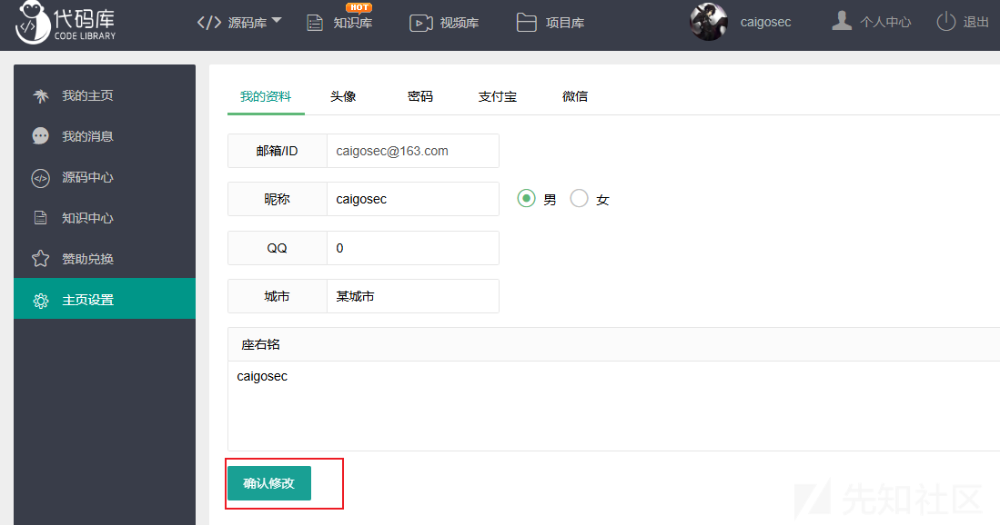保存信息抓包，修改个用户名，生成CSRF\_POC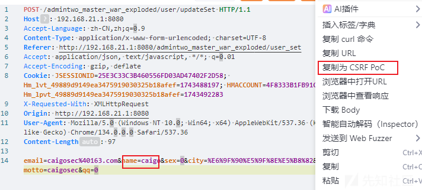传到远程服务器上模拟管理员点击

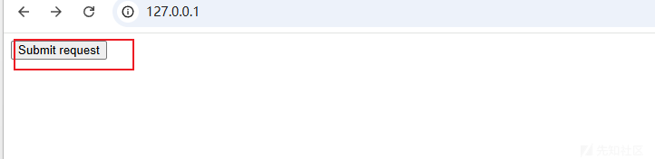

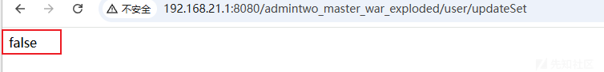

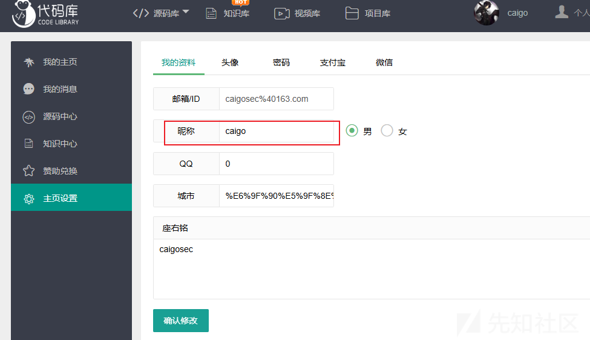

信息成功被修改
