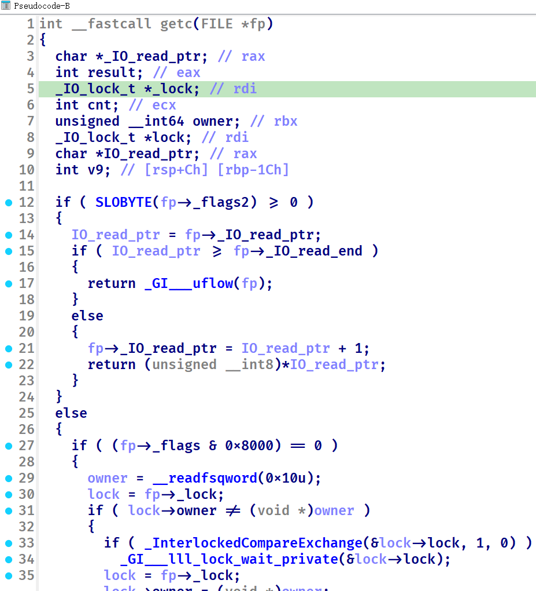
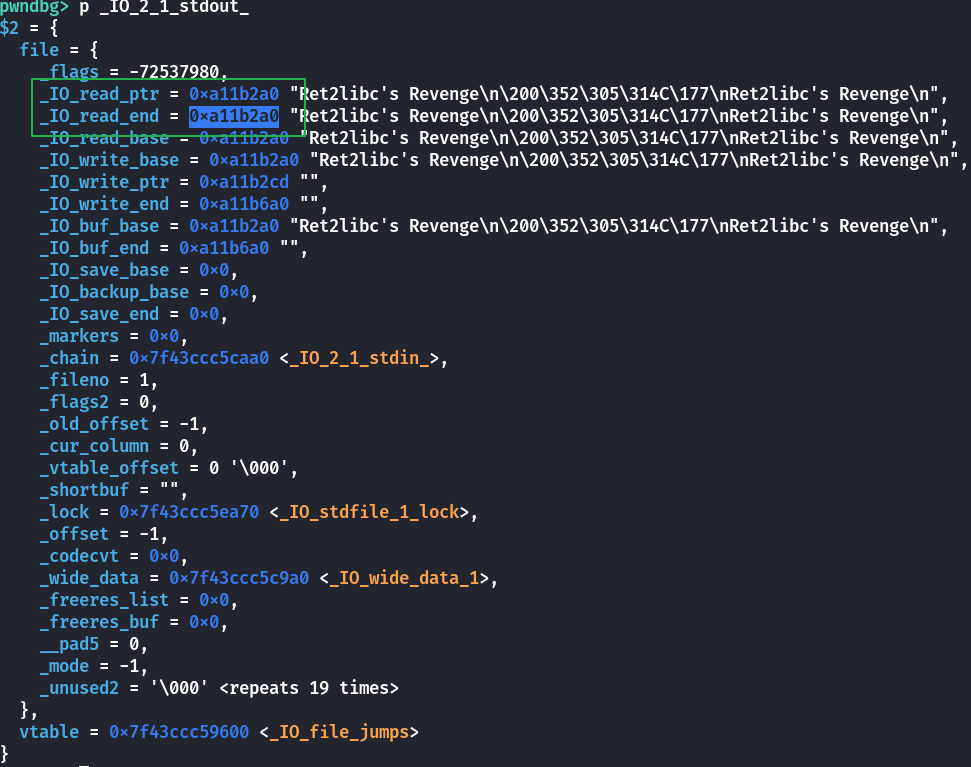
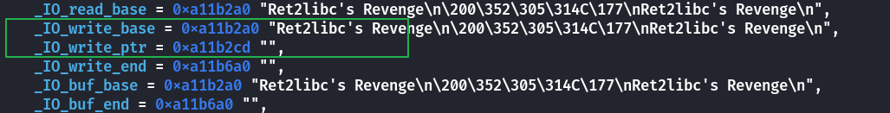
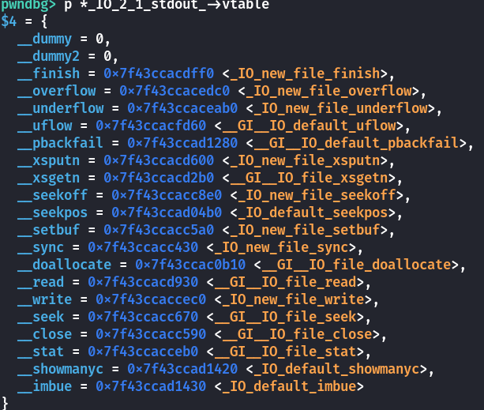
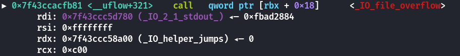
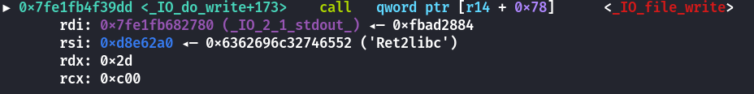
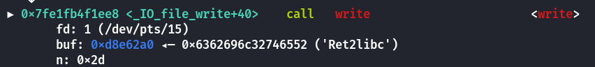

# 使用fgetc冲破全缓冲-先知社区

> **来源**: https://xz.aliyun.com/news/17661  
> **文章ID**: 17661

---

XYCTF2025中的Ret2libc's Revenge  
这道题真的做我难受，使用了三种方法

1. 改`main`函数的返回地址`libc_start_call_main`后`ogg`但是要爆破,可能性是4096分之一。本机`aslr`开启以后可以爆进去，但是不能执行`cat /flag`
2. 使用`elf`的相关`gadget`控制`rdi`再执行`call puts`从而将`libc`地址写入输出缓冲区。再写上`0x3e`个执行`call puts`的语句把缓冲区塞满，最后输出`libc`。可是远程不行！开始以为是缓冲区大小不一样，但是我写了一个循环去试，没试出来。
3. 使用`elf`的相关`gadget`控制`rdi`为`stdout`，再调用`fgetc@plt`就可以刷新缓冲区。因为我控制不了`rcx`为2从而执行`setvbuf`，所以想试试`fgetc`是否有奇效。

# setvbuf

```
int init()
{
  setvbuf(stdout, 0LL, 0, 0LL);
  return setvbuf(stdin, 0LL, 2, 0LL);
}
```

setvbuf函数，它有三种mode：

```
全缓冲：（_IOFBF）0，缓冲区满 或 调用fflush() 后输出缓冲区内容。
行缓冲：（_IOLBF）1，缓冲区满 或 遇到换行符 或 调用fflush() 后输出缓冲区内容。
无缓冲：（_IONBF）2，直接输出。
```

也就是说，要想使缓冲区的地址打印出来，有以下思路：

1. 重新设置setvbuf，但这不知道管不管用，没法尝试因为这需要4个参数，没法控制rdx和rcx
2. 调用fflush(stdout)，但是需要泄露libc地址，死循环，这里做不到
3. 挤爆缓冲区，自然就会把内容打印出来了  
   这三种思路我都没走通，干脆走其他路子--那就是使用fgetc刷新缓冲区。

# 原理分析

`fgetc`定义：

```
#/glibc-2.35/libio/getc.c
int
_IO_getc (FILE *fp)
{
  int result;
  CHECK_FILE (fp, EOF);
  if (!_IO_need_lock (fp))
    return _IO_getc_unlocked (fp);
  _IO_acquire_lock (fp);
  result = _IO_getc_unlocked (fp);
  _IO_release_lock (fp);
  return result;
}
```

啥也看不出来，把`libc.so.6`丢到`ida`里。  
  
判断了`fp->_IO_read_pt >= fp->_IO_read_end`   
  
如果将`fp`设置为`stdout`,也就是控制`rdi`。那么我们可以看到这两个值是相等的。所以程序会进入`__uflow`,跟进去看看。

定义如下：

```
#/glibc-2.35/libio/genops.c
int
__uflow (FILE *fp)
{
  if (_IO_vtable_offset (fp) == 0 && _IO_fwide (fp, -1) != -1)
    return EOF;

  if (fp->_mode == 0)
    _IO_fwide (fp, -1);
  if (_IO_in_put_mode (fp))
    if (_IO_switch_to_get_mode (fp) == EOF) #进入这里
      return EOF;
  if (fp->_IO_read_ptr < fp->_IO_read_end)
    return *(unsigned char *) fp->_IO_read_ptr++;
  if (_IO_in_backup (fp))
    {
      _IO_switch_to_main_get_area (fp);
      if (fp->_IO_read_ptr < fp->_IO_read_end)
    return *(unsigned char *) fp->_IO_read_ptr++;
    }
  if (_IO_have_markers (fp))
    {
      if (save_for_backup (fp, fp->_IO_read_end))
    return EOF;
    }
  else if (_IO_have_backup (fp))
    _IO_free_backup_area (fp);
  return _IO_UFLOW (fp);
}
libc_hidden_def (__uflow)
```

可以看到会执行到`_IO_switch_to_get_mode`这个位置。

定义如下：

```
#/glibc-2.35/libio/genops.c
int
_IO_switch_to_get_mode (FILE *fp)
{
  if (fp->_IO_write_ptr > fp->_IO_write_base) #关键
    if (_IO_OVERFLOW (fp, EOF) == EOF)
      return EOF;
  if (_IO_in_backup (fp))
    fp->_IO_read_base = fp->_IO_backup_base;
  else
    {
      fp->_IO_read_base = fp->_IO_buf_base;
      if (fp->_IO_write_ptr > fp->_IO_read_end)
    fp->_IO_read_end = fp->_IO_write_ptr;
    }
  fp->_IO_read_ptr = fp->_IO_write_ptr;

  fp->_IO_write_base = fp->_IO_write_ptr = fp->_IO_write_end = fp->_IO_read_ptr;

  fp->_flags &= ~_IO_CURRENTLY_PUTTING;
  return 0;
}
libc_hidden_def (_IO_switch_to_get_mode)
```

学过`IO`的师傅们就轻车熟路了。`fp->_IO_write_ptr > fp->_IO_write_base`这条判断显然是成立的。那么就会进入`_IO_OVERFLOW`,`#define _IO_OVERFLOW(FP, CH) JUMP1 (__overflow, FP, CH)`  
就是说会调用`stdout`vtable中的`__overflow`。实际上就是调用`_IO_new_file_overflow`。  
  
  
源码如下:

```
#/glibc/glibc-2.35/libio/fileops.c
int
_IO_new_file_overflow (FILE *f, int ch)
{
  if (f->_flags & _IO_NO_WRITES) /* SET ERROR */
    {
      f->_flags |= _IO_ERR_SEEN;
      __set_errno (EBADF);
      return EOF;
    }
  /* If currently reading or no buffer allocated. */
  if ((f->_flags & _IO_CURRENTLY_PUTTING) == 0 || f->_IO_write_base == NULL)
    {
      /* Allocate a buffer if needed. */
      if (f->_IO_write_base == NULL)
    {
      _IO_doallocbuf (f);
      _IO_setg (f, f->_IO_buf_base, f->_IO_buf_base, f->_IO_buf_base);
    }
      /* Otherwise must be currently reading.
     If _IO_read_ptr (and hence also _IO_read_end) is at the buffer end,
     logically slide the buffer forwards one block (by setting the
     read pointers to all point at the beginning of the block).  This
     makes room for subsequent output.
     Otherwise, set the read pointers to _IO_read_end (leaving that
     alone, so it can continue to correspond to the external position). */
      if (__glibc_unlikely (_IO_in_backup (f)))
    {
      size_t nbackup = f->_IO_read_end - f->_IO_read_ptr;
      _IO_free_backup_area (f);
      f->_IO_read_base -= MIN (nbackup,
                   f->_IO_read_base - f->_IO_buf_base);
      f->_IO_read_ptr = f->_IO_read_base;
    }

      if (f->_IO_read_ptr == f->_IO_buf_end)
    f->_IO_read_end = f->_IO_read_ptr = f->_IO_buf_base;
      f->_IO_write_ptr = f->_IO_read_ptr;
      f->_IO_write_base = f->_IO_write_ptr;
      f->_IO_write_end = f->_IO_buf_end;
      f->_IO_read_base = f->_IO_read_ptr = f->_IO_read_end;

      f->_flags |= _IO_CURRENTLY_PUTTING;
      if (f->_mode <= 0 && f->_flags & (_IO_LINE_BUF | _IO_UNBUFFERED))
    f->_IO_write_end = f->_IO_write_ptr;
    }
  if (ch == EOF)
    return _IO_do_write (f, f->_IO_write_base,
             f->_IO_write_ptr - f->_IO_write_base);
  if (f->_IO_write_ptr == f->_IO_buf_end ) /* Buffer is really full */
    if (_IO_do_flush (f) == EOF)
      return EOF;
  *f->_IO_write_ptr++ = ch;
  if ((f->_flags & _IO_UNBUFFERED)
      || ((f->_flags & _IO_LINE_BUF) && ch == '
'))
    if (_IO_do_write (f, f->_IO_write_base,
              f->_IO_write_ptr - f->_IO_write_base) == EOF)
      return EOF;
  return (unsigned char) ch;
}
libc_hidden_ver (_IO_new_file_overflow, _IO_file_overflow)
```

一些重要的魔数定义如下：

```
#define _IO_MAGIC         0xFBAD0000 /* Magic number */
#define _IO_MAGIC_MASK    0xFFFF0000
#define _IO_USER_BUF          0x0001 /* Don't deallocate buffer on close. */
#define _IO_UNBUFFERED        0x0002
#define _IO_NO_READS          0x0004 /* Reading not allowed.  */
#define _IO_NO_WRITES         0x0008 /* Writing not allowed.  */
#define _IO_EOF_SEEN          0x0010
#define _IO_ERR_SEEN          0x0020
#define _IO_DELETE_DONT_CLOSE 0x0040 /* Don't call close(_fileno) on close.  */
#define _IO_LINKED            0x0080 /* In the list of all open files.  */
#define _IO_IN_BACKUP         0x0100
#define _IO_LINE_BUF          0x0200
#define _IO_TIED_PUT_GET      0x0400 /* Put and get pointer move in unison.  */
#define _IO_CURRENTLY_PUTTING 0x0800
#define _IO_IS_APPENDING      0x1000
#define _IO_IS_FILEBUF        0x2000
```

此时`f->_flags=0xfbad2884`，其中`_IO_NO_WRITES = 0x8` ,所以`f->_flags & _IO_NO_WRITES=0`。会进去下一个分支，`(f->_flags & _IO_CURRENTLY_PUTTING) = 0x800`且`f->_IO_write_base != NULL`。  
那么就会走到`if (ch == EOF)`这里，因为`rsi=0xffffffff`所以条件成立，那么就会调用`\_IO\_do\_write (f, f->\_IO\_write\_base,f->\_IO\_write\_ptr - f->\_IO\_write\_base);

`_IO_do_write`定义如下：

```
int
_IO_new_do_write (FILE *fp, const char *data, size_t to_do) //_IO_new_do_write (stdout,  f->_IO_write_base , f->_IO_write_ptr - f->_IO_write_base)
{
  return (to_do == 0
      || (size_t) new_do_write (fp, data, to_do) == to_do) ? 0 : EOF;
}
libc_hidden_ver (_IO_new_do_write, _IO_do_write)
```

`new_do_write`定义如下：

```
static size_t
new_do_write (FILE *fp, const char *data, size_t to_do)
{
  size_t count;
  if (fp->_flags & _IO_IS_APPENDING)
    /* On a system without a proper O_APPEND implementation,
       you would need to sys_seek(0, SEEK_END) here, but is
       not needed nor desirable for Unix- or Posix-like systems.
       Instead, just indicate that offset (before and after) is
       unpredictable. */
    fp->_offset = _IO_pos_BAD;
  else if (fp->_IO_read_end != fp->_IO_write_base) 
    {
      off64_t new_pos
    = _IO_SYSSEEK (fp, fp->_IO_write_base - fp->_IO_read_end, 1);
      if (new_pos == _IO_pos_BAD)
    return 0;
      fp->_offset = new_pos;
    }
  count = _IO_SYSWRITE (fp, data, to_do); //走到这里
  if (fp->_cur_column && count)
    fp->_cur_column = _IO_adjust_column (fp->_cur_column - 1, data, count) + 1;
  _IO_setg (fp, fp->_IO_buf_base, fp->_IO_buf_base, fp->_IO_buf_base);
  fp->_IO_write_base = fp->_IO_write_ptr = fp->_IO_buf_base;
  fp->_IO_write_end = (fp->_mode <= 0
               && (fp->_flags & (_IO_LINE_BUF | _IO_UNBUFFERED))
               ? fp->_IO_buf_base : fp->_IO_buf_end);
  return count;
}
```

接着会调用`_IO_SYSWRITE`也就是`_IO_file_write`  


定义如下：

```
#/glibc-2.35/libio/fileops.c
ssize_t
_IO_new_file_write (FILE *f, const void *data, ssize_t n)
{
  ssize_t to_do = n;
  while (to_do > 0)
    {
      ssize_t count = (__builtin_expect (f->_flags2
                                         & _IO_FLAGS2_NOTCANCEL, 0) //#define _IO_FLAGS2_NOTCANCEL 2
               ? __write_nocancel (f->_fileno, data, to_do)
               : __write (f->_fileno, data, to_do));//走到这里
      if (count < 0)
    {
      f->_flags |= _IO_ERR_SEEN;
      break;
    }
      to_do -= count;
      data = (void *) ((char *) data + count);
    }
  n -= to_do;
  if (f->_offset >= 0)
    f->_offset += n;
  return n;
}
```

最后会调用`__write (f->_fileno, data, to_do)`，其实就是调用`write`输出`f->_IO_write_ptr - f->_IO_write_base`中的内容  
  
至此刷新了`stdout`的缓冲区。

# 总结

条件允许的情况下其实也不用去塞满`stdout`的缓冲区，这种使用`fgetc`的简洁，也不需要知道缓冲区的大小，更不用`payload`里写很多`gadget`让执行流执行输出去挤爆缓冲区。
