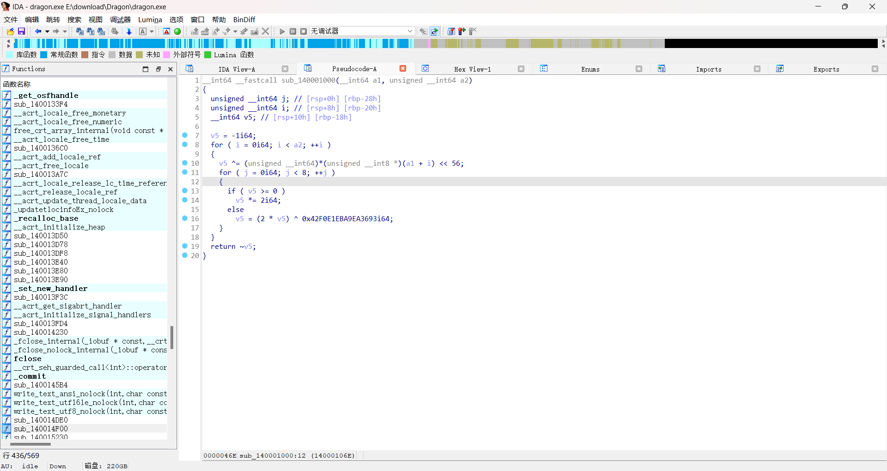
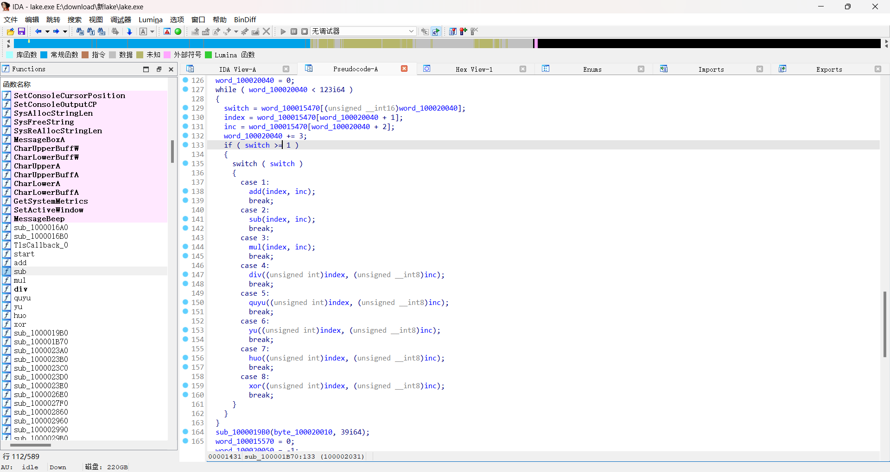
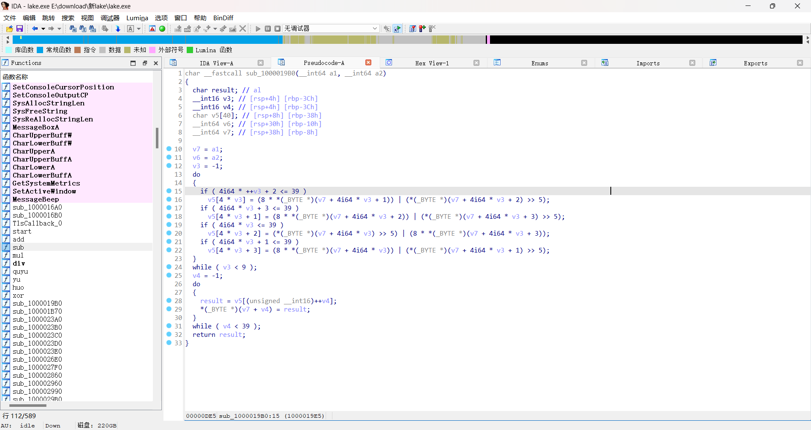

# XYCTF2025RE（部分解）-先知社区

> **来源**: https://xz.aliyun.com/news/17685  
> **文章ID**: 17685

---

# XYCTF RE（部分解）

## 签到

vbs逆向，放到visual里面提取文本，拿正则表达式匹配一下，得到代码逻辑，就是一个rc4加密，key="rc4key"密文：”90df4407ee093d309098d85a42be57a2979f1e51463a31e8d15e2fac4e84ea0df622a55c4ddfb535ef3e51e8b2528b826d5347e165912e99118333151273cc3fa8b2b3b413cf2bdb1e8c9c52865efc095a8dd89b3b3cfbb200bbadbf4a6cd4“

```
正则得到的结果：
MsgBox "Dear CTFER. Have fun in XYCTF 2025!"
flag = InputBox("Enter the FLAG:", "XYCTF")
wefbuwiue = "90df4407ee093d309098d85a42be57a2979f1e51463a31e8d15e2fac4e84ea0df622a55c4ddfb535ef3e51e8b2528b826d5347e165912e99118333151273cc3fa8b2b3b413cf2bdb1e8c9c52865efc095a8dd89b3b3cfbb200bbadbf4a6cd4" ' \x-165E\x-7B18\x-5141\x-1866\x-7BAEC4\x-1A76\x-5F1B\x-507A\x-1845\x-6C1A\x-6163\x-1044\x-771B\x-727F\x-1A7B\x-5218\x-4065\x-1A77\x-491A\x-5F43\x-1A44\x-7011\x-4377
qwfe = "rc4key"

' \x-1B40\x-511B\x-5B73\x-1A70\x-7119\x-657CRC4\x-1A76\x-5F1B\x-507A\x-1A79\x-421A\x-6A50
Function RunRC(sMessage, strKey)
    Dim kLen, i, j, temp, pos, outHex
    Dim s(255), k(255)
    
    ' \x-1A78\x-621B\x-5874\x-1A74\x-691B\x-507A\x-166E?
    kLen = Len(strKey)
    For i = 0 To 255
        s(i) = i
        kssage, pos, 1)) ' \x-1967\x-7119\x-6979\x-1974\x-76BFSCII\x-1A5C\x-7B19\x-6F7A
        ciphe = s((s(i) + s(j)) Mod 256) Xor plainChar
        outHex = outHex & Right("0" & Hex(cipherByte), 2)
    Next
    
    RunRC = outHex
End Runction

' \x-1B48\x-4417\x-5574\x-1750\x-7E17€\x-4418\x-416F
If LCase(RunRC(flag, qwfe)) = LCase(wefbuwiue) Then
    MsgBox "Congratulatie
    MsgBox "Wrong flag."
End If
```

```
def rc4_crypt(data: bytes, key: bytes) -> bytes:
    S = list(range(256))
    j = 0

    # KSA
    for i in range(256):
        j = (j + S[i] + key[i % len(key)]) % 256
        S[i], S[j] = S[j], S[i]

    # PRGA
    i = j = 0
    result = bytearray()
    for byte in data:
        i = (i + 1) % 256
        j = (j + S[i]) % 256
        S[i], S[j] = S[j], S[i]
        K = S[(S[i] + S[j]) % 256]
        result.append(byte ^ K)

    return bytes(result)

# 密文（十六进制字符串）
cipher_hex = "90df4407ee093d309098d85a42be57a2979f1e51463a31e8d15e2fac4e84ea0df622a55c4ddfb535ef3e51e8b2528b826d5347e165912e99118333151273cc3fa8b2b3b413cf2bdb1e8c9c52865efc095a8dd89b3b3cfbb200bbadbf4a6cd4"

# 转换为字节
cipher_bytes = bytes.fromhex(cipher_hex)

# RC4 解密
key = b"rc4key"
plain_bytes = rc4_crypt(cipher_bytes, key)

# 输出 flag
flag = plain_bytes.decode('utf-8', errors='ignore')  # 忽略一些不可打印字符
print("FLAG:", flag)

```

在线解密网站也可以

得到flag：flag{We1c0me\_t0\_XYCTF\_2025\_reverse\_ch@lleng3\_by\_th3\_w@y\_p3cd0wn's\_chall\_is\_r3@lly\_gr3@t\_&\_fuN!}

## dragon

bc文件逆向，先用clang编译成可执行exe文件，ida64位打开



crc64算法

```
import itertools

def crc64(data: bytes) -> int:
    poly = 0x42F0E1EBA9EA3693
    crc = 0xFFFFFFFFFFFFFFFF
    for b in data:
        crc ^= b << 56
        for _ in range(8):
            if (crc & (1 << 63)) == 0:
                crc <<= 1
            else:
                crc = (crc << 1) ^ poly
            crc &= 0xFFFFFFFFFFFFFFFF
    return ~crc & 0xFFFFFFFFFFFFFFFF

raw = bytes([
    0x47, 0x7B, 0x9F, 0x41, 0x4E, 0xE3, 0x63, 0xDC, 0xC6, 0xBF,
    0xB2, 0xE7, 0xD4, 0xF8, 0x1E, 0x03, 0x9E, 0xD8, 0x5F, 0x62,
    0xBC, 0x2F, 0xD6, 0x12, 0xE8, 0x55, 0x57, 0xCC, 0xE1, 0xB6,
    0xE8, 0x83, 0xCC, 0x65, 0xB6, 0x2A, 0xEB, 0xB1, 0x7B, 0xFC,
    0x6B, 0xD9, 0x62, 0x2A, 0x1B, 0xCA, 0x82, 0x93, 0x87, 0xC3,
    0x73, 0x76, 0xA0, 0xF8, 0xFF, 0xB1, 0xE1, 0x05, 0x8E, 0x38,
    0x27, 0x16, 0xA8, 0x0D, 0xB7, 0xAA, 0xD0, 0xE8, 0x1A, 0xE6,
    0xF1, 0x9E, 0x45, 0x61, 0xF2, 0xE7, 0xD2, 0x3F, 0x78, 0x92,
    0x0B, 0xE6, 0x6F, 0xF5, 0xA1, 0x7C, 0xC9, 0x63, 0xAB, 0x3A,
    0xB7, 0x43, 0xB0, 0xA8, 0xD3, 0x9B
])

targets = [int.from_bytes(raw[i:i+8], 'little') for i in range(0, len(raw), 8)]

charset = [chr(i) for i in range(0, 256)]

flag = ""
found_all = True

max_blocks = len(targets)

for idx, target in enumerate(targets[:max_blocks]):
    found = False
    for a, b in itertools.product(charset, repeat=2):
        data = bytes([ord(a), ord(b)])
        if crc64(data) == target:
            print(f"[{idx}] Found: {a}{b} -> {hex(target)}")
            flag += a + b
            found = True
            break
    if not found:
        print(f"[{idx}]  Not found for target: {hex(target)}")
        found_all = False
        break

print("
 Recovered flag so far:")
print(flag)
if found_all:
    print(" 全部匹配成功！")
else:
    print(" 有部分未匹配，可能需调整字节序或字符集。")

```

flag：flag{LLVM\_1s\_Fun\_Ri9h7?}

## moon

pyd文件逆向，搜索字串定位到加密部分，分析得到密文（16进制数字）：”426b87abd0ceaa3c58761bbb0172606dd8ab064491a2a76af9a93e1ae56fa84206a2f7“

然后直接调用pyd文件里面的异或加密函数解密，密钥我是直接爆破的

```
import moon

for i in range(2000000):
    xor_result = moon.xor_crypt(i,b'Bk\x87\xab\xd0\xce\xaa<Xv\x1b\xbb\x01r`m\xd8\xab\x06D\x91\xa2\xa7j\xf9\xa9>\x1a\xe5o\xa8B\x06\xa2\xf7')

    if xor_result[:4] == b'flag':
        break

print(xor_result)
```

## lake

ida打开，直接上动调，定位到主要逻辑



这是第一部分的加密逻辑，就是flag[index]和inc进行加减乘除等运算

进入sub\_1000019B0函数



很清晰的逻辑

直接上z3解密

```
from z3 import *

# 加密后的数据
enc = [ 
    0x4A, 0xAB, 0x9B, 0x1B, 0x61, 0xB1, 0xF3, 0x32, 0xD1, 0x8B,
    0x73, 0xEB, 0xE9, 0x73, 0x6B, 0x22, 0x81, 0x83, 0x23, 0x31,
    0xCB, 0x1B, 0x22, 0xFB, 0x25, 0xC2, 0x81, 0x81, 0x73, 0x22,
    0xFA, 0x03, 0x9C, 0x4B, 0x5B, 0x49, 0x97, 0x87, 0xDB, 0x51
]

# 创建符号变量 (每个字节为 8 位向量)
s = [BitVec(f's_{i}', 8) for i in range(40)]
solver = Solver()

# 添加每 4 字节的约束条件
for i in range(0, 40, 4):
    s0, s1, s2, s3 = s[i], s[i+1], s[i+2], s[i+3]
    e0, e1, e2, e3 = enc[i], enc[i+1], enc[i+2], enc[i+3]
    
    # 核心约束条件 (使用逻辑右移 LShR)
    solver.add( ((s1 << 3) | LShR(s2, 5)) & 0xFF == e0 )
    solver.add( ((s2 << 3) | LShR(s3, 5)) & 0xFF == e1 )
    solver.add( ((s3 << 3) | LShR(s0, 5)) & 0xFF == e2 )
    solver.add( ((s0 << 3) | LShR(s1, 5)) & 0xFF == e3 )

# 求解并输出结果
if solver.check() == sat:
    model = solver.model()
    decrypted = bytes([model.eval(s[i]).as_long() for i in range(40)])
    
    # 将解密结果转换为16进制字符串
    hex_result = ',0x'.join(format(byte, '0x') for byte in decrypted)
    print("解密结果（16进制）:", hex_result)
else:
    print("未找到有效解")
```

得到的结果：0x63,0x69,0x55,0x73,0x66,0x4c,0x36,0x3e,0x7d,0x7a,0x31,0x6e,0x64,0x5d,0x2e,0x6d,0x66,0x30,0x30,0x64,0x5f,0x79,0x63,0x64,0x30,0x24,0xb8,0x50,0x40,0x6e,0x64,0x5f,0x69,0x33,0x89,0x6b,0x6a,0x32,0xf0,0xfb

第一部分解密脚本：

```
#include <iostream>

int main()
{
    int enc[40] = { 0x63,0x69,0x55,0x73,0x66,0x4c,0x36,0x3e,0x7d,0x7a,0x31,0x6e,0x64,0x5d,0x2e,0x6d,0x66,0x30,0x30,0x64,0x5f,0x79,0x63,0x64,0x30,0x24,0xb8,0x50,0x40,0x6e,0x64,0x5f,0x69,0x33,0x89,0x6b,0x6a,0x32,0xf0,0xfb
    };
    int encc[123] = { 0x2,0x2,0xc,0x1,0x1a,0x55,0x1,0x23,0xc,0x2,0xe,0x9,0x1,0x1b,0x6,0x8,0x6,0x5,0x8,0x1,0x5,0x2,0x1b,0xe,0x2,0x19,0x3,0x2,0x1a,0x4,0x8,0x4,0x8,0x1,0x3,0xc,0x2,0xc,0xa,0x1,0x25,0x2,0x1,0x20,0x2,0x1,0x9,0xc,0x8,0x1a,0x5,0x2,0x4,0xd,0x8,0x8,0xf,0x2,0xa,0xe,0x1,0x10,0x7,0x1,0xc,0x7,0x8,0x22,0x8,0x8,0x15,0xa,0x1,0x27,0x7e,0x2,0x7,0x2,0x8,0xf,0x3,0x8,0xa,0xa,0x1,0x22,0xb,0x2,0x12,0x8,0x2,0x19,0x9,0x8,0xe,0x6,0x8,0x0,0x5,0x1,0xa,0x8,0x8,0x1b,0x7,0x8,0xd,0x6,0x8,0xd,0x4,0x8,0x17,0xc,0x8,0x22,0xe,0x2,0x12,0x34,0x1,0x26,0x77 };
    for (int i = 0; i < 123; i += 3) {
        int switch_ = encc[i];
        int index = encc[i + 1];
        int inc = encc[i + 2];
        switch (switch_) {
        case 1:
            enc[index] -= inc;
            break;
        case 2:
            enc[index] += inc;
            break;
        case 3:
            enc[index] /= inc;
            break;
        case 4:
            enc[index] *= inc;
            break;
        case 5:
        {
            int c = 0;
            for (;;) {
                if (c % inc == enc[index])break;
            }
            enc[index] = c;
            break;
        }
        case 6:
        {
            int b = 0;
            for (;;) {
                if ((b & inc) == enc[index])break;
                }
            enc[index] = b;
            break;
        }
        case 7: {
            int a = 0;
            for (;;) {
                if ((a | inc) == enc[index])break;
                a++;
            }
            enc[index] = a;
            break;
        }
        case 8:
            enc[index] ^= inc;
            break;
        }
    }
    for (int i = 0; i < 40; i++) {
        printf("%c", enc[i]);
    }
}
```

得到flag：flag{L3@rn-ng\_1n\_0ld\_sch00b\_@nd\_g3x\_j0y}

有些部分有点问题，手动改一下，修正后的结果:flag{L3@rn1ng\_1n\_0ld\_sch00l\_@nd\_g3t\_j0y}
