# struts框架下的TPN系统代码审计分析-先知社区

> **来源**: https://xz.aliyun.com/news/17691  
> **文章ID**: 17691

---

# RCE

java代码审计第一步，就是看结构以及一些指向性文件，比如web.xml、pom.xml等等一些xml文件，一般文件的命名方式都是比较清晰的，所以不说那么多废话

这里可以自己去找lib、classes等目录，如果使用了框架一般会涉及到一些相关jar包

如下图，发现在`/webapps/ROOT/WEB-INF/lib/`目录存在`struts2-core-2.1.8.1.jar`包，一般都是以core命名的jar进行查看

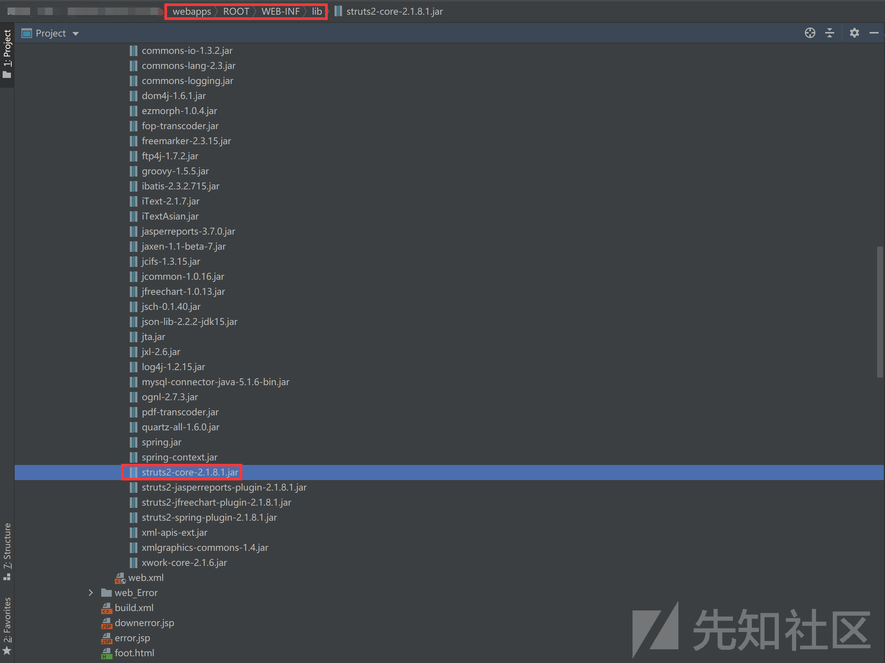

这种使用了框架的可以去查找是否存在历史漏洞，可以去互联网上进行搜索，但是搜出来的都是五花八门的，一篇文章一个样，因此还有另一种方法就是直接去maven官网查看是否存在漏洞，如下图，可以发现2.1.8.1版本存在大量漏洞，因此这里可以确定此版本存在漏洞

<https://mvnrepository.com/artifact/org.apache.struts/struts2-core>

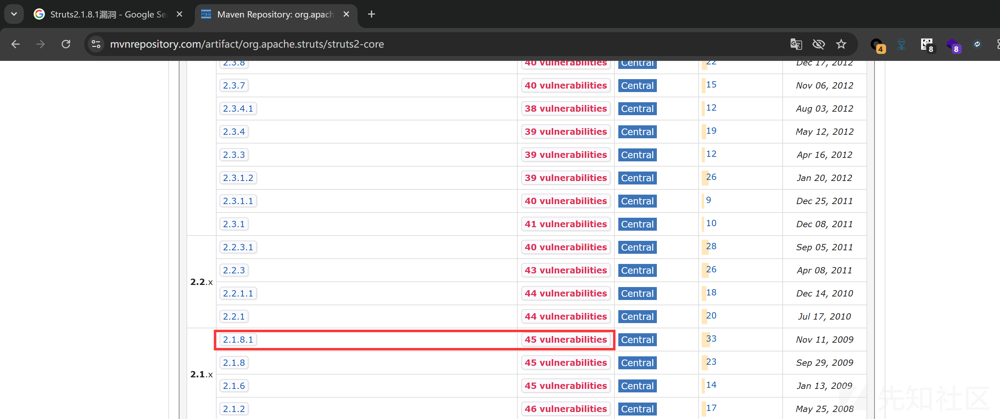

存在漏洞后下一步是进行分析，有没有配置一些规则来禁止漏洞的触发，即使Struts的该版本存在漏洞。比如在`struts.xml`中设置`<constant name="struts.enable.DynamicMethodInvocation" value="false"/>`，禁用动态方法调用。通过直接搜索DynamicMethodInvocation关键字可以发现存在三个xml文件，其中唯一一个value值为false的xml文件为演示文件，因此判断并没有禁用动态方法调用

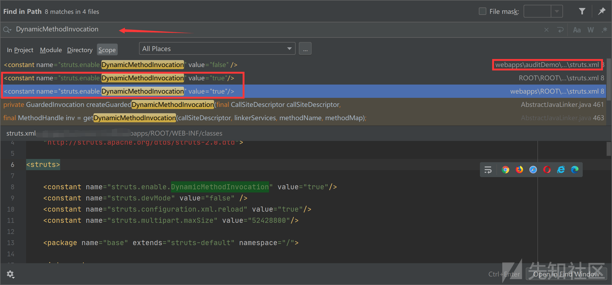

除了上述提及的禁用动态方法调用还有一个规则为限制OGNL表达式的使用范围**，**在`struts.xml`中配置`<global-allowed-methods>`，限制允许调用的方法。通过全局搜索也可以发现并不存在该配置，因此满足status漏洞利用前提

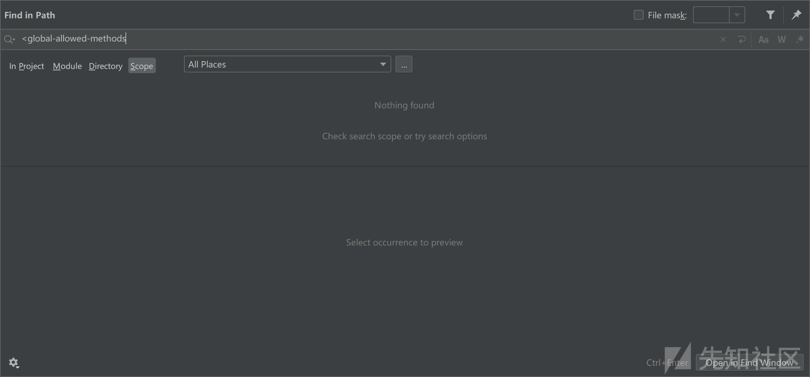

Struts框架通过`struts.xml`配置文件来映射请求到具体的Action类和方法，下一步就需要查看具体映射了那些类从而使得我们可以进行触发该漏洞

通过查看struts.xml配置文件首先定义了一个namespace命名空间，这里是/lan

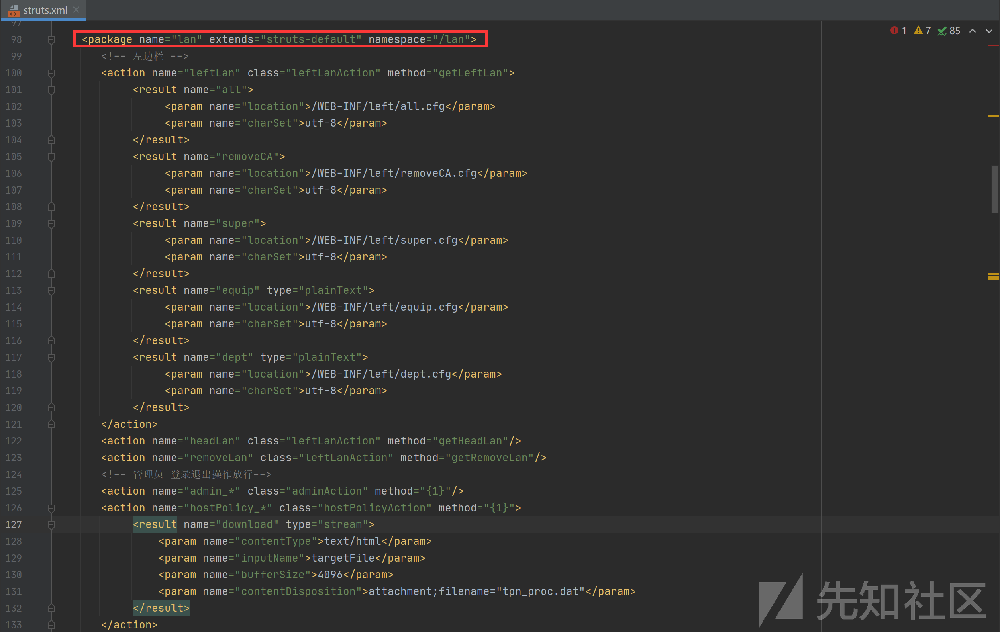

然后通过action标签中的name来定义请求路径，其中admin\_\*为通配符，只要访问以admin\_开头的都会请求如下action路径，其中class="adminAction"后端处理该请求路径的类，而method="{1}"为类中的方法，例如访问/admin\_getUserInfo路径，其{1}值为getUserInfo，而处理该路径的代码为adminAction类中的getUserInfo方法

```
<action name="admin_*" class="adminAction" method="{1}"/>
```

因此通过上述分析过程可以查看一下adminAction类中存在那些方法，如下图所示，存在许多方法，任意选取两个进行试验即可，方法里面的内容是很重要，因此我们不需要关心方法具体逻辑，只需要调用存在的方法即可

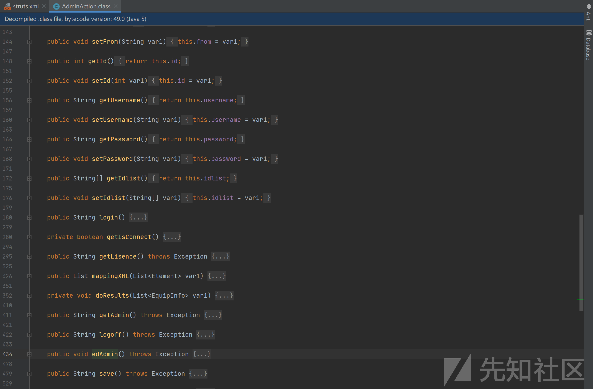

使用`admin_login`和`admin_getLisence`接口进行漏洞触发可行

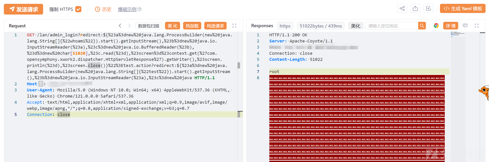

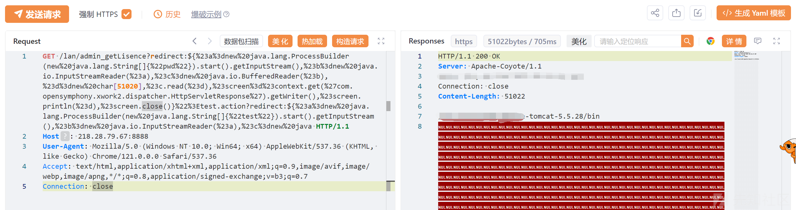

在138行还存在hostPolicy\_\*接口

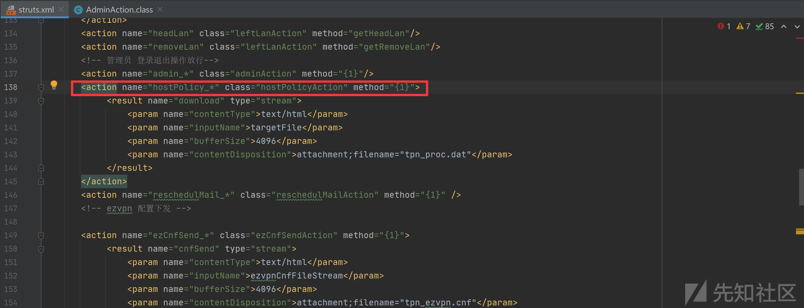

我们可以进入hostPolicyAction类中任意找一个方法进行测试

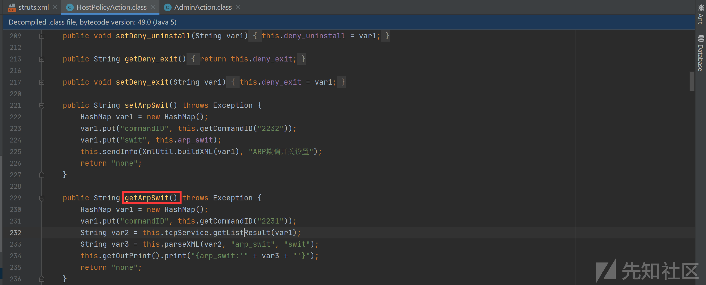

使用getArpSwit方法进行测试，同那样可进行命令执行

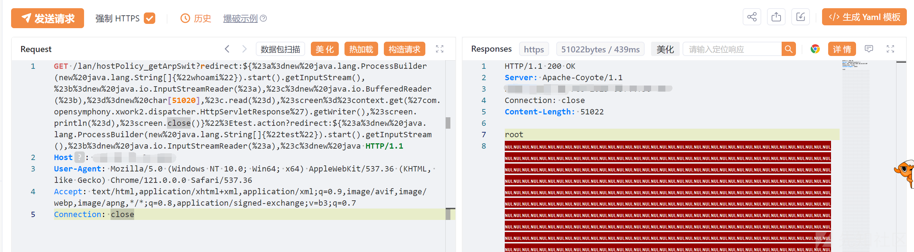

# 源码泄露

使用一个简单的脚本递归寻找压缩后缀文件，发现存在ROOT.bz2以及login.bz2文件，但是login.bz2不在网站根目录下，所以无法访问

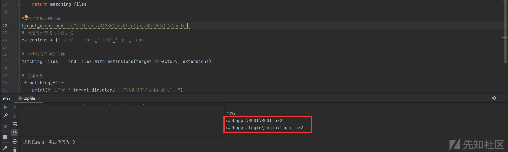

直接FUZZ`ROOT.bz2`文件，可以进行通杀利用

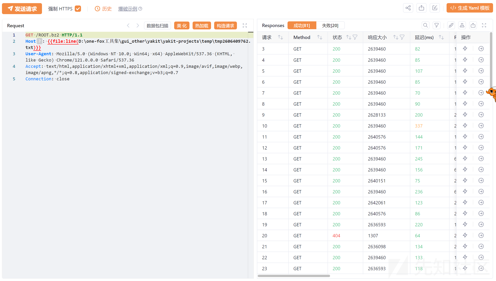

浏览器访问下载解压缩即可发现网站所有源码泄露


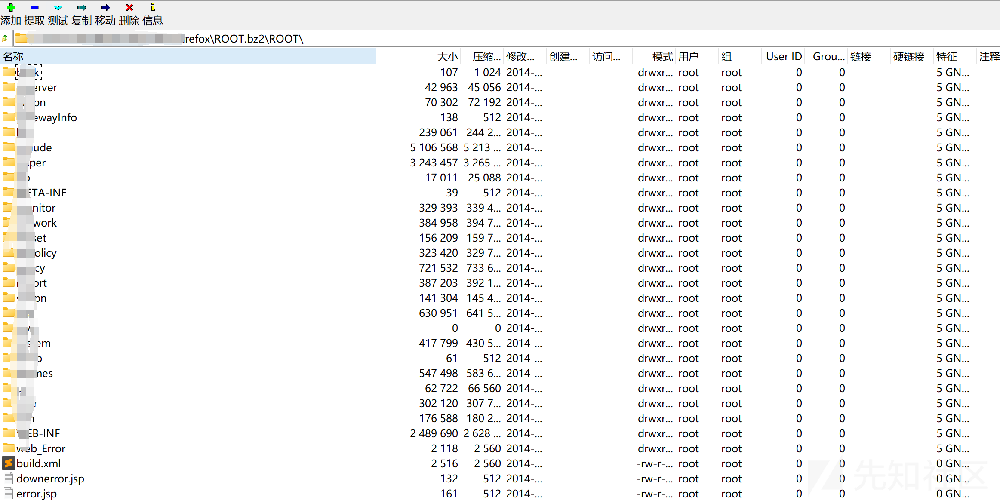

# 信息泄露

这里挨个文件点点点发现ftp密码，但是端口为22，使用资产测绘平台进行搜索也没有啥收获，连也连不上，应该没啥用

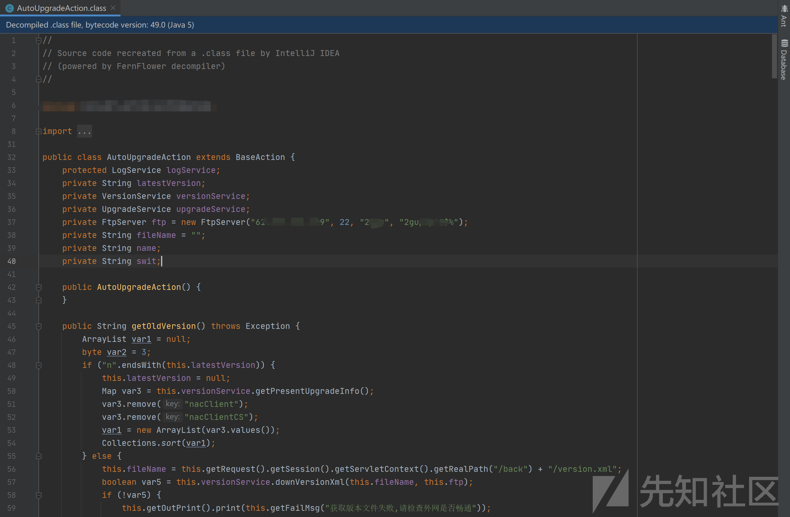

# 用户信息泄露

这里如上面RCE代码分析步骤差不多，通过查看web.xml文件可以发现存在/userDownload接口，看名字就知道有戏

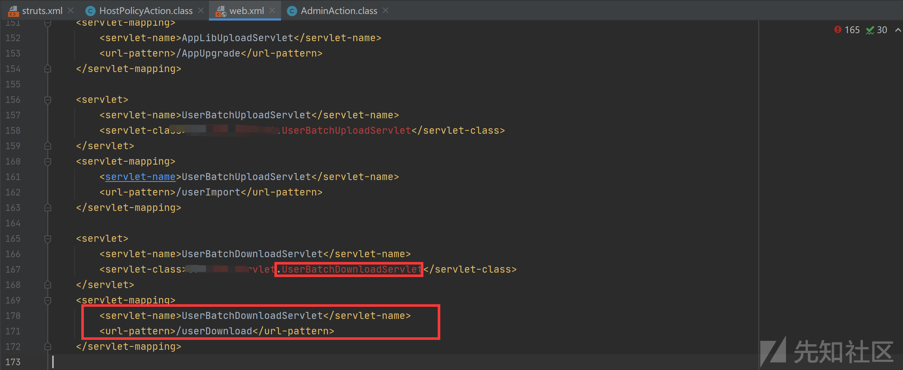

直接进入UserBatchDownloadServlet类中查看对应的处理代码，该代码段主要进行文件下载功能，也不复杂。

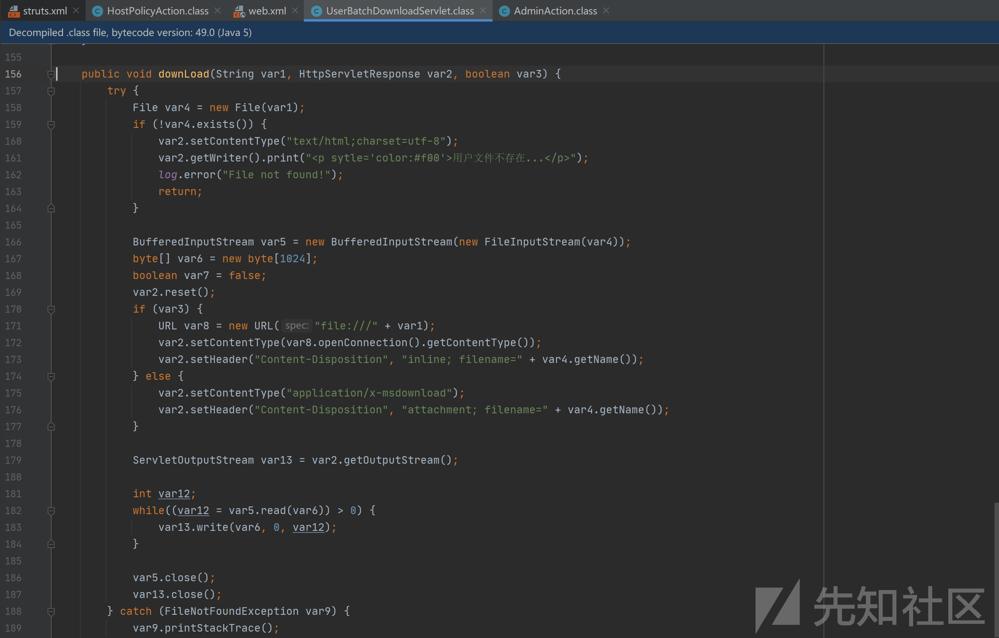

直接访问该接口即可下载userlist文件


包含大量用户名密码等信息


