# CE固定小程序动态密钥后自动化加解密-先知社区

> **来源**: https://xz.aliyun.com/news/17693  
> **文章ID**: 17693

---

## 前言

项目中遇到一个小程序，每次请求都动态生成AES密钥，请求包和响应包都是用AES加密。

最开始的思路是通过重新打包小程序，把密钥设置为固定值，但这个小程序有做完整性检测，会报告小程序损坏，然后自动重新下载原始小程序包。

最终通过CE固定小程序密钥后，用burp插件galaxy实现自动化加解密。这里分享操作过程和相关工具使用时的注意事项。

## 加解密分析

反编译后找到加解密方法：

AES ECB Pkcs7

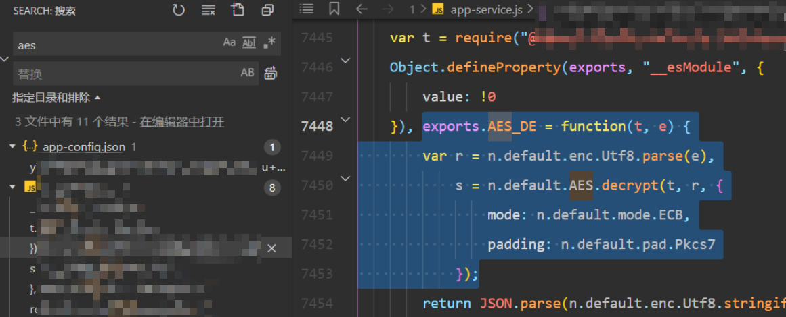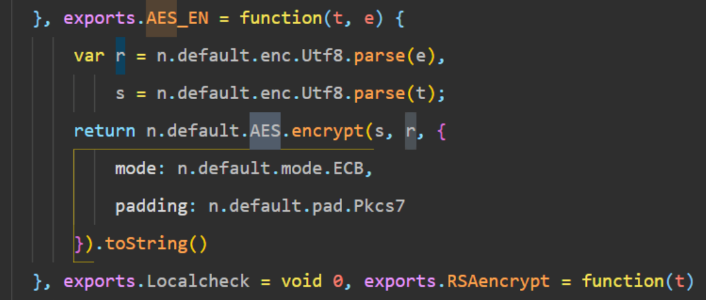​

如下图所示，这里采用随机密钥：AES密钥每次随机生成，AES密钥用RSA加密后设为http请求头”token”参与传输，服务器端用RSA私钥解密token得到AES密钥，服务器端得到AES密钥后解密请求包，并用AES密钥把响应包加密返回（这种前端动态生成密钥的，肯定要通过http请求头，或者http中的某个参数，把密钥传给服务器端。如果直接明文传递，完全可以在加解密里写获取密钥的逻辑完成自动化加解密。不过这里的密钥通过RSA加密后传递，手里没有私钥无法解密得到密钥，只能想办法把小程序的密钥改为固定值后再进行解密）

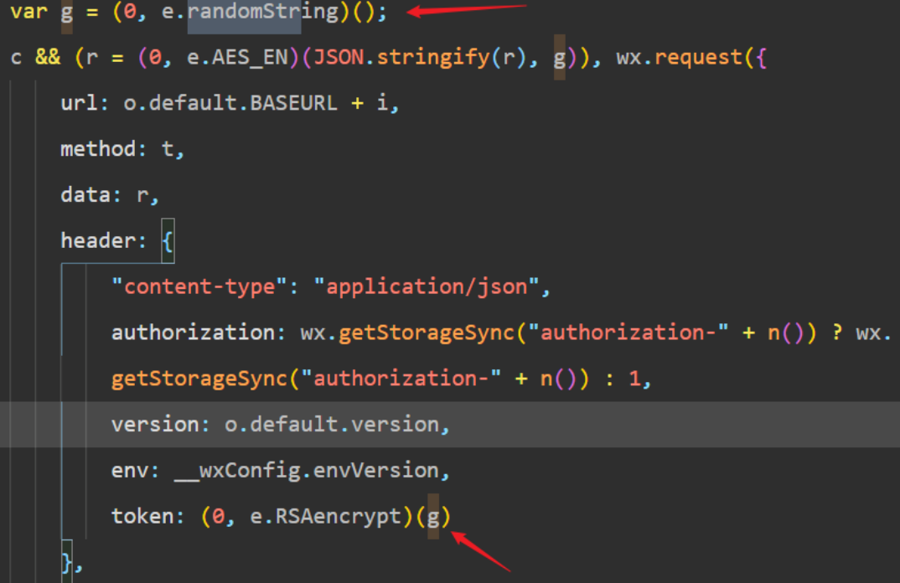

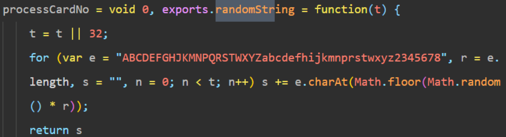​

如图，小程序的请求包与响应包如下：

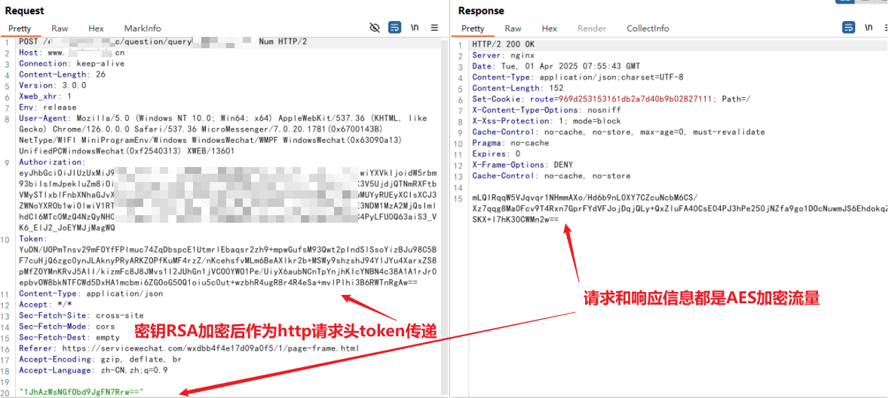​

## CE修改内存固定AES密钥（成功）

### 思路参考

https://mp.weixin.qq.com/s/ILwHHYgxHjb4Rn39U3yodg

### CE下载地址

https://www.cheatengine.org/downloads.php

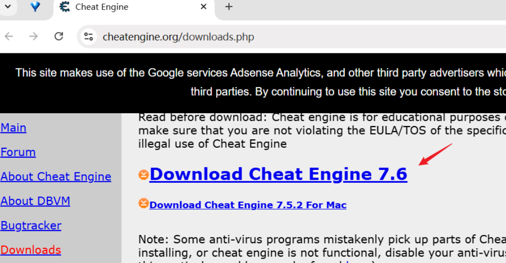​

安装时不用装这个：

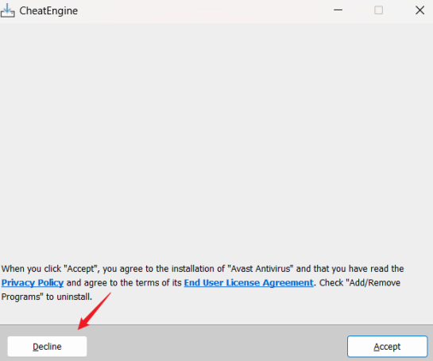

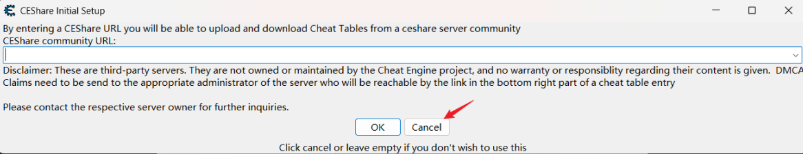​

### CE修改流程

打开小程序，CE把小程序选择小程序进程（进程名字基本就是微信小程序的名字）

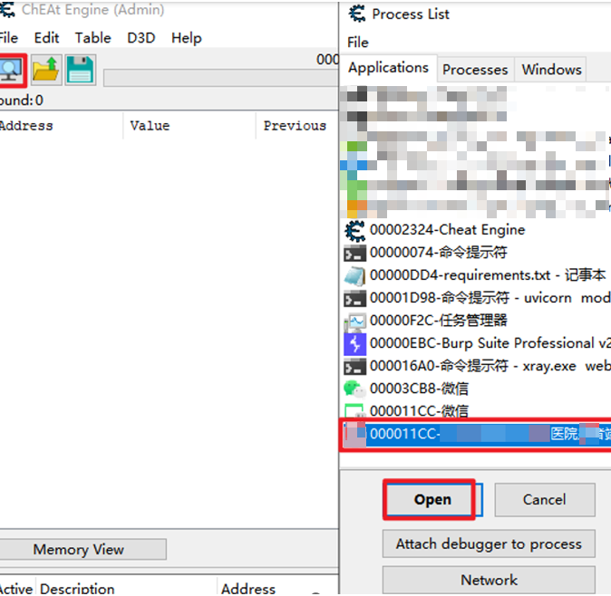

在内存中查询关键字符串，找到要修改的位置：

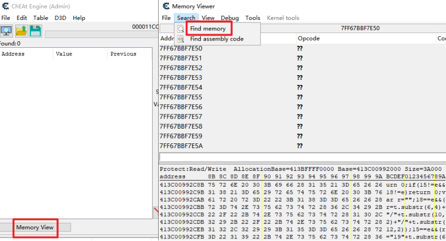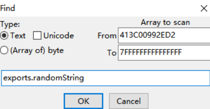

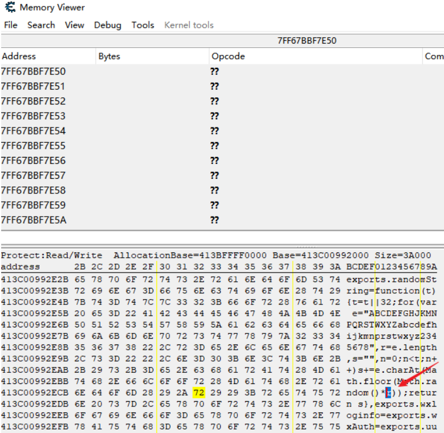

用CE直接找小程序内存中的数据，修改算法\*r改为\*0，就能让每次计算的结果都为0，也就是每次都返回字符串首位字母，即32个字母A（也可以选择固定写死返回值，注意内存数量，缺的空间用注释等方式填充即可）

右键，把这段内存添加到列表，修改为0（16进制30）并设置为激活状态

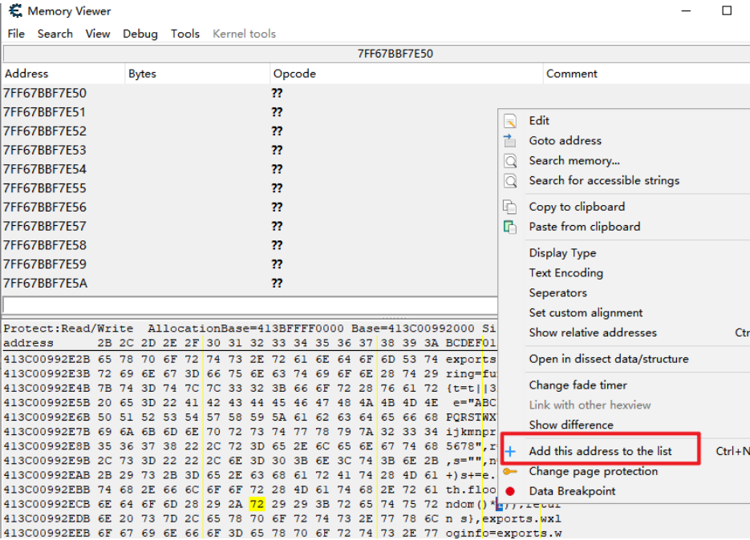​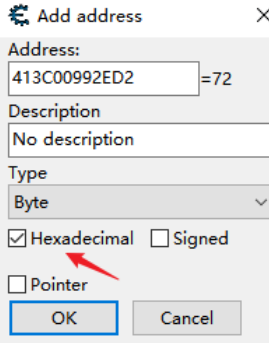

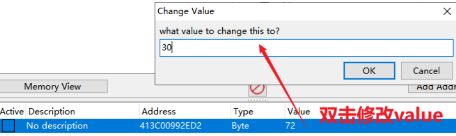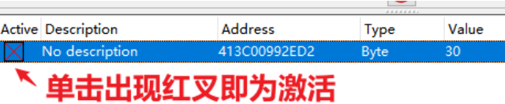

重新进入小程序（有可能一次不行，多试两次，成功与否取决于重新进入后，右键查看此时修改的内存是否为小程序应该修改的内存，CE无需重新选择进程）

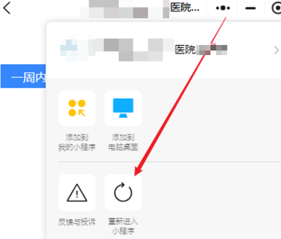

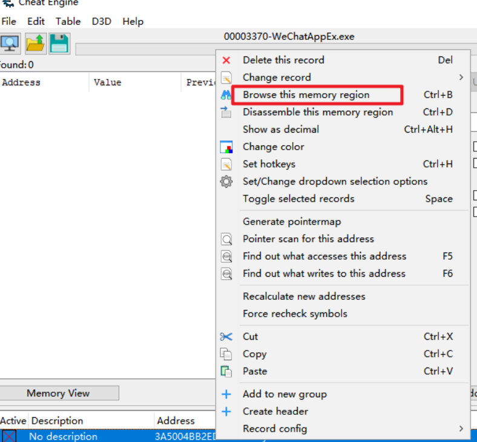

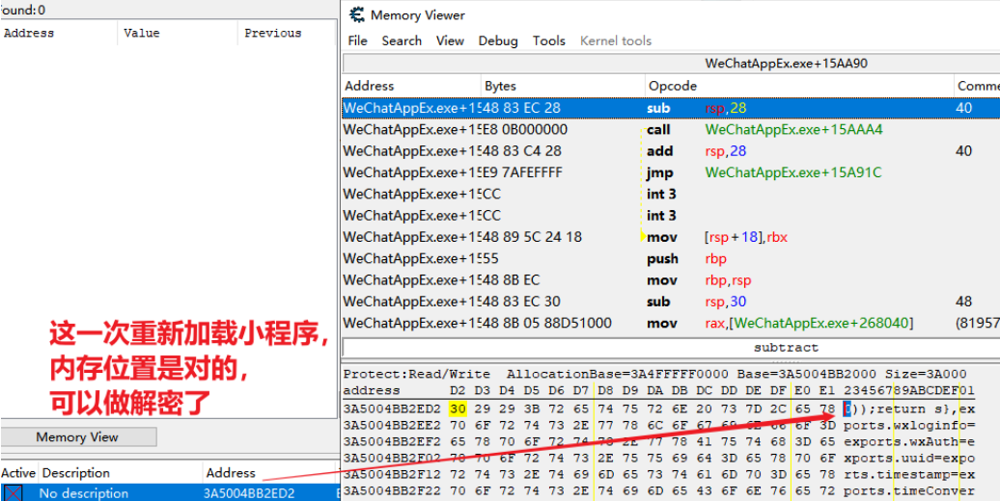

https://the-x.cn/cryptography/aes.aspx

解密成功：

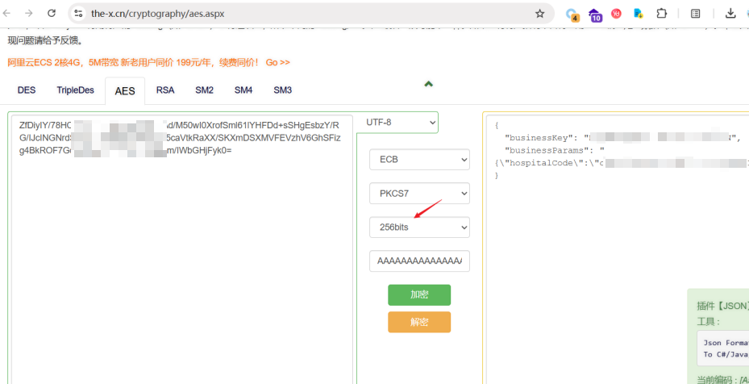

### CE注意事项

#### 1.小程序重启

修改完内存后不是立刻生效的，要重启小程序（CE无需重新选择进程）

#### 2.修改成功的判断标准

重启小程序涉及到内存加载问题，不是百分百一次重启就有效，根据情况可能要多重启几次

一般就观察列表里的值是？？还是之前手动设置的值。如果是之前手动设置的值基本上就OK了。处于稳妥，可以右键列表里选择浏览词处区域的内存，看是否符合预期。像下面这种？？基本就可以直接重启小程序了：

​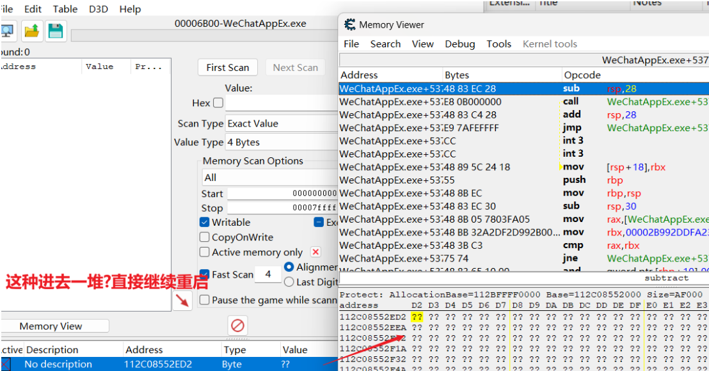

#### 3.重启一直修改失败的解决方法

如果发现重启小程序很多次，总是匹配不成功，且此时进入CE搜索之前的关键字符串总是搜不到，或者内存总是一堆?，直接重启CE

在我测试过程中遇到过多次这种情况，重启CE后按之前的流程走一遍就正常了

​

## Galaxy自动化加解密

### 插件说明

这个插件的使用教学文章比较少，有些文章都是老版本插件的使用说明（老版本作者提供了很多hook方式，新版本默认只提供http hook方式，作者说这种方式的bug少、稳定性高、加解密脚本书写方便），这里细致讲一下插件的用法

### 插件地址

自动化加解密插件：https://github.com/outlaws-bai/Galaxy

插件对应的demo加解密脚本：https://github.com/outlaws-bai/GalaxyHttpHooker

aws jdk下载地址：https://docs.aws.amazon.com/corretto/latest/corretto-21-ug/downloads-list.html

### 插件原理思路

作者讲解：https://github.com/outlaws-bai/Galaxy/wiki/%E5%8A%9F%E8%83%BD%E8%AF%A6%E8%A7%A3

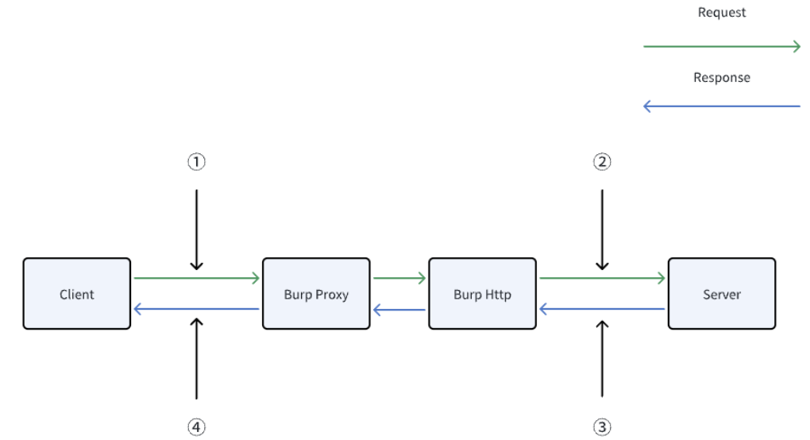​

概括来说，就是在常规的客户端、burp、服务器之间，加入了1、2、3、4这四个hook，对流经这4个点的流量，通过脚本定义的方法，完成加解密

### 插件用法

1.插件Galaxy因为涉及到的库问题，要用aws jdk启动burp，不能用常规的oracle jdk（测试发现，换用aws jdk并未影响我的常用插件），下载地址：https://docs.aws.amazon.com/corretto/latest/corretto-21-ug/downloads-list.html

2.常规把Galaxy插件安装在burp上之后，做如下配置

（1）设置host地址为此次设计加密的地址

（2）设置和HTTP地址为自己准备启动的脚本的监听地址（默认为5000，如果占用了可以根据情况调整，这里5000被占用，所以设置为9000）

（3）点击start后，可以去启动自己的加解密脚本了

（4）这里我勾选了“Auto Scan Decrypted Request”，这个选项勾选后，按照作者的说法，会根据使用者在“Setting”里配置的xray监听端口，通过插件无感知完成自动化加解密，让xray完成完整的扫描分析

（5）“Setting”的配置里除了xray监听地址，还有burp自己的被动扫描模块（右上角勾选）和自己的sqlmap地址。按照作者的说法，该插件都会在对应模块前完成自动化加解密。对加密流量用sqlmap做SQL注入验证时，可以在burp的request面板里右键选择使用Galaxy把请求发送到sqlmap，从而对带加密的流量做SQL注入验证。

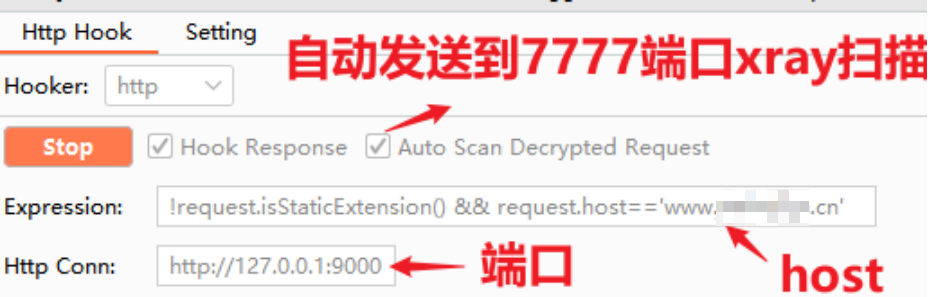

windows中设置的sqlmap路径下的sqlmap.py右键选择打开方式为python.exe就可以右键选择把请求包发到galaxy插件下的sqlmap功能去测试

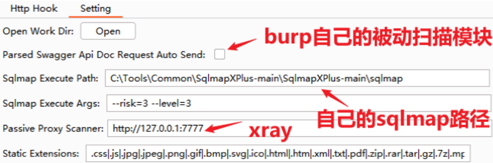

### 加解密脚本

### （0）脚本案例与依赖安装

插件对应的demo加解密脚本：https://github.com/outlaws-bai/GalaxyHttpHooker

pip install -r requirements.txt 即可完成依赖安装

具体使用时，复制他对应的脚本做修改即可，比如这里的加密用的时AES ECB PKCS7

复制他的aes\_ecb.py修改逻辑即可

这里大致讲几个核心关注点

### （1）设置自己的key和padding方式

默认的AES ECB脚本就是PKCS7所以不用该padding方式，修改key即可

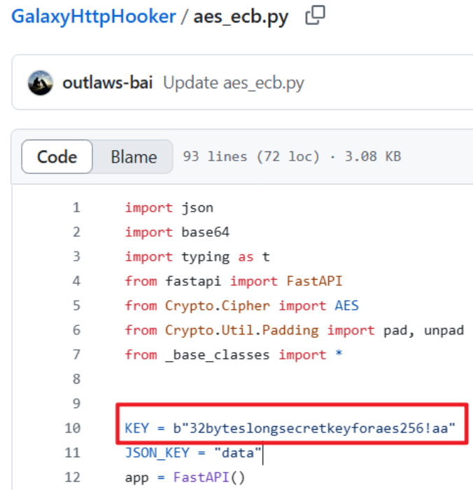

### （2）核心处理内容

（1）观察他的脚本可以发现，他本质上就是**在****4个方向上**（下图仅截取了两个方向的接口做展示，另外俩接口本质是一样的），**对****request.content和response.content（都是bytes类型）做数据处理**，提取出AES明文、密文后**交给****encrypt和decrypt函数**即可

（2）其中要注意，**他的数据参数都是****bytes类型**，如果在编写代码中数据类型转换为了str类型，记得**在调用他的函数，或者是返回结果时，要把数据转回****bytes类型**，防止出现类型不一致的问题

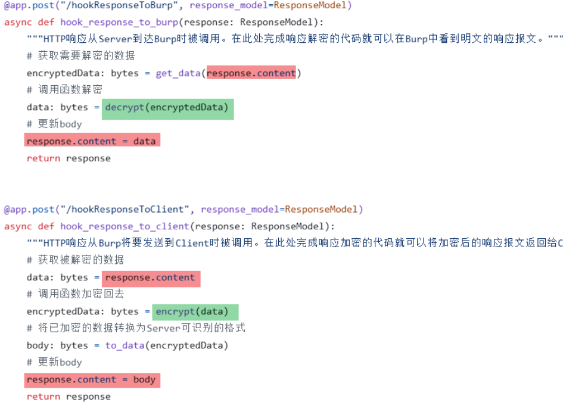

### （3）编写自己的脚本（具体脚本详见后文）

根据上述分析，要做的就是根据自己项目中的加解密数据特征，去对request.content和response.content做格式问题的处理

以本次项目为例，请求包数据和响应包数据长这样，可以看到，请求包的body时用双引号包裹的AES加密数据（做了base64编码），响应包则直接时AES加密后base64编码返回

所以我们的编写思路就是：

客户端->burp：把数据两边的双引号去除，做base64解码，然后把数据丢给decrypt函数解密接口就得到了可以识别的明文信息，最后返回处理好的明文（**从客户端传过来的密文数据即这一步的****request.content**）

burp->服务器：把数据直接丢给encrypt加密后，做base64编码，然后给两边加上双引号就恢复成了服务器认识的原始密文，最后返回恢复好的原始密文（**上一步得到的明文数据即这一步的****request.content**）

服务器->burp：把数据做base64编码，然后丢给decrypt就得到了可以识别的明文信息，最后返回处理好的明文（**从服务器传过来的密文数据即这一步的****response.content**）

burp->客户端：把数据直接丢给encrypt加密后，做base64编码，此时就恢复成了客户端认识的原始密文，最后返回恢复好的原始密文（**从服务器传过来的密文数据即这一步的****response.content**）

​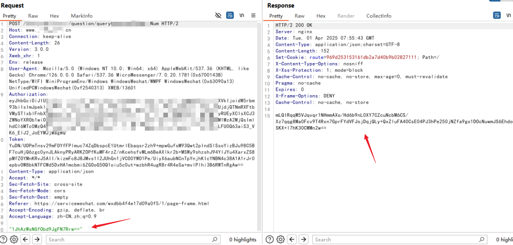

### （4）运行脚本

根据demo脚本可知，直接在命令行运行：

|  |
| --- |
| uvicorn 当前脚本的名字:app --host 0.0.0.0 --port 端口号 --workers 4 |

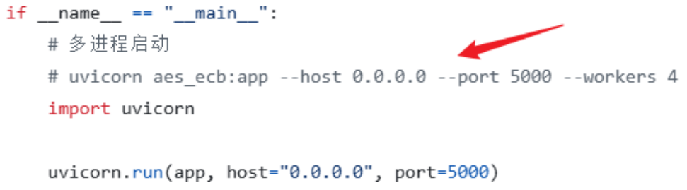

比如此次项目编写的脚本名字为modify\_aes\_ecb.py，监听端口设置为9000，运行如下：

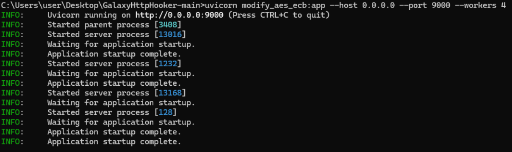

### （5）后续使用

插件启动、脚本运行，这两步完成后，会发现proxy history里的请求包响应包会被自动加解密，请求包原本密文为origin request，请求包解密后的明文为edited request，响应包原本密文为edited response，响应包解密后的明文为origin response

并且把解密后的请求包发到repeater模块发送，repeater模块里的response也是明文信息

### 本次项目的脚本和解密流程

Burp插件galaxy解密脚本：

|  |
| --- |
| import json  import re  import base64  import urllib.parse  import typing as t  from fastapi import FastAPI  from Crypto.Cipher import AES  from Crypto.Util.Padding import pad, unpad  from \_base\_classes import \*  ​  KEY = b"AAAAAAAAAAAAAAAAAAAAAAAAAAAAAAAA"  app = FastAPI()  ​  @app.post("/hookRequestToBurp", response\_model=RequestModel)  async def hook\_request\_to\_burp(request: RequestModel):  ​"""HTTP请求从客户端到达Burp时被调用。在此处完成请求解密的代码就可以在Burp中看到明文的请求报文。"""  ​# 获取需要解密的数据  ​# 请求体去除双引号，转成bytes类型  ​request\_body\_bytes = request.content.decode(encoding='UTF-8',errors='ignore').replace('"','').encode(encoding='UTF-8',errors='ignore');  ​# base64解密  ​encrypted\_data: bytes = base64.b64decode(request\_body\_bytes)  ​# 调用函数解密  ​data: bytes = decrypt(encrypted\_data)  ​# 更新body为已解密的数据  ​request.content = data  ​return request  ​  @app.post("/hookRequestToServer", response\_model=RequestModel)  async def hook\_request\_to\_server(request: RequestModel):  ​"""HTTP请求从Burp将要发送到Server时被调用。在此处完成请求加密的代码就可以将加密后的请求报文发送到Server。"""  ​# 获取被解密的数据  ​data: bytes = request.content  ​# 调用函数加密回去  ​encryptedData: bytes = encrypt(data)  ​# base64编码  ​encryptedData = base64.b64encode(encryptedData)  ​# 两边加上双引号  ​encryptedData = b'"' + encryptedData + b'"'  # 确保是字节类型  ​# 更新body  ​request.content = encryptedData  ​return request  ​  @app.post("/hookResponseToBurp", response\_model=ResponseModel)  async def hook\_response\_to\_burp(response: ResponseModel):  ​"""HTTP响应从Server到达Burp时被调用。在此处完成响应解密的代码就可以在Burp中看到明文的响应报文。"""  ​# 获取数据  ​data: bytes = response.content  ​# base64解码，获取需要解密的数据  ​encryptedData: bytes = base64.b64decode(data)  ​# 调用函数解密  ​data: bytes = decrypt(encryptedData)  ​# 更新body  ​response.content = data  ​return response  ​  @app.post("/hookResponseToClient", response\_model=ResponseModel)  async def hook\_response\_to\_client(response: ResponseModel):  ​"""HTTP响应从Burp将要发送到Client时被调用。在此处完成响应加密的代码就可以将加密后的响应报文返回给Client。"""  ​# 获取被解密的数据  ​data: bytes = response.content  ​# 调用函数加密回去  ​encryptedData: bytes = encrypt(data)  ​# base4编码，将已加密的数据转换为Server可识别的格式  ​body: bytes = base64.b64encode(encryptedData)  ​# 更新body  ​response.content = body  ​return response  ​  def decrypt(content: bytes) -> bytes:  ​cipher = AES.new(KEY, AES.MODE\_ECB)  ​return unpad(cipher.decrypt(content), AES.block\_size)  ​  def encrypt(content: bytes) -> bytes:  ​cipher = AES.new(KEY, AES.MODE\_ECB)  ​return cipher.encrypt(pad(content, AES.block\_size))  ​  if \_\_name\_\_ == "\_\_main\_\_":  ​# 多进程启动  ​# uvicorn modify\_aes\_ecb:app --host 0.0.0.0 --port 9000 --workers 4  ​import uvicorn  ​  ​uvicorn.run(app, host="0.0.0.0", port=5000)  ​ |

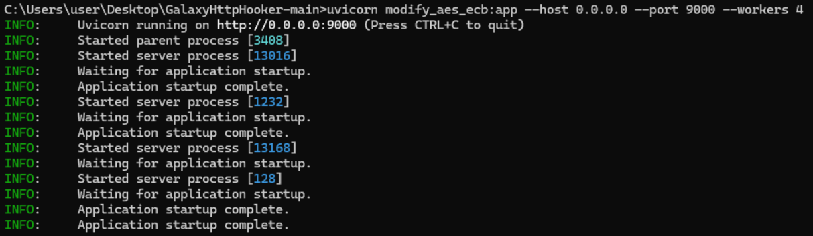​

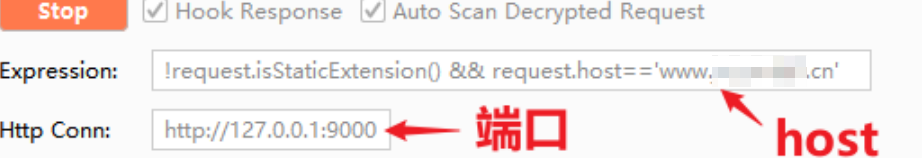

自动化加解密：

​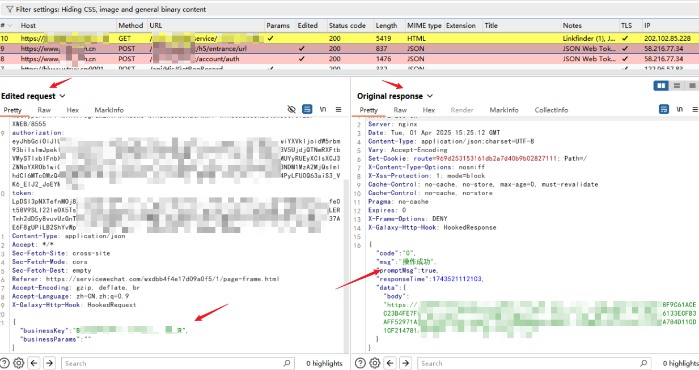
