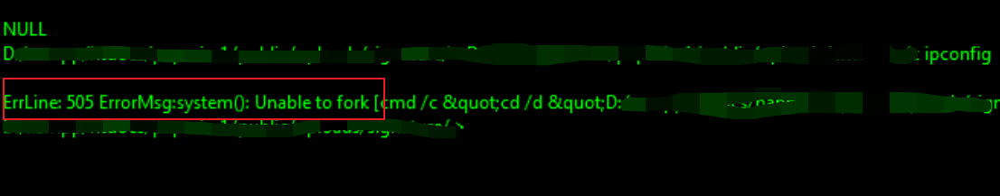
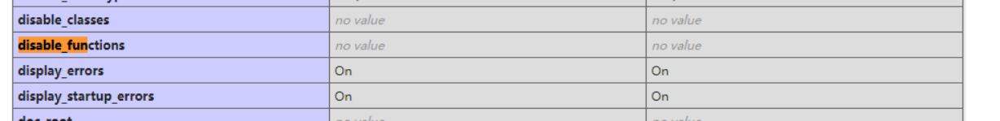
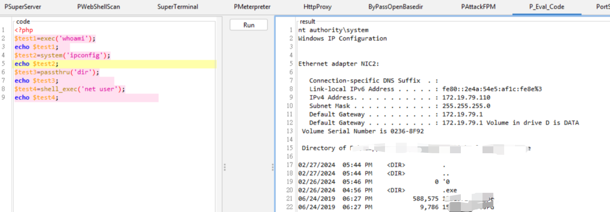
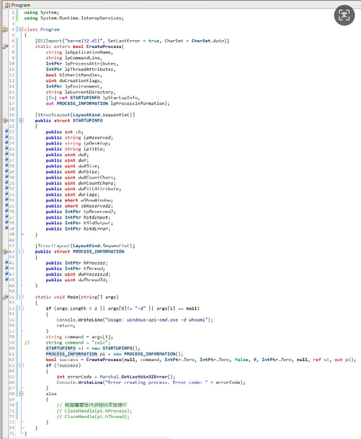
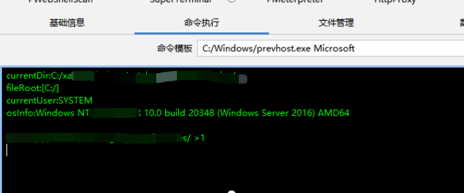
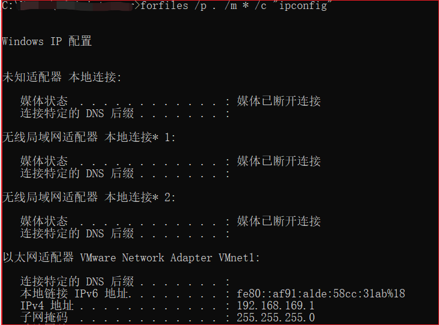
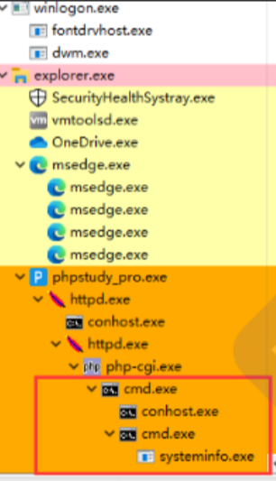
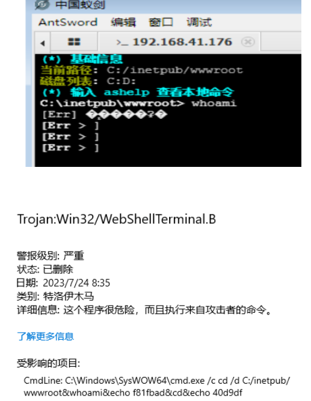
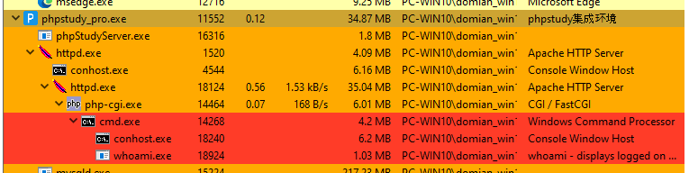
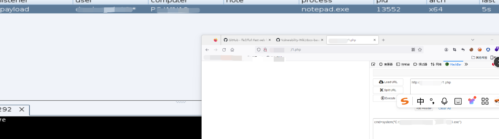

# Webshell命令执行失败实战场景下解决思路-先知社区

> **来源**: https://xz.aliyun.com/news/17710  
> **文章ID**: 17710

---

# 

## **0x01前言**

各位红队师傅否遇到过这样的窘境：费尽心思上传了webshell，上传下载都没问题，却发现命令执行总是失败？最近也打点也遇到了这些问题，网上有部分文章，但都是零碎知识点并且实战不一定能用，今天就结合我个人经验剖析webshell上线后cmd命令执行失败的几种常见原因和解决方法，有其他方法欢迎在评论区分享交流。

​

# **0x02** **命令执行失败场景**

当你上传webshell执行命令失败时，以哥斯拉为例，报错一般如下：

表示不能fork一个进程去调用cmd去执行命令，可能是webshell的问题，也可能是杀毒软件的问题。

## **1.用编程语言内置命令函数执行命令**

以php的webshell为例，我们可以先查看phpinfo的disable\_fuctions选项，表示执行命令的函数是否有被禁用的：

像这张图就是没有禁用任何函数，如有禁止的函数会在对应的地方写上禁止的函数，如eval(),exec()，system()等，针对这种情况，我们可以梭哈一波，把常用的执行函数全部跑一遍，一般webshell都会有相应的执行php代码的地方：

<?php

$test1=exec('whoami');

echo $test1;

$test2=system('ipconfig');

echo $test2;

$test3=passthru('whoami');

echo $test3;

$test4=shell\_exec('net user');

echo $test4;

可以看见在这个目标下四个函数都没被禁止，通过这种方式不用起cmd也可以执行命令。

## **2 上传cmd或利用平替程序执行命令**

### **1.上传自己的cmd**

有些杀毒软件可能对在webshell下执行本地system32下的cmd.exe有拦截，我们可以考虑自己上传一个本地的cmd.exe去执行，你可以尝试上传本机的cmd.exe，或者自己写一套调用cmd的api，这里可以给一段代码参考，可以让deepseek自己生成一份：

另外，如果你只是要做信息收集，你可以直接执行system32下的netstat.exe、whoami.exe、tasklist.exe，并不一定要执行cmd。

甚至你可以直接运行你的C2，直接跳过执行命令这步，在C2上在进行更多的操作：

这里的prevhost.exe是我的loader，Microsoft是我设置的一个抗沙箱的参数，我在命令行中敲个1，目标就会上线到我的cobaltstrike上。

### **2.cmd.exe的平替选项**

另外cmd.exe还有一些平替的程序，如forfile.exe，也是可以执行命令的：

大家可以举一反三自己搜集一下平替程序，如mshta.exe、msxsl.exe等等

## **3 利用大马绕过杀软对进程链查杀执行命令**

有些杀毒软件对进程链查杀是相当严格的，比如你在php环境下用冰蝎、哥斯拉等工具去执行一个systeminfo，你的进程链是这样的,可以看到是通过webshell的cmd.exe再起一个cmd.exe：

这里的php-cgi.exe会被部分杀软认为是灰进程（IIS下是w3wp.exe），在会进程下连续起两个cmd.exe是相当可疑的，在有杀软的环境下大概率都会被查杀：

在这种情况下，我们可以通过免杀大马去代替webshell连接工具，一是消除掉webshell工具的特征，二是减短进程链，直接用大马执行命令会少一层cmd.exe。

也可以直接利用大马直接上线

大马github有很多开源项目，deepseek也可以自己生成，实战效果都还不错。

# **0x03 结语**

webshell上线之后执行不了命令是红队实战过程中相当常见的问题，总结起来无非就是webshell工具、杀软进程链、cmd工具三个方面的问题。以上思路都是个人在实际环境中用到的，效果都还可以，希望能对师傅们有所帮助。

​
