# DrayTek研究之CVE-2024-41592详细分析-先知社区

> **来源**: https://xz.aliyun.com/news/17712  
> **文章ID**: 17712

---

# 说明

1，读者有责任遵守其所在国家或地区的所有法律，作者不对使用其文章中提到的任何内容所造成的任何损害负责。

2，本文内容关键词

（1）drayos固件解密

（2）drayos仿真

（3）符号恢复

（4）漏洞成因

（5）ext 文件系统

（6）IDA中如何查看连接ip:port？

（7）drayos网络架构

3，欢迎有问题交流

提问前请阅读：[smart-questions](http://www.catb.org/~esr/faqs/smart-questions.html)

# 分析目标

测试目标版本2962\_4326.all

溢出漏洞点程序：soho2962.bin

分析环境：kali或ubuntu

# Decrypt firmware

固件下载：

<https://fw.draytek.com.tw/Vigor2962/Firmware/>

GPL源码下载:

<https://gplsource.draytek.com/?dir=Vigor2962>

1，binwalk -E 分析v2862\_4326.all固件是加密的，首先寻找解密方法。

解密思路：利用未加密旧的版本固件中寻找解密程序。

定位到解密程序后两种解密思路：

（1）还原加密算法

（2）利用仿真环境运行解密程序

2，下载了[GPL源码](https://gplsource.draytek.com/?dir=Vigor2962)和未加密的3931版本的固件，都可以获取到文件系统内容，定位到解密代码：

./Vigor2962\_431\_GPL\_release/drayrt-release-gpl/output/rootfs/draytek/drayapp/runcommand/fw\_upload

```
#!/bin/sh
decrypt_firmware(){
    input_file=$1
    decrypt_data_sect="/tmp/decrypt_data_sect"
    data_sect="/tmp/data_sect"
    head_sect="/tmp/head_sect"
    tail -c +$((256 + 64 + 64 + 1)) $input_file > $data_sect
    head -c $((256 + 64 + 64)) $input_file > $head_sect

    enc_signature=$(head -c $((320 + 36)) $head_sect | tail -c 4)
    if [ "$enc_signature" == "0204" ]; then
        echo "Firmware is encypt, start to decrypt."
        nonce=$(head -c $((320 + 48)) $head_sect | tail -c 12)
        /draytek/drayv2962/chacha20 $data_sect $decrypt_data_sect $nonce
        cat $head_sect $decrypt_data_sect > ${input_file}_dec_file || abort "Unable to decrypt"
        rm $decrypt_data_sect
    fi

    rm $data_sect $head_sect
}


decrypt_firmware $1
```

3，上面脚本在xx版本环境中执行测试，获得了解密后的固件。

在kali中执行切换上下文环境，可以执行不同架构指令

```
#sudo chroot . sh

┌──(kali2024㉿kali)-[~/…/2962/_v2962_3931.all.extracted/_rootfs.img.extracted/tmpfs]
└─$ ls -al v2962_4326.all 
-rwxrw-rw- 1 kali2024 kali2024 51274870 Jan  4  2024 v2962_4326.all

┌──(kali2024㉿kali)-[~/…/2962/_v2962_3931.all.extracted/_rootfs.img.extracted/tmpfs]
└─$ sudo chroot ./ sh

/ # ./dec.sh v2962_4326.all 
Firmware is encypt, start to decrypt.
nonce: 564d33384a4b336771527138
nonce: VM38JK3gqRq8
Run time = 7 sec

/ # ls -al dec.bin 
-rw-r--r--    1 admin    root      51274870 Feb  7 01:19 dec.bin
```

下图是解密成功的截图：

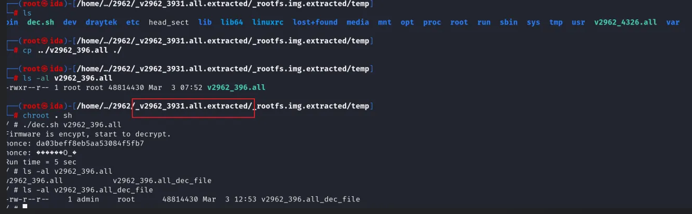

解密后的v2962\_4326固件：

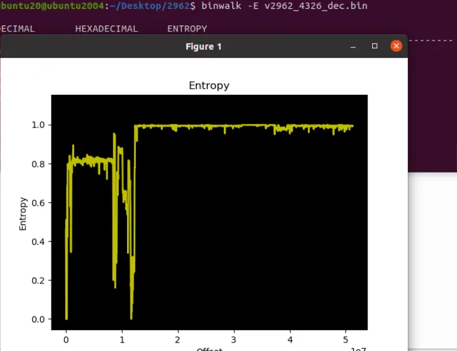

* 分析一波加密特征

查看加密的v2962\_4325固件，加密特征0204：

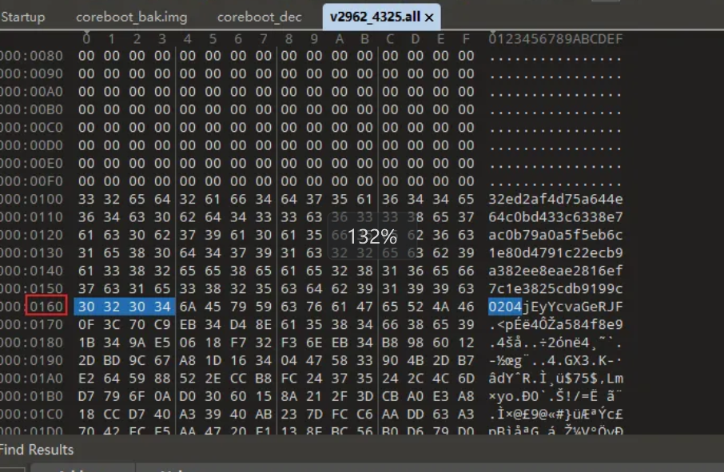

nonce（用于加密的随机数） ：

enc\_signature后面跟着的12位就是nonce

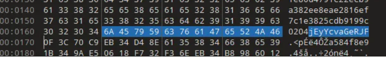

/draytek/drayapp/chacha20是解密程序，获得完整文件系统：

4，通过binwalk解压xx.all固件获取的文件系统可能不完整，ext未被识别解压，可通过mount挂载解决。

Q可能遇见的问题：提示挂载/ext-root空间不够如何解决？

A：利用cp命令，然后再次挂载即可。

```
cp ./ext ./new_ext
mount ./new_ext ./ext_fs
```

# 符号恢复

两种思路：

（1）利用同架构的，可以是不同型号的存在符号的程序，提取符号信息，然后导入分析目标程序。

思路来源：[HEXACON2022 - Emulate it until you make it! Pwning a DrayTek Router by Philippe Laulheret](https://www.youtube.com/watch?v=CD8HfjdDeuM)作者在视频同提到了此点。

优点：恢复的符号多

缺点：加载脚本时间慢

（2）符号表恢复部分

思路来源：[Draytek3910 符号表修复](https://www.iotsec-zone.com/article/480)

优点：加载脚本快

缺点：恢复的符号少

## 方法一

**Vigorxx早期版本固件soho.bin有符号(具体版本留给读者发现了)**

固件下载：<https://fw.draytek.com.tw/>

在Vigorxx早期版本固件中的soho.bin是携带符号的，我们可以借用早期版本的符号来进行符号恢复。符号恢复使用插件：使用IDA插件rizzo+bindiff将soho2962.bin的符号恢复大部分。

* 通过binwalk获取完整文件系统

直接用binwalk解压无法获得完整ext文件，可通过[unblob工具](https://unblob.org/)解决此问题。

​

或者按如下方式修改binwalk支持解压格式，获取完整ext解压文件：

1，修改binwalk配置文件

正常binwalk -Me提取文件发现未加密，但无法获得文件系统，发现存在lzo格式压缩包，考虑LZ4方法压缩数据，设置配置文件，添加binwalk支持解压方式 和 安装LZ4压缩工具：

```
1、
sudo vim /usr/local/lib/python3.6/dist-packages/binwalk-2.3.3+cddfede-py3.6.egg/binwalk/config/extract.conf 

# 加入lz4的压缩支持
^lz4 compressed data:lz4:lz4 -d '%e' '%e.bin'

2、
# Ubuntu系统 添加lz4压缩工具
apt install liblz4-tool
```

​

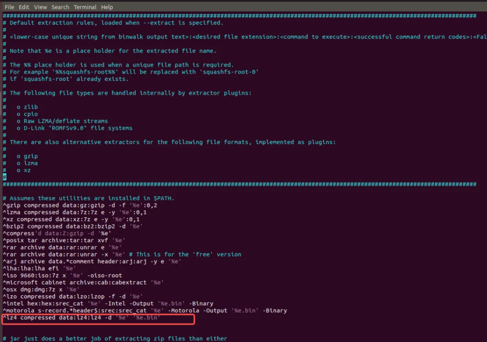

注意：不同安装binwalk方法，extract.conf 路径不同，可使用find查询

```
sudo find / -name extract.conf
```

有可能显示几个路径，我环境下python路径下的才是binwalk运行时加载的路径。

扩展：确定一个文件读取哪个文件或在哪个路径下可使用trace工具追踪分析。

2，binwalk提取文件系统

```
cd Vigorxx
binwalk -Me Vigorxx.all
```

3，查找xx中的有符号sohod64.bin

```
cctrl@pwn:~/Desktop/vigor/success/_xx.all-0.extracted/_ECF140.lz4.bin.extracted/cpio-root$ find ./ -name soho*

./firmware/vqemu/sohod64.bin
```

* 使用IDA加载有符号sohod64.bin

下面使用的方案是通过rizzo.py先导出符号，然后加载到无符号的程序中。其他bindiff等工具都可实现相识功能。

rizzo.py（支持到最新版本ida）:

<https://github.com/Reverier-Xu/IDA-Rizzo/tree/main>

我使用的rizzo.py版本：

<https://github.com/grayhatacademy/ida/blob/master/plugins/rizzo/rizzo.py>（我使用的ida是7.x，提示了需要shims包，下载此仓库中的shims包即可解决）

1，使用rizzo导出vigorxx符号表，保存为xx.riz文件：

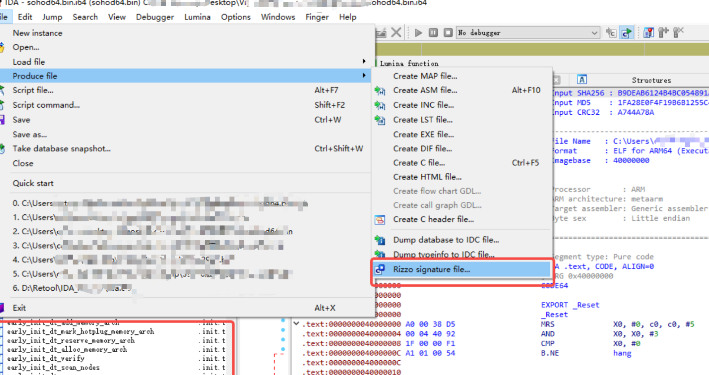

2，使用rizzo导入xx.riz符号表到soho2962.bin中，完成符号表加载：

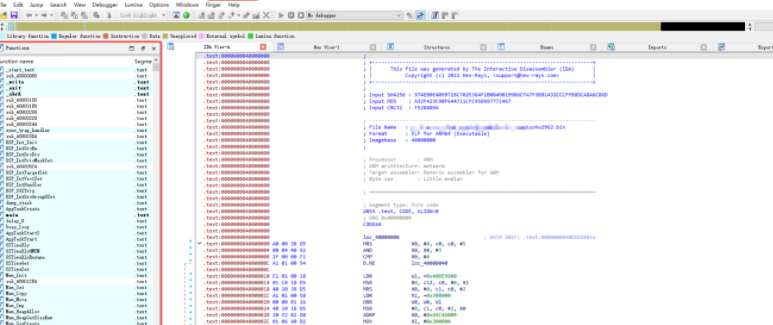

## 方法二

参考：<https://www.iotsec-zone.com/article/480>

1，只能恢复部分符号方法：

```
#输入input_file通过readelf -a binary > input_file获取
import sys

def extract_addresses(file_content):
    results = []
    lines = file_content.strip().split('
')
    
    # Flag to start extraction after finding '__ksymtab_strings'
    start_extraction = False
    
    for line in lines:
        parts = line.split()
        
        # Check if '___ksymtab+simple' is in the line
        if '___ksymtab+simple' in parts:
            start_extraction = True
        
        # Start extracting addresses after finding '__ksymtab_strings'
        if start_extraction:
            # Find the index of 'PROGBITS'
            if 'PROGBITS' in parts:
                progbits_index = parts.index('PROGBITS')
                # The address we want is the next element after 'PROGBITS'
                address = parts[progbits_index + 1]
                results.append(f'0x{address}')
            else:
                # Stop extraction if the line does not contain 'PROGBITS'
                break
    
    return results

def main():
    if len(sys.argv) != 2:
        print("Usage: python script.py <input_file>")
        sys.exit(1)

    input_file = sys.argv[1]
    # Check if the input file has a .txt extension, if not, add it
    if not input_file.endswith('.txt'):
        input_file += '.txt'
    
    # Construct the output file name
    output_file = input_file.replace('.txt', '_out.txt')

    try:
        with open(input_file, 'r') as infile:
            file_content = infile.read()
    except FileNotFoundError:
        print(f"Error: File '{input_file}' not found.")
        sys.exit(1)

    extracted_data = extract_addresses(file_content)

    with open(output_file, 'w') as outfile:
        for data in extracted_data:
            outfile.write(data + '
')

    print(f"Extracted data has been written to '{output_file}'")

if __name__ == "__main__":
    main()
```

2，IDA恢复函数名：

```
#测试使用的是ida7.7, 请注意自己版本是否兼容ida的API
import idaapi
import idc

def read_addresses(file_path):
    addresses = []
    with open(file_path, 'r') as file:
        for line in file:
            address = int(line.strip(), 16)
            addresses.append(address)
    return addresses

def fix_function_names(addresses):
    for addr in addresses:
        func_addr = idc.get_wide_dword(addr)  # 读取函数地址
        #print("func_addr: " + hex(func_addr))
        
        func_name_addr = idc.get_wide_dword(addr + 4)  # 读取 DWORD (4字节) 数据，获取函数名
        #print("func_name_addr: " + hex(func_name_addr))
        
        if func_name_addr != 0:  # 确保函数名字地址不是0
            func_name_str = idc.get_strlit_contents(func_name_addr)  # 获取函数名字符串
            
            if func_name_str:
                # 将字节字符串转换为普通字符串（仅在需要时）
                func_name_str = func_name_str.decode('utf-8') if isinstance(func_name_str, bytes) else func_name_str
                
                idc.set_name(func_addr, func_name_str, idc.SN_CHECK)  # 给函数重新命名
                print(f"Renamed function at {hex(func_addr)} to {func_name_str}")

def main():
    input_file = r'C:\Desktop\IDA_Pro_7.7\IDAMyPythonScript\input_file_out.txt'
    #读取所有地址
    addresses = read_addresses(input_file)
    fix_function_names(addresses)
    print("Function renaming completed.")

if __name__ == "__main__":
    main()
```

## 其他思路

文件系统中userspace/drayos/draycfg发现如下内容，像是下载源码文件这文件，但是服务器无法连接：

```
config US_DRAYOS_V400_RD3
    bool "DrayOS V400_RD3"
    help
    DrayOS V400_RD3 from ssh://git@gitea.draytek.com:2222/DrayOS/drayos.git V400_RD3 branch 

config US_DRAYOS_V385_RD3
    bool "DrayOS V385_RD3"
    help
    DrayOS V385_RD3 from ssh://git@gitea.draytek.com:2222/RD3/drayos-385.git master branch
```

# 完整系统仿真

为了更好的分析，避免破坏测试环境，由于此设备可以通过qemu仿真，下面我们搭建仿真环境，然后保存分析点快照继续研究。

仿真思路：参考原本的qemu.sh修改qemu-system-aarch64参数。

1，高版本qemu.sh适配仿真：

```
#!/bin/bash
# 1. do "fw_setenv purelinux 1" first , then reboot
# 2. do setup_qemu_linux.sh (default P3 as WAN, P4 as LAN, for both 1Gbps connection only)
# 3. remember to recover to normal mode by "fw_setenv purelinux 0"

rangen() {
   printf "%02x" `shuf -i 1-255 -n 1`
}


wan_mac(){
        idx=$1
        printf "%02x
" $((0x${C}+0x$idx)) | tail -c 3 # 3 = 2 digit + 1 terminating character
}

A=$(rangen); B=$(rangen); C=$(rangen);
LAN_MAC="00:1d:aa:${A}:${B}:${C}"


mkfifo serial0

platform_path="./platform"
echo "x86" > $platform_path
enable_kvm_path="./enable_kvm"

echo "kvm" > $enable_kvm_path
cfg_path="./magic_file"

echo "GCI_SKIP" > gci_magic

uffs_flash="./v2962_ram_flash.bin"

echo "0" > memsize

SHM_SIZE=16777216
route add default gw 192.168.1.1
dd if=/dev/zero of=v2962_ram_flash.bin bs=512 count=100000
./qemu-system-aarch64 -M virt,gic_version=3 -cpu cortex-a57 -dtb DrayTek -m 512 \
        -kernel ./soho2962.bin $serial_option \
        -nographic $gdb_serial_option $gdb_remote_option -name debug-threads=on \
        -device virtio-net-pci,netdev=network-lan,mac=${LAN_MAC} \
        -netdev tap,id=network-lan,ifname=qemu-lan,script=no,downscript=no \
        -device virtio-net-pci,netdev=network-wan,mac=00:1d:aa:${A}:${B}:$(wan_mac 1)\
        -netdev tap,id=network-wan,ifname=qemu-wan,script=no,downscript=no \
        -device virtio-serial-pci -chardev pipe,id=ch0,path=serial0 \
        -device virtserialport,chardev=ch0,name=serial0 \
        -monitor telnet:127.0.0.1:7777,server,nowait \
        -device loader,file=gci_magic,addr=0x4de0000 \
        -device loader,file=$uffs_flash,addr=0x00be0000 \
        -device loader,file=$cfg_path,addr=0x260000 \
        -device loader,file=$platform_path,addr=0x25fff0 \
        -device loader,file=$enable_kvm_path,addr=0x25ffe0 \
        -device loader,file=memsize,addr=0x25ff67 \
        -device ivshmem-plain,memdev=hostmem \
        -object memory-backend-file,size=${SHM_SIZE},share,mem-path=/dev/shm/ivshmem,id=hostmem \
```

2，网卡信息参考drayrt-release-gpl/output/rootfs/draytek/drayrc/rc.d/rc.41.setupif.sh可参看分析出如下net.sh脚本：

```
#!/bin/bash

#iflan=ens38
#ifwan=ens39
mylanip="192.168.1.2"

brctl delbr br-lan 2> /dev/null
brctl delbr br-wan 2> /dev/null

ip link add br-lan type bridge
ip tuntap add qemu-lan mode tap
#brctl addif br-lan $iflan
brctl addif br-lan qemu-lan
#ip addr flush dev $iflan
ifconfig br-lan $mylanip
ifconfig br-lan up
ifconfig qemu-lan up
#ifconfig $iflan up

ip link add br-wan type bridge
ip tuntap add qemu-wan mode tap
#brctl addif br-wan $ifwan
brctl addif br-wan qemu-wan
#ip addr flush dev $ifwan
ifconfig br-lan $mylanip
ifconfig br-wan up
ifconfig qemu-wan up
#ifconfig $ifwan up

brctl show

#for speed test
ethtool -K $iflan gro off
ethtool -K $iflan gso off

ethtool -K $ifwan gro off
ethtool -K $ifwan gso off

ethtool -K qemu-lan gro off
ethtool -K qemu-lan gso off

ethtool -K qemu-wan gro off
ethtool -K qemu-wan gso off


#for telnet from linux to drayos 192.168.1.1
ethtool -K br-lan tx off
```

3，kali环境可能出现报错：

qemu-system-aarch64: -device virtio-net-pci,netdev=network-lan,mac=00:1d:aa:e9:25:69: failed to find romfile "efi-virtio.rom"

解决：

找到 efi-virtio.rom，拷贝下到当前目录：

```
┌──(ida㉿ida)-[~/…/rootfs.img_extract/usr/share/qemu]
└─$ pwd
/home/ida/Desktop/2962/v2962_4326.all_dec_file_extract/12349763-51274870.gzip_extract/rootfs.img_extract/usr/share/qemu

└─$ cp efi-virtio.rom /home/ida/Desktop/2962/v2962_4326.all_dec_file_extract/12349763-51274870.gzip_extract/rootfs.img_extract/draytek/drayapp
```

4，然后分别执行上面net.sh和qemu.sh即可仿真运行：

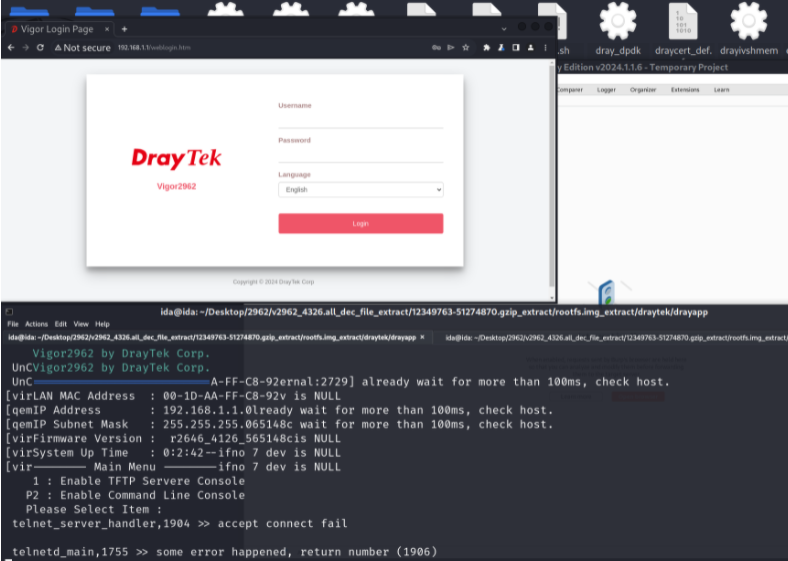

5，开放端口：

```
$ nmap 192.168.1.1
PORT    STATE SERVICE
21/tcp  open  ftp
22/tcp  open  ssh
23/tcp  open  telnet
80/tcp  open  http
443/tcp open  https
```

# 漏洞分析

参考：

[Breaking lnto DrayTek RoutersBefore Threat Actors Do lt Again]<https://www.forescout.com/resources/draybreak-draytek-research/>

[CVE-2024-41592 vigor 栈溢出漏洞分析]<https://bestwing.me/CVE-2024-41592-vigor-stack-overflow.html>

信息简述：

（1）未检测&数量导致栈溢出：CVE-2024-41592

相关API：makework()

（2）OS Command Injection：CVE-2024-41585

2926漏洞版本确定。

修复版本: 4.3.2.8

## 溢出漏洞产生原因

1，漏洞产生原因，定位getcgi()函数中：

未检测&边界，循环读取内容

```
while ( *(_BYTE *)v20 )                   // 这个循环控制query中&读取，保存
{
    *(_DWORD *)(a2 + 8 * v3) = makeword(v20, '&');// 返回的是malloc的指针，即p_key。溢出点，未检验&数量边界。
    v20="a1=aaaa&a2=aaaa&a3=aaaa&a4=aaaa&a5=aaaa&a6=aaaa"// makework每次读取一个&前面内容，并malloc空间保存内容
    plustospace(*(unsigned int *)(a2 + 8 * v3));// 处理P_key指向的值，*(unsigned int *)(a2 + 8 * v3)=“a1=aaaa”
    unescape_url(*(unsigned int *)(a2 + 8 * v3));// 处理p_key指向的值
    v18 = next_token(*(unsigned int *)(a2 + 8 * v3), '=');

    //下面代码对应汇编如下
    if ( v18 )
    {
        *(_BYTE *)v18 = 0;
        *(_DWORD *)(a2 + 8 * v3 + 4LL) = v18 + 1;// v18+1是指向query中key=value的p_value指针，把它放到栈上
    }
}

LDR             W7, [X29,#0x64]         ; w7=v18
ADD             W6, W7, #1              ; w6=v18 + 1
STR             W6, [X29,#0x64]         ; val(x29+0x64)=w6
STRB            WZR, [X7]               ; *(_BYTE *)v18 = 0;
MOV             W7, W19                 ; w7=v3
LSL             W7, W7, #3              ; w7=8 * v3
LDR             W6, [X29,#0x38]         ; w6=a2
ADD             W7, W6, W7              ; w7=a2 + 8 * v3
MOV             W7, W7                  ; (_DWORD *)(a2 + 8 * v3)
LDR             W6, [X29,#0x64]         ; a2指针放到栈上！a2是从&读取的指针
STR             W6, [X7,#4]             ; *(_DWORD *)(a2 + 8 * v3 + 4LL) = v18 + 1
```

2，makeword功能是开辟空间放key1=value1的值，然后返回p\_key；移动指针，开辟空间保存ptr\_key和ptr\_value：

```
__int64 __fastcall makeword(unsigned int a1, unsigned __int8 a2)
{
  long double v2; // q0
  long double v3; // q1
  long double v4; // q2
  long double v5; // q3
  long double v6; // q4
  long double v7; // q5
  long double v8; // q6
  long double v9; // q7
  int v10; // w7
  _BYTE *v11; // x7
  int v12; // w6
  unsigned int v16; // [xsp+24h] [xbp+24h]
  int v17; // [xsp+28h] [xbp+28h]
  int v18; // [xsp+28h] [xbp+28h]
  int i; // [xsp+2Ch] [xbp+2Ch]

  v17 = ind(a1, a2);                            // 分次取出&前面的内容
                                                // a1="a1=aaaa&a2=aaaa&a3=aaaa&a4=aaaa&a5=aaaa&a6=aaaa"
                                                // a2=&
                                                // v17=7=length(a1=aaaa)
  if ( v17 == -1 )
    v17 = safe_strlen(a1, v2, v3, v4, v5, v6, v7, v8, v9);
  v16 = dmalloc((unsigned int)(v17 + 1), 0LL, 1367LL);// 为存储&前面的内容开辟空间
  for ( i = 0; *(_BYTE *)(a1 + i) && a2 != *(_BYTE *)(a1 + i); ++i )// a2 != *(_BYTE *)(a1 + i)判断是否到&即停止
    *(_BYTE *)(v16 + i) = *(_BYTE *)(a1 + i);   // 存储&前面内容
  *(_BYTE *)(v16 + i) = 0;
  if ( *(_BYTE *)(a1 + i) )
    ++i;                                        // 如果&后面还有内容，读取后面的指针偏移，供v12计算
  v18 = 0;
  do                                            // 这里循环移动指针，指向下一个&
  {
    v10 = v18++;
    v11 = (_BYTE *)(a1 + v10);
    v12 = i++;
    *v11 = *(_BYTE *)(a1 + v12);
  }
  while ( *v11 );
  return v16;                                   // 返回指向（key=value）的ptr
}
```

3，溢出点：getcgi(a1,a2)其中a2是栈上数据，在getcgi(a1,a2)函数实现中，通过while循环读取&的数量，往a2上赋值，最终导致上一层栈帧内容被覆盖。

## 溢出补丁比对

Vigor2962\_v4.3.2.8 V.S. Vigor2962\_v4.3.2.6

1，Vigor2962\_v4.3.2.6漏洞点，未检验&数量边界：

```
while ( *(_BYTE *)v25 )
{
*(_DWORD *)(a2 + 8 * v4) = makeword(v25, '&');
...
```

2，Vigor2962\_v4.3.2.8修复，不再只是v25控制循环，对\*(\_DWORD \*)(a1 + 0x10LL)做了长度校验，从而防止了&溢出：

```
if ( !*(_DWORD *)(a1 + 0x10LL) )
{
  v6 = sub_40F53CF0((unsigned int)"=====> check cgi input_num ????? \r
", v4, v5);
  sub_4064FCEC(v6);
}
for ( i = 0; *(_BYTE *)v25 && *(_DWORD *)(a1 + 0x10LL) > i; ++i )
{
  *(_DWORD *)(a2 + 8 * i) = makeword(v25, '&');
  sub_400BF248(*(unsigned int *)(a2 + 8 * i));
  sub_400BF674(*(unsigned int *)(a2 + 8 * i));
  v23 = sub_40651C58(*(unsigned int *)(a2 + 8 * i), 61LL);
  if ( v23 )
  {
    *(_BYTE *)v23 = 0;
    *(_DWORD *)(a2 + 8 * i + 4LL) = v23 + 1;
  }
  else
  {
  *(_DWORD *)(a2 + 8 * i + 4LL) = 0;
  }
}
```

## 命令执行漏洞

1，触发命令执行点：

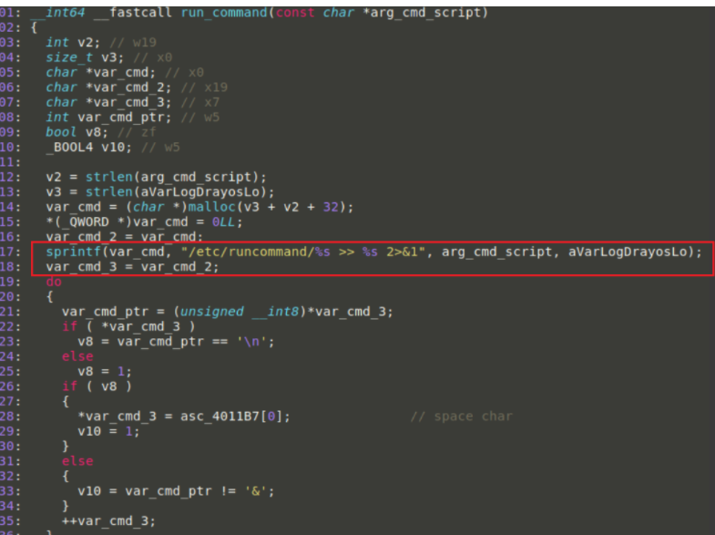

2，支持的拼接命令：

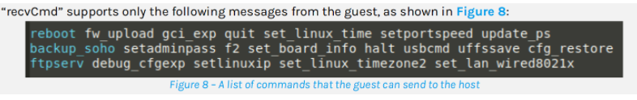

3，示例：

```
#拼接内容“set_linux_time ;echo helloworld;”
system(/etc/runcommand/set_linux_time ;echo helloworld; >> /var/log/drayos/logpipe 2>&1)
```

Q：拼接中有个细节，这个细节就留给大家思考。

## 调试分析

Q：溢出点？溢出的栈帧是当前栈帧？

Q：利用的是哪个栈帧？

Q：如何解决破坏利用流程？

Q：寻找到xx.cgi？

Q：哪些未授权的xx.cgi？

下面文分析过程中给出上面答案。

### 解决溢出偏移问题

两种思路：

（1）静态分析计算

（2）动态测试计算

如不能一次计算准确的偏移值，可以根据动态测试微调。

gdb调试技巧：

```
gdb binary -x gdb.txt

'''gdb.txt
set architecture aarch64
set endian little 
file soho2962.bin
target remote 192.168.1.2:1234  //network.sh中配置的IP，而不是qemu.sh中配置了网关192.168.1.1，但web访问的还是192.168.1.1。
'''
```

1，以下是其中之一未授权接口点cgi测试poc示例：

192.168.1.1/cgi-bin/wlogin.cgi?&&&&&&&&&&&&&&&&&&&&&

测试结果：

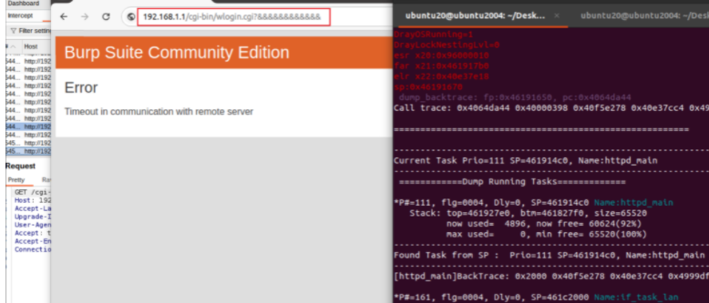

2，分析溢出真正可控ret的栈帧位置：

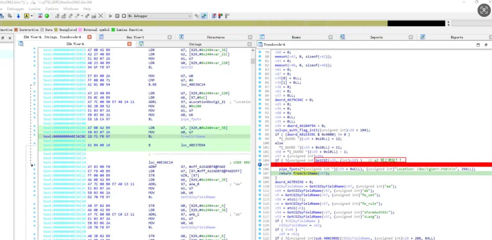

v28是当前栈帧func1的局部变量，v28作为GetCGI的第二个参数传递，当发生溢出时，溢出的是foo1()的栈帧。

重点：由于arm的指令特性，往v28局部变量写，无法控制当前foo1()的ret1，想要控制pc寄存器，需要控制上层函数栈帧foo2()的ret2。（利用代码的本质就是控制pc）

```
# IDA中观察关键汇编指令

0x40D12F74 FD 7B C7 A8  LDP X29, X30, [SP+0x70+var_70],#0x70
#快捷键K转换成0x112显示offset
0x40d12f74:            ldp x29, x30, [sp], #112

关键在LDP X29, X30, [SP+0x70+var_70],#0x70操作顺序：
(1)取值：读取的地址是相对于当前栈指针加上偏移量 0x70 和 var_70 的值。
(2)赋值：从栈中读取两个 64 位的值，分别加载到寄存器 X29 和 X30 中。
(3)抬栈：在执行完后，栈指针 SP 将增加 0x70，以便为后续操作准备。
```

3，验证可控内容覆盖栈帧：

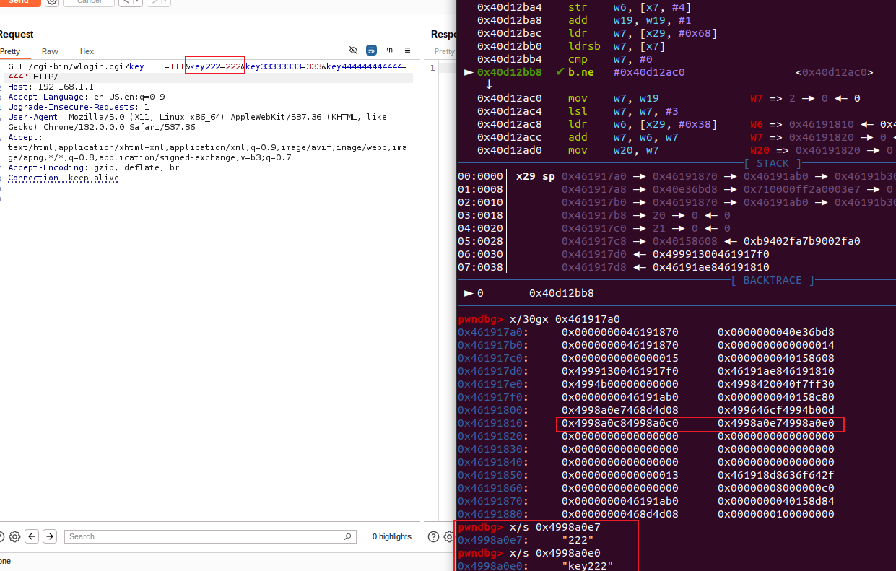

4，freeCtrlName把输入数据给清空了

绿色部分：

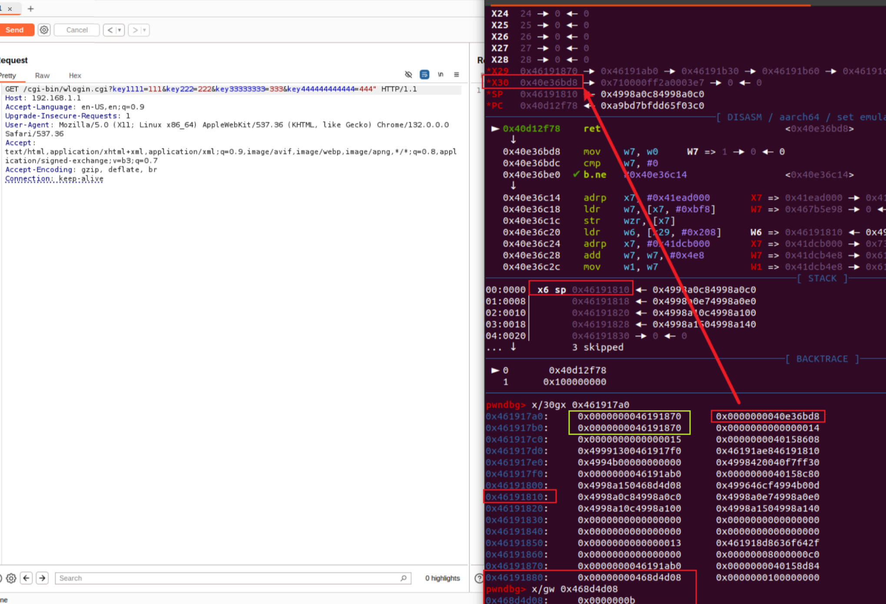

5，如何找到真正cgi，绕过freebuf

```
if ( (unsigned int)GetCGI(v6, a2 )
```

溢出a2参数到ret，指令正常执行到ret需要绕过freeCtrlName()；

FreeCtrlName处理了所有的POST/GET请求数据；

FreeCtrlName虽然只释放了低四字节指针(unsigned int)，但影响了ret布局；

```
__int64 __fastcall FreeCtrlName(__int64 result)
{
  int v1; // [xsp+1Ch] [xbp+1Ch]
  int i; // [xsp+2Ch] [xbp+2Ch]

  v1 = result;
  for ( i = 0; *(_DWORD *)(unsigned int)(v1 + 8 * i); ++i )
  {
    result = dfree(*(unsigned int *)(unsigned int)(v1 + 8 * i), 0x163LL);
    *(_DWORD *)(unsigned int)(v1 + 8 * i) = 0;
  }
  return result;
}
```

6，解决：

找特别的cgi，free没影响到ret。因为FreeCtrlName遇到栈上指针(v1 + 8 \* i)=0时，终止循环。

We were fortunate to discover a CGI handler that: (1) processes the query string without authentication, and (2) sets the value of a specific local variable to zero after the query string overflow occurs.This local variable resides at a stack address lower than the return address but higher than the query string buffer’s start. This effectively places a zero on the stack and breaks the deallocation chain in “*FreeCtrName()*”, and preserves the overwritten return address.

**Q：这个cgi是哪个？**

A：思路如下：

（1）首先先将所有的 CGI 调用函数定义出来

string soho把所有cgi接口提取出来；

补充：后续发现通过IDA中字符定位，反查地址引用(alt+t)可以直接定位到一个表单，里面是cgi与cgi\_hander映射表。

```
IDA中如何定位表单示例:
0x12345678  wlogin.cgi
通过alt+t搜索0x12345678即可定位
```

（2）过滤出不需要授权的 CGI 函数

burp测试status code；

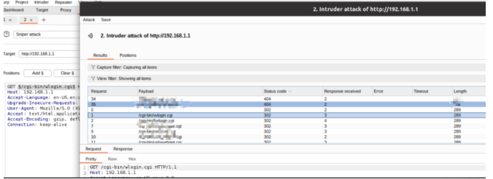

（3）猜想哪些函数可以写 0 ， 例如 atoi(query\_string), query\_string 是 HTTP 请求传入的参数

注意：（考虑可写0）**不用授权、且参数可控可写 0** 的CGI。

并且这个0的位置要加载buf-0-ret的中间：

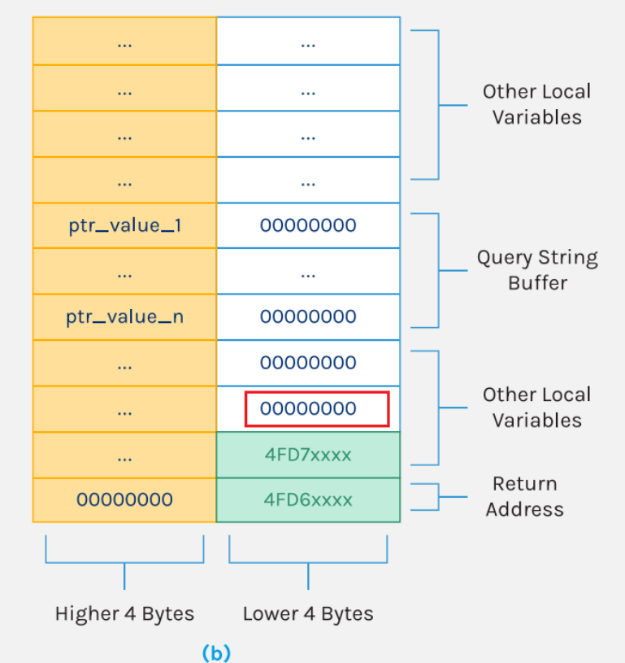

### 组合利用

poc编写，下面给出一个shellcode示例：

1，利用unescape\_url()，绕过坏字符；

可利用url编码 smuggle shellcode；

char2byte => %DE%AD%BE%EF = Þ­¾ï

2，利用rop

```
adr x0, #24 //x0第一个参数
movz x19, #0xbeef   //x19 = 调用函数地址  (关键地址)
movk x19, #0xdeaf, lsl #16
movz x30, #0xfood   //x30 = old ret
movk x30, #0xbaad, lsl #16
br  x19
```

movk x30, #0xbaad, lsl #16指令解释：

**movk**: 表示“move with keep”。这条指令用于将一个立即数（即数字常量）移动到指定寄存器的特定位，同时保留寄存器中其他位的值。

**x30**: 这是目标寄存器，表示我们要操作的寄存器。在 ARM 架构中，x30 通常是链接寄存器（LR），用于存储返回地址。

**#0xbaad**: 这是要移动的立即数。0xbaad 是一个 16 位的十六进制数。

**lsl #16**: 这是一个位移操作，表示将立即数左移 16 位。lsl 是“逻辑左移”的缩写。

小结：该指令的作用是将 0xbaad 左移 16 位，然后将结果存储到 x30 寄存器的高 16 位，同时保留低 16 位的值。

x19是执行命令的函数：

（1）打印输出

printf打印验证

（2）命令执行

recvCmd字符长度限制<64字节(下面poc结合的是此方式)

绕过：通过分步执行命名，其他思路留给大家思考。

注意：但程序中调用了fork，因此可能命令会被多次执行。

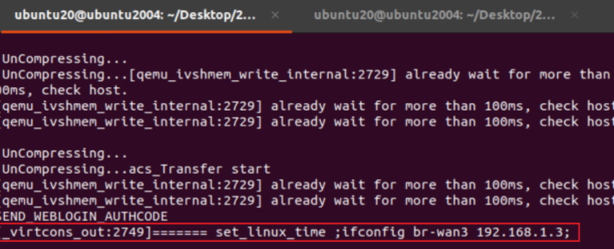

(3)一个探讨，如何定位分析ip:port

实际测试不可行，tcp\_socket\_servr和recvCmd实现代码类似，但是端口不对。

思路：发现监听如下socket，然后反推分析。

```
tcp        0      0 169.254.0.2:65006       0.0.0.0:*               LISTEN      1618/tcp_socket_server
```

Q：如何分析处端口不对？

A：这里可以自己写一个C/S通过调试观察ip和port传递的参数，然后分析实际的port。

```
/*
server.c
*/
#include <stdio.h>
#include <stdlib.h>
#include <string.h>
#include <unistd.h>
#include <arpa/inet.h>

#define PORT 8080
#define BUFFER_SIZE 1024

int main() {
    int server_fd, new_socket;
    struct sockaddr_in address;
    int opt = 1;
    int addrlen = sizeof(address);
    char buffer[BUFFER_SIZE] = {0};

    // Creating socket file descriptor
    if ((server_fd = socket(AF_INET, SOCK_STREAM, 0)) == 0) {
        perror("socket failed");
        exit(EXIT_FAILURE);
    }

    // Attaching socket to the port
    if (setsockopt(server_fd, SOL_SOCKET, SO_REUSEADDR, &opt, sizeof(opt))) {
        perror("setsockopt");
        exit(EXIT_FAILURE);
    }

    address.sin_family = AF_INET;
    address.sin_addr.s_addr = INADDR_ANY;
    address.sin_port = htons(PORT);

    // Binding socket to the port
    if (bind(server_fd, (struct sockaddr *)&address, sizeof(address)) < 0) {
        perror("bind failed");
        exit(EXIT_FAILURE);
    }
    if (listen(server_fd, 3) < 0) {
        perror("listen");
        exit(EXIT_FAILURE);
    }

    printf("Server is listening on port %d
", PORT);

    // Accepting an incoming connection
    if ((new_socket = accept(server_fd, (struct sockaddr *)&address, (socklen_t*)&addrlen)) < 0) {
        perror("accept");
        exit(EXIT_FAILURE);
    }

    // Reading data from the client
    read(new_socket, buffer, BUFFER_SIZE);
    printf("Message from client: %s
", buffer);

    // Closing the socket
    close(new_socket);
    close(server_fd);
    return 0;
}
```

关键是理解client，只要sockaddr\_in结构体保存ip:port；

connect根据ip:port获取socket；

send根据socket发送信息；

```
/*
client.c
*/
#include <stdio.h>
#include <stdlib.h>
#include <string.h>
#include <unistd.h>
#include <arpa/inet.h>

#define PORT 8080

int main() {
    int sock = 0;
    sockaddr_in serv_addr;
    char *message = "Hello from client";

    // Creating socket
    if ((sock = socket(AF_INET, SOCK_STREAM, 0)) < 0) {
        printf("
 Socket creation error 
");
        return -1;
    }

    serv_addr.sin_family = AF_INET;
    serv_addr.sin_port = htons(PORT);

    // Convert IPv4 and IPv6 addresses from text to binary form
    if (inet_pton(AF_INET, "127.0.0.1", &serv_addr.sin_addr) <= 0) {
        printf("
Invalid address/ Address not supported 
");
        return -1;
    }

    // Connecting to the server
    if (connect(sock, (struct sockaddr *)&serv_addr, sizeof(serv_addr)) < 0) {
        printf("
Connection Failed 
");
        return -1;
    }

    // Sending message to the server
    send(sock, message, strlen(message), 0);
    printf("Message sent to server
");

    // Closing the socket
    close(sock);
    return 0;
}
```

compile

```
└─$ gcc -m32 -fno-stack-protector -o  server server.c

└─$ gcc -m32 -fno-stack-protector -o  client client.c
```

通过此分析可以了解ip:port写死的情况下，在ida中如何确定（ida中用hex表示ip地址）。

```
#https://www.browserling.com/tools/ip-to-hex
127.0.0.1 convert to hex example
7f.00.00.01 (0x7f000001)
```

Q：是否需要考虑坏字符，判断0是否会被截断？

A：不用，此处url编码可绕过。

# drayos网络架构

此设备的网络架构不常见，比较有趣，给出如下信息供大家参考。

参考：

[Local Network Setup and Management]<https://www.draytek.com/support/knowledge-base/5731>

[Routing Fundamentals]

<https://www.draytek.com/support/knowledge-base/5765>

[LAN-to-LAN IPsec VPN Configuration Guide]

<https://www.draytek.co.uk/support/guides/kb-lantolan-ipsec-3900to2860>

1，相关网络设置文件：

```
set_dbg_port.sh //设备启动调用的文件
network.sh  //qemu启动目录下的网络配置文件
draytek/drayrc/rc.d/rc.41.setupif.sh    //启动配置
draytek/drayapp/dpdk.sh //vlan网络的相关文件
```

2，draytek框架网络通信三层关系：

host(linuxOS)-guest(drayOS)-user

```
+-------------------+
|       Host        |
|                   |
|    +----------+   |
|    |  br-lan  |   |       +--------------------+
|    +----------+   |<----->|      tap           |
|                   |   |   +--------------------+
|                   |   |
|                   |   |
|                   |   |
+-------------------+   |
                        |
                        |
                        |
           +------------+
           |  
           |                       
+----------+----------+  +--------+---------+
|    QEMU (VM)       |  |      NAT         |
|                    |  |                  |
|  +--------------+  |  |                  |
|  |  qemu-lan    |<-------------------------+User
|  +--------------+  |  |                  |
+--------------------+  +------------------+
```
