# SQCTF2025-Crypto-WP-先知社区

> **来源**: https://xz.aliyun.com/news/17735  
> **文章ID**: 17735

---

# base

task:

```
kR53l4pXoztyd3wSe3kJc3dBpyQQpj8Qbm8Odm8Jcz4OpC5zcClzcCgPvg==
```

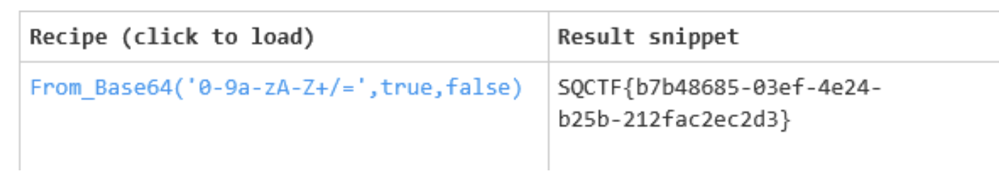

魔改base64一把嗦：

```
SQCTF{b7b48685-03ef-4e24-b25b-212fac2ec2d3}
```

# 小白兔白又白

task:

```
<Rec"7_Y{$sH!*Xi7!Sg]y<ogP=4EPll52]d}71XhM|8U,xb_OBeHyU6G${u>x,S=!`HV,mY]MQGvOwiXX#cd7{:c!V?fvBrd,81G?qoAP~:YEtbFPuH)i!@gSvYba:aEd)dv#6@JR/g2xwi>!g2?y=p36|TBw(l:z/I]>0oBMrR<,%kuMS;yl##]8Bb!*bdVdEdf7gCtOD]&Zycc:2cJk`dQP845Y$el5"d/5eMyM:Z*w0b?z1HX5q6RShVv++Z2%Vfl7S0+K
```

先base91解密然后

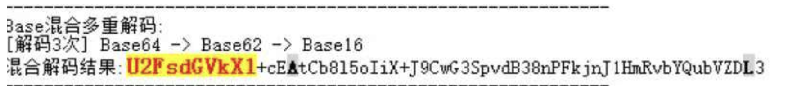

再根据提示哔哩哔哩的哈哈大笑试出密码为233，最后rabbit解码：

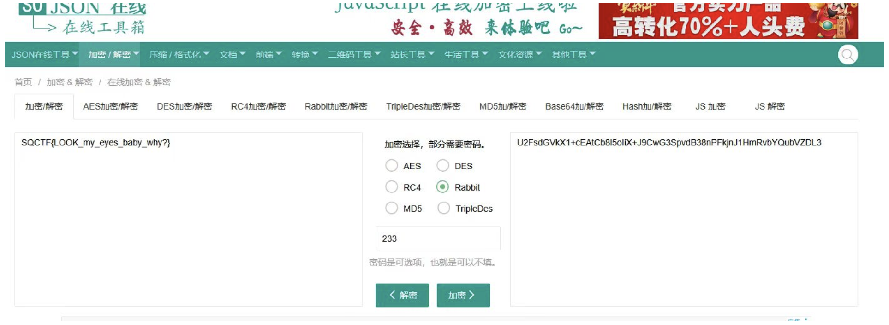


flag：SQCTF{LOOK\_my\_eyes\_baby\_why?}

# 别阴阳我了行吗？

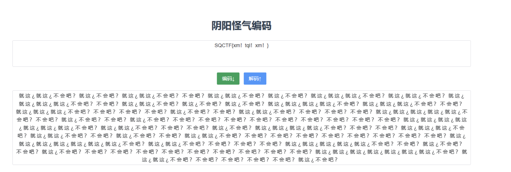


在线解密即可：

SQCTF{xm!tql!xm!}

# 春风得意马蹄疾

核心价值观一直解码即可：

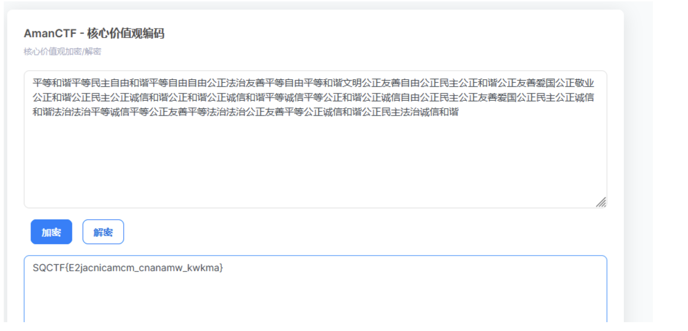

得到flag:SQCTF{E2jacnicamcm\_cnanamw\_kwkma}

# 简单RSA

task:

```
该题目要求参赛者解密密文 `c` 以获得原始消息。这是一个典型的RSA解密问题。


- 公钥：\(e = 65537\)
- 模数：\(n = 7349515423675898192891607474991784569723846586810596813062667159281369435049497248016288479718926482987176535358013000103964873016387433732111229186113030853959182765814488023742823409594668552670824635376457830121144679902605863066189568406517231831010468189513762519884223049871926129263923438273811831862385651970651114186155355541279883465278218024789539073180081039429284499039378226284356716583185727984517316172565250133829358312221440508031140028515954553016396884149904097959425582366305748700291610280675014390376786701270107136492645593662763444032174543205008326706371954830419775515459878227148997362533\)
- 密文：\(c = 3514741378432598036735573845050830323348005144476193092687936757918568216312321624978086999079287619464038817665467748860146219342413630364856274551175367026504110956407511224659095481178589587424024682256076598582558926372354316897644421756280217349588811321954271963531507455604340199167652015645135632177429144241732132275792156772401511326430069756948298403519842679923368990952555264034164975975945747016304948179325381238465171723427043140473565038827474908821764094888942553863124323750256556241722284055414264534546088842593349401380142164927188943519698141315554347020239856047842258840826831077835604327616\)
```

普通的费马，yafu分解即可得到p,q（exp:

```
from Crypto.Util.number import *
import gmpy2
p = 85729314844316224669788680650977264735589729061816788627612566392188298017717541385878388569465166835406950222982743897376939980435155664145111997305895651382483557180799129871344729666249390412399389403988459762024929767702864073925613168913279047262718022068944038280618279450911055132404010863614460682753
q = 85729314844316224669788680650977264735589729061816788627612566392188298017717541385878388569465166835406950222982743897376939980435155664145111997305895651382483557180799129871344729666249390412399389403988459762024929767702864073925613168913279047262718022068944038280618279450911055132404010863611867388261

c=3514741378432598036735573845050830323348005144476193092687936757918568216312321624978086999079287619464038817665467748860146219342413630364856274551175367026504110956407511224659095481178589587424024682256076598582558926372354316897644421756280217349588811321954271963531507455604340199167652015645135632177429144241732132275792156772401511326430069756948298403519842679923368990952555264034164975975945747016304948179325381238465171723427043140473565038827474908821764094888942553863124323750256556241722284055414264534546088842593349401380142164927188943519698141315554347020239856047842258840826831077835604327616
n=p*q
e=65537
d=gmpy2.invert(e,(p-1)*(q-1))
m=pow(c,d,n)
print(long_to_bytes(m))
#SQCTF{be7e48547356cdf16649fd29e0ff9e1f}
```

# ezCRT

task:

```
n1 = 64461804435635694137780580883118542458520881333933248063286193178334411181758377012632600557019239684067421606269023383862049857550780830156513420820443580638506617741673175086647389161551833417527588094693084581758440289107240400738205844622196685129086909714662542181360063597475940496590936680150076590681
n2 = 82768789263909988537493084725526319850211158112420157512492827240222158241002610490646583583091495111448413291338835784006756008201212610248425150436824240621547620572212344588627328430747049461146136035734611452915034170904765831638240799554640849909134152967494793539689224548564534973311777387005920878063
n3 = 62107516550209183407698382807475681623862830395922060833332922340752315402552281961072427749999457737344017533524380473311833617485959469046445929625955655230750858204360677947120339189429659414555499604814322940573452873813507553588603977672509236539848025701635308206374413195614345288662257135378383463093
c1 = 36267594227441244281312954686325715871875404435399039074741857061024358177876627893305437762333495044347666207430322392503053852558456027453124214782206724238951893678824112331246153437506819845173663625582632466682383580089960799423682343826068770924526488621412822617259665379521455218674231901913722061165
c2 = 58105410211168858609707092876511568173640581816063761351545759586783802705542032125833354590550711377984529089994947048147499585647292048511175211483648376727998630887222885452118374649632155848228993361372903492029928954631998537219237912475667973649377775950834299314740179575844464625807524391212456813023
c3 = 23948847023225161143620077929515892579240630411168735502944208192562325057681298085309091829312434095887230099608144726600918783450914411367305316475869605715020490101138282409809732960150785462082666279677485259918003470544763830384394786746843510460147027017747048708688901880287245378978587825576371865614
```

简单crt,猜e为3（

exp:

```
from sympy.ntheory.modular import crt
from Crypto.Util.number import *
import gmpy2
n1 = 64461804435635694137780580883118542458520881333933248063286193178334411181758377012632600557019239684067421606269023383862049857550780830156513420820443580638506617741673175086647389161551833417527588094693084581758440289107240400738205844622196685129086909714662542181360063597475940496590936680150076590681
n2 = 82768789263909988537493084725526319850211158112420157512492827240222158241002610490646583583091495111448413291338835784006756008201212610248425150436824240621547620572212344588627328430747049461146136035734611452915034170904765831638240799554640849909134152967494793539689224548564534973311777387005920878063
n3 = 62107516550209183407698382807475681623862830395922060833332922340752315402552281961072427749999457737344017533524380473311833617485959469046445929625955655230750858204360677947120339189429659414555499604814322940573452873813507553588603977672509236539848025701635308206374413195614345288662257135378383463093
c1 = 36267594227441244281312954686325715871875404435399039074741857061024358177876627893305437762333495044347666207430322392503053852558456027453124214782206724238951893678824112331246153437506819845173663625582632466682383580089960799423682343826068770924526488621412822617259665379521455218674231901913722061165
c2 = 58105410211168858609707092876511568173640581816063761351545759586783802705542032125833354590550711377984529089994947048147499585647292048511175211483648376727998630887222885452118374649632155848228993361372903492029928954631998537219237912475667973649377775950834299314740179575844464625807524391212456813023
c3 = 23948847023225161143620077929515892579240630411168735502944208192562325057681298085309091829312434095887230099608144726600918783450914411367305316475869605715020490101138282409809732960150785462082666279677485259918003470544763830384394786746843510460147027017747048708688901880287245378978587825576371865614

n=[n1,n2,n3]
c=[c1,c2,c3]
m=crt(n,c)[0]
m=gmpy2.iroot(m,3)[0]
print(long_to_bytes(int(m)))
#SQCTF{CRT_Unl0cks_RSA_Eff1c13ncy}
```

# 失落矿洞中的密码

题目描述：

```
19世纪末，探险家阿尔弗雷德·克劳福德在非洲一处古老矿洞中发现了一块刻有神秘数字的石板。石板上的公式似乎是一种古老的加密方法，而旁边的日记残页记载着：
"唯有解开此数术之谜，方能打开藏宝室的最后一道门..."
经过现代密码学家分析，这实际上是椭圆曲线加密（ECC）的早期雏形。你的任务是破解这段加密信息，找到最终的坐标之和（x + y），揭开宝藏的方位。
```

task:

```
y ^ 2 = x ^ 3 + 1234577 * x + 3213242 (mod 7654319)

G = (5234568, 2287747)

Public_Key = secretKey * G = (2366653, 1424308)

crypted_data = [(5081741, 6744615), (610619, 6218)]

m(x, y) ===> crypted_data[c1, c2]

x + y = ???
```

普通ECC问题

crypted\_data = [(5081741, 6744615), (610619, 6218)]

-->c1 = E(5081741, 6744615) , c2 = E(610619, 6218)  
-->m = c2 - secretKey \* c1

求出secretKey 即可（

exp:

```
#sage
p = 7654319
a = 1234577
b = 3213242
F = GF(p)
E = EllipticCurve(F, [a, b])

# 定义基点G和公钥

G = E(5234568, 2287747)
Public_Key = E(2366653, 1424308)

# 计算G的阶并分解

n = G.order()
factors = list(factor(n))

# 使用Pohlig-Hellman算法求解离散对数
primes = [pe[0]^pe[1] for pe in factors]
dlogs = []
for pe in factors:
    prime, exp = pe
    t = n // (prime^exp)
    H = G * t
    Q = Public_Key * t
    dlog = H.discrete_log(Q)
    dlogs.append(dlog)
    
secretKey = crt(dlogs, primes)

# 验证公钥正确性
assert G * secretKey == Public_Key, "Invalid Secret Key!"

c1 = E(5081741, 6744615)
c2 = E(610619, 6218)
m = c2 - secretKey * c1
x, y = m.xy()

print(f"x + y = {result}")
#x + y = 5720914
```

所以flag为：SQCTF{5720914}

# 字母的轮舞与维吉尼亚的交响曲

task:

```
N ehuzrhz tq tnjde ctcdy fraos qrur "Znk Mfnjwpd Ejlry tq Suqttaip." Lusplespsy nd a izcsk tq cxjltoty tu yse mwzuv, fyd ytwizzoe ox ehk tyle tftrje fuw wotjwitjds.Vjchgud iz bls gy ehox aoose tnfe I lnyarqj utipryyzoj Hzluspl Hzpnjíf lnj Ozsé Gwnajnz.Oaw sosjeocs meitxey f alghp wk qzvk szt hjnaaxp iz nd oaw sosjeocs, muz gpcgzde cj mernpvk ne tu gp oaw sosjeocs. Sosj ts axpd gx l prfne zt ceyy l dxnqtosr suzw, ati ehgy ts cmj iz xxerqd ol ipcgd lnj ipazm, wiqj hizmprki wegaps gso dkxprzjo ykqwoc xzir. Yz rkyfrt mzmk nd tu gcegp ehk hznijat uk "xe" hfnk oseo "ax," eo hj tnzjrrgypd oseo yznh g mfgk bsorj ehgy dlubwy hjnosjd itatsogwe, Sfnotiz, tnj Nizd zf Sncruwd.“Ot f hitypr tnrhz, yse ytfp vte wgx mooqtnm ty tnj dtuap, bay se sndski ehk xheryprosr hkfe it yse hfnk nfwl uk ehk gzoqxeoxj. Ehk mfm uk ehk xfn'y wlyy ty tnj ouyyj arrznj ycekx, ehk klity dixjys uk ehk rtdjfj mkfw, ay mp hgi tn Sfnotiz ykfcnki qox yse ytfp us ehk xeobj tn cnytkw, ehk hllr tq tnj nolkpe-vjodrjc, ati ehk xhily qlolst uk ehk qlrqx tn yucitl. GTLBT{bxc_oun_ewq!}"Xnkhgt," se yftd, zzcnosr tu Rlcusoo. Zmp tct eyvjd ol szszfwgof hexj wiqj xixwzry tapuxttk, fyd nj hay xeuip tn hjewkjy, cusquyjo, utfmlk yz mgnytgny a yzmlorp txfysijydksne.”
```

爆破密码得到123456

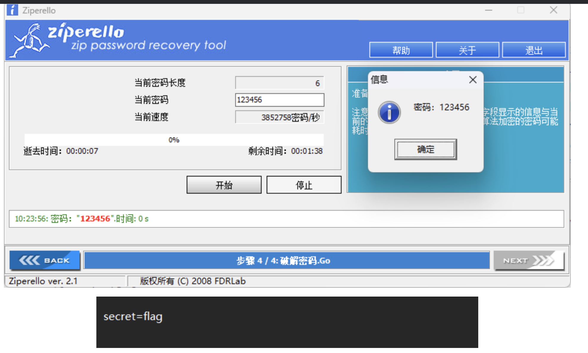


然后维吉尼亚得到：

```
I thought of these words again from "One Hundred Years of Solitude." Lonelyness is a curse of creation to the group, and solitude is the only outlet for loneliness.Perhaps it was at this point that I finally understood Colonel Buendía and José Arcadio.Our hometown becomes a place we love not because it is our hometown, but because we believe it to be our hometown. Home is used as a place to rest a drifting soul, and that is why it smells of decay and death, like withered leaves and deserted yellow soil. To return home is to break the concept of "me" back into "us," to be integrated into such a huge whole that slowly becomes invisible, Macondo, the City of Mirrors.“On a winter night, the soup pot was boiling on the stove, but he missed the sweltering heat in the back hall of the bookstore. The hum of the sun's rays on the dusty almond trees, the faint sirens of the midday meal, as he had in Macondo yearned for the soup on the stove in winter, the call of the coffee-peddler, and the swift flight of the larks in spring. VTFWI{brx_duh_zlq!}"Rizhao," he said, turning to Macondo. The two types of nostalgia were like mirrors opposite, and he was stuck in between, confused, unable to maintain a sublime transcendence.”
```

得到关键字眼，再caesar解密：

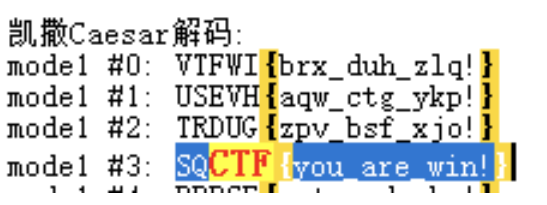

最终flag：SQCTF{you\_are\_win!}

# 密室逃脱的终极挑战

第一关：


先caesar解码：

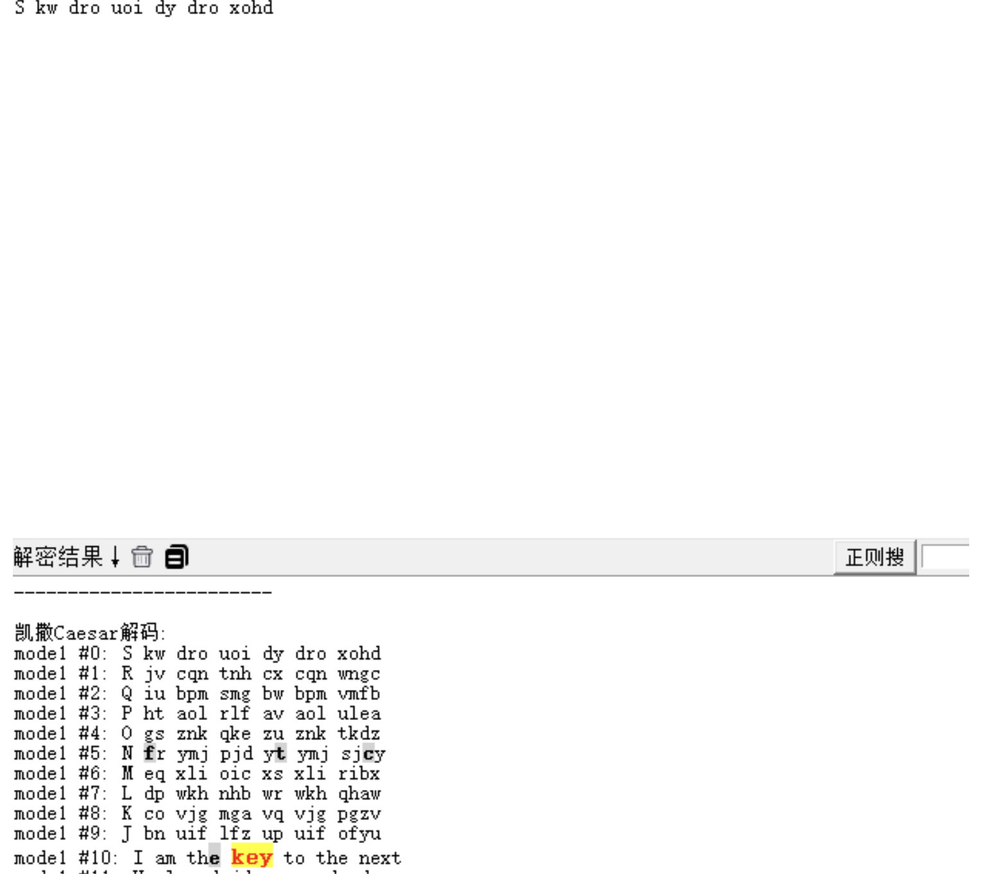


得到：I am the key to the next

第二关：


栅栏fence解码:：

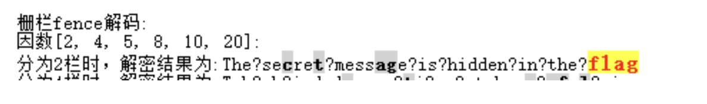

把？去掉得到：The secret message is hidden in the flag

第三关：


摩斯密码解码：

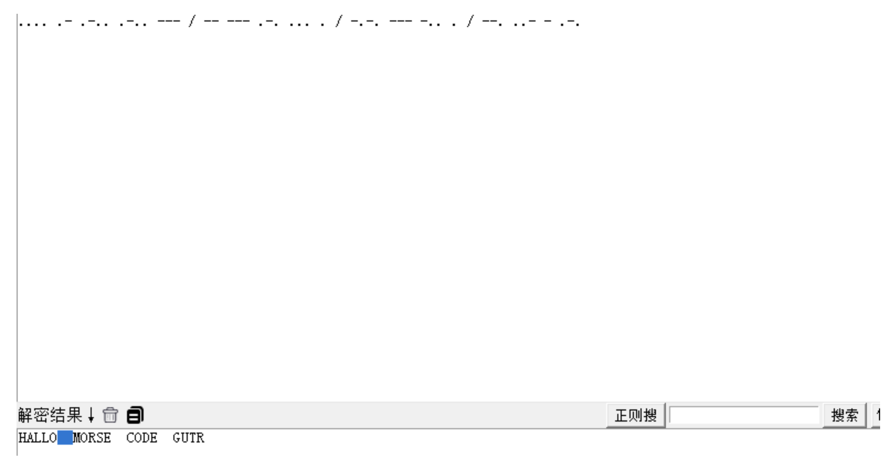

得到HALLO MORSE CODE GUTR

第四关：


base一把梭：

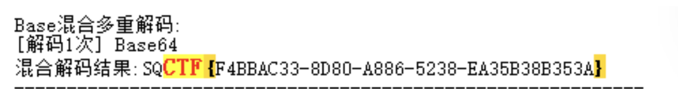

得到flag:SQCTF{F4BBAC33-8D80-A886-5238-EA35B38B353A}

# 丢三落四的小I

task:

```
n= 15124759435262214519214613181859115868729356369274819299240157375966724674496904855757710168853212365134058977781083245051947523020090726851248565503324715984500225724227315777864292625995636236219359256979887906731659848125792269869019299002807101443623257106289957747665586226912446158316961637444556237354422346621287535139897525295200592525427472329815100310702255593134984040293233780616515067333512830391860868933632383433431739823740865023004008736555299772442805617275890761325372253913686933294732259451820332316315205537055439515569011020072762809613676347686279082728000419370190242778504490370698336750029
e= 65537
dp= 1489209342944820124277807386023133257342259912189247976569642906341314682381245025918040456151960704964362424182449567071683886673550031774367531511627163525245627333820636131483140111126703748875380337657189727259902108519674360217456431712478937900720899137512461928967490562092139439552174099755422092113
c= 4689152436960029165116898717604398652474344043493441445967744982389466335259787751381227392896954851765729985316050465252764336561481633355946302884245320441956409091576747510870991924820104833541438795794034004988760446988557417649875106251230110075290880741654335743932601800868983384563972124570013568709773861592975182534005364811768321753047156781579887144279837859232399305581891089040687565462656879173423137388006332763262703723086583056877677285692440970845974310740659178040501642559021104100335838038633269766591727907750043159766170187942739834524072423767132738563238283795671395912593557918090529376173
```

普通的dp泄露（

exp:

```
from Crypto.Util.number import *
import gmpy2
n= 15124759435262214519214613181859115868729356369274819299240157375966724674496904855757710168853212365134058977781083245051947523020090726851248565503324715984500225724227315777864292625995636236219359256979887906731659848125792269869019299002807101443623257106289957747665586226912446158316961637444556237354422346621287535139897525295200592525427472329815100310702255593134984040293233780616515067333512830391860868933632383433431739823740865023004008736555299772442805617275890761325372253913686933294732259451820332316315205537055439515569011020072762809613676347686279082728000419370190242778504490370698336750029
e= 65537
dp= 1489209342944820124277807386023133257342259912189247976569642906341314682381245025918040456151960704964362424182449567071683886673550031774367531511627163525245627333820636131483140111126703748875380337657189727259902108519674360217456431712478937900720899137512461928967490562092139439552174099755422092113
c= 4689152436960029165116898717604398652474344043493441445967744982389466335259787751381227392896954851765729985316050465252764336561481633355946302884245320441956409091576747510870991924820104833541438795794034004988760446988557417649875106251230110075290880741654335743932601800868983384563972124570013568709773861592975182534005364811768321753047156781579887144279837859232399305581891089040687565462656879173423137388006332763262703723086583056877677285692440970845974310740659178040501642559021104100335838038633269766591727907750043159766170187942739834524072423767132738563238283795671395912593557918090529376173

for x in range(1, e):
    if (dp * e - 1) % x == 0:
        if n % (((dp * e - 1) // x) + 1) == 0:
            p = ((dp * e - 1) // x) + 1
            q = n // p
            phi = (p - 1) * (q - 1)
            d = gmpy2.invert(e, phi)
            m = gmpy2.powmod(c, d, n)
            print(long_to_bytes(m))
            break
#SQCTF{7b909221-c8ff-f391-0c86-d3a9ca8491d1}            
```

# 玩的挺变态啊清茶哥

变种猪圈密码表 ，网上找个一一对应即可，得到jijibaotonghualizuoyingxiong

flag:SQCTF{jijibaotonghualizuoyingxiong}

# ez\_SCA

题目描述：

```
在密码设备运行加解密程序时，其电路系统的电流波动会呈现出独特的时域特征。这种物理层面的动态电力特征虽然肉眼不可辨识，但借助专业检测设备可捕获其毫秒级的变化轨迹。旁路攻击技术正是基于此类电力指纹与算法执行过程的强相关性，通过构建电力轨迹与密码操作的映射模型，最终逆向推演出核心密码参数。文件中所给出的时序电力图谱，完整记录了密文生成过程中各运算单元的动态功耗轨迹。
```

task:

```
import numpy as np

# 加载模板轨迹文件

template_trace_0 = np.load('template_trace_0.npy')
template_trace_1 = np.load('template_trace_1.npy')

# 加载能量轨迹文件

traces = np.load('energy_traces_with_flag.npy')
def bits_to_text(bits):
    chars = [bits[i:i+8] for i in range(0, len(bits), 8)]
    text = ''.join([chr(int(char, 2)) for char in chars])
    return text

# 提示：需要推导如何从能量轨迹恢复为明文 flag

# 题目包含附件总共5个

1.energy_traces_with_flag.npy
2.energy_traces_with_flag.png
3.template_trace_0.npy
4.template_trace_1.npy
5.本代码
```

**template\_trace\_0.npy** 和 **template\_trace\_1.npy**  
 这两个文件分别给出了模板轨迹，即在执行“0”或“1”的时候，理想状态下的能量特征。

**energy\_traces\_with\_flag.npy**  
 这个文件中包含了多个能量轨迹，顺序对应了一个二进制序列，每个轨迹对应一个 bit（0 或 1），最终还通过函数 `bits_to_text` 转换为明文。

用**欧氏距离**，计算每个能量轨迹 `trace` 分别与 `template_trace_0` 和 `template_trace_1` 的欧氏距离：

```
d0=∑(trace−template_trace_0)^2，d1=∑(trace−template_trace_1)^2
```

若 d0<d1，则认为该轨迹更接近模板 0，对应 bit 为 `'0'`；

反之，若 d1<d0，则 bit 为 `'1'`。

重复此过程，依次对所有轨迹进行判断，便可以得到完整的flag。

```
import numpy as np


template_trace_0 = np.load('template_trace_0.npy')
template_trace_1 = np.load('template_trace_1.npy')
traces = np.load('energy_traces_with_flag.npy')

def bits_to_text(bits):
    chars = [bits[i:i+8] for i in range(0, len(bits), 8)]
    text = ''.join([chr(int(byte, 2)) for byte in chars])
    return text

def get_bit(trace, template0, template1):
    d0 = np.sum((trace - template0) ** 2)
    d1 = np.sum((trace - template1) ** 2)
    return '0' if d0 < d1 else '1'
    
bit_str = ""
for trace in traces:
    bit_str += get_bit(trace, template_trace_0, template_trace_1)


flag = bits_to_text(bit_str)
print(flag)
#SQCTF{easy_funny_and_not_hard_sca_hhh_just_kingdding}
```

# 你的天赋是什么

task:

```
... --.- -.-. - ..-. ----.-- -.-- --- ..- -....- .... .- ...- . -....- - .- .-.. . -. - -----.- 
```

摩斯解码得到：SQCTF{YOU-HAVE-TALENT}

# Common Modulus

```
from libnum import *
from sercet import flag

p = generate_prime(1024)
q = generate_prime(1024)

e1 = generate_prime(32)
e2 = generate_prime(32)
m = s2n(flag)
n = p * q
c1 = pow(m, e1, n)
c2 = pow(m, e2, n)

print("n=", n)
print("c1=", c1)
print("c2=", c2)
print("e1=", e1)
print("e2=", e2)

'''
n= 13650503560233612352420237787159267432351878281073422449253560365809461612884248041710373755322100953953257608601227381211434513766352420535096028618735289379355710140356003114010103377509526452574385251495847301426845768427018504464757671958803807138699056193259160806476941875860254288376872925837127208612702688503022494109785623082365323949385021488106289708499091818714253710552213982060745736652306892896670424179736886691685639988637188591805479432332714690818805432648223229601082431517091667297328748597580733946557364100555781113940729296951594110258088501146224322799560159763097710814171619948719257894889
c1= 3366500968116867439746769272799247895217647639427183907930755074259056811685671593722389247697636905214269760325119955242254171223875159785479900114989812511815466122321484289407596620307636198001794029251197349257235827433633936216505458557830334779187112907940003978773672225479445837897135907447625387990203145231671233038707457396631770623123809080945314083730185110252441203674945146889165953135351824739866177205127986576305492490242804571570833778440870959816207461376598067538653432472043116027057204385251674574207749241503571444801505084599753550983430739025050926400228758055440679102902069032768081393253
c2= 7412517103990148893766077090616798338451607394614015195336719617426935439456886251056015216979658274633552687461145491779122378237012106236527924733047395907133190110919550491029113699835260675922948775568027483123730185809123757000207476650934095553899548181163223066438602627597179560789761507989925938512977319770704123979102211869834390476278761480516444396187746843654541476645830961891622999425268855097938496239480682176640906218645450399785130931214581370821403077312842724336393674718200919934701268397883415347122906912693921254353511118129903752832950063164459159991128903683711317348665571285175839274346
e1= 4217054819
e2= 2800068527
'''
```

普通共模攻击（

exp:

```
from Crypto.Util.number import inverse, long_to_bytes
import gmpy2

n = 13650503560233612352420237787159267432351878281073422449253560365809461612884248041710373755322100953953257608601227381211434513766352420535096028618735289379355710140356003114010103377509526452574385251495847301426845768427018504464757671958803807138699056193259160806476941875860254288376872925837127208612702688503022494109785623082365323949385021488106289708499091818714253710552213982060745736652306892896670424179736886691685639988637188591805479432332714690818805432648223229601082431517091667297328748597580733946557364100555781113940729296951594110258088501146224322799560159763097710814171619948719257894889
c1 = 3366500968116867439746769272799247895217647639427183907930755074259056811685671593722389247697636905214269760325119955242254171223875159785479900114989812511815466122321484289407596620307636198001794029251197349257235827433633936216505458557830334779187112907940003978773672225479445837897135907447625387990203145231671233038707457396631770623123809080945314083730185110252441203674945146889165953135351824739866177205127986576305492490242804571570833778440870959816207461376598067538653432472043116027057204385251674574207749241503571444801505084599753550983430739025050926400228758055440679102902069032768081393253
c2 = 7412517103990148893766077090616798338451607394614015195336719617426935439456886251056015216979658274633552687461145491779122378237012106236527924733047395907133190110919550491029113699835260675922948775568027483123730185809123757000207476650934095553899548181163223066438602627597179560789761507989925938512977319770704123979102211869834390476278761480516444396187746843654541476645830961891622999425268855097938496239480682176640906218645450399785130931214581370821403077312842724336393674718200919934701268397883415347122906912693921254353511118129903752832950063164459159991128903683711317348665571285175839274346
e1 = 4217054819
e2 = 2800068527

_,a,b=gmpy2.gcdext(e1,e2)
m=pow(c1,a,n)%n*pow(c2,b,n)%n
print(long_to_bytes(m))
#SQCTF{06774dcf-b9d1-3c2d-8917-7d2d86b6721c}
```

# 《1789年的密文》

task:

```
 1: < QWXZRJYVKSLPDTMACFNOGIEBHU <
 2: < BXZPMTQOIRVHKLSAFUDGJYCEWN <
 3: < LKJHGFDSAQZWXECRVBYTNUIMOP <
 4: < POIUYTREWQASDFGHJKLMNBVCXZ <
 5: < ZXCVBNMASDFGHJKLPOIUYTREWQ <
 6: < MNHBGVCFXDRZESWAQPLOKMIJUY <
 7: < YUJIKMOLPQAWSZEXRDCFVGBHNM <
 8: < EDCRFVTGBYHNUJMIKOLPQAZWSX <
 9: < RFVGYBHNUJMIKOLPQAZWSXEDCT <
10: < TGBYHNUJMIKOLPQAZWSXEDCRFV <
11: < WSXEDCRFVTGBYHNUJMIKOLPQAZ <
12: < AZQWSXEDCRFVTGBYHNUJMIKOLP <
13: < VFRCDXESZWAQPLOKMIJNUHGBTG <
14: < IKOLPQAZWSXEDCRFVTGBYHNUJM <

key = [4, 2 ,11, 8, 9, 12, 3, 6, 10, 14, 1, 5, 7, 13]

密文： UNEHJPBIUOMAVZ
```

根据题目描述得知这是托马斯.杰斐逊密码，参考：<https://www.cnblogs.com/0yst3r-2046/p/11810574.html>

exp:

```
key = "4, 2 ,11, 8, 9, 12, 3, 6, 10, 14, 1, 5, 7, 13"
cipher_text = "UNEHJPBIUOMAVZ"

f = open("加密信件.txt")
str_first_encry = []

for line in f:
    line = line.strip()
    str_first_encry.append(line)

key_index = key.split(",")
str_second_encry = []
for k in key_index:
    str_second_encry.append(str_first_encry[int(k) - 1])
    print(str_first_encry[int(k) - 1])

for i, ch in enumerate(cipher_text):
    line = str_second_encry[i]
    split_index = line.index(ch)
    temp = []
    temp[0:len(line) - split_index + 1] = line[split_index:len(line)]
    temp[len(temp):] = line[0:split_index]
    str_second_encry[i] = "".join(temp)
print("-------------------------------------")
for plain in str_second_encry:
    print(plain)
```

得到：

```
UYTREWQASDFGHJKLMNBVCXZPOI
NBXZPMTQOIRVHKLSAFUDGJYCEW
EDCRFVTGBYHNUJMIKOLPQAZWSX
HNUJMIKOLPQAZWSXEDCRFVTGBY
JMIKOLPQAZWSXEDCTRFVGYBHNU
PAZQWSXEDCRFVTGBYHNUJMIKOL
BYTNUIMOPLKJHGFDSAQZWXECRV
IJUYMNHBGVCFXDRZESWAQPLOKM
UJMIKOLPQAZWSXEDCRFVTGBYHN
OLPQAZWSXEDCRFVTGBYHNUJMIK
MACFNOGIEBHUQWXZRJYVKSLPDT
ASDFGHJKLPOIUYTREWQZXCVBNM
VGBHNMYUJIKMOLPQAWSZEXRDCF
ZWAQPLOKMIJNUHGBTGVFRCDXES
```

然后转小写并竖起来表示：

```
strings = [
    "UYTREWQASDFGHJKLMNBVCXZPOI",
    "NBXZPMTQOIRVHKLSAFUDGJYCEW",
    "EDCRFVTGBYHNUJMIKOLPQAZWSX",
    "HNUJMIKOLPQAZWSXEDCRFVTGBY",
    "JMIKOLPQAZWSXEDCTRFVGYBHNU",
    "PAZQWSXEDCRFVTGBYHNUJMIKOL",
    "BYTNUIMOPLKJHGFDSAQZWXECRV",
    "IJUYMNHBGVCFXDRZESWAQPLOKM",
    "UJMIKOLPQAZWSXEDCRFVTGBYHN",
    "OLPQAZWSXEDCRFVTGBYHNUJMIK",
    "MACFNOGIEBHUQWXZRJYVKSLPDT",
    "ASDFGHJKLPOIUYTREWQZXCVBNM",
    "VGBHNMYUJIKMOLPQAWSZEXRDCF",
    "ZWAQPLOKMIJNUHGBTGVFRCDXES"
]

lowercase_strings = [s.lower() for s in strings]

print("=== Lowercase Strings ===")
for s in lowercase_strings:
    print(s)


num_cols = len(lowercase_strings[0])
num_rows = len(lowercase_strings)

print("
=== Column-wise Characters ===")
for col in range(num_cols):
    column_string = ''.join(lowercase_strings[row][col] for row in range(num_rows))
    print(f"{col+1:2}: {column_string}")

```

得到第17行明显字符串

```
17: maketysecgreat
```

所以flag为：SQCTF{maketysecgreat}
