# 代码审计之实战中各类SQL注入漏洞代码分析及其成因分析(以jeecgboot3.5.3为例)-先知社区

> **来源**: https://xz.aliyun.com/news/17738  
> **文章ID**: 17738

---

# jeecgboot3.5.3版本各类sql注入漏洞代码分析

这篇文章主要分享在实际项目中各类SQL注入漏洞形成的原因，并且使用了较多企业使用的开源项目jeecg-boot为例子，从而进一步理解SQL注入漏洞是如何形成以及为什么会出现sql注入漏洞。

## jinmureport中的未授权sql注入(布尔盲注)

CVE-2023-42268以及CVE-2023-41543这俩个漏洞都是依赖这段防护代码进行绕过，并且jeecgboot中存在某些路由无需使用token进行身份检测，可以直接未授权拿到数据库。

这里取的是`/jeecg-boot/jmreport/show`接口，

首先，可以找到位于`org.jeecg.modules.jmreport.desreport.a.a`中的show方法。

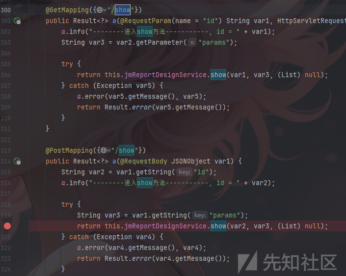

其造成漏洞的方法为POST访问的show方法

```
    @PostMapping({"/show"})
    public Result<?> a(@RequestBody JSONObject var1) {
        String var2 = var1.getString("id");
        a.info("--------进入show方法-----------, id = " + var2);

        try {
            String var3 = var1.getString("params");
            return this.jmReportDesignService.show(var2, var3, (List)null);
        } catch (Exception var4) {
            a.error(var4.getMessage(), var4);
            return Result.error(var4.getMessage());
        }
    }
```

这个方法获取了json数据中的id以及params这俩个参数，并将其放入`jmReportDesignService.show`中进行数据查询操作。

跟进show方法，找到实现这个接口的`org.jeecg.modules.jmreport.desreport.service.a.e`类中的show方法。

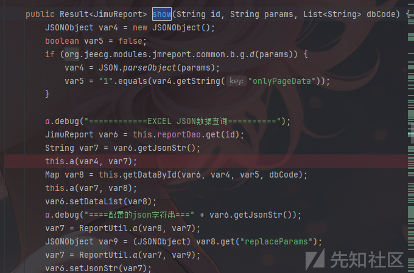

完整代码如下：

```
    public Result<JimuReport> show(String id, String params, List<String> dbCode) {
        JSONObject var4 = new JSONObject();
        boolean var5 = false;
        if (org.jeecg.modules.jmreport.common.b.g.d(params)) {
            var4 = JSON.parseObject(params);
            var5 = "1".equals(var4.getString("onlyPageData"));
        }

        a.debug("============EXCEL JSON数据查询==========");
        JimuReport var6 = this.reportDao.get(id);
        String var7 = var6.getJsonStr();
        this.a(var4, var7);
        Map var8 = this.getDataById(var6, var4, var5, dbCode);
        this.a(var7, var8);
        var6.setDataList(var8);
        a.debug("====配置的json字符串===" + var6.getJsonStr());
        var7 = ReportUtil.a(var8, var7);
        JSONObject var9 = (JSONObject)var8.get("replaceParams");
        var7 = ReportUtil.a(var7, var9);
        var6.setJsonStr(var7);
        RenderInfo var10 = new RenderInfo(var6);
        var10.setStrategyName(org.jeecg.modules.jmreport.desreport.render.a.a.b.class.getSimpleName());
        Result var11 = this.a(var10);
        ExpressUtil.a(var11);
        return var11;
    }
```

看到`json`查询部分，这部分代码主要是进行参数的查询以及数据的返回，其中造成漏洞的参数为`params`参数，所以重点看到`getDataById`这个方法。

```
    public Map<String, Object> getDataById(JimuReport report, JSONObject paramJson, boolean onlyPageData, List<String> excelDbcode) {
        HashMap var5 = new HashMap(5);
        if (report == null) {
            return var5;
        } else {
            JSONObject var6 = new JSONObject();
            var6.putAll(paramJson);
            List var7 = this.reportDbDao.selectList(report.getId());
            if (var7 == null) {
                return var5;
            } else {
                String var8 = "";
                JSONObject var9 = JSONObject.parseObject(report.getJsonStr());
                JSONArray var10 = null;
                ArrayList var11 = new ArrayList();
                if (var9 != null) {
                    if (var9.containsKey("groupField") && var9.containsKey("isGroup")) {
                        var8 = var9.getString("groupField");
                    }

                    var10 = var9.getJSONArray("dbexps");
                }

                if (var10 != null && var10.size() > 0) {
                    for(int var12 = 0; var12 < var10.size(); ++var12) {
                        String var13 = var10.getString(var12);
                        JmExpression var14 = new JmExpression(var13);
                        var11.add(var14);
                    }
                }

                String var48 = paramJson.getString("printAll");
                var7 = this.c(var7);
                HashMap var49 = new HashMap(5);
                JSONObject var50 = org.jeecg.modules.jmreport.common.b.g.a(paramJson);
                Map var15 = this.a(var7, paramJson);
                Iterator var16 = var7.iterator();

                while(true) {
                    JmReportDb var17;
                    do {
                        do {
                            if (!var16.hasNext()) {
                                Map var51 = JmExpression.getExpMapByList(var11);
                                var5.put("expData", var51);
                                var5.put("replaceParams", var6);
                                return var5;
                            }

                            var17 = (JmReportDb)var16.next();
                        } while(onlyPageData && !"1".equals(var17.getIsPage()));
                    } while(null != excelDbcode && excelDbcode.size() > 0 && excelDbcode.contains(var17.getDbCode()));

                    Object var18 = new ArrayList();
                    String var19 = var17.getDbCode();
                    new JSONObject();
                    paramJson = org.jeecg.modules.jmreport.common.b.g.a(var50);
                    this.a((JmReportDb)var17, (Map)var49, (Map)var15);
                    this.a(paramJson, var6, var17);
                    this.a(paramJson, var19, var6, var17);
                    ReportDbInfo var21;
                    if ("2".equals(var17.getDbType())) {
                        var21 = this.a((JmReportDb)var17, (JSONObject)paramJson, (List)var18);
                        var5.put(var19, var21);
                    }

                    String var28;
                    JSONObject var52;
                    String var65;
                    if ("0".equals(var17.getDbType())) {
                        var52 = new JSONObject();
                        JSONObject var22 = (JSONObject)var15.get("shared_query_param");
                        JSONObject var23 = (JSONObject)var15.get(var19);
                        var52.putAll(var22);
                        var52.putAll(var23);
                        String var24 = this.getDbSql(var17, var52, paramJson, var11, var8);
                        a.info("------报表【" + var19 + "】，查询的sql: " + var24);
                        String var25 = var17.getDbSource();
                        Integer var26 = org.jeecg.modules.jmreport.common.b.g.a(paramJson.get("pageSize"), 10);
                        Integer var27 = org.jeecg.modules.jmreport.common.b.g.a(paramJson.get("pageNo"), 1);
                        if (org.jeecg.modules.jmreport.common.b.g.c(var25) && this.jmBaseConfig.getSaas() && this.jmBaseConfig.getSafeMode() != null && this.jmBaseConfig.getSafeMode()) {
                            throw new JimuReportException("安全模式下，不允许使用平台数据源（请配置数据源）！");
                        }

                        var28 = org.jeecg.modules.jmreport.desreport.util.f.e(var24);
                        ReportDbInfo var29;
                        List var30;
                        if (org.jeecg.modules.jmreport.common.b.g.d(var28)) {
                            var29 = new ReportDbInfo();
                            var30 = this.jmreportDynamicDbUtil.a(var25, var28);
                            if (org.jeecg.modules.jmreport.common.b.g.d(var30)) {
                                var30 = ReportUtil.a(var30);
                            }

                            var29.setList(var30);
                            var5.put(var19, var29);
                        } else if (this.jmReportDbSourceService.isNoSql(var25)) {
                            var29 = new ReportDbInfo();
                            var30 = this.jmreportNoSqlService.findList(var24, var25);
                            if (org.jeecg.modules.jmreport.common.b.g.d(var30)) {
                                var30 = ReportUtil.a(var30);
                            }

                            var29.setList(var30);
                            var5.put(var19, var29);
                        } else {
                            Object var67;
                            Object var69;
                            if (org.jeecg.modules.jmreport.common.b.g.d(var25)) {
                                a.info("------数据源 dbSourceKey:【" + var25 + "】");
                                if (org.jeecg.modules.jmreport.common.b.g.d(var48)) {
                                    var29 = new ReportDbInfo();
                                    var67 = new ArrayList();

                                    try {
                                        var67 = this.jmreportDynamicDbUtil.b(var25, var24, new Object[0]);
                                    } catch (Exception var47) {
                                        this.a(var47);
                                    }

                                    if (org.jeecg.modules.jmreport.common.b.g.d(var67)) {
                                        var67 = ReportUtil.a((List)var67);
                                    }

                                    var29.setList((List)var67);
                                    var5.put(var19, var29);
                                } else {
                                    var65 = org.jeecg.modules.jmreport.dyndb.util.b.e(var24);
                                    var67 = new HashMap(5);

                                    try {
                                        JmreportDynamicDataSourceVo var31 = org.jeecg.modules.jmreport.dyndb.a.a(var25);
                                        if (org.jeecg.modules.jmreport.common.b.g.c(var31.getDbUrl())) {
                                            throw new JimuReportException("数据源配置无效,请检查!");
                                        }

                                        if ("sqlserver".equals(var31.getDbType().toLowerCase()) && !var65.toUpperCase().contains("CONVERT")) {
                                            SqlServerParse var32 = new SqlServerParse();
                                            var65 = var32.removeOrderBy(var65);
                                        }

                                        var67 = (Map)this.jmreportDynamicDbUtil.a(var25, var65, new Object[0]);
                                    } catch (Exception var46) {
                                        this.a(var46);
                                    }

                                    int var66 = 1;
                                    var69 = ((Map)var67).get("total");
                                    int var33 = 0;
                                    if (var69 != null) {
                                        var33 = Integer.parseInt(var69.toString());
                                        double var34 = Double.parseDouble(var69.toString()) / (double)var26;
                                        var66 = (int)Math.ceil(var34);
                                    }

                                    List var72 = null;
                                    if ("1".equals(var17.getIsPage())) {
                                        JmreportDynamicDataSourceVo var35 = org.jeecg.modules.jmreport.dyndb.a.a(var25);
                                        String var36 = MiniDaoUtil.createPageSql(var35.getDbUrl(), var24, var27, var26);

                                        try {
                                            var72 = this.jmreportDynamicDbUtil.b(var25, var36, new Object[0]);
                                        } catch (Exception var45) {
                                            a.warn(var45.getMessage(), var45);
                                            throw new JimuReportException(var45.getMessage());
                                        }
                                    } else {
                                        try {
                                            var72 = this.jmreportDynamicDbUtil.b(var25, var24, new Object[0]);
                                        } catch (Exception var44) {
                                            a.warn(var44.getMessage(), var44);
                                            throw new JimuReportException(var44.getMessage());
                                        }
                                    }

                                    ReportDbInfo var73 = new ReportDbInfo((long)var66, (long)var33, var17.getIsPage(), var17.getIsList(), var17.getDbType());
                                    if (org.jeecg.modules.jmreport.common.b.g.d(var72)) {
                                        var72 = ReportUtil.a(var72);
                                    }

                                    var73.setList(var72);
                                    var5.put(var19, var73);
                                }
                            } else if (org.jeecg.modules.jmreport.common.b.g.d(var48)) {
                                var29 = new ReportDbInfo();
                                var67 = new ArrayList();

                                try {
                                    var67 = this.reportDbDao.selectListBySql(var24);
                                } catch (Exception var43) {
                                    this.a(var43);
                                }

                                if (org.jeecg.modules.jmreport.common.b.g.d(var67)) {
                                    var67 = ReportUtil.a((List)var67);
                                }

                                var29.setList((List)var67);
                                var5.put(var19, var29);
                            } else {
                                var65 = var17.getIsPage();
                                String var74 = var17.getIsList();
                                if ("0".equals(var65) || org.jeecg.modules.jmreport.common.b.g.c(var65)) {
                                    var27 = 1;
                                }

                                ReportDbInfo var68 = null;
                                if ("1".equals(var65)) {
                                    MiniDaoPage var70 = new MiniDaoPage();

                                    try {
                                        var70 = this.reportDbDao.selectPageBySql(var24, var27, var26);
                                    } catch (Exception var42) {
                                        this.a(var42);
                                    }

                                    var68 = new ReportDbInfo((long)var70.getPages(), (long)var70.getTotal(), var65, var74, var17.getDbType());
                                    List var71 = var70.getResults();
                                    if (org.jeecg.modules.jmreport.common.b.g.d(var71)) {
                                        var71 = ReportUtil.a(var71);
                                    }

                                    var68.setList(var71);
                                } else {
                                    var69 = new ArrayList();

                                    try {
                                        var69 = this.reportDbDao.selectListBySql(var24);
                                    } catch (Exception var41) {
                                        this.a(var41);
                                    }

                                    if (var69 != null) {
                                        var68 = new ReportDbInfo(1L, (long)((List)var69).size(), var65, var74, var17.getDbType());
                                        if (org.jeecg.modules.jmreport.common.b.g.d(var69)) {
                                            var69 = ReportUtil.a((List)var69);
                                        }

                                        var68.setList((List)var69);
                                    }
                                }

                                var5.put(var19, var68);
                            }
                        }

                        var29 = (ReportDbInfo)var5.get(var19);
                        var30 = var29.getList();
                        var18 = org.jeecg.modules.jmreport.common.b.g.a(var30);
                        this.replaceDbCode(var17, var30);
                        var29.setList(var30);
                        var5.replace(var19, var29);
                    }

                    if ("1".equals(var17.getDbType())) {
                        var52 = this.getApiRequestParams(var17, var15, var48, var8);
                        String var53 = this.jimuTokenClient.getToken();
                        Object var55 = new HashMap(5);

                        try {
                            var55 = this.getApiData(var17, var53, var52);
                        } catch (ResourceAccessException var38) {
                            throw new JimuReportException("api连接超时，请重试！");
                        } catch (JimuReportException var39) {
                            throw new JimuReportException(var39.getMessage());
                        } catch (Exception var40) {
                            a.warn(var40.getMessage(), var40);
                        }

                        ReportDbInfo var57 = new ReportDbInfo(var17.getIsPage(), var17.getIsList(), var17.getDbType());
                        Object var59 = ((Map)var55).get("dataList");
                        if (org.jeecg.modules.jmreport.common.b.g.d(var59)) {
                            var57.setList((List)var59);
                        }

                        if (org.jeecg.modules.jmreport.common.b.g.c(var48)) {
                            Object var61 = ((Map)var55).get("linkList");
                            if (org.jeecg.modules.jmreport.common.b.g.d(var61)) {
                                var57.setLinkList((List)var61);
                            }

                            var57.setTotal(org.jeecg.modules.jmreport.common.b.b.a(((Map)var55).get("total"), 0L));
                            var57.setCount(org.jeecg.modules.jmreport.common.b.b.a(((Map)var55).get("count"), 0L));
                        }

                        if (null != var57.getList()) {
                            List var62 = var57.getList();
                            var18 = org.jeecg.modules.jmreport.common.b.g.a(var62);
                            this.replaceDbCode(var17, var62);
                            var57.setList(var62);
                        }

                        var5.put(var19, var57);
                    }

                    if ("3".equals(var17.getDbType())) {
                        var21 = this.a(var17, paramJson, var48, var19);
                        var18 = org.jeecg.modules.jmreport.common.b.g.a(var21.getList());
                        var5.put(var19, var21);
                    }

                    var21 = (ReportDbInfo)var5.get(var19);
                    List var54 = var21.getList();

                    for(int var56 = 0; var56 < var54.size(); ++var56) {
                        Map var58 = (Map)var54.get(var56);
                        Iterator var60 = var58.keySet().iterator();

                        while(var60.hasNext()) {
                            String var63 = (String)var60.next();
                            Object var64 = var58.get(var63);
                            if (var64 != null) {
                                var28 = var64.toString();
                                if (var28.indexOf(""") >= 0) {
                                    var65 = var28.replaceAll(""", "“");
                                    var58.put(var63, var65);
                                }
                            }
                        }
                    }

                    this.a((JmReportDb)var17, (Map)var49, (List)var18);
                }
            }
        }
    }
```

`getDataById`这个方法很长，这个方法的主要起到通过报表ID来获取报表数据的作用

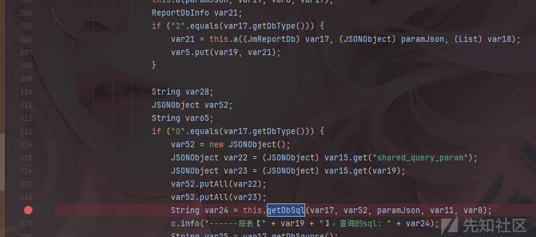

继续跟进后会走到`getDbsql`中，这个方法是执行sql语句查询的方法。

进入到`getDbSql`方法，代码如下

```
    public String getDbSql(JmReportDb reportDb, JSONObject paramObject, JSONObject paramJson, List<JmExpression> expList, String groupField) {
        String var6 = this.getBaseSql(reportDb, paramObject);
        i.a(var6);
        String var7 = this.a(reportDb, paramJson);
        this.a(reportDb, var6, var7, expList);
        String var8 = null;
        if (org.jeecg.modules.jmreport.common.b.g.d(groupField)) {
            String[] var9 = groupField.split(".");
            byte var10 = 2;
            if (var9.length == var10 && reportDb.getDbCode().equals(var9[0])) {
                var8 = var9[1];
            }
        }

        String var11 = this.a(var6, var7, var8);
        return var11;
    }
```

这个方法主要进行sql数据的查询操作，其中包括了对sql语句的校验、过滤以及执行。

其中过滤操作位于`i.a`方法中，可以跟进该方法，以查看造成该漏洞的过滤代码。

```
    public static void a(String var0) {
        String[] var1 = " exec |peformance_schema|information_schema|extractvalue|updatexml|geohash|gtid_subset|gtid_subtract| insert | alter | delete | grant | update | drop | chr | mid | master | truncate | char | declare |user()|".split("\|");
        if (var0 != null && !"".equals(var0)) {
            b(var0);
            var0 = var0.toLowerCase();
            c(var0);
            var0 = var0.replaceAll("/\*.*\*/", "");

            for(int var2 = 0; var2 < var1.length; ++var2) {
                if (var0.indexOf(var1[var2]) > -1 || var0.startsWith(var1[var2].trim())) {
                    a.error("请注意，存在SQL注入关键词---> {}", var1[var2]);
                    a.error("请注意，值可能存在SQL注入风险!---> {}", var0);
                    throw new JimuReportException(1001, "请注意，值可能存在SQL注入风险!--->" + var0);
                }
            }

            if (Pattern.matches("show\s+tables", var0) || Pattern.matches("user[\s]*\([\s]*\)", var0)) {
                throw new RuntimeException("请注意，值可能存在SQL注入风险!--->" + var0);
            }
        }
    }
```

可以看到其过滤的黑名单为`" exec |peformance_schema|information_schema|extractvalue|updatexml|geohash|gtid_subset|gtid_subtract| insert | alter | delete | grant | update | drop | chr | mid | master | truncate | char | declare |user()|";`，因为其过滤并不完全，没有过滤`ascii,having`等可以造成注入的代码，从而导致了布尔注入，由于这个路由的代码都没有身份校验，所以无需登录以及token即可完成注入。

exp:

```
1 'having {ascii}=(nullif (ascii (substring ((select database()), {place}, 1)), 0) or'
```

### 漏洞成因分析

这个漏洞的成因就是黑名单过滤不完全，从而导致了sql注入漏洞。

### 漏洞修复

作者升级了积木报表的版本，并补全了黑名单。

## jeecgboot中的sql注入(时间盲注)

这里分析选择的是`/sys/dict/loadTreeData`路由，位于`org/jeecg/modules/system/controller/SysDictController`类中

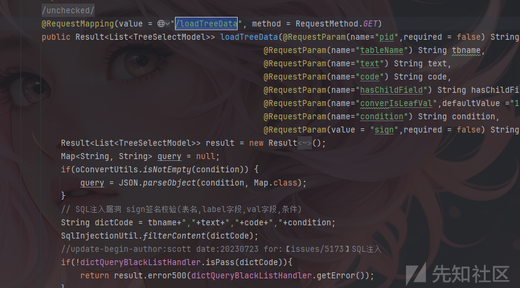

其完整代码如下：

```
    @RequestMapping(value = "/loadTreeData", method = RequestMethod.GET)
    public Result<List<TreeSelectModel>> loadTreeData(@RequestParam(name="pid",required = false) String pid,@RequestParam(name="pidField") String pidField,
                                                  @RequestParam(name="tableName") String tbname,
                                                  @RequestParam(name="text") String text,
                                                  @RequestParam(name="code") String code,
                                                  @RequestParam(name="hasChildField") String hasChildField,
                                                  @RequestParam(name="converIsLeafVal",defaultValue ="1") int converIsLeafVal,
                                                  @RequestParam(name="condition") String condition,
                                                  @RequestParam(value = "sign",required = false) String sign,HttpServletRequest request) {
        Result<List<TreeSelectModel>> result = new Result<List<TreeSelectModel>>();
        Map<String, String> query = null;
        if(oConvertUtils.isNotEmpty(condition)) {
            query = JSON.parseObject(condition, Map.class);
        }
        String dictCode = tbname+","+text+","+code+","+condition;
        SqlInjectionUtil.filterContent(dictCode);
        if(!dictQueryBlackListHandler.isPass(dictCode)){
            return result.error500(dictQueryBlackListHandler.getError());
        }
        List<TreeSelectModel> ls = sysDictService.queryTreeList(query,tbname, text, code, pidField, pid,hasChildField,converIsLeafVal);
        result.setSuccess(true);
        result.setResult(ls);
        return result;
    }
```

这段代码中sql校验的代码为`SqlInjectionUtil.filterContent(dictCode);`其他进行sql语句查询的方法也是用该方法进行校验的，所以跟进到`SqlInjectionUtil`类中的`filterContent`方法

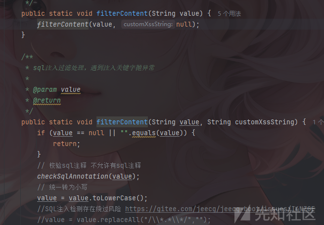

代码如下：

```
public static void filterContent(String[] values) {
    filterContent(values, null);
}

/**
 * sql注入过滤处理，遇到注入关键字抛异常
 * 
 * @param values
 * @return
 */
public static void filterContent(String[] values, String customXssString) {
    String[] xssArr = XSS_STR.split("\|");
    for (String value : values) {
        if (value == null || "".equals(value)) {
            return;
        }
        // 校验sql注释 不允许有sql注释
        checkSqlAnnotation(value);
        // 统一转为小写
        value = value.toLowerCase();
        //SQL注入检测存在绕过风险 https://gitee.com/jeecg/jeecg-boot/issues/I4NZGE
        //value = value.replaceAll("/\*.*\*/","");

        for (int i = 0; i < xssArr.length; i++) {
            if (value.indexOf(xssArr[i]) > -1) {
                log.error("请注意，存在SQL注入关键词---> {}", xssArr[i]);
                log.error("请注意，值可能存在SQL注入风险!---> {}", value);
                throw new RuntimeException("请注意，值可能存在SQL注入风险!--->" + value);
            }
        }
        //update-begin-author:taoyan date:2022-7-13 for: 除了XSS_STR这些提前设置好的，还需要额外的校验比如 单引号
        if (customXssString != null) {
            String[] xssArr2 = customXssString.split("\|");
            for (int i = 0; i < xssArr2.length; i++) {
                if (value.indexOf(xssArr2[i]) > -1) {
                    log.error("请注意，存在SQL注入关键词---> {}", xssArr2[i]);
                    log.error("请注意，值可能存在SQL注入风险!---> {}", value);
                    throw new RuntimeException("请注意，值可能存在SQL注入风险!--->" + value);
                }
            }
        }
        //update-end-author:taoyan date:2022-7-13 for: 除了XSS_STR这些提前设置好的，还需要额外的校验比如 单引号
        if(Pattern.matches(SHOW_TABLES, value) || Pattern.matches(REGULAR_EXPRE_USER, value)){
            throw new RuntimeException("请注意，值可能存在SQL注入风险!--->" + value);
        }
    }
    return;
}
```

`fielterContent`方法是jeecgboot3.5.3版本中的检测sql语句是否安全的方法，基本上所有进行sql语句查询的方法都调用了这个方法，这个方法首先校验传入参数是否为空，然后进入到`checkSqlAnnotation`方法继续校验，跟进到`checkSqlAnnotation`

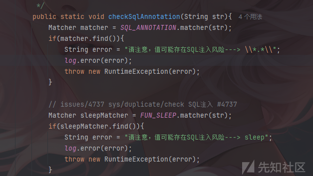

代码如下：

```
    public static void checkSqlAnnotation(String str){
        Matcher matcher = SQL_ANNOTATION.matcher(str);
        if(matcher.find()){
            String error = "请注意，值可能存在SQL注入风险---> \*.*\";
            log.error(error);
            throw new RuntimeException(error);
        }
        
        // issues/4737 sys/duplicate/check SQL注入 #4737
        Matcher sleepMatcher = FUN_SLEEP.matcher(str);
        if(sleepMatcher.find()){
            String error = "请注意，值可能存在SQL注入风险---> sleep";
            log.error(error);
            throw new RuntimeException(error);
        }
    }
```

这个方法首先校验了是否存在违规的字符，然后判断是否有sleep位于参数中。

仔细观察`filterContent`方法的逻辑，如图，他是先判断违规字符以及sleep是否存在于参数中，然后再进行小写转换的，所以当sleep为大写时，就可以绕过sleep。


这个漏洞还存在于

验证exp:parseSql路由以及其他使用sql查询的路由中

```
(SELECT 6240 FROM (SELECT(SLEEP(5)) AND 1=1)vidl)
```

### 漏洞成因分析

正则表达式不匹配不完全，或者代码逻辑错误，将sleep的匹配放到了将其转换为小写之前。

### 漏洞修复

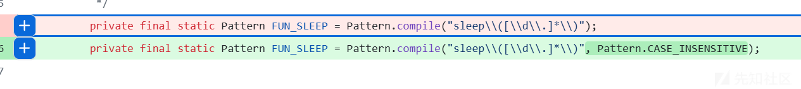

作者对正则表达式进行了修改，让其不区分大小写进行匹配sleep。

## jeecgboot中的sql注入(普通用户越权查询所有表的信息)

这里分析的同样也是`/sys/dict/loadTreeData`路由，但造成漏洞的原因与上面的时间盲注漏洞并不相同，这个漏洞是由于没有对用户权限以及用户输入进行有效的过滤，从而导致普通用户可以直接查询到管理员用户的账号密码等信息。

之前在对`/sys/dict/loadTreeData`路由代码审计的过程中，以及审计完了验证sql语句安全的代码`SqlInjectionUtil.filterContent(dictCode);`

接下来继续向下分析

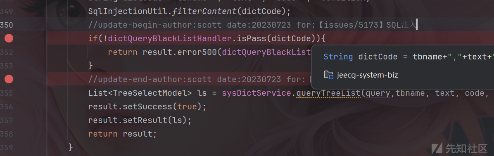

可以看到有一个黑名单检测的操作，造成sql注入的代码就是这一段，继续跟进isPass方法，

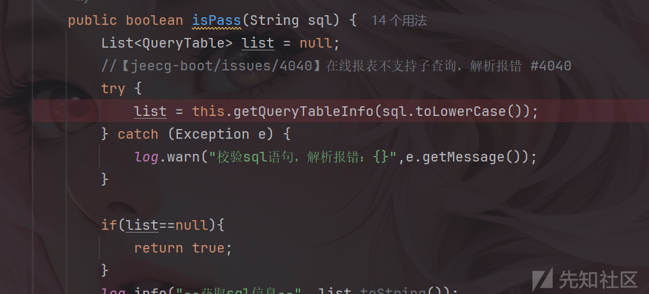

代码如下：

```
public boolean isPass(String sql) {
List<QueryTable> list = null;
//【jeecg-boot/issues/4040】在线报表不支持子查询，解析报错 #4040
try {
    list = this.getQueryTableInfo(sql.toLowerCase());
} catch (Exception e) {
    log.warn("校验sql语句，解析报错：{}",e.getMessage());
}

if(list==null){
    return true;
}
log.info("--获取sql信息--", list.toString());
boolean flag = checkTableAndFieldsName(list);
if(flag == false){
    return false;
}
for (QueryTable table : list) {
    String name = table.getName();
    String fieldString = ruleMap.get(name);
    // 有没有配置这张表
    if (fieldString != null) {
        if ("*".equals(fieldString) || table.isAll()) {
            flag = false;
            log.warn("sql黑名单校验，表【"+name+"】禁止查询");
            break;
        } else if (table.existSameField(fieldString)) {
            flag = false;
            break;
        }

    }
}
return flag;
}
```

这个方法通过解析传入的 SQL 语句，获取其中的表格信息，并根据规则检查表格和字段是否合法。如果 SQL 涉及的表或字段在黑名单中，则返回 `false`，否则返回 `true`。

首先，跟进`getQueryTableInfo`方法，来查看是如何解析sql语句的

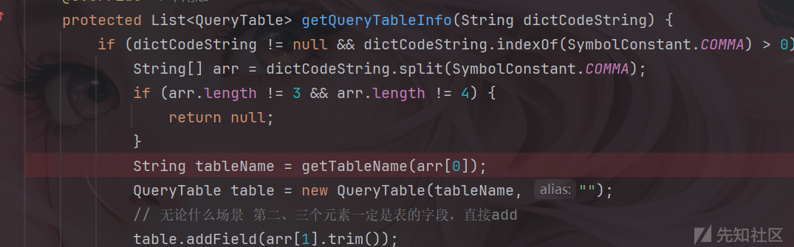

代码如下：

```
public class DictQueryBlackListHandler extends AbstractQueryBlackListHandler {

    @Override
    protected List<QueryTable> getQueryTableInfo(String dictCodeString) {
        if (dictCodeString != null && dictCodeString.indexOf(SymbolConstant.COMMA) > 0) {
            String[] arr = dictCodeString.split(SymbolConstant.COMMA);
            if (arr.length != 3 && arr.length != 4) {
                return null;
            }
            String tableName = getTableName(arr[0]);
            QueryTable table = new QueryTable(tableName, "");
            // 无论什么场景 第二、三个元素一定是表的字段，直接add
            table.addField(arr[1].trim());
            String filed = arr[2].trim();
            if (oConvertUtils.isNotEmpty(filed)) {
                table.addField(filed);
            }
            List<QueryTable> list = new ArrayList<>();
            list.add(table);
            return list;
        }
        return null;
    }
```

这段代码首先，对字符串进行了检查与拆分，并判断差分字符串的数组长度是否符合预期的3或者4，然后使用`getTableName`方法来获取表的具体值，因此继续跟进到`getTableName`方法中。

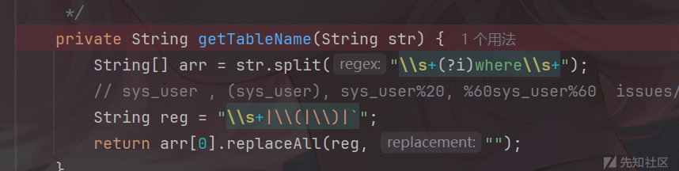

代码如下:

```

    private String getTableName(String str) {
        String[] arr = str.split("\s+(?i)where\s+");
        // sys_user , (sys_user), sys_user%20, %60sys_user%60  issues/4393
        String reg = "\s+|\(|\)|`";
        return arr[0].replaceAll(reg, "");
    }
```

进入`getTableName`方法中可以发现其对sys这一类型的表进行了正则操作，以此来维护管理员账号以及密码的安全，但是其过滤并不完全，从而导致了该漏洞的产生。

只需要给表添加别名即可绕过

exp：

```
http://localhost:8080/jeecg-boot/sys/dict/loadTreeData?tableName=sys_user t&text=password,id&code=password&hasChildField=&converIsLeafVal=1&condition=&pid=admin&pidField=username
```

### 漏洞成因分析

对于黑名单的表单正则匹配并不完全，导致出现越权查询漏洞。

### 漏洞修复

这个漏洞进行了多次修复，其中包括去除前后空格如果表名包含数据库名（即 `.`），则去除数据库名部分。去除表名中的空格，使用正则表达式去除表名中的空格、括号和反引号等特殊字符。

最终修复代码：

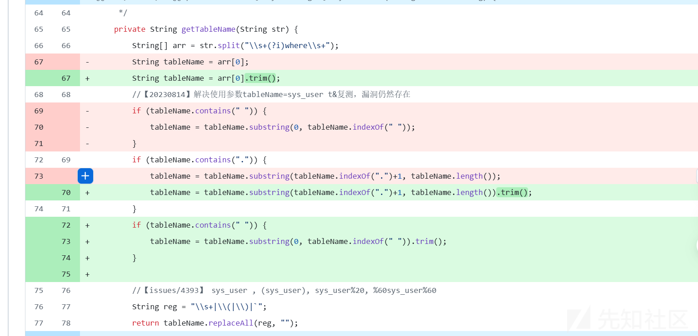

# 总结

在实战中，造成sql注入的原因主要有下面三点

1. sql语句过滤不完全，导致可以进行绕过导致漏洞产生
2. 代码逻辑错误，导致本来可以进行过滤的操作无法产生效果。
3. 对用户的查询操作没有进行权限限制，或者限制不完全，从而导致获取到本不应该获取的数据。
