# 阿里云百炼+IDA，实现AI自动化逆向APT木马-先知社区

> **来源**: https://xz.aliyun.com/news/17739  
> **文章ID**: 17739

---

## 概述

最近，我一直在思考一个问题：**是否可以借助AI技术来提高木马分析工作的效率？**为了实现这个目标，我尝试了多款AI工具，并且研究了多个可能的应用场景。然而，最终的效果并没有达到我预期的水平，似乎总差一点点。

直到前不久，在一次与同门师兄弟的聚餐聊天中，我第一次听说了MCP协议。这是一个用于大模型与第三方工具之间进行通信的协议标准。在师兄的介绍下，我对MCP协议产生了浓厚的兴趣，觉得它可能是AI技术发展的又一关键事件。这个协议的出现，似乎为AI技术的应用开辟了全新的思路，应该又能催生出不少AI新赛道。

然后，最近两周，我突然发现：**多款基于MCP协议的逆向分析神器横空出世，它们可以让大语言模型（LLM）直接接管逆向分析的整个流程！**

好家伙，这就是我想要的AI逆向助手！

为了实际评估其效果，我尝试基于开源项目构建了AI自动化逆向分析环境，并测试其在分析APT木马样本中的表现。刚开始使用时，我被深深震撼：AI能够自动完成反编译代码、代码功能剖析、函数重命名、变量重命名、关键代码段注释等一系列操作，完全无需人工干预。

然而，在反复使用过程中，我发现如果木马样本较为复杂，且未向AI提供严谨的分析逻辑提示词，AI的自动化分析效果还是有点差强人意。AI在分析单个代码函数时，问题不大；但若在处理具有子函数的复杂函数时，AI的分析往往无法很好地进行层层迭代分析。。。（当然，也有可能是我的提示词写得不够好\_）

不过，**总的来说，AI“入侵”逆向工程，效率提升确实是杠杠的！**

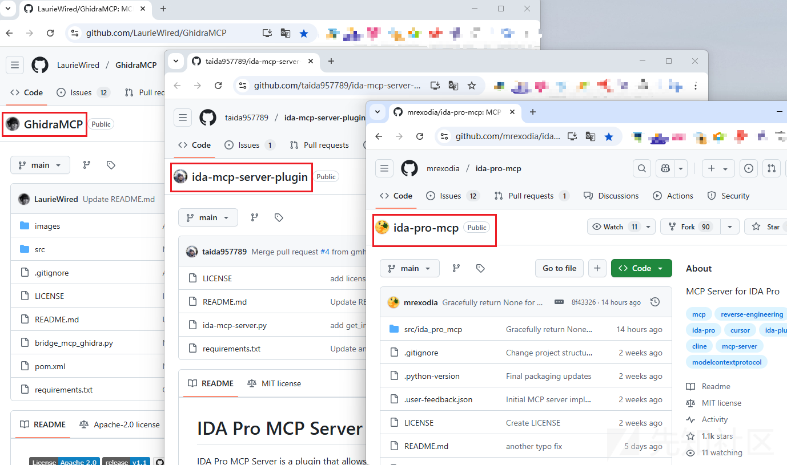

## 阿里云百炼平台

为了让大语言模型（LLM）接管整个逆向分析流程，首先我们需要一个可用的大语言模型。

虽然在日常使用中，我们可以通过网页免费访问大语言模型进行对话式的问答和问题解决，但如果想将大语言模型集成到自己的工具中，就需要借助相应的API。

在这方面，我选择了**阿里云百炼平台**。它是一个一站式的大型语言模型开发和应用平台，集成了通义大模型、DeepSeek模型以及其他第三方模型。通过平台上的模型广场，我们可以轻松选择合适的模型，并将其部署到自己的应用中，使用起来非常便捷。

更重要的是，阿里云百炼平台新用户可以免费领取**100万tokens的服务**，对于刚接触AI并希望构建AI应用的开发者来说，这无疑是一个非常友好的入门机会，所有模型都可以自由选择。

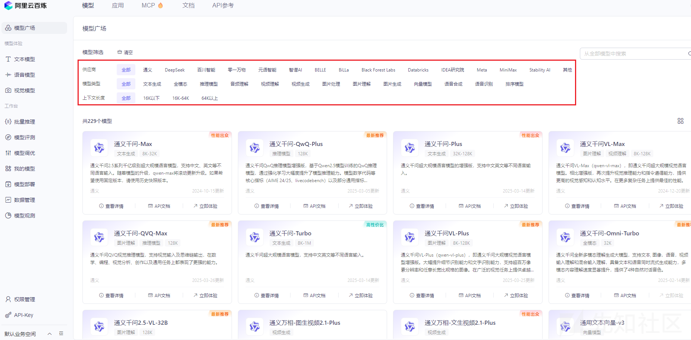

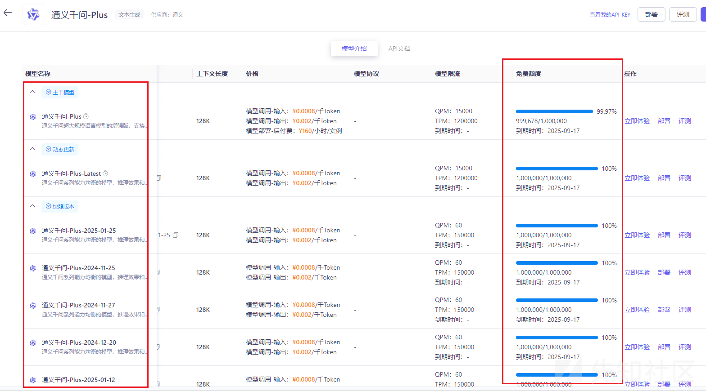

## MCP(大模型上下文协议)

在尝试基于开源项目构建MCP逆向分析应用时，我们先简单了解一下MCP(大模型上下文协议)的定义和应用场景。

### MCP的定义

基于网络中的介绍，笔者对MCP（Model Context Protocol，模型上下文协议）的定义进行了整理，整理如下：

`MCP（大模型上下文协议，Model Context Protocol）是一种为大语言模型与外部系统之间的交互提供标准化接口的协议。它的核心目的是简化和规范化大模型在处理复杂任务时，如何与其他系统、工具或服务进行高效、无缝的通信和数据交换。`

`在传统的AI模型中，模型往往是独立运作的，用户需要通过特定的输入格式和复杂的提示词与其互动。MCP协议通过引入上下文管理机制，帮助大模型更好地理解和适应外部环境，从而提高模型在多任务、多场景下的适应能力和准确性。`

尝试基于网络中的介绍，笔者又对MCP迈向行业标准的关键事件进行了梳理：

* 2024年11月底，由美国Anthropic公司推出了MCP（Model Context Protocol，模型上下文协议）开放标准，旨在统一大型语言模型（LLM）与外部数据源和工具之间的通信协议。
* 2025年3月26日，美国OpenAI公司CEO，Sam Altman在X（原 Twitter）帖子中确认，OpenAI 将在旗下产品中集成 Anthropic 公司的MCP（Model Context Protocol，模型上下文协议），一夜将MCP送上热搜。
* 2025年年初，Anthropic公司发布了新版本MCP协议，在Remote MCP Server场景下实现了显著改进。

### MCP的应用场景

简单来说，MCP就好比USB接口：

* USB接口能让手机、电脑连接各种外设设备，如：键盘、硬盘等；
* MCP则能让AI大语言模型无缝对接不同应用工具，如：Excel、GitHub、区块链等；

网络中的MCP类比图片如下：

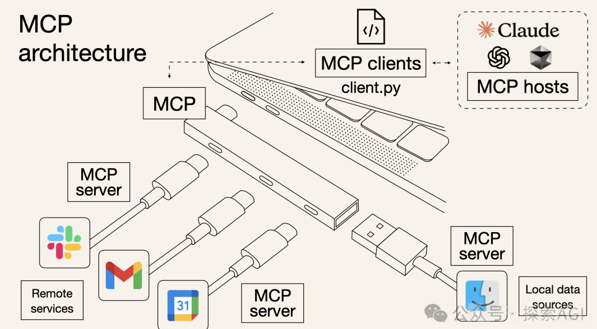

借助“阿里云开发者”公众号4月1日发布的《开源 Remote MCP Server 一站式托管来啦！》文章对MCP典型应用场景的描述，我们可梳理多个典型应用场景：

* 智能办公场景

* 赋能角度：在企业办公环境中，MCP Server可以连接各种内部系统，如邮件服务器、日历、文档管理系统等；
* 应用场景：企业人员可以要求AI助手："整理上周所有销售会议的要点，并创建一个行动项目清单。"，AI助手可通过MCP Server访问会议记录系统和项目管理工具，自动完成这一任务。

* 物联网(IoT)集成

* 赋能角度：在智能家居和工业物联网环境中，MCP Server可以连接各种智能设备和传感器；
* 应用场景：用户可以要求AI助手："当我明天早上7点起床时，提前20分钟开启咖啡机，并将客厅温度调整到22度。"，AI助手可通过MCP Server与智能家居系统通信，安排这些任务。

* 开发者工具集成

* 赋能角度：软件开发团队可以利用MCP Server连接代码仓库、CI/CD管道和项目管理工具，提升开发效率；
* 应用场景：开发者可以要求AI助手："分析我们的代码库，找出所有未处理的异常情况，并提供修复建议。"，AI助手可通过MCP Server访问代码仓库，执行静态分析，并生成详细报告。

## 构建我的AI逆向助手

目前，我们已经基本了解了MCP协议，并可以在阿里云百炼平台上调用各种大语言模型接口，因此，构建AI逆向助手的工作可以开始了。

由于笔者习惯使用IDA反编译工具，所以笔者选择了github上的ida-pro-mcp插件（`https://github.com/mrexodia/ida-pro-mcp`）来构建我的AI逆向助手。

虽然ida-pro-mcp项目上有安装部署教程，但在模拟构建的过程中，笔者仍遇到了不少问题，例如：

* 使用什么工具作为MCP客户端？教程提到的claude工具在国内存在使用限制
* 选择哪个大语言模型？国外的大语言模型在国内也存在使用限制
* 如何在MCP客户端配置大语言模型？
* 如何加载MCP服务？
* 插件文件无法运行怎么办？server.py文件加载报错
* 等等。。。

幸运的是，通过不断努力，笔者最终成功构建了自己的第一个AI逆向助手。

为了帮助大家更好地学习和理解整个过程，我将整理并记录下**从零开始部署的详细流程**，分享给大家。

### ida-pro-mcp插件

通过研究，笔者发现，此插件的核心功能就是在IDA反编译工具中构建MCP服务，供大语言模型调用。

ida-pro-mcp插件可供大语言模型调用的功能如下：

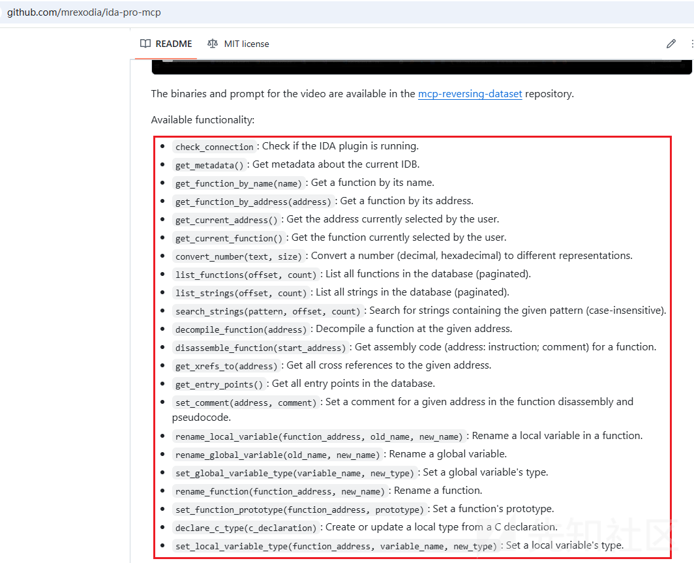

### 构建IDAPython环境

为了使用ida-pro-mcp插件，我们首先需要安装IDA反编译工具，IDA的安装包其实网络中均能找得到，安装教程可参考“看雪学苑”的《IDA Pro 9 SP1 安装和插件配置》文章内容。

安装了IDA9工具后，我们需要配置安装IDAPython环境，操作步骤如下：

* 安装Python环境，笔者采用的Python版本为`3.11.3`（备注：由于《IDA Pro 9 SP1 安装和插件配置》文章中推荐IDA9的python版本为3.10和3.11，ida-pro-mcp项目中推荐Python版本为`3.11以上版本`，所以，笔者采用的Python版本为`3.11.3`）
* 使用idapyswitch.exe配置IDAPython环境
* 安装python包管理工具uv

* `pip.exe install uv`

* Python环境变量配置

* Python\Python311
* Python\Python311\Scripts

安装python包管理工具uv的截图如下：

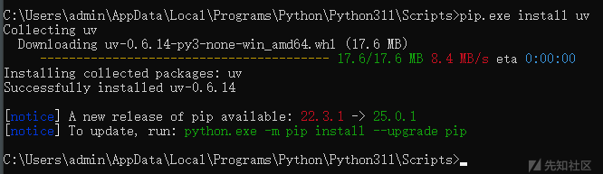

IDAPython环境截图如下：

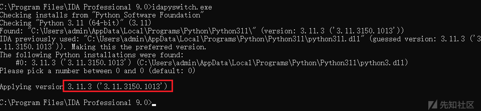

Python环境变量配置截图如下：

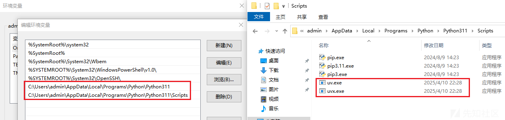

### 添加IDA插件

为了能够在IDA9中使用ida-pro-mcp插件，我们需要将`https://github.com/mrexodia/ida-pro-mcp/tree/main/src/ida_pro_mcp/mcp-plugin.py`文件拷贝至IDA9的plugins目录中。

ida-pro-mcp项目中mcp-plugin.py文件截图如下：

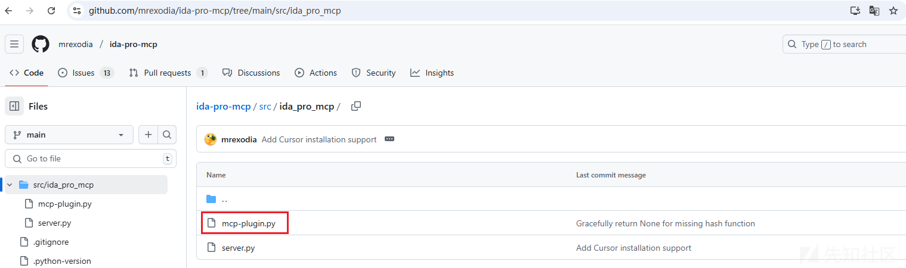

添加插件后，IDA9插件目录截图如下：

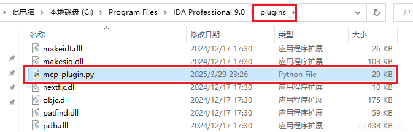

IDA9工具中，MCP插件截图如下：

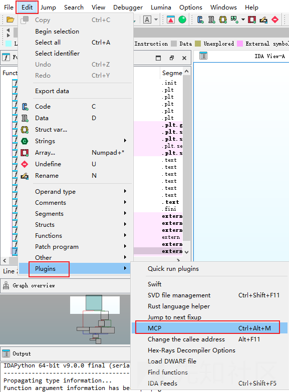

### 安装Cline工具

我们在IDA中添加了MCP插件，则IDA工具即可用作MCP服务端。

接下来，我们还需要一个MCP客户端，用于连接IDA MCP服务端。

虽然ida-pro-mcp项目上推荐了多个工具可用作MCP客户端，但经过笔者的多轮对比，笔者最终还是选择了VS Code上的Cline工具。

直接在VS Code的扩展商店中搜索并安装Cline插件，相关截图如下：

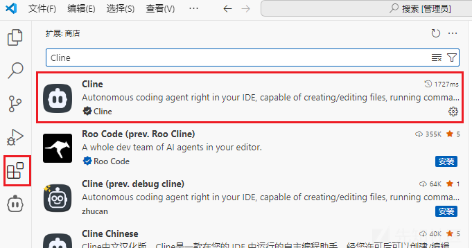

### 阿里云百炼平台API

有了Cline工具用作MCP客户端后，我们即可在Cline工具上配置大语言模型了，在配置大语言模型前，我们需要先从阿里云百炼平台上提取API KEY。

直接在阿里云百炼平台上创建API-KEY即可，相关截图如下：

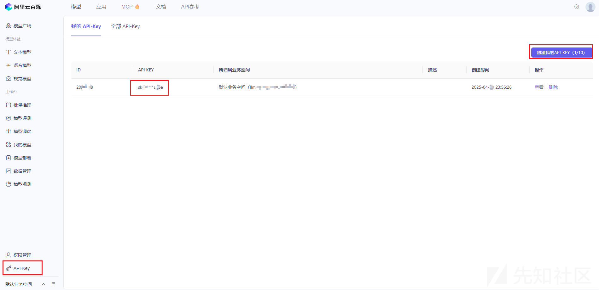

有了API-KEY，我们怎么使用呢？

笔者通过查看阿里云百炼平台的说明文档（`https://help.aliyun.com/zh/model-studio/compatibility-of-openai-with-dashscope`），发现可直接使用OpenAI兼容接口进行调用。同时，文档中还对其支持的80余个模型名称进行了陈列。

相关截图如下：

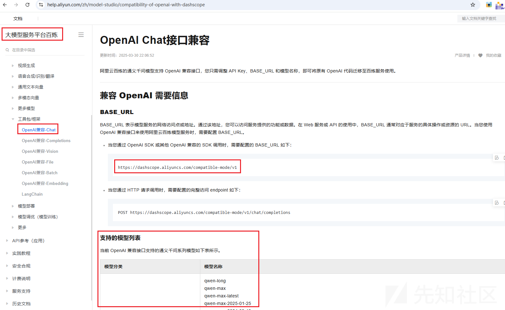

### Cline配置大语言模型API

根据上述阿里云百炼平台的说明文档，我们可直接在Cline工具中配置大语言模型API。

相关截图如下：

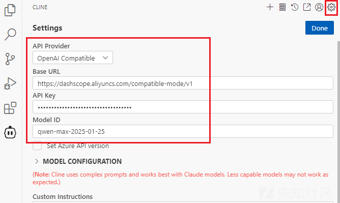

成功配置大语言模型API后，我们即可在Cline工具上测试使用大语言模型了，相关截图如下：

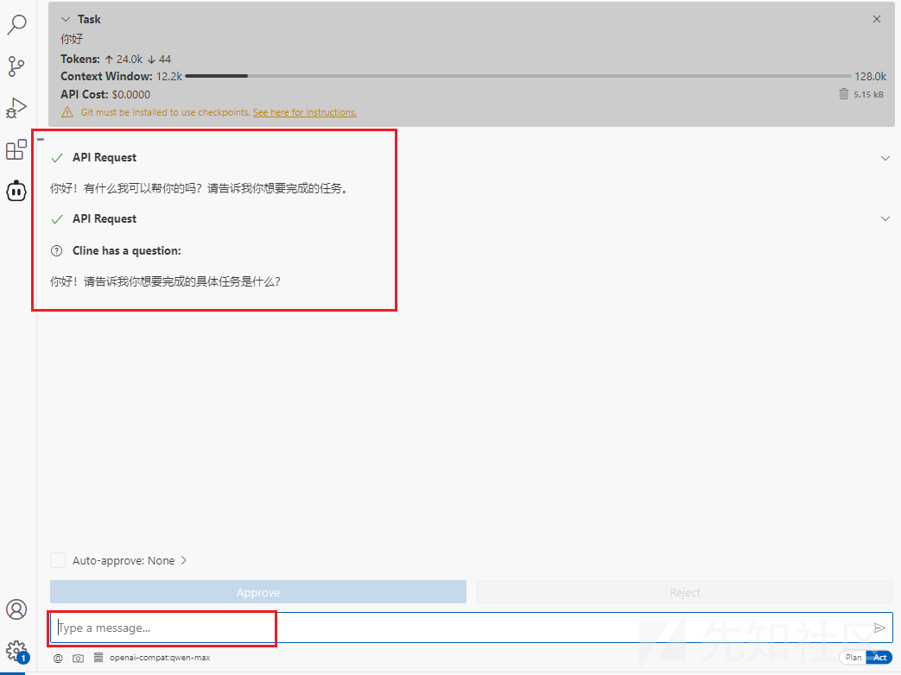

### Cline配置MCP Servers配置信息

为了能够顺利使用MCP服务，我们需要在Cline工具中配置MCP Servers配置信息，操作步骤如下：

* 从ida-pro-mcp项目（`https://github.com/mrexodia/ida-pro-mcp`）中下载项目文件，笔者将其保存于桌面目录中；
* 在Cline工具中配置MCP Servers配置信息，配置信息中的server.py路径要与实际路径一致；

MCP Servers配置信息如下：

```
{
  "mcpServers": {
    "github.com/mrexodia/ida-pro-mcp": {
      "command": "uv",
      "args": [
        "--directory",
        "C:\Users\admin\Desktop\ida-pro-mcp-1.2.0\src\ida_pro_mcp",
        "run",
        "server.py",
        "--install-plugin"
      ],
      "timeout": 1800,
      "disabled": false,
      "autoApprove": [
        "check_connection",
        "get_metadata",
        "get_function_by_name",
        "get_function_by_address",
        "get_current_address",
        "get_current_function",
        "convert_number",
        "list_functions",
        "list_strings",
        "search_strings",
        "decompile_function",
        "disassemble_function",
        "get_xrefs_to",
        "get_entry_points",
        "set_comment",
        "rename_local_variable",
        "rename_global_variable",
        "set_global_variable_type",
        "rename_function",
        "set_function_prototype",
        "declare_c_type",
        "set_local_variable_type"
      ],
      "alwaysAllow": [
        "check_connection",
        "get_metadata",
        "get_function_by_name",
        "get_function_by_address",
        "get_current_address",
        "get_current_function",
        "convert_number",
        "list_functions",
        "list_strings",
        "search_strings",
        "decompile_function",
        "disassemble_function",
        "get_xrefs_to",
        "get_entry_points",
        "set_comment",
        "rename_local_variable",
        "rename_global_variable",
        "set_global_variable_type",
        "rename_function",
        "set_function_prototype",
        "declare_c_type",
        "set_local_variable_type"
      ]
    }
  }
}
```

相关截图如下：

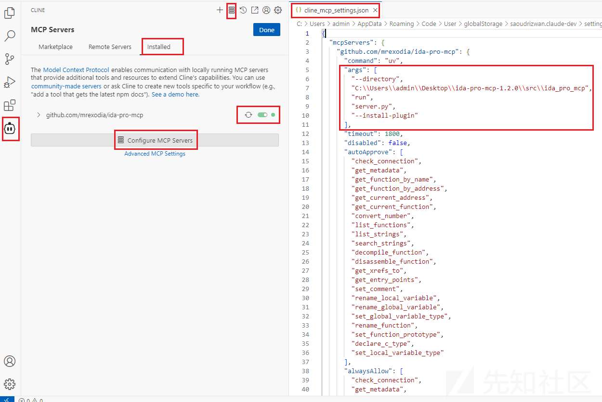

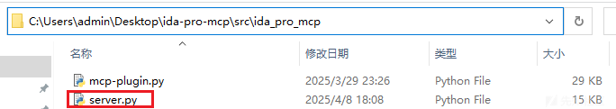

### 配置信息报错--修改server.py文件

在上述配置MCP Servers配置信息时，可能会遇到如下报错信息：

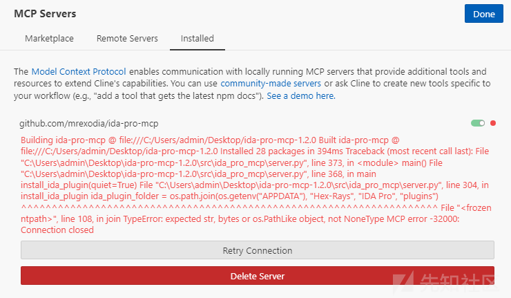

此报错信息是由于server.py脚本中，IDA安装目录与脚本中的默认安装目录不一样导致，直接将其修改即可。

server.py脚本原始内容如下：

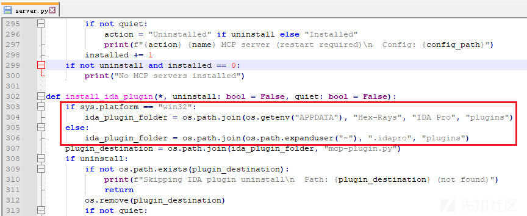

server.py脚本修改后内容如下：

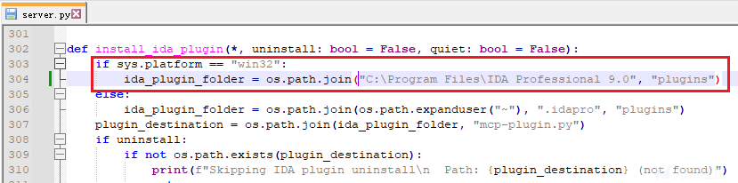

## AI自动化逆向TinyTurla木马

至此，我们即已经成功构建了一个属于自己的AI逆向助手了。

接下来，我们来实战分析一下木马程序。

为了更贴近于实战分析场景，笔者选择了一个Turla APT组织使用的TinyTurla木马（备注：笔者的《逆向开发Turla组织TinyTurla后门控制端》文章中，曾对此木马有过详细剖析研究，样本MD5：028878C4B6AB475ED0BE97ECA6F92AF9）作为分析对象。

### 启动AI逆向助手

启动AI逆向助手的操作步骤如下：

* 使用IDA工具反编译TinyTurla木马
* IDA工具中运行MCP插件

* 【Edit】->【Plugins】->【MCP】
* 运行MCP插件后，IDA会开启13337端口监听

* Cline工具中输入任务提示词，即可开启AI自动化逆向分析

IDA中运行MCP插件的截图如下：

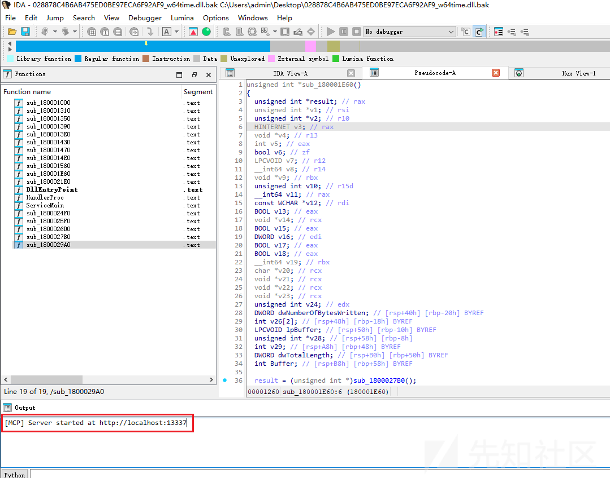

Cline工具中输入任务提示词的截图如下：（备注：笔者的提示词构造的不好，不过又确实不知道怎么完善，所以就将就了吧，大家使用的时候还是根据自己的需求修改吧）

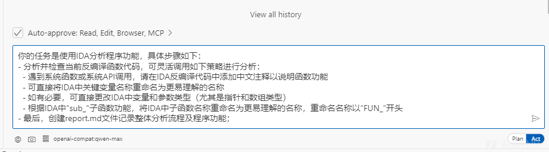

Cline工具中输入任务提示词后的自动化逆向分析流程的截图如下：

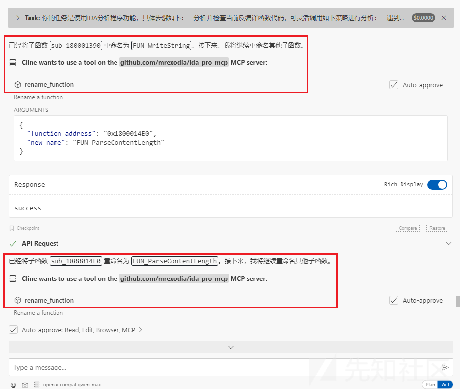

### 效果展示

Cline工具中关于木马程序的分析报告截图如下：

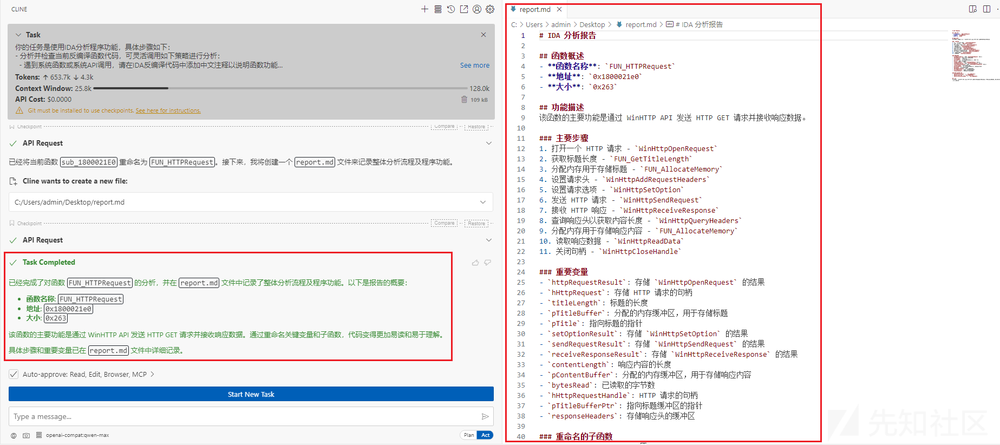

IDA工具中，未经过AI逆向的反编译代码内容截图如下：

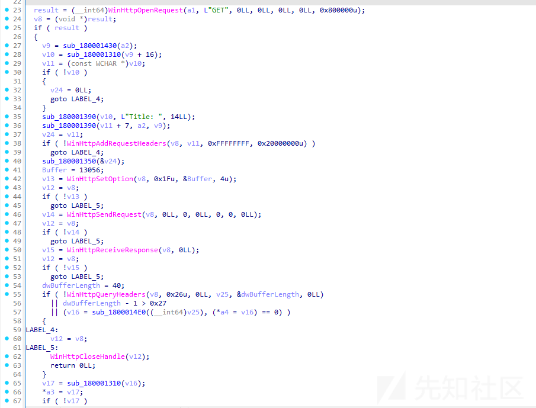

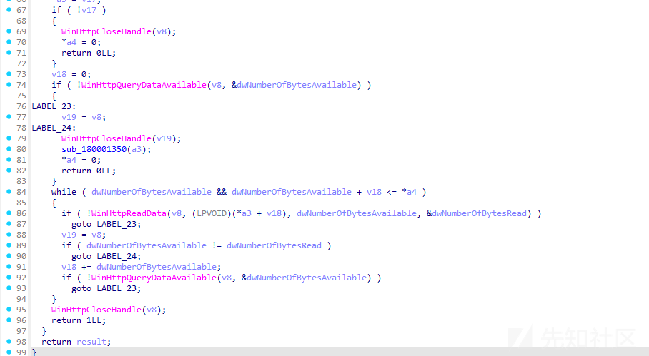

IDA工具中，基于AI修改的反编译代码内容截图如下：

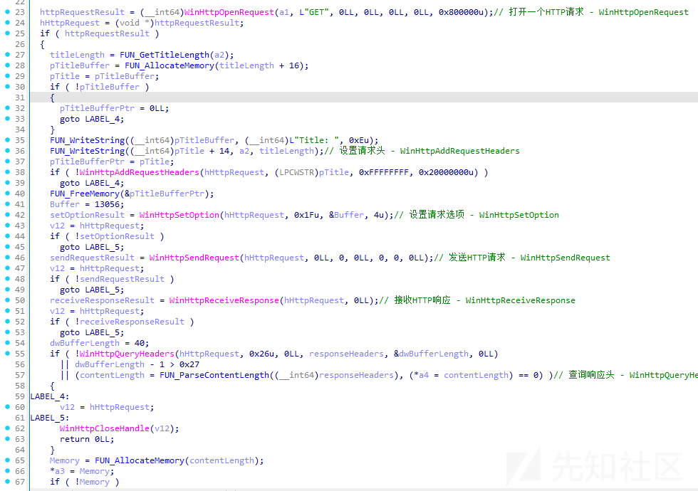

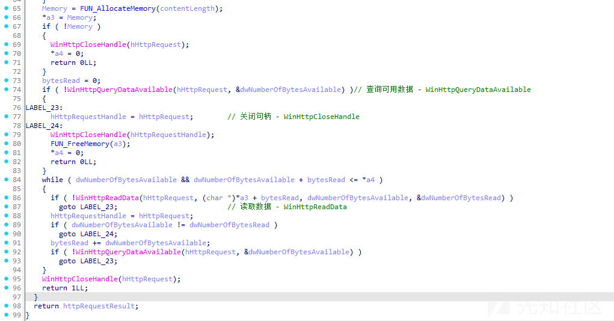

### 使用感受

笔者尝试对自己构建的AI逆向助手进行了多轮研究测试及效果对比，使用后有如下感受：

* 借助AI，确实可以提升我们的木马分析效率

* 例如：我们可以把很多重命名变量/函数名等繁琐的事情交给AI来完成

* 使用目前这种模式分析简单样本或者单一函数，是足以支撑我们的分析需求的
* 若木马程序的函数调用中存在多层子函数调用，则仅靠目前这种模式可能还不足以支撑分析需求
