# Vite任意文件读取bypass调试分析（CVE-2025-32395）-先知社区

> **来源**: https://xz.aliyun.com/news/17745  
> **文章ID**: 17745

---

# Vite任意文件读取（CVE-2025-32395）

## 漏洞描述

在 Vite 中发现一个缺陷。此漏洞允许通过特制的 HTTP 请求（在请求 URL 中包含 # 字符）访问任意文件。当服务器在 Node.js 或 Bun 上运行并暴露在网络上时，会出现此问题。对无效请求行的不当处理使这些请求能够绕过限制文件访问的安全检查。

参考：<https://access.redhat.com/security/cve/cve-2025-32395>

漏洞影响版本。

* 6.2.0 <= Vite <= 6.2.5
* 6.1.0 <= Vite <= 6.1.4
* 6.0.0 <= Vite <= 6.0.14
* 5.0.0 <= Vite <= 5.4.17
* Vite <= 4.5.12

## 环境搭建

github 下载官方源文件，webstorm 配置如下

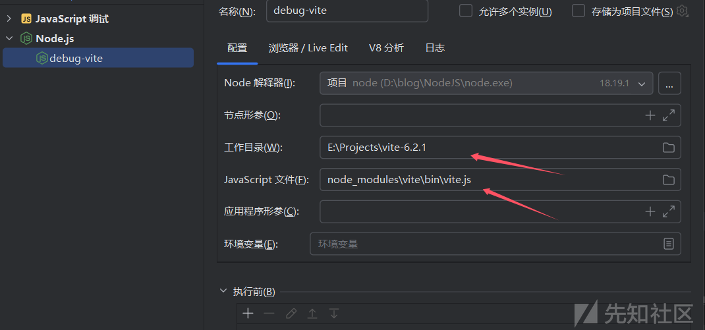

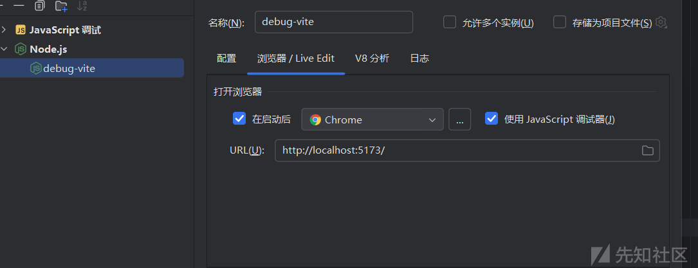

## 漏洞复现

因为我是 windows 环境，看看访问 `@fs/tmp` 得返回请求

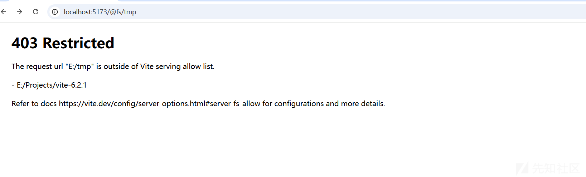

看到实际请求是访问的 E:/tmp，所以访问/tmp/flag.txt 其实就是访问得 `E:/tmp/flag.txt` 文件，在 E 盘下创建该文件，

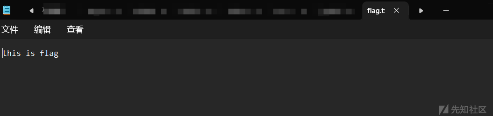

任意文件读取 payload，

```
curl --request-target /@fs/Projects/vite-6.2.1/#/../../../../../tmp/flag.txt http://localhost:5173/
```

成功读取文件，

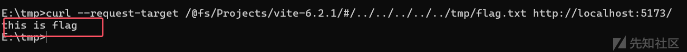

## 漏洞分析

### vite 请求处理流程调试

先直接访问 `@fs/tmp` 目录看看，从 `viteServePublicMiddleware` 函数开始看吧，这是一个处理请求的中间件函数，根据请求判断接下来的函数调用，因为这里请求为 `@fs/tmp`，满足第一个条件会进入 `next()` 也就是调用下一个中间件进行处理

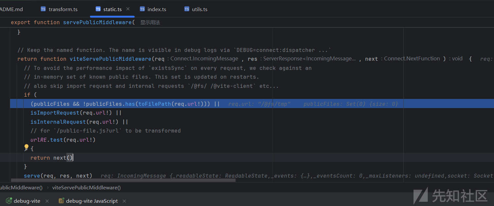

来到了 `viteTransformMiddleware` 函数，前面就是一些简单的判读处理，比如看是否是 GET 请求，是否以 `.map` 结尾等等，这里就不细看了

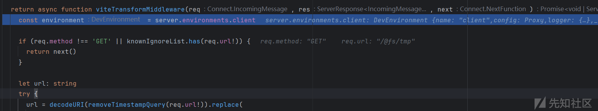

接着在该函数后段部分会对 url 进行一个这样的判断，

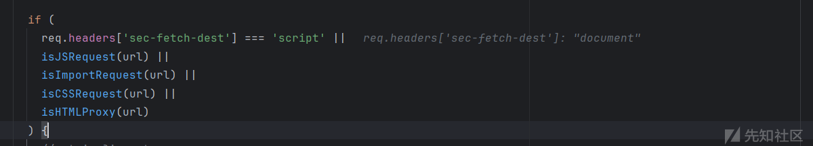

GPT 解释如下，在前面 CVE-2025-30208 以及 bypass 版的 CVE-2025-31125 都在这里进行了绕过，通过 url 中添加 `?import` 或者读无后缀文件使得 `isJSRequest` 为 true，让其满足 if 条件从而不用进入后续的 `ensureServingAccess` 方法，

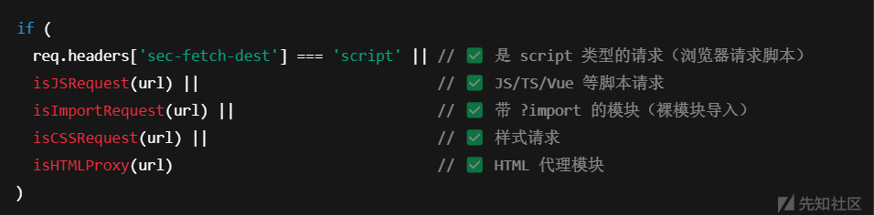

这里肯定都不满足会进入 else 分支直接调用下一个中间件函数处理 `viteServeRawFsMiddleware`，然后在这个中间件函数中接着调用了 `ensureServingAccess` 方法，该方法是处理 HTTP 请求的，如果文件不被允许访问，则返回 403，

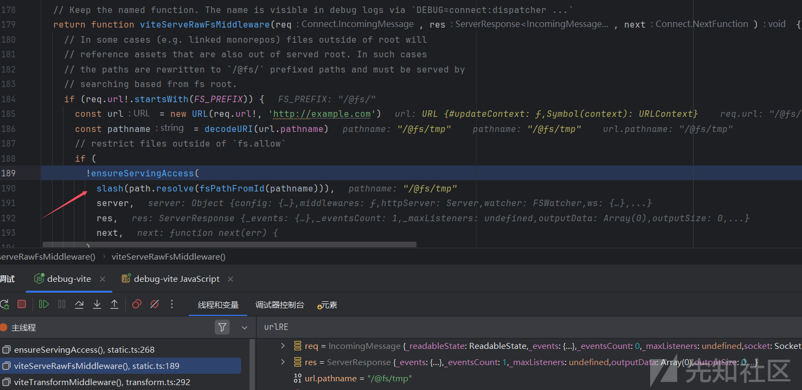

跟进 `ensureServingAccess` 方法，看到会先调用 `isFileServingAllowed` 判断断 URL 是否允许被 Vite 服务器访问。

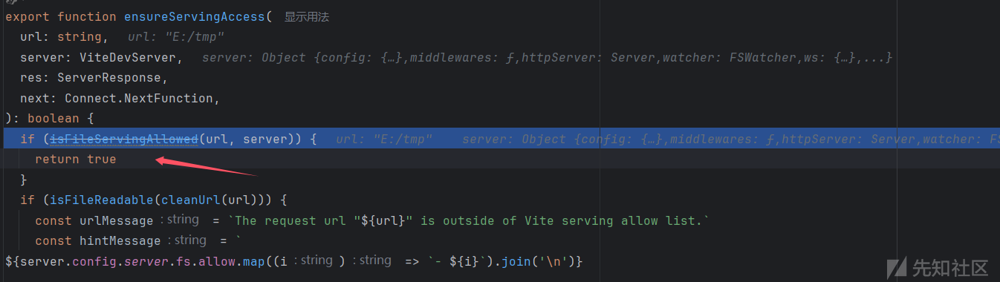

那么我们跟进 `isFileServingAllowed` 函数，其执行了 `isFileLoadingAllowed` 函数检查文件路径是否符合 Vite 的文件访问规则。

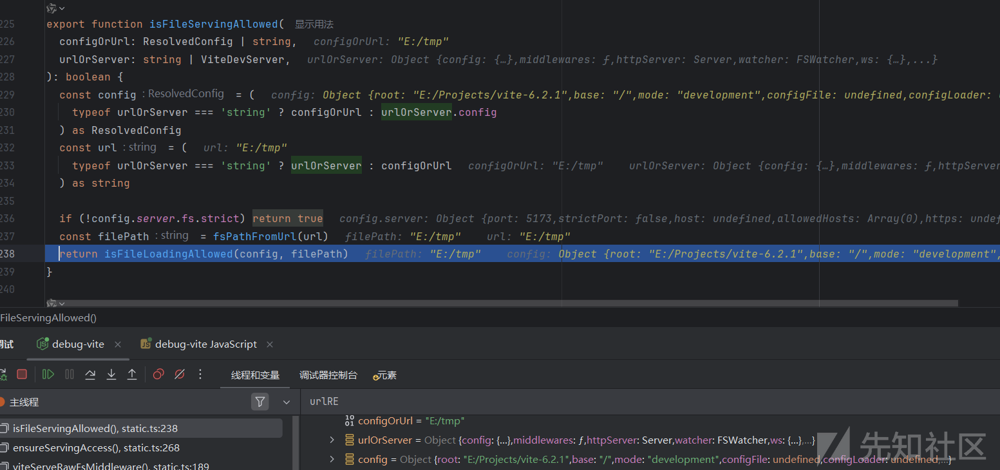

还是简单跟进看看吧，存在几个条件判断，只有返回 true 才能允许访问，比如看最后一个判断

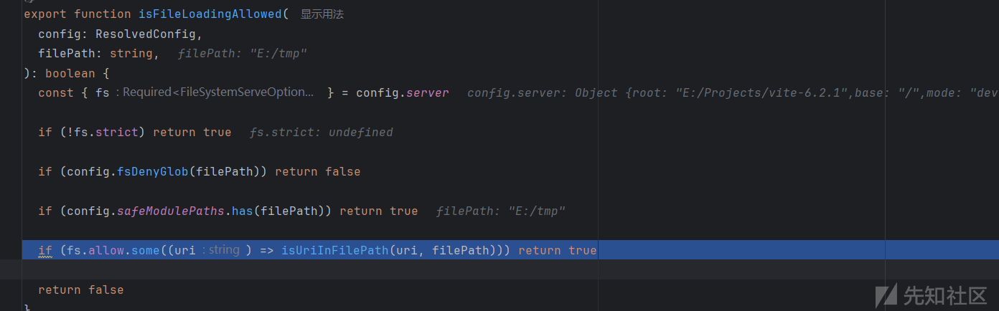

跟进一下这个 `isUriInFilePath` 方法，会判断我们访问的路径是不是 `E:/Projects/vite-6.2.1` 目录下文件，

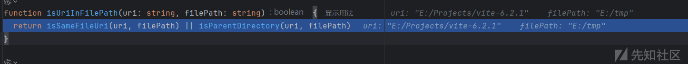

最后返回 false，所以回到 ensureServingAccess 方法后会进入下一个 if，最后返回 403，

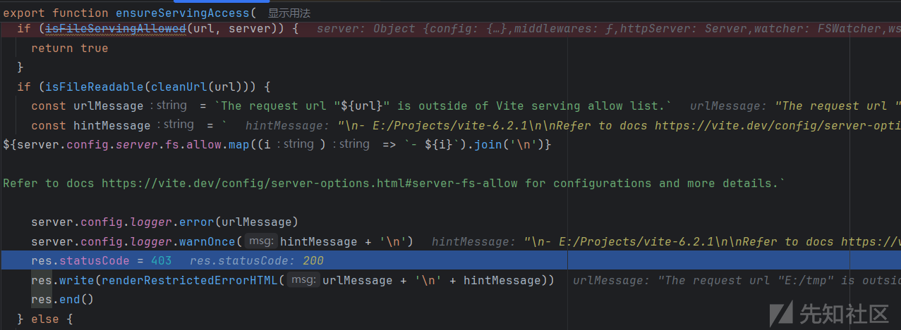

浏览器返回如下，

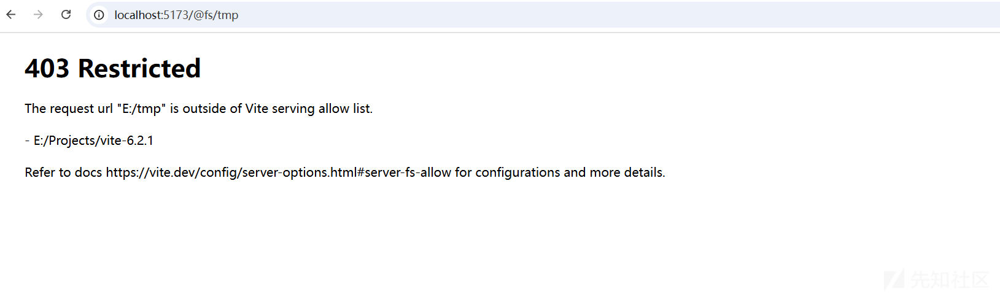

### 漏洞绕过

这个 payload 和前面几个 cve 不一样，主要是为了绕过 `ensureServingAccess` 方法，简单调试分析一下，直接定位到这几个判断的地方

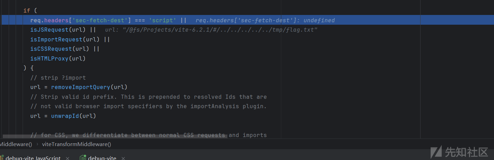

不满足条件，所以还是来到 `viteServeRawFsMiddleware` 函数，注意到这里的 new URL，其会把 `#` 后面的内容当作注释，从而返回的 url 只有 `/@fs/Projects/vite-6.2.1/`

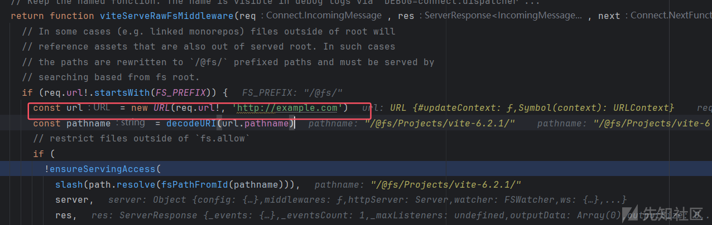

然后跟进到 `ensureServingAccess` 方法中，进入 `isFileServingAllowed`，最后再进入到 `isFileLoadingAllowed` 方法

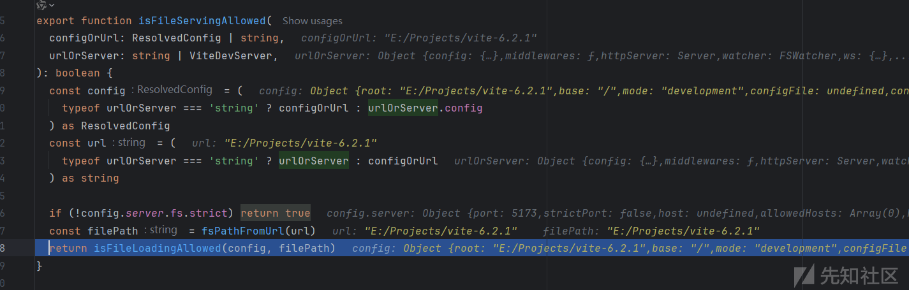

再最后一个判断条件会返回 true，上面的处理流程中也分析过了。

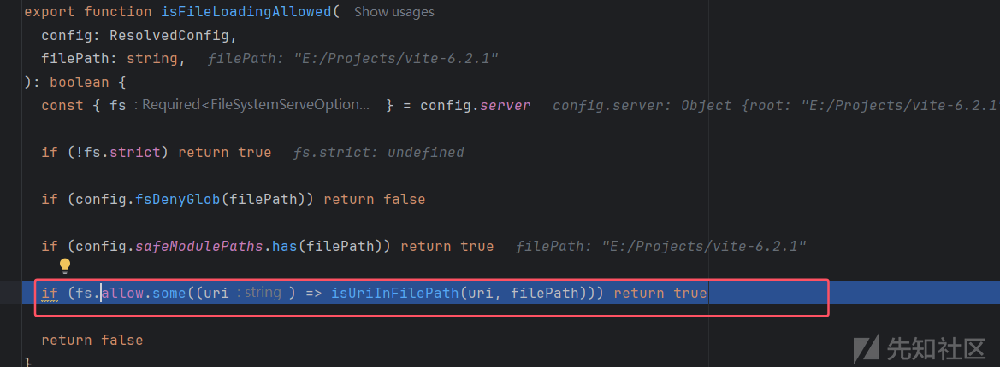

最后绕过 `ensureServingAccess` 方法，同样也返回 true，

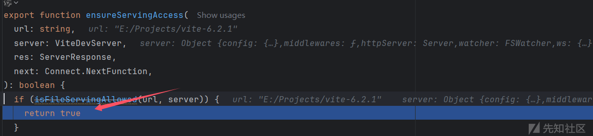

目录验证后，后续的处理逻辑却又是使用我们原始的url进行处理，最后像正常读取 `/@fs/` 允许目录下的文件一样进行读取，通过目录穿越访问到任意文件

## 漏洞修补

查看：<https://github.com/vitejs/vite/commit/3bb0883d22d59cfd901ff18f338e8b4bf11395f7>

多了段这样的代码，调用了 `rejectInvalidRequestMiddleware()`

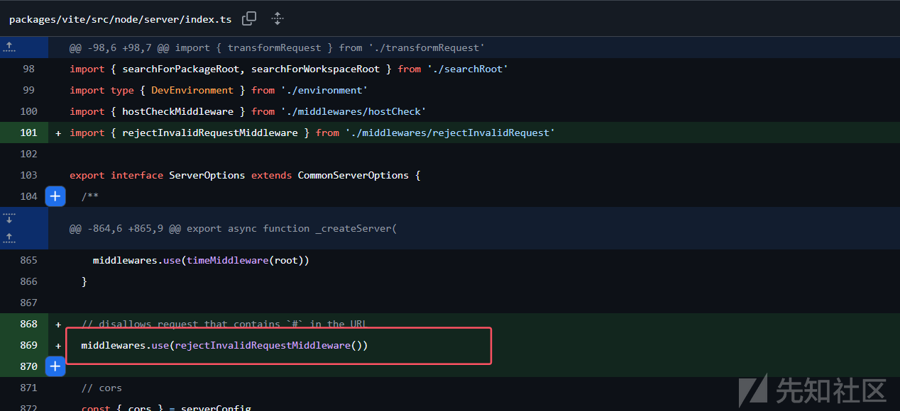

这个方法不允许 url 中存在 `#`，不然直接抛出 400

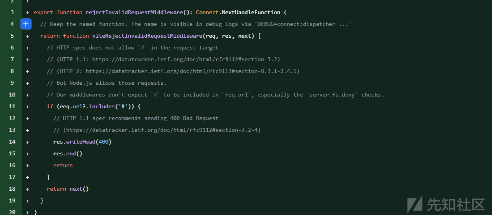

## 总结

一个非常巧妙的绕过手法，虽然和 CVE-2025-31486 有点像，但是分析了一下 CVE-2025-31486 的 paylaod，其还是有 `?import`，还是会进入到 if 中，而这里我调试访问了 `/@fs/Projects/vite-6.2.1/netlify.toml` 文件发现调用流程都和上面 payload 一样，准确说 payload 通过一个 `#` 实现了目录穿越。

参考：<https://mp.weixin.qq.com/s/HMhzXqSplWa-IwpftxwTiA>
